# 区块链扩容

区块链的可扩展性是指在保持安全性、速度和去中心化的同时，扩大网络的交易处理能力。克服这一挑战至关重要，因为大多数现有区块链网络在交易吞吐量方面都存在局限性。

有多种方法可以实现区块链扩容，包括：

- `隔离见证`（`SegWit`）：此协议升级将签名数据与交易数据分离，从而增加了区块链网络的容量。
- `分片`：通过分片，区块链网络被划分为称为分片的更小子集，从而实现独立的交易处理并提升整体网络容量。
- `二层解决方案`：这些解决方案建立在现有区块链网络之上，以提高交易吞吐量，而无需更改底层区块链协议。例如`闪电网络`和`Plasma`。
- `PoS`：这是传统`PoW`的一种替代共识机制，被大多数区块链网络使用。`PoS`减少了挖矿所需的计算能力，从而提高了交易吞吐量。
- `链下交易`：这些交易发生在区块链网络之外，从而减轻了网络负载并提高了交易吞吐量。
- `侧链`：侧链是连接到主区块链的独立区块链网络。它们通过独立处理交易，然后在主区块链上结算，来提高交易吞吐量。

### 扩容中的问题

区块链扩容是一个复杂且持续的挑战，涉及解决技术性和非技术性问题。以下是一些关键问题：

- **去中心化**：在扩容网络的同时保持去中心化至关重要，因为为了提高交易吞吐量而将网络中心化可能会损害安全性和信任。
- **安全性**：扩容区块链网络可能会引入安全风险，因为更大的网络更容易受到攻击。在容量扩展期间维持网络安全至关重要。
- **互操作性**：随着多个区块链网络的出现，确保它们之间的互操作性非常重要。互操作性为区块链网络扩容提供了机会，但需要不同网络之间的协调。
- **治理**：治理对于区块链网络的成功起着关键作用，并且随着网络规模扩大而变得更加复杂。建立清晰的治理结构可确保网络的安全性、去中心化和高效性。
- **能源消耗**：区块链网络在交易验证和区块创建过程中消耗大量计算能力。扩容网络可能导致能源消耗增加，从长远来看是不可持续的。
- **采用率**：采用率对于区块链网络至关重要，而扩容可能会带来采用障碍。随着网络的扩展，新用户的使用会变得更加复杂和具有挑战性。
- **法规**：不同司法管辖区对区块链技术有不同的法规，这可能会阻碍扩容工作。实施清晰的监管框架对于网络的合法和高效运行至关重要。

解决这些问题需要区块链开发者、行业领导者和监管者之间的合作，以确保区块链技术的长期可行性和成功。

### 1.13.2 链下计算

链下计算是指使用独立的计算资源或基础设施，在区块链网络之外进行计算。其优势包括减轻区块链网络的负载、提高交易吞吐量以及降低交易费用。

在区块链中，有几种技术可促进链下计算：

区块链中的链下计算能带来更高的交易吞吐量、更低的交易费用以及更好的可扩展性等优势。然而，它也在安全性、互操作性和治理方面带来了挑战。在链上计算和链下计算之间取得平衡，对于确保区块链技术的长期可行性和成功至关重要。

- **状态通道**：状态通道是一种链下支付通道，允许双方之间进行多笔交易而无需在区块链上记录。它通过支持直接交易来提高交易吞吐量并降低费用。
- **侧链**：侧链是与主区块链相连的独立区块链网络。它们为开发者提供了一个空间，在不损害主网络安全或性能的前提下，试验新特性和功能。
- **Plasma**：`Plasma` 是一个通过使用侧链的树状结构来创建可扩展区块链网络的框架。`Plasma` 允许开发者创建可独立于主网络处理交易的自定义侧链，从而实现链下计算。
- **可信执行环境（TEE）**：`TEE` 是一种安全计算环境，能够独立于系统其余部分运行代码。`TEE` 可用于安全且高效地执行链下计算。

区块链中的链下计算能带来更高的交易吞吐量、更低的交易费用以及更好的可扩展性等优势。然而，它也在安全性、互操作性和治理方面带来了挑战。在链上计算和链下计算之间取得平衡，对于确保区块链技术的长期可行性和成功至关重要。

### 1.13.3 区块链分片

分片是一种用于扩展区块链网络的技术，它通过将网络划分为称为分片的更小子集来实现。每个分片独立运行并处理自己的交易，从而提高了整体交易吞吐量。分片通过在各个分片之间分配交易负载来解决可扩展性问题。

实施分片涉及对网络进行分区，并根据特定标准将交易分配给特定分片。分片之间的协调对于维护网络安全性和去中心化至关重要。需要通信和同步机制来确保视图的一致性并在分片间传播更改。

尽管分片带来了好处，但也引入了挑战。由于每个分片独立运行，安全性和一致性可能更难维护。分片之间不同的规则和规定可能会导致治理和互操作性问题。

分片是一种有前途的区块链网络扩展方法，但它需要周密的规划与执行。

## 1.14 区块链 DApp 与用例

区块链 DApp 是运行在区块链网络上的应用程序，通常使用智能合约来执行代码并在网络上执行操作。DApp 是去中心化的，意味着它们不受中心化机构或组织的控制，并且是透明的，意味着它们的代码和数据是公开可见且可审计的。

区块链 DApp 有多种用例，包括以下几种：

区块链 DApp 有潜力变革广泛的行业和应用，提供更高的安全性、透明度和效率。然而，在区块链网络上开发和部署 DApp 可能复杂且具有挑战性，需要专门的技能和专业知识。随着技术的不断发展，我们未来很可能会看到更多创新的区块链 DApp 用例。

- **金融应用**：区块链 DApp 可用于广泛的金融应用，例如支付系统、汇款、借贷平台和资产代币化。
- **供应链管理**：区块链 DApp 可用于跟踪和管理供应链，在商品和产品的流转中提供更高的透明度和问责制。
- **身份验证**：区块链 DApp 可用于身份验证和认证，创建一个安全且去中心化的系统来管理个人数据和凭证。
- **投票系统**：区块链 DApp 可用于安全透明的投票系统，确保选票被准确记录和统计。
- **游戏与娱乐**：区块链 DApp 可用于游戏和娱乐应用，例如游戏内物品和虚拟资产的去中心化市场。
- **医疗保健**：区块链 DApp 可用于管理医疗数据和记录，提供一个安全且透明的系统来存储和共享敏感医疗信息。

区块链 DApp 有潜力变革广泛的行业和应用，提供更高的安全性、透明度和效率。然而，在区块链网络上开发和部署 DApp 可能复杂且具有挑战性，需要专门的技能和专业知识。随着技术的不断发展，我们未来很可能会看到更多创新的区块链 DApp 用例。

## 1.15 实验工作

本节介绍了使用 Python 实现区块链基本概念的内容。

### 1.15.1 用 Python 实现区块链的程序

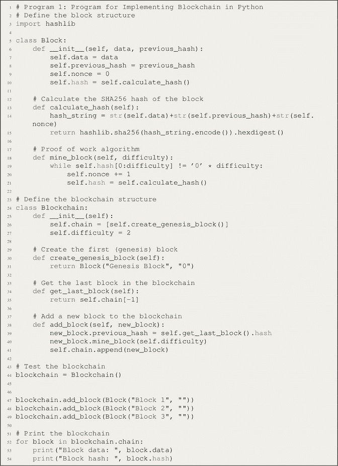

**示例输出**

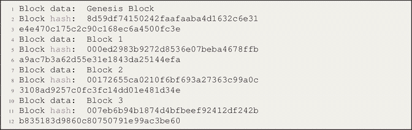

**代码解释**

1. 定义了一个 `Block` 类来表示区块链中的一个区块。每个区块具有以下属性：
   - `data`：区块包含的数据或负载。
   - `previous_hash`：区块链中前一个区块的哈希值。
   - `nonce`：在挖矿过程中递增的一个值。
   - `hash`：当前区块的哈希值。

2. `Block` 类中的 `calculate_hash` 方法用于计算一个区块的 SHA256 哈希值。它将 `data`、`previous_hash` 和 `nonce` 连接起来，然后使用 SHA256 算法对结果字符串进行编码和哈希计算。

3. `mine_block` 方法实现了一个简单的工作量证明（PoW）算法。它递增 `nonce` 值并重新计算哈希值，直到区块的哈希值满足难度要求。难度要求定义为哈希值中一定数量的前导零。

4. 定义了 `Blockchain` 类来表示整个区块链。它具有以下属性：
   - `chain`：一个列表，用于保存区块链中的所有区块。
   - `difficulty`：挖矿新区块的难度级别；它指定了区块哈希值中所需的前导零数量。

5. `create_genesis_block` 方法创建区块链中的第一个区块，通常称为创世区块。这是一个没有前一个哈希值的特殊区块。

6. `get_last_block` 方法返回区块链中的最后一个区块。

7. `add_block` 方法用于向区块链中添加一个新区块。它接收 `new_block` 作为输入，将新区块的前一个哈希值设置为链中最后一个区块的哈希值，然后通过调用 `mine_block` 启动挖矿过程。

8. 创建了一个名为 `blockchain` 的 `Blockchain` 实例。

9. 使用 `add_block` 方法向区块链中添加了三个区块，每个区块都有自己的数据。

10. 最后，通过遍历链中的每个区块并显示区块的数据和哈希值，打印出区块链的内容。

### 1.15.2 挖掘新区块并打印的区块链程序

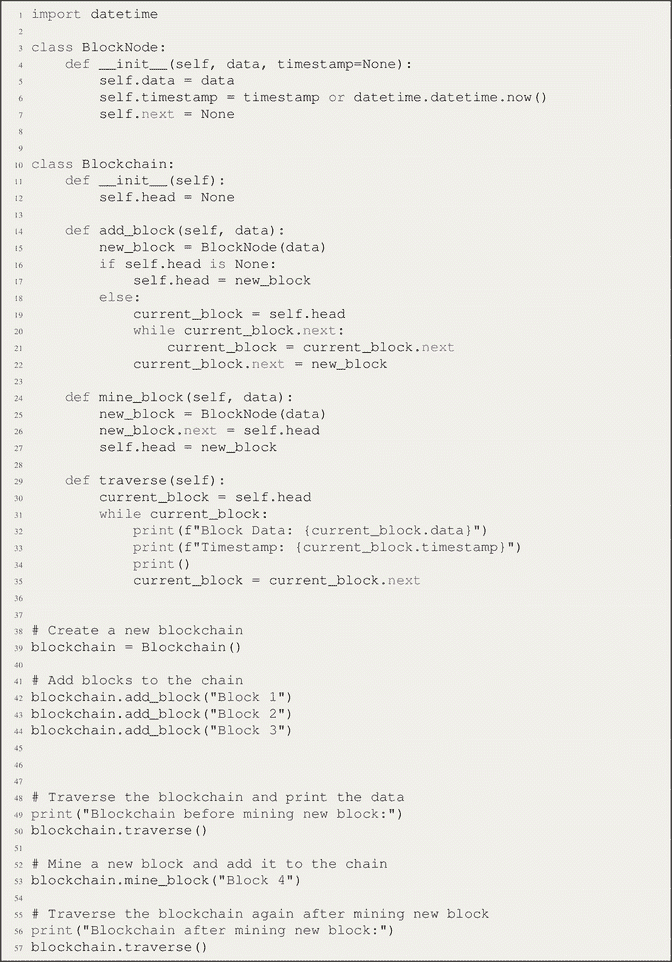

**示例输出**

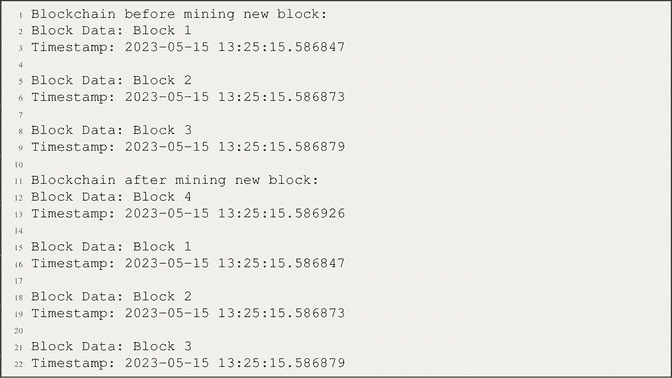

**代码解释**

以下代码使用链表数据结构实现了一个基本区块链。它定义了两个类：`BlockNode` 和 `Blockchain`。

`BlockNode` 类表示区块链中的一个区块。它具有三个属性：

- `data`：区块中存储的数据。
- `timestamp`：区块创建的时间戳，默认为当前日期和时间。
- `next`：指向链中下一个区块的引用。

`Blockchain` 类表示整个区块链，并具有以下方法：

- `__init__()`：构造函数通过将 `head` 属性设置为 `None` 来初始化一个空区块链。
- `add_block(data)`：此方法向区块链添加一个新区块。它使用给定的数据创建一个新的 `BlockNode` 对象。如果区块链为空（即 `self.head` 为 `None`），则新区块成为链头。否则，它使用 `next` 指针遍历到最后一个区块，并将新区块追加到末尾。
- `mine_block(data)`：此方法挖掘一个新区块并将其添加到区块链。它使用给定的数据创建一个新的 `BlockNode` 对象，并将其 `next` 指针设置为区块链的当前头部。然后，该新区块成为区块链的新头部。
- `traverse()`：此方法遍历区块链并打印每个区块的数据。它从区块链头部开始，使用 `next` 指针遍历区块，直到到达末尾。

该代码通过以下步骤演示了区块链的使用：

1. 创建 `Blockchain` 类的一个新实例。
2. 使用 `add_block()` 方法向区块链添加三个区块（“Block 1”、“Block 2”和“Block 3”）。
3. 通过调用 `traverse()` 方法打印区块链中每个区块的数据。
4. 使用 `mine_block()` 方法挖掘一个包含数据“Block 4”的新区块，并将其添加到区块链中。
5. 再次调用 `traverse()` 方法打印更新后的区块链。

### 1.15.3 在区块链中创建四个区块并打印和遍历的程序

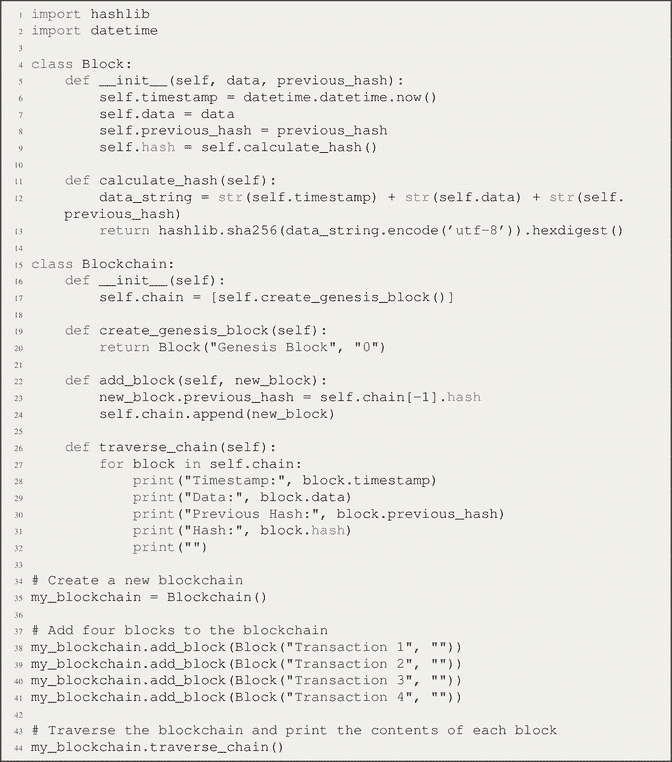

**示例输出**

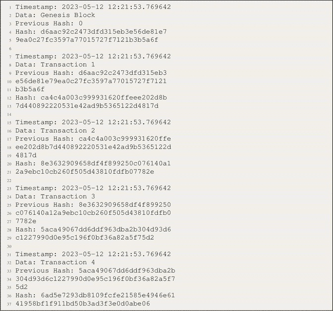

**代码解释**

该代码导入了必要的模块：用于计算哈希的 `hashlib` 和用于为区块添加时间戳的 `datetime`。

定义了 `Block` 类，表示区块链中的一个区块。每个区块具有以下属性：

- `timestamp`：表示区块创建时间的时间戳。
- `data`：区块包含的数据或载荷。
- `previous_hash`：区块链中前一个区块的哈希。
- `hash`：当前区块的哈希，使用 `calculate_hash` 方法计算得出。

`Block` 类中的 `calculate_hash` 方法计算区块的 SHA256 哈希。它将时间戳、数据和前一个哈希连接起来，使用 UTF-8 对结果字符串进行编码，然后使用 `hashlib.sha256` 计算哈希。

定义了 `Blockchain` 类来表示整个区块链。它具有一个属性：

- `chain`：一个列表，保存区块链中的所有区块。链中的初始区块是创世区块，使用 `create_genesis_block` 方法创建。

`create_genesis_block` 方法创建创世区块，这是一个没有前一个哈希的特殊区块。它返回一个新的 `Block` 实例，其中包含数据“Genesis Block”和一个空字符串作为前一个哈希。

`add_block` 方法向区块链添加一个新区块。它接受一个 `new_block` 作为输入，将新区块的前一个哈希设置为链中最后一个区块的哈希（`self.chain[-1].hash`），然后将新区块追加到链中。

`traverse_chain` 方法遍历区块链并打印每个区块的内容。它遍历 `self.chain` 中的每个区块，并显示每个区块的时间戳、数据、前一个哈希和哈希值。

创建了一个名为 `my_blockchain` 的 `Blockchain` 类实例。

使用 `add_block` 方法向区块链添加了四个区块。每个区块都有自己的数据，而第一个区块的前一个哈希是一个空字符串。

调用 `traverse_chain` 方法打印区块链中每个区块的内容。

此程序演示了区块链的创建、添加包含交易数据的区块以及遍历区块链以显示每个区块的详细信息。

### 1.15.4 实现区块链并按 Etherscan.io 格式打印所有字段的程序

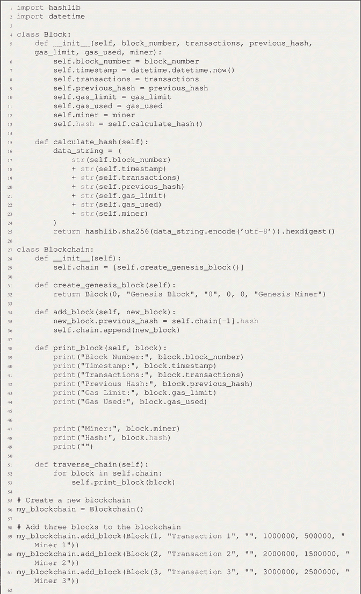

**示例输出**

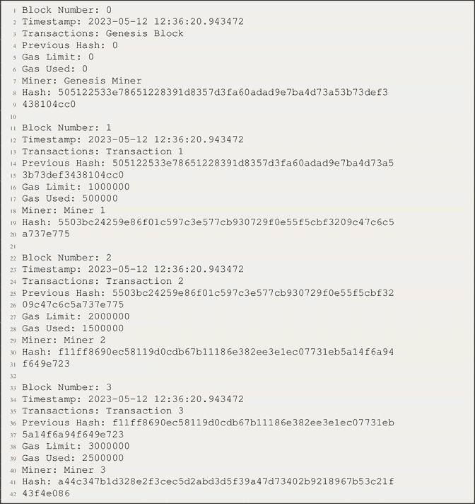

**代码解释**

代码首先导入必要的模块 `hashlib` 和 `datetime`。

定义了 `Block` 类来表示区块链中的一个区块。每个区块具有以下属性：

- `block_number`：分配给区块的编号。
- `timestamp`：表示区块创建时间的时间戳。
- `transactions`：区块中包含的交易或数据。
- `previous_hash`：区块链中前一个区块的哈希。
- `gas_limit` 和 `gas_used`：与区块链中燃料相关的属性（特定于应用程序）。
- `miner`：负责挖掘该区块的矿工。
- `hash`：当前区块的哈希，使用 `calculate_hash` 方法计算得出。

`Block` 类中的 `calculate_hash` 方法计算区块的 SHA256 哈希。它将区块的各种属性连接成一个字符串，然后使用 `hashlib` 中的 SHA256 算法对结果字符串进行编码和哈希处理。

定义了 `Blockchain` 类来表示整个区块链。它具有一个属性：

- `chain`：一个列表，保存区块链中的所有区块。链中的初始区块是创世区块，使用 `create_genesis_block` 方法创建。

`create_genesis_block` 方法创建创世区块，这是一个没有前一个哈希的特殊区块。它返回一个新的 `Block` 实例，其中包含区块编号、数据、前一个哈希、燃料限制、已用燃料和矿工的预定义值。

`add_block` 方法向区块链添加一个新区块。它接受一个 `new_block` 作为输入，将新区块的前一个哈希设置为链中最后一个区块的哈希（`self.chain[-1].hash`），然后将新区块追加到链中。

`print_block` 方法打印一个区块的内容，包括其区块编号、时间戳、交易、前一个哈希、燃料限制、已用燃料、矿工和哈希值。

`traverse_chain` 方法遍历区块链，并为链中的每个区块调用 `print_block` 方法，从而打印每个区块的内容。

创建了一个名为 `my_blockchain` 的 `Blockchain` 类实例。

使用 `add_block` 方法向区块链添加了三个区块。每个区块都有自己的区块编号、交易、燃料限制、已用燃料和矿工。每个区块的前一个哈希最初设置为一个空字符串。

调用 `traverse_chain` 方法打印区块链中每个区块的内容。

### 1.15.5 用 Python 实现区块链和 UTXO

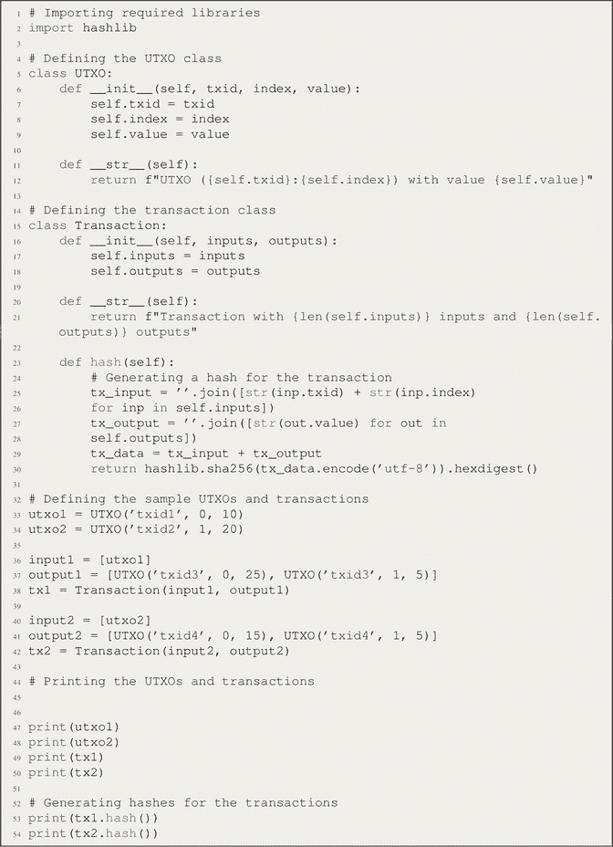

**示例输出**

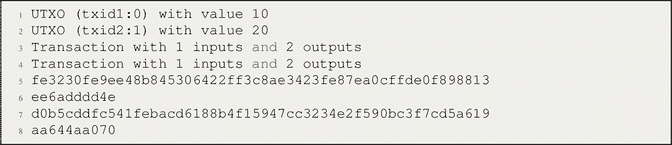

### 1.15.6 代码说明

代码首先导入所需的库 `hashlib`。

定义了 `UTXO` 类来表示一个未花费的交易输出。每个 UTXO 具有以下属性：

- `txid`：UTXO 所属的交易 ID。
- `index`：交易中输出的索引。
- `value`：输出的值。

定义了 `__str__` 方法来提供 UTXO 的字符串表示形式。

定义了 `Transaction` 类来表示一个交易。每个交易具有以下属性：

- `inputs`：作为输入被花费的 UTXO 列表。
- `outputs`：作为输出创建的新 UTXO 列表。

定义了 `__str__` 方法来提供交易的字符串表示形式。

`hash` 方法通过拼接输入 UTXO 的交易 ID 和索引以及输出 UTXO 的值来为交易生成哈希。然后，它使用 `hashlib` 对结果字符串计算 SHA256 哈希。

使用 `UTXO` 和 `Transaction` 类定义了示例 UTXO 和交易。

使用 `print` 函数打印 UTXO 和交易。

使用 `hash` 方法生成交易的哈希并打印。

### 1.15.7 用 Python 实现 PoW 算法

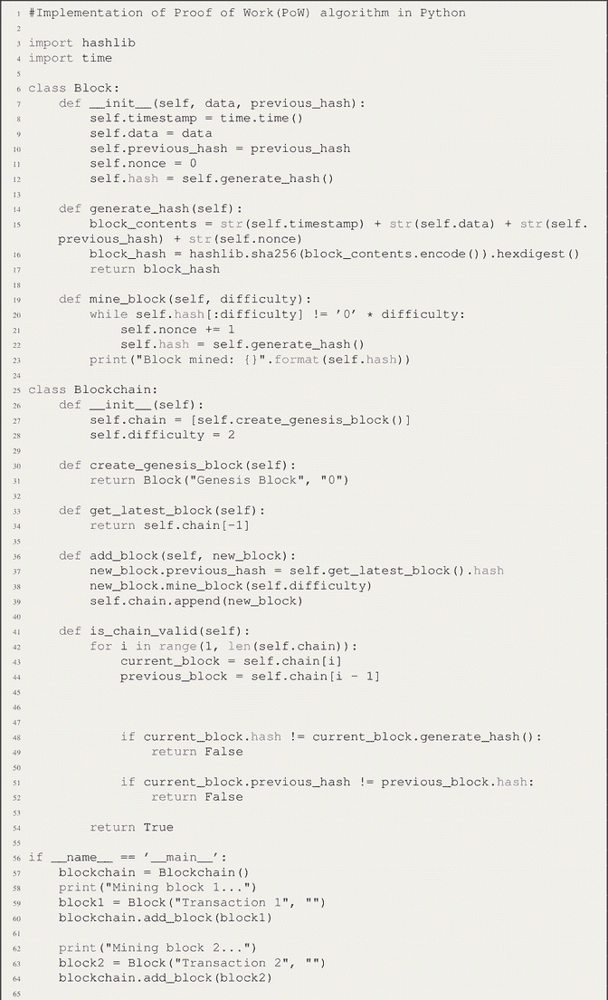

代码说明
该代码定义了两个类：`Block` 和 `Blockchain`。`Block` 类代表区块链中的一个区块。每个区块具有几个属性：

- `timestamp`：使用 `time.time()` 函数存储区块创建的时间。
- `data`：表示区块包含的数据或交易。
- `previous_hash`：存储链中前一个区块的哈希。
- `nonce`：在挖矿过程中递增的数字，用于寻找有效的哈希。
- `hash`：存储区块本身的哈希。

`Block` 类还具有以下方法：

- `generate_hash()`：该方法通过拼接区块的属性并应用 `hashlib` 模块中的 `SHA-256` 哈希函数来生成区块的哈希。
- `mine_block(difficulty)`：该方法通过递增 `nonce` 值来执行挖矿过程，直到找到满足难度条件的哈希。难度是哈希中所需的前导零个数。

`Blockchain` 类代表区块链本身并管理区块。它具有以下属性和方法：

- `chain`：存储区块链中区块的列表。
- `difficulty`：表示挖矿的难度级别。

`Blockchain` 类还使用以下方法：

- `create_genesis_block()`：该方法使用任意数据和前一个哈希 `"0"` 创建区块链中的第一个区块，称为创世区块。
- `get_latest_block()`：该方法返回链中最近添加的区块。
- `add_block(new_block)`：该方法向链中添加一个新区块。它将新区块的前一个哈希设置为最新区块的哈希，挖掘新区块，并将其附加到链上。
- `is_chain_valid()`：该方法通过验证每个区块的完整性来检查区块链的有效性。它遍历链，比较每个区块的哈希和前一个哈希值。

代码末尾的 `if __name__ == '__main__'` 块是程序的入口点。它创建一个 `Blockchain` 类的实例，并向链中添加三个区块。在挖掘每个区块后，它使用 `is_chain_valid()` 方法检查区块链的有效性。

最后，为了演示区块链的防篡改特性，代码修改了链中第二个区块的数据（`blockchain.chain[1].data = "Tampered transaction"`）。然后，它重新检查区块链的有效性，显示已检测到篡改。

代码的输出包括挖矿过程的信息以及每一步后区块链的有效性。

示例输出

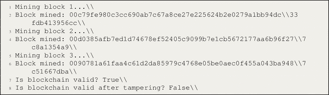

### 1.15.8 用 Python 实现 PoS 算法

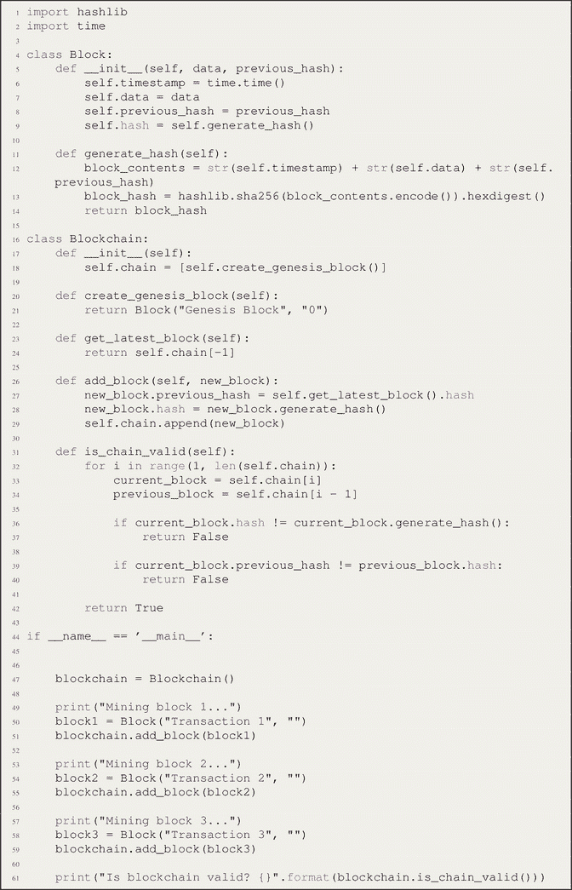

示例输出

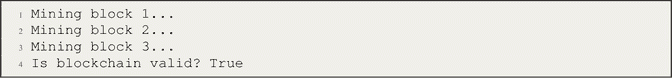

代码说明
`Block` 类代表区块链中的一个区块。它具有以下属性：

- `timestamp`：使用 `time.time()` 存储当前时间。
- `data`：表示区块中存储的数据或交易。
- `previous_hash`：存储区块链中前一个区块的哈希。
- `hash`：存储当前区块的哈希，由 `generate_hash()` 方法生成。

`__init__` 方法初始化这些属性并为区块生成哈希。

`generate_hash()` 方法将区块的属性（`timestamp`、`data` 和 `previous_hash`）拼接成一个字符串，将其编码为字节，然后使用 `hashlib.sha256()` 应用 `SHA-256` 哈希函数。结果哈希以十六进制字符串形式返回。

`Blockchain` 类管理区块链中的区块。它具有以下方法和属性：

- `__init__` 方法使用 `create_genesis_block()` 方法创建的创世区块初始化 `chain` 属性。
- `create_genesis_block()` 方法使用初始数据 `"Genesis Block"` 和前一个哈希 `"0"` 创建区块链中的第一个区块（创世区块）。
- `get_latest_block()` 方法返回链中最近添加的区块。
- `add_block(new_block)` 方法向链中添加一个新区块。它将新区块的前一个哈希设置为最新区块的哈希，为新区块生成哈希，并将其附加到链上。
- `is_chain_valid()` 方法通过遍历链来检查区块链的有效性。它通过比较每个区块的哈希与生成的哈希来验证其完整性，并检查前一个哈希是否与前一个区块的哈希匹配。

`if __name__ == '__main__'` 块是程序的入口点。它创建一个 `Blockchain` 类的实例，并执行以下步骤：

- 创建一个区块链实例。
- 挖掘并添加包含数据 `"Transaction 1"` 的区块 1。
- 挖掘并添加包含数据 `"Transaction 2"` 的区块 2。
- 挖掘并添加包含数据 `"Transaction 3"` 的区块 3。
- 使用 `is_chain_valid()` 方法检查区块链的有效性。

### 1.15.9 使用 Etherscan API 从以太坊区块链获取最新区块信息的程序

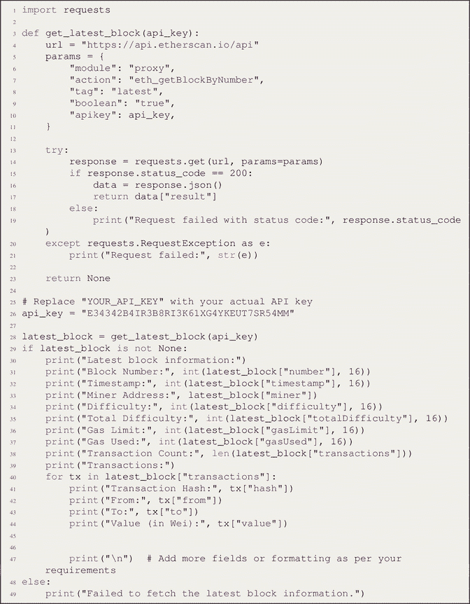

示例输入和输出

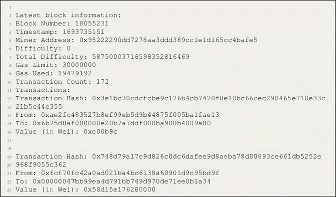

### 1.15.10 代码说明

指定的 Python 代码使用 `Etherscan` API 检索以太坊区块链上最新区块的信息。它定义了 `get_latest_block` 函数，该函数向 API 发送一个 GET 请求，其中包含最新的区块标识符和用于身份验证的 API 密钥。在获得成功响应后，它会解析 JSON 数据以提取关键的区块信息，包括区块编号、时间戳、矿工地址、难度、`Gas` 上限、已使用 `Gas` 和交易数量。此外，它会遍历区块的交易以显示交易特定数据，例如哈希、发送方、接收方和金额。该代码提供了一种简单且结构化的方法来访问和显示实时的以太坊区块链数据，提供对最新区块属性和交易的有价值的洞察。