# 2. 区块链编程基础

**关键词：** 密码学原语、哈希、安全 SHA、默克尔树、公钥密码学、数字签名、区块挖掘

## 2.1 密码学原语

区块链技术建立在许多密码学原语之上。这些原语包括：

- `哈希函数`
- `SHA-256`
- 谜题友好性

### 2.1.1 哈希函数

哈希函数在连接区块链中的各个区块方面起着重要作用。哈希函数通常接受可变大小的输入，并产生固定长度的输出（在区块链中通常为 256 位），以十六进制表示法表示，称为哈希值或消息摘要。如果 `"x"` 是一个任意长度的输入，那么 `h(x)` 表示其哈希值。

## 2.2 哈希函数

哈希函数是一种数学函数，它接受任意大小的输入，并生成一个固定大小的输出，称为哈希值或消息摘要。哈希过程的一个简单示意图如图 2-1 所示。

哈希函数广泛应用于密码学和计算机科学，特别是在验证数据完整性和保护敏感信息方面。

哈希函数接受任意长度的输入，并生成一个称为消息摘要的固定大小输出。哈希函数的输出通常是一个对输入数据唯一的字符串，并且输入的任何微小变化都会导致完全不同的哈希值。这个特性被称为雪崩效应，对于确保数据的完整性和安全性至关重要。

哈希函数用于多种应用，包括数字签名、密码验证、数据完整性验证以及在哈希表中索引数据。最常见的加密哈希函数是 `MD5`、`SHA-1`、`SHA-2` 和 `SHA-3`，其中 `SHA-256` 使用最广泛。

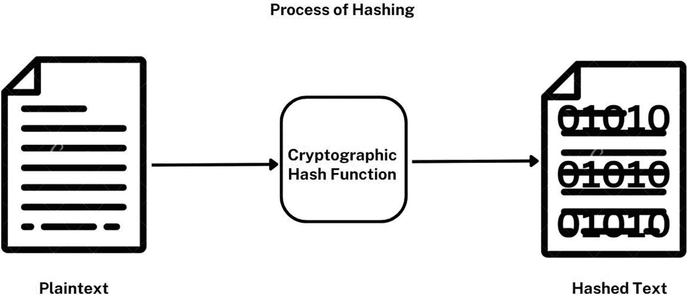

该框图说明了哈希的过程。使用加密哈希函数将纯文本转换为哈希文本。

**图 2-1：** 哈希过程

### 2.2.1 哈希函数的特性

哈希函数具有几个基本特性，包括：

- **确定性：** 给定相同的输入，哈希函数将始终产生相同的输出。这一特性对于验证数据完整性至关重要。
- **单向性：** 从计算角度来看，根据对应的哈希值推导出原始输入应该极其困难。这一特性使得哈希函数适用于密码哈希和数字签名等任务。
- **固定输出：** 无论输入大小如何，哈希函数都会生成固定大小的输出。这一特性使其能够有效地用于哈希表中的数据索引。
- **雪崩效应：** 输入的微小改变应导致输出的显著变化。这一特性保证了即使数据发生细微变化，也会产生截然不同的哈希值。
- **抗碰撞性：** 从计算角度来看，找出两个产生相同哈希值的不同输入应该极不可能。这一特性确保了不同的数据元素会被一致地映射到不同的哈希值。
- **不可逆性：** 仅给定哈希值，从计算角度来看，推断出原始输入应该极其困难。这一特性确保了哈希函数在面对试图从哈希值逆向工程出原始输入的攻击时能保持安全。

### 2.2.2 哈希指针与数据结构

哈希指针和数据结构在区块链技术的设计与实现中扮演着至关重要的角色。哈希指针本质上是对存储在区块链上数据的引用，它们是通过哈希函数与指向数据位置的指针结合而创建的，如图 2-2 所示。

在区块链中，每个区块通常包含一组交易以及一个指向前一个区块的哈希指针。这创建了一个区块链，每个区块包含前一个区块头数据的加密哈希，其中也包括哈希指针。这确保了任何对单个区块的篡改都能被立即检测到，因为这将导致所有后续区块的哈希指针失效。

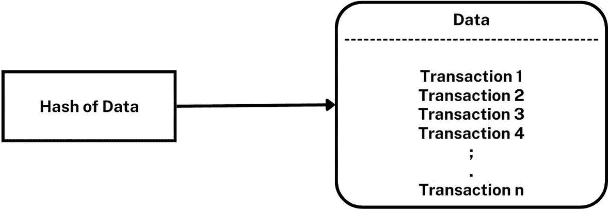

**图 2-2** 哈希指针

哈希指针也可用于在区块链中创建更复杂的数据结构，例如默克尔树。默克尔树是一种二叉树，其中每个叶节点代表一条数据，每个非叶节点代表其子节点的哈希。这创建了一个层级哈希结构，根哈希代表整个数据集。

区块链（如比特币）中的典型交易如下：

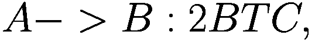

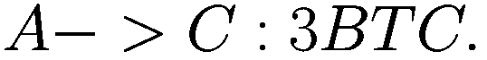

图 2-3 给出了使用在线工具¹ 获得的哈希值。

由于生成的哈希值是唯一的，并且遵循密码学中的扩散和混淆原则，因此篡改哈希值极其困难。

### 2.2.3 篡改在计算上具有挑战性

让我们看一个例子，说明为何在区块链中进行篡改在计算上具有挑战性。我们延续上一节的示例：

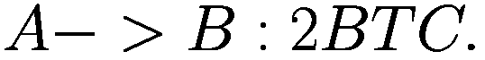

这里，甲方 A 正在向乙方 B 发送 2 个比特币。这被记录为其中一笔交易。通常，区块链中的一个区块包含许多这样的交易。为简化起见，仅考虑一笔交易，并使用相同的工具 [`www.blockchain-basics.com/HashPuzzle.html`](http://www.blockchain-basics.com/HashPuzzle.html)，如图 2-4 所示。

尝试解决以下谜题：“获取具有所需前导零数量的哈希值”。

类似地，交易 `A -> B : 2 BTC` 在不同随机数下的哈希值计算结果如图 2-5 所示。

随机数是与交易一起用于生成哈希值的任意随机数。该谜题的目标是获得一个具有所需前导零个数的哈希值。在图 2-4 中，使用相同的工具 [`www.blockchain-basics.com/HashPuzzle.html`](http://www.blockchain-basics.com/HashPuzzle.html)，并设置随机数值如 “0”、“1”、“2”、“3”，生成了哈希值 “6FD8BD96”、“76B160BA”、“160A6C89”、“58121C16”。这未能解出谜题。当使用随机数值 “23” 时，谜题被解开，生成了所需的哈希值 “0E93EC58”（图 2-6）。请尝试使用该工具，为同一笔交易生成一个具有不同前导零个数的解。

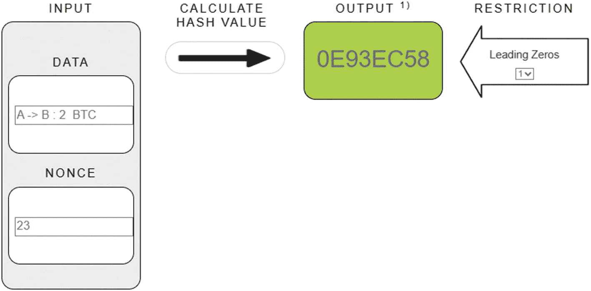

**图 2-6** 已解谜题

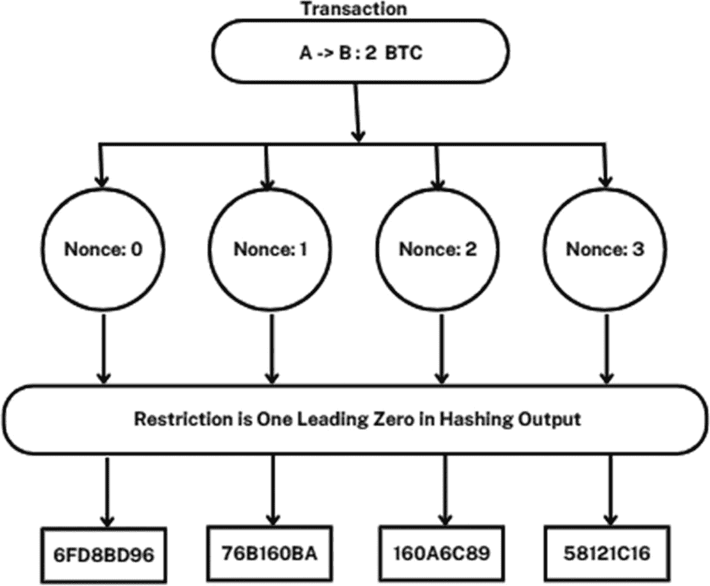

**图 2-5** 解决谜题的各种尝试

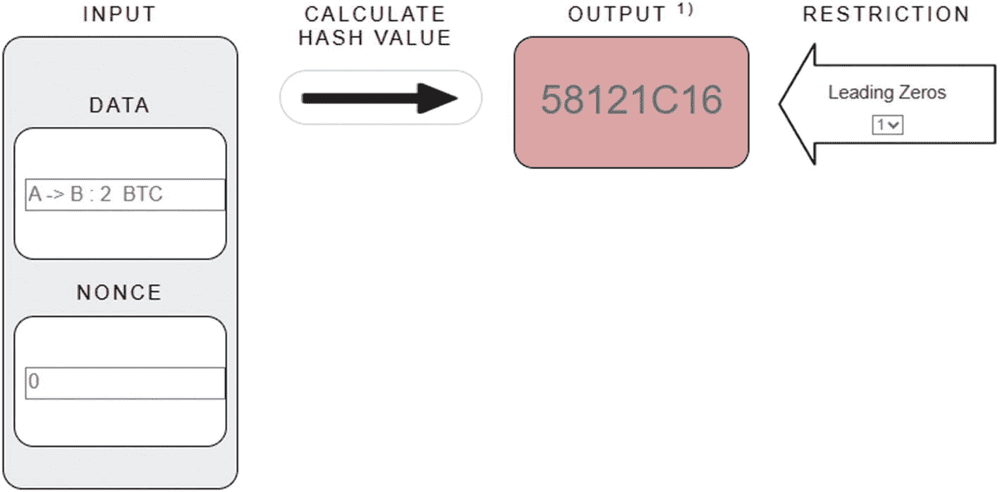

**图 2-4** 谜题示例

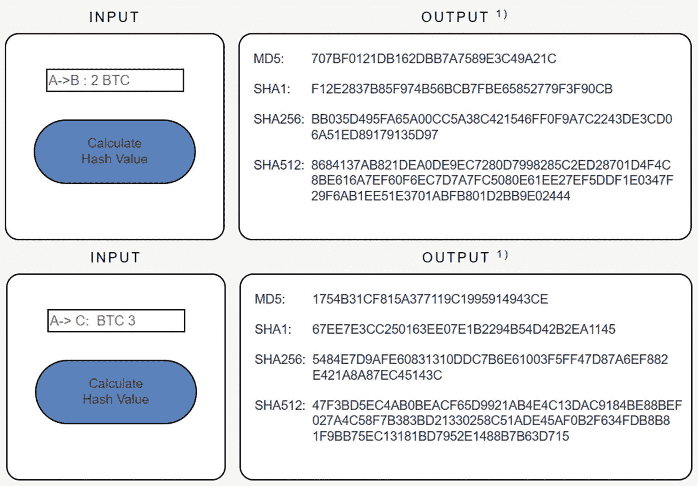

**图 2-3** 哈希计算

### 2.2.4 哈希在区块链中的作用

在区块链的背景下，哈希函数通过接收可变长度的输入，并生成一个长度固定的输出来运行，该输出被称为哈希值或消息摘要。这个哈希值充当初始输入的独特数字表示，类似于指纹。

以下是哈希函数在区块链中的一些关键作用：

- **区块验证：** 哈希函数在验证区块链中每个区块的完整性方面起着关键作用。每个区块都包含前一个区块的哈希值，从而形成一个相互连接的哈希链。对区块数据的任何更改都会导致哈希值改变，从而立即指示出篡改行为。这确保了任何对区块链的未授权修改都能被轻松检测到。
- **挖矿：** 在像比特币这样的工作量证明区块链中，矿工参与一个被称为挖矿的竞争过程，他们努力通过找到符合特定条件的哈希值来解决一个数学难题。矿工利用其计算能力执行哈希计算，第一个找到有效哈希值的矿工将获得新铸造的加密货币作为奖励。谜题的难度会进行调整，以维持挖矿过程预设的时间框架。
- **数字签名：** 哈希函数在区块链中创建数字签名方面起着重要作用。数字签名旨在证明一笔交易已由特定私钥的拥有者授权。交易数据经过哈希处理，然后使用该私钥对生成的哈希值进行签名。任何人都可以使用相应的公钥来验证该签名。

### Block Validation

在区块链中，区块验证是在将新创建的区块添加到现有链之前，验证其真实性和有效性的过程。区块验证对于确保区块链的安全性和完整性至关重要。

区块验证过程涉及以下几个步骤：

1.  **区块头验证**：区块验证的第一步是验证区块头。这包括检查区块的哈希值（`hash`）、时间戳（`timestamp`）、随机数（`nonce`）以及前一个区块的哈希值（`previous block hash`）。哈希值是通过对区块数据（包括区块内的交易）应用加密函数生成的。时间戳必须在特定范围内，以防止对区块创建时间的操纵。随机数是一个添加到区块头中的随机数字，用于使哈希值难以计算。
2.  **交易验证**：下一步是验证区块中的交易。每笔交易必须是有效的，这意味着发送方有足够的资金，并且交易使用了正确的私钥进行签名。此外，交易不得违反区块链的任何规则，例如双重支付或支出超过可用余额。
3.  **共识验证**：在验证了区块头和交易之后，必须通过网络共识机制来验证区块。这确保该区块能够被网络中的大多数节点接受。共识机制因区块链而异，但通常涉及工作量证明（`proof of work`）、权益证明（`proof of stake`）或类似的算法。
4.  **区块传播**：一旦区块被验证，它会被传播到网络中的各个节点。每个节点将独立验证该区块，以确保其有效性。
5.  **区块添加**：最后，一旦区块被网络中的节点验证，它就会被添加到区块链中。该区块成为链的永久部分，其内的交易被认为是已确认的。

### 数字签名与区块链

数字签名在区块链技术中发挥着至关重要的作用，它确保了交易的安全性和真实性。数字签名是通过对一条消息（例如一笔交易）使用签名者的私钥进行加密函数运算而生成的。生成的签名可以使用对应的公钥进行验证，从而在隐藏私钥本身的同时，证明该消息是由私钥持有者签名的。

在区块链中，交易数据会经历一个称为哈希（`hashing`）的过程，其中会应用诸如`SHA-256`之类的哈希函数，生成一个固定大小的输出，称为哈希值或摘要（`hash or digest`）。然后，该哈希值使用发送者的私钥进行签名，生成数字签名。签名被附加到交易上，并在网络中传输。

网络中的节点在接收到一笔交易后，可以使用发送者的公钥来验证签名。这包括对交易数据应用相同的哈希函数，并将生成的哈希值与发送者签名的哈希值进行比较。如果两个哈希值匹配，则该签名被认为是合法的，交易可以被添加到区块链中。

通过利用数字签名，区块链提供了一种在不依赖中央权威或可信中介的情况下，确立交易所有权和完整性的机制。这一特性确保了区块链交易将保持安全，并且能够抵御篡改、欺诈和其他恶意活动。

## 安全哈希算法（SHA）

`SHA-256`算法在比特币挖矿中被突出地用于构建比特币区块链。`SHA-256`从可变长度的输入生成一个 256 位的十六进制字符串，有时也称为消息摘要（`message digest`）。

#### SHA 算法

**SHA-256 算法 – 预处理**

*   通过填充，确保消息被扩展为 512 的倍数大小。
*   假设消息 `M` 的长度为 `l`，并且 `l mod 512 = 0`。
*   在消息末尾添加比特 “1” 作为附加。
*   添加 `k` 个零比特，其中 `k` 是满足 `1 + 1 + k ≡ 448 mod 512` 的最小非负整数解。
*   附加一个 64 位的数据块，代表数字 `l` 的二进制形式。
*   总长度变为可被 512 整除。将消息分割成 `N` 个 512 位的块：`M(1)`，`M(2)`，…，`M(N)`。
*   进一步将每个 512 位的数据块分割成 32 位的子块：`M_0, M_1, …, M_15`。

**消息块处理**

消息块一次处理一个。

以一个固定的初始哈希值 `H(0)` 开始。

按顺序计算 `H(i) = C(H(i-1), M(i))`，其中 `C` 是`SHA-256`压缩函数，`+` 表示模 `2³²` 加法运算。

`H(N)` 代表整个消息 `M` 的哈希值。

整个过程在图 [2-7] 中进行了总结。

在区块链中，每个交易区块都使用加密哈希函数（如`SHA-256`或`SHA-3`）进行哈希处理，以创建该区块的哈希值。然后，该哈希值被包含在下一个区块中，从而创建了一个区块链。每个区块的哈希值不仅取决于该区块内的交易，还取决于链中前一个区块的哈希值。这为区块链上发生的所有交易创建了一个安全且防篡改的记录。

在区块链中使用 SHA 提供了几个关键优势。首先，它确保了存储在区块链上的数据的完整性。任何篡改区块的尝试都会改变其哈希值，进而使链中所有后续区块的哈希值失效。这使得在不被发现的情况下修改区块链上的数据变得几乎不可能。  
图 [2-7] 展示了消息块处理过程。它从一个 256 位的初始化向量开始，并一次处理一个消息块。  
**图 2-7：SHA-256 概述**

其次，SHA 提供了高安全性。SHA 的加密特性确保在计算上无法为两个不同的数据块生成相同的哈希值。这有助于防止欺诈活动，并确保区块链上的数据准确可靠。

### 2.3.2 哈希模式

哈希值由数字（0–9）和字母（A–F）组合而成，总共用 16 比特表示 16 种可能的值。这些值被称为十六进制数。不同的哈希函数生成的哈希值长度不同，由此产生了多种类型的哈希函数。这些技术并非不同的模式，而是包括抗碰撞哈希函数、密码学哈希函数、消息摘要哈希函数、安全哈希函数和带密钥的哈希函数。

1. **独立哈希**：每个输入独立进行哈希运算，与其他输入没有任何关联。
2. **重复哈希**：将哈希函数的输出作为下一次迭代的输入进行反馈，从而形成一条哈希链。
3. **组合哈希**：在应用哈希函数之前，将多个输入组合在一起。
4. **顺序哈希**：按照特定的顺序依次应用多个哈希函数。
5. **分层哈希**：以分层方式执行哈希运算，将子组件的哈希值组合起来，形成更高级别组件的哈希值。

## 2.4 公钥密码学

### 密码学基本概念

密码学是通过将信息转换为不可读的格式来保护通信安全的实践。密码学中有两个基本概念：对称密钥密码学和公钥密码学。

- **对称密钥密码学**：在对称密钥密码学中，使用单个密钥对消息进行加密和解密。发送方和接收方必须拥有一个保密的共享密钥。加密算法将明文和共享密钥作为输入，生成密文，而解密算法则使用相同的密钥将密文转换回明文。然而，难点在于如何在发送方和接收方之间安全地交换密钥，确保其不被未授权实体截获。此外，对称密钥密码学可能无法充分满足特定需求，例如密钥的安全分发。

- **公钥密码学**：非对称密码学，也称为公钥密码学，克服了对称密钥密码学的限制。它使用一组数学上关联的密钥：一个用于加密的公开密钥和一个用于解密的保密密钥。公钥是公开分发的，而私钥则由所有者保密。任何用公钥编码的消息只能使用相应的私钥进行解码。公钥密码学解决了诸如可信密钥分发等问题，并支持数字签名和在不安全媒介上进行安全通信等功能。它广泛应用于区块链等技术中，以保证安全交易并确保数据完整性。

### 公钥密码学的重要特性

- **公钥密码学**：也称为非对称密码学，它涉及使用两个不同的密钥：一个公钥和一个私钥。
- **密钥**：在此上下文中，密钥是一个关键参数，它影响密码算法的输出，决定了加密或解密过程。
- **加密**：使用公钥将明文消息转换为密文，表示为 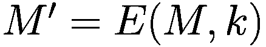。
- **解密**：使用私钥将密文转换回其原始的明文形式，表示为 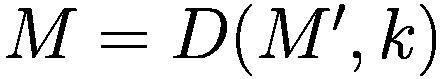。

### 密码学密钥的属性（防止猜测）

- 真正随机地生成密钥，使攻击者无法猜测。
- 密钥应有足够的长度——密钥越长，越难猜测。
- 密钥应包含足够的熵；密钥中的所有比特应具有同等的随机性。

### 2.4.1 安全哈希算法-3 (Keccak)

`SHA-3` 是一种密码学哈希函数，于 2012 年被美国国家标准与技术研究院（NIST）选为 SHA-3 竞赛的获胜者。`SHA-3` 基于 `Keccak` 算法，该算法由 Guido Bertoni、Joan Daemen、Michaël Peeters 和 Gilles Van Assche 共同创建。

`SHA-3` 在区块链中的作用是为交易和区块创建独特数字签名提供一种安全高效的方式。像 `SHA-3` 这样的哈希函数用于为数据块创建唯一的数字指纹。在区块链中，每个区块都包含前一个区块头的哈希值，这形成了一个区块链条，任何篡改都会导致整个链条失效。

`SHA-3` 的工作原理是接收输入消息，并通过一系列轮次的操作对其进行处理，以生成固定大小的输出，称为哈希值或摘要。该输出被设计为对于输入是唯一的，因此即使输入消息发生微小变化，也会产生截然不同的输出。这一特性使得哈希函数对于验证数据的完整性和检测任何未经授权的更改非常有用。

以下是一个展示 `SHA-3` 如何工作的示例：

假设我们想使用 `SHA-3-256`（生成 256 位的输出）对消息 `"Hello, world!"` 进行哈希运算。步骤如下：

- **填充**：首先，对消息进行填充，使其长度成为区块大小（对于 `SHA-3-256` 是 1600 位）的倍数。这是通过添加一个 1 比特，然后根据需要在后面添加尽可能多的 0 比特以达到所需长度来实现的。
- **吸收阶段**：将填充后的消息分成 1600 位的区块，每个区块通过一系列轮次进行处理。在每一轮中，该区块与一个 1600 位的状态进行异或操作，然后使用一个非线性函数对该状态进行变换。
- **挤压阶段**：处理完所有区块后，使用最终状态生成输出哈希值。这是通过反复取状态的一部分，将其附加到输出中，然后再次变换状态来实现的。

## 2.5 默克尔树

默克尔树是一种强大的数据结构，广泛应用于计算机科学和密码学领域，用于高效地验证大型数据集内数据的完整性和真实性。

构建默克尔树涉及递归地对数据对进行哈希运算，直到仅剩下一个单一的哈希值，即默克尔根。树的叶子节点代表原始数据，而每个内部节点代表其两个子节点的哈希值。整个过程总结在图 2-8 中。

默克尔根用作验证数据完整性的一种手段。一方可以通过提供从叶子节点到根的路径以及路径上每个节点的哈希值，来证明特定数据元素是树的一部分。然后，验证者可以通过对提供的数据和哈希值进行哈希运算来计算根哈希值，随后将其与预期的根哈希值进行比较。

默克尔树广泛应用于比特币和以太坊等加密货币系统中，以保证交易数据的完整性。它们还在分布式系统、数据存储系统和内容寻址存储系统中发挥着重要作用，因为它们有助于验证数据一致性并防止数据损坏。

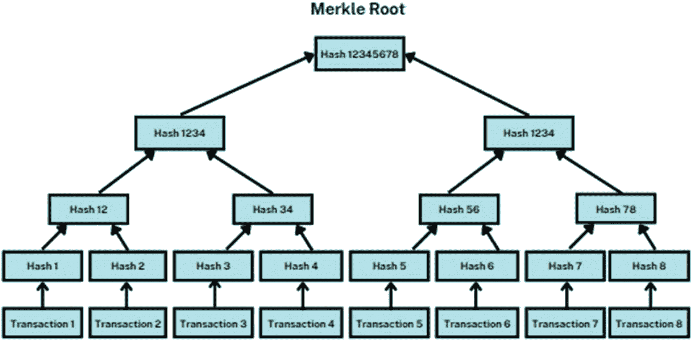

默克尔树的树形图。每笔交易都有一个单独的哈希值。每个内部节点表示其两个子节点的哈希值。

**图 2-8** – 默克尔根

### 2.5.1 默克尔树的创建

要创建默克尔树，请遵循以下步骤：

1. **准备数据**：第一步是准备你想要纳入树中的数据。数据通常被划分为固定大小的数据块，每个数据块被分配一个唯一标识符，例如哈希值。

2. **构建底层**：在这一步中，你获取每个数据块并对其进行哈希运算，以创建一个叶子节点。然后将叶子节点成对分组，并计算每对节点的哈希值，从而创建一个新的节点。

3. **构建下一层**：在下一层，你重复步骤二，但这次是计算上一层中每对节点的哈希值。你持续这个过程，直到只剩下一个节点，即树的根节点。

4. **存储树**：默克尔树可以通过多种方式存储，例如扁平数组或二叉树。树中的每个节点都被分配一个唯一标识符，可用于验证数据的真实性。

5. **验证数据**：为了验证一个数据块的真实性，你需要提供该叶子节点的哈希值，以及从该叶子节点到根节点路径上所有节点的哈希值。验证者随后可以重新计算根哈希值，并将其与预期值进行比较。如果哈希值匹配，则认为该数据是真实的。

### 2.5.2 默克尔树在区块链中的作用

在区块链中，默克尔树在确保交易数据的完整性和安全性方面起着至关重要的作用。本小节将解释其原理。

当新区块被添加到区块链时，它包含了自上一个区块以来发生的所有交易列表。这些交易被合并并一起进行哈希运算，从而创建一个默克尔树。然后，默克尔树的根节点会被包含在区块头中，连同其他重要信息，例如时间戳和上一个区块的哈希值。

通过在区块头中包含默克尔树根，区块链可以确保以下几点：

- **数据完整性**：默克尔树提供了一种验证区块中所有交易是否有效且未被篡改的方法。通过提供区块中每笔交易的哈希值，验证者可以轻松计算出默克尔根哈希值，并将其与区块头中包含的根哈希值进行比较。如果哈希值匹配，则可以假定所有交易都是有效的且未被修改。

- **可扩展性**：默克尔树允许进行高效且可扩展的交易验证。验证者无需逐一验证每笔交易，而只需检查少量哈希值，便能快速验证整个区块。

- **防篡改性**：由于默克尔树是使用哈希函数构建的，因此在不改变默克尔根哈希值的情况下修改区块中的交易是非常困难的。这意味着一旦一个区块被添加到区块链中，要修改或删除该区块中的任何交易都极其困难。

### 2.5.3 默克尔树的结构

默克尔树由几个组件构成，每个组件都有其独特的作用。以下是默克尔树的主要组成部分：

- **叶子节点**：叶子节点是默克尔树的底层，代表了将被纳入树中的各个数据片段。在区块链的语境中，叶子节点代表了将被哈希计算并纳入默克尔树的各个交易。

- **哈希函数**：哈希函数用于将叶子节点中的数据转换为固定大小的哈希值。一个好的哈希函数应该是确定性的，意味着给定相同的输入，它总是会产生相同的输出。它还应该具有抗碰撞性，即从计算上很难找到两个不同的输入却能产生相同的输出。

- **父节点**：父节点是通过将成对的叶子节点一起进行哈希运算而创建的。每个父节点代表其两个子节点的哈希值，这个过程会递归重复，直到只剩下一个节点——根节点。

- **根节点**：根节点是默克尔树的顶层节点，代表了树中所有数据的哈希值。在区块链的上下文中，根节点被包含在区块头中，允许网络中的其他节点验证区块中交易的真实性。

- **分支节点**：分支节点是位于叶子节点和根节点之间的中间节点。它们代表其两个子节点的哈希值，并用于验证默克尔树中特定数据的真实性。为了验证特定数据，一个节点只需要提供从该叶子节点到根节点路径上的分支节点的哈希值。

### 2.5.4 默克尔证明

默克尔证明，也称为默克尔路径或默克尔认证路径，是一种用于证明某个元素在默克尔树数据结构中存在或不存在的证明。默克尔证明广泛应用于分布式系统，例如区块链技术中，以在不需下载整个数据集的情况下高效地验证数据的完整性。

在默克尔树中，每个叶子节点代表一条数据，每个非叶子节点是其子节点的哈希值。树的根节点是树中所有数据的哈希值，称为默克尔根。为了证明树中某个元素的存在或不存在，会生成一个默克尔证明，它提供一系列哈希值，使验证者能够从该元素开始，重建出默克尔根。

存在性证明由一系列哈希值组成，使得验证者能够从所查询的元素开始重建默克尔根。该证明包含从包含该元素的叶子节点到根节点路径上的所有兄弟节点的哈希值。为了验证该证明，验证者先哈希该元素，然后将结果与证明中的第一个哈希值进行哈希运算。验证者再将得到的哈希值与证明中的下一个哈希值进行哈希运算，依此类推，直到重建出默克尔根。如果最终结果与已知的默克尔根匹配，则该证明有效，该元素是默克尔树的一个成员。

不存在性证明与存在性证明类似，不同之处在于它包含从根节点到该元素具有兄弟节点的最近祖先节点路径上的所有兄弟节点的哈希值。该证明通过表明，如果该元素存在时本应存在的兄弟节点也不存在，来证明该元素不在默克尔树中。为了验证不存在性证明，验证者先哈希该元素，然后将结果与证明中的第一个哈希值进行哈希运算。验证者再将得到的哈希值与证明中的下一个哈希值进行哈希运算，依此类推，直到到达最近的祖先节点。如果最终结果与该兄弟节点的哈希值匹配，则该证明有效，该元素不是默克尔树的成员。

默克尔证明是验证分布式系统中数据完整性的强大工具。它们允许验证者在不下载整个数据集的情况下，高效地验证元素在默克尔树中的存在性或不存在性，使其非常适合用于需要快速高效地验证大量数据的场景，例如区块链技术。

### 2.5.5 成员资格证明

要证明某笔特定交易存在于一棵默克尔树中，必须提供一份证明，该证明需包含从该交易到默克尔树根节点路径上各节点的哈希值。以下是默克尔树区块链中成员资格证明如何运作的示例：

1.  假设有一棵包含四笔交易（分别标记为`A`、`B`、`C`和`D`）的默克尔树，该树的根哈希用`H`表示。
2.  假设我们想要证明交易`C`包含在这棵默克尔树中。
3.  为了证明这一点，我们需要提供一份包含从交易`C`到默克尔树根节点路径上各节点哈希值的证明。
4.  在此例中，从`C`到树根节点的路径包含了交易`B`和`D`的哈希值以及根哈希`H`。
5.  因此，交易`C`的成员资格证明将包含交易`B`和`D`的哈希值以及根哈希`H`。
6.  验证者随后可以使用这些哈希值重建从交易`C`到根`H`的路径，并验证`C`的哈希值与存储在默克尔树中的哈希值是否匹配。
7.  如果哈希值匹配，验证者可以确信交易`C`包含在该默克尔树中，因此也包含在区块链中。
8.  这种在默克尔树区块链中证明成员资格的过程是安全的，因为任何对默克尔树中交易的篡改都会导致根哈希发生改变，从而使该证明失效。

### 2.5.6 非成员资格证明

1.  要在默克尔树区块链中证明非成员资格，你需要证明某个特定元素不包含在该区块链中。以下是证明默克尔树区块链非成员资格的步骤：
2.  获取你感兴趣的区块链的默克尔根。通常可以从可信来源获取，或者自行计算得出。
3.  计算你想要证明不属于该区块链的元素的哈希值。
4.  从根节点开始，遍历默克尔树，直至到达与该元素哈希值对应的叶节点。在此过程中，你需要计算遇到的每个节点的兄弟节点的哈希值。
5.  如果到达的叶节点与该元素的哈希值匹配，则该元素是区块链的一个成员。如果到达的叶节点与该元素的哈希值不匹配，则该元素不是区块链的成员。
6.  要证明非成员资格，你可以提供步骤 4 中到达的叶节点的兄弟节点的哈希值。这证明了该元素的哈希值无法通过默克尔树中的哈希值构造得出，因此它不是区块链的成员。

### 2.5.7 默克尔树的优势

默克尔树具有多项优势，包括：

-   由于数据结构化，数据验证快速简便，所需内存少，计算能力要求低。
-   默克尔树解决了验证区块链数据时内存空间和计算能力方面的挑战。
-   默克尔树对每个条目进行哈希处理，将数据与支持证据分离，减少了验证所需的数据量。
-   默克尔树通过在验证者之间分发交易，实现了更快的处理速度。
-   加密货币钱包，或称轻客户端节点，可以使用简单支付验证（`SPV`）来确认交易，而无需下载整个区块链。
-   矿工可以通过哈希结构轻松检测到对交易的篡改。
-   由默克尔根生成的每个区块的唯一哈希值保证了不可篡改性，并防止了双重支付。
-   如果双重支付交易的哈希值与区块链上已有的记录匹配，则该交易将被拒绝。

### 2.5.8 默克尔树的应用

以下是默克尔树常见应用的一些示例：

1.  加密货币：比特币和以太坊等加密货币使用默克尔树来验证交易的有效性。区块链中的每个区块都包含一棵包含该区块所有交易的默克尔树，该树的根被包含在区块头中。这使得网络中的节点可以轻松验证区块中交易的真实性。
2.  内容可寻址存储：诸如星际文件系统（`IPFS`）之类的内容可寻址存储系统使用默克尔树来验证存储内容的完整性。每个文件被分割成多个块，并根据这些块的哈希值构建一棵默克尔树。然后，该树的根被用作内容的地址，从而可以从网络中的任何节点检索和验证内容。
3.  分布式系统：分布式系统通常使用默克尔树来验证跨多个节点复制的数据的一致性。每个节点存储其持有数据的默克尔树，并比较这些树以确保所有节点拥有相同的数据。
4.  数据存储：默克尔树也用于数据存储系统，例如`ZFS`文件系统。`ZFS`使用默克尔树来验证存储数据的完整性，使其能够检测并纠正存储介质中的错误。

### 2.5.9 默克尔树准备金证明

默克尔树提供了一种无需重新计算整个数据集即可进行数据验证的方法。它们还将数据的“证明”与实际数据本身分离开来。通过维持哈希的数学性质，默克尔树确保了防篡改的完整性。用户仅使用部分数据即可验证整个数据集。准备金证明的概念利用默克尔树来证明存入的加密货币与实际账户余额相对应。在此场景下，叶节点代表用户的账户余额，默克尔根实时反映所有余额的总和。独立审计员可以使用默克尔树准备金证明，将交易所声明的准备金与所提供的快照进行比较。用户能够通过哈希处理其唯一 ID 和账户余额，在树中搜索来验证自己的余额。多轮验证保证了整个树结构的完整性，确保满足第三方审计员的要求。

## 2.6 公钥密码学

公钥密码学，也称为非对称密码学，有着悠久的历史。它最早由迪菲和赫尔曼在其 1976 年具有影响力的论文《密码学的新方向》中提出。该论文介绍了公钥加密方案和密钥分发系统的概念。

同一篇论文还提出了迪菲-赫尔曼密钥协商协议，该协议允许两方在不安全的信道上建立共享的秘密密钥。

有趣的是，公钥加密的思想最初是由詹姆斯·埃利斯在 1970 年的一份机密文件中提出的。然而，直到 1997 年，英国政府通信总部公布了该文件，这一思想才为公众所知。

数字签名概念作为公钥密码学的一个重要方面，同样归功于迪菲和赫尔曼。他们为这一概念的发展做出了贡献，该概念确保了数字文档的真实性和完整性。

### 2.6.1 公钥与私钥

公钥密码学，也称为 PKI 或非对称密码学，利用一对密钥——公钥和私钥——来提供安全通信。公钥广泛分发，任何人都可以获取，而私钥必须保密。在比特币的背景下，私钥丢失会使钱包内容面临风险，且一旦被盗无法追踪，这凸显了该系统的匿名性。

PKI 有两个关键功能：身份验证以及通过加密/解密实现的消息隐私。在消息交换过程中，在发送方和接收方之间建立信任至关重要，这确保接收方可以信任消息来源。基于区块链的消息系统利用去中心化网络，使通信具有高度的安全性、防篡改性和快速性。消息可以直接或通过公共渠道发送，允许广泛参与。凭借这些优势，基于区块链的消息系统为个人和公共用途提供了一种安全高效的替代传统通信方式。

### 2.6.2 公钥加密算法

公钥加密算法是确保现代密码学中安全通信的基础。这些算法通常采用模算术数论或椭圆曲线。

RSA 算法是最广泛使用的公钥加密算法之一，其安全性基于大数分解的计算难度。它涉及生成公钥和私钥，其中加密过程使用公钥，解密过程依赖私钥。

另一种流行的算法是 El Gamal，它基于求解离散对数问题的难度。它与 Diffie–Hellman 密钥协商协议具有相同的基本概念。El Gamal 加密涉及生成公钥和私钥，其加密和解密过程依赖于涉及模幂运算的数学操作。

RSA 和 El Gamal 都是公钥加密算法的例子，它们提供了一种安全地加密和解密消息的方法，确保了通信中的机密性和数据完整性。

### 2.6.3 数字签名交易

数字签名是一个用于验证预期发送方所发文档的真实性和完整性的过程。它确保文档在传输过程中未被篡改。发送方使用私钥加密消息，而先前与接收方共享的相应公钥则用于解密消息。

在区块链交易的数字签名中，私钥用于签署数字交易，而相应的公钥用于验证发送方的身份。需要注意的是，数字签名侧重于真实性而非文档安全性。因此，任何拥有发送方公钥的人都可以解密该文档。

数字签名的过程包括创建文档的哈希值，用发送方的私钥加密该哈希值，然后将其与文档一起发送。接收方使用发送方的公钥解密哈希值。然后，接收方独立计算文档的哈希值，并将其与解密后的哈希值进行比较，以判断文档在传输过程中是否被更改。如果两个哈希值匹配，接收方就可以确认文档的真实性，并确保它没有被网络入侵者篡改。

### 2.6.4 区块链中的数字签名

区块链技术中的数字签名有多个用途。它不仅仅用于验证文档的真实性，还扩展到验证交易和确保不可否认性。这是通过使用数字签名来实现的，数字签名在验证交易来源和防止虚假所有权声明方面起着至关重要的作用。

在区块链网络中，所有参与者都有一个与其账户关联的唯一数字签名或私钥。发起交易时，发送方需要证明他们有权花费与其账户相关的余额。这是通过使用他们的私钥对交易进行数字签名来完成的。

收到交易后，区块链网络中的每个节点都会验证数字签名以确认其真实性。此验证过程包括检查签名是否与发送方账户关联的公钥匹配。通过执行此验证，网络参与者可以验证交易及其关联账户的真实性。

数字签名通过防止未经授权的方操纵交易或虚假声称所有权，在区块链网络中提供了信任和共识。使用椭圆曲线密码学，例如比特币中的椭圆曲线数字签名算法（ECDSA），可以确保强大的安全性和高效的密钥生成。所有交易都由发送方使用其私钥进行数字签名，此签名作为真实性和所有权的证明包含在区块链中。

通过将数字签名与区块链技术相结合，参与者可以安全地授权交易，确定交易的来源，并维护网络的完整性。这确保了交易是合法的、经过授权的且不可否认，从而为区块链系统的整体信任度和可靠性做出了贡献。

## 2.7 实验工作

本节展示了使用 Python 实现区块链基本概念的方法。

### 2.7.1 演示如何使用 Hashlib 库生成消息的 SHA-3 哈希的 Python 程序

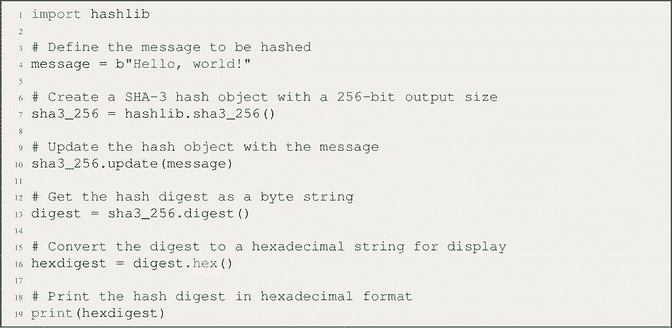一个包含 19 行 Python 代码的框，用于演示如何使用 Hashlib 库生成消息的 SHA-3 哈希。步骤包括：定义要哈希的消息，创建 SHA-3 哈希对象，更新哈希对象，获取哈希摘要，转换摘要，并打印哈希摘要。

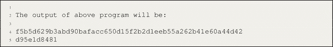一个包含 5 行 Python 代码的输出框，用于演示如何使用 Hashlib 库生成消息的 SHA-3 哈希。

**代码解释**

提供的代码演示了如何在 Python 中使用 `hashlib` 模块中的 SHA-3 哈希算法。`hashlib` 模块提供了对各种哈希算法的访问。在这段代码中，选择了一条特定的消息 `"Hello, world!"` 进行哈希处理。`hashlib.sha3_256()` 函数创建一个输出大小为 256 位的 SHA-3 哈希对象。然后，使用 `update()` 方法用消息更新此哈希对象。在哈希对象上调用 `digest()` 方法以获取字节字符串形式的哈希摘要。为了以更可读的格式显示摘要，使用 `hexdigest()` 方法将字节字符串转换为十六进制字符串。最后，使用 `print()` 函数打印哈希摘要的十六进制表示。代码的输出将是十六进制字符串 `"f5b5d629b3abd90bafacc650d15f2b2d1eeb55a262b41e60a44d42d95e1d8481"`，它代表消息 `"Hello, world!"` 的输出大小为 256 位的 SHA-3 哈希摘要。

### 2.7.2 一个 Python 程序，它接收用户输入的字符串和所需的前导零数量，并输出输入字符串、解决前导零难题所用的随机数，以及生成的对应哈希值

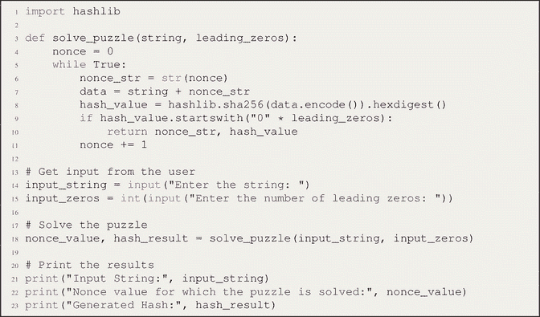  
一个包含 23 行 Python 代码的框，用于接收用户输入的字符串和所需的前导零数量，并输出该输入字符串。解决了前导零难题的随机数值，并生成对应的哈希值。步骤包括获取输入、解决难题以及打印结果。

#### 代码解释

提供的代码定义了一个名为 `solve_puzzle` 的函数，它接受两个参数：`string` 和 `leading_zeros`。此函数旨在找到一个由任意数字表示的随机数（nonce），当该数字与提供的 `string` 拼接后，会生成一个具有指定数量前导零的哈希值。

在 `solve_puzzle` 函数内部，一个变量 `nonce` 被初始化为 0。随后代码进入一个无限循环，直到找到解为止。在每次迭代中，当前的 `nonce` 值被转换为字符串，并与输入的 `string` 组合，生成变量 `data`。

代码使用 `hashlib.sha256()` 函数，将 `data` 字符串编码为字节，并使用 SHA-256 算法进行哈希运算。然后，通过 `hexdigest()` 方法，将得到的哈希值转换为十六进制字符串表示形式。

为了判断生成的 `hash_value` 是否以指定数量的零开头，代码将其与一个由零组成的字符串（`"0" * leading_zeros`）进行比较。如果条件满足，表示成功找到解，则函数返回当前的 `nonce_str` 和 `hash_value` 值。在 `solve_puzzle` 函数外部，代码提示用户输入一个字符串和所需的前导零数量，这些值分别存储在变量 `input_string` 和 `input_zeros` 中。随后，使用用户提供的输入调用 `solve_puzzle` 函数，并将结果值赋给 `nonce_value` 和 `hash_result`。

最后，代码打印出原始输入字符串、解决难题时使用的随机数值，以及生成的哈希值。通过执行此代码，您可以找到一个随机数值，当它与输入字符串结合时，能产生具有所需前导零数量的哈希值。

#### 示例输出

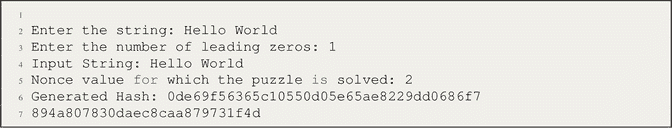  
一个包含 7 行 Python 代码的示例输出框，用于接收用户输入的字符串和所需的前导零数量，并输出该输入字符串。解决了前导零难题的随机数值，并生成对应的哈希值。

### 2.7.3 从给定输入字符串创建哈希代码的程序

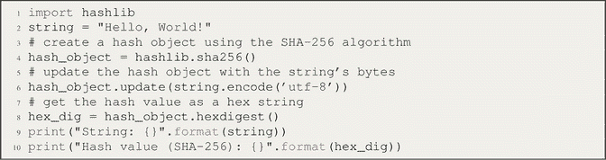  
一个包含 10 行 Python 代码的框，用于从给定的输入字符串创建哈希代码。步骤包括创建哈希对象、更新哈希对象、获取哈希值并提供输出。

#### 代码解释

上述代码首先导入了 `hashlib` 模块，该模块提供了对各种哈希算法的访问。接着，一个变量 `string` 被赋值为“Hello, World!”，作为要哈希的输入字符串。通过调用 `hashlib.sha256()`，使用 SHA-256 算法创建了一个哈希对象。然后，通过调用 `update()` 方法，传入使用 UTF-8 编码的字符串字节，来更新哈希对象。

为了获取十六进制字符串形式的哈希值，在哈希对象上调用了 `hexdigest()` 方法，并将结果值赋给变量 `hex_dig`。最后，使用 `print()` 函数打印原始输入字符串和生成的哈希值（SHA-256），并使用占位符来格式化输出。

通过执行此代码，提供的字符串“Hello, World!”将使用 SHA-256 算法进行哈希运算，得到的哈希值以十六进制字符串的形式显示。第一行导入了 `hashlib` 库，其中包含了各种可用于创建哈希值的哈希算法。第二行定义了一个名为 `string` 的字符串变量，并将其值设置为“Hello, World!”。第三行使用 `hashlib.sha256()` 函数创建了一个新的 sha256 哈希对象。

第四行使用 `string` 变量的字节（编码为 UTF-8）更新哈希对象。这一步很重要，因为哈希函数处理的是字节，而非字符串。`encode('utf-8')` 方法将字符串转换为 UTF-8 编码的字节序列，以便传递给哈希函数。

第五行使用哈希对象的 `hexdigest()` 方法获取十六进制字符串形式的哈希值。得到的十六进制字符串表示输入字符串使用 SHA-256 算法计算出的哈希值。

最后两行以人类可读的格式打印出输入字符串和生成的哈希值。花括号 `{}` 是待打印值的占位符，`format()` 方法用于将这些值替换到字符串中。程序的输出是输入字符串及其哈希值。

### 2.7.4 一个演示如何使用 SHA-256 哈希函数及其在简单区块链中应用的 Python 程序

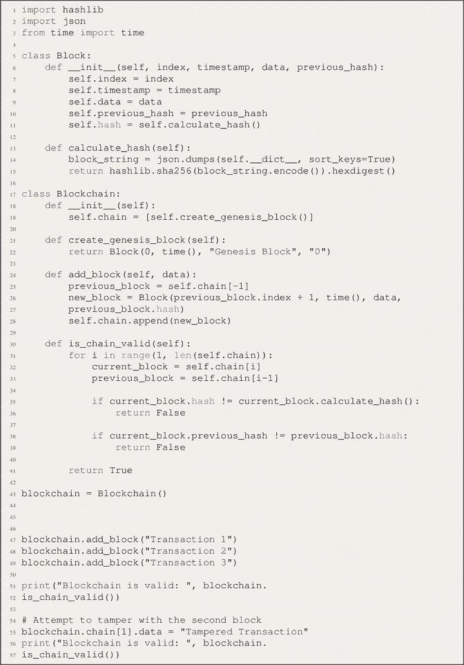  
一个包含 55 行 Python 代码的框，用于演示如何使用 SHA-256 哈希函数及其在简单区块链中的应用。它包含 2 个类，一个用于区块，另一个用于区块链。

#### 代码解释

上述代码使用 SHA-256 哈希算法和 JSON 序列化实现了一个基本的区块链。它定义了一个 `Block` 类，用于表示区块链中的一个区块，属性包括 `index`、`timestamp`、`data`、`previous_hash` 和 `hash`。`calculate_hash` 方法根据区块的属性计算其哈希值。

代码还包含了一个 `Blockchain` 类，用于管理区块的链。它以创世区块进行初始化，并包含添加新区块和验证链完整性的方法。`is_chain_valid` 方法检查每个区块的哈希值及其对前一个哈希的引用是否一致。

定义完这些类后，创建了一个 `Blockchain` 类的实例。向链中添加了三个具有不同交易数据的区块。检查了区块链的有效性，演示了区块链的成功创建和验证。

为了展示区块链防篡改的特性，代码尝试修改第二个区块的数据。在验证链时检测到了这一修改，突出了区块链检测篡改的能力。

执行此代码，您可以观察到一个基本区块链的创建、区块的添加以及区块链完整性的验证过程。

### 2.7.5 用 Python 编写程序验证哈希属性

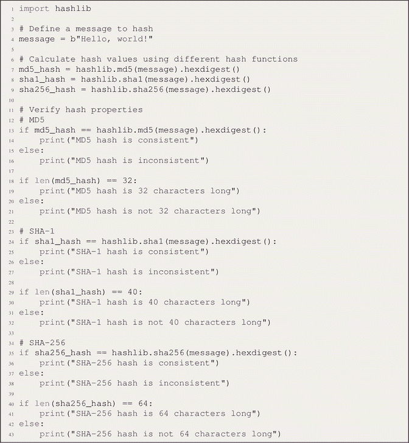 一个包含 43 行 Python 代码的代码框，用于验证哈希属性。步骤包括定义待哈希消息、计算哈希值以及验证哈希属性。

#### 代码解释

该程序导入 Python 的 `hashlib` 模块，该模块提供了多种用于安全单向哈希的哈希函数。程序定义了一条待哈希的消息。在此示例中，消息为 `b"Hello, world!"`，这是一个字节字符串。程序使用了三种不同的哈希函数（`md5`、`sha1` 和 `sha256`）来计算该消息的哈希值。在哈希对象上调用了 `hexdigest()` 方法，以获取哈希值的字符串表示形式。然后，程序针对每个哈希函数验证了一些基本的哈希属性：

- 对于每个哈希函数，程序检查哈希值是否一致。这意味着对同一条消息进行哈希运算应始终产生相同的哈希值。
- 对于每个哈希函数，程序检查哈希值是否具有预期的长度。这因哈希函数而异，因为不同的哈希函数可能生成不同长度的哈希值。

最后，程序输出每个哈希函数是否产生了一致的哈希值，以及每个哈希值是否具有预期的长度。

### 2.7.6 演示使用哈希码作为区块链接的简单区块链实现程序

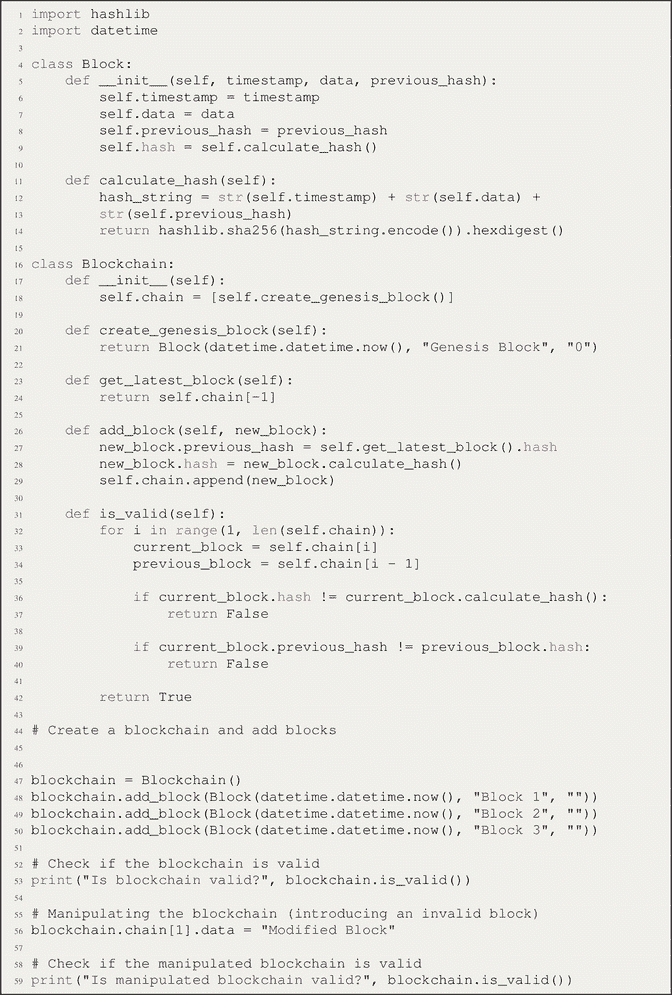 一个包含 57 行 Python 代码的代码框，用于演示使用哈希码作为区块链接的简单区块链实现。步骤包括创建区块链并添加区块、检查区块链是否有效、篡改区块链以及检查篡改后的区块链是否有效。

#### 代码解释

在这段代码中，我们定义了两个类：`Block` 和 `Blockchain`。`Block` 类代表区块链中的每个区块，而 `Blockchain` 类则管理区块的链条。每个区块包含一个时间戳、数据（可以代表你想存储的任何信息）、一个哈希码，以及一个指向前一个区块哈希码的引用。哈希码是使用 SHA-256 算法计算得出的，这是一种常用的密码学哈希函数。

`Blockchain` 类初始化时会创建一个创世区块（链条中的第一个区块），并通过计算新区块的哈希码并将其链接到前一个区块的哈希码来添加新区块。`is_valid()` 方法会遍历整个链条，检查哈希码和前一哈希码是否一致。

该示例演示了向区块链中添加三个区块，然后检查区块链的有效性。随后，它修改了第二个区块的数据以引入不一致性，并再次检查有效性。

要运行区块链演示程序，请遵循以下步骤：

1.  将代码保存到名为 `blockchain_demo.py` 的文件中。
2.  打开命令提示符或终端，并导航到 `blockchain_demo.py` 所在的目录。
3.  使用以下命令运行 Python 脚本：

    `python blockchain_demo.py`

4.  代码将执行并在终端中显示输出。
5.  你可以修改代码以在区块链中添加或篡改区块。
6.  重新运行脚本以查看更新后的输出并检查修改后区块链的有效性。

### 2.7.7 演示区块链中挖矿过程的程序

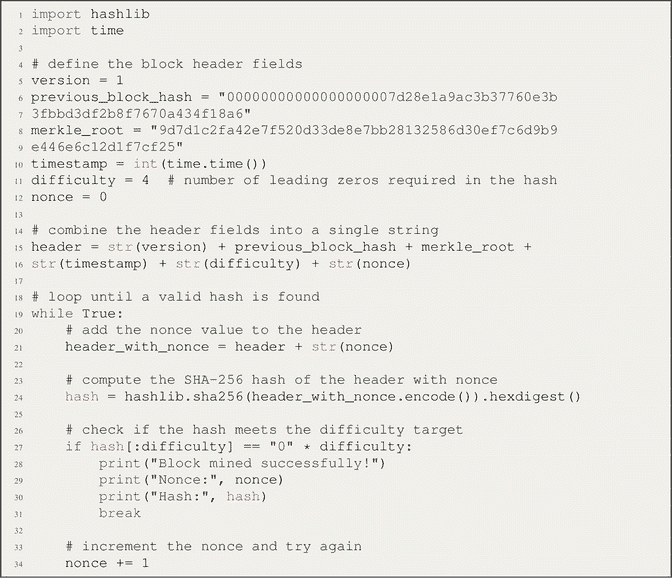 一个包含 57 行 Python 代码的代码框，用于演示区块链中的挖矿过程。步骤包括定义区块头字段、组合区块头字段（要求哈希值有前导零）、循环直到找到有效哈希、将随机数（nonce）值添加到区块头、以及计算哈希。

#### 代码解释

这是一个用于在区块链中挖掘区块的工作量证明算法的基本实现。代码使用了 `hashlib` 库中的 SHA-256 哈希函数和 `time` 库来获取当前时间。

代码定义了区块头字段，包括 `version`（版本）、`previous_block_hash`（前一区块哈希）、`merkle_root`（默克尔根）、`timestamp`（时间戳）、`difficulty`（难度）和 `nonce`（随机数）。`difficulty` 表示区块哈希必须包含的前导零个数，才能被视为有效。`nonce` 是一个添加到区块头中以生成满足难度目标的哈希值的随机值。

将区块头字段组合成一个字符串，然后启动一个循环来寻找有效的哈希值。循环持续进行，直到找到满足难度目标的哈希值。在循环的每次迭代中，将 `nonce` 值添加到区块头中，并计算包含该 `nonce` 的区块头的 SHA-256 哈希值。如果该哈希值满足难度目标，则退出循环，并打印该哈希值和 `nonce` 值。

如果哈希值不满足难度目标，则将 `nonce` 递增并重复循环。此过程持续进行，直到找到有效的哈希值。打印语句提供了挖矿过程的进度反馈。

#### 示例输出

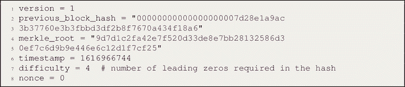 一个包含 8 行 Python 代码的示例输出框。它显示了哈希值中所需的前导零个数。

示例输出：

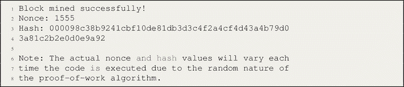 一个包含 8 行 Python 代码的示例输出框。第一行显示，“block mined successfully”（区块挖掘成功）。

### 2.7.8 在区块链中创建默克尔树的程序

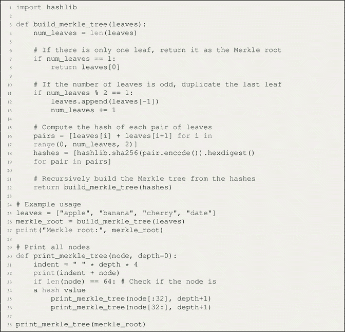 一个包含 38 行 Python 代码的代码框，用于在区块链中创建默克尔树。步骤包括计算每对叶子节点的哈希值、从哈希值递归构建默克尔树、以及打印所有节点。

#### 代码解释

所提供的代码执行了与默克尔树相关的操作。它首先导入了 `hashlib` 库，该库允许计算 SHA-256 哈希值。然后定义了 `build_merkle_tree` 函数，该函数接收一个叶子节点列表作为输入，并从中递归地构建一棵默克尔树。叶子节点的数量通过获取输入列表的长度来确定。

如果只有一个叶子节点，则直接将其作为默克尔根返回，因为无需计算哈希值。但是，如果叶子节点数量为奇数，则会复制最后一个叶子节点以确保叶子节点总数为偶数。这种复制操作可以防止在树构建过程中出现节点缺失或多余的情况。

该算法通过成对组合叶子节点并使用 SHA-256 对它们进行哈希处理。此步骤涉及创建一个列表推导式，用于连接成对的叶子节点，并应用 `hashlib.sha256` 函数计算其哈希值。然后将得到的哈希值列表递归地传回 `build_merkle_tree` 函数，以构建树的下一层。

一旦整棵默克尔树构建完成，便返回默克尔根作为最终结果。为了方便可视化和分析，定义了 `print_merkle_tree` 函数。该函数接收默克尔树中的一个节点作为输入，并递归地打印树中的所有节点。每个节点的缩进级别对应于其在树中的深度。

在 `print_merkle_tree` 函数内部，根据当前节点的深度创建一个缩进字符串。该函数随后打印当前节点，并进行递归调用以打印其左子节点和右子节点（如果存在）。通过检查节点的长度来决定是否打印子节点：如果长度为 64，则表示该节点代表一个哈希值而非叶子节点。

为了显示整棵默克尔树，调用 `print_merkle_tree` 函数，并以默克尔根作为输入参数。这将打印出完整的树结构，节点根据其在树中的深度进行缩进。

### 2.7.9 用于证明 Merkle 树区块链成员身份与非成员身份的程序

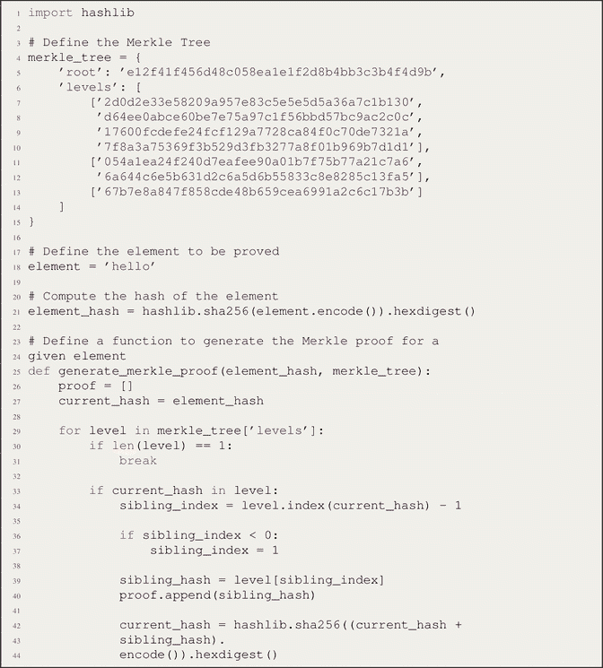 一个包含 89 行 Python 代码的代码框，用于证明 Merkle 树区块链中的成员身份与非成员身份。步骤包括定义 Merkle 树、定义待证明元素以及计算该元素的哈希值。

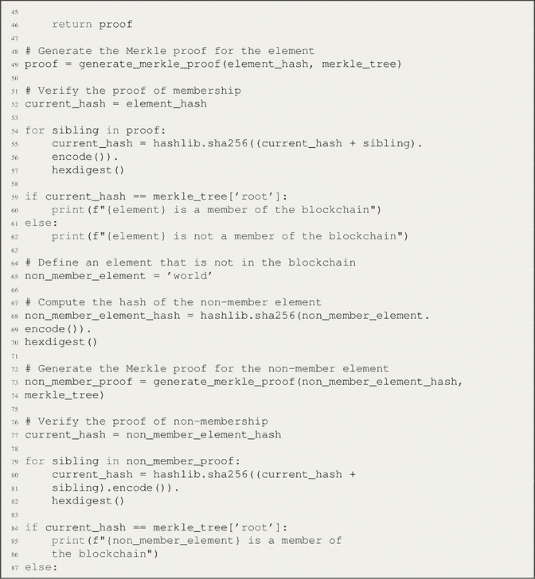 上述 89 行 Python 代码的延续部分，用于证明 Merkle 树区块链中的成员身份与非成员身份。步骤包括定义一个不在区块链中的元素、计算该非成员元素的哈希值、生成 Merkle 证明以及验证非成员身份证明。

### 2.7.10 代码解释

代码首先导入了 `hashlib` 模块，该模块支持计算 SHA-256 哈希值。然后使用字典结构定义了一个 Merkle 树，其中包含一个代表根哈希的 `"root"` 键，以及一个包含列表的列表（代表树的每一层）的 `"levels"` 键。待证明的元素被指定为字符串 `"hello"`，并使用 `hashlib.sha256()` 函数计算其 SHA-256 哈希值，将得到的哈希结果存储在变量 `element_hash` 中。

为了生成给定元素哈希和 Merkle 树的 Merkle 证明，代码定义了 `generate_merkle_proof()` 函数。该函数会遍历 Merkle 树的各层，并检查当前哈希是否存在于某一层中。如果找到当前哈希，函数会确定兄弟哈希的索引，并将其追加到证明列表中。然后，通过将当前哈希与兄弟哈希拼接，并使用 `hashlib.sha256()` 对拼接结果进行哈希计算来更新当前哈希。此过程持续进行，直到只剩下一层仅包含一个哈希，或者当前哈希在任何层中都未被找到。最后，函数返回证明列表。

代码通过调用 `generate_merkle_proof()` 函数生成该元素的 Merkle 证明，并将其存储在 `proof` 变量中。为了验证成员身份证明，代码会基于元素哈希和证明中的兄弟哈希重新构建 Merkle 根哈希。它遍历每一个兄弟哈希，将其与当前哈希拼接，计算拼接后的哈希值，并相应地更新当前哈希。最后，将最终的当前哈希与 Merkle 树的根哈希进行比较。如果两者匹配，则表明该元素是区块链的成员。

该代码还演示了验证非成员身份证明的过程。它定义了一个非成员元素为字符串 `"world"`，使用 `hashlib.sha256()` 计算其哈希值，并使用 `generate_merkle_proof()` 函数为这个非成员元素生成 Merkle 证明。类似于成员身份证明的验证过程，它基于非成员元素的哈希值和 `non_member_proof` 中的兄弟哈希重新构建 Merkle 根哈希。然后，将最终的当前哈希与 Merkle 树的根哈希进行比较。

### 2.7.11 演示如何证明 Merkle 树区块链中元素的成员身份与非成员身份的程序

 一个包含 21 行 Python 代码的代码框，用于演示如何证明 Merkle 树区块链中元素的成员身份与非成员身份。步骤包括定义 Merkle 树、定义待证明元素以及定义一个不在区块链中的元素。

**代码解释**

此代码实现了一个 Merkle 树，并提供了用于生成和验证区块链中成员身份与非成员身份证明的函数。它定义了 Merkle 树结构以及待验证的元素。`generate_merkle_proof` 函数通过遍历树并追加兄弟哈希来生成证明，而 `verify_merkle_proof` 和 `verify_non_membership_proof` 函数则用于验证证明的有效性。该代码演示了针对区块链中特定元素的证明生成与验证过程。

**示例输出**

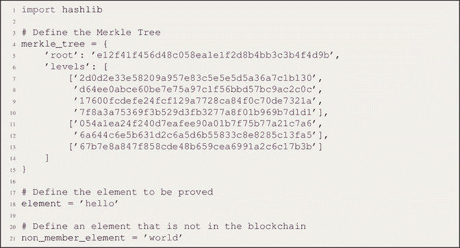 一个包含 2 行 Python 代码的示例输出框。第 1 行显示：`hello is a member of the blockchain`。第 2 行显示：`world is not a member of the blockchain`。

### 2.7.12 演示 RSA 数字签名方案的 Python 程序

 一个包含 33 行 Python 代码的代码框，用于演示 RSA 数字签名方案。步骤包括生成 RSA 密钥对、创建一个用于生成数字签名的函数、一个用于验证数字签名的函数、一条待签名的消息、创建数字签名以及验证数字签名。

**代码解释**

此代码用 Python 演示了 RSA 数字签名方案。首先，导入了必要的库，包括用于哈希计算的 `hashlib` 和用于 RSA 操作的 `rsa`。

使用 `rsa.newkeys(2048)` 生成一个密钥对，该函数会生成一个 2048 位的 RSA 私钥及其对应的公钥。

`create_signature` 函数接收消息和私钥作为输入。它使用 SHA-256 算法对消息进行哈希处理，然后使用 RSA 私钥对哈希后的消息进行签名。最后返回生成的数字签名。

`verify_signature` 函数接收消息、签名和公钥作为输入。它使用 SHA-256 对消息进行哈希处理，然后使用公钥验证签名。如果验证成功，则打印 `"Signature is valid."`；否则，打印 `"Signature is invalid."`。

在代码中，使用示例消息 `"Hello, World!"` 来演示数字签名过程。调用 `create_signature` 函数，传入消息和私钥以生成数字签名，并打印生成的签名。

最后，调用 `verify_signature` 函数，传入消息、签名和公钥来验证数字签名。根据验证结果，打印 `"Signature is valid"` 或 `"Signature is invalid"`。

需要注意的是，这里使用 SHA-256 进行哈希计算，`rsa` 库提供了 RSA 密钥生成、签名和验证所需的函数。要运行此代码，需要在 Python 环境中使用 `"pip install rsa"` 安装 `rsa` 库。

**示例输出**

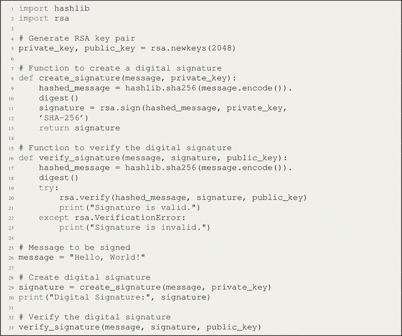 一个包含 25 行 Python 代码的示例输出框。第 1 行显示：`message colon Hello World!` 第 25 行显示：`signature is valid`。

## 2.8 本章小结

本章概述了哈希函数、安全哈希算法、默克尔树以及公钥密码学，重点介绍了它们在区块链技术中的应用。本章首先讨论了哈希函数的特性、在数据结构中的作用及其防篡改性。它强调了篡改哈希函数所涉及的计算挑战，这使得哈希函数非常适合维护数据完整性。本章还探讨了哈希函数在区块链技术中的作用以及确保数据不可变性的重要性。它介绍了安全哈希算法（`SHA`），并讨论了不同的哈希模式以增强安全性。此外，还引入了公钥密码学，解释了使用公钥和私钥进行加密和数字签名的原理。`SHA`作为一种广泛使用的密码学哈希函数被重点强调。本章也深入探讨了默克尔树，解释了其创建过程、结构以及在确保区块链数据完整性方面的作用。内容涵盖了默克尔树中的成员证明和非成员证明，并强调了默克尔树在区块链技术之外的优势和多种应用。讨论了使用默克尔树进行准备金证明，这有助于证明区块链系统中资金的存在。再次回顾了公钥密码学，特别聚焦于区块链技术背景下的数字签名。本章最后通过使用 Python 进行实验室工作练习，以实操方式实现所讨论的概念，包括生成哈希码、解谜、实现区块链、验证哈希属性、挖矿过程、创建默克尔树，以及在默克尔树区块链中证明成员/非成员身份。本章末尾还提供了代码解释以及使用 Python 演示 RSA 数字签名方案的实例。

## 2.9 习题

本节提供基于本章所涵盖主题的习题。

### 2.9.1 选择题

1.  以下哪项是哈希函数的特性？
    1.  确定性
    2.  可逆性
    3.  唯一输出
    4.  以上皆是

    答案：d. 以上皆是

2.  区块链中挖矿的目的是什么？
    1.  验证交易
    2.  产生新币
    3.  创建新区块
    4.  以上皆是

    答案：d. 以上皆是

3.  区块链中常用于创建哈希码的算法是哪个？
    1.  `SHA-512`
    2.  `SHA-256`
    3.  `SHA-1`
    4.  `MD5`

    答案：b. `SHA-256`

4.  什么是默克尔树？
    1.  一种用于存储区块链交易的数据结构
    2.  一种共识算法
    3.  一种密码学哈希函数
    4.  一种用于高效验证数据完整性的树状结构

    答案：d. 一种用于高效验证数据完整性的树状结构

5.  默克尔树在区块链中的作用是什么？
    1.  创建新区块
    2.  验证交易的完整性
    3.  以安全方式存储数据
    4.  产生新币

    答案：b. 验证交易的完整性

6.  哈希函数的哪个特性可确保没有两个不同的输入会产生相同的输出？
    1.  抗碰撞性
    2.  原像抗性
    3.  第二原像抗性
    4.  以上都不是

    答案：a. 抗碰撞性

7.  在区块链中使用默克尔树的优势是什么？
    1.  更快的交易处理
    2.  减少存储需求
    3.  改进的数据完整性验证
    4.  以上皆是

    答案：c. 改进的数据完整性验证

8.  哪种证明算法用于验证默克尔树中的成员身份？
    1.  工作量证明
    2.  权益证明
    3.  成员证明
    4.  以上都不是

    答案：c. 成员证明

9.  在 Python 中用于创建 `SHA-3` 哈希的算法是哪个？
    1.  `sha3_256`
    2.  `sha_256`
    3.  `sha1`
    4.  `md5`

    答案：a. `sha3_256`

10. 数据结构中哈希指针的目的是什么？
    1.  存储数据结构的唯一标识符
    2.  实现高效的数据检索
    3.  确保数据结构的完整性
    4.  以上皆是

    答案：d. 以上皆是

### 2.9.2 简答题

1.  哈希函数是如何工作的？
2.  什么是默克尔树？它在区块链中的作用是什么？
3.  什么是成员证明？它在默克尔树中如何使用？
4.  在区块链中使用默克尔树有哪些优势？
5.  在数据结构中使用哈希指针的目的是什么？
6.  什么是 `SHA-256`？它如何在区块链中使用？
7.  `SHA` 和 `Keccak` 哈希算法有什么区别？
8.  你能举一个使用区块链技术的现实世界应用的例子吗？

### 2.9.3 论述题

1.  解释哈希函数在区块链技术中的作用。
2.  描述区块链中的挖矿过程，包括新区块如何添加到链中。
3.  什么是默克尔树？它如何在区块链中使用？解释其优势以及它如何帮助确保区块链的安全。
4.  解释默克尔树中成员证明和非成员证明的区别。
5.  区块链技术有哪些现实世界的应用？讨论在这些应用中实施区块链的潜在优势和缺点。
6.  `SHA-256` 如何工作？它如何在区块链中使用？将其与 `SHA` 和 `Keccak` 等其他哈希算法进行比较和对比。
7.  描述一个哈希指针和数据结构在区块链中使用的现实世界例子。
8.  区块链技术有哪些潜在的挑战和局限性？这些挑战可能如何解决？

### 2.9.4 实践题

1.  编写一个 Python 程序来验证哈希属性，包括抗碰撞性和原像抗性。
2.  编写一个程序来演示区块链中的挖矿过程，包括新区块如何添加到链中。

### 2.9.5 编程题

1.  用 Python 编写一个程序，根据给定的公钥生成比特币地址。
2.  用 JavaScript 实现一个函数，根据交易大小和当前费率计算比特币交易的交易费用。
3.  创建一个 Java 程序，使用流行的比特币库与比特币区块链进行交互。执行诸如检索交易详情、查询区块信息和验证交易签名等操作。
4.  在以太坊区块链上用 Solidity 开发一个用于简单托管系统的智能合约，资金根据预定义条件释放。
5.  编写一个 Python 脚本，从加密货币交易所的 API 检索比特币的当前价格并显示给用户。
6.  用 C++ 实现一个函数，使用 `SHA-256` 哈希算法计算比特币区块头的哈希值。
7.  使用 HTML、CSS 和 JavaScript 创建一个 Web 应用程序，允许用户生成和管理比特币钱包，包括地址生成、余额查询和交易历史等功能。
8.  开发一个 Python 程序来监控比特币网络的交易内存池，并实时显示费用最高的交易。
9.  用 Ruby 编写一个脚本，通过 JSON-RPC 接口连接到比特币全节点，并检索最新开采区块的信息。
10. 用 Solidity 实现一个函数，创建一个时间锁定智能合约，该合约持有以太币直到达到特定区块号，届时资金可以释放。

脚注 1

