# 3.9.3 比特币中的去中心化共识

比特币网络的基础是去中心化共识，它使得参与者无需中心化权威机构即可达成一致。通过结合密码学技术和激励机制，比特币实现了去中心化共识。以下是比特币去中心化共识的概述：

## 3.9.3.1 点对点网络

比特币作为一个点对点（`P2P`）网络运行，其中所有参与者（称为节点）彼此直接交互和通信。每个节点都保存着整个区块链的副本，确保了透明度和冗余性。

## 3.9.3.2 共识机制：PoW

`PoW`，比特币的共识机制，要求矿工解决计算难题以将新区块添加到区块链。这需要大量的计算能力，使得篡改区块链历史变得困难和资源密集。

`PoW`共识机制保证了大部分挖矿算力由可信任的参与者持有。试图操纵区块链的攻击者需要控制网络超过百分之五十的挖矿算力，这极不现实且经济上代价高昂。

## 3.9.3.3 区块链验证

比特币网络中的每个节点都会独立验证区块链。通过验证比特币协议定义的规则，包括交易有效性、区块结构和共识规则，节点确保了区块链的真实性和完整性。

## 3.9.3.4 激励机制

比特币使用激励机制来鼓励参与者以网络最佳利益行事。成功挖矿并将区块添加到区块链的矿工会获得比特币和交易手续费作为奖励。这鼓励矿工公平竞争、投入资源并遵守共识规则，以维护网络的安全和稳定。

## 3.9.3.5 分叉解决

如果在同一时刻创建了多个有效区块，可能会发生临时分叉，并且将采用拥有最多`PoW`的最长链。通过这种处理分叉的方式，网络最终会就一条单一链达成共识。

## 3.9.3.6 去中心化的优势

比特币的去中心化共识提供了若干优势。

去中心化将权力分散给参与者，使得单一实体难以操纵交易或控制网络。此外，由于没有中心化权威机构，比特币交易能够抵抗审查，保障了金融交易的自由。而且，由于共识是通过网络规则和密码学机制达成的，参与者可以在无需相互信任的情况下进行互动和交易。比特币基于去中心化共识，构建了一个去中心化、无需信任的金融体系。它确保了参与者能够在不依赖中心化控制的情况下，就区块链的状态和交易的有效性达成一致。

### 比特币中的挖矿与竞争

在比特币挖矿中，矿工们竞相解决一个数学难题，力图成为第一个将新区块添加到区块链上的人，这个过程被称为挖矿与竞争。表 3-3 的标题为“比特币中的挖矿与竞争”，用于组织和呈现与比特币挖矿各个方面及其相关潜在风险（例如 `51%` 攻击）的信息。

**表 3-3** 比特币中的挖矿与竞争

| **方面** | **描述** |
| --- | --- |
| 挖矿 | 挖矿算法：`工作量证明（PoW`） |
| | 矿工奖励：新铸造的比特币及交易手续费 |
| 矿池 | 目的：整合计算能力 |
| 挖矿硬件 | `CPU` 挖矿、`GPU` 挖矿、`ASIC` 挖矿 |
| 挖矿难度 | 调整周期：大约每两周一次。目的：维持出块时间（10 分钟） |
| 挖矿软件 | 常用软件：`CGMiner`、`BFGMiner`、`BitMinter` |
| 矿场 | 目的：进行大规模挖矿作业。地点：通常位于电价低廉的地区 |
| 矿池 | 热门矿池：`Slush Pool`、`F2Pool`、`Antpool` |
| **竞争** | 目的 |
| `51%` 攻击 | 定义：控制超过 50%的网络算力。后果：双花、网络操纵。预防：网络安全和去中心化 |

以下是对比特币挖矿与竞争的概述。

#### 挖矿过程

矿工收集网络中所有合法的交易，并将其组合成一个区块。该区块还包含对前一个区块哈希值的引用，从而形成一连串的区块（即区块链）。随后，矿工们努力为该新区块解决一个被称为 `PoW` 的密码学难题。

#### 求解谜题的竞赛

挖矿是矿工之间为求解 `PoW` 谜题、寻找新区块有效哈希值而展开的竞赛。矿工们利用其计算能力计算区块数据的哈希值，反复修改一小部分称为 `nonce` 的数据，直到找到满足特定条件的哈希值（例如，包含特定数量的前导零）。这个过程需要大量的计算工作和能源消耗。

#### 首位矿工的优势

第一个发现满足谜题要求的有效哈希值的矿工，会将新挖出的区块通知给网络。其他矿工随后通过验证该区块是否符合共识规则且包含有效交易，来确认其合法性。一旦网络就该区块的合法性达成共识，它就会被添加到区块链中。

#### 区块奖励

成功挖出新区块的矿工所获得的比特币被称为区块奖励。这激励矿工投入计算资源并参与挖矿过程。除了区块奖励，矿工还可能获得交易手续费。

#### 挖矿难度调整

比特币网络会动态调整挖矿难度，以维持恒定的区块生成速率。此调整大约每 2016 个区块（大约每两周）进行一次，以确保新区块平均每十分钟被添加到区块链上。

#### 持续的竞争

只要有待处理的合法交易需要被打包进区块，挖矿与竞争的过程就会持续进行。矿工们竞相寻找下一个有效的比特币区块，以获取奖励并维护网络的安全与稳定。

在比特币中，挖矿与竞争构成一个竞争性过程，保证了新区块的生成以及合法交易被纳入区块链。为解决 `PoW` 谜题的竞争鼓励矿工投资算力、保障网络安全，并维护比特币系统的去中心化特性。

### 比特币的挖矿成本

由于所需的资源及相关开销，比特币挖矿会产生巨大的成本。以下是与比特币挖矿相关的成本概要。

#### 硬件成本

比特币挖矿需要挖矿设备或专用集成电路（`ASIC`）。这些机器是专门为执行挖矿所需的计算任务而设计的。购买挖矿设备所需的初始投资可能相当可观，每台设备从几百到几千美元不等。

#### 电力成本

挖矿行业消耗大量电力。挖矿需要巨大的计算能力，这会导致可观的电费支出。矿工必须考虑当地的电价，并计算其挖矿设备的能耗，以估算持续的运营成本。

#### 冷却与维护成本

挖矿设备高强度的计算活动会产生热量。为了防止设备过热损坏并延长其使用寿命，需要有效的冷却系统。这些冷却方案，如风扇和专用冷却系统，会产生额外的开支。挖矿硬件需要定期进行维护和监控，以确保最佳性能并尽量减少停机时间。

#### 运营成本

除了硬件和电力成本，挖矿还会产生额外的运营费用。这可能包括网络连接、场地租赁（如果在专用空间进行挖矿作业）、挖矿软件许可证以及其他杂项费用。

#### 竞争与投资回报

竞争程度影响着比特币挖矿的成本。随着越来越多的矿工加入网络，挖矿难度增加，这需要更大的计算能力，从而导致更高的电力消耗。日益加剧的竞争削弱了个体矿工的投资回报率（`ROI`）。

#### 市场波动性

比特币的价格波动性是影响挖矿成本的另一个因素。比特币价格波动直接影响挖矿的盈利能力。较高的比特币价格可能使挖矿更有利可图，而价格大幅下跌则可能使挖矿利润降低，甚至对一些矿工来说无利可图。

与比特币挖矿相关的成本包括硬件费用、电力成本、冷却与维护费用、运营开支、竞争压力以及市场波动。为了判断挖矿作业的可行性和盈利能力，矿工必须仔细评估这些成本并进行详尽的计算。

### 比特币中的共识攻击

共识攻击，也称为 `51%` 攻击，对比特币网络的安全性和完整性构成潜在威胁。这类攻击利用对大部分算力的控制来操纵区块链，可能导致双花交易。以下是对比特币共识攻击的概述。

**表 3-4** 加密货币中的 `51%` 攻击 - 详情及过往事件

| **方面** | **描述** |
| --- | --- |
| 定义 | 控制阈值：超过 50%的网络算力 |
| 后果 | 双花、网络操纵、信任侵蚀 |
| 预防措施 | 网络安全、去中心化、持续警惕 |
| 过往事件 | `Mt. Gox` (2014) - 比特币，`以太经典` (2020) - 以太经典，`Verge` (2018) - Verge，`Feathercoin` (2013) - Feathercoin |

#### 共识的重要性

比特币需要共识来确保所有参与者就区块链的状态和交易的合法性达成一致。共识可防止恶意行为者篡改交易历史或伪造比特币。共识是通过网络中大多数可信参与者的认同来实现的。

### 3.9.6.2 51% 攻击

当单一实体或一组相互合作的实体控制了网络总算力超过百分之五十时，就会发生 `51%` 攻击。这种多数控制使得攻击者能够潜在地控制区块链，并决定共识的规则。表 3-4 描述了加密货币领域中 `51%` 攻击的定义。所提供的解释阐明，`51%` 攻击发生在某个实体获得了对一个网络中超过 50% 算力的支配权时。该术语阐明了发生此类攻击所需的阈值，从而增强了读者的理解。

### 3.9.6.3 潜在攻击场景

如果对手控制了绝大多数算力，则可能发生以下攻击：

**双花**：通过多数控制，对手可以创建两笔冲突的交易，并试图使用同一笔比特币进行两次支付。最初，可以将一笔交易广播至网络，然后秘密挖出一个竞争区块。一旦秘密链变得比公开链更长，就可以将其发布，从而有效地替换原始交易，并花费同一笔比特币两次。

**区块重组**：通过挖出一条与公共链冲突的更长的私有链，对手可以对区块链进行重组。这可以用来使之前已确认的交易失效、逆转支付或干扰网络的正常运行。

**拒绝服务**：控制多数算力的攻击者可以阻止其他矿工有效地向区块链添加区块。这可能会中断交易确认，并降低整体网络性能。

### 3.9.6.4 缓解共识攻击

尽管 `51%` 攻击在理论上是可能的，但有几个因素可以降低风险：

**诚实的激励**：矿工之间存在经济激励，促使其诚实行为并遵守共识规范。任何操纵网络的尝试都可能侵蚀信任，降低比特币的价值，并损害攻击者自身的投资。

**去中心化**：加密货币挖矿的去中心化特性保证了没有任何单一实体能够控制整个网络。这种去中心化使得获取多数算力控制权变得困难且成本高昂。

**社区警惕**：比特币社区会监控网络中的可疑活动。对潜在攻击的快速检测和揭露可以威慑犯罪分子。

**网络升级**：定期的比特币协议更新和增强功能可解决已知漏洞，并增强网络对攻击的抵抗力。

### 3.9.6.5 安全措施

比特币开发者和矿工正在研究替代共识机制，例如权益证明（PoS），它依赖于参与者持有代币而非计算能力，以提高安全性。这些机制旨在通过减少单一实体可施行的网络控制力，来降低 `51%` 攻击的风险。

虽然共识攻击仍然是一个令人担忧的问题，但得益于其去中心化的特性、经济激励、警惕的社区以及持续不断的开发努力，比特币网络依然稳健且安全。

## 3.10 分叉

在比特币的语境中，分叉指的是区块链分裂为两个不同的分支，从而产生两个不同的协议和网络版本。分叉可能由多种原因引起，并可分为两种主要类型：硬分叉和软分叉。

### 3.10.1 硬分叉

新版本的协议与先前版本不兼容。它涉及对网络规则或共识机制的重大修改，导致区块链永久性分离。

在硬分叉中，网络节点和矿工必须切换到新版本的软件才能继续参与分叉后的区块链。如果某些节点和矿工选择不升级，就会发生分裂，产生两条独立的链，每条链都有自己的规则和网络参与者。

硬分叉可以为网络引入重大变化，例如更改区块大小限制、引入新功能或修改共识算法。比特币历史上的硬分叉例子包括比特币现金（BCH）分叉和比特币 SV（BSV）分叉。

### 3.10.2 软分叉

软分叉是对比特币协议的升级，且与先前版本兼容。这意味着实施修改或引入遵循现有区块链共识规则的新规则。

软分叉允许那些未转换为新软件的节点和矿工继续不间断地参与网络。升级后的节点强制执行新规则，而未升级的节点则继续将升级节点生成的区块视为有效区块。

软分叉通常引入保守的变更，例如收紧规则、引入限制或在现有框架内启用新功能。隔离见证（SegWit）在比特币中的实现就是软分叉的一个例子，因为它引入了新的交易格式而没有分裂区块链。

软分叉被设计为向后兼容，以保持网络的连续性并防止区块链分裂成两条独立的链。

硬分叉和软分叉在像比特币这样的区块链网络的演进和发展中都扮演着至关重要的角色。它们允许进行修改、增强和实验，但它们在网络兼容性以及导致链分裂的可能性方面影响不同。

## 3.11 实验工作

本节介绍如何使用 Python 实现比特币相关概念。

### 3.11.1 在硬件钱包上安全生成私钥的程序

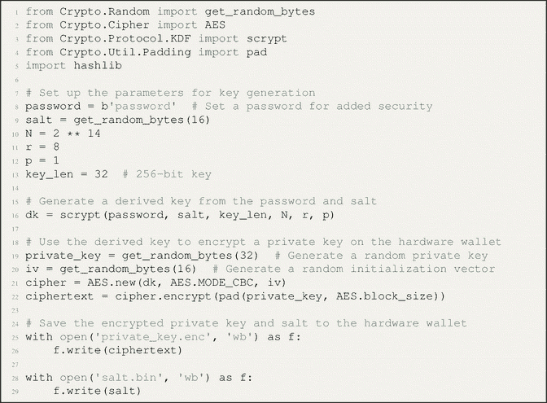

此程序生成一个私钥，并使用从用户提供的密码和随机盐值派生出的密钥，通过高级加密标准（AES）加密对其进行加密。加密后的私钥和盐值随后被保存到硬件钱包中。

为了在硬件钱包上安全签名交易，你可以使用以下利用 `pycryptodomex` 库的 Python 代码：

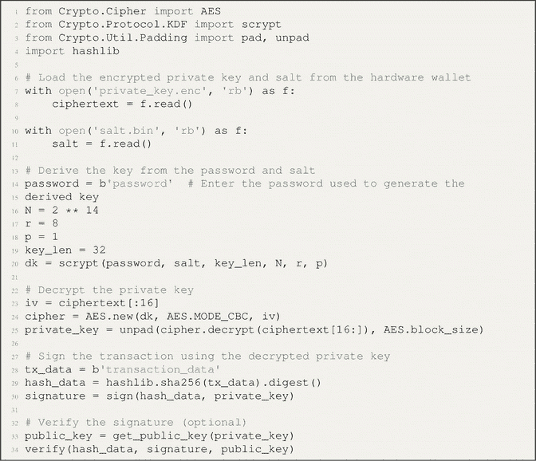

### 3.11.2 生成公钥-私钥对、安全加密并存储私钥以及使用私钥签名交易的程序

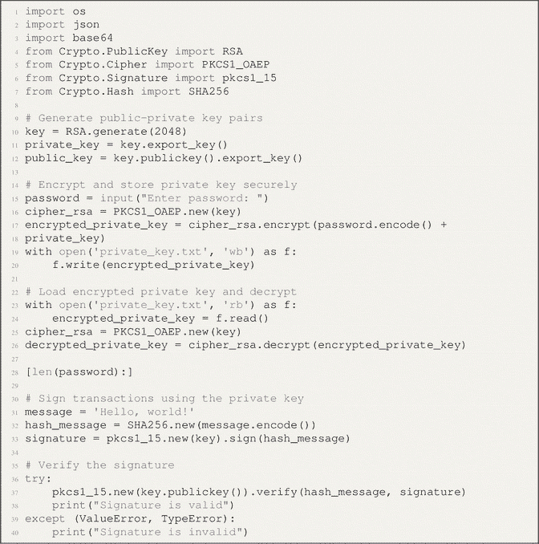

此程序使用 `Crypto` 库生成公钥-私钥对，安全地加密并存储私钥，并使用私钥对交易进行签名。私钥使用用户提供的密码进行加密，然后存储在一个文件中。当用户想要签名一笔交易时，他们输入密码来解密私钥，并使用该私钥对交易进行签名。然后可以使用公钥验证签名。

### 3.11.3 演示数字钱包部分功能的程序

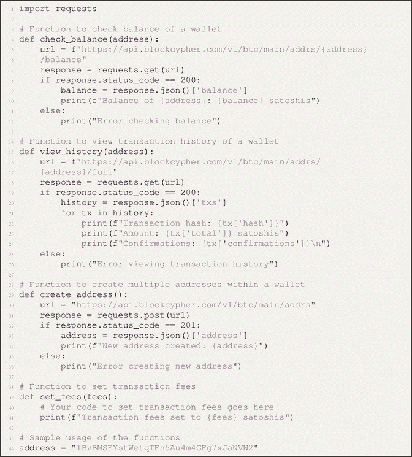

此程序使用 `requests` 库与 BlockCypher 提供的比特币区块链应用程序编程接口（API）进行交互。`check_balance()` 函数以一个比特币地址为输入，并检索该地址的余额。`view_history()` 函数检索该地址的交易历史。`create_address()` 函数在钱包内创建一个新的比特币地址。`set_fees()` 函数为钱包设置交易手续费。

请注意，此程序只是一个示例；在实际实现中，你需要妥善处理错误和边缘情况，并实现额外的功能和安全措施。

### 3.11.5 使用 Remix IDE 等工具将智能合约部署到区块链的程序

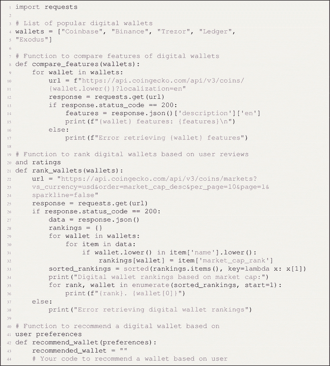

此程序假定您已编译智能合约，并将生成的 ABI 和字节码保存在名为 `MyContract.json` 的 JSON 文件中。它会连接到运行在 `http://localhost:8545` 上的本地区块链，获取区块链上的第一个账户来部署合约，并使用构造函数部署合约。然后，它通过调用函数和发送交易与合约交互，并通过调用返回状态的函数来获取合约的状态。

### 3.11.6 在以太坊网络上使用不同 Gas 上限测量 EOA 到 EOA 交易及 CA 到 CA 交易吞吐量的程序

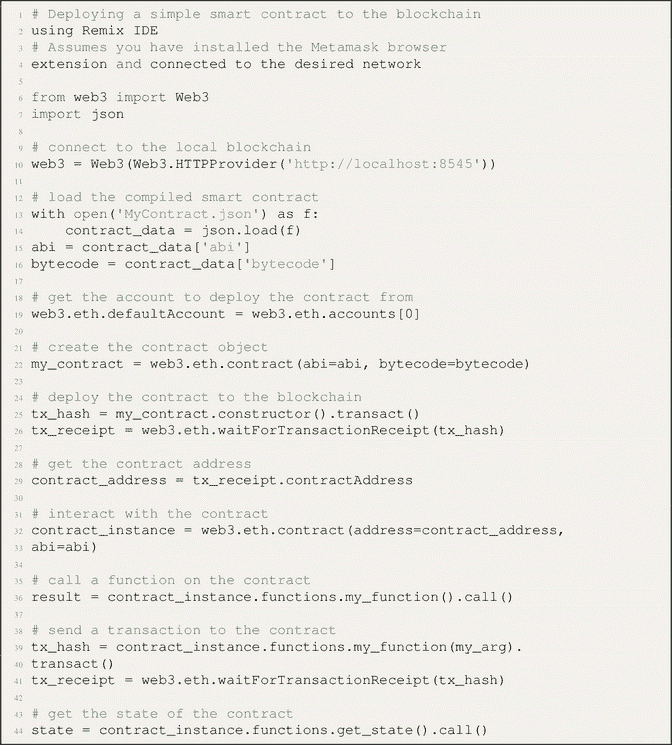

首先，导入与以太坊网络交互的 `Web3` 模块。

接下来，使用 `Web3` 建立与以太坊节点的连接。在此示例中，与在端口 `8545` 上本地运行的节点建立连接。

Gas 上限测试表示一笔交易中可以使用的最大的 Gas 数量。

我们通过执行以下步骤，测量每个 Gas 上限下外部拥有账户（EOA）到外部拥有账户（EOA）交易的吞吐量：

首先，我们使用 `web3.eth.account.create()` 方法创建两个新的以太坊账户（EOA）。这些账户将用于发送和接收交易。接着，我们使用 `web3.eth.sendTransaction()` 方法为这些账户注入一些以太币。这是必要的，以便有足够的以太币支付交易费。然后，我们使用 `web3.eth.sendTransaction()` 方法测量从其中一个账户向另一个账户发送一定数量交易（本例中为 100 笔）所需的时间。我们对每笔交易使用指定的 Gas 上限。最后，我们将发送的交易数量除以发送它们所用的时间，计算出每个 Gas 上限下的交易吞吐量（每秒交易数）。在测量完 EOA 到 EOA 交易的吞吐量后，我们通过执行以下步骤测量 CA 到 CA 交易的吞吐量：首先，我们使用 `web3.eth.contract()` 方法将一个智能合约部署到以太坊网络。该智能合约将用于发送和接收交易。接着，我们使用 `contract.functions.transfer()` 方法测量智能合约自身之间发送一定数量交易（本例中为 100 笔）所需的时间。我们对每笔交易使用指定的 Gas 上限。最后，我们将发送的交易数量除以发送它们所用的时间，计算出每个 Gas 上限下的交易吞吐量（每秒交易数）。我们打印实验的结果，显示每个 Gas 上限和交易类型下的交易吞吐量。

### 3.11.7 使用 Web3 将以太坊地址分类为 EOA 或合约地址，并在大型地址数据集上评估其准确性和性能的程序

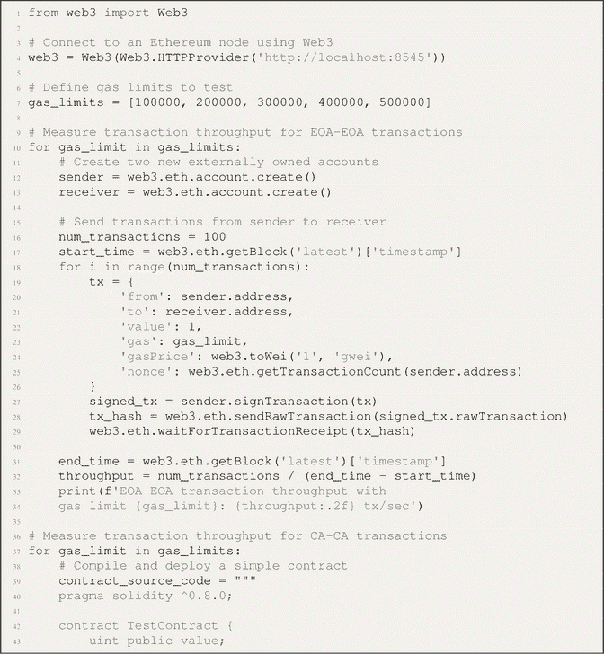

我们导入 `Web3` 模块，并使用 `Web3(HTTPProvider(‘http://localhost:8545’))` 连接到本地以太坊节点。我们使用 `open(‘addresses.txt’, ‘r’)` 从文本文件加载一个大型以太坊地址数据集。我们定义了一个名为 `categorize_address()` 的函数，该函数接收一个以太坊地址作为输入，并返回一个字符串，指示该地址是 EOA 还是合约地址。我们使用 `web3.isChecksumAddress()` 检查地址是否为有效的以太坊地址，并使用 `web3.eth.getCode()` 检查该地址是否有代码字段（表明它是一个合约地址）。

我们在几个示例地址上测试 `categorize_address()` 函数，以确保其正常工作。

我们遍历数据集中的所有地址，并使用 `categorize_address()` 函数对每个地址进行分类。我们使用名为 `results` 的字典跟踪每个类别中的地址数量。

我们打印分类结果，显示每个类别（EOA、合约和无效）中的地址数量。

### 3.11.8 模拟以太坊网络上交易生命周期并测量所需时间和资源的程序

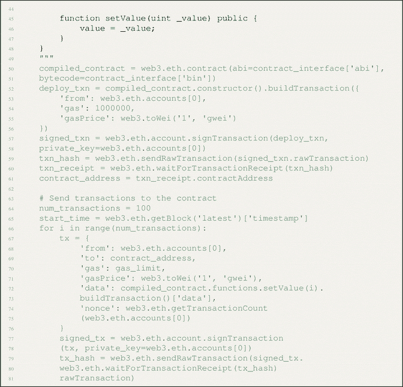

### 3.11.9 实现 ECDSA 的程序

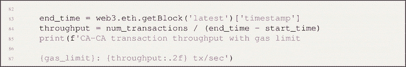

这段代码生成一个随机的 ECDSA 私钥，从中导出公钥，使用私钥对消息进行签名，并使用公钥验证签名。然后，它使用 SHA-256 对消息进行哈希，并从 ECDSA 签名生成一个比特币风格的签名，该签名以十六进制格式打印出来。

### 3.11.10 使用 bitcoinlib 库创建比特币交易并使用 SIGHASH 标志签名的程序

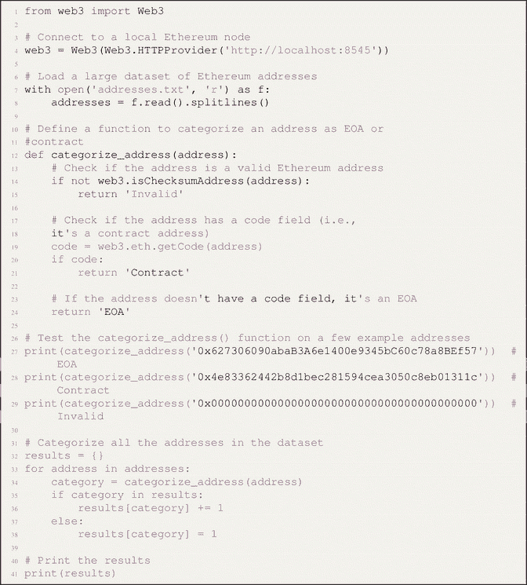

此代码创建了一个包含一个输入和一个输出的新比特币交易，设置 `SIGHASH` 标志为仅对当前输入签名，使用私钥签署交易，并将签名设置到交易输入中。最后，它以十六进制格式打印出已签名的交易。请注意，这是一个非常基础的示例，在实际创建和签名比特币交易时，需要考虑更多细节。

### 3.11.11 比特币挖矿程序

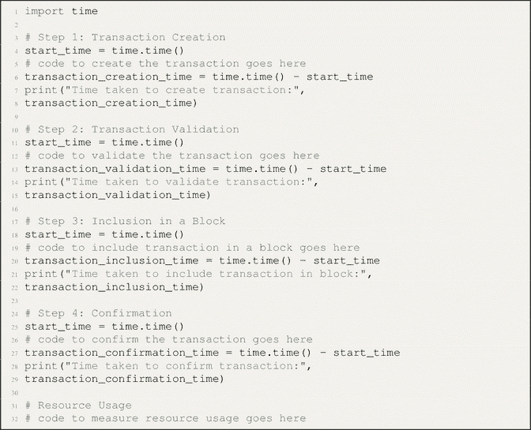

#### 3.11.11.1 示例输入

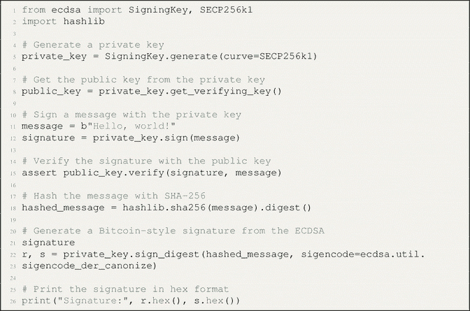

#### 3.11.11.2 示例输出

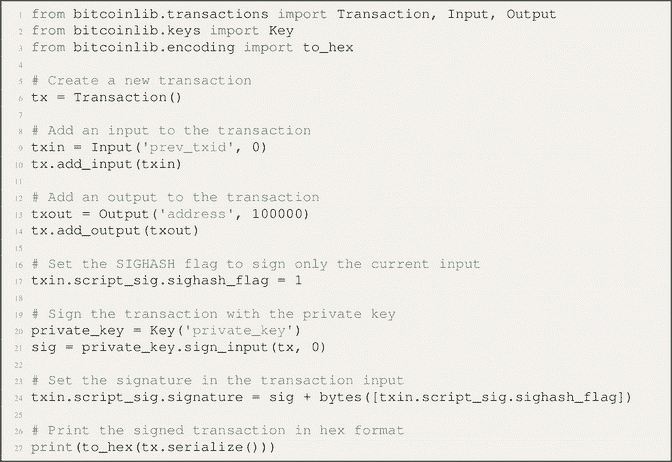

在此示例中，难度级别设置为 3，这意味着区块哈希必须有三个前导零才能被视为有效。该程序创建了三个区块，每个区块引用前一个区块的哈希。然后，程序使用工作量证明（PoW）算法挖每个区块，这涉及递增 `nonce` 值，直到找到有效的区块哈希。程序打印出每个区块的区块哈希以及挖出该区块所经过的时间。

### 3.11.12 演示如何识别区块链上的 51% 攻击的程序

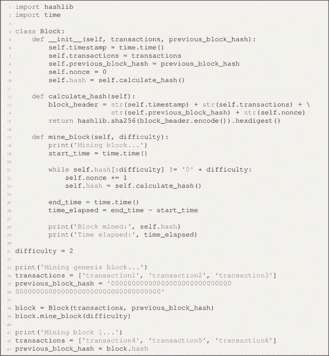

在这个程序中，我们定义了一个 `Block` 类，其中包含数据、前一个区块的哈希以及自身的哈希。然后，我们定义了一个 `Blockchain` 类，该类跟踪一个区块列表，并包含用于添加区块、验证链以及检查 51% 攻击的函数。

`validate_chain()` 函数遍历链中的每个区块，并检查哈希和前一个哈希是否有效。`get_chain_length()` 函数返回链的长度，`get_chain_hashrate()` 函数计算链的总哈希率。

`check_for_51_percent_attack()` 函数检查链中是否有任何区块的哈希值大于链总哈希率的 51%。如果某个区块的哈希大于 51%，则该函数打印出区块编号并返回 `True`。如果没有区块的哈希大于 51%，该函数会打印一条消息，表示未检测到 51% 攻击并返回 `False`。

通过在有效的区块链上调用 `check_for_51_percent_attack()` 函数，我们可以判断该区块链上是否发生了 51% 攻击。

### 3.11.13 演示分叉概念的程序

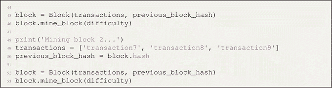

在此程序中，我们定义了一个代表区块链中区块的 `Block` 类，以及一个代表区块链本身的 `Blockchain` 类。我们还定义了两个函数 `thread_1` 和 `thread_2`，它们负责向区块链中添加区块。我们为每个函数创建一个线程，并启动它们。最后，我们等待两个线程执行完毕，并打印出区块链的内容。

当线程向区块链添加区块时，它们都使用同一个区块链实例，这意味着它们都在修改相同的数据结构。这类似于区块链中的分叉，即两组节点正在修改同一个区块链数据结构，从而可能产生两条不同的链。

当我们运行这个程序时，可以看到两个线程都会向区块链添加区块，但它们并不会产生两条不同的链。相反，这些区块按照确定的顺序被添加，最终的区块链包含了来自两个线程的所有区块，且顺序相同。这是因为 Python 的全局解释器锁（`GIL`）阻止了真正的并行执行，意味着同一时间只有一个线程能执行。在实际的区块链中，由于存在真正的并行性，可能会发生分叉，并且节点可能创建出不同的链。

### 3.11.14 检测与处理比特币区块链 51% 攻击的程序

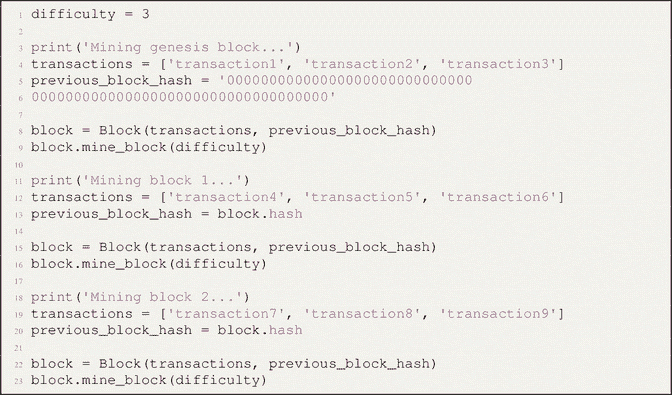

**代码解释**

该程序会检查网络当前的哈希率以及过去一小时内挖掘出的区块数量。如果这两个值都低于特定的（可调整）阈值，则会显示一条指示可能存在 51% 攻击的消息。在实际场景中，你需要一个更先进的系统，并且可能需要其他比特币网络参与者和矿工的协作来对抗此类攻击。

请注意，应对比特币的 51% 攻击需要矿工、开发者以及更广泛的比特币社区进行协调努力。单个用户无法凭借自身力量有效地预防或减轻此类攻击。

### 3.12 本章小结

本章全面介绍了比特币，涵盖了其技术和生态系统的各个方面。本章首先解释了什么是比特币及其历史背景。接着深入探讨了预测的市场趋势和数字钱包的概念。本章还探讨了数字密钥与地址、交易、数字签名，以及比特币中的挖矿与共识机制。

此外，本章讨论了分叉，包括导致创建两条独立链的硬分叉和软分叉。本章在下一节的实验工作示例中结束，这些示例包括与生成私钥、创建数字钱包、部署智能合约以及实现 ECDSA 相关的程序。

通过整章的阅读，读者能够理解比特币的基本概念、其市场潜力、钱包和地址的作用、交易流程、数字签名的重要性、挖矿与共识机制，以及分叉在比特币网络中的影响。

实验工作示例提供了使用比特币相关工具和概念的实践经验，使读者能够在比特币技术的关键领域获得实用技能。

### 3.13 练习

本节提供基于本章所涵盖主题的练习题。

#### 3.13.1 选择题

1. 什么是比特币？
    1. 一种中心化数字货币
    2. 一种去中心化数字货币
    3. 一种实物货币形式
    4. 一种政府监管的货币

2. 比特币中数字钱包的目的是什么？
    1. 安全地存储和管理比特币
    2. 挖掘新的比特币
    3. 监管比特币交易
    4. 创建新的比特币

3. 托管钱包与非托管钱包的区别是什么？
    1. 托管钱包每笔交易需要收费，而非托管钱包是免费的。
    2. 托管钱包由第三方管理，而非托管钱包让用户完全控制其资金。
    3. 托管钱包只能在线访问，而非托管钱包是离线的。
    4. 托管钱包提供比非托管钱包更高的安全特性。

4. Ledger Nano S 属于哪种类型的钱包？
    1. 托管钱包
    2. 非托管钱包
    3. 软件钱包
    4. 硬件钱包

5. 比特币中的私钥是什么？
    1. 用于访问公共 Wi-Fi 网络的密钥
    2. 用于解锁比特币交易的密钥
    3. 用于加密比特币交易的密钥
    4. 控制比特币挖矿过程的密钥

6. 比特币中交易的目的是什么？
    1. 将比特币从一个地址转移到另一个地址
    2. 创建新的比特币
    3. 调节比特币市场
    4. 挖掘新的比特币区块

7. 比特币挖矿中的共识机制是什么？
    1. 权益证明（PoS）
    2. 工作量证明（PoW）
    3. 委托权益证明（DPoS）
    4. 拜占庭容错（BFT）

8. 比特币挖矿相关的成本是什么？
    1. 购买比特币硬件的成本
    2. 挖矿过程中消耗的电费成本
    3. 比特币交易手续费的成本
    4. 数字钱包中存储比特币的成本

9. 比特币中的硬分叉是什么？
    1. 区块链的临时分裂
    2. 区块链的永久分裂
    3. 比特币协议的一次升级
    4. 比特币挖矿难度的变化

10. “比特币 1”中实验工作的主要目的是什么？
    1. 模拟真实的比特币交易
    2. 探索不同数字钱包的功能
    3. 提供与比特币相关概念和工具的实践经验
    4. 分析比特币的市场趋势

#### 3.13.2 简答题

1. 定义比特币：
2. 数字钱包在比特币中的重要性是什么？
3. 区分托管钱包和非托管钱包。
4. 列举两种用于存储比特币的数字钱包。
5. 解释比特币中私钥的概念。
6. 比特币网络中交易的目的是什么？
7. 简要描述比特币挖矿中的共识机制。
8. 影响比特币挖矿成本的因素有哪些？
9. 在比特币的语境中定义硬分叉。
10. “比特币 1”中实验工作的主要目的是什么？

#### 3.13.3 问答题

1. 解释创建比特币交易的过程，包括所涉及的关键组成部分以及为确保其有效性和安全性而采取的步骤。

2. 讨论矿工在比特币网络中的作用以及他们如何为共识机制做出贡献。解释挖矿过程以及激励矿工参与维护网络安全的因素。

3. 描述比特币中区块链的概念及其在维护透明且去中心化账本中的作用。讨论将交易添加到区块链的过程，以及它在安全性和信任方面带来的好处。

4. 比较并对比用于存储比特币的不同类型的数字钱包，包括软件钱包、硬件钱包和纸钱包。讨论它们各自的优点、缺点以及安全方面的考虑。

5. 分析交易费用对比特币网络的影响。讨论影响交易费用的因素、矿工在选择费用方面的作用，以及与扩展网络以适应更大交易量相关的挑战。

6. 解释比特币中硬分叉的概念，并讨论与分叉相关的潜在后果和挑战。提供比特币历史上著名的硬分叉示例及其对网络和用户的影响。

7. 讨论使用比特币所涉及的潜在风险和安全考虑，包括数字钱包的漏洞、中心化交易所的风险，以及私钥管理和交易验证等安全实践的重要性。

8. 探讨比特币网络当前和未来面临的挑战，包括可扩展性问题、监管问题以及量子计算等新兴技术的潜在影响。讨论可能解决这些挑战并确保比特币长期可行性的潜在解决方案和进展。