# 4. 以太坊区块链

**关键词：** `概述`、`以太坊虚拟机`、`智能合约`、`共识`、`状态机`、`扩展`

以太坊区块链是一个去中心化的开源平台，支持创建和执行智能合约。它由维塔利克·布特林于 2015 年提出，此后成为最流行的区块链网络之一。以太坊允许开发者在其区块链上构建去中心化应用（`DApps`），为他们提供强大的基础设施和广泛的功能。其原生加密货币`以太币`（`ETH`）在网络内用于多种用途，例如支付交易费用和提供激励。

## 4.1 以太坊区块链概述

以太坊是一项革命性的技术，它促进加密货币`以太币`（`ETH`）无缝、低成本地转移给世界上任何人。然而，其功能远不止于一种数字货币。以太坊是一个强大的平台，使开发者能够创建和部署无法被压制、抗审查的去中心化应用（`DApps`）。

它的一些关键特性如下：

- **向任何人发送加密货币仅需少量费用：** `ETH`，以太坊的原生加密货币，使用户能够发送和接收数字货币。使用以太坊的网络，用户可以安全地从一个账户向另一个账户转移`ETH`，并且与传统金融系统相比费用相对较低。一个由节点组成的分布式网络处理并验证这些交易，确保价值传输的可信且不可篡改。
- **驱动 DApps：** 除了基本的加密货币转账，以太坊还为`DApps`的开发提供了强大的基础设施。`DApps`是利用以太坊区块链的智能合约功能运行的软件应用程序。这些应用程序可能包括去中心化交易所和借贷平台等金融工具，以及社交网络、娱乐应用程序和供应链解决方案。
- **不可停机和抗审查：** 无许可和抗审查的特性是以太坊最显著的优势之一。在以太坊上部署的`DApps`运行在去中心化网络上，这与可能被中心化机构控制或关闭的传统应用和平台不同。一旦智能合约被部署，它就成为区块链的一部分，并且所有参与方都可以访问。这确保了`DApps`无法轻易被关闭或审查，提供了去中心化系统独有的自由度和韧性。
- **无许可区块链和智能合约：** 任何人均可以作为用户或节点参与以太坊网络，无需获得中心化机构的许可。由于开发者可以自由地在平台上构建，这种可访问性促进了包容性并鼓励创新。此外，以太坊的区块链能够执行智能合约，这些合约是用代码编写的、可自动执行的协议。智能合约促进了各种流程和协议的自动化，无需中介，从而降低了成本并提高了生产力。

以太坊是一项超越单纯加密货币的创新技术。它是一个灵活的平台，既支持价值（加密货币）的传输，也赋能开发者构建海量的`DApps`。通过利用智能合约的力量并在无许可区块链上运行，以太坊实现了无需信任的交互、抗审查能力，并构建了一个开放、去中心化的生态系统，惠及所有人。

### 4.1.1 关键特性

作为最具影响力的区块链平台之一，以太坊拥有许多区别于传统系统的显著特征和特质。让我们来了解其中最重要的几点：

- **智能合约：** 以太坊的典型特征之一是其执行智能合约的能力。智能合约是将条款和条件直接写入代码的自动执行协议。它们能够实现合约义务的自动化与自动强制执行，无需中介参与，从而减少对传统法律体系的依赖，增强数字交互中的信任。
- **去中心化：** 以太坊作为去中心化网络运行，这意味着没有中央权威机构或单一控制点。该平台由全球分布的节点网络支持，每个节点都参与交易验证和智能合约执行。与中心化系统相比，这种去中心化特性提供了更高的安全性、韧性和抗审查能力。
- **以太坊虚拟机（EVM）：** EVM是以太坊平台的关键组件。它是一个运行时环境，用于执行用多种编程语言编写的智能合约，其中最常用的是 Solidity 语言。EVM 确保所有节点一致地执行相同的代码，并对智能合约的输出达成共识。
- **以太币（ETH）加密货币：** 以太坊拥有自己的原生加密货币`ETH`，在网络中具有多种用途，包括支付交易费用和计算服务费用。它也被用作交换媒介和数字资产。
- **互操作性与标准：** 以太坊遵循一系列标准，这些标准定义了代币和智能合约的创建方式及在网络上运行的方式。最著名的标准是`ERC-20`，它规定了可互换代币的创建与实现。`ERC-721`是另一个值得注意的标准，用于非同质化代币（`NFTs`），代表独特的资产。
- **去中心化应用（DApps）：** 以太坊促进了 DApps 的开发和部署。DApps 是在以太坊区块链上运行并与智能合约交互的软件应用程序。DApps 涵盖了金融、游戏、供应链、治理等多个行业。
- **可升级协议：** 以太坊的可升级协议允许实施以太坊改进提案（`EIPs`）来提升平台功能并解决问题。然而，由于潜在的网络中断和兼容性问题，升级需要社区共识并经过慎重考虑。
- **社区与发展：** 以太坊拥有一个由开发者、爱好者和贡献者组成的大型且充满活力的社区。平台的开源特性鼓励持续发展，促进了参与者之间的创新与协作。
- **以太坊 2.0：** 以太坊正通过以太坊 2.0 升级，从工作量证明（`PoW`）共识机制过渡到权益证明（`PoS`）共识机制。`PoS`预计将提高网络的可扩展性、安全性和能源效率。
- **不可变区块链：** 一旦数据记录到以太坊区块链上，它们就变得不可变，这意味着无法被更改或删除。这一特性确保了交易和智能合约交互的永久性和透明性。

### 4.1.2 以太坊虚拟机 (EVM)

尽管 EVM 的物理实例不能比作云朵或海浪，但它实际上是由数千台相互连接的计算机（每台都运行着以太坊客户端）作为一个单一实体进行管理的。

以太坊协议的设计初衷就是为了确保这种独特的状态机能够不间断、不改变地运行。所有建立在以太坊上的账户和智能合约都存在于这个生态系统中。每个区块链区块上，以太坊只存在于一个所谓规范状态中，而 EVM 则规定了在每个区块链区块上达到新有效状态的标准。

## 4.2 以太坊历史

维塔利克·布特林在 2013 年提出了以太坊的想法。2015 年，去中心化应用（DApps）得以实现。以太坊获得了许多新特性，并于 2022 年从`PoW`转变为`PoS`，从而降低了能耗。如今，以太坊是一个领先的区块链工具，推动着去中心化世界的新想法。以太坊历史上的各个里程碑总结在表 4-1 中。

### 4.2.1 从账本到状态机

近年来，区块链和分布式账本技术平台经历了快速发展，提供了公有链、许可链和私有链等多种网络，每种网络都具备各自的智能合约能力。然而，分布式账本及其交易处理的基本概念是所有这些平台的核心。在本文中，我们将从计算机科学的角度审视这一共性。表 4-2 对区块链和分布式账本技术平台进行了结构化的对比分析。

账本维护着两个基本属性：**不可篡改**和**仅可追加**。涉及验证和共识机制的请求或命令用于向分布式账本添加交易。一旦交易被记录，就会触发状态转换。例如，如果 Alice 向 Bob 发送十个代币，Alice 的钱包余额将减少十个，而 Bob 的钱包余额将增加十个。

账本的当前状态是所有历史交易的结果。在分布式环境中，这种完整性对于在多个节点之间达成共识至关重要。因此，账本充当了一种状态机的形式。它可以定义为具有以下特征的“**账本状态机**”：

- 交易引发状态转换。
- 机器状态是所有先前交易的纯函数。

**表 4-2 对比：账本与状态机**

| 概念 | 描述 |
| --- | --- |
| 区块链及分布式账本技术平台 | 这些技术经历了快速发展，提供了多种类型的网络：公有链、许可链和私有链。每种网络均集成了针对其特定用例量身定制的智能合约功能 |
| 基本概念 | 所有区块链和分布式账本技术平台共享的核心概念是分布式账本。该账本作为去中心化且防篡改的交易记录 |
| 交易处理 | 这些平台的核心在于交易处理机制。该机制是分布式账本运行的基础，确保交易记录的安全性和可靠性 |

**表 4-1 以太坊发展历史**

| 年份 | 关键里程碑 |
| --- | --- |
| 2013 | 维塔利克·布特林在白皮书中提出以太坊概念 |
| 2014 | 以太坊项目宣布并开始开发 |
| 2015 | 以太坊公共测试网 Olympic 面向开发者启动 |
| 2015 | 以太坊首个正式版本 Frontier 上线 |
| 2016 | 去中心化自治组织 The DAO 启动后遭黑客攻击，引发争议性硬分叉 |
| 2017 | 以太坊市值超过 1000 亿美元，成为最大的加密货币之一 |
| 2017 | 以太坊企业联盟成立，旨在推动以太坊在商业领域的应用 |
| 2018 | 以太坊网络升级 Constantinople 启动，旨在提升可扩展性并降低交易成本 |
| 2020 | 以太坊 2.0 启动分阶段部署，从工作量证明共识机制过渡到权益证明 |
| 2021 | 以太坊网络升级 London 引入 EIP-1559，改变费用结构并销毁部分交易费用 |
| 2021 | 以太坊价格创历史新高，每枚 ETH 超过 4,000 美元 |
| 2022 | 以太坊生态系统持续开发和升级，重点关注可扩展性和可持续性 |

尽管该模型缺乏有限状态机的简洁性和图灵机的完整计算能力，但由于以下特性，它仍提供了一些有用的特征：

- 它是无限的，不受有限状态机限制。
- 它不一定是计算模型，也缺乏图灵机的全部能力。

尽管该模型不具备有限状态机的简洁性或图灵机的完整计算能力，但它因其关键属性而具备若干有用特性：

- 状态无需显式存储，因为它始终可以被重新计算。
- 因此，状态可以在历史中的任何时间点被重新生成。
- 记录和状态由于其不可篡改性而易于复制。
- 由于易于复制，对记录和状态的计算可以轻松扩展。

以这种方式定义这一概念至关重要，以便于后续步骤的进行：

- 将此模型与关系数据库技术系统的典型运行方式进行比较。
- 基于“所有区块链框架都共享这一共同概念”的断言，比较不同区块链平台和框架的状态机运作方式。
- 定义代码中的低级构造，这些构造是从第一性原理设计区块链的基础。

值得注意的是，这些想法和概念并非完全新颖；通过搜索诸如“区块链状态机”之类的术语，或认识到命令查询职责分离/事件溯源范式中的`AggregateRoot`状态是其所有影响事件的纯函数，都可以找到类似的讨论。

### 4.2.2 以太坊网络

以太坊网络上的交易和智能合约由一个名为“节点”的分布式计算机网络进行验证和处理。网络中的每个参与者都拥有完整区块链的副本，包括所有历史交易数据和任何智能合约的代码。

当一台机器运行允许其参与网络的应用程序（例如以太坊客户端）时，它就成为了以太坊网络中的一个节点。该节点负责确认智能合约和交易的正确性，并与其他节点保持区块链同步。

网络中的节点共同就当前状态达成共识，从而保证区块链的完整性和一致性以及所有交易的合法性。由于其去中心化结构和共识过程（通常是工作量证明或正在迁移至权益证明），以太坊网络具有弹性，并能抵抗单点故障。

最简单的以太坊网络形式如图 4-1 所示。它具有作为工作量证明的共识机制，与以太坊网络中的其他节点进行交互。它还具有维护以太坊状态的以太坊状态、执行智能合约的以太坊虚拟机以及交易池。这些交易应存在于以太坊客户端的内存中，并可在区块链中进一步验证和挖矿。除了上述组件外，点对点模块负责与以太坊网络中的其他以太坊客户端节点进行通信。

在以太坊网络中，没有中央主机或权威机构，独立节点在此相互连接。

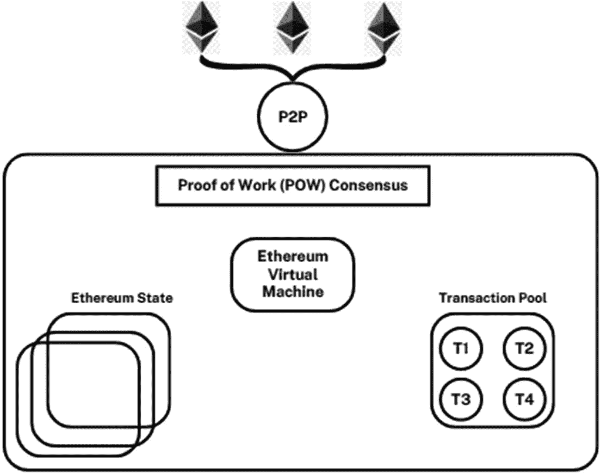

*图表展示了以太坊网络，从下至上分别表示以太坊状态、交易池、以太坊虚拟机、工作量证明共识和点对点网络。*

**图 4-1** 以太坊网络

## 4.3 智能合约

智能合约是存储在基于区块链的平台上，并能自动执行合约部分内容的计算机程序。它们可以独立运作，也可以与传统文本合约协同，执行诸如在各方之间转移资金等职责。在区块链上，代码会在多个节点间复制，从而提供安全性和持久性。智能合约使用例如 `Solidity` 这样的编程语言编写，并且需要既具体又客观的执行参数。目前，它们只能执行基本任务，例如加密货币转账。随着区块链采用的增加，将会开发出更复杂的智能合约。然而，代码要能适应主观的法律标准仍需多年时间。在智能合约能在某些区块链上执行之前，必须支付一笔称为“燃料费（gas）”的交易费用。

目前，智能合约最适合用于在预设事件发生时自动执行资金支付，或根据客观条件施加经济处罚。它们减少了对人工干预、托管代理和司法系统的需求，从而降低了执行和强制履约的成本。例如，它们可以在产品交付时自动进行支付转账，并简化采购到付款的流程。在强制执行方面，如果未收到付款，它们可以禁用对联网资产的访问权限。

智能合约是众多区块链应用的关键组成部分；然而，它们作为美国合同法下的法律协议的可执行性，突显了许多在广泛应用之前必须解决的法律和实践考量。

## 4.4 实施智能合约面临的挑战

实施智能合约面临的挑战如下：

- **非技术方**：非技术方可能难以协商、起草和理解智能合约，这就需要技术专家来将协议精确地编码为代码。
- **链下资源**：智能合约经常需要与链下资源交互，这可能导致潜在的数据准确性问题，并需要依赖可信的第三方预言机。
- **最终协议不确定性**：当文本和代码相互矛盾时，确定智能合约中的最终协议可能很困难，需要明确哪一方具有优先权。
- **自动化与业务实践**：智能合约的自动化性质可能与实际业务实践不符，因为各方无法轻易豁免违约或容忍部分履约。
- **修改与终止**：由于区块链的不可篡改性，修改智能合约可能既困难又昂贵，并且各方在缺乏自助救济措施的情况下，终止合约可能遇到困难。
- **客观性与模糊性**：在谈判过程中，智能合约所需的客观性可能与传统文本合约中普遍存在的灵活性和模糊性发生冲突。
- **支付保证**：尽管智能合约可以编排支付，但当与合约相关的钱包中没有足够的可用资金时，可能会出现实际操作的复杂情况。
- **风险分配**：智能合约引入了新的风险，如编码错误和网络攻击，这可能需要在各方与第三方开发者之间明确分配风险。
- **管辖法律与审判地**：为了使智能合约得到全球采用，各方可能需要指定管辖法律和审判地条款，以保证可预测的争议解决机制。
- **最佳实践**：随着智能合约采用的不断发展，最佳实践包括使用将文本和代码相结合、处理风险分配并指定适用法律和审判地的混合方法。

### 4.4.1 智能合约生命周期

智能合约生命周期指的是智能合约所经历的各个阶段，从它在区块链上的最初发布开始，到最终可能的销毁结束。以下是每个阶段的简要描述。

- **发布到零地址**（`0x0000000000000000000000000000000000000000`）：当创建智能合约时，它会被部署到区块链网络上，并获取一个唯一地址。零地址通常表示为`0x0000000000000000000000000000000000000000`，是一个特殊地址，用于表明合约已发布，但尚未在区块链上分配唯一地址。此时，合约处于非活跃状态，无法执行。
- **通过交易调用**：一旦智能合约发布并在区块链上被指定了唯一地址，就可以通过交易来调用或与之交互。用户或其他合约可以发起对智能合约功能和状态的交互。当被有效交易触发时，合约代码将在区块链上执行，并可能相应地执行操作或修改其内部状态。
- **可能被销毁**：智能合约可以被设计成可终止或可销毁的。这通常通过一个特殊函数实现，该函数允许合约创建者或指定用户终止合约，释放其正在使用的任何资源，并将其从区块链上永久移除。然而，必须注意的是，并非所有智能合约都具备此“自毁”功能。合约能否终止取决于其创建者如何编程。

EVM 语言集 `LLL`（类 Lisp，最早但很少使用）、`Serpent`（类 Python）、`Solidity`（类 JavaScript）、`Vyper`（类 Python）和 `Bamboo`（类 Erlang）是用于 EVM 的高级编程语言。这些语言用于编写智能合约以及与以太坊区块链进行交互。

### 4.4.2 介绍 Solidity

`Solidity` 是一种专为编写以太坊智能合约而设计的高级编程语言。

- `Solidity` 是在以太坊区块链上构建智能合约的主要语言之一。`Solidity` 由以太坊联合创始人**加文·伍德**开发。
- `Solidity` 仍然是创建以太坊智能合约最广泛使用的高级语言。其早期被接受、全面的文档、庞大的开发社区以及先进的功能集都促成了其广泛的吸引力。
- 它拥有创建复杂且安全的智能合约所需的许多有用特性和功能。它使程序员能够设计并实现自己的数据结构、处理继承、控制访问以及执行业务逻辑。
- 尽管被广泛采用，`Solidity` 并非没有问题。在编写安全的`Solidity`智能合约时，应仔细考虑重入攻击、整数溢出以及区块链开发中的其他陷阱。
- 作为以太坊智能合约最流行的语言，`Solidity` 在社区的努力下不断改进，并发展出构建安全高效合约的最佳实践。较新的语言，如`Vyper`，已成为`Solidity`的替代方案，旨在弥补其某些缺点，尤其是在安全性和可读性方面。

#### 4.4.2.1 Solidity 数据类型

以太坊使用的 `Solidity` 编程语言中最重要的数据类型包括以下几种：

`bool`：`bool` 数据类型用于表示布尔值，可以是 `true` 或 `false`。它是智能合约中条件语句和逻辑运算的基础。

`int`、`uint`：这些是分别用于表示有符号整数（使用 `int`）和无符号整数（使用 `uint`）的数据类型。它们有不同的变体，例如 `int8`、`int16`、`uint8`、`uint16`，直至 `int256` 和 `uint256`。默认类型是 `uint256`，表示一个 256 位的无符号整数。

`fixed`、`ufixed`：这些是定点数类型。它们类似于浮点数，但小数点固定，因此非常适合需要高精度的金融计算。

`address`：`address` 数据类型用于存储以太坊地址。地址用于表示以太坊网络上的用户账户或智能合约。一个地址的大小是 20 字节。

**数组 (Arrays)**：`Solidity` 允许您创建数组，即相同类型元素的集合。它们可以是动态的（执行期间长度可变）或静态的（长度固定）。

**时间单位 (Time units)**：`Solidity` 提供了处理时间相关值的时间单位。例如，您可以使用 `seconds`、`minutes`、`hours`、`days` 和 `weeks` 作为单位来表示智能合约中的时间跨度。

**以太币单位 (Ether units)**：以太坊拥有原生加密货币 ETH。根据面额不同，使用不同的单位来表示 ETH：

`wei`：ETH 的最小单位（1 wei = 1 ETH / 10¹⁸）。
`finney`：1 ETH = 1,000 finney。
`szabo`：1 ETH = 1,000,000 szabo。
`ether`：基本单位，1 ETH = 1 ether。

### 4.4.3 全局变量

`Solidity` 中的全局变量是预先设置好的变量，可以在智能合约中的任何位置访问。这些变量对于理解当前交易、其上下文以及区块链的当前状态至关重要。在合约执行期间，智能合约开发者可以访问并利用这些关键信息。

- **`msg`** – 交易调用。
    - **`msg.sender`**：发起当前交易的发送方的以太坊地址。它表示触发当前函数执行的账户或智能合约。
    - **`msg.value`**：随交易调用一起发送的以太币数量（以 wei 为单位）。它表示附加在交易上的价值或支付。
    - **`msg.gas`**：当前交易剩余的 gas 量。它表示可用于执行当前函数的 gas，任何未使用的 gas 将退还给发送方。
    - **`msg.data`**：交易的数据负载。它包括函数选择器以及调用智能合约函数时提供的任何附加参数。
    - **`msg.sig`**：`msg.data` 的前四个字节，代表函数选择器。它用于确定调用的是智能合约中的哪个函数。

- **`tx`** – 交易。
    - **`tx.gasprice`**：交易发送方设定的 gas 价格（以 wei 为单位）。gas 价格决定了发送方愿意为交易中每单位 gas 支付的 ETH 数量。

- **`block`** – 交易所在的区块。
    - **`block.coinbase`**：挖掘该区块的矿工地址。它代表成功挖出该区块后获得区块奖励的以太坊账户。
    - **`block.difficulty`**：区块的难度级别。难度值衡量了挖掘该区块的困难程度，并会动态调整以维持稳定的区块产出率。
    - **`block.gaslimit`**：区块中允许的最大 gas 总量。它限制了区块内所有交易的总 gas 消耗。
    - **`block.number`**：当前区块的区块号。它是分配给区块链中每个新区块的顺序编号。
    - **`block.timestamp`**：当前区块的时间戳，以自纪元时间（1970 年 1 月 1 日）以来的秒数衡量。它表示区块被挖出的时间。

### 4.4.3.1 合约的构造与销毁

合约的构造与销毁是 Solidity 智能合约生命周期中的重要方面。下文将解释合约是如何被构造和销毁的。

#### 构造合约

Solidity 中的合约通过构造函数创建，这是一个与合约同名的特殊函数。构造函数仅在合约部署时执行一次，用于初始化合约的状态并执行合约正常运行所需的任何设置。

在较旧版本的 Solidity 中，构造函数与合约同名，但从 Solidity 0.5.0 版本开始，它通过 `constructor` 关键字显式定义。

在部署期间，系统会使用提供的初始参数调用构造函数，并设置状态变量及其他合约设置的初始值。

#### 销毁合约

Solidity 中的合约可以通过 `selfdestruct` 函数销毁。此函数允许终止合约，并将其剩余的 ETH 余额（如有）发送到指定地址。

`selfdestruct` 函数接受一个参数，即合约剩余 ETH 余额将要发送到的地址。

触发 `selfdestruct` 函数的人（即调用 `selfdestruct` 的交易发送者）将认领合约的 ETH 余额。处理合约销毁时必须谨慎，因为一旦合约被销毁，其代码和状态将无法再访问。

需要注意的是，只有当合约作者在合约代码中显式启用了此功能时，才能销毁合约并认领其 ETH 余额。换句话说，合约创建者必须在合约代码中包含 `selfdestruct` 函数的有效实现，此功能才可用。

### Solidity 中的函数语法与函数修饰符

#### 函数语法

在 Solidity 中，函数使用以下语法定义：

```
FunctionName([parameters]) [visibility] [functionType] { ... }
```

- **`FunctionName`**：函数名称。
- **`[parameters]`**：可选的函数输入参数列表，用逗号分隔。
- `public`、`private`、`internal`、`external`：指定函数的可见性。例如，`public` 使函数可以从合约外部访问，而 `private` 则将访问限制在合约内部。
- `pure`、`constant`、`view`、`payable`：指定函数类型的可选关键字。
    - **`pure`**：函数不修改合约状态，也不读取合约存储。它通常用于没有副作用的工具函数。
    - **`constant`** 或 **`view`**：函数不修改合约状态，但可以读取合约存储。
    - **`payable`**：函数可以在函数调用时接收 ETH。

#### 函数修饰符

函数修饰符用于修改 Solidity 中的其他函数。它们使用下划线（`_`）作为被修改函数的占位符。以下是一个函数修饰符的示例：

```
modifier onlyOwner() {
    require(msg.sender == owner, "Not owner");
    _;
}
```

在此示例中，`onlyOwner` 修饰符检查 `msg.sender` 是否为合约的所有者。如果条件满足，下划线（`_`）表示被修改函数的代码将被插入的位置。这允许您通过重用修饰符，为函数添加自定义检查或预处理/后处理逻辑。

### Solidity 中的错误处理

Solidity 中的错误处理是智能合约开发的关键方面，用于确保合约状态的完整性并防止意外行为。Solidity 提供了不同的错误处理机制，每种机制都有特定用途：

1.  **保证状态**：
    - 在 Solidity 中，如果在合约执行期间某个条件求值为 `false`，则会抛出异常，并且整个交易会被回滚。这有助于保证合约状态的完整性。如果函数正确执行所必需的任何条件未满足，函数将抛出异常并回滚在异常发生之前对合约状态所做的任何更改。

2.  **`assert`**：
    - `assert` 函数用于检查内部编程错误。它通常用于确保在合约的特定点，某些预期为真的条件确实成立。失败的断言表明合约逻辑存在严重问题，合约执行会立即停止，所有更改都会回滚。
    - 需要注意的是，`assert` 不应用于常规输入验证或外部条件检查，因为它并非用于正常合约执行期间的错误处理。

3.  **`require`**：
    - `require` 函数用于输入验证和检查合约执行期间预期成立的外部条件。它是一种常用的错误处理机制，用于确保函数参数和输入的有效性。
    - 如果 `require` 语句求值为 `false`，则合约执行会立即停止，所有更改都会回滚。这有助于防止不正确的输入在合约中传播，并确保只处理有效的交易。
    - `require` 函数还可以接受第二个参数，即错误消息字符串。这可用于在条件失败时提供更具描述性的错误消息，从而更容易识别错误原因。

### 使用函数修饰符

Solidity 允许使用函数修饰符来限制对函数的访问。函数修饰符是一种可以修改其他函数行为的特殊函数。它通常用于为函数执行添加额外的检查或条件。让我们看一个如何使用函数修饰符限制函数访问的示例：

```
function restrictedFunction() public onlyOwner {
    // 函数体
}
```

## 4.5 以太坊开发工具

以太坊开发工具涵盖了丰富的软件与服务，旨在帮助开发者创建、测试、部署并与以太坊区块链上的应用和智能合约进行交互。这些工具可优化开发流程、提升效率，并确保 DApps 的稳健性。本文档全面概述了以太坊开发中使用的核心工具。以下列举了一些常用工具：

- **`Node.js` 和 `npm`**：`Node.js` 和 `npm` 是 Web 开发领域广泛使用的工具。`Node.js` 是一个用于在服务端执行 JavaScript 代码的运行时环境，便于进行服务端脚本编写。此外，`npm`（Node 包管理器）用于高效地管理和分发软件包。开发者广泛使用 `Node.js` 来运行基于 JavaScript 的工具和脚本。同时，`npm` 作为一款有价值的工具，用于简化库、依赖项及框架的安装与维护。

- **`Git`**：`Git` 是一个用于追踪版本的分布式版本控制系统，允许多名用户在项目上进行协作。`Git` 是一款作为版本控制系统的软件应用，支持项目协作，并促进对源代码修改的监控与管理。开发者普遍使用 `Git` 来高效管理代码的不同迭代版本、在不同分支上开展协作，并确保团队成员间的顺畅协调。

- **文本编辑器和集成开发环境 (IDE)**：IDE 也用于开发。开发者会使用诸如 `Visual Studio Code` 之类的代码编辑器，或像 `Remix` 这样的 IDE，来编写、修改和管理代码。前述工具包含了语法高亮、自动补全、调试功能以及专门为以太坊开发设计的扩展。

- **`Ganache`**：`Ganache` 提供了一个本地的以太坊区块链环境，用于测试智能合约和 DApps。该平台提供了实时挖矿、可自定义 Gas 价格以及用于模拟与以太坊网络交互的直观界面等功能。

- **`Truffle`**：“truffle”（松露）一词指的是一种地下生长的美味真菌。`Truffle` 框架在以太坊交易开发社区中被广泛认可和使用。该平台提供了一系列工具来协助智能合约的编译、测试和部署。`Truffle` 通过提供项目结构、部署流程和测试设施，为整个开发过程提供支持。

- **`Web3.js` 和 `ethers.js`**：`Web3.js` 和 `ethers.js` 是常用于与以太坊区块链交互的 JavaScript 库。这些 JavaScript 库旨在促进与以太坊网络的交互，从而使 DApps 能够与智能合约建立通信。`Web3.js` 和 `ethers.js` 作为以太坊 JSON-RPC 接口的抽象层，通过简化读写数据的过程，使开发者能够与区块链进行交互。

- **`Remix IDE`**：`Remix` IDE 是一个软件开发环境，用于在以太坊区块链上创建、测试和部署智能合约。`Remix` 是一个专门为构建以太坊智能合约而设计的在线 IDE。它提供了 Solidity 代码编辑器、调试工具以及用于测试的内置以太坊模拟器。

- **`Infura`**：`Infura` 提供基于 API 的以太坊节点访问，使 DApps 无需运行自己的节点即可与以太坊网络交互。对于部署在不同平台上的应用来说，访问区块链的能力至关重要。

- **`Hardhat`**：`Hardhat` 是一个可用于以太坊项目的备选开发环境和任务运行器。它提供了先进的测试、调试和部署功能，使其成为开发者中广受欢迎的选择。

- **`Solc`**：`Solc` 是一个为 Solidity 编程语言而广泛实现的编译器。它以生产效率和将 Solidity 智能合约转换为字节码的有效性而闻名，字节码构成了合约指令的基本语法。随后，以太坊虚拟机（EVM）——在以太坊区块链上执行智能合约的运行时环境，可以执行这些字节码。

- **`Metamask`**：`Metamask` 是一款浏览器扩展，它可作为以太坊钱包，并支持通过网页浏览器直接与 DApps 进行顺畅交互。

## 4.6 以太坊交易

以太坊交易在以太坊区块链中扮演着基础角色，它使得价值转移、智能合约执行以及网络内的各种交互成为可能。交易是一条包含接收者地址、所转移的 ETH 数量以及用于智能合约执行的可选数据等信息的签名消息。

### 4.6.1 交易生命周期

以太坊交易在其生命周期中会经历多个阶段。具体如下：

1.  **创建**：当用户使用其私钥生成并验证交易消息时，便发起了交易。该消息包含接收者地址、指定金额以及设定的 Gas 上限等特定信息。
2.  **提交**：已签名的交易通过一个节点广播至以太坊网络。矿工和节点会验证该交易，并在整个网络中传播。
3.  **进入交易池**：有效交易被接受进入指定的内存池（mempool）。这些交易会一直保留在交易池中，直到被选择打包进一个区块。在交易包含过程中，存在一个竞争机制，交易会根据发送者提议的 Gas 价格来竞争被包含的资格。
4.  **挖矿**：挖矿过程涉及从交易池中选择交易，然后通过解决一个密码学难题来创建一个新区块。被选中的交易会被包含在该区块的内容之中。
5.  **执行与确认**：如果发起了智能合约调用，网络中的每个全节点都会执行该交易中的代码。执行成功后，交易得到确认，随后以太坊网络的整体状态会发生变更。
6.  **最终性**：当一个交易被包含进区块，并随后通过添加若干个后续区块得到确认，从而确立其有效性时，便实现了最终性。随着确认次数的增加，交易的不可逆性和安全性也随之提高。

## 4.7 Gas 费用与交易手续费

以太坊因其全面的智能合约功能而广受赞誉，但同时也因其交易手续费（通常称为 Gas 价格）而备受关注。与以太坊相关的费用被视为其生态系统的重要组成部分，并对网络的扩展、处理更高工作负载的能力以及用户参与度产生重大影响。

Gas 费用涵盖在以太坊网络上执行交易或与智能合约交互时产生的成本。无论是发送 ETH，还是与智能合约交互，例如铸造 NFT 或参与众筹，都需要支付 Gas 费用。值得注意的是，Gas 费用用于补偿矿工对网络运营的贡献，而不会为任何中心化组织带来利益。

### 4.7.1 解决 Gas 费用问题

以太坊的核心开发者正通过一系列持续改进，包括“合并”（The Merge，即原以太坊 2.0 或 Eth2.0），来解决 Gas 价格过高的问题。这些升级旨在提高以太坊网络上交易的效率和可负担性。在以太坊测试网上成功实施 PoS 算法，标志着在实现这些目标方面取得了重大进展。

### 4.7.2 影响 Gas 价格的因素

以太坊网络中的 Gas 价格在决定执行交易和智能合约相关的财务影响方面起着关键作用。该现象受到多种重要因素的影响。

- **网络拥堵：** 网络拥堵现象是计算机网络领域中的一个重要问题。网络活动水平和拥堵程度的升高可能导致对区块空间的需求激增，从而推高 Gas 价格。在高需求时期，例如当广受欢迎的去中心化金融（DeFi）协议推出或 NFT 发行期间，Gas 价格可能会大幅上涨。
- **Gas 限制：** Gas 限制是一个参数，它决定了单笔以太坊交易中可执行的最大计算工作量。Gas 费用与交易的 Gas 限制直接相关。如果某笔交易需要更多的计算资源，它将被分配更高的 Gas 限制，从而导致更高的 Gas 价格。这样做是为了确保矿工优先将该交易纳入区块。
- **Gas 拍卖：** Gas 拍卖是一种通过竞价过程来买卖 Gas 资源的方法。用户在发起交易时，可以决定愿意为 Gas 费用支付多少。矿工倾向于优先处理 Gas 价格较高的交易，以最大化其经济收益。这催生了一种竞争氛围，用户们通过竞价来获得更快的交易处理速度。
- **Gas 代币化：** Gas 代币化过程涉及将 Gas 转换为可交易或作为支付形式的数字资产。某些应用和协议已经实施了 Gas 代币的发行，使用户能够为未来的交易锁定当前的 Gas 价格。Gas 代币化可能通过影响在特定价格点的 Gas 需求，从而对 Gas 价格产生影响。
- **以太坊升级：** 讨论的主题涉及以太坊平台正在进行的升级。对以太坊协议的修改，包括 Gas 费用框架的变更或网络性能的提升，都可能对 Gas 价格产生影响。例如，`EIP-1559` 和伦敦硬分叉的实施，旨在通过引入基础费用来提高 Gas 定价的可预测性。
- **市场投机：** 市场投机是指对未来市场状况做出预测或假设的行为，特别是在金融市场的买卖以及外部事件发生方面，这同样会对 Gas 价格产生影响。乐观情绪以及基于以太坊平台的应用需求增长，可能导致 Gas 费用上升。反之，负面消息或市场低迷则可能导致 Gas 价格下跌。

## 计算 Gas 成本

Gas 价格以 Gwei 为单位表示，Gwei 是加密货币 `ETH` 的十亿分之一。一个 `Gas` 单位中的 `Gwei` 价值会因供需变化而波动，从而影响交易成本。与涉及智能合约的复杂操作相比，钱包之间的转账消耗的 `Gas` 较少。`Gas` 限制的设定旨在确保交易的精确性。表 4-3 给出了各种以太坊操作的 `Gas` 消耗量。

表 4-3 各种以太坊操作的 `Gas` 消耗示例

| `操作` | `Gas 消耗量` | `描述` |
| --- | --- | --- |
| 钱包间转账 | 21,000 gas | 基础 `ETH` 转账 |
| 部署简单合约 | 1,000,000 gas | 部署一个最小化的智能合约 |
| 发送 `ERC-20` 代币 | 100,000 gas | 转移一个 `ERC-20` 代币 |
| 铸造 `NFT` | 150,000 gas | 创建新的 `NFT` |
| 与 `DeFi` 协议交互 | 2,000,000 gas | 参与复杂的 `DeFi` 交易 |
| 玩区块链游戏 | 500,000 gas | 与基于区块链的游戏交互 |
| 质押以太坊 | 250,000 gas | 锁定 `ETH` 为 `PoS` 做准备进行质押 |
| 调用智能合约函数 | 可变 | `Gas` 消耗取决于函数复杂度 |

## `Gas` 费用计算

伦敦硬分叉的实施引入了一种更复杂的 `Gas` 费用计算方法。用户必须支付一项基础费用（该费用随后会被销毁），以及一项额外的小费以提高交易处理的速度。计算以太坊的交易成本，需要将 `Gas` 单位（限制）乘以基础费用和优先费用之和，从而得出成本的全面估算值。

## 基础费的影响

通过伦敦硬分叉引入的基础费用对以太坊的代币经济学具有重要意义，因为它通过燃烧 `ETH` 促进了通缩动态。这种机制的影响可能会波及 `ETH` 作为价值存储工具的地位。然而，由于基础费用体系，矿工的收入结构也面临变化。

## 交易成本的可预测性

尽管在以太坊网络实施伦敦硬分叉后预期费用会下降，但值得注意的是，费用仍然维持在非常高的水平。用户和矿工都可以调整优先费用以加速交易，从而保持交易成本的动态性。这种优先费用结构维护了矿工的选择能力，并促进了用户之间为获得更快处理速度而进行的竞争。

## `PoS` 的未来前景

即将实施“合并”（将以太坊转移到 `PoS` 共识机制），预计将带来交易费用的更多变化。`PoS` 将从依赖计算能力转变为利用锁定的 `ETH` 来验证交易，这一转变预计将对交易费用的动态产生重大影响。

## `Gas` 费用与 `Orchid`

在过渡时期，一些与 `EVM` 兼容的区块链已成为缓解以太坊高 `Gas` 价格问题的可行替代方案。在兼容 `EVM` 的链上部署 `Orchid` 有助于以较低成本提供去中心化虚拟专用网络服务，这为建立更具包容性和竞争力的定价框架创造了机会。

## 示例 1：钱包间转账

假设要计算一笔基本 `ETH` 从一个钱包转移到另一个钱包所消耗的 `Gas`，让我们进行计算。此特定任务分配的 `Gas` 上限通常设置为 21,000 `Gas` 单位。

### `Gas` 消耗公式

计算钱包间转账 `Gas` 费用的公式为


其中

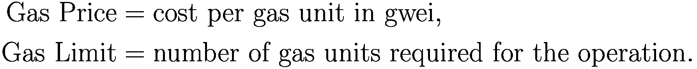

假设 `Gas` 价格为 50 `gwei`。

### `Gas` 消耗计算

鉴于钱包间转账的 `Gas` 上限为 21,000，`Gas` 价格为 50 `gwei`，`Gas` 费用为


## 示例 2：部署简单合约

让我们计算部署一个简单智能合约所需的 `Gas` 消耗量。假设此次部署所需的 `Gas` 上限为 1,000,000 `Gas` 单位。

### `Gas` 消耗公式

计算部署合约的 `Gas` 费用的公式与上述相同：


假设 `Gas` 价格为 80 `gwei`。

### `Gas` 消耗计算

在 `Gas` 上限为 1,000,000 且 `Gas` 价格为 80 `gwei` 的情况下，`Gas` 费用变为


## 规避以太坊 `Gas` 费用

以下概述了多种可用于减轻 `Gas` 费用影响的策略：

1.  **优化交易时机。**
    以太坊的 `Gas` 价格在一天内表现出显著波动。值得注意的是，购买后的几个小时内，`Gas` 价格通常会大幅下降。当然，也存在相反情况的可能性。这种现象可能会在交易者中引发认知失调。在此类情况下，密切观察和分析市场至关重要。然而，这一过程非常耗费人力且缺乏特异性。在某些特定时段，例如深夜或周末期间，可能会观察到 `Gas` 成本降低。这些特定实例是获取以太币的绝佳时机。此外，可以通过查看图表来分析以太坊的波动性。此工具有助于估算 `Gas` 价格显著降低的时期。

2.  **利用返利优惠。**
    许多应用程序和网站为购买以太坊提供诱人的折扣。例如 `Balancer` 这个网站，它为收购以太坊提供高达 90% 的返利。他们努力降低从其平台购买以太坊的交易者的 `Gas` 价格。`KeeperDao` 及类似应用程序使用一种机制，向一组人集体征收 `Gas` 费用。这种现象是有益的，因为它能大幅降低个体交易者承担的 `Gas` 费用。因此，可以积极寻找此类替代方案以有效降低 `Gas` 费用。

3.  **谨慎选择交易类型。**
    以太坊包含多种交易模式。因此，可以观察到 `Gas` 费用具有动态性质，表现为随时间波动。在选择交易类型之前，必须对其他交易类型相关的 `Gas` 费用进行对比分析。这确保选择的是产生最少 `Gas` 费用的交易。然而，在分析 `Gas` 费用相关成本时，考虑额外因素也至关重要。在选择低成本时，建议优先考虑交易安全性，不要在这方面妥协。因为在某些情况下，较低的价格与较高的风险相关。

4.  **监控网络拥堵以避免延迟。**
    网络拥堵是加密货币交易者在从事交易活动时经常遇到的普遍问题。此事的重要性在于，即使是交易中的轻微延迟也可能导致价格波动。因此，这可能会阻碍交易者对该特定加密货币的预期或期望的盈利能力。可以持续监控拥堵水平，并在发现拥堵相对较低时立即执行交易。完成此任务的一种方法是检查给定网络的 `mempool`（交易内存池）。通常，这个空间是交易在最终确认前的等候区。

5.  **利用 `Gas` 代币获益。**
    交易者可以利用 `Gas` 代币来大幅节省矿工费以及与交易相关的额外费用。通过从存储中移除所有可变货币和交易，可以轻松获取 `Gas` 代币。当 `Gas` 成本大幅降低时，挖掘 `Gas` 代币的过程变得非常简单。在处理交易时，`Gas` 代币可以很容易地兑换成 `ETH`。有可能获得作为激励的 `Gas` 代币，然后这些代币可以用于支付 `Gas` 费用。

6.  **预先计算应付 `Gas` 费用。**
    有多种 `Gas` 费用计算器可供用户预先计算 `Gas` 费用。提供 `Gas` 价格信息的平台有两个例子：`Gas Now` 和 `Etherscan's Gas Tracker`。这些工具专门设计用于预先预测 `Gas` 价格。这些解决方案提供实时价值，降低了出错的可能性。可以方便地使用它们来确定时效性极强的 `Gas` 费用。

7.  **切换到以太坊 2.0。**
    以太坊 2.0 在各个方面都代表了与其前身以太坊相比的显著进步。最显著的进步之一是用 `PoS` 机制替代了 `PoW` 方法。`PoS` 过程会根据验证者持有特定加密货币的大量数量来自动选择验证者。在参与成为验证者的竞争时，不需要使用复杂的计算或问题解决工具。因此，在以太坊 2.0 交易中，征收的 `Gas` 费用要么不存在，要么非常低。

## 实验操作

本节展示了使用 `Python` 实现智能合约。

### 显示问候信息的 `Solidity` 程序

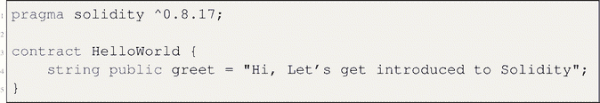

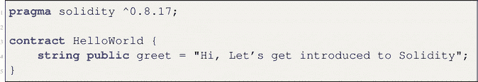

#### 代码说明

这个 `Solidity` 智能合约是一个简单的示例合约，通常用于演示编程语言或平台的基本功能。让我们来解读代码：

##### `SPDX` 许可证标识符：`MIT`

这是一个特殊注释，用于指定代码的发行许可证。此处采用 `MIT` 许可证，这是一种宽松的开源许可证。

##### 编译器版本指定

下一行代码指定了编译该合约应使用的编译器版本。它以 `pragma solidity` 开头，后跟脱字符（`^`）和版本号 `0.8.17`。此行确保合约仅使用至少为 `0.8.17` 但低于 `0.9.0` 的 `Solidity` 编译器版本进行编译。此版本范围限制有助于确保兼容性，并避免使用不同编译器版本时可能出现的潜在问题。

##### 合约定义

代码的主要部分是合约定义。它以 `contract` 关键字开头，后跟合约名称，此处为“Hi, Let's get introduced to Solidity.”。这是一个非常基础的合约，没有定义构造函数、函数或状态变量。它只有一个公开的状态变量：

- `string public greet`：这是一个名为“greet”的公开字符串变量。`public` 修饰符意味着该变量可以被其他合约或外部任何人读取。该变量的初始值设置为“Hi, Let's get introduced to Solidity.”。此变量将存储并暴露问候信息“Hi, Let's get introduced to Solidity.”。

### 演示简单递增和递减函数的程序

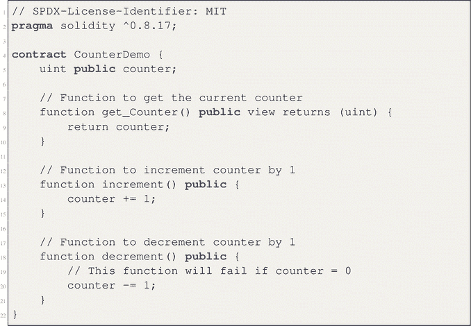

#### 代码说明

`Solidity` 智能合约 `CounterDemo` 是对基本计数器功能的简单演示。合约以一个 `SPDX` 许可证标识符注释开头，为代码指定 `MIT` 许可证。它使用的是 `Solidity` 编译器版本 `0.8.17` 或更高。合约定义了一个 `uint`（无符号整数）类型的状态变量 `counter`，用于跟踪当前计数值。该合约提供了三个函数：`get_Counter()` 是一个 `view` 函数，允许任何人读取计数器的当前值。`increment()` 是一个公开函数，将计数器加 1。`decrement()` 是一个公开函数，将计数器减 1，但如果计数器已经为 0，则该函数会执行失败。总的来说，此合约展示了 `Solidity` 中状态变量和函数的基本示例。

### 使用 `Solidity` 进行智能合约开发

- 搭建本地以太坊开发环境
- 用 `Solidity` 创建基本智能合约
- 将智能合约编译并部署到本地测试网络
- 使用 `web3.js` 或 `ethers.js` 与已部署的合约进行交互

#### 搭建本地以太坊开发环境

要搭建本地以太坊开发环境，您可以使用 `ganache-cli` 等工具来创建本地以太坊测试网络。

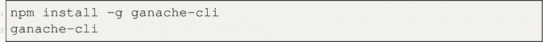

#### 用 `Solidity` 创建基本智能合约

在 `contracts` 目录中创建一个名为 `Counter.sol` 的新 `Solidity` 文件。

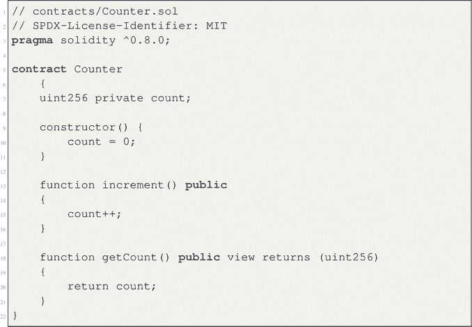

#### 编译与部署智能合约

初始化一个 `Truffle` 项目，创建部署迁移脚本，并编译合约。


编辑 `migrations/2_deploy_contracts.js` 文件，加入部署代码。

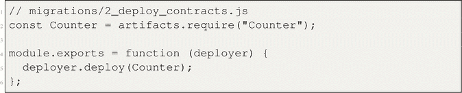

编译合约。


#### 使用 `web3.js` 与已部署的合约进行交互

在项目根目录中创建一个名为 `interact.js` 的 `JavaScript` 文件。

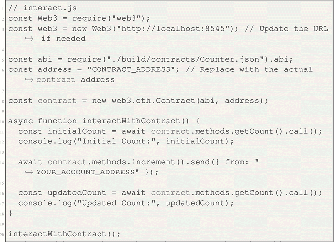

将代码中的 `"CONTRACT_ADDRESS"` 替换为实际的合约地址，并将 `"YOUR_ACCOUNT_ADDRESS"` 替换为您的账户地址。

#### 运行交互脚本

在终端窗口中，运行交互脚本。


该脚本将与已部署的智能合约进行交互，递增计数值并显示结果。

请记得将 `"CONTRACT_ADDRESS"` 和 `"YOUR_ACCOUNT_ADDRESS"` 等占位符替换为来自您环境的实际值。

### 在智能合约中实施安全措施

#### 识别与分析常见漏洞

首先识别并分析现有智能合约中的常见漏洞。此步骤对于理解潜在的安全风险至关重要。

#### 实施安全措施

实施安全措施以解决智能合约中的漏洞。例如，让我们考虑重入保护和输入验证。

##### 重入保护

为了防止重入攻击，您可以使用 `nonReentrant` 修饰符。

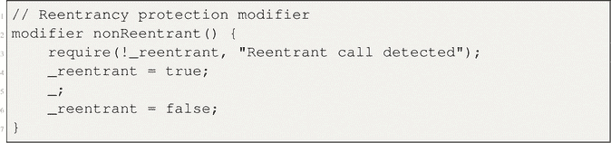

##### 输入验证

实施输入验证，以确保输入数据满足特定标准。

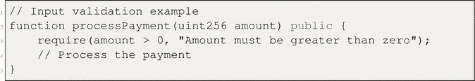

#### 测试改进后的智能合约

实施安全措施后，全面测试改进后的智能合约，以证明其安全性得到增强。

##### 重入测试

通过创建一个试图进行重入的恶意合约来测试重入保护。受保护的合约应能拒绝该攻击。

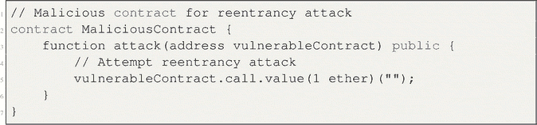

##### 输入验证测试

通过向合约函数提供有效和无效输入来测试输入验证。

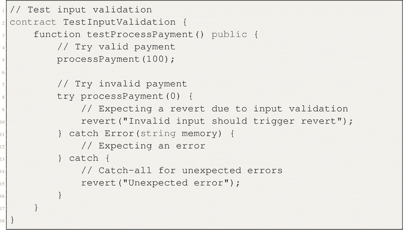

请记住，这是一个简化的示例；实际的安全措施和测试会涉及更多的复杂性和全面性。

### 开发一个 `ERC-20` 代币

- 按照标准规范设计一个 `ERC-20` 代币的合约
- 实现代币功能，如 `transfer`、`approve` 和 `transferFrom`
- 将 `ERC-20` 代币合约部署到以太坊区块链
- 使用 `Web3` 接口测试代币交易和交互

#### 设计 `ERC-20` 代币合约

按照标准规范设计一个 `ERC-20` 代币的合约。

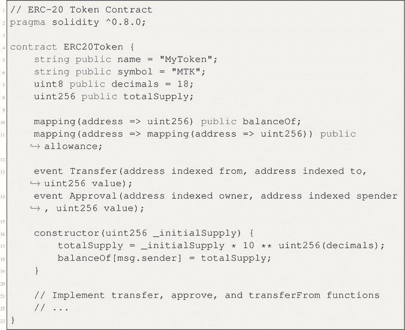

#### 实现代币功能

实现代币功能，如 `transfer`、`approve` 和 `transferFrom`。

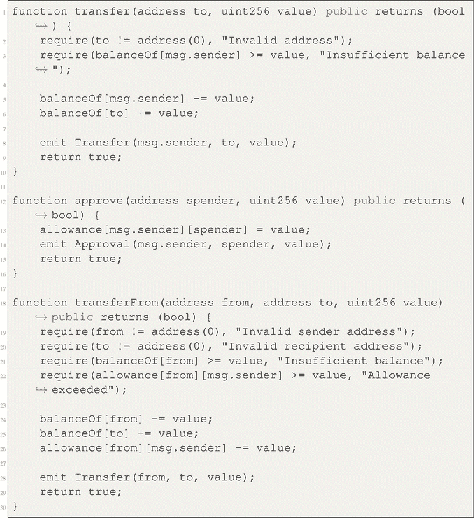

#### 部署 `ERC-20` 代币合约

使用 `Remix` 或 `Truffle` 等工具将 `ERC-20` 代币合约部署到以太坊区块链。

#### 测试代币交易和交互

使用 `web3` 接口测试代币交易和交互。

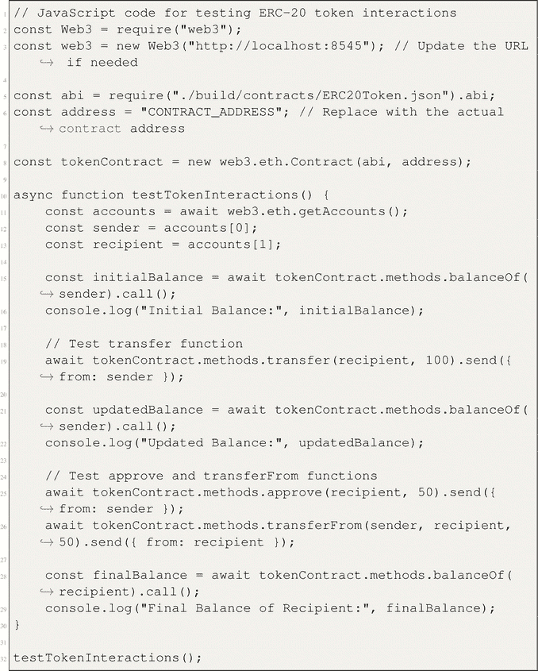

请记得在测试 `JavaScript` 代码中将 `"CONTRACT_ADDRESS"` 替换为实际的合约地址。

### 构建一个简单的 `DApp`

#### 开发一个基础的 `DApp`

从开发一个带有前端界面的基础 `DApp` 开始，前端使用 `HTML`、`CSS` 和 `JavaScript`。

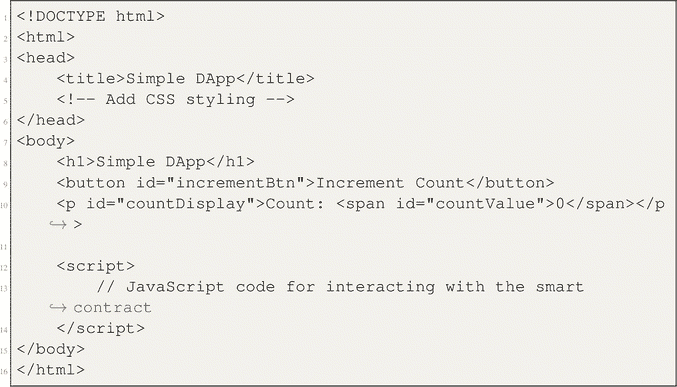

#### 与智能合约集成

将 `DApp` 与智能合约集成，以处理用户交互。

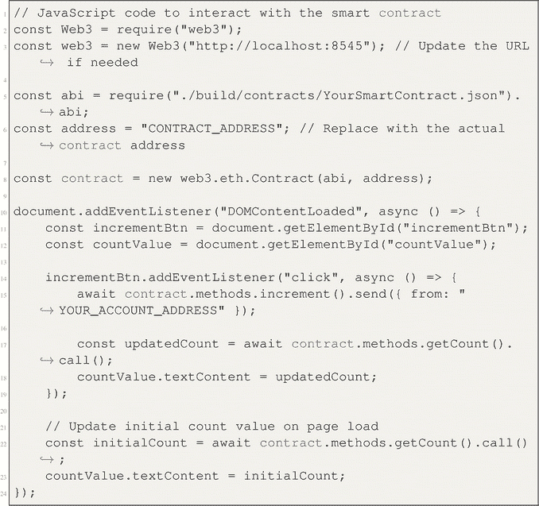

#### 部署 `DApp` 及相关智能合约

使用 `Remix` 或 `Truffle` 等工具将 `DApp` 及相关智能合约部署到以太坊区块链。

#### 测试 `DApp` 的功能与可用性

在支持 `Web3` 的浏览器中与 `DApp` 交互，测试其功能与可用性。

# 4.8.7 使用预言机与链外数据交互

理解预言机及其作用：首先理解预言机的概念及其为智能合约获取外部数据的作用。

将预言机服务集成到智能合约中：将预言机服务集成到智能合约中，以获取链外数据。

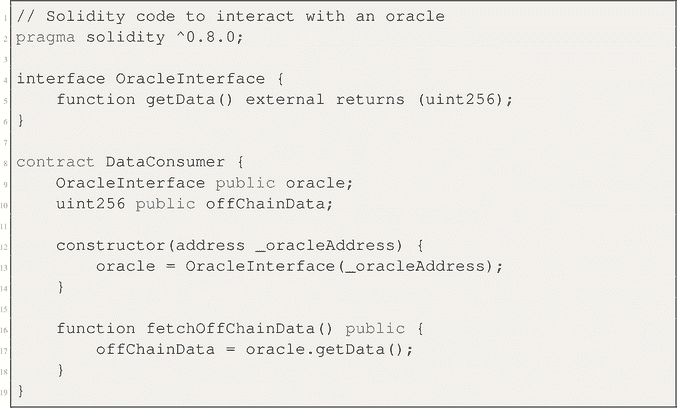

通过预言机检索真实世界数据：使用已实现的预言机检索真实世界数据，例如天气信息或股票价格。

在去中心化应用（DApp）中实现一个用例：在 DApp 中实现一个利用链外数据的用例。

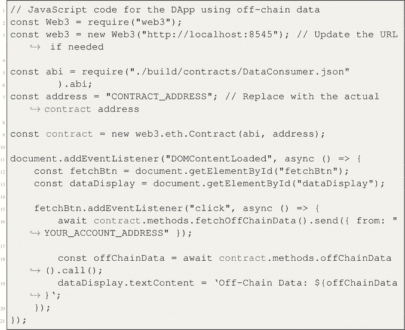

请记住将 `"CONTRACT_ADDRESS"` 替换为实际的合约地址，并将 `"YOUR_ACCOUNT_ADDRESS"` 替换为你的账户地址。

# 4.8.8 演示以太坊区块链上智能合约交互与所有权管理基本示例的程序

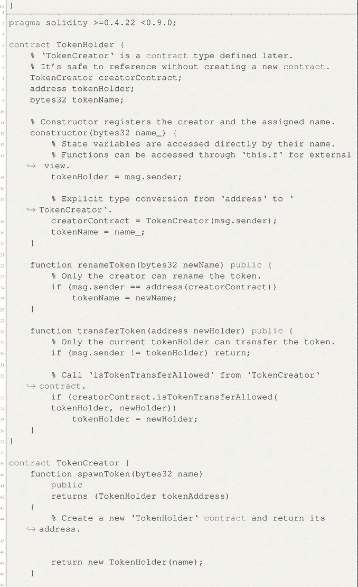

示例输入与输出：

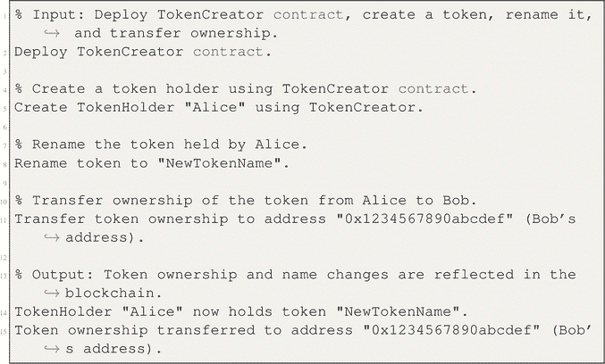

代码解释：此代码使用 Solidity 编程语言，演示了以太坊区块链上智能合约交互与所有权管理的基本示例。代码展示了一个简单的代币系统，其中代币可以被创建、拥有、重命名以及在持有者之间转移。`TokenHolder` 合约代表代币的所有权和管理，而 `TokenCreator` 合约则允许创建新的代币持有者，并强制执行代币转移规则。该代码演示了合约部署、函数调用、条件测试和合约交互等概念。它作为一个教学示例，用于理解智能合约如何实现去中心化的所有权和交互逻辑。

# 4.8.9 在以太坊区块链上创建去中心化盲拍智能合约的程序，使参与者能够提交隐藏出价、揭示出价并确定最高出价者，同时确保安全的资金管理和透明的拍卖结果

该合约促进了一种无需信任且防篡改的拍卖机制，提升了拍卖过程的公平性和效率。

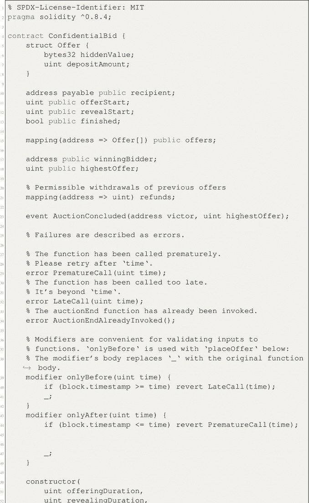

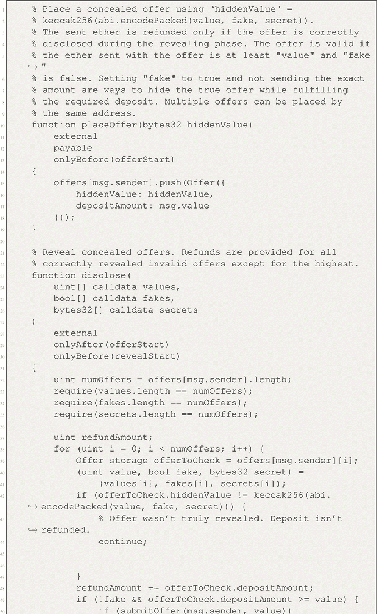

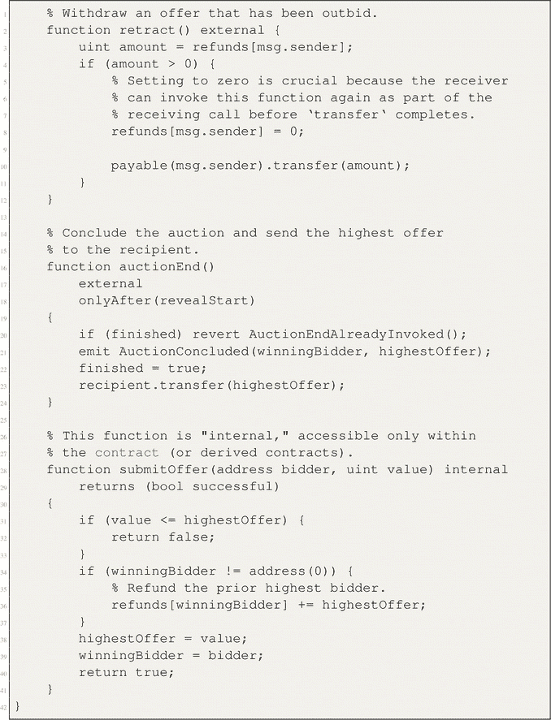

示例输入与输出：

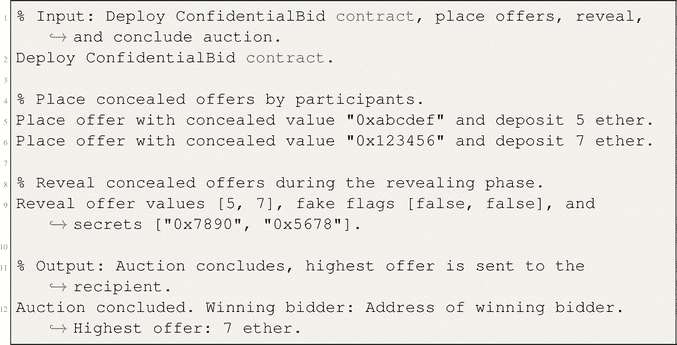

代码解释：所提供的 Solidity 代码在以太坊区块链上实现了一个去中心化的盲拍智能合约。该合约允许参与者在出价阶段提交隐藏的出价，随后进入揭示阶段，出价被公开。出价使用加密哈希进行伪装，有效的已揭示出价会被退款。合约确保仅考虑有足够资金的合法出价，并跟踪最高出价者和出价金额。揭示阶段结束后，可通过将最高出价转移给指定接收人来结束拍卖。此代码建立了一个安全透明的机制，用于进行无需信任的盲拍，从而提升拍卖过程的公平性和效率。

# 4.8.10 展示智能合约环境中重入攻击漏洞并演示使用重入锁实现解决方案的程序

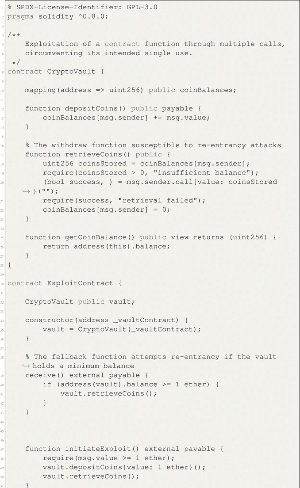

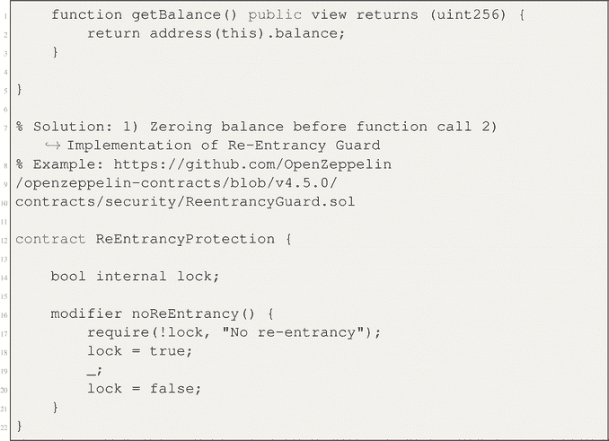

示例输入与输出：

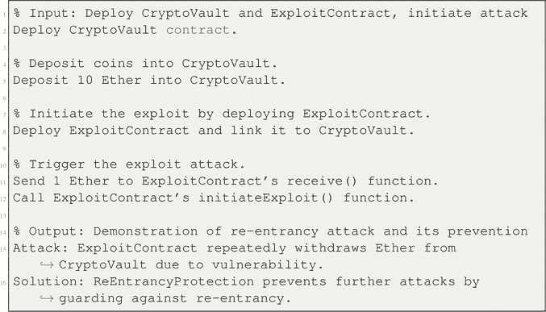

代码解释：此 Solidity 代码作为智能合约中重入攻击的说明，并通过实现一个重入保护机制提出了解决方案。所呈现的场景涉及一个名为 `CryptoVault` 的模拟合约，它允许用户存入和提取代币。然而，此合约存在漏洞，攻击者可以利用恶意的重入调用反复提取资金。`ExploitContract` 合约试图利用 `CryptoVault` 的漏洞，从而例证了该漏洞。针对此问题，代码引入了 `ReEntrancyProtection` 合约，该合约通过使用重入锁来限制递归函数调用，从而减轻这些攻击。总的来说，该代码强调了防范重入漏洞的重要性，并演示了通过实施预防措施来缓解问题的方法。

## 4.9 Mist 浏览器

Mist 浏览器是一款专为以太坊区块链设计的网络浏览器。它允许用户访问和与基于以太坊网络构建的去中心化应用进行交互。借助 Mist 浏览器，用户可以直接通过浏览器界面安全管理自己的以太坊账户、查看智能合约以及执行交易。它通过简化导航和与去中心化网络交互的过程，提供了用户友好的体验。此外，Mist 浏览器还支持多种以太坊标准，例如 `ERC-20` 代币，为用户提供了便利。

使用 Mist 浏览器的优势包括其增强的安全特性，它允许用户直接通过浏览器界面安全管理自己的以太坊账户并执行交易。它还通过简化导航和与 DApp 交互的过程，提供了用户友好的体验。此外，Mist 浏览器支持多种以太坊标准，例如 `ERC-20` 代币，方便用户访问和管理自己的数字资产。

### 4.9.1 Mist 浏览器使用指南

要使用 Mist 浏览器，你可以首先在设备上下载并安装它。安装完成后，打开浏览器即可看到一个用户友好的界面。从那里，你可以通过在搜索栏中输入 URL，或点击书签和链接来浏览网站。此外，你还可以通过调整隐私偏好和外观等设置来自定义浏览体验。

Mist 浏览器的设计初衷是作为以太坊网络上去中心化应用生态系统中的一个关键组成部分。其最初的图形用户界面为用户提供了访问区块链的能力，而此前区块链仅能通过命令行界面访问。开发者旨在提供一个综合平台，用于运行和实现各种以太坊应用和项目。

遗憾的是，当时的技术限制使得完全去中心化应用浏览器系统的技术前提无法实现。因此，Mist 浏览器项目被终止，该软件于 2019 年 3 月停止流通。想要进一步了解 Mist 浏览器及其开发者所追求目标的一种可能方式是研究该项目的文档和历史记录。

### 4.9.2 Mist 与 Geth

Mist 是一个图形用户界面应用程序，它提供了一个易于使用的界面，用于与以太坊区块链交互和管理以太坊账户。`Geth` 是 "Go Ethereum" 的缩写，是以太坊客户端软件的官方实现之一。它是负责参与以太坊网络、验证交易以及维护以太坊区块链副本的软件。

### 4.9.3 Geth 的角色

`Geth` 在以太坊网络中扮演着至关重要的角色。它作为一个全功能以太坊节点运行，这意味着它会连接到以太坊网络上的其他节点，以发送和接收交易与区块。同时，它通过下载并处理区块链上存储的所有数据，与以太坊区块链保持同步。除此以外，它还负责验证交易和智能合约，确保网络的完整性。此外，它还提供了一个接口，供开发者和用户通过命令行指令和 `JSON-RPC` 接口与以太坊网络进行交互。

## 4.10 本章小结

本章对以太坊区块链进行了全面审视，重点阐述了其基本特征以及以太坊虚拟机（`EVM`）。本章深入探讨了以太坊发展的历史进程，追溯了它从基于账本的系统向状态机的演变。此外，还研究了以太坊网络的底层结构。本章还介绍了智能合约的概念，并强调了其实现过程中面临的挑战。同时，还对 `Solidity` 编程语言进行了概述。本章进一步探讨了以太坊交易，涵盖了交易的生命周期以及 Gas 费用的计算方式。随后，本章研究了市场中影响 Gas 价格波动的各种因素。此外，还探讨了实施基础费用可能带来的后果，并分析了未来向以太坊 2.0 的 `PoS` 机制预期的转变。在最后一节中，本章将通过一系列涵盖多个主题（包括智能合约的建立、安全措施的实施、`ERC-20` 代币的利用、`DApps` 的创建，以及通过预言机与链下数据的交互）的实践性实验室实验来收尾。

本章深入探究了以太坊架构、交易和开发工具的诸多方面，使读者对以太坊生态系统及其底层机制有了透彻的理解。此外，还介绍了 `Mist 浏览器` 的实用性。同时，融入实践性的体验式实验，通过促进学术原理向实际真实场景的应用，有助于增强教育过程。

## 4.11 练习题

本节提供基于本章所涵盖主题的练习题。

### 4.11.1 选择题

1. 以太坊网络中 Gas 费用的主要目的是什么？
    1. 为以太坊公司创造利润
    2. 为以太坊软件的开发提供资金
    3. 补偿矿工的网络资源消耗
    4. 覆盖交易验证的成本
2. 哪个以太坊开发工具提供了用于测试智能合约和 `DApps` 的本地区块链环境？
    1. `Ganache`
    2. `Truffle`
    3. `Remix IDE`
    4. `Metamask`
3. 在以太坊中，使用 Gas 代币的主要好处是什么？
    1. 它们为购买以太坊提供折扣。
    2. 它们用于提高交易安全性。
    3. 它们减少了交易所需的 Gas 量。
    4. 它们是用于支付 Gas 费用的加密货币形式。
4. 以太坊 2.0 使用哪种机制进行交易验证？
    1. 工作量证明（`PoW`）
    2. 权益证明（`PoS`）
    3. 概念证明（`PoC`）
    4. 权威证明（`PoA`）
5. 哪种以太坊交易类型与铸造 `NFT` 相关？
    1. 钱包间转账
    2. 部署简单合约
    3. 发送 `ERC-20` 代币
    4. 铸造 `NFT`
6. 以太坊伦敦硬分叉中引入的基础费用的主要功能是什么？
    1. 它为处理交易的矿工提供奖励。
    2. 它确保交易被快速处理。
    3. 它有助于在网络拥塞时稳定 Gas 价格。
    4. 它限制了流通中 `ETH` 的总供应量。
7. 哪个以太坊开发工具专为智能合约开发而设计，并提供了一个 `Solidity` 代码编辑器？
    1. `Ganache`
    2. `Truffle`
    3. `Remix IDE`
    4. `Metamask`
8. 以太坊生态系统中最小的计量单位是什么？
    1. `Wei`
    2. `Gwei`
    3. `Ether`
    4. `Nano`
9. 以太坊中 Gas 价格是如何标价的？
    1. 以太坊单位（`ETH`）
    2. `Gwei`
    3. 比特币（`BTC`）
    4. `美元`
10. 在以太坊交易中，何时使用优先费是有利的？
    1. 当 Gas 价格处于最低点时
    2. 当网络拥塞程度高时
    3. 当发送大量 `ETH` 时
    4. 当使用 Gas 代币时

### 问答题

1. 解释以太坊网络中的 Gas 费概念。Gas 费是如何计算的？在以太坊交易的背景下，Gas 费的重要性何在？论述矿工的角色以及 Gas 费在维护网络功能方面的目的。提供不同类型的交易示例并说明其 Gas 成本是如何确定的。
2. 描述从以太坊 1.0 到以太坊 2.0 的过渡。以太坊 1.0 中使用的工作量证明（`PoW`）机制与以太坊 2.0 中的权益证明（`PoS`）机制之间的关键区别是什么？这一过渡如何影响 Gas 费、交易验证以及整体网络效率？
3. 解释影响以太坊网络中 Gas 价格的因素。讨论供需关系、网络拥堵以及交易类型如何影响 Gas 价格。提供关于用户如何通过选择合适的交易时机和类型来优化其 Gas 费用的见解。
4. 讨论以太坊生态系统中高 Gas 费的挑战和影响。高 Gas 费如何影响用户体验、阻碍采用并限制可扩展性？探索开发者和用户可以采取的缓解 Gas 费影响并增强基于以太坊应用程序整体可用性的方法和解决方案。
5. 提供以太坊开发工具的全面概述。解释像 `Truffle`、`Remix IDE`、`Ganache` 和 `Infura` 等工具在以太坊应用程序开发生命周期中的作用。讨论这些工具如何帮助智能合约的创建、测试、部署以及与以太坊区块链的交互。突出每个工具的优势和用例。
6. 审视 Gas 代币的概念及其在降低以太坊交易 Gas 费方面的重要性。Gas 代币是如何运作的，用户如何从使用它们中受益？讨论赚取和赎回 Gas 代币的过程，并举例说明 Gas 代币对用户特别有利的场景。
7. 深入探讨以太坊交易的生命周期，从发起到确认。解释典型以太坊交易中涉及的每个步骤，包括 `nonce` 生成、Gas 价格估算和合约执行。讨论矿工如何选择交易包含在区块中，以及交易确认过程如何确保以太坊区块链的完整性。
8. 探索以太坊的历史发展，从其早期阶段到当前状态。突出关键的里程碑，例如从基于账本的系统到状态机的过渡，以及主要升级（如伦敦硬分叉）的引入。讨论塑造以太坊演变并使其成为领先区块链平台所面临的挑战和突破。
9. 描述智能合约在以太坊生态系统中的作用和重要性。解释智能合约是如何在以太坊区块链上创建、部署和执行的。提供智能合约在现实世界中的用例示例，例如去中心化金融（`DeFi`）应用、非同质化代币（`NFT`）和去中心化应用（`DApp`）。讨论使用智能合约的好处和挑战。
10. 讨论以太坊的 Gas 费结构对用户体验和区块链技术采用的影响。分析导致 Gas 价格波动的因素及其对用户参与基于以太坊活动意愿的影响。探索可能解决 Gas 费带来的挑战并为区块链用户创造更友好环境的潜在策略和创新。