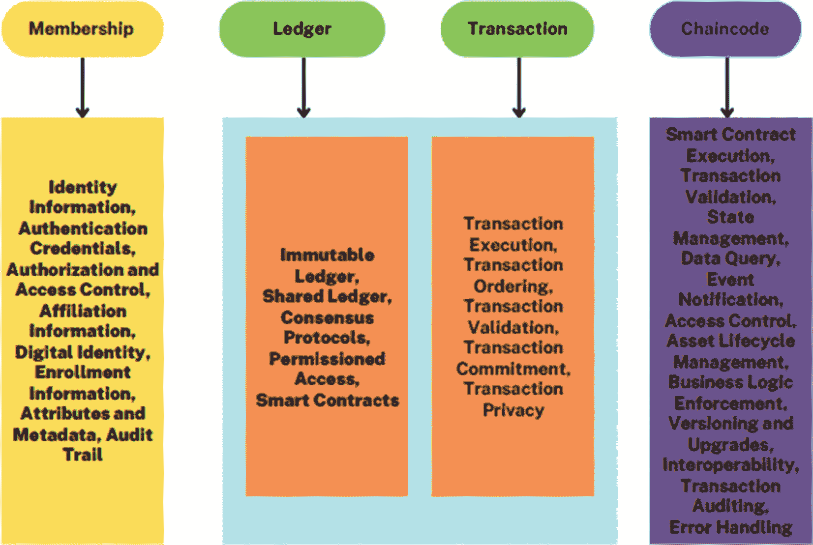
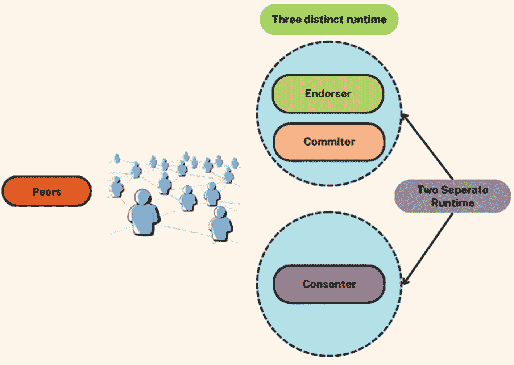
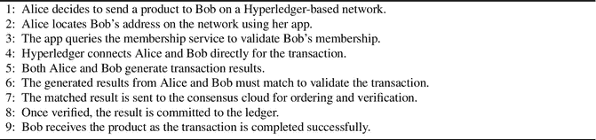
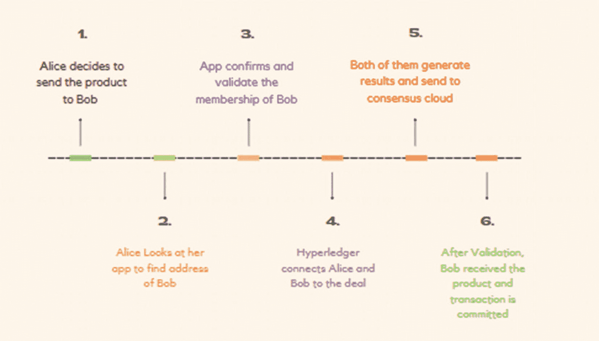
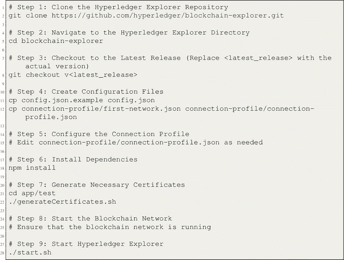
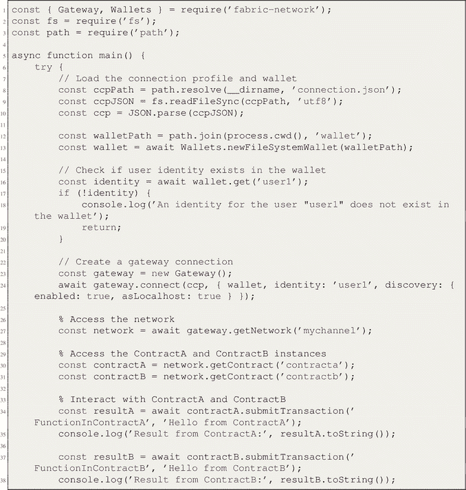
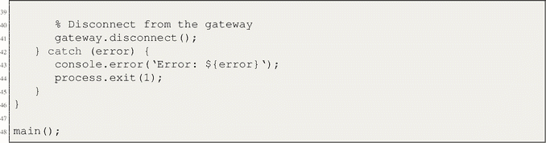
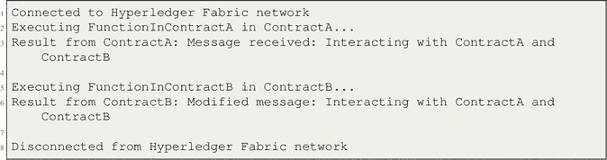
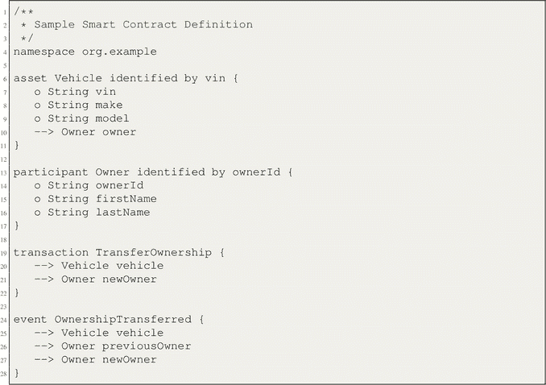
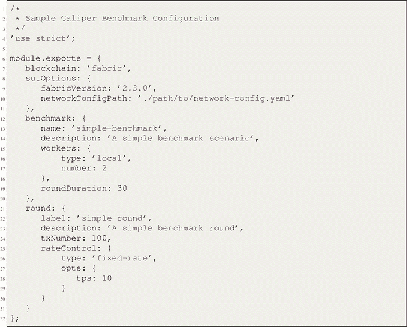

# 5. Hyperledger

**关键词**：目的、历史、架构、链码、项目、联盟与网络、区块链即服务

Hyperledger 是一个专注于开发企业级区块链框架和工具的开源社区。它旨在使组织能够为不同行业构建和部署健壮、可扩展且安全的区块链解决方案。Hyperledger 非常强调隐私、性能和互操作性，提供了一系列可定制的模块化平台以满足特定的业务需求。通过为开发者提供协作环境，Hyperledger 促进了创新并加速了区块链技术在企业界的采用。

## 5.1 Hyperledger 简介

Hyperledger 是一个隶属于 Linux 基金会的开源倡议，为开发与区块链技术相关的各种用例提供了强大的框架。根据 Hyperledger 执行董事 Brian Behlendorf 的说法，该组织可以被描述为拥有共同目标——在许多工业领域探索和实施区块链应用的社区集合。本节概述了使用 Hyperledger 的目的和益处。

### 5.1.1 Hyperledger 的目的

Hyperledger 提供了一个强大且量身定制的区块链基础设施，以促进去中心化账本的创建和维护，确保增强的安全性和个性化功能。交易的保密性至关重要，尤其是在涉及敏感信息（如医疗数据）的情况下。与公有区块链相比，Hyperledger 促进了交易参与者之间直接连接的建立，从而保证了匿名性和机密性。Hyperledger 发展过程中的重要里程碑如表 5-1 所示。

**表 5-1**
Hyperledger 发展历史中的里程碑

| 序号 | 里程碑 | 重要进展 |
| --- | --- | --- |
| 1 | Hyperledger 的创立 | 在 Linux 基金会下创建 Hyperledger 项目，促进区块链技术的协作与创新 |
| 2 | Hyperledger Fabric 的引入 | 发布 Hyperledger Fabric，这是一个用于企业级区块链应用的模块化框架，具备智能合约和隐私通道 |
| 3 | Hyperledger Sawtooth 发布 | 发布 Hyperledger Sawtooth，引入了一个专注于简单性和模块化的独特共识算法框架 |
| 4 | Hyperledger Composer 贡献 | 贡献 Hyperledger Composer，提供了一种直观的方式来定义和部署区块链业务网络 |
| 5 | 用于去中心化身份的 Hyperledger Indy | 引入 Hyperledger Indy，通过用于自主主权数字身份的工具和库来解决去中心化身份解决方案 |
| 6 | Hyperledger Burrow 与智能合约 | 纳入 Hyperledger Burrow，增加了对以太坊智能合约的支持以及现有以太坊工具的兼容性 |
| 7 | 用于基准测试的 Hyperledger Caliper | 引入 Hyperledger Caliper，一个用于测量和分析区块链性能的基准测试工具 |
| 8 | Hyperledger Avalon 与 TEE | 开发了带有可信执行环境（`TEE`）的 Hyperledger Avalon，用于增强链下处理的隐私和安全性 |
| 9 | Hyperledger 生态系统的扩展 | 通过各种项目和工具持续扩展 Hyperledger 生态系统，以满足多样化的用例和行业需求 |
| 10 | 持续协作与创新 | 以持续的协作、创新以及开发者、研究人员和行业领袖在 Hyperledger 社区中的积极参与为标志的历史 |

## 5.2 Hyperledger 架构

Hyperledger 的架构被组织成三个不同的层级：基础设施层、框架层和工具层。这种分层结构建立了一个支持区块链解决方案开发的弹性生态系统。该架构设计包含一系列服务，旨在增强交易处理、共识流程和数据管理的安全性与效率。Hyperledger 架构中的各项服务如图 5-1 所示。

### 5.2.1 基础设施层

基础设施层是整个系统架构中的一个关键组成部分。这个基础层包含了 Hyperledger 生态系统的基本组件。前述技术作为创建、管理和实施区块链系统的基础框架。基础设施层涵盖了构成系统或网络基础的各种组件。

一张信息图展示了会员、账本、交易和链码下的各种操作。

图 5-1 Hyperledger 架构中的各类服务

- **共识层：** 该层作为平台的核心组件，执行处理交易所必需的商业逻辑。此机制的实施保证了交易和区块的精确性与恰当管理。
- **智能合约层（链码）：** 智能合约层，通常称为链码，是区块链技术的一个基础组件。在智能合约层中，通过执行链码函数内定义的商业逻辑来完成对交易请求的验证。交易状态得以以极其重要的方式进行处理和管理。
- **通信/协议层：** 在网络系统中，通信/协议层是一个必不可少的组件。其主要功能是监督不同设备之间的数据传输。该层通过对等通信协议促进网络元素之间的数据传输。它负责监督执行交易和维护共享账本所需的消息传输。

### 5.2.2 框架层

框架层指的是作为特定应用或系统基础的概念结构。它包含了基本元素。框架层包含针对特定业务需求量身定制的区块链框架，这些框架有助于开发定制化的区块链应用。该平台提供了广泛的库和工具，用于开发适应各种使用场景的区块链解决方案。这一层由 Hyperledger Fabric、Hyperledger Indy、Hyperledger Iroha 和 Hyperledger Sawtooth 等框架构成。

### 5.2.3 工具层

工具层包含了一系列加速器和实用工具，用于增强利用框架层构建的区块链应用的开发和管理。该平台提供了额外的功能和资源，以提高集成区块链技术的效率。

#### 附加组件

- **数据层：** 数据层负责管理许多与数据相关的功能，包括但不限于增强交易、维护审计追踪，以及通过利用密码学技术安全地存储数据。区块链实例中的信任根得以建立。
- **身份服务层：** 身份服务层是整个系统架构中的一个关键组件。它监督管理会员注册服务，其主要目标是确保在各个网络节点上实施用于授权和验证会员访问的强大协议。
- **API 层：** 作为软件系统的一部分，应用编程接口层提供了一套协议和接口，用于促进与其他软件服务或组件的通信。该系统通过充当中介，提高了外部框架和工具的服务接口效能。在区块链网络上，它监督发送和接收请求与响应的同步通信。
- **策略服务层：** 策略服务层是系统架构内部的一个关键组件。该区块链平台确保了治理规则和企业策略的实施。

## 5.3 Hyperledger 社区与开发

开源的 Hyperledger 开发社区由 Hyperledger 架构工作组管理。该工作组促进社区成员与架构师之间的协作，以开发生态系统并实施底层框架。共识机制对于区块链操作至关重要，它根据用例需求确定，并且在 Fabric、Indy、Iroha 和 Sawtooth 等 Hyperledger 项目中可能有所不同。

## 5.4 Hyperledger 智能合约（链码）

链码，也称为智能合约，构成了 Hyperledger 架构中的一个关键组件。它管理交易状态和相关的业务处理功能。链码定义了交易如何被执行、处理和更新，在实现模块化和可扩展的区块链架构中发挥着关键作用。

凭借基于容器的架构，Hyperledger 确保了可扩展且高性能解决方案的部署。链码作为交易处理的核心实现，包含了逻辑执行、状态处理以及与用于应用处理的 API 层的交互。

## 5.5 Hyperledger 的运行机制

Hyperledger 通过应用程序来促进合约先决条件的建立。会员服务负责验证合约，而参与的对等节点生成相同的结果，这些结果被传输到共识云。经过验证过程后，与已连接对等节点相关联的账本会进行更新，从而确保机密性得到维护。这个方法可以通过一个实际例子来有效演示。

### 5.5.1 贡献者

委员会负责将已验证的交易添加到指定的账本中，从而保证数据的精确性。

### 5.5.2 背书者

“背书者”这一称谓指的是特定个人或组织的公开支持者或推广者。通过模拟网络特有的交易，背书者降低了发生错误活动的可能性。他们在维护区块链完整性方面扮演着至关重要的角色。

### 5.5.3 同意者

“同意者”一词指的是表示同意或批准的个人。交易验证过程涉及同意者通过将交易结果与其他参与者提供的信息进行交叉核对来确认交易结果，从而建立已正式提交的账本条目。所有这些角色如图 5-2 所示。

### 5.5.4 示例

让我们借助算法 1 中给出的图示以及图 5-3 中的简化版来理解这一概念。

### 5.5.5 Hyperledger 的优势

`Hyperledger` 提供了众多优势，使其成为企业级应用的理想选择。

- **灵活性**

    `Hyperledger` 提供了一个可修改且模块化的平台，能够根据企业的特定需求进行定制。

    

    一张信息图展示了一个被标记为“两个独立运行时分支”的区块，该区块被分为两个单元。顶部单元包含背书节点和提交节点。底部单元包含共识节点。对等节点在左侧标明。

    **图 5-2** 角色与运行时

    **算法 1** `Hyperledger` 交易流程

    

    一组语句行展示了 `Hyperledger` 交易流程的算法。该算法包含 9 条语句。

- **安全性**

    `Hyperledger` 将安全性置于首位，集成了访问控制、身份管理和加密功能，以提供强大的保护。

- **可扩展性**

    `Hyperledger` 专为大规模应用而设计，能够高效支持高交易量。

- **隐私性**

    `Hyperledger` 支持开发私有的、经过许可的区块链网络，确保了敏感数据的隐私。

- **互操作性**

    `Hyperledger` 公共平台简化了系统与应用的集成。

    

    一张图表展示了以下 6 个步骤：1. Alice 决定将产品发送给 Bob。2. Alice 在应用上找到 Bob 的地址。3. 应用验证并核实 Bob 的成员身份。4. `Hyperledger` 通知 Alice 和 Bob。5. 双方生成结果。6. 交易在验证后完成。

    **图 5-3** 整体流程总结

### 5.5.6 Hyperledger 的局限性

`Hyperledger` 虽有许多优势，但同时存在一些需要考虑的局限性。

- **复杂性**

    `Hyperledger` 的安装和维护可能比较困难，需要专业的技术知识和资源。

- **去中心化程度有限**

    `Hyperledger` 的许可制性质限制了参与范围，导致其去中心化程度低于公有区块链。

- **社区规模有限**

    尽管 `Hyperledger` 的社区在不断扩大，但可能仍小于其他平台，这可能会影响可用支持的获取。

- **智能合约功能有限**

    `Hyperledger` 的智能合约能力相比其他区块链平台较为有限。

## 5.6 Hyperledger 项目

本节将介绍 `Hyperledger` 生态系统中的各个项目。

- **Hyperledger Fabric**

    `Hyperledger Fabric` 是模块化应用的基础，提供了许可网络和保密交易等优势。

- **Hyperledger Sawtooth**

    `Hyperledger Sawtooth` 是一个开源的、企业级的区块链系统，支持多种共识算法。

- **Hyperledger Indy**

    `Hyperledger Indy` 专注于去中心化身份，提供了创建此类身份的库和工具。

- **Hyperledger Iroha**

    `Hyperledger Iroha` 专为需要分布式账本技术的基础设施项目而设计。

- **Hyperledger Burrow**

    `Hyperledger Burrow` 在许可区块链中执行智能合约，促进了跨行业应用。

- **Hyperledger Caliper**

    `Hyperledger Caliper` 是一个基准测试工具，用于通过预定义的用例来衡量区块链性能。

- **Hyperledger Cello**

    `Hyperledger Cello` 作为一个运营仪表板，用于高效的区块链管理。

- **Hyperledger Explorer**

    `Hyperledger Explorer` 是一个用户友好的工具，用于查看、查询和与区块链数据进行交互。

- **Hyperledger Besu**

    `Hyperledger Besu` 是一个以太坊客户端，适用于公有和私有区块链网络。

### 5.6.1 Hyperledger 与其他区块链框架的对比

表 5-2 概述了所分析的三个区块链框架的主要特征。这些特征包括其特定的用例侧重点、所使用的区块链类型、采用的共识技术、包含的隐私功能、提供的互操作性水平，以及它们主要服务的行业领域。

表 5-3 对 `Hyperledger` 和 `Quorum` 进行了比较分析，特别强调了它们各自的起源、社区发展、框架、隐私功能、共识算法以及用例。

`Hyperledger Explorer` 是 Linux 基金会支持下的一个项目，由 `Hyperledger` 托管，是一款开源软件工具，专门用于分析和可视化来自 `Hyperledger Fabric` 区块链网络的数据。该平台提供了一个基于 Web 的界面，帮助用户高效地访问、查询和理解与区块链技术相关的数据。

#### 5.6.1.1 Hyperledger Explorer 的主要特性

`Hyperledger Explorer` 提供了基础功能，有助于有效监控和理解区块链网络中的流程。这些功能包括交易数据的实时可视化、智能合约管理以及网络状态跟踪。此外，`Hyperledger Explorer` 还提供了一个用户友好的界面，使用户能够轻松地导航和分析区块链网络的活动。

-   查看交易历史、智能合约详情、网络节点以及用户数据

-   与不同版本的 `Hyperledger Fabric` 兼容，并可连接到单个和多个区块链网络

**表 5-3** 与 Quorum 的对比

| **方面** | **Hyperledger** | **Quorum** |
| --- | --- | --- |
| **起源** | Linux 基金会 | 摩根大通 |
| **社区** | 在更广泛的社区下开发 | 由摩根大通开发 |
| **框架** | 提供多种框架 | 以太坊的私有变体 |
| **隐私性** | 支持隐私和保密性 | 重点关注交易隐私 |
| **共识** | 提供多种共识选项 | 基于许可的以太坊共识 |
| **用例** | 适用于多种行业 | 主要聚焦于金融应用 |

**表 5-2** Hyperledger 与其他区块链框架的对比

| **方面** | **Hyperledger** | **Ethereum** | **Corda** |
| --- | --- | --- | --- |
| **用例侧重点** | 企业级用例 | 公有和无许可用例 | 金融服务和受监管行业 |
| **区块链类型** | 既有许可链也有非许可链 | 非许可链 | 主要为许可链 |
| **框架** | 多种框架 | 以太坊虚拟机 (EVM) | Core Corda 平台 |
| **共识机制** | 多种（取决于框架） | 工作量证明 (PoW) | 可插拔共识 |
| **隐私功能** | 细粒度的访问控制 | 有限的隐私选项 | 强调交易隐私 |
| **互操作性** | 支持与现有系统集成 | 可与其他基于以太坊的项目互操作 | 强调互操作性 |
| **行业** | 范围广泛，不限于金融 | 侧重于金融应用 | 主要为金融和受监管行业 |

-   REST `API`，用于与外部程序和设备无缝集成

-   专为开发者、网络管理员、审计师和业务分析师设计

#### 5.6.1.2 Hyperledger Explorer 的重要性

`Hyperledger Explorer` 在基于 `Hyperledger Fabric` 平台构建的区块链网络的监控、可视化和分析中扮演着至关重要的角色。其重要性涵盖以下几个关键方面。首先，`Hyperledger Explorer` 提供了区块链网络的全面视图，允许用户实时监控交易、区块和智能合约。此外，它还提供了高级分析和报告功能，使利益相关者能够深入了解网络性能，并识别任何潜在问题或瓶颈。其重要性包括：

-   区块链网络的有效监控和可视化
-   详细的交易分析，有助于模式识别和欺诈检测
-   全面的网络分析以提升性能
-   确保安全性、合规性和可定制性

#### 5.6.1.3 Hyperledger Explorer 的显著特点

`Hyperledger Explorer` 提供一系列功能，用于调查和监督 `Hyperledger Fabric` 区块链网络。这些功能包括：

-   提供网络统计概览的仪表板
-   用于详细数据检查的区块和交易浏览器
-   提供全面网络洞察的通道和链码查看器
-   区块和交易的实时监控
-   可自定义的用户界面，实现个性化体验
-   用户和网络管理功能

#### 5.6.1.4 Hyperledger Explorer 的架构

`Hyperledger Explorer` 的架构包含三个关键组件：

1.  **用户界面**：提供一个用户友好的基于网页的界面，用于显示和与区块链数据交互。
2.  **REST API 服务器**：提供 `REST API`，用于客户端和 `Hyperledger Explorer` 服务器之间的通信。
3.  **数据库**：存储与区块链相关的数据，支持 `LevelDB` 和 `CouchDB` 数据库。

#### 5.6.1.5 Hyperledger Explorer 的分步安装

要安装 `Hyperledger Explorer`，请遵循以下步骤：

一组语句行代表了 9 个步骤。这些步骤从克隆 `Hyperledger Explorer` 仓库开始，到启动区块链网络和 `Hyperledger Explorer` 结束。

#### 5.6.1.6 Hyperledger Explorer 的益处和用途

`Hyperledger Explorer` 是一个强大的工具，在区块链技术领域提供了众多益处和用途。其主要优势之一在于能够提供整个区块链网络的全面视图，使用户能够轻松浏览和分析存储在账本上的数据。这不仅提高了透明度，还促进了交易的有效监控和审计。此外，`Hyperledger Explorer` 使用户能够追踪智能合约的进度，确保其正确执行，并实时识别任何潜在问题或瓶颈。

`Hyperledger Explorer` 提供了众多益处，包括：

-   增强的网络可见性和监控
-   详细的交易分析，以改善性能和安全性
-   智能合约开发与测试
-   有效的网络管理和商业智能

#### 5.6.1.7 Hyperledger Explorer 的局限性

`Hyperledger Explorer` 存在一定的局限性：

-   仅限于 `Hyperledger Fabric` 区块链技术
-   专注于数据跟踪和分析，缺少某些高级功能
-   设置和定制的复杂性，尤其对于大型网络
-   安全考量以及缺乏官方文档

### 5.6.2 区块链中的 Hyperledger Fabric

`Hyperledger Fabric` 是一个开源框架，用于开发去中心化账本应用程序。该系统的模块化架构提供了高度的机密性、灵活性、鲁棒性和可扩展性，使其适用于各种业务。`Hyperledger Fabric`（一种区块链架构）由 Linux 基金会管理。它被设计为一个私有且安全的平台来运行。详细内容如下。

#### 5.6.2.1 理解 Hyperledger Fabric

`Hyperledger Fabric` 专为企业级应用而设计，其特点是模块化架构、许可网络以及执行被称为“链码”的智能合约。该平台高度强调安全性、隐私性和可扩展性，从而能够为包括银行、供应链和医疗保健在内的各个行业开发量身定制的区块链解决方案。

在 `Hyperledger Fabric` 网络中，各种节点协同工作，执行不同的功能，例如验证交易、维护账本以及执行链码。交易的验证和排序通过共识方法实现，这保证了账本的完整性和一致性。

#### 5.6.2.2 Hyperledger Fabric 的运行机制

`Hyperledger Fabric` 是一种专为公司和商业环境使用而开发的区块链技术。它在许可制的基础上运行，这意味着对区块链的访问仅限于经过授权的参与者。该系统的运行机制包含各种必要的组件和流程，它们协同工作，以建立一个既安全又具备有效扩展能力的区块链网络。

**关键组件：**

`Hyperledger Fabric` 作为一个企业级的许可区块链网络运行，由独立的实体或成员组成。前述实体，包括银行、金融机构和供应链网络，通过利用其 fabric 证书颁发机构在网络内进行交互。

每个网络参与方指定经过全面授权流程的授权对等节点。

网络连接的建立是通过在开发客户端应用程序时利用特定编程语言的软件开发工具包 (`SDK`) 来实现的。

**工作流程：**

对于 fabric 中的每笔交易，都会发生以下步骤：

1.  **提案创建**：由成员组织通过客户端应用程序发起交易请求。该提案被分发到各自组织内的同事处，以获得他们的背书。
2.  **背书**：对等节点通过执行链码来验证交易，然后向客户端应用程序提供背书响应。
3.  **提交给排序服务**：交易获批后，被发送到排序服务，排序服务将它们排序成区块，并分发给网络中跨越不同网络参与方的对等节点。
4.  **账本更新**：相关组织的本地账本由对等节点使用新区块进行更新，从而完成交易的提交过程。

### 5.6.3 Hyperledger Fabric 中的共识机制

Hyperledger Fabric 中的共识机制涉及一套程序框架，区块链网络成员通过该框架就待纳入公共账本的交易的真实性和顺序达成一致。共识是一项基本机制，可确保所有参与方对区块链的当前状态拥有一致的视图，同时确保交易安全且不可篡改地记录。Hyperledger Fabric 采用了一种独特且适应性强的共识方法，这使其有别于众多其他区块链平台。

Hyperledger Fabric 中共识机制的关键方面包括：

-   **可插拔共识：** 可插拔共识的概念指的是在系统中轻松切换不同共识算法的能力。Hyperledger Fabric 支持将多种共识算法集成到网络中，以满足不同的运营需求。这与采用单一共识流程（如工作量证明或权益证明）的其他区块链系统形成对比。Fabric 固有的灵活性使其能够适应多种用例，包括由具有公认且已建立信任的个人所构成的许可网络。

-   **排序服务：** 此服务用于对交易进行排序。在 Fabric 的语境下，共识的概念可以分为两个独立的步骤：背书和排序。背书阶段包括验证交易的准确性以及在智能合约上执行交易。获得背书后，交易被转发到排序服务，该服务会生成一系列区块，这些区块按预定顺序包含这些交易。这种分离操作使 Fabric 能够实现更高的吞吐量和效率。

-   **基于 Kafka 的排序服务：** Hyperledger Fabric 采用基于 `Kafka` 的排序服务作为其默认机制，该服务保证交易有序排列并整合成块。`Kafka` 提供了一种分布式且稳健的方法来对交易进行排序，从而提高了网络的健壮性。

-   **通道级共识：** 通道级共识的概念指的是通信系统内不同通道之间达成的一致或协调。Fabric 引入了通道的概念，这些通道在整体区块链网络内充当私有子网。每个通道都有能力实施自己的共识机制，允许组织的不同部分使用不同的共识算法或甚至独立的账本，同时使用相同的基础设施。

-   **实用拜占庭容错：** `PBFT` 是一种解决拜占庭容错问题的共识算法。Hyperledger Fabric 能够容纳诸如 `PBFT` 之类的共识技术，这些技术提供了更高的吞吐量和容错能力。Fabric 中的排序服务利用 `PBFT`，保证绝大多数节点必须就交易的排序达成共识。

-   **共识者和排序节点：** 提供同意的个体以及负责排序的节点。Fabric 中的排序服务由称为共识者的节点组成，这些节点负责将交易打包并分发给对等节点。维护交易排序共识的责任在于这些节点。

-   **私有数据和背书策略：** 讨论的主题涉及私有数据和背书方面的策略。在 Fabric 框架中，可以为特定交易类型建立背书策略，从而确定哪些特定的对等节点需要为给定交易提供背书。此外，利用私有数据收集功能，可以将数据有针对性地仅分发给指定的参与者，从而在维护共享数据一致性的同时，保护信息的机密性。

#### 5.6.3.1 Hyperledger Fabric 的行业应用

Hyperledger Fabric 是一个许可型区块链平台，非常适合需要信任、隐私、可扩展性和控制力的各种行业应用。

1.  **供应链：** 供应链的概念指的是涉及商品和服务生产、分销及消费的相互关联的组织、活动、资源和技术网络。Hyperledger Fabric 通过提供更高水平的透明度和可追溯性来提高供应链交易的效率。Fabric 支持对产品创建和分销进行实时更新，从而降低与假冒相关的风险。

2.  **交易和资产转移：** 交易和资产转移是金融和经济领域的核心组成部分。Hyperledger Fabric 通过实施可靠且安全的无纸化解决方案，减少对纸质文档的需求，从而提高了交易和资产转移流程的效率。资产在区块链上的非实体化使个人能够直接访问金融证券。

3.  **保险：** 保险的概念涉及实体或个人之间转移潜在风险的合同协议。通过 Hyperledger Fabric 实现的支付和代位求偿程序自动化，保险理赔处理得以简化。该技术确保实施安全的了解你的客户（`KYC`）和身份验证流程。

#### 5.6.3.2 Hyperledger Fabric 提供的优势

Hyperledger Fabric 提供了若干优势，使其成为企业区块链解决方案的首选。

1.  **开源：** Hyperledger Fabric 是开源的，允许公众访问、修改和分发其代码。

2.  **私密和保密：** Hyperledger Fabric 通过仅向经过身份验证的成员暴露账本来确保隐私，使其适用于需要数据保密的行业。

3.  **访问控制：** Fabric 的分层访问控制系统提供对数据暴露的隐私和控制，即使在同一个网络内的竞争对手之间也是如此。

4.  **链码功能：** Fabric 的链码技术支持托管智能合约，可容纳不同的业务规则和交易。

5.  **性能：** Hyperledger Fabric 的私有网络架构有助于提高交易速度，从而提升性能。

#### 5.6.3.3 Hyperledger Fabric 的限制

Hyperledger Fabric 虽然健壮，但存在一些需要考虑的局限性。一个局限性是设置和配置网络的复杂性，这需要深入了解区块链概念和基础设施。主要限制包括以下几点：

1.  **可扩展性：** Fabric 的许可网络设计限制了其在大规模公共网络中的可扩展性。

2.  **性能：** 网络规模、配置和链码复杂度可能会影响 Fabric 的性能。

3.  **复杂性：** 设置和配置 Fabric 网络需要深入了解该技术。

4.  **兼容性：** Fabric 与特定编程语言的兼容性可能会限制其与其他技术的集成。

5.  **成本：** 运行 Fabric 网络会产生基础设施成本。

6.  **互操作性：** Hyperledger Fabric 与其他区块链的互操作性限制在单一网络内。

## 5.7 Hyperledger 联盟与网络

在 Hyperledger 的语境下，联盟网络是指由多个组织共同建立的协作网络，旨在创建、管理和维护一个共享的区块链基础设施。联盟网络具有诸多优势，具体如下：

- **共享治理：** 共享治理是治理与决策流程领域的一项基本原则。关于网络规则、策略和升级的决策过程由联盟成员共同承担。这种共享治理模式能够确保开放性和包容性。

- **成本分摊：** 成本分摊是指将开支在多方之间进行分配的做法。通过协作利用资源和共享基础设施，联盟成员能够降低建立和维护私有区块链网络所带来的个人财务负担。

- **互操作性：** 互操作性指的是不同系统或组件协同工作并交换信息的能力。联盟网络促进了成员组织之间数据和价值的顺畅交换，从而提升了互操作性并增强了业务流程的效率。

- **安全与信任：** 安全与信任是当前讨论的核心。联盟网络由经过身份认证的成员组织组成，与公有区块链相比，这增强了信任与安全性。

- **定制化：** 联盟网络提供定制化解决方案，以满足成员企业的特定需求和诉求，从而提升区块链部署的效率和效果。

- **用例多样性：** 学术研究中的用例多样性使联盟网络能够支持多种多样的应用，包括供应链管理和金融服务，从而促进跨行业的协作努力。

联盟网络的形成涉及定义网络参与者、共识机制、访问控制以及智能合约规则。以 `Hyperledger Fabric` 为例，它提供了创建和管理联盟网络所需的工具和框架。这使得组织能够在保持数据隐私、安全性和运营控制的同时进行协作。

## 5.8 Hyperledger 与区块链即服务 (BaaS)

`Hyperledger Fabric` 是一个专为商业环境使用而开发的区块链平台，旨在满足各种业务用例。其运作机制包含多个基本组件和流程，它们协同工作，以建立一个既安全又能有效扩展的区块链网络。

### 5.8.1 通过 BaaS 采用 Hyperledger

利用诸如 `IBM Blockchain Platform` 和 `Azure Blockchain` 等 BaaS 平台，企业可以集成和管理基于 Hyperledger 的区块链网络，从而简化 Hyperledger 的采用流程。BaaS 平台提供了一套全面的工具、资源和基础设施，用于促进区块链应用的开发、部署和维护，同时减轻处理底层复杂技术细节的需要。

### 5.8.2 优势与考量

使用后端即服务来部署 Hyperledger 会带来一些益处以及需要考虑的因素。

- **快速部署：** BaaS 平台简化了 Hyperledger 网络的设置和配置，使得区块链解决方案能够更快地被部署。
- **成本效益：** 组织可以通过利用 BaaS 提供商提供的基础设施和服务来降低成本，从而无需对硬件和软件进行大量投资。
- **可扩展性：** BaaS 平台提供可扩展性功能，使组织能够随着业务需求增长而轻松扩展其区块链网络。
- **专业知识和支持：** BaaS 提供商提供技术专业知识与支持，帮助组织克服挑战并确保最佳的网络性能。
- **资源节省：** BaaS 消除了对内部区块链专业知识以及用于网络维护和管理的专用 IT 资源的需求。
- **数据隐私：** 需要考虑的因素包括数据隐私和控制权，因为组织需要信任 BaaS 提供商处理敏感信息。
- **供应商锁定：** 组织应意识到，在严重依赖特定 BaaS 提供商时，可能存在供应商锁定的风险。

通过 BaaS 平台采用 Hyperledger 为组织提供了一种战略性的方法，使其能够在不进行大量基础设施投资的情况下利用区块链技术，并受益于 BaaS 提供商所提供的便利性、支持性和可扩展性。

## 5.9 实验操作

本节将通过示例展示 Hyperledger 的多种实现方式。

### 5.9.1 使用 Hyperledger Fabric JavaScript SDK 实现与 Hyperledger Fabric 区块链网络交互的演示程序

以下代码片段包含 8 个步骤：
1. 定义模块和依赖项。
2. 加载连接配置文件与钱包。
3. 检查钱包中用户是否存在。
4. 创建网关连接。
5. 访问网络。
6. 访问合约。
7. 提交交易。
8. 断开与网关的连接。

以下代码片段用于输入数据以创建新资产，并查询输入的数据。

**示例输入与输出**

一个文本框包含两行输出，表示交易已提交。资产 123 的查询结果为“运输中”。

两个代码片段分别用于示例智能合约定义和示例 Caliper 基准配置。

**代码解释**

所提供的 JavaScript 程序演示了如何使用 Hyperledger Fabric JavaScript SDK 与 Hyperledger Fabric 区块链网络进行交互。该程序旨在执行一个简化的供应链用例。它遵循一系列步骤来建立与区块链网络的连接、访问特定智能合约并提交交易。

程序首先导入必要的模块和依赖项，包括用于与 Hyperledger Fabric 网络交互的 `fabric-network` 模块。它定义了一个名为 `main()` 的 `async` 函数，作为程序的主入口点。

在初始步骤中，程序从 JSON 文件（`connection.json`）加载连接配置文件，并创建一个钱包，用于存储用户身份以实现与网络的安全交互。然后，它检查钱包中是否存在特定用户身份（`'user1'`），这是提交交易所必需的。

接下来，程序使用 `Gateway` 类创建与网络的连接。它使用解析后的连接配置文件和用户身份进行连接，同时启用网络发现以定位网络组件。连接成功后，它访问网络中的特定通道（`'mychannel'`），并获取与名为 `'mycontract'` 的智能合约关联的合约对象。

为了模拟交易，程序向网络提交一笔交易。它使用合约的 `submitTransaction` 方法，并提供资产 ID、描述、所有者和状态等参数。在此示例中，这些参数为占位符，应替换为与实际用例相关的数据。

成功提交交易后，程序会记录一条确认提交的消息。然后，它会断开与网络网关的连接，以释放资源和连接。

该程序包含错误处理，用于捕获并显示执行过程中可能出现的任何异常，确保错误被正确记录。总的来说，这段代码作为在 Hyperledger Fabric 区块链网络上发起交易的基础框架，提供了关于连接、访问合约以及向区块链账本提交数据的深入了解。

### 5.9.2 演示如何在医疗场景中使用 Hyperledger Fabric 管理患者病历的程序

**代码清单 5-1** 智能合约 – `healthcare.js`

**代码清单 5-2** `interact.js`

**示例输入与输出**

**创建病历**

**代码清单 5-3** 示例输入 – 创建病历

**查询病历**

**代码清单 5-4** 示例输出 – 查询病历

**代码清单 5-5** 智能合约 – `government.js`

### 5.9.3 演示使用 Hyperledger Fabric 实现基本政务应用程序的程序

**代码清单 5-6** 交互代码 – `interact.js`

**示例输入与输出**

**创建公民记录**

**查询公民记录**

### 5.9.4 演示使用 Hyperledger Fabric 实现金融应用程序的程序

**代码清单 5-7** 智能合约 – `finance.js`

**交互代码 – `interact.js`**

**代码清单 5-8** 交互代码 – `interact.js`

### 5.9.5 演示使用 Hyperledger Fabric 实现金融支付系统的程序

**代码清单 5-9** 智能合约 – `finance.js`

**交互代码 – `interact.js`**

**代码清单 5-10** 交互代码 – `interact.js`

**示例输入与输出**

**创建账户**

**存入资金**

**提取资金**

**查询账户余额**

### 5.9.6 代码解释

“智能合约（链码）– `finance.js`”部分中的智能合约代码，展示了区块链网络中金融操作的本质。它定义了一个名为 `FinanceContract` 的类，该类继承自 `fabric-contract-api` 的 `Contract` 类。该智能合约配备了以下功能：初始化账本、创建含初始余额的账户、向账户存入资金、从账户提取资金（确保余额充足），以及查询账户详情。与账本的交互使用加密密钥进行，并以 JSON 数据格式存储。代码中精心融入了错误处理，以确保金融交易的完整性和可靠性。

此外，“交互代码 – `interact.js`”部分概述了与区块链网络交互并执行金融交易的方法。该代码演示了使用连接配置文件连接网络、通过钱包管理用户身份以及利用网关建立通信的过程。随后，它通过与智能合约交互来创建账户、存入和提取资金以及查询账户详情。这些交易的结果会被适当显示，并且集成了错误处理机制以处理可能发生的异常。

### 5.9.7 演示使用 Hyperledger Fabric JavaScript SDK 实现简单互操作性的程序：与网络交互并展示两个不同智能合约如何协同工作

`代码清单 5-11` 互操作性程序

#### 示例输入与输出

`代码清单 5-12` 示例输入

#### 输出

#### 代码解释

程序的主函数通过加载连接配置文件和钱包进行初始化，建立与网络网关的连接，并检查钱包中是否存在用户身份。随后，它访问指定的网络和合约，通过向 `ContractA` 和 `ContractB` 的相应函数提交交易来与它们交互。这些交互的结果会被显示出来，最后程序断开与网关的连接。

代码清单经过排版以便更清晰地展示，并采用了适当的语法高亮。自定义颜色、字体样式和格式的运用增强了代码的可读性和清晰度，有助于深入理解 Hyperledger Fabric 智能合约之间的互操作过程。

### 5.9.8 演示使用 Composer 和 Docker 进行智能合约建模的程序

#### 使用 Composer 进行智能合约建模

本节将探讨使用 Hyperledger Composer（一个用于创建、测试和部署业务网络规范的平台）进行智能合约建模的过程。

`代码清单 5-13` 智能合约模型示例

上述示例演示了一个使用 Hyperledger Composer 语法的简单智能合约模型。它定义了与车辆所有权转让相关的资产、参与者、交易和事件。这种建模方法提供了更高层次的抽象，允许以更直观的方式定义业务逻辑。

#### 基于 Docker 的智能合约测试与仿真沙盒程序

Hyperledger Composer 提供了一个基于 Docker 的沙盒，用于测试和仿真智能合约。Docker 允许您创建隔离的环境来运行业务网络。

要使用 Docker 与 Composer Playground 交互，请遵循以下步骤：

1.  在您的系统上安装 Docker。
2.  拉取 Hyperledger Composer Docker 镜像：`docker pull hyperledger/composer-playground`。
3.  运行 Composer Playground Docker 容器：`docker run -d -p 8080:8080 hyperledger/composer-playground`。
4.  在 `http://localhost:8080` 访问 Composer Playground 网页界面。
5.  使用该沙盒交互式地创建、测试和部署您的智能合约。

将 Docker 与 Composer Playground 结合使用，为在生产区块链网络上部署之前试验智能合约模型提供了一个便捷且沙盒化的环境。

### 5.9.9 演示 Hyperledger Caliper（一种衡量 Hyperledger 区块链应用在不同条件下性能的基准测试工具）的程序

Hyperledger Caliper 是一种基准测试工具，用于衡量 Hyperledger 区块链应用在不同条件下的性能。它允许您模拟和执行各种工作负载，以评估区块链网络的可扩展性和效率。

`代码清单 5-14` Caliper 基准测试配置

上述示例演示了一个 Hyperledger Caliper 的示例基准测试配置。它定义了区块链平台（`fabric`）、被测系统（SUT）选项、基准测试场景、工作线程数量和基准测试轮次详情。Caliper 允许您微调各种参数，以模拟不同的工作负载并评估区块链性能。

### 5.9.10 使用 Docker 运行 Caliper 基准测试

要使用 Caliper 和 Docker 运行基准测试，请遵循以下步骤：

1.  在您的系统上安装 Docker。
2.  拉取 Hyperledger Caliper Docker 镜像：`docker pull hyperledger/caliper`。
3.  创建一个基准测试配置文件，例如 `benchmark-config.yaml`。
4.  运行 Caliper Docker 容器：`docker run -v /path/to/config:/config hyperledger/caliper benchmark run -caliper-benchconfig /config/benchmark-config.yaml`。
5.  监控并分析基准测试结果，以评估 Hyperledger 应用的性能。

将 Docker 与 Caliper 结合使用，有助于建立一个标准化且隔离的环境，用于对区块链应用进行性能评估。此功能能够评估区块链网络的可扩展性和效率，并识别潜在的瓶颈。

## 5.10 总结

本章对 Hyperledger 进行了全面的审视，探讨了其基础要素和众多组成部分。讨论从 Hyperledger 的介绍开始，强调了其主要目标是为开发去中心化应用而设计的综合性开源区块链架构。对 Hyperledger 的设计进行了深入检查，涵盖了基础设施、框架和工具等不同层级。同时，还详细解释了 Hyperledger 网络中的各种角色，特别指出了分配给提案者、背书者和共识者的不同职责。

智能合约（也称为链码）在 Hyperledger 生态系统中的重要性得到了广泛分析，并对其在框架内的运作方式进行了全面说明。随后，本章将重点转向对各种 Hyperledger 项目的审查，与其他区块链框架进行了比较，并重点介绍了 Hyperledger Explorer 和 Hyperledger Fabric 等知名项目。

接下来，本章对 Hyperledger Fabric 中采用的共识机制进行了全面分析，特别侧重于揭开其底层 PBFT 算法的神秘面纱。本章还扩展了范围，涵盖了联盟链网络的建立及其优势，强调了网络中参与者之间协作和共享治理的重要性。此外，本章还探讨了通过 BaaS 平台采用 Hyperledger 技术的情形，详细分析了使用 BaaS 实施 Hyperledger 网络时的优势及需考虑的因素。

本章以一系列实际的实验室实验作为结尾，这些实验具体展示了 Hyperledger 在现实场景中的实际应用。这些实验为个人提供了实践机会，使其能够获得与 Hyperledger Fabric 网络交互、开发和设计智能合约、使用 Caliper 评估应用性能以及探索各种实际场景的第一手经验。

## 5.11 习题

本节提供基于本章所涉主题的练习题。

### 5.11.1 多项选择题

1.  Hyperledger 的主要目的是什么？
    1.  提供一个去中心化的加密货币平台。
    2.  使用区块链开发游戏应用程序。
    3.  创建一个用于构建去中心化应用的开源区块链框架。
    4.  为社交网络提供安全的通信渠道。

2.  Hyperledger 架构中的哪个层负责维护交易顺序的共识？
    1.  基础设施层
    2.  框架层
    3.  工具层
    4.  共识层

3.  在 Hyperledger Fabric 中，哪个角色负责验证智能合约的正确性并执行交易？
    1.  贡献者
    2.  背书者
    3.  共识者
    4.  验证者

4.  哪个项目提供了一个用于查看和分析 Hyperledger 网络上交易的区块链浏览器？
    1.  Hyperledger Composer
    2.  Hyperledger Explorer
    3.  Hyperledger Caliper
    4.  Hyperledger Fabric

5.  使用区块链即服务（BaaS）部署 Hyperledger 的主要好处是什么？
    1.  降低了安全性和隐私性。
    2.  对区块链网络的控制有限。
    3.  降低部署和维护成本。
    4.  与现有基础设施不兼容。

6.  Hyperledger 技术的哪个层负责管理身份和访问控制？
    1.  身份层
    2.  通信层
    3.  共识层
    4.  智能层

7.  Hyperledger Fabric 的排序服务的目的是什么？
    1.  根据智能合约验证交易
    2.  创建一个包含按指定顺序排列的交易区块序列
    3.  提供一种去中心化且容错的交易排序方法
    4.  管理身份和访问控制

8.  在 Hyperledger 中什么是联盟网络？
    1.  一个没有外部参与者的私有区块链网络
    2.  所有参与者享有同等特权和控制的网络
    3.  一个由多个组织组成，使用区块链技术协作以实现共同目标的网络
    4.  一个使用权益证明（PoS）共识来验证交易的网络

9.  Hyperledger 技术的哪个层负责为开发者提供与区块链网络交互的 API？
    1.  基础设施层
    2.  框架层
    3.  工具层
    4.  应用层

10. Hyperledger Caliper 工具测量什么？
    1.  Hyperledger 智能合约的安全性
    2.  区块链共识算法的效率
    3.  Hyperledger 区块链应用在不同条件下的性能
    4.  Hyperledger 网络的可扩展性

### 5.11.2 简答题

1.  Hyperledger 的主要目的是什么？
2.  解释 Hyperledger Fabric 中可插拔共识的概念。
3.  排序服务在 Hyperledger Fabric 中的作用是什么？
4.  定义 Hyperledger Fabric 中通道的概念。
5.  采用 Hyperledger 区块链即服务（BaaS）对组织有什么好处？
6.  使用 Hyperledger Fabric 基于 Kafka 的排序服务的关键优势是什么？
7.  列举一个提供区块链浏览器的 Hyperledger 项目及其用途。
8.  共识者在 Hyperledger Fabric 的排序服务中扮演什么角色？
9.  简要解释 Hyperledger 联盟和网络的重要性。
10. Hyperledger Fabric 如何在共享数据上达成共识的同时实现隐私保护？

### 5.11.3 长答题

1.  描述 Hyperledger 的分层架构，并解释每一层的功能：基础设施层、框架层、工具层和应用层。
2.  解释 Hyperledger Fabric 运行中的以下关键角色：贡献者、背书者和共识者。这些角色如何帮助维护区块链的完整性？
3.  概述 Hyperledger Fabric 中使用的共识机制。描述实用拜占庭容错（PBFT）如何帮助 Hyperledger Fabric 的排序服务达成共识。
4.  讨论 Hyperledger Fabric 中通道的概念。通道如何使组织的不同部分能在同一网络基础设施内使用不同的共识算法或独立的账本进行操作？
5.  比较和对比通过区块链即服务（BaaS）平台采用 Hyperledger 与传统部署方式。使用 BaaS 进行 Hyperledger 项目的优势和需要考虑的事项是什么？
6.  描述 Hyperledger Explorer 的目的和功能。它如何帮助增强 Hyperledger 网络的透明度和监控能力？
7.  解释 Hyperledger Caliper 基准测试工具的用途。Caliper 如何测量 Hyperledger 区块链应用的性能和可扩展性？请提供一个 Caliper 会有用的示例场景。
8.  讨论 Hyperledger Fabric 作为开源区块链框架的优势和局限性。重点说明 Hyperledger Fabric 的可扩展性、隐私性和安全性特性。
9.  描述 Hyperledger 联盟和网络的形成及好处。在联盟网络内协作如何促进 Hyperledger 技术的采用和发展？
10. 简述使用 Docker 运行 Hyperledger Caliper 基准测试的过程。解释所涉及的步骤以及组织可以从对其 Hyperledger 应用进行基准测试中获得哪些洞察。

### 5.11.4 编程题

以下部分提出了可以使用 Hyperledger 实现的编程问题。

#### 5.11.4.1 设计供应链管理智能合约

使用 Hyperledger Fabric 设计一个可用于供应链管理的智能合约。解释追踪货物在供应链不同参与者之间移动所需的关键功能和数据结构。考虑合约如何处理产品来源验证、所有权转移以及参与者之间的透明度问题。

#### 5.11.4.2 设计医疗记录管理系统

概述一个基于 Hyperledger Fabric 的、用于管理电子医疗记录的应用设计。描述为了安全地存储和共享患者医疗信息，并在授权医疗提供者之间确保符合数据保护法规，所需的数据模型、访问控制机制和隐私考虑因素。

#### 5.11.4.3 设计去中心化投票系统

提出一个使用 Hyperledger Fabric 实现去中心化投票系统的程序设计。解释智能合约如何确保安全、防篡改的投票，同时保持选民匿名性。描述参与者的角色、选民注册、选票提交以及 Hyperledger 网络中最终计票的过程。

#### 5.11.4.4 设计跨境支付系统

设计一个用于促进跨境支付的 Hyperledger Fabric 应用。定义在不同国家参与者之间转移和验证支付所需的组件。讨论如何集成智能合约、身份管理和法规遵从，以确保无缝、安全的跨境金融交易。

