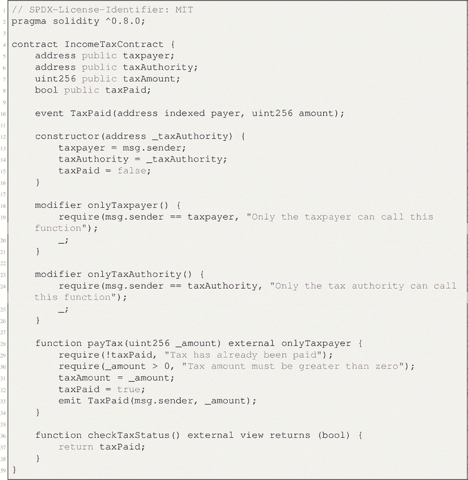

# 6. 使用区块链的案例研究

关键词：文档管理、食品供应链管理、保险行业、所得税部门、零售银行

## 6.1 区块链 – 文档管理技术

本节展示区块链如何彻底改变文档管理，在不可变的账本中确保数字资产的透明度、安全性和可追溯性。这个案例研究说明了区块链在增强文档处理中的数据完整性和信任度方面的力量。

### 6.1.1 所有权归属

印度政府电子与信息技术部（`MeitY`）下属的先进计算发展中心（`C-DAC`）是一家领先的研发机构。其主要工作是在信息技术、电子及相关领域开展研究与开发。`C-DAC`内部的不同部门是在不同时期，通常因认识到潜在机遇而成立的。其中一个正在开发的项目是文档管理。

### 6.1.2 引言与背景

在数字化背景下，由于教育证书、出生和死亡证明、驾照、健康记录、员工服务记录、销售契约和财产登记记录、谅解备忘录及协议等数字人造物的大量涌现，确保文档安全与有效管理的重要性显著提升。此外，各行各业都在经历使用纸质副本所带来的低效率问题。目前，采用数字化的趋势日益增长。因此，区块链技术已成为有效管理并安全存储各类文档和记录的重要工具。该平台为保护金融领域、教育机构和政府实体中的敏感数据提供了创新解决方案。区块链技术的应用在知识产权安全领域具有重大意义，因为它提供了显著优势，例如防篡改证据、不可篡改性和透明度。实施防篡改证据措施在减轻伪造和文档欺诈风险方面非常有效。

鉴于数字人造物的持续扩散，对其伪造进行管理是一个重大障碍。许多文档管理系统在透明度、安全性和效率等必要属性方面存在不足。区块链技术确保了记录的不可篡改性，防止其被删除并保持其顺序。这是通过系统固有能力实现的，即只允许添加新条目，而不修改现有条目。区块链技术能够验证各类文档在时间上的存在性、真实性并防止抵赖。机密文档需要一个能够管理用户权限的平台，以限制对区块链内数据的访问。在此背景下，区分公有链和私有链是一个关键考虑因素。

### 6.1.3 问题陈述

本案例研究聚焦于在日益数字化的环境中确保安全且透明的文档管理这一独特问题。传统的文档存储方法在确保真实性、抗篡改性和透明度方面面临诸多困难。与纸质文档相关的低效率问题以及对文档欺诈的更高风险已成为重大担忧。区块链技术的主要目标是通过提供一个安全透明的文档管理和存储平台来应对这些困难。解决这一问题的重要性在于维护机密文件的完整性、减轻伪造风险以及提高文档管理的整体效率。

### 6.1.4 用例描述

本用例的主要目标是探索区块链技术在文档管理领域的应用。该概念涉及安全存储及有效管理各类数字人造物（包括教育文凭、执照和记录）的系统化流程。区块链技术因其固有的抗篡改、不可篡改以及促进透明安全记录保存的特性，被认为适用于此特定场景。区块链技术的应用旨在提高数字文档的可信度、可追溯性和可用性。

### 6.1.5 解决方案架构

该区块链系统的架构框架包含了节点、共识流程、智能合约及数据存储等基本要素。节点是区块链网络中的活跃参与者，负责维护并保存分布式账本的多个副本。共识算法在促进网络节点就区块链当前状态达成一致方面起着关键作用。智能合约是能够自行执行的合约，内含预设规则以自动化执行业务操作。利用区块链技术进行数据存储，通过防篡改机制和加密安全措施保证了文档的完整性。

### 6.1.6 实施步骤

区块链解决方案的实施包含以下几个步骤:

1.  建立一个包含已识别参与方的许可区块链网络。

2.  配置节点并建立共识机制。

3.  定义智能合约以自动化文档管理流程。

4.  将区块链解决方案集成到现有文档管理系统中。

5.  开发供用户与区块链交互的用户界面和应用程序。

代码清单 6-1. 文档验证

``

### 6.1.7 智能合约

智能合约在解决当前问题上至关重要，因为它们促进了与文档管理相关的业务规则的自动化和执行。例如，智能合约能够建立有关文档创建、验证和授权生成及访问的规则。用户与智能合约的互动促进了文档相关交易的发起和执行。智能合约在促进透明度、减少对中介的需求以及提高文档管理流程效率方面发挥着关键作用。

### 6.1.8 数据管理与安全

存储在区块链上的数据经过加密，确保其机密性，并且具有防篡改能力，从而维护其完整性和安全性。每份文档都被分配一个独特的加密哈希值，作为其专属的数字标识符。哈希函数的使用旨在确保数据的完整性，并作为防止任何非法更改的预防措施。区块链的不可篡改性确保了文档一旦注册，就无法进行任何修改。为文档相关数据实施安全存储协议，显著提高了文档管理流程的整体安全性和完整性。

### 6.1.9 互操作性与集成

该区块链解决方案通过明确指定的接口与现有系统或数据库建立交互。互操作性是促进区块链与外部系统之间顺畅高效数据交换的关键因素。通过使用标准化的应用程序编程接口（`API`s）和集成协议来解决互操作性相关的挑战。此区块链解决方案的开发旨在增强并强化现有文档管理基础设施的功能。

### 6.1.10 用户体验

采用基于区块链的文档管理解决方案具有诸多优势。实施文档认证系统的益处包括：增强文档的真实性和可追溯性、降低与文档欺诈和伪造相关的风险、提高文档验证和核验流程的效率，以及提升利益相关者之间的透明度和信任度。对定量数据的分析表明，处理时间显著缩短，且非法文档修改事件有所减少。

### 6.1.11 成果与收益

实施基于区块链的文档管理解决方案可带来若干收益：定量数据显示处理时间缩短，且未经授权的文档篡改事件减少。

-   增强文档真实性与可追溯性
-   降低文档欺诈与伪造风险
-   提升文档验证与核验效率
-   增加利益相关者之间的透明度与信任度

定量数据显示处理时间缩短，且未经授权的文档篡改事件减少。

### 6.1.12 挑战与经验教训

采用基于区块链技术的文档管理系统具有众多优点。实施文档认证系统的好处包括：提升利益相关者之间的透明度和信任度；降低与文档欺诈和伪造相关的风险；增强文档真实性和可追溯性；以及提高文档验证和核验流程的效率。通过检查定量数据，可以明显看到处理时间显著改善，且未经授权的文档修改事件有所减少。

### 6.1.13 未来增强与可扩展性

未来可能的改进方向包括：整合更复杂的认证机制，进一步完善文档验证流程，以及探索与其他区块链网络的兼容性。可扩展性考虑涉及在维持最佳性能水平的同时，处理日益增长的文档数量和用户需求的能力。

### 6.1.14 结论

区块链技术在文档管理中的成功部署，有效解决了文档真实性、可追溯性和效率方面的难题。区块链技术的利用为文档管理过程带来了范式转变，因为它提供了一个安全、不可篡改且以透明性为特征的平台。区块链对文档管理行业的潜在影响，通过其提供的诸多优势得以凸显，例如更强的文档安全性、更低的欺诈风险以及改进的用户体验。

## 6.2 案例研究 2：区块链在食品供应链中的应用

本研究探讨了利用区块链技术来增强食品供应链中的透明度、可追溯性和整体完整性。该案例研究展示了区块链在革新食品行业、确保产品从生产者到消费者过程中的安全性和真实性方面的实际应用。

### 6.2.1 引言与背景

区块链技术常与比特币和以太坊等数字货币相关联。然而，区块链技术的实用性远不止于数字货币领域，它正被应用于供应链管理等不同行业。近来，区块链技术已被用作解决供应链内部障碍和不足的一种手段，从而变革了物品追踪和验证的过程。

### 6.2.2 问题陈述

食品供应链行业面临着显著的障碍，例如食品欺诈和可追溯性问题。食物中毒和欺诈事件的发生，凸显了对透明且可问责的供应链的需求。区块链技术为这些挑战提供了可行的解决方案，它有助于建立一个安全、不可篡改且实时的系统，用于监控食品从原产地到最终目的地的旅程。

### 6.2.3 用例描述

区块链技术被用于整个食品供应链，以有效监控和追踪食品的来源、加工和分销。区块链技术的去中心化特性意味着供应链中的所有参与者都能获取关于产品轨迹的精确透明信息。

### 6.2.4 解决方案架构

为食品供应链设计的基于区块链的解决方案包含多个组件，包括节点、共识机制、智能合约和数据存储。`Hyperledger Fabric` 框架被广泛应用于促进参与者之间的顺畅协作和高效数据共享。集成物联网（IoT）设备等补充技术，有助于实现实时数据的采集。

### 6.2.5 实施步骤

实施过程包括建立一个许可型区块链网络以及配置各个节点。智能合约的设计目的是为了自动化并确保可追溯性流程的执行。将区块链技术与现有系统整合，有助于在区块链和传统遗留系统之间实现无缝的数据交换。

代码清单 6-2. 食品链实施

``

### 6.2.6 智能合约

智能合约在自动化和优化供应链活动方面发挥着关键作用。规则和条件被制定出来以管理交易，从而保证所有参与者遵守共同商定的标准。

### 6.2.7 数据管理与安全

区块链技术固有的不可篡改性保证了分布式账本中数据的完整性和机密性。加密哈希和加密方法有助于增强数据的完整性，从而降低非法访问的风险。

### 6.2.8 互操作性与集成

通过 `API` 促进区块链技术与外部系统和数据库的集成，从而实现顺畅高效的数据交换。通过实施标准化的通信协议来解决互操作性难题。

### 6.2.9 用户体验

用户界面和应用程序的设计与实施，旨在为利益相关者提供便捷直观的方式来访问区块链数据。二维码和移动应用程序使消费者能够方便地扫描产品并检索关于其整个生命周期的全面信息。

### 6.2.10 成果与收益

将区块链技术整合到食品供应链中已被发现能带来显著的优势。增强的可追溯性实践已被证明对食品行业的各个方面产生积极影响，包括缩短召回期间的响应时间、预防食源性疾病以及最大限度地减少食物浪费。在商业实践中实施增强的透明度，能够培养消费者的信任，并促进道德采购。

### 6.2.11 挑战与经验教训

实施区块链技术面临着各种障碍，包括复杂的技术方面以及有效变革管理的必要性。所获得的见解包括协作努力、有效沟通和持续监控的重要性。

### 6.2.12 未来增强与可扩展性

为确保区块链技术的未来增强与可扩展性，必须解决实施过程中面临的挑战。这包括加大对研发的投入以改进技术方面，例如提升交易的速度与效率。此外，建立清晰的治理框架与标准，将促进不同区块链网络之间的互操作性，从而实现跨行业的无缝可扩展性。

### 6.2.13 结论

区块链技术的实施对食品供应链行业产生了重大影响，有效提升了该行业的可追溯性、透明度和问责制。沃尔玛等企业成功整合区块链解决方案，展示了构建更安全、更精简、更环保的食品生态系统的能力。

## 6.3 案例研究 3：保险业的区块链技术

本案例研究探讨了区块链技术在保险业的变革潜力，旨在解决行业挑战、提升效率并增强信任。案例深入分析了区块链在保险领域的实际应用，重点阐述了其在革新传统流程与数据管理方面的作用。

### 6.3.1 引言与背景

区块链技术已引起全球各行业的关注，有望在数据存储、交换和保护方式上带来巨大改进。这项颠覆性技术的潜在应用远不止于加密货币。本节将探讨如何利用区块链解决健康险与人寿保险行业中的重大问题。不断上升的成本、不断变化的客户期望以及颠覆性创新者的潜在威胁，都需要全新的解决方案。区块链凭借其独特属性，有潜力彻底改变多个行业。

### 6.3.2 问题陈述

健康险与人寿保险公司面临着诸多问题：行政成本上升、自动化需求增加，以及老龄化劳动力急需现代化改造。此外，不断变化的客户期望要求提供个性化服务、增强隐私保护、创新产品以及有竞争力的定价。在此背景下，区块链技术作为一种有前景的解决方案应运而生。然而，关于区块链技术在降低成本、风险管理、提升客户服务及最终实现盈利方面的潜在应用，仍有许多未解决的问题。

### 6.3.3 用例描述

德勤健康解决方案中心与金融服务中心合作开展了一项众包研究项目，旨在探索区块链在健康险和人寿保险领域的革命性潜力。其目标是确定区块链及类似技术在未来 5 到 10 年内如何提升保险公司的价值主张。该项目最终确定了六个重要用例，为保险公司提供了利用区块链能力的实用且可行的途径。

### 6.3.4 解决方案架构

这些用例深入探讨了人寿与健康保险公司的底层流程和业务结构，涵盖了运营功能的改进、利益相关者的互动以及客户体验的提升。最终目标是削减开支、提高运营效率，并与保单持有人建立更紧密的联系。

### 6.3.5 实施步骤

区块链在保险业的应用需要周密的规划和明智的部署。保险公司必须认识到这项技术在升级老旧 IT 系统、提高效率和增强竞争力方面的潜力。与前沿区块链技术合作伙伴合作，并广泛接触各类专家可能是必要的。只有当区块链与强大的分析能力、人工智能及物联网技术相结合时，其全部潜力才能得以释放。此外，保险公司还应积极与医疗保健联盟合作，为可互操作的区块链数据存储库制定标准。

### 6.3.6 智能合约

`智能合约`是区块链变革力量的核心。这些经过数字签名、可计算的合约允许自动执行和强制实施条款与条件。它们是安全自主交易的基石。例如，`智能合约`可以自动化保险理赔处理，减少人工干预和行政费用。

**示例**

``

``

**部署 `InsuranceContract` 智能合约**

``

**保单持有人支付保费**

``

**保单持有人提交理赔申请**

``

**保险公司批准理赔**

``

**保单持有人取消保单**

``

### 6.3.7 数据管理与安全

区块链的数据管理能力无与伦比。它将数据加密并作为区块链进行存储，确保了数据的安全性和不可篡改性。这一强大的数据安全特性增强了用户信任，这在保险市场至关重要。

### 6.3.8 互操作性与集成

区块链能够在机构之间建立信任，这使其成为解决医疗保健行业互操作性问题的理想选择。基于区块链的综合健康记录有助于弥合不同健康信息系统之间的差距，并促进医疗保健提供者之间的协作。

### 6.3.9 用户体验

区块链技术有潜力彻底改变健康险和人寿保险的用户体验。保险公司可以通过在区块链上集成安全且易于获取的医疗记录，加快申请流程，为原本繁琐且具侵入性的体验带来便利和安心。

### 6.3.10 分析

区块链在保险业，尤其是健康险和人寿保险领域，具有巨大的潜力。通过事件触发的智能合约、提升后端效率、去中介化、优化定价与风险评估、创建新型保险产品以及触达服务不足的市场，区块链有望带来革命性的变化。其降本潜力显而易见，尤其是在理赔处理、行政、核保和产品开发方面。

### 6.3.11 结论

区块链不仅仅是一个流行词，它是一股变革力量，有潜力彻底改变健康险和人寿保险行业。通过利用区块链的独特属性，保险公司可以提高效率、改善消费者体验，并促进对全新互动式保险和创新服务的尝试。前进的道路需要大胆的计划、积极的尝试以及与新兴技术的深度融合。由区块链驱动的创新将定义健康险和人寿保险的未来，为打造一个充满活力、以客户为中心的市场格局铺平道路。

## 6.4 案例研究 4：印度所得税部门简化税务流程

本案例研究探讨了如何利用区块链技术来精简和简化印度所得税部门的税务流程。它展示了区块链如何优化复杂的政府流程、改进数据管理，并提升税务相关活动的整体效率。

### 引言与背景

印度的所得税部门（ITD）开启了一场全面的数字化转型之旅，以满足日益增长的公共需求并提高税务运营效率。这一战略行动与政府通过数字化提升公共服务可及性与效率的总体目标高度契合。通过采用区块链技术及其他数字工具，ITD 旨在简化复杂的税务流程、提高透明度，并为纳税人提供更友好、更流畅的体验。此举彰显了印度致力于利用前沿技术打造更高效、响应更迅速的政府生态系统的决心。

### 问题陈述

ITD 在将其运营数字化以适应印度日益增长的纳税人数量方面曾面临挑战。它需要跟上不断变化的公民期望，同时还要满足政府减少腐败、提高透明度和促进营商便利化等主要优先事项。

### 用例描述

为应对这些挑战，ITD 决定采用基于区块链的策略。这一具有前瞻性的决策使 ITD 能够聚焦于区块链技术可带来显著效益的具体用例。值得注意的是，ITD 重点关注了`表格 15G/H`和`表格 26AS`的自动化处理。选择这些用例的目的是为了简化和自动化与税务相关的流程，从而惠及纳税人和金融机构。

实施区块链技术以实现`表格 15G/H`和`26AS`处理流程的自动化，标志着税务运营向效率和公开性迈出了根本性转变。它使纳税人能够以最少的人工干预和错误风险提交和管理这些表格。此外，金融机构可以利用区块链实时获取准确的税务信息，从而简化其合规流程。

ITD 的这一战略举措展现了政府致力于采用区块链等创新技术来整体改善税务生态系统的决心。它不仅简化了税务相关流程，还为打造更数字化、更高效的税务管理系统铺平了道路，符合在印度提升政府服务和培育营商友好环境的总体目标。

### 解决方案架构

鉴于其基于信任的机构协作特性，ITD 及其技术合作伙伴 Infosys 选择了许可型区块链。为了维护数据隐私和安全，解决方案设计涉及开发一个安全的、受权限控制的分类账本。区块链技术还支持开发智能合约，用于自动化操作和执行法规。

### 实施步骤

实施是分阶段进行的。ITD 和 Infosys 开始测试基于区块链的用例，例如`表格 15G/H`和`表格 26AS`。这些试验旨在评估区块链在加速税务流程方面的可行性和有效性。

### 智能合约

智能合约在自动化许多税务相关活动中至关重要。当满足特定条件时，它们能够执行预定义的操作。例如，利用智能合约来自动验证`表格 15G/H`的提交状态以及生成税务报表。

**一个示例**

**示例输入与输出**

纳税人部署合约并指明税务机关的地址：

**缴纳税款**

纳税人支付一定金额：

**检查纳税状态**

所有纳税人都可以检查自己的纳税状态：

**再次尝试缴纳税款**

如果纳税人试图再次缴纳税款，该尝试将失败，因为税款已经缴纳：

### 税务机关交互（此简化示例中未实现）

税务机关本应具备验证和处理税款支付的功能。但这些功能并未包含在此基础示例中。

### 事件日志

当纳税人缴纳税款时，会触发一个事件，该事件可在链下捕获：

此事件可用于追踪不同纳税人的税款支付情况。

### 数据管理与安全

数据安全与隐私是区块链系统中的关键考量因素。区块链的不可篡改性和加密特性确保了数据的安全和防篡改。权限限制控制了数据访问，而智能合约则强制执行数据验证规则。

### 互操作性与集成

该解决方案需要纳入多个参与者，包括银行、金融机构和政府组织。互操作性是一个关键方面，它允许不同群体在确保数据完整性的同时顺畅地传输数据。

### 用户体验

区块链计划的目的是为纳税人提供流畅且用户友好的报税体验。流程自动化（例如预填税务表格）的目标是使公民更容易、更便捷地履行纳税义务。这份结构化的摘要概括了案例研究的关键部分和主要内容。您可以根据需要提供更多细节和分析来扩充每个部分。

### 分析

印度 ITD 利用区块链改善税务流程的案例研究，生动地说明了新技术如何改变复杂的官僚运作。鉴于税务操作中涉及的财务数据敏感性，ITD 部署许可型区块链系统是一个明智的选择。这种方法确保了数据安全性和透明度，并防止了篡改。此外，ITD 致力于通过简化报税流程和探索预填税务报表等解决方案来满足不断变化的公民期望，这体现了以用户为中心的方法，最终促进了自愿纳税合规。

重要的是，ITD 认识到需要建立一个涵盖银行、金融机构和政府机关等各类利益相关方的协作生态系统。通过构建许可型区块链网络，ITD 高效地支持了不同实体间的实时、安全数据共享，优化了协调工作并打击了逃税行为。另一个值得称赞的组成部分是将智能合约引入区块链架构，这有望在验证和报告等流程中实现自动化并降低错误率。

最有前景的特点之一是 ITD 愿意扩大区块链网络的范围，以容纳更多用例和利益相关方。由于其适应性，该平台被定位为一个能够满足未来税务需求的灵活工具。此外，ITD 主动与监管机构合作，使现有法规适应区块链概念，这一点至关重要。这种监管上的前瞻性确保了该项工作在推动税务数字化前沿的同时，仍能保持法律合规性。

### 6.4.13 结论

最后，印度所得稅局（ITD）利用区块链技术简化税务流程，展示了分布式账本技术在政府运作中的革命性潜力。本案例研究聚焦于该部门主动采取的策略，以应对数字素养日益提高的居民不断变化的期望，同时解决棘手的税务合规挑战。采用许可制区块链系统，突显了数据安全、透明度以及多方利益相关者协作的重要性。

印度 ITD 以简化报税流程和促进自愿合规为目标，其对以用户为中心的执着追求，为改善更广泛的税收环境带来了巨大希望。将智能合约整合到区块链架构中，代表了一种前瞻性的方法，有潜力实现流程自动化，并减少数据验证和报告中的错误。

此外，ITD 愿意扩大网络范围，并与包括银行、金融机构和政府机构在内的其他利益相关者互动，展示了一种灵活且适应性强的策略。由于其弹性，区块链平台可以根据不断变化的税法和法规进行调整。

总体而言，印度 ITD 的区块链项目在提高效率、开放性和信任度的同时，为政府运作的现代化树立了典范。它展示了如何利用新兴技术来改善用户体验并简化关键的政府任务。

## 6.5 案例研究五：零售银行业务

本部分探讨了区块链技术在零售银行业务领域的变革潜力。零售银行业历来在一个竞争激烈且饱和的市场中运营，银行之间通过渐进式的改进进行竞争。然而，区块链技术的出现为制定蓝海战略（一个竞争更少、对客户和机构价值更高的市场空间）提供了独特机遇。

### 6.5.1 引言与背景

零售银行业在探索区块链技术巨大潜力的过程中，正处于变革性突破的边缘。截至 2021 年，全球零售银行业区块链市场规模为 6.4 亿美元，并预计在 2022 年至 2030 年间以 83.9%的复合年增长率迅速扩张。这一非同寻常的增长轨迹主要归因于区块链消除中介、增强信任以及彻底改变零售银行数据管理的能力。

以积极开发数字商业模式和扩展服务范围以满足数百万消费者需求而闻名的零售银行，在采用区块链技术方面持谨慎态度。他们不愿贸然进入这个充满希望的环境，这与其他行业所观察到的热情和创造力形成了鲜明对比。政府、投资机构和基础设施提供商因其认识到区块链能够降低运营成本并提高透明度而热情地采纳了它。例如，投资银行预见到一个执行、交易后处理和结算即时的未来，这使许多中后台处理流程变得过时。他们对智能合约很感兴趣，因为它们具有革新自动化的潜力。

### 6.5.2 问题陈述

该问题陈述指出了零售银行业在采用区块链技术背景下所面临的一个重大障碍。尽管各种实体，如政府、投资银行和基础设施提供商，一直在积极参与区块链实验以降低成本和提高透明度，但零售银行采取了明显更为谨慎的立场，基本上避免了积极参与。

这个问题代表了行业中一个更大的趋势，即零售机构选择观察而非积极参与区块链革命。与其他行业的同行不同，零售银行尚未充分利用区块链技术带来的潜在好处。该问题陈述将这种不情愿确定为零售银行业的一个紧迫问题。

### 6.5.3 用例描述

该问题陈述指出了零售银行业在采用区块链技术背景下所面临的一个重大障碍。尽管各种实体，如政府、投资银行和基础设施提供商，一直在积极参与区块链实验以降低成本和提高透明度，但零售银行采取了明显更为谨慎的立场，基本上避免了积极参与。

这个问题体现了行业中一个更大的趋势，即零售银行选择观察而非积极参与区块链革命。与其他行业的同行不同，零售银行尚未完全利用区块链技术带来的潜在好处。该问题陈述将这种犹豫确定为零售银行业环境中的一个紧迫问题。

### 6.5.4 解决方案架构

为鼓励零售银行采用区块链技术而设计的解决方案架构是一个全面的框架，它整合了从组织战略到技术及监管合规等各个要素。这种多方面的方法旨在为零售银行采用区块链技术提供一条清晰、结构化的路径，同时有效管理相关风险并抓住机遇。

**区块链基础设施**

该架构的核心是选择一个适合零售机构特定需求的区块链平台。这一决策可能涉及选择公有链、私有链或联盟链，常见选项包括 `Ethereum`、`Hyperledger Fabric`、`Corda` 和 `Quorum`。此外，将区块链节点整合到银行的基础设施中至关重要。这些节点服务于多种目的，例如在公有链中进行验证和挖矿，或在私有网络中作为许可节点。

**监管合规**

零售银行必须积极与监管机构接触，以确保与现有监管框架无缝集成。与监管机构建立协作关系，使银行能够影响与区块链相关的法规，并主动解决问题。此外，将了解你的客户（KYC）和反洗钱（AML）合规解决方案与区块链整合，对于有效满足监管要求是必要的。

### 6.5.5 实施

为鼓励零售银行采用区块链技术，明确目标并识别相关用例是至关重要的第一步。这一初始阶段确立了采用过程的总体方向。零售银行必须阐明他们希望通过实施区块链来实现的具体目标。这些目标可能包括提高交易效率、降低运营成本、增强安全性以及提供创新的客户服务。除了这些目标，识别相关用例也至关重要。零售银行必须确定区块链技术能够产生重大影响的运营领域。这些可能包括跨境汇款、KYC 流程、欺诈预防和供应链融资。通过明确这些目标和用例，零售银行可以为其区块链之旅奠定战略基础，这将指导后续的决策和行动。

在确立目标和用例之后，下一步是选择最能满足零售银行特定需求的区块链平台。区块链平台的功能、可扩展性和组织结构各不相同。零售银行必须彻底评估现有选项，例如 `Ethereum`、`Hyperledger`、`Corda` 和 `Quorum`，同时考虑运营规模、隐私需求和系统兼容性。区块链平台的选择对于实施的成功至关重要，因为它决定了银行运营的技术框架。因此，这一决策过程需要对当前和未来需求进行全面评估。

与监管机构合作对于促进零售机构采用区块链技术至关重要。由于区块链在一个很大程度上尚未被监管的领域中运作，零售银行必须主动与监管机构接触，以影响不断变化的监管框架。关于安全性、数据隐私以及遵守反洗钱和 KYC 法规的担忧将在公开对话中得到解决。通过与监管机构建立战略合作关系，零售银行有可能协助制定务实且明确的协议，这些协议不仅能简化区块链技术的实施，还能维护金融行业的道德标准。建立这种协作关系将减少监管不确定性，从而营造有利于零售银行区块链创新的环境。

### 6.5.6 数据管理与安全

在促使零售银行采用区块链技术的背景下，本章重点讨论区块链系统内关键的数据管理和安全问题。本节概述了零售银行在迁移到基于区块链的解决方案时，为确保数据的完整性、隐私性和恢复能力而应采用的方法和考量。

区块链中的数据管理包含几个关键方面，如下所示：

**数据完整性**

确保存储在区块链上的数据的真实性和一致性至关重要。区块链的不可篡改账本旨在防止对记录数据进行非法更改。为维护数据完整性，零售机构必须实施强大的数据验证和共识机制。

确定数据在区块链网络上的存储方式和位置至关重要。这包括针对各类数据，尤其是敏感的客户信息，考虑是采用链上存储还是链下存储。

**数据迁移**

如果零售银行要从传统系统过渡到区块链，他们必须有一个明确定义的数据迁移策略。这将确保历史数据能够以不损害其完整性的安全方式迁移到区块链上。

另一方面，安全性是一个多层面的问题。

**智能合约审计**

用于在区块链上自动化流程的智能合约，必须接受严格的审计，以识别可能被恶意行为者利用的漏洞或缺陷。为确保这些合约的可靠性，需要进行例行的安全审计和代码评估。

**访问控制**

对区块链网络的访问控制至关重要。为防止未授权访问关键数据和功能，银行应采用强大的身份与访问管理系统。

### 6.5.7 网络安全

保护区块链网络整体免受外部攻击至关重要。为防范网络攻击，零售银行应实施强大的安全措施，例如防火墙、入侵检测系统和加密技术。

### 6.5.8 事件响应

在网络安全形势不断变化的今天，准备工作犹如坚不可摧的堡垒，在金融行业尤其如此。在威胁四伏、网络犯罪分子不断精进其手段的数字时代，拥有强大的事件响应计划的重要性怎么强调都不为过。这些精心构建的蓝图，可视为银行在与无休止的网络攻击浪潮进行旷日持久的战斗中坚不可摧的铠甲。

这些计划中首要的是对超灵敏检测机制的需求。银行必须投资于能够检测到即使是最隐蔽入侵迹象的尖端网络安全解决方案。集成机器学习和人工智能算法变得至关重要，这使得能够实时分析海量数据集，以前所未有的速度和准确性检测异常和潜在威胁。

适应性强的有效缓解策略同样重要。一旦发现事件，立即部署行动以遏制威胁并防止其扩散便成为核心任务。银行必须详述隔离受攻击系统或网络的程序，同时为深入的取证分析保留关键证据。此外，与执法机构和监管机构建立预定义的沟通渠道可以加快缓解工作，从而增加抓捕网络罪犯的可能性。

恢复流程不应被事后考虑，而应是响应计划的一个组成部分。银行必须勤勉地制定策略，以加快受影响系统和服务的恢复，从而最大限度地减少对客户和内部业务的干扰。这通常需要部署强大的备份系统、严格验证数据完整性，并实施强化的安全措施以防止事件再次发生。

### 6.5.9 互操作性与集成

解决方案架构中关于吸引零售银行实施区块链技术的这一部分，对于区块链在银行业中的广泛采用至关重要。它概述了确保区块链系统与现有银行基础设施（如遗留系统、第三方合作伙伴和监管框架）无缝集成所需的策略和考量。

建立互操作性标准和跨区块链兼容性是本节的重点。通过遵循行业标准协议并设计与多个区块链平台兼容的区块链解决方案，零售银行可以确保技术的灵活性和适应性。本节还强调了将区块链技术与遗留系统集成的重要性，包括数据迁移策略和智能合约集成。这种集成有助于在保留核心银行功能的同时，顺利过渡到区块链技术。此外，它强调了与外部合作伙伴和监管实体协作以确保安全数据共享和交易处理的重要性。总体而言，互操作性与集成需要为零售银行制定详细的路线图，使其能够将区块链技术无缝集成到运营中，从而在保持符合行业标准和法规的同时，提高效率和透明度。

### 6.5.10 用户体验

本节强调了设计用户友好型界面和体验以促进向区块链技术平稳过渡的重要性。对于零售银行客户而言，这意味着要开发用户友好、安全且易于访问的平台，用于基于区块链的交易，如跨境支付和账户管理。其目标是让客户对区块链技术的采用变得透明且简单，从而提升其整体银行体验。

本节强调了为银行员工提供全面培训和支持以有效使用区块链系统的重要性。这包括创建教育材料、举办培训课程以及建立帮助台，以解决采用过程中可能出现的任何疑问或担忧。通过确保员工具备操作和管理区块链技术的足够能力，零售机构可以提高运营效率并减少中断。

此外，对用户体验的关注也认识到反馈循环和持续改进的价值。零售银行应积极征求客户和员工的反馈，以识别痛点、收集改进建议，并相应调整其区块链系统。这种迭代方法将使银行能够随着时间的推移优化其区块链解决方案，使其更加用户友好，并符合客户和员工的需求与期望。

### 6.5.11 分析

本节关于零售银行使用区块链技术和加密货币的内容，揭示了一个充满活力的行业格局，其中传统银行服务正面临数字化转型的挑战。从早期的网上银行服务到当前的移动银行时代，零售银行业经历了重大演变。然而，绝大多数零售银行一直在“红海”中运营，这是一个以激烈竞争和有限创新为特征的领域。

在此背景下，区块链技术作为一股变革力量出现，可能推动该行业走向“蓝海”战略，同时提供差异化和成本优势。区块链安全透明的分布式账本系统有潜力彻底改变零售银行处理交易和数据的方式。

分析还强调，为了充分实现收益，行业需要广泛采用区块链和加密货币。要做到这一点，银行业必须克服监管和标准化障碍。区块链在零售银行业的成功取决于建立一个促进全球访问和支付清算的正式网络，从而促进银行与其他利益相关者之间的合作。

此外，分析重点关注零售银行业的当前格局，其中支票和储蓄账户、抵押贷款和个人贷款等传统产品和服务占据主导地位。

分析强调了先驱者通过“价值创新”创造蓝海的作用。纳斯达克股票市场与花旗银行之间的合作展示了区块链技术简化支付和创建实时数字解决方案的能力。区块链的变革力量在于其自动化流程、提高安全性以及支持基于生态系统的交易的能力。

### 6.5.12 结论

总而言之，关于零售银行业与区块链技术的案例研究展示了金融领域的巨大变革潜力。研究结果强调了区块链在颠覆传统银行实践中的核心作用，尤其是在跨境汇款、KYC（了解你的客户）流程和欺诈防范方面。它强调零售银行需要对区块链的采用采取积极主动的态度，以获得降低成本、提高效率和构建更安全的银行生态系统等益处。

此外，该案例研究提供了一个综合性的解决方案架构，融合了技术、监管和组织要素，以帮助零售银行采用区块链技术。该架构包括关键阶段，如平台选择、监管对接、人才招聘、概念验证项目、与金融科技合作伙伴的协作、客户教育、可扩展性规划和安全措施。

此外，该研究评估了零售银行业的现状，并勾勒出战略画布，强调了创造客户价值的重要性。它区分了行业内定居者、移民和先驱者的服务提供，展示了区块链创新创造“蓝海”无竞争市场空间的潜力。

## 6.6 总结

本章通过众多案例研究，阐述了区块链技术在各行各业中的实际应用。这些案例研究揭示了区块链如何演变为一种强大的工具，用于实现多种目的，包括文档管理、提升供应链的透明度和安全性，甚至简化政府机构内部的复杂流程。

第一个案例研究题为“区块链 – 文档管理技术”，探讨了区块链在文档管理中的应用。它描述了该技术的历史和所有权、它解决的问题，并提供了区块链技术的概述。该案例研究进一步研究了用例、解决方案架构、实施阶段、智能合约、数据管理和安全性。

第二个案例研究的重点“区块链在食品供应链中的应用”转向了区块链如何彻底改变食品行业。从背景和问题陈述开始，本节阐述了区块链如何改善农业供应链管理、透明度和可追溯性。

第三个案例研究“区块链在保险行业中的应用”考察了区块链技术在保险行业的潜在应用。该案例研究深入探讨了用例描述、解决方案架构、实施阶段、智能合约、数据管理、安全性、互操作性和用户体验。案例研究的分析部分分析了区块链技术对保险行业的影响，研究最后总结了关键要点。

第四个案例研究“印度所得税部门简化税务程序”探讨了区块链简化税务流程的潜力。它概述了问题陈述，并描述了在印度简化税务程序的用例。该案例研究分析了解决方案架构、实施阶段、智能合约、与税务机关的交互、事件日志记录、数据管理、安全性、互操作性和用户体验，以及解决方案的实施。

最后一个案例研究“零售银行业务”考察了区块链在银行业中的应用。它以引言开始，阐述了零售银行业务的问题陈述以及采用区块链的用例。该案例研究分析了解决方案架构、实施程序、数据管理、安全性、网络安全、事件响应、互操作性和用户体验。

在本章中，作者对区块链实施中面临的障碍、经验教训以及潜在的可扩展性和效率提升提供了深刻的评论。这些真实的案例研究展示了区块链技术在多个行业的适应性和潜力，并全面概述了其实际应用和优势。

## 6.7 练习

本节提供基于本章所涵盖主题的练习题。

### 6.7.1 选择题

1.  哪个行业已实施区块链技术以增强供应链的透明度和可追溯性？
    1.  医疗保健
    2.  时尚
    3.  农业
    4.  娱乐

2.  在“沃尔玛食品安全”区块链项目中，使用区块链的主要目标是什么？
    1.  降低运营成本
    2.  改善食品安全
    3.  提升客户体验
    4.  扩展产品线

3.  哪种加密货币是作为以太坊区块链智能合约功能的成果而创建的？
    1.  比特币
    2.  瑞波币 (XRP)
    3.  莱特币
    4.  以太币 (ETH)

4.  哪个行业最有可能因使用区块链来减少欺诈和仿冒而受益？
    1.  汽车
    2.  房地产
    3.  银行业
    4.  游戏

5.  哪个区块链联盟以专注于增强不同区块链网络之间的互操作性而闻名？
    1.  R3 Corda
    2.  Hyperledger
    3.  企业以太坊联盟
    4.  币安智能链

6.  “IBM Food Trust”区块链平台在食品行业主要用于什么目的？
    1.  跟踪和追溯食品
    2.  在线食品配送
    3.  餐厅管理
    4.  食品包装设计

7.  哪个区块链用例涉及记录财产所有权和地契以防止欺诈和纠纷？
    1.  医疗记录
    2.  供应链管理
    3.  身份验证
    4.  房地产和土地登记

### 6.7.2 简答/论述题

1.  解释什么是区块链技术，并用简单的术语说明其工作原理。
2.  解释区块链背景下的去中心化概念。
3.  区块链网络的关键组成部分是什么？
4.  描述共识机制在维护区块链完整性方面的作用。
5.  区块链技术如何增强数据交易中的安全性和信任度？
6.  列举除金融之外的两个已采用区块链技术的行业，并简要说明它们的用例。
7.  什么是智能合约，它如何在区块链上自动化处理流程？
8.  公有链和私有链有何不同，它们各自的优势是什么？
9.  与采用区块链技术相关的挑战或限制有哪些？