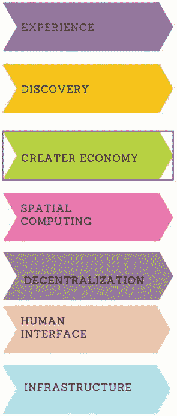

# 7. 超越区块链

关键词：元宇宙，元宇宙层级，沉浸式技术，数字稀缺性，金融，未来银行，可持续区块链，缠结

元宇宙是一项旨在彻底改变我们与虚拟世界交互和互动方式的创新技术。通过利用区块链的去中心化特性，它为用户在元宇宙中创建、拥有和交易数字资产提供了一个安全透明的平台。这项技术有潜力通过赋予用户对其虚拟身份和财产的真正所有权和控制权来赋能用户，从而开创一个身临其境且互联互通的虚拟体验新时代。

## 7.1 用于元宇宙的区块链

区块链技术的利用在促进元宇宙内建立信任、安全性和去中心化方面具有巨大潜力。本节探讨了区块链技术在应对沉浸式数字现实这一独特问题和特定需求方面的潜力。

## 7.2 元宇宙的兴起

想象一个虚拟世界，数十亿人在其中生活、工作、交易、学习，并相互交流，而他们本人则坐在现实世界的沙发上。
在这个世界里，我们用来连接全球信息网络的电脑屏幕，变成了通往一个可感知、三维（3D）虚拟世界的门户——它就像现实生活，却又优于现实生活。作为我们数字化的化身，虚拟形象可以带着我们的身份和财富，自由地从一个体验场景移动到另一个体验场景。这就是所谓的元宇宙，而且，与普遍观点相反，它目前尚不存在。
一个被过度炒作、迅速演变、有潜力彻底改变人类生活方式的概念，商业领袖们应该如何理解它？TechTarget 的这份元宇宙综合指南，描述了这场新兴技术革命的现状和未来轨迹。它探讨了元宇宙的支撑技术和平台，以及它的优势与劣势、投资策略、历史背景、重要性和对劳动力未来的影响。
本指南中包含指向对这些及其他相关主题进行深入分析的链接，以及关键元宇宙概念（如互操作性、数字孪生、空间计算和 `Web 3.0`）的定义。

元宇宙中的分层结构包括 7 个层次。从上至下分别是：体验层、发现层、创作者经济层、空间计算层、去中心化层、人机交互层和基础设施层。
**图 7-1** 元宇宙分层结构

## 7.3 理解元宇宙

元宇宙是一个新兴的、支持 3D 的数字空间，它利用虚拟现实（VR）、增强现实（AR）以及先进的互联网和半导体技术，来促进逼真的在线个人和商业体验。近年来，人们对元宇宙的兴趣急剧增长，2021 年“元宇宙”一词的互联网搜索量惊人地增长了 7,200%。
这种兴趣激增不仅仅局限于个人；私人资本也在大力投资元宇宙。2021 年，与元宇宙相关的公司筹集了超过 100 亿美元，资金额较前一年翻了一倍多。这一趋势在 2022 年得以延续，超过 1,200 亿美元投资于与元宇宙相关的事业。根据麦肯锡的最新研究，到 2030 年，元宇宙有潜力创造高达 5 万亿美元的价值，使其成为一个不容错过的机遇。
不同的人对元宇宙这个概念有不同的解读。有些人将其视为企业与消费者互动的商业空间。麦肯锡的观点则包含了这两种解读。根据该公司 2022 年 6 月的报告《在元宇宙中创造价值》，元宇宙的最佳特征是一种互联网的演进，人们深度沉浸其中，而不仅仅是旁观。它代表了众多数字技术的融合，例如加密货币、人工智能（`AI`）、增强现实（`AR`）、虚拟现实（`VR`）以及空间计算等。 “企业元宇宙”可能不仅仅是一个用于互动的虚拟空间；它还可能释放新的机遇。

## 7.4 元宇宙的层次

元宇宙可以被概念化为一个多层面的生态系统，包含七个基础层，每一层在定义整个元宇宙体验中都扮演着关键角色。元宇宙的分层结构在图 7-1 中给出：
**体验层**
这一层代表了元宇宙的基本精髓，即个体主动参与到沉浸式和同步的体验中。其目标不仅仅是单纯的被动观察，而是致力于创造一个高度参与且真实的数字环境。人们可以期待体验到能够模拟现实世界的各种活动，从而使游戏、社交互动、电子商务、娱乐和电子竞技等活动更具沉浸感和真实感。
**发现层**
发现层的概念指的是一个用户界面，它提供简化的、统一的入口，以访问图书馆或其他信息系统内的各种信息资源。
发现层的主要目的是审视用户在元宇宙中发现和探索新体验、新平台、新技术和新社区的机制。这包括一系列渠道，例如应用商店、搜索引擎、评论平台和广告展示。高效的发现技术对于使用户能够熟练地导航广阔的元宇宙至关重要。
**创作者经济层**
这一层的范围包括开发者和内容创作者在元宇宙中生成数字资产、沉浸式体验和其他资源所使用的各种工具和应用。重点在于促进内容创作的民主化，通过利用用户友好的平台和拖放功能，使个体能够转变为创作者、开发者或设计师。

### 7.4.1 空间计算

空间计算是指一种结合了增强现实和虚拟现实的信息技术解决方案。根据 Radoff 的说法，空间计算使我们能够访问和操纵三维空间。它使用户能够通过云计算将物体数字化，将传感器与执行器集成以实现响应式功能，并通过空间映射将物理环境数字化。这一层包含关键组件，例如像 `Unity` 和 `Unreal` 这样的 3D 引擎。此外，`Niantic Planet-Scale AR`、`Cesium` 和 `Descartes Labs` 的地理空间映射技术也有助于对地球内外部空间的解读和映射。
**去中心化层**
从理想主义的角度来看，元宇宙应该表现出去中心化和开放性，其治理权委托给去中心化自治组织（`DAO`），以维护透明度并防止中心化所有权。区块链技术和去中心化应用（`DApps`）在这一层中扮演着关键角色，因为它们能有效解决与隐私和安全相关的问题。突出的例子包括 `Decentraland`，这是一个由 `DAO` 治理的去中心化虚拟领域的典范。人机交互层指的是能够促进人类与底层技术之间进行交互的系统组件。
**人机交互层**
人机交互层主要关注的是通过利用先进的人机交互（`HCI`）技术，促进用户与元宇宙互动的技术方面。上述技术包括 `VR` 头显、智能眼镜、触觉反馈设备，以及像 `Google Glass` 这样的 `AR` 技术。这些界面充当了连接物理世界和数字世界的桥梁，促进了顺畅无阻的移动。
**基础设施层**
基础设施层是系统或网络环境中的一个关键组成部分。它包含了支撑整个元宇宙生态系统的基础性技术和组件。这包括多种技术进步，例如用于减少延迟和拥塞的 5G 等高速网络、半导体、微机电系统（`MEMS`）、耐用的电池、区块链技术、人工智能、云架构以及图形处理单元。这些技术负责确保元宇宙无缝且有效地运行。

### 7.4.2 元宇宙的构成要素

元宇宙是一个新兴的数字空间，它通过 `VR`、`AR`、区块链等技术促进沉浸式互动体验，从而扩展了互联网的能力。这是一个共享的、互连的虚拟宇宙，用户可以在其中与他人以及数字环境进行实时互动。元宇宙由许多组件构成，下文将对此进行讨论。
**虚拟世界**
这些是模拟物理空间或完全虚构世界的数字环境。虚拟世界可以是现实世界地点的再现，也可以是完全虚构的景观。用户可以使用虚拟化身来探索并与这些世界互动。
**虚拟化身**
虚拟化身是元宇宙用户的数字代表。它们可以被修改，以反映用户的外貌、身份和偏好。虚拟化身使用户能够导航并与虚拟环境互动；它们本质上是用户的数字角色。
**数字资产**
数字资产是在元宇宙中具有价值的数字对象或产品。这些资产可以包括虚拟房地产、虚拟化身服饰、数字收藏品、虚拟货币（通常由非同质化代币或 `NFT` 代表）等等。在元宇宙中，数字资产可以被拥有、交易和使用。
**空间计算**
空间计算技术，如 `AR` 和 `VR`，在元宇宙内创造沉浸式体验方面扮演着至关重要的角色。`AR` 将数字信息叠加到现实世界之上，而 `VR` 则生成完全虚拟的环境供用户沉浸其中。
**交互性**
交互性是元宇宙的基本特征，它允许用户与数字环境以及其他用户进行互动。这包括社交互动、娱乐、商业、教育及其他活动。实时沟通与协作是必不可少的特性。
**区块链技术**
区块链技术常用于支持元宇宙，因为它提供了一种安全且透明的方法来管理数字资产、验证所有权以及促进交易。独特的数字物品或资产由 `NFT` 代表，这通常与区块链技术相关联。
**去中心化**
元宇宙通常遵循去中心化原则运作，减少对中央机构的依赖。这种去中心化可能包括分布式服务器、基于区块链技术的治理，以及用户驱动的内容创建和管理。
**跨平台兼容性**
元宇宙的主要目标之一是促进跨平台兼容性，允许用户从各种设备（例如个人电脑、`VR` 头显、`AR` 眼镜、智能手机等）访问并与元宇宙交互。
**用户生成内容**
鼓励用户通过生成自己的内容（无论是虚拟空间、数字艺术作品还是互动体验）来为元宇宙做出贡献。用户生成内容是推动元宇宙丰富性和多样性的主要动力。

### 7.5 通过沉浸式技术进入元宇宙

使用沉浸式技术（特别是 `VR`）作为访问元宇宙的手段，已成为众多组织的一种关键方法。这项技术进步使得能够访问一个促进全球互动的计算机模拟领域。许多企业正在将 `VR` 技术整合到其运营框架中，作为一项战略措施，以适应未来以计算机模拟环境为特征的预期。
以下是一份全面的循序渐进的指南，旨在帮助企业通过使用 `VR` 技术踏上元宇宙之旅。
**识别高影响力的 VR 用例**
第一步涉及识别高影响力的 `VR` 用例。
首先评估 `VR` 可能如何增强和优化您组织的工作流程。`VR` 有可能应用于多种场景，从加强培训和入职计划到通过集成 `VR` 组件来增强数字广告。作为开始，建议在您机构内部启动一个适度规模的项目。建议在做出重大财务承诺之前，先开发一个概念验证来证实您的想法。
**寻找经验丰富的 VR 合作伙伴**
在考虑与外部技术合作伙伴合作开发 `VR` 解决方案时，审慎选择一家具备高水平 `VR` 领域专业知识和专长的软件开发公司至关重要。寻找能够提供全面 `VR` 应用开发服务（包括想法验证、3D 设计、用户验收测试和持续支持）的合作伙伴。对潜在供应商的 `VR` 项目组合进行分析，特别关注他们在您所在行业的既往参与情况。建议索取客户推荐信和案例研究，以便更全面地了解供应商的技能。此外，在评估潜在合作伙伴时，还建议将媒体报道、奖项和客户评价纳入考量。在选择合适的 `VR` 软件开发合作伙伴时，进行全面的研究和审慎考虑至关重要。
**选择合适的 VR 平台**
存在多种 `VR` 平台，每种都拥有独特的优势和劣势。与熟练的 `VR` 供应商合作，仔细评估并选择最能满足您组织特定需求的平台。常见的可用选择包括 `Oculus Rift`、`HTC Vive` 和 `Google Cardboard`。
**开发 VR 内容并搭建 VR 系统**
第四步涉及创建 `VR` 内容并搭建 `VR` 系统。
选定平台后，下一步是为所选平台创建或获取 `VR` 内容。`VR` 技术合作伙伴可以就选择最佳内容格式（包括交互场景、照片、电影、动画、3D 模型或完整的虚拟环境）提供指导。搭建 `VR` 系统的过程通常涉及在计算机上安装 `VR` 软件，然后将该计算机连接到 `VR` 头显。
**根据反馈持续改进**
在启动 `VR` 项目之后，征求内部团队和外部客户的反馈至关重要。此类反馈对于改进正在进行的项目和规划未来工作将大有裨益。技术格局正在持续演变，因此必须紧跟最新的突破和趋势。将反馈纳入项目将确保相关举措能够在技术领域保持领先地位。

### 7.5.1 元宇宙落地面临的挑战

构建一个无缝互联的元宇宙面临着诸多重大挑战，因为这需要克服技术、社会和经济层面的障碍。以下讨论涉及其中一些关键挑战。
**互操作性**
在不同的元宇宙平台、设备和技术之间实现互操作性是最大的障碍之一。不同的公司和开发者构建各自的元宇宙生态系统，这使得用户难以在其中无缝切换。缺乏标准化的协议和格式会阻碍跨平台的数据通信与交换。
**可扩展性**
随着元宇宙试图同时容纳数百万甚至数十亿用户，可扩展性成为一项重大挑战。必须确保基础设施能够处理虚拟世界中产生的海量数据流、计算需求以及用户交互。
**内容标准**
建立内容标准和审核机制对于维持一个安全、包容的元宇宙至关重要。在创作自由与防止骚扰、仇恨言论及不当内容的需求之间取得平衡并非易事。
**数字身份与隐私**
保护元宇宙用户的数字身份并确保其隐私是一个复杂的问题。用户必须能够控制自己的个人数据和数字资产，同时保留与他人互动和进行交易的能力。
**安全与信任**
在元宇宙中建立信任对其可行性至关重要。始终保持警惕以防范欺诈、黑客攻击和网络攻击是一项艰巨的挑战。安全措施不仅要保护用户信息，还需保护虚拟经济和数字资产。
**数字资产所有权**
定义并执行虚拟房地产、`NFT` 及其他物品等数字资产的所有权，在法律和技术上可能都很复杂。基于区块链技术的智能合约可能有所助益，但争议仍可能出现。
**经济模式**
为元宇宙建立持久的经济模式可能非常困难。如何确定创作者、开发者和平台提供者的报酬方式，同时确保广大用户仍能使用虚拟体验，这需要微妙的平衡。
**包容性与多样性**
确保元宇宙具有包容性并能代表多元化人群是一个社会性挑战。开发者和内容创作者必须采取积极措施，以避免数字空间中的歧视、偏见和不平等。
**用户体验**
提供流畅愉悦的用户体验至关重要。降低延迟、提升图形质量以及改进用户界面是持续存在的技术挑战。此外，还必须解决虚拟环境中的晕动症和不适感。
**法律与监管框架**
元宇宙的运作处于法律和监管的灰色地带。政府和政策制定者仍在适应这一概念，这可能导致在税收、知识产权和司法管辖权方面出现模糊地带。
**社区治理**
为元宇宙社区建立治理机制可能很困难。关于规范、标准和争议解决程序的决策必须纳入社区意见，并考虑潜在的权利失衡问题。
**教育与数字素养**
提升数字素养，并教育用户了解元宇宙的能力、危险和益处至关重要。许多用户可能对沉浸式技术及其影响并不熟悉。

## 7.6 区块链在元宇宙中的作用

区块链技术在塑造元宇宙方面发挥着关键作用，为创建无缝、安全的数字环境所固有的诸多挑战和需求提供了解决方案。

### 7.6.1 为何区块链技术对元宇宙至关重要

区块链引入了数字稀缺性的概念，使得虚拟资产能够拥有独特且可验证的所有权。`NFT` 允许用户在元宇宙中真正拥有数字资产，例如虚拟房地产、游戏内物品和数字艺术品。不可分割、不可复制的 `NFT` 提供了透明且不可篡改的所有权记录。这对于确立虚拟资产的价值并促进安全交易至关重要。

### 7.6.2 互操作性与标准

区块链技术提供了一种标准方法，用于在各种元宇宙平台上表示和交易虚拟资产。这种互操作性意味着用户可以在不同的虚拟环境之间转移其资产。通过遵循通用的区块链标准，元宇宙开发者可以建立一个统一的生态系统，在其中资产是普遍可识别且可转移的。

### 7.6.3 安全与信任

区块链的去中心化账本增强了元宇宙内的安全性和信任度。交易记录在分布式网络上，使得恶意行为者极难篡改数据或窃取资产。智能合约促成了区块链网络上的去信任化交互，自动化交易并确保各方无需中介即可履行其义务。

### 7.6.4 货币化与激励机制

区块链支持在元宇宙中开发新的经济模式。无需依赖中心化平台，创作者和开发者就能直接将其内容和创作变现。用户因其对虚拟生态系统的参与和贡献可以获得代币。这些经济激励措施促进了一个繁荣、自给自足的元宇宙经济体系，其中价值在参与者之间更公平地分配。

## 7.7 数字稀缺性与虚拟资产所有权

数字稀缺性的概念代表了我们认知和评估元宇宙中虚拟资产方式的根本转变。传统的数字物品可以被无限复制，导致缺乏独特性和所有权。区块链技术通过实现 `NFT` 的创建改变了这一点，`NFT` 代表了对虚拟资产的真正所有权。
数字稀缺性的概念标志着我们对元宇宙中虚拟商品理解和评估的重大转变。传统数字物品的泛滥导致了独特性和所有权的稀缺。利用区块链技术，通过引入 `NFT`，作为建立虚拟资产无可争议所有权的机制，极大地改变了现有环境。
`NFT` 提供了几个显著的益处：
-   **来源追溯**  
    指用户能够追溯 `NFT` 支持资产的来源和所有权历史，从而确保其真实性，并建立透明的来源记录。
-   **所有权**  
    `NFT` 为用户提供了对数字资产透明且可验证的所有权，例如能够转让、交易或展示它们。
-   **稀缺性**  
    `NFT` 被设计为稀缺的，从而产生独特性和稀缺感，这可以刺激需求并提升价值。
这使得用户能够在元宇宙中自信地购买、出售和交易虚拟资产，因为其所有权记录在不可篡改的区块链上。

## 7.8 在去中心化元宇宙中构建信任与安全

在动态且不断变化的元宇宙领域中，信任和安全至关重要。鉴于数字空间正在持续扩张，建立一个能够有效保护用户安全并激发用户信任的去中心化环境至关重要。

### 7.8.1 元宇宙的无信任特性

元宇宙，在 `Web 3.0` 的框架内被概念化，具有一种内在的无信任特性。该系统以去中心化为前提，其中缺乏中央权威确保了整个生态系统不受监管。此特性与区块链技术的基本原则一致，即无需中介机构即可验证交易并使其保持不可篡改。

### 7.8.2 元宇宙中的零信任安全

为了在去中心化的背景下培养信任，必须采用一种建立在基本原则之上的零信任安全架构。该范式的根本假设是，无论其在元宇宙生态系统中的位置如何，任何实体、用户或设备都不应被授予固有信任。以下小节是与元宇宙安全相关的主要关注点：
- **硬件安全**：保持用户设备（包括 `VR` 头显和 `AR` 眼镜）的防篡改能力和抵御攻击的安全性，对于保障元宇宙的整体安全至关重要。
- **身份验证与授权**：为了降低对元宇宙空间和资产进行未授权访问的风险，必须采用强大的身份验证技术并实施精确的授权规则。
- **防范深度伪造**：由于人工智能的快速发展，防止深度伪造在元宇宙中的滥用构成了一个重大的安全问题。实施基于人工智能的检测和验证系统有助于缓解这一风险。

## 7.9 加密货币、DeFi、NFT、元宇宙的数据中心

`Apache Kafka` 在促进实时数据流传输方面发挥着关键作用，使企业能够跨不同应用和系统高效地实时获取、处理及分发数据。

### 7.9.1 实时数据流传输

在加密货币交易平台的数据摄取领域，`Apache Kafka` 在高效聚合和管理来自不同加密货币交易所的实时市场数据方面扮演着关键角色。前述过程对于确保该平台为交易者和投资者提供加密货币价格和交易量的实时数据至关重要。

`Kafka` 生产者对促进数据导入过程至关重要。这些生产者的作用是充当各个加密货币交易所之间的中介，促进最新市场数据的检索。每个交易所可能在数据格式、更新频率和应用程序接口方面具有独特特征。然而，`Kafka` 生产者通过与交易所建立连接并以一致的方式收集数据来简化这些难题。

数据收集完成后，`Kafka` 生产者接着将获取的数据推送到指定的 `Kafka` 主题中。在所描述的框架内，`Kafka` 主题可以被概念化为 `Kafka` 生态系统中的结构化通道或数据流，旨在有效管理不同类别的数据。例如，许多 `Kafka` 主题可以被用来表示离散的加密货币交易对，比如 `BTC/USD`、`ETH/BTC` 等。

通过将数据分类到几个不同的主题中，加密货币交易平台提供了许多好处，将在接下来的几个小节中讨论。

#### 7.9.1.1 数据组织

术语“数据组织”指的是对由几个加密货币交易所产生的大量数据进行系统化管理。该数据集包括最新的市场数据，如加密货币价格和交易量，这对于交易者和投资者做出明智的决策至关重要。`Apache Kafka`，一个广泛采用的数据流平台，在有效管理此数据集方面发挥着关键作用。

#### 7.9.1.2 并行处理

`Kafka` 支持对不同主题上的数据执行并行处理，从而能够同时从不同的交易所摄取数据。这种并发处理方式提高了系统的整体吞吐量。

#### 7.9.1.3 可扩展性

在交易所或加密货币交易对的背景下，可扩展性是一个关键方面。`Kafka` 的可扩展性有助于该平台在交易所或加密货币交易对数量增长时，有效管理不断扩大的数据量。

#### 7.9.1.4 数据隔离

数据隔离指的是保持来自不同来源的数据相互分离的做法，确保每个数据集都限制在其特定的领域内。这种方法有助于减轻与数据污染或干扰相关的潜在风险。

## 7.10 数字信任网络

数字信任网络的概念超越了区块链技术的范畴，在建立多样化数字交互之间的信任方面发挥着关键作用。在本讨论中，我们将探讨容断网络（`DTN`）的概念、其在区块链技术领域的相关性，以及其超越区块链应用范围的更广泛影响。

`DTN` 在数字领域内扮演着关键功能，通过有效解决交易和交互中遇到的信任障碍。与主要侧重于记录交易的区块链技术相比，容断网络包含了更广泛的数字协议和活动范畴。信任通过实施简化从头到尾交易流程的数字技术得到加强。这是通过整合多个组件（如标准、物联网 (`IoT`)、预言机和智能合约）来实现的。这种做法提高了交易中所做声明真实性以及义务遵守的可能性，从而在相关方之间培养信任感。

分布式时序网络超越了区块链技术的能力，通过标准化接口组织交互并促进安全可靠的交易。通常，会融入一个通用的虚拟数据库，作为可靠的信息存储库。区块链技术在增强中介机构之间的信任方面发挥着重要作用，而容断网络则主要侧重于在数字交换中建立信任。现代技术减少了对传统中介机构的依赖，赋予交易对手方在管理其交易方面更强的权限和透明度。数字转型网络通过强调信任作为交易和交互中的基本组成部分，在重构数字环境方面发挥着关键作用，从而增强了安全性和可靠性。

### 7.10.1 数字信任网络的多样化应用

`DTN` 涵盖了数字领域内多样化的应用范围，每个应用在建立参与交互的实体之间的信任或处理不信任方面都满足特定的目标。这些应用实例展示了容断网络在几种环境中的适应性和重要性。

### 7.10.2 点对点市场

像 `Uber`、`Airbnb` 和 `Amazon Marketplace` 这样的服务利用容断网络来培养信任，并消除买家和卖家之间的疑虑。这些平台通过提供透明的评级、评论和安全支付机制，在共享经济中实现了安全的交易。

### 7.10.3 平台生态系统

苹果 iOS 生态系统是平台生态系统中数字技术网络实施的典范。苹果通过对应用内容进行精选，并借助严格的规范和代码审查程序来控制开发者行为，从而维护信任。这一措施确保了安全可靠的用户体验。

### 7.10.4 零信任安全系统

零信任安全系统在企業环境中实施，旨在有效管理和规范员工与外部人员的访问权限，同时监控并控制其行为。这些系统依赖动态信任协商来确保全面的安全框架。此类解决方案旨在降低未经授权访问和安全漏洞的风险。

### 7.10.5 数字身份平台

印度的 Aadhaar 架构充分展示了数字信任网络（`DTN`）在构建安全数字身份服务稳健框架方面的有效性。Aadhaar 拥有约 14 亿注册用户，为包括金融服务普及和政府福利发放等依赖信任的服务提供了支撑。

### 7.10.6 去中心化自治组织

去中心化自治组织（`DAO`）是一种新颖的系统，它利用区块链上执行的智能合约来模拟部分企业功能。`DAO` 运用了区块链技术，但其决策和信任管理主要通过分布式信任网络来实现。

## 7.11 超越加密货币：变革 ESG、数字资产与金融市场

区块链技术伴随着 2008 年比特币的诞生而兴起。自那时起，这项技术取得了长足发展，并预计未来将进一步取得显著进步。其潜力远超加密货币领域。本节简要概述了区块链技术的未来发展方向。

### 7.11.1 环境、社会和治理（ESG）

ESG 投资已成为机构投资者和具有强烈社会责任感个人的关键考量因素。它涵盖了在投资决策中起重要作用的问题。区块链技术的潜力在于能够增强公司治理的透明度，从而为投资者提供企业 ESG 活动的全面可见性。在 ESG 驱动的投资环境中，促进透明度对于培养信任和信誉至关重要。此外，区块链技术的实施有可能彻底改变自愿碳信用市场。通过利用每个碳信用的独特元数据记录，可以提高透明度并消除欺诈活动，从而建立一个值得信赖的市场，确保碳信用交易的可靠性。

### 7.11.2 数字资产与数字货币

由于在以太坊等平台上利用区块链技术确保了数字资产的安全所有权，非同质化代币（NFT）及其他类似数字资产正变得日益重要。除了艺术品，NFT 还包括散文、域名等多种数字资产，这些资产均受益于区块链技术提供的不可篡改的账本记录。金融服务行业将数字资产视为一种未来的发展趋势，绝大多数公司预计在未来十年内，数字资产将取代法定货币。由储备资产（如美元或黄金）支持的稳定币，因其能够在确保价值稳定的同时增强加密货币的优势，正获得越来越多的关注。

### 7.11.3 中央银行数字货币

包括美国、英国、日本和欧盟在内的全球许多政府正在探索中央银行数字货币（CBDC）。尽管并非所有 CBDC 都依赖于区块链技术，但各方正在持续尝试运用分布式账本技术（DLT）来促进跨境银行间交易。这些试验凸显了 DLT 在增强国际金融机构能力方面的潜力。

### 7.11.4 区块链推动金融市场现代化

区块链技术正推动传统金融市场的现代化，进而提高其运营效率。传统上通过复杂流程交易的债券，现在可以利用区块链技术在平台上进行电子交易。数字化过程提高了透明度、流动性和结算速度，从而优化了债券市场的运营效率。

### 7.11.5 区块链与人工智能：信任与智慧的协同作用

人工智能在增强和推动区块链技术跨越不同行业、领域和市场方面具有巨大前景。

### 7.11.6 数据分析与预测洞察

人工智能在处理海量数据并准确解读方面展现出独特能力，从而能够生成预测性洞察。在区块链技术中，人工智能在分析交易数据和模式方面表现出超越人类代理的性能。对这些数据的分析可以提供关于市场模式、用户行为以及识别可能表明潜在欺诈行为的异常情况的重要观察。通过利用过往的区块链数据，人工智能能够基于数据分析生成预测，从而为用户提供基于信息的决策工具。

### 7.11.7 智能合约自动化

智能合约自动化是区块链技术的一个基本方面，即在满足特定条件时自动执行预设的操作。人工智能有望增强智能合约，使其能够根据现实世界事件和传入数据流进行实时调整和响应。在供应链场景中，人工智能能够观察和分析来自物联网传感器的数据，然后根据天气变化或需求波动等动态因素，自主触发智能合约以修改订单或物流路线。

### 7.11.8 增强的安全性

安全是区块链技术的基本要素，而人工智能的集成可以进一步加强其保护措施。人工智能算法能够持续监控区块链网络，以检测异常或可疑行为，例如未经授权的访问尝试和黑客攻击操作。人工智能能够识别可能表明安全漏洞的复杂行为模式。在此类情况下，人工智能会迅速做出反应，以保护区块链网络的整体完整性。

### 7.11.9 可扩展性与性能

可扩展性和性能是许多区块链网络（尤其是像比特币和以太坊这样的公有网络）面临的重大挑战。人工智能干预可以优化这些网络，从而提高其性能和可扩展性。机器学习算法能够评估网络流量和使用模式，从而促进资源分配的优化以提高效率。这种增强提高了交易处理速度并解决了拥堵问题。

## 7.12 银行的未来

金融业的革命潜力在于区块链技术的广泛接受与整合。区块链作为一种去中心化的账本技术，是比特币等数字货币的基础，为金融机构变革其业务和产品提供了众多优势与前景。本概述将探讨未来银行可能如何运用区块链技术。

### 7.12.1 即时高效的跨境支付

传统的跨境支付常常需要多个中间方的参与，导致显著的延迟和高昂的费用。未来的金融机构可以利用区块链技术来促进既快速又经济高效的跨境交易。这一技术进步将消除对代理行的需求，缩短结算时间，从而为客户和金融机构双方带来益处。

### 7.12.2 简化的贸易融资

贸易融资是一个涉及复杂文件和众多利益相关方的多层面流程。区块链技术的运用通过将纸质文件转换为数字格式、自动化各项活动以及提供对交易进展最新信息的即时访问，从而简化了这一流程。银行能够提升贸易融资操作的效率，减少对实体文件的依赖，并降低错误和纠纷的可能性。

### 7.12.3 创新的收入流

区块链技术有望在银行业内创造新的收入来源。用户可以探索与数字资产、专为加密货币设计的托管解决方案以及基于区块链的投资产品相关的各类服务。这些解决方案有可能吸引更广泛的客户群体，并增强收入来源的多元化。

## 7.13 区块链与可持续技术

区块链技术在促进可持续技术发展以及有效应对环境和社会问题方面展现出前景。以下探讨区块链技术可能为促进可持续性做出贡献的几个方面。

### 7.13.1 可再生能源交易

区块链技术有能力变革可再生能源交易，为能源行业面临的紧迫难题提供新颖且富有创造性的解决方案。主要前景之一在于点对点能源交易领域，区块链技术有助于建立一个去中心化、透明且高效的能源交易平台。太阳能电池板所有者及其他可再生能源生产者能够直接与邻居或更广泛的电网建立连接，从而消除对中间方的需求，并促进能源社区的集体归属感。能源交易通过智能合约得以实现，智能合约有效地自动化处理过程，并确保参与方获得公平的报酬。

此外，区块链技术的整合还可应用于微电网的发展。微电网是去中心化的能源系统，能够独立运行或与主能源电网协同工作。区块链的去中心化账本功能通过安全记录和验证网络内生产者与消费者之间的交易，可以增强微电网的管理。这一创新不仅能在出现干扰时提高能源韧性，还能优化可再生能源的分配，从而为构建更可持续、更高效的能源生态系统做出重要贡献。

此外，区块链技术有可能变革碳抵消市场。通过实施防篡改的账本系统，可以追踪和验证碳抵消信用额，从而让企业对投资可再生能源项目和可持续活动更有信心。这些透明度措施不仅提高了流程效率，还确保了与环境相关声明的可信度和真实性。区块链技术能够实现对碳抵消项目的更好监控和审计，从而推进全球减缓气候变化、促进可持续环境实践的努力。

### 7.13.2 环境保护

区块链技术有潜力为保护濒危物种做出显著贡献，并有效克服野生动物保护领域面临的各种障碍。应用区块链技术可以安全地记录和追踪有关濒危动物环境、种群数量和活动轨迹的关键数据。这些数据如同一个数字账本，为保护工作的关键信息提供了可见且不可篡改的记录。

在野生动物保护领域应用区块链技术的一个关键优势在于其应对偷猎问题的能力。区块链技术可以存储有关濒危物种地理位置和健康状况的全面信息。这些数据可以轻松地在保护组织、政府机构及其他相关方之间共享。实时信息的可用性有助于针对可能的威胁和非法行为（如偷猎或栖息地退化）迅速采取行动。此外，区块链技术还能实现野生动物产品（如象牙或珍稀动物皮毛）的验证，从而确认其合法来源，并遏制与濒危物种交易相关的非法活动。

#### 林业与土地保护

区块链技术可应用于林业和土地保护领域，有效解决与实施可持续林业方法和保护自然景观相关的紧迫问题。

一个显著的应用涉及验证以可持续方式采伐的木材。全球木材和木制品贸易规模巨大，非法采伐对森林和生态系统构成了重大威胁。区块链技术可以建立一个关于木材生产和分销的可验证且不可篡改的账本，从而确保透明度。区块链可以记录和记录供应链的每个阶段，包括采伐、加工和运输等活动。这种做法有助于确保木制品来自遵守法律和可持续实践的林业作业，从而减轻森林砍伐和栖息地破坏的负面影响。

## 7.14 缠结

`Tangle` 是一种于 2014 年左右出现的区块链替代技术。它基于有向无环图（`DAG`）技术构建，形成了独特的缠结状架构，其中交易通过节点相互耦合。与传统的区块链系统相比，这种替代方法无需挖矿和`工作量证明`，而是依靠网络内部的分布式验证器来认证交易。这种新颖的方法带来了诸多显著优势，将在以下小节中讨论。

### 并行验证

`Tangle` 网络上的交易采用并行验证方式，这与传统区块链网络按顺序处理区块的特性不同。因此，交易验证过程得以加快，并且无需矿工来验证交易。

### 速度与效率

`Tangle` 的交易批准过程以其快速和高效著称，因为它要求用户验证网络中的前两笔交易。这一特性有效减少了在区块链技术中常见的网络参与者达成共识所需的延迟。`Tangle` 每秒能够处理 500 至 800 笔交易，这意味着与某些区块链平台相比，它具有更强的可扩展性和更快的速度。

### 可扩展性

`Tangle` 协议具有理论上无限交易可扩展性的优势。随着纳入网络的交易数量增加，验证者的数量也会相应增加，从而即使在交易量巨大的情况下也能保证有效的验证。

### 无手续费交易

`IOTA`（物联网加密平台）是一个专注于物联网的知名加密项目，旨在通过其分布式账本技术革新物联网生态系统。与依赖交易手续费作为矿工奖励的区块链网络不同，`Tangle`（特别是在 `IOTA` 的背景下）在无任何交易成本的情况下运行。交易成本受多种参数影响，例如交易金额、网络活动水平以及期望的确认速度。这使得它在经济上具有优势，尤其适用于小额支付。

### 生态系统建设

在印度乃至全球范围内，为 `Tangle` 和 `IOTA` 等新兴技术构建完整生态系统的工作正在进行中。持续的努力正在用于培养超越单纯买卖代币的认知和接受度。

### 与传统区块链共存

多种区块链技术预计将共存，因为它们旨在满足不同的目标。例如，比特币有可能继续作为保值手段，而 `IOTA` 则专门设计用于满足物联网应用的需求。可以预见，传统的区块链方法将与这些新兴技术共存。

### 未来发展

尽管与区块链相比，基于 `Tangle` 和 `DAG` 的技术在可扩展性和效率方面展现出前景，但要全面了解其性能和接受度预计还需要数年时间。`Tangle` 和 `Hashgraph` 这两种基于 `DAG` 的技术，被视为传统区块链的可行替代方案，各自具有独特的优势和适用场景。

## 7.15 小结

本章介绍了元宇宙，重点阐述了其实现面临的挑战以及创新解决方案的必要性。区块链技术通过实现互操作性、增强安全性与信任、并支持货币化，发挥着至关重要的作用。它确保了去中心化元宇宙中数字资产的所有权和安全性，并充当数据枢纽。`DTN` 促进了各种应用，而区块链正在改变 ESG、数字资产、金融市场和人工智能集成。智能合约实现了流程自动化，而区块链确保了元宇宙中的可扩展性和数据完整性。`Tangle` 充当了传统区块链技术的替代方案。它依赖于 `DAG` 架构，形成了一种独特的缠结状结构，其中交易通过节点相互连接。

## 7.16 简答/问答

1.  区块链技术未来可能面临哪些潜在挑战，研究者可能如何应对这些挑战？
2.  解释区块链可扩展性的概念，并讨论可能改善区块链网络可扩展性的解决方案。
3.  描述区块链技术如何影响传统金融体系，并举例说明该领域的现有研究。
4.  区块链在增强网络安全方面可以发挥什么作用？哪些研究举措专注于区块链的安全应用？
5.  简要解释区块链互操作性的概念及其在区块链生态系统中的重要性。举例说明当前解决互操作性问题的研究。
6.  区块链技术如何助力供应链管理？旨在利用区块链优化供应链流程的研究方向有哪些？
7.  讨论与区块链技术相关的潜在环境问题，并详细阐述旨在使区块链更具可持续性的研究工作。