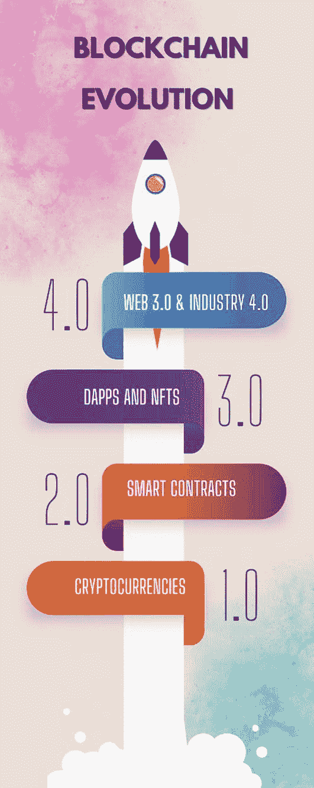

# 1. 区块链的承诺

到目前为止，你可能已经听说过区块链。人们说它是最新颖的创新技术之一，但它其实并不新。事实上，它是在近 15 年前被开发出来的。

`比特币`，作为市值最高（截至撰写本文时）的最著名的加密货币，是区块链的第一个实际应用。它由神秘的中本聪于 2008 年创建，旨在颠覆和重塑金融机构。^(²) `比特币`在这个时间点诞生并非偶然。始于雷曼兄弟倒闭的国际金融危机，在全球范围内造成了人们对传统银行体系的不信任。

`比特币`被定位为一种安全可靠的数字货币，可以在没有中央机构和银行等中介的情况下进行点对点转账。所有交易都通过密码学在公开的分布式账本——区块链上进行验证和保护。我们将在下一章中介绍区块链的架构及其所有特性。

起初，`比特币`（`BTC`）价值很低。它第一次被用来购买实物是在 2010 年 5 月 22 日。那一天，现在在加密货币世界被庆祝为*比特币披萨日*，一位加密货币爱好者花费了 10,000 个`比特币`购买了两个价值 30 美元的披萨。显然，当时没有人知道，12 年后的某一天，`比特币`会涨到每个 65,000 美元，或者之后会崩盘。

`比特币`的价格缓慢上涨。媒体报道，特别是那些警示加密货币在非法线上活动中吸引力的故事，为其日益增长的 popularity 添了一把火。争议开始出现。没有中央监管的匿名资金转账可能被用来便利洗钱、毒品和人口贩卖以及其他犯罪活动。

这一主题被电影编剧们采纳。我们都看过电影，黑客、军火商和其他反派角色用`比特币`或其他加密货币收取服务费。

新的数字货币开始涌现，随后是更多的争议和骗局，第一批交易所倒闭，并出现了贪污指控。但加密货币市场的增长仍在继续。

2015 年，`以太坊`带着一个新的区块链项目进入市场，该项目引入了智能合约，并为加密货币之外的多种应用场景奠定了基础。`以太币`迅速成为排名第二的加密货币，与`比特币`成功竞争。

现在，这本书并不是关于`比特币`的历史，但我认为给你提供这个背景故事和视角很重要。区块链常常通过加密货币的视角被看待。事实上，许多人将区块链等同于`比特币`。当我采访酒店管理人员时，我听到很多像这样的说法：

> *“我听说过区块链吗？是的，每个人都在谈论比特币，你看到新闻里发生的事了吧？人们正在亏钱。太可怕了。”*

加密货币市场的波动性在过去两年引起了大量关注。2021 年，`特斯拉`投资了 15 亿美元购买`比特币`，吸引了许多投资者，价格在 2021 年 11 月飙升至每枚 69,000 美元。到目前为止，它已经下跌了大约 70%。其他加密货币表现也不佳。如今，它们中的大多数几乎一文不值，只有意志坚强（且财力雄厚）的投资者才留在这个游戏中。

加密货币市场崩盘的景象在 2022 年吸引了大量媒体关注。关于骗局、“快速致富”计划、黑客攻击以及毕生积蓄蒸发殆尽的恐怖故事登上了头条。可悲的是，很少有关于区块链技术如何在臭名昭著的加密货币之外的其他领域发挥作用的故事被发表。我猜它们只是不太有新闻价值。但在过去的十年里，区块链可能为企业带来什么的愿景已经发展和演变。虽然它无疑正在推动金融生态系统的变革，但其应用远远超出了支付和存款。

`普华永道`将区块链称为全球经济的“万亿美元级机遇”，并估计到 2025 年，大多数企业将以某种形式使用这项技术。^(³)

区块链的潜力被比作互联网的创建对经济产生的影响。唐·塔普斯科特^(⁴)甚至称其为第二代互联网，它不仅实现了价值的转移，还实现了价值的创造。作为一种安全、防篡改的分布式账本，它有望彻底改变供应链、身份服务、会计以及基本上任何依赖于文件认证的行业。

专家、研究人员和咨询公司整理了一份长长的清单，列出了可能从区块链技术中受益的行业。这包括从基础设施和废物管理到环境监测、紧急服务、医疗保健，甚至农业等各个方面。事实上，据一些人称，透明、可验证的交易数据登记册的应用场景几乎是无穷无尽的——特别是因为区块链通过一个去中心化平台运行，不需要中央监管，并且能抵抗欺诈。^(⁵)

现在，你可能会想——如果它是一个如此出色的工具，有这么多商业应用，为什么还没有普及呢？为什么我只听到关于加密货币的消息？

嗯，有几个关键原因，比如复杂性、可扩展性和性能问题以及监管不确定性，这些都阻碍了这项技术被采纳的进程。

像许多新兴技术一样，区块链经历了不同的发展阶段，直到现在才逐渐接近将导致大规模采用的成熟阶段。

第一代区块链完全专注于加密货币，`比特币`是第一个。区块链被用作记录和验证交易的去中心化账本。在这个阶段，建立了共识、密码学安全性和不可篡改性的基本概念。

智能合约和`以太坊`的出现标志着第二代区块链。人们意识到区块链的潜力超越了金融交易。

> **注意**
>
> 智能合约本质上是基于区块链平台的两方或多方之间的自动执行和自动强制执行的数字协议。由于它在区块链平台内编程，任何感兴趣的方都可以使用它，但无法被更改、修改或编辑。

例如，智能合约在保险和供应链管理中获得了应用，能够根据协议中编码的预先约定的条件，自动向索赔人和供应商付款。`以太坊`还允许开发者使用其平台构建自己的项目和应用程序——即所谓的`dApps`。`dApps`是去中心化的应用程序，这意味着它们运行在去中心化的系统上——也就是区块链。它们可以基于智能合约自主运行，无需人工干预。而且，它们不归任何一个单一的中央实体所有。

这一概念在许多领域得到了应用，从去中心化金融（`DeFi`）到游戏、保险、能源和医疗保健。首先，`NFT`出现了。用户基础开始增长，随之而来的是——可扩展性成为一个挑战。交易速度和费用随着用户流量的增加而增加。

## 第三代区块链正在解决这些问题。区块链 3.0 项目引入了可扩展性、快速处理、更低费用、互操作性，以及当今世界极为重要的——更低的能耗。

我们看到了新的应用场景，其中许多聚焦于将一切事物代币化的概念——从艺术品到房地产。

第四代区块链融合了混合区块链和企业级区块链，以满足特定业务的需求，并提供可扩展性、许可访问和专门的共识机制。这一阶段预示着主流采用的前景，为 Web3 和元宇宙奠定基础，并推动工业 4.0 的发展。我们将在后续章节中深入探讨这些主题。

图 1-1 总结了区块链的演进及各阶段的主要发展。

一幅插图以太空飞船为背景解释了区块链的演进过程。从底部到顶部依次为：1.0 加密货币，2.0 智能合约，3.0 DAPP 和 NFT，4.0 Web 3.0 和工业 3.0。

图 1-1
四代区块链（来源：作者）

如你所见，区块链的演进历经数年。最初，它只是一种基于复杂密码学的传统货币替代方案，如今已成为一项基础性技术，能够赋能物联网或人工智能等其他能力。

我知道这些信息量很大，所以在下一章中，我们将进行拆解，并涵盖所有重要方面——区块链的架构及其特性和特征。

正如我在开头提到的，我的目标是创建一份关于区块链生态系统的简易指南。我想帮助你在这片星系中航行，因此我们会在一些乍看之下与你的业务领域并不直接相关的地方稍作停留，例如共识机制。共识机制定义了信任如何在区块链上建立。你需要了解细节吗？不需要。但当你与科技公司讨论基于区块链的项目时，我希望你能听懂他们在说什么。

脚注 1 2 3 4

