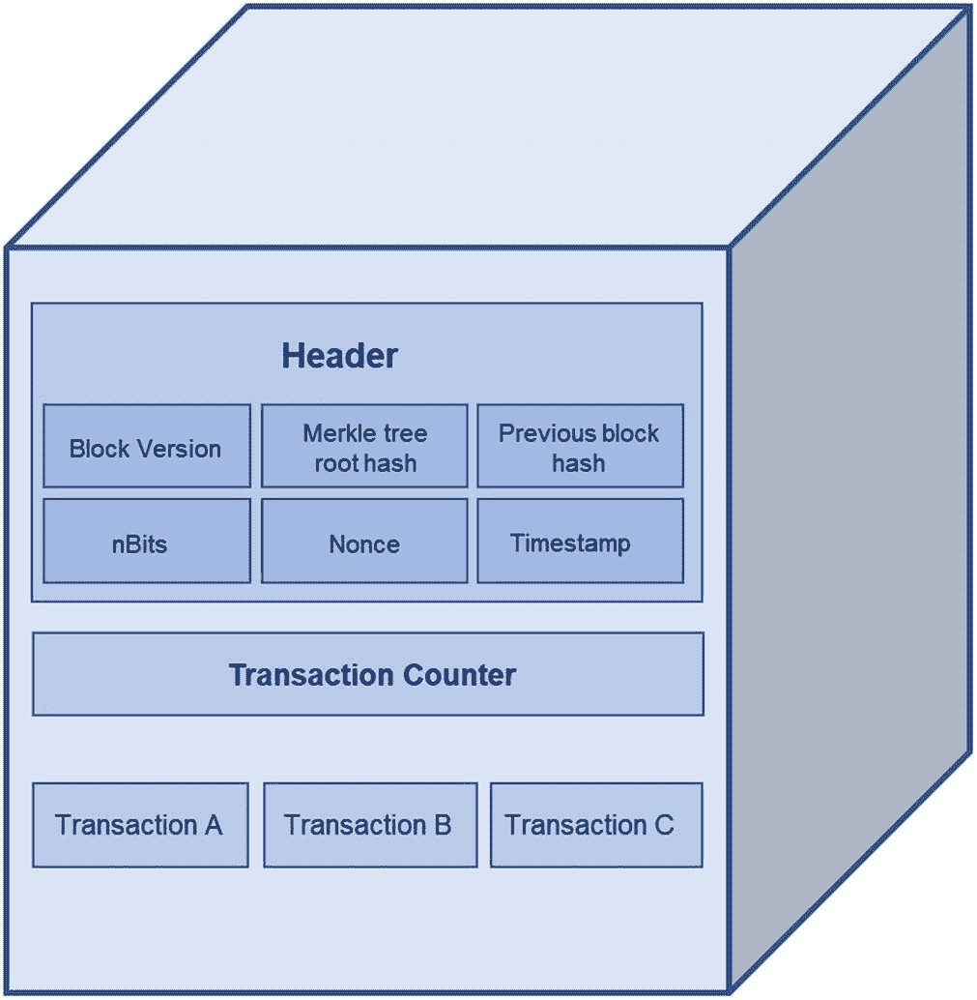
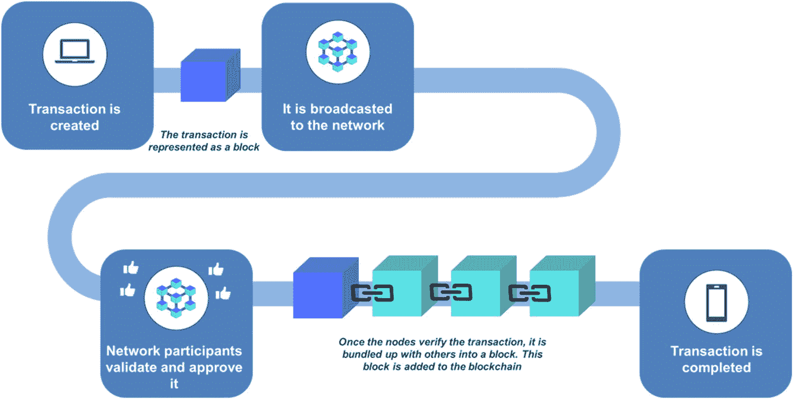

# 2. 揭开区块链的神秘面纱

人们常常声称区块链是一项非常复杂的技术，需要极其专业的技能。确实，区块链开发者和架构师必须掌握广泛的编程知识；理解所有协议、网络、安全和加密经济学；学习如何创建 dApp 等等。正因如此，区块链开发者才是一份高薪工作。

作为酒店业专业人士，你可以只关注区块链的业务层面。在大多数情况下，你将由外部合作伙伴提供技术解决方案。他们会介绍自己的方案，并抛出大量令人困惑的表述和术语。如果你决定推进项目，他们会要求你明确或签署业务需求。

为了确保你对此有所准备，在本章中，我们将深入区块链宇宙的核心，审视其关键组成部分和基础模块。了解这项技术的工作原理，将为你提供理解其能力所需的知识。

然而，更重要的是，本章的目标是引导你了解诸如共识机制或区块链网络类型等主题，并为你提供在做出关于区块链项目的战略商业决策时所需要的信息。

## 什么是区块链？

区块链是一种在计算机网络中共享的分布式数据库。这意味着这个数据库可以同时在全球数万台计算机上被访问和存储。

没有中央权力或权威机构控制区块链。它是一种基于参与者共识的点对点模型。区块链的架构建立在信任之上，无需像银行或政府这样的中介机构来授权交易。

作为一种数据库，区块链以数字格式将信息电子化地存储在分布在全球各地的数十万台计算机上。如果你想象一个典型的数据库，它可能看起来像一个带有行和列的数据表格。

区块链则不同——在这里，数据以被称为“区块”的组进行结构化。这些区块有一定的存储容量。当一个区块被填满后，它就会被关闭并链接到前一个区块，形成一条数据链，即区块链。区块一旦被填满，便成为定局。链中的每个区块在被添加到链上时都会被赋予一个精确的时间戳。所有新信息都会被编译到一个新形成的区块中，待其填满后也会被添加到链上。没有人可以删除或编辑区块中的交易；它是防篡改的。交易的数据和历史是不可逆且透明的。

每个区块都包含一个基于其前一个区块的唯一识别码——所谓的“哈希”——以增强数据追踪的准确性并确保数据安全。当有人想要更改区块中的交易或数据时，这就会改变该区块的哈希码，以及所有随后创建的区块（包括链中的最后一个区块）的哈希码。

现在，由于网络中的每个人都拥有该区块链的副本，因此很容易检测到谁在未经整个点对点群体同意的情况下更改了它，并将其废弃。数据经过加密，因此只有记录的所有者才能解密以揭示其身份。这意味着区块链的用户可以在保持透明的同时保持匿名。

## 区块

现在让我们更深入地探讨区块链的工作原理。简而言之，每当用户发起一笔交易（例如加密货币转账）时，就会创建一个区块来存储它。数据经过密码学保护，并与账本中的前一个区块相链接。该块在网络中广播，网络节点（计算机）对其进行验证。一旦区块和交易验证成功，它就会被添加到现有区块链的顶端。结果，该交易便成为永久记录。

一个区块存储数据。图 2-1 展示了区块的关键组成部分。

一个立方体解释了区块链的结构。立方体的正面展示了区块头的两个层级，以及交易计数器与交易 A 到 C。区块头包含 6 个部分，即：区块版本、默克尔树根哈希、前一个区块哈希、nBits、随机数和时间戳。

图 2-1
一个区块的结构（来源：作者）

除了交易列表和计数器，它还包括一个区块头。区块头包含的元素有：区块大小、区块版本、时间戳、前一个区块哈希（前一个区块头的加密编号）、当前区块的哈希（所谓的“默克尔树根哈希”）、随机数（矿工必须求解以验证区块并关闭它的加密数字或谜题），以及 nbits（加密谜题的难度）。

区块由矿工使用一种名为“工作量证明”的共识机制创建和验证。矿工们竞相求解一个密码学谜题——找到当前区块的目标哈希。获胜者将把该区块添加到区块链中并获得奖励。这种共识机制被比特币所采用。

## 共识机制

共识机制描述了所有网络参与者如何就区块链的状态达成一致。

如果你处理的是一个中心化系统，通常会有中央管理机构或管理员来管理和维护它。然而，区块链是去中心化的。成千上万的参与者——也就是对等节点——共同负责验证和认证网络上发生的交易。

共识机制规定了这些参与者如何协作，并就哪些交易是合法的、已验证的以及应添加到区块链中达成一致。由于区块链的状态是动态变化的，因此需要一套规则来确保账本能够以高效、实时、可靠且安全的方式进行更新。

共识机制有很多种。现在我们简要了解一下最流行的几种。

## 工作量证明（`PoW`）

在**工作量证明**共识机制中，矿工们竞相解决基于密码哈希算法的数学难题。当难题被解决后，一个新块会被发布到网络中，供其他矿工验证。

矿工通过收取交易费获得激励，促使他们完成这项工作。而这项工作量非常大。赢得解决数学难题并完成一个区块的竞赛的几率取决于算力。这是因为矿工基本上需要猜测一个随机数（哈希值），这个数要小于或等于目标哈希值，而可能的猜测有数万亿种。因此，矿工赢得这场竞赛需要大量的计算能力。我们将在第 3 章中更详细地讨论这一点。

**工作量证明**是应用于流行加密货币（包括比特币、莱特币和以太坊 1.0）中的原始共识机制。不幸的是，执行它所需的高计算能力导致了高能耗和较长的处理时间。它的缺点促使人们寻找更高效、更环保的方案，例如**权益证明**（`PoS`）。

### 权益证明

在**权益证明**中，矿工被验证者取代。矿工可以创建新区块或新代币。这可以类比为铸造货币。每增加一个新区块都会增加市场流动性总量。

在**权益证明**中，市场流动性在一开始就创建好了，并且不会改变。参与者通常不创建新区块，而是验证其中的交易。

要成为验证者，用户需要以加密代币的形式质押资本，对于以太坊来说，最低需要质押 32 个`ETH`（按目前价格约合 43000 美元）。验证者的选择是由网络根据其质押量随机进行的。质押量也起到一种抵押品的作用，如果验证者行为不诚实，其质押的代币可能会被销毁。

验证者通过收取交易费获得收益；与`PoW`模式不同，他们不会获得新铸造的币作为奖励。`PoS`的优势在于其能源效率，这自然是一个非常重要的方面和关注点。由于`PoS`不需要巨大的计算能力和昂贵的硬件，加入网络也更容易。

表 2-1 简单比较了这两种最流行的共识机制。

**表 2-1**

`PoW`和`PoS`共识机制对比

|  | **工作量证明** | **权益证明** |
| --- | --- | --- |
| 共识机制 | 矿工竞相解决数学难题 | 根据质押的代币数量选择验证者 |
| 区块验证 | 解决难题后由矿工验证 | 由验证者根据其质押进行验证 |
| 能源消耗 | 高 | 较低 |
| 处理时间 | 处理时间较长 | 交易处理时间更快 |
| 经济激励 | 矿工获得新铸造的币和交易费作为奖励 | 验证者赚取交易费和奖励 |
| 安全性 | 依赖计算能力和多数原则——要攻击一个`PoW`区块链，你需要一台算力超过网络 51%的计算机 | 依赖经济激励和质押——要攻击`PoS`区块链，你需要拥有网络中 51%的加密货币 |
| 环境影响 | 高碳足迹和高能耗 | 降低的碳足迹和能耗 |

#### 其他共识机制

虽然`工作量证明`和`权益证明`是区块链世界中最流行的达成共识的方式，但还有许多其他类型和迭代版本也在使用中。我们将简要讨论其中几种，让你对不同的路径和方法有一个概览。

`委托权益证明`（`DPoS`）是`权益证明`共识机制的一个修改版本。在这里，你的权益赋予你投票权。你通过投票来选择验证并向链上添加区块的“见证人”。你在网络中质押的代币越多，你的投票权就越重。获得最多票数的见证人赢得验证交易的权力，如果他们成功，就会获得奖励。这笔奖励通常也会与投票给他们的用户分享。

如果见证人行为异常，他们可能会被“解雇”；例如，如果怀疑有恶意行为，他们的票数可以被收回。这种机制被认为比`PoS`更民主且更具金融包容性。

`活动证明`（`PoA`）本质上是`PoW`和`PoS`的混合体——这个过程始于像`工作量证明`那样的挖矿方式，矿工们竞相解决一个数学问题。但当区块被挖出后，它就会切换到`PoS`模式。一个随机选择的验证者组负责验证交易，然后将它们添加到区块链中。奖励在验证者和矿工之间分配。

另一种共识机制是`权威证明`——在这里，验证者是根据其个人声誉而非抵押的代币来选择的。匿名性被移除，因此验证者有动力保持高质量的工作。它不需要大量的计算能力，是成本效益最高的选择之一，常用于私有网络（例如，`摩根大通`银行将其用于他们的`JPM`币）。

`容量证明`基于矿工硬盘中可用的空间量。简而言之，硬盘越大，矿工解决谜题并赢得奖励的机会就越大。

另一方面，`重要性证明`根据一系列因素来选择矿工，例如过去的交易数量和规模、已归属货币的数量、网络活动等。这些因素共同构成了重要性评分。得分越高的参与者，被选中挖掘（或在此场景中称为“收割”）一个区块并获得交易费的机会就越大。

`消逝时间证明`（`PoET`）通常用于许可型区块链网络。我们将在下一节详细讨论它们，但就目前而言——许可型区块链要求参与者表明身份。`PoET`是一种基于时间彩票的机制，它随机为网络中的每个节点（参与者）分配不同的等待时间。获得最短等待时间的节点有权进行挖矿。

还有`实用拜占庭容错`、`燃烧证明`、`历史证明`、`权重证明`以及其他一些不太常见的机制。

你不需要了解所有机制。然而，当你加入一个区块链网络或项目时，你需要理解使用的是哪种协议，因为它将决定网络的安全性和弹性如何，以及交易执行的速度有多快。

选择错误的共识机制可能导致性能低下和处理延迟。它还可能增加链的脆弱性，并增加区块链分叉的风险——即单条链分裂成两条或多条链并以不可预测的方式运行。最后，如果机制不合适，共识可能会失败，使得所有努力付诸东流。

共识机制的选择将取决于区块链网络的类型、其应用场景及其需求。

通常，有三种类型的区块链网络：非许可链、许可链和联盟链。我们将在下一节讨论它们。但在深入之前，让我们先总结一下区块链的关键特性。

#### 区块链特性

**区块链使用去中心化技术**——没有一个中央管理机构来管理区块链网络。它是一个分布式账本，能够以代币化的形式存储数字化资产——加密货币、文档、合同。用户拥有控制权——他们不必依赖第三方。

去中心化意味着网络更安全，更不容易崩溃。可以这样理解——存储在服务器上的中心化数据库是黑客的容易攻击目标。而要攻击一个区块链网络，则需要巨大的算力和资源（至少需要网络中所有算力的 51%）。区块链不依赖第三方，而是由网络参与者维护。

**区块链是不可篡改且透明的**——当网络上的数据被记录后，它对其他参与者可见，并且无法更改。所有区块都相互连接。没有人可以删除、编辑、修订、重写、更新或撤销其中的任何区块。网络中的每个节点（参与者）都有一份数字账本的副本。添加新交易需要按照约定的共识机制进行验证。

**区块链是安全的**——与传统的数字账本相比，去中心化和密码学都使得区块链网络非常安全。区块链中的数据通过加密哈希来保护。由于每个区块都有自己的哈希值，并且相互链接并包含前一个区块的哈希值，因此很难篡改它，并且容易发现问题。

**区块链是 7x24 小时全年无休的**——与传统系统不同，区块链网络没有停机时间，因为它们是去中心化和分布式的。

**区块链既快速又具有成本效益**——由于没有中介机构，交易发生在对等网络上的去中心化网络中，因此与传统跨境支付相比，处理速度要快得多。最终，速度和交易费用取决于区块链网络和共识类型。如前所述，`工作量证明`可能比`权益证明`更慢且更昂贵。大型区块链平台在过去也曾面临拥塞和延迟问题，这就是为什么例如`以太坊`决定转向`权益证明`机制的原因之一。

然而，也存在一些缺点。我已经提到过能源消耗问题。可扩展性也是主要挑战之一——随着交易数量的增加，区块链的规模会增长，验证交易所需的处理时间也会增加。网络会变得缓慢且效率低下。

**注意**

区块链三难困境，也称为可扩展性-安全性-去中心化三难困境，是一个概念，它强调了区块链技术三个理想特性之间的权衡：可扩展性、安全性和去中心化。根据这个三难困境，很难同时获得所有这三个特性，因为优化其中一个特性往往要以牺牲其他特性为代价。

其他区块链挑战，特别是在存储需求、可升级性、互操作性和用户体验方面，是持续研究和开发的主题。它们也并非普遍适用于每个区块链平台，但你需要意识到它们可能存在——并且，如果你正在着手一个区块链项目，你需要向你的供应商询问他们缓解这些风险的策略。

#### 区块链的类型

有三种类型的区块链网络：公有链、私有链和联盟链。

#### 公有区块链

公有区块链是无需许可的——您无需任何同意、授权或许可即可访问并参与网络。它具有完全的去中心化特性，您的身份将得到充分保护。

它使用复杂的密码学规则和共识机制来保护数据安全，但并非 100%安全。公有区块链采用密码学技术来保护数据，但仍存在可能被犯罪分子利用的漏洞。

这类区块链网络可能效率较低，因为运行它们需要大量计算能力，这会导致高能耗和处理时间延长。它们也常因大量交易而面临可扩展性方面的挑战。

#### 私有区块链

私有区块链由单一实体管理。该实体作为中央权威机构，授予网络访问权限。权限可能具有不同级别——并非所有用户都拥有相同权利。例如，只有被选定的用户才能读取或写入交易数据，只有合约相关方才能访问该合约。私有区块链仍然可以是分布式的，但失去了去中心化特性。

#### 联盟区块链

第三种区块链网络是联盟区块链（也称为联合区块链）。它与私有区块链类似，是私有的且需要权限，但管理方并非单一实体，而是由多个组织组成的联盟。实体需经过事先批准或投票才能成为联盟区块链的成员。权限可以授予个人或公司团体。网络中没有中央管理机构。联盟区块链可用于多个行业，在供应链管理、金融服务，甚至是旅游和酒店业中促进多方之间的有效合作。

让我们通过表 2-2 对这三种区块链网络进行简单对比。

**表 2-2** 区块链网络类型

|   | **公有链** | **私有链** | **联盟链** |
| --- | --- | --- | --- |
| 访问权限 | 对任何人开放，无需许可 | 由单一实体授予，需要许可 | 由联盟授予，需要许可 |
| 参与者 | 匿名 | 身份已知 | 身份已知 |
| 安全性 | 通过共识机制和复杂密码学实现（`PoW` 和 `PoS`） | 参与者需预先批准。基于投票的共识 | 参与者需预先批准。基于投票的共识 |
| 速度/性能 | 较慢，需要更多计算/资源 | 更快，效率更高 | 更快，效率更高 |

##### 混合区块链

混合区块链本质上是私有链和公有链特性的结合。在此模式下，网络成员决定哪些部分是私有的，哪些对公众开放。交易可以保留在私有层中。

混合区块链非常适合封闭生态系统。它能保护隐私，因为用户的身份只向与其交易的对手方披露。同时，它也维护了一个与外部世界进行通信的安全通道。

从管理角度来看，治理规则变更的灵活性是一个重要特性。在这里，去中心化程度或透明度的变更由企业需求决定，许多规则可以相对容易地更改。

由于交易验证规则简化，混合区块链通常也比公有链和私有链更快、更具成本效益。

## 区块链上的交易

交易在区块链上是如何发生的？首先，重要的是要理解，在区块链世界中，交易被定义为任何价值或数据的转移。它可以是一次支付、一次医疗记录转移、一份智能合约或一个来源记录——本书后续章节将讨论诸多用例。

交易过程可以分为四个阶段：

1.  **交易提案的发起**：发起方使用公钥和私钥创建并签署交易。
2.  **交易广播**：交易由钱包应用广播到网络中，并等待矿工（或验证者）拾取。它停留在所谓的 `mempool`（用于存储所有等待被纳入区块链的未确认交易的内存池）中，等待矿工拾取并执行验证。
3.  **验证**：根据特定区块链约定的规则集验证交易。如果交易有效，它将被包含在一个区块中，并发送到网络供其他节点验证。
4.  **提交确认**：包含已验证交易的区块被添加到区块链上。该区块是永久性的，无法修改。交易至此完成，变得不可逆转且永久有效。

图 2-2 将帮助您直观理解交易过程。

区块链交易流程路线图。首先，发起交易并广播到网络；接着，参与者进行验证和批准；最后，节点验证交易后，交易与其他交易打包成区块，至此交易完成。

**图 2-2** 简化的区块链交易过程

## 钱包

数字钱包使用户能够购买、出售和监控其拥有的数字货币或数字资产的余额。它是您在区块链世界中的主要工具。

与传统钱包不同，数字钱包实际上并不持有资金。相反，它持有用户执行交易所需的公钥和私钥。

钱包有三种类型：软件钱包、硬件钱包和纸钱包。

### 软件钱包

**软件钱包**可进一步分为：
- 桌面钱包
- 网页钱包
- 移动钱包

**桌面钱包**可以下载到个人电脑或笔记本电脑上。这限制了您的灵活性，因为只能通过该设备访问。应用程序会生成一个包含密钥的数据文件。用户可以创建密码来保护访问权限，但物理损坏、恶意软件或病毒感染的风险相当大。

**网页钱包**在云端维护。您可以通过任何设备的网络浏览器访问钱包，无需额外软件。这提供了更大的灵活性；然而，拥有并运营该网站的第三方将控制存储您私钥的云端，这始终是一个风险。

**移动钱包**以手机应用程序的形式提供。它们是最受欢迎的加密货币钱包类别。移动钱包提供了更大的灵活性和易用性——您可以使用 `NFTs` 等交易加密货币、通过二维码付款或购买数字资产。

### 硬件钱包

**硬件钱包**将私钥离线存储在物理设备上——通常是 USB 驱动器。它们非常安全且易于使用——您只需将设备连接到可以访问互联网的笔记本电脑或 PC 上，并提供 PIN 码。钱包会请求交易详情并提供验证。私钥永远不会离开该设备。

### 纸钱包

**纸钱包**也可以非常安全。纸钱包仅仅是一张纸，您可以在上面记下访问数字资产所需的所有详细信息——地址、密钥等。它很安全，因为它是离线的，所以没有人能破解它。但另一方面，如果您丢失了这张纸，恢复访问的可能性就相当渺茫了。

### 热钱包与冷钱包

硬件钱包和纸钱包也被称为冷钱包，而连接互联网的钱包则被称为热钱包。

表 2-3 总结了它们的主要特征。

**表 2-3** 热钱包与冷钱包对比

| 热钱包 | 冷钱包 |
| --- | --- |
| 连接互联网 | 硬件设备和纸张 |
| 安全性较低 | 安全性较高 |
| 灵活且全天候可用 | 依赖设备访问 |
| 更易于使用 | 支持的币种有限 |
| 免费 | 成本高昂 |
| 例如：Coinbase、MetaMask、Blockchain.info | 例如：Trezor、Ledger |

### 公钥与私钥

在上一节中，我提到数字钱包中存储了在区块链上进行交易所需的公钥和私钥。那么，这些密钥到底是什么呢？

在加密货币世界中，虚拟代币的所有权和控制权是通过数字密钥和地址来实现的。地址就像电子邮件或银行账号——它是一串由字母和数字组成的特殊序列。

私钥就像密码一样。它是一个随机生成的大数字，通常表示为字母数字字符串，极难记忆。事实上，正因为如此困难，许多钱包使用一种称为“助记词”或“秘密恢复短语”的替代方案。本质上，它是由 12 到 24 个随机单词组成的字符串，用于访问你的钱包。你必须将它们安全地记在某个地方，因为这些单词本身毫无意义。助记词无法恢复或更改，因此一旦丢失，你将失去对钱包及其资产的控制权。

如前所述，以通过 Binance 或 Coinbase 等加密货币交易所打开的网络钱包为例，这些公司为用户保管私钥。

私钥用于解密消息、签署交易并证明对区块链地址的所有权。公钥是通过复杂的加密技术从私钥中生成的，然后用于生成收款地址。任何人都可以使用它，它对公众开放——它基本上充当接收资金的地址。

这两种密钥都存储在钱包中。如果你丢失了公钥，可以使用私钥重新生成。然而，私钥是无法重新生成的。

当用户发起向另一用户发送加密代币的交易时，该交易会被广播到网络中。网络参与者会验证其有效性，然后记录在区块链上。

交易由发送者使用其私钥进行签名。提供签名是为了证明对私钥的所有权，但签名过程不会泄露私钥。验证签名时，会使用公钥。

一旦交易被验证并包含在区块中，资金就会被发送到接收者的公钥地址。该地址由公钥生成。接收者可以使用自己的私钥访问这些资金。

### 智能合约

想象一下，你正在买房子。这是一个复杂的过程，通常涉及多方、大量文书工作，并且可能需要数周甚至数月的时间。我们有买方、卖方、银行、评估师、律师、检查员等等；此外还有许多条件、复杂的文件和额外费用。

现在，想象一下所有这一切都可以通过更便宜、更快速的方式完成，而且无需律师参与。这就是智能合约背后的理念。

智能合约本质上是一种以自动化方式运行的程序或数字代码。它允许在没有中介的情况下交换资产，并且可以持有资金。一旦各方就规则达成一致，智能合约就会启动，并在条件满足时自动执行。你可以包含积极和消极两种条件——例如，“如果评估结果为正，则将文件发送给银行”或“支付首付款”。智能合约还会在事件发生时通知所有相关方，尽管不需要他们采取行动。一切都是自动化的，全天候可用，并且通过记录在区块链上的不可篡改副本确保安全。

智能合约是最重要的区块链工具之一，在各行各业都有多种应用。智能合约是去中心化应用（dApps）的基础，在去中心化金融（DeFi）、支付和供应链管理中尤其流行。它们在保险、医疗保健、政府服务以及当然还有房地产领域也获得了极大的关注。

> **注意：** 监管机构正在密切关注智能合约的发展。例如，英国政府已要求法律委员会审查法律问题并提出改革建议，以使现有法律适应包括智能合约在内的区块链驱动变革。该委员会得出结论，现有的法律框架足够灵活，可以支持和促进智能合约的使用。然而，在某些情况下，还需要进一步的工作来适应智能合约。同样，许多国家现在正在制定数字资产法规和法律体系改革，以接纳智能合约并消除关于可执行性的不确定性。

以太坊区块链是最流行的通用智能合约平台，它允许程序员使用一种名为 `Solidity` 的语言编写智能合约。以太坊上的所有合约都是不可篡改和去中心化的。除以太坊外，还有 Cardano、Tezos、IOS 和 TRON 等多个平台也支持智能合约的创建。

总而言之，智能合约有很多好处——它们完全自动化、无需信任（即参与智能合约的各方无需明确信任对方即可确保合约的安全性和有效性）、快速、安全、透明且成本效益高。可重用性是另一个重要特征——同一份合约可以在多个场景中使用，避免了额外的法律工作。然而，这并不意味着智能合约是完美的。它们存在一些风险和挑战，包括软件漏洞、协议变更以及无法传达至区块链的意外现实世界事件。另一个重要的考量因素是监管状况和税务影响——这些在全球范围内各不相同，并且需要一段时间规则才能变得清晰。

> **注意：** 如果你想了解更多关于智能合约的信息，可以查看 YouTube 上的“Code Is Law?”视频（`www.youtube.com/watch?v=pWGLtjG-F5c`）和以太坊的网站（`https://ethereum.org/en/smart-contracts/`）。

### 章节总结

本章有点像区块链的新兵训练营——我们从最基础的部分开始，介绍了最重要的设计元素。这应该能让你很好地理解区块链的工作原理，这在当今世界向 Web3 迈进以及数字化转型影响着各行各业的企业时是至关重要的。

如前所述，作为一名酒店业专业人士，你不需要深究区块链的细微之处——那是你的供应商的工作。但如果你想参与一个区块链项目，了解区块链交易如何达成共识，或共识机制意味着什么，至少会很有帮助。

在下一章中，我们将跳转到区块链宇宙的不同层面，探索其“居民”，从已经多次提及的矿工开始。

