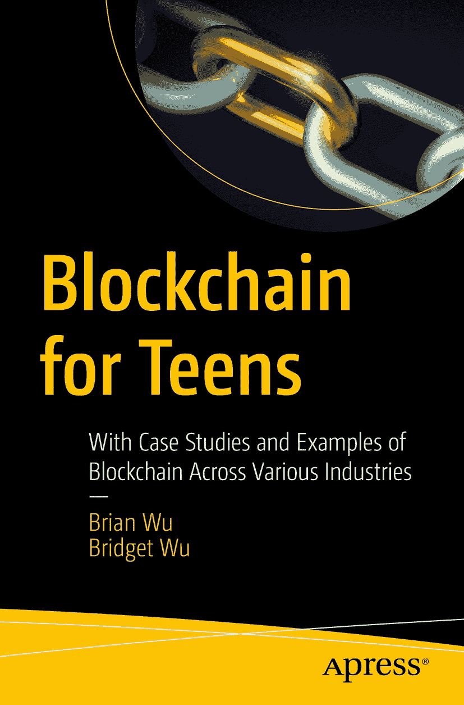

`ISBN 978-1-4842-8807-8` `e-ISBN 978-1-4842-8808-5` [`doi.org/10.1007/978-1-4842-8808-5`](https://doi.org/10.1007/978-1-4842-8808-5)

© Brian Wu 和 Bridget Wu 2023  
本作品受版权保护。所有权利均由出版社独家授权，涵盖材料的全部或部分内容，具体包括翻译、转载、插图再利用、朗诵、广播、以缩微胶片或其他物理方式复制、传输或信息存储与检索、电子改编、计算机软件，或目前已知或未来开发的任何类似或不同方法。使用本出版物中的通用描述性名称、注册商标名称、商标、服务标志等，即使未作明确声明，也不意味着此类名称免于相关保护法律和法规的约束，因而可自由使用。出版社、作者及编辑认为本书中的建议和信息在出版时是真实准确的。出版社、作者及编辑对本书所含材料或可能存在的任何错误或遗漏不提供明示或暗示的担保。出版社对出版地图及机构归属中的管辖权主张保持中立。

本 Apress 印记由注册公司 APress Media, LLC（Springer Nature 旗下）出版。  
注册公司地址为：1 New York Plaza, New York, NY 10004, U.S.A.