# 区块链：一项颠覆性技术

近年来，拥有加密货币的美国人数量持续上升。即使在没有持有加密货币的人群中，大多数美国人也听说过加密货币——“比特币”听起来是不是很熟悉？如果您听说过区块链，但不确定它是如何运作的，请不要担心；您并不孤单！尽管区块链乍看之下可能令人望而生畏，但我们将帮助您熟悉区块链的重要概念。

本章将从区块链的基础知识开始。然后，我们将讨论区块链如何运作，并深入理解共识算法。接下来，我们将学习货币体系的演变，以及区块链技术如何影响货币、商业和现代世界。最后，在本章末尾，我们将概述加密货币。

在本章中，我们将涵盖以下几个具体的区块链主题：
* 什么是区块链？
* 区块链如何运作
* 共识算法
* 货币体系的演变
* 理解加密货币

## 什么是区块链？

在所有加密货币的核心，我们可以找到被称为区块链的革命性去中心化技术。明确我们所说的“去中心化”的含义非常重要，因为这一概念在区块链中经常被使用。让我们先看看去中心化的对立面：中心化，即权力由特定的个人、组织或地点掌握。

图 1-1 展示了一个中心化组织的示例。

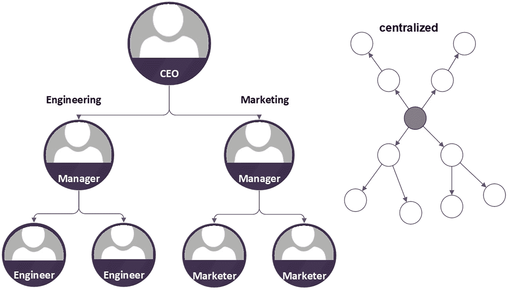

想想公司中典型的层级结构——高管们做出所有关键决策。然后，高管将决策传达给经理，经理负责管理下级。下级员工被要求执行高管分配的任何任务。再往下，员工需要听从经理的指示并完成分配的工作。虽然中心化公司可以相对快速且轻松地实现目标，但员工通常无法与其他部门及高层进行沟通和了解情况。缺乏这种沟通可能导致问题甚至失败，使所有层级都感受到后果。通常，公司任何部分的缺陷都可能危及整体目标，这被称为“单点故障”。

另一个中心化的例子是在线服务提供商，例如 `Meta`（Facebook）、亚马逊、苹果和谷歌。这些互联网服务遵循客户端-服务器架构。用户使用客户端机器（称为远程处理器——例如网页浏览器或移动设备）向集中的服务器机器（称为主机系统）发送远程请求。用户从这一单一的复杂服务提供商处获得服务请求的结果。从好的方面看，数十亿人每天使用这些卓越的数字服务进行日常活动，如在线购物、发布照片和给家人朋友打电话，这些服务都是免费的。但这些“免费”服务有一个被忽视的成本：这些公司在其中心化服务器中收集并存储大量用户行为的宝贵数据。通过大数据分析和机器学习算法，这些用户数据被转化为产品并出售给第三方。利用这些数据，公司可以在广告和服务中精准定位用户，这增加了用户面临安全风险的可能性——而这一切都超出了用户的控制范围。

现在我们已经了解了中心化，接下来可以探讨去中心化。去中心化指的是将权力从某个最高权威或地点平等分配给每一个单元。与我们之前看的例子不同，在去中心化组织中，决策权并不集中在某个中央权威或权力机构。每个成员都是独立的，并且可以决定组织活动，而不是集体依赖一个权威。通过去中心化，所有成员都参与其中并相互协作以实现目标。每个人都可以根据组织规则对决策进行投票。

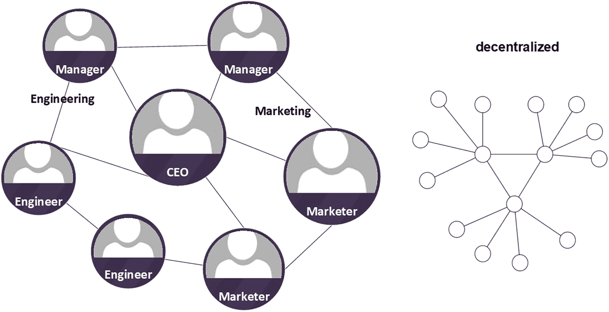

与中心化在线服务提供商不同，去中心化世界让用户完全控制自己的交易和数据。每个成员在决策时拥有平等权力。系统接收来自个体参与者的决策，并利用[加密](https://101blockchains.com/what-is-consensus-algorithm/)共识方法（我们稍后会探讨）来做出决定。没有单一的权威机构来接收和响应请求；即使某些个体不参与决策，系统依然能够运行。

表 1-1 提供了中心化与去中心化的对比。

| | 中心化 | 去中心化 | 说明 |
|---|---|---|---|
| 单点故障 | 是 | 否 | 区块链网络是点对点的，每个节点都拥有区块链数据的完整副本。因此，当发生故障时，数据永远不会丢失。 |
| 谁在控制？ | 中心化权威 | 用户 | 没有中心化权威来控制区块链网络。 |

现在我们理解了中心化与去中心化的区别。但区块链到底是什么呢？

在一个名为“贝壳岛”的古老岛屿上，人们为了获取所需或想要的资源而频繁地进行物物交换。起初，岛民们互相信任，只交换贝壳和食物；这在一段时间内运行良好。过了一段时间，岛民们开始交易更精致的商品，如珠宝、衣服和工具。随着交易变得更加频繁和复杂，追踪它们变得困难。例如，有人每天与 20 个人交易，但和每个人交易的东西都不同。为了解决这个问题，岛上的首领雇佣了一个值得信赖的“中间人”来记录所有交易，以保证公平和可审计；这在一段时间内也运行良好。然而，这位“中间人”开始为自己的工作收取额外费用，甚至开始接受贿赂。随着大量不公平交易的发生，腐败在岛上蔓延，没有人再信任这个“中间人”。交易减少，商业活动也随之放缓。为了帮助人们再次公平交易，岛上的首领解雇了“中间人”，并同意用更高效的方案取而代之。在岛中心有一块巨大的岩石，岛上的每个人都能清楚地看到它。首领们提出，岛民们可以在交易完成并证明后，将每一笔交易信息按顺序永久地标记在这块岩石上，这使得系统具有可验证性。这块岩石对所有人开放，因此岛上的任何人都可以查看和验证这些交易，这意味着系统是透明的。如果任何记录不匹配，岛民们可以投票来验证该记录，这赋予了每个人平等的参与权。岛民们也不需要为了这个系统的运转而互相信任；他们只需要去看看岩石上的记录，而不用依赖“中间人”，这使得系统无需信任。岛民们同意遵守首领们提出的这些规则，从此以后，每个人都迎来了幸福的结局，公平交易成为了可能。

与贝壳岛的交易系统类似，区块链是一个去中心化的点对点网络。在区块链网络中，参与者可以在无需中心化权威机构的情况下提交和确认交易。一旦交易数据保存在网络中，它就是不可变的，或者说无法被更改。成员或网络节点可以在网络上直接相互交互，无需中心化权威或中间人干预交易过程。

区块链也被称为分布式账本技术（`DLT`）。`DLT`允许所有数据在跨多个实体或位置（称为节点）的计算机网络之间共享。每个节点都保存一份相同的区块链账本数据。

区块链具有以下关键特征：

1. **去中心化**  
    正如我们所了解的，区块链的去中心化意味着将中心化权力分配给区块链网络中的所有参与用户，这消除了单点故障。它通常存在于点对点网络中。

2. **共识协议**  
    分布式共识是任何区块链网络的关键组成部分。所有网络参与者必须达成共同协议，才能将交易记录添加到区块链中。这使得区块链能够呈现交易的单一版本。共识协议有很多种，包括：
    * 工作量证明（`PoW`）
    * 权益证明（`PoS`）
    * 实用拜占庭容错（`PBFT`）
    * 委托权益证明（`DPoS`）
    * 过去时间证明（`PoET`）
    * 权威证明（`PoA`）
    * 以及更多……

    我们将在后面的章节中讨论其中一些共识协议。

3. **不可篡改性**  
    区块链的不可篡改性意味着，一旦数据被记录到区块链中，就无法操纵、更改或删除数据。区块链数据将永远保留在那里。

4. **透明性**  
    所有区块链交易都可由任何一方或个人公开查看，这创造了透明性。

5. **安全性**  
    由于区块链的不可篡改性和去中心化特性消除了单点故障，区块链中的记录无法被篡改。这使得区块链数据极其安全。当用户从区块链钱包转移资金时，交易会由其钱包的私钥进行加密签名。我们将在第 2 章中解释这一点。

图 1-3 展示了区块链的关键特征。

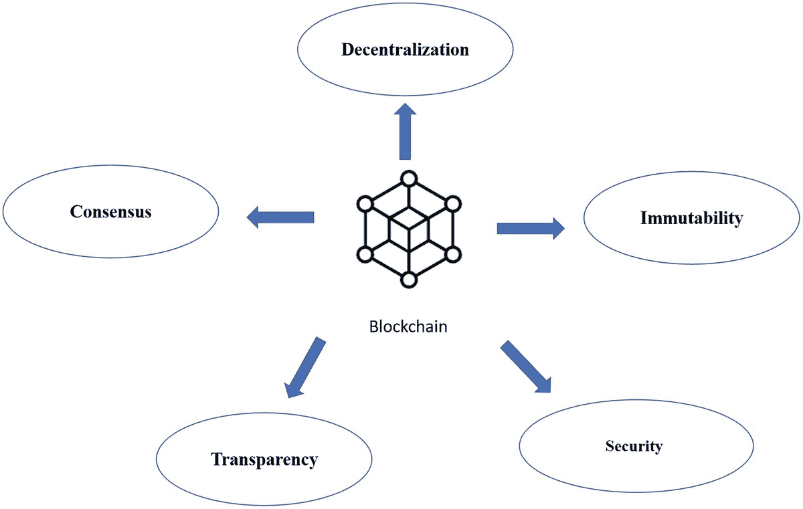

现在我们对区块链的概念有了相当的理解，接下来我们将看看区块链是如何工作的。

## 区块链的工作原理

区块链由有序的区块链条构成。当新区块生成时，会通过哈希机制连接到前一个区块。这样一来，最新数据总能被添加至链的顶端。

想象一下，有一本涵盖全年的每日挂历。日历最初从 1 月 1 日开始。当天结束时，主人会翻到下一页，即 1 月 2 日。由于日期按线性序列排列，因此很容易判断是否有任何一页缺失或被篡改。

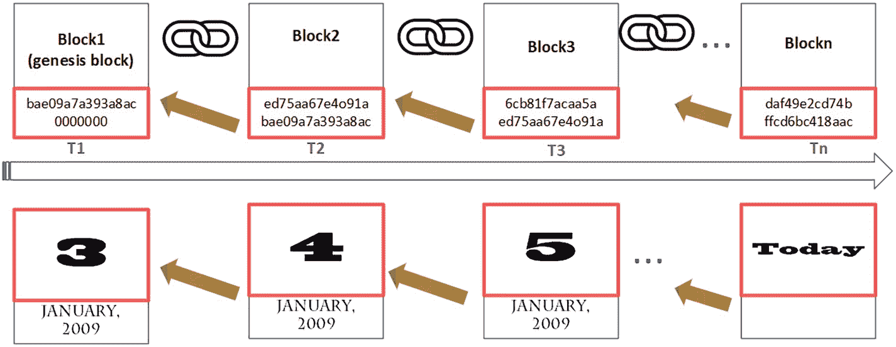

同样重要的是要知道，`bit`（比特）是一个二进制数字（0 或 1），是计算机上存储的最小数据单位。8 个比特组成 1 个`byte`（字节）。

`哈希`是一种唯一标识符，它使用数学函数从输入文本或数据记录中生成固定长度的字符串。（我们将在第 2 章更详细地解释哈希和加密函数。）密码学哈希函数旨在保护数据免受任何篡改。

区块链哈希算法`SHA-256`，即安全哈希算法 256，会生成一个大小为 256 比特（即 32 字节）的哈希码。`SHA-256`是一种单向哈希函数，这意味着它易于计算，但几乎无法逆向哈希以找出初始输入是什么。即使输入信息发生最细微的变化，通常也会使输出哈希完全不同。破解哈希结果的最佳方法是通过暴力破解策略，即逐一测试所有可能的组合。其思路是通过应用相同的哈希函数来猜测被哈希的原始值，并检查结果是否匹配。我们需要处理`2²⁵⁶`个 256 位字符串的变体，总计`3.2 * 10⁷⁹`种可能组合。总计算时间将超过十亿年。

`SHA-256`哈希也是确定性的，这意味着给定相同的输入（或文件），输出将始终返回相同的哈希值。

表 1-2 展示了`SHA-256`哈希的示例。

| `SHA-256` (输入) | 输出 |
|---|---|
| Hellohello | `185f8db32271fe25f561a6fc938b2e264306ec304eda518007d17648263819692cf24dba5fb0a30e26e83b2ac5b9e29e1b161e5c1fa7425e73043362938b9824` |
| blockchain for teens | `ae398c6f1d78e76d472c26e091869b9913f7624abea82901c00893a0015ccd50` |
| Blockchain hash | `f067428fdeb5984a6eeff5dbbe39a60cdb9dbffecdb80f18830eeb1e91d3dde5` |

你可以看到，输入数据的长度并不影响输出长度——输出始终是 64 字符的文本。正因如此，几乎不可能从输出中猜出输入。区块链使用这种`SHA-256`哈希函数来对交易数据进行哈希，并确保交易不易被篡改。如果有人想篡改一笔交易，他们需要重新计算哈希，而这将完全改变输出结果。因此，当我们提到哈希时，指的是哈希算法输出的 64 字符文本。

每个区块的结构分为区块头和区块体，如图 1-5 所示。

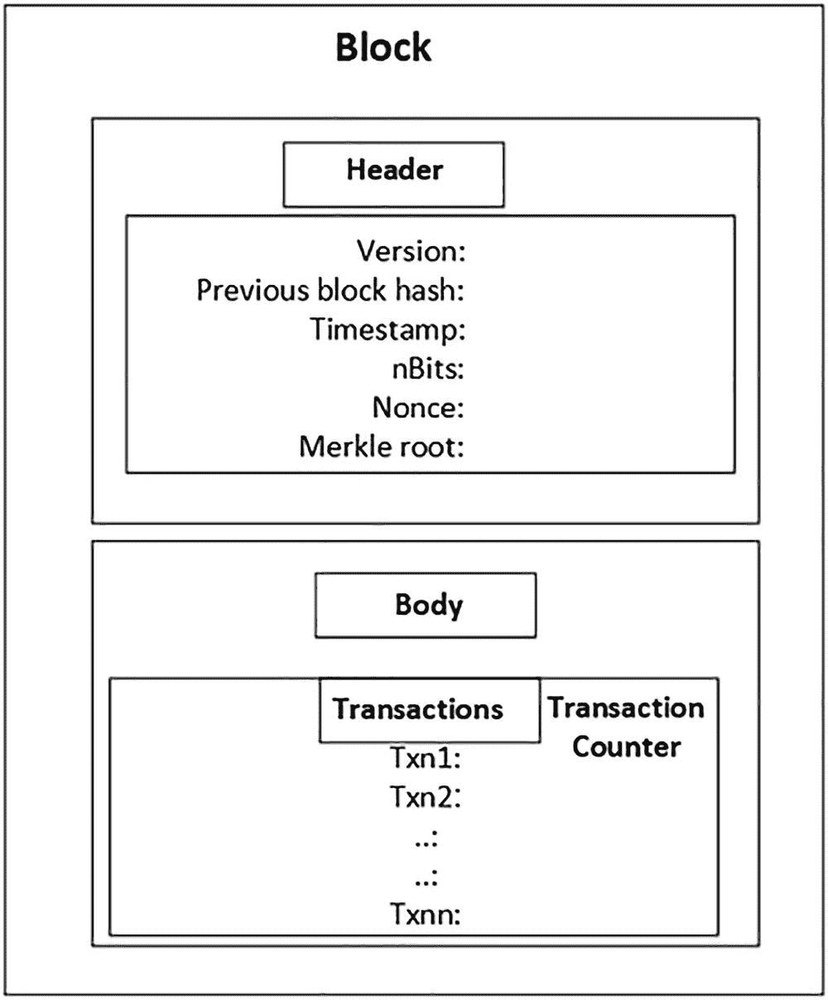

### 区块头

区块头由以下几个部分组成：区块版本、前一个区块哈希、时间戳、`nBits`、随机数和梅克尔根：

- **区块版本** – 区块链的版本号。
- **前一个区块哈希** – 当前区块必须引用前一个区块的哈希值（即父区块），以确保新区块按正确顺序添加到链中。它使用户能够从当前区块了解之前的交易。通过追溯每个区块与其父区块相连的哈希值，我们可以回溯到第一个区块——*创世区块*。
- **时间戳** – 区块被添加时的日期和时间。
- **`nBits`** – 用于创建该区块的当前共识算法的难度值。（我们将在下一节中介绍。）
- **随机数(`Nonce`)** – 即 *只使用一次的数字*，是区块创建者为生成一个小于目标哈希值的区块哈希而被允许更改的随机值。
- **梅克尔根** – 梅克尔树是一种基于哈希的数据结构，也称为二叉哈希树。梅克尔根是梅克尔树的根节点。

在计算机科学中，树是一种由节点集合组成的数据结构。

树具有以下属性：
- 每个节点只有一个父节点。
- 每个节点最多可以有两个子节点。
- 树中有一个没有父节点的节点，称为根节点。树从根节点开始。
- 节点之间通过边连接。
- 每个节点内部包含一个数据元素。

图 1-6 是一个二叉树的例子。`A`、`B`、`C`、`D`、`E`、`F`、`G` 和 `H` 都是节点。`A` 是根节点，`B` 和 `C` 是 `A` 的子节点；它们通过边相连。`E` 和 `F` 是 `B` 的子节点。`G` 和 `H` 是 `C` 的子节点。

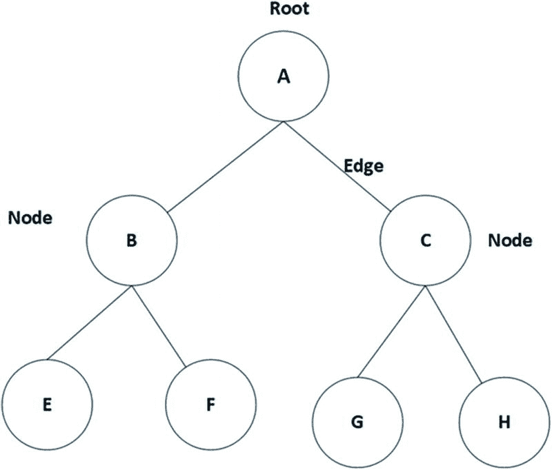

由于梅克尔树被归类为二叉哈希树，因此它具有相同的树结构。每个叶节点是一个数据块的哈希值。每个节点都包含区块链交易数据，这意味着子节点的哈希值被包含在父节点中。

在我们之前的树形例子中，叶节点将是 `E`、`F`、`G` 和 `H`，因为这些节点没有子节点。`B`、`C` 和 `A` 是父节点，`A` 是根节点。

如果我们假设节点 `E` 有一个交易值，那么该区块数据会使用哈希函数 `HASH(E)` 进行哈希处理，其他叶节点也同样处理：`HASH(E)`、`HASH(F)`、`HASH(G)`、`HASH(H)`。当我们到达父节点时，每一对子节点都会被递归地（根据规则重复地）重新哈希，直到我们到达根节点。

父节点 `B` 是其子节点 `E`、`F` 的哈希值 – `HASH(HASH(E) + HASH(F))`。

父节点 `C` 是其子节点 `G`、`H` 的哈希值 – `HASH(HASH(G) + HASH(H))`。

根节点 `A` 就是梅克尔根；它包含了其下的树节点的哈希值：`HASH(HASH(B) + HASH(C))`。

图 1-7 说明了如何从叶节点哈希值向上计算到根节点的梅克尔根哈希值。

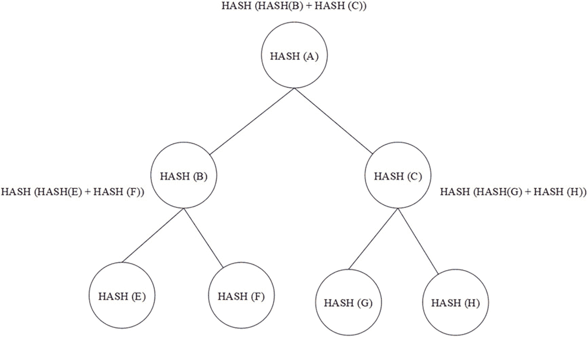

#### 为什么需要梅克尔根哈希？

在之前的例子中，`H(B) = H(E) + H(F)`。

假设 `E` 是 1，`F` 是 2。我们将使用 `SHA-256` 哈希函数。

```
SHA-256(1) = 6b86b273ff34fce19d6b804eff5a3f5747ada4eaa22f1d49c01e52ddb7875b4b
SHA-256(2) = d4735e3a265e16eee03f59718b9b5d03019c07d8b6c51f90da3a666eec13ab35
```

为简单起见，我们将这两个哈希值拼接（组合）成一个长字符串（`H(1) + H(2)`），从而得到以下值：

```
33b675636da5dcc86ec847b38c08fa49ff1cace9749931e0a5d4dfdbdedd808a
```

但如果我们将顺序改为拼接（`H(2) + H(1)`），则会得到 `9704a05c9afffc927899ad21907866ec72b166fd58250b57bca6a184e462d554`。

你可以看到，即使是最微小的改变也会导致完全不同的结果。考虑到每个区块数据都需要包含交易数据、时间戳以及许多其他类型的数据，更改这些值中的任何一个都会导致梅克尔根哈希值完全不同。在前面的例子中，我们可以如下计算梅克尔根哈希值：

```
梅克尔根哈希 = H(B) + H(C) = H(E) + H(F) + H(G) + H(H)
```

根节点哈希代表了整个节点数据的指纹。为了验证节点数据的完整性，你不需要下载整个区块的数据并遍历整个梅克尔树；你只需要检查数据是否与梅克尔根哈希值一致。如果区块链网络中的一个区块副本与另一个区块副本具有相同的梅克尔根哈希值，那么这两个区块中的交易就是相同的。通过这种方式，可以非常快速地证明交易数据。

在区块链中，每个区块都有一个存储在区块头中的梅克尔根。梅克尔树允许网络上的每个节点验证单个交易，而无需下载和验证整个区块。如果区块链网络中的一个区块副本与另一个区块副本具有相同的梅克尔根，那么这两个区块中的交易就是相同的。由于哈希的性质，即使是略微错误的数据也会导致梅克尔根大相径庭。因此，没有必要验证所需的信息量。

所有区块都通过它们前一个区块的哈希值作为区块链中的指针连接起来，形成一个区块列表。由于区块头包含梅克尔根哈希值，我们可以通过执行哈希操作来验证区块头和交易数据是否被篡改。交易数据的任何微小修改都将导致所有区块哈希指针的整个链条发生变化。

所以现在，区块链是由连续的区块序列连接起来的。它将如图 1-8 所示。

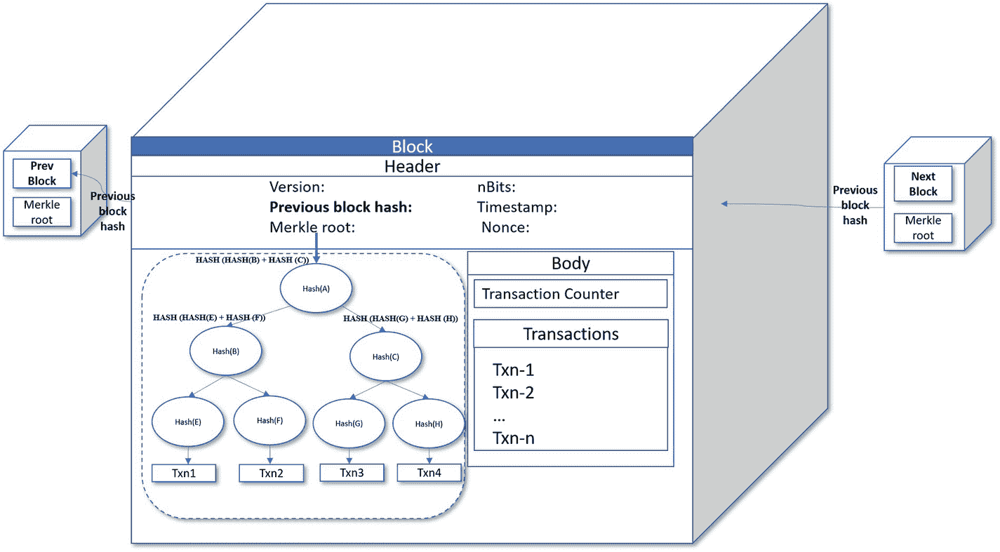

### 区块体

区块体由交易计数器和交易组成。

#### 交易计数器

交易数量表示存储在区块中的交易数量。交易计数器占 1 到 9 个字节。它通常用于衡量区块链的每日交易数量或 *tps*——每秒交易数。下图（来自 `https://studio.glassnode.com/`）展示了比特币的每日交易数量：

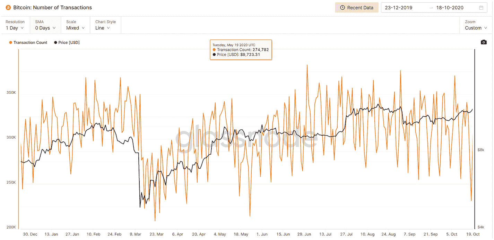

## 交易

交易是指需要被视为单一操作的、逻辑上属于同一组的一系列操作。交易请求可以成功执行，也可能会失败。该过程将确保系统中数据的完整性。在区块链中，交易是构建区块的基本元素。交易数据可以包括资产、价格、时间戳和用户账户地址。

现在我们已经了解了区块结构中的组成部分，接下来看看区块链如何处理用户提交的交易请求。Alice 想要向区块链网络发送 5 个比特币给 Bob。为了加入这个网络，Alice 和 Bob 都需要拥有一个账户地址。当 Alice 向 Bob 发送 5 个比特币时，该交易请求将在区块链上按以下步骤处理：

1. Alice 从她的地址向 Bob 的比特币地址发送 5 个比特币。创建了一个交易请求并进行身份验证（由 Alice 钱包的私钥签名）。
2. 创建一个包含此新交易的新区块。
3. 新区块被广播到网络中的每个节点。
4. 每个节点验证并批准新区块的交易数据。接收到该交易的节点将使用区块链共识来验证交易数据。
5. 新区块被永久添加到现有区块链的末端。
6. 所有节点更新并包含这个新区块。
7. 交易至此完成。

图 1-9 描述了交易过程中的每一个步骤。

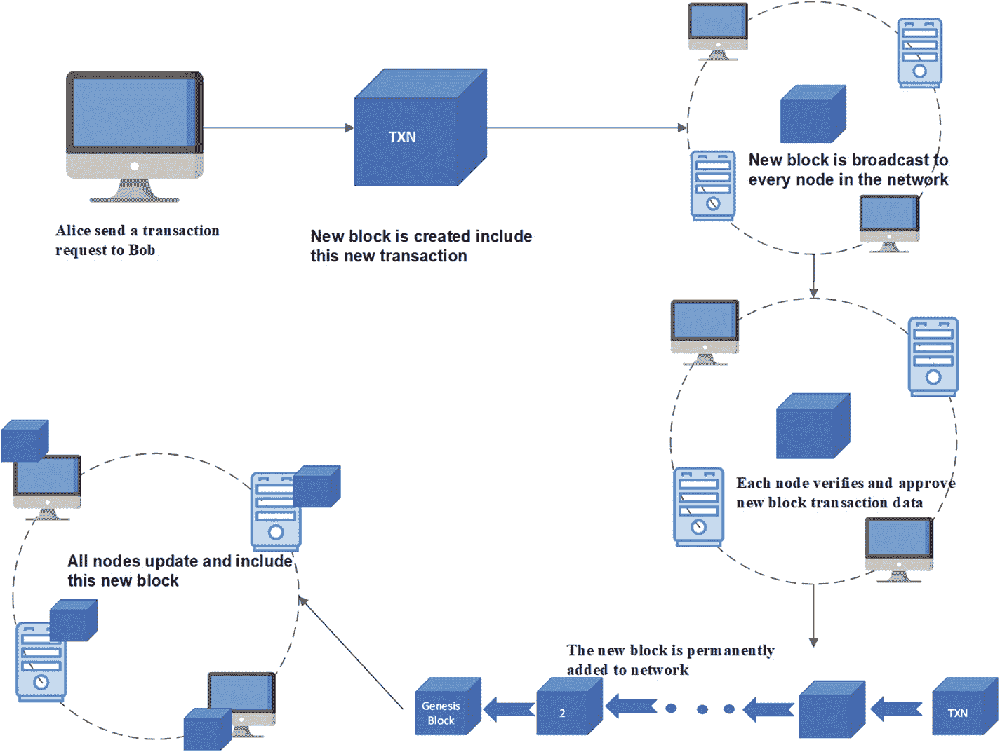

一个区块交易过程的链式示意图。标注部分包括：Alice 向 Bob 发送交易请求、新区块被广播到网络中的每个节点、以及所有节点更新并包含这个新区块。

图 1-9

区块交易过程

## 共识算法

共识算法构成了区块链的基石，它帮助网络中的所有节点就链上的全局状态达成必要的共识。共识机制验证交易或数据，然后将其广播到整个网络。所有其他节点都会收到一份数据副本，并通过使用相同的规则进行验证，将其添加到新区块中。

以下是分布式共识协议的一些重要特性：

* **容错性** – 共识协议将确保无论出现任何故障，网络都能持续平稳运行。
* **统一协议** – 由于区块链本质上是去中心化的，网络中的每笔交易数据都需要通过共识规则进行验证和确认。共识协议需要在网络参与者之间达成统一协议，确保所有处理过的数据都是有效的，并且分布式账本是最新的。这样，网络才能可靠，用户才能在去中心化的模式下操作。
* **确保公平与公正** – 该协议不会在去中心化网络中导致偏见或歧视。任何人都能访问和加入网络并参与共识协议，每一票都是平等的。
* **防止双重支付** – 只有经过公开验证和确认的交易才能被添加到区块链账本中。所有节点将就单一的事实来源达成一致。这保证了网络中不同节点拥有相同的最终结果。

每种共识算法都具备不同的特性和属性，以实现期望的目标。基于我们刚刚介绍的区块链共识特性的基础知识，让我们深入探讨当前市场上主流的区块链共识算法。

### 工作量证明 (PoW)

工作量证明，也称为 `PoW`，是区块链和加密货币（如比特币、以太坊、比特币现金、ZCash、莱特币等）最常用的共识算法之一。

这个概念最早由 Cynthia Dwork 和 Moni Naor 在 1993 年提出。“工作量证明”或 `POW` 这一术语则是由 Markus Jakobsson 和 Ari Juels 在 1999 年的一篇论文中使用的。第一种加密货币——比特币，由中本聪在 2008 年创建。这是工作量证明协议首次作为共识机制在区块链中使用。

工作量证明描述了一种机制：网络中的计算机（称为矿工）相互竞争，看谁先解决复杂的数学难题。当矿工解决了这个“难题”后，他们就被允许向区块链添加一个新区块并获得奖励。

在“区块链如何工作”一节中，我们讨论了所有区块通过前一个区块的哈希值连接起来，形成一个区块列表。矿工需要解决极其困难的数学问题才能添加新区块。为了找到解决方案，矿工必须使用暴力破解法猜测一个随机数（即 `nonce`），直到找到答案。`Nonce` 是一个 32 位（4 字节）的字段。每个区块的哈希值由 `SHA-256`（前一个区块哈希值）、Merkle 根、时间戳、`nonce` 以及预定义的难度目标值生成。难度目标由哈希值前面的前导零个数表示。哈希值前面的前导零越多，整个过程就需要更多的时间和计算资源。随着计算机算力的增长，矿工可以更快地解决这些难题，因此区块链的难度目标也会相应增加。图 1-10 描述了如何在 `PoW` 中计算区块哈希。

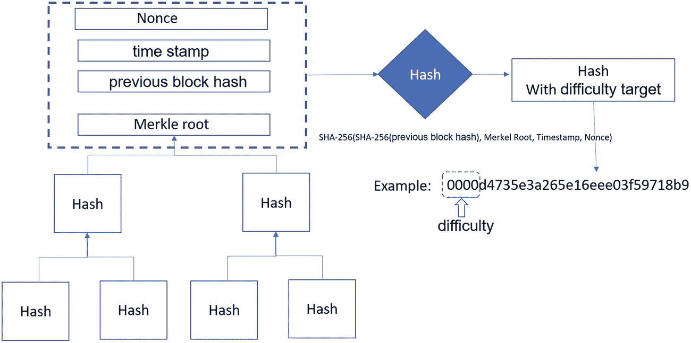

一个算法示意图，展示了工作量证明中的哈希计算。标注部分包括：`nonce`、时间戳、前一个区块哈希值、Merkle 根、哈希值以及带难度目标的哈希值。

图 1-10

工作量证明中的哈希值

以下是近期比特币难度的一个例子（有 19 个前导零）：

`0000000000000000000469f80aeb7bac1b440652a9ef729658c1010d23962a1cdi`

一台强大的矿机挖掘每个比特币区块大约需要十分钟。成功挖矿后，单个矿工将获得约 1 BTC 的奖励。

正如我们之前所了解的，`SHA-256` 哈希函数是一个单向函数，这意味着无法反向推导出原始值。我们所知的最快的解决方案就是暴力破解。矿工需要尝试不同的 `nonce` 数字，尽可能快地计算哈希值，直到找到匹配的哈希值。

以下是工作量证明的过程：

1. 新的交易被广播到所有节点。
2. 每个节点将交易收集到一个候选区块中。
3. 矿工验证交易并提出一个新区块。
4. 矿工竞争解决一个难题，为其区块找到工作量证明的解决方案。
5. 当矿工找到解决方案时，`PoW` 被解决，并随区块一起广播到所有节点。
6. 节点验证新区块中的交易是否有效，并接受添加该新区块。
7. 矿工获得奖励。

图 1-11 直观展示了工作量证明的过程：

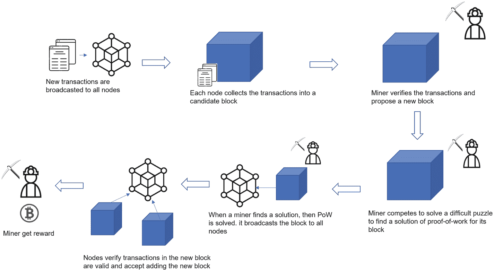

一个流程图，展示了工作量证明共识的过程。标签包括：新交易被广播到所有节点、矿工验证交易并提出新区块、以及矿工获得奖励。

图 1-11

工作量证明的过程

#### 能源消耗

在 2008 年，你可以轻松地使用个人电脑挖掘一个比特币。而如今，你需要大约 149.2 `PH/s` 的算力才能挖到一个比特币。`PH` 是 `peta hash` 的缩写：

`1 PH/s = 1,000,000,000,000,000 (一千万亿) 哈希每秒`

该过程通常需要一整个房间的矿机，这些机器通常价值数千美元，专门设计用于提高哈希率等级和优化功耗。持续运行这些挖矿节点需要消耗大量的电力。2022 年，全球比特币挖矿消耗了世界能源产量的 0.12%（188 `TW/h`，太瓦时）——超过了挪威的能源消耗量。

### 51% 问题

要将一个区块添加到网络中，工作量证明需要足够的算力来解决一个难题。对于想要逆转交易哈希值的黑客来说，他们需要控制处理区块链上交易的至少 51%的挖矿算力（哈希率）。这成本非常高，因此个人黑客几乎不可能攻破一个网络。

表 1-3 展示了对比特币和以太坊进行 `PoW` 51% 攻击的成本：

表 1-3  
PoW 51% 攻击成本

| 名称 | 哈希率 | 1 小时攻击成本 |
| --- | --- | --- |
| 比特币 | 33,511 PH/s | $583K |
| 以太坊 | 216 PH/s | $364K |

然而，如果一群强大的矿工相互合作并控制了这多数算力，那么他们最终可以控制整个网络，并决定哪些交易可以被添加到网络中。这被称为 51% 攻击。

由于这些缺点，多年来许多其他新的共识机制被提出并实施。其中最流行的是权益证明（`PoS`）。

### 权益证明（PoS）

工作量证明是一种*验证竞赛*方法，矿工通过解决加密难题来验证交易并获得奖励。这个过程在 `PoW` 计算上消耗了大量能源。矿工用能源换取利润。可以将其理解为“一 CPU，一票”。

权益证明（`PoS`）机制旨在通过用质押来替代算力，从而解决可扩展性和环境可持续性问题。这里的可扩展性指的是区块链网络能够处理因更多用户和应用而增加的请求。质押类似于工作量证明中的挖矿功能。矿工将他们的加密货币作为抵押品进行质押，以获得验证区块的机会。这些矿工成为了“验证者”。`PoS` 算法选择验证者来验证新交易并将其添加到区块链中，验证者会获得一些加密货币作为回报。矿工质押的加密货币越多，其节点被选中参与网络验证的机会就越大。

为了解决区块交易的验证问题，计算仅仅依赖于节点所拥有的质押加密货币数量。我们可以将其简化为“一币，一票”。

网络会随机选择一些验证者，并要求他们提供“正确的”交易。

验证者节点中作为输入的一个未经确认的交易满足以下条件：

`Hash(s, c) ≤ Ncoin∗ Tcoin`

- `Ncoin` 是节点中当前质押的币数量
- `Tcoin` 是该币的时间累积量

`Ncoin* Tcoin` 代表节点的币龄，币龄越大，在相同难度级别下满足条件的几率就越大。

`PoS` 最早于 2011 年 7 月 11 日被提及，当时 QuantumMechanic 在 BitcoinTalk 在线论坛上提出了这个概念。Sunny King 和 Scott Nadal 在 2012 年首次就此发表了一篇论文。

以下是权益证明的流程：

1. 矿工作为“验证者”锁定一定数量的加密货币或加密代币。
2. 网络运行协议公式 `f(x)` 来选择一个验证者。
3. 被选中的矿工验证交易并提出一个新区块。
4. 矿工向所有节点广播新区块。
5. 节点证明新区块：
   - 如果区块有效，则新区块被添加到网络中。矿工获得奖励。
   - 如果区块无效，节点将再次投票反对该新区块。矿工失去其质押的币。

图 1-12 直观地展示了权益证明的流程。

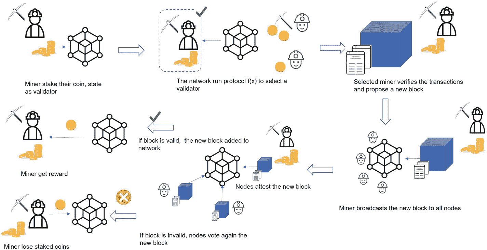

权益证明流程的工作流示意图。标签包括矿工质押其币、成为验证者、矿工获得奖励、矿工失去质押的币，以及节点至少对新区块进行验证。

图 1-12

权益证明的流程

作为最常见的共识机制之一，`PoS` 被许多加密货币所采用。以下是支持权益证明币种的流行加密货币列表。

1. **ETH 2.0**
   以太坊 2.0 将当前基于 `PoW` 的以太坊区块链 1.0 切换到了 `PoS`。此外，信标链将 `PoS` 带入了以太坊 2.0。

2. **Cardano**
   Cardano 创建于 2017 年，运行在权益证明的 Ouroboros 共识协议上。Cardano 中的加密货币代币称为 `ADA`。

3. **Avalanche**
   Avalanche 是基于 `PoS` 的最快的智能合约平台之一。
   Avalanche 是一个区块链平台，其原生代币为 `AVAX`。

4. **Polygon**
   Polygon，原名 Matic Network，是一个“第二层”或“侧链”扩容解决方案的区块链网络。Polygon 中的加密货币代币称为 `Matic`。

## 货币体系的演变

货币是生活的核心组成部分之一，许多日常活动都依赖于它。你可以付出金钱，并换回食物、玩具、衣服、电脑、汽车、医疗保健和其他服务。货币通常用于在市场上购买商品和服务，但偶尔，人们也可能在不使用货币的情况下直接进行商品交换。例如，1984 年 8 月，沙特阿拉伯开采了价值 10 亿美元的石油，为其国家航空公司换取 10 架波音 747 大型喷气式客机。这种交易被称为直接交换或物物交换。

### 物物交换系统

物物交换系统是一种古老的交换方式。该系统可以追溯到公元前 6000 年，甚至早在货币发明之前。美索不达米亚人引入了这个系统，腓尼基人采纳了它。后来，巴比伦人也改进了他们的物物交换系统，因为盐非常珍贵，他们用盐来支付罗马士兵的薪水。许多物品都可以用于交易，包括食物、茶叶、武器、香料和工具。

物物交换系统支撑了早期经济数千年，但它可能效率低下，并且并不总是运转良好。

- **时间**
  例如，如果一个人有小麦并且想用它来交换布料，那么这个人不仅要找到一个拥有布料的人，还需要双方都同意用小麦换布料是公平交易。如果这行不通，这个人就必须等待或寻找其他人，直到有人同意这些条件。这些安排很耗时。

- **无法分割的商品**
  许多商品在分割后会失去价值。假设一块布料的价格等于五个鸡蛋。如果一个人只有四个鸡蛋，那么就需要分割或裁剪布料来完成交易。但布料会因此损失一些价值。

- **缺乏标准单位**
  物物交换系统中缺乏共同的计量单位，所以每笔交易都需要讨价还价。这非常耗时且效率低下。例如，需要多少个鸡蛋才能换一块布？鸡蛋的大小如何？布料是新的吗？所有这些因素在双方看来可能都不相同。

- **延期支付（未来支付）的困难**
  有些商品具有时效性。例如，一个渔民想卖新鲜的海鲜来换取小麦，但农民只能在几周后才能提供小麦。随着时间的推移，鱼的价值会下降，因此将来不可能进行这种交换。

- **价值运输的困难**
  将大量易碎或有价值的物品以及动物运送到遥远的市场进行交换是有风险的。

- **大型或非常昂贵商品储存的困难**
  在物物交换系统中，有些商品需要额外花费来储存，比如牛、猪、羊等。

### 商品货币

盐逐渐成为一种广为接受的支付形式，并被社会所认可。由于多年来人们对以盐作为支付手段的信任逐渐形成，物主可以随时用盐交换许多其他有用的物品。单词`“salary”`源自拉丁语`“salarium”`，意为`“盐钱”`。

当某种商品成为交换商品和服务的流行媒介时，它就具备了信任和内在价值。这种商品就演变成一种货币形式，称为`“商品货币”`。历史上，各种物品都曾被用作商品货币，例如盐、烟草、牛、货贝、宝石和谷物。

位于中太平洋加罗林群岛的雅浦岛，有一种非常独特的巨型石币，被称为`“Rai”`。雅浦人将石头制成圆盘状，中间穿孔以便运输。石头的价格由其稀缺性以及将新石头运到岛上的成本决定。有时交易完成后石头甚至无需移动，人们只需转移其所有权。这种石币一直作为日常交易的货币使用，直到 20 世纪 60 年代。

以下是其他几种商品货币的例子：

**烟草叶：**

在整个 17 世纪，弗吉尼亚、马里兰和北卡罗来纳州都将烟草作为所有交易（包括税收和贸易）的官方货币。

**牛：**

大约从公元前 9000 年到公元前 6000 年，最古老的货币形式包括牛、骆驼、羊和其他牲畜。在古代，牛作为一种商品货币相对容易运输。

尽管商品货币极大地促进了古代商品和服务的流通，但人们很快也遇到了这种货币形式的困难：

- **无法分割的商品：**
  有些商品货币难以根据需求分割成更小的单位。例如，牛和货贝无法分割成小份用于日常购买。

- **易腐性：**
  对于易腐烂的商品，保持其价值十分困难。
  当人们使用牲畜作为商品货币时，这些动物可能在运输过程中生病、受伤甚至死亡。易腐食品在长期储存后会失去价值。

- **缺乏便携性：**
  某些商品，例如雅浦石币，很难从一个地方转移到另一个地方。

- **缺乏普遍接受性：**
  各地区之间的商品没有标准化。这使得用不同商品进行交易时难以定价。

但是，如同以物易物一样，为了克服这些困难，人们转向了金属硬币作为另一种货币形式。

#### 金属硬币

吕底亚王国（今土耳其的一部分）大约在公元前 700 年铸造了第一批金币和银币。一枚硬币的重量接近一枚美国五分镍币。一名士兵的月薪大约是三枚硬币。吕底亚硬币是第一次由中央权威机构发行硬币的概念。吕底亚硬币通常由金、银或琥珀金（金银的混合物）制成，并刻有神祇和帝王的图案。

由于硬币具有标准的重量和尺寸，它们变得更易于携带和交换。此外，与商品货币相比，金属硬币更加耐用。金属是可分割且可互换的，如果你将硬币回收熔化，可以制成工具、武器和新硬币。一枚硬币可以在很长时间内保持相同的价值，并且难以伪造。

在有记载的人类货币历史中，金属货币一直是主要的货币形式。每种硬币都有其设计好的面值和尺寸。在处理少量交易时，使用起来很方便。然而，一旦人们需要长途旅行或进行大额交易，交换就变得成问题。携带大量硬币既不安全也不方便。

而且，由于金属的稀缺性，硬币的供应量是有限的。要定期获取更多金属以满足快速增长的经济，需要付出巨大的努力。

在古希腊和罗马帝国，大多数硬币由金、银和琥珀金制成，但也有少量硬币使用了铜、青铜和合金。这些小面值硬币通常用于小额交易，其硬币的内在价值低于面值。这开启了代币货币的原则。

穆罕默德·本·图格鲁克在公元 1324 年至 1351 年间统治着印度次大陆北部和德干高原。在此期间，金银短缺。但穆罕默德·本·图格鲁克深刻理解代币货币的本质，发行了一种名为`Tanka`的铜币，这是世界上第一种代币货币。`Tanka`的价值等同于一枚银币。

几个世纪以来，大多数国家都用金、银以及其他更便宜的铜、锌和镍来铸造硬币。硬币的价值逐渐与金属本身脱钩，更多地由其标注的面值来体现。这一演变最终导致了纸币的发明，标志着货币发展中的一个关键阶段。

### 纸币

金属货币的主要问题在于，在与商家进行大额交易或需要长途旅行时，它极为不便。为克服这一问题，中国人于公元前 118 年首次使用纸币银行券——`“飞钱”`——来交换商品和服务。人们可以将银行券作为信用证使用，并在远距离范围内进行转让。纸币银行券的成功开启了纸币货币的先河。

宋真宗设立交子务后，宋朝于 1023 年发行了世界上第一种真正的纸币。交子务印刷并发行了统一流通的交子，在商人之间流通。

纸币可以作为商品、服务或劳动的收据，并在服务完成后兑换。

纸币由国家政府发行并背书，作为法定货币，而非来自黄金或白银等传统商品。这是世界上第一种法币（来自拉丁语：`fiat`，意为“令其发生”）。

作为欧洲第一个采用银行券的国家，瑞典的第一家银行——斯德哥尔摩银行于 1661 年发行了瑞典银行券。这些银行券充当银行存款凭证。由于纸币比金属硬币更容易制造、更轻便、更易于携带，银行券迅速流行起来。到了 17 世纪，世界各地的政府和银行都开始向社会发行纸币。

制造金属硬币需要原料、精炼、熔炼、铸造以及许多其他工序，最终才能压制和发行。与金属货币相比，纸币可以通过官方机构更快地印刷，并且总供应量不受金属数量的限制。

在当今世界，纸币在我们的日常生活中无处不在。它具有不可否认的好处；但是，像其他类型的货币一样，现金也有一些缺点。

使用现金的缺点之一是，你需要一直随身携带现金。当你购买昂贵的商品时，你需要将大量纸币从一个地方带到另一个地方。

第二个缺点是，当你丢失钱包或钱包被盗时，你可能会丢失现金。没有方法能保证现金能被退回。而且交易完成后你就将现金交给了对方，因此，如果交换的商品出现问题，也无法保证金钱能被追回。

纸币的这些缺点促使银行发明了信用卡等塑料货币，这在当今的支付方式中正变得越来越流行。

## 塑料货币

随着互联网和计算机技术的发展，交易不仅可以在线下进行，也可以在线完成，并且更加快捷便利。如今，像`Mastercard`、`Visa`、`American Express`和`Discover`这样的信用卡公司是全球最广泛接受的支付方式。

1946 年，一位在`Flatbush National Bank`工作的布鲁克林银行家`John Biggins`发明了第一张信用卡。这种银行卡被称为`“Charg-It”`卡。

`Charge-It`卡仅在他银行周围两个街区范围内的本地商户中有效。持卡人需在`Flatbush National Bank`开设账户。银行并非让持卡人直接向商户付款，而是在审核持卡人的购物账单后代为支付。其目的是为银行带来更多忠实客户。这一理念使客户能够在付款前购买商品，因为它建立在未来会付款的信任基础之上。

1950 年，`Diners Club`创造了第一张多功能签账卡，允许消费者在多家商户使用。

1958 年，`American Express`在美国和加拿大推出了其第一张签账卡——`American Express Purple Card`。这就是我们今天所熟知的第一张塑料信用卡。

同年，`Bank of America`推出了其首个获得国家许可的信用卡项目，并将其命名为`BankAmericard`。`Bank of America`通过邮寄方式将信用卡“投放”到邮箱中，这种做法至今仍存在。

1960 年，`IBM`发明了用于信用卡背面的磁条。磁条中嵌入了持卡人信息，包括持卡人姓名、卡片有效期和账号。

1966 年，加利福尼亚州的几家银行决定联合成立一个新的银行协会——`Interbank Card Association (ICA)`，并推出了`Mastercard`。

1976 年，`BankAmericard`扩展到全球，并最终更名为`VISA`。

1986 年，`Sears`首次推出了自己的信用卡项目，在店内销售商品之外，还提供了“现金返还”奖励计划。该信用卡被称为`Discover Card`。

图 1-13 展示了塑料货币的历史。
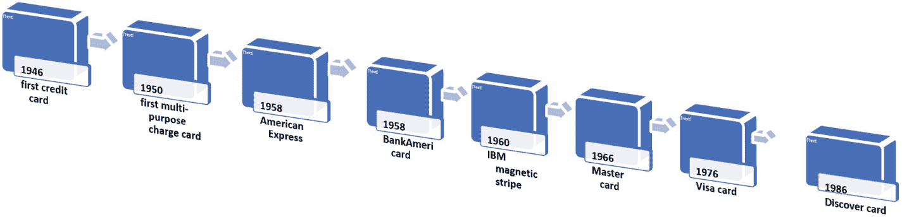
一张流程图展示了塑料货币的历史。标注的流程依次为：第一张信用卡、第一张多功能签账卡、American Express、BankAmericard、IBM 磁条、Mastercard、Visa 卡以及 Discover 卡。

**图 1-13** 塑料货币的历史

信用卡缓慢但确实地改变了我们使用和看待“信用”与金钱的方式。

人们将现金存入银行账户，并使用信用卡（信用货币或银行货币）进行日常消费。它发挥着与纸币相同的功能。塑料货币在很大程度上减少了携带现金的需求，并为整合日益复杂的现代支付系统带来了更便捷的方式。

## 移动支付

1991 年 8 月 6 日，`Berners-Lee`在瑞士阿尔卑斯山的一个实验室里推出了世界上第一个网站。如今，自其诞生二十多年后，现存网站数量已接近 19 亿。自那时起，电子商务在过去几十年中飞速发展。

1994 年 8 月 11 日，世界上第一笔在线购买交易发生，订单内容是从`Pizza Hut`订购一份意式辣香肠蘑菇披萨。`Visa`处理了这第一笔在线支付。

1995 年，`Amazon`作为首批电子商务网站之一，推出了其在线书店。

1998 年，`Paypal`推出了第一个资金转账工具，这被认为是第一个数字钱包，它允许客户进行安全的在线支付。

1999 年，`Ericsson`和`Telenor Mobil`推出了第一个可使用手机购买电影票的移动钱包。

2003 年，全球有 9500 万移动用户通过手机进行了购买。

2007 年，`iPhone`和`android`移动操作系统发布。

2022 年，约有 72.6 亿人拥有智能手机，占世界人口的 91.54%。79% 的智能手机用户在过去六个月内进行过移动支付。

图 1-14 描述了移动支付的历史。
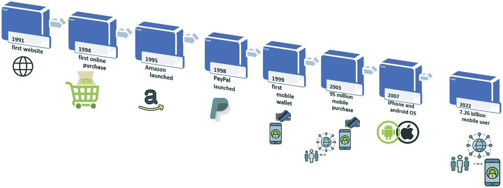
一张流程图展示了移动支付的历史。标注的流程依次为：首个移动支付、在线支付、Amazon 上线、PayPal 推出、首个移动钱包、9500 万移动购买、iPhone 和 Android 操作系统、以及 72.6 亿移动用户。

**图 1-14** 移动支付历史

一些值得注意的移动钱包包括`Apple Pay`、`Amazon Pay`、`Google Pay`、`Venmo`、`PayPal`、`WeChat Pay`、`Zelle`和`Square`。

### 移动支付类型

市场上存在多种移动支付类型，包括以下几种。

`NFC`，即近场通信，是一种允许移动设备通过私密通道安全连接的技术。通常要求设备之间保持较短距离（4 厘米或更短）才能建立连接。移动设备通过`NFC`标签与使用`NFC`的商家建立连接。客户需要激活`NFC`才能开始一对一的交互。

#### 二维码支付

快速响应码，即二维码，是一种二维条码。它编码了信息，以便商品可以当场购买。手机等数字设备可以读取这些信息。许多移动钱包支持二维码支付，例如`PayPal`、`Zelle`、`Square`和`Venmo`。

#### 基于云的移动支付

`Google`、`Amazon`、`GlobalPay`和`GoPago`采用基于云的方法处理店内移动支付。它允许消费者使用近场通信（`NFC`）购买商品，同时将移动支付提供商置于交易中间。

移动支付仍存在许多问题，以下是几个示例。

#### 数据隐私

当我们使用移动支付应用购买商品时，交易过程不仅涉及商家和用户。还有其他隐藏的供应商或中间商参与其中。每个参与方都会将交易记录在各自的数据库中用于商业目的。这些供应商可能会利用收集的数据研究用户行为，并向他们投放广告。

#### 隐藏费用

大多数移动支付方式与信用卡和借记卡绑定。Visa 的数字钱包收取与信用卡支付相同的费用。但`PayPal`、`Venmo`和许多其他支付供应商收取的费用高于一般大型银行的平均费用。以下是常见隐藏费用的示例：`余额转账费`、`境外交易费`、`闲置费`、`滞纳金`等。

#### 钱包控制权

即使你拥有自己的支付账户，也并非拥有完全控制权。在某些情况下，支付发行方可能临时暂停用户账户并限制借贷能力。

使用移动支付有很多优势，但货币仍在不断演变。图 1-15 展示了货币体系的演变过程。
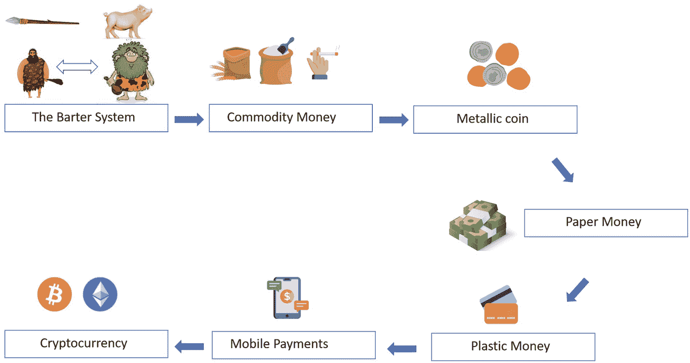
货币体系演变的示意流程图。标签流程依次为：以物易物系统、商品货币、金属硬币、纸币、塑料货币、移动支付和加密货币。

**图 1-15** 货币体系的演变

在移动支付中，所有货币都以电子形式存储于电子系统或数字数据库中。因此，我们通常广义地将其称为电子货币，即`电子货币`。`电子货币`可用于有银行账户或无银行账户的电子支付交易。

电子货币有两种系统类型：中心化系统和去中心化系统。这两种系统的主要区别在于，去中心化数字货币（也称为`加密货币`）是去中心化系统中的原生货币。没有中心化机构发行这种货币，`加密货币`由区块链网络中的计算机协议定义和生成。我们将在下一节进行更详细的讨论。

## 理解加密货币

在中心化货币系统中，数字货币由某个中央银行支持。人们觉得其货币具有价值，是因为他们信任发行这种货币的政府。加密货币（或“加密”）是一种去中心化的数字货币，旨在作为区块链交易的交换媒介，对公众透明，并且能够抵抗审查。与中心化货币不同，加密货币不依赖于政府或银行等中心化货币当局来发行货币。加密货币依赖现代密码学来验证区块链中的交易、发行货币单位、保护用户账户以及确保账本数据的安全。

第一种去中心化加密货币是`比特币`。它于 2008 年由中本聪发明，并于 2009 年推出。`比特币`是所有加密货币之母，至今仍是最具价值、最受欢迎的加密货币。在 2022 年按市值计算的加密货币中，`比特币`在所有加密货币中占据了 47%的市场份额。

### 加密货币市场

自 2008 年`比特币`问世以来，加密货币已经彻底改变了整个金融世界。加密货币的总数量迅速激增。截至目前，约有 20,000 种加密货币，总市值接近 1.2 万亿美元。每 24 小时内，就有价值近 680 亿美元的加密货币被交易。全球有超过 500 家加密货币交易所。

根据`blockchain.com`的数据，在撰写本文时，`比特币`的每日交易量约为 27 万笔/天。
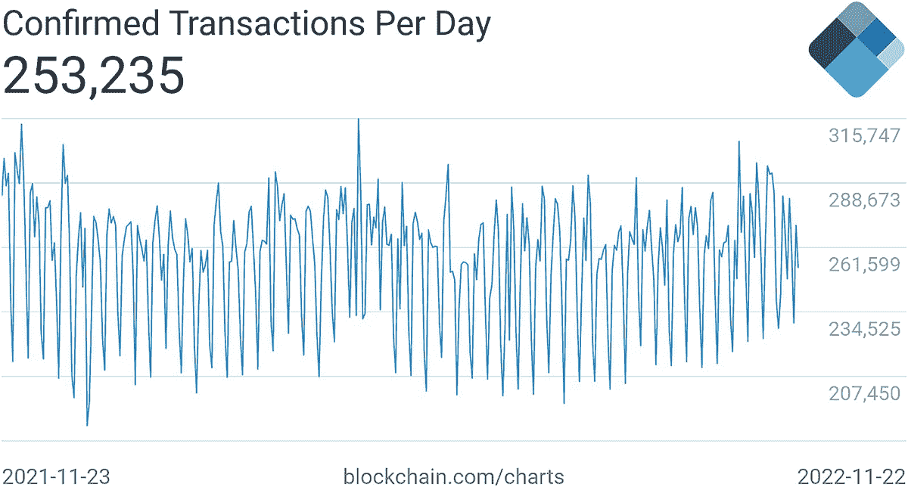
一份分析报告描绘了 2021 年 11 月 23 日至 2022 年 11 月 22 日期间`blockchain dot com`上确认的`比特币`交易数量。每日确认交易数记录为 253,235 笔，日交易量约为 27 万笔。

**图 1-16** 每日确认的`比特币`交易数量（`blockchain.com`）

`statista.com`显示，2009 年 1 月至 2021 年 11 月 7 日期间，`比特币`、`以太坊`以及其他 13 种加密货币在区块链上的每日交易数量，如图 1-17 所示。
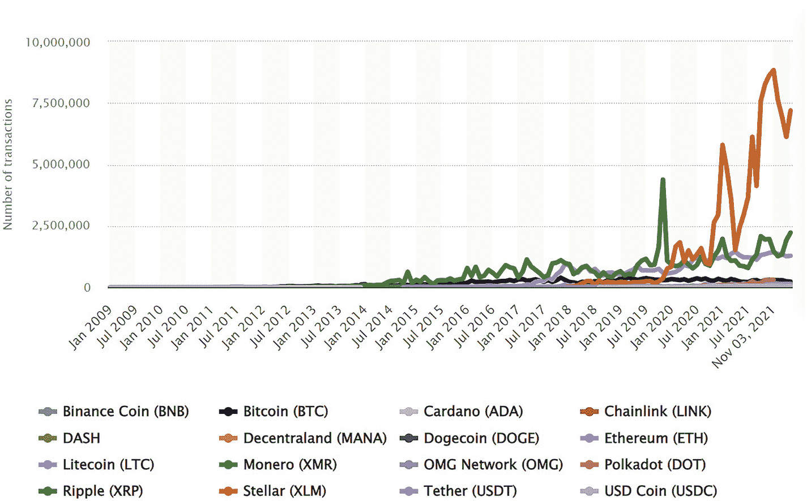
一幅 2009 年至 2021 年与交易数量的关系图，用 16 种颜色编码的曲线表示。最高波峰值超过 7,500,000。

**图 1-17** 加密货币每日交易数量（`statista.com`）

`比特币`每日交易量为 26 万笔。`以太坊`每日处理超过 110 万笔交易。`瑞波币`每日处理 140 万笔交易。`恒星币`每日处理 880 万笔交易。

信用卡公司平均每天处理 1 亿笔交易。加密货币要达到这样的日交易量水平还有很长的路要走。但大约五分之一的美国人曾使用、投资或交易过加密货币，这是另一个迹象，表明尽管加密货币问世相对较晚，但其仍在快速增长并越来越受欢迎。

2014 年，大型在线零售商`Overstock`开始在其网站上接受`比特币`作为支付方式。同年，`微软`成为首批采用加密货币支付游戏、应用和其他产品的大型科技公司之一。

主要移动运营商`AT&T`通过`BitPay`接受客户的在线加密货币支付。`特斯拉`在其网站上接受`比特币`和`狗狗币`用于购买部分商品。

仅在美国，就有超过三分之一的小企业和许多大公司接受加密货币作为一种支付形式，其受欢迎程度还在持续增长。如今，你可以用`比特币`购买许多东西，包括：

汽车、移动和电视服务、家具、电影和活动门票、食品、艺术品和收藏品、房地产、旅行以及慈善捐赠。

随着加密货币的日益普及，区块链交易量将继续增加。

### 是什么导致了加密货币市场的高波动性？

有多种因素会导致市场环境高度波动和不稳定。让我们探讨其中一些因素。

### 新兴市场

与互联网的历史相比，加密货币仍处于非常早期的阶段——自加密货币问世以来仅十年时间。在此期间，加密货币市场呈指数级增长。

全球加密货币市值达到约`1.25`万亿美元，而 2021 年全球股票市值约为 121 万亿美元。与全球股票市场相比，加密货币市场仍然相对较小，而波动性是任何新兴市场的固有特性。即使在互联网股票的早期，也如同今天的加密货币市场一样，存在高波动性。

加密货币要实现大规模采用仍需很长时间。与股票、法定货币和其他传统金融产品不同，该行业仍在研究、理解并开发可靠的模型来确定加密货币的基本价值。这意味着在当前市场上，没有可靠的产品能够预测加密货币的价格。

### 新技术

在前面的`LUNA`例子中，`LUNA`发明了`TerraUSD`（`UST`）的概念。这种稳定币由`Terra`算法控制，以发挥像美元一样的法定货币功能。它旨在与美元以`1:1`的比例挂钩，但与其他主要的稳定币不同，`UST`并非完全由抵押品支持。`LUNA`还赋予持有者对协议的投票权。该协议一直按预期运行，直到出现可扩展性问题。如果用户在市场上行时归还`UST`，`LUNA`协议需要通过向用户发行更多`UST`代币，将`UST`的价格拉回`1 美元`。这导致`LUNA`的总代币供应量从 5 月 5 日的约 7.25 亿枚飙升至 5 月 13 日的约 7 万亿枚。稳定币的`1:1`比例再也无法维持。其价格从`1 美元`跌至`0.009 美元`。

### 去中心化

像比特币这样的加密货币，原生于区块链网络。与黄金这种现实物理世界中的实物资产相比，加密货币更像是一种“价值存储”。它没有任何实物商品或中心化货币作为支撑，仅以虚拟形式存在，因此它没有内在价值。其价格由市场的供需关系决定，但许多因素都可能导致价格波动。

### 市场情绪

市场情绪，也称为投资者关注度，是投资者对某一特定资产价格预测的整体感受。许多事情都可能影响投资者对加密货币的关注度，从而引发一段时期内的剧烈波动。以下几点可供参考：治理、监管、供需关系、安全漏洞、竞争等。

加密货币价格的波动性和难以预测性可能会让人感到沮丧，因此，管理风险、将加密货币分散投资于一系列不同的加密资产、进行研究和技术分析、投资你能承受损失的金额，并着眼于长期持有等，就显得尤为重要。

### 代币与币的区别

一个常见的误解是认为代币（token）和币（coin）是同一回事。

在货币体系的演变部分，我们了解到金属币是由黄金或白银制成，以代表其内在价值。穆罕默德·本·图格鲁克发明了象征性货币——坦卡（Tanka），它使用铜币来代表与银币同等的价值。

在区块链中，币和代币都代表着价值储存手段，并可用于处理支付。但两者存在一些区别：加密货币币是区块链的原生资产，由区块链共识协议生成。例如，比特币网络中的`Bitcoin`和以太坊网络中的`Ether`就是币。

加密货币代币则构建于区块链网络之上，通过智能合约（一种在网络中运行的自动执行程序）创建。代币的创建数量可以在创建代币时由智能合约定义。

表 1-5 展示了币与代币之间的区别。

**表 1-5**

**币与代币的对比**

| 币 (Coin) | 代币 (Token) |
| --- | --- |
| 币是一种独立的数字资产，是其自有区块链的原生代币，通过网络共识进行验证。币类似于法定货币。 | 代币的创建需要智能合约来定义代币的基本属性，然后进行构建和操作。 |
| 币的数量由区块链共识决定。 | 代币的数量由智能合约决定。智能合约可以定义更多自定义的代币属性，例如代币名称、总供应量、某些代币转账规则等。 |
| 币的主要用途是通过执行共识协议来构建区块链网络。币可以通过挖矿或转移币所有权来分发。 | 代币的用途可能多种多样，因为其功能被定义为根据业务需求而定的 Dapps（去中心化应用）。 |
| 示例：`Bitcoin`、`Ether`、`Solana`、`Cardano`、`Doge`、`LTC`、`BnB`、`Ripple` 等。 | 示例：证券型代币、实用型代币、股权型代币、ERC-20 代币、NFT 代币等。 |

## 总结

在本章中，我们学习了区块链的主要特性，并探索了去中心化。然后，我们通过回顾交易过程中的每一步，了解了区块链是如何工作的。诸如`PoW`、`PoS`等共识算法构成了区块链的支柱。接着，我们继续探讨了货币体系的演变，从物物交换到加密货币。最后，我们简要介绍了加密货币，并理解了加密货币市场的一些基本概念。

在下一章中，我们将继续学习之旅，开始学习密码学——区块链安全的基石。