# 2. 密码学：区块链安全的基石

区块链是建立在一系列不同的密码学概念之上的。从保护钱包、确保交易安全，到保护共识协议以及为匿名账户加密私人数据，几乎一切都需要密码学来确保其正常运作。密码学是区块链安全的基石。

本章将深入探讨你需要了解的关于区块链中密码学的一切，从基础开始。然后，你将了解经典的对称密钥密码学、非对称密码学等。随着你的深入学习，你将熟练掌握数字签名的工作原理。

本章还将涵盖如何利用哈希函数对数据进行哈希处理，在章节末尾，你将深入了解椭圆曲线密码学（`ECC`），这是一种在区块链中使用的重要加密密码学类型。

在本章中，将讨论以下与密码学相关的主题：
- 密码学基础
- 对称密钥密码学
- 非对称密钥密码学
- 数字签名
- 哈希算法
- `ECC`
- 导出的以太坊地址

## 密码学基础

在第 1 章中，我们简要讨论了用于对区块数据进行哈希处理的 `SHA-256` 哈希密码学。

让我们用一个例子来说明如何向公众发送安全信息。假设爱丽丝想给鲍勃发送一条私人信息。爱丽丝希望这条信息是私密的。只有鲍勃能理解这条信息，并且信息在传输过程中不能被篡改。通过互联网发送的信息可能会被入侵者秘密拦截并记录（见图 2-1）。爱丽丝和鲍勃如何阻止这种情况发生？这正是密码学发挥作用的地方。

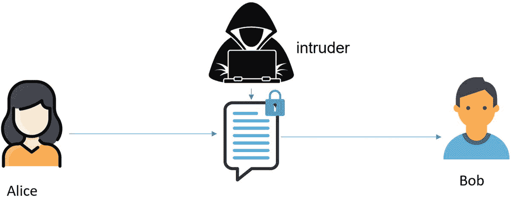
**图 2-1**：通过网络发送的信息

“Crypto”一词源自希腊语“kryptós”，意为“隐藏的或秘密的”。

“密码学”（Cryptography）意为“秘密书写”，允许有意愿的双方之间交换安全信息。

信息通过加密算法转换成称为“密文”的秘码等价物，以防止未经授权的访问。然后，密文通过公共网络发送，在接收端进行解密，接收方即可查看其内容。

在前面的例子中，爱丽丝使用密钥加密她的信息，将其转换为密文，并通过互联网发送给鲍勃。她无需担心黑客获取她的私人信息。要阅读密文，黑客必须使用解密密钥。当鲍勃收到这条密文信息时，他可以用密钥通过解密来恢复原始的明文。

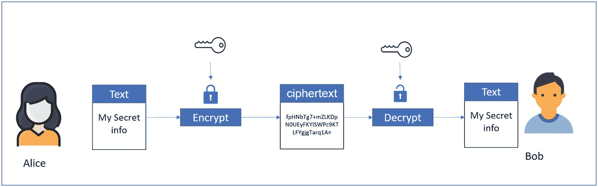
**图 2-2**：通过互联网进行的信息加密

密码学主要分为三类：对称密钥密码学、非对称密钥密码学以及无密钥原语（例如哈希函数）。

### 对称密钥密码学

对称密钥密码学是一种密码学算法，它使用发送方和接收方之间共享的密钥来加密和解密数据。这个秘密密钥被称为对称密钥。

在前面的例子中，爱丽丝和鲍勃共享相同的密钥。爱丽丝使用密钥加密信息，当鲍勃读取信息时，该密钥被用于解密过程。这展示了对称加密的工作原理。

对称加密通常比非对称加密更高效。因此，它常用于大量数据的加密、个人数据的加密和解密。

虽然有多种对称算法，但第一个美国标准是 `DES`。

对称密钥密码学可以使用流密码或分组密码来加密数据。在大多数情况下，使用流密码是加密数据的首选方式。

#### 流密码

流密码每次加密一位或一个字节的明文信息，形成一种单字符输入、单字符输出的密码。它对数据流中的每个二进制位应用随机密钥流和 `XOR`（异或）运算。

`XOR` 是一种布尔逻辑运算，被称为“异或”。当两个输入中仅有一个为真时，结果为真。如果两个输入均为真或均为假，则 `XOR` 运算的输出为假。

`XOR` 逻辑的真值表如表 2-1 所示，其中 0 表示假（FALSE），1 表示真（TRUE）。

**表 2-1** `XOR` 真值表

|   | 输入 | 输出 |
| --- | --- | --- |
| **A** | **B** | **A XOR B** |
| 0 | 0 | 0 |
| 0 | 1 | 1 |
| 1 | 0 | 1 |
| 1 | 1 | 0 |

因此，如果比特 A 为 `11000101`，比特 B 为 `10100110`，则当对这两个二进制位应用 `XOR` 运算时，输出结果如下所示：

```
  11000101 (A)
XOR     10100110 (B)
输出  01100011
```

密钥流字符可以是任意字母或数字的随机组合。假设我们有一串明文字节流（`p1`、`p2`、`p3`、...、`pi`），而密钥流生成器输出一串字节流（`k1`、`k2`、`k3`、...、`ki`）。为了加密密文字节流，需要对每个明文字节和密钥字节应用 `XOR` 运算，以生成并加密密文字节流（`c1`、`c2`、...、`ci`）。这可以用以下公式表示：

`c1 = p1 XOR k1`，...，`ci = pi XOR ki`

图 2-3 展示了流密码加密过程。`P1` 是 `00110101`，`K1` 是 `11100011`。通过 `XOR` 运算，加密后的密文结果为 `11010110`。

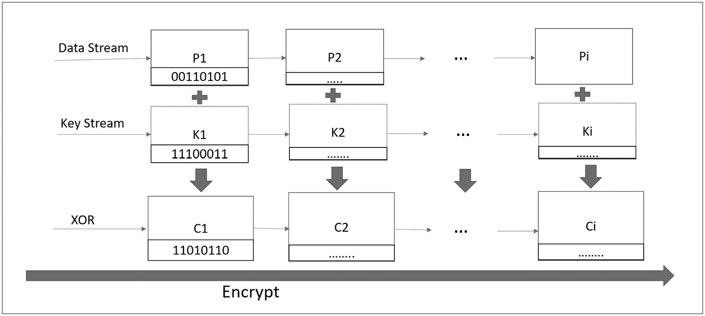
**图 2-3** 流密码加密
```
  00110101 (明文)
XOR     11100011 (密钥)
输出  11010110 (密文)
```

要解密密文字节，我们对密文和密钥应用 `XOR` 运算。输出结果将得到原始的明文字节。此运算可以用 `pi = ci XOR ki` 表示：

```
  11010110 (密文)
XOR     11100011 (密钥)
输出  00110101 (明文)
```

#### 分组密码

分组密码与流密码的主要区别在于，分组密码将固定大小的明文字节块视为一个单元，并将该块数据加密为密文字节。通常，块大小与密钥大小相同。

假设我们有一个明文字节块 `p` 和密钥字节 `k`。要加密密文字节块 `c`，我们需要使用密钥对明文进行加密：`c = encrypt(p, k)`；并通过使用密钥对密文进行解密来恢复明文：`p = decrypt(c, k)`。

每个块的大小相等。假设输入大于块的数量，例如输入大小为 38 位，块大小为 6 位。经过 6 个块后，将剩余 2 位（38 – 6 * 6 = 2）。在这种情况下，我们通常会添加填充（两个 0），并将其附加到块的末尾。

图 2-4 展示了一个分组密码加密示例。明文被分成 `n` 个块（`p[n]`），每个块使用相同的密钥加密成密文。加密过程将从第一个块开始，到最后一个块结束，最终所有块数据都将被加密。

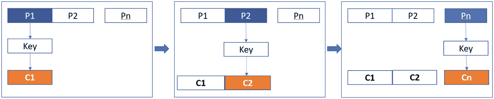
**图 2-4** 分组密码加密

最常用的分组密码类型包括高级加密标准（`AES`）、数据加密标准（`DES`）和三重数据加密标准（`3DES` 或 `TDEA`）。

## 非对称密钥密码学

对称密码学比非对称密码学相对更简单、更快，只需要一个密钥。它通常用于大数据加密/解密以及银行交易的机密性保护。对称密码学在数据加密之前必须共享相同的密钥。在前面的例子中，当爱丽丝需要向多人发送私密消息时，情况就变得复杂了。如果爱丽丝使用对称密钥（`K`）加密所有这些消息，并将此密钥与鲍勃及其他所有人共享，那么存在很大风险，即有人可能在爱丽丝不知情的情况下秘密地将 `K` 的副本提供给他人。在这种情况下，整个通信渠道将受到威胁，许多非预期的用户可以读取和修改消息，并将其发送给任何其他成员。为了避免这种安全风险，爱丽丝必须考虑为每个消息接收者创建大量不同的密钥，但这样一来，爱丽丝将不得不记住所有的密钥。她需要打电话给朋友们，或者通过可信渠道进行面对面会议来分发密钥。因此，对称密码学在处理众多参与者时很快就会变得不太实用。这个问题在很长一段时间里影响了行业中加密技术的使用，但在 1976 年，迪菲和赫尔曼引入了公钥加密的概念，也称为非对称密码学^(¹)。

### 公钥和私钥

惠特菲尔德·迪菲和马丁·赫尔曼描述了公钥加密的工作原理：两个通信方通过不安全的信道交换信息，使用由公钥和私钥组成的密钥对。

私钥只有其所有者知晓，而公钥被视为公开信息，任何人都可以获得。每个密钥都有特定的设计用途。

公钥用于加密消息并将其转换为密文。私钥用于解密使用公钥加密的消息。

#### Diffie-Hellman 算法的工作原理

Diffie-Hellman 算法基于一个数学原理，并使用以下公式：

`g^a (mod p)`

模运算是除法运算的余数。例如，`5 mod 3 = 2`，因为 2 是余数。模也可以用 `%` 表示。

以 `p`、`g` 为质数，`g` 是模 `p` 的一个原根。`g` 和 `p` 是公开的，任何人都可以看到并使用。

在数学中，如果一个整数 `g` 的幂次模 `n` 可以生成所有与 `n` 互质的整数，那么这个 `g` 就是模 `n` 的原根。

例如，`2` 是模 `5` 的一个原根，所有与 `5` 互质的数是 `1`、`2`、`3` 和 `4`；而这些数（模 `5`）的结果就是它们自身，意味着 `2 (mod 5) = 2`：
* `2⁰ = 1`，`1 (mod 5) = 1`，所以 `2⁰ ≡ 1`
* `2¹ = 2`，`2 (mod 5) = 2`，所以 `2¹ ≡ 2`
* `2³ = 8`，`8 (mod 5) = 3`，所以 `2³ ≡ 3`
* `2² = 4`，`4 (mod 5) = 4`，所以 `2² ≡ 4`

现在，我们来看一下 Diffie-Hellman 算法是如何工作的。让我们用一个简单的例子来理解密钥交换算法。假设爱丽丝和鲍勃想要交换信息。现在，假设有一个名叫伊芙的黑客正在试图拦截消息。

**步骤 1 –** 爱丽丝和鲍勃同意，所有消息都需要通过公式 `g^a (mod p)` 进行计算，其中使用模数 `p = 13` 和底数 `g = 6`。爱丽丝和鲍勃各自选择一个只有自己知道的秘密数字。然而，这个公式以及数字 `g` 和 `p` 对所有人都是公开的。

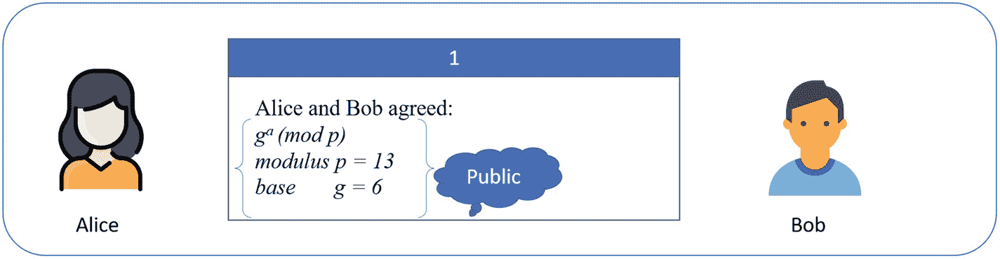
**图 2-5** 爱丽丝和鲍勃商定公共值

**步骤 2 –** 爱丽丝选择一个秘密随机数（`a = 5`）作为她的私钥，鲍勃选择他的私钥（`b = 4`）。

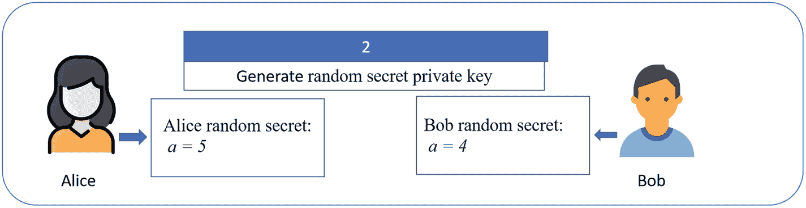
**图 2-6** 爱丽丝和鲍勃的秘密密钥

**步骤 3 –** 然后，爱丽丝和鲍勃将使用该公式，利用 `p` 和 `g` 参数以及他们的私有值来计算公共值。

爱丽丝将使用以下公式进行计算：
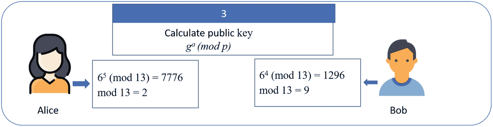
**图 2-7** 爱丽丝和鲍勃计算公共值

`6⁵ (mod 13) = 7776 mod 13 = 2`

鲍勃将使用以下公式进行计算：
`6⁴ (mod 13) = 1296 mod 13 = 9`

**步骤 4 –** 爱丽丝通过互联网将她的计算结果（`2`）发送给鲍勃。伊芙可以看到这个值。鲍勃将他的计算结果（`9`）发送给爱丽丝，伊芙也可以看到这个值。

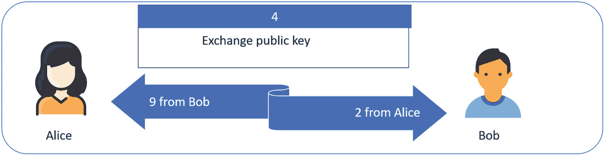
**图 2-8** 爱丽丝和鲍勃相互发送各自的结果

**步骤 5 –** 爱丽丝和鲍勃都收到了对方的公共消息，他们通过公式 `g^a (mod p)` 计算出了共享密钥。

在这一步中，`g` 是从对方收到的公共消息。

爱丽丝将使用以下等式进行计算：
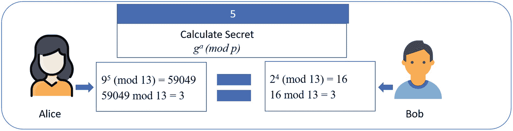
**图 2-9** 爱丽丝和鲍勃得到相同的值

`9⁵ (mod 13) = 59049 mod 13 = 3`

鲍勃将使用以下等式进行计算：
`2⁴ (mod 13) = 16 mod 13 = 3`

爱丽丝和鲍勃都得到了相同的值。

伊芙是一名黑客。她拦截了爱丽丝和鲍勃之间发送的消息。伊芙可以看到公共值（`g^a (mod p)`），`g` 是什么，她可以看到 `p` 是什么，并且她知道爱丽丝和鲍勃计算出的结果。然而，伊芙不知道爱丽丝和鲍勃选择的秘密数字，而且她很难找到这些数字。

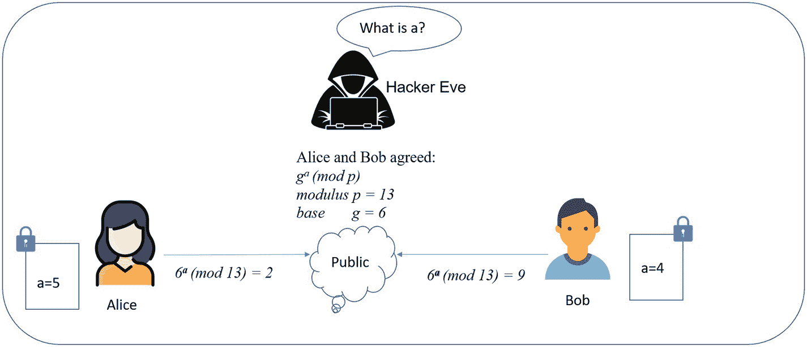
**图 2-10** 黑客伊芙不知道爱丽丝和鲍勃的秘密值

从 Diffie 和 Hellman 的例子中，我们可以看到，爱丽丝和鲍勃都通过以下等式计算得到了相同的结果：
`(g^a (mod p))^b mod p = (g^b (mod p))^a mod p`

共享密钥是 `g^(ab)`。通常，`a`、`b` 和 `p` 的值会大得多。这是确保结果安全所必需的。

在 Diffie 和 Hellman 最初的描述中，该算法不提供通信方的身份验证。这导致该算法容易受到中间人攻击。

看下面的例子：
伊芙拦截了爱丽丝和鲍勃之间的消息，并阻止他们之间的通信。
伊芙拦截了爱丽丝的公共值（`g^a(mod p)`），并向爱丽丝发送她自己的公共值（`g^c(mod p)`）。
伊芙拦截了鲍勃的公共值（`g^b(mod p)`），并向鲍勃发送她自己的公共值（`g^d(mod p)`）。
爱丽丝和鲍勃都无法发现任何问题，他们可能都认为对方已经收到了自己的消息，但实际上，伊芙可以解密、读取、修改并重新加密他们的所有消息。

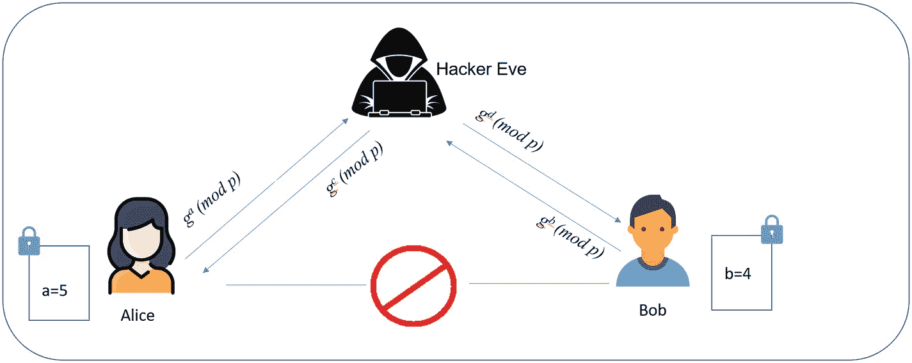
**图 2-11** 中间人攻击

Diffie 和 Hellman 是第一个非对称密码学协议，并为许多认证协议（如现今广泛使用的椭圆曲线 Diffie-Hellman 非对称算法和 `RSA`）奠定了基础。加密技术、安全外壳协议（`SSH`）、安全套接层协议（`SSL`）、电子邮件和 `VPN` 安全都基于这些非对称算法。

## 数字签名的工作原理

如果爱丽丝想要通过互联网向鲍勃发送一条经过签名的消息，应遵循以下步骤：
1. 我们从爱丽丝（发送方）的消息开始。
2. 该算法基于文档的校验和生成消息的单向哈希值。
3. 使用爱丽丝的私钥对该哈希值进行签名或加密。
4. 将消息发送给鲍勃。
5. 鲍勃接收消息。
6. 鲍勃使用爱丽丝的公钥解密消息，并验证由爱丽丝签署的消息的认证性。
7. 该算法重新生成消息的哈希值。
8. 比较两个哈希值。如果它们相同，我们就能确保传输的文档自签名后未被篡改。

数字签名的过程如图 2-12 所示。

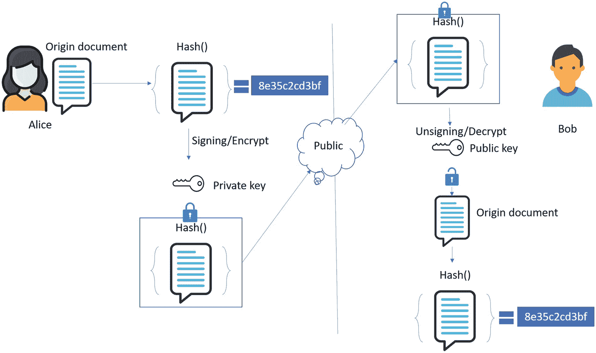
**图 2-12** 数字签名的过程

### 数字签名

数字签名是一种非对称公钥密码学技术，用于验证数字消息或文档所有者的真实性。

在公钥加密中，我们通常使用公钥加密消息，使用私钥解密消息。然而，在数字签名中，消息是用发送者的私钥加密的，换句话说，就是对消息进行签名。

由于签名者的公钥是公开的，任何人都可以验证消息的数字签名。

数字签名包含以下特征：
* **身份认证**（验证谁签署了文档的源）
* **不可否认性**（签名者的身份及其数字签名的文档应是不可抵赖的）
* **完整性**（证明文档自签名后未被更改）

# 哈希算法

在第 1 章的“区块链如何工作”部分，介绍了哈希的概念，并讨论了区块链如何使用 `SHA-256` 哈希函数对交易数据进行哈希处理。在上一节中，讨论了数字签名的过程。该过程表明需要应用哈希函数。

哈希算法是一种数学函数，它将原始数据输入分割成大小相等的较小块，然后对两个固定大小的数据块执行哈希函数以生成哈希码。该算法从消息数据的第一个块开始，使用一个种子值传入哈希函数，输出第一个哈希码。

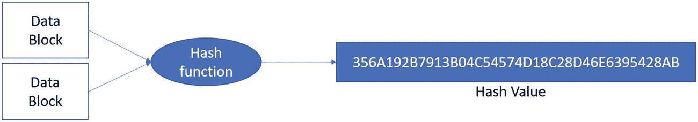

一幅插图演示了两个数据块的算法代码生成一个哈希函数。它给出了哈希值 `356A192B7913B04C54574D18C28D46E6395428AB`。

**图 2-13**
用于生成哈希码的两个固定大小的数据块

该过程类似于上一节讨论的分组密码。哈希过程将从第一个块开始，到最后一个块结束。根据算法的要求，这个过程可以重复任意多轮。最终，所有块数据将被链接在一起并进行哈希处理。

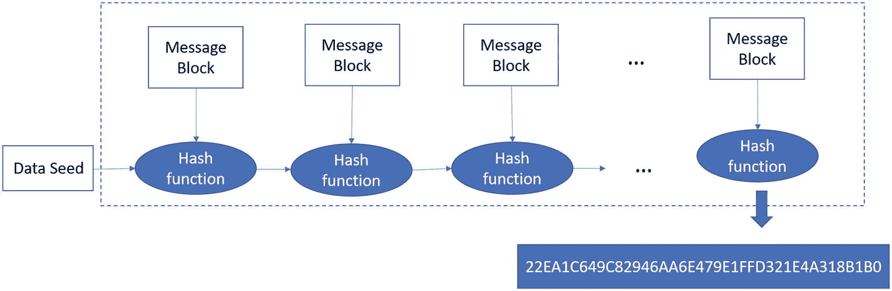

哈希算法的流程图。标记的流程包括数据种子、消息块和哈希函数。该过程持续进行，直到得到哈希值。

**图 2-14**
哈希算法

## Keccak-256 算法

`Keccak-256` 算法是一种在以太坊区块链中广泛使用的哈希函数。一些例子包括以太坊地址、某些智能合约函数，以及被称为 `Ethash` 的以太坊共识引擎，它在区块生产和其他安全操作中扮演着重要角色。

`Keccak-256` 是 `SHA-3` 哈希函数家族的一员。函数输入可以是可变长度的字符串或数字，生成的输出始终是固定长度的 64 个字符（字母和数字）的输出。该输出可以转换为十六进制数字。与所有其他哈希函数一样，它是一个单向加密哈希函数。

`Keccak-256` 基于海绵结构，是海绵函数家族的一员。`Keccak-256` 海绵函数（`Keccak[r,c]`）需要两个参数：一个大小为 `r`（比特率，即单位时间内编码的数据量）和另一个大小为 `c`（容量）。

**填充**
填充函数会向输入数据（`M`）追加足够的比特，使得填充后的输入长度可以被分割成多个 `r` 比特的块。

**初始化**
填充后的输入被分解成 `r` 比特的块，假设这些块分别命名为 `M0`、`M1`、`M2` 等等。

**吸收阶段**
将 `r` 比特的块与输入数据 `M0` 的小块进行 `XOR` 运算。结果随后被传递给压缩函数 `f`。函数 `f` 的输出与下一条消息 `M1` 进行 `XOR` 运算。重复此过程，直到每个消息块 `Mn` 都被处理完。在每一步中，一小块输入数据（`r` 的比特长度）被“吸收”到缓冲区中。

**挤压阶段**
重复相同的过程。缓冲区的 `r` 比特块构成输出的下 `r` 比特（`Z0`、`Z1`、`Z2` 等等）。使用函数 `f` 提取 `r` 比特的数据作为输出的下 `r` 比特。重复此过程，直到生成结果。

图 2-15 展示了 `Keccak-256` 哈希算法。

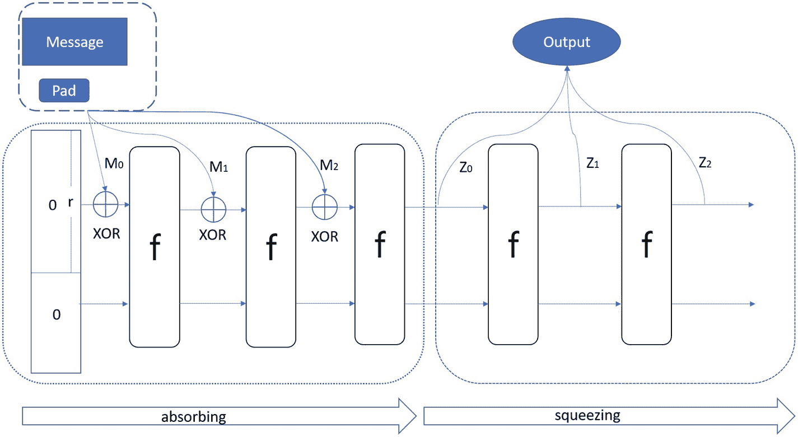

一幅算法图展示了 `Keccak-256` 哈希值，通过吸收和挤压两个过程。标记的过程包括消息、填充和输出。

**图 2-15**
`Keccak-256` 哈希算法

# 椭圆曲线密码学（ECC）

ECC 由维克多·米勒（IBM）和尼尔·科布利茨（华盛顿大学）于 1985 年独立发现，目前是最稳健且应用最广泛的加密密码类型之一。区块链网络，如比特币和以太坊，都使用了 ECC。

2005 年，美国国家安全局（NSA）公布了一套未公开的算法，称为 B 套件协议，并发布了一篇题为“椭圆曲线密码学的案例”的论文，其中建议美国政府使用 ECC 来保护敏感的非机密通信。^(²)

NSA 评论称，分析师应“利用过去 30 年的公钥研究和分析成果，从第一代公钥算法转向椭圆曲线。”

B 套件的协议包括用于密钥交换的椭圆曲线迪菲-赫尔曼（ECDH）和椭圆曲线 Menezes-Qu-Vanstone（ECMQV）、用于数字签名的椭圆曲线数字签名算法（ECDSA）、用于对称加密的高级加密标准（AES）以及安全哈希算法（SHA）。在这些协议发布后，ECC 很快成为保护现代工业通信的事实标准。

ECC 基于椭圆曲线的代数性质，与其他非对称密码系统（如 RSA 或 DSA）相比，能以更小的密钥大小提供等效的安全性。例如，一个 256 位的 ECC 密钥与一个 3072 位的 RSA 密钥具有同等强度。这也使得椭圆曲线速度显著更快。

## 什么是椭圆曲线？

椭圆曲线是通过以下方程给出的一条曲线：

`y² = x³ + Ax + B`

该曲线按要求是非奇异的，且不能有重根或自交点。为了确保曲线是非奇异的，可以通过以下方程来表示该条件：

`4A³ + 27B² ≠ 0`

当 `A = -1` 且 `B = 1` 时，椭圆曲线的一个示例如图 2-16 所示：

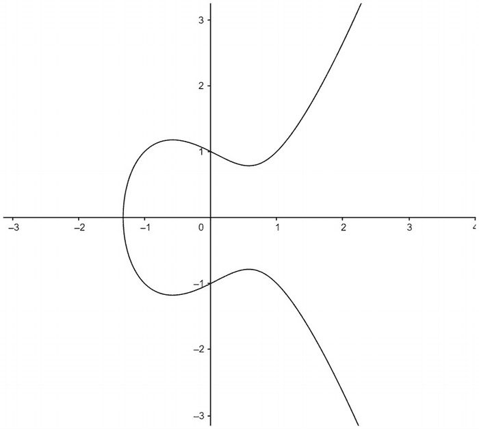

一条曲线图描绘了方程 `y² = x³ - x + 1` 的椭圆。曲线从点负 3 开始，在负 1.5 处弯曲，并在大约 3 处结束。

**图 2-16**
椭圆曲线 `y² = x³ - x + 1`

`y² = x³ - x + 1`

在椭圆曲线上，有一个有用的性质可以创建曲线上的加法，使其成为一个阿贝尔群。取曲线上的两点 `P` 和 `Q`，并画一条穿过它们的直线。该直线将与曲线相交于另一点（`R`）。将 `P + Q` 视为 `R`，然后从 `R` 出发，可以画另一条直线（如果 `R` 位于 x 轴下方则向上，如果 `R` 位于 x 轴上方则向下）到达曲线的另一侧，与点 `-R` 相对（见图 2-17）。

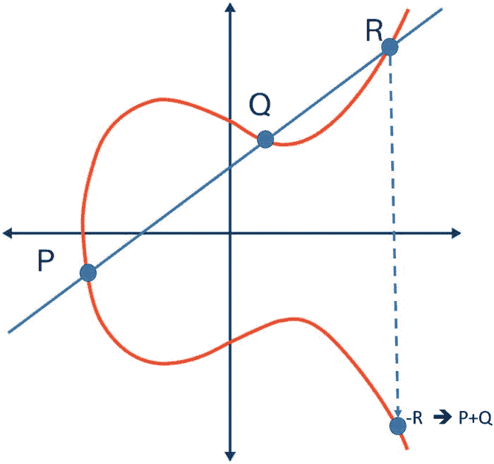

一条曲线图描绘了椭圆上两点 `R` 和 `-R` 的加法。曲线穿过经过 `P`、`Q` 和 `R` 的轴线。结果由 `-R` 表示 `P + Q` 计算得出。

**图 2-17**
椭圆曲线上两点的加法（`R` 和 `-R`）

椭圆曲线的群律通过以下任一方程表示：

`P + Q + R = 0`，或 `P + Q = -R`

点 `P` 和 `Q` 的和等于点 `-R`。

通过对椭圆曲线的点 `P = (x[1], y[1])` 和 `Q = (x[2], y[2])` 进行加法运算，可以使用以下公式计算第三个点：

`P + Q = R = (x[3], y[3])` 其中

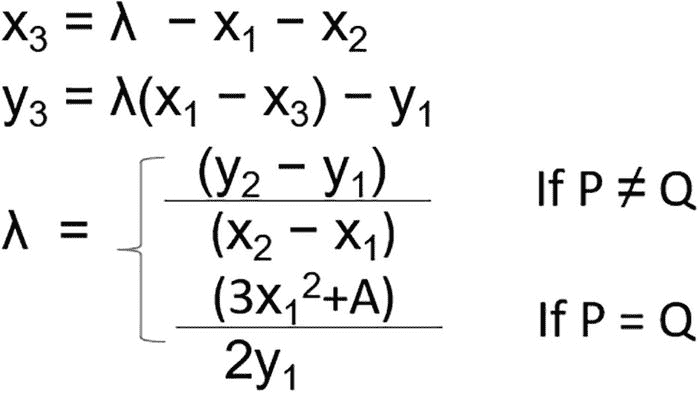

`x[3]` 和 `y[3]` 的方程。当 `P ≠ Q` 和 `P = Q` 时 lambda 的值。

在 `Z[p]` 上的椭圆曲线 `E` 由以下方程定义，其中 `Z[p]` 是模 `p` 的域，即 `{0, 1, 2, …, n - 1}`：

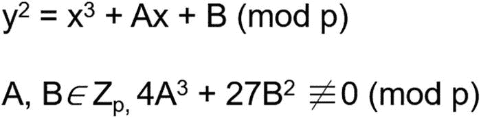

一个公式描述了 `y² = x³ + Ax + B` 的模 `p` 方程，且 `A, B ∈ Z[p]`，`4A³ + 27B² ≠ 0`。

通过应用此公式，在 `Z[p]` 上的椭圆曲线 `E` - `E(Z[p])` 有一组点 `(x, y)`。在以下示例中，椭圆曲线 `y² = x³ + Ax + B = x³ + 2x + 3 → y² (mod 5)`，其中 `A = 2`，`B = 3`，且 `P = 5`。这可以通过以下内容看出：

-   `X = 0 → y² = 3 → 无解 (mod 5)`
-   `X = 1 → y² = 6 → 6 (mod 5) = 1`
    -   `→ y = 1, 4` 因为 `1² (mod 5) = 1`，且 `4² (mod 5) = 1`
-   `X = 2 → y² = 15 → 15 (mod 5) = 0`
    -   `→ y = 0` 因为 `0² (mod 5) = 0`
-   `X = 3 → y² = 36 → 36 (mod 5) = 1`
    -   `→ y = 1, 4` 因为 `1² (mod 5) = 1`，且 `4² (mod 5) = 1`
-   `X = 4 → y² = 75 → 75 (mod 5) = 0`
    -   `→ y = 0` 因为 `0² (mod 5) = 0`

于是，该椭圆曲线有以下七个点：

`(1, 1)`，`(1, 4)`，`(2, 0)`，`(3, 1)`，`(3, 4)`，`(4, 0)`，`∞`。

现在，重新排列模运算符 `P = 263` 得到以下方程：

`(x³ + 2x + 3) (mod 263)`

在模 263 下椭圆曲线 `y² = x³ + 2x + 3` 上的标量乘法。该曲线有 270 个点，包括无穷远点。

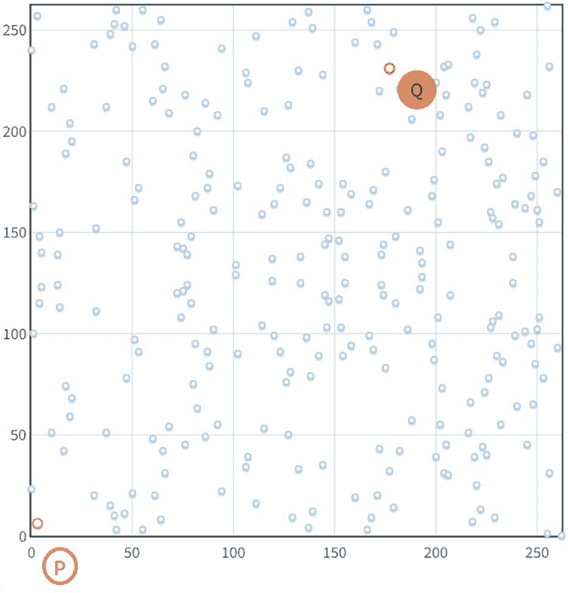

一个点图描绘了方程 `y² = x³ + 2x + 3` 的椭圆曲线，将点表示为 `Q` 和 `P`。两个坐标轴范围均为 0 到 250。

**图 2-18**
椭圆曲线 `y² = x³ + 2x + 3 (mod 263)`

在椭圆曲线中，如果 `P = (x, y) ∈ E(Z[p])`，则 `(x, y) + (x, -y) = ∞`（无穷远点）。

因此，如果将 `∞` 加到 `E(Z[p])` 中的任意点 `P` 上，总能得到 `P` 本身。这可以通过以下方程表示：

`P + ∞ = ∞ + P = P` 对于所有 `P ∈ E(Z[p])`

在爱丽丝和鲍勃的消息通信中，`P` 是曲线上鲍勃和爱丽丝都将同意的 `(x, y)` 点。鲍勃的私钥由 `n` 表示，`K` 是他的公钥。我们将 `P` 和 `n` 相乘得到 `K`，如下所示：

`K = n P`

如果将 `K` 与 `P` 相乘，将得到曲线上的点。

## 推导以太坊地址

到目前为止，我们已经学习了密码学知识。现在，是时候进行一些实践，将所学知识应用到生成以太坊地址上。我们将使用多个在线工具来完成这个练习。当然，如果你找到了更好的工具，也可以选择不同的工具，甚至可以编写代码来实现相同的结果：

1.  创建一个随机私钥，并使用椭圆曲线（`secp256k1`）从该私钥推导出公钥。

    私钥长度为 64 个十六进制字符（32 字节）。

    这里我们使用在线工具（[`kjur.github.io/jsrsasign/sample/sample-ecdsa.html`](https://kjur.github.io/jsrsasign/sample/sample-ecdsa.xhtml)）来获取一对公私钥。生成的公私钥对如图 2-19 所示。

    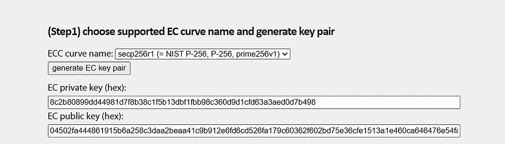

    一个算法展示了所选椭圆曲线名称支持的椭圆曲线，并生成了密钥对。该过程生成了两个密钥：EC 私钥和 EC 公钥。

    **图 2-19** 椭圆曲线生成公私钥

    私钥：`8c2b80899dd44981d7f8b38c1f5b13dbf1fbb98c360d9d1cfd63a3aed0d7b498`

    公钥：`04502fa444861915b6a258c3daa2beaa41c9b912e6fd6cd526fa179c60362f602bd75e36cfe1513a1e460ca646476e54fab08aa42730068326ab0a8a2e57d2829b`

2.  从以下公钥推导出地址：

    从公钥（128 个字符）开始，对公钥应用 `Keccak-256` 哈希。它将生成一个长度为 64 个字符（32 字节）的字符串。让我们使用 `Keccak-256` 在线工具（[`emn178.github.io/online-tools/keccak_256.html`](https://emn178.github.io/online-tools/keccak_256.xhtml)）查看哈希结果（见图 2-20）。

    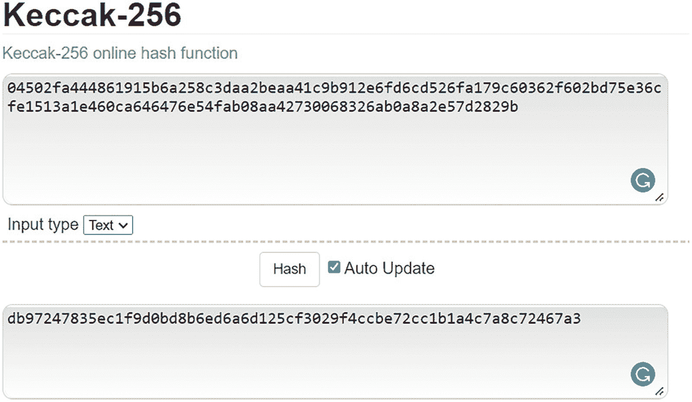

    两个算法展示了地址和 `Keccak-256` 在线哈希函数的推导过程。标记的键分别是输入类型、哈希和自动更新。

    **图 2-20** `Keccak-256` 哈希公钥示例

    结果是 `db97247835ec1f9d0bd8b6ed***6a6d125cf3029f4ccbe72cc1b1a4c7a8c72467a3***`

3.  获取以太坊地址

    取生成的哈希值的最后 20 个字节（40 个字符），并添加前缀 `0x` 以得到以太坊地址。`0x` 让其他人知道该地址是十六进制格式。加上 `0x` 前缀后，它变为 42 个字符长。因此，在我们的示例中，以太坊地址是

    `0x6a6d125cf3029f4ccbe72cc1b1a4c7a8c72467a3`

4.  验证以太坊地址

    我们使用一个在线以太坊地址验证工具（[`www.rfctools.com/ethereum-address-validator/`](http://www.rfctools.com/ethereum-address-validator/)）来验证我们新生成的以太坊地址。

    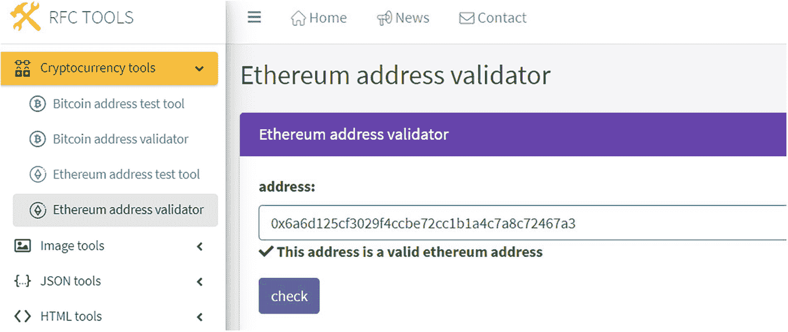

    一个有效的以太坊地址验证器的截图。标记的 RFC 工具包括加密货币工具、4 步工具、图像工具、JSON 工具和 HTML 工具。

    **图 2-21** 验证生成的以太坊地址

恭喜！我们刚刚利用密码学知识生成了一个有效的以太坊地址。通过这部分内容，你应该对区块链密码学的工作原理有了良好的理解。

## 本章小结

密码学是保障区块链技术安全的重要机制。它用于保护区块链的共识机制、保障区块链数据安全、确保用户账户安全等。本章的主要目的是通过快速概述密码学的工作方式，让你对其有更透彻的理解。

尽管本章仅触及密码学技术的表面，但它将帮助你丰富对称密钥密码学和非对称密钥密码学的知识。更重要的是，我们现在知道了数字签名是如何工作的。我们介绍了哈希算法，并逐步讲解了椭圆曲线密码学来理解其工作原理。最后，我们学习了如何生成一个以太坊地址。

我们将继续我们的旅程，在下一章学习未来的货币——比特币。

脚注 1 2

# 比特币：未来的货币

从发明硬币作为支付方式的古吕底亚人，到中国的第一张纸币，货币和支付已经经历了几个世纪的演变。2008 年，一个化名为中本聪的匿名人士或团体发表了一篇题为《比特币：一种点对点的电子现金系统》的白皮书。自此，比特币（BTC）开启了去中心化数字货币和区块链技术的新纪元。因此，数字货币近年来人气爆棚。目前约有 20,000 种加密货币，总市值接近 1.2 万亿美元。作为最早且最有价值的加密货币，比特币占据了整个加密货币市场约 45%的份额。第二大加密货币是以太坊，其市值占比为 16%。比特币的价格多年来一直波动，但长期来看总体呈上涨趋势。2021 年 11 月，比特币达到了历史最高价 68,789.63 美元。

作为一种新的支付技术发明，比特币是一种稀缺资源，因为区块链上总共只能挖出 2100 万个比特币。这种稀缺性，加上供需等其他因素，赋予了比特币价值，并且比特币将继续作为所有加密货币中的数字黄金。

前面的章节是介绍区块链基础知识的绝佳起点，我们涵盖了许多基本概念，如密码学、工作量证明共识算法以及区块链的工作原理。在本章中，我们将继续探索比特币。我们将涵盖以下具体主题：

-   比特币历史

-   了解比特币

-   交易

-   闪电网络

## 比特币历史

截至 2022 年 7 月，比特币拥有超过 1.06 亿持有者，每日确认的活跃交易量为 19.9 万笔。大约有 3400 万美国成年人和全球 10%的人口持有加密货币。近年来，加密货币的普及度飞速增长。然而，如果要说一种你必须首先了解的加密货币，那就是比特币，大多数人在谈论数字货币时通常指的就是它。作为世界上第一种加密货币，比特币并非首个试图创建全新数字货币金融体系的项目。在其诞生之前，许多项目都曾尝试构建数字货币和/或电子支付系统。其中，DigiCash 和 HashCash 这两个项目对比特币的启发最大。

### 早期尝试

大卫·乔姆在 1982 年的 CRYPTO 会议上发表了一篇名为《用于不可追踪支付的盲签名》的论文。盲签名描述了一种如何利用新型数字签名来保护数字现金用户隐私的方法。

为了阐释盲签名过程，大卫以电子投票系统为例，展示了选举投票中心应如何验证所有选票。

在验证过程中，选民的选择隐私信息必须受到保护。除选民本人外，无人知晓其选择。盲签名的过程描述如下：
1. 选民将填写完毕的匿名盲选票放入一个内衬复写纸的信封中，信封外预先印有选民的标识信息。
2. 官员验证文件凭证。
3. 官员在不知晓信息内容的情况下对盲选票进行签名。
4. 签名完成后，信封被返还给选民。
5. 选民将已签名的选票放入一个新的、无标记的普通信封中。
6. 通过这种方式，选民的匿名性和隐私得以保护。

该流程如图 3-1 所示。

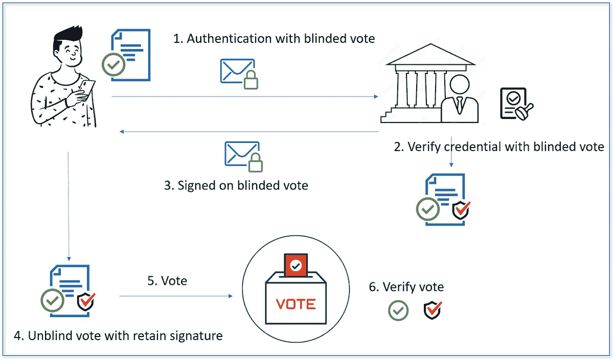

图示描绘了 6 个投票步骤：使用盲选票进行身份验证、验证盲选票凭证、对盲选票签名、解除盲选票、投票、验证投票。

**图 3-1** 盲签名示例

七年后，大卫·乔姆在阿姆斯特丹创立了 `DigiCash` 公司。数字现金，也称为 `DigiCash`、`eCash` 或 `EMoney`，是第一种数字匿名货币。1994 年，`DigiCash` 证明了可以通过互联网进行小额支付。不幸的是，大卫·乔姆及其公司遭遇了许多问题，导致公司于 1998 年申请破产，其革命性的`eCash`也随之终结。

随着互联网在 20 世纪 90 年代日益普及，许多公司迅速认识到它是一个极好的广告工具。甚至在 1997 年末，电子邮件垃圾邮件已经成为每个拥有电子邮件账户的人严重关切的问题。任何人都可以几乎零成本地发送数千万封邮件，广告公司可以使用群发邮件软件每天发送大量邮件。电子邮件炸弹，一种针对电子邮件服务器的拒绝服务攻击（`DoS`），始于 20 世纪 90 年代末，并常导致网络中断。

亚当·巴克在 1997 年创建了 `HashCash`，并使用工作量证明（`PoW`）算法来防止垃圾邮件和 `DoS` 攻击。它对比特币产生了至关重要的影响，并被用于比特币的交易中。在比特币白皮书中，中本聪引用 `HashCash` 系统作为比特币中工作量证明实现的参考：

> 为了在点对点的基础上实现分布式时间戳服务器，我们需要使用一个类似于亚当·巴克的 `HashCash` 的工作量证明系统，而不是报纸或 Usenet 帖子。

`HashCash` 的工作量证明相对直接。

首先，邮件服务器选择一个难度级别来指定 `PoW` 必须达到的难度。`HashCash` 启用的 `SHA-1` 哈希摘要的工作量证明以二进制中默认的 20 个前导零开头。

`SHA-1`是一种密码哈希函数，它接受输入并产生一个 160 位的值。可能的哈希值总共有`2¹⁶⁰`个。如果我们让前 30 位为 0，发送者必须尝试`2³⁰`个不同的二进制计数器来找到一个具有 30 个前导零位的哈希值。前导零位越多，找到有效哈希值的难度就越大，解决所需的时间也就越长。

十六进制中的单个前导零相当于二进制中的四个 0。我们可以使用在线 `SHA-1` 工具和暴力破解方法，以`"Hashcash!"`为输入来生成单个前导零。我们从 0 开始依次尝试。以下是尝试不同输入的结果。

**表 3-1** 生成十六进制中的单个前导零

| 十六进制值 | 输入文本 |
| --- | --- |
| `64a0565c8ef97e847d444c6961086c2ccdad9052` | `Hashcash!00` |
| `6e7072540d426f7bdc3d589dfd73aeac0e3050a9` | `Hashcash!01` |
| `0e4895d7a9ef022e313d72a1c5636e51a2f8dca` | `Hashcash!02` |
| `cf4d1b9d11cef8f1067e6e43b5593439fb412df9` | `Hashcash!03` |
| `e2185e4362440d1a9f41f58f50032097f195aeb1` | `Hashcash!04` |
| `05e82b6afcf3f6a4a81ba01cf9c6e44c2e16e244` | `Hashcash!05` |

正如我们所见，仅仅为了猜出单个前导零，我们就需要尝试六次。想象一下，默认 20 个前导零，而前导 0 为 5（`2⁵`）则需付出多得多的计算量。

为了解决这个 `PoW`，发送者需要不断尝试不同的输入，直到找出包含正确前导零数量的 `HashCash` 头部。然后，发送者才能向收件人发送邮件。

当收件人收到一封电子邮件时，它首先检查包含所需前导零位数且有效的 `HashCash` 头部。收件人只需计算一次哈希值，然后将其保存到数据库中。当收到新邮件时，只需与数据库中的先前头部版本进行比较即可。因此，验证一个邮戳所需的时间远少于找到一个有效邮戳的时间。如果邮件验证失败，它将被移至垃圾邮件文件夹。

### 2008 年金融危机

在 20 世纪 90 年代末到 21 世纪初，美国经济经历了强劲而稳定的增长、低失业率以及繁荣的股市。这得益于快速的技术变革以及中央银行联邦利率从 6.5%降至 1.75%。

联邦利率的大幅下降使银行和贷款机构能够以更低的价格提供消费信贷。在此期间，像次级抵押贷款这样的许多创新贷款产品有所增加。银行和贷款机构向许多信用记录不佳、资产少、收入不稳定或存在其他因素导致无法获得传统抵押贷款的房主提供低息抵押贷款。

随着这些高风险（次级）贷款大量涌入，放贷机构轻松地承担了所有风险的抵押贷款，危及了整个银行体系和全球经济。随着房价持续飙升，次级抵押贷款发展到了失控的程度，很大比例的抵押贷款出现违约，许多银行和贷款机构开始面临财务困难。2007 年 8 月，投资银行业巨头雷曼兄弟的股票因贝尔斯登的两只对冲基金倒闭而大幅下跌。2008 年 3 月，贝尔斯登破产，六个月后，雷曼兄弟申请破产。这场危机导致了经济大衰退，房价下跌超过 30%，数百万人失业，约 250 万家企业倒闭。美国家庭遭受的损失更为严重，估计净财富损失达 16 万亿美元。

这场危机动摇了人们对金融体系的信念和信任，这个体系是人们将资金存放在一个中央权威银行系统中的体系。中央政府机构可以印制更多钞票，因此政府印钞的数量没有限制。这将会降低系统中已流通货币的价值。中央银行依据现代货币理论（`MMT`）的原则发行货币。宽松的货币政策有时会导致人们资金价值下降方面的不可预测性和不确定性。

人们开始思考一种新的金融体系来克服常规货币的缺陷。新体系需要一种不依赖第三方（如中央权威银行）信任的货币。

### 比特币的诞生

2008 年 8 月，比特币项目的首批两位开发者中本聪和马尔蒂·马尔米注册了 `Bitcoin.org` 域名。2008 年 10 月 31 日，一个化名为中本聪的实体在 `Bitcoin.org` 上发布了一份题为《比特币：一种点对点电子现金系统》的白皮书。中本聪提出了一种利用点对点网络防止双重支付的解决方案。该系统引入了一种工作量证明共识算法，从而消除了对中心化银行或政府金库的需求。

在传统的中心化金融系统中，物理上不可能复制黄金，也无法将一盎司黄金复制成两盎司。这就是为什么黄金是一种价值储存手段，并且可以作为商品货币用于交换商品。

政府发行的纸币不易被复制。例如，要想复制一张美元钞票，需要专门的设备、正确的印钞纸，以及安全线和水印等多种其他材料。将纸币变成合法的法定货币，需要一个非常繁琐、安全且复杂的过程。

使用实物货币时，当你购买东西时，你会将黄金或纸币作为支付凭证交给对方。由于是实物交付，双方可以立即验证交易。资金从你一方转移到另一方，你无法重复花费同一笔钱。

双重支付是数字货币交易中的一个问题，因为数字货币或数字资产是一组可以被复制并发送给多个接收者的软件代码。中心化方法通常涉及一个审计者（例如银行），由其监督和控制货币的发行、分配和验证。因此，通常需要中心化权威机构做大量工作来保证不发生双重支付，这导致数字货币交易产生佣金成本。

2009 年 1 月 3 日，有史以来第一个比特币创世区块——0 号区块，由中本聪本人挖出，这代表了这种加密货币的生日。以下是来自 `blockchain.com` 的比特币创世区块详情链接：[`www.blockchain.com/btc/block/0`](http://www.blockchain.com/btc/block/0)。

该区块包含中本聪留下的一条信息。让我们找点乐子，看看它是什么，以及你如何自行验证这些信息。

打开上述创世区块链接，你会找到“交易”部分。点击哈希链接，它会导航到交易页面。在“输入”部分下，你应该能找到 `Sigscript` 数据，其十六进制值以 `5468652054696` 开头，如图 3-2 所示。

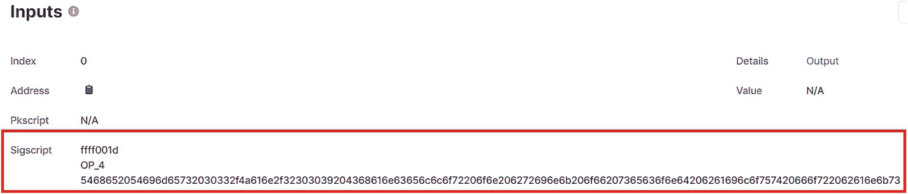

文本消息解释了输入信息，包括索引、地址、`p k script`、`sig script`、详情和金额。其中 `Sig script` 被高亮显示。

复制这个编码后的十六进制字符串。现在，前往在线十六进制解码器页面：[`https://cryptii.com/pipes/hex-decoder`](https://cryptii.com/pipes/hex-decoder)。解码这条来自中本聪的消息。

如果您操作正确，您的屏幕应如图 3-3 所示。

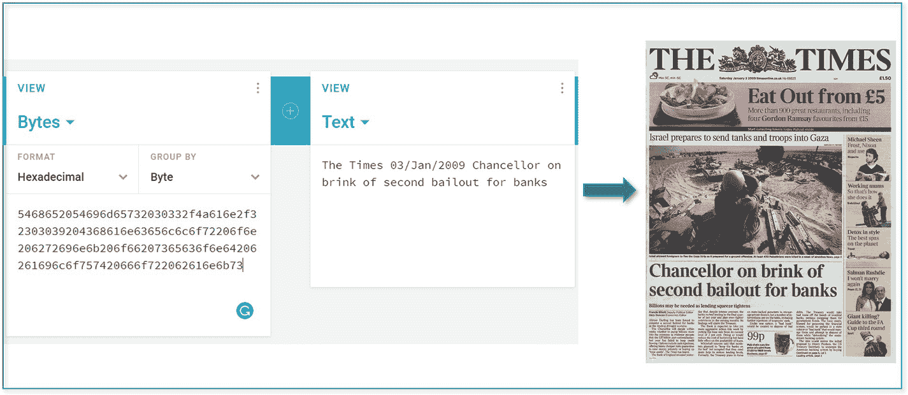

消息中显示了文本和字节，说明“财政大臣正处于第二次银行救助的边缘”这则新闻。

我们已经揭示了中本聪隐藏的信息。内容是：“The Times 03/Jan/2009 Chancellor on the brink of second bailout for banks。”（《泰晤士报》2009 年 1 月 3 日，财政大臣正处于第二次银行救助的边缘。）同样的文本也出现在比特币原始代码的第 1616 行注释中：

[`https://sourceforge.net/p/bitcoin/code/133/tree/trunk/main.cpp#l1613`](https://sourceforge.net/p/bitcoin/code/133/tree/trunk/main.cpp%2523l1613)

这条消息可能通过引用英国报纸《泰晤士报》关于政府巨额支出的报道，证明了区块时间是在当天挖出的。或者，它也可能表明大型中心化银行是中本聪眼中的问题。

创世区块包含了有史以来创造的第一笔 50 枚比特币，这笔奖励发往了中本聪的地址：`1A1zP1eP5QGefi2DMPTfTL5SLmv7DivfNa`。

2009 年 1 月 12 日，中本聪向哈尔·芬尼发送了 10 枚比特币，这是挖出第 70 号区块后的第一笔正式比特币交易。

### 早期发展

**比特币披萨日（2010 年 5 月）** – 2010 年 5 月 22 日，一位名叫拉斯洛·汉耶茨的比特币爱好者和程序员在加密货币论坛上发布了一条不同寻常的帖子，愿意用 10,000 枚比特币（据称当时价值 40 美元）换取两份棒约翰披萨。加州学生杰里米·斯特迪文特注意到了这个有趣的请求，卖给了拉斯洛·汉耶茨两份披萨，换取了 10,000 枚比特币。这是历史上第一笔用比特币进行的实物购买，每年的 5 月 22 日被定为比特币披萨日。


图 3-4：价值 10,000 枚比特币的两份棒约翰披萨

**首个比特币交易所（2010 年 7 月）** – 2010 年 7 月，`Mt. Gox` 在东京推出了首个加密货币交易所，该交易所曾一度是世界上最大的比特币交易所。`Mt. Gox` 是“魔法风云会在线交易所”的缩写，有时也被称为 `MtGox` 或 `Mt Gox`。在鼎盛时期，`Mt. Gox` 处理了超过 70%的比特币交易。

**首个比特币矿池（2010 年 9 月）** – 在比特币早期，挖矿非常简单。你可以轻松地用个人电脑挖出 50 枚比特币。当更多参与者加入网络，一些人开始使用显卡挖矿时，区块的生成速度超出了预期。比特币网络会自动调整挖矿难度。为了使挖矿更具盈利性和效率，2010 年 9 月，马雷克·帕拉蒂努斯（很多人称他为“slush”）推出了世界上第一个比特币矿池：`Slush Pool`，最初名为 `Bitcoin.cz`。12 月 16 日，该矿池在运营后的头 24 小时内挖出了三个区块。

**首家比特币在线商店（2011 年 2 月）** – 2011 年 2 月，丝绸之路推出了第一家接受比特币付款的在线商店。丝绸之路也是首个现代暗网市场。暗网市场是提供毒品、被盗信息、武器和服务等非法商品的暗网黑市，通常使用加密货币作为支付手段。

丝绸之路由罗斯·威廉·乌布利希创立，他因在丝绸之路中的角色于 2013 年被捕，目前正在监狱服两个无期徒刑。美国联邦调查局最终于 2013 年关闭了丝绸之路。

**比特币与美元平价（2011 年 2 月）** – 2011 年 2 月 9 日是一个历史性日期，也是比特币信仰者们期待已久的时刻：比特币的价格达到了 1 美元。这也是比特币论坛成员 `jimbobway` 在 2011 年 1 月 11 日的预测。他说：“当一枚比特币涨到 1 美元时，我们需要庆祝一下……我称之为‘平价派对’。你打算怎么庆祝你的派对？”

**莱特币（2011 年 10 月）** – 2011 年 10 月，前谷歌工程师李启威创建了莱特币（`LTC`），这是一种从比特币区块链分叉出来的加密货币。莱特币最初的设计目标是通过更短的出块时间和更高的交易吞吐量来实现快速支付。与比特币每块 10 分钟不同，莱特币每个区块大约需要 2.5 分钟。比特币使用 `SHA-256` 加密算法，而莱特币使用 `Scrypt` ——这是一种内存密集型算法，旨在通过需要大量内存来提高进行大规模硬件攻击的难度和成本。

**比特币基金会（2012 年 9 月）** – 2012 年 9 月，比特币基金会成立。创始成员包括加文·安德森、查理·施雷姆、马克·卡佩莱斯、彼得·维森内斯、罗杰·韦尔和帕特里克·默克。基金会的使命是“致力于为全球用户的利益，标准化、保护并推广比特币加密数字货币的使用。”

**首次比特币泡沫（2013 年 11 月）** – 在比特币诞生不到四年后，2013 年 11 月 28 日，比特币价格飙升至历史新高 1,217 美元，首次突破 1,000 美元大关。流通中的比特币总市值约为 40 亿美元。这是第一次比特币泡沫。此后，价格逐渐下跌，到 2015 年 1 月跌至 172.15 美元。

### 走向主流

**`Overstock` 接受比特币支付（2014 年 1 月）** – `Overstock`（纳斯达克：`OSTK`）于 2014 年 1 月推出国际支付系统以接受比特币，成为首家支持加密货币的大型在线购物商城。

**`Mt. Gox` 遭黑客攻击（2014 年 2 月）** – 2014 年初，`Mt. Gox` 是全球最大的比特币交易所，处理了全球超过 70%的比特币交易。

2014 年 2 月 7 日，`Mt. Gox` 突然暂停所有比特币提现，声称其比特币钱包出现“异常活动”，并“在过去几周内进行了调查”。随后，2014 年 2 月 24 日，该交易所暂停所有交易并关闭网站。

2 月 28 日，`Mt. Gox` 申请破产保护。在 `Mt. Gox` 事件期间，比特币价值下跌 40%，引发长达两年的熊市。作为大规模黑客攻击的受害者，`Mt. Gox` 损失了约 744,408 枚比特币（占当时所有比特币的 6%），另有 100,000 枚比特币作为公司负债。尽管后来找回 20 万枚比特币，但剩余的 65 万枚至今未能追回。

**比特币纳税（2014 年 3 月）** – 自 2009 年首次公开交易以来，比特币持有者一直对比特币支付的合法性问题感到担忧，直到美国国税局（`IRS`）发布相关规定。随着 2013 年比特币市场的爆发式增长，`IRS` 于 2014 年 3 月发布了 `Notice 2014-21`、`2014-16 I.R.B. 938PDF`，明确将加密货币持有视为“财产”用于税收目的，而非合法的国家支持货币。因此，所有新挖出的比特币在联邦所得税层面将被视为财产，与股票、房地产或黄金等其他资产性质相同。

**微软接受比特币支付（2014 年 12 月）** – 2014 年 12 月，微软（纳斯达克：`MSFT`）成为首批支持比特币的大型科技公司之一。该公司宣布接受数字货币作为支付选项，用于购买 `Windows`、`Windows Phone`、`Xbox` 游戏和 `Xbox` 音乐等商店的数字内容。微软的支付系统通过与 `BitPay`（一家成立于 2011 年的比特币支付服务提供商）集成来处理比特币交易。

**纽约 `BitLicense`（2015 年 6 月）** – 2015 年 6 月，纽约州金融服务部（`DFS`）发布了 `BitLicense` 监管规定。该规定要求纽约州内从事虚拟货币交易（包括传输、挖矿及买卖虚拟货币）的公司向 `DFS` 申请 `BitLicense`。2015 年 9 月，总部位于波士顿的 `Circle Internet Financial`（一家全球加密金融公司）获得了首个 `BitLicense`。此后，`PayPal`、`Coinbase`、`Ripple Labs`、`BitPay`、`Square`、`Robinhood` 和 `NYDIG` 等多家公司获得了在纽约运营加密业务的许可证。

**`CFTC` 将比特币归类为大宗商品（2015 年 9 月）** – 2015 年 9 月，美国商品期货交易委员会（`CFTC`）根据《美国商品交易法》（`CEA`）将比特币及其他虚拟货币归类为大宗商品。`CFTC` 是美国独立的联邦机构，负责监管美国衍生品市场，包括商品期货及金融期货与期权的销售。因此，比特币交易与黄金、石油等大宗商品一样，必须接受 `CFTC` 在美国境内的监管。新规开始限制未注册的公司交易加密货币产品。

2018 年 1 月，`CFTC` 对被告 `Patrick McDonnell` 及其公司 `CabbageTech, Corp.` 提起诉讼，指控其运营欺诈性虚拟货币计划诱导客户。纽约联邦法官认可并采纳了 `CFTC` 的立场，即虚拟货币属于《商品交易法》定义范围内的大宗商品。这是首例测试 `CFTC` 遏制加密货币行业欺诈行为能力的案件。

**欧盟将比特币归类为货币（2015 年 10 月）** – 2015 年 10 月，欧洲最高法院裁定比特币应被视为货币，与其他货币具有同等地位。因此，比特币不免征增值税（`VAT`）。`VAT` 是欧盟对所有商品和服务征收的消费税。

### 区块大小之争

在比特币网络中，矿工通过工作量证明共识，每十分钟创建一个区块。比特币的区块大小被限制在 1 兆字节。随着比特币的广泛应用，交易量急剧增加，网络需要在 1 兆字节的限制内处理更多的交易。这导致交易处理速度变慢，高昂的交易手续费可能让用户每笔交易花费 58-60 美元。然而，中本聪在 2010 年 7 月添加了 1 MB 的最大区块大小限制，但没有给出任何评论或解释（`https://sourceforge.net/p/bitcoin/code/103/`）。

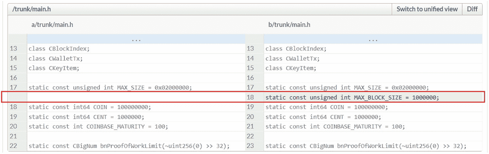

图 3-5：比特币最大区块大小为 1 MB

这开启了一个备受争议的话题，即比特币社区中持续多年的“宪法危机”，甚至延续至今。在 2015 年至 2017 年间，比特币社区就增加比特币区块链区块大小的上限展开了激烈辩论。

为了解决可扩展性问题，社区分裂成两大解决方案阵营：

一方（大区块者解决方案）主张增加区块大小，允许每个区块容纳更多交易，从而降低交易成本。然而，更大的区块大小也意味着更长的传输时间，并且这只是一个临时解决方案。当网络中的用户持续增加时，新的区块大小将再次成为限制。这不是一个长期的解决方案。

由于比特币是去中心化的，任何提议的共识变更都必须获得比特币社区的显著支持。当比特币社区无法就提案达成一致时，就会导致“分叉”。区块链有两种分叉——软分叉和硬分叉。软分叉将新实施的变更应用于现有区块链，且修改将支持向后兼容。大多数参与节点同意这些变更。旧节点将接受变更后的新节点。硬分叉对比特币协议进行了根本性改变，导致链一分为二。新链不需要支持向后兼容，原始链上的旧节点将不接受来自新链的新节点。硬分叉需要大多数矿工的长期支持——否则新网络将失败。

大区块者解决方案导致了多次硬分叉——`Bitcoin XT`、`Classic`、`Unlimited`、`Bitcoin Cash` 和 `SV`。其中一些已经失败，而其他的则持续至今。

另一方（小区块者解决方案）主张维持 1 MB 的区块大小，并通过二层解决方案进行扩展，为最终用户提供运行节点的简便选择。该解决方案包括 `SegWit` 软分叉和闪电网络。我们将在后续章节中更详细地讨论这一点。

#### Bitcoin XT（2015 年 8 月）

`Bitcoin XT` 是 `Bitcoin Core` 最早出现的著名硬分叉之一。

2014 年 6 月 10 日，Mike Hearn 发布了一份比特币改进提案（`BIP 64`），呼吁“一个小的 `P2P` 协议扩展，用于根据一组输出点执行 `UTXO` 查找”。

2015 年 6 月 22 日，Gavin Andresen 发布了 `BIP 101`，呼吁“增加最大区块大小”。

这些变更将区块大小从 1 MB 增加到 8 MB，然后每两年翻一番，直到 2036 年。区块大小最终将达到约 8 GB。

2015 年 8 月，`Bitcoin XT` 以 8 MB 的区块大小启动。在最初的几个月里，有超过 1000 个节点运行在 `Bitcoin XT` 上。然而，比特币社区并未广泛支持 `Bitcoin XT` 协议。结果，区块大小的辩论引起了媒体关注，并在各种社交媒体渠道上传播——尤其是 Reddit。这拉开了持续多年的扩容辩论的序幕。

许多社区成员担心更大的区块大小会导致比特币的中心化，正如一位批评者所言，“违背了中本聪的理念”。几个月后，该项目失去了用户和节点运营商的兴趣，基本上销声匿迹，并被其用户放弃。

#### 闪电网络白皮书（2016 年 1 月）

Joseph Poon 和 Thaddeus Dryja 于 2016 年 1 月 16 日发布了闪电网络白皮书。该白皮书提出了一种名为“闪电网络”的协议，通过在比特币区块链之上创建第二层来加速交易，该层使用用户生成的微支付通道来执行更高效的交易。这些交易非常快，因为没有矿工参与，交易费用也低得多，甚至在无需改变区块大小的情况下无需费用。小区块者支持它作为比特币的可扩展性解决方案之一。

#### Bitcoin Classic（2016 年 1 月）

2016 年初，一群比特币社区成员提议将比特币区块的最大大小从 1 MB 增加到 2 MB，这比 `Bitcoin XT` 提议的 8 MB 要温和得多。因此，一群开发者推出了 `Bitcoin Classic`。2016 年初，`Bitcoin Classic` 从比特币进行了硬分叉。最初网络上大约有 2000 个节点在运行，但 `Bitcoin Classic` 从未获得社区的广泛采用。一年后，网络中的节点不超过 100 个。尽管 `Bitcoin Classic` 至今仍然存在，但相比今天比特币的价格 23,028 美元，其价值仅为 0.027632 美元。

#### 香港共识 – `SegWit` 提案（2016 年 2 月）

2016 年 2 月，开发者 Peter Wuille 在香港数码港的比特币会议上提出了一个名为“隔离见证及其对可扩展性的影响”（`SegWitness` 或 `SegWit`）的想法。与其他交易输入相比，签名数据体积庞大，占用了 65%的空间。因此，它很快填满了区块。`SegWit` 是一种机制，通过创建自己独立的树形结构，将见证签名数据从区块交易的输入字段中分离出来。它允许在没有签名的情况下计算交易 `ID`，轻客户端可以完全跳过分离的数据条目。当需要授权原始所有者的交易输出时，签名将充当“见证人”。比特币包含一种使用检查点验证这些签名的机制。`SegWit` 使得一个区块内可以存储更多交易。

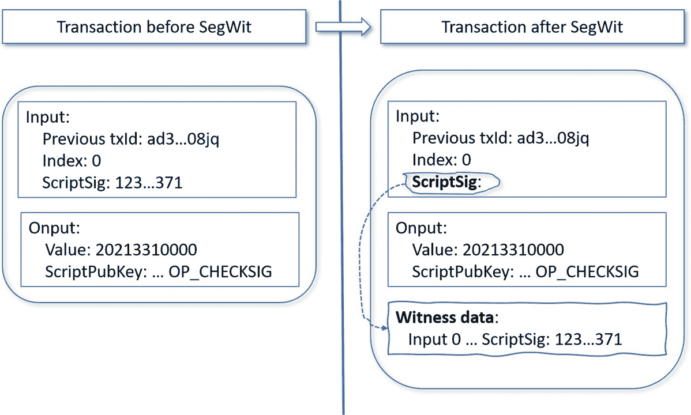

图 3-6：比特币 `SegWit`

`SegWit` 立即在社区内引发了新的讨论。会议结束后，比特币社区同意将 `SegWit` 作为未来的软分叉版本发布，并继续致力于基于 `SegWit` 改进的安全硬分叉，包括将非见证数据增加到约 2 MB。

#### 纽约共识（`NYA`）（2017 年 5 月）

2017 年 5 月 23 日，来自 22 个国家、代表超过 85%网络算力的 58 家比特币公司举行会议，以决定比特币的未来。会议旨在通过进行软分叉和硬分叉来解决比特币的扩展问题和冲突。`NYA` 发布了一份被称为 `SegWit2x` 升级的声明（本质上与香港共识相同）。其目标是：

* 在 80%的阈值下激活隔离见证，在第 4 位发信号
* 在六个月内激活 2 MB 的硬分叉

该解决方案是为了在希望实施 `SegWit` 的人和希望进行硬分叉的人之间达成妥协。

#### `SegWit` 激活（2017 年 8 月）

2017 年 8 月 8 日，100%的比特币矿池表示支持 `SegWit`。隔离见证于 2017 年 8 月 24 日激活。根据 `buybitcoinworldwide.com` 的数据，截至 2022 年 7 月，大约 84%的比特币节点已经采用了 `SegWit`。

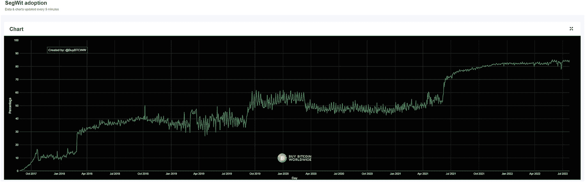

图 3-7：比特币 `SegWit` 采用率

### 比特币 SegWit 采用率

**比特币现金（2017 年 8 月）**
– 然而，纽约协议（NYA）并未满足所有人的需求。一些支持大区块的开发者对 SegWit 的改进感到不满，并认为该协议将会失败。一群比特币利益相关者、开发者和矿工开始讨论通过硬分叉将区块大小限制提高到 8 MB 的新解决方案。2017 年 8 月，由企业家 Roger Ver 领导的比特币现金（`BCH`）从比特币分叉出来并推出。该网络每秒可处理 24 笔交易，成本约为 0.18 美分，区块大小为 8 MB。

2017 年 8 月 1 日，比特币现金开盘价约为 400 美元，而比特币的价值约为 7567 美元。2017 年 12 月 19 日，比特币现金达到历史最高点 3923 美元。2022 年 7 月 23 日，比特币现金价格为 124 美元，而比特币价格为 22532 美元。

**SegWit2x 被取消，NYA 瓦解**
– 在 NYA 之后，许多维护和贡献比特币开源代码的核心开发者对 NYA 的开发计划感到愤怒，因为这个协议没有代表小区块开发者的利益，也没有让他们参与其中。他们强调比特币应该是一个开放的系统；因此，通过秘密邮件列表在闭门造车的情况下改变共识是不可接受的，他们考虑反对比特币，并声明这次硬分叉将偏离“真正的比特币”。

即使隔离见证（`Segregated Witness`）在 2017 年 8 月上线后，比特币核心开发者仍然坚决拒绝妥协，他们认为 `SegWit2x` 计划不会成功。

2017 年 8 月 18 日，比特币核心（`Bitcoin Core`）发布声明，不支持 `SegWit2x` 提案。

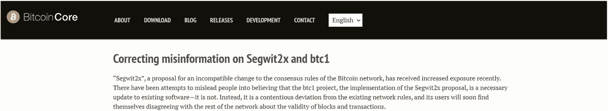
一张文本图片描述了关于“SegWit 2x”和“BTC 1”的错误信息更正，并包含“关于”、“下载”、“博客”、“版本”、“开发”和“联系方式”等内容。
**图 3-8** 来自 Bitcoin Core 的 SegWit2x 声明 [`bitcoincore.org/en/2017/08/18/btc1-misleading-statements/`](https://bitcoincore.org/en/2017/08/18/btc1-misleading-statements/)

2017 年 11 月 8 日，`BitGo` 首席执行官 Mike Belshe 发送了一封由最初支持该协议的主要公司签署的电子邮件。声明意味着 `SegWit2x` 硬分叉被取消，NYA 瓦解。在声明公布时，比特币价格飙升了 20% 或更多，反映出用户和投资者正在逃离。

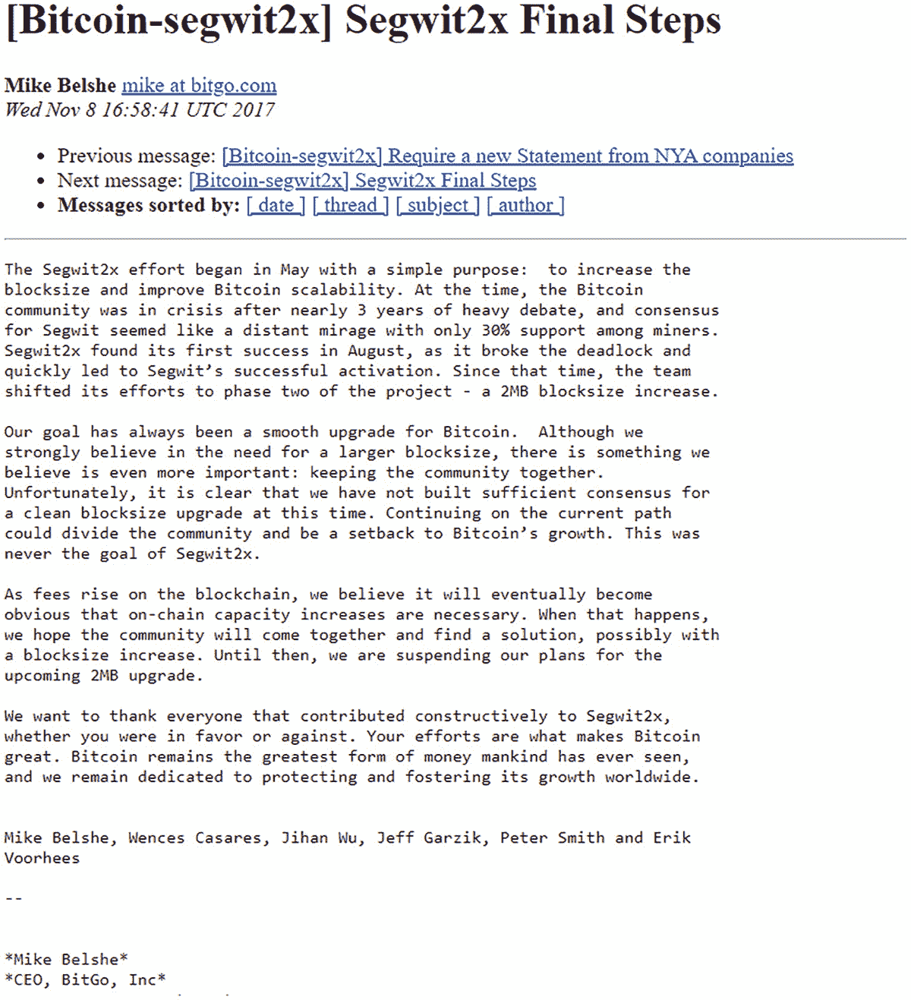
一个文本页面解释了 SegWit 2x 的最终步骤，包含几个段落。
**图 3-9** SegWit2x 取消 [`lists.linuxfoundation.org/pipermail/bitcoin-segwit2x/2017-November/000685.html`](https://lists.linuxfoundation.org/pipermail/bitcoin-segwit2x/2017-November/000685.html)

**闪电网络（2018 年 3 月）**
– 2018 年 3 月 15 日，闪电实验室（`Lightning Labs`）宣布了比特币闪电网络的第一个 beta 版本。推特 CEO Jack Dorsey 对该网络表示支持。比特币的闪电网络扩容解决方案持续增长，商业和用户采用率不断提高，但仍处于早期阶段。截至 2022 年 4 月，闪电网络容量增长到约 3600 BTC，有超过 300 家公司、项目和应用程序在使用闪电生态系统。闪电网络的交易费用约为 1 聪（`Satoshi`）或 0.000301142 美元。而链上费用在 2021 年高峰期曾接近 60 美元。

**比特币 SV – 算力大战（2018 年 11 月）**
– 历史似乎在重演。2018 年 8 月，比特币现金提议对协议进行升级：引入非现金交易，以支持区块链上的智能合约和预言机（`oracle`）价格预测服务。

同样，并非所有人都支持源代码中的这些更改，批评者认为，在一个他们认为应该只处理支付的区块链中优先考虑非现金交易是不合适的。比特币现金社区中，由 Craig Wright 和 Calvin Ayre 领导的一群人不认同源代码的这些更改，认为这次更新会损害中本聪（`Satoshi Nakamoto`）最初比特币白皮书中的愿景。相反，作为数字现金的比特币应该只处理支付，并且区块大小应该增加到 128 MB，以应对未来的可扩展性问题。

2018 年 11 月 15 日，比特币现金网络分裂为比特币现金 ABC（`BCH ABC`）和比特币 SV（`BCHSV`）。这两个竞争链之间的分裂充满了争议。两条链都试图通过成为拥有更多区块的最长链来赢得算力竞赛。由 Craig Wright 和 Calvin Ayre 领导的比特币 SV 投入了大量算力对抗由 Roger Ver 和比特大陆（`Bitmain`）吴忌寒领导的比特币现金。这场激烈的算力竞赛持续了大约十天，最终以比特币 SV 团队宣布与比特币现金永久分裂而告终。这段时期被称为“算力大战”。代价是，比特币现金矿工损失了 345 万美元，比特币 SV 矿工损失了 249 万美元。

2018 年 11 月 15 日，比特币 SV 开盘价约为 122 美元，而比特币现金价值约为 388 美元。2021 年 4 月 15 日，它达到历史最高点 441.39 美元。2022 年 7 月 23 日，比特币 SV 价格为 58 美元，而比特币现金为 124 美元。

### 作为主流货币被接纳

**CME 计划推出比特币期货（2017 年 12 月）**
– 芝加哥商业交易所（`CME`）集团有限公司是一家从事期货和期权交易的美国全球市场公司。为响应投资者对不断发展的加密货币市场日益增长的兴趣，`CME` 获得了美国商品期货委员会的批准，并于 2017 年 12 月 18 日推出了比特币期货合约交易。

`CME` 比特币期货将允许投资者押注比特币的未来价格，而无需持有实际的比特币资产。

期货合约是一种法律协议，买卖双方同意在预定的未来日期以预定价格买卖某种商品或资产。例如，7 月 1 日比特币价格为 22,000 美元。如果有人认为价格会走高，他们就会在一个月后以 23,000 美元的价格买入一份比特币期货。到了 8 月 1 日，如果比特币市场价格是 23,500 美元，且期货合约到期，买方将获得 500 美元的差价。

期货交易历史悠久。第一家现代期货交易所于 1710 年在日本大阪成立，而棉花期货大约在 1870 年左右在纽约棉花交易所开始交易。期货通常由专业投资者和公司进行交易。比特币期货可能为引入更多华尔街公司进入比特币及其他加密货币领域打开大门，并有助于降低基础比特币市场的波动性。

**新西兰将加密货币薪资合法化（2019 年 9 月）**
– 2019 年 9 月 1 日，新西兰税务局（`IRD`）正式宣布，员工可以使用比特币和以太币等加密货币领取薪水。这意味着，只要在雇佣协议中有规定，公司就可以直接用加密货币支付员工工资。因此，新西兰成为第一个将加密货币薪资支付选项合法化的国家，并将加密货币引入了日常支付方式。

**MicroStrategy 购买比特币（2020 年 8 月）**
– 2020 年 8 月 11 日，全球领先的商业智能公司 MicroStrategy Inc（`纳斯达克：MSTR`）宣布已购买了 21,454 枚比特币（当时价值 2.5 亿美元）。MicroStrategy 成为第一家将比特币作为合法投资资产购买并在公开市场上市的公司。MicroStrategy 的购买行为标志着比特币正获得越来越多的合法性和主流采用。

**PayPal 推出比特币支付服务（2020 年 10 月）**
– 2020 年 10 月 21 日，PayPal 获得了纽约州金融服务部（`DFS`）颁发的附带条件的 BitLicense。得到 `DFS` 批准后，2020 年 12 月 12 日，PayPal 推出了一项新的支付服务，允许 PayPal 用户购买、持有和出售加密货币。PayPal 拥有近 3.5 亿用户，系统中活跃商户超过 2600 万。比特币获得 1 亿用户几乎花了十年时间。这家支付巨头的采纳意味着额外的 3 亿多用户可以开始使用比特币和其他加密货币作为支付手段。

**加密货币用户超过 1 亿（2021 年 1 月）**
– 在新冠肺炎疫情期间，全球加密货币用户快速增长。根据 Crypto.com 的一份报告，全球范围内首次有超过 1 亿人在使用加密货币。

**Coinbase 上市（2021 年 4 月）**
– 2021 年 4 月 14 日，乘着整体加密货币市场繁荣的浪潮，作为华尔街最受期待的事件之一，Coinbase Global Inc. 在纳斯达克上市。Coinbase 是美国交易量最大、受监管最严格的加密货币交易所。作为在纳斯达克上市的第一家大型加密货币交易所，Coinbase 为其他加密货币交易所树立了标杆，其上市是数字资产行业的分水岭时刻。Coinbase（`COIN`）开盘价约为每股 340 美元，估值达到 860 亿美元。

**萨尔瓦多将比特币定为法定货币（2021 年 9 月）**
– 2021 年 6 月，总统纳伊布·布克尔在迈阿密举办的“比特币 2021”大会上宣布了他的《比特币法》。

2021 年 9 月 7 日，萨尔瓦多成为世界上第一个承认比特币与美元并列法定货币的国家。新法律要求企业接受比特币作为支付方式。政府还推出了一个基于闪电网络协议的国家级虚拟钱包，名为 `chivo`，该钱包支持免手续费交易和快速支付。

**美国首个比特币交易所交易基金（`ETF`）（2021 年 10 月）**
– 交易所交易基金，或称 `ETF`，正如其名：一种可以在交易所进行交易的投资基金。当您投资于 `ETF` 时，您可以像买卖公司股票一样在股票市场进行买卖。`ETF` 通常追踪某个特定指数——例如，`Spider` `ETF`（`SPDR S&P 500` – `SPY`）是最广为人知的追踪 `S&P 500` 指数的 `ETF`。`ETF` 是当今全球最受欢迎的投资选择之一。美国的第一只 `ETF`（`SPY`）于 1993 年推出；iShares 于 2002 年推出了其首只债券 `ETF` `LQD`；`SPDR Gold Trust` `ETF` 是美国首只以黄金为支持的 `ETF`。2021 年 10 月 19 日，美国首只比特币交易所交易基金（`ETF`）——ProShares Bitcoin Strategy `ETF`（`BITO`）开始交易。ProShares Bitcoin Strategy `ETF` 在交易的头两天内就吸引了超过 10 亿美元的资产。相比之下，黄金 `ETF` `GLD` 达到十位数（即 100 亿美元）用了三天时间。`BITO` 成为市场历史上交易最活跃的 `ETF` 之一。

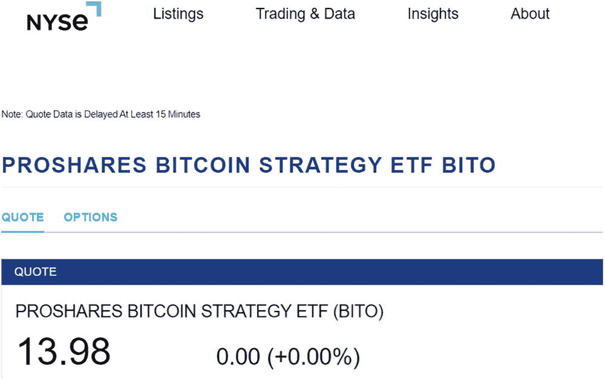
一张描述`NYSE`的图片。其中提到了`BITO`的 ProShares 比特币策略。包含收听、交易和数据、关于及洞察等内容。
**图 3-10** 在纽约证券交易所上市的 `BITO`

比特币 `ETF` 为机构投资者和散户投资者提供了一种方式，使他们能够在传统的股票市场交易所而非加密货币交易平台投资加密市场。因此，那些此前因交易技术复杂性或其他安全担忧而却步的投资者，无需创建新的加密货币钱包账户来持有代币，便可以通过间接方式投资比特币市场。

**比特币价格突破 68,000 美元（2021 年 11 月）**
– 2021 年 11 月 5 日，比特币价格创下 68,521 美元的历史新高。比特币价格的飙升将加密货币总市值推高至 3 万亿美元以上。这表明比特币正成为一种领先的创新支付模式，并在主流中获得更广泛的采用。

**Taproot – 比特币隐私更新（2021 年 11 月）**
– 在 2017 年 8 月隔离见证（SegWit）激活以及三个月后 SegWit2x 被取消之后，比特币已有四年未进行重大升级。最终，在 2021 年 11 月 14 日，比特币社区自 2017 年以来最期待的升级——Taproot——正式上线。这是比特币的一个里程碑，Taproot 获得了矿工、开发者和用户近乎一致的支持。

Taproot 是一项软分叉升级，最初由比特币核心开发者格雷戈里·麦克斯韦尔于 2018 年 1 月提出。自那时起，该提案在社区中经过了多轮审查、讨论和测试。

虽然 SegWit 和闪电网络的主要目标是提高交易速度和降低费用，但 Taproot 旨在解决比特币的可扩展性、隐私性和透明度挑战。

Taproot 升级包括三个主要改进点：

* `BIP340` – 通过用 Schnorr 签名取代传统的椭圆曲线数字签名算法（`ECDSA`）来升级比特币的底层密码学。Schnorr 公钥为 32 字节，签名为 64 字节，相比之下，`ECDSA` 公钥为 33 字节，签名为 72 字节。此次升级使复杂的比特币交易更加安全、简洁且成本更低。

* `BIP-341` – 默克尔化替代脚本树（`MAST`），引入了 Taproot 的一项功能，旨在使比特币网络能够执行智能合约。它带来了用 BTC 结合 Schnorr 签名来支持去中心化金融（`DeFi`）和 NFT 项目的潜力。

* `BIP342` – 引入了一种名为“`Tapscript`”的新型交易脚本语言，它允许比特币节点在单笔交易中结合 Schnorr 签名和 `MAST`。此外，它还移除了 10,000 字节的大小限制，从而为比特币智能合约提供了更大的灵活性和控制力。

### 比特币 ETF（2021 年 10 月–2022 年 7 月）

2013 年 6 月，卡梅隆·文克莱沃斯和泰勒·文克莱沃斯共同创立了加密货币交易所 `Gemini`。这对双胞胎因与马克·扎克伯格争夺 Facebook 所有权而闻名，他们曾向证券监管机构提议创建比特币交易所交易基金。然而，在 2017 年 3 月，`美国证券交易委员会（S.E.C.）`拒绝了文克莱沃斯兄弟创建比特币 `ETF` 的申请。

大约八年后，随着加密货币行业、投资者和证券发行人的长期期待，`S.E.C.` 批准了首个比特币 `ETF`——`BITO`。`BITO` 开始在纽约证券交易所（`NYSE`）交易。合法性是金融行业中比特币交易的关键问题。获得美国证券交易委员会（`S.E.C.`）的批准，为比特币被接受为主流数字货币打开了大门。自 2021 年 10 月首个比特币 `ETF` 获批以来，许多其他加密 `ETF` 也已获得 `S.E.C.` 批准，并可在股票市场交易。以下是比特币 `ETF` 的列表：

表 3-2：SEC 批准的比特币 ETF

| 代码 | ETF 名称 | 资产类别 |
| --- | --- | --- |
| `ARKW` | ARK 下一代互联网 ETF | 股票 |
| `BITO` | ProShares 比特币策略 ETF | 货币 |
| `SPBC` | Simplify 美国股票 PLUS GBTC | ETF |
| `BITQ` | Bitwise 加密行业创新者 ETF | 股票 |
| `BTF` | Valkyrie 比特币策略 ETF | 货币 |
| `XBTF` | VanEck 比特币策略 ETF | 货币 |
| `BITS` | Global X 区块链与比特币策略 | ETF |
| `RIGZ` | Viridi 比特币矿工 ETF | 股票 |
| `SATO` | Invesco Alerian Galaxy 加密经济 ETF | 股票 |
| `BLKC` | Invesco Alerian Galaxy 区块链用户与去中心化商业 ETF | 股票 |
| `BTCR` | Volt 加密行业革命与技术 ETF | 股票 |
| `CRYP` | AdvisorShares 管理型比特币策略 ETF | 多资产 |

### 了解比特币

在中心化经济中，中央银行发行的货币本应以稳定的价格匹配经济增长和商品交换数量。中央银行控制着货币供应量，并没有固定的公式来决定中央银行应该印刷多少货币。然而，货币体系有时可能会失控。

比特币的发明者中本聪设计比特币的目的是抵御通货膨胀、限制其供应量，并将硬币总数上限设为 2100 万。因此，新比特币的数量每四年减半，最后一批硬币将在 2140 年左右被挖出。

有限的供应使比特币成为一种稀缺资产，这可以推高币种的未来价格——这也是比特币常被称为“数字黄金”的原因之一。

### 比特币单位

如今，一个比特币大约价值 25,000 美元，总市值为 4550 亿。像美元和欧元这样的主要中心化世界货币可以细分为更小的单位（如美分），比特币同样也可以细分为 `Satoshi`。`Satoshi` 是比特币的最小单位。

一个比特币等于 1 亿个 `Satoshi`，可精确到小数点后第八位。

表 3-3 展示了比特币系统中的 `Satoshi` 单位换算：

表 3-3：比特币面额与单位名称

| 单位名称 | BTC |
| --- | --- |
| Satoshi | 0.00000001 BTC |
| μBTC（微比特币） | 0.00001 BTC |
| mBTC（毫比特币） | 0.001 BTC |
| cBTC（厘比特币） | 0.01 BTC |
| dBTC（分比特币） | 0.1 BTC |
| BTC（比特币） | 1 BTC |

假设支付 1 BTC 相当于 23,798.46 美元。那么 1 `mBTC` 价值 0.001 * 23.8 美元，而 1 `μBTC` 价值 0.24 美元。

## 比特币减半
比特币减半，也称为“halvening”，是比特币历史上的一个关键事件。每四年，新的比特币会被释放到流通中，并且比特币挖矿奖励的数量会减半。比特币的最大总供应量为 2100 万。

以下是过去及未来比特币减半的简要过程：
* 2009 年 – 比特币网络奖励矿工，开始时每十分钟产生一个区块，奖励 50 BTC。
* 2012 年 – 在开采了 210,000 个区块后，第一次比特币减半，奖励降至 25 BTC。
* 2016 年 – 在开采了 420,000 个区块后，第二次比特币减半，挖矿奖励降至 12.5 BTC。
* 2020 年 – 在开采了 630,000 个区块后，第三次比特币减半，挖矿奖励降至 6.25 BTC。
* 2024 年 – 下一次比特币减半将在开采了 840,000 个区块时发生，挖矿奖励将降至 3.125 BTC。
* 2140 年 – 第 64 次也是最后一次减半将发生，届时将不再产生新的比特币。

中本聪将减半政策写入比特币的挖矿算法中，旨在通过保持稀缺性来降低比特币的通胀率。当矿工的奖励减少并且他们出售的数量变少时，在需求增加的情况下，有限的供应量会对价格产生积极影响。

## 比特币钱包
“不是你的钥匙，就不是你的币”是加密世界最著名的格言之一。这意味着如果你没有真正掌控你的私钥，那么你实际上并不“拥有”你的加密货币/硬币。换句话说，如果你丢失了比特币钱包的私钥，你就丢失了其中的资金。

在传统金融体系中，你有一个钱包来存放现金。比特币钱包类似于你的普通钱包，但它用于存储、发送和接收比特币。它有两个主要功能：
首先，存储用户的公钥和私钥；其次，执行交易——例如，接收和发送比特币。

### 比特币钱包的工作原理
我们在第二章“密码学”中学习了公钥和私钥。那一章展示了如何使用非对称加密生成一对私钥和公钥的示例。之后，区块链地址会从其公钥中派生出来。

在比特币中，当你创建一个区块链钱包时，私钥和公钥会与之关联。每个地址对应一个私钥。比特币地址是公开可见的，代表了你在区块链中的账户，并用于接收和发送比特币。

私钥是保密的。它用于验证交易、账户所有权，或者花费你账户中的比特币。它可以有多种形式：
1. 一个 256 字符长的二进制代码。示例：
    ```
    ```
2. 一个 64 位的十六进制代码。示例：
    ```
    c2e44f51a0277e7bde2b244de3ac9afb62b528bf2f234f0a0a085e963ef7134e
    ```
    关联地址：`1Ghftir7isD9MsJVH6qcTbm2nCBHTs3Csp`
3. 一个二维码。示例：
    你可以使用在线比特币二维码生成器，通过提供比特币地址来生成二维码：[`www.bitcoinqrcodemaker.com/`](http://www.bitcoinqrcodemaker.com/)。
    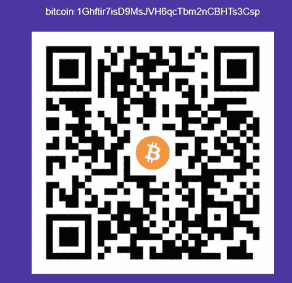
    一幅描绘比特币网页二维码的图片。
    **图 3-11** 比特币二维码
4. 助记词短语。示例：
    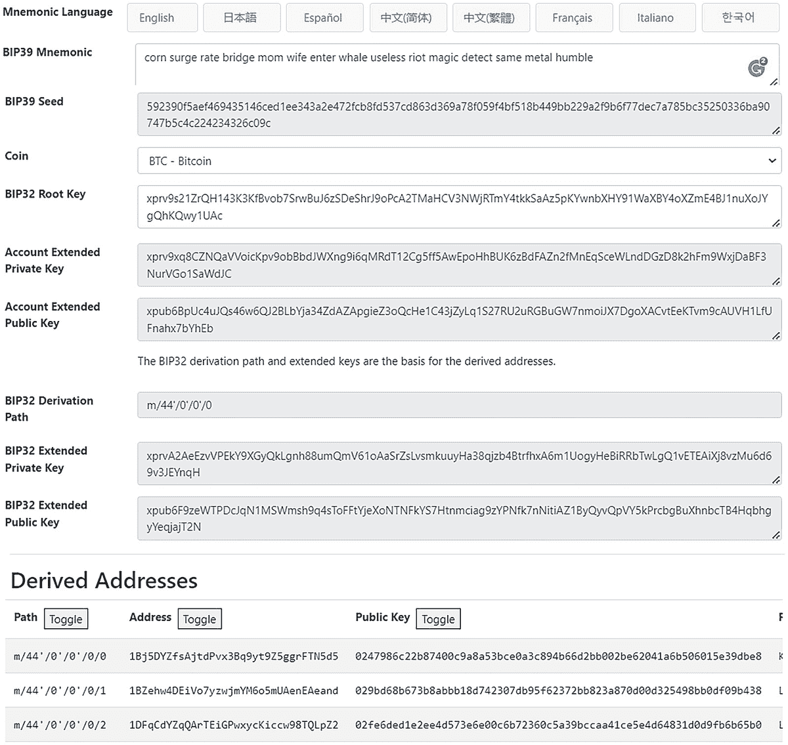
    一个文本截图，展示了助记词短语比特币。它包括了助记词语言和关于比特币钱包的详细信息。
    **图 3-12** 助记词短语

当爱丽丝想要从她的钱包向鲍勃发送一个比特币时，由钱包处理的流程可以描述如下：

**第 1 步 –** 爱丽丝收集要发送的交易数据。一旦确定下来，爱丽丝使用鲍勃的公钥对交易数据进行加密。

**第 2 步 –** 然后，爱丽丝使用她的私钥对交易进行签名，以产生数字签名。接着，爱丽丝将交易、数字签名以及她的公钥发送给鲍勃。

鲍勃接收到了交易消息。他必须验证从爱丽丝发送来的数据未被篡改，并且确实是由爱丽丝发送的。

**第 3 步 –** 鲍勃使用他的私钥解密交易数据。

**第 4 步 –** 鲍勃接收爱丽丝的公钥来验证数字签名，以确保消息来自爱丽丝。

如果验证通过，鲍勃就知道数据未被更改，可以继续处理。

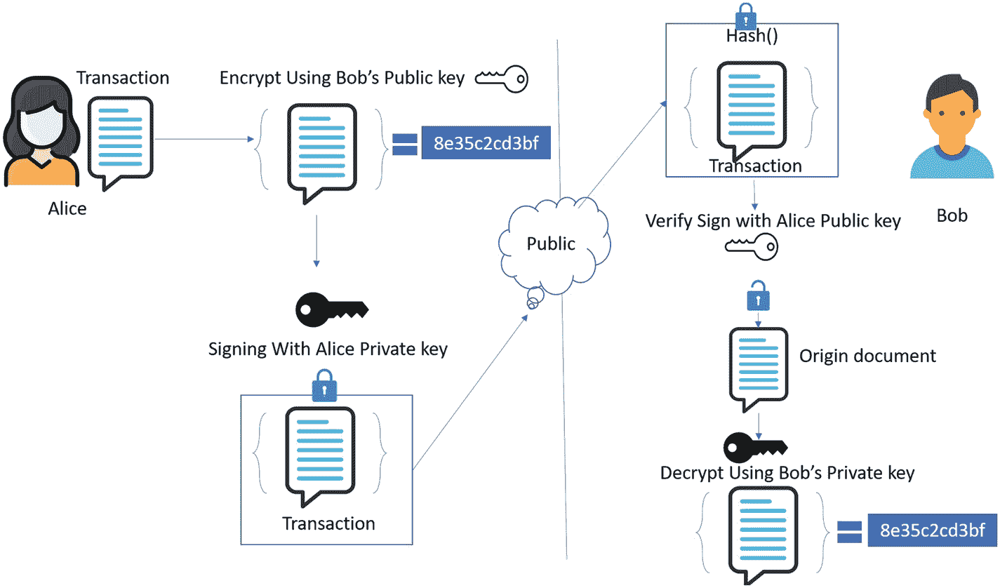
一个图示说明了比特币钱包的工作原理。它包含了爱丽丝、交易、鲍勃的公钥、签名私钥、公钥、哈希值、爱丽丝的公钥、原始文档以及鲍勃的私钥等步骤。
**图 3-13** 比特币钱包的工作原理

### 比特币钱包的类型
钱包分为两类：热钱包和冷钱包。两者的区别在于，热钱包需要互联网连接，而冷钱包则离线存储加密代币。

由于热钱包始终连接互联网，因此使用起来方便快捷，适合初学者学习，也适合交易者快速进行在线支付。它的用户友好度很高。另一方面，热钱包通常安全性较低，更容易受到黑客攻击和在线攻击。有几种常见的热钱包类型：网络钱包、移动钱包和桌面钱包。

冷钱包不连接互联网，安全性极高。从冷钱包中窃取资金需要物理接触该冷钱包，并且知道所有者的密码或 `PIN` 码。这最大限度地减少了在线黑客攻击。同时，它难以访问，用户友好度较低，交易耗时也更长。它适合长期存储大量加密资产。冷钱包包括纸钱包和硬件钱包。

图 3-14 展示了这两种比特币钱包的类型。

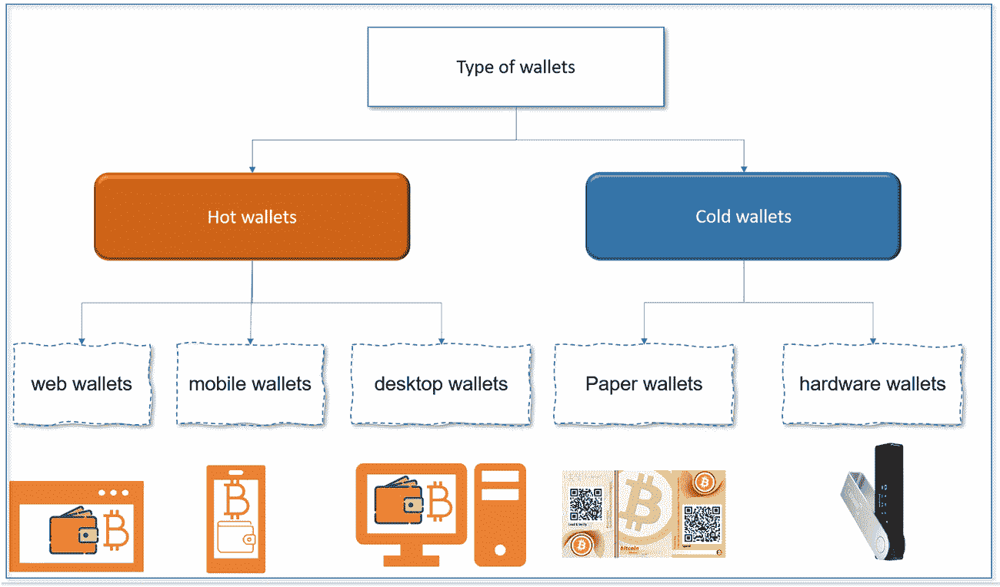
一个流程图描绘了比特币钱包的类型。它被分为热钱包和冷钱包。热钱包细分为网络钱包、移动钱包、桌面钱包。冷钱包细分为纸钱包和硬件钱包。
**图 3-14** 比特币钱包的类型

#### 网络钱包
顾名思义，在线钱包存储你的私钥，这些私钥完全由第三方在线管理，通常是中心化交易所。网络钱包供应商以云服务的形式提供。用户友好的网络界面使用户能够轻松管理钱包并执行各种操作，例如发送和接收付款。你可以通过网页浏览器从任何地方访问网络钱包。然而，网络钱包经常成为黑客攻击的目标。在热钱包中，网络钱包是最不安全的。大多数交易所将大部分客户资金离线存储在冷钱包中。出于安全考虑，用户通常不应在热钱包中存放大量加密货币。

流行的网络钱包示例有 [`www.exodus.com/`](http://www.exodus.com/) 或 [`https://electrum.org/`](https://electrum.org/)。

#### 桌面钱包
桌面钱包是下载到你的台式机或笔记本电脑设备上运行的计算机软件。这种钱包软件会生成一个数据文件来管理用户的密钥。私钥存储在你的硬盘驱动器或固态硬盘（`SSD`）上。

与其他热钱包相比，桌面钱包是最安全的，并且是使用计算机进行小额加密交易的绝佳解决方案。使用钱包时，用户应创建一个强密码来保护密钥。

由于桌面钱包连接互联网，它也容易受到恶意软件或病毒的攻击。为了保护桌面钱包中的资金，你需要使用安全的密码短语来保护你的计算机。最佳做法是将大部分资金保存在冷存储中。

#### 移动钱包
与桌面钱包类似，移动钱包是安装在手机上的移动应用程序。

#### 硬件钱包
比特币硬件钱包是最常用的冷钱包形式，也是最安全的比特币存储方式。账户的私钥与互联网隔离，并存储在一个安全的物理设备中。与便携式设备类似，硬件钱包可以连接到计算机进行交易。设备中的私钥会自动签署加密货币交易，无需你输入密钥，从而有效防止黑客窃取你的私钥。

`Trezor`（[`https://trezor.io`](https://trezor.io)）和 `Ledger` 钱包（[`www.ledger.com`](http://www.ledger.com)）是两个最流行的硬件钱包供应商。

#### 纸钱包
顾名思义，纸钱包是一张包含与钱包地址相关联的公钥和私钥的纸张。此外，纸钱包通常以二维码形式打印，方便您快速扫描进行交易。

作为一种冷钱包，纸张在存储加密货币方面相当安全，因为您的密钥完全离线，网络黑客无法触及。它是最便宜的冷钱包选择。与 `Trezor`、`Ledger` 等硬件钱包相比，成本可能在 50 美元到 300 美元之间。

纸钱包是通过下载钱包生成器软件来创建的。

下载后，您必须检查以确保该软件不包含恶意软件。然后，要打印纸钱包，您需要禁用浏览器插件和扩展，断开网络连接，并添加一个密码短语。最后，按照钱包生成器的说明完成整个流程，打印新生成的钱包，并删除文件。请务必确保没有人在您创建钱包时偷看。

避免使用公共打印机，例如学校和办公室的打印机；钱包信息可能会存储在打印机的内部硬盘中。不安全的公共 `Wi-Fi` 网络也可能泄露您的钱包信息。

纸钱包很容易损坏或丢失。如果应用被卸载，您将损失资金。此外，使用钱包接收资金时，纸钱包无法告知您是否收到比特币以及数量；您需要使用其他应用来查看。

由于纸钱包存在诸多缺点，目前并未广泛使用。

您可以通过各种在线服务提供商创建自己的比特币纸钱包，例如 [`https://bitcoinpaperwallet.com/`](https://bitcoinpaperwallet.com/)、[`https://paperwallet.bitcoin.com/`](https://paperwallet.bitcoin.com/) 或 [`www.bitaddress.org/`](http://www.bitaddress.org/)。

## 比特币网络
比特币是一个基于工作量证明协议运行的节点对等（`P2P`）网络。每个作为参与者的节点只是一台运行比特币软件的计算机。节点随机选择并与其他对等节点连接。任何人都可以下载并安装比特币软件来启动新的比特币节点并加入网络。新节点可以随时加入，因此网络中的节点是动态的，并且随时都有节点加入和离开。

当发送方使用比特币钱包签署后向接收方发送比特币时，交易将被广播到网络中的其他节点和矿工。矿工使用计算能力执行数学过程来验证交易并将它们添加到一个区块中。之后，矿工将新区块广播到网络。接收到新区块的节点将验证矿工是否遵循网络规则，并将该区块添加到自己的节点中。矿工会因其对网络的贡献获得新铸造的比特币作为奖励。交易确认后，接收方即可从发送方收到比特币。

比特币网络上有不同类型的节点，其中主要有三种类型：全节点和超级节点、轻节点或 `SPV`（简单支付验证）以及挖矿节点。

让我们详细了解不同类型的节点。

### 全节点
全节点运行比特币软件来验证来自其他全节点的交易和区块。它可以一直追溯到创世区块来验证交易，然后将它们转发给其他全节点。全节点存储整个区块链历史的副本，包括所有已创建的区块。截至本文撰写时，运行一个比特币全节点需要至少 `280 GB` 的可用空间。

一个新的全节点安装客户端软件，并连接到其他对等节点。客户端软件随后会嵌入“创世”区块（区块链中的第一个节点），新节点将发送提供包含区块高度的区块头的“版本”消息。

对等节点将通过将其与自身拥有的整个区块链数据副本进行比较来检查区块高度。如果新节点的区块数量低于其副本，对等节点将知道新节点缺失了多少个区块。对等节点可以向新节点发送缺失的区块，以便新节点赶上最新的区块数据。每个全节点在每个节点连接上最多可以有 500 个区块。

当将一个新节点设置为连接到比特币网络的全节点时，它将启动一个初始区块下载（`IBD`）过程。

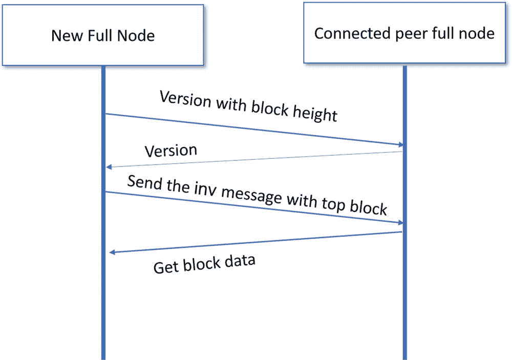
图 3-15
全节点初始区块下载（`IBD`）

`IBD` 指的是从创世区块开始下载并验证区块链中直到当前区块的所有区块。根据节点连接速度以及 `CPU` 和内存等硬件配置的不同，整个 `IBD` 过程可能需要几小时到几天。在 `IBD` 过程中，全节点将不会接受或发送交易。

**增加隐私：** 连接到第三方节点会广播您的交易。它可能会收集您交易的详细信息。您的交易请求与您的 `IP` 地址相关联，而 `IP` 地址可以与您的姓名关联。为了保护您的隐私并保持真正匿名，您需要连接到您自己设置的全节点来广播和验证您自己的交易。

运行全节点的好处如下：
**维护去中心化：** 通过加入比特币网络，您将帮助网络变得更加去中心化和安全。全节点将通过拒绝不遵循共识规则的区块和交易来确保比特币的共识得以遵守。
**更高的安全性：** 运行全节点允许用户创建未签名的交易，称为部分签名比特币交易（`PSBT`）。您可以选择一个离线钱包来签署交易，然后从您的全节点广播该交易。在此过程中，您的私钥是安全的。

运行全节点有一些最低要求，例如：
- 更新版本的操作软件（例如，`Bitcoin Core`）
- 至少 `2 GB` 的随机存取存储器（`RAM`）
- 您的节点每天至少运行 6 小时
- 最低速度为 `400` 千比特（`50` 千字节）/秒的快速互联网连接
- 至少 `280 GB` 的可用存储空间，最低读写速度为 `100 MB/秒`

### 轻节点或 SPV
轻节点或 `SPV`（简单支付验证）执行与全节点类似的功能，但仅下载先前交易的区块头并确认区块链的有效性。与全节点相比，它节省了大量存储空间，并允许更快、成本更低的交易。一个区块头的大小仅为区块的千分之一。整个比特币区块链的总大小是 `280 GB`，那么区块头的总大小大约为 `280 MB`。许多手机照片都比这大。对于手机或平板电脑来说，这是一个可以接受的大小。

`SPV` 节点或钱包应用需要知道其用户的未花费交易输出（`UTXO`）——交易后剩余的比特币数量。由于 `SPV` 节点仅包含区块头，没有所有可供花费的 `UTXO` 的完整信息，因此 `SPV` 节点必须连接到其他全节点，并查询以通过给定的比特币地址找到相关交易。一旦 `SPV` 节点通过给定的比特币地址获取了所有相关交易，钱包应用就可以找出未花费的交易输出。

#### 挖矿节点
挖矿节点负责收集交易，并通过执行工作量证明共识来生成新区块。矿工们可以组成团体，建立矿池。利用矿工们的合力可以增加更快找到并生成比特币区块的概率。一旦矿池成功并获得奖励，该奖励将根据每个矿工的贡献在参与者之间分配。

## 交易
交易是比特币生态系统的核心，它可以简单到仅是将一些比特币转移到一个比特币地址。

假设爱丽丝想发送一个比特币给鲍勃。她使用自己钱包的私钥来创建并数字签名这笔交易。下一步，爱丽丝的钱包会将这笔交易广播到比特币网络。这笔交易包含发送方和接收方的地址、转账金额以及爱丽丝的数字签名。网络中的任何节点都可以获取这笔交易，并将其添加到名为“内存池”的未确认交易池中。现在，挖矿过程开始了。矿工们获取这些未确认的交易，并解决工作量证明问题。挖矿过程通常需要大约十分钟。一旦交易被验证，它们将被添加到一个新挖出的区块中，并公开广播到网络。其他节点可以验证并确认这个新区块中的交易。通常需要三到六次确认（六次确认后可排除双重支付的可能性），然后这些交易被添加到当前区块。交易至此完成，鲍勃的钱包中收到了一个比特币。

图 3-16 展示了交易明细的一个示例。

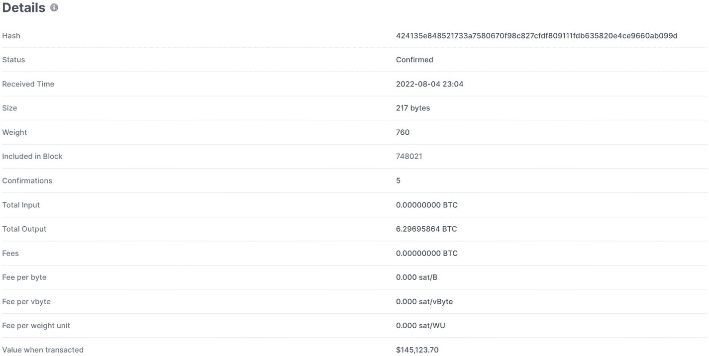
一张表格展示了交易的详细信息。它包括哈希、状态、接收时间、大小、权重、所属区块、确认数、总输入、总输出、手续费、每字节手续费、每权重手续费、交易时的价值等类别。
图 3-16 交易明细

让我们来了解一些关于交易数据结构的概念。

### 交易数据结构
图 3-16 显示了典型的交易信息。还有许多其他字段；我们选择了其中一些最常用的字段，并在表 3-4 中进行了说明。

表 3-4 比特币交易详情

| 字段名 | 描述 |
| --- | --- |
| 交易哈希（交易 ID） | 交易哈希是每个经过验证并添加到区块链的交易被赋予的唯一字符串。比特币使用 `SHA-256` 哈希算法生成交易哈希值。 |
| 交易状态 | 检查比特币交易确认的状态。 |
| 接收时间 | 发送方钱包将交易广播到网络的时间。 |
| 大小 | 这笔交易的总大小。 |
| 区块 | 交易所属的区块编号。 |
| 确认数 | 成功对交易进行哈希并将其添加到区块链的确认次数。 |
| 手续费/字节 | 为处理这笔交易支付的总手续费。 |

爱丽丝向鲍勃发送比特币。爱丽丝的钱包将开始创建一笔交易。从高层次来看，这笔交易包含三个主要部分：
1. 输入：包含爱丽丝的比特币地址以及她拥有的比特币数量。
2. 输出：鲍勃的比特币地址或公钥。
3. 金额：爱丽丝发送给鲍勃的比特币数量。

图 3-17 展示了一个输入和输出的示例：

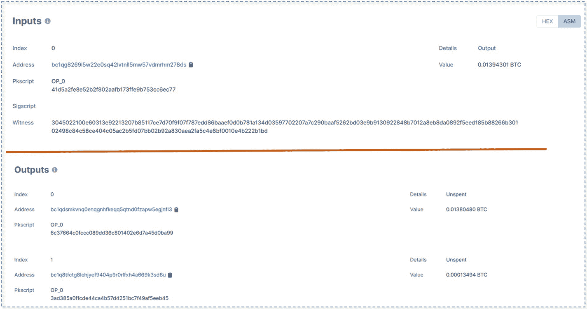
一张表格对交易中的输入和输出进行了分类。它包括索引、地址、公钥脚本、签名脚本和见证数据。
图 3-17 交易输入和输出

#### 输入
可以将输入视为对比特币账户的支出，输出视为储蓄。通常，每个输入花费一个之前的输出。每个输出都是一个未花费交易输出（`UTXO`），直到被后续的输入所消耗。

一笔交易可以包含多个输入和输出。如果输入金额超过相关的输出金额，并且输入金额也包含了交易手续费，那么这笔交易就是有效的。

`UTXO` 是一个未花费的交易输出，用作下一个新交易的输入花费。交易输入数据结构如表 3-5 所述。

表 3-5 比特币交易输入

| 字段名 | 类型（长度） | 描述 |
| --- | --- | --- |
| 交易哈希/交易 ID | `32` 字节 | 对交易 ID 进行 `SHA-256` 哈希。包含 `UTXO` 的上一笔交易 ID。 |
| 交易索引 | `4` 字节 | 上一笔交易的输出索引。 |
| 解锁脚本长度 | `2–9` 字节 | 解锁脚本的大小。 |
| 解锁脚本 | 可变 | 包含解锁脚本。 |
| 序列号 | `4` 字节 | 序列号。默认值为 `0xffffffff`。 |

#### 输出
输出包含三个字段，存储着关于转账比特币的信息。第一个字段是要发送的聪（`Satoshi`）数量，第二个字段表示锁定脚本的字节大小。最后，第三个字段包含一个锁定脚本，该脚本定义了期望未来其他人使用该输出所需满足的条件。交易输出数据结构在表 3-6 中解释。

表 3-6 比特币交易输出

| 字段名 | 类型（长度） | 描述 |
| --- | --- | --- |
| 数值 | `8` 字节 | 以聪（`Santoshi`）为单位的转账金额。 |
| 锁定脚本长度 | `2–9` 字节 | 锁定脚本的大小。 |
| 锁定脚本 | 可变 | 包含锁定脚本。 |

### UTXO（未花费交易输出）

每笔交易的输出，即未花费交易输出（`UTXO`），被用作下一笔已花费交易的输入。`UTXO` 在比特币网络中只能被花费一次，因此比特币交易输出可分为 `UTXO` 和已花费交易输出两类。由于比特币区块链不维护每个人的账户余额，比特币钱包应用可以查询区块链全节点数据，并汇总比特币钱包地址的总 `UTXO`。类似区块链中区块的连接方式，每个交易输入都链接到前一笔交易的输出，而每个输出又指向后续交易的输入。

假设爱丽丝在 2022 年 8 月 1 日至 2022 年 8 月 5 日期间收到了多笔付款。每笔交易包含不同数量的 `BTC`，如图 3-18 所示。

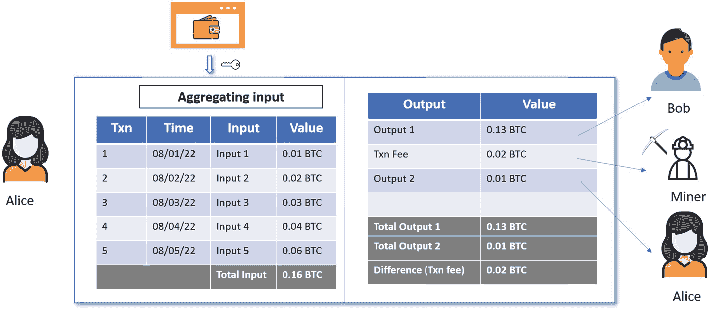

两张表格展示了输入聚合信息、交易、时间、输出和数值。其中提到了总输入和输出值及其差值，并指出了爱丽丝、鲍勃和矿工三个角色。

图 3-18 聚合交易输入并生成输出

爱丽丝的钱包地址是 `18AEg8g8VWxBfFGeWLqJURuw1DLKQne8jV`。爱丽丝想给鲍勃发送 `0.005 BTC`。她只需解锁 2022 年 8 月 1 日至 2022 年 8 月 5 日期间的任意一笔交易即可，因为这些交易的 `UTXO` 金额都大于 `0.005 BTC`。但如果爱丽丝想给鲍勃发送 `0.13 BTC`，她必须解锁所有这些交易。要支付 `0.13 BTC`，爱丽丝不能简单地只使用交易 1 到 4，而从交易 5 中取 `0.03 BTC`。换句话说，你永远不能部分使用 `UTXO`；所有这些交易都需要被解锁并加总，才能在新交易中花费 `0.16 BTC`，支付 `0.02 BTC` 给矿工作为交易手续费，然后将剩余的 `0.01 BTC` 返还给爱丽丝。

一旦交易在比特币网络中被提交，该比特币交易就不可逆转，除非该支付的接收方发起一笔新交易并将比特币发回你的比特币地址。

与传统账户不同，输入值可以略大于输出值。在前面的例子中，爱丽丝向鲍勃发送比特币。她需要聚合五笔不同的交易输入，并生成三个输出：一个支付给鲍勃，一个支付给矿工，剩余部分返还给爱丽丝。

让我们来看一下最常见的几种比特币交易类型。

#### 一个输入 – 两个输出

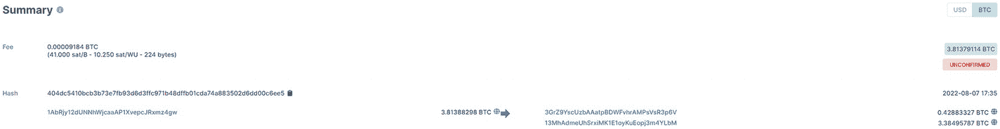

一张文字截图展示了一个输入和两个输出及其数值，并标明了标题摘要。

一笔交易有两个输出是最常见的比特币交易类型。例如，爱丽丝向鲍勃发送 `8 BTC`，但她的交易 `UTXO` 有 `10 BTC`。她将把剩余部分返还到自己的地址。这笔剩余金额将成为她地址下一笔交易的输入。

#### 一个输入 – 多个输出

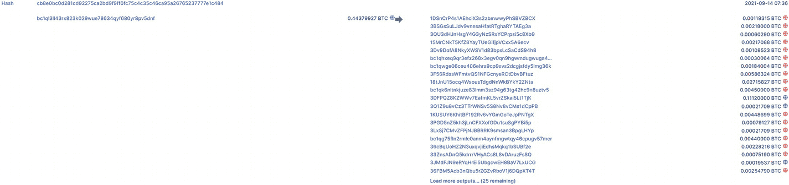

一张文字截图包含一个输入和多个输出及其数值。

一笔交易有多个输出，可能代表某人向多个接收方发送比特币。例如，如果该账户是企业账户，则可能是向其员工进行支付。

#### 多个输入 – 一个或两个输出

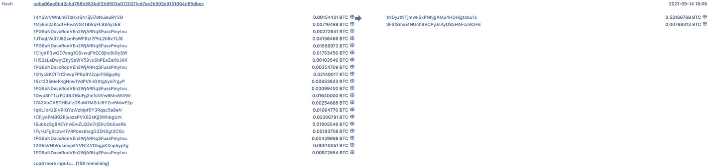

一张文字截图包含多个输入和一个或两个输出及其数值。

当所有者拥有多个金额较小的不同钱包地址时，他们可以将这些资金转移到一个地址。另一种情况是企业账户接收公开的比特币付款。

### 交易池

在交易被添加到区块之前，它们会先被放入一个公共交易池。这些交易是“未确认的”。交易池也称为内存池，包含所有已验证但尚未被挖出的未确认交易。

矿工随后根据手续费以及交易在池中的排序位置，从交易池中选取未确认交易。手续费越高的交易被选中的机会越大。

一旦交易被挖出或添加到区块链中，交易池就会被清空。然后，矿工向网络广播新区块。每个网络节点都拥有交易池的副本。当节点收到更新时，它会调整自己的交易池。

### 交易手续费

交易手续费作为对矿工的激励奖励，鼓励他们验证区块中的用户交易并维护网络安全。从数学上讲，交易手续费是比特币交易输入金额与输出金额之间的差额。

当比特币钱包发送交易时，通常会显示一个选项，用于选择以每单位聪计费的手续费率，缩写为 `sats/vByte`。交易手续费将根据交易数据大小乘以该费率计算得出。一个比特币区块最多可包含 `4 MB` 数据，交易越大，占用的区块空间就越多。因此，较大的交易需要支付更多手续费。如果你想加快交易验证过程并减少等待时间，则需要在交易中包含更高的手续费率，这使其更有可能被包含在下一个区块中。然而，如果你不介意等待，则可以支付最低手续费，例如 `2 sats/vByte`。交易通常会在一天或一周内得到确认。一个简单的公式可以表示为：

```
手续费 = 输入总额 – 输出总额
```

一笔比特币交易在高层级上包含三个主要组成部分：元数据（包括头部）、输入和输出。上述三个组成部分各自有特定的大小。交易的总大小将是这些组成部分大小的总和，如下所示：


一张表格包含三列：交易输入、交易输出和元数据。

假设一笔交易具有以下近似大小，且网络手续费率为每 `vbyte` `10` 聪：

*   每个输入 `120 vbyte`

*   每个输出 `58 vbyte`

*   元数据 `22 vbyte`

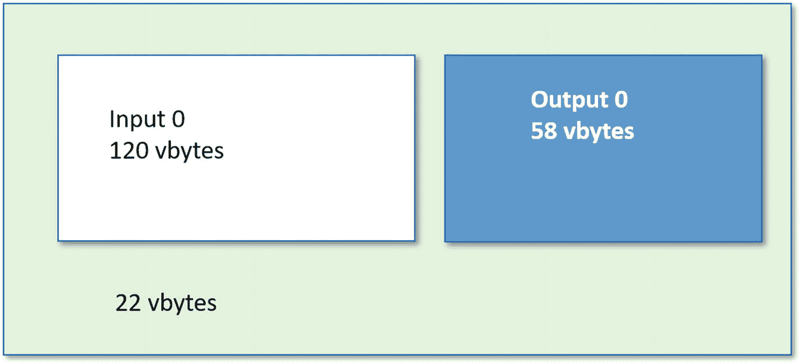

一个区块图将其分为输入 0（`120 v 字节`）和输出 0（`58 v 字节`），并提及 `22 v 字节`。

对于每笔交易，总交易大小为：

```
120（输入）+ 58（输出）+ 22（元数据）= 200 字节
```

如果交易手续费率为 `10 聪/vByte`，那么发送 `200 字节`需要 `2000 聪`。

`1 聪`等于 `0.00000001 BTC`；`2000 聪`等于 `0.00002 BTC`。

撰写本文时，`BTC`价格为 `$23,147.80`，因此总交易手续费为：

```
$23,147.80 * 0.00002 = $0.462956
```

你需要为上述交易支付 `$0.462956`。

### 闪电网络

2016 年 1 月，Joseph Poon 与 Thaddeus 发布了一份题为 *《比特币闪电网络：可扩展的链下即时支付》* 的白皮书。闪电网络是在主比特币网络之外扩展比特币容量的解决方案。它是一个构建于比特币区块链之上的“第二层”去中心化支付协议，支持链下交易。交易过程只需在双方之间进行验证，无需作为一笔交易提交至比特币网络。随着比特币的普及，闪电网络已成为一种流行的比特币扩容方案。目前已有超过 `20,000` 个活跃的闪电网络节点，拥有超过 `83,000` 条独立的支付通道。以下是闪电网络的一些优势：

1.  **即时支付：**
    比特币网络每秒大约能处理三到七笔交易。闪电网络建立了一个点对点的支付通道，其中两个参与节点通过加密协议建立双向支付连接，并从 `2-of-2` 多重签名地址分配资金。通道内的双方可以直接提交交易并相互支付，而无需在比特币网络上创建链上交易供矿工验证——因此，在闪电网络内，支付过程几乎是即时的。

2.  **可扩展性**
    闪电网络上的通道是“双向”的，双方参与者均可根据通道容量发送和接收支付。
    通道容量是指每个参与者在通道内持有的总余额。例如，Alice 和 Bob 通过一笔 `10 BTC` 的交易开通了一个支付通道。如果 Alice 通过通道向 Bob 发送 `10 BTC`，那么她将无法再接收任何支付。Bob 可以从 Alice 处接收 `10 BTC`，但无法发送任何支付。然而，如果 Alice 向 Bob 发送了 `5 BTC`，那么双方现在都可以在通道内发送和接收最多 `5 BTC`。根据通道容量，链下支付通道内可发生大量交易，无需链上矿工参与，这有望达到每秒数百万笔交易的处理能力，从而极大地扩展比特币网络的容量。

3.  **低成本**
    使用闪电网络几乎无需交易费用。一笔闪电网络手续费大约为 `1 聪`或 `0.000233 美元`。

4.  **跨区块链交易**
    只要区块链能够支持类似的加密哈希函数，闪电网络功能便可在多条区块链上使用。闪电网络有望实现终极的去中心化交易所。交易甚至可以跨越多条区块链进行，而无需第三方参与。

5.  **隐私性**
    无需上链记录。个人闪电网络支付交易的详细信息不会直接公开记录在区块链上。支付可能通过许多连续的通道进行路由，每个节点运营者都能看到经过其通道的支付，但如果这些节点不相邻，他们将无法看到这些资金的来源或去向。

闪电网络的几个局限性：

闪电网络由两个节点之间的双向支付通道组成，这些通道组合起来形成了智能合约。如果任何一方在任何时候关闭通道，该通道将关闭并在区块链上结算。

由于闪电网络争议机制的特性，要求所有参与者持续监控其通道并跟踪广播到网络的离线账本状态，因此催生了“瞭望塔”的概念。

#### 闪电网络的工作原理

最初，Alice 持有 `A1` 承诺交易，Bob 持有 `B1` 承诺交易。
`A1` 的撤销密钥 `K[A1]` 仅由 Alice 拥有。
`B1` 的撤销密钥 `K[B1]` 仅由 Bob 拥有。

假设 Alice 和 Bob 各有 `5 BTC`。Alice 想向 Bob 发送 `2 BTC`。

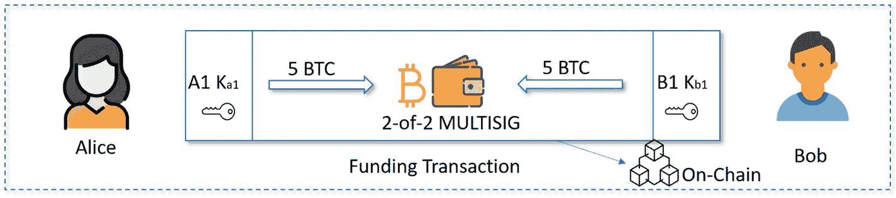

区块图表示出资交易。它显示了 `5 BTC` 的 `2-of-2` 多重签名。密钥为 `A1 K a1`、`B1 K b1`。连接的两个角色是 Alice 和 Bob。

Alice 和 Bob 通过将资金存入 `2-of-2` 多重签名地址，并向比特币网络发送一笔交易（也称为出资交易或锚定交易），来在闪电网络上开通一个支付通道。这笔交易将被挖矿，从而创建通道。

Alice 和 Bob 各自存入等额资金——在本例中为 `5 BTC`——并各自对其加锁。

支付通道建立后，双方即可开始签署和交换交易。这些交易被称为承诺交易，它们将改变通道内的初始状态。

Alice 创建了一笔新交易 `B2`，该交易分配 `3 BTC` 给 Alice，`7 BTC` 给 Bob。
Alice 签署 `B2` 并将其发送给 Bob。Bob 收到 `B2`，签署后保存。

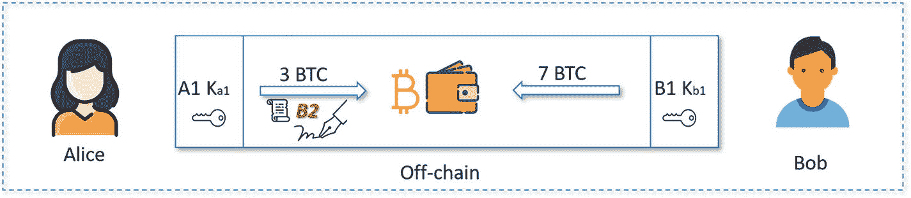

区块图表示出资交易。它显示了 `3 BTC` 和 `7 BTC`。密钥为 `A1 K a1`、`B1 K b1`。两个角色是 Alice 和 Bob。

Bob 创建了一笔新交易 `A2`，该交易分配 `3 BTC` 给 Alice，`7 BTC` 给 Bob。
Bob 签署 `A2` 并将其发送给 Alice。

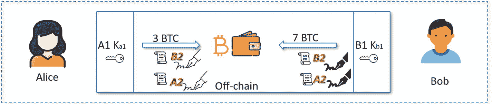

区块图表示出资交易。它显示了 `3 BTC` 和 `7 BTC`。并用笔标记指向 `A2` 和 `B2`。密钥为 `A1 K a1`、`B1 K b1`。两个角色是 Alice 和 Bob。

Alice 收到 `A2`，签署后保存。
Alice 提供 `K[A1]`，使 `A1` 失效；然后她可以删除 `A1`。

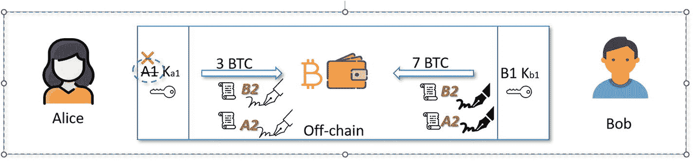

区块图表示出资交易。它显示了 `3 BTC` 和 `7 BTC`。密钥为 `A1 K a1`、`B1 K b1`。两个角色是 Alice 和 Bob。

Bob 提供 `K[B1]`，使 `B1` 失效；然后他可以删除 `B1`。

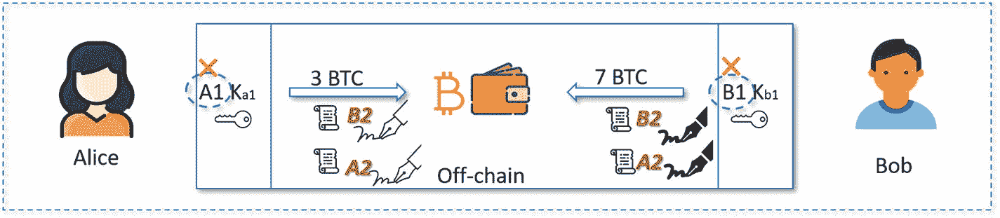

区块图表示出资交易。它显示了 `3 BTC` 和 `7 BTC`。被忽略的密钥为 `A1 K a1`、`B1 K b1`。两个角色是 Alice 和 Bob。

总结来说，支付通道为双方创建了一个资金池，然后以约定的方式转移池中资金的所有权承诺。

当 Alice 或 Bob 在某一时刻决定关闭支付通道时，他们可以签署一笔关闭交易。关闭通道意味着双方取回各自的资金，并结算双方之间的最终余额。这笔交易随后将在比特币网络中被挖矿。无论支付通道内执行了多少笔交易，比特币网络都只会挖矿两笔交易——即开通和关闭通道的交易。

哈希时间锁合约（`HTLC`），顾名思义，由两部分组成：哈希验证和时间到期验证。它是一种双方约定财务安排的支付方式，一方在截止日期前通过生成加密证明从另一方获得一定金额，否则资金将退还给付款方。支付通道默认带有时间锁。通过增加哈希锁，支付可以路由通过多个首尾相连的支付通道。交易可以在没有直接通道连接的双方之间发送，因此任何连接到闪电网络的人都属于一个单一、互联的全球金融体系。

让我们来看一个例子。

爱丽丝想要向鲍勃发送支付，但她与鲍勃之间没有支付通道。爱丽丝与约翰有支付通道，而约翰又与鲍勃有支付通道。爱丽丝如何向鲍勃支付呢？

鲍勃必须创建一个密码学密钥（key），使用 `SHA-256` 等哈希函数对其进行哈希运算，然后将哈希值发送给爱丽丝。鲍勃也将该哈希值分享给约翰。为简化这一文字说明，我们将用 `V` 来表示该值。

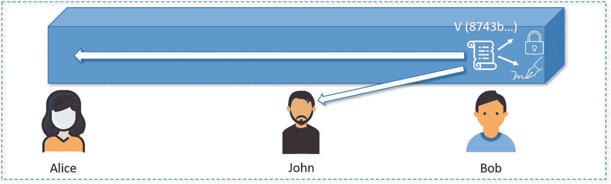

一幅图描绘了三个角色：爱丽丝、约翰和鲍勃。图中标注了 `V(8743 b)` 值以及一支笔和一把锁的符号。

这个哈希值 `V` 就是锁；而密钥则是解锁 `HTLC` 的代码。

爱丽丝与约翰创建了一个哈希时间锁定合约（`HTLC`），并告知约翰，如果他在两天内能提供 `V` 的原像，她就会向他支付。爱丽丝签署了一笔交易，其锁定时间设为广播后的两天。约翰在知晓 `V` 后可以赎回该笔资金，之后，只有爱丽丝才能赎回。`HTLC` 允许爱丽丝向约翰做出有条件的承诺，同时确保如果约翰始终不知道 `V` 是什么，她的资金也不会意外损失。

约翰也做了同样的事情，他与鲍勃创建了一个 `HTLC`，约定如果鲍勃能在一天内提供 `V`，他就会向鲍勃支付。然而，鲍勃实际上确实知道 `V`。因为鲍勃可以使用他的密钥从约翰那里提取所需金额，所以鲍勃可以认为来自爱丽丝的支付已完成。现在，他毫无保留地将 `V` 告知约翰，以便他们也能收到各自的资金。

鲍勃在一天内向约翰披露了他的密钥，鲍勃从而从约翰处获得支付。

约翰在两天内向爱丽丝披露了他的密钥，约翰从而从爱丽丝处获得支付。

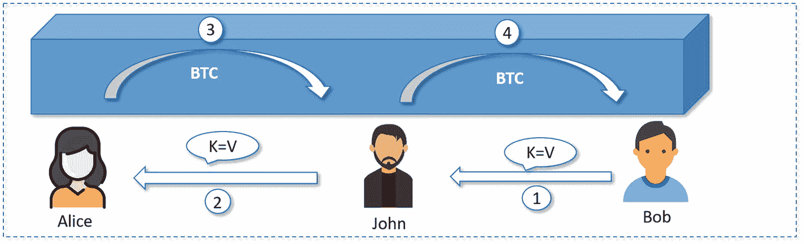

一幅图描绘了三个角色：爱丽丝、约翰和鲍勃。图中指出了 `1、2、3、4 BTC` 的处理流程，并提及 `K = V`。

在各方都配合完成后，所有这些交易都在闪电网络内部发生。每个人都以机械化的方式获得支付。闪电网络本质上是近乎原子化且双向的，这意味着要么每个人都得到支付，要么没人得到支付。

在闪电网络中，当支付交易被广播时，所有单个交易都会先被验证，并且它们必须与交易历史记录匹配，以避免广播虚假或不正确的交易。对于欺诈交易还会施加惩罚，如果闪电网络检测到系统中有恶意行为者，他们会立即被收取罚金。通过这种方式，整个网络在抑制不良行为的同时，确保了可信度和一致性。

## 总结

本章的主要目的是介绍比特币网络的基本概念。尽管这只是对比特币整个区块链的浅显涉猎，但本章为丰富你的比特币知识提供了机会。本章首先讨论了比特币的历史，然后我们学习了比特币的基本概念（包括比特币钱包和比特币网络）。接着，我们回顾了比特币交易，以帮助你熟悉比特币区块链背后的关键概念，这些概念构成了比特币网络的支柱。最后，我们还简要介绍了闪电网络的概念。

在下一章中，我们将继续我们的学习之旅，探索以太坊：通往加密货币的门户。