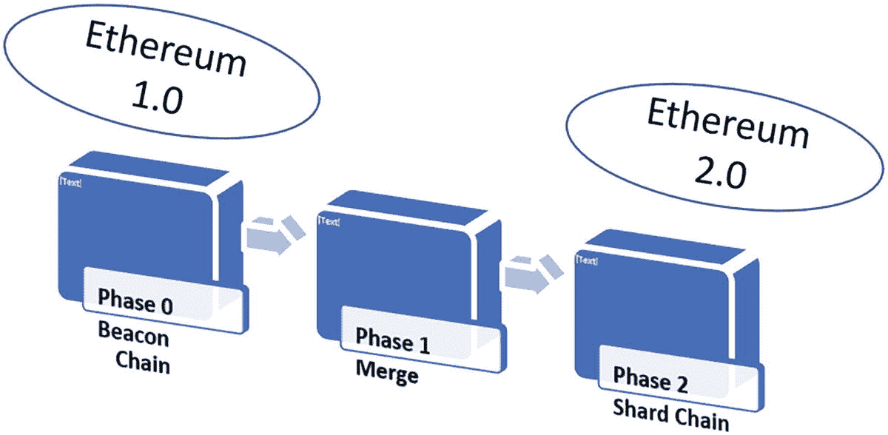
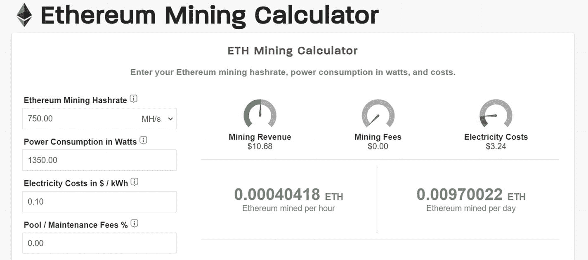
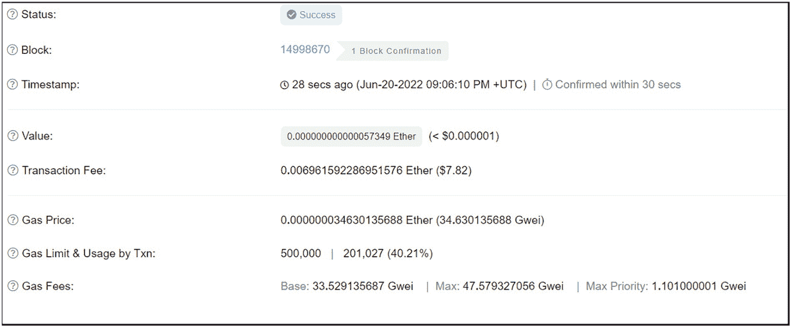
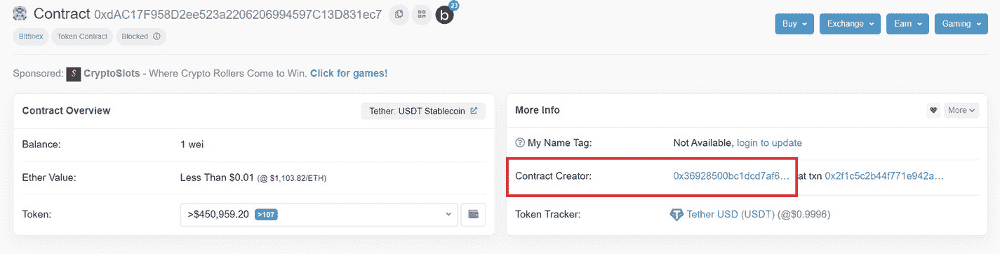
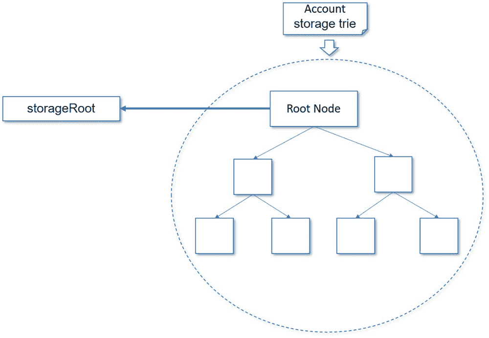
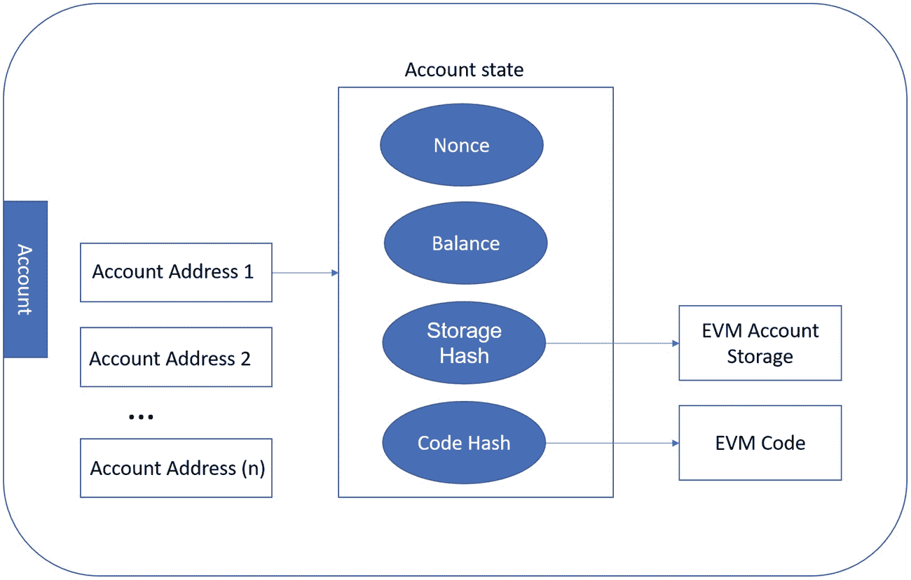
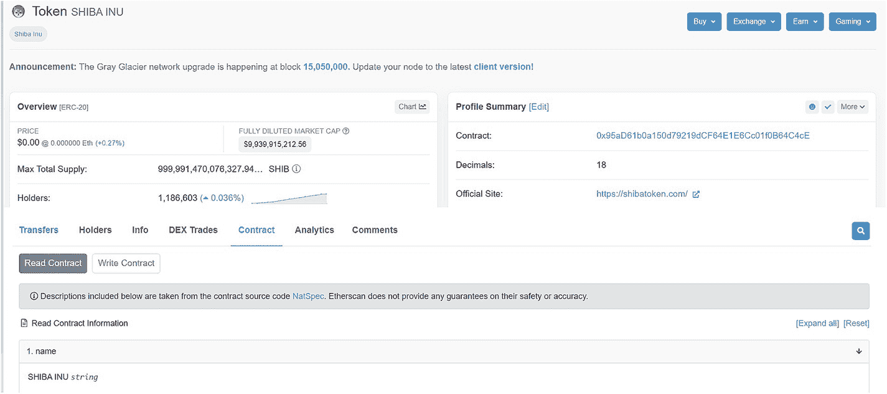
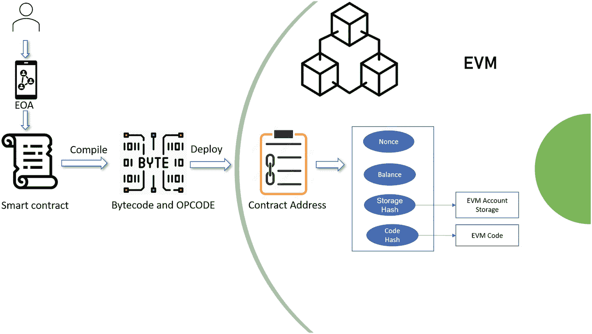
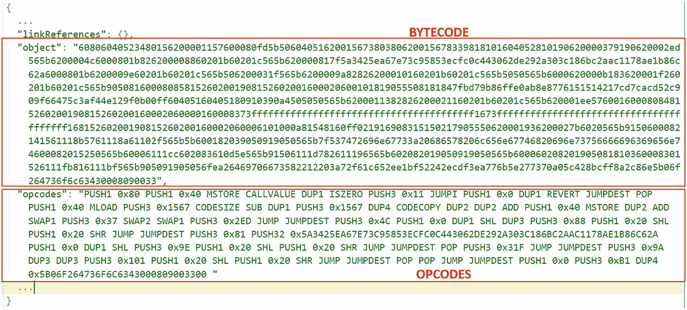

# 以太坊：通往加密货币的门户

艾伦·图灵，数学家、逻辑学家和计算机科学家，被公认为计算机科学之父。20 世纪 30 年代，他发明了通用图灵机。假设有足够的内存，图灵机仅使用两个符号（0 或 1）排列在潜在的无限一维序列中，就能计算出任何内容。这是第一台计算机的基础。因此，图灵完备性指的是任何可以在图灵完备环境中解决和实现的计算问题，无论其多么复杂。

以太坊，仅次于比特币的第二大加密货币，被认为是一台分布式图灵机。它引入了一种内置的图灵完备编程语言——智能合约，可用于创建各种去中心化应用（也称为 Dapps）。

上一章介绍了比特币，作为区块链技术的首次实现和世界上最流行的加密货币。

在本章中，我们将继续探索以太坊区块链，它是作为图灵完备的区块链构建的。本章从以太坊的历史开始。接着，我们涵盖了许多以太坊的基本概念和基础操作，包括以太币、Gas 和以太坊账户。然后，为了更深入、更全面地理解以太坊，我们概要性地概述了以太坊虚拟机（EVM）。我们还将了解重要的以太坊客户端和节点实现。最后，我们讨论以太坊如何工作，并探索其内部架构。

本章的目标之一是帮助你掌握理解以太坊机制所需的技术背景，并让你准备好在下章开发你的第一个去中心化应用。

本章围绕几个主要主题展开：

-   以太坊的历史
-   认识以太坊
-   以太坊的工作原理

## 以太坊的历史

维塔利克·布特林（Vitalik Buterin）是一位俄裔加拿大作家和程序员，自 2011 年（比特币诞生仅两年后）起便涉足比特币和加密货币领域。维塔利克成为一名作家，为《比特币杂志》网站每写一篇文章就能赚取 5 个比特币。很快，他成为了《比特币杂志》的联合创始人。随着对比特币理解的加深，布特林成为了比特币专家，并意识到了比特币功能的局限性。2013 年，维塔利克用六个月时间环游世界，学习、会面并与比特币开发者交流。他认识到，通过在比特币的基础上进行迭代，他可以构建一个新的、可能更好的区块链版本。

### 白皮书发布（2013 年 11 月）

2013 年 11 月，年仅 19 岁的维塔利克发表了一篇题为《以太坊：下一代智能合约和去中心化应用平台》的白皮书，阐述了以太坊的总体构想。

这篇解释以太坊概念的白皮书包含以下内容：

-   它提供了一种内置的图灵完备编程语言，可用于创建“智能合约”——一种在区块链上运行的自动执行程序。
-   它在区块链中建立了点对点交易。该平台可以创建和构建智能合约和去中心化应用，允许任何人定义、创建和交换各种类型的价值：加密货币、股票以及许多其他资产。

### 黄皮书发布（2014 年 4 月）

2014 年 4 月，加文·伍德博士发布了以太坊黄皮书，对以太坊协议给出了技术定义——《以太坊：一种安全的去中心化通用交易账本》，该黄皮书描述了以太坊协议的技术定义。

### 以太坊的诞生（2014 年 7 月）

以太坊于 2014 年 1 月在迈阿密的北美比特币大会上公开宣布。作为非营利组织，以太坊基金会于 2014 年 7 月 6 日在瑞士楚格成立。以太坊的创始成员包括维塔利克·布特林、加文·伍德、查尔斯·霍斯金森、安东尼·迪·伊奥里奥、米哈伊·阿利塞和乔·鲁宾。

### 启动以太币销售（2014 年 7 月至 9 月）

2014 年 7 月 20 日，以太坊基金会启动了一项为期 42 天的众筹活动。2014 年 9 月 2 日，公开众筹结束。以太坊基金会筹集了 31,591 个比特币，在销售结束时价值约 1800 万美元。

### 以太坊发布（2015 年 6 月）

在 2014 年和 2015 年期间，开发了许多概念验证。“Olympic”是第九个也是最后一个原型。2015 年 6 月 30 日，以太坊上线，并创建了第一个“创世区块”。


好的，作为高级文档工程师和翻译员，我将严格遵守您提供的格式要求，对给定的英文文本进行翻译。


### DAO 攻击（2016 年 7 月）

2016 年 5 月，一个去中心化自治组织（DAO）由开发人员在以太坊区块链上创建。该 DAO 使用智能合约进行自我治理并自动做出决策，无需传统的集中式管理结构。任何个人，无论身处何地，都有权参与和投票。首次 DAO 众筹非常成功，筹集了创纪录的 1270 万枚以太币（当时价值约 1.5 亿美元）用于资助该项目。

然而，在 2016 年 6 月 17 日，一名黑客利用了 DAO 智能合约中的某些漏洞。该黑客能够在智能合约更新其余额之前，多次调用 DAO 智能合约来退回以太币。黑客成功窃取了超过 360 万枚以太币（当时价值约 5000 万美元）。

由于 DAO 投资者损失了巨额资金，以太坊社区决定逆转该攻击以退还损失的资金，这导致以太坊分叉成两条区块链。一条是当前的以太坊区块链，代币持有者按 1 ETH 兑换 100 DAO 代币的汇率进行了兑换，与初始发行的汇率相同。DAO 投资者损失的资金得以追回。2016 年 9 月，数字货币交易所将 DAO 代币下架。与此同时，部分以太坊社区成员不同意这次硬分叉，决定继续维护旧的区块链，这条链现在被称为以太坊经典。

### 以太坊 2.0（合并）

近年来，以太坊社区开始从以太坊 1.0 迁移到以太坊 2.0，也称为 Eth2、The Merge 或 Serenity。以太坊 1.0 基于工作量证明区块链创建。与以太坊 1.0 相比，2.0 有几个主要优势。表 4-1 展示了这些差异。

**表 4-1** 以太坊 1.0 和 2.0 对比

| | 以太坊 1.0 | 以太坊 2.0 |
| --- | --- | --- |
| 共识机制 | 使用工作量证明（PoW）共识。 | 使用权益证明（PoS）共识。 |
| 速度 | 网络每秒可处理约 15 笔交易（15 TPS）；常导致网络拥堵和延迟。 | ETH 2.0 网络可扩展至潜在每秒 100,000 笔交易（100,000 TPS），相比之下，Visa 为 30,000 TPS。 |
| 能耗 | 工作量证明要求矿工消耗大量算力来解决复杂的数学难题。 | 以太坊 2.0 使用权益证明共识，通过质押代币作为抵押资产来检查和验证交易并添加区块。只需最低限度的硬件算力，比工作量证明共识减少 99%的资源消耗。 |
| 安全性 | 某些强大的矿工群体可能控制网络超过 50%的活动，这可能导致如 51%攻击等漏洞。 | 在以太坊 2.0 中，网络更加去中心化。网络需要大约 16,384 个验证者。用户只需质押 32 个以太币即可参与验证以太坊网络。即使以太币较少，用户也可以加入矿池，使每个人都能共同质押并分享奖励。没有矿工控制区块链。 |
| Gas 费（交易费） | 由于网络每秒只能处理有限数量的交易，导致交易费用高昂（称为“Gas”），且交易缓慢。通常，每笔交易的平均 Gas 费约为 12 美元。随着需求急剧上升，Gas 费可能高得多，例如 100 美元。 | 以太坊 2.0 使用权益证明共识处理交易，几乎不需要 Gas 费。因此，它只收取一些基本费用，以防止网络上的恶意活动。 |

以太坊 2.0 的启动分为三个阶段，完全推出以太坊 2.0 将需要数年时间，如图 4-1 所示。



一张描绘以太坊 2.0 三个阶段的插图，展示了从阶段 0 的信标链，到阶段 1 的合并，最后到阶段 2 的分片链，从以太坊 1.0 到以太坊 2.0 的过程。

**图 4-1** 以太坊 2.0 的三个阶段

#### 阶段 0 – 信标链

阶段 0 始于 2020 年 12 月信标链的正式启动。信标链基于权益证明（PoS）构建在以太坊网络中，并管理验证者的注册表。

#### 阶段 1 – 合并

以太坊主网在此阶段与信标链合并。它正式结束了网络上的工作量证明（POW）共识，并开始采用权益证明（PoS）。2022 年 9 月 15 日，以太坊从原有的工作量证明机制切换到了权益证明机制，这被称为“合并”。此次合并将以太坊的能源消耗降低了约 99.95%。

在信标链上质押以太坊的用户可以成为验证者。

交易和去中心化应用（Dapps）将继续像以前一样运行。

#### 阶段 2 – 分片链

在此阶段，分片链将被引入网络。同时，以太坊主网络将被分割成 64 个分片。每个分片都可以运行功能完备的智能合约。该网络允许每个分片相互通信。

## 了解以太坊

在比特币网络中，比特币是数字黄金，被设计为一种交换媒介和价值储存方式。比特币为人们提供了一种无需中央银行、以去中心化方式在彼此之间转移价值的支付方式。另一方面，以太坊网络被构建为一个图灵完备的区块链。该网络用一种名为 Solidity 的图灵完备编程语言构建，该语言可以在以太坊虚拟机（EVM）上运行。用户可以在 EVM 中创建和运行去中心化应用程序（Dapps）。EVM 是所有以太坊账户和智能合约的所在地。作为以太坊区块链的原生货币，以太币（Ether）在以太坊网络内部由 Dapp 用于处理交易。例如，当智能合约执行交易时，Dapp 必须向矿工支付 Gas 费（以太币）以执行挖矿工作。

### 以太币（单位）

每条区块链都有自己的原生货币。与比特币类似，以太坊区块链中的原生货币被称为以太币（ETH）。

以太币充当“燃料”，用于支付在 EVM 上执行智能合约的费用。当矿工解出计算难题时，他们会获得以太币作为货币奖励。以太币也可以用于支付，用户可以像付款一样将以太币发送给其他用户。

就像美元有七种面额：1 美元、2 美元、5 美元、10 美元、20 美元、50 美元和 100 美元一样，以太币也被划分为若干单位。以太币的最小面额单位称为 Wei，以数字货币和密码学先驱戴伟（Wei Dai）的名字命名。戴伟创建了 Crypto++ 密码学库并发明了 B-money。其他单位还包括 Gwei、Mwei、Kwei、微以太（microether）和毫以太（milliether）。它们也有其他名称。例如，毫以太也被称为 Finney，以另一位数字货币先驱小哈罗德·托马斯·芬尼（Harold Thomas Finney II）的名字命名，他在 2004 年比特币之前实施了世界上第一个可重复使用的工作量证明系统（RPOW）。2009 年 1 月，芬尼成为了比特币网络第一笔交易的接收者。表 4-2 列出了以太币及其他单位的命名面额：

**表 4-2** 以太币面额及单位名称

| 单位名称 | 价值（以 Wei 计） | 以太币（Ether） |
| --- | --- | --- |
| Wei | 1 wei | 10^(-18) ETH |
| Kilowei (Babbage) | 1,000 wei | 10^(-15) ETH |
| Mwei (Lovelace) | 10⁶ wei | 10^(-12) ETH |
| Gwei (Shannon) | 10⁹ wei | 10^(-9) ETH |
| Microether (Szabo) | 10¹² wei | 10^(-6) ETH |
| Millether (Finny) | 10¹⁵ wei | 0.001 ETH |
| Ether | 10¹⁸ wei | 1 ETH |


### Gas、Gas 价格与 Gas 限额

与比特币类似，以太坊目前采用工作量证明（PoW）共识机制。该机制要求矿工计算并解决复杂的数学难题，验证交易，并将交易打包成区块以添加到区块链中。矿工将获得以太币（ETH）作为奖励。当用户提交交易时，需要向矿工支付以太币以执行此类工作。

根据`coinwarz.com`的数据，假设你使用一台算力为`750.00 MH/s`（每秒百万哈希）、功耗为`1350`瓦的机器，需要花费大约`$20,000`。假设电费为每千瓦时`$0.10`（根据地点不同，美国平均约为`$0.14/kWh`），挖出一个以太币大约需要`103`天。当前以太币价格约为`$1100`，因此需要一段时间才能实现盈利。图 4-2 展示了以太坊挖矿计算器的计算结果。



三个径向仪表图分别显示挖矿收入、挖矿费用和电力成本，以及以太坊挖矿算力、功耗、电费、矿池费用和每小时/每日挖矿 ETH 数量的数值。

**图 4-2** 以太坊挖矿计算器

Gas 是指在以太坊上成功执行一笔交易所需支付的费用，即因处理交易而需要支付给矿工的费用。

以太币的常用单位之一是 Gwei。它用于指定以太坊的 Gas 价格和支付交易费用。例如，1 Gwei 等于`0.000000001 ETH`。如果一笔交易费用为`0.000000050 ETH`，我们可以说这笔费用是`50 Gwei`。

在当前以太坊区块链中，标准交易费为`21,000 Gwei`。Gas 费用可以通过以下公式计算：

```
总费用 = Gas 单位（限额） * （基础费用 + 小费）
```

- **Gas 单位（限额）** – 这是指你愿意为执行一笔交易花费的最大 Gas 量。
- **基础费用** – 这是指将用户交易纳入区块所需的最低 Gas 费用。基础费用金额会根据市场供需情况由以太坊自动动态计算。
- **小费** – 也称为优先费或矿工小费。这是一项可选费用，由用户决定，并直接支付给矿工。优先费有助于你的交易被矿工优先选取并更快处理。

我们以一个真实的以太坊区块链交易为例（见图 4-3，数据来自`etherscan.io`），计算当前一笔以太坊交易的成本。



一张图片展示了 ETH 交易成本，包含状态、区块、时间戳、价值、交易费、Gas 价格、Gas 限额和 Gas 费用等字段。

**图 4-3** 以太坊交易成本（etherscan.io）

从上述示例可以看出，一笔交易的 Gas 限额为`201,027`单位，基础费用为`33.529 Gwei`，优先费用为`1.101 Gwei`；执行这笔交易的总交易费将为`0.006961 ETH`（`201,027 * (33.529 + 1.101) = 2,310,000 Gwei`）。在当前市场，1 个以太币约为`$1100`，因此这笔交易费约为`0.006961 * 1100 = $7.65`。

需要注意的是，如果你支付的费用低于所需交易费，交易将被回滚，并且你无法拿回 Gas 费，因为矿工已经为处理你的交易付出了相应的挖矿工作。即使交易失败，他们也会收取这笔费用。另一方面，如果你支付了更多的 Gas 费，多出的部分将在交易完成后返还给你。在上述示例中，有一个“Usage by Txn”字段显示只使用了`40.21%`的 Gas 费，剩余费用将退还给用户（`500,000 - 201,027 = 298,973`）。

### 以太坊账户

每个以太坊账户都有一个以太坊地址。以太坊有两种类型的账户：**外部拥有账户（EOA）**和**合约账户**。

#### 外部拥有账户（EOA）

外部拥有账户由用户拥有的公钥/私钥对控制。在第 2 章中，我们学习了如何使用`Keccak-256`哈希算法从公钥推导出以太坊地址。每个以太坊地址都是 42 个十六进制字符串，以`0x`开头，表示十六进制格式。创建以太坊账户无需成本。外部拥有账户可用于转账（以太币）或向智能合约发送交易。你需要私钥才能访问自己的资金或向他人发送资金。

#### 合约账户（CA）

合约账户由以太坊虚拟机（EVM）执行的代码控制。这些代码通常被称为智能合约代码。创建合约账户成本较高，因为它会占用网络存储空间。合约账户可以进行以太币转账并创建智能合约账户。

图 4-4 突出显示了 USDT 代币智能合约的创建者地址，该地址是一个合约账户：



一张 USDT 合约账户的截图，包含多个字段。左侧，合约概览列出了余额、以太币值和代币的数量。右侧，更多信息显示了我的名称标签、合约创建者和代币跟踪器的状态。右上角是 4 个弹出按钮。

**图 4-4** USDT 合约账户（etherscan.io）

所有账户都有四个公共字段：



账户存储字典树（trie）的圆形示意图，根节点分为 2 个区块，这 2 个区块又分为 2 个区块。根节点指向`storageRoot`。

**图 4-5** 以太坊账户 `storageRoot`

- **Nonce（交易序号）** – 每个地址都有一个 Nonce，它表示该账户的交易计数。不同账户地址可以有相同的 Nonce。Nonce 中使用的数字是唯一的，以防止双重支付的情况。
- **余额（Balance）** – 该账户拥有的以太币数量。
- **存储哈希（Storage hash）** – 有时称为`storageRoot`。每个以太坊合约账户都有自己的存储字典树（有序树数据结构），其中存储着合约数据。`storageRoot`是当前合约状态的默克尔帕特里夏字典树，它作为 32 字节整数之间的映射。基于这些合约数据计算出一个 256 位的哈希值。当合约状态发生变化时，该哈希值也会随之改变。它可用于验证过去的状态。存储哈希仅适用于合约账户。图 4-5 展示了以太坊账户的`storageRoot`。
- **代码哈希（Code hash）** – 它指的是此账户下在 EVM 上运行的合约代码。该代码是不可变的。



一个以太坊账户的矩形块示意图，包含从账户地址 1 到 n 的区块。账户地址 1 指向账户状态，该状态有 4 个文本圆圈，分别代表 Nonce、余额、存储哈希和代码哈希。存储哈希和代码哈希分别指向 EVM 账户和代码。

**图 4-6** 以太坊账户结构


### 智能合约

合约是两方或多方之间就执行特定事项达成的书面或口头协议。

以下是我们日常生活中的几个例子：

- **房屋租赁合同** – 房东将房产出租给租户以换取每月付款的租赁协议。
- **景观美化合同** – 景观设计师与客户之间的义务约定。
- **软件许可协议** – 软件公司与客户之间授予合法使用软件权利的协议。
- **个人贷款协议** – 贷款人向借款人提供贷款以换取还款及利息的书面协议。

一份有效的合同会详细说明正式要求、各方必须遵守的责任、合同事项应如何以及何时履行，以及当这些规则未被遵守时会发生什么。因此，合同对于期望按计划履行义务的每一方来说，都是一份可靠的文档。

智能合约与此非常相似，但这些详细协议是通过使用计算机代码来实现的。它们一旦在去中心化的区块链网络中创建就无法更改。当条件满足时，智能合约将自动执行，而无需第三方介入。由于区块链是去中心化、不可篡改且透明的，网络中的每个人都可以公开验证智能合约的交易结果。

尼克·萨博是第一个描述智能合约的人。他在 1997 年发表了一篇论文《智能合约的想法》。他设想将合约转换为代码，以实现无需各方之间信任的自动执行合约。为了说明他的概念，尼克使用自动售货机来解释智能合约的工作原理。当你将正确金额的钱投入机器时，你就会得到想要的产品。自动售货机内部的软件指令保证了合约将按预期履行。如今，这个想法已经传遍了全世界。

以太坊是最流行的智能合约平台。任何人都可以在区块链上创建智能合约。代码是透明的且可公开验证。每个人都可以看到智能合约的执行逻辑是什么。以下是一个来自 `etherscan.io` 的 SHIBA INU 示例。



以太坊 SHIBA INU 合约截图，展示了概览字段选择合约的代币应用和简介摘要。右上角有 4 个下拉图标。

**图 4-7** 以太坊 SHIBA INU 合约示例

在以太坊中，智能合约可以用多种编程语言编写，包括 `Solidity` 和 `Vyper`。`Solidity` 是以太坊中最流行的智能合约语言，我们将在后面的章节中进一步探讨。

每个网络计算机节点都存储所有现有智能合约代码及其当前状态以及交易数据的副本。用户通常需要支付 gas 费来执行智能合约的功能，并将该交易包含在一个新区块中。

### 以太坊虚拟机（`EVM`）

“虚拟机”或“VM”是一种模拟的计算机系统，可用于在物理计算机上运行软件。虚拟机实质上是在模拟计算机系统与运行中的操作系统（如 Windows、macOS 或 Linux）之间建立了一个隔离层。例如，使用“Parallels Desktop for Mac”，你可以在苹果 Mac 电脑上运行 Windows，如图 4-8 所示。


一张笔记本电脑图片，显示 Windows 在 Mac 笔记本上运行。菜单栏位于左上角，状态栏位于右上角。底部一行有 15 个图标。

**图 4-8** 虚拟机示例 – Windows 在 Mac 上运行

以太坊虚拟机（`EVM`）是一个图灵完备的虚拟机，允许 `EVM 字节码` 在隔离的沙盒运行时环境中运行。`字节码` 由高级智能合约编程语言（如 `Solidity`）编译而来。

在以太坊上，智能合约通常用一种名为 `Solidity` 的高级编程语言编写。`Solidity` 编译器将智能合约编译为低级二进制机器码（`字节码`）。用户只需发送一条包含这些 `字节码` 的以太坊交易，该交易无需指定任何接收者。一旦合约交易被提交到区块链，就会创建一个新的以太坊账户。合约账户存储了合约余额、合约 nonce、代码和数据。合约账户的存储哈希本质上是智能合约数据的哈希值。合约地址的创建是基于发送方的 `EOA` 地址和 nonce 确定的。`RLP` 编码后的 nonce 和 `EOA` 地址数据使用 `keccak-256` 算法进行哈希处理。`RLP`（递归长度前缀）是一种对任意嵌套的二进制数据数组进行编码的方式。当你调用一个智能合约函数时，你是在与该合约地址进行交互，合约存储的 `操作码` 将指示 `EVM` 执行该操作。合约部署过程如图 4-9 所示。



一个从人物图形流经 `EOA`、智能合约、`字节码` 和 `OPCODE`、合约地址，以及 `EVM` 区块图的流程图。

**图 4-9** 智能合约部署

合约编译后，编译器会生成 `Abi`、`字节码` 和 `操作码`。`ABI`（应用程序二进制接口）是一个 `JSON`（JavaScript 对象表示法）文件，描述了已部署的合约及其函数。它允许我们从外部调用合约函数。`字节码` 和 `操作码`（operation code）是紧凑的二进制表示形式。它们存储在区块链上，并与合约地址相关联。

`EVM` 运行时环境会将 `字节码` 解释为对应的一系列 `操作码` 指令集，并在用户调用智能合约时执行这些 `操作码`。图 4-10 显示了已编译合约的 `字节码` 和 `操作码` 示例。



字节码和操作码。它们分别以“object”和“opcodes”开头。代码由数字和字母组成。

**图 4-10** Solidity 编译后的 `字节码` 和 `操作码` 示例

你可以从以太坊官网 ([`ethereum.org/en/developers/docs/evm/opcodes/`](https://ethereum.org/en/developers/docs/evm/opcodes/)) 找到每个 `字节码` 对应的 `操作码` 参考。大约有 148 个独特的 `操作码`，这使得 `EVM` 能够计算几乎任何任务，从而使其成为图灵完备的机器。

`操作码` 可以分为以下几类：

-   算术运算、比较和按位逻辑运算（`ADD`、`SUB`、`GT`、`LT`、`AND`、`OR` 等）
-   执行上下文查询（`CALL`、`DELEGATECALL`、`CALLCODE` 等）
-   栈、内存和存储访问（`POP`、`PUSH`、`UP`、`SWAP`、`LOAD`、`STORE`、`MSSTORE 8`、`M SIZE` 等）
-   控制流操作（`STOP`、`RETURN`、`REVERT` 等）


