# 日志、调用及其他操作码

让我们用前面的字节码示例来模拟 EVM 解释器。我们将重点关注合约字节码的前 16 个字节：`6080604052348015`。根据操作码参考表，我们可以将字节码转换为操作码，如表 4-3 所示。

**表 4-3** 字节码到操作码的转换（`6080604052348015`）

| 字节码 | 操作码 | 参考(`Opcode`, 名称) | 描述 | Gas |
| --- | --- | --- | --- | --- |
| `60 80` | `PUSH1 0x80` | `0x60` = `PUSH1` | 复制第 1 个栈顶元素 | 3 |
| `60 40` | `PUSH1 0x40` | `0x60` = `PUSH1` | 复制第 1 个栈顶元素 | 3 |
| `52` | `MSTORE` | `0x52` = `MSTORE` | 将字保存到内存 | 3* |
| `34` | `CALLVALUE` | `0x34` = `CALLVALUE` | 获取指令存入的价值 | 2 |
| `80` | `DUP1` | `0x80` = `DUP1` | 复制第 1 个栈顶元素 | 3 |
| `15` | `ISZERO` | `0x15` = `ISZERO` | 简单的非运算符 | 3 |

EVM 是一个简单的基于栈的执行机器，它会执行操作码指令。栈（有时称为“下推栈”）是一个线性的元素集合，新元素插入到最后一个位置（称为“栈顶”），而现有元素的移除总是在栈顶位置进行。它也被称为后进先出（LIFO）。在上述已解释的操作码示例中，我们期望 EVM 按顺序执行标准的栈操作：


一个逐步展示字节码到操作码转换流程的文本形式示意图。

EVM 栈的深度为 `1024` 个元素，每个元素包含一个 256 位（32 字节）的字，或者 32 个块，其中每个块的大小为 8 位（1 字节）。采用 256 位的原因主要是为了将 Keccak-256 加密哈希函数应用于任意数量的输入，并将其转换为一个唯一的 256 位哈希值。在 EVM 中，合约可以存储和读取上述项目中的数据。EVM 有三个可存储项目的地方——存储、内存和栈。

内存是用来短期保存临时值的位置。在智能合约函数调用之间，它会被清除。

当从内存读取数据时，EVM 会使用 `MLOAD`。要写入 32 字节（256 位）的数据，会使用操作码 `MSTORE`。当写入 1 字节（8 位）的数据时，EVM 会使用 `MSTORE8`。图 4-11 展示了 EVM 如何使用操作码来读取和写入合约内存。

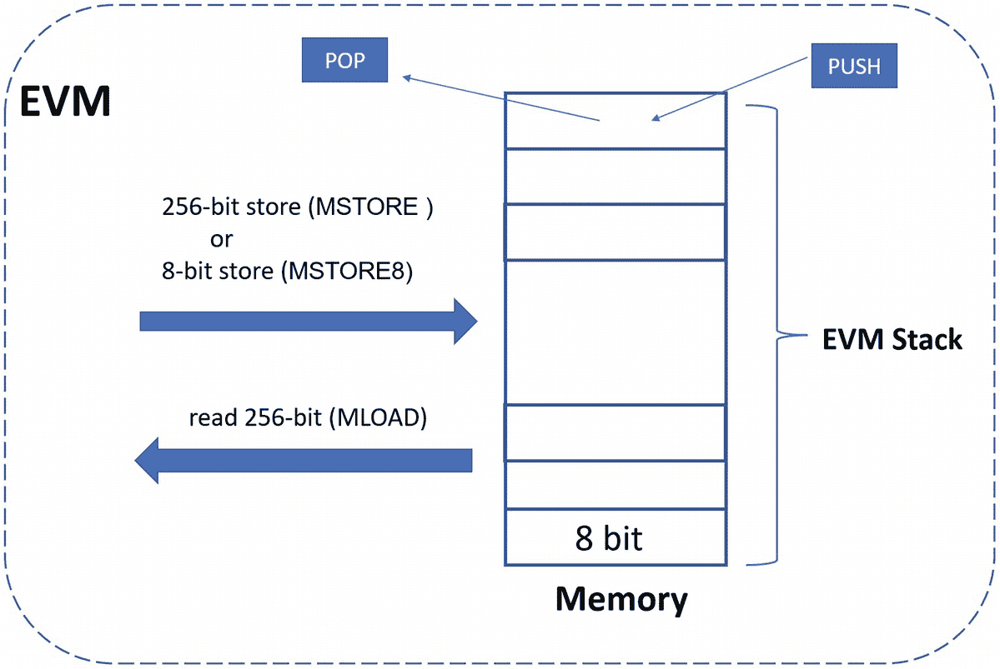

一个由具有入栈和出栈操作的堆叠内存块组成的框图。它带有“E V M 栈”标签。向内和向外的箭头分别标注为 `MSTORE` 和 `MLOAD`。

**图 4-11** 操作码读取和写入合约内存

存储是永久保存数据的地方。当在 EVM 中运行的智能合约使用永久存储时，这些数据将成为以太坊状态的一部分。你可以将存储视为一个数组，其中每个数组项的大小为 256 位（32 字节）。外部读取存储值是不需要费用的。然而，向存储写入数据的成本非常高，其操作码是 `SSTORE`，目前每个 32 字节字的成本是 20,000 Gas。让我们来看看成本是多少。

首先，将 Gas（Gwei）转换为 ETH - `20,000 * 0.000000001 ETH = 0.00002 ETH`，然后，计算成本：`$1100 * 0.00002 = $0.022`。

向存储写入的成本是向内存写入成本的 6000 倍以上。

在前面的表格（表 4-3）中，我们列出了操作码指令在 Gas 成本方面的前几个步骤，每个操作码都有其自己的基础 Gas 成本。所有以太坊合约的执行都是公开进行的。攻击者可以创建合约来执行大量、昂贵的操作（DDoS——分布式拒绝服务攻击）以拖慢以太坊网络。通过在每次 EVM 操作码执行中包含 Gas 成本，以太坊网络可以防止此类攻击。

## 以太坊节点

在互联网上，任何连接到网络的系统或设备也称为节点。区块链网络也是如此。当一个节点连接到以太坊网络时，它会下载一份区块链数据的副本，并参与网络通信，与其他节点进行交互。根据 `etherscan.io` 的数据，大约有 4,131,021 个节点连接到以太坊网络。

节点有三种类型：全节点、归档节点和轻节点。每种类型的节点消耗数据的方式不同。

### 全节点

全节点将存储所有最近的区块链数据，运行自己的 EVM 环境，并能执行 EVM 指令。它们在参与区块链交易验证和维护区块链当前状态时会很有帮助。当一个新区块中的交易不符合以太坊规范定义的规则时，它们将被丢弃。例如，如果 Alice 向 Bob 发送 50 ETH，但 Alice 的账户没有足够的以太币，或者在支付了非常少的 Gas 费用时，全节点在验证交易时会将其标记为无效并回滚。一个全节点可以直接部署智能合约，并与网络中的任何智能合约进行交互。

一个全节点会存储有限数量的最新区块。默认情况下是 128 个（如果使用快速同步选项，则为 64 个）。每个以太坊区块的大小通常约为 80KB，或者在十分钟内约为 4 MB。这 128 个区块大约包含最近一周的跟踪数据。当你查询无法从全节点获取的历史区块数据时，通常会收到“缺失状态树节点”错误。这个错误意味着你需要一个归档节点。

当一个全节点首次连接到网络时，同步全节点数据可能非常耗时，可能需要数周才能完成同步！之后，节点需要保持在线以进行区块数据的升级和维护。否则，它必须重复完整的同步过程。创建一个新区块通常需要 13 秒。当新数据到达时，全节点可能会删除旧的区块链数据以节省磁盘空间。

运行一个使用快速同步的全节点的硬件要求：
- 配备 4 核或更多核心的快速 CPU
- 16 GB 或更大的内存
- 至少 500 GB 可用空间的快速固态硬盘
- 25 MBit/s 或更高的带宽

### 归档节点

归档节点使用一种称为“归档模式”的特殊配置运行。归档节点会存储自创世区块以来的所有区块链数据。它还构建了一个历史状态的归档。

当前归档型以太坊区块链的大小约为 12 TB。

通常，在大多数情况下，我们不需要归档节点数据。全节点可以提供大部分数据，例如检查账户余额、转账等。但有时，你可能需要查询去年的账户余额、你曾经拥有的资产或交易。全节点会定期修剪数据，只存储最近 128 个区块的数据（大约 25 分钟）。节点必须重新同步才能获取更早的数据，这会导致数据提取速度过慢。归档节点本地拥有所有数据，可以快速获取过去的数据。

归档节点数据通常用于区块链服务，如区块浏览器、数据分析等。同步完整的归档节点数据将比全节点同步花费更长的时间。可能需要至少一个月。

以下是运行一个完整归档节点的硬件要求：
- 配备 4 核或更多核心的快速 CPU。
- 16 GB 或更大的内存。
- 至少 6 TB+ 可用空间的快速固态硬盘。
- 25 MBit/s 或更高的带宽。

### 轻节点

轻节点仅下载最少的区块头信息，并通过检查区块头中的状态根来验证数据的有效性。轻节点被设计为以全节点作为中介进行交互，并依赖全节点来执行区块链操作，从请求账户余额到与智能合约交互。因此，轻节点无需保持在线状态，也无需在本地存储大量千兆字节的数据。轻节点对于在低内存和计算设备（如手机、物联网设备和笔记本电脑）上运行非常有用。

### 以太坊客户端

正如我们刚刚学到的，轻客户端主要在移动设备上实现。虽然搭建全节点或归档节点需要很长时间来同步，但运行自己的节点有诸多好处：

1. 你的节点可以作为网络验证者来验证所有交易和区块。
2. 你可以自行验证应用客户端的交易数据，无需第三方来验证交易——“勿信，请验证。”
3. 你将拥有当前网络状态的一致视图，无需依赖那些数据可能延迟或不可信的其他公共节点或服务。
4. 你将拥有更高的数据隐私性。当你使用第三方软件或工具提交交易时，这些服务可能会读取你的 IP 地址以及账户信息。IP 地址会暴露你当前的位置。

要同步并与以太坊网络通信，你需要安装以太坊客户端软件。最常用的以太坊客户端是 `Geth`。`etherscan.io` 显示，90.3% 的以太坊节点安装 `Geth` 作为客户端加入网络，并与其他节点建立 p2p 通信通道。图表 4-12 展示了总体以太坊客户端使用情况。

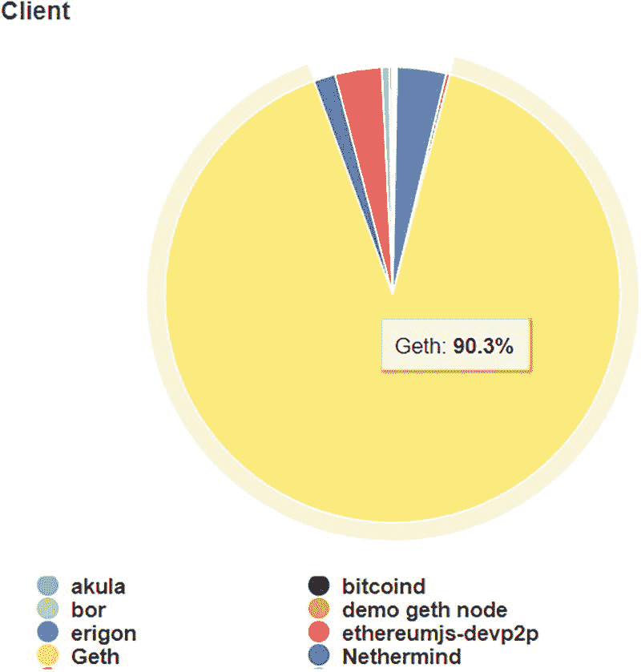

一个饼状图展示了整体以太坊客户端使用情况。最常用的以太坊客户端是 `Geth`，占比 90.3%。还估算了其他 8 种客户端的使用情况。

**图 4-12** 总体以太坊客户端使用情况

`Geth`（Go Ethereum）是一个开源命令行界面（cli），用于运行用谷歌编程语言 Go 编写的以太坊节点。

以太坊社区构建并维护了 Go Ethereum。

使用 `Geth`，节点可以执行交易、挖矿、账户间转账以太币，以及在以太坊区块链上部署和与智能合约交互。`Geth` 可以直接从 `Geth` 的官方网站 [`https://geth.ethereum.org/downloads/`](https://geth.ethereum.org/downloads/) 下载。该网站提供标准的安装指南。

安装好 `Geth` 后，你可以以同步模式运行 `Geth`，成为全节点、轻节点或归档节点。

同步全节点的 `Geth` 命令：
```
geth --syncmode full
```

当同步模式为全模式时，`Geth` 将下载所有区块并从创世区块重放所有交易。全节点的状态将在内存中保留最后的 128 个区块。

同步轻节点的 `Geth` 命令：
```
geth --syncmode light
```

当同步模式为轻模式时，`Geth` 将下载最新的 2300 个区块并重放相关交易。因此，轻模式的同步过程比全模式快得多。

同步归档节点的 `Geth` 命令：
```
syncmode full --gcmode archive
```

`Geth` 将下载所有区块，从创世区块重放所有交易，并将所有中间状态写入归档磁盘。

以太坊社区中还有许多其他可用的以太坊客户端。这些客户端由不同的团队开发，并使用不同的编程语言实现。所有这些客户端都在行业中被积极使用。表格 4-4 总结了不同客户端的用途。

**表 4-4** 以太坊客户端

| 客户端 | 编程语言 | 磁盘空间（快速同步） | 磁盘空间（完整归档） |
| --- | --- | --- | --- |
| `Geth` | Go | 400 GB+ | 6 TB+ |
| `OpenEthereum` | Rust | 280 GB+ | 6 TB+ |
| `Besu` | Java | 750 GB+ | 5 TB+ |
| `Nethermind` | C#, .NET | 200 GB+ | 5 TB+ |

`Geth` 拥有一个使用 `GoJa JS 虚拟机` 构建的 JavaScript 控制台。

`Geth` 拥有内置的 JavaScript 控制台，并支持所有标准的 `web3 JSON-RPC API`，称为 `web3.js`，它与 `ECMAScript 5.1` 兼容。你可以使用 `JSON-RPC API` 与你的节点交互。`Geth` 支持多种方式让客户端应用向节点发送原始 JSON 对象。其中一种最广泛使用的协议称为基于 HTTP 的 JSON-RPC。JSON 代表 JavaScript 对象表示法。它是一种在服务器和 Web 应用之间传输数据的开放标准文件格式。在 JSON 文件中，数据以键/值对的形式存在，并用逗号分隔。以下是一个示例：
```json
{
  'name': 'Alice',
  'gender': 'Female',
  'account': 12345
}
```

RPC 代表“远程过程调用”，用于其他远程系统进程。当客户端应用使用基于 HTTP 的 JSON-RPC 向 `Geth` 发送 JSON 数据时，`Geth` 将执行区块链中由 `Web3 API` 提供的特定任务。Web3 运行在 RPC 层之上，如图 4-13 所示。

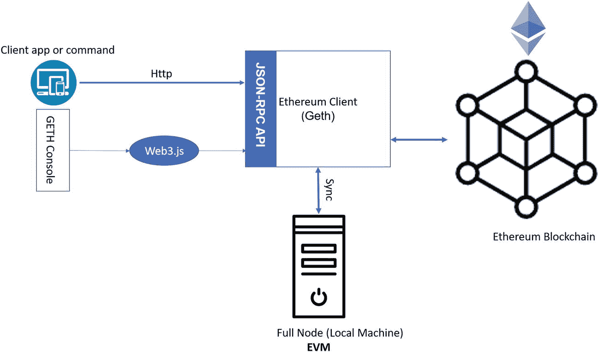

一个模式图描述了客户端应用、以太坊客户端、全节点 E V M 和以太坊区块链之间的相互关系。

**图 4-13** 通过 JSON-RPC 调用以太坊客户端

#### Geth 控制台

要启动 `Geth` JavaScript 控制台，你可以运行 `Geth attach` 命令并配合 IPC。IPC（进程间通信）提供对所有 `Web3 API` 的无限制访问。当 `Geth` 控制台与 `Geth` 节点运行在同一台机器上时，你可以使用 IPC 进行连接。

打开运行中的 `Geth` 实例的控制台，结果将如下所示：

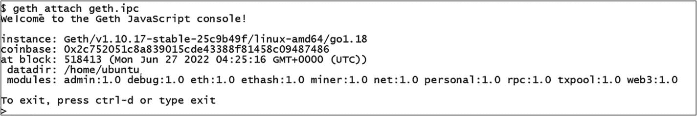

`Geth` JavaScript 控制台的代码。它包含以下标签：instance、coinbase、at block、datadir、modules 和 exit

要获取对 `Web3 API`（包括 `eth`、`personal`、`admin` 和 `miner`）的支持，`Geth` 控制台提供了 `web3` 命令。让我们来看看与 `eth` 相关的 API。在 `Geth` 控制台中输入 `eth`。它将显示所有支持的 `eth` 命令。

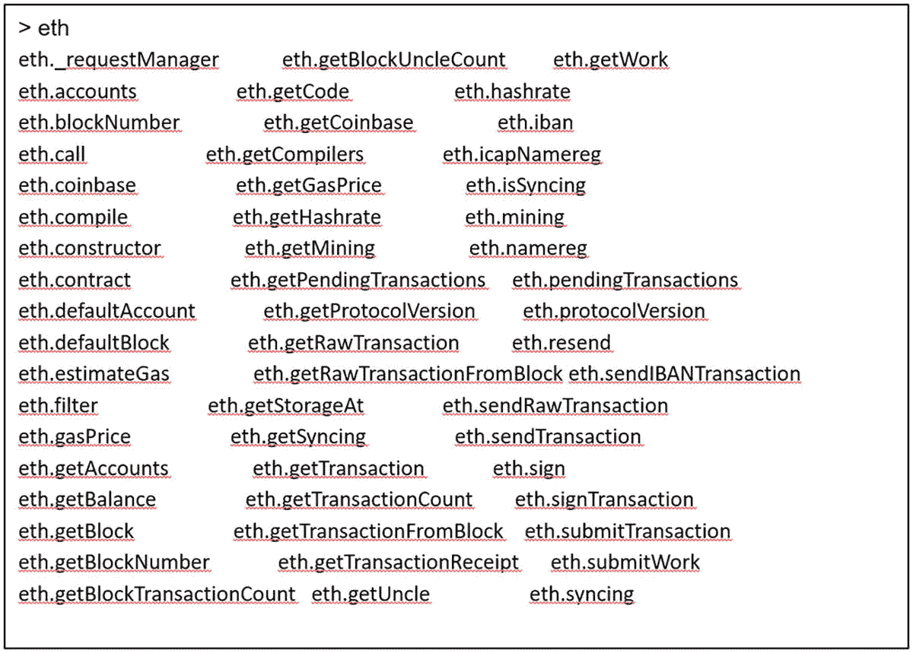

以 `eth.` 开头的 `eth` 命令列表。

要列出网络中你当前的所有账户，只需运行以下命令：
```
eth.accounts.
```
列出的账户输出应该类似于以下内容：

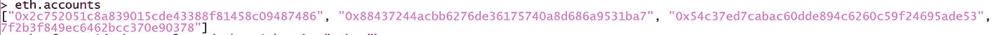

一段文本代表了控制台中 `eth.accounts` 的输出。它由数字和字母组成。

要检查账户余额，并将 wei 转换为 ether，请运行以下命令：
```
eth.getBalance('0x88437244acbb6276de36175740a8d686a9531ba7') 以获取 wei 余额
```
或者，我们可以直接转换为 ether：
```
web3.fromWei(eth.getBalance('0x88437244acbb6276de36175740a8d686a9531ba7'),'ether')
```
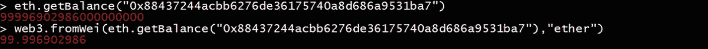

一张图片包含从 `eth.getBalance` 开始并直接转换为 `web3` 的获取账户余额的代码。

要获取区块链的最新区块编号，请运行以下命令：

一张图片包含获取区块链区块编号的命令，运行命令 `>eth.blockNumber` 并显示 518560。

然后，你可以通过调用以下命令显示匹配区块的摘要信息：
```
eth.getBlock (blockNumber)
```
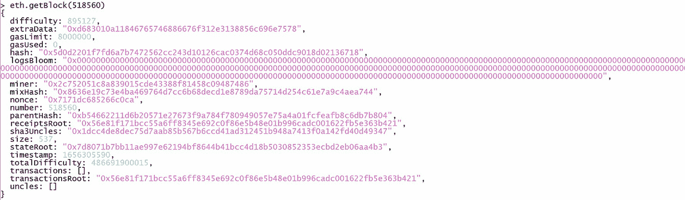

一张 `Geth` 控制台运行 `eth.getBlock` 的图片，打开了一个新的 `Geth` 窗口。该命令将出现在控制台中。

要退出 `Geth` 控制台，只需运行 `exit` 或按 `CTRL-C`。

#### 通过命令行使用 Geth JSON-RPC

`cURL` 代表“客户端 URL”，是一个命令行工具，用于通过多种支持的协议（HTTP、IMAP、SCP、SFTP、SMTP、LDAP、FILE 等）传输数据。`curl` 的语法如下：
```
curl [选项] [URL...]
```
例如，你可以打开一个窗口或 macOS 终端，输入下面的 `curl` 命令，你将看到来自远程服务器的 HTTP 响应：
```
curl -k www.apress.com/us
```

要以 HTTP 模式启动 `Geth`，你可以使用 `--http` 标志，如下所示：
```
geth –http
```
默认端口是 `8545`。一旦 `Geth` 节点启动，我们就可以运行 `curl` 命令来查询一些有用的区块链信息。

要获取 `web3` 客户端版本，请运行以下 `curl` 命令：
```
curl -X POST -H 'Content-Type: application/json' \
--data '{"jsonrpc":"2.0","method":"web3_clientVersion","params":[],"id":11}' \
http://localhost:8545
```
这里的 `id` - `11` 是区块链 ID。响应结果显示 `web3_clientVersion` 为 `Geth/v1.10.17-stable-25c9b49f/linux-amd64/gol.18`。


要检查账户余额，我们在之前的 `Geth` 控制台示例中已经看到过，运行以下 `curl` 命令：
```
curl -X POST \
-H 'Content-Type: application/json' \
--data '{"jsonrpc":"2.0","method":"eth_getBalance","params":["0x88437244acbb6276de36175740a8d686a9531ba7","latest"],"id":11}' \
http://localhost:8545
```
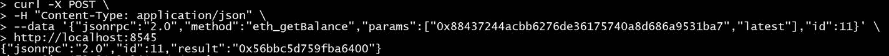

我们得到十六进制结果——`0x56bbc5d759fba6400`。

通过将十六进制值转换为十进制（`www.binaryhexconverter.com/hex-to-decimal-converter`）：
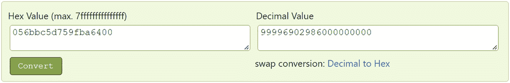

然后，我们将 Wei 转换为 Ether，并将十进制数除以 `10¹⁸`。最终结果是 `99.996902986 Ether`，这与我们在 `Geth` 控制台中运行得到的之前结果相符。

#### Geth 文件夹结构

一旦 `Geth` 安装完成，它会根据操作系统将默认的 `Geth` 本地数据目录存储在以下位置：

- `Mac`：`~/Library/Ethereum`
- `Linux`：`~/.ethereum`
- `Windows`：`%LOCALAPPDATA%\Ethereum`

其结构如图 4-14 所示。

`chaindata` – 已下载区块数据和 EVM 状态数据的目录。

`ancient` – 当 `chaindata` 中的区块超过大约 10 万个时，较旧的区块会被移动到 `ancient` 目录。

`ethash` – `Ethash` 是以太坊的工作量证明哈希算法，此位置下的文件是以太坊挖矿计算的一部分。这些文件可以安全地重新生成和删除。

`lightchaindata` – 包含区块链的轻量版本，仅包含收据（不包括数据）和内容。

`nodekey` – 公钥文件，用于其他公共对等节点连接或将对等节点添加到网络。

`nodes` – 包含对等节点连接数据，用于在启动时建立网络。

`keystore` – 存储账户信息，账户密钥可以在 `keystore` 文件夹中找到。

`geth.ipc` – 用于 `Geth` 连接所使用的进程间通信的文件。

默认情况下，`Geth` 使用 Google LevelDB 作为底层数据库实现来存储区块链数据，例如，在图 4-14 的文件夹结构中 `chaindata` 文件夹下的 `000002.ldb` 和 `000011.ldb`。LevelDB 是一个开源的磁盘键值存储。

正如我们从第 2 章“密码学”中所了解的，每个以太坊账户都由一对私钥和公钥定义。账户地址是通过取公钥的最后 20 个字节派生出来的。当我们使用 `Geth` 生成一个新账户时，新账户地址及对应的私钥对被编码在一个 JSON 文本文件（即密钥文件）中。由于它包含你账户的私钥，文件内容始终是加密的。此密钥文件可用于访问你的以太坊账户并转移资金。因此，你需要定期备份密钥文件，并确保此文件安全且不被他人访问。

让我们使用 `Geth` 控制台，通过运行命令 `personal.newAccount()` 并输入密码来生成一个新的账户地址：

生成了账户地址 `0x0b1400031bea2def60a9d8f28fa373ab95d641f6`。现在检查 `keystore` 目录，会看到为此账户生成了一个新的 JSON 文本密钥文件：

```
└── keystore
├── UTC--2022-06-28T04-14-13.945107969Z--0b1400031bea2def60a9d8f28fa373ab95d641f6
```

此密钥文件的内容是加密的，如下所示：

我们现在已经学习了以太坊客户端——`Geth`，并阐明了远程客户端（命令行或 Web 应用程序）如何通过 web3j API 调用以太坊客户端并与以太坊区块链进行交互。

### 以太坊网络

通常，人们讨论以太坊网络和 ETH 价格时，指的是以太坊主网（`mainnet`）。主网是最主要的公共以太坊生产区块链。当我们向主网部署智能合约时，必须支付 Gas 费用，而这些 Gas 费是真实的金钱。由于连接在以太坊上的节点运行着一种协议，因此还有许多其他类似的、受控的公共环境运行着相同或相似的协议来模拟主网环境。合约开发者可以在这些类生产环境中运行和测试智能合约，以确保结果符合预期。这些公共网络我们称之为以太坊测试网（`testnet`）。

在测试网中，测试智能合约时你不会花费真实金钱。以太坊测试网提供免费的以太币（Ether），供你支付 Gas 费用。这些以太币只能在测试网中使用，不适用于任何其他环境，并且在现实世界中毫无价值。作为最佳实践，你应该先在测试网中测试智能合约代码，之后再部署到主网。

许多测试网采用权威证明（`proof-of-authority`）共识机制。少数节点被选为验证者（`validator`）来执行共识工作并创建新区块。测试网不会激励工作量证明（`proof-of-work`）挖矿。有几个以太坊测试网络可供使用，你可以选择自己喜欢的测试网。自 2022 年 9 月 15 日以太坊 2.0 合并以来，少数公共工作量证明和权威证明测试网已转变为权益证明（`proof-of-stake`）。一些流行的测试网（如 Ropsten、Rinkeby 和 Kovan）即将被弃用。我们在此不讨论这些测试网。Goerli 测试网是一个权威证明测试网，它已合并为权益证明，并预计将作为权益证明测试网长期维护。

Görli 测试网络于 2019 年 3 月建立。它是一个采用以太坊 Clique 共识机制的权威证明测试网，最初由 Chainsafe 和 Afri Schoedon 提出。你可以使用官方的 Goerli 测试网水龙头（[`https://goerli-faucet.slock.it/`](https://goerli-faucet.slock.it/)）获取免费 ETH。在后续章节中，我们将使用 Goerli 测试网将一些以太币存入我们的钱包。

现在，我们已经涵盖了大部分以太坊基础知识。在下一节中，我们将探讨以太坊是如何工作的。

### 以太坊的工作原理

正如我们之前所了解的，存在一个多阶段的升级，旨在从当前的工作量证明（`PoW`）共识机制切换到权益证明（`PoS`）模型。在 `PoW` 中，矿工验证交易并将交易添加到新区块。新区块被广播到整个网络，验证者将进行验证并最终提交到以太坊网络。这个过程通常以 10 到 20 秒的恒定速率进行。在 ETH 2.0 的 `PoS` 中，网络处理能力可达每秒 10 万笔交易。

在以太坊中，交易由用户的 `EOA` 账户发起并安全签名。例如，Alice 想向 Bob 发送一个以太币。Alice 将为此转账发起一笔交易。接着，以太坊网络传输该交易。一旦转账完成，Bob 的账户将增加一个以太币，而 Alice 的账户必须减少一个以太币。以太坊是一个单一的世界状态机。交易是唯一能触发变化并更新以太坊状态的事物。图 4-15 描述了一笔交易中以太坊状态的变化。

以太坊中有三种类型的交易：

1.  在两个 `EOA` 之间转移资金的交易（例如，Alice 向 Bob 发送一个以太币）。
2.  部署合约的交易。
3.  与已部署合约函数进行交互并执行的交易（例如，更新代币总供应量）。

#### 交易的结构

当用户提交交易时，区块链需要为矿工的挖矿和验证支付 Gas 费用。

让我们使用 `Geth` 控制台提交一笔转账 0.05 以太币的交易，然后从返回的交易哈希中获取交易收据，如图 4-16 所示。

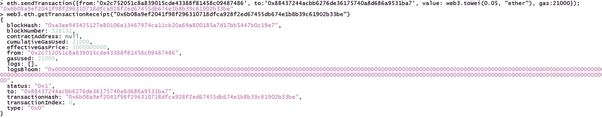

提交交易并获取收据的代码。代码包含字母数字字符。

图 4-16 提交交易并获取交易收据

从 `Geth` 的日志中，我们可以看到交易已提交，并生成了一个交易哈希和一个随机数（`nonce`）：

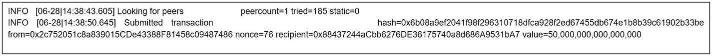

显示已提交的 `Geth` 交易及生成的交易哈希的图像，包含文本和字母。

图 4-17 展示了来自 `etherscan.io` 的交易详情示例。

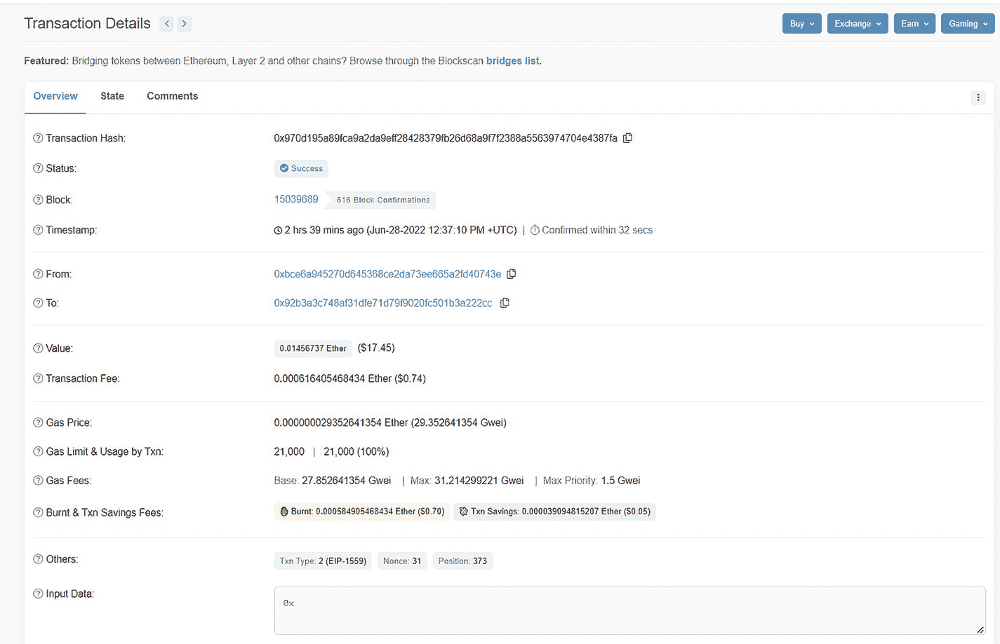

概述标签页的截图，列出了交易详情，如交易哈希、状态、区块、发送方和接收方以及价值。同时显示了状态和备注标签页。

图 4-17 提交交易并获取交易收据

一笔交易详情包含以下数据：

- `From`（发送方） – 发送方的以太坊地址。
- `To`（接收方） – 接收方的以太坊地址。
- `Nonce`（随机数） – 交易的序列号。`Nonce` 由发起交易的原始 `EOA` 发出。它是一个唯一数字，用于防止重放同一笔交易。
- `Gas Price`（Gas 价格） – 交易创建者支付的每单位 `Gas` 的交易费用（以 Gwei 为单位）。
- `Gas Limit`（Gas 限制） – 该交易最多可消耗的 `Gas` 量。
- `Value`（价值） – 发送给接收方的以太币数量。
- `Data`（数据） – 交易输入的二进制的载荷数据，仅用于发送消息调用和执行合约函数。
- `Signature`（签名） – `v, r, s`。这是发送方的身份标识。发送方使用 `EOA` 通过其私钥对交易进行签名。它使用加密的 ECDSA 数字签名。`v`、`r` 和 `s` 是交易签名的值。

请花点时间阅读这个长列表。你不需要记住每一个字段。我们描述每个字段是为了帮助你理解它们的含义。当你在以太坊中进行更深入的工作时，这些术语可能会频繁出现。

#### 交易收据

在图 4-16 中，我们在运行 `web3.eth.getTransactionReceipt(transactionHash)` 后看到了交易收据输出。当交易收据可用时，意味着该交易已被添加到一个区块中。当交易处于待处理（`pending`）状态时，收据返回 `null`。

以下是交易收据包含的字段：

- `BlockHash` – 包含该交易的区块的哈希。
- `BlockNumber` – 该交易所在区块的编号。
- `TransactionHash` – 字符串，32 字节——交易的哈希。
- `TransactionIndex` – 交易在区块中的索引位置。
- `From` – 发送方的以太坊地址。
- `To` – 接收方的以太坊地址。如果是合约创建交易，则为 `null`。
- `CumulativeGasUsed` – 该笔交易以及同一区块中所有先前交易消耗的 `Gas` 总量。
- `GasUsed` – 该笔特定交易消耗的 `Gas` 总量。
- `ContractAddress` – 与该交易关联的合约地址。如果交易是合约创建，则返回合约地址，否则为 `null`。
- `Logs` – 该交易的日志信息。
- `Status` – `0x0` 表示交易失败，`0x1` 表示交易成功。

#### 区块

如第 1 章所述，每个区块都有头部和体部。区块体包含一系列交易。这一点对比特币和以太坊都是成立的。以太坊的区块结构如图 4-18 所示。

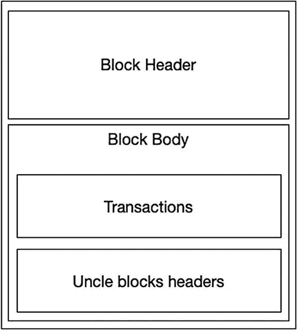

图 4-18 展示了区块头部和区块体部的两个区块。区块体部包含两个子块：交易和叔块头部。

**图 4-18**  
以太坊区块结构

以太坊的区块体部还包含“ommer”块，通常被称为“uncle”块（叔块）。当多个区块解决方案被找到时，叔块会被创建，用于奖励矿工。

当多个矿工解出密码学难题并为链提议一个新块时，网络中只会接受其中一个块。由于其他矿工完成了相同的工作，网络会对他们进行奖励。这些被确认的区块将附加到新接受的区块上。我们称之为叔块，如图 4-19 所示。

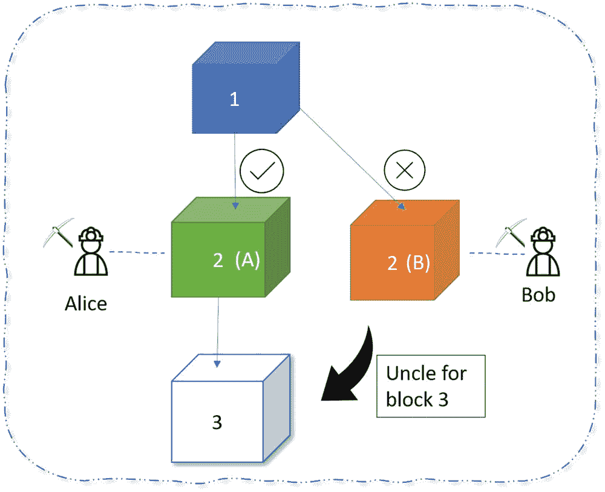

图 4-19 展示了一个三层立方体的流程图，从顶部开始分别标记为 1、2 和 3。第一层的立方体 1 指向第二层的两个立方体，分别标记为 2 A（Alice）和 2 B（Bob）。2 A 处有对钩，2 B 处有叉号。2 B 立方体通过叔块（uncle）连接到第三层的立方体 3。

**图 4-19**  
以太坊叔块

例如，在图 4-19 中，有两个区块分别由矿工 Alice 和矿工 Bob 提议。Alice 的区块（A）最终被接受并添加为新的 2 号区块。Bob 的区块（B）最终被拒绝。然后，网络中的一名矿工使用 Bob 的区块（B）创建了一个 3 号区块，并指定 Alice 的区块为父区块，Bob 的区块为叔块/ommer 块。通过这种方式，Alice 将获得全部奖励，而 Bob 仍能获得部分奖励。

如前所述，每个区块体部都包含一个交易列表。以下是来自 `etherscan.io` 的一个区块示例。我们可以看到该区块中有 374 笔交易，如图 4-20 所示。

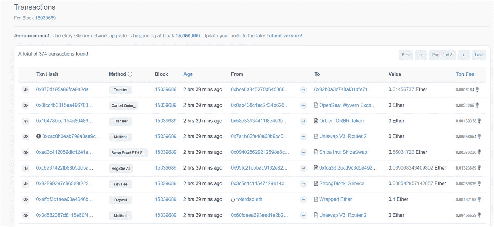

图 4-20 是一个交易表格的截图，列标题包括：`Txn hash`、`method`、`block`、`age`、`from`、`to`、`value` 和 `Txn fee`。该区块中共有 374 笔交易。

**图 4-20**  
一个区块：交易列表

区块编号为 `15039689`。让我们再看看其他区块详情，如图 4-21 所示。

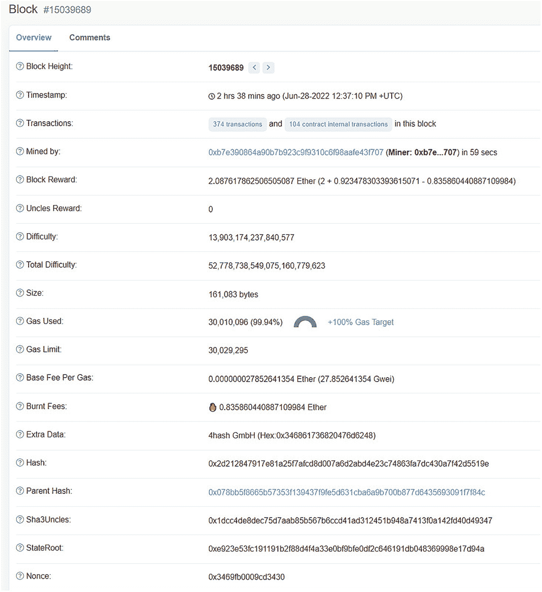

图 4-21 展示了以太坊区块的详细视图，包括概览和评论。概览是一个列表，包括交易详情、时间戳、难度、大小、`Gas` 限制和费用。

**图 4-21**  
以太坊区块详情

区块头部包含关于以太坊区块的一些关键信息。每个区块头部都有以下重要字段：

- **区块编号** – 也称为区块高度。区块链祖先区块的长度。第一个区块（创世块）的编号为零。此数字代表链的高度。
- **难度** – 表示通过哈希或权益证明努力挖掘一个区块的难度。
- **总难度** – 用一个整数值表示链接到指定区块的难度。
- **时间戳** – 区块被挖掘时的 UNIX 时间戳。
- `Nonce` – 请查看“以太坊账户”部分。
- **父哈希** – 也称为前一个哈希。来自前一个区块（或父区块）的哈希。每个区块都包含一个前一个哈希。通过这种方式，我们可以追溯到链中的第一个区块。
- **受益人** – 也称为“Mined by”。这是接收挖矿奖励的受益人矿工地址。
- **Gas 价格** – 请查看“`Gas`、`Gas Price` 和 `Gas Limit`”部分。
- **Gas 限制** – 请查看“`Gas`、`Gas Price` 和 `Gas Limit`”部分。
- **大小** – 区块的大小，以字节为单位。
- **哈希** – 区块的唯一 Keccak 哈希值。
- **额外数据** – 一个包含区块附加数据的字段。当矿工创建区块时，他们可以在此字段中添加任何内容。
- **状态根**：一种特殊 Merkle 树（存储整个网络状态，也称世界状态）的根节点哈希。它包含所有账户余额、合约存储、合约代码和账户 `Nonce` 的 Keccak 哈希。如果任何数据发生改变，整个状态根的值也会随之改变。
- **交易根**：存储该区块体中所有交易的交易树（transactions trie）的根节点哈希。
- **收据根**：存储该区块中所有交易收据的交易收据树（transactions receipt trie）的根节点哈希。

到目前为止，我们已经深入了解了以太坊的工作原理，特别是剖析了以太坊的区块、交易、账户和状态，以及这些以太坊区块结构之间的关系。让我们总结一下所学内容，并将其串联起来，如图 4-22 所示的以太坊架构图。

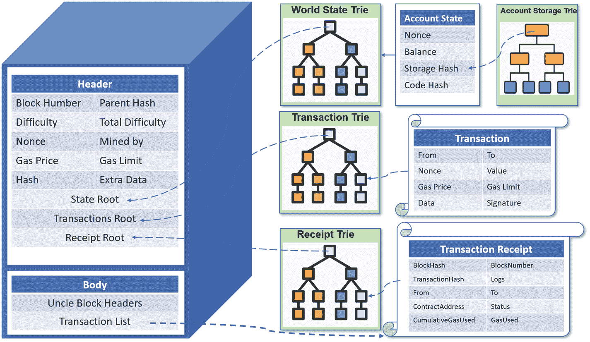

图 4-22 展示了以太坊架构的架构图，包括一个独立的区块中的头部和体部。世界状态树、交易树、收据树指向头部区块中各自的层级。账户状态表、交易表和交易收据表分别指向它们对应的树。账户存储树指向账户状态表。区块体部指向交易收据表。

**图 4-22**  
以太坊架构：区块、状态、交易

至此，我们已经介绍了以太坊大部分重要的概念。

### 总结

本章的主要目的是介绍以太坊的关键概念。我们从以太坊的历史开始学习，并了解了其背后的关键组件和元素，包括账户、合约和 `Gas`。现在，您已经掌握了以太坊账户如何工作的基础知识。我们介绍了以太坊节点和以太坊客户端——`geth` 技术及一些示例。我们深入探讨了以太坊架构，理解了以太坊虚拟机（`EVM`）的工作原理，智能合约操作码（`Opcode`）如何在 `EVM` 内执行，以及 `EVM` 中区块、状态和交易的结构。至此，您应该已经准备好进入下一章，开始开发您的第一个智能合约和端到端的去中心化应用程序。我们将向您展示如何逐步构建它。敬请期待。