# 5. 智能合约与去中心化应用：从理论到实践

计算机科学家布莱恩·克尼根（Brian Kernighan）于 1972 年为贝尔实验室内部使用的 B 语言编写了第一个“Hello, World!”程序。布莱恩撰写了一本名为 *B 语言教程导论* 的手册，用以演示如何使用 B 语言。此后，这段广为人知的文本迅速传播开来。它曾被用于 1974 年的贝尔实验室备忘录，以及 1978 年的 *C 程序设计语言* 一书。“Hello, World!”至今依然流行，并已成为新程序员编写第一个程序的标准范例。这段特定的代码能够证明你的代码语法正确、可以编译并执行，而且能持续生成期望的输出。“Hello, World!”提供了超过 60 种编程语言的代码实现。

在上一章中，我们从理论上解释了以太坊网络，包括以太坊的关键组件、以太坊虚拟机（EVM）和架构等。加深理解目前已学知识的最佳方法，就是开始动手实践，为以太坊区块链编写智能合约和`Dapps`。

通过使用在线的`Remix`工具，你将学习如何使用所有必需的语法，用`Solidity`编写`HelloWorld`代码。你将从头开始，逐行学习。你还会学习如何在本地编译和部署智能合约，以及部署在全球分布的测试网上。然后，我们将安装`Metamask`钱包并将其连接到测试网。在本地`Dapp`开发环境中设置好所有必要条件后，你将开始以最小的精力开发自己的`Dapp`，用以连接测试网上的合约。在本章结束时，通过掌控你的以太坊钱包，你应该能够运行一个完整的、端到端的`HelloWorld` `Dapp`。

本章将帮助你实现以下实际目标：
- 介绍`Remix`
- 编写你的第一个智能合约
- 掌控你的第一个以太坊钱包
- 去中心化应用程序（`Dapps`）
- 代币标准

在最后一节中，我们将介绍代币标准，其中包含两种最重要的代币——`ERC-20`和`ERC-721`。`ERC-721`是 NFT 代币标准，我们将在下一章中讲解。这有助于你更加熟悉智能合约和`Dapps`。

## 介绍 Remix

加文·伍德（Gavin Wood）于 2014 年 8 月提出了`Solidity`编程语言。亚历克斯·贝雷格萨斯（Alex Beregszaszi）、克里斯蒂安·雷特维森纳（Christian Reitwiessner）以及其他以太坊核心贡献者共同创建了`Solidity`。它是一种受`JavaScript`、`C++`和`Python`启发的高级面向对象编程语言。`Solidity`的目的是在基于 EVM 的区块链网络上执行智能合约。

有许多工具可用于创建和开发`Solidity`智能合约。`Remix`、`HardHat`、`Truffle`等是`Solidity`开发者常用的工具。`Remix`是一个强大的在线集成开发环境（IDE），用于使用`Solidity`编写、编译、测试和调试智能合约。除了你的网页浏览器，我们不需要安装任何其他特殊软件。

你可以在浏览器的 URL 框中输入以下网址来访问`Remix IDE`：[`https://remix.ethereum.org`](https://remix.ethereum.org)。然后你将被导航到`Remix`的首页，如图[5-1]所示。


**图 5-1** `Remix` 首页

你会注意到`Remix`屏幕左侧有一个工具栏菜单。当你点击每个菜单图标时，会看到提供的不同模块。

### 文件浏览器

在`文件浏览器`模块中，你可以管理工作空间，并在工作空间下创建合约文件。当你在多个项目上工作时，工作空间可以帮助你组织不同项目工作空间中的文件。你可以创建智能合约文件、创建文件夹，并将本地文件上传到当前工作空间。它与其他基于云的浏览器工具非常相似，比如 Google Drive、Dropbox 等。在`contracts`文件夹下，`Remix`会为你创建三个默认合约。如果你不使用它们，可以将其删除。

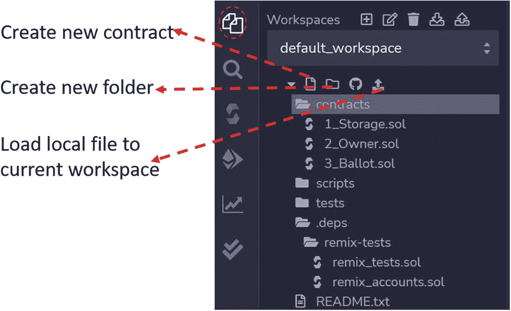

**图 5-2** `Remix` 文件浏览器页面

### Solidity 编译器

在`Solidity 编译器`模块中，你可以选择不同版本的`Solidity`编译器，编写本书时的当前版本是`0.8.7`。由于`Solidity`更新相当频繁，你需要密切关注选择所需的配置。一旦你创建了`Solidity`文件，你可以通过点击编译按钮来编译文件。`Remix`的合约区域将显示文件编译信息，例如错误和警告。`Remix`会持续每隔 5 秒自动保存当前文件更改。


**图 5-3** `Remix` Solidity 编译器页面

### 部署与运行交易

在你编译了智能合约之后，可以使用`部署与运行交易`模块来部署合约。如果你编译了多个合约，需要在`合约编辑器`中选择一个合约进行部署。


**图 5-4** `Remix` 部署与运行交易模块

该模块提供了多种 EVM 环境：

**JavaScript VM** – JS VM 拥有自己的沙盒区块链模拟环境，在你的浏览器中运行。它执行交易的速度非常快（无需挖矿）。当你执行交易时，数据仅临时保存在浏览器中。一旦你关闭或重新加载页面，所有交易数据都将丢失。你将不得不从头开始。这对于快速尝试和测试简单合约非常有用。


**图 5-5** `Remix` EVM 环境

**注入提供者（Injected Provider）** – `Remix`将连接到注入到浏览器中的`web3`提供者（通常称为你钱包的浏览器扩展）。`Metamask`是目前最流行的`注入提供者`。你也可以使用其他流行的钱包，如`Coinbase`钱包、`Trust Wallet`和`Ledger`。你可以通过该提供者连接到以太坊主网络或各种测试网。这使得`Remix`能够与真实网络进行交互。

**Web3 提供者（Web3 Provider）** – `Remix`将连接到一个远程节点。你需要提供所选提供者的 URL。`Infura`、`Alchemy`和`QuikNode`是一些流行的`Web3`提供者。

### 其他模块

我们已经介绍了我们通常经常使用的重要`Remix`模块。其他模式如插件模块允许你安装所需的插件，例如调试插件、`Solidity`静态分析模块、`Solidity`单元测试模块和设置模块。如果感兴趣，你可以参考`Remix`文档了解详情（[`remix-ide.readthedocs.io`](https://remix-ide.readthedocs.io)）。

在此阶段，我们应该已具备`Remix`的基本知识。现在，让我们通过编写“Hello, World!”智能合约来开始学习`Solidity`。

## 编写你的第一个智能合约

根据 `dune.com` 的数据，2022 年第二季度创建的智能合约总数为 93 万个。而 2021 年第二季度，创建的智能合约数量接近 600 万个，如图 5-6 所示。在当前的以太坊区块链中，大多数智能合约都使用 Solidity 编程语言。

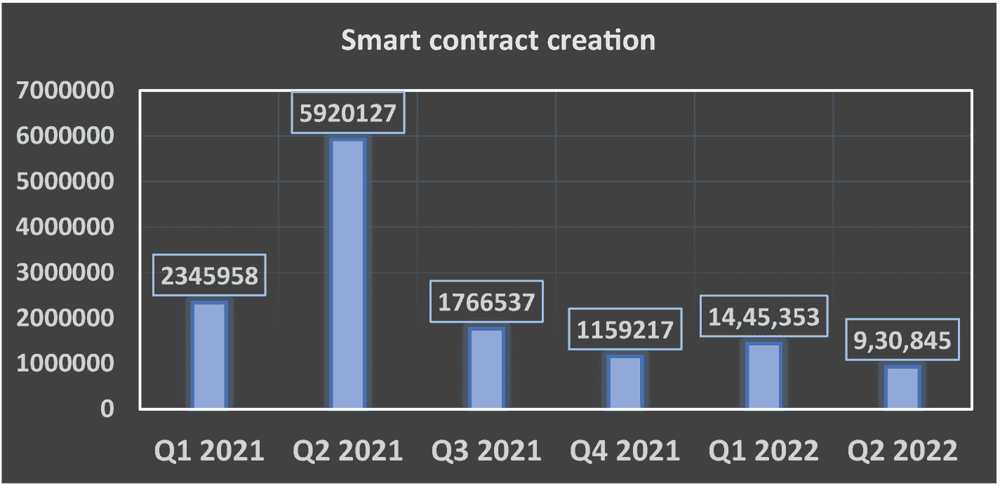

**图 5-6** 从 2021 年第一季度到 2022 年第二季度的智能合约创建数量

### 编写合约

在 Remix 文件浏览器模块中，在 `contracts` 文件夹下，点击创建新合约图标（页面图标）或通过右键单击使用上下文菜单来添加我们的第一个合约。我们将第一个智能合约命名为 `HelloWorld.sol`。Solidity 智能合约的文件类型总是以 `.sol` 作为扩展名。

#### 软件许可证

在智能合约的第一行，你需要编写智能合约的许可证。SPDX 许可证标识符指示相关的许可证信息。MIT 许可证授予任何使用该软件的人复制、修改、合并、分发等权利：

```solidity
// SPDX-License-Identifier: MIT
```

这里的注释（`//`）是一行出现在 Solidity 程序中但不由程序执行的文本。

#### 编译器指令 (Pragmas)

第二行是像下面这样的编译器指令：

```solidity
pragma solidity ⁰.8.15;
```

`pragma` 关键字类似于 C 语言，它指定了当前的 Solidity 编译器。这里的 `0.8.15` 是 Solidity 编译器的版本号。`^` 符号表示此文件将仅支持从 `0.8.7` 版本开始，直到引入会导致此文件无法编译的重大变更为止。例如，`pragma solidity >=0.4.0 <0.6.0` 这样的合约在 `0.6.0` 版本中无法编译，因为 Solidity 发生了重大变化。在这种情况下，你需要修改文件中的相关语法以使用新版本。

#### 定义合约

为了让代码更清晰，通常在 `pragma` 条目后面留一个空行。然后，在接下来的代码行中，开始声明合约。在 Solidity 中，我们使用 `contract` 关键字，后跟合约的名称。在我们的例子中，是 `HelloWorld`。合约名称应与你创建的文件名匹配。合约的内容将包含在花括号 `{}` 内：

```solidity
contract HelloWorld {
}
```

到目前为止，合约应该看起来像图 5-7 所示。

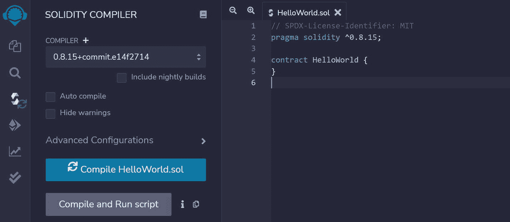

**图 5-7** HelloWorld 空合约

#### 声明合约变量

在下一行，我们输入 `string public message`。

这里，`string` 关键字是一种状态变量类型。状态变量是永久存储在合约存储中的值，用于维护合约的状态。状态变量的可见性可以定义为 `public`、`private` 或 `internal`。在我们的例子中，因为我们将其可见性设置为 `public`，所以 `message` 字段可以在智能合约外部公开访问。

#### 定义合约构造函数

接下来要创建一个构造函数：

```solidity
constructor(string memory initMessage) {
    message = initMessage;
}
```

`HelloWorld.sol` 将看起来像图 5-8 所示。

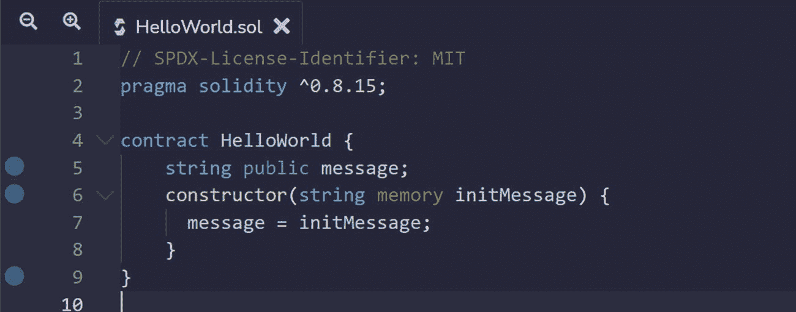

**图 5-8** HelloWorld 合约构造函数

构造函数可以被比作一台工厂机器。一旦给出输入，它们就可以执行特定任务并返回结果。要声明一个构造函数，我们使用 `constructor` 关键字。一旦创建了构造函数，我们就可以使用同一个构造函数创建许多不同的合约。每当创建一个新合约时，系统会自动调用构造函数；它们只需要使用一次构造函数来创建该合约。如果没有显式定义构造函数，Solidity 编译器将会创建一个不接受任何输入的默认构造函数。

大多数情况下，你可能需要一个传递一个或多个参数的构造函数。在 `{}` 内，我们添加初始化逻辑。在我们的示例中，我们传递了 `string memory initMessage` 输入。这里使用的 `memory` 关键字表示我们希望 `initMessage` 参数是可变的，并且 `initMessage` 值被赋值给 `message` 变量，并在合约创建期间进行初始化。

#### 定义函数

`HelloWorld` 合约将有两个函数。一个用于更新消息，另一个用于获取消息：

1.  **更新合约消息函数**
    更新函数如下所示：

    ```solidity
    function update(string memory newMessage) public {
        message = newMessage;
    }
    ```

2.  **获取合约消息函数**

    ```solidity
    function getMessage() public view returns (string memory) {
        return message;
    }
    ```

Solidity 函数使用 `function` 关键字定义，其后跟：
- 函数的名称。这里 `update` 是函数名。
- 用括号括起来并用逗号分隔的参数列表（`parameter1`，`parameter2`, ...）。也可以是空的 `()`。`(string memory newMessage)` 是 `HelloWorld` 函数中的参数。
- 函数可见性 – `public`、`private`、`internal` 和 `external`。
- 函数行为 – `pure`、`view` 和 `payable`。
- 其次是在函数有返回值时，可选的 `returns` 关键字和返回值类型（`type1`，`type2`, ...）。在我们的 `update` 函数中，我们没有返回值。但在 `getMessage` 中，我们返回 `(string memory)`。
- 一个定义函数功能的语句块，用花括号 `{...}` 括起来。

##### 语法

基本语法如下所示：

```solidity
function function_name(…) {internal|external|private|public} [pure |view|payable] [returns(…)] {
    //statements
}
```

##### 函数可见性

函数的可见性范围可以通过以下四个修饰符之一来设置：
- **Public** – 可以在内部或外部调用。
- **Internal** – 内部函数只能从当前合约及其相关的派生合约内部访问。
- **External** – 可以从其他外部合约调用，但不能在内部（当前合约内部）调用。
- **Private** – 类似于内部可见性，但无法从相关的派生合约中访问该函数。

##### 函数行为

`pure`、`constant`、`view` 和 `payable` 关键字决定了 Solidity 函数的行为。如果未指定函数行为，它将读取并修改区块链的状态。
- **纯函数 (Pure Functions)**：确保调用者无法读取或修改状态。
- **视图函数 (View Functions)**：视图函数是只读函数，确保在调用它们后状态变量不会被修改。
- **可支付 (Payable)**：接收普通以太币转账时也会执行可支付的回退函数。

完成 `HelloWorld.sol` 后，你应该有 15 行代码，如图 5-9 所示。

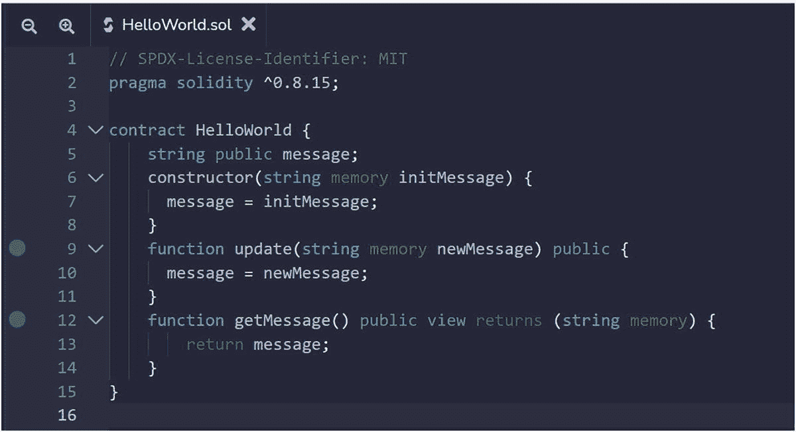

**图 5-9** HelloWorld 完成合约

### 编译合约

正如我们在 EVM 部分所学，智能合约在部署到区块链之前需要被编译成`Bytecode`。在此步骤中，我们将编译我们的`HelloWorld`智能合约。

`Remix IDE` 允许我们直接从浏览器编译 Solidity 智能合约。点击导航栏中的编译器图标。在 Solidity 编译器页面上，选择`0.8.15`编译器版本；点击编译按钮编译`HelloWorld`智能合约。如果编译成功，您将在导航栏的编译器图标上看到一个绿色对勾。另请注意，编译后会出现带有`应用程序二进制接口（ABI）`和`Bytecode`的编译详情按钮。`ABI`包含 JSON 格式的数据，这些数据编码了 EVM 能理解的智能合约信息，并为 Dapp 与合约交互提供了标准方式。您可以点击该按钮查看编译详情，如图 5-10 所示。结果将包含`Bytecode`、`Abi`、`Assembly (Opcode)`以及其他有用的已编译合约信息。您应将`abi`内容复制到某处；我们将在 Dapp 部分使用这个`abi`字符串来调用智能合约。

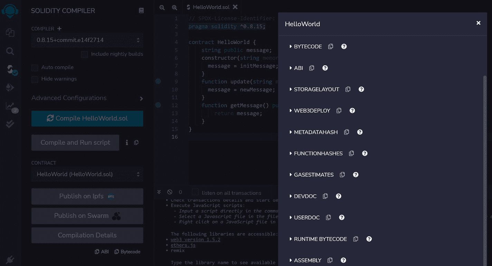

**图 5-10** 已编译的 HelloWorld 合约

### 部署并运行合约

要部署我们的合约，请点击左侧菜单中的“部署并运行交易”模块。您会看到一个下拉菜单，列出“合约”标题下的所有可用智能合约，即`HelloWorld`。`HelloWorld.sol`将是默认选中的合约，其正下方有一个橙色的`Deploy`按钮。

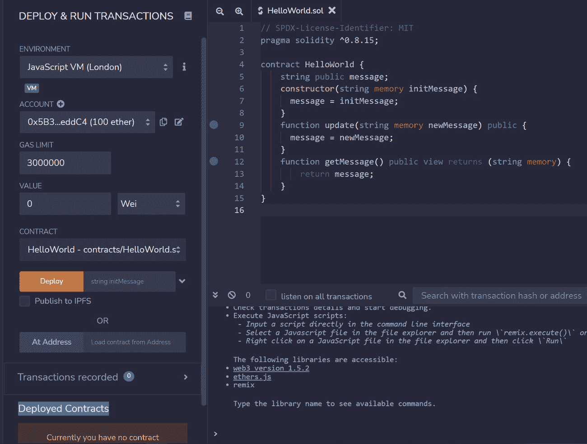

部署并运行交易界面的截图，右侧显示 Hello World 代码。左侧展示了选择环境、账户、Gas 上限、金额和合约的选项。

**图 5-11** HelloWorld 合约部署

到目前为止，合约尚未部署。因此，要部署`HelloWorld`，我们需要在`Deploy`按钮旁边提供字符串`initMessage`。

我们可以保留`Environment`为默认选中的`JavaScript VM`、默认选中的账户、`Gas limit`和`value`。让我们输入`Hello Solidity`并点击`Deploy`按钮。

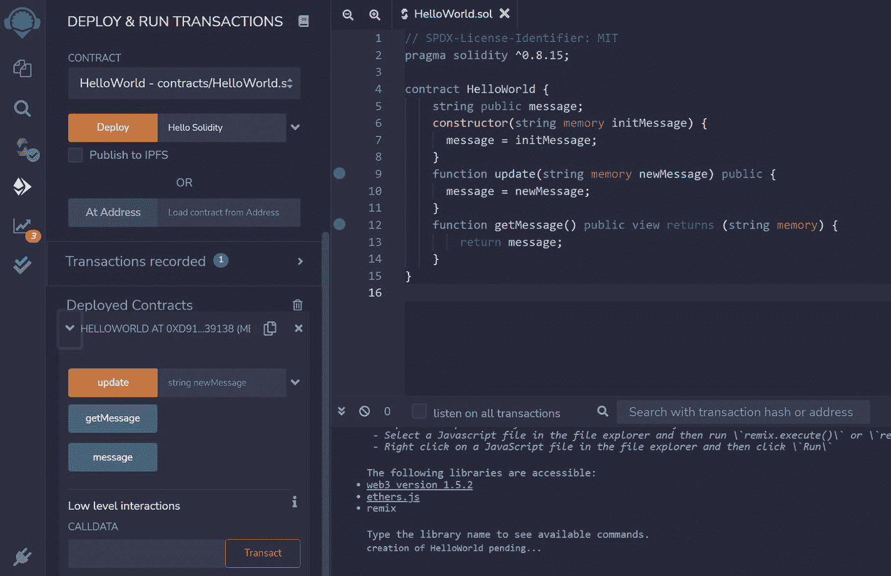

一个标注为“部署并运行交易”的界面截图，左侧展示了 Hello World 合约输入项和已部署的合约，右侧展示了代码。

**图 5-12** 已部署的 HelloWorld 合约

内置终端控制台显示了部署信息。默认账户的金额因少量 Gas 费用（即交易费）而减少，从`100.00000 ETH`变为`99.99999 ETH`。

在“已部署合约”面板下，您将看到已部署的`HelloWorld`合约及其合约地址。

如果您展开已部署的`HelloWorld`合约条目，它将显示智能合约中所有定义为`public`的合约项——状态变量或函数。

在我们的示例中，我们可以看到`update`、`getMessage`函数以及`message`变量。

当您点击`message`按钮时，您应该会看到`message`按钮下方显示`"Hello Solidity"`。当您点击`getMessage`按钮时，也会出现同样的情况。

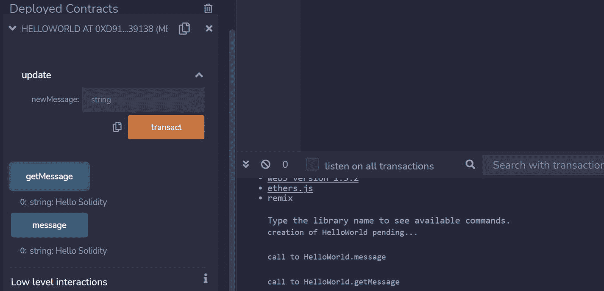

一个标注为“已部署合约”的截图，展示了已部署到合约的 Hello World 消息部分。

**图 5-13** 调用 HelloWorld 合约消息

要更改消息，请为`update`函数输入`"Hello Ethereum"`，然后点击按钮设置新值。

您可以通过点击`getMessage`函数或`message`变量来验证`message`变量是否已更新。

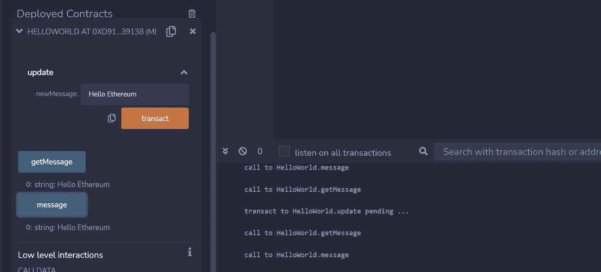

Hello World 消息已更新的截图。新消息是 hello ethereum。

**图 5-14** 更新 HelloWorld 合约消息

恭喜！您已成功用 Solidity 编写了您的第一个 Hello World 智能合约，并将其部署到了区块链上。要了解更多关于 Solidity 的信息，您可以访问 Solidity 官方文档（`https://docs.soliditylang.org/en/v0.8.15/contracts.xhtml`）。

### 掌控你的第一个以太坊钱包

在 Remix 中，当我们使用 Injected Provider 时，`Metamask` 是最广泛使用的钱包提供商之一。`MetaMask` 于 2016 年由 Aaron Davis 和 Daniel Finlay 创立，目前隶属于 ConsenSys 公司。截至 2022 年 3 月，`Metamask` 月活跃用户已超过 3000 万。作为 Chrome、Firefox、Brave 和 Edge 浏览器的免费扩展程序，`MetaMask` 能让你的普通浏览器变身为 Web3 浏览器，用于存储和交换加密货币，以及与以太坊 DApp 交互，而无需运行以太坊节点。简而言之，`MetaMask` 是一个你可以在浏览器中访问的移动加密钱包。要管理 `Metamask` 的访问权限，用户只需要一个密码和一个 12 个单词组成的恢复短语，也称为种子短语。种子短语可以由任何真实的单词组成，例如 dog、cat 或 chicken。

如果你忘记或丢失了钱包恢复短语，就无法恢复你的加密钱包密码。务必将这些种子短语备份在安全可靠的地方，比如硬盘、U 盘或纸上。不要将其存储在容易被盗的地方，例如电子邮件、在线存储等。

`MetaMask` 可能并非存储大量加密货币或高价值加密资产（例如 NFT）的最佳场所。在连接主网进行交易时，请确保 `MetaMask` 是该浏览器中唯一打开的标签页，并避免在同一浏览器中登录社交媒体账户——某些社交媒体网站拥有可能窃取你数据的插件。

从 [`https://metamask.io`](https://metamask.io) 安装 `MetaMask`。然后将 `MetaMask` 钱包软件下载到你选择的浏览器中。选择“创建钱包”选项，阅读条款和条件，然后创建密码。安装完成后，你会在浏览器右上角看到一只狐狸。打开 `MetaMask`，通过点击“设置”➜“高级”➜“显示测试网络”，然后选择“选择此项以在网络列表中显示测试网络”的按钮，来启用测试网络。测试网络上的交易仅用于模拟主网交易或真实的区块链交易。

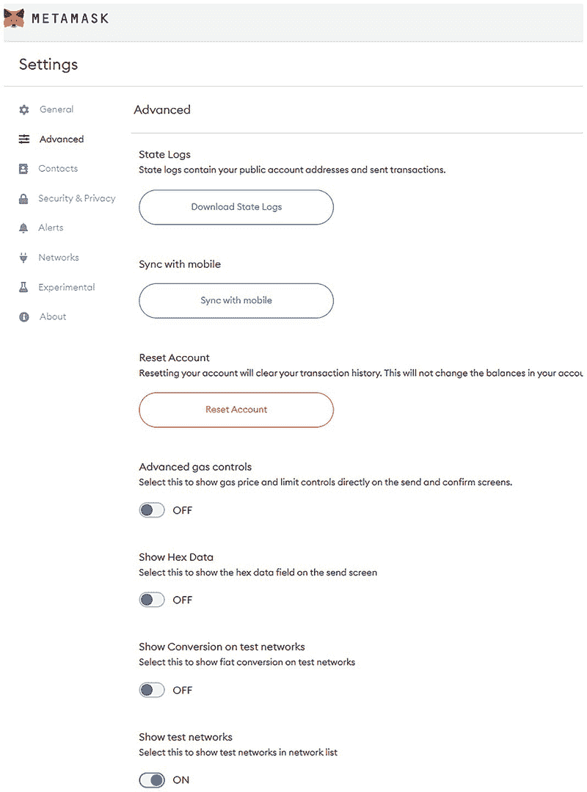

一张 MetaMask 界面的截图，显示设置页面。已选中高级设置选项，并标有存储日志、与手机同步、重置账户、高级 Gas 控制、显示十六进制数据和网络等选项。

**图 5-15** – 更新 `Metamask` 的测试网络设置

现在，你可以从 `MetaMask` 的网络列表设置中切换到 Goerli 测试网络。

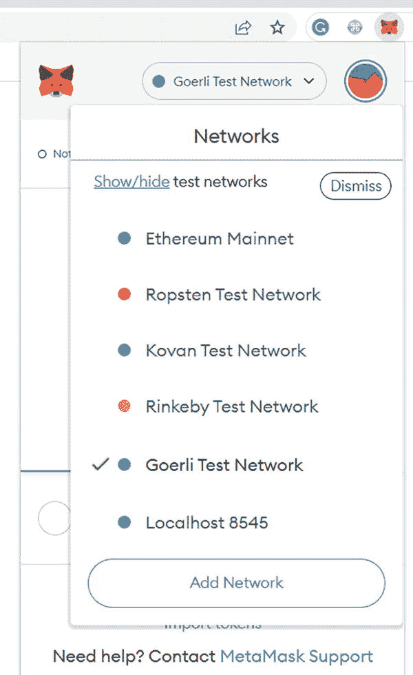

一张添加新网络到 Goerli 测试网络的截图。

**图 5-16** – 将 `Metamask` 连接到 Goerli 测试网络

你会看到账户 1 中有一个默认账户，但没有以太币。

我们将从 Goerli 测试网络获取一些免费的测试以太币。复制账户 1 的以太坊地址，并使用以下 Goerli 测试网水龙头之一，通过你的以太坊账户地址获取以太币：

- 官方 Goerli 测试网水龙头： [`https://goerli-faucet.slock.it/`](https://goerli-faucet.slock.it/)
- Starknet 水龙头： [`https://faucet.goerli.starknet.io/`](https://faucet.goerli.starknet.io/)
- Goerlifaucet： [`https://goerlifaucet.com/`](https://goerlifaucet.com/)

> **注意：** 大多数测试网络将在几个月后停用（截至 2022 年 7 月）。目前，Goerli 已确认会继续存在，因此该网络上的测试以太币通常需求旺盛。你可能需要多次尝试才能获取一些以太币。

成功提交水龙头请求后，你的账户中将获得一些以太币。

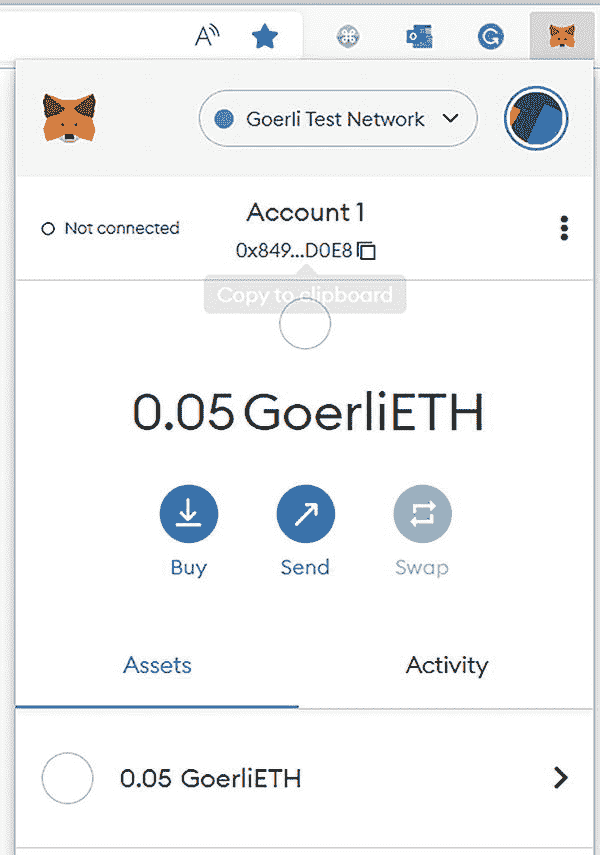

一张 Goerli 测试网络中账户 1 的截图，显示有 0.05 Goerli ETH。

**图 5-17** – 从 Goerli 测试网络水龙头获取以太币

有了这些以太币，你就完成了将智能合约变为现实的所有艰苦工作。现在是时候与世界分享你的第一个智能合约了！让我们从 Remix 中将我们的 `HelloWorld` 智能合约部署到 Goerli 测试网络。

在 Remix 中，部署并运行交易模块，选择 Injected Web3 环境。`Metamask` 会弹出一个窗口，要求连接到 Goerli 测试网络中的 `Metamask` 账户 1。

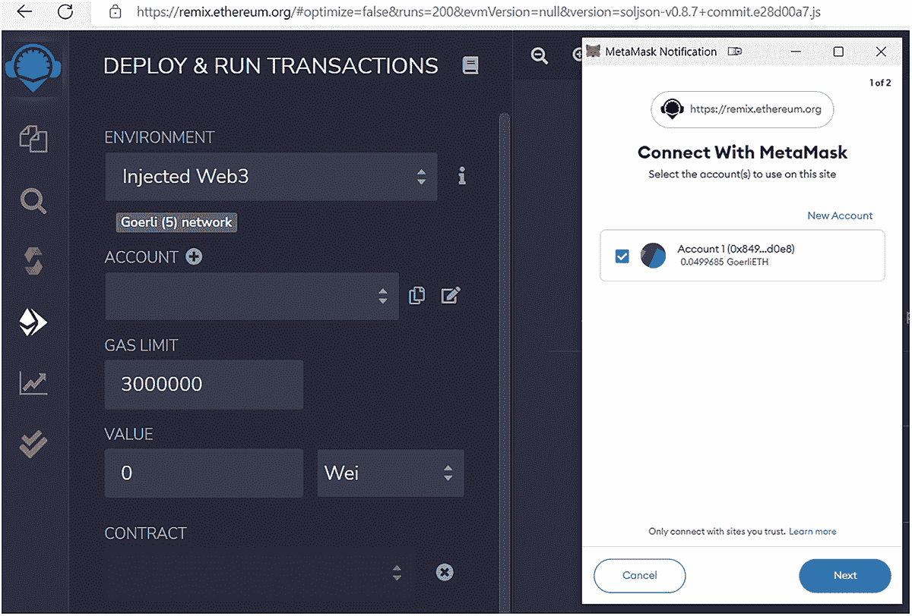

一张标有“部署并运行交易”的截图，右侧有一个标有“连接 Metamask”的界面，并且选中了一个账户。下方显示“取消”和“下一步”选项。

**图 5-18** – 将 Remix 连接到 Goerli 测试网络

点击“下一步”并连接。它会将 Remix IDE 与 Goerli 测试网络中的 `Metamask` 连接起来。如下截图所示，你应该会看到一个绿色的按钮显示已连接状态。

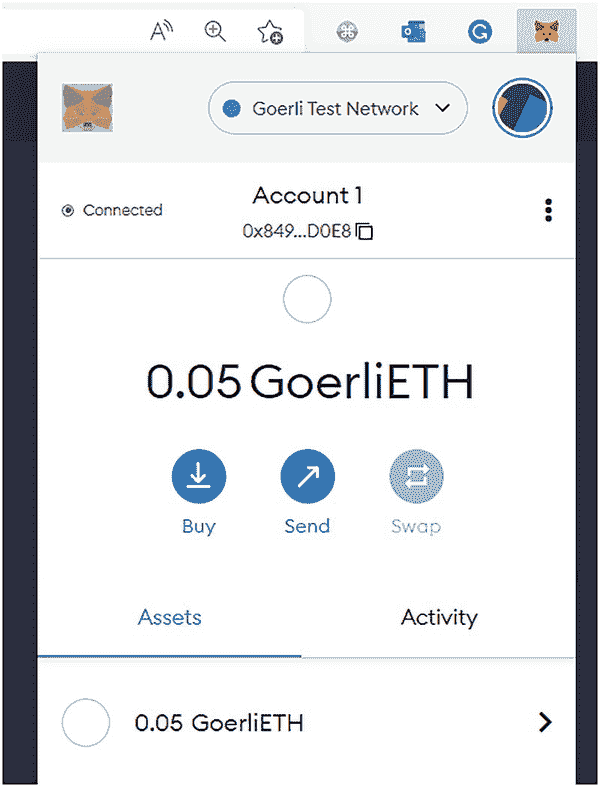

一张账户连接到测试网络的截图，显示有 0.05 Goerli ETH。

**图 5-19** – 已连接 `Metamask` Goerli 测试网络

现在我们可以将我们的 `HelloWorld.sol` 部署到 Goerli 测试网络。在橙色部署按钮右侧，输入“Hello Solidity”作为初始消息。然后点击部署。`Metamask` 将动态计算预估的 Gas 费用。在提交到测试网之前，你可以确认或拒绝此请求。让我们确认这笔部署交易。

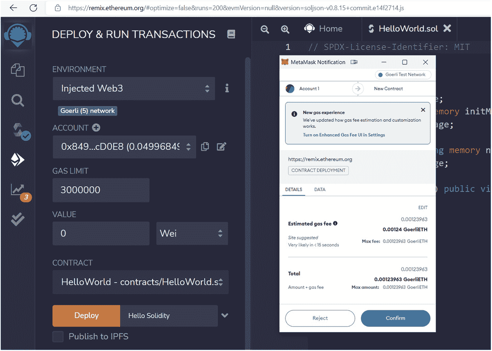

一张标有“部署并运行交易”的截图，右侧显示了 MetaMask 的通知页面。

**图 5-20** – 将合约部署到 Goerli 测试网络

在 Remix 控制台中，你会看到一条区块交易确认消息，其中包含交易哈希和其他交易信息。交易哈希如下：`0x7f773384290cff58ff6bb6e4f0411bfb625d3c1aa957208c6e8b8abeeed9d710`

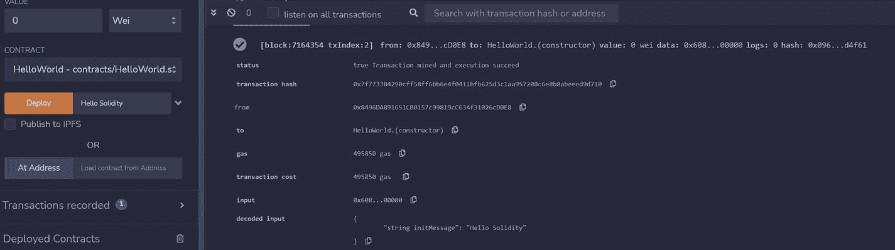

一张 Hello World 合约的交易收据截图。

**图 5-21** – 已部署合约及交易收据

在 `Metamask` 中，我们可以在“活动”选项卡下看到新的合约部署信息。请注意，账户的以太币余额已扣除交易 Gas 费用。原始值是 0.05 ETH。现在是 0.0487 ETH。

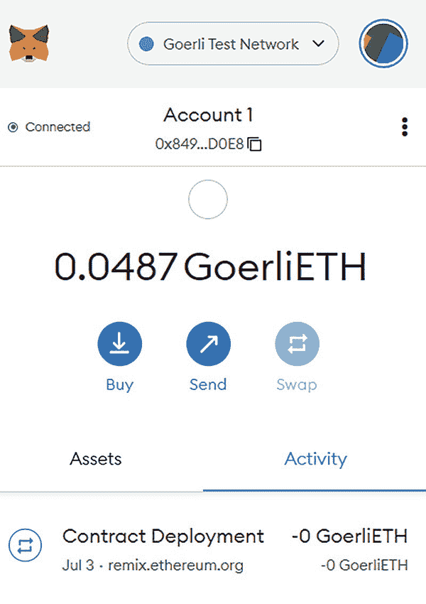

一张标有“Goerli 测试网络”的界面截图，并选中了账户 1。中间显示 0.0487 Goerli ETH，以及“买入”、“发送”和“兑换”选项。

**图 5-22** – 已部署合约及 Gas 费用

当你点击“合约部署”时，会显示部署信息的详情。

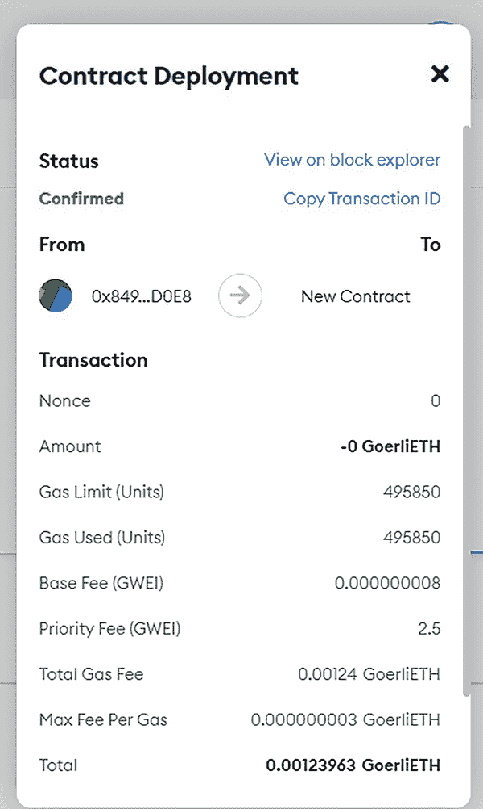

一张标有“已确认”的合约部署状态和交易详情截图。

**图 5-23** – 合约部署详情

你可以点击“在区块浏览器中查看”。该链接将跳转到 `etherscan.io` 页面，并显示此合约的部署详情。你可以看到合约已部署到地址 `0xe02cfad8b29d0aad478862facb2e6a9b1fed7bc9`（注意：当你部署时，会显示不同的地址）。该地址是公开的，所有人都可以访问。

现在你已经部署了第一个区块链智能合约，交易哈希与我们在 Remix 控制台中看到的值一致。你可以从 `etherscan` 的搜索栏中搜索该地址。

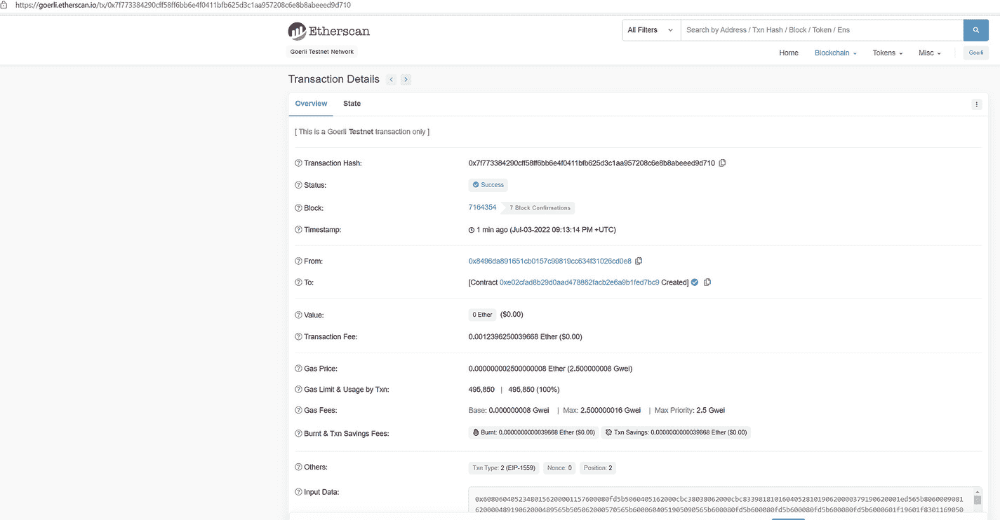

一张 etherscan 合约页面的界面截图，显示了标有“成功”的交易详情。

**图 5-24** – 在 `etherscan` 中已部署的合约

太棒了！你已经将 `HelloWorld` 合约发布到 Goerli 测试网络，该网络对公众开放，并且可以从任何地方访问。接下来，让我们构建一个简单的 DApp 来与我们的智能合约交互。

### 去中心化应用（Dapps）

通常，Dapp 是一个三层应用，由三个主要组件构成：

- **前端层** – 一个包含 Web 服务器用于托管网页的浏览器。
- **Web3 提供者层** – 位于前端和智能合约之间的中间层，即 Metamask 钱包。
- **后端（智能合约）** – 在区块链网络中运行的合约。

图 5-25 展示了一个典型的 DApp 分层架构：

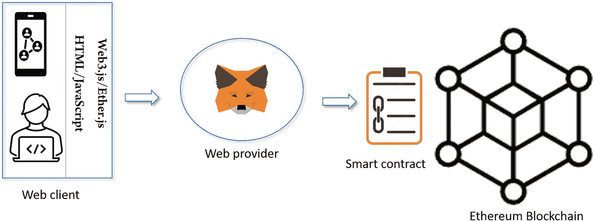

Dapp 分层架构流程图示意，包含 Web 客户端、Web 提供者、智能合约和以太坊区块链。

图 5-25：Dapp 分层架构

在以太坊客户端部分，我们使用 `web3` API 从 `geth` 控制台查询一些区块链信息。在本节中，我们将探索另一个以太坊 JavaScript 开源库 — `Ethers.js`，它同样能使 Web 客户端与以太坊网络进行通信和交互。

### 开始

在继续本节内容之前，你需要安装以下内容：

#### 安装 node.js

按照 Node 官方安装指南，下载并安装 `node.js`：

<https://nodejs.org/en/download/>

#### 安装 Git

按照 Git 官方安装指南安装 Git：

<https://git-scm.com/book/en/v2/Getting-Started-Installing-Git>

#### Git 克隆 HelloWorld Dapp 项目

安装好 Node 和 Git 后，你需要访问本书的 Apress 网站，git 克隆第 5 章的 HelloWorld Dapp 源代码：

```
git clone https://github.com/Apress/Blockchain-for-Teens.git
```

#### 安装 HelloWorld Dapp 项目

打开终端，导航到 helloworld 项目位置。运行 `npm install`：

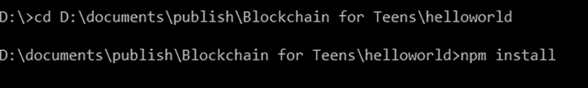

helloworld 项目位置的截图。

这将安装运行 HelloWorld Dapp 所需的 node 库。

项目结构应该与图 5-26 中展示的类似：

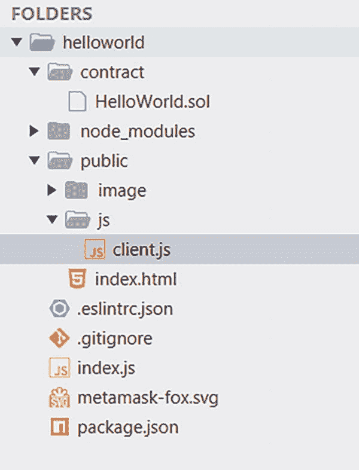

选择 `client.js` 后展示的项目结构文件夹截图。

图 5-26：Dapp 项目结构

注意，源代码指向 Goerli 测试网络的合约地址：

```
0xe02cfad8b29d0aad478862facb2e6a9b1fed7bc9
```

你可以使用这个地址进行测试，或者将此地址修改为你自己部署的合约地址。

打开 `client.js`，更新第 3 行的地址为你自己的地址。如果你修改了合约并有不同的合约 ABI，请用你自己的合约 ABI 替换第 4 行。

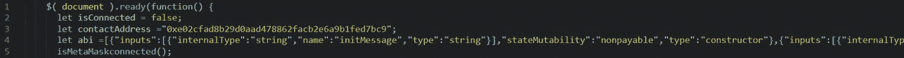

自己合约地址的测试截图。

#### 运行 HelloWorld Dapp 项目

在终端中，于 helloworld 文件夹下执行以下命令：

```
node index.js
```

这将启动 Node 服务器来托管 HelloWorld Dapp。端口号为 3000。

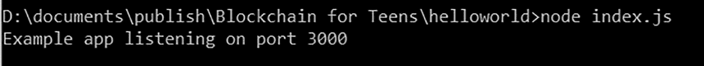

Dapp 节点服务器地址截图。

图 5-27：启动 Dapp 节点服务器

#### 从浏览器打开 HelloWorld Dapp

现在，你可以通过在浏览器中输入 `http://localhost:3000` 来打开 Dapp。你应该能看到 HelloWorld Dapp 页面。你可以看到右上角有一个连接按钮，用于连接 Metamask。页面中央有一个蓝色的消息按钮，可用于检索区块链消息。红色的更新按钮和一个消息输入框一起，用于更新合约消息内容。

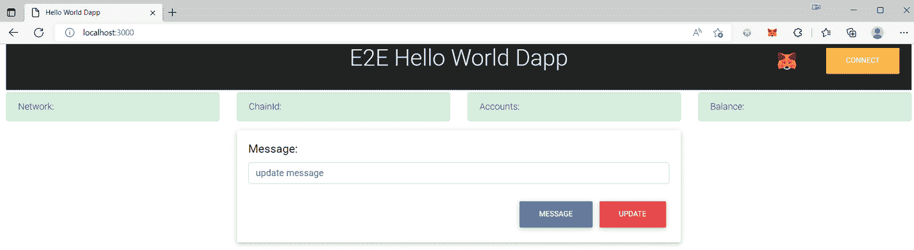

E2E hello world dapp 页面的截图。页面中央有一个标题为"message update"的方框。

图 5-28：Dapp 初始页面

### 连接到 Metamask

`Ethers.js` 使用 `Web3Provider` API 连接 Metamask 钱包：

```javascript
ethers.providers.Web3Provider(window.ethereum)
```

点击连接按钮。如果你尚未登录，它会提示你登录：

```javascript
await provider.send("eth_requestAccounts", []);
```

连接成功后，我们可以从提供者处获取用户钱包、网络和账户信息。`provider.getSigner()` 将从 Metamask 钱包获取以太坊账户。`provider.getNetwork()` 返回钱包所连接的当前以太坊网络。

以下是代码片段：

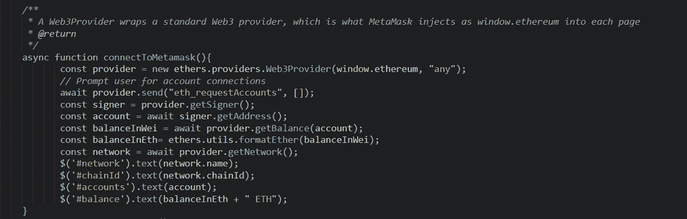

代码片段截图。

由于你是首次运行 Dapp，并且尚未连接到 Metamask，Dapp 页面的连接按钮将是橙色的。所以，让我们点击连接按钮来连接到 Metamask。再次强调，如果你尚未登录，你会看到 Metamask 弹出的登录请求。

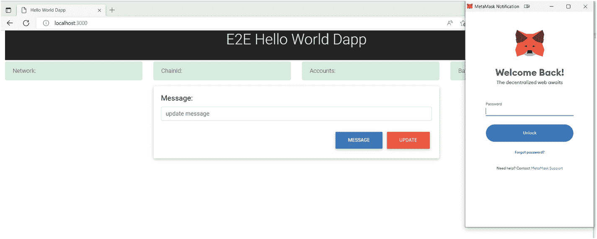

`图 5-29`：Dapp 连接 Metamask

登录 Metamask。页面将自动连接到 Metamask，并在顶部的绿色显示区域显示相关的账户和网络信息。

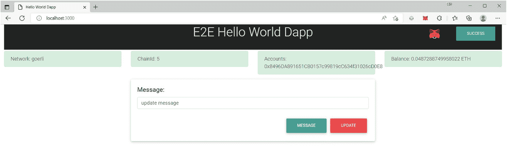

`图 5-30`：Dapp 已连接到包含区块链数据的 Metamask

#### 获取合约并调用获取消息

在 Remix 智能合约编译和部署中，我们已经获得了 ABI 和合约地址信息。`Ethers.js` 提供了以下 API 来获取合约信息，你可以使用 `new ethers.Contract(contractAddress, abi, provider)` API 来获取已部署的合约实例。

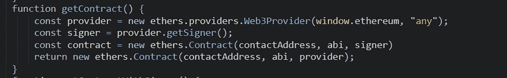

只读合约消息代码截图。

有了 ether 合约对象，你就可以开始调用 "call getMessage" 函数：

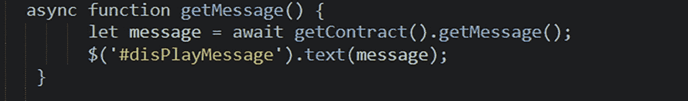

调用 `getMessage` 函数代码截图。

你将从 Goerli 测试网络获取到 "Hello Solidity" 消息：


`图 5-31`：Dapp 获取第一条消息

##### 获取合约并调用更新消息

当您需要调用状态变更方法（如更新消息）时，必须连接到签名者并支付燃料费才能发送状态变更交易：

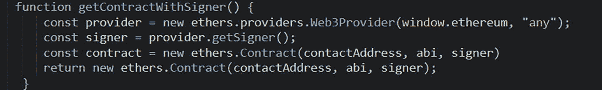

现在，借助签名者合约对象，您可以传递输入消息来更新合约：

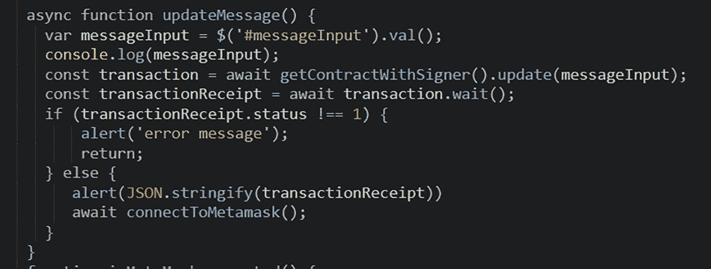

让我们更新消息，输入“Hello Ethereum”。

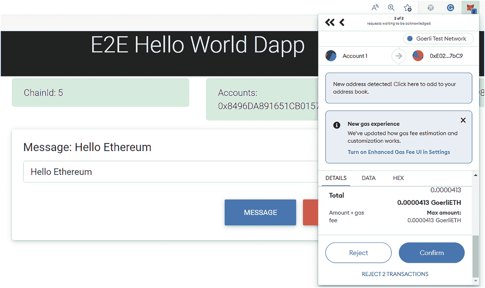

`图 5-32` — 去中心化应用更新消息

MetaMask 将弹出窗口，要求您根据估算的燃料费确认交易。您审查交易后提交。区块链浏览器允许您查看交易。

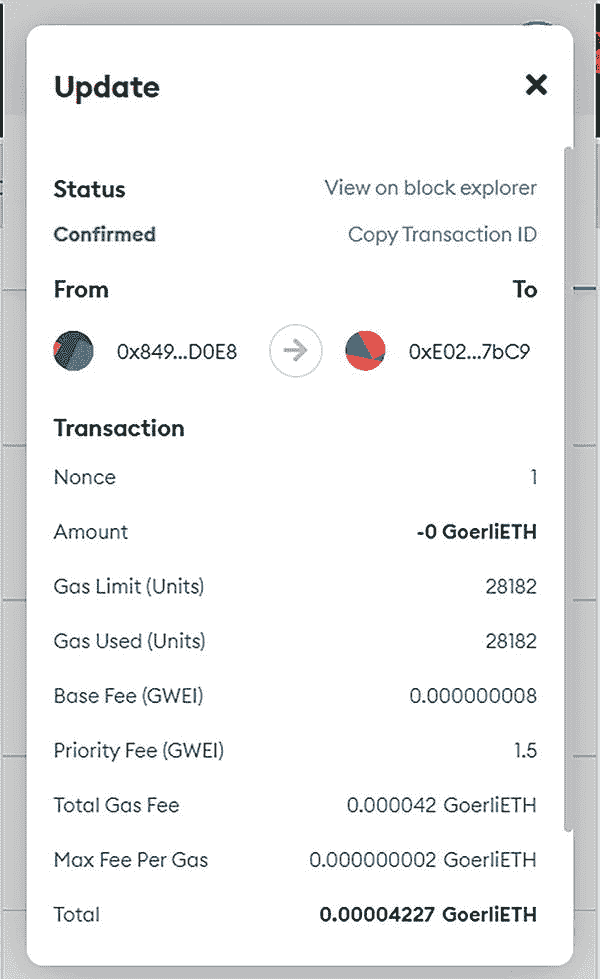

`图 5-33` — 去中心化应用更新消息交易详情

点击在区块链浏览器中查看，即可在 etherscan 中查看您的交易。

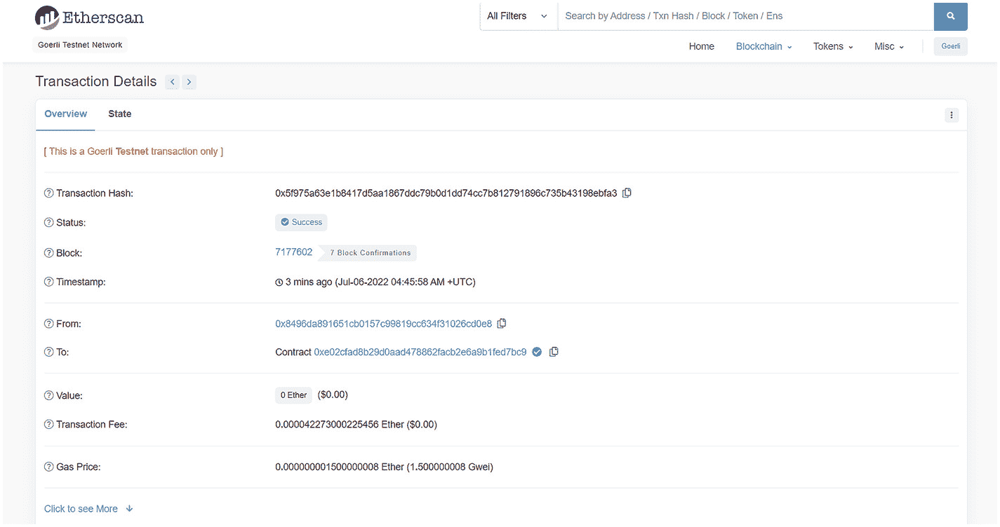

`图 5-34` — 在 etherscan 中的去中心化应用更新消息交易

一旦交易被确认，您将在页面弹窗中收到交易收据。

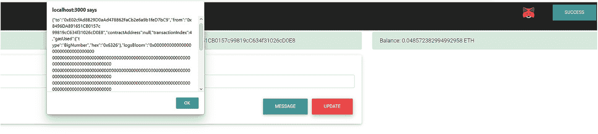

`图 5-35` — 显示响应交易收据的去中心化应用

最后，通过点击消息按钮验证您更新后的消息。页面上应显示“Hello Ethereum”。

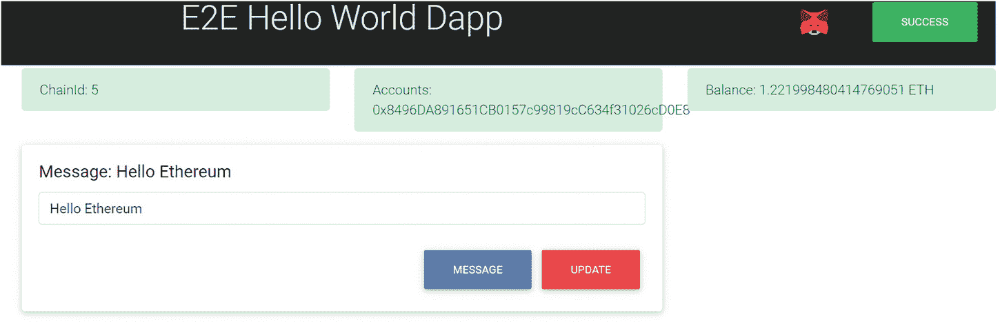

`图 5-36` — 去中心化应用验证更新消息

恭喜！您已成功将第一个智能合约发布到公共测试网，并构建了一个去中心化应用来调用和更新消息内容！至此，您已完成了一个端到端的去中心化应用开发周期，这是一项了不起的成就。请为自己鼓掌，因为这确实耗费了大量精力。

尽管我们已经花了足够的时间探索以太坊去中心化应用和 Solidity 原理，以帮助您构建一个去中心化应用，但本书仅提供了基础介绍。网上有很多优秀的文档涵盖了 Javascript、JQuery、express.js 和 ether.js 的各个方面。

以下是一些有用的链接：

- `ether.js`: 文档可在 [`https://docs.ethers.io/v5/`](https://docs.ethers.io/v5/) 找到
- `JQuery`: 文档可在 [`https://jquery.com/`](https://jquery.com/) 找到
- `express.js`: 文档可在 [`https://expressjs.com/en/starter/hello-world.xhtml`](https://expressjs.com/en/starter/hello-world.xhtml) 找到
- `Node.js`: 文档可在 [`https://nodejs.org/en/docs/guides/getting-started-guide/`](https://nodejs.org/en/docs/guides/getting-started-guide/) 找到

## 代币标准

在第 1 章中，我们了解到穆罕默德·本·图格鲁克发明了代币货币——唐卡，它使用铜币来代表与银币相同的价值。在区块链中，币代表原生货币。例如，以太币是以太坊中的币。而代币由智能合约创建，该合约定义了基本的代币属性，然后进行构建和操作。

加密代币是一种虚拟货币代币，代表可编程资产或共享所有权，并具有对特定价值实体的访问权限。代币由智能合约管理，该合约允许高效且安全地购买或出售艺术品等物品、交换代币所有权、转移代币余额、存储代币价值以及在区块链上验证交易。

为了帮助开发者标准化代币创建，以太坊社区通过以太坊改进提案（EIP）流程制定了许多代币标准。

EIP 包含针对潜在新以太坊特性或流程的标准技术规范，包括核心协议规范、改进、客户端 API 及合约标准。它充当社区的“事实来源”。任何人只要遵循 2015 年发布的 EIP-1（[`https://eips.ethereum.org/EIPS/eip-1`](https://eips.ethereum.org/EIPS/eip-1)）中的标准指南，即可创建 EIP。如 EIP-1 所述，以太坊意见征询（ERC）是应用层面的标准和约定。如果特定的 ERC 在以太坊社区获得批准，它将成为新的代币标准规则，并通过相关智能合约在文档中概述。

存在许多代币标准，包括：

- 代币标准（`ERC-20`、`ERC-721`、`ERC-1155`、`ERC-777`）
- 名称注册表（`ERC-26`、`ERC-137`）
- URI 方案（`ERC-67`）
- 库/数据包格式（`EIP-82`）
- 钱包格式（`EIP-75`、`EIP-85`）

还有许多其他代币仍处于草案和审查状态。您可以通过此链接查看所有代币 ERC：[`https://eips.ethereum.org/erc`](https://eips.ethereum.org/erc)

让我们看看两个最流行的 ERC 标准：`ERC-20` 和 `ERC-721`。

### ERC-20

`ERC-20` 是最流行的以太坊代币标准，由 Fabian Vogelsteller 于 2015 年 11 月 19 日提出。大多数在以太坊平台或基于 EVM 的区块链（如币安）上发行代币的 ICO（首次代币发行）项目，使用的都是 `ERC-20` 代币。ICO 是股票市场 IPO（首次公开募股）在加密货币领域的版本，用于筹集资金或参与投资机会。截至 2022 年 3 月，以太坊主网上约有 50.8 万个 `ERC-20` 代币。所有 `ERC-20` 代币的总市值约为 187 亿美元，币安上则有超过 16 万个 `ERC-20` 代币。

`20` 是一个唯一的标识号，用于区分 `ERC-20` 标准与其他标准。

`ERC-20` 代币有几个可选字段，例如 `name` 和 `symbol`，并在智能合约中定义了以下规则：

```solidity
contract ERC20Interface {
    function totalSupply() public view returns (uint);
    function balanceOf(address tokenOwner) public view returns (uint balance);
    function allowance(address tokenOwner, address spender) public view returns (uint remaining);
    function transfer(address to, uint tokens) public returns (bool success);
    function approve(address spender, uint tokens) public returns (bool success);
    function transferFrom(address from, address to, uint tokens) public returns (bool success);
    event Transfer(address indexed from, address indexed to, uint tokens);
    event Approval(address indexed tokenOwner, address indexed spender, uint tokens);
}
```

- `totalSupply()`：获取代币的总供应量。
- `balanceOf()`：获取指定地址的账户余额。
- `allowance()`：返回允许 `spender` 从 `owner` 账户中提取的代币数量。
- `transfer()`：将余额从所有者账户转移到另一个指定地址，并且必须触发 `Transfer` 事件。
- `transferFrom()`：将指定数量的代币从 `from` 地址发送到 `to` 地址。`transferFrom` 方法用于提现工作流，允许合约代表你转移代币。
- `approve()`：允许 `spender` 多次从你的账户中提取指定数量的代币。

如果你曾参与一个需要创建并部署 `ERC-20` 代币的项目，你可以通过实现这些 `ERC-20` 函数来创建一个智能合约。以下是一个简单的示例：

```solidity
MyToken is ERC20 {
    // implement the functions required by ERC20 interface standard
    // other functions...
}
```

在 Etherscan 上，你可以找到许多已部署在主网上、符合 `ERC-20` 标准的代币。以下是一个在 Etherscan 上 `ERC-20` 代币交易的真实示例。

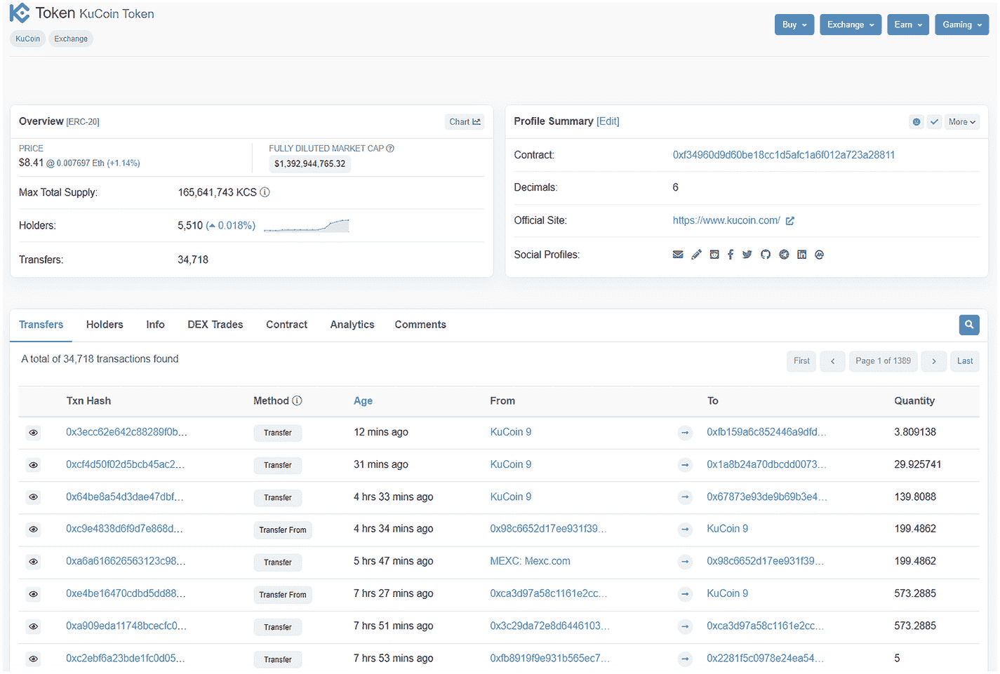

`图 5-37` — ERC-20 示例

该截图显示了 `ERC-20` 代币通过 `transfer` 或 `transferFrom` 方法从一个地址转移到另一个地址的金额。

在 `ERC-20` 代币中，代币是可互换的，这意味着每个代币与其他代币的类型和价值完全相同。如果你用一个 `ERC-20` 代币交换另一个 `ERC-20` 代币，其真实性或价值不会有任何差异；它们是可以互换的，并代表一个单一实体。

例如，Tether (USDT) 是一种 `ERC-20` 代币。它是一种稳定币——一种价值以 1:1 的比例与美元挂钩，并完全由 Tether 的等值准备金支持的加密资产。这些准备金由多种资产组成，包括现金。USDT 类似于 ETH，这意味着 1 个 USDT 代币与其他所有 USDT 代币始终是相等的。它们类型相同，都代表美元，并且可以相互交换。USDT 也是可分割的，可以分解为更小的单位，如分。

因此，可互换代币具有以下属性：可互换、统一和可分割。

接下来，我们来讨论那些不可互换的代币，或者换句话说，非同质化代币。

### ERC-721

所有 `ERC-20` 代币（如 USDT）都是相同的，并提供相同的价值。因此，重要的是你在钱包中拥有多少代币，而不是它们各自的独特性。非同质化代币（NFT）可以被唯一标识；它们是数据存储在区块链网络上的资产。`NFT` 不能与其他 `NFT` 互换，因为它们是独一无二的。可以想想艺术家创作的独特艺术品、时装公司的奢侈品品牌商品以及不同的视频。

`ERC-721` 是非同质化代币（也称为 deed）的标准接口，可在 [`https://eips.ethereum.org/EIPS/eip-721`](https://eips.ethereum.org/EIPS/eip-721) 获取。这个新标准的创建提案于 2018 年 1 月提出，由 William Entriken、Dieter Shirley、Jacob Evans 和 Nastassia Sachs 共同发起。根据彭博社的一份报告，2021 年 `NFT` 市场价值超过 400 亿美元，截至 2022 年 5 月 1 日，`NFT` 市场在 2022 年的价值超过 370 亿美元。

与 `ERC-20` 代币标准类似，`ERC-721` 规范提供了详细信息，并定义了派生合约为了开发 `NFT` 而应实现的函数和事件，如下面的代码块所示：

```
interface ERC721 {
event Transfer(address indexed _from, address indexed _to, uint256 indexed _tokenId);
event Approval(address indexed _owner, address indexed _approved, uint256 indexed _tokenId);
event ApprovalForAll(address indexed _owner, address indexed _operator, bool _approved);
function balanceOf(address _owner) external view returns (uint256);
function ownerOf(uint256 _tokenId) external view returns (address);
function safeTransferFrom(address _from, address _to, uint256 _tokenId, bytes data) external payable;
function safeTransferFrom(address _from, address _to, uint256 _tokenId) external payable;
function transferFrom(address _from, address _to, uint256 _tokenId) external payable;
function approve(address _approved, uint256 _tokenId) external payable;
function setApprovalForAll(address _operator, bool _approved) external;
function getApproved(uint256 _tokenId) external view returns (address);
function isApprovedForAll(address _owner, address _operator) external view returns (bool);
}
```

`balanceOf`：获取指定地址的账户余额。

`ownerOf`：该函数根据提供的 `_tokenId` 返回该代币所有者的唯一地址。

`safeTransferFrom`：将 `NFT` 的所有权从一个地址转移到另一个地址。要求 `msg.sender` 是当前所有者、授权的操作者或该 `NFT` 的已批准地址。

`transferFrom()`：将指定数量的代币从 `_from` 地址发送到 `_to` 地址。`transferFrom` 方法用于提现工作流，允许合约代表你转移代币。

`approve()`：允许 `spender` 多次从你的账户中提取指定数量的代币。

`setApprovalForAll`：为给定的操作者分配或撤销管理 `msg.sender` 所有资产的批准权限。

`getApproved`：获取单个 `NFT` 的已批准地址。

`isApprovedForAll`：检查给定的操作者地址是否有权为给定的所有者操作其代币。

`ERC-721` 最著名的例子是 CryptoKitties 游戏，这是第一个 `NFT` 代币。在游戏中，有成千上万只 CryptoKitty。每只猫都有自己的资料，包括独特的基因、名字、颜色、形状、价格和其他信息。游戏玩家可以收集和繁殖可爱的小猫。如图 5-38 所示，每只 CryptoKitty 作为一种可收藏的数字资产，可以被玩家交易、出售和购买：

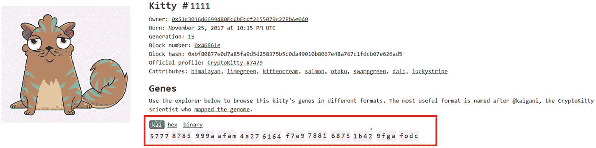

一张动画猫咪截图，标签为：Kitty Hash 1111，并附有所有者、出生时间、世代、区块编号、区块哈希、官方资料和属性等信息。在下方，基因标签下显示了相关信息。

`图 5-38` ERC-721 CryptoKitties 示例

我们可以在 `etherscan` 中找到 `CryptoKittie`。这些代币由游戏玩家每日进行竞标和交易。一些特定的 `cryptokitties` 单个售价已超过 30 万美元。

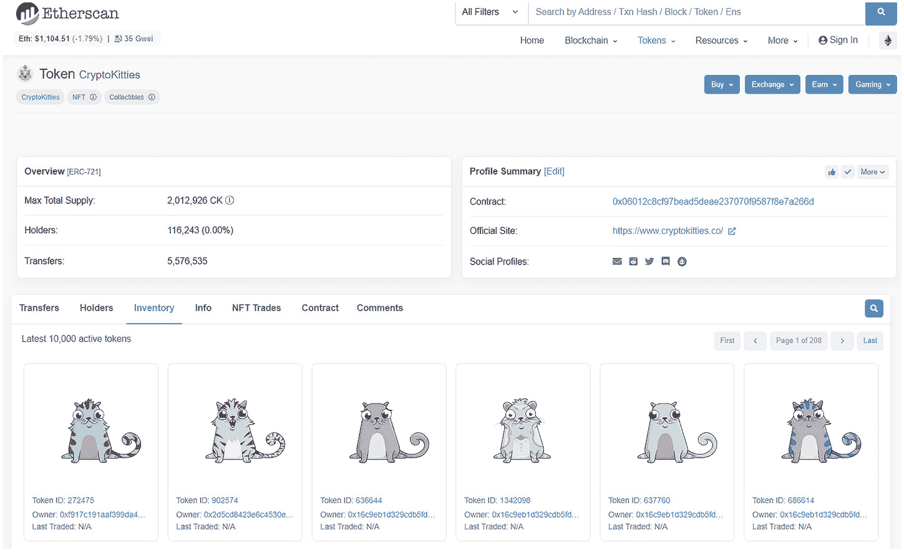

以太坊浏览器中加密猫库存的截图。图 5-39

`Etherscan` 中的 `ERC-721` `CryptoKitties`

随着粉丝参与度的提高，`NFT` 收藏品市场持续增长，这可能会推动其主流采用。一个 `NFT` 在同一时间只能有一个所有者。真正的所有权是所有 `NFT` 的关键特征之一，它有可能在将数字世界和物理世界以前所未有的方式紧密连接起来方面发挥关键作用。

## 总结

你已经通过 `Remix IDE` 编写了你的第一个智能合约，并将 `HelloWorld` `Solidity` 文件部署到了 `Goerli` 测试网络。我们演示了 `Dapp` 和 `web3.js` 的基础知识，以及 `Dapp` 如何通过连接 `Metamask` 钱包与智能合约进行交互。

但我们的旅程并未就此结束——在下一章中，我们将深入探讨关于 `NFT` 更多激动人心的细节。