# 6. NFT：作为收藏品的加密资产

“`NFT`”一词已在社交媒体上广受欢迎，并成为各大新闻和期刊的讨论话题。但究竟什么是 `NFT`，它为什么如此重要？为什么 `NFT` 如此有价值？

在本章中，我们将解答这些问题，甚至还会提供一个教程，教你如何创建属于自己的 `NFT`。

在本章中，我们将介绍关于 `NFT` 的以下具体主题：

*   什么是 `NFT`？

*   同质化与非同质化

*   `NFT` 的简史

*   `NFT` 的应用

*   `NFT` 的示例

*   `NFT` 的卖点

*   创建你自己的 `NFT`

*   `NFT` 市场

*   `NFT` 的未来

## 什么是 NFT？

`NFT` 代表“非同质化代币”。它代表了独特物品的所有权，并且无法在区块链上被复制。在第 5 章中，我们介绍了 `ERC-721` 代币标准。最初的 `ERC-721` 规范由 `Dieter Shirley`、`William Entriken`、`Jacob Evans` 和 `Nastassia Sachs` 于 2018 年 1 月提出，作为针对 `Ethereum` 网络的 `Ethereum` `改进` `提案` (`EIP`)。它定义了标准的智能合约接口，可以代表从数字收藏品到音乐、艺术品、体育以及许多其他现实世界资产的实物。

当你获得一个 `NFT` 的所有权时，你并不会得到它的实体副本。事实上，如果 `NFT` 是一种媒体形式，任何人都仍然可以获取其副本。但关键在于，会创建一个智能合约来验证买家对 `NFT` 的所有权。任何人都可以在 `Ethereum` 网络上查看 `NFT` 的交易和合约历史，就像任何人都可以查看和追踪加密货币交易一样。

然而，`NFT` 本身通常并不存储在区块链中。存储在区块链上的是所有者、哈希值、代币名称和符号以及指向文件的链接。因此，虽然任何人都可以复制 `NFT`，但这并不意味着他们拥有它或对其拥有权利。但重要的是，买家并不总是被授予 `NFT` 的所有权利。创建者可以保留版权和许可权，可以从 `NFT` 的转售中获得版税，也可以选择出售 `NFT` 的多个副本。

## 同质化 vs. 非同质化

在经济学中，同质化是指某物易于交换或交易，并且无法与另一物区分开来。在一种商品或货物可以交易或交换之前，它必须是同质化的。例如，美元就是同质化的。因此，持有 1 美元纸币的人可以将其换成另一张 1 美元纸币，而其存储价值不会改变。

每张 1 美元钞票与另一张相同面额的钞票具有相同的价值、统一性和可用性。可分割性是同质化的另一个基本特征，它指的是商品或货物可以被分割成更小的单位而不会损失价值的特性。就像一张 10 美元钞票可以购买与两张 5 美元钞票或十张 1 美元钞票相同数量的商品一样。在区块链中，`Bitcoin` (`BTC`)、`Ether` (`ETH`) 和许多其他加密货币单位都具有同样的高度可分割性。一个 `Bitcoin` 作为买卖商品的中介应具有相同的购买价值，无论它被分割成一个、两个还是十个 `UTXO` 的零头。大多数日常交易的成本将低于一个 `Bitcoin`，可分割性将使加密货币更容易与其他类似物品进行交换。

在上一章中，我们了解了 `ERC-20`，它引入了一种创建同质化代币的标准方法。`ERC-20` 定义了一个带有属性的接口，每个代币都可以与另一个代币（在类型和价值上）进行等值交换。一些流行的例子有 `Tether` `Tether` (`USDT`)、`USD` `Coin` (`USDC`)、`Shiba` `Inu` (`SHIB`) 和 `Wrapped` `Bitcoin` (`WBTC`)。

相比之下，非同质化资产是个人或群体拥有的、独特且不可互换的资产，例如艺术品、汽车、书籍、房地产、钻石、版权、收藏品和游戏物品。

如果贷款人将自己的房子借给借款人，借款人还回一个不同的房子是无法接受的，即使这两个房子有相同的市场价值。每栋房子都有其独特性。其价值是根据多个复杂标准来评判的，包括位置、房屋大小、可用空间、社区环境和销售历史。

此外，非同质化资产是不可分割的，不能被打散成多个部分出售。物品的整体决定了非同质化资产的价值。在区块链中，非同质化代币（`NFT`）是一种代表现实世界物品的独特数字资产。人们可以根据自己所相信的价值在市场上买卖 `NFT`。每个 `NFT` 都有一个存储在 `NFT` 智能合约中的独特数字签名，该签名提供了所有权证明，以确保它们在区块链中无法被复制或销毁。区块链将跟踪 `NFT` 资产的所有权。

表 6-1 显示了同质化代币和非同质化代币之间的区别。

**表 6-1** 比较同质化与非同质化

|   | 同质化代币 | 非同质化代币 |
| --- | --- | --- |
| 可互换性 | 同质化代币是可互换的。一个代币可以与任何其他相同类型的代币进行交换。持有 1 美元纸币的人可以将其换成另一张 1 美元纸币，而其存储价值不会改变。一个 `Bitcoin` 的价值可以与另一个 `Bitcoin` 交换，这对持有者来说没有区别。 | 非同质化代币是不可互换的。一个代币不能被任何其他相同类型的代币所替代。如果贷款人将自己的房子借给借款人，借款人还回一个不同的房子是无法接受的。 |
| 统一性 | 同质化代币是统一的，具有相同的属性，并且是非独特的。 | 每个代币都是独特的，并且与所有其他相同类型的代币都不同。 |
| 可分割性 | 同质化代币是可分割的，只要价值保持不变，就可以被分解成更小的单位。例如，一个 `Bitcoin` 可以被分割到小至 `0.00000001 BTC` 的单位。一个 `Ether` 可以分割到小数点后 18 位。 | 非同质化代币不能被分割，每个代币都有自己的价值。区块链上的 `NFT` 资产具有加密学上独特的识别码和元数据，这些提供了所有权证明，以确保它们不能被复制或销毁。 |
| `EIP` 标准及代币示例 | 知名的同质化代币标准 `EIP` 是 `ERC-20`。一些流行的例子有 `Tether` `Tether` (`USDT`)、`USD` `Coin` (`USDC`)、`Shiba` `Inu` (`SHIB`) 和 `Wrapped` `Bitcoin` (`WBTC`)。区块链原生加密货币如 `Bitcoin` (`BTC`) 和 `Ether` (`ETH`) 是同质化代币。 | `ERC-721` 是一种非同质化代币标准。一些流行的例子有艺术品、汽车、书籍、域名、房地产、钻石、版权、收藏品和游戏物品。 |

### NFT 简史

2021 年 12 月 4 日，梅尼·罗森菲尔德发表了一篇论文，提出了“彩色币”的概念。该论文将彩色币描述为一种带有标记的 **比特币**，使人们能够证明对现实世界资产的所有权并进行管理。

2014 年 5 月 3 日，凯文·麦考伊创建了已知的第一个“NFT”，它被称为 `Quantum`。这件艺术品展示了一个颜色不断变化的脉动八边形动画。2021 年 6 月，`Quantum` 以当时 147 万美元的价格售出；NFT 在当时被称为“货币化图形”。

2015 年 10 月，在 `DEVCON 1` 大会上，首个基于 `Ethereum` 的 NFT 项目启动，此时距离 `Ethereum` 网络上线仅三个月。玩家可以通过虚拟世界赚取真金白银。

2016 年 9 月，首批 `Rare Pepes` 开始在 `Counterparty` 平台上出售和交易。`Pepe the Frog` 是一个角色，后来成为了互联网上流行的表情包。

2017 年，有史以来最成功的 NFT 系列之一由 `Larva Labs` 工作室推出。每个 `CryptoPunk` 都是 24x24 像素的像素艺术图像，由算法生成，共铸造了 10,000 个 `CryptoPunks`。

2017 年 11 月 28 日，`CryptoKitties` 上线。`CryptoKitties` 是一款虚拟游戏，允许玩家购买、繁殖和交易猫咪。

从 2018 年到 2020 年，`Decentraland` 在元宇宙和 NFT 行业中的影响力与日俱增。`Decentraland` 是一个虚拟世界，用户可以在其中购买土地。用户拥有地块后，可以将其出租给他人，或者在虚拟环境中做任何想做的事，比如在地块上建造建筑物。该平台于 2017 年推出，但于 2020 年 2 月 20 日向公众开放。

2020 年，`NBA Top Shot` 上线，这是一个供用户购买 NBA 精彩瞬间和球员视频的市场。每个精彩瞬间都被铸造在一个“卡包”中，类似于一套交易卡。当用户购买 `Top Shot` NFT 后，他们可以参加 `Top Shot` 挑战，并有机会赢得奖品和市场中的其他物品。

2021 年，迄今为止最昂贵的 NFT 被售出。数字艺术家 Beeple（原名迈克·温克尔曼）以 6930 万美元的价格售出了一件名为“每一天：前 5000 天”的 NFT 艺术品文件。该作品在佳士得（一家处理 NFT 业务的主要拍卖行）售出，使其成为在主流拍卖行出售的第一件数字艺术品。

2022 年 4 月 22 日，`RTFKT` 与 `Nike` 宣布推出 `Nike Cryptokicks`，这是一系列运动鞋。`RTFKT` 随后发布了一套皮肤，可以升级 `Nike Dunk Genesis` 并为其提供定制功能。

## NFT 的应用

NFT 用途非常广泛。通常，它们可以以多种不同形式出现，并用于多种不同目的，这也是 NFT 日益流行以及创作者不断为其发掘新用途的原因。以下是一些可能使用 NFT 的方式。

### 图像

大多数 NFT 以静态图像的形式出现，这些图像可以是照片或艺术作品。有些 NFT 市场会限制所铸造文件的大小，但大多数情况下，提供更高分辨率的图像会更好。图像主要有两种类型：光栅（或位图）图像和矢量图形。光栅图像由像素组成，比矢量图形支持更丰富的色彩深度，但在放大时会丢失图像质量。另一方面，矢量图形使用方程式来绘制线条、曲线和点来创建照片，使得照片在缩放时不会损失图像质量。

以下是一些 NFT 图像的示例：

*   比普尔的“每一天：前 5000 天”是由比普尔为其“每一天”系列创作的前 5000 张矢量图像和动图的拼贴画。该作品在主流拍卖行佳士得以 6900 万美元售出。
*   “Doge”是一张柴犬的图片，在互联网上广为流传并变得容易辨认。这张“Doge”图片以 400 万美元售出。

### 视频

NFT 可以以视频形式呈现，这类视频通常非常受欢迎。YouTube 是一个成熟的视频上传平台，允许其用户将其视频作为 NFT 出售。寻找 NFT 视频的其他热门场所是 NFT 市场，用户可以直接在这些平台上上传文件。视频 NFT 的优势在于它们可以包含高质量和高分辨率的音频、动画和视频。

以下是一些 NFT 视频的示例：

*   比普尔的 `CROSSROAD` 是一个 10 秒的视频，最初以 67,000 美元的价格被购买，5 个月后以 660 万美元的价格转售。
*   格莱姆斯的“地球”和“火星”是两段短视频，每段售价 7500 美元。总共售出了近 700 个视频，在 2 天内产生了 518 万美元的收入。
*   3LAU 的“拍卖获胜者命名”在创作之前就发起了一场 NFT 音乐视频拍卖。拍卖获胜者花费 133 万美元获得了为音乐视频命名的机会。
*   戴维斯-卡尔家族的“Charlie Bit Me”是 2010 年的一个 YouTube 视频，被 3F Music 以 760,999 美元的价格购买。
*   NBA Top Shot 的“勒布朗·詹姆斯‘宇宙’扣篮”是 NBA Top Shot 市场上最大的一笔交易。该视频以 387,600 美元的价格购得。

### GIF

图形交换格式，或称 `GIF`，是一种用于创建循环播放的短视频的文件格式。`GIF` 的工作原理是将多个图像存储在一个文件中，从而实现动画或静态图像——不过，人们更倾向于使用 `PNG` 和 `JPEG` 等其他文件格式来处理静态图像。使用 `GIF` 的一个好处是，与需要显示缩略图和播放按钮的视频不同，`GIF` 会自动播放并循环。`GIF` 也很容易创建，并且可以在大多数浏览器中播放。

然而，`GIF` 自 1987 年以来就已存在，并且确实有一些过时的特性。`GIF` 仅支持 256 种颜色，不支持音频。它们的文件体积也较大，因此许多 `GIF` 通常只有几秒钟，帧率（每秒显示的图像数量）较低，或者尺寸较小。

以下是一些 NFT GIF 的示例：

*   克里斯·托雷斯的 `Nyan Cat` 是一只猫的 `GIF`，在互联网上被广泛认知。该 `GIF` 的原创作者在 Foundation 平台上以 300 ETH（当时价值 583,464 美元）的价格出售了该 NFT。
*   帕克的 `Finite` 是一个螺旋线圈的 `GIF`，在 Foundation 平台上以 444 ETH（作品售出时价值 864,507 美元）的价格出售。
*   杰克创作的 `War Haul` 是一个油桶着火的 `GIF`，在 SuperRare 平台上以 69 ETH（价值 223,627 美元）的价格出售。
*   OSF 的 `Lova Park` 是一个游乐园的 `GIF`，其中过山车穿过摩天轮。该 `GIF` 在 SuperRare 平台上以 82 ETH（价值 267,878 美元）的价格出售。
*   科迪的 `Welcome Home` 是一个 `GIF`，画面中一个男人在一条颜色渐变的小路上走向一个写着“欢迎”的牌子。该作品在 SuperRare 平台上以 75 ETH（价值 242,761 美元）的价格出售。这是该 `GIF` NFT 作品的首次售出，最初仅以 6 ETH 成交。

### 音频

许多音乐艺术家在销售音乐 NFT 方面取得了成功。主流和独立艺术家都将他们的作品作为 NFT 发布，以销售他们的音乐并吸引新的听众。不同的音频类型包括 `.mp3` 文件和 `.wav` 文件。在像 `OpenSea` 这样的市场中，音频 NFT 需要一个预览图像或 `GIF`。

以下是一些 NFT 音乐艺术家的示例：

*   格莱姆斯通过销售 NFT 赚取了约 580 万美元。她的主要成功来自于销售数千份名为“地球”和“火星”的带音乐短视频，以及一个名为“旧日之死”的视频，后者售价为 389,000 美元。
*   史蒂夫·青木表示，他在一年内通过销售 NFT 获得的利润比过去十年获得的流媒体版税还要多。通过销售 NFT 系列，他赚取了数百万美元。
*   莱昂国王乐队通过销售为其买家提供前排座位的门票，赚取了超过 200 万美元。他们以 NFT 系列的形式销售了一张名为《当你看见自己》的专辑。

### 数字地产

虚拟财产是一个随着元宇宙日益普及而很可能在未来增长的领域。玩家可以在虚拟世界中购买房产，供自己“居住”或日后以更高价格出售。NFT 使跟踪虚拟土地的所有权变得简单，同时也省去了对中间商的需求——买家可以直接从市场购买房产。购买记录和土地信息将自动包含在区块链中，而非办公室或纸质文件中。

以下是一些 NFT 房地产的示例：

- `Sandbox` 是一个虚拟世界，玩家可以使用积木来自定义他们的游戏体验。用户可以完全掌控自己的体验，并可以在其土地上添加资产。
- 由 `Krista Kim` 创作的 `Mars House` 以 `288` 以太币（当时约合 `514,557` 美元）售出。该住宅完全虚拟，专为在元宇宙中参观而设计。

### 交易卡

交易卡向来是一种实体现象，但在 NFT 领域中也越来越受欢迎。将交易卡存储为 NFT 使其更易于交换，并能证明卡片的真实性。通常，交易卡没有内在价值，其成功主要源于稀缺性和收藏欲望。

以下是一些 NFT 交易卡的示例：

- `Gods Unchained` 是一款基于区块链、使用交易卡牌组的多人游戏。玩家可以将游戏内物品作为 NFT 赚取，并将其出售换取现实世界的现金。
- `Curio Cards` 是一套包含 30 张交易卡的系列。每张卡的发行量各不相同，但铸造的卡片总数为 `29,700` 张。
- `Candy Digital` 是一个 NFT 平台，玩家可以在其中交易和收集官方美国职业棒球大联盟的 NFT。该平台还包含签名、球衣、图片、视频内容以及其他独家物品。

### 电子游戏物品

许多电子游戏允许玩家收集游戏内物品，例如装备、消耗品和皮肤，以自定义体验并在游戏中取得进展。然而，获取物品可能耗时或困难，这就是为什么当游戏开发者允许玩家购买装备时，他们常常能获得巨额利润。

将这些游戏内物品列为 NFT 可以帮助开发者和玩家跟踪物品的状态和属性。这尤其有利，因为所有者可以证明物品的真实性，而买家可以展示其所有权。将游戏内物品创建为 NFT 还可以在玩家不再需要时帮助他们出售物品。这也消除了对二级市场的需求，二级市场通常存在欺诈者，且有时在游戏中并不被允许。

以下是一些 NFT 电子游戏物品的示例：

- 来自 `Axie Infinity` 的 `Genesis Land Plots` 包括游戏中的数字土地。曾有 `9` 块土地以 `150 万美元` 的价格被购买。
- 来自 `Crypto Kitties` 的 `Dragon Kitty` 是该宠物繁殖游戏中可用的独特猫咪之一。该宠物以 `600` 以太币（约 `130 万美元`）的价格售出。
- `Mobile Legends` 是一款手游，推出了名为 `The Aspirants Mystery Box` 的 NFT 系列。该系列包含 `12` 个盲盒，每个盲盒都有一个数字形象和游戏角色的动画。
- `Summoners Arena` 是一款基于区块链的 MMORPG。其中的英雄和游戏内物品都是 NFT。

### 时尚

独立设计师和大型品牌都对时尚 NFT 产生了兴趣。甚至已经出现了加密时装周和元宇宙时装周，展示虚拟系列和数字服装。NFT 时尚物品可以包括用户可在虚拟环境或数字头像中穿戴的可穿戴设备，或者是实体时尚物品的数字模型。

以下是一些 NFT 时尚的示例：

- 由 `Balmain` 和 `Barbie` 合作的 `Balmain x Barbie` 系列推出了三个穿着粉色服装的玩偶。购买芭比头像后，买家将拥有该头像以及一件真实大小的芭比服装。
- `MANGO` 是一个时尚集团，为在 `Decentraland` 举办的元宇宙时装周创作了三个 NFT。该系列在虚拟空间中展示并上传至 `OpenSea`，但并未出售。

### 3D 模型

3D 模型可以是抽象或现实世界物体的设计或表现。3D 模型本身可以在屏幕上或通过虚拟/增强现实头显进行查看、旋转、移动和互动。该模型也可以使用 3D 打印机打印出来。3D 模型对于虚拟现实和增强现实、医学、工程、电子游戏、科学成像、建筑、电影、广告和插画等行业至关重要。

### 文本

文本，例如书籍、诗歌、文章和引文中的文字，已经被打上品牌标签并作为 NFT 出售。

以下是一些 NFT 文本的示例：

- 蒂姆·伯纳斯-李爵士创作的 `“万维网源代码”` 是创建了最初万维网的 `9,555` 行代码，以 `540 万美元` 的价格售出。
- 凯文·罗斯撰写的 `“在区块链上购买此专栏！”` 是一篇关于 NFT 的文章，其本身也作为 NFT 被拍卖。该文章在拍卖中以约 `56 万美元` 的价格售出。

### 域名

区块链域名是您可以购买并拥有的地址，允许他人向一个易于记忆的地址发送加密货币。例如，一个典型的比特币地址有 `34` 个字符，以太坊地址有 `42` 个字符，因此地址可能看起来像 `ac1qw508d6qejxtdg4y5r3zarvary0c5xw7kv8f3t4`。购买区块链域名允许用户将地址简化为 `example.crypto`，从而更容易记忆。与 `.com` 和 `.org` 等网站域名不同，区块链域名无需支付年度续费。

现在我们已经涵盖了 NFT 的不同用法，让我们通过表 6-2 回顾一下 NFT 各项应用的亮点。

**表 6-2** 不同 NFT 应用对比

| 应用 | 总结 |
| --- | --- |
| 图像 | 图像没有动态；可以是照片或艺术；分为光栅图形和矢量图形 |
| 视频 | 可以有音频和动画；分辨率可以非常高 |
| GIF 动图 | 图像序列；自动循环；文件体积大 |
| 音频 | 有时需要预览图像 |
| 3D 模型 | 可在 2D 屏幕或头显上查看；可与之交互；对许多行业至关重要 |
| 文本 | 示例包括书籍、诗歌、文章和引文 |
| 域名 | 允许用户简化其区块链域名；无需续费 |
| 房地产 | 虚拟财产可以增值；比传统房地产实践更具优势 |
| 交易卡 | 作为 NFT 易于交易；因其市场价值而被收藏 |
| 电子游戏物品 | 帮助开发者和玩家追踪物品；允许玩家轻松转售物品 |
| 时尚 | 可以虚拟形式存在或具有现实价值；随着虚拟世界扩展，未来可能更有用 |

### NFT 的示例

谈到 NFT，不乏许多成功案例。以下是一些已售出的最具标志性的 NFT：

**Bored Ape Yacht Club (BAYC)**

区块链技术公司 `Yuga Labs` 创建了一个包含 10,000 个 "无聊猿" NFT 的系列。其中最贵的一个 `Bored Ape #2087` 以 769 个 `ETH`（约合 230 万美元）售出。拥有一个无聊猿，会员即可享受专属福利，如社区活动、会员专属 `Discord` 服务器、名为 "The Bathroom" 的涂鸦板、空投等。无聊猿 NFT 的持有者甚至可以将他们的 NFT 租给 NFT 博物馆，或将其用于获取高额回报。许多名人都对 `BAYC` 表现出了兴趣。

**威廉·夏特纳的纪念品**

威廉·夏特纳将其 60 年演艺生涯中的物品作为 NFT 系列出售。125,000 件物品在短短 9 分钟内售罄，其中包括他的大头照、一张夏特纳拥抱《星际迷航》演员伦纳德·尼莫伊的照片，以及一张他的牙齿 X 光片。

**Grimes WarNymph**

创作型歌手 Grimes 以 389,000 美元的价格出售了一段名为 "Death of the Old" 的视频，该视频是她 10 件 NFT 藏品系列的一部分。总的来说，她通过出售该系列赚取了 580 万美元。

**Nyan Cat**

克里斯·托雷斯于 2021 年 2 月在一场在线拍卖会上以 300 个 `ETH`（当时约合 60 万美元）的价格出售了原始的 Nyan Cat GIF。这位创作者表示，他 "对成功感到非常惊讶"，但同时也 "很高兴知道（他）基本上为加密世界打开了一个全新迷因经济的大门"。

**Twitter CEO 的第一条推文**

Twitter 联合创始人杰克·多西将他于 2006 年 3 月 Twitter 上线时发布的第一条推文作为 NFT 出售，售价为 290 万美元。多西将这笔钱兑换成比特币，然后捐赠给了 `GiveDirectly` 慈善组织。

**NBA Top Shot**

`Top Shot` 是一个 NFT 市场，用户可以在其中交易和购买 NBA 精彩集锦视频。2020 年 10 月，`NBA Top Shot` 的销售额估值超过 3.38 亿美元。目前，`Top Shot` 上最有价值的资产是勒布朗·詹姆斯对阵休斯顿火箭队时扣篮的视频，该视频以 387,000 美元售出。

**RTFKT 运动鞋**

`RTFKT` 为在线游戏角色创作虚拟运动鞋，每双售价高达 10,000 美元。2021 年 3 月，`RTFKT` 与艺术家 `Fewocious` 合作，生产了一系列运动鞋，在几分钟内为他赚取了 310 万美元。

**Taco Bell GIF**

快餐公司 Taco Bell 将其菜单上的食物相关的 GIF 系列作为 NFT 出售。几分钟内，这些 GIF 就销售一空，Taco Bell 随后将所有收益捐赠给了其慈善组织 Taco Bell 基金会。

**Reddit NFT 头像**

Reddit，这个用户可以发帖和互动的在线社交平台，正在邀请艺术家创作 NFT 头像。这些 NFT 随后在官方网站上以 15 至 100 美元的价格出售，用户可以将这些 NFT 用作自己的头像。

**The NFT Magazine**

`Cryptonomist` 有一个名为 `NFT Magazine` 的项目，允许人们阅读关于加密世界的各种见解，包括重要人物、市场趋势以及投资建议。但是，要阅读该杂志，用户必须收集 NFT 杂志封面。

## NFT 的卖点

尽管某些 NFT 没有内在价值，但 NFT 确实提供了许多非 NFT 无法提供的优势。NFT 的成功可归因于多种因素，其中包括以下几点：

### 稀缺性

创作者可以铸造数量有限的 NFT，这将提高单个资产的价值，并使人们更愿意购买。可获得的副本数量也是公开的。结合创作者的良好声誉和市场上对特定 NFT 的高需求，NFT 可以获得数百万美元的市场价格。

### 真实性

独特的数字签名使任何人都能验证 NFT 的原创性，并防止伪造，这是实体艺术品中常见的问题。它还有助于买家避免被骗，因为很容易看出 NFT 的创建者是谁，而且所有者无需担心证明作品是否是自己创作的。

### 易于与加密货币一起使用

由于 NFT 存在于区块链上，因此可以轻松通过加密货币集成进行交易。迄今为止，最流行的加密货币是 `Ethereum` 网络上的 `ETH`，但也包括 `Solana` 网络上的 `SOL` 加密货币和 `Cardano` 网络上的 `ADA`。

### 所有权

NFT 使得所有权的转移变得容易。还可以共享 NFT 的所有权，这被称为 "部分所有权"。所有权也作为公共记录公开列出，因此无需中间人或实体文件来证明所有权。

### 永久性

NFT 没有实体物品所具备的限制，并且不会随时间推移而损坏。实体物品会受到来自太阳的紫外线辐射、灰尘积聚、湿度损坏、金属生锈以及粗暴处理或其他事故的影响。但是，NFT 的所有者可以永久销毁该 NFT（如果他们愿意的话），这被称为燃烧。

### 效率

使用数字资产消除了第三方。买家和卖家可以直接互动，无需中间人。这有助于节省时间、防止沟通不畅，并帮助企业追踪其产品的到达地点。

### 版税

在出售 NFT 后，每当其艺术品被转售时，原创艺术家都可以获得一部分利润。与当前艺术和音乐行业的做法相比，这是一个巨大的进步，因为在这些行业中，许多公司、流媒体服务和其他中间商攫取了大部分利润。NFT 让创作者能够完全掌控自己的作品并管理自己的销售。

### 制造成本低廉

虽然根据区块链的不同，Gas 费可能很高——特别是 `Ethereum` 的 Gas 费——但铸造一个 NFT 可以是免费的，或者仅需几美元。`Solana`、`Tezos`、`Avalanche`、`WAX` 是更便宜的区块链，而 `Polygon` 则允许用户免费创建 NFT。

## 创建你自己的 NFT

初次尝试创建你的第一个 NFT 可能看起来令人生畏，但选择是无穷无尽的。许多人仅仅将 NFT 与数字艺术联系起来，但实际上，你可以将任何数字化的东西——从音乐到交易卡片，再到表情包、视频甚至推文——铸造成 NFT。当然，务必记住要遵守所有所有权和版权法律。创作你自己的作品并将其用作 NFT，可以避免你陷入法律纠纷，并吸引支持者。

一个建议是开始创建一个系列。制作一个系列可以帮助你积累经验，也有助于激发交易者的兴趣。但最终，无论你选择创作什么作为 NFT，都要让它成为你独一无二的风格。

然而，请注意，仅仅因为有些人在 NFT 交易中取得了惊人的成功，并不意味着任何创建 NFT 的人都能立刻赚到数百万。分析市场，看看哪些是流行的，哪些被忽视了。同时注意，铸造 NFT 需要你支付服务费和矿工费（gas fee）。并且，务必为你的 NFT 公平定价——有时，NFT 会以低价售出，而买家会以显著更高的价格转售该 NFT。

现在，进入实际流程。如果你还没有，请设置一个加密钱包并创建一个账户。可供下载的热门选择包括 `MetaMask`、`WalletConnect` 和 `Rainbow`。设置加密钱包是免费的，但你应该了解可用的不同类型钱包。有托管钱包和自托管钱包。托管钱包由第三方管理，类似于银行。虽然与加密货币管理相关的功能可能较少，但你的资金会更安全。另一方面，自托管钱包让用户完全控制自己的钱包，但安全性较低。最佳选择取决于你想将钱包用于何种目的，但对于铸造和交易 NFT 来说，托管钱包更好。

无论你选择哪种方案，请确保你的密码密钥安全——如果你丢失了这个密钥，你将失去对加密资产的访问权限。我们还建议购买一个硬件钱包或实体钱包。

同样重要的是，不同类型的区块链使用不同的加密钱包。截至 2022 年，加密货币领域的顶级区块链是以太坊，但币安智能链（Binance Smart Chain）和波卡（Polkadot）也变得越来越流行。

然后，从一个信誉良好的交易平台购买某种形式的加密货币，例如 `CoinBase` 或 `Gemini`。`ETH` 是购买 NFT 最流行的加密货币，但 `SOL` 和 `XTZ` 也是值得关注的选择。

钱包设置完成后，在 NFT 市场（例如 `OpenSea`）上注册，并将你的加密货币钱包连接到你的账户。如果你需要设置钱包的逐步指导，可以参考第 5 章来设置一个 `MetaMask` 钱包。我们将在下一节介绍不同的市场。

现在，你可以上传你的数字文件，并以固定价格或通过拍卖出售它们。一旦它们通过审核并被批准，它们就会被列出待售，买家就能购买该 NFT。当完成购买或拍卖结束时，NFT 所有者将收到最高出价。

既然你已经了解了大致流程，让我们逐步操作：

首先，前往 `testnets.opensea.io`。请注意，我们在演示中使用的是测试网。点击“创建”按钮。

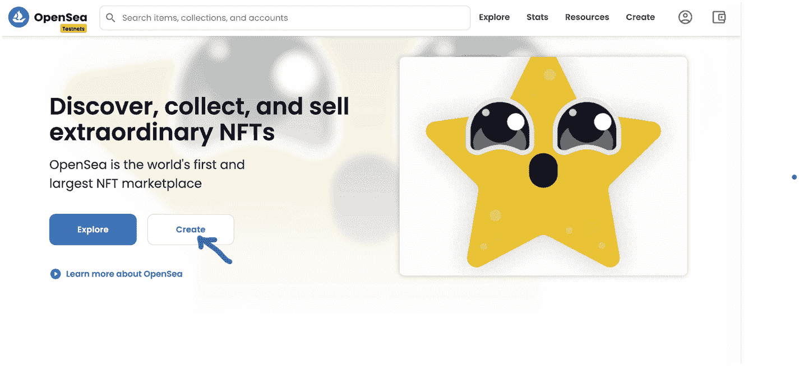

OpenSea 网站首页截图。

然后，连接你的钱包。我们将在本教程中使用 `MetaMask`：

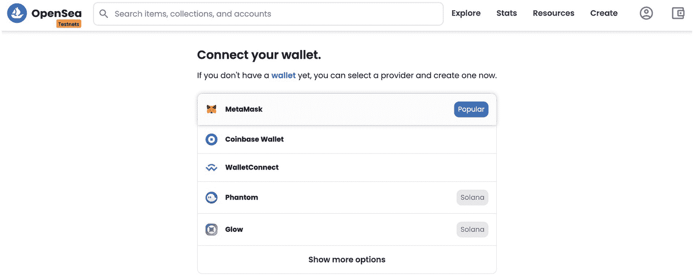

连接钱包界面的截图。MetaMask 被标记为其他钱包中的热门钱包。

一旦你选择要连接的钱包，你应该会看到如下界面：

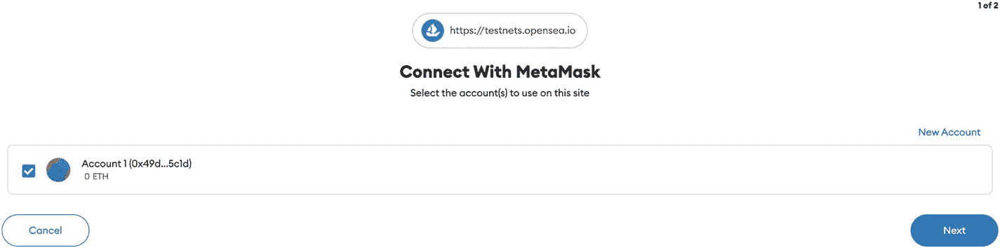

账户已添加到钱包的截图。

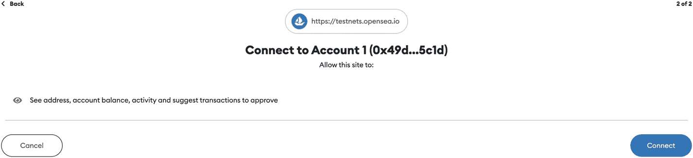

账户的地址、交易和账户余额权限截图。

太好了！你现在已经连接了钱包。现在，我们可以创建我们的 NFT 了。上传你的数字文件，并为你的 NFT 命名：

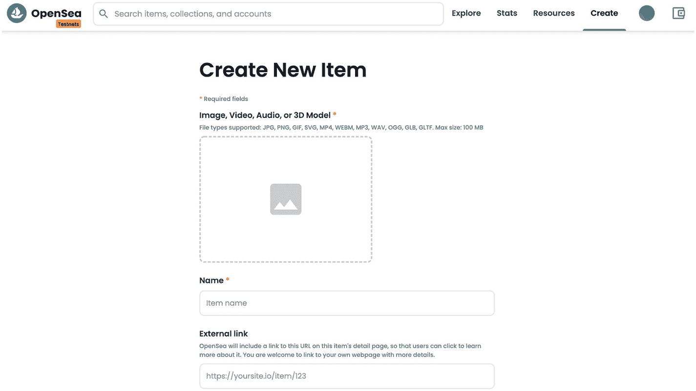

创建新 NFT 的截图。

如果你愿意，可以随意为你的 NFT 添加更多细节。满意后，滚动到页面底部并点击创建按钮：

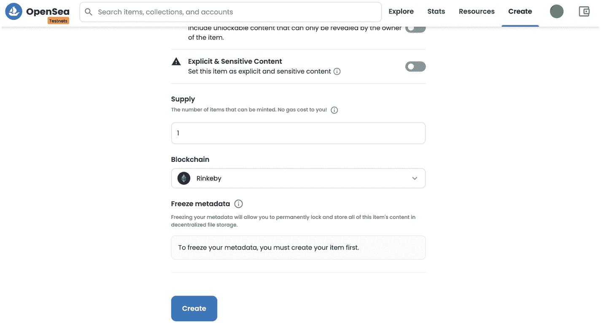

为 NFT 账户添加额外细节的截图。

我们成功创建了一个 NFT！你现在可以在概览中看到关于你的 NFT 的不同详情：

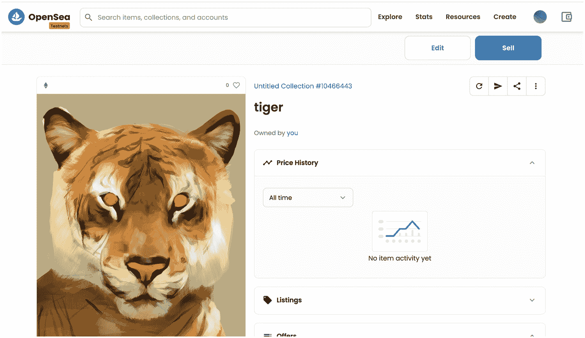

一个老虎 NFT 详情截图。

## NFT 市场

任何特定时间点 NFT 的价值取决于人们愿意为其支付多少。然而，一般来说，NFT 往往价格高昂，因为它们稀缺且数量有限。2018 年，NFT 市场的市值是 4100 万美元。仅仅 2 年后，市值就上涨到了 3.38 亿美元。在 2021 年第三季度，销售额增长到了 107 亿美元。图 6-1 展示了每条链上的收藏品数量。

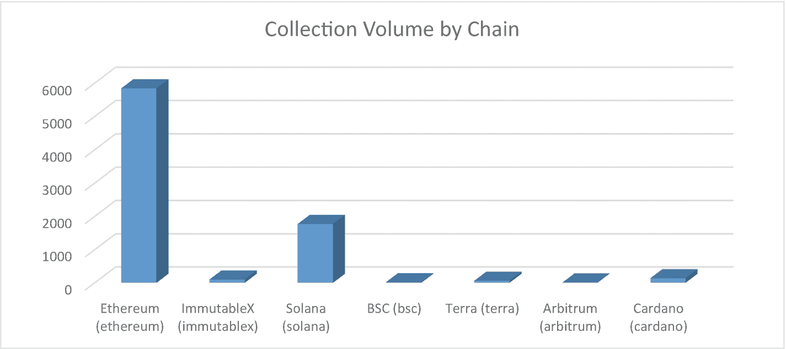

一个柱状图描绘了按链划分的收藏品数量。以太坊的收藏品数量最高。

图 6-1

来自 DefiLlama 的按区块链划分的 NFT 收藏品数量

为了比较，我们还附上了一张图表，展示了每条区块链上的总美元交易量。请注意，以太坊在收藏品数量和美元交易量方面都是目前最流行的区块链。根据 DefiLlama 的这个数据集，以太坊占 NFT 市场总美元交易量的 98%。

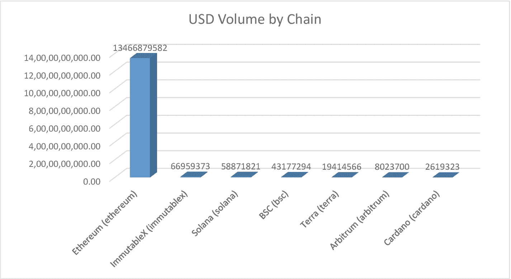

一个柱状图描绘了按链划分的美元交易量。以太坊的交易量最高。

图 6-2

来自 DefiLlama 的按区块链划分的 NFT 收藏品数量

正如你所见，大多数交易和 NFT 都发生在以太坊区块链上。在考虑交易或使用 NFT 市场时，考虑该区块链上发生的交易数量很重要。区块链上的交易越多，意味着该网络将拥有更多用户，并且更稳定、更去中心化。然而，同样重要的是要知道，来自基于 EVM 的网络（如以太坊、BSC 和 Arbitrum）的代币不能用于非基于 EVM 的区块链（如 Solana、Cardano 和 ImmutableX）。

你也可以仅通过单个收藏系列来看到 NFT 的成功。我们选取了来自 `cryptoslam.io` 的销量前 15 名的 NFT 收藏系列，如图 6-3 所示。这些是有史以来最知名和最成功的 NFT 收藏系列，排名前七的收藏系列的销售额已超过数十亿美元。所有这些收藏系列也拥有数千名买家和数万笔交易。最令人印象深刻的收藏系列是 Axie Infinity，拥有 170 万买家、1700 万笔交易和 219 万拥有者。然而，NBA Top Shot 在其网络上拥有惊人的 2100 万笔交易。

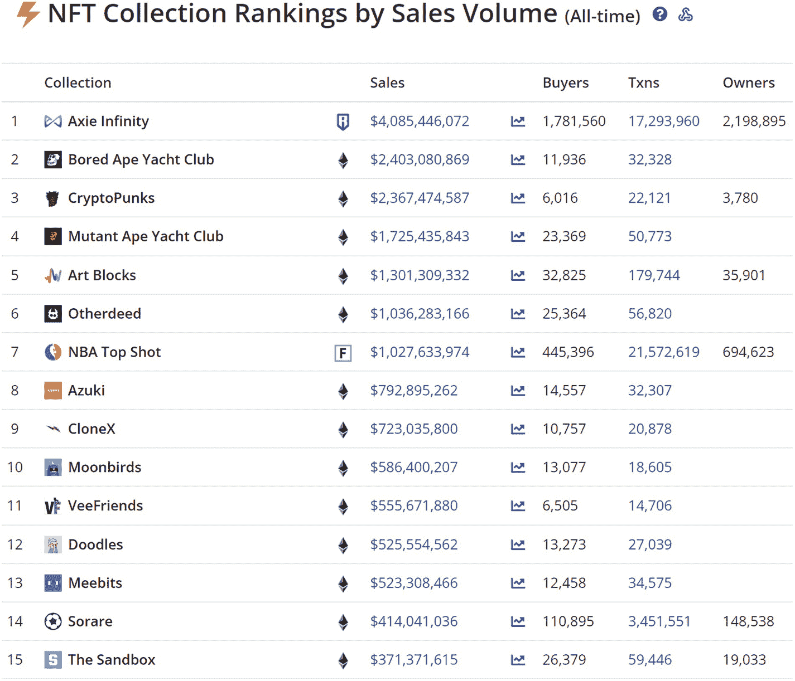

一个图表描绘了按销售额排名的 NFT 收藏系列。Axie Infinity 的销售额最高。

图 6-3

来自 `cryptoslam.io` 的按销售额排名的前 15 名 NFT 收藏系列

### OpenSea.io

最流行的市场是 `OpenSea.io`，它支持超过 150 种支付代币，并且易于使用。注册和查看数字资产是免费的，并且它允许创作者轻松铸造 NFT：

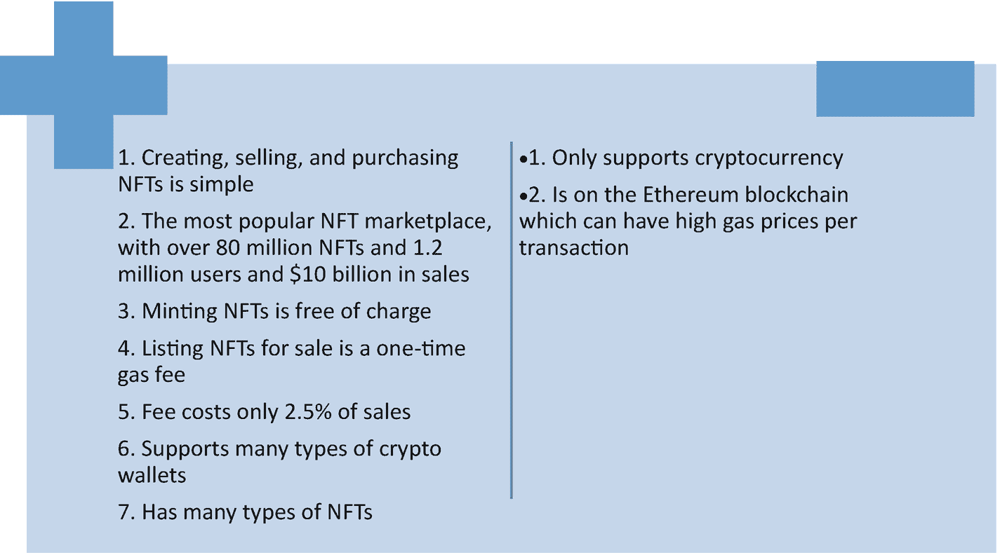

数字资产优缺点对比截图。

### Rarible

`Rarible` 与 `OpenSea` 非常相似——该平台允许用户购买、出售以及创作艺术、视频、收藏品和音乐。不过，`Rarible` 使用其自有代币（`CRYPTO:RARI`），该代币在 `OpenSea` 上也得到支持。`Yum! Brands (NYSE:YUM)` 旗下的 `Taco Bell` 已在 `Rarible` 上架了艺术品，云软件公司 `Adobe (NASDAQ:ADBE)` 也与 `Rarible` 建立了合作关系：

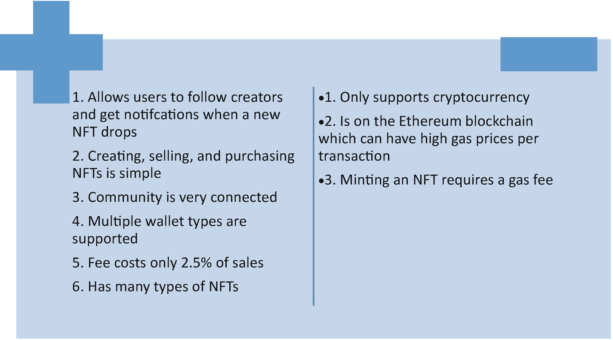

`Rarible` 平台优缺点概览。

### SuperRare

另一个面向数字创作者的、与 `OpenSea` 和 `Rarible` 相似的市场是 `SuperRare`。该网站提供可使用 `Ethereum` 购买的艺术、视频和 3D 图像，尽管许多 `SuperRare` 的 `NFT` 在其他地方无法购得。每个 `NFT` 也都是单一版本。`SuperRare` 宣布了其自有代币。`SuperRare` 的 `NFT` 可以在 `OpenSea` 上交易。`SuperRare` 的另一个独特之处在于，它允许艺术家上传 `NSFW`（即 `Not Safe for Work` 的缩写）。`NSFW` 是指包含性内容、裸露、暴力以及其他可能引发观众不适的内容：

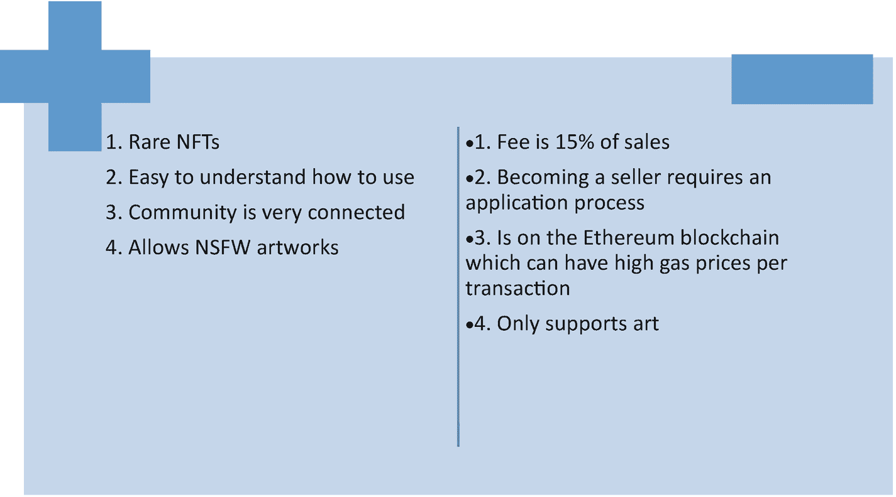

`SuperRare` 平台优缺点概览。

### Foundation

`Foundation.app` 是一个使用 `Ethereum` 进行数字艺术品拍卖和竞标的场所。该平台上已售出价值超过 `1` 亿美元的 `NFT`。但是，在该平台创建账户需要获得现有 `Foundation` 社区成员的邀请：

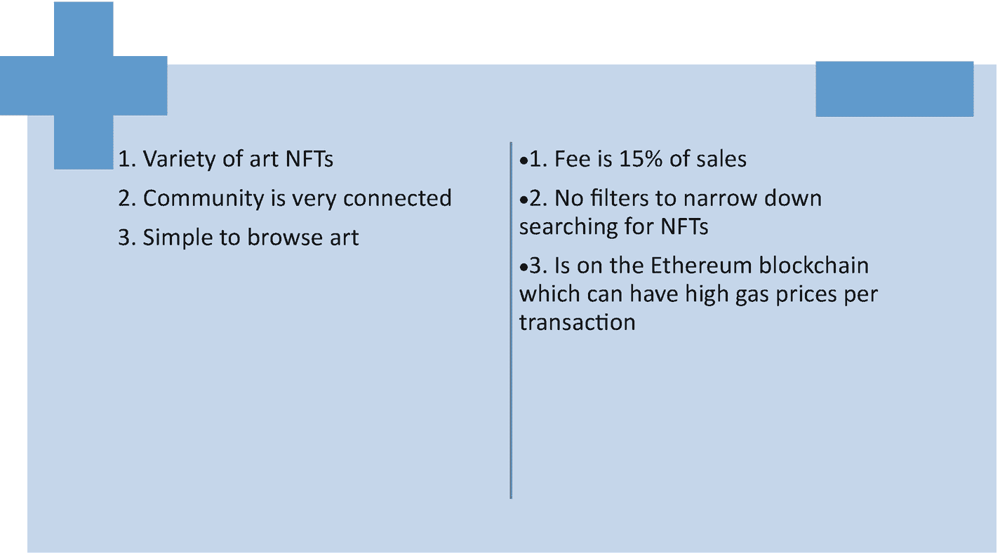

`Foundation` 应用优缺点概览。

### Nifty Gateway

`Nifty Gateway` 曾助力销售一些最著名数字艺术家的作品，包括 `Beeple` 以及歌手兼词曲作者 `Grimes`。然而，要上手使用，你必须已经是知名的数字艺术家、名人或品牌，并通过申请流程获得销售批准。该网站由加密货币交易所 `Gemini` 提供技术支持，其被称为 `Nifties` 的 `NFT` 构建在 `Ethereum` 上。`Nifty Gateway` 也托管所有购买的 `NFT`——这意味着这些 `NFT` 并非存储在你自己的钱包中，而是实际存储在 `Nifty Gateway` 中：

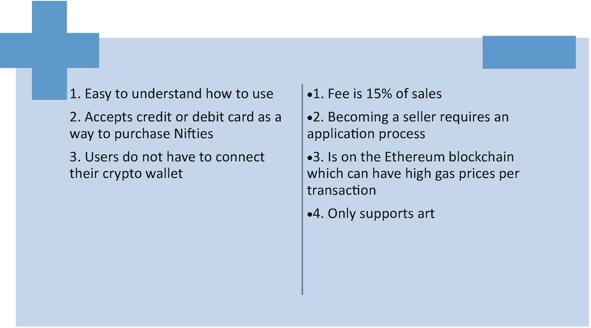

`Nifty Gateway` 平台优缺点概览。

### Axie Marketplace

`Axie Marketplace` 实际上是名为 `Axie Infinity` 的电子游戏的商店，用户可以在其中购买一种名为 `Axie` 的生物。玩家可以训练他们的 `Axie` 并与其他 `Axies` 对战以获取奖励。用户还可以购买可在游戏中使用的土地和物品作为 `NFT`。`Axie Marketplace` 使用一种名为 `Axie Shards` 的货币。该代币基于 `Ethereum` 区块链，并可在其他 `NFT` 市场和 `Coinbase` 全球平台上使用：

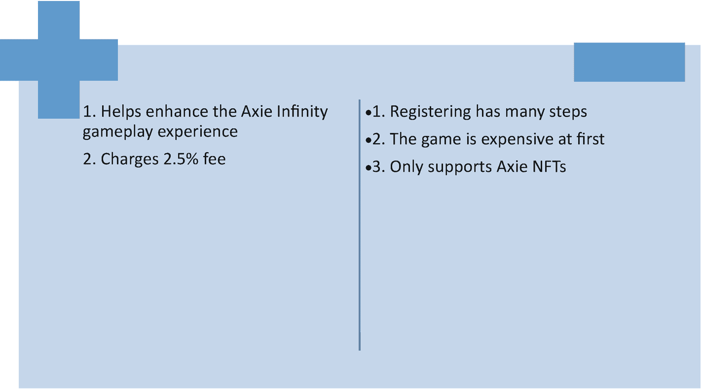

`Axie Marketplace` 平台优缺点概览。

### NBA Top Shot Marketplace

`NBA Top Shot` 是由 `National Basketball Association` 创建的市场。该市场收录了只能在平台内获取的 `NBA` 比赛集锦视频和精彩片段收藏品。截至 2022 年 5 月，该市场销售额已突破 `10` 亿美元，并拥有超过 `40,000` 个 `NFT`：

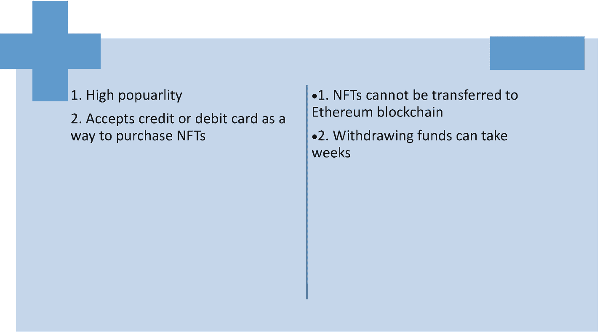

`NBA Top Shot Marketplace` 平台优缺点概览。

### Mintable

`Mintable` 与 `OpenSea` 类似——你可以使用 `Ethereum` 买卖艺术品。该平台还允许创作者铸造（mint）他们的 `NFT`，以便将其作品作为数字资产出售：

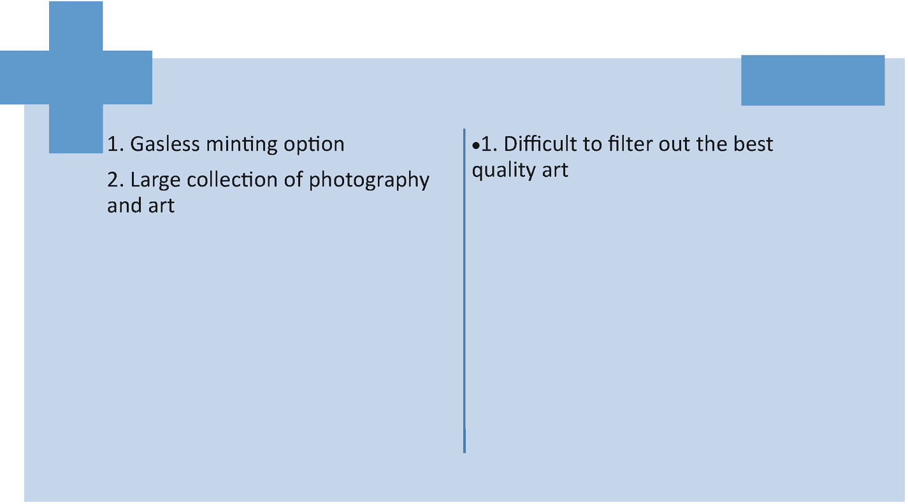

`Mintable` 平台优缺点概览。

### Larva Labs/CryptoPunks

`Larva Labs` 拥有多个数字艺术和基于 `Ethereum` 的项目，但其中最著名的是他们的 `CryptoPunks` `NFT` 项目。`CryptoPunks` 取得了惊人的成功——其作品曾以数百万美元的价格售出。目前，它们已售罄，只能从第三方市场购买。

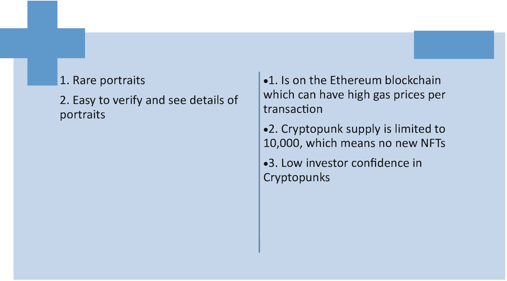

`Larva Labs` 与 `CryptoPunks` 平台优缺点概览。

## NFT 的未来

NFT 拥有巨大潜力，且该领域的关注度正在迅速增长。然而，围绕 NFT 仍然存在许多担忧。

目前，关于 NFT 行业是否是一个即将破裂的泡沫存在争议。如前所述，NFT 的价值基于市场对其的需求。近年来，人们愿意为 NFT 支付数千甚至数百万美元，因为他们相信 NFT 的未来价值会增长。但如果未来人们对 NFT 的兴趣减退，那么现在的投资可能无法在未来获得回报。如果太多人同时退出市场，市场可能会崩盘。不过，NFT 领域的最终结局可能与 21 世纪初的互联网现象类似——起初人们对 NFT 抱有疑虑并存在大量投机行为，但最终它们会更好地融入社会。NFT 已凭借数十亿美元的销售额和数百万买家证明了自己的价值。

另一个问题是，NFT 在防盗方面提供的保护也很少。虽然 NFT 提供了所有权证明，但任何人都可以访问正在交易的 NFT，这意味着数字商品可以被复制和下载。未来，随着数字商品和版权法的不断发展，我们可能会开始缓解这个问题。

当然，NFT 最大的限制之一是其被认为对环境有害。根据英国可再生能源中心的数据，每笔以太坊交易消耗 48.14 千瓦时的能源。相比之下，英国家庭的日均用电量为 8.5 到 10 千瓦时。不过，环境工程师和科学家们已经在努力减少加密行业的排放，例如使用权益证明（PoS）而非工作量证明（PoW）共识。同样值得一提的是，实体艺术品经常通过飞机或卡车在展馆间运输，这意味着实体艺术也会增加碳足迹。

说到艺术，NFT 目前最著名的应用场景之一就是数字艺术。随着 NFT 持续为艺术家提供数字分享作品的机会，它为不同背景和经验的艺术家创造了更多可能性。艺术家将不再需要依赖公司、品牌和收藏家，从而能够更自由地探索创作愿景，并找到支持自己的观众。NFT 还能鼓励创意，因为数字作品可以有多种形式，从虚拟现实到可用于日常生活的作品。

此外，NFT 也能惠及艺术家的观众。NFT 提高了观赏艺术的可及性——观众无需前往实体空间，因此人们可以随时随地探索画廊。由于区块链交易的直接性，赞助人也可以直接支持艺术家和创作者。

另一个可能的用途是通过 NFT 销售音乐会和活动门票。纸质门票存在遗失或复制的风险，而以太坊区块链可以提供不可篡改且真实的所有权记录。

NFT 和区块链游戏在未来几年也可能越来越受欢迎。在线购买和交易游戏内物品及货币已经很常见。NFT 可以成为保障买家数字资产所有权的下一步。

同样值得一提的是，NFT 还可以用于房地产市场。可以发行 NFT 作为财产所有权的证明。NFT 也可以用作验证工具——学校可以向学生发放 NFT 作为学位完成的证明。

当然，还有一个在科技界和公众中迅速获得关注的概念：元宇宙。NFT 基于网站，通常用于数字商品，而元宇宙是一个基于虚拟现实的数字空间。虽然乍看之下似乎不同，但许多公司看到了潜力，并找到了将两者结合的方法。

## 总结

在本章中，我们了解到 NFT 是不可替代代币，或是独一无二的单个代币。NFT 最常在以太坊网络上交易；显示所有权证明的数字签名使得文件的转移和购买变得简单。下一章将介绍元宇宙的基础知识，这是一个基于新沉浸式技术的 3D 互联网。

