# 7. 元宇宙：重塑的世界

1974 年，哲学家罗伯特·诺齐克讨论了一种体验机器，它可以刺激个体的大脑，使其获得与“现实”世界中体验难以区分的快乐体验。诺齐克提出了一个问题：“如果可以选择，我们会选择机器而不是现实吗？”1999 年，科幻电影《黑客帝国》提出了一个类似的问题：红色药丸还是蓝色药丸？吞下红色药丸，在现实世界中醒来，发现世界只是矩阵创造的模拟；或者吞下蓝色药丸，传送到虚拟的矩阵情节中？元宇宙的概念类似于《黑客帝国》，在“互联网的未来版本”中，现实世界与虚拟世界融为一体。

虽然元宇宙仍处于早期阶段，但近年来它迅速进入了主流视野。元宇宙将是未来的 3D 互联网，它基于一系列新技术构建，包括虚拟现实（VR）、混合现实（MR）、增强现实（AR）、区块链、人工智能（AI）和物联网（IoT）。

本章将介绍元宇宙的基础知识。然后，我们将讨论 AR、VR、MR 和 XR 背后的概念和技术。通过探索元宇宙的不同层级，我们理解其结构。接着，我们讨论 NFT 和加密游戏如何在元宇宙中运作。然后，通过一个详细的实践示例，我们了解如何在元宇宙世界中购买虚拟房地产资产。在本章末尾，我们将概述元宇宙的未来。

在本章中，我们将介绍以下关于区块链的具体主题：

- 元宇宙简介
- AR、VR、MR 和 XR
- 理解元宇宙层级
- 元宇宙中的加密游戏
- 元宇宙中的虚拟房地产
- 元宇宙的未来

## 元宇宙简介

元宇宙是各行各业的火热话题，特别是当它与其他技术（如区块链和人工智能）相结合，以构建互联网的未来时。

### 什么是元宇宙？

元宇宙在 2021 年成为顶尖技术和趋势之一，并且至今热度不减。元宇宙尚未到来，但许多大公司已经对元宇宙的开发投入巨资。最终，元宇宙将成为互联网的 3D 变体，并将虚拟现实体验提升到新的水平。它将使用户几乎能够做任何事情——从工作、休闲、社交、教育、购物，甚至通过数字头像购买土地——在一个纯粹的虚拟世界中完成。

### 元宇宙简史

#### “元宇宙”一词诞生（1982 年 6 月）

`Metaverse` 一词最初由美国作家尼尔·斯蒂芬森在其 1982 年出版的科幻小说《雪崩》中创造。故事发生在 21 世纪全球金融崩溃多年后的洛杉矶。《雪崩》的主角是一位名叫“英雄·主角”的、手持武士刀的黑客，他在洛杉矶与一个名为 `Metaverse`（由希腊语前缀“Meta”（意为超越）和“verse”（意为宇宙）组合而成）的虚拟世界之间来回穿梭。

在书中，`Metaverse` 是一个由用户控制的化身所填充的三维环境。需要使用一种特殊的光滑护目镜（类似于今天的 VR 头显）才能进入。在斯蒂芬森的虚拟世界中，美元毫无价值，取而代之的是替代性的加密数字支付方式，例如 `Kongbucks`，类似于我们今天的加密货币。

#### 第二人生——迈向元宇宙的一步（2003 年 6 月）

2003 年，在《雪崩》出版近二十年后，直接受《雪崩》中 `Metaverse` 启发的在线虚拟世界游戏 `Second Life` 发布。用户可以创建化身、建造家园并与他人交流。

#### Roblox——一个在线多人在线游戏平台（2006 年 1 月）

`Roblox` 是一款多人在线视频游戏，使玩家能够编程游戏并游玩其他人制作的游戏。截至 2022 年 9 月，`Roblox` 拥有超过 2.3 亿注册玩家，每日活跃玩家达 3000 万。

#### Decentraland——首个基于以太坊区块链的虚拟现实平台（2015 年 6 月）

`Decentraland` 是一个基于以太坊的去中心化 3D 虚拟现实平台，由埃斯特班·奥尔达诺和阿里尔·梅利奇于 2015 年创建。2017 年，Decentraland 团队进行了首次代币发行（ICO），筹集了 86,206 个以太坊资金。在 `Decentraland` 中，用户可以创建虚拟对象，如赌场、艺术画廊、实验室、农场和主题公园，然后向公众开放，并收费供其他玩家参观。`Decentraland` 有两种代币。第一种代币是 `LAND`——一种治理型 NFT 代币；第二种是 `MANA`，一种 `Decentraland` 的原生加密货币代币，用于促进 `LAND` 的购买。

`LAND` 管理着 `Decentraland` 中的流程，代表了其中可穿越的虚拟空间和资产。每个非同质化数字资产被划分为由 `LAND` 代币持有者拥有的 16 米 x16 米的地块，并包含 `Decentraland` 中虚拟商品和服务的所有权。

#### Pokémon Go——首款 AR 手游（2015 年 9 月）

`Pokémon Go` 是首款增强现实（AR）移动游戏，由 Niantic Labs 与任天堂及宝可梦公司合作开发。宝可梦被标注在真实的手机地图上，当玩家走到该地点时，他们使用摄像头在现实中检测宝可梦，然后捕捉它们。该游戏于 2016 年 7 月发布，迅速风靡全球。发布仅七天后，`Pokemon Go` 的单日活跃玩家就超过了 2000 万。

#### 堡垒之夜——具有社群的多人游戏（2017 年 7 月）

`Fortnite` 是首款拥有游戏社交网络的在线多人在线视频游戏。`Fortnite` 是一款生存对战游戏，在玩家对玩家（PvP）对战模式中，最多 100 名玩家互相战斗，直到只剩一人站立。它使玩家能够与伙伴联系、建立社群并扩展社交网络，这是玩家持续玩游戏的最强动力之一。`Fortnite` 发布仅两周后，玩家就超过了 1000 万。截至 2022 年 6 月，`Fortnite` 上仍有大约 300 万玩家。

#### 电影——《头号玩家》（2018 年 3 月）

史蒂文·斯皮尔伯格的《头号玩家》改编自欧内斯特·克莱因 2011 年的同名小说。故事设定在一个反乌托邦的未来，角色们大部分时间都生活在 `OASIS` 元宇宙中——包括在 `OASIS` 中上学、工作、玩耍和社交。`OASIS` 使用数字货币进行支付。角色只需进入传送门就可以传送到多个 `Metaverse` 世界。大多数人隐藏真实身份保持匿名。《头号玩家》常被视作未来 `Metaverse` 的一个例子。

#### Axie Infinity——边玩边赚游戏平台的 NFT（2018 年 3 月）

`Axie Infinity` 是一款基于 NFT 的在线视频游戏，玩家可以购买可收藏电子宠物的 NFT，并在对战中让它们相互匹配。`Axie Infinity` 元宇宙使该游戏具备了“边玩边赚”的设计（也称“付费游玩以赚取”模式），玩家在支付初始费用后，可以通过玩游戏赚取基于以太坊的游戏内代币（`SLP`）。玩家每十四天可以兑现一次代币。

#### 微软推出 Mesh（2021 年 4 月）

`Microsoft Mesh` 是一个完全虚拟的世界。作为一个 `Metaverse` 平台，用户可以通过任何支持 `Mesh` 的应用程序，在 `HoloLens 2`、虚拟现实头显、手机、平板电脑或 PC 上连接到 `Mesh`。

#### Facebook 更名为 Meta（2021 年 10 月）

2021 年 10 月 28 日，Facebook 宣布将公司名称更改为 `Meta`。该公司基于科幻术语 `Metaverse` 踏入了新业务领域，并试图拥抱这个由虚拟现实构建的全新世界 `Metaverse`。

图 7-1 总结了 `Metaverse` 的简要历史。

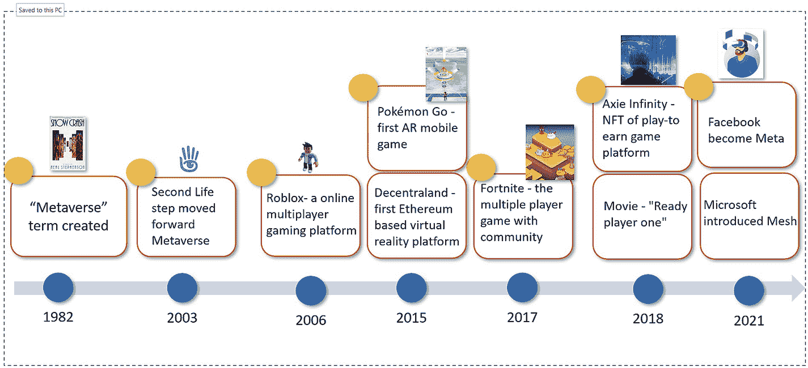

一幅示意图描绘了从 1982 年到 2021 年的元宇宙历史。部分标签包括“元宇宙术语诞生”、“Roblox——一个在线多人在线游戏平台”、“Facebook 更名为 Meta”和“微软推出 Mesh”。

**图 7-1** 元宇宙简史

### 元宇宙的特征

在 `Metaverse` 中，只要你能够想象，你就可以成为你想成为的人，创造你偏爱的东西，在你想要的地方，以你想要的方式。这种对开发者的完全自由将带来一些有趣的特殊体验，同时对于开放的 `Metaverse` 运行也是必要的。开发者在构建 `Metaverse` 时应考虑几个特征，如图 7-2 所示。

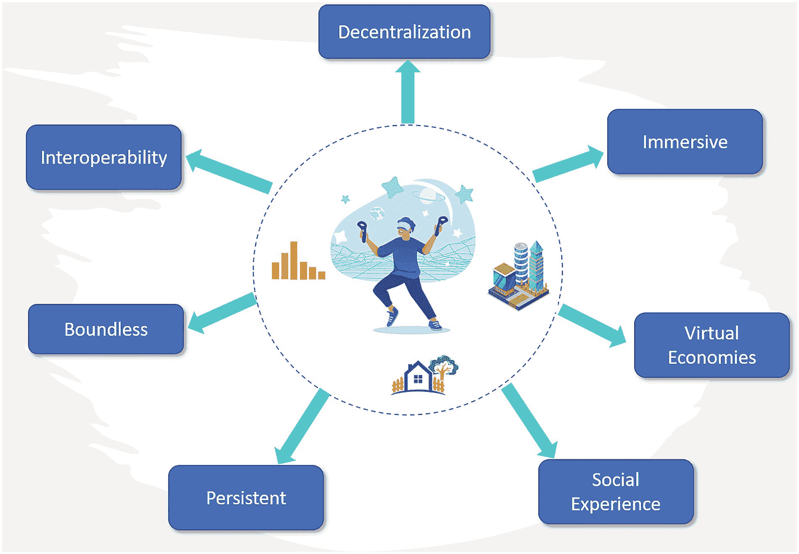

一个圆形图描绘了元宇宙的特征。标签部分为：去中心化、沉浸式、虚拟经济、社交体验、持久性、无边界的互操作性。

**图 7-2** 元宇宙的特征

- 互操作性
- 去中心化
- 沉浸式
- 无边界
- 虚拟经济
- 持久性
- 社交体验

让我们回顾一下这些特征，以理解如何开发一个提供独特体验的开放 `Metaverse`。

#### 互操作性

`Metaverse` 的互操作性是指个人在不同虚拟世界中与其他各种用户进行交流的能力。用户还可以将自己的数据和数字资产从一个虚拟世界转移到另一个虚拟世界，并按照公开市场确定的市场价值将其交易给其他个人。`Metaverse` 中的互操作性功能类似于区块链中的互操作性。用户只需一个钱包即可跨不同的 `Metaverse` 虚拟世界执行所有交易。

#### 去中心化

虽然互操作性允许用户在虚拟世界之间交换资产，但去中心化是允许共享、开放的虚拟世界 `Metaverse` 的关键属性。用户可以生产自己具有经济价值的数字资产和体验。他们可以顺利地购买和出售它们，而无需依赖任何中央权威机构。通过去中心化，个人在 `Metaverse` 中获得了对其资产的完全控制权。这也意味着 `Metaverse` 并非由单一公司或平台拥有。它具有跨平台互操作性，并且其内部经济应该既稳健又具有竞争力。

#### 沉浸式

增强现实、虚拟现实、混合现实与扩展现实等趋势被统称为沉浸式体验。沉浸式体验能带你进入一个由数字创建的、通常是三维的世界，在这里你可以与其他访客、虚拟物品以及你周围的环境进行互动。

元宇宙是沉浸式体验的一种形式。它在一个全面、共享、互动且始终在线的虚拟世界中，融合了物理世界与虚拟世界的体验，包含了虚拟经济中的游戏、购物、社交和工作等活动。大多数用户将主要在元宇宙的这个层面上进行互动。

#### 无边界

元宇宙作为一个无限且始终在线的虚拟空间，消除了各种障碍。它对于可同时使用的人数、可运用的商业形态、可发生的活动类型等均没有限制。

#### 虚拟经济

元宇宙中的个体可以参与由加密货币驱动的去中心化数字经济活动。这包括数字资产市场，个人可以在其中投资、订购、竞拍和交易各种商品和服务，例如虚拟形象、虚拟服装、房屋、NFT 和活动门票。

#### 持久性

元宇宙是一个可以从全球任何地方随时访问的无限开放世界。与现实世界一样，即使你离开，一个持久的元宇宙也必须继续存在。你可以随时访问位于现实世界某个特定地点的虚拟商店，并能与真实的店铺销售人员交谈。你无需担心这些虚拟商店的机会消失——下次你再来时它依然存在，除非创建者将其删除。就像在现实世界中，实体店总是存在，只有经过所有者同意才能被移除。

#### 社交体验

元宇宙的核心在于社交体验。作为一个社交平台，元宇宙是一个 3D 虚拟场所，用户可以在其中同时参与特定的活动/地点/事件，并相互会面。每个人都可以通过自己喜欢的数字角色来代表自己。这些个性化虚拟形象也为游戏化开启了全新可能，并强化了为用户提供协作和沉浸式体验的基础。

## AR、VR、MR 与 XR

元宇宙的关键特征之一是沉浸式。沉浸式技术通过模拟现实来模仿真实世界，并营造环绕式的感官感受，从而创造出沉浸感，带来独特体验。多年来，沉浸式技术已被广泛应用于众多行业，包括电子游戏、考古学、艺术、医疗保健、电子商务、工业设计、教育和娱乐等领域。

通过沉浸式媒介，有多种方式可以从第一人称视角向用户呈现虚拟内容，包括增强现实（AR）、虚拟现实（VR）、混合现实（MR）和扩展现实（XR）。

### 增强现实（AR）

2016 年夏天，Niantic 公司发布的 `Pokémon GO` 风靡全球。各个年龄段的玩家都试图通过手机摄像头在杂货店里捕捉皮卡丘，在家里捕捉伊布。这就是 AR，它允许虚拟元素在物理环境中显示。自那时起，AR 变得越来越流行。

#### 什么是增强现实？

AR 被定义为一种技术和方法，它通过在其上叠加声音、视频和其他细节，允许用户在真实的周围环境中，体验由生成的沉浸式和三维（3D）虚拟数字内容所带来的、被个人感知所增强的效果。

#### AR 的类型

AR 有四种类型：无标记 AR、基于标记的 AR、基于投影的 AR 和基于叠加的 AR，如图 7-3 所示。

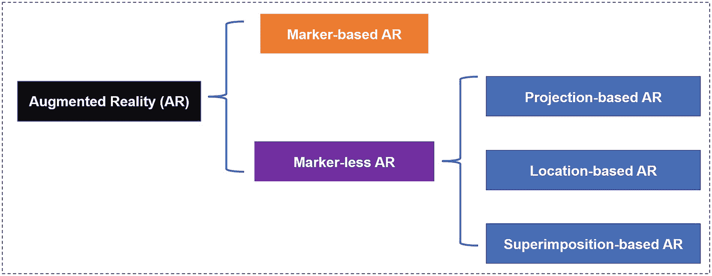

流程图描绘了增强现实的类型。标记出的 AR 类型是基于标记的，而无标记 AR 进一步细分为基于投影的、基于位置的和基于叠加的。

**图 7-3** AR 的类型

##### 基于标记的 AR

这种 AR，也称为基于识别的 AR 或图像识别，依赖于识别标记/用户定义的图像来工作。基于标记的 AR 通常需要用户安装一个软件应用程序。然后用户可以使用它来扫描具有独特图案（摄像头易于识别和处理）的标记。接着，应用程序会激活一个增强体验（无论是图像、文本、视频还是动画），使其显示在设备上。

**示例：** 增强现实二维码就是基于标记的 AR 的一个例子。

##### 无标记 AR

无标记 AR 指的是无需标记的 AR，它不需要任何特定的图像来显示其虚拟内容。无标记 AR 软件——即时定位与地图构建技术（SLAM）——依赖于设备的硬件，包括摄像头、GPS 以及其他传感器（如加速度计和指南针），来收集数据并创建合适的虚拟 3D 对象。

与基于标记的 AR 不同，即使扫描设备被移开，增强对象也会停留在同一位置。无标记增强现实在游戏（如 `Pokémon Go`）中非常流行，也用于现场活动和虚拟产品植入。

无标记 AR 有三种子类型：基于位置的 AR、基于投影的 AR 和基于叠加的 AR。

##### 基于投影的 AR

基于投影的 AR 投影技术会在一个表面上生成图形。因此，它不需要任何智能手机或屏幕。相反，一个或多个投影设备将光线投射到表面上，形成一个 3D 模型。可以通过用手触摸投影的 3D 物体表面来与数字图像进行交互并创建输入。在基于投影的 AR 接收到信号后，它会通过更新投影的增强对象来作出响应。

**示例：** 耐克在其伦敦工作室举办了一场基于投影的 AR 活动，让感兴趣的消费者可以设计自己专属的耐克鞋款，并将其投影在一个完整的 3D 空间画廊中。

##### 基于位置的 AR

基于位置的 AR，也称为基于地理位置的增强现实，其 AR 应用会读取设备的 GPS 位置来分析用户的位置。当该地点与预设位置匹配时，就会触发生成一个虚拟对象显示在该地点。

**示例：** 纽约现代艺术博物馆提供了一个基于位置 AR 的独特体验。

##### 基于叠加的 AR

这种 AR 会用人眼可看到、经过升级增强的 3D 对象来替换原始对象的局部或全部视图。物体识别在其中扮演着至关重要的角色，这意味着如果一个应用无法识别某个物体，它就无法增强该物品的外观。

**示例：** `Dulux Visualizer` 应用是基于叠加的 AR 的一个例子。它允许用户从油漆颜色可视化工具中选择任何颜色，然后上传照片并虚拟地“重新粉刷”他们的房间或房屋，从而在实际粉刷墙壁之前看到效果。

### 增强现实的工作原理

我们刚刚讨论过，同步定位与地图构建技术（`SLAM`）在无标记 AR 中扮演着关键角色。`SLAM`通过设备的硬件（如摄像机、GPS 和其他传感器）从室内或室外环境收集数据来追踪设备的位置，然后创建合适的虚拟 3D 对象。

`SLAM`技术广泛应用于各个行业，主要包括自动驾驶汽车、机器人和增强虚拟现实。

一个`SLAM`系统的架构包含两种用于完成`SLAM`的组件。第一种组件是传感器信号处理，包括前端处理，它主要依赖于所使用的传感器。

第二种组件是位姿图优化，包括与传感器无关的后端处理。

有两种类型的`SLAM`可用于前端处理以收集数据：视觉`SLAM`和 LiDAR `SLAM`。视觉`SLAM`（`vSLAM`）使用摄像头捕捉或收集周围图像，并通过连续的摄像头帧追踪一组点，而 LiDAR `SLAM`则利用激光传感器读取数据。

前端处理将传感器数据抽象成适合估计的模型，而后端则对前端产生的数据进行推理。因此，`SLAM`可以估计它们的 3D 位置以创建地图。`SLAM`过程如图 7-4 所示。

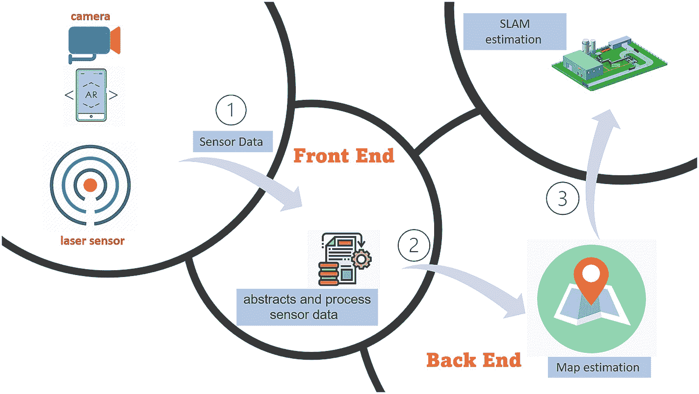

该示意图描绘了包含前端和后端的视觉`SLAM`系统。标注的部分依次为：摄像头、激光传感器、传感器数据、`SLAM`估计、抽象与处理传感器数据，以及地图估计。

**图 7-4** — 视觉`SLAM`系统中的前端和后端

### 虚拟现实 (VR)

“虚拟现实”一词最早出现在 1982 年澳大利亚著名科幻小说作家达米恩·布罗德里克的小说《犹大曼陀罗》中。

“虚拟现实”作为 VR 技术在主流媒体中被广泛采用，这归功于 VR 开发者杰伦·拉尼尔——他设计了第一款商业级虚拟现实硬件——以及 1992 年的电影《割草者》，该片向更广泛的受众介绍了虚拟现实系统的使用。

#### 什么是虚拟现实？

虚拟现实是一种由计算机生成的环境，能让用户在其周围获得丰富、沉浸的体验。通过佩戴虚拟现实头显或相关应用，VR 通过增加景深来生成计算机 3D 图像和视频。该系统还会重建静态 2D 图像之间的比例和距离，以模仿真实的视觉体验。VR 让用户能够沉浸于独特的模拟环境中，与之互动并探索，同时相信自己是真实世界中进行这些操作。

#### VR 的类型

VR 系统主要分为三类：非沉浸式 VR、半沉浸式 VR 和完全沉浸式 VR，如图 7-5 所示。

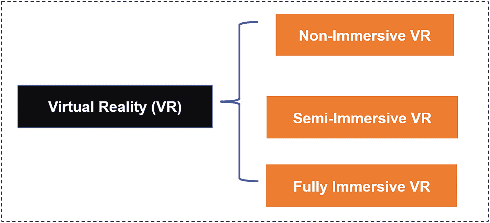

该流程图描绘了虚拟现实的类型。标注的类型包括：非沉浸式 VR、半沉浸式 VR 和完全沉浸式 VR。

**图 7-5** — VR 的类型

##### 非沉浸式 VR

非沉浸式虚拟现实是一种通过计算机或游戏机在屏幕上显示虚拟内容的虚拟现实。它是所有 VR 类型中沉浸感最低且成本最低的。用户通过键盘、鼠标和控制器等计算机输入设备与非沉浸式 VR 进行交互。

**示例：** 视频游戏是非沉浸式 VR 体验的一个很好的例子。

##### 半沉浸式 VR

半沉浸式虚拟体验为用户提供介于非沉浸式和完全沉浸式 VR 之间的部分虚拟环境。通过使用计算机屏幕或 VR 设备（如眼镜追踪传感器和投影系统），用户可以在虚拟环境中移动，但仍能看到自己。该系统不被视为完全沉浸式模拟器。

**示例：** 用于飞行员培训的飞行模拟器和虚拟导览是半沉浸式 VR 的良好例子。

##### 完全沉浸式 VR

沉浸式 VR 模拟是一种为用户提供最高级别完全沉浸式虚拟体验的技术，并且与现实世界完全隔绝。它允许参与者与由 VR 设备（如 VR 眼镜、手套和身体探测器）生成的立体 3D 对象进行交互，并建立逼真的虚拟体验。

**示例：** 虚拟山地自行车是完全沉浸式 VR 的一个例子。玩家佩戴 VR 头显骑乘室内自行车。他们可以在从未去过的地方骑行，获得激动人心的体验，并在虚拟环境中与其他玩家互动。

#### 虚拟现实如何工作

真正沉浸式的虚拟现实可以欺骗人的大脑，使其相信它的存在，并将他们带到虚拟世界中的其他地方。然而，生成这些体验的背后涉及许多复杂的技术。

##### 视场角 (FOV)

人单眼的近似视场角 (`FOV`) 水平方向约为 135 度，垂直方向略高于 180 度。人类通常可以看到头部周围 200–220 度的弧线。人类左右眼对同一场景的重叠部分约为 114 度，我们正是通过这个角度看到 3D 效果。这个 `FOV` 对于人脑计算深度感知是必要的。在虚拟现实中，`FOV` 指的是参与者一次能同时看到周围虚拟世界的多少。VR 头显的摄像头模拟人眼位置以及人们可以预期的特定 `FOV` 角度。头显还配备了陀螺仪传感器来追踪你的移动方式，调整你的视野，并让你能够探索 360 度场景。所有这些都将极大地提升完全沉浸式的体验。如今大多数 VR 头显通常支持 114 度的 3D 视觉空间来呈现虚拟内容。

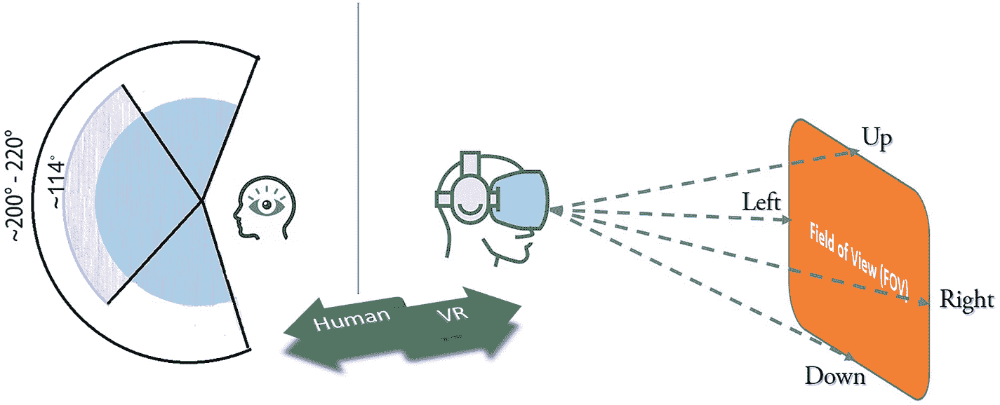

该图展示了人类在左、上、右、下不同视角下的虚拟现实视场。

**图 7-6** — 视场角 (FOV)

##### 帧率 (FPS)

帧率/FPS（每秒帧数）定义了图形处理单元 (`GPU`) 每秒处理图像的速度。帧率与分辨率相关，后者显示了图像随时间变化的细节量。例如，帧率为 50 `FPS` 时，你在一秒钟内会看到 50 个样本。在下一秒中，它会显示另外 50 个样本。假设一个物体随你的视野移动，你每秒只能看到这 50 个样本更新后的位置。在这些快照之间，其他样本对你来说是看不见的。如果将帧率提高到 500 `FPS`，你每秒钟获得的样本量将增加十倍。结果将是更好的图像质量、更流畅的运动以及更沉浸的体验。较低的帧率通常会产生较差的影响。研究表明，任何低于 60 `FPS` 的帧率都会使用户感到迷失方向、恶心以及其他负面效应。VR 开发者通常以至少 60 `FPS`–90 `FPS` 为目标。

##### 位置与头部追踪

在沉浸式虚拟环境中，实时追踪用户头显的位置以确定位置和方向至关重要。用户可以在虚拟环境中移动，环境也会随其移动而调整。`SLAM` 在 VR 中广泛用于头部和眼部追踪。

##### 空间音频与音效

空间音频提供多维且沉浸式的音频，跟随用户设备的移动而变化。设备密集处理用户的运动数据，生成声音的不同频率，并根据声音可能传来的每个方向进行不同的偏移。其结果创造出一种三维音效，为用户提供模拟真实生活中听声音方式的体验。

### 混合现实（MR）

混合现实（MR）是一项新兴技术，它结合了虚拟现实（VR）与增强现实（AR）。MR 融合了物理世界与虚拟世界，创造出新的环境，使物理对象与数字对象能够实时交互。

**示例：** MR 工作站将不再局限于单个或两个物理显示器。这些工作站将根据需要在 3D 虚拟空间中包含多个屏幕。用户可以定义并创建无限数量的定制化工作站，并根据需要删除这些虚拟屏幕。此类工作环境将提升效率，并打造更愉快、舒适且健康的工作场所。

### 扩展现实（XR）

扩展现实（XR）是一个总称，涵盖了真实与虚拟沉浸式技术的全谱系，包括 VR、AR 和 MR。为了总结我们目前关于 AR、VR 和 MR 的讨论，表 7-1 展示了这些沉浸式技术之间的差异。

**表 7-1** VR、AR 与 MR 的对比

| 增强现实（AR） | 虚拟现实（VR） | 混合现实（MR） |
| --- | --- | --- |
| 虚拟数字内容叠加在真实世界环境之上。 | 完全独立于真实世界的计算机生成沉浸式虚拟世界。 | 物理世界与虚拟世界相互融合。 |
| 部分沉浸于虚拟环境。 | 完全沉浸于虚拟环境。 | 可与物理世界和虚拟世界进行交互与操控。 |
| 技术已成熟且不断改进。 | 逼真的技术技能练习，可收集关键训练指标。 | 与远距离协作者进行实时信息与知识共享。 |
| 可使用专用 AR 头显在小屏幕上显示虚拟内容。 | 可使用专用 VR 头显和手柄控制器增强体验。 | 可使用专用 AR 和 VR 设备创造混合体验。 |
| 需要 3-7 年时间在不同领域采用 AR。 | 需要 2-4 年时间在不同领域采用 VR。 | MR 的采用时间与 VR 相近。 |

## 理解元宇宙的层级

想象一下，元宇宙是一个并行的 3D 虚拟世界，提供各种产品或服务，甚至将与大部分物理世界集成并互动。作为一个模拟的数字环境，元宇宙融合了 AR、VR、物联网（IoT）、5G、大数据、边缘计算、人工智能（AI）和区块链等所有数字技术，为类似真实世界的社会社区构建虚拟场所。此外，它拥有一个由数字货币和不可替代代币（NFT）驱动的自给自足的虚拟经济。企业家兼游戏设计师乔恩·拉多夫将元宇宙世界划分为七个层级：体验、发现、创作者经济、空间计算、去中心化、人机界面，以及基础设施。这些层级涵盖了元宇宙领域中不同产品或服务的过去、现在和未来的发展形态。图 7-7 展示了元宇宙中的这些层级。

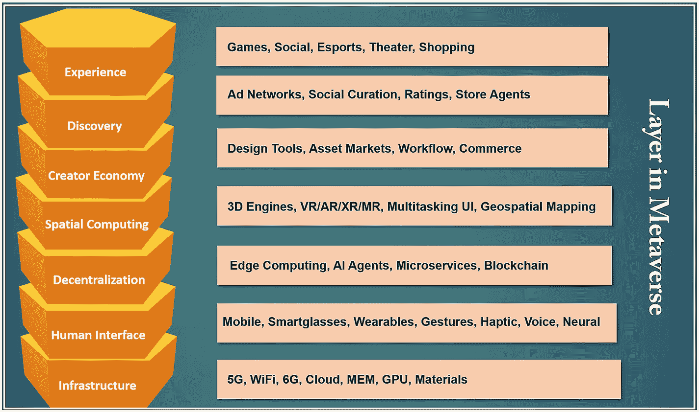

**图 7-7** 元宇宙层级

### 体验

体验层是目前大多数元宇宙业务、公司和开发人员关注的焦点。该层的一个主要特征将是社区驱动的事件、社交互动、虚拟服务和数字资产，例如游戏、NFT、社交、电子竞技、会议、剧院、购物和活动。用户可以通过数字内容在虚拟环境中进行交互。在这一层，元宇宙最终将通过去物质化物理空间，创造出一个全新的虚拟世界维度。因此，元宇宙将为每个人提供前所未有的丰富体验。

游戏可能是展示元宇宙体验层许多功能最众所周知的平台：虚拟沉浸体验、化身身份、数字 NFT 市场、3D 产品展示和实时社交互动。该层还包括许多其他物理世界与数字世界融合交织的日常体验：Zoom 办公 VR 会议、`HOLOFIT VR Fitness`、`Netflix VR` 电影、`TvoriVR` UX 与 UI 原型设计。

以下是该层中几个流行的元宇宙平台。

**示例：** `Decentraland`、`Fortnite`、`Roblox`、`Sandbox`、`Spatial`、`Rove`、`动视暴雪`、`任天堂` 和 `Xbox`。

### 发现

发现层涉及信息的持续拉取和推送，将人们引向对不同新体验的学习。“拉”代表一个入站系统，用户在其中主动寻求关于新体验的信息。另一方面，“推”指的是一个出站系统，元宇宙体验在此等待用户并通知他们。

以下是入站和出站发现可能发生的一些例子。

**入站：**

- 搜索引擎
- 实时在场
- 社区驱动内容
- 应用商店
- 白皮书
- 案例研究
- 赢得媒体

**出站：**

- 展示广告
- 通知
- 电子邮件和社交媒体

社区驱动的内容有助于传播其概念、支持技术和体验的相关知识。NFT 是自 2021 年以来最热门的话题之一。许多公司，如耐克、星巴克、可口可乐、麦当劳和路易威登，都将 NFT 数字资产作为营销工具来推广其产品或服务。这是提高社区参与度并在元宇宙中获得更多发现的好方法。

实时在场也将在改善交互式用户体验方面发挥关键作用。例如，PlayStation 和 Xbox 等视频游戏服务允许玩家实时查看朋友的活动。出站发现中最常见的方法是展示广告、通知、电子邮件和社交媒体。

**示例：** `Unity`、`Google 商店`、`Apple 商店`、`Steam`、`PlayStation` 和 `Xbox`。

### 创作者经济

在元宇宙的早期阶段，制作数字资源、生成沉浸式体验以及添加去中心化支付需要大量的专业技能和努力。这个阶段类似于早期版本的互联网。创作者需要大量的编程知识来设计和构建应用。如今，像 `WordPress` 这样的工具允许内容创作者无需代码，只需几次点击和拖放功能即可轻松构建带支付选项的网站，从而实现创作过程。随着元宇宙市场的增长，越来越多的商业软件工具将会出现。因此，元宇宙中设计师和创作者的数量呈指数级增长。例如，建立在去中心化区块链上的 NFT 等代币，为数字资产提供可证明的所有权，同时拥有独立的中心化平台。这种新模式将赋予创作者比传统创作者平台更大的影响力。创作者可以构建自己的元宇宙经济，向粉丝出售更多虚拟 NFT 物品，并有更多机会获得收入。

**示例：** `Roblox`、`Unity`、`Adobe`、`Polystream`、`Shopify`、`Decentraland` 和 `微软`。

### 空间计算

空间计算指的是融合现实与虚拟世界，并减少两者间的界限。它广义上与扩展现实 (`XR`) 同义：

- 这一层的各类技术解决方案能帮助我们操控并进入 3D 元宇宙空间。以下列举了其中几个方面。
- 用于显示几何图形和动画的 3D 引擎 (`Unity` 和 `Unreal Engine`)。
- 用于映射和解读现实与虚拟世界的地理空间映射与物体识别技术。
- `VR`、`AR`、`MR`、`XR`。
- 语音与手势识别。
- 用于整合设备数据的物联网。
- 用于身份识别的人体生物特征识别技术。

用户界面将与空间计算截然不同，并可以构建于实体空间之上。机器不再需要固定在某个位置，硬件也将变得不可见。国泰航空曾与`ER`广告平台 `OmniVirt` 合作，为客户提供虚拟观光体验。该产品使营销人员能够为目标旅客（尤其是那些尚未体验过该航空公司的旅客）提供“先试后买”的体验。它允许消费者虚拟游览旅客旅程的每一个环节，从选择座位、值机柜台到机舱内部——其工作原理类似于谷歌街景。通过启用机场贵宾室和飞行体验的 360°视频单元，消费者可以点击视图中的特定热点区域获取更多信息。他们也可以在沉浸式虚拟环境中点击预订座位。最终，该举措使顾客的品牌好感度提升了 25%。

**示例：** `Alphabet`、`Microsoft`、`Meta`、`Deere`、`Matterport`、`Unity`、`Unreal`、`Epic Games` 以及 `Nvidia`。

### 去中心化

元宇宙的关键特征之一是其去中心化。元宇宙中不存在单一的中央权威机构。实时生成的 3D 虚拟世界构成了各种各样的元宇宙。每个元宇宙都由其自身的去中心化自治组织 (`DAO`) 管理，这是一个由社区主导、没有中央权威机构进行治理的组织。元宇宙能够自主运行，围绕区块链构建一个全新的生态系统。在一个真正去中心化的元宇宙环境中，创作者对其在任何虚拟世界中的创作成果和数字产品拥有所有权和完全控制权。由 `NFT` 驱动的加密资产无疑将在确保元宇宙内资产所有权不被篡改方面发挥关键作用。用户可以轻松地使用加密货币交易产品，并转移 `NFT` 的所有权。去中心化金融 (`DeFi`) 是一种通过去中心化区块链网络向元宇宙提供金融产品的方式。借助 `DeFi`，用户可以完成传统中心化金融机构提供的大部分服务——借款、贷款、兑换、购买保险、交易衍生品、投资等。

最著名的去中心化元宇宙示例之一是 `Decentraland`，这是一个在以太坊区块链上运行的去中心化 3D 虚拟世界。用户可以通过加密货币在平台上以 `NFT` 的形式购买虚拟土地，而游戏协议则由 `DAO` 管理，代币持有者拥有投票权。其他流行的去中心化元宇宙产品包括 `Axie Infinity`、`Sandbox`、`Bloktopia`、`Star Atlas`、`Polka City`、`Illuvium` 和 `Sorare`。

**示例：** `Ethereum`、`polygon`、`Cardano`、`Polkadot`、`Dapper`、`Ava Labs`、`OpenSea`、`SuperRare` 以及 `Rally`。

### 人机界面

人们以多种不同的方式与世界互动。在元宇宙中，这被称为人机界面。它包含多种交互方式，例如手势、语音指令和神经接口。智能眼镜、手套、手表和其他服装等可穿戴设备也包含在人机界面的广义范畴之下。

目前使用的那些 VR 设备仍处于持续发展阶段。与此同时，许多用于访问元宇宙的新型设备也正在被发明和评估。这些都是旨在让此类改进更易于使用的尖端解决方案。此类工具的一个例子是 AR 隐形眼镜，它旨在让用户无需佩戴笨重的眼镜、耳机或护目镜就能观看数字世界。显然，该方案尚未经过广泛的公开测试和认可，但它可能预示着短期内这一领域将取得突破。

**示例：** `Xbox`、`Samsung`、`Oculus`、`HoloLens`、`PlayStation`、`Alexa`、`Neural Link` 以及 `Magic leap`。

### 基础设施

第七层由使上述其他六层成为现实的技术构成。六类技术集群共同支撑着元宇宙的力量：

**计算能力与网络** – 需要具备 5G 和 6G 能力的基础设施，以增加网络带宽并减少网络拥塞和延迟。此外，设备还需要 `GPU` 服务器、半导体、微机电系统 (`MEMS`) 以及小巧耐用的电池等组件。

**人工智能 (`AI`)** – 过去几年，人工智能已广泛应用于我们的日常生活。在元宇宙中，`AI` 可用于改进不同情境下的非玩家角色 (`NPC`)。`NPC` 几乎存在于每款游戏的各个角落；它们属于为回应用户活动而创造的游戏设定。凭借 `AI` 的管理能力，`NPC` 可以被部署在 3D 空间中，以促进与用户进行逼真的对话或执行其他特定任务。

**空间计算、数字孪生与物联网 (`IoT`)** – 空间计算或 3D 重建对于在元宇宙中创建逼真的空间至关重要。它有助于在元宇宙中维护建筑、物品和物理位置。数字孪生是元宇宙的重要组成部分。数字孪生是一个利用现实世界数据创建实时虚拟表示的计算机程序。它可以模拟现实世界的物理系统或过程（物理孪生），并预测产品或流程将如何表现。数字孪生整合了 `AI`、物联网和数据分析工具来增强输出。通过部署数字孪生，元宇宙创造者可以将精确的现实生活空间构建到虚拟镜像世界中。物联网是一个系统，它把我们现实世界中的任何事物通过传感器和设备连接到互联网。物联网在元宇宙中的功能之一是收集并提供来自物理世界的数据，从而提高数字对象的精确度。物联网设备可以无缝地将元宇宙连接到许多现实生活中的设备，并支持在元宇宙中生成实时模拟。为了进一步优化元宇宙环境，物联网可以与 `AI` 集成，以处理其收集的数据。

**视频游戏技术** – 这将包括像 `Unreal Engine` 和 `Unity` 这样的 3D 游戏引擎。

**显示技术** – `AR`、`VR`、`MR` 和 `XR` 可以为用户提供沉浸式和引人入胜的 3D 体验。

**区块链技术** – 区块链创新为数字所有权证明、`NFT`、`DeFi`、治理、`DAO`、匿名性和互操作性提供了去中心化和透明的特性。此外，加密货币使用户能够在 3D 元宇宙中工作和社交时转移价值。

**示例：** `Azure`、`Aws`、`Google cloud`、`Qualcomm`、`Intel`、`Nvidia`、`Verizon`、`AT&T`、`T-Mobile`。

虽然七层结构的解释有助于整体理解当前的元宇宙格局，但仍有许多需要学习的地方。元宇宙仍处于非常早期的阶段。未来将涌现许多新技术，这种分层结构也将持续演变。

## 元宇宙中的加密 NFT 游戏

电子游戏自 20 世纪 50 年代初就已存在，最初诞生于科学家的研究实验室。如今，电子游戏已遍布全球各地的家庭。得益于年轻人口的持续增长、经济发展、移动设备用户增多以及高速互联网的普及，电子游戏行业在过去几年里蓬勃发展。据估计，2022 年电子游戏收入将达到 2086 亿美元，到 2026 年市值将达 3210 亿美元。

2022 年 2 月，微软首席执行官萨提亚·纳德拉接受《金融时报》采访，阐述了他对元宇宙的理解——“什么是元宇宙？元宇宙本质上就是创造游戏。”正如我们在上一节所讨论的，元宇宙的核心是在数字宇宙中创造虚拟体验。然而，游戏行业长期以来一直在运用类似的虚拟世界理念。玩家在多人在线游戏平台上玩 3D 游戏时，能够获得接近真实的体验。玩家的游戏数据在游戏平台上是持续保存的，玩家登录后会从上次退出的地方继续游戏。这更接近元宇宙的持久性特征。

### 游戏行业的商业模式

电子游戏商业模式是指游戏创作者用来为其应用获取收入的盈利策略。引入区块链、人工智能（AI）和虚拟现实（VR）等新技术，已成为推动游戏行业商业模式演变的主要趋势。

#### 付费游玩模式

1972 年，首款面向消费者的电子视频游戏《乓》（Pong）问世。1978 年，《太空侵略者》（Space Invaders）宣告了街机黄金时代的开始。在 20 世纪 70 年代和 80 年代，每款电子游戏都以街机形式构建，需要占用大量物理空间。玩家需要投币来换取游戏时间或生命值。这就是“付费游玩”商业模式。

`付费游玩`（`pay-to-play`），有时也称为`付钱游玩`（`pay-for-play`）或`P2P`，指的是玩家必须付费才能游玩的在线游戏。`P2P`游戏是标准的商业游戏模式，通常比免费游戏拥有更多功能、挑战和模式。例如，大多数在线赌博游戏都采用`P2P`模式，要求在线赌场玩家注册并存入真实货币后才能访问。`P2P`也常用于经典的`MMORPG`（大型多人在线角色扮演游戏），如《魔兽世界》和《无尽的任务》。

`付费游玩`模式要求玩家持续向游戏公司支付月费或年费，才能访问各种游戏内物品。如果未支付费用，玩家的账户将被暂停，无法访问或使用游戏。此外，订阅费用相当昂贵。在许多情况下，当玩家只是偶尔想玩游戏时，`免费游玩`（`free-to-play`）商业模式可能是一种选择。

#### 免费游玩模式

第一款`免费游玩`电子游戏是 Nexon 公司于 1999 年 10 月发布、由李承灿开发的《QuizQuiz》。`免费游玩`游戏商业模式由韩国的 Nexon 公司创造。

`免费游玩`（`free-to-play`），也称为`免费启动`（`free-to-start`）、`F2P`或`FtP`，指的是让玩家无需付费即可访问游戏并享受大部分内容的在线电子游戏。然而，游戏中通常还存在额外的功能，例如故事的高级部分、独特能力、特殊游戏物品和新角色。这些功能通常会鼓励玩家通过小额付费来获取访问权限。

流行的`免费游玩`游戏包括《Apex 英雄》、《英雄联盟》、《炉石传说》、《星战前夜》和《堡垒之夜》。

`免费游玩`模式在商业上取得了巨大成功，并且在当前的游戏设计中非常流行。许多网络游戏都采用了这种模式。

在当今的电子游戏行业中，传统电子游戏公司在中心化服务器上构建游戏。他们完全控制玩家账户和游戏数据。平台管理员可以移除玩家的游戏物品或暂停玩家的账户。因此，即使玩家玩了好几年游戏并支付了费用，他们实际上并不拥有游戏物品或游戏内货币的价值。

上述问题正随着区块链技术的出现而得到解决。加密游戏利用了 Web 3.0 的创新，将加密货币和`NFT`引入电子游戏，并创造了一种新的商业模式——`边玩边赚`。

#### 边玩边赚模式

`边玩边赚`（`play-to-earn`）是一种去中心化游戏，允许玩家收集或培育游戏代币和`NFT`。然后，玩家可以在市场上出售它们以赚取奖励。通过完成游戏任务、与其他玩家对战以及定期玩游戏，玩家可以赚取更多加密货币，并在加密货币交易所交易和转移其资产，兑换成法定货币作为收入。

`边玩边赚`游戏利用了区块链的创新，将加密货币和`NFT`带入了电子游戏世界。在加密游戏中，主要有三种方式让玩家通过游戏获得收入。

##### 赚取或交易游戏内 NFT

在游戏中，`NFT`代表独特的虚拟收藏品，属于游戏内资产。它们可以有各种不同的形式，例如武器、角色、皮肤、宠物、食物、工具和虚拟土地，作为游戏的一部分使用。玩家一旦收集到它们，就可以在游戏内与其他资产进行交换，或者在现实世界的 NFT 市场上出售以换取真实货币。玩家通过参与游戏内经济，为整个游戏系统创造价值。例如，在最热门的区块链游戏之一《Axie Infinity》中，存在着一种名为 Axie 的生物。Axie 是一种虚构的、凶猛好斗、喜欢建造和寻宝的生物。玩家可以收集、交易和培育 Axie，并利用它与其他玩家和敌人战斗。作为游戏资产的 Axie 被定义为`ERC-721` NFT 代币。玩家可以在市场（`https://app.axieinfinity.com/marketplace/`）上买卖他们的 Axie `NFT`。

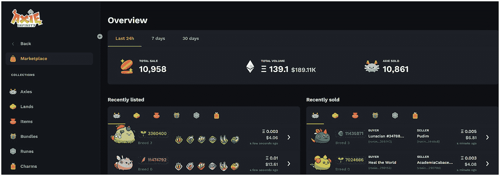

一张截图展示了 Axie Infinity 市场。标记的流程包括概览、市场、Axie 藏品、土地、物品、捆绑包、符文、魅力、最近上架和最近售出，并附有部分插图。

**图 7-8** Axie Infinity 市场

##### 赚取游戏内加密货币

1.  **原生加密货币**

    大多数加密游戏都拥有原生加密货币，其形式为由智能合约创建的游戏代币。例如，在《`Axie Infinity`》中，有两种原生加密货币——平滑爱情药水（`SLP`）和 `Axie Infinity` 碎片（`AXS`）。

    **`SLP`**

    `SLP`是一种用于培育 Axie 的`ERC-20`代币。当玩家在《`Axie Infinity`》的竞技场模式中完成每日任务或与怪物及其他玩家战斗时，可以赚取游戏内货币`SLP`。

    **`AXS`**

    `AXS`是 `Axie Infinity` 生态系统的`ERC-20`治理代币。`AXS`代币旨在奖励参与 `Axie Infinity` 元宇宙的玩家。每个赛季结束后，排名靠前的玩家将获得奖励。`SLP`和`AXS`可以兑换成现实生活中的货币。一个`SLP`价值`0.000277 AXS`，即`$0.0034`，可以在许多加密货币交易所（如 `Uniswap`）买卖。`SLP`作为`边玩边赚`趋势的一部分而广为人知，它让玩家仅通过玩《`Axie Infinity`》就能获得相对稳定的收益。

2.  **现有加密货币**

    一些加密游戏使用现有的加密货币（如比特币、以太坊等）作为对玩家的奖励。《加密猫》（CryptoKitties）就是一个例子，玩家在《加密猫》市场中使用以太币买卖猫咪。

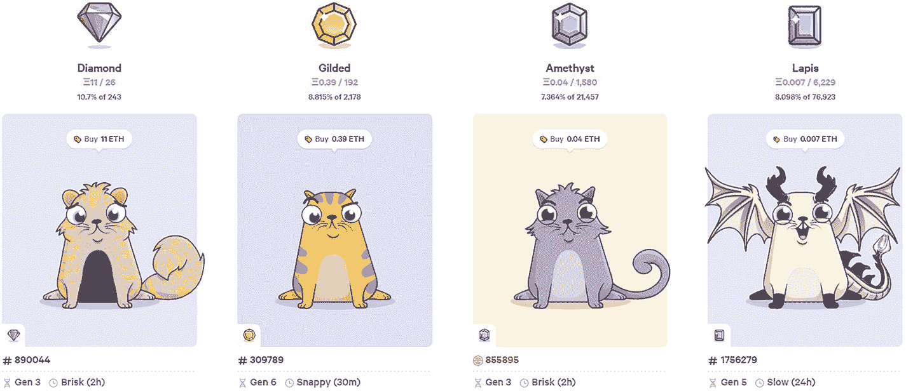

四张加密猫图片展示了市场中的 NFT。标记的加密猫分别为钻石、镀金、紫水晶和青金石。

**图 7-9** 《加密猫》市场

要积累足够数量的现有加密货币（如以太币）通常需要一段时间，但这些收益是真实的。

##### 质押（Staking）

许多“边玩边赚”游戏允许玩家在游戏中锁定 NFT 或加密货币代币以赚取奖励。例如，`Axie Infinity`允许土地所有者质押其土地来赚取`Axie`代币`AXS`作为奖励。玩家可以在单笔交易中质押 30 个土地地块，并根据所质押土地的稀有程度每天获得`AXS`奖励。

图 7-10 展示了游戏行业在商业模式上的演变。

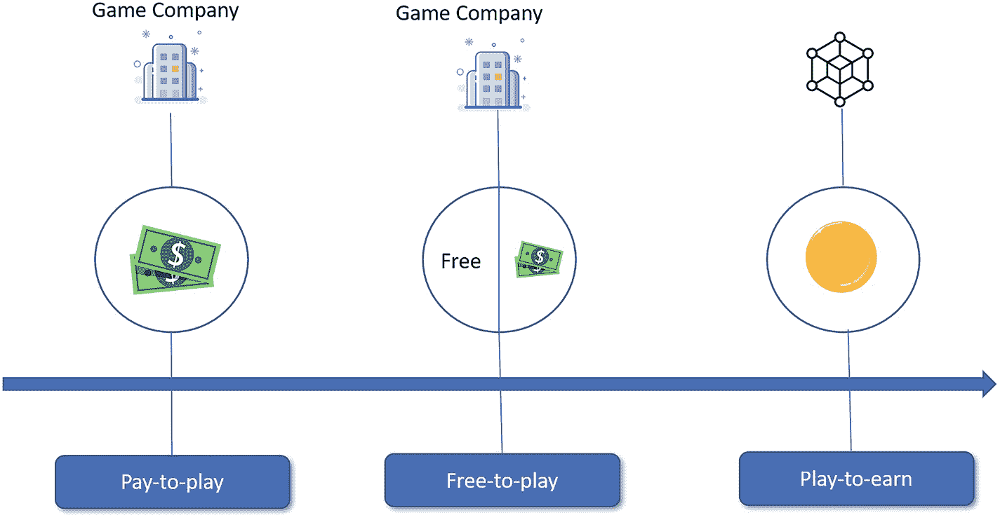

示意图描绘了游戏公司通过付费游玩、免费游玩和边玩边赚模式的演变过程。

**图 7-10** 游戏行业商业模式的演变

### “边玩边赚” NFT 游戏示例

#### The Sandbox

`The Sandbox` 是一个社区驱动的元宇宙平台，创作者可以在其中构建、拥有并将其体素资产作为 NFT 进行货币化。该游戏体验使用以太坊区块链上的 `SAND` 代币。`The Sandbox` 项目最初由 `Pixowl`（后更名为 `TSB Gaming`）于 2012 年在移动平台上开发，在 `iOS` 和 `Android` 上的下载量达 4000 万次。`The Sandbox` 拥有超过 200 万注册用户，由三个产品组成：`VoxEdit`、`Marketplace` 和 `Game Maker`。

##### VoxEdit

`VoxEdit` 是一款基于云的 NFT 创作软件。它允许用户在元宇宙中创建、装配和制作基于 3D 体素的 NFT 产品动画，例如人物、动物、家具和工具等物品。这些 NFT 的数字资产使用 `ERC-1155` 代币标准，能够在单次交易中高效传输同质化与非同质化代币。此外，玩家可以在 `The Sandbox` 的市场上出售这些 NFT，并探索新世界。

##### Game Maker

`Game Maker` 是一个工具箱，允许用户免费设计、测试和构建 3D 游戏，且无需编写代码。使用 `Game Maker`，用户只需发挥想象力即可进行创作。

##### Marketplace

`The Sandbox` 的 NFT 市场允许用户搜索和购买创作者使用 `VoxEdit` 制作的 NFT 资产。创作者可以首先将数字资产上传到 `IPFS`（星际文件系统）网络（一种去中心化存储），然后将相关资产与智能合约关联，并部署到区块链上以证明所有权。完成此步骤后，用于创作的 NFT 资产便可在 `The Sandbox` 市场中找到。

为了在玩家之间建立一个封闭的经济系统，所有玩家将依赖于四种用户特定代币：`SAND`、`ASSET`、`LAND` 和 `GAME`。用户将使用这些代币与平台互动：他们可能是玩家、创作者、策展人或土地所有者。另外两种代币是 `GEMs` 和 `CATALYSTs`，留作在 `VoxEdit` 中创建资产时使用。图 7-11 展示了沙盒游戏中的这六种代币。

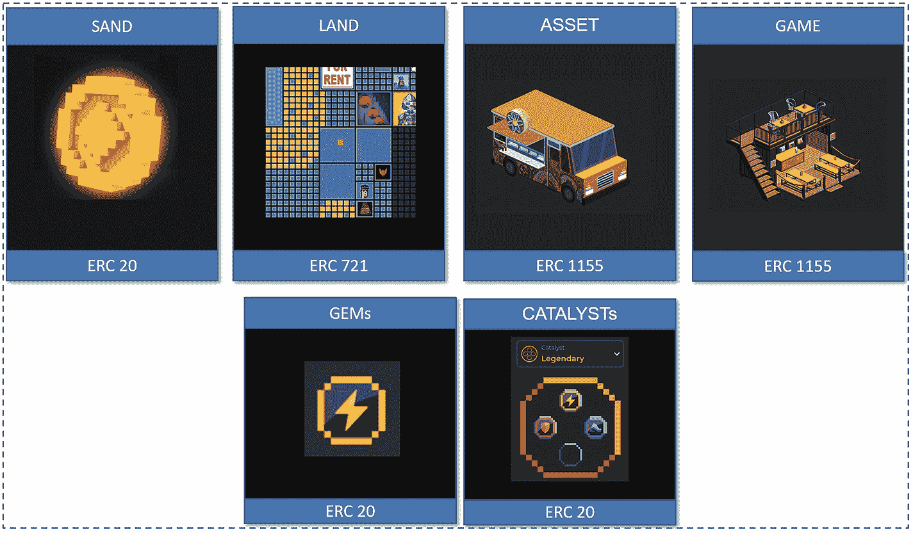

六种代币图像描绘了 NFT 的“边玩游戏边赚钱”。标注的六种代币分别是 `ERC 20` 标准的 `SAND`、`ERC 721` 标准的 `LAND`、`ERC 1155` 标准的 `ASSET`、`ERC 1155` 标准的 `GAME`、`ERC 20` 标准的 `GEMs` 以及 `ERC 20` 标准的 `CATALYST`。

**图 7-11** 沙盒游戏中的六种代币

##### SAND

`SAND` 是一种基于以太坊区块链构建的 `ERC-20` 实用代币，为 `The Sandbox` 的所有交易和交互提供动力。`SAND` 代币是 `The Sandbox` 的原生代币。

-   **访问 Sandbox 平台** – 玩家花费 `SAND` 来玩游戏、购买装备或创建自己的虚拟化身角色。
-   **治理** – `SAND` 是一种治理代币，允许代币持有者使用 `DAO` 结构在平台上对治理决策进行投票。
-   **质押** – `The Sandbox` 将允许土地所有者在其 `LAND` 上质押 `SAND`，质押收益将连同以 `SAND` 形式支付的收益一起返还给用户。

##### LAND

在 `The Sandbox` 元宇宙中，`LAND` 代币是 `ERC-721` 标准，是一种 NFT 代币。`LAND` 代表一个数字土地地块，每个 `LAND` 在 `The Sandbox` 元宇宙中占地 96 x 96 米。总共有 166,464 块不同尺寸的土地。`LAND` 代币持有者对平台上的特定空间拥有所有权，并允许土地所有者出租、购买、出售、质押、托管以及组成区域。拥有 `LAND` 代币，用户可以通过 `DAO` 参与生态系统的治理。

##### ASSET

`ASSET` 代币是 `ERC-1155` 代币，代表游戏内物品，例如用于填充 `LAND` 的化身装备和创作物。这些资产可以在 `The Sandbox` 的市场中交易。一个资产有三种不同的类别：

-   **实体**  
    这些 NFT 指的是包含非玩家角色（NPC）的体验，用来让游戏或世界变得生动，例如农夫、树木、鸡、龙或宝藏猎人。

-   **装备**  
    装备是一种可以附加到玩家物品栏并帮助玩家完成游戏体验的 NFT。例如，一把剑、一把史诗级维京斧、一面盾牌、一顶头盔等等。

-   **方块**  
    除了现有的基础方块（如水、泥土和沙子）之外，玩家可以创建新的方块。这些方块可以带来独特的体验，例如彩色水和可爱的闪亮熔岩。

##### GAME

`GAME` 代币是 `ERC-1155` 代币，它结合了资产和游戏编程以创造交互式体验。`GAME` 代币必须与 `LAND` 代币配对使用。

##### CATALYSTs

`Catalysts` 是 `ERC-20` 代币。`Catalysts` 有四个空槽位，可以用宝石填充，以使玩家更强大。

##### GEMs

`GEMS` 是 `ERC-20` 代币，用于定义玩家资产的属性。根据游戏需求，每颗宝石都有不同的功能，可以应用于资产，并增强整个元宇宙中的 `The Sandbox` 游戏体验。

#### Decentraland

`Decentraland` 是一个在以太坊网络上运行的“边玩边赚”3D 虚拟世界元宇宙游戏。使用原生 `MANA` 加密货币，用户可以创建化身并购买数字资产，例如虚拟土地地块，称为“`LAND`”。用户在购买这些空间后将收到 NFT `LAND` 代币。我们将在下一节中详细讨论。

### 元宇宙中的虚拟房地产

在现实生活中，房子是我们居住的地方。当人们购买房屋时，卖方会签署一份地契，这是一份用于证明我们拥有土地所有权的法律文件。元宇宙是互联网的未来，关乎虚拟现实世界中的沉浸式体验。在元宇宙中，我们发行 NFT 作为数字资产所有权的代表，并在区块链 NFT 中跟踪所有权记录，因为所有权证明在元宇宙内是可验证的。

#### 什么是虚拟土地？

虚拟土地是 NFT 拥有的数字空间或土地地块，类似于物理房地产。虚拟土地平台创建大型土地地图，将其划分为小块，在市场上出售。虚拟土地地块是可编程的智能合约空间，允许人们在虚拟世界中购买、出售、出租、建造和探索。拥有虚拟土地类似于拥有物理房地产，所有者可以保留 NFT，也可以直接在市场上以约定价格将其出售给买家。买家可以直接使用加密货币支付，或通过抵押贷款购买土地。虚拟土地所有者将资产保留在自己的钱包中，然后出售房产，或在该土地上进行设计和建造。热门的 NFT 虚拟土地项目包括 `Decentraland`、`The Sandbox` 和 `Axie Infinity`。

#### Decentraland（案例研究）

`Decentraland` 是一个由以太坊区块链驱动的去中心化虚拟现实元宇宙平台。该平台使用户能够创建、购买和出售虚拟内容及数字房地产。土地地块是基于数字资产的 NFT。一旦你拥有了你的 `LAND`，你就可以随心所欲地处理它。每块土地的尺寸仅为 33 英尺 x 33 英尺，高度不限。这种地块设计允许用户通过合并相邻地块来更有效地组织他们的 `LAND`。

##### Decentraland 中的三种原生代币

在 Decentraland 中，有三种原生代币，包括两种 `ERC-721` NFT 代币和一种 `ERC-20` 代币。

用户进行交互和创作的数字土地地块被称为 `LAND`，这是一种 NFT 代币。每个地块为 1x1 的土地单元。Decentraland 中共有 90,601 块土地。第二种 NFT 代币是 `ESTATE`，它允许用户通过市场将两块或更多相邻的 `LAND` 合并。庄园对于管理更大的 `LAND` 资产非常有用。

另一方面，`MANA` 是一种 `ERC-20` 代币，是 Decentraland 的官方原生加密货币。一块 `LAND` 可以用 1,000 `MANA` 购买。在 Decentraland 中，用户可以使用 `MANA` 进行以下操作：

- 在虚拟世界中购买地块、数字商品和服务
- 通过销毁 `MANA` 来认领 `LAND` 地块
- 代币持有者有权通过 `DAO` 对平台政策进行投票

##### Decentraland 架构

Decentraland 协议由三个层次组成：

###### 共识层

每块 `LAND` 都是一个 NFT 代币，由 `LANDregistry` 智能合约定义。`EstateRegistry` 合约定义了 `ESTATE` 代币。智能合约驱动共识层，并追踪土地地块及其内容的所有权。用户可以使用 `MANA` 代币购买新的 `LAND` 地块。并且 `LANDregistry` 合约在创建新的 `LAND` 时会销毁 `MANA`。

###### 土地内容层

土地内容存储文件内容哈希的引用。根据此引用，应用程序可以从 `BitTorrent` 或 `IPFS` 下载数字土地地块的数字内容。下载的文件包含渲染场景所需的图像、纹理、声音及其他元素的描述。

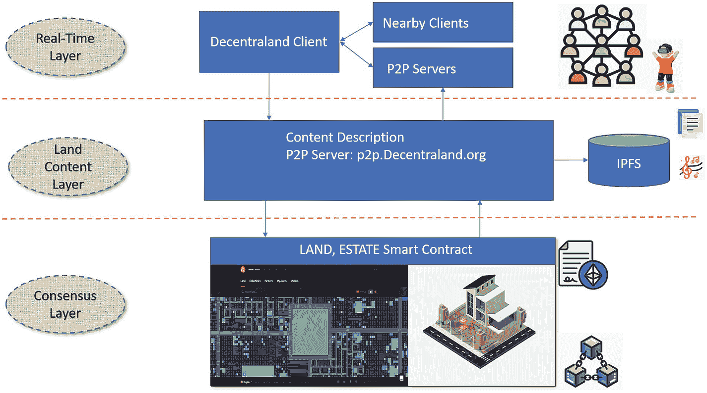

该示意图描绘了 Decentraland 协议的各个层次，按三个层次处理：实时层、土地内容层和共识层。它包括 Decentraland 客户端、附近客户端、P2P 服务器、内容、土地、庄园智能合约以及 IPFS。

图 7-12  
Decentraland 协议层次

###### 实时层

实时层支持点对点连接，即用户之间相互通信的能力。这些连接对于构建社区社交互动是必要的。Decentraland 还提供虚拟形象消息语音聊天。

图 7-12 总结了 Decentraland 协议层次。

### 在元宇宙中购买土地

任何人都可以在官方 Decentraland 市场或像 `OpenSea` 这样的 `NFT` 市场上购买、出售或租赁土地。`Decentraland` 还提供抵押获取土地的选项。然而，在开始购买土地之前，请确保您完成以下步骤：

#### 第一步 – 选择元宇宙平台并登录

在我们的案例中，我们将选择 `Decentraland` 平台（`https://market.decentraland.org/`）。

直接使用 `Metamask` 连接，或在 `Decentraland` 平台注册账户。推荐使用 `Metamask` 进行土地买卖：

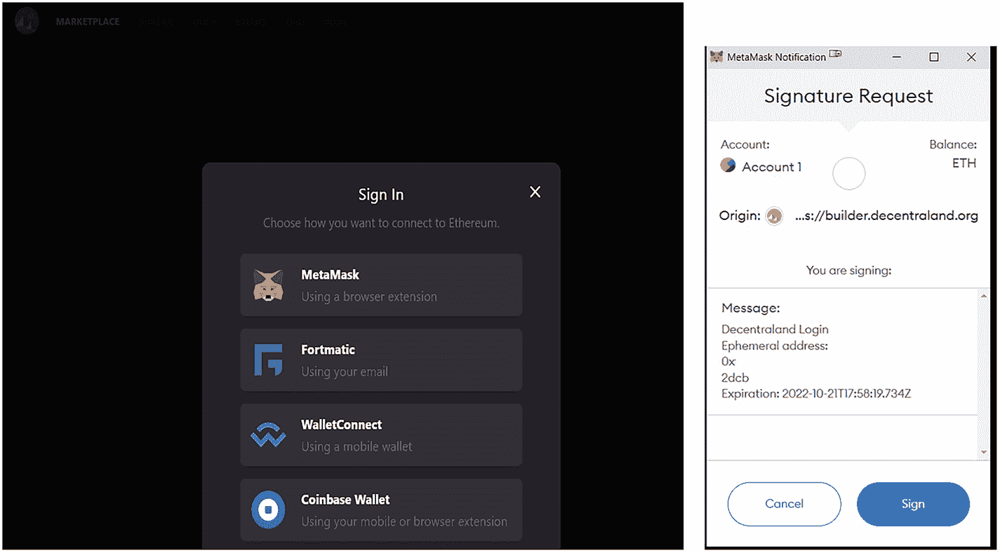

一张元宇宙平台和登录的截图。左侧标注的步骤为 `Metamask`、`Formatic`、`Wallet Connect` 和 `Coinbase Wallet`；右侧为账户 1 的签名请求。

登录后，选择“土地”选项卡，即可进入待售土地地块页面（见下图）：

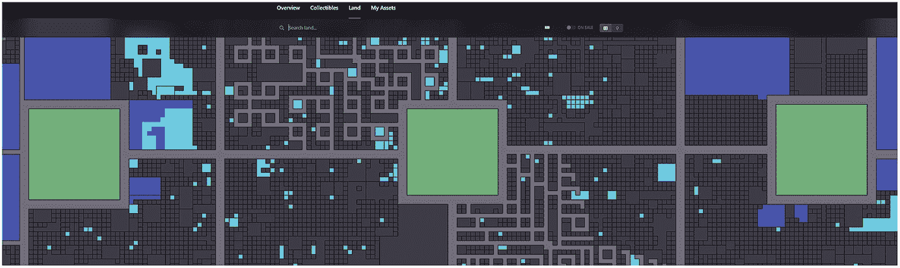

一张带有标题的插图，标题分别为概览、收藏品、土地和我的资产。“土地”一词下方用线条突出显示，以示意迷宫结构。

#### 第二步 – 购买加密货币

大多数元宇宙平台和 `NFT` 市场要求您事先拥有原生加密代币。您可以在 `Coinbase` 和 `Binance` 等加密货币交易所购买这些货币，并将这些代币发送到您的钱包地址，例如 `Metamask` 或 `Coinbase` 钱包。

#### 第三步 – 选择一块 `LAND`

市场允许您以多种选项查看单个地块。选择“在售”选项。您可以查看附近的位置。在元宇宙购买土地之前需要考虑的主要事项有：

- 土地价格。
- 虚拟土地面积的大小。
- 区域：靠近热门景点（中心、商店、画廊、活动空间等）。
- 土地卖家是谁。
- 交易历史。
- 用途潜力（画廊、活动空间、商店等）。

点击虚拟房产以了解更多详情，直到找到您想要购买的土地。土地价格以 `MANA` 标价，并列有所有者的详细信息：

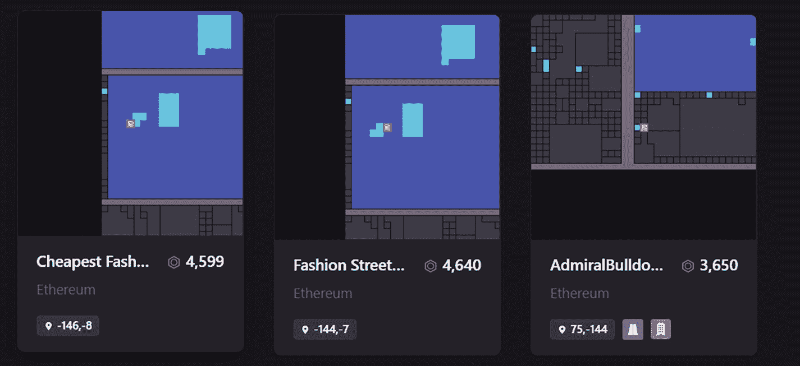

一张插图将地块分为三个过程：最便宜的闪购价为 `4599`，时尚街为 `4640`，`admiralbulldo` 为 `3650`。

#### 第四步 – 购买房产

一旦您找到并选中了想要购买的房产，“购买”和“出价”按钮允许您下订单并完成购买交易。您可以使用以太币或 `MANA` 进行购买。

点击“购买”按钮后，系统会要求您确认购买。交易完成需要几秒到几分钟的时间。现在您就拥有了这块虚拟元宇宙土地。

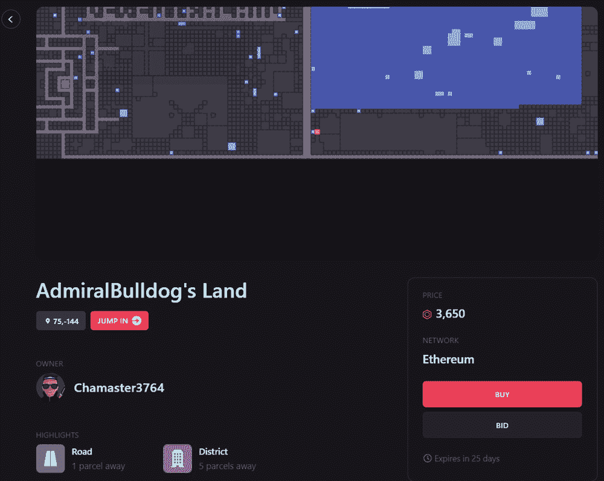

一张插图描绘了房产的购买过程。标注的过程为 `admiral bulldog` 的土地。

您也可以在 `OpenSea` 上购买土地。点击“探索” ➤ “虚拟土地”。您将看到显示的 `Decentraland` 收藏品。

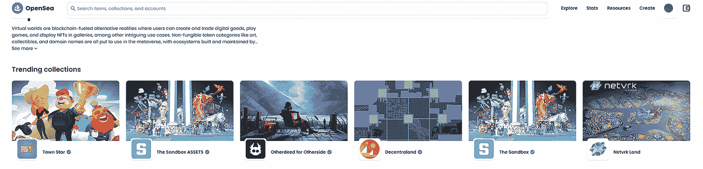

一张插图描绘了在 `OpenSea` 上通过点击“探索”、“虚拟土地”，并看到显示的 6 块虚拟土地的 `Decentraland` 收藏品。

点击 `Decentraland`。它将显示可供出售的土地。选择其中一块您想购买的土地以完成购买：

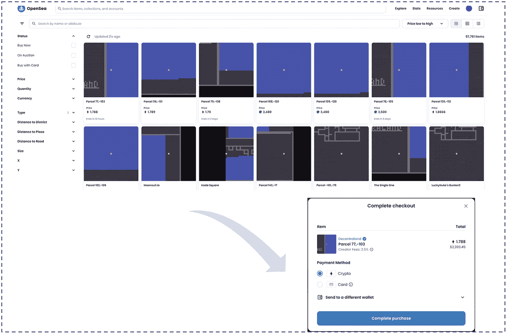

一张截图显示了可供出售的土地；选择显示的 14 块土地中的任意一块进行购买，以在 `OpenSea` 上完成交易。

## 元宇宙的未来

当尼尔·斯蒂芬森在 1992 年的小说《雪崩》中首次描述元宇宙时，元宇宙还只是一个科幻概念。然而，自从 `Facebook` 于 2021 年 10 月更名为 `Meta` 以来，这个为新名称带来灵感的模糊概念便成为了热议话题，如下图所示。

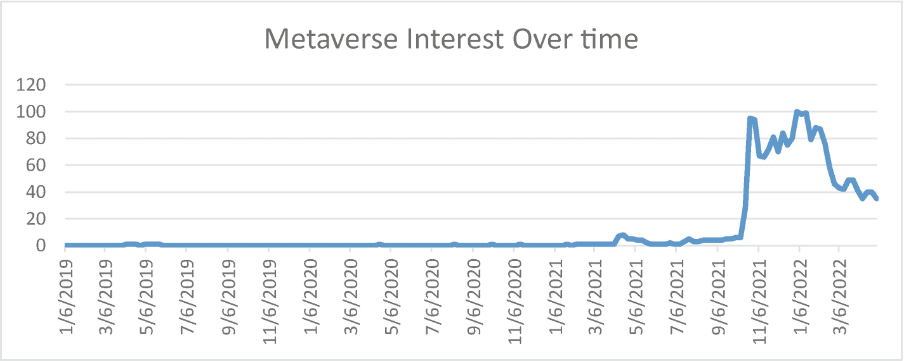

一张波浪图显示了随时间变化的元宇宙关注度。最高波浪值为 `100`，之后逐渐降至 `40` 以下。

虽然元宇宙似乎无处不在，并且即将在不久的将来实现，但它可能需要数年时间才能完全落地。`Meta` 首席执行官马克·扎克伯格估计，元宇宙的关键功能需要五到十年才能成为主流。

未来的元宇宙将在许多方面类似于我们的现实生活，人们可以在虚拟世界中完成他们在现实中所做的一切：工作、学习、购物、娱乐和社交。

元宇宙的演进分为三个阶段。

### 元宇宙第一阶段：兴起（2021–2030）

在这一阶段，元宇宙将继续将各种创新技术与现有系统相结合，以重建其基础，从体验层到基础设施层。由于进入门槛相对较低，创作者经济和发现层可能会看到最活跃的活动。一个由大规模人类社会组成的虚拟世界，以完全数字化的方式呈现物理现实，将会出现。然而，现实与虚拟仍将作为两个平行的空间存在。

### 元宇宙发展阶段二：进阶期（2030–2050 年）

物理世界与数字世界逐渐融合交汇。现实生活中的诸多元素，例如工作、学习、购物、社交、金融、娱乐以及现实世界中的其他服务，都与虚拟世界相连或迁移至其中。虚拟世界的人口和活动持续扩张，元宇宙已成为人类生活的重要组成部分。

### 元宇宙发展阶段三：成熟期（2050 年后）

元宇宙成为一种持久且可自我维持的现实世界实体，并实现了 2018 年电影《头号玩家》中“绿洲”级别的虚拟宇宙图景。日本轻小说《刀剑神域》于 2009 年首创的概念“完全潜入 `VR`”，描述了一种让人完全“沉浸”于虚拟世界并与现实物理世界断开连接的虚拟现实体验；从某种意义上说，这几乎如同瞬间传送。

到那时，虚拟世界与现实世界将难以区分，虚拟世界的人口和使用量将极为庞大。

## 本章小结

在本章中，你首先了解了元宇宙的概念，包括其历史与特征。接着，你探索了各种沉浸式技术，包括 `AR`、`VR`、`MR` 和 `XR`，并学习了这些技术的工作原理。随后，你学习了元宇宙的分层架构，以理解元宇宙格局中的不同产品或服务。此外，我们还讨论了 `NFT` 和加密游戏如何在元宇宙中发挥作用。最后，你进入了一个虚拟区块链世界购买虚拟土地，以体验当前阶段元宇宙中的虚拟房地产。

在本章末尾，我们讨论了元宇宙的未来。

在下一章中，你将探索去中心化金融（`DeFi`），这是 2022 年加密领域最热门的话题之一。我们将概述 `DeFi` 的核心概念与结构，并深入探讨各类 `DeFi` 产品，例如去中心化稳定币、去中心化交易所以及去中心化借贷。你还将看到一份实践操作 `DeFi` 产品的分步指南。本章将是你全面理解 `DeFi` 协议的绝佳机会。