# 8. 去中心化金融（DeFi）：重塑金融服务

全球金融体系由众多机构组成，例如银行、保险公司、证券交易所，以及监管这些机构的各类政府机关。传统金融服务是中心化的。中央机构发行货币，并控制着驱动经济发展的货币供给与分配。中心化金融机构通过中心化系统管理资产并执行交易，以减少欺诈行为。然而，这些流程也增加了系统内部的复杂性，导致了高昂的中介成本和缓慢的交易速度。此外，这些交易对所有参与方并非完全透明。

近年来，加密货币的普及速度迅猛加快，而在去中心化网络中交易数字资产的加密市场无需第三方中介。因此，这些市场的兴起正在重塑全球金融业。

去中心化金融（DeFi）代表了一种重建传统金融服务的创新方式。金融产品围绕公有链或联盟链以及智能合约构建。用户在 DeFi 系统中进行交易时，可以控制自己的资产和个人数据。随着加密行业的成熟，将有更多投资用于构建 DeFi 解决方案。随之而来的是，全球去中心化金融市场自 2020 年以来经历了巨大的增长。预计从 2022 年到 2030 年，该市场将以 43.8%的稳定复合年增长率（CAGR）增长。

DeFi 生态系统包含广泛的产品，涵盖了基础设施、去中心化交易所（DEX）、借贷、稳定币、保险、支付、去中心化自治组织（DAO）以及托管服务。

本章旨在向你介绍 DeFi。我们将概述 DeFi 的核心概念与结构，并深入探讨 DeFi 中的特定产品，例如去中心化稳定币（如 MakerDAO 的 DAI）、去中心化交易所（如 Uniswap）以及去中心化借贷（如 Aave）。最后，通过提供实践操作 DeFi 产品的分步指南，本章将帮助你掌握进行现实世界 DeFi 投资和交易所必需的知识。

本章将帮助你理解以下实用主题：

- 什么是去中心化金融（DeFi）？
- DeFi 的结构
- 去中心化稳定币
- 去中心化交易所（DEX）
- 去中心化借贷
- 去中心化保险


## 什么是去中心化金融 (DeFi)？

去中心化金融（简称 DeFi）利用加密货币和区块链技术，提供从日常支付、借贷到复杂衍生品和保证金交易的全方位金融产品与服务。

传统的中心化金融系统通过其中心化服务控制用户交易。由于涉及第三方参与交易流程以促进资金在各方之间转移并确保合规，这些服务会收取高昂的交易费用。2021 年，银行业在透支收入方面估计赚取了 334 亿美元。

用户必须信任中心化系统来管理他们的资金。金融服务要求客户在与银行及其他金融机构交易时提供个人信息以验证身份。这个过程源于政府法规，要求银行执行 KYC（了解你的客户）和 AML（反洗钱）等复杂的合规程序。金融机构利用 AML 来防止洗钱。

然而，日益增加的银行要求使得保护客户数据的复杂性也随之增加。因此，金融行业必须维护和升级其系统，以确保业务服务正常运行，并保证客户数据在实施新技术时的安全性。

由于金融机构涉及保护客户的资金以及高度敏感的个人身份信息（PII），它们拥有非常高的保护标准，将安全性置于首位。此外，网络犯罪分子通常根据最大影响和利润来选择目标。金融行业完美契合这些条件，一直是网络攻击者进行有动机攻击的青睐目标。

现代软件系统通常非常复杂，涉及众多计算机基础设施、软件和组件，例如开源库、数据库、云生态系统、容器、网络、操作系统等。黑客使用漏洞搜索引擎，如 `Nmap`、`Ransomware`、`Trojans` 和 `Worms`，来寻找易受攻击的计算机系统、软件、服务器等等。要将数据安全性维持在最高水平通常成本高昂且极具挑战性，许多金融机构不得不收紧 IT 支出预算。

全球大约有 44,000 家银行和信用合作社。不幸的是，并非每家公司都能充分保护其客户的数据。如今，银行和金融数据泄露事件频发。因此，银行和金融数据泄露屡见不鲜。

近年来，金融系统面临的网络安全风险有所增加。图 8-1 展示了 2018 年 1 月至 2022 年 6 月的金融数据泄露情况。

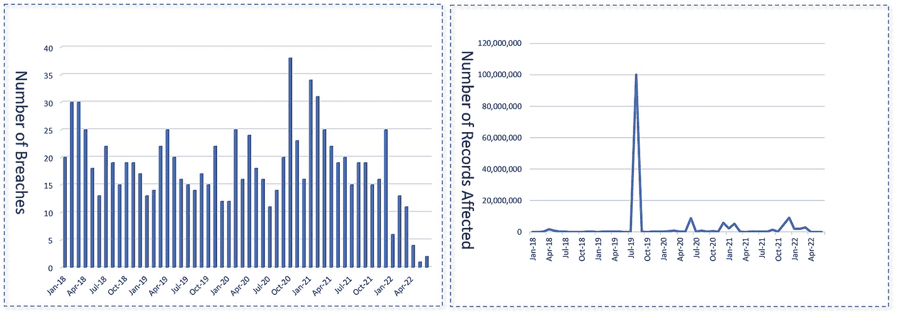

一张柱状图加折线图展示了 2018 年 1 月至 2022 年 4 月期间的数据泄露事件数量和受影响记录数。柱状图在 2020 年 10 月达到最高峰值，为 37%。折线图在 2019 年 7 月至 2019 年 10 月期间达到最高值，为 1000 万。

**图 8-1**  
2018 年 1 月–2022 年 4 月的金融数据泄露

从 2018 年 1 月到 2022 年 6 月，共发生了 982 起金融数据泄露事件，影响了约 1.53 亿条个人记录。数据泄露事件从 2019 年到 2020 年增加了 13%，从 2020 年到 2021 年增加了 11%。

2019 年 3 月，超过 1 亿 Capital One 银行客户的信用卡信息（包括*社会安全号码*、出生日期、信用卡号、信用评分、信用限额和余额）发生数据泄露。因此，该银行不得不支付 1.9 亿美元以和解一项集体诉讼。

在 DeFi 中，金融协议可以在智能合约中定义。这些金融服务运行在去中心化的区块链网络上，任何拥有互联网连接的人都可以访问。这里没有传统的中心化权威机构、中介和信任机制。用户可以在一个安全的数字钱包中完全掌控自己的资产，而不是在银行中管理它们。2022 年 11 月 11 日，作为第二大加密货币交易所的 FTX（“期货交易所”）申请破产。该交易所在 2022 年 11 月初的估值超过 300 亿美元。作为一个中心化交易所，FTX 持有用户的钱包和私钥，并管理用户资金。然而，该交易平台不当地将客户资金借给 Alameda Research，这导致了 FTX 陷入“流动性危机”时出现问题。FTX 的崩盘提醒投资者“不是你的密钥，就不是你的币”，并激发了对去中心化金融平台日益增长的兴趣。

由于公共区块链的透明特性，数据隐私已成为区块链中 DeFi 系统日益关注的问题。区块链上已有许多专注于隐私的解决方案，包括安全多方计算（MPC）、零知识证明、联邦机器学习、链下数据存储等。

DeFi 正在蓬勃发展。DeFi 的总锁定价值（TVL）在过去两年中从 2020 年初的 6.01 亿美元飙升至 2022 年的 2390 亿美元，增长了近 40,000%。截至 2021 年，全球金融服务市场规模价值 23.32 万亿美元，而 DeFi TVL 为 2400 亿美元。DeFi 仅占全球金融服务市场总额的 1%。它在这个领域仍处于非常早期的阶段，创新空间巨大。DeFi TVL 在未来几年内应该会继续大幅增长。

## DeFi 的结构

DeFi 服务基于分层架构构建，该架构包含多个层级以及组件的逻辑分离。每个层级的组件与另一层级的组件进行通信以执行其功能。通信通过预定义的接口进行。

DeFi 生态系统由五个不同的层级组成，包括：聚合层、应用层、协议层、资产层和结算层，如图 8-2 所示。

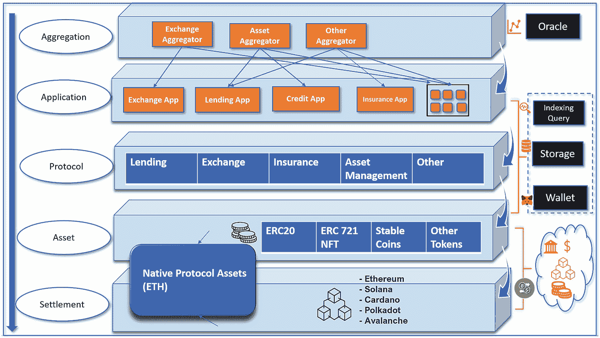

一个包含 5 个层级的去中心化金融结构的示意图。它包括聚合、应用、协议、资产和结算。每个因素都包含了该层级所涉及的功能和流程。

**图 8-2**  
DeFi 的结构——五个层级

### 第一层：结算层

结算层为所有 DeFi 交易提供了基础——公共区块链及其原生加密货币构成了结算层。结算层的一个例子是以太坊及其原生代币以太币（ETH）。

区块链的交易数据永久存储在网络中。因此，任何资产所有权的状态变更都将遵守网络的共识机制、智能合约条件和其他规则，以确保交易执行仅按照既定协议进行。

由于这一层主要由用于去信任执行的区块链和分布式账本技术构成，它充当了结算层的角色。

在撰写本文时，大多数 DeFi 应用都构建在以太坊网络上，该网络承载了超过 25% 的去中心化金融协议。以太坊拥有 358.1 亿美元，占整个 DeFi TVL 623.2 亿美元的 58%。所有与 EVM 相关的 DeFi TVL 价值 508.5 亿美元，约占整个 DeFi TVL 的 82%。图 8-3 展示了各区块链上排名靠前的 DeFi 协议及其 TVL。

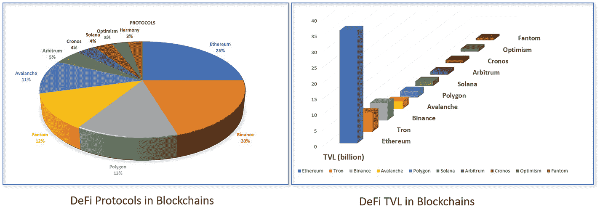

饼状图和 3D 柱状图展示了各区块链 DeFi 协议的百分比以及以十亿美元计价的 TVL。饼状图数据如下：以太坊 25%，币安 20%，Polygon 13%，Fantom 12%，Avalanche 11%，Arbitrum 5%，Cronos 和 Solana 各 4%，Optimism 和 Harmony 各 3%。柱状图中以太坊的值最高，约为 35。

**图 8-3**  
各区块链排名靠前的 DeFi 协议和 TVL


### 第二层：资产层

资产层位于结算层之上。该层包含所有代币，包括像以太币这样的原生协议代币资产，以及在区块链上发行的任何其他代币，如 `ERC-20`、`NFT` 等。在这一层，值得一提的是稳定币。

在第一章 1 中，我们了解到加密货币市场的高波动性给许多金融产品和日常消费带来了风险。稳定币通过提供稳定的价值，为投资者提供了一个避风港，以最大程度地减少价格波动。其价值与另一种波动性较低的资产（通常是美元或英镑等流行货币）挂钩。稳定币充当交换媒介，并广泛用作 DeFi 日常交易的货币。我们将在后面的去中心化稳定币部分进行更多讨论。以下是 DeFi 中一些流行的稳定币：Tether、USD Coin、Binance USD、TrueUSD、DAI 和 Pax Dollar。

### 第三层：协议层

协议层为特定行业提供了一套参与者同意遵循的原则和规则。这些协议以智能合约的形式编写，用于管理 DeFi 交易，并能够在没有中心化机构或第三方干预的情况下，以预定义的方式自动执行。许多 DeFi 协议通常由去中心化自治组织（DAO）管理。

去中心化自治组织（DAO）是一个没有中心化权威的组织——没有首席执行官，没有董事会，没有需要服从或服务的经理，是一种自治和自治理模式。决策自下而上做出，并分布在整个社区代币持有者之间，他们参与并投票。要成为代币持有者，用户必须购买加密货币才能成为成员。DAO 的所有投票都发布在区块链上，使所有操作都可审计。智能合约制定了 DAO 的规则，并将在满足一组条件时自动执行。整个 DAO 流程是完全透明和自治的。

2020 年，DeFi 借贷协议 Aave 推出了自己的治理代币，以实现自治和去中心化治理。DAO 社区投票将决定 Aave 的市场政策和协议政策，这些政策以 Aave 改进提案（AIP）的形式正式确定。此后，其他 DeFi 项目也采用了这种模式，并向 DAO 转型。流行的 DeFi 项目使用 DAO，如 Uniswap、Maker DAO、BitDAO、Aragon、Decred、0X、Dash、Compound 和 Curve DAO。

在此层定义的所有协议都具有高度互操作性，可被任何同时构建的去中心化应用使用，并为 DeFi 生态系统提供流动性。该层的主要协议包括借贷、交易所、保险、资产管理等。我们将在 DeFi 产品部分提供详细的 DeFi 用例。

### 第四层：应用层

应用层运行连接各个协议的用户特定应用程序。这些应用程序提供 DeFi 服务，通常构建去中心化应用以与协议层上一组智能合约的功能进行交互，例如资产管理、贷款和保险应用程序。

### 第五层：聚合层

随着 DeFi 呈指数级增长，DeFi 生态系统中的新平台和协议数量迅速出现。因此，密切关注所有即将推出的 DeFi 产品变得日益具有挑战性。

聚合层利用应用层来聚合各种应用和协议，以提供更广泛的服务和工具，并允许用户通过连接多个协议和应用来高效执行复杂任务。DeFi 聚合平台提供了简单的一站式解决方案，允许用户使用单个聚合仪表盘来执行多种类型的 DeFi 交易。这些聚合平台在活跃的 DeFi 用户中变得非常流行。2020 年中期，大约 20% 的去中心化交易量是通过 DeFi 聚合器完成的。

顶级的 DeFi 聚合器示例之一是 `1inch`。它被设计为价格聚合器，提供工具来提取在多个去中心化交易所（DEX）上交易的各种代币的价格数据。`1inch` 聚合器使用自定义的包装智能合约，以当前汇率包装/解包装代币。交易者可以在不同去中心化交易所之间探索和交易加密货币。聚合器支持在以太坊、币安智能链、Polygon、Optimistic Ethereum、Arbitrum、Avalanche、Gnosis Chain 以及许多其他区块链上的流行去中心化交易所进行加密货币兑换。图 8-4 展示了 `1inch` 聚合器界面。

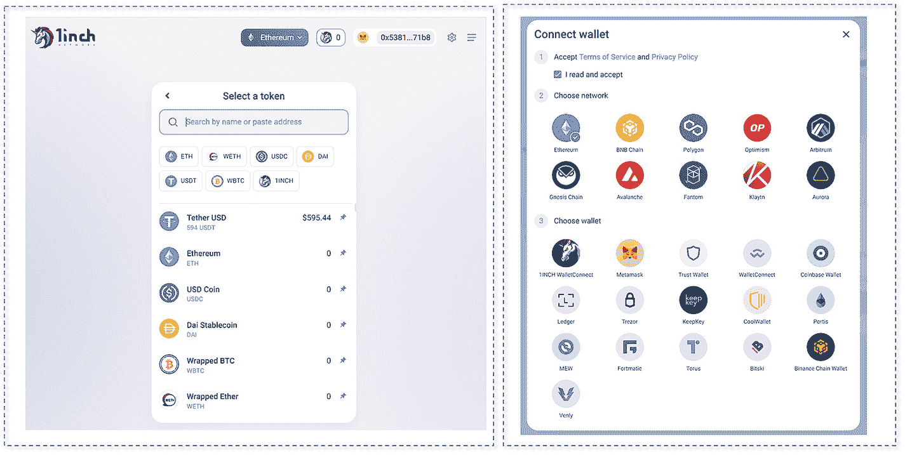

两张 1inch 聚合器界面的截图，展示了选择代币界面，其中包含以太币和美元硬币。连接钱包选项包含条款，并列出了网络和钱包。

图 8-4

1inch 聚合器界面

DeFi 产品旨在通过提供各种去中心化金融服务（例如借贷、支付、保险、交易、信用、风险等多种金融产品）来重塑传统行业。这些产品在无需许可的点对点网络中消除了中心化的第三方公司。此外，DeFi 产品采用模块化设计，使应用程序能够自由地将这些开放的 DeFi 服务集成到它们的产品中。

## 去中心化稳定币

加密行业仍处于起步阶段。与传统全球金融市场相比，数字资产的流动性仍然相对较小。此外，任何流动性低的新兴市场都伴随着波动性。

所有这些都导致了稳定币的兴起。稳定币是一种加密资产，旨在提供一种安全的数字资产以保持价值稳定。它将其价格与其他类型的货币挂钩，例如法定货币（如美元）或商品货币（如黄金或石油）。在过去几年中，稳定币的受欢迎程度显著提高，许多稳定币项目已在加密货币市场推出。

### 稳定币历史

第一种稳定币 `bitUSD` 于 2014 年 7 月发行。`bitUSD` 与美元挂钩，可以在 BitShares 上自由交易。另一种稳定币 Tether（`USDT`）于 2014 年 10 月推出，与 `bitUSD` 一样，Tether 也与美元挂钩。如今，`USDT` 是市值领先的稳定币。

图 8-5 显示了主要稳定币在过去几年推出的时间线：

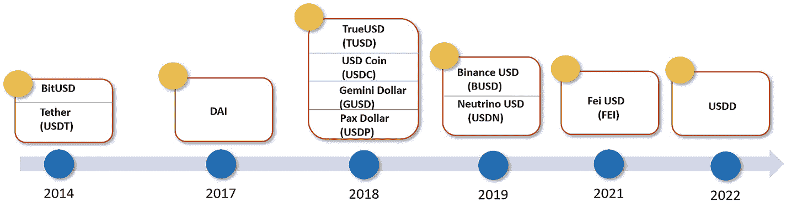

一个主要稳定币推出的时间线图。bitUSD 于 2014 年推出，之后 DAI 于 2017 年推出，TrueUSD 于 2018 年推出，BUSD 于 2019 年推出，FEI 于 2021 年推出，USDD 于 2022 年推出。

图 8-5

稳定币时间线

### 稳定币的类型

稳定币分为几种类型。

#### 商品抵押稳定币

商品支持稳定币是指使用黄金、石油和房地产等实物资产作为抵押的稳定币。最流行的商品抵押稳定币是 Tether Gold（`XAUT`）和 Paxos Gold（`PAXG`）。

#### 法定货币抵押稳定币

法定货币抵押稳定币与法定货币（例如美元、欧元或英镑）的价值挂钩，这些法定货币是由政府发行的真实货币。最常见的是美元。例如，Tether（`USDT`）和 USD Coin（`USDC`）就是法定货币抵押稳定币的例子。

#### 加密货币抵押稳定币

加密货币抵押稳定币是指由现有数字加密货币（如 BTC 或 ETH）支持的稳定币。其中一个例子是 MakerDAO 的稳定币 `DAI`。`DAI` 是一个 `ERC-20` 代币，与美元以 1:1 的比例挂钩，通过包含激励机制的智能合约在链上实现。该稳定币的供应量通过智能合约和 DAO 在链上进行调节。


#### 非抵押型稳定币

`非抵押型稳定币`指的是价格锚定`$1`、且不以任何资产作为抵押的稳定币。它通常通过智能合约中的算法来控制稳定币的供应量，从而实现价格稳定。铸造这类稳定币无需任何抵押物。

`Neutrino USD`和`USDD`是算法加密抵押型稳定币的典型例子。所有操作，包括发行、抵押、质押和奖励发放，都公开透明，并由智能合约和流动性池共同管理。

### 深入解析稳定币——Maker（DAI）

让我们以一款著名的稳定币`Maker (DAI)`为例，来更深入地理解。`MakerDAO`是一个在`以太坊`区块链上运行的去中心化自治组织（DAO）。`MakerDAO`采用双代币模型设计——治理代币和稳定币。`Maker`平台共有三种代币：`Maker 币 (MKR)`、`Sai (SAI)`和`DAI (DAI)`。

`MKR`是一种治理代币，社区成员可凭其在`Maker`平台行使投票权。`MKR`本身不是稳定币。第二种代币是名为`DAI`的稳定币。`DAI`是多抵押`DAI`，可用于支付、抵押、资产交换、与众多协议集成，以及在`DeFi`生态系统中提供各种其他服务。`DAI`目前是由`以太坊 (ETH)`和`基本注意力代币 (BAT)`作为抵押支撑。第三种代币是`Sai`，这是一种单一抵押品类型，曾用于支撑`DAI`。`Sai`的抵押品只有`ETH`。

#### DAI 的工作原理

`DAI`当前的市值为`69.3 亿美元`，供应量为`69 亿 DAI`。`DAI`的总供应量没有上限，其供应量根据`Maker 金库`进行管理。在 2019 年 11 月多抵押`DAI (MCD)`发布之前，它被称为`抵押债务头寸 (CDP)`。

`Maker 金库`是`MakerDAO`的核心智能合约组件，它为`Maker`系统持有抵押品（以太币）后即可创建`DAI`。一旦借出的`DAI`被归还，`Maker 金库`便会释放锁定的抵押品并销毁这些`DAI`。

`DAI`进行超额抵押以应对市场波动，需要锁定价值`150%`的抵押品来应对众所周知的剧烈波动。例如，如果你存入价值`100 美元`的`以太币`，你将获得价值`50 美元`的`DAI`。假设`1 个以太币`价值`1439.685 DAI`。那么`100 DAI`是由`0.104 个以太币 (ETH)`作为抵押支撑的。

让我们看一个类比示例来理解`Maker 金库`如何管理`DAI`与美元的锚定。

一个想要借入`DAI`的投资者会创建一个`Maker 金库`，并将`ETH`发送到该`Maker 金库`中。`Maker 金库`会生成相应数量的`DAI`，并将这些`ETH`抵押品以`合仓以太币 (PETH)`的形式锁定。生成的`DAI`数量取决于用户在`Maker 金库`中存入的以太币数量。生成的`DAI`会存入用户的钱包，并随着时间推移产生利息，这称为`DAI 储蓄利率 (DSR)`。用户可以随时自由取回其存入的抵押品。他们需要向`Maker 金库`归还`DAI`并支付一部分稳定费（`MKR`）。之后，这些`DAI`会被销毁，`Maker 金库`随即关闭。

图 8-6 展示了整个`Maker 金库`的流程。

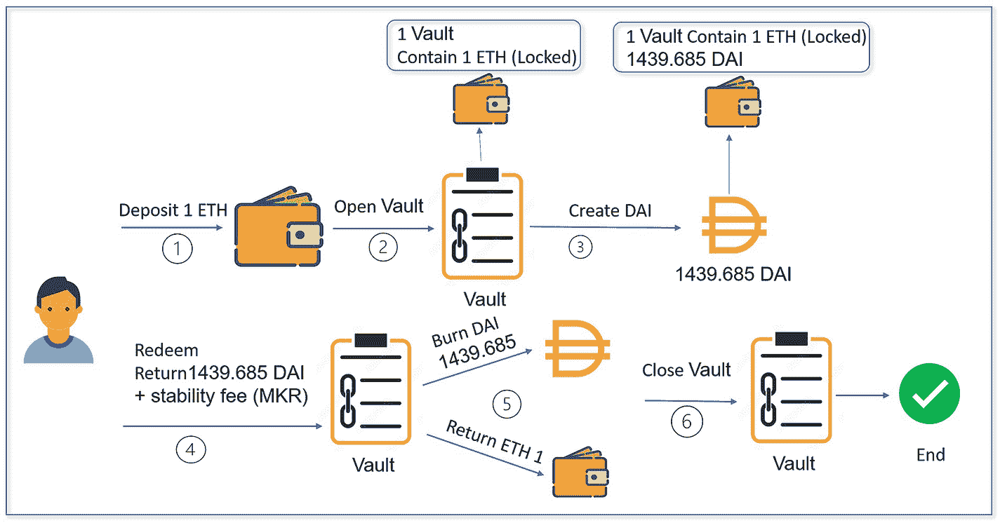

**图 8-6**
*Maker 金库流程管理：DAI 的创建与销毁*

当抵押品价值下跌或`DAI`价格上涨时，可能导致`Maker 金库`中持有的以太币抵押品价值低于`DAI`最初的支撑价值。然而，由于`DAI`是通过超额抵押创建的，`Maker`协议会确保`Maker 金库`持有足够的`以太币`来偿还`DAI`，并在账户风险过高时清算`Maker 金库`。例如，如果市场上的以太币价格跌破某个阈值，`Maker 金库`会锁定抵押品，直到用户偿还足够的`DAI`，或者将以太币拍卖给出价最高者。

#### Maker（MKR）币的供应

`MakerDAO`最初发行时供应量为`100 万个 MKR`代币。截至 2022 年 9 月，`Maker`代币的流通供应量约为`977,631`个，市值超过`7.37 亿美元`。`MKR`的总供应量是一个动态值，取决于市场价格和`Maker 协议`系统的整体健康状况。`Maker`系统通过发行和销毁`MKR`，运用复杂的机制来管理`DAI`的稳定性。

`DAI`的价值由存储在`Maker`金库中的`ETH`等抵押品保障。当`ETH`市场价格下跌时，`ETH`的价值变得不足以支撑相应数量`DAI`的`$1`锚定价格。在这种情况下，`Maker 协议`会自动触发金库的清算。

`Maker 协议`会创建新的`MKR`代币来增加总供应量。然后，这些新的`MKR`代币将被出售，以弥补剩余的价值损失。

另一方面，如果抵押品价格上涨，为了保持`DAI`的价值稳定，`Maker 协议`会回购并销毁`MKR`代币。通过这种方式，它将减少`MKR`的总供应量，从而导致多余的`DAI`被拍卖。

总体流程如图 8-7 所示。

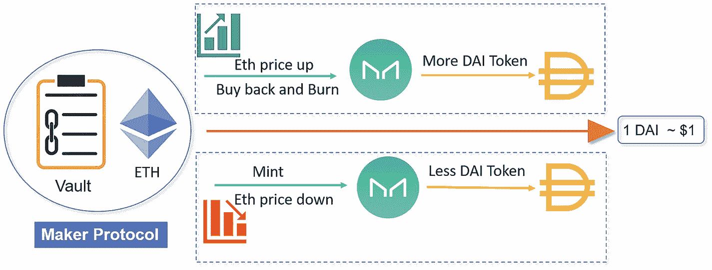

**图 8-7**
*MKR 代币的流通*

#### MakerDAO 的治理

正如我们所了解的，`MKR`是`DAI`的治理代币。`MKR`代币持有者对`MakerDAO`的任何决策都拥有投票权，包括：

*   添加新的抵押资产金库。
*   调整现有金库的风险参数。
*   修改`DAI 储蓄利率`。
*   触发紧急关停。
*   选择稳定费。
*   选择债务上限。
*   设置预言机喂价集合。
*   升级系统。

`Maker 协议`支持链上治理和链下治理的规则。

包括非`MKR`持有者在内的所有人都可以提出新的治理规则。首先，可以在公共`MakerDAO`论坛（[`https://forum.makerdao.com`](https://forum.makerdao.com)）上对提案进行非正式讨论和链下投票。然后，更正式地由`MKR`持有者在链上进行投票。

链上投票有两种形式：`治理民意调查`和`执行投票`。可以通过`Maker 基金会`的投票门户网站（[`https://vote.makerdao.com/`](https://vote.makerdao.com/)）进行链上投票。

#### 治理民意调查

`治理民意调查`，也称为`提案调查`，用于衡量`MKR`持有者对某个提案的看法。它不会执行链上变更。`治理民意调查`必须在提案进入执行投票阶段之前进行。以下是过去提出的一些例子：

*   社区绿灯民意调查——Cabot
*   抵押品上线基于项目的资金请求 (PFR)
*   关于修改 DAI 基金会核心单位预算的批准投票
*   哦不，这不应该在这里
*   PPG——公开市场委员会提案

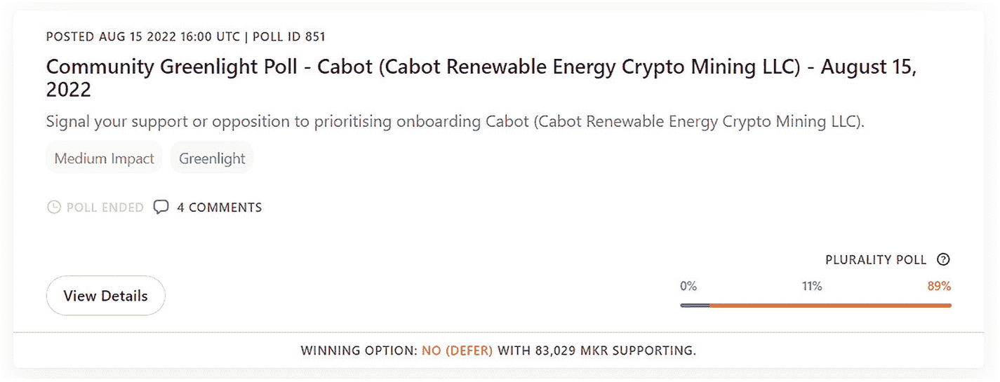


### 执行投票

执行投票对 Maker 协议进行技术性更改，并在区块链上更改协议或整个 DAO 的状态。以下是过去执行投票的一些示例：

- 引入现实世界资产金库
- 参数更改
- 核心单元预算分配
- `MKR` 归属权转移
- 就重要的社区目标和指标达成共识
- 抵押品引入

投票权由投票者拥有并提交的 `MKR` 代币数量来衡量。

例如，如果 100 位持有 100 个 `MKR` 的投票者投票给提案 A，而 50 位持有 1,000 个 `MKR` 的投票者投票给提案 B，那么提案 B 将获胜，因为它获得了更多 `MKR` 代币的支持。

### 对提案进行投票

接下来，我们将演示如何在 Maker 基金会的投票门户中对提案进行投票。

#### 步骤 1：获取你的 MKR 代币

你可以找一个交易所来购买、出售和交易 `MKR`，例如 Coinbase、Binance、Kraken、`crypto.com` 等。

#### 步骤 2：使用钱包连接到以太坊主网

点击 Maker 基金会投票门户中的 `connect wallet` 按钮，并通过选择一个钱包连接到以太坊：

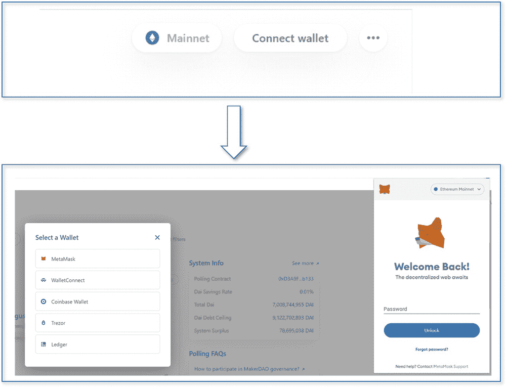

一张使用钱包连接到以太坊主网的屏幕截图显示了选择钱包的选项以及一个欢迎回来的界面。

#### 步骤 3：选择一项进行中的投票

在投票门户中寻找一项进行中的投票，并选择投票选项：

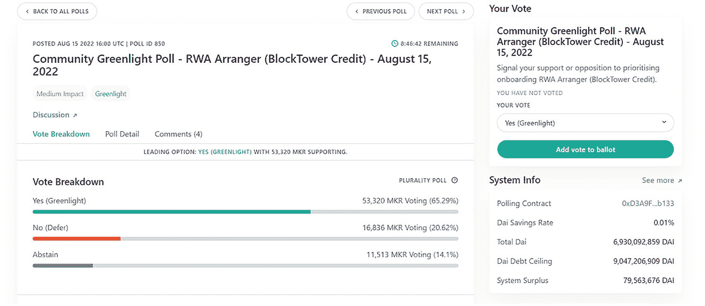

一张进行中投票界面的屏幕截图显示了某一特定的治理投票、你的投票区域、投票百分比明细以及系统信息。

#### 步骤 4：审核并提交你的投票

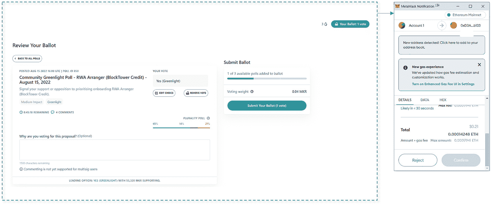

一张审核并提交投票界面的屏幕截图显示了该特定治理投票，其中包含你的投票和评论框、提交选项，并且还显示了包含以太坊主网详情的 MetaMask 通知。

#### 步骤 5：投票完成

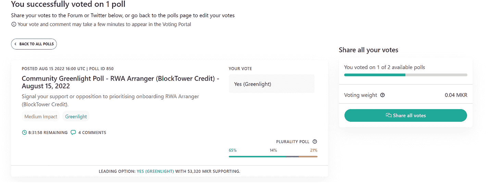

一张投票完成界面的屏幕截图显示文本内容为：你已成功对 1 项投票进行投票，并附有该投票的详细信息，以及分享你所有投票的选项。

## 去中心化交易所 (DEXs)

中心化交易所 (CEXs) 的工作方式类似于银行。买卖双方都信任这些交易平台来交易他们的资产。用户可以通过支付一定的交易费用，在交易所的中心化钱包中买入、卖出和交易数字资产，如比特币、以太币或其他加密货币，而交易所将通过内部系统控制这些资金以及加密货币交易的执行。然后代表用户在区块链上签署交易。

流动性是指你能在不影响其市场价格的情况下将资产兑换成现金的速度。由于中心化交易所受到高度监管，它们吸引了许多活跃用户。这些用户创造了更多的订单，带来了更高的交易量和更快的兑换速度，这意味着更高的流动性。

要创建一个中心化交易所账户，用户必须提供由政府颁发的有效身份证件、银行详细信息和其他个人信息。注册过程是法规要求的 KYC（了解你的客户）和 AML（反洗钱）实践的一部分。此外，它有助于交易所确定客户的风险等级，并防止洗钱和恐怖主义融资等犯罪活动。一旦中心化交易所验证并批准了身份，用户就可以通过电汇、ACH 转账或存入比特币或以太币等加密货币，将资金存入交易所账户。然后，用户就可以开始交易了。

Coinbase、Kraken、`Crypto.com` 和 Binance 是知名的中心化交易所例子。

尽管中心化交易所 (CEXs) 目前处理了大部分的加密货币交易活动，但去中心化交易所 (DEXs) 正越来越受欢迎。DEXs 与中心化加密货币交易所截然相反，后者管理交易所的代币所有权并持有用户的私钥。去中心化交易所 (DEXs) 是点对点交易平台，允许用户保持对其资金的控制权，并在没有中介控制交易过程的情况下购买或出售基于区块链的代币和加密货币。相反，用户控制着钱包的私钥。DEXs 使用智能合约，这些合约定义了设定的条件来执行交易，并以较低的交易费用将每笔交易记录在区块链上。由于 DEXs 不涉及任何中心化机构，这意味着不需要 KYC/AML。任何人都可以开设账户参与 DeFi 生态系统进行交易。交易是完全匿名的。

表 8-1 比较了中心化交易所和去中心化交易所的区别：

**表 8-1** 中心化交易所与去中心化交易所比较

|                | CEXs                      | DEXs                       |
|----------------|---------------------------|----------------------------|
| 控制权         | 交易所控制资金            | 用户控制资金               |
| 费用           | 需要。交易费用较高        | 零费用或极低费用           |
| 流动性         | 高流动性                  | 低流动性                   |
| 监管           | 需要 KYC/AML              | 不需要 KYC/AML             |
| 用户身份       | 非匿名                    | 匿名                       |
| 使用便捷性     | 易于使用（即使对初学者）  | 不易用，需要专业知识       |
| 安全性         | 可能遭受黑客攻击和服务器宕机 | 无黑客攻击和服务器宕机问题 |

### 去中心化交易所的类型

DEXs 是去中心化金融 (DeFi) 的基础，它允许在自动化智能合约上进行数字资产交易。主要有三种类型的去中心化交易所：自动做市商、订单簿 DEXs 和 DEX 聚合器，如图 8-8 所示。

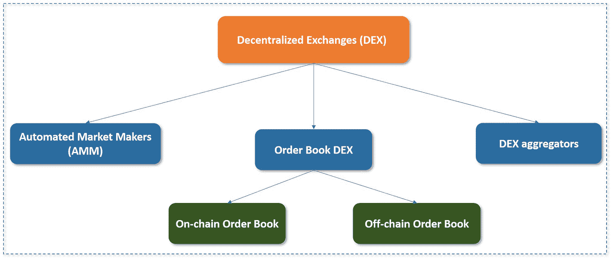

一张组织结构图描绘了三种类型的去中心化交易所。这些类型是自动做市商、进一步细分为链上订单簿和链下订单簿的订单簿 DEXs，以及 DEX 聚合器。

**图 8-8** 去中心化交易所的类型

### 自动做市商 (AMMs)

在传统的交易平台上，做市商通常是一家经纪公司、大型银行或机构，顾名思义，它们会“创造市场”。做市商通过用自己的账户买卖证券，为市场中的交易对创造流动性。买方和卖方对资产出价不同，做市商总是对特定资产报出双边市场。他们通过为投资者提供买卖解决方案，从买卖价差（资产的卖出价高于买入价）中赚取差价。

交易者 Alice 想以 19,600 美元的价格购买 1 个 BTC。交易所需要找到一位交易者 Bob，他愿意以 Alice 偏好的交易范围（例如 19,700 美元）卖出 1 个 BTC。中心化交易所将充当 Alice 和 Bob 之间的中间人。假设 Bob 接受报价，交易所将向 Bob 出价 19,620 美元。然后，交易所将以 19,660 美元的价格向 Alice 卖出 1 个 BTC。交易所将获得约 40 美元的利润。这个过程如图 8-9 所示。

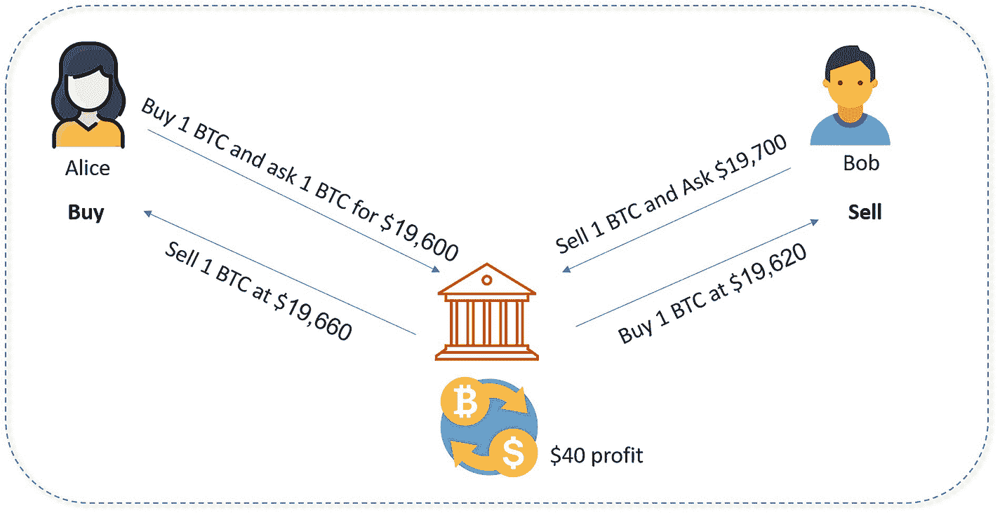

一张关于 Alice 和 Bob 之间中心化交易所活动的示意图。Bob 想以 19,700 美元卖出 1 个 BTC，但 Alice 想以 19,600 美元买入。Alice 想以 19,660 美元卖出 1 个 BTC，而 Bob 想以 19,620 美元买入。这些交易的利润是 40 美元。

**图 8-9** 做市商活动

在自动做市商 (AMM)（有时称为主动做市商）的情况下，做市商被使用智能合约的自主协议所取代。AMM 中的智能合约始终在两个（或多个）资产之间提供报价，并确定数字资产的价格和提供流动性。


### AMM 基本概念

与中心化交易所相比，去中心化交易所的买家和卖家数量仍然较少。因此，要找到足够多的买家和卖家以匹配价格进行资产交易将会很困难。AMM 通过创建流动性池来解决这个问题。AMM 为流动性提供者提供了一种称为“流动性挖矿”的实践，通过向流动性池中添加适当比例的资产来赚取额外收益。流动性提供者将自动获得奖励代币，即基于以太坊的 ERC-20 代币，称为流动性提供者代币。这些 LP 代币代表了 LP 作为池提供者的所有权。当 LP 撤回存入的资金时，LP 代币将返还给 DeFi 系统。每当流动性池中发生交易时，该池都会收取交易费用。LP 代币持有者将按比例获得流动性池增长的奖励，LP 可以定期领取这些奖励。例如，如果你向一个总市值为 1000 美元的 AMM DEX 池（例如 `Uniswap`）贡献了价值 100 美元的代币，你将获得该池 10% 的 LP 代币。

流动性池中的资产资金被锁定在智能合约中。通过 AMM，交易者可以利用流动性池在平台上无缝交易其资产，而无需中心化做市商。流动性提供者将获得其投资所产生的一部分费用和激励作为奖励。

交易的另一方没有特定的卖家或买家。相反，自动化算法决定了 AMM 智能合约中流动性池内代币的价格。AMM 中的智能合约算法将是自动化和优化的，能够调整价格以响应市场需求。

#### 现有 AMM 模型有哪些？

AMM 使用数学公式，根据流动性池中的供应量以算法方式调整价格，以维持流动性池中资产的平衡。流行的 AMM 协议（如 `Uniswap`、`Bancor` 和 `Curve`）使用了多种恒定函数做市商。CFMM 包括恒定乘积做市商、恒定总和做市商和恒定均值做市商。

#### 恒定乘积做市商（CPMM）

CPMM 由首个基于 AMM 的去中心化交易所 `Uniswap`、`Bancor` 以及市场上最流行的 AMM 推广开来。CPMM 基于函数 `x*y=k`，其中 `x` 是流动性池中一种代币的数量，`y` 是另一种代币的数量。两种代币的价格范围取决于每种代币的可用流动性。当代币 X 的供应量增加时，代币 Y 的供应量必须减少以维持恒定乘积 K，反之亦然。

例如（`Uniswap V2`），一个流动性池中有 50% 的 DAI 和 50% 的以太坊。假设一个以太坊为 2000 美元，一个 DAI 为 1 美元。起初，该流动性池有 9 个以太坊和 18,000 个 DAI。在这种情况下，一个以太坊和 2,000 个 DAI 配对的总价值为 4000 美元，计算方式为 `2000 + 1 * 2000 = 4,000`。

一位流动性提供者投资了池资产的 10%——一个以太坊和 2,000 个 DAI 进入该池。存入后，该池有 20,000 个 DAI 和 10 个以太坊，每种代币各占 50%。CPMM 常数 `x*y=k` 为 `20,000 * 10 = 200,000`。

现在，一位流动性购买者想购买一个以太坊。根据以下公式，以太坊的价格为 2222 个 DAI：

`(20,000 + x) * (10 - 1) = 200,000 → x = 2,222`

购买者需要支付 2222 个 DAI 来获得一个以太坊。最终，该池将有 9 个以太坊和 22,222 个 DAI。

该过程如图 8-10 所示。

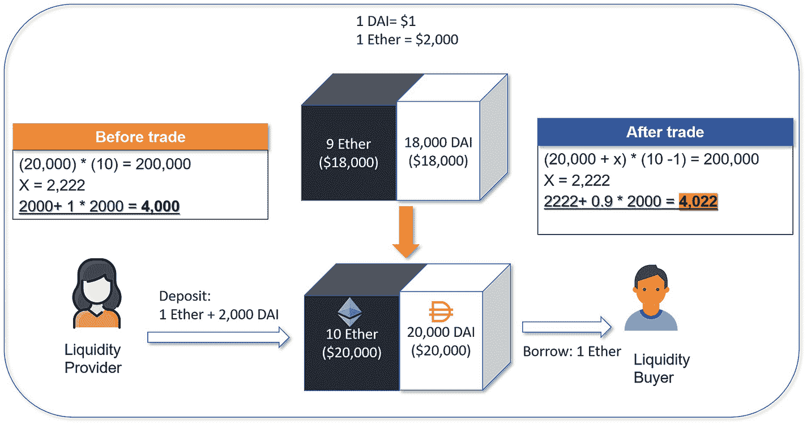

一个流程图展示了 AMM 恒定乘积做市商的示例。流动性提供者向池中存入 1 个以太坊和 2,000 个 DAI，流动性购买者购买了 1 个以太坊。交易前后的计算结果显示在顶部。

**图 8-10**

AMM CPMM 示例

使用 CPMM 的去中心化交易所示例包括 `Uniswap V1` 和 `V2`（`Uniswap V3` 使用不同的函数）、`Bancor (V1)`、`Sushi Swap`、`Pancake swap` 及其他衍生品。

#### 恒定总和做市商（CSMM）

恒定乘积的第二种变体是恒定总和做市商，它通过简单地将恒定乘积中的乘法替换为加法（`x + y = k`）来保持 X 和 Y 资产的总和不变。只要总和保持不变，变量可以多次变化。

这种设计使得价格预测更容易，但当其中一个代币流动性池被耗尽时，剩余的流动性就只剩一种资产，交易者将无法获得更多流动性。因此，CSMM 无法提供无限流动性，并且不盈利。因此，AMM 很少使用 CSMM。

#### 恒定均值做市商（CMMM）

恒定均值做市商由 Balancer 协议首次引入，允许投资者处理超过两种代币，并维持 50/50 以外的平均权重，满足以下等式：

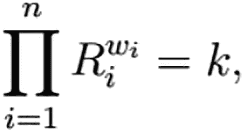

`大写字母 Pi，下限 i 等于 1 到 n，R 下标 i 的 w 下标 i 次幂，等于 K。`

其中 `R[i]` 是每种资产的储备量，`W` 是每种资产的权重，`k` 是一个常数。

以三种锁定资产为例，CMMM 对流动性池使用的公式如下：

`(x * y * z) ^ (1/3) = c`

其中 `x`、`y` 和 `z` 是选定的代币，`c` 是它们的恒定乘积。

#### 混合恒定函数

如果底层交易对的价格几乎稳定（例如，两个以美元计价的稳定币交易对 `DAI–USDC` 进入 `Uniswap` 流动性池），恒定乘积函数可能不是最佳解决方案，因为滑点大且回报微乎其微。因此，Curve Finance 使用了 Stableswap 不变量公式，它是恒定乘积和恒定总和公式的混合体，其函数如下所示：

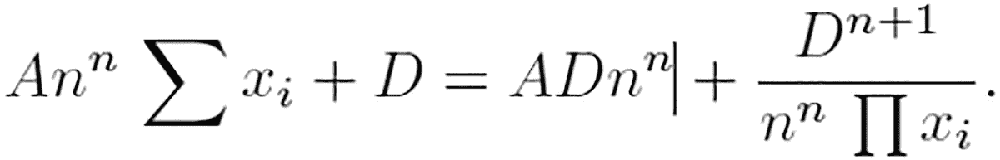

`A 乘以 n 的 n 次方，求和 x 下标 i 加上 D，等于 A D 乘以 n 的 n 次方，加上 D 的 n+1 次方除以 n 的 n 次方乘以联乘 x 下标 pi。`

其中 `x` 是每种代币的储备量，`n` 是稳定币的数量，`D` 是代表储备中整个代币价值的不变量，`A` 是放大系数，它是一个可调常数，与资产的波动性成正比，去中心化自治组织可以调整该值。

在 Curve stableswap-paper 中，对 Stableswap 不变量与 `Uniswap`（恒定乘积）和恒定价格不变量进行了比较，如图 8-11 所示。

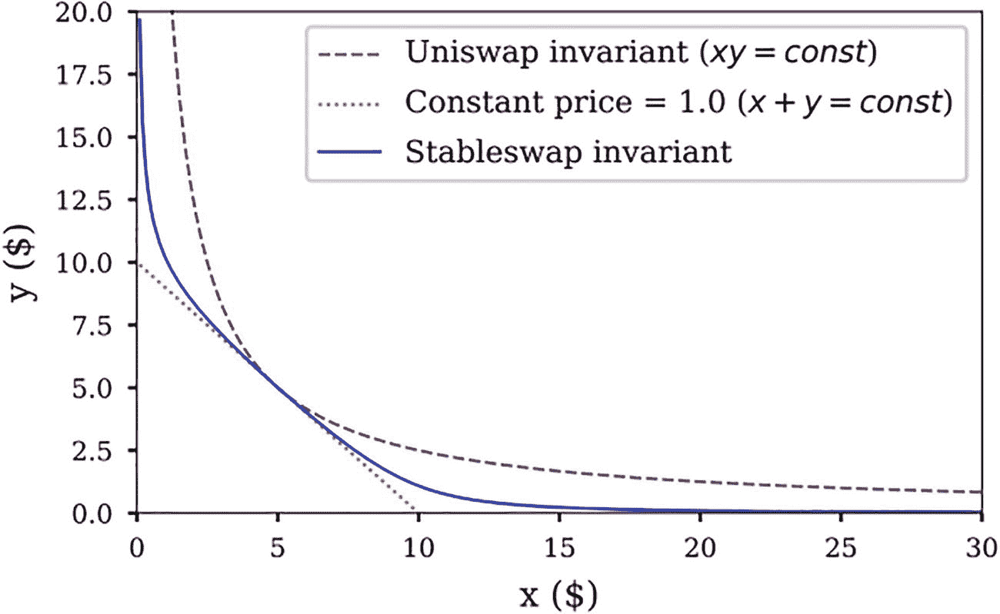

一个图表比较了以美元计价的 stableswap 不变量与 uniswap 和恒定价格不变量。Uniswap 曲线经过点 (20, 2)、(5, 5) 和 (1, 30)。Stableswap 曲线经过点 (19, 0)、(5, 5) 和 (0, 30)。恒定线经过点 (10, 0)、(5, 5) 和 (0, 10)。所有数据均为近似值。

**图 8-11**

Stableswap 不变量与恒定乘积和恒定总和的比较（来自 Curve Stableswap-paper）

当投资组合平衡时，Stableswap 不变量表现为恒定总和，并为 DeFi 用户提供了一种更好的稳定币兑换工具。

#### AMM 的局限性

如前所述，与中心化交易所相比，去中心化交易所的流动性通常较低。因此，去中心化交易所必须吸引新用户贡献其资产以产生更多流动性。没有流动性提供者，交易所就无法提供交易服务。由于流动性较低，AMM 通常存在两个主要问题：滑点和无常损失。


#### 滑点

简单来说，滑点是指交易的预期价格与执行价格之间的差异。沿用之前的 CPMM 示例（Uniswap V2），恒定乘积`x*y=k`为`20,000 * 10 = 200,000`。假设一位流动性买家想购买三个以太币，每个以太币的价格为`8,571` DAI：

```
(20,000 + x) * (10 - 3) = 200,000 → x = 8,571
```

在这个例子中，1 个 ETH 的实际价格为`2,000` DAI，但在 AMM 中，用户需要为每个 ETH 支付`8,571` DAI。最终，流动性池将包含`7`个以太币和`28,571` DAI。这就是滑点。

如果 3 个 ETH 占 ETH 总储备量的 30%，那么滑点就是 42.9%：

```
(28,571 - 20,000 / 20,000) → 42.9%
```

在这种情况下，没有人愿意多支付 42.9%的 DAI，而且实际上，DAI 与美元保持 1:1 的价值。

#### 无常损失（IL）

当用户 Alice 作为流动性提供者时，她会将资产质押在流动性池（例如 Uniswap V2）中。当 Alice 想要从池中提取质押的代币时，如果这些加密资产的市场价格发生变化，就可能发生无常损失。流动性池会根据公式`x*y=k`自动调整代币价值。因此，提取时的美元价值可能低于其存入时的美元价值。如果 Alice 继续将资产留在池中，就不会产生实际损失。这就是它被称为"无常损失"的原因。根据市场走势，这种损失可能会减少、完全消失，甚至可能获利。让我们来看一个例子：

1.  当 ETH 价格为`$2,000`时，Alice 在 Uniswap V2 流动性池中质押了`10`个 ETH 和`20,000`个 DAI。加上新增流动性后的恒定乘积为`200,000`（`10 ETH * 20,000 DAI`），她质押代币的总美元价值为：

    ```
    10 ETH * $2,000 + 20,000 DAI * $1 = $40,000
    ```

2.  现在假设 ETH 市场价格变为`1 ETH = $2,500`。原始代币价值将变为：

    ```
    10 ETH * $2,500 + 20,000 DAI * $1 = $45,000
    ```

3.  Alice 想要计算她提取资金时的无常损失。假设流动性池开始调整和重新平衡代币价值。在这种情况下，如果池子希望保持 50%的 ETH 和 50%的 DAI，那么 DAI 和 ETH 将各自价值`$22,500`。初始重新平衡价值为：

    ```
    ($20,000 + $25,000) / 2 = $22,500
    ```

4.  在这种情况下，ETH 的数量将为`22,500 / 2,500 = 9` ETH。应用`x*y = 9 ETH * 22,500 DAI = 202,500`。这个数字与原始常数`200,000`不同。因此，重新平衡将继续进行。

然后可以使用以下公式计算每种资产的新分布：

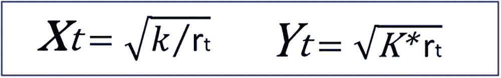

`X_t`等于`k`除以`r_t`的平方根。`Y_t`等于`K * r_t`的平方根。

这里`r`是池中两种代币资产之间的价格，`t`是计算`r`的时间，`k`是 CPMM 常数（`x*y`）。

让我们将这些公式应用于我们的示例，看看它是如何工作的。在 ETH 价格变化之前，`r`为`2,000`，`k`为`200,000`。

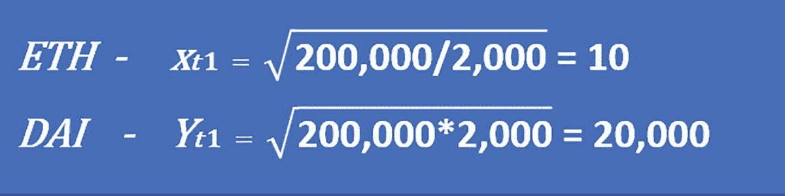

`ETH X_t1`等于`200,000`除以`2,000`的平方根，等于`10`。`DAI Y_t1`等于`200,000 * 2,000`的平方根，等于`20,000`。

我们得到了池中代币对的原始状态——`10`个 ETH 和`20,000`个 DAI。几天后，当 ETH 价格变为`$2,500`时，`r`为`2,500`。让我们重新应用相同的公式进行计算：

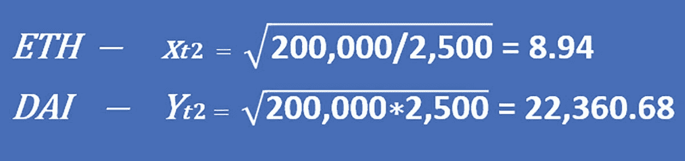

`ETH X_t2`等于`200,000`除以`2,500`的平方根，等于`8.94`。`DAI Y_t2`等于`200,000`乘以`2,500`的平方根，等于`22,360.68`。

公式得出，池中将包含约`8.94`个 ETH 和约`22,360.68`个 DAI。因此，我们可以验证它是否与常数`200,000`匹配：

```
8.94 * 22,360.68 = 199,904 ≈ 200,000
```

新的一对代币价值是正确的。如果 Alice 继续在池中持有代币，总 DAI 价值将为`$45,000`：

```
10 * 2,500 + 20,000 = $45,000
```

投资回报率将为 12.5%：

```
45,000 - 40,000 / 40,000 = 12.5%
```

我们可以简单赚取`5,000`个 DAI（`45,000 – 40,000`）。

使用这些数据，我们可以计算如果 Alice 提取代币所产生的无常损失：

```
45,000 - (8.94 * 2,500 + 20,000) = $289.32
289.32 / 45,000 = 0.64%
```

Alice 的无常损失为 0.64%和`289.32`个 DAI。

图 8-12 显示了无常损失的估算图。

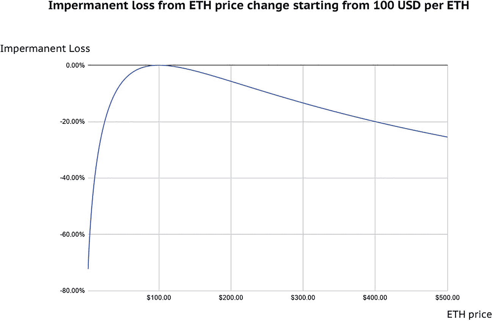

一张以太币价格与美元的无常损失百分比图。y 轴显示-80.00 到 0.00，x 轴显示 100 到 500。曲线穿过点（-73，0）、（0，100）、（-20，400）、（-25，500）。所有数据均为近似值。

**图 8-12** 无常损失估算（来源：Bancor）

以下是根据上述图表总结的与持有相比的损失情况：

*   1.25 倍价格变化 = 损失 0.6%
*   1.50 倍价格变化 = 损失 2.0%
*   1.75 倍价格变化 = 损失 3.8%
*   2 倍价格变化 = 损失 5.7%
*   3 倍价格变化 = 损失 13.4%
*   4 倍价格变化 = 损失 20.0%
*   5 倍价格变化 = 损失 25.5%

从我们的示例中，当价格从`$2,000`变为`$2,500`时，损失为 0.64%。这是 1.25 倍的变化，与上述图表估算相符。

有几种减少影响的解决方案，包括执行较小的交易、提高价格滑点容忍度以及增加流动性。

### 订单簿去中心化交易所

订单簿根据特定金融资产的当前列表价格水平，列出该资产的买入和卖出订单。资产的市场价格订单寻求的是最低的卖价或最高的买价。价格会不断更新，使交易者能够实时查看资产的未成交订单。一个订单簿通常由三个要素组成：

**买入订单或买单**——显示交易者下达的所有买入订单，包括购买数量和要价。

**卖出订单或卖单**——显示交易者下达的所有卖出订单，包括卖出数量和出价。

**订单历史**——显示交易者过去下达的所有买入和卖出订单。

图 8-13 展示了 Coinbase 中心化交易所和 dYdX 去中心化交易所的订单簿。

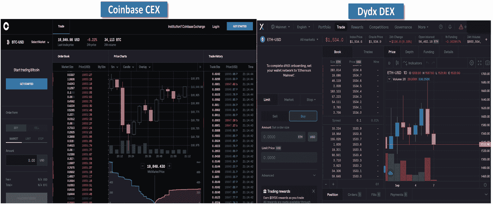

一组两个屏幕显示了 Coinbase CEX 和 dYdX DEX 的订单簿。除了更新的价格水平外，它还有三个组成部分：买入订单（也称为买单）、卖出订单（或卖单）以及订单历史。

**图 8-13** Coinbase CEX 和 dYdX DEX 订单簿

目前，去中心化交易所有两种类型的订单簿——链上和链下。


#### 链上订单簿

链上订单簿直接托管在底层区块链上，所有操作（包括订单提交、更新和取消）均在链上完成。区块链记录所有订单交易，从根本上消除了对中心化机构的依赖。但另一方面，每一笔订单都需提交至区块链，交易会被广播到所有区块链验证者/矿工节点进行验证。这导致订单簿交易速度慢且成本高昂。当价格剧烈波动时，交易者可能需要更新其链上订单。由于处理速度缓慢，矿工有可能在验证并确认这些交易前，先检查订单，然后操控并执行自己的订单。

以下是一些采用链上订单簿的去中心化交易所示例：`ViteX`、`Demex`、`Bitshares` 以及 `Stellar` 去中心化交易所。典型的链上订单簿流程如图 8-14 所示。

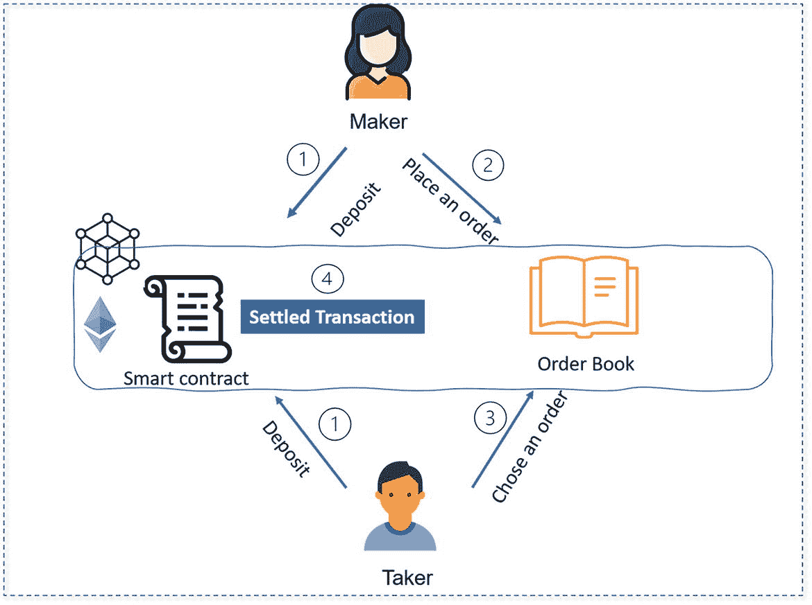

典型的做市商与吃单者之间的链上订单簿流程示意图。做市商和吃单者将资金存入智能合约，做市商在订单簿中下订单，吃单者选择一个订单，最终订单在智能合约中完成结算。

**图 8-14** *链上订单簿*

做市商是提供买卖订单的一方，而吃单者是立即买入或成交该订单的一方。

链上流程可描述为以下步骤：

1.  做市商和吃单者将资金存入智能合约。
2.  做市商在订单簿中放置订单。
3.  吃单者随后选择一个订单。
4.  订单在智能合约中完成结算。

#### 链下订单簿

链下订单簿是托管并运行在区块链之外的订单簿应用程序。订单数据也存储在中心化实体中。一旦双边订单匹配成功，链下订单平台会向区块链智能合约发送一笔交易以完成结算。链下订单簿的优势在于订单管理速度更快，费用也更低。然而，链下与链上之间可能存在信息差，无法完全保证做市商的订单仍然有效，这可能会被利用来执行不利的订单。

链下订单簿的示例包括 `dYdX`、`0x Protocol`、`Loopring`、`AirSwap`、`EtherDelta`、`IDEX` 和 `Hydro`。

典型的链下订单簿流程如图 8-15 所示。

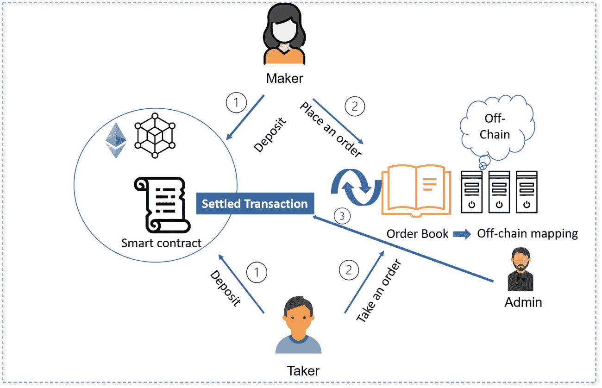

做市商与吃单者之间的链下订单簿流程示意图。做市商和吃单者将资金存入智能合约，做市商在链下订单簿中下订单。然后吃单者选择一个订单，链下服务执行订单匹配，最后订单在智能合约中完成结算。

**图 8-15** *链下订单簿*

链下流程可描述为以下步骤：

1.  做市商和吃单者将资金存入智能合约。
2.  做市商在链下订单簿中放置订单。
3.  吃单者随后接收订单。
4.  链下服务运行订单匹配。
5.  管理员将订单发送至链上智能合约并进行交易结算。

### 去中心化交易所聚合器

DEX 聚合器使用多种不同的协议和方法来解决与流动性相关的问题。这些平台开发了工具，用于聚合来自多个中心化和去中心化加密货币交易所的流动性。当交易者因单一平台流动性不足而无法以预期价格进行加密货币交易时，就会发生滑点。通过聚合来自不同 DEX 的流动性，DEX 聚合器能够有效减少大额订单的滑点。加密货币交易者可以一个单一仪表盘访问各种交易池，并为特定的代币兑换选择具有优化费用的理想供应商。

以下是一些顶级的 DEX 聚合器：`1Inch`、`ParaSwap`、`Open Ocean`、`Orion Protocol` 和 `Matcha`。

到目前为止，我们已经学习了很多理论知识。在下一节中，我们将深入探讨流行的 DEX `Uniswap`，并学习如何创建流动性池、进行质押和兑换代币。

### 深入剖析 AMM DEX——Uniswap

`Uniswap` 是最受欢迎的 DEX 和 AMM。该平台于 2018 年 11 月推出。`v2` 版本于 2020 年 5 月推出，当前版本是于 2021 年 5 月推出的 `v3`。

`Uniswap` 平台的用户可以无缝兑换任意两种不同的 `ERC-20` 代币，而不会产生太多滑点。此外，该协议运行在一系列智能合约之上，使得平台无需许可且去信任化。`Uniswap` 协议的原生代币是 `UNI`，它同时也作为治理代币，赋予代币持有者对协议变更的投票权。

目前，`UNI` 可在以下四个流动性挖矿池中使用：

- `ETH/USDT`
- `ETH/USDC`
- `ETH/DAI`
- `ETH/WBTC`

截至 2022 年 9 月，`Uniswap` 上有超过 50,000 个交易代币对，每个池都有对应的 LP 代币。每日交易量为 `11 亿美元`，总锁仓价值（TVL）为 `121.3 亿美元`。`Uniswap` 用户可以通过以下几种方式参与去中心化交易所：

- **创建新池** – `Uniswap` 用户可以使用智能合约创建用于兑换新代币对的池子。
- **通过现有市场兑换资产** – `Uniswap` 中的代币兑换允许交易者直接将一种 `ERC-20` 代币兑换为另一种 `ERC-20` 代币。
- **提供流动性并赚取奖励** – 通过在 `Uniswap` 平台上质押资金，流动性提供者将获得 `UNI` 作为奖励。
- **参与 Uniswap 治理** – `UNI` 代币持有者可以治理并投票决定 `Uniswap` 平台的变更。

#### 在 Uniswap DEX 上列出你自己的代币

利用我们学到的 AMM 知识，让我们将理论转化为实践，创建一个 `ERC-20` 代币，并将其在 `Uniswap` DEX 上列出。

#### 前置条件

我们需要满足以下几个前置条件：

1.  创建一个 `ERC-20` 代币。
2.  将其部署到以太坊网络。我们将使用 `Goerli` 测试网络。
3.  将部署好的 ERC 代币添加到你的 `MetaMask` 钱包中。


### 创建 ERC-20 代币

在第 5 章，我们已经简要讨论了 ERC-20 代币。创建 ERC-20 代币有多种方式。如果你是一名经验丰富的智能合约开发者，可以自行编写自己的 ERC-20 代币。为简化流程，我们将使用一套流行的开源安全智能合约框架 OpenZeppelin 来创建 ERC-20 代币。这非常简单，仅需几行代码：

**第 1 步 –** 在浏览器中打开 Remix IDE（[`https://remix.ethereum.org`](https://remix.ethereum.org)）。

**第 2 步 –** 创建一个名为 `DeFiTeenToken` 的智能合约。

**第 3 步 –** 我们将从 OpenZeppelin 导入 ERC-20 代币合约。来自 OpenZeppelin 的 ERC-20 代币链接如下：

[`https://github.com/OpenZeppelin/openzeppelincontracts/blob/master/contracts/token/ERC20/ERC20.sol`](https://github.com/OpenZeppelin/openzeppelincontracts/blob/master/contracts/token/ERC20/ERC20.sol)

**第 4 步 –** 在合约中，我们定义创建代币时 `DeFiTeenToken` 的初始供应量。合约名称为 `DeFiTeenToken`，符号为 `DFTT`。`msg.sender` 是当前创建此合约的人。在我们的案例中，它将是一个选定的钱包账户地址，用于部署 `DeFiTeenToken` 合约。

以下是我们的 `DeFiTeenToken` 智能合约的样子。

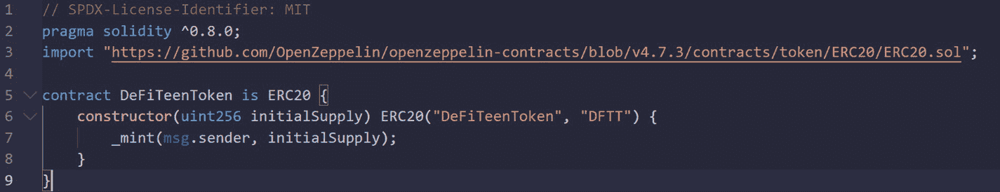

去中心化金融代币智能合约的截图。它包含 9 行代码，包括导入、`DeFiTeenToken` 合约和构造函数。

你还可以从本书的 GitHub 仓库获取此合约——第 8 章：

[`https://github.com/Apress/Blockchain-for-Teens.git`](https://github.com/Apress/Blockchain-for-Teens.git)

**第 5 步 –** 编译 `DeFiTeenToken.sol` 智能合约。

**第 6 步 –** 使用 Remix VM 部署合约。我们输入初始供应量为 `100,000,000`。

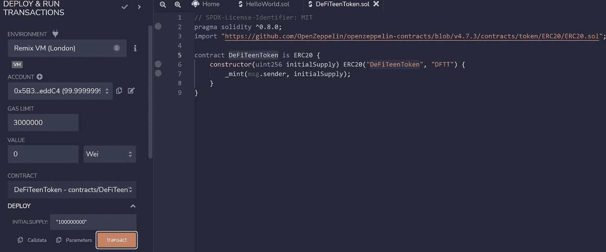

去中心化金融代币的截图，显示了部署和运行交易。左边包含账户、合约和部署选项，右边是代码屏幕。

**第 7 步 –** 在 Remix 的“部署和运行交易”模块下进行快速测试。

通过点击 `name`、`symbol` 和 `totalSupply`，你应该能看到相关值显示出来：

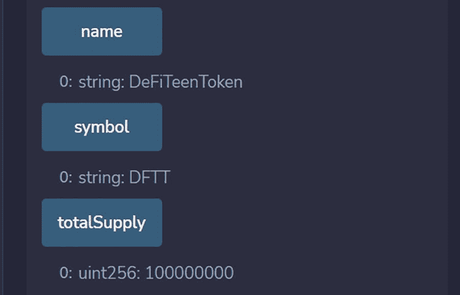

截图显示了三个选项，名称（name）为 decentralized finance teen token，符号（symbol）为 `DFTT`，总供应量（total supply）为 `100000000`。

**第 8 步 –** 测试 `transfer` 函数。从账户下拉列表中复制第二个账户。在 `transfer` 函数的输入字段中输入此账户地址，并给予 `1000` 个 `DFTT` 代币的转账数量。交易完成后，通过调用 `balanceOf` 函数并输入第二个账户地址来检查第二个账户的代币。你应该看到第二个账户余额有 `1000` 个 `DFTT` 代币。以下屏幕展示了测试 `transfer` 函数的过程：

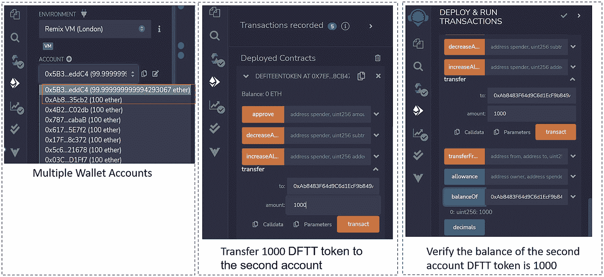

一组三张截图显示多个钱包账户的屏幕、向第二个账户转账 `1000` 个 `DFTT` 代币，以及验证第二个账户 `DFTT` 代币余额为 `1000`。

**第 9 步 –** 现在让我们将 `DeFiTeenToken` 合约部署到 Goerli 测试网络。这次，我们输入 `1000000000000000000000`（22 位数字），因为代币单位是 18。现在可以部署合约了。MetaMask 将弹出确认交易窗口。点击确认按钮。

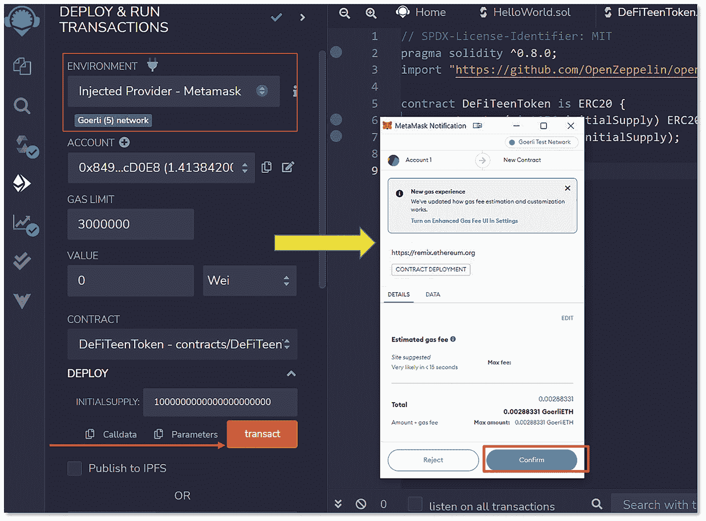

去中心化金融青少年代币的截图，显示了部署和运行交易屏幕。它包含账户、合约和部署屏幕，左侧还有 MetaMask 通知，右侧是代码。

> **注意**
> 要使用 Goerli 获取测试 ETH 代币，你可以访问以下地址请求或挖掘一些代币：
> (1) [`https://goerlifaucet.com/`](https://goerlifaucet.com/)；(2) [`https://goerli-faucet.pk910.de/`](https://goerli-faucet.pk910.de/)；(3) [`https://goerlifaucet.com/`](https://goerlifaucet.com/)

**第 10 步 –** 合约部署后，你可以通过 MetaMask 的链接在 Etherscan 上查看已部署的合约：活动 ➤ 合约部署 ➤ 在区块浏览器上查看。你也可以在 Remix IDE 中验证代币名称、符号和总供应量。你应该看到类似如下的结果：

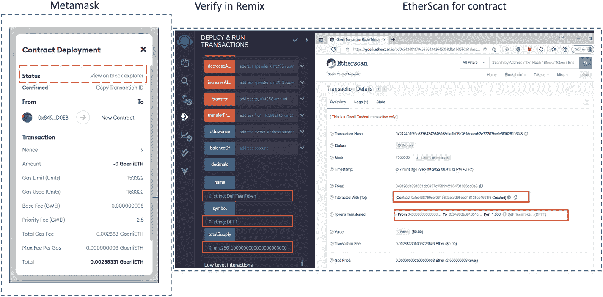

一组三个屏幕显示。1. MetaMask 页面突出显示合约部署状态。2. 在 Remix 页面验证突出显示交易名称、符号和总供应量。3. 合约的 Etherscan 页面。

我们部署的 `DeFiTeenToken` 地址是 `0xbc438759cef061b82abafd95be018128cc4693f5`，该合约的 Etherscan URL 是：

[`https://goerli.etherscan.io/tx/0x242401f79c53764342645058dfa1b05b261deacab2e77267bcde5f0626116f48`](https://goerli.etherscan.io/tx/0x242401f79c53764342645058dfa1b05b261deacab2e77267bcde5f0626116f48)

由于合约部署在公共测试网络上，任何人都可以访问它。

**第 11 步 –** 将 `DFTT` 代币导入你的 MetaMask 钱包。在 MetaMask 的客户端资产选项卡中，选择导入代币。它会要求你输入代币地址。你可以从 Etherscan 获取合约地址。输入合约地址后，点击“自定义代币”按钮导入 `DFTT` 代币。

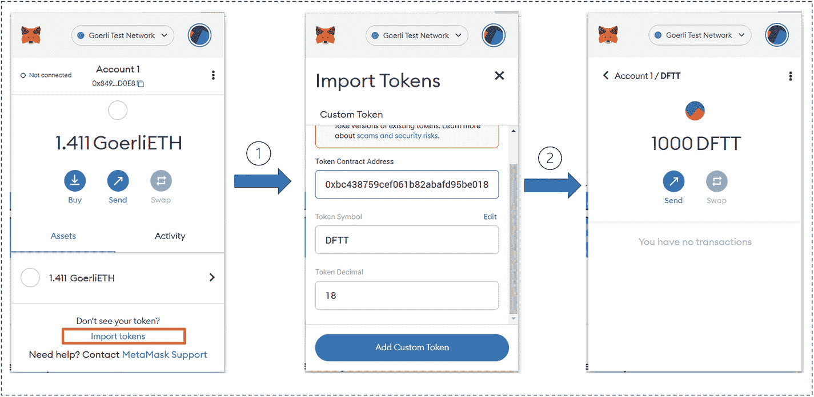

导入 `DFTT` 代币的截图，显示了 MetaMask 中的客户端资产选项卡、代币地址详细信息以及 `DFTT` 代币的部署。

成功部署我们的 `DFTT` 代币后，现在该在 Uniswap DEX 中创建一个新的流动性池了。


### 在 Uniswap 中创建新的流动性池

**步骤 1 –** 访问 Uniswap 网站：[`https://app.uniswap.org/#/swap?chain=goerli`](https://app.uniswap.org/%2523/swap%253Fchain%253Dgoerli)。 将出现以下屏幕，点击 `connect wallet` 按钮。 它会将你连接到 Goerli 测试网络。

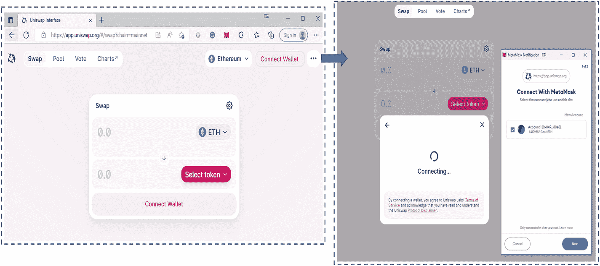

一组两个屏幕显示。 1. Uniswap 网站页面上的 `connect wallet` 按钮被高亮。 2. Goerli 测试网络页面显示 `cancel` 按钮，以及 `next` 到 `cancel` 或 `connect with Metamask` 屏幕。

**步骤 2 –** 连接成功后，Uniswap 将弹出一个屏幕，为你提供一个地址，并显示你在 Uniswap 平台上的所有代币交易。

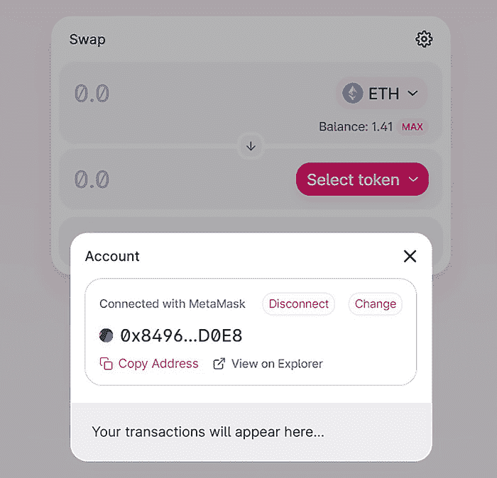

屏幕显示 Uniswap 平台，包含一个地址和所有代币交易详情列表，以及 `connect`、`disconnect`、`change` 和 `copy address` 选项。

**步骤 3 –** 选择“创建池子 (Create a pool)”。

**步骤 4 –** 按下“选择代币 (Select a Token)”选项。

**步骤 5 –** 在“搜索名称或地址 (Search Name or Address)”字段中输入你的代币地址，然后从下拉菜单中选择你的代币。

**步骤 6 –** 点击“导入 (import)”按钮。

**步骤 7 –** 将出现一个导入代币弹出窗口。忽略警告。点击“导入 (Import)”按钮。

你将看到类似的过程（从步骤 3 到步骤 7），如下所示：

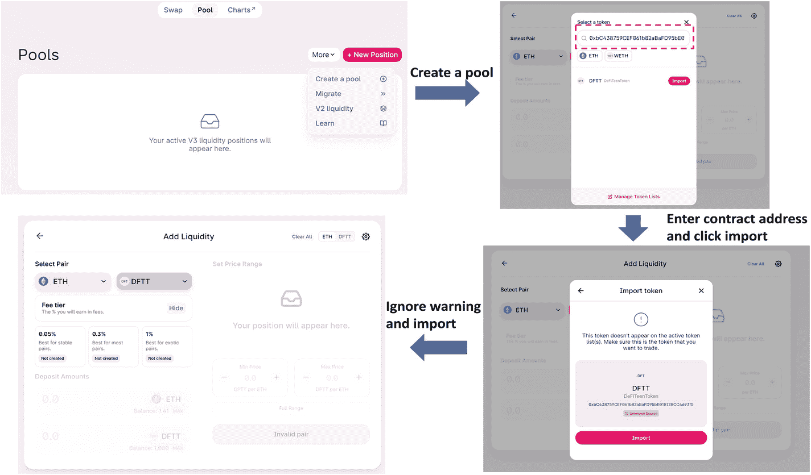

4 个屏幕显示了创建池子的步骤。 1. 在池子平台上列出了 Create、move 和 V 2 流动性选项。 2. 创建池子页面高亮显示了 `select a token` 选项。 3. 第三个屏幕标题为 `add liquidity`，其中有一个 `import token` 的弹出窗口，包含一些详细信息。 4. 在选择 `import token` 后的添加流动性页面。

**步骤 8 –** 输入创建新流动性池所需的信息：

1.  从 0.05%、0.3% 和 1% 中选择一个费用。我们选择 0.05%。
2.  定义 DFTT 代币相对于当前 ETH 价格的比率。例如，输入 0.001。
3.  设置价格范围。输入最低价格为 0.00001 ETH，最高价格为 1 ETH。
4.  存入金额。我们将向此池存入 0.01 ETH。Uniswap 应用程序将自动计算 DFTT 的数量，即 0.000000978 DFTT。

填写所有信息后，点击“批准 DFTT (Approve DFTT)”按钮。Metamask 将弹出并要求你确认交易。点击确认按钮。

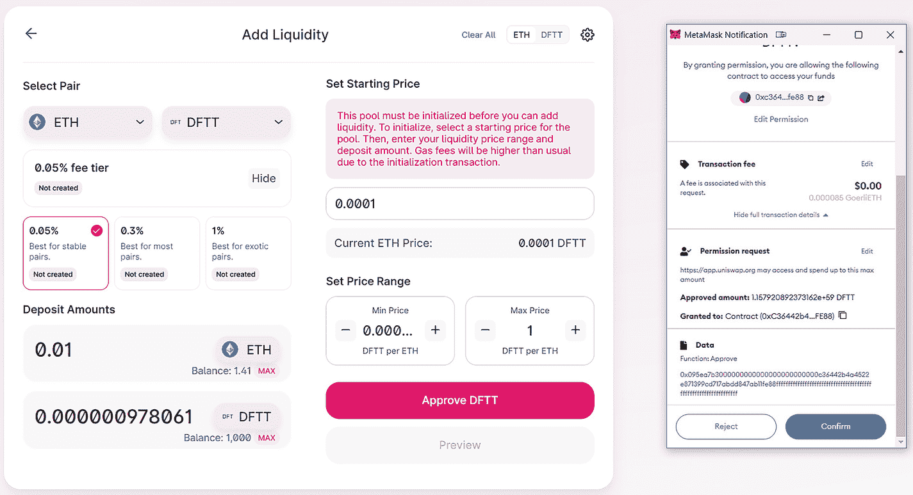

一组两个屏幕。 1. 添加流动性页面高亮显示了 `Approve DFTT` 按钮。其他选项包括 `select pairs` 和存入选项。 2. Metamask 通知屏幕包含交易费用、一些其他详细信息、`reject` 和 `confirm` 按钮。

**步骤 9 –** Uniswap 将显示一个预览页面。点击预览按钮。

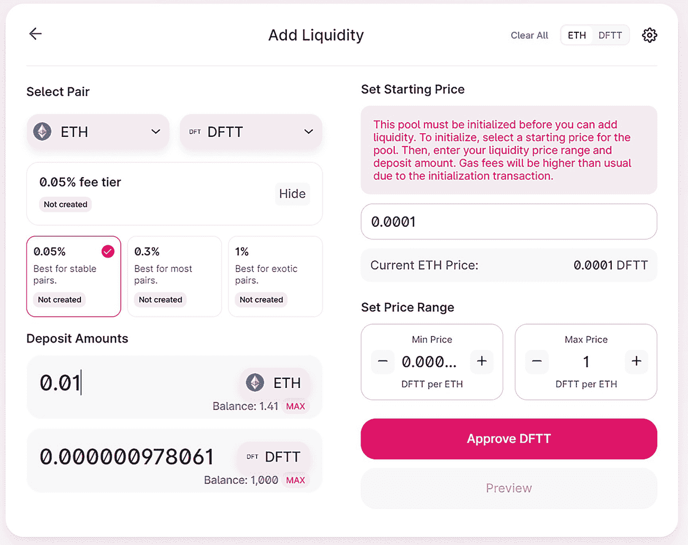

屏幕显示添加流动性页面。在 `select pair` 选项中高亮显示了“0.05% best for stable pairs”，并填写了存入金额。它包括设置最小和最高价格的价格范围选项，以及 `approve DFTT` 按钮。

**步骤 10 –** 将出现一个“添加流动性 (Add Liquidity)”弹出窗口。点击 `add` 按钮来添加流动性。Metamask 将显示确认弹出窗口，然后点击“确认 (confirm)”按钮。

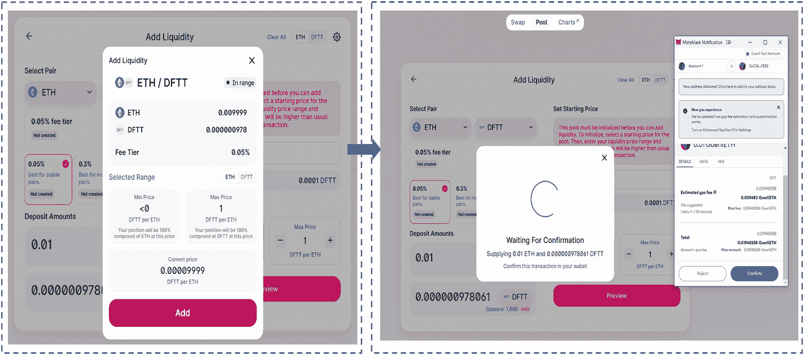

一组两个屏幕。 1. 页面上的 `add liquidity` 弹出窗口中显示了 ETH/DFTT 价格范围以及一个 `add` 按钮。 2. `add liquidity` 页面有 `waiting for confirmation` 弹出窗口，以及带有 `reject` 和 `confirm` 按钮的 Metamask 通知弹出窗口。

**步骤 11 –** 一旦交易成功在区块链上被挖掘，你应该会在 Uniswap 平台上看到你的新流动性池，如下所示：

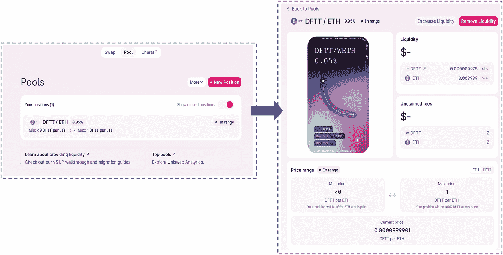

一组两个屏幕。 1. 池子页面高亮显示了 `new positions` 和 `closed positions`。 2. Uniswap 页面显示 DFTT/ETH 价格范围、价格范围最低值和最高值、当前价格等。

### 增加流动性池的资金

增加流动性与创建流动性池的几个步骤非常相似。整个过程如下所示：

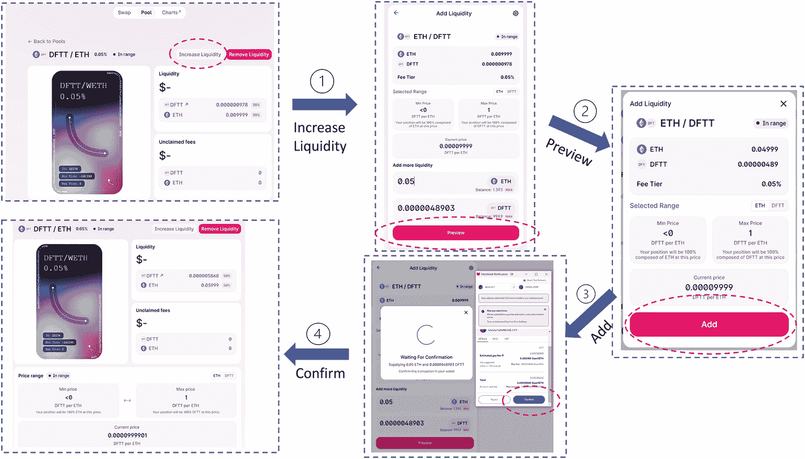

5 个屏幕显示了增加流动性所涉及的步骤。 1. `Increase liquidity` 按钮被标记。显示了流动性、未领取费用等。 2. 带有一些详情的添加流动性页面，并标记了预览按钮。 3. 标记了 `Add` 按钮。 4. 高亮显示了确认选项。 5. 包含价格详情的新流动性池页面。

### 在 Uniswap 中兑换代币

**步骤 1 –** 选择 `Swap` 选项卡，然后选择代币对。你可以通过输入代币地址，从可用 ERC-20 代币的下拉菜单中搜索和选择。

**步骤 2 –** 输入代币兑换数量。例如，我们将用 0.01 ETH 兑换 DFTT 代币。

**步骤 3 –** 检查设置并确认兑换。

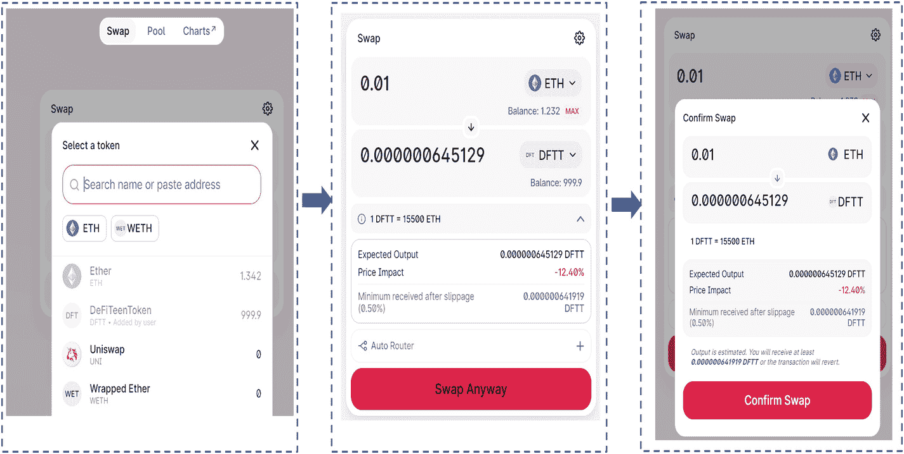

一组 3 个屏幕显示了 Uniswap 平台上的代币兑换。 1. 高亮显示了选择代币选项。 2. 输入了代币兑换数量以及 `swap anyway` 选项。 3. 高亮显示了 `Confirm swap` 选项。

**步骤 4 –** 确认并兑换。你可以看到，为了创建兑换，钱包中扣除了总计 0.01 ETH。

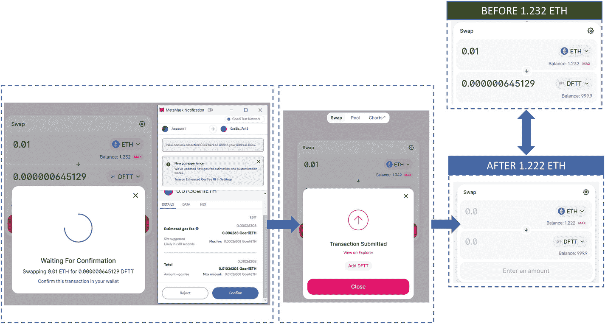

4 个屏幕显示了兑换屏幕。 1. `Waiting for confirmation` 弹出窗口和 Metamask 通知页面。 2. 一个带有 `close` 按钮的 `transaction submitted` 弹出窗口。 3. 显示了兑换前的 1.232 ETH 和兑换后的 1.222 ETH 的兑换页面。

**注意：** 你可以从钱包地址查看所有最近的交易历史。要设置兑换交易设置，例如滑点容差等，你可以点击右上角的设置图标。

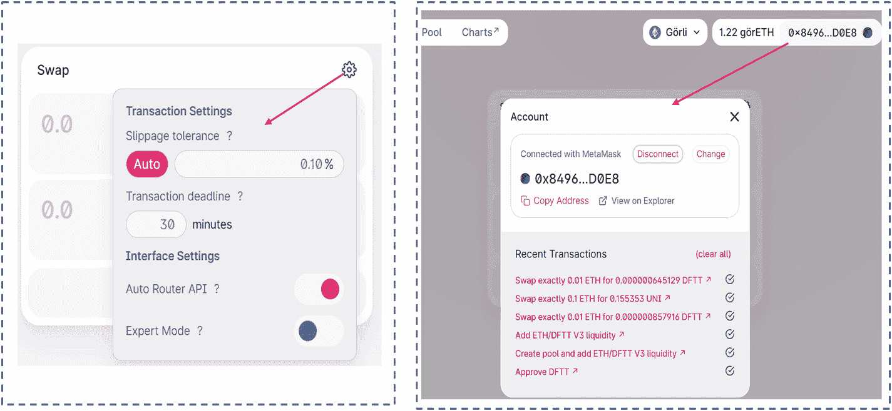

一组两个屏幕。 1. 显示了右上角的兑换设置选项，包括滑点容差、交易截止时间和干扰设置。 2. 显示了包含最近交易信息的账户详情。

使用类似的步骤，你可以兑换池中的任何代币，包括像 UNI 这样的流行代币。这是一个例子：

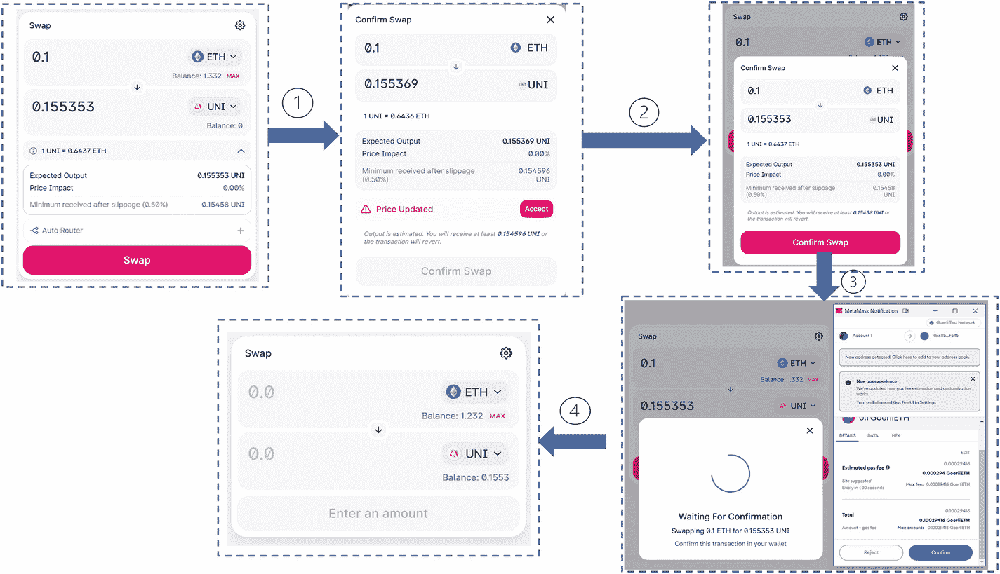

5 个屏幕显示了在池中兑换代币的步骤。 1. 带有 ETH 和 UNI 范围的兑换选项。 2. 包含 ETH、UNI、价格更新选项等的确认兑换屏幕。 3. 确认兑换弹出窗口高亮了 `confirm swap` 按钮。 4. 带有确认选项的 Metamask 通知页面的兑换屏幕。

### 从流动性池领取奖励

最后，让我们看看作为流动性提供者 (LP) 如何领取奖励。

**步骤 1 –** 点击 DEFT/ETH 池，在“未领取费用 (Unclaimed fees)”面板中有一个 `collect fee` 按钮。我们将选择 WETH 作为返回地址。点击该按钮。

**步骤 2 –** 将出现一个 `claim fees` 弹出窗口，然后点击 `collect` 按钮。

**步骤 3 –** 接下来，Metamask 将要求确认交易。点击 `confirm` 按钮。

**步骤 4 –** 这将完成你的领取奖励。

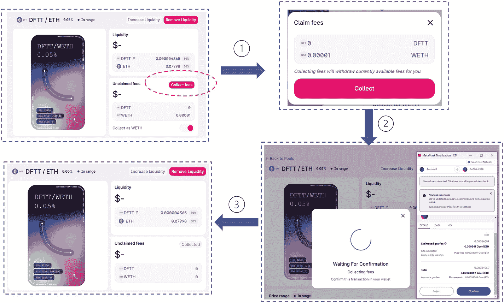

4 个屏幕显示了领取奖励的步骤。 1. DFTT/ETH 池页面高亮显示了 `collect fee` 按钮。 2. 包含价格范围和 `collect` 按钮的领取费用页面。 3. 带有 `reject` 和 `confirm` 按钮的 Metamask 通知页面。

**步骤 5 –** 将 WETH 地址导入你的 Metamask。Goerli 网络中的 WETH 地址是 `0xB4FBF271143F4FBf7B91A5ded31805e42b2208d6`。你可以从互联网或 Etherscan 检索到它。

**步骤 6 –** 现在，你将看到你领取的奖励：

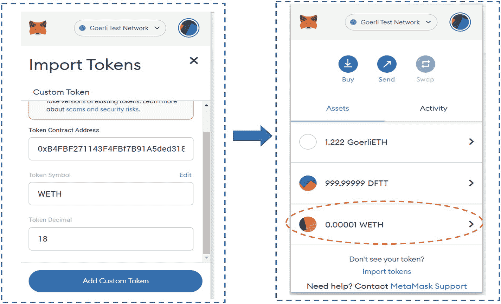

两个屏幕显示了领取奖励的步骤。 1. Goerli 测试网络页面包含用于导入代币的选项。 2. 资产显示在 Goerli 测试网络页面上，其中 0.00001 WETH 被圈出。


## 去中心化借贷

DeFi 借贷协议与传统借贷平台类似。该协议使贷方能够将资产借给借方，借方则在归还资产时支付额外的利息费用。DeFi 协议在区块链上运行，无需第三方参与，贷方和借方均为匿名状态。

由于加密货币市场的波动性可能导致抵押资产价值突然下跌，借方通常需要超额抵押其贷款以增强信用，从而降低贷方的风险。正如我们在之前关于稳定币的章节中所见，DAI 的工作原理是创建一个 Maker Vault，将超额抵押的价值锁定以抵御波动。借方通常需要始终保持其抵押品价值达到贷款价值的 150%，以避免无法还款。

以下是一些最受欢迎的 DeFi 借贷平台列表：Aave、Maker 和 Compound。

我们已经在稳定币章节中讨论过 Maker 协议。在本节中，我们将探讨 Aave 的借贷功能。

### DeFi 借贷平台概览——Aave

Aave 是一个 DeFi 货币市场协议，允许用户以浮动和固定利率借贷加密货币，而无需使用中介机构。2017 年，Aave 的原始版本以 ETHLend 的名义推出。2020 年，ETHLend 更名为 Aave。

#### Aave 代币

Aave 有两种代币：`AAVE` 代币和 `aToken`。

##### AAVE

Aave 借贷协议的原生代币是 `AAVE`，一种治理代币。与 Maker 的治理代币类似，`AAVE` 允许持有者对 Aave 社区提交的提案进行投票。

##### aToken

`aToken` 代表已供应或已借出并产生利息的加密资产数量。`aToken` 的价值与相应已供应资产的价值以 1:1 的比例挂钩。

随着 Aave 流动性池的持续增长，`aToken` 的累计利息也会增加。`aToken` 持有者可以直接将质押奖励索取到他们的同一个钱包地址，或者将利息支付重定向到另一个以太坊地址。

例如，Alice 提供了 1 个 `aETH` 代币的供应，年化收益率为 5%。假设 1 ETH 价值 2000 美元。总资产价值为 2000 美元。Alice 持有其 `aETH` 代币一年后，赎回了她所有的 `aETH`，假设此时 1 ETH 价值 3000 美元。`aETH` 的价值将为 `1 + 1 * 0.05 = 1.05 ETH`，换算成美元为 `1.05 * 3000 = 3150 美元`。此次投资的回报率为 57.5%。

当贷方向流动性池提供加密资产时，Aave 借贷池会向用户账户铸造 `aTokens`。当贷方决定提取其资产时，`aToken` 合约会调用带有计算利率的 `redeem()` 函数，将资产返还给贷方，并销毁相关的 `aTokens`。`aToken` 合约的赎回过程如图 8-16 所示。

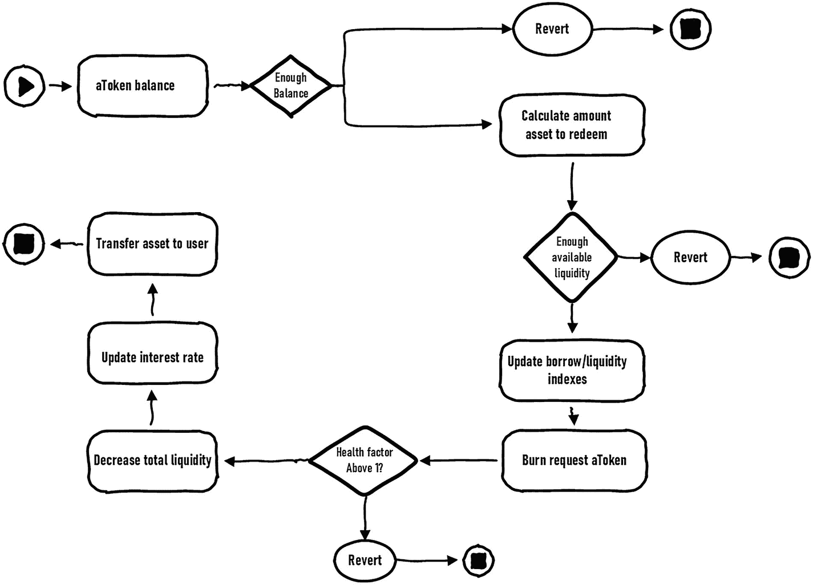

A A V X 智能合约中的代币决策图，分块展示了代币合约赎回流程，`redeem` 函数按利率计算，最后将资产代币转移给用户。

**图 8-16** – 在 AAVX 智能合约中赎回 `aToken`

### 如何在 Aave 上存款

**第 1 步** – 访问 Aave 网站：[`https://aave.com/`](https://aave.com/)。点击启动应用程序按钮。然后选择并连接您的钱包到 Aave 平台。在我们接下来的分步指南中，我们将使用 `USDT` 代币。您可以从流行的加密货币交易所购买 `USDT`。

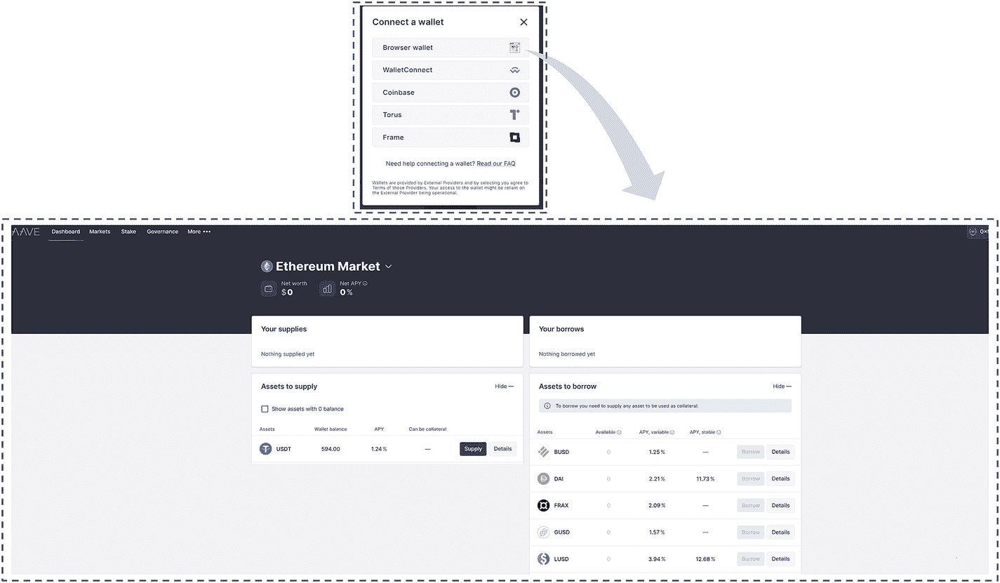

一组两个屏幕显示了 Aave 平台中的连接钱包页面。其中包括浏览器钱包、Coinbase 选项等。以太坊市场页面显示了可供应的资产和可借入的资产选项。

**第 2 步** – 在“可供应资产”面板中点击 `USDT` 供应按钮。将弹出一个窗口，要求您输入要供应的金额。在我们的示例中，我们使用 10 USDT。交易概览部分将为您提供供应年化收益率信息，对于本次供应示例，该收益率为 1.24%。点击“批准以继续”按钮。确认 Metamask 交易确认信息。

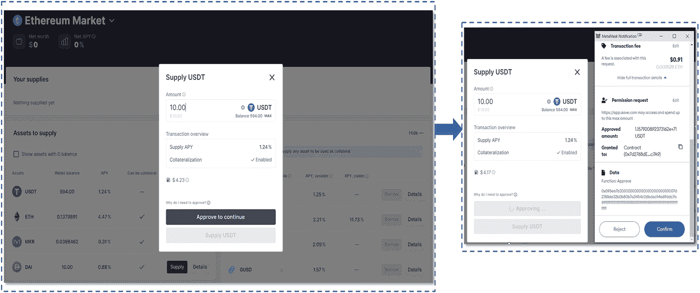

一组两个屏幕显示了以太坊市场页面，其中包含供应 `USDT` 的详细信息。1. 供应 `USDT` 弹出窗口，已输入金额 10，并包含批准以继续按钮。2. 供应 `USDT` 预览页面，带有 Metamask 确认通知。

**第 3 步** – 供应获得批准后，“供应 USDT”按钮将被启用。交易完成后点击该按钮。将出现一个“全部完成”确认窗口。接下来，您将被要求将 `aToken`——`aUSDT` 添加到您的钱包。

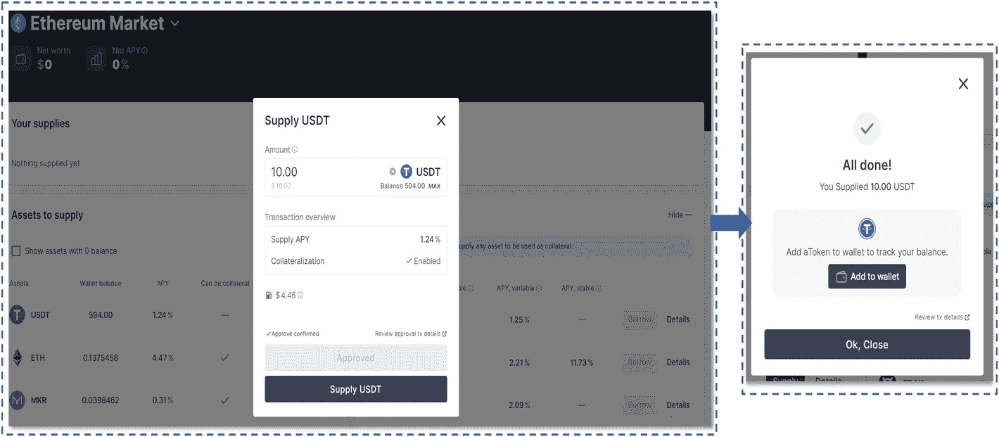

一组两个以太坊市场屏幕。1. 显示供应 `USDT` 弹出窗口，包含所有详细信息，并且“供应 USDT”选项已启用。2. 显示“全部完成”确认窗口，以及一些其他详细信息。

**第 4 步** – 将 `aUSDT` 代币添加到您的钱包。

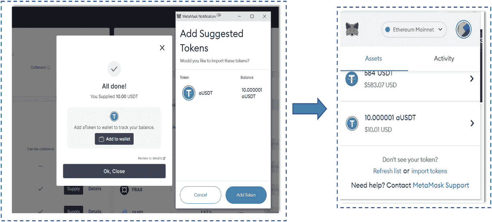

一组两个屏幕。1. 显示 Metamask 通知页面，以及添加建议代币的选项，以及包含“添加到钱包”详细信息和“确定关闭”按钮的“全部完成”弹出窗口。2. 在以太坊主网中，资产以 `USDT` 详细信息高亮显示。

**第 5 步** – 关闭“全部完成”窗口并返回仪表板。仪表板将在“您的供应”部分下显示已供应的 `USDT` 信息。对于已供应的 `USDT` 资产，将启用“提取”按钮：

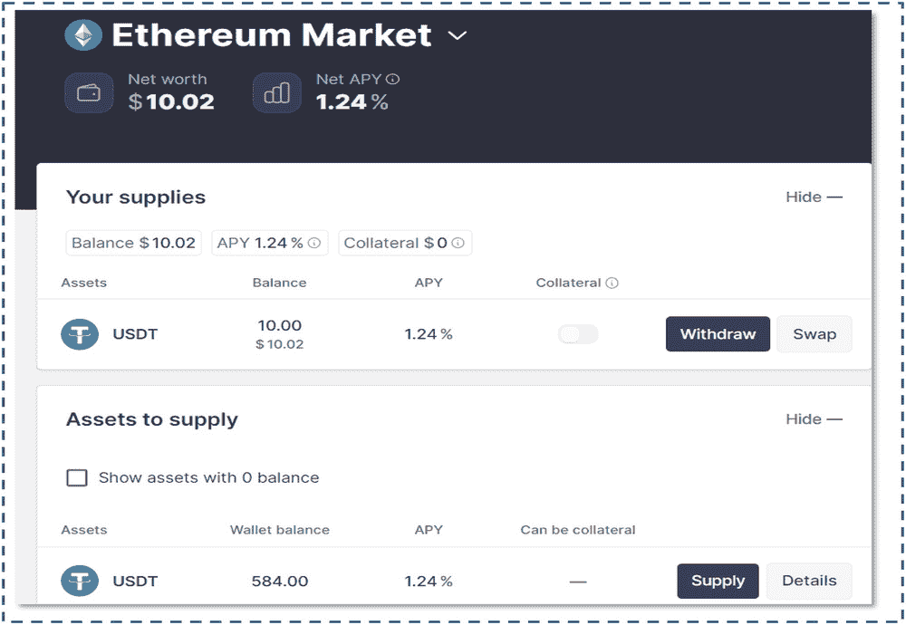

一个屏幕显示仪表板，在“您的供应”和“可供应资产”部分下包含 `USDT` 信息。对于已供应的 `USDT` 资产，启用了“提取”按钮。对于可供应资产，启用了“供应”按钮。

### 如何在 Aave 上提取

**第 1 步** – 继续上述流程。接下来，点击已供应 `USDT` 资产旁的“提取”按钮。将弹出“提取”窗口。输入您想要提取的金额。然后点击“提取 USDT”按钮。确认 Metamask 交易。

**第 2 步** – 交易完成后，关闭“全部完成”窗口并返回仪表板。仪表板将显示更新后的 `USDT` 信息：

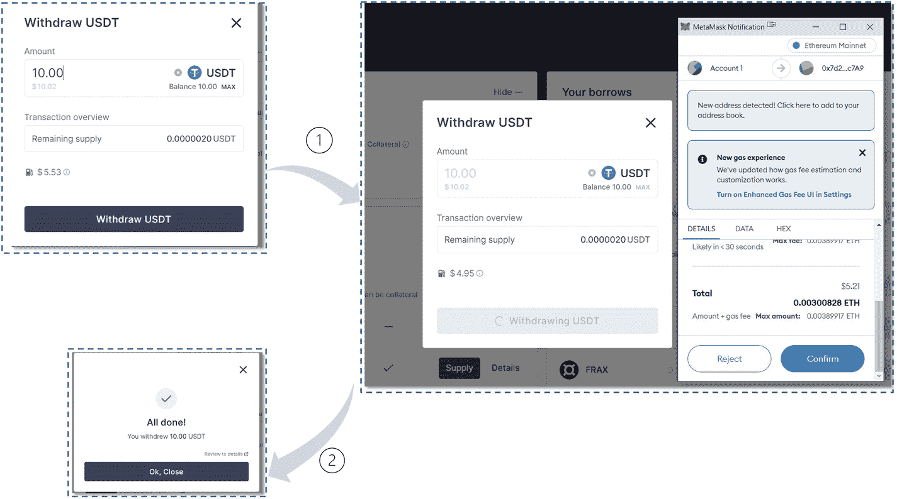

三个屏幕显示了在 Aave 上提取的步骤。1. “提取 USDT”窗口，在金额列中输入了金额，并选择了“提取”按钮。2. “提取 USDT”弹出窗口，以及带有确认信息的 Metamask 通知。3. 带有“确定关闭”按钮的“全部完成”窗口。


### 如何在 Aave 上进行兑换

由于其治理结构，Aave 平台将 `USDT`、`sUSD` 和 `SNX` 代币视为重大的中心化风险。无论从中心化程度还是信任角度来看，它们的对手方风险都过高。因此，平台禁用了 `USDT` 作为抵押品的选项：

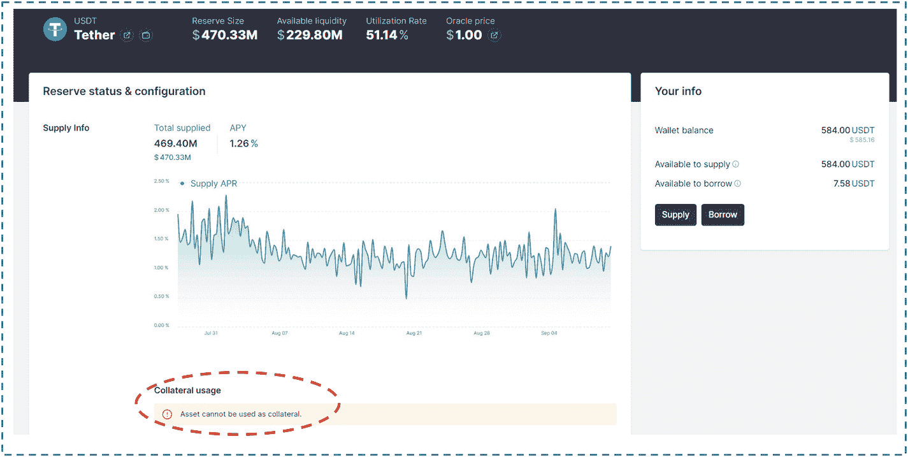

屏幕展示的是带有泰达币选项的 Aave 平台界面。标题栏中包含了储备规模、可用流动性以及其他详细信息。下方是储备状态和配置供应信息，并附有供应年化利率图表，以及已圈出的抵押品使用情况。

本例中，我们将把中心化的 `USDT` 稳定币兑换为去中心化的稳定币 `DAI`。我们将使用 Aave 中的兑换功能。

**步骤 1** – 在已供应的 `USDT` 资产上点击“兑换”按钮。将会弹出一个兑换窗口。输入您想要兑换的金额，并选择目标兑换代币。本例中为 `DAI`。页面将显示当前市场条件下的价格影响，并提供选择最大滑点率的选项。接下来，点击“批准以继续”按钮。

**步骤 2** – 一旦兑换获得批准，“兑换”按钮将被启用。待交易完成后点击该按钮。将会出现一个“全部完成”的确认窗口：

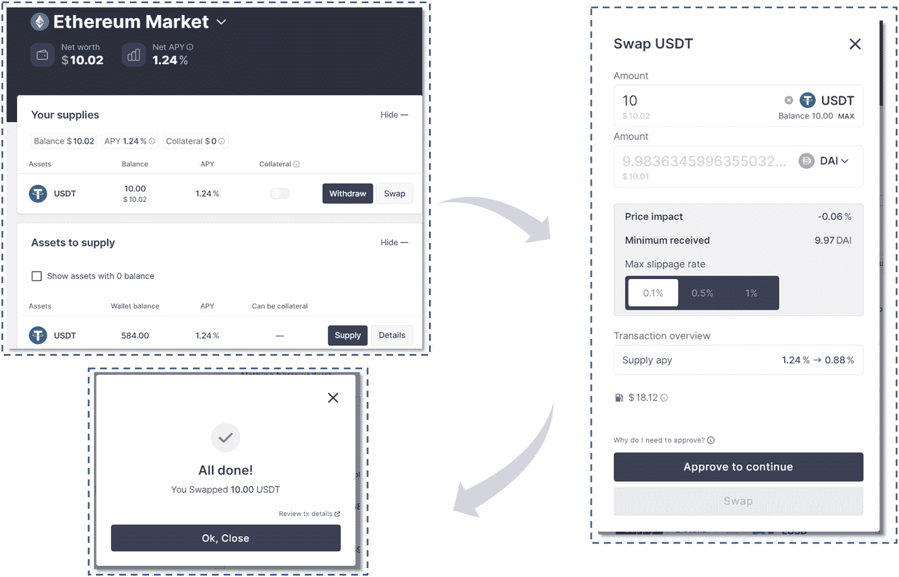

一组三个屏幕。1. 以太坊市场页面，显示了供应品和可供供应的资产，并分别启用了提现和供应按钮。2. 兑换 USDT 页面，显示了价格影响和已启用的批准按钮。3. “全部完成”窗口。

**步骤 3** – 关闭“全部完成”窗口，返回仪表盘。仪表盘将在“您的供应”部分下显示已兑换的 `DAI` 代币，并已启用其抵押功能：

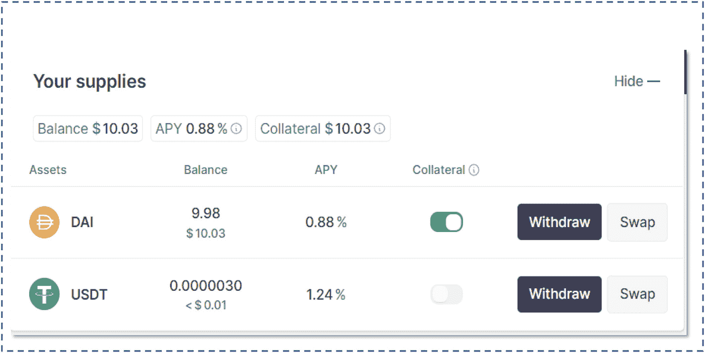

一个屏幕显示了供应选项，列出了 `DAI` 和 `USDT` 资产、余额、年化收益率以及抵押品详细信息。`DAI` 资产的抵押按钮已启用。

### 如何在 Aave 上进行借款

现在我们已经存入了 `DAI` 作为抵押品，可以从 Aave 借入一些资产了。在本演示中，我们将借入 `BUSD`（币安美元稳定币）：

**步骤 1** – 在“可借资产”面板下点击 `BUSD` 的“借入”按钮。“借入 BUSD”窗口将会弹出。输入您想要借入的 `BUSD` 金额。页面上会显示健康因子信息。健康因子是借款人的贷款价值比，代表了您的清算门槛，或者说贷款被定义为抵押不足的百分比。它用于衡量您资金的风险。数值越高意味着资金状态越安全，您需要将其保持在 `1.0` 以上以避免损失资金。

点击“借入 BUSD”按钮。确认 MetaMask 交易。

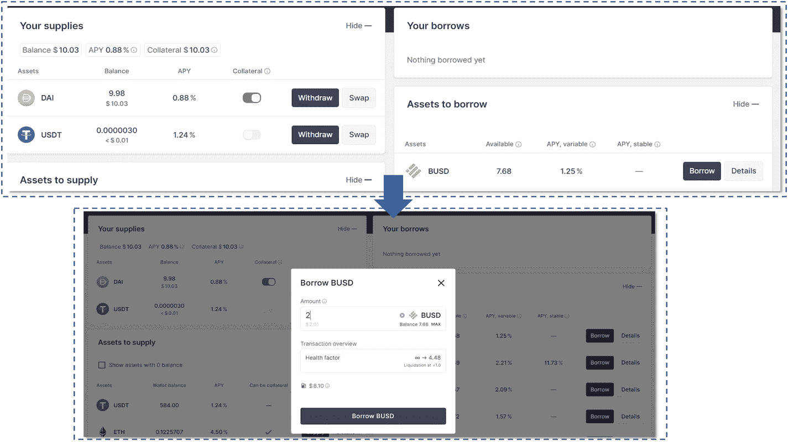

一组三个窗口。1. 供应面板，已启用 `DAI` 资产作为抵押品。2. 借入面板，在可借资产 `BUSD` 中包含了借入和详情按钮。3. 借入 `BUSD` 弹出窗口，已启用借入按钮和借入金额选项。

**步骤 2** – 一旦借入交易完成，“全部完成”确认窗口将会出现。接下来，系统会要求您将 `BUSD` 代币添加到您的钱包。将 `BUSD` 添加到您的钱包。

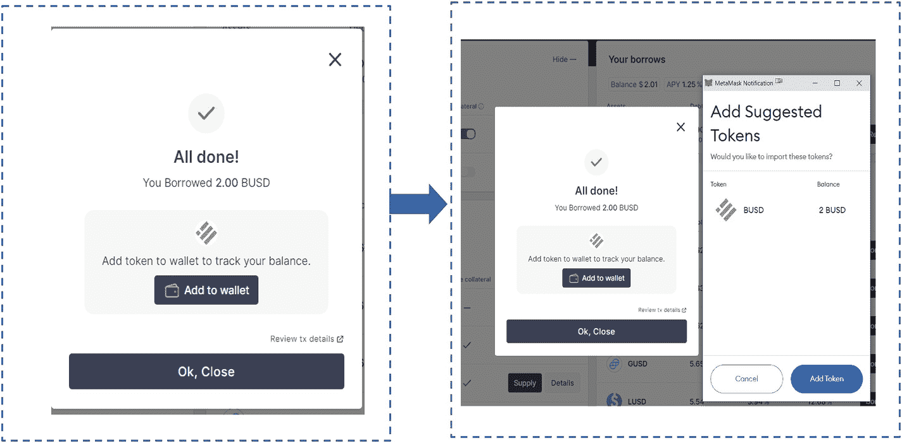

一组两个屏幕。1. 屏幕显示“全部完成”窗口，包含“添加到钱包”和“确定关闭”按钮。2. “全部完成”窗口，并且在 MetaMask 通知窗口中显示了将 `BUSD` 代币添加到钱包的选项。

### 如何在 Aave 上进行还款

我们刚刚从 Aave 平台借入了两个 `BUSD`。在本节中，我们将演示如何偿还 `BUSD`。

**步骤 1** – 为了偿还贷款，您只需前往仪表盘的“您的借款”部分，并点击 `BUSD` 的“还款”按钮。

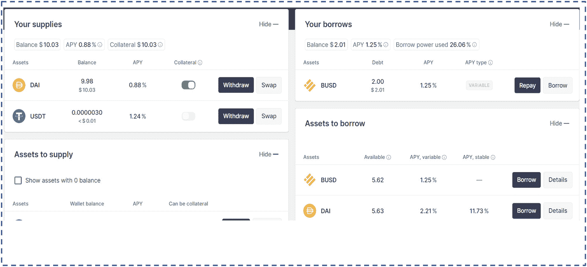

两个屏幕分别显示您的供应品和您的借款。供应屏幕包含提现和兑换按钮以及其他详细信息。借款屏幕为 `BUSD` 提供了还款和借入按钮以及其他详细信息。

**步骤 2** – “还款 BUSD”窗口将会弹出。输入您想要偿还的 `BUSD` 金额。页面将显示您剩余的债务和健康因子信息。接下来，点击“批准以继续”按钮。

**步骤 3** – 一旦还款获得批准，“还款 BUSD”按钮将被启用。待交易完成后点击该按钮。将会出现一个“全部完成”的确认窗口。您的 `BUSD` 现已偿还：

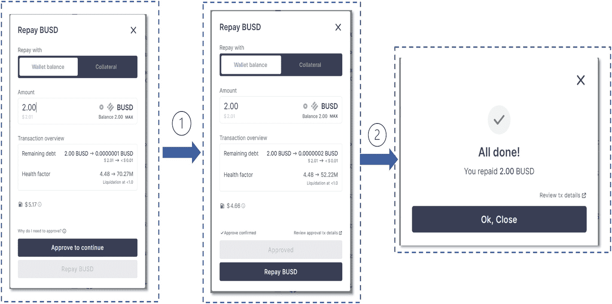

3 个屏幕展示了偿还 `BUSD` 的步骤。第 2 个屏幕顶部提供了使用钱包余额或抵押品进行还款的选项。其下方可输入金额，并显示交易概览。在第 1 和第 2 个屏幕中分别启用了“批准以继续”和“还款 BUSD”按钮。“全部完成”屏幕显示了已偿还的金额。


## 去中心化保险

在现实世界中，保险是保护健康及防止贵重资产损失的一种方式。当意外事件（如车祸、长期疾病、火灾、失业、受伤或死亡）发生时，保险能降低经济受损的风险。大多数购买保险的人并不会遭遇损失，而保险公司押注于事故发生的概率较低，因此他们从个人收取的保费足以覆盖少数人的损失，剩余部分即为保险公司的利润。

市面上存在多种不同类型的保险，例如金融保险。这类保险可保护公司免受各种损失，包括财产损失、诉讼、数据泄露、股票价值暴跌或商业伙伴破产等。

近年来，DeFi 呈现指数级增长，成绩斐然。作为区块链驱动金融的一种相对新颖的方式，DeFi 绕过了传统的中心化中介机构和低效环节。然而，与之相伴的同样存在风险。这些风险包括：

**智能合约风险** – DeFi 项目是开源的，通常构建在复杂的智能合约之上。智能合约的任何逻辑错误或漏洞都可能导致软件故障。一旦合约部署到公有链上，几乎不可能修复错误。尽管治理协议可以升级协议变更，但在进行任何更改之前，完成投票过程通常需要时间。

**DeFi 技术非常新颖** – DeFi 协议相当复杂，对于投资者来说，完全理解智能合约设计通常极具挑战性。因此，DeFi 产品的风险可能只有在发生时才能被理解。

**监管风险** – DeFi 协议在没有 KYC 和 AML 监管的情况下蓬勃发展。然而，这也意味着用户在出现问题时缺乏保护，而且没有金融法规要求 DeFi 提供方维持资本储备。此外，政府未来可能会对 DeFi 协议实施监管，这将影响 DeFi 投资。

**私钥要求** – 在区块链中，如果你丢失了钱包的私钥，你就会丢失其中的资金。因此，用户必须保护好自己的钱包以保护其加密货币资产。

**无常损失** – 我们已在 DEX 部分对此进行过讨论。它是由注入流动性池的代币之间的价格波动引起的。

随着 DeFi 行业的快速增长和潜在风险，对于那些希望参与 DeFi 的同时，通过购买保险来防范可能遇到的诸多潜在风险以保护其资产的人来说，保险是必需的。去中心化保险充当了 DeFi 行业的安全网。这个行业仍处于非常早期的阶段，正在快速发展并完善其协议。通过去中心化保险，用户不必与中心化的保险公司打交道。相反，由去中心化的承保人池通过收取加密服务费来提供保单，以防范特定事件。一些承保范围包括：

*   针对 DeFi 协议的恶意攻击
*   钱包保护
*   智能合约故障
*   加密货币波动和闪电式崩盘
*   DeFi 存款

### 热门 DeFi 保险平台

#### Nexus Mutual

Nexus Mutual 是一个在以太坊区块链上创建共同风险分担池的去中心化保险平台。`NXM` 是 Nexus Mutual 的原生代币，并在 Nexus Mutual 协议中充当治理代币的角色。该协议由其 `NXM` 代币持有者社区驱动。

每位 `NXM` 代币持有者都享有会员权利。他们有权执行以下操作：

*   购买智能合约保险。
*   向互助池存入资金并持有 `NXM` 代币。
*   与其他成员分担风险。
*   担任风险评估员。
*   担任理赔评估员。
*   提交治理提案。
*   对提案进行投票。

Nexus Mutual 的主要产品是智能合约保险。

Nexus 可通过三种方式保护数字资产：

**收益代币保险** – 此保险针对代币脱钩提供保护。脱钩是指稳定币偏离其预期的锚定价值，例如，一种与美元 1:1 锚定的稳定币。当其价值低于 1 美元时，该代币即被称为“脱钩”。

**协议保险** – 此保险针对特定项目的协议被黑客攻击提供保护。

**托管保险** – 此保险针对中心化交易所上投资者资金的提现暂停和资金削减提供保护。

#### InsurAce 协议

InsurAce 是一个去中心化的多链协议，为 DeFi 社区成员提供保险服务。InsurAce 协议保护资金免受各种风险侵害。

InsurAce 开发了广泛的加密货币保险产品，覆盖了运行在以太坊、币安链（BSC）、Polygon 和 Avalanche 区块链上的众多协议。

InsurAce 协议提供基于投资组合的保险，涵盖以下方面：

**智能合约漏洞风险** – 黑客利用智能合约中的漏洞窃取资金。

**托管人风险** – 由于犯罪、欺诈或类似情况，托管人损失了至少 20% 的用户资金，或者他们在未提前通知的情况下冻结提现至少 120 天。

**IDO 事件风险** – 黑客利用 IDO 平台智能合约中的漏洞窃取其资金。

**稳定币脱钩风险** – 稳定币的价格低于其锚定价值。

#### Etherisc

Etherisc 是一个基于区块链的平台，用于构建去中心化保险产品。通用基础设施、产品模板和保险即服务许可，使得社区用户无需投入从头创建所需的时间和金钱，即可创建自己的保险产品。由 Etherisc 社区构建的产品包括：

**农作物保险**

当政府机构报告干旱或洪水事件时，智能合约协议会触发自动赔付，通过平台向购买了农作物保险的农民支付赔偿。

**航班延误保险**

FlightDelay 是一个运行在 Gnosis Chain 主网上的去中心化应用程序。FlightDelay 应用程序中的智能合约利用 Chainlink 预言机数据源，为遭遇航班延误或取消的旅客自动签发和赔付保单。由此，自动化的航班保险保单现在结算更快，由于减少了人力和技术开销而成本更低，并且因其运行在区块链网络上而更加透明。


## 总结

本章旨在让你熟悉去中心化金融生态中的流行产品，这些产品在参与 DeFi 项目或投资时值得了解。

本章首先探讨了去中心化金融的概念。接着介绍了 DeFi 服务结构的五个不同层级。此外，通过详细介绍去中心化稳定币，我们深入研究了 Maker 稳定币，以理解其运作方式，并演示了如何在 Maker Foundation 的投票门户中对提案进行投票。随后，在“去中心化交易所 (DEX)”部分，我们讨论了不同类型的 DEX，特别是自动化做市商 (AMM)。我们学习了许多 DeFi 世界中的流行概念，包括收益 farming、滑点、无常损失和流动性池。之后，我们还探索了最受欢迎的 DEX——Uniswap。最后，我们提供了一个实用的端到端指南，向你展示如何在公共区块链上部署你自己的 `ERC-20` 代币、创建流动性池、添加流动性、兑换你的自定义代币，并在 Uniswap 平台上获得质押奖励。

在“去中心化借贷”部分，我们概述了最受欢迎的去中心化借贷平台——Aave。然后演示了如何在 Aave 平台上进行借出、提取、兑换、借入和偿还加密资产的操作。

本章还讨论了去中心化保险。下一章将是我们的最后一章，我们将讨论区块链的未来。

