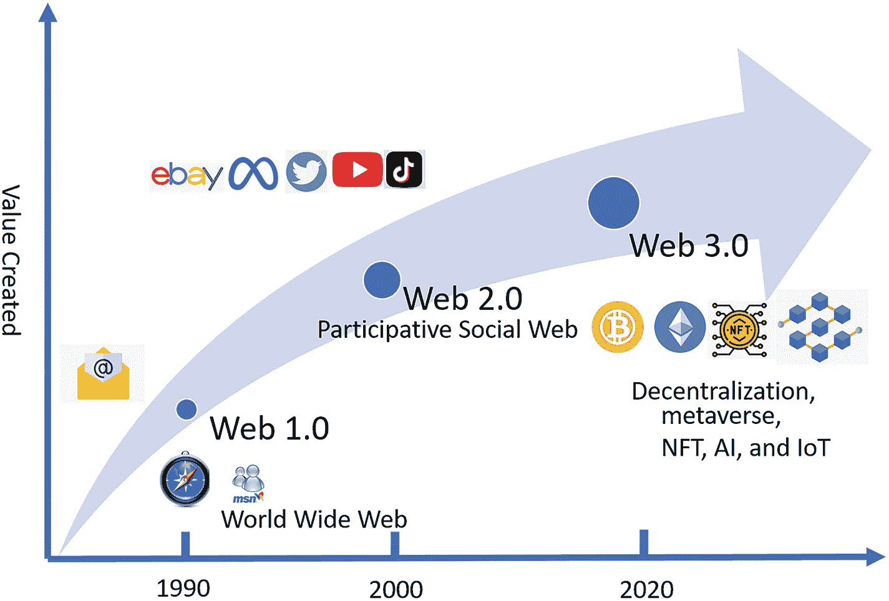
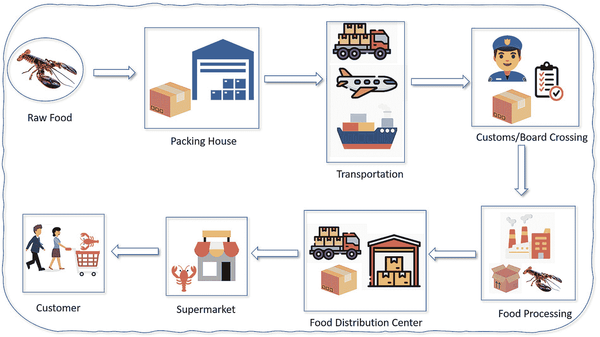
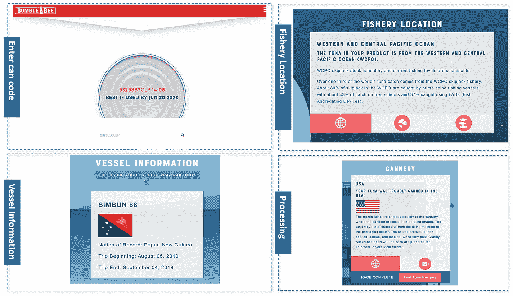
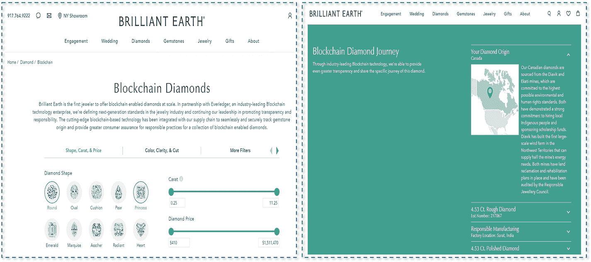
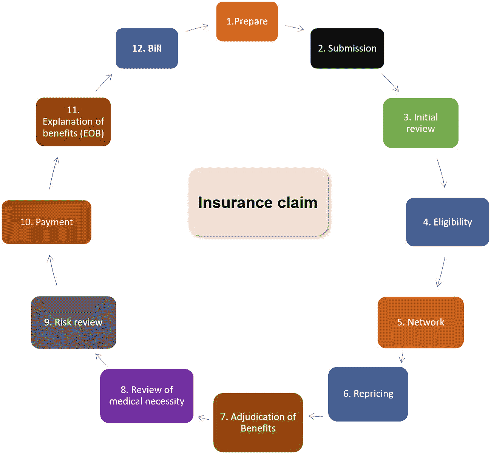

# 9. 区块链的未来

区块链是一种全球性的去中心化账本技术，由不断增长的区块列表组成。这些带有时间戳、只能追加的区块通过密码学技术链接在一起。区块中的数据是永久的、不可变的，并且无法篡改。在区块链中，任何人都可以直接进行交易，无需中介即可与其他人交换任何有价值的资产。区块链在两个参与者之间建立了一种替代信任机制，开启了一个名为“价值互联网 (IoV)”的互联网使用新时代。在价值互联网中，数字资产可以以自动化、安全且去中心化的方式即时与另一个人交换——从股票到艺术品、医药、知识产权等等。在今天的互联网上，我们可以自由地分享信息。明天，我们将可以在区块链上自由地分享价值。区块链作为一项革命性技术，是一种正在推进的现象，它将逐渐影响商业并重塑世界经济。包括金融、医疗保健、教育、房地产和供应链在内的每个行业，都可能借助区块链技术实现革命性的变革。

完成前八章的学习后，你应该拥有足够的知识来思考区块链如何解决现实生活中的问题。在本章中，我们将首先介绍从 Web 1.0 到 Web 3.0 的互联网演进。贯穿本章，我们将讨论区块链如何改变传统行业。我们将从涵盖以下核心主题开始：

- 互联网的演进
- 区块链在金融领域的应用
- 区块链在供应链领域的应用
- 区块链在医疗保健领域的应用

## 互联网的演进

互联网是世界上最流行的计算机网络，它连接了数十亿台计算机和电子设备。每天有数十亿人使用互联网发送电子邮件、在线购物、在社交媒体上与朋友联系或用于其他许多目的。没有互联网接入的生活似乎难以想象。

1958 年，高级研究计划局 (ARPA)，即现在的国防高级研究计划局 (DARPA) 成立，其目标是创建一种在计算机之间进行直接通信和共享信息的方式。

1967 年，ARPA 创建了第一个计算机网络的可行模型——ARPANET，它允许多台计算机在单个网络上相互通信。

1969 年，ARPANET 将第一条消息从一台计算机传输到另一台计算机。它因此成为互联网的先驱。

1983 年，ARPANET 采用了名为传输控制协议/网际互联协议 (TCP/IP) 的开放网络协议，该协议后来成为当今互联网的核心协议。

然而，随着越来越多的计算机接入网络，网络用户需要找到一种更简单的方式来与它们通信。因此，在同一年，保罗·莫卡佩特里斯发明了域名系统 (DNS)，它提供了一种更简便的方式来使用计算机名称。

1985 年，`symbolics.com` 成为第一个注册的域名。

1989 年，ARPANET 关闭。同年，蒂姆·伯纳斯·李发明了万维网。自此，世界进入了 Web 1.0 时代。

### Web 1.0 (1989–2004)——万维网

万维网，通常简称为 Web，是由网络服务器托管的一组网站或网页的集合。用户可以通过计算机上的网页浏览器访问和查看数字内容。Web 1.0 指的是万维网发展的早期阶段。Web 1.0 时期大致从 1989 年到 2005 年。

1990 年，蒂姆·伯纳斯·李在日内瓦的欧洲核子研究组织 (CERN) 工作。在那里，他开发了第一个网页客户端和服务器，并使用了三种特定技术：超文本标记语言 (HTML)、统一资源定位符 (URL) 和超文本传输协议 (HTTP)。

在 Web 1.0 时代，网站仅由静态网页组成，这些网页主要包含文本和图像内容，并链接到其他静态网页。Web 1.0 的网站不允许用户与站点进行交互。这就是为什么 Web 1.0 被称为“只读”网络的原因。以下截图显示了一个典型的 Web 1.0 页面：

``

此为 N C S A Mosaic for M S windows 页面的截图。其标题文字为：欢迎使用 N C S A Mosaic，一个互联网信息浏览器和万维网客户端。

`图 9-1` Web 1.0 页面

定义 Web 1.0 的一些特征如下：

- 页面是静态的（页面内容不是动态的）。
- HTML 表单通过电子邮件发送。
- Web 内容从网络服务器的文件系统加载。
- 网页布局使用框架和表格。
- 可以使用 GIF 按钮和图形。
- 网站是只读的，用作“信息门户”。

### Web 2.0（2004 年至今）——参与式社交网络

蒂姆·奥莱利在 2004 年奥莱利与 MediaLive International 的一次会议中首创了 `Web 2.0` 这一术语。它指的是万维网发展的第二阶段。与只读的 `Web 1.0` 不同，`Web 2.0`（也称为参与式社交网络）允许用户通过网站和社交媒体平台进行互动与协作。用户可以创建个人资料、与他人联系、分享观点、发表评论以及发布视频。诸如 `YouTube`、`Facebook`、`Instagram`、`TikTok`、`LinkedIn`、`Netflix`、`Twitter` 和 `Amazon` 等应用都是流行的 `Web 2.0` 平台，全球有超过 40 亿人访问它们。

这些应用基于众多现代且强大的网络技术构建，极大地提升了终端用户的体验。

云计算、大数据、人工智能（AI）、物联网（IoT）、移动技术和前端技术的出现，使得 `Web 2.0` 平台能够实时连接用户，从而提供更佳的用户体验。移动应用让用户可以随时在线。另一方面，平台提供商也收集并控制用户数据，以分析用户活动用于商业目的。因此，网络平台变得愈发中心化。

以下是 `Web 2.0` 的典型特征列表：

* 现代响应式网络应用可从任何地点访问。
* 提供丰富的用户体验，且非常用户友好。
* 支持参与者之间的协作与信息共享。
* 创建平台所需的编程知识极少。
* 允许通过移动设备和智能设备访问。
* 重点在于社交网络与计算。
* 鼓励社交网络效应：贡献越大，内容和回报就越好。

### Web 3.0——去中心化

在 `Web 2.0` 中，大型公司不断在平台上升级产品并创造新功能，以吸引用户留在其平台。然而，与此同时，这些应用扮演着中心化守护者的角色。因此，用户需要遵循它们的标准，否则其账户可能会被平台封禁。

此外，在 `Web 2.0` 中，大多数流行应用可以在移动设备上运行，这要求用户的手机始终保持联网。尽管所有这些流行应用都是免费的，但它们的设计方式却是针对特定用户并收集其数据。从用户下载这些应用的那一刻起，应用就开始收集其个人数据，包括姓名、位置、性别和出生日期，以及更抽象的信息，如社交网络关系、工作和就业历史、近期购物记录、过去的度假目的地、爱好和兴趣。

凭借大量相关的个人数据，公司利用强大的大数据分析和机器学习（ML）技术来学习用户数据。他们不仅能更深入地了解用户偏好，还能预测用户在不同情境下的思想、情感和行为。被“驯化”的用户数据对广告商和营销人员极具价值，他们可以利用这些数据高效地向相关消费者投放定向广告。用户在使用这些免费的中心化平台时，实际上将自己的个人数据当作了商品。不幸的是，用户无法拥有和控制自己的个人数据。

随着时间的推移，互联网开始进入 `Web 3.0` 阶段。在此阶段，应用和服务将基于去中心化的、近乎匿名的平台构建，而非中心化数据库。凭借区块链的去中心化特性，网络中的每个个体都平等，并可以控制自己的数据。用户可以保持数据私密，也可以分享或出售自己的个人资料。数据成为用户的一项资产。

`Web 3.0` 还利用了 AI、ML 和物联网等最新技术来构建网络。这将使网络更加智能、响应更快，以满足用户需求，即实现更个性化的服务。

在传统的企业结构中，C 级高管通常拥有做出关键业务决策的权力，且往往优先考虑股东和营销需求。随着 `Web 3.0` 的到来，去中心化自治组织（DAO）将颠覆中心化的企业治理流程，并为组织社区带来新思路。组织中不存在中央权威，其社区成员通过提案和投票做出决策。因此，在 DAO 中，每个人都可以参与决策并拥有发言权。

在 `Web 3.0` 中，三维（3D）设计将在互联网上广泛应用。`Metaverse` 对于开辟全新经济前景至关重要。在 `Metaverse` 中，所有物体都使用 3D 图形。人们拥有自己的 3D 虚拟化身，可以访问购物中心、参加会议和玩游戏。`Metaverse` 通过允许用户加入 3D 数字虚拟世界并亲身体验，解锁了交互、学习、娱乐、工作和生活的新方式。在此背景下，区块链中的每个数字资产都被赋予一个唯一、可验证的身份；这种记录被称为非同质化代币（NFT）。NFT 代表了 3D 数字资产的所有权，并可以在 `Metaverse` 世界中进行交易。

图 `9-2` 展示了互联网的演进（从 `Web 1.0` 到 `3.0`）。

```

```

一幅图解，展示了从万维网作为 `Web 1.0`，到参与式社交网络作为 `Web 2.0`，再到元宇宙作为 `Web 3.0` 的多年间所创造的价值。

`图 9-2`
`互联网的演进（Web 1.0、2.0 和 3.0）`

## 金融领域的区块链

金融服务是指金融行业为管理资金而提供的各种经济服务和产品。它们是国民经济最重要的驱动力之一。金融服务涵盖广泛的业务，包括以下主要服务类型：

1. **银行业** – 银行服务是金融服务业中最重要的服务之一。它提供各种服务，包括个人或企业银行业务（支票账户、储蓄账户、借记卡/信用卡等）以及贷款发放（个人贷款、商业贷款、住房贷款、汽车贷款等）。
2. **保险业** – 保险服务保护个人免受财务损失，并帮助他们从意外事故中恢复。大多数人都拥有某种保险，例如汽车保险、房屋保险或人寿健康保险。当个人购买保险时，他们会签订一份保单合同。随后，当他们遭遇保单承保范围内的损失并提出索赔时，保险公司会根据保单条款进行赔付。
3. **财富管理** – 财富管理或财富管理咨询，是指投资管理以及提供高水平专业财务建议，以满足从富裕人士到高净值及超高净值个人和家庭等广泛客户的需求。
4. **共同基金** – 共同基金服务允许个人与其他投资者将资金汇集在一起，投资于一系列证券，例如股票、债券、货币市场工具和其他资产。共同基金的价格，也称为其资产净值，由投资组合中证券的总价值除以流通在外的股份数量决定。
5. **专业咨询** – 金融专业咨询服务提供专业知识，帮助个人和公司做出财务决策并实现财务目标，包括教育储蓄规划、退休规划、风险管理、投资组合管理、保险和税务策略。
6. **股票市场** – 股票市场服务为买卖双方提供交易公司股票以及各种其他证券（如债券、期货和期权）的场所。
7. **债务工具** – 债务工具是用于获取资本的工具，包括贷款和债券。通常，债务偿还涉及根据合同条款在指定的还款计划内向贷款人或投资者支付固定款项。公司利用债务工具为其增长、投资和未来规划获取资金。
8. **税务/审计咨询** – 税务会计服务涉及金融专业人士提供准备纳税申报和缴纳税款的服务。财务审计，也称为财务报表审计，通过评估组织的会计和财务报表是否符合政府法律法规，提供合理保证。
9. **投资组合管理** – 投资组合管理是指管理个人的投资，例如股票、债券、现金、股份和交易所交易基金。通常，股票、债券和现金构成投资组合的核心。
10. **信用评级** – 信用评级用于评估个人或公司的信用风险，根据其收入和过去的还款记录预测其偿还债务的能力。

学者们估计，到 `2022 年`，全球金融服务行业价值将达到 `2.5 万亿美元`，年增长率约为 `6%`。每天都有价值数万亿美元的交易发生。由于如此巨量的交易，金融行业面临着诸多挑战，包括过多的文书工作、数据泄露、繁琐的流程及随之而来的高成本、消费者缺乏信任以及长期存在的透明度不足等问题。区块链技术具有去中心化、安全、透明和不可篡改的特性。其革命性的设计和特性使其成为解决全球金融体系挑战的可能方案，银行和金融业正在加速采用数字区块链技术。据估计，全球金融市场的区块链将从 `2022 年` 的 `18.9 亿美元` 增长到 `2030 年` 的 `945.8 亿美元`，年增长率为 `63.1%`。在下一节中，我们将讨论区块链技术在金融行业应用的一些案例，包括贸易金融。

### 贸易融资中的信用证

贸易融资是指为促进进口商与出口商之间的国际贸易与商业往来而提供的票据或服务融资。2022 年 6 月，全球贸易融资市场规模达到 1.7 万亿美元。

贸易融资的类型包括信用证（`LC`）、采购订单（`POs`）融资、存货融资、结构型商品融资、发票融资（贴现和保理）、供应链融资以及债券与担保。

在贸易融资中，进口商的银行会向出口商提供一份 `LC`。`LC` 也被称为汇票、跟单信用证或银行商业信用证。它是进口商银行出具的一封信函，保证进口商向出口商的付款将以约定货币的指定金额收到，并为出口商提供一份包含明确条款与条件的合同，需在规定时间框架内满足。`LC` 最常用于国际贸易，特别是进出口业务。

图 9-3 展示了一个 `LC` 流程的示例，尽管实际交易可能复杂得多。

``

`LC` 流程示意图：初始销售合同、申请 `LC`、签发 `LC`、交付货物、提交单据、支付货款。图片边缘有 4 个组件，通过箭头相互连接。

`图 9-3`
`LC` 流程

1.  **进口商与出口商签订销售合同。**

进口商（买方）和出口商（卖方）启动并商定一份销售合同。销售合同是出口商与进口商之间的法律协议，出口商同意出售，进口商同意按特定条款和条件购买。合同内容应包括买卖双方公司信息、货物信息、货物总价和单价、交货日期、延迟装运的罚则等。

2.  **进口商向银行申请信用证。**

进口商前往其银行，以出口商为受益人，申请一定金额的 `LC`。`LC` 可以通过标准贷款流程获得，或通过授权从客户账户中扣除相关费用来提供资金。

3.  **进口商银行签发信用证并将其发送给出口商银行。**

进口商银行准备 `LC`，然后将 `LC` 副本发送给出口商银行。进口商银行指示出口商银行是否根据其客户的合同添加其保兑。

4.  **出口商银行对信用证进行认证并通知。**

出口商银行将 `LC` 转发给受益人（出口商）。出口商应确保 `LC` 中的所有条款和条件均已满足销售合同的要求。

5.  **货物被运送给进口商。**

出口商开始制造、组装并运输货物。

6.  **出口商向出口商银行提交贸易单据。**

出口商准备装运发票以及所有其他单据，包括货物描述和装运日期。根据 `LC` 要求，所有这些单据都是必需的。

7.  **出口商银行审核单据并将其交付给进口商银行。**

出口商银行根据 `LC` 检查出口商提交的贸易单据。然后，出口商将其发送给进口商银行，要求为卖方补偿和付款。

8.  **进口商向进口商银行付款。**

进口商银行将出口商的单据通知进口商，进口商检查单据并向进口商银行付款。

9.  **进口商银行将款项发送给出口商银行。**

10. **出口商银行将款项发送给出口商。**

银行的 `LC` 保证，只要出口商满足所有条款和条件，就能收到付款；而进口商则可以通过使用 `LC` 获得出商的信任。使用 `LC` 还可以降低生产风险。当其他付款方式不可行时，`LC` 也提供了一种付款途径。

尽管 `LC` 合同具有诸多优势，但其流程仍存在许多问题。

1.  **需支付高额服务费。**

当使用 `LC` 作为付款方式时，出口商和进口商必须向其银行支付高额服务费。

2.  **这是一个耗时的过程。**

使用 `LC` 意味着银行专业人员需要使用传统银行方法处理 `LC`。签发 `LC` 的过程非常缓慢，一项国际贸易交易通常需要大约 15 天到几个月。许多副本通过航空邮件、传真、电话或扫描等电信方式与不同方共享。贸易交易依赖于纸质单据，即所谓的跟单信用证。银行需要人工核对文件以防止欺诈、验证交易并核实买卖双方的余额。

许多银行开始利用区块链技术来简化 `LC` 流程并克服其问题。

通过将 `LC` 定义为包括银行、进口商和出口商在内的所有各方之间的智能合约，所有 `LC` 的合同协议和条件声明都被编程为智能合约功能，例如买方和卖方信息、装运时间、描述、装运货物数量和单据证据，以及 `LC` 状态。通过智能合约，`LC` 流程的每一步都可以自动验证。此外，安全的区块链网络通过智能合约共享所有交易数据。

图 9-4 展示了如何在 Hyperledger Fabric 区块链中定义 `LC` 合同。

``

`LC` 合同截图，显示了参与者类型、资产、参与者和概念细节。

`图 9-4`
一个 `LC` 合同的示例

2018 年，西班牙跨国金融机构西班牙对外银行（`BBVA`）完成了一笔基于区块链的 `LC` 交易，以此替代传统的贸易单据。该项目涉及从位于墨西哥的制造商 Pinsa Congelados 进口 25 吨冷冻金枪鱼到西班牙。`BBVA` 为该项目的 `LC` 进行签发。通过在以太坊区块链上执行 `LC` 流程，`BBVA` 将发送、验证和授权国际贸易交易所需的时间从大约 7 到 10 天缩短到了仅 2.5 小时。

2019 年 8 月，全球最大银行之一的香港上海汇丰银行（`HSBC`）完成了其首笔基于区块链的 `LC` 交易。`LC` 智能合约在区块链上运行，用于执行和记录 United Mymensingh Power Ltd. 从新加坡向香港进口 2 万吨燃料油用于发电厂的过程。`HSBC` 使用了 `Voltron` 平台，该平台基于 R3 的 `Corda Enterprise` 区块链平台。`Voltron` 是一个开放的行业平台，用于在 `Corda` 上创建、交换、审批和签发 `LC`。

对几个基于区块链的 `LC` 真实案例的回顾表明，区块链提供了从创建单据到付款的端到端数字化生命周期，同时提高了安全性、透明度和效率。因此，区块链技术有潜力重新定义全球贸易流程，并解决当前贸易融资的瓶颈问题。

### 供应链中的区块链

供应链是一个协同网络，涵盖将原材料和零部件转化为成品并交付给消费者的公司、设施和商业活动。供应链中涉及的实体包括生产商、供应商、批发商、运输承运商、配送中心、零售商和客户。

传统的供应链流程遵循线性的、逐步推进的序列，包括规划、设计、原材料采购、产品开发、市场营销、运营、配送、财务和客户服务。当前步骤通常依赖于前一步的输入。有效的供应链管理可以降低公司的整体成本并加速其生产周期。如果任何一个环节断裂，整个线性链条将被中断，这可能代价高昂。目前，供应链将包括订购、采购、制造、运输和配送在内的所有活动监督并整合到一个集中式平台中。

拥有一个集中式平台使整个供应链更加高效。其优势从降低运营成本到促进软件升级、数据库数据管理等不一而足。然而，许多挑战依然存在，例如如果服务器宕机，信息可能会丢失。以下章节将更详细地探讨这些问题。

#### 文档管理

供应链包含所有阶段，并直接或间接涉及多个业务单元，从制造商、运输商、仓库到最终用户。整个链条也可能跨越多个国家。在整个过程中，会产生并需要保存大量文档作为凭证。这些文档可能包括采购订单、海关文件、检验报告、经销商/分销商协议、制造商和产品信息，以及制造商和承包商之间所有供应链中间商的位置。

全球工业供应链的复杂性呈指数级地增加了其整体链条的执行风险。例如，汽车供应链是世界上最复杂的供应链之一，每辆车需要超过 30,000 个来自数千个不同供应商的零部件。这些零部件中的每一个要么是内部制造，要么是从第三方供应商处采购。供应链的这种复杂性通常意味着它存在不一致性、流程脱节、错误数量增加和高成本的问题。

许多运输和物流组织已经投资利用大数据和云计算等新技术实现文档数字化和改善。然而，由于预算有限无法升级新的软件系统，全球超过一半的公司仍在信息验证和为客户查找所需数据方面遇到问题。一种将所有组件连接成一个全数字系统的高效且低成本的解决方案尚未找到。

#### 各类集中式 IT 软件系统的集成

由于供应链复杂且系统中参与者众多，许多供应商拥有自己的软件系统，用于在不同标准下执行不同流程。例如，一些供应商允许通过`HTTPS`和消息传递技术实现自动化的流程集成。一些供应商仅支持通过电子邮件或纸质发票进行手动流程。因此，将所有不同的系统集成并维护在一起将是复杂、耗时且成本高昂的。

#### 数据缺乏透明度

没有易于访问的整合数据源能让所有供应商追溯整个供应链每个步骤的信息。每个供应商只能看到自己及相关供应商的信息。没有一种自然简便的方法来汇编所有这些信息并使其透明化。与其他供应商集成将成本高昂，且各方都需要付出高昂的维护努力。

因此，行业需要从根本上重新设计供应链流程，并迈向高速、更高效的未来。作为一种去中心化的点对点数字账本系统，区块链可以通过优化流程、降低成本和风险、提高供应链透明度来改造传统供应链业务。采用区块链技术的一些关键潜在优势如下：

*   **提高供应链透明度**
    供应链网络中的高透明度有助于维护产品的安全性和质量，并降低成本。通过在每个步骤生成防篡改的数字记录，区块链实现了供应链流程的可追溯性和可追踪性。供应链网络中的记录是透明的，网络参与者可以在所有供应链活动中获得更高的可见性。因此，当全球供应链中的任何地方发生事件时，访问并确定违规的根本原因将变得更加容易且耗时更少。因此，所有各方都可以将更多时间用于交付货物、提高质量和降低成本。

*   **具有弹性的供应链**
    带有预定义业务条件的智能合约可以在满足特定条件时自动触发供应链流程。此外，它们还可以降低风险并防止许多意外事件。

*   **简化的供应商 `onboarding` 流程**
    在许多公司中，供应商 `onboarding` 流程（有时称为供应商准入）非常耗时。例如，新供应商 `onboarding` 可能需要长达 30 天。在引入新供应商之前，需要执行一些流程。
    1.  该流程在请求者的采购订单创建后开始。首先，中央系统必须识别新的供应商和交易对手。然后，内部审批流程通常通过电子邮件进行。有时，其他相关业务经理也需要参与文档验证和审批。
    2.  一旦新供应商获得进入系统的权限，他们需要填写供应商准入表格，提供相关信息，例如财务信息和公司简介。多个利益相关者还需要参与进来，以验证新供应商公司是否合格，并且是否合法、安全地与现有供应商开展业务。
    3.  新供应商提交表格后，财务团队将检查所有文档，以确保提供的数据准确完整。接着，财务团队需要手动输入表格，该表格通常包含超过 50 个字段。这是一个极易出错且耗时的过程。此步骤完成后，新供应商即可完成 `onboarding`。

供应商 `onboarding` 流程中存在许多挑战：
1.  涉及的财务团队没有整个供应链中供应商信息的历史记录。
2.  只有业务联系人直接与新供应商联系。
3.  供应商 `onboarding` 流程缺乏透明度。

基于区块链的供应链可以极大地简化这一流程。它可以将持续时间从 30 天缩短到 2-5 天。`onboarding` 的运营成本可以降低约 50%。

在传统行业中，供应链模式存在于多个领域：食品供应链、汽车行业、制造业、纺织供应链、能源、IT、电子和化工。接下来，我们将讨论区块链在食品供应链行业中的用例。

### 食品供应链行业中的区块链

思考一下，在传统供应链的各个环节中，食品是如何从供应商交付到顾客手中的。

整个简化流程如图 9-5 所示。



供应链流程图包括：原材料食品、包装厂、运输、海关、食品加工、食品配送中心、超市和顾客。

**图 9-5** 食品行业的传统供应链

1.  **原材料供应**
    原材料可能包括海鲜、肉类、蔬菜、水果以及其他乳制品，例如咖啡和茶。

2.  **食品包装**
    食品包装需要提供食品的基本信息，例如产品名称、内容物数量、营养详情以及制造商或经销商的详细信息。

3.  **食品运输**
    运输需要确保食品安全、货物损坏最小化以及及时交付。

4.  **海关或边境检查**
    边境检查将查验货运物品，确保货物在过境前符合入境要求。

5.  **食品拆包与加工**
    食品在食品储存中心进行拆包、加工和储存。

6.  **食品分销（批发与零售）**
    食品分销过程涵盖将食品从供应商运输到批发商、零售商和顾客的过程。

7.  **零售店或市场中的食品**
    食品被送达零售店或超市。

8.  **消费者购买食品**
    食品的交付标志着食品供应链的结束。

#### 大眼金枪鱼海鲜公司

2019 年 3 月，北美优质海鲜公司大眼金枪鱼海鲜公司（Bumble Bee Seafoods）使用 SAP（系统应用与产品公司）的 `Cloud Platform Blockchain` 服务，追踪金枪鱼从印度尼西亚海域到本地零售商和消费者餐桌的全过程。近年来，消费者越来越渴望了解其食物的来源以及食物是否安全。供应链始于渔业公司或渔民在海洋中捕获金枪鱼。接着，公司会提供所捕金枪鱼的相关信息，包括鱼编号、供应商、渔民、重量、等级、日期，以及印有区块链生成的 `QR` 码的 Anova 公平贸易™认证的 Natural Blue^®包装。

从从大海中捕捞的渔民，到包装商、运输商、分销商和零售商，区块链会存储流程中每一步的信息。所有这些区块链数据对渔民和买家都是可见的。可追溯性增强了消费者的信心。消费者可以扫描条形码或在 Bumble Bee 网站上输入代码来查看金枪鱼信息。该网站将提供供应链信息，包括鱼的捕捞日期、渔场位置、渔船信息以及加工信息。



一个由四部分组成的插图，包括输入罐头代码、渔场位置、渔船信息和加工信息。

**图 9-6** Bumble Bee 海鲜公司区块链信息

#### 保持肉类冷藏：金州食品公司

每年，受污染的食物导致约 6 亿例食源性疾病——全球近十分之一的人受到影响，并导致 42 万人死亡。食品安全事件数量的大幅增长，要求建立安全、健康且有韧性的食品供应链。随着近年来食品业务变得更加复杂，改善整个供应链的追踪和检测变得十分必要。此外，多年来，供应链已采用物联网和区块链技术来应对其挑战。

金州食品公司（GSF）是餐饮服务及零售行业最大的农产品供应商之一，这家位于加利福尼亚州尔湾市的餐饮服务公司每年生产超过 1.6 亿磅的肉类产品和数十亿个汉堡肉饼。2019 年，GSF 与 IBM（国际商业机器公司）在 `IBM Food Trust` 平台合作，使用射频识别技术自动追踪鲜牛肉的流动。通过使用 `IoT` 传感器，设备监控食品温度并自动记录数据，定期（通常每 15 分钟一次）将数据发送到与 `Food Trust` 平台集成的云端。在 `IBM Food Trust` 平台上，用户可以通过输入产品的 `全球贸易项目代码 (GTIN)` 或 `全球位置码 (GLN)`，从世界任何地方近乎实时地查询食品或温度数据。

`IBM Food Trust` 是一个基于开放标准 `Hyperledger Fabric` 区块链构建的模块化解决方案。该平台将供应链模块与区块链核心功能集成，以安全地连接供应商、加工商、分销商、零售商及其他生态系统参与者。该平台提供了一个溯源引擎，通过即时访问端到端数据来验证供应商产品。

许多其他大型公司，如沃尔玛、雀巢、Driscoll’s、克罗格、都乐和泰森，也已作为合作伙伴加入了 `IBM Food Trust` 网络。

### 供应链行业的其他领域

以下是在供应链行业其他领域使用区块链的一些其他示例。

#### Brilliant Earth——区块链赋能钻石

2019 年 5 月，全球道德采购高级珠宝领导者 Brilliant Earth 在其网站上推出了区块链赋能的钻石。顾客可以沿着透明的供应链追踪数千颗区块链赋能的钻石，包括从其在矿场的原产地，经负责任的切割和抛光加工，一直到顾客手中。

Brilliant Earth 使用基于 `Hyperledger Fabric` 区块链的 `Everledger` 平台，构建了一个透明、可追溯且值得信赖的供应链平台。该网络上的公司能够应用智能合约，并在隐私保护下安全地共享数据。



Brilliant Earth 界面截图，左侧显示区块链钻石的特征和形状，右侧显示区块链钻石之旅说明。

**图 9-7** Brilliant Earth——区块链赋能钻石

#### 梅赛德斯-奔驰——`Acentrik` 区块链平台

2022 年 7 月，梅赛德斯-奔驰推出了基于区块链的数据共享平台 `Acentrik`。`Acentrik` 是一个为企业用户构建的去中心化数据市场。`Acentrik` 自 2020 年起与 `Ocean Protocol` 合作，并提出了一个分析梅赛德斯-奔驰去中心化数据编排的概念验证。`Ocean Protocol` 是一个开源 Web 3.0 平台，旨在通过数据代币（`OCEAN` 代币）解锁私有数据。用户将从需要访问信息的用户那里获得兑换代币。`Acentrik` 使用 `NFT` 来表示每个数据集。交易在公共以太坊 Layer-2 扩容平台——`Polygon` 区块链或`以太坊 Rinkeby` 测试网络上执行，企业用户可以使用与法定货币挂钩的稳定币来支付数据费用。

## 医疗保健领域的区块链

区块链在医疗保健行业正获得广泛关注。2021 年，医疗保健领域的区块链市场价值为 15 亿美元，预计到 2025 年将达到 56.1 亿美元。到 2025 年，它每年可节省高达 1000 至 1500 亿美元。此外，40%的医疗保健高管将区块链视为前五大优先事项。

### 健康数据准确性

医疗行业面临的主要挑战之一在于恰当的健康数据管理。在医疗领域，需要计算机化来处理医疗专业人员、诊所和医院为每位患者创建和存储的大量个人健康数据。

约 72%的美国医院已采用 `电子健康记录（EHR）` 软件和纸质患者卡的数字化版本。`EHR` 软件用于捕获和管理患者健康信息，包括病史、诊断结果、用药情况、账单数据、化验及检查结果等。另一个常用系统 `健康信息交换（HIE）` 有助于简化医疗服务提供者之间的患者数据共享。许多其他医疗应用也包含健康数据来源，例如可穿戴设备、健身监测器和体表传感器。所收集的大量数据难以获取、系统间缺乏标准化且不易理解。处理这些非结构化的数据片段通常相当困难且耗时，并且需要过多资源。

通过在设计 `智能合约` 时定义恰当的健康数据结构，`区块链` 有助于解决缺乏整合不同系统数据手段的问题。医疗服务提供者和患者可以使用智能合约，以预期的格式更新数据并将其存储在区块链中。医疗系统可以创建 `去中心化应用` 来查看患者的历史数据，这有助于提高治疗质量、确保沟通顺畅并改善健康结果。

### 健康数据互操作性

医疗行业面临的另一挑战是缺乏全国性的互操作性以及对电子病历的安全访问。

借助区块链，医疗系统可以保密地存储关键医疗记录。患者可以授权医疗服务提供者获取其病史。经授权的医疗专业人员（如医生）随后便能够跨多个设施和地点，安全、实时地更新患者数据。`区块链` 技术能够营造高效的协同执行环境，使不同的服务提供者可以实时合作，为患者提供最佳服务。通过区块链即时访问数据可以减少患者的等待时间，并提供更准确的诊断数据。

在讨论了区块链技术在医疗领域的益处之后，让我们来看几个区块链在医疗领域的应用案例及其现实世界中的例子。

### 保险理赔

传统的保险理赔管理是医疗服务提供者日常工作的重要组成部分。

传统的保险理赔流程如图 9-8 所示。



一个循环流程图展示了保险理赔流程，包括：准备、提交、初审、资格审核、网络确认、重新定价、福利裁定、医疗必要性审查、风险审查、赔付、福利说明和账单管理。

**图 9-8** 保险理赔流程

该流程的步骤如下：

**第 1 步 – 准备。**
患者填写纸质表格，并向医生提供其医疗服务提供者的详细信息。

**第 2 步 – 提交。**
医生的账单办公室将保险理赔申请邮寄至票据交换所。几周后，理赔请求会被电子记录在理赔系统中。

**第 3 步 – 初审。**
票据交换所检查患者的理赔申请，确保数据正确无误，包括没有额外收费或错误内容。

**第 4 步 – 资格审核。**
票据交换所通过保单号核实患者所持保险计划的有效性。

**第 5 步 – 网络确认。**
票据交换所核查患者的医生和诊所信息，确保医生在提供商的网络内。

**第 6 步 – 重新定价。**
票据交换所审查医生的账单，与服务提供者协商费用，并同意向医生支付相关款项。

**第 7 步 – 福利裁定。**
票据交换所检查患者保险计划所涵盖的福利项目，以确定将支付的金额。

**第 8 步 – 医疗必要性审查。**
票据交换所审查患者的理赔申请，确保医生账单所列项目具有医疗必要性，并且没有不当报告诊断或治疗程序的情况。

**第 9 步 – 风险审查。**
票据交换所对理赔申请的保险欺诈风险进行评级。

**第 10 步 – 赔付。**
服务提供者将赔付款项支付给患者的医生。

**第 11 步 – 福利说明。**
服务提供者生成 `福利说明（EOB）` 以列出账单详情，并检查 `EOB`，确保所有信息正确无误。

**第 12 步 – 账单管理。**
如果应付赔款已产生，医生办公室将向服务提供者发送一份账单，账单金额和所列服务应与医生 `EOB` 上的记录一致。

当事故发生时，患者可以启动健康保险理赔流程，这是一种沟通方式。该流程通常需要大量文书工作，从登记到理赔获批。流程中的若干关键挑战如下：

*   虚假索赔
*   欺诈检测
*   复杂理赔处理缓慢且耗时
*   管理信息不足
*   人为错误
*   不愉快的客户体验
*   运营成本高昂
*   服务交付不一致

`区块链` 技术正提供越来越多的解决方案来应对这些问题，并在现实世界中为行业创造新模式。

#### `Avaneer` 网络

`Avaneer Network` 是一家由主要医疗行业领军企业（包括 `Aetna`、`克利夫兰诊所`、`IBM`、`Anthem` 和 `HCSC`（`健康服务公司`））支持的区块链医疗公司。该区块链网络利用基于 `Hyperledger Fabric` 的区块链技术，消除行政壁垒，改善人们的医疗体验，实现更快、更好的理赔处理，确保医疗数据安全，并降低成本。

#### `ClaimShare`

`IntellectEU` 是一家总部位于纽约的区块链技术公司。通过利用 `R3` 的 `Corda` 区块链，`IntellectEU` 使用 `ClaimShare` 平台来检测和防止当用户就同一事件向多家保险公司提出理赔时的双重赔付保险欺诈行为。`ClaimShare` 利用 `Corda Conclave` 和 `Corda Enterprise` 区块链，使保险公司能够机密地处理和汇总数据，而无需泄露任何敏感的个人数据。`Conclave` 是一个机密计算平台，它使用 `英特尔 SGX®` 飞地，通过应用隔离和代码与数据的加密区域来提高数据隐私和机密性。`ClaimShare` 还能有效实现理赔处理系统的自动化。

### 健康数据管理

在区块链中，每一项更改都会被记录在网络中，且交易是透明的，并由所有节点验证。因此，区块链的安全性使用户能够通过私钥和公钥控制并拥有自己的数据。

#### `Patientory`

`Patientory` 是一家基于区块链的健康管理公司。该平台在 `PTOYMatrix` 区块链网络中实现了用户对健康数据所有权的民主化。它通过 `PTOY` 代币激励用户掌控自身的健康结果。该 `Dapp` 以安全加密的方式赋予用户访问其健康信息的权限。

### 疾病预防

#### `GemOS`

`Gem` 是一家总部位于加利福尼亚的区块链生命科学公司，已与欧洲健康服务提供商 `Philips Blockchain Lab` 合作，推出了 `GemOS` 平台。`GemOS` 为平台上的应用提供了各种工具，用于连接平台上庞大且分散的健康数据。例如，该平台将数据与已完成的血库和 `DNA` 登记系统相连接。

2017 年 9 月，美国疾病控制与预防中心（`CDC`）与 `Gem` 合作，使用 `GemOS` 将传染病数据负载处理到区块链上。区块链中的这些交易记录可由节点参与者——地方公共卫生机构、医院和药房——公开访问，这极大地提高了透明度、安全性、速度和效率，从而拯救生命。

区块链技术在众多行业具有深远的应用前景。从 2023 年到 2030 年，`Web3.0` 将继续以 44.6%的年复合增长率（`CAGR`）增长。它仍处于起步阶段，但毫无疑问，该技术将持续发展并应用于我们生活的各个领域。

## 总结

区块链技术是改变现有商业模式、催生新商业模式以及成为日常任务新基础的巨大催化剂。这项没有中央控制实体的技术建立在信任之上，确保透明度，提高生产力，增强安全性，并降低成本。这些优势使其成为跨行业的变革性技术。无论我们是否选择参与，区块链都承诺将像互联网一样塑造未来，与我们的社会紧密交织。

在本章中，我们首先探讨了互联网如何从`Web 1.0`演进到`Web 3.0`。然后，我们全面考察了区块链在各行业的流行应用案例，包括金融、医疗和供应链行业。看到区块链将如何与元宇宙、人工智能、物联网及其他新兴技术整合，始终令人着迷。

至此，我们已经完成了探索创新区块链技术基础的旅程中的最后一章。

恭喜您读完整本书！借此机会，我们希望本书能帮助您对区块链和加密货币领域的未来有所洞见。