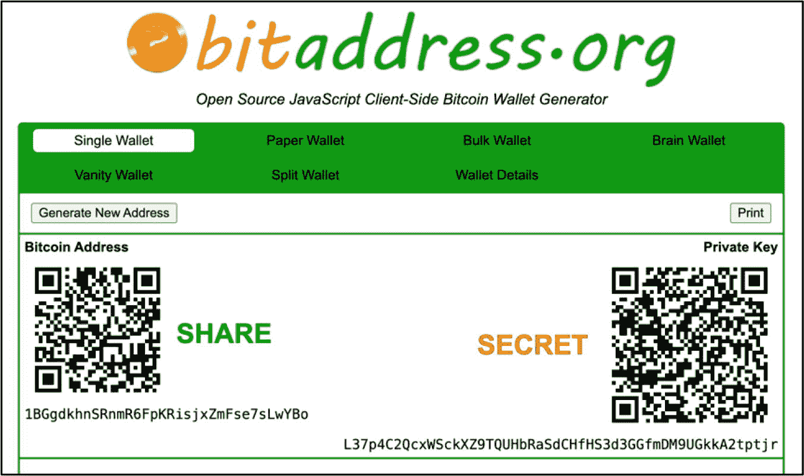
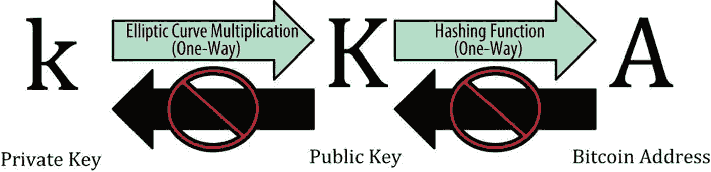
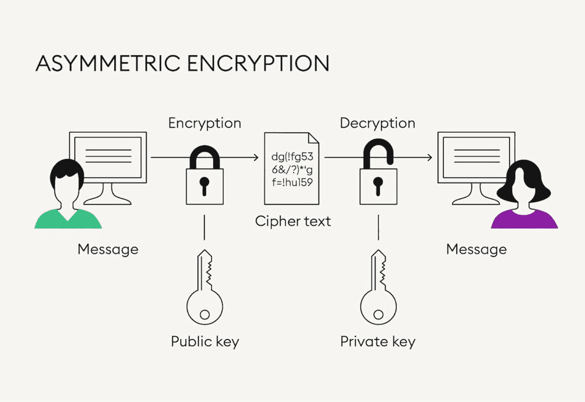
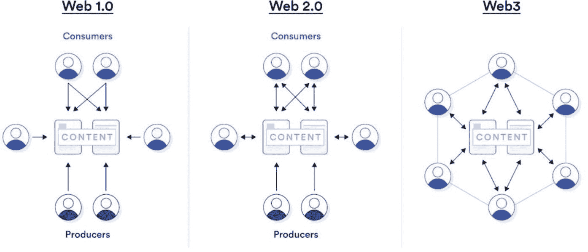

# 1. 区块链技术简介

根据伊姆兰·巴希尔在其著作《精通区块链》中的定义，区块链可以被描述为“一种点对点、分布式账本，具有密码学安全性、仅可追加、不可篡改（极难更改），且仅能通过节点间的共识或协议进行更新”。简单来说，区块链是一个不断增长的安全记录数据库，用于记录两个网络参与者（双方）之间发生的交易。这个数据库——称为分布式账本——按时间顺序记录数据区块，其中包含关于每笔交易被添加到区块链时的元数据信息，并在每个区块验证完成后进行记录。

**事实**

区块链是一种去中心化、不可篡改的数字记账系统，记录“谁拥有什么”，并随时间维护所有状态变更。

区块链是分布式账本技术（DLT）的一种类型。这种去中心化分布式网络可以是公开的或私有的，由存储电子信息的计算机（也称为节点）组成。这些节点相互协调、交互，以实现特定结果。存储的最常见信息类型是交易数据，例如发送方和接收方地址、资产类型、数量、价值以及交易时间和日期。区块链的任务和目标是以无需信任且安全的方式高效地收集、记录和传输数字信息。网络参与者通常包括任何与网络交互的人，例如发送方、接收方以及帮助验证和处理区块链上交易区块的“矿工”。

区块链的一个关键优势在于它运行在去中心化的点对点（P2P）网络上，无需任何中心化机构来协助资产或信息的转移。例如，参与者可以以少量费用相互发送数字资产（和信息），而无需银行、政府机构或第三方应用程序来帮助处理和保障交易安全。区块链上的交易可以在几秒到一分钟内从世界一端发送到另一端，而传统银行系统则需要一到三天。任何时候可以转移的数字资产价值没有上限。此外，与传统银行系统不同，无需解释资金来源、交易目的或资金接收方身份。不过，建议为了税务目的保留所有交易数据的记录。一系列在线软件可以帮助投资者完成此任务，例如 `CoinLedger`、`Koinly`、`TokenTax` 和 `CoinTracking`。

区块链技术的另一个核心方面和主要优势在于它以无需信任的方式运行，这意味着与典型银行不同，发送资产的参与者无需认识或信任那些在网络上验证和处理交易的个人（称为*矿工*）。这是通过*共识机制*实现的，矿工通过激励机制（通常以加密资产形式）就交易区块的有效性或无效性达成共识。

## 区块链关键特性

与许多刚进入加密领域的人可能认为的不同，区块链技术不仅仅是一种产生数字投资资产这种副产品的技术。区块链展现出若干关键特性，使其在当今世界中独树一帜且极具吸引力。以下各节将简要讨论这些特性。

### 去中心化

与传统中心化机构（如银行和政府）控制的账本或数据库不同，区块链分布在一组称为节点的计算机网络之上。网络中发起的每笔交易，无论是发送还是接收数字或其他信息，都在节点之间执行，而不依赖中心化机构。因此，网络无法被关闭，因为权力和责任分布在网络的所有节点上。此外，这还将共识参与分散到网络各节点，尽管影响力可能因共识机制（例如 PoW 中的算力）而异，这也有助于促进交易验证。

### 不可变性

不可变（Immutable）意味着某种永远不变或无法改变的事物。就区块链技术而言，不可变性指的是——一旦数据（交易或其他信息）被记录在区块链网络上，就无法被篡改、修改或删除。这是通过结合*加密哈希函数*和独特的共识机制来实现的，这些机制有助于保障区块数据的安全，并将区块以链式结构链接起来，因此得名“区块链”。区块越深，数据被篡改的难度就越大，从而使其具有高度安全性。然而，也存在一些罕见且不太可能发生的事件，例如 **51% 攻击**，如果黑客控制了网络中至少 51% 或更多的算力，他们就有能力篡改过往的区块数据。

### 透明性

区块链上的交易数据完全可追溯，一直追溯到创世区块——即区块链上记录的第一个区块。这反过来也创造了透明性，因为所有交易都是可见且可验证的，从而产生了高度的信任和完整性。

### 匿名性/假名性

区块链技术为网络参与者提供了*匿名性*和*假名性*。以隐私为导向的区块链，例如 `Zcash` (ZEC) 和 `Monero` (XMR)，提供完全的匿名性和不可追踪的交易，从而在网络中隐藏用户身份。与此同时，像 `bitcoin` 和 `Ethereum` 这样的区块链被归类为假名系统。在假名区块链上，所有交易都是公开且可追踪的，这意味着，虽然用户的身份没有直接暴露，但他们的公开地址通常可以与身份关联起来。另一方面，传统上银行既不匿名也不假名，因为用户的账户号与其身份直接关联。

### 可审计性

区块链中的可审计性指的是能够通过一个不可变的参考点，在链上验证和追溯每一条记录的交易。这个参考点被烙印在区块链网络中的每一个节点上，从而实现了精准的可追溯性。在任何给定的时间点，这使得公开区块链上曾经发生的每一笔交易都完全可审计，进而无需中央权威机构即可增强数据完整性和真实性的验证，从而在整个网络中促进安全与信任。

### 自主性

“自主性”（Autonomy）一词源于古希腊语，意为“自我立法”或“自我治理”。个人可以完全自我控制和自我治理，例如，他们的资产、身份、发言权、投票权等。通过区块链技术的核心特征，如去中心化、不可变性、安全性、可追溯性、透明性和隐私性，用户可以体验到自主性，从而消除了来自中央权威机构的任何要求、限制或控制。

## bitcoin（比特币）

`bitcoin` 是世界上第一个基于安全的、点对点区块链运行的数字去中心化货币支付系统，能够在无需中介的情况下实现去信任交易。由于 `bitcoin` 不受任何政府或法律实体的支持或管辖，它被视为近代史上最具颠覆性的创造之一。`bitcoin` 于 2009 年由化名为“中本聪”（Satoshi Nakamoto）的人创建，其定义是“一种纯粹的点对点电子现金版本，允许在线支付直接从一方发送到另一方，而无需经过金融机构。”

“bitcoin”这个词本身承载着许多历史。`bitcoin` 通常大写首字母 “B” 拼写。然而，使用小写字母 “b”（如在 `www.bitcoin.org` 上）意味着不存在任何能够或正在控制该网络的中心化实体。本书全文中 `bitcoin` 均采用小写 “b” 拼写。

`bitcoin` 的诞生并非偶然。它的出现源于一种迫切需求：摆脱对中心化权威机构和传统在线支付方式的控制，因为传统方式需要某种形式的金融机构来促成双方之间的任何交易。

### 事实

`bitcoin` 利用安全哈希算法（SHA）-256 为区块链上每个区块中存储的数据生成加密哈希。其工作原理是将区块中的数据转换为一个 256 位的十六进制数字。这个十六进制数字捕获并包含了所有交易细节以及与该链上前一个区块的连接。

除了经济利益之外，这些中心化金融实体的主要目的是解决“双花”问题，该问题源于计算问题，导致同一笔钱被花费两次。然而，`bitcoin` 出色地通过提供一个不依赖信任（与传统金融机构不同）的电子支付系统解决了双花问题。相反，`bitcoin` 使用密码学——一种密码机制，使得交易确认和通用账本（区块链）现金货币系统的维护成为可能。关于双花问题将在第 6 章“区块链架构”的“双花”部分进行更详细的探讨。

*注：本书全文中会引用 `bitcoin`，因为它是最广为人知的数字资产和最著名的基于工作量证明（PoW）的区块链。部分引用会涉及 `bitcoin` 的可扩展性问题，但这纯粹是为了提供背景信息，绝无贬低该资产之意。`bitcoin` 是一场技术革命，它通过引入一种去中心化、透明且安全的资产，成功地为全球人民带来了自主性和金融自由，从而彻底改变了全球金融领域。*

### 密码学

阅读本书的大多数人可能已经发送或接收过数字资产。然而，是在后台发生的事情使得这些交易成为可能——无需传统银行或第三方应用程序的帮助。区块链依靠加密算法和经济激励机制来确保每笔交易或状态变更的完整性和合法性。本节将逐步讨论非对称密码技术，包括私钥、公钥和公钥地址在加密过程中是如何被使用的。

`bitcoin` 自 2009 年就已开始流通；然而，其背后依赖的技术通过密码学领域已经酝酿了几十年。“*密码学*”一词源于希腊语，意为“秘密书写”。它是一门保护信息的科学，使信息对于拦截者而言无法理解，从而只能由接收方阅读和理解。密码加密有两种类型：*对称加密*和*非对称加密*。本书仅讨论非对称加密，因为它在区块链验证和身份机制中扮演核心角色，特别是通过公私钥密码学。然而，理解实现这一切的关键组成部分至关重要：*加密密钥*。

### 加密密钥

在密码学中，加密密钥是由一串字符组成的数字数据，用于加密算法中。它们在区块链中的主要用途是对交易进行数字签名并验证所有权，确保用户之间的数据完整性和真实性。区块链世界中使用的加密密钥类型包括**私钥**、**公钥**和**公钥地址**。本节将讨论加密密钥的创建、其核心功能及其用途。这也为非对称加密奠定了基础，后续章节将对此进行更详细的讨论。

## 私钥

私钥（也称为密钥）是一种加密变量，与算法结合使用，用于对交易进行签名并在区块链网络中证明所有权。对应的公钥用于验证该数字签名，确保交易已获得合法所有者的授权。公钥通过哈希过程派生出公开地址，用于接收资金，并且可以公开分享。在区块链技术中，私钥对于保护数字资产的访问权限以及授权链上操作至关重要。必须确保私钥的安全，因为任何获得私钥访问权限的人都可以控制关联的钱包及其内容。图 1-1 展示了来自 `bitaddress.org` 的图像，用户可以在其中以纸钱包格式快速生成一组加密密钥。

图 1-1

比特币私钥和公开地址的生成。公钥也在后台生成了（致谢 [`​www.​bitaddress.​org/​bitaddress.​org-v3.​3.​0-SHA256-dec17c07685e1870​960903d8f5809047​5b25af946fe95a73​4f88408cef4aa194​.​html`](https://www.bitaddress.org/bitaddress.org-v3.3.0-SHA256-dec17c07685e1870960903d8f58090475b25af946fe95a734f88408cef4aa194.html)）

**专业提示**

私钥应存放在只有所有者知晓的非常安全的地方——因此它才被称为私钥。如果不幸有人获得了你的私钥的访问权限，他们就有能力窃取你的所有资产。

私钥、公钥和公开地址之间的关系如图 1-2 所示。密钥的创建始于私钥（`k`）——`k` 是 key 的缩写——其中密钥是使用*密码学安全伪随机数生成器（CSPRNG）* 随机生成的。这些生成器通常由人为随机源初始化，可能会要求用户晃动鼠标几秒钟，直到生成器达到 100%——这就是图 1-2 示例中创建密钥的方式。

图 1-2

私钥、公钥和公开地址的生成架构（致谢 [`​www.​oreilly.​com/​library/​view/​mastering-bitcoin/​9781491902639/​ch04.​html`](https://www.oreilly.com/library/view/mastering-bitcoin/9781491902639/ch04.html)）

## 公钥

在非对称密码学中，公钥用于解密消息，因此只有个人才能使用对应的、密码学关联的公钥。公钥在交易处理（例如比特币交易）中也扮演着重要角色，用于帮助验证数字签名是否来自对应的私钥，从而验证发送者是在链上发送资产的合法所有者。

如图 1-2 所示，公钥（`K`）是使用椭圆曲线密码学（ECC）从私钥（`k`）创建和派生的，这是一种单向加密函数。私钥和公钥在创建时在密码学和数学上相互关联，使得一方能够与另一方进行安全通信和数据传输，而无需共享任何私密和秘密的细节，例如他们的私钥。

### 公开地址

公开地址可以等同于典型的银行账号。它用于接收数字资产。公开地址通常由任何想向你发送数字资产的人分享。但应谨慎行事，因为它可能被用于关联个人身份。

如图 1-2 所示，公开地址（`A`）（例如比特币钱包地址）是通过单向哈希函数从公钥创建和派生的。

## 非对称加密

*非对称加密*，又称公钥密码学，是一种用于加密和解密数据的加密方法。例如，Bob 和 Alice 都拥有一组公钥和私钥。如果 Bob 想向 Alice 发送一条解密后的消息，他会先用标准的可读语言（例如英语）输入消息。然后，使用 Alice 的**公钥**加密该消息，将其变成一种不可读的、杂乱无章的文本，称为*密文*。当 Alice 收到*密文*后，她用自己的**私钥**解密 Bob 的消息，从而将其转换回原始形式（英语）。需要注意的是，如果 Bob 丢失了他的私钥，他就永远无法解密 Alice 的消息。图 1-3 展示了一个非对称加密的示例——左侧是 Bob，右侧是 Alice。

图 1-3

非对称加密（致谢 [`​www.​bitpanda.​com/​academy/​en/​lessons/​what-is-asymmetric-encryption/​`](https://www.bitpanda.com/academy/en/lessons/what-is-asymmetric-encryption/)）

### 区块链中的非对称加密

区块链中的非对称加密并不像传统意义那样用于“加密”和“解密”数据。相反，非对称加密在区块链中的显著和关键优势在于引入了*数字签名*。数字签名利用非对称加密和素性检验来提供完整性，用于验证发送方是否是所发送资产（如比特币）的合法所有者。该技术广泛应用于各种协议的身份验证，并已被证明非常可靠和安全。

可以将数字签名想象成一个印章，在发送方将交易广播到网络之前，它能够证明并验证发送方是数字资产的真正所有者。在创建数字签名时，并不是直接对整个消息或交易数据进行签名。相反，*哈希函数*会生成一个消息的压缩且唯一的版本，称为*摘要*（或指纹）。这个摘要是由区块链协议定义的全量交易数据的哈希值。它包含了发送方和接收方的公钥地址、发送的资产、日期、时间、交易费以及其他相关字段等信息。然后，*摘要*会使用发送方的私钥进行加密，从而生成数字签名。

在花费数字货币（如比特币）时，发送方首先展示其**公钥**以及一个已使用其**私钥**加密的**数字签名**。该信息在整个比特币网络中传播，全节点会验证这个数字签名，以确认发送方有权转移资金。当这笔交易到达接收方时，会使用发送方的公钥来验证数字签名，从而获取对*摘要*的访问权限。然后，接收方使用与发送方生成*摘要*相同的哈希函数，从接收到的消息中创建自己的*摘要*。如果两者匹配，则签名被确认为真实有效，并表明该交易未被篡改。

这项独特的技术允许对消息进行签名、加密和验证，从而提供了高度的安全性。非对称加密还确保如果所有权无法验证，数字资产的所有权就无法被伪造、假冒或花费。这项技术不仅保障了交易安全，还通过使用所有者的公钥验证数字签名来确认所有权，使其成为用于数字签名和加密的一种独特、可靠且多用途的技术。非对称加密是区块链中一种不可被破坏、易于验证的基本要素。

### 密码学密钥回顾及其在非对称加密和典型比特币交易中的作用

#### 私钥的特性与功能

- 通过*密码学安全伪随机数生成器*（`CSPRNG`）随机生成。
- 对交易进行签名，可使用相应的公钥进行验证。
- *验证数字资产的所有权（通过数字签名）。*
- *提供对存储在区块链上的个人资金的访问权限。*
- *必须始终隐藏并安全保管。*
- *建议将私钥备份在一个安全可靠的地方。*

#### 公钥的特性与功能

- 利用椭圆曲线密码学（ECC）技术，*公钥*是通过椭圆曲线乘法从*私钥*数学推导得出的。
- *用于加密消息。*
- *矿工在交易处理和认证过程中使用公钥，以辅助验证数字签名是否来自对应的私钥。*
    - 在默认情况下，尤其是基础钱包界面中，公钥并不总是向钱包所有者显示，但它通常可以被访问或派生出来，特别是在分层确定性（HD）钱包和多重签名设置中。*在处理交易时，公钥会在幕后用于协助验证过程。*

#### 公钥地址的特性与功能

- 利用椭圆曲线密码学（ECC）技术，*公钥地址*是从*公钥*派生（哈希）得出的。
- *相当于用于接收数字资产的典型银行账号。*
- *通常是可见的，可以随意与任何想要向您发送数字资产的人分享。但需谨慎行事，因为它可能与个人身份信息相关联。*

## Web3

Web3 一词由 [加文·詹姆斯·伍德博士](https://en.wikipedia.org/wiki/Gavin_Wood) 创造。他是以太坊的联合创始人，也是 [Polkadot](https://polkadot.network/)、[Kusama](https://kusama.network/)、[Parity Technologies](https://www.parity.io/) 和 [Web3 基金会](https://web3.foundation/) 的创建者。伍德先生设想了一个透明且去中心化的互联网，它不受中心化实体控制，权力将交还给其合法的拥有者——用户。

Web3 可以被描述为一种新兴的互联网技术，其核心原则是去中心化。通过基于 JavaScript 的库（例如 `Web3.js`、`Next.js`、`Ether.js` 和 `Truffle Suite`）和 API（应用程序编程接口），Web3 架起了桥梁。它在区块链（包括智能合约、去中心化应用（dApps））和互联网之间建立连接。这使得所有权机会成为可能，并为所有 Web3 和网络参与者实现了无需信任的密码学安全交易。

### 网络的演变

要真正理解 Web3，有必要回到过去，探索 Web1 和 Web2 的主要概念、特性和局限性。

**图 1-4** – Web 1.0、Web 2.0 和 Web 上内容消费者与生产者之间的交互（承蒙 [`chain.link/education/web3`](https://chain.link/education/web3) 提供）

#### Web1

Web1，也称为“静态网页”，是互联网的第一个版本，存在于 1991 年至 21 世纪初。它旨在让读者群体更高效地访问信息、内容和事实。这是用户首次看到并体验全球数字网络。Web1 引入了三个基本概念，它们构成了当今互联网的基石。具体如下：

1. **HTML（超文本标记语言）** – `HTML`是用于结构化网页内容的标准标记语言。`HTML`代码通过 Chrome 和 Firefox 等浏览器被转换并在网页上直观显示。Web1 引入了`URL`，使用户能够通过在浏览器中输入网址来浏览网页。

2. **URL（网页唯一地址）** – `URL`仅仅是网络上资源和信息的在线地址。

3. **HTTP（超文本传输协议）** – `HTTP`构成了网络的基础，用于通过超文本链接加载网页。它是一种应用层协议，用于在网络计算机和服务器之间传输信息。

**事实**

第一个网页于 1991 年 8 月 6 日上线。它由[蒂姆·伯纳斯-李](https://www.w3.org/People/Berners-Lee/)创建，提供了关于万维网项目的信息，例如如何使用超文本访问互联网上的文档和数据。第一个网页的 URL 为：`https://info.cern.ch/hypertext/WWW/TheProject.html`

Web1 以点对点的方式运行，允许具备技术知识的个人在服务器上托管网页并将信息推送到线上——这一切都不受集中式实体的审查和控制。Web1 时代显示的是静态的`HTML`网页，这些网页无法被修改。用户只能通过网页浏览器搜索和查看在线信息；因此，它被归类为单向的“只读”网络。此外，在线互动几乎不存在，并且创建在线内容在技术上极具挑战性，使得其不便于用户使用。

尽管存在争议，但另一个问题是 Web1 协议是*无状态*的，这意味着`HTTP`协议默认不维护会话状态。像[cookies](https://policies.google.com/technologies/cookies%253Fhl%253Den-US)（用于实现用户识别、会话记忆和个性化体验）这样的功能是在后来才引入的，这使得早期的网络交互变得僵化且缺乏人情味。因此，不可能出现简单的“欢迎回来”消息，任何网站或应用程序上也不具备购物车功能或个性化设置。由于这些原因，开发者或创建者没有财务动机来构建我们今天所熟悉的平台或在线商店。这些因素，连同内容创建的技术障碍，导致了 Web 1.0 时代严重的内容生成挑战。

#### Web2

Web2，也称为“交互式网页”，由信息架构顾问[达西·迪努奇](https://en.wikipedia.org/wiki/Darcy_DiNucci)于 1999 年提出。Web2 代表了当今大多数用户所熟悉的互联网的当前版本。Web1 只专注于阅读，而 Web2 则转向了用户体验和用户生成内容（UGC），开启了一个用户互动、参与和贡献的全新世界——赢得了“读写”网络的称号。这创造了许多机会，生成了一个更具活力的互联网，用户既可以成为消费者，也可以成为创作者。

在 21 世纪初，由于能够使用`cookies`存储、分析和解读用户数据，Web2 随着亚马逊、微软、eBay 和谷歌等巨头而爆发式发展。因此，这标志着我们今天所熟知的互联网购物的开端。随着时间的推移，许多实体店因在线购物者的涌入而关门歇业。此外，通过 X（原 Twitter）、Facebook 和 Instagram 等社交媒体平台的诞生和发展，用户能够相互互动、创建内容，并在几秒钟内与世界其他地方分享。这些基于 Web2 的公司，从小型到大型，它们的创建改变了世界相互交流的方式。开发者现在成为了香饽饽，并拥有巨大的财务动机来为自己或其他公司构建网站、平台和应用程序。

Web2 见证了许多基本要素的引入和升级，这些要素帮助 Web2 蓬勃发展——具体如下：

* **JavaScript** – 它是一种脚本语言，使开发者能够实现复杂的功能，允许网页通过 API 和库显示和控制动态更新内容，例如多媒体、动画图像、交互式地图以及 2D/3D 图形。
* **层叠样式表（CSS）** – 它是一种易于设计的语言，帮助开发者对网站进行最后的润色，以增强网页的“外观和感觉”。这包括文本颜色、字体样式、布局设计、段落间距、列宽等。
* **HTML5** – 它引入了在用户设备本地存储数据的能力。这使得内容可以更快、更安全地交付，从而为网络用户和开发者提供了更流畅、更一致的体验。
* **HTTPS** – 它是一种用于保护用户网页浏览器与网站之间通信和数据传输的协议。尽管在 Web1 期间就已引入，但随着对安全在线交易和数据隐私需求的增长，`HTTPS`在 Web2 中被广泛采用。

尽管 Web2 为用户和公司带来了许多好处，但它并非没有缺点。随着 Web2 的发展，大型实体发现，通过根据客户资料和预设偏好向用户投放定向广告，他们可以留住更多客户。这引发了关于滥用用户数据的道德问题，以及对数据跟踪、数据所有权和用户数据审查泄露的担忧。总之，Web2 公司，尤其是大型科技公司，能够收集和利用个人用户数据以谋取经济利益。用户在出于特定目的在线输入数据后，对其数据没有控制权。

此外，由于基于 Web2 的用户数据存储在大型集中式服务器集群中，黑客攻击和数据泄露的风险也是一个主要问题。用户数据被以高价买卖，这使其极具价值，并成为黑客的目标。然而，即使明知存在数据泄露的风险，政府和权力实体仍然偏好集中化，因为他们可以干预、控制，甚至在不喜欢所见内容时关闭程序和网站。

像 Facebook、Instagram 和 TikTok 这样的集中式实体也有权力和控制力，在用户无意中违反内部社区规则后关闭用户账户。在大多数情况下，用户无法逆转这一决定。这也适用于集中式银行，用户的银行账户可能被暂停、资金被冻结或交易被取消。

## Web3

`Web3`，也被称为去中心化互联网，解决了与`Web2`相关的许多问题。将`Web3`视为一个对所有人开放、无需信任、无需许可的网络，它主要建立在三个核心元素之上：尖端计算、人工智能和去中心化数据网络。万维网发明者[蒂姆·伯纳斯-李](https://en.wikipedia.org/wiki/Tim_Berners-Lee)最初提出了`Web 3.0`，即**语义网**，他设想一个智能、自主、开放的互联网，利用人工智能和机器学习作为“全球大脑”，从概念和上下文层面处理内容。因此，`Web3`通常被称为“**读写执行**”网络，允许用户和机器在点对点网络上读取、写入和与内容交互，以促进更高效、自主和个性化的用户体验。这种网络交互和使用阶段将用户从`Facebook`、`Google`或`X`等中心化平台转移到去中心化、近乎匿名的平台。

需要注意的是，“`Web3`”一词通常被宽泛且不明确地使用。根据[牛津学习词典](https://www.oxfordlearnersdictionaries.com/us/definition/english/web-3-0%2523:%257E:text%253D%25CE%25B8ri%25CB%2590%20p%25C9%2594%25C9%25AAnt%20%25CB%2588%25C9%2599%25CA%258A%252F-,%252F%25CB%258Cweb%20%25CE%25B8ri%25CB%2590%20p%25C9%2594%25C9%25AAnt%20%25CB%2588%25C9%2599%25CA%258A%252F,more%20use%20of%20artificial%20intelligence)的定义，`Web3`被定义为“互联网发展的第三阶段，该阶段应当更加去中心化（无需中心化控制或中心化机构的许可），并更多地利用人工智能。”通常可以听到`Web3`被用来标记具有一定事实依据的去中心化应用程序（例如，`Web3 dApps`）。然而，更具体地说，`Web3`是新兴的第三代互联网，它利用`API`和基于`JavaScript`的库（例如`Web3.js`、`Next.js`、`Ether.js`和`Truffle Suite`（针对以太坊区块链））来建立区块链、`dApps`和互联网之间的连接。通过这种连接，区块链技术的去中心化优势得以发挥，`dApps`作为`Web3`技术的副产品（因此称为`Web3 dApps`），允许用户交互并利用这些优势。（注意——`Web3`，去中心化互联网，得到了这些库和`API`的大力支持，它们有助于简化和加速开发。）此外，这些库、`API`和区块链技术若没有互联网则无法运行。因此，这些技术的共同努力为更安全、透明和用户赋能的数字未来提供了门户。

### 去中心化

`Web3`通过利用分布式账本技术在网络中的多个节点上存储数据，从而偏离了传统`Web2`的中心化数据存储孤岛模式。这显著提高了安全级别，因为与中心化存储系统不同，在遭受攻击时，没有单点故障；因此，如果一个节点失效，网络不受影响。诸如`InterPlanetary File System`之类的协议通过促进点对点网络上的去中心化文件共享和数据存储，为去中心化网络做出了主要贡献。

### 无需信任

通过`Web3 dApps`，网络参与者可以相互发送和接收支付（原生币或加密代币），而无需像在`Web2`上那样依赖中心化银行系统或金融应用。此外，与传统银行不同，`Web3`以无需信任的方式促进区块链网络上的交易执行，这意味着发送方或接收方无需知道或信任验证交易的网络节点。

### 所有权和治理权

在`Web3`世界中，数字权利是其核心愿景中另一个基本方面。当个人在区块链上购买数字资产时，他们是该资产的合法所有者，并持有该资产的数字权利。数字权利（或所有权）在应用层实现，并由区块链协议支持，确保数字资产的受信任和经过认证的所有权。数字所有权通过附加到资产上的数字签名来表达，并存储在“`Web3 树τ`”（图 1-5）中——这是一个用于理解`Web3`结构和组织的概念框架。`Web3 树τ`强调了在应用层将*数字权利交换*集成到互联网协议中。

图 1-5

`Web3`基本组件：树、账本和云（摘自 Ahto Buldas、Dirk Drahiem 等人所著的“迈向`Web3`基础”）

如前所述，`Web3`的核心在于链上数字资产的所有权和数字权利概念。通过购买原生币、代币或`NFT`，用户可以访问功能、治理权或获得`Web3`协议、`dApp`或生态系统的权益——这取决于代币的设计。用户可以像拥有实物财产一样存储、控制和管理这些资产。与`Web2`（用户的个人数据被中心化实体利用以牟利）相比，`Web3`使用户能够拥有资产权利，从而持有权益并可能产生利润。此外，所有权已超越代币：`Web3`允许用户持有对视频、音乐、书籍、`NFT`艺术品甚至房地产的可验证权利，例如通过政府支持的地契`NFT`（如**迪拜土地局的`Prypco Mint`**）。用户可以通过`Web3`和区块链技术的力量掌控自己的数字生活。

数字所有权确立了个人在链上资产的所有权，并且也是去中心化决策过程（称为*`Web3`治理*）的组成部分。`Web3`治理可能会授予代币持有者投票权和公投参与权，但这取决于代币的设计——许多代币不提供投票权，且投票权重通常与持有或质押的数量成正比，而非平均分配。与传统的中心化系统（例如政府或公司等单一实体做出决策）不同，`Web3`项目依赖于更包容、公平、社区驱动和透明的决策方法。

### 无需许可

Web3 致力于实现无需许可的开源架构：任何用户无需获得中央机构的批准即可与区块链或去中心化应用（dApps）进行交互。若存在访问限制，这些限制也会透明地定义在智能合约代码中，或由 DAO（去中心化自治组织）投票决定，而非由平台所有者单方面强制实施。相比之下，Web2 应用可以随意撤销用户的访问权限。关于无需许可的区块链和开源软件的更多细节，将在第 6 章“区块链架构”中的“无需许可与许可型区块链”一节，以及第 12 章“项目代码库”中的“开源与闭源软件”一节分别讨论。

图 1-6 展示了 Fabric Ventures 绘制的网络演变过程。

图 1-6

网络的演变（致谢来源：[`medium.com/fabric-ventures/what-is-web-3-0-why-it-matters-934eb07f3d2b`](https://medium.com/fabric-ventures/what-is-web-3-0-why-it-matters-934eb07f3d2b)）

### 网络演变概要

从 Web1 到 Web3 的网络演变，标志着从静态页面（Web1）到交互式社交媒体（Web2），再到如今以去中心化、基于区块链的 Web3 的重大转变，其核心强调用户控制权和隐私。这种演变改变了我们与互联网、数据和资产交互的方式，更重要的是，改变了它们被控制的方式。表 1-1 总结了 Web1、Web2 和 Web3 之间最关键的区别。

表 1-1

各代网络的比较

| 网络演变 |
| --- |
| 方面 | Web1 | Web2 | Web3 |
| --- | --- | --- | --- |
| 分类 | 只读的静态网络 | 可读写的交互式网络 | 可读-可写-可执行，也称为可读-可写-拥有（通过数字资产和代币化，用户可以拥有部分网络） |
| 基础要素 | 静态网页（`HTML`、`URL`、`HTTP`） | 动态内容（`JavaScript`、`HTML5`、`CSS3`、`HTTPS`） | 去中心化、点对点分布式账本技术、区块链、人工智能（`AI`）、机器学习 |
| 目的/交互性 | 仅限信息；阅读文章、网页 | 社交网络、用户生成内容、电子商务 | 去中心化应用（`dApps`）、智能合约、元宇宙世界、所有权、自治权 |
| 系统架构 | 去中心化、自托管服务器 | 中心化服务器 | 去中心化基础设施、区块链、无需许可 |
| 货币/支付 | 无 | 通过数字处理商（`PayPal`、`Visa`、`Mastercard` 等）进行法定货币支付 | 原生数字货币和代币 |
| 自治权（数据/资产） | 灵活性有限，只能读取和下载数据。中心化实体控制资产。 | 创建、分享和分发内容——数据和资产由中心化实体控制。 | 用户数据的自我管理、自我身份和资产管理，无需中介即可进行交互 |
| 不可变性 | 内容易于被修改或删除 | 内容可被平台审核或移除 | 区块链上的不可变记录 |
| 审查制度 | 几乎没有审查制度 | 中心化平台审核——内容可被移除或限制 | 协议级别的抗审查性；任何封锁都必须通过代码编写或 DAO 投票 |
| 信任模型 | 信任网站所有者和自托管服务器 | 信任中心化实体、公司 | 去信任的共识算法 |
| 安全性 | 基本的安全措施，易受攻击 | 安全风险，单点故障 | 通过去中心化和共识机制增强安全性 |
| 可扩展性 | 由于成本和技术障碍，可扩展性有限 | 通过大型中心化存储集群增强可扩展性 | 通过分布式网络、第 2 层解决方案解决可扩展性问题 |
| 治理 | 由网站所有者或管理员控制 | 由中心化实体、公司和平台所有者控制 | 社区驱动治理，去中心化决策 |
| 隐私 | 无用户交互——隐私问题微不足道 | 中心化数据收集：隐私取决于平台——存在控制措施，但用户追踪很常见 | 通过密码学协议增强机密性和匿名性 |
| 变现模式 | 几乎为零 | 电子商务、订阅服务、影响者变现 | 代币化、去中心化金融（`DeFi`）、挖矿、质押 |
| 环境影响 | 影响微乎其微 | 数据中心导致能源消耗增加 | 能源消耗显著，但正转向更节能的共识机制 |

## 区块链应用

区块链提供的不仅仅是数字货币和新一类投资资产。区块链技术能够实现不可篡改、透明的交易，无需中央机构即可保障数字信息安全，从而在去中心化存储解决方案和点对点交互中建立信任。通过为交易、数据管理提供安全、去中心化的解决方案并营造去信任环境，区块链赋能企业提升效率，并探索在传统市场中不可能实现的创新产品和服务的新途径。这些创新建立在去中心化应用（`dApps`）之上，公众可以直接访问。

表 1-2 展示了当今世界区块链技术的一些核心且最受欢迎的应用。随着时间的推移，区块链的使用案例和应用会不断涌现。预计区块链技术将持续发展，从而催生出越来越多新的应用和使用案例。

表 1-2

区块链应用示例

| 热门区块链应用 |
| --- |
| 应用 | 描述 | 示例 |
| --- | --- | --- |
| 数字资产转账 | 用户之间进行点对点交易，发送和接收数字资产 | `bitcoin`, `Ethereum`, `XRP` |
| 钱包/密钥管理工具 | 存储私钥、签署交易并与去中心化应用连接 | `MetaMask`, `Trezor`, `Trust Wallet` |
| 数字支付 | 通过集成的支付应用为商品付款或实现法币 ↔︎ 加密货币兑换 | `BitPay`, `Lightning Network` |
| 数字身份验证 | 对用户凭证进行安全、去中心化的验证和真实性确认 | `KILT Protocol` |
| 智能合约 | 智能合约是存储在区块链上的数字合约，可自动执行链上协议、工作流程和金融交易，消除对中介或中心化实体的需求。 | `Ethereum`, `Solana`, `Binance Smart Chain` |
| 资产代币化 / 非同质化代币 (NFT) | 资产代币化是将资产（现实世界资产 RWA、知识产权等）的价值转换为数字代币（即非同质化代币 NFT）的过程。这有助于实现部分所有权，并提高流动性、可追溯性和可审计性。 | `Centrifuge.io`, `OpenSea`, `Dapper Labs` |
| 去中心化金融 (DeFi) | 一种利用区块链技术提供点对点金融服务、无需银行或其他中介的金融技术。真正去中心化的应用消除了对中介或中心化实体的需求。 | `Uniswap`, `Aave`, `Compound`, `Curve`, `MakerDAO` |
| 物联网 (IoT) | 物联网是指连接设备与技术的网络，可促进设备之间以及设备与云端之间的通信。与区块链技术结合后，物联网使这些设备能够将数据发送到私有（或公有）区块链网络，以创建不可篡改的共享交易记录。 | `IBM Blockchain` |
| 去中心化游戏与元宇宙 | 去中心化游戏和元宇宙生态系统利用区块链技术和智能合约，以去中心化的方式存储关键游戏数据，从而提供更高的安全性、隐私性、玩家控制权和公平性。 | `Sandbox`, `Star Atlas`, `Decentraland`, `Sorare` |
| 医疗健康 | 区块链技术通过提升患者数据的安全性、隐私性和互操作性来辅助医疗健康领域。这通过提供一种去中心化、防篡改的方法来记录交易、增强数据完整性，并在不同利益相关者之间简化流程而实现。 | `Akiri`, `MedicalChain`, `Avaneer Health` |
| 政府 | 区块链技术对政府多个领域产生积极影响，例如对外援助、执法、记录保存、薪资税征收、央行与政府智能合约，以及疫苗接种、贷款和学生补助金的追踪。 | `Ankr`, `Kaleido`, `Burstiq`, `Voatz`, `Follow My Vote` |
| 媒体 | 区块链技术解决了媒体行业许多痛点，例如数据隐私、版税支付和知识产权盗版问题。 | `Steemit`, `Open Music Initiative`, `Madhive` |
| 供应链管理 | 区块链技术通过提升透明度、可追溯性和效率、降低成本以及打击假冒伪劣和非道德采购行为，彻底改变了供应链管理。 | `Chain.io`, `DHL`, `Slync.io` |

