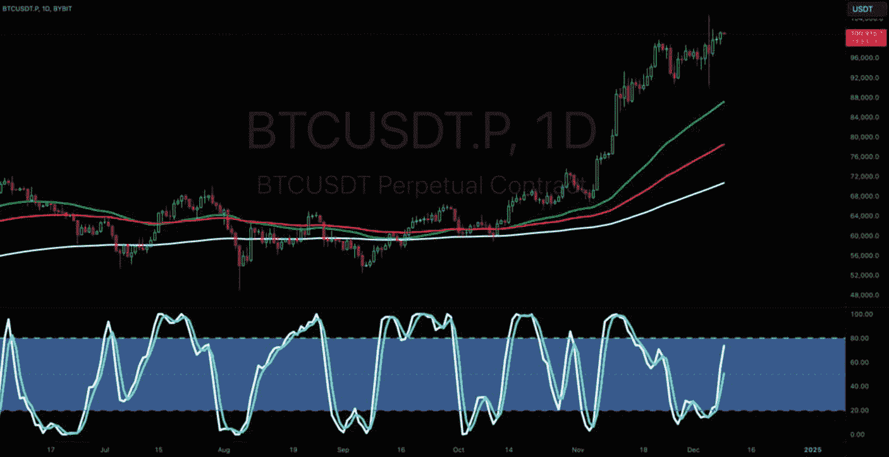
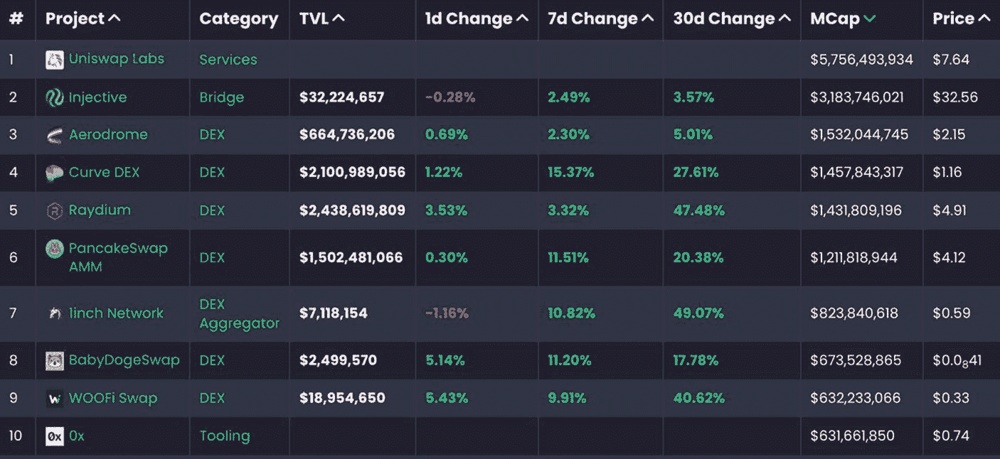

# 2. 投资数字资产

数字资产是以数字（二进制）格式创建和存储的资产，并以使用权或所有权的形式包含货币价值或个人价值。数字图像、照片、文档、视频和音频文件被视为“资产”，因为它们具有货币价值和个人价值。近年来，数字资产已扩展到区块链世界，引入了数字货币和各类加密代币。

数字资产是数字经济的重要组成部分，其管理和安全性对个人、企业和政府至关重要。在公有区块链上，每个代币化的数字资产都带有独特的链上元数据，使其易于被发现并可验证其独特性。此外，附加于代币化资产的任何使用权（例如复制、转售或用作 `DeFi` 抵押品）均由资产的法律所有者在链下设定，因此在不同司法管辖区有所不同。根据加密资产所授予的权限，持有者也可能有机会通过预设的治理结构在公投中投票。许多 `Web3` 去中心化应用要求用户持有其原生代币，才能使用应用内的许多功能和操作。例如，大多数 `DeFi` 去中心化应用要求用户购买并质押特定数量的代币，以便从 `DeFi` 活动中赚取收益，包括流动性挖矿、借贷或出借。另一方面，数字资产内置了限制，这些限制可能包括复制和共享限制、功能限制以及有限发行权限。

在区块链领域，诸如加密货币、币、代币和山寨币等术语常被误用。请参考以下解释以厘清概念。

1. **币** – 也称为加密货币或加密币，是 Layer 1 区块链的原生资产，作为在线支付的货币（数字现金），用于奖励矿工以及支付网络交易费用。
   - 示例：`ETH`、`BTC`、`SOL`

2. **加密代币** – “代币”常被误称为“加密代币”，它没有自己的原生区块链，而是在现有网络上创建——*通常基于 Layer-1 链，但代币也可部署在 Layer-2 解决方案上*。它们有多种用途，包括实用型、治理型、安全型以及非同质化代币（`NFT`）。这些代币用于与 `Web3` 去中心化应用进行交互。
   - 示例：`LINK`、`UNI`、`MKR`、`USDT`、`USDC`

3. **山寨币** – 山寨币，或称为替代币，是指比特币之外的任何其他加密货币（币）和区块链。该术语源于比特币是第一个区块链和加密货币，所有其他区块链都是比特币的替代品。

**事实：** 所有加密货币和代币都是数字金融资产，其所有权及所有权转让由加密去中心化协议保障。

## 为何投资数字资产？

人们投资数字资产的原因多种多样——期待价格升值、获取去中心化服务、实现投资组合多元化以及参与新兴技术。与传统资产类似，人们投资是希望资产价值上涨，从而产生利润。与传统市场一样，数字资产投资既有优势也有劣势。

### 数字资产投资的优势

投资数字资产作为一种另类资产类别，具有许多显著的优点，具体如下：

**访问权限与准入权利**

尽管潜在利润是标准的投资动因，但许多投资者购买数字资产是为了获得参与各种协议操作和功能的许可和访问权。这可能包括投票权，以帮助引导一个他们认为对自己或社区及经济大众有益的项目。除了单纯的财务收益外，其他动因还包括获得访问和参与权，以使用流行的 DeFi 金融工具，例如提供流动性、代币支持的抵押贷款以及借贷活动。

**创新与未来潜力**

从宏观经济的角度来看，区块链与数字资产被认为是一种独特的变革性技术，对包括银行、医疗保健、供应链和政府相关流程在内的许多行业都有积极贡献。因此，投资者的目光正转向数字资产，将其视为一种可能在不久的将来成为主流的另类投资。

**价值储存**

与传统市场中的黄金类似，许多数字资产投资者被其潜在长期价值储存和对抗通胀的能力所吸引。`bitcoin`通常被称为“数字黄金”。最近，`bitcoin`和其他流行的数字资产多次跑赢了黄金，但它们较高的波动性意味着其长期价值储存的优势仍存在争议。

**自主性**

自主性是自我治理、拥有独立性或自由的权利。许多人投资数字资产的愿望源于对其资产的直接所有权和控制权，且不受中介或中心化实体的干预。当资产保存在去中心化区块链上的自托管钱包中时，在没有持有者合作的情况下，当局从技术上难以没收这些资产；而由中心化或受监管的托管人持有的代币则不具备这种保护。因此，这为投资者的资金增加了一层个性化的保护。

**交易日与时间灵活性**

与传统市场不同，数字资产市场每周 7 天、每天 24 小时运行，提供了随时买卖资产的灵活性，包括周末和节假日。这使得交易者和投资者能够更快地对全球事件做出反应。

**无日内交易限制**

数字资产交易者无需在任何中心化或去中心化交易所拥有最低账户余额即可进行交易。另一方面，传统市场则适用“日内模式交易者”（PDT）规则。该规则规定，如果交易者在五个交易日内使用保证金账户执行了四次或以上的日内交易，并且这些日内交易数量占其同期保证金账户总交易量的 6%以上，那么他们需要在日内交易账户中维持至少 25,000 美元的最低余额。

### 数字资产投资的弊端

从数字资产投资中获益并非没有缺点。投资者必须充分了解相关的风险，这有助于他们做出更明智的投资决策。

**数字资产存储**

尽管具有创新性，但加密货币的去中心化特性也带来了重大风险，包括盗窃、诈骗，以及因忘记密码或设备被盗而导致的资金损失。出于安全顾虑、缺乏控制与隐私，以及中心化交易所（`CEX`）钱包带来的额外交易对手风险，许多投资者不愿将资金存放在那里。相反，许多投资者选择通过冷存储设备访问其资金，从而可以完全自主管理资产。虽然这种存储方法大大降低了网络攻击盗窃的风险，但个人有责任确保钱包访问代码的安全。如果没有采取适当的保护措施，且访问代码丢失、被盗或被错放，投资者很可能永远无法取回其资金。

**流动性挑战**

除了最大的资产之外，像`Ankr`（`ANKR`）或`Ocean Protocol`（`OCEAN`）这类每日交易量仅在 600 万至 1400 万美元左右的中型市值代币，在市场上出现大额订单时可能会面临显著的滑点。是否遇到流动性挑战，很大程度上取决于订单规模、下单的交易所，以及交易执行时对应的流动性提供情况。然而，作为一个一般经验法则，对于普通散户投资者而言，那些每日交易量低于 2000 万美元的小市值项目，在执行交易时可能会遇到滑点。

**缺乏监管**

截至本书撰写时的 2024 年，虽然取得了一些进展，但数字资产市场在很大程度上仍不受监管。关于强制执行监管将对数字资产市场产生积极还是消极影响，存在普遍的争论。受监管的数字市场的一个预期好处是减少欺诈、诈骗和市场操纵。目前令人担忧的问题是，欺诈者几乎可以不费吹灰之力地创建一个项目，并在未经任何形式官方审查的情况下，在一系列去中心化交易所上启动它。结果，许多投资者成为诈骗的受害者并损失了资金。因此，投资者具备识别和忽视诈骗项目的技能至关重要。

**高波动性**

与传统市场资产相比，数字资产市场波动剧烈，涨跌幅度极大。根据个人经验水平的不同，这可能导致巨额利润或巨额亏损。

**怀疑论**

尽管区块链技术有其基本的核心优势，但数字资产市场往往具有投机性，许多怀疑论者预测数字市场会出现泡沫和崩盘。出于这个原因，许多人不愿意投资数字资产。

## 投资分析

投资分析是一个全面的过程，也是一个用来概括各种投资评估方法的宽泛术语。这个过程涉及深入的研究，旨在帮助投资者根据许多关键因素（包括市场趋势、经济指标、财务数据、利润率、收益报告、入场价格、出场价格等）来确定一项投资可能的业绩表现。无论您是个人投资者还是顶级对冲基金经理，了解投资分析过程对于为所有资产类型（包括数字资产、股票、ETF、债券、大宗商品和房地产）做出明智的投资决策都至关重要。

**投资分析技术的关键目标**

*   确定某项资产对特定投资者的适合度。
*   预测资产的未来表现。
*   评估风险、回报、收益潜力和价格变动。
*   评估并制定整体财务策略。
*   评估资产相关性之间的关系。
*   竞争对手评估。
*   行业板块和经济趋势的评估。

### 数字资产投资分析技术

投资者使用许多不同的投资分析技术来评估各种投资资产。对于数字资产，有两种主要的投资分析技术：*基本面分析*和*技术分析*。尽管基本面分析和技术分析技术都旨在最小化风险并最大化利润，但每种方法服务于不同的目的，从不同的角度和视角分析投资。

请注意，技术分析不在本书的讨论范围之内。然而，建议投资者研究并学习技术分析的基础知识，因为它可以提供关于市场趋势、价格变动和交易模式的宝贵见解，有助于补充其基本面分析技能，并做出更明智的投资决策。

#### 基本面分析

`基本面分析`（FA）是一种投资者用来确定资产（如股票或数字资产）实际或“公允市场”价值的方法。其总体目标是判断资产的内在价值是高于还是低于其当前市场价格，以及基本面因素将对资产的未来价格产生何种影响。这是通过研究一系列基本因素来评估公司健康状况来实现的。例如，为了分析股票，投资者会研究公司的资产负债表、利润表和现金流量表，并结合公司所处的经济、市场、行业板块状况，以及其以营收衡量的财务表现。

**事实**
`基本面分析`是一种评估项目核心要素的技术，用于判断其当前价格相对于市场价格是被高估还是低估，并预测这些要素将对资产的未来价格产生积极还是消极影响。

#### 数字资产世界中的基本面分析

对区块链项目进行基本面评估是一个过程，包括检查项目的各个方面，以判断项目的基础价值——根据链上指标、代币经济模型和整体项目健康状况估算——是高于还是低于其当前每个币（或代币）的市场价格，并帮助预测其未来成功或失败的潜力。与股票市场不同，数字资产估值没有单一的公式（例如市盈率或贴现现金流模型）；分析师会权衡一篮子定量和定性指标，来判断一个代币看起来是被高估还是低估。鉴于数字资产市场高度波动和竞争激烈的特性，进行基本面分析对于实现长期成功和可持续性至关重要。

传统资产的基本面评估与数字资产投资的评估略有不同。传统资产的基本面评估侧重于财务和经济数据，包括财务报表、市场趋势以及其他可用于评估资产表现和增长潜力的可量化信息。然而，数字资产要素的基本面评估包括但不限于：代币设计、区块链架构（可扩展性、安全性、去中心化）、生态系统、监管、项目团队、社区参与度、路线图以及用于构建的编程语言。这种基本面分析还包括代币经济模型，该模型揭示了代币在生态系统中的角色和分配、对用户的激励机制，以及支持在利益相关者之间创造和分配价值的整体经济模型。

基本面分析是通过研究各种信息来源来实现的，例如白皮书、精简版白皮书、各种其他技术论文、博客文章、代码报告、项目网站、社交媒体、论坛和链上指标数据网站。表 2-1 概述了在加密领域评估项目时的核心基本面要素。

**表 2-1**
数字资产的核心基本面要素

| 关键区块链项目基本面要素 | |
| --- | --- |
| 评估指标 | 描述 |
| --- | --- |
| **项目文档** | 通过称为白皮书、精简版白皮书的技​​术论文及其他相关文件，表明项目的技术、财务和运营方面。这也提供了对项目透明度、承诺和交付成果的洞察。 |
| **核心产品** | 评估提供的核心用例、产品、服务和实际应用。概述了已解决的问题和相应的好处。 |
| **最终用户体验** | 评估产品或服务提供的功能性、可访问性和满意度。考虑平台满足用户需求的程度，并确保流畅直观的交互。 |
| **区块链架构** | 评估结构设计以及可扩展性、互操作性和去中心化的水平。评估其他架构要素，包括共识机制、治理设计以及公有链、私有链、联盟链和混合链。 |
| **代币设计** | 检查指导代币增值（奖励）给用户、验证者和核心贡献者的激励机制，以支持项目的长期可持续性和增长。 |
| **代币经济模型** | 评估供应机制、分配模型、解锁时间表、代币类型和标准。 |
| **财务指标** | 评估各种链上和链下财务指标数据，包括市值、流动性、交易量、转账量、活跃地址、转账量、哈希率、已实现市值等，以评估网络健康状况、活跃度和增长。 |
| **项目团队** | 分析团队在区块链领域的经验、专业知识、资质、过往记录和成就。 |
| **项目路线图** | 根据团队的愿景、计划的目标和里程碑评估项目路线图，以确定可行性和战略一致性。 |
| **项目代码库** | 评估项目的开发表现和开发者活跃度，包括 Git 代码提交、审计报告、未解决问题、开源软件许可、所使用的编程语言及其他相关指标。 |
| **激励与奖励** | 检查为开发者、验证者和用户提供的参与、互动或为网络或去中心化应用增加价值的激励和奖励。 |
| **社区与社交媒体** | 评估项目社交社区的参与度、受欢迎程度、版主质量及其他社交活动指标。 |
| **融资与合作伙伴** | 评估项目的资金来源以及其支持者（包括私人和机构投资者）的过往记录或声誉。对于公开发售，则审查关键因素，如代币定价、软顶和硬顶、公平启动和预挖模型。 |

#### 基本面分析的好处

评估加密世界中任何项目的核心基本面能带来诸多好处，包括提供有价值的见解，引导投资者做出更明智的投资决策：

1. **明智的投资决策** – 使投资者能够预测项目未来的生存能力和可持续性。
2. **策略与投资组合要求** – 使投资者能够确定哪些数字资产符合并与其策略和投资组合要求（例如，低至中至高风险投资）相匹配。
3. **比较分析** – 使投资者能够比较同一领域内具有相同用例和价值主张的竞争对手，以判断项目是否被低估。
4. **风险评估** – 帮助投资者了解所涉及的相关风险，如糟糕的用例、缺乏经验的团队、不切实际的里程碑、薄弱的合作伙伴关系以及将影响项目未来成功和稳定性的代码问题。
5. **消除欺诈性投资** – 进行基本面分析能显著降低，并且在大多数情况下完全减少投资于欺诈项目或骗局的可能性。
6. **独立研究** – 掌握自行开展研究的技能能使投资者利用第一手的、无偏见的信息做出投资决策。这能带来更明智和理性的决策，免受可能充斥社交媒体平台和网红内容的噪音和情绪波动的影响。

### 技术分析

技术分析（TA），也称为*图表分析*，是短期和长期交易者及投资者用来识别未来形态和交易设置的方法。TA 是通过分析历史数据（如价格行为和成交量）中的统计趋势和形态来实现的。交易者利用 TA 作为优势，来分析由供需决定资产价格的相反买卖力量。

有些人可能会认为，由于数字资产市场波动性极大，TA 的可靠性较低，因此认为它在交易量高、流动性强、正常运行的的传统市场中更为有效。这种说法有一定道理。市值较低的数字资产往往流动性差、交易量低。因此，即使是最微小的买卖力量也容易产生虚假信号，导致价格行为像过山车一样难以预测。然而，更受欢迎、知名度更高的数字资产通常具有更深的流动性，这使得它们不易受到极端波动的影响，从而提供更可靠的价格预测。此外，建议缺乏经验的交易者不要交易市值极低的资产；相反，他们应该仅为投资目的而进行扎实的基础面分析。

有成千上万的图表数据分析工具和指标，能够提供关于趋势和价格形态的深刻信息，帮助投资者发现潜在机会。[TradingView](https://www.tradingview.com/) 可能是最常见的价格行为分析平台，它提供最新的市场数据，包括报价、成交量和指标，以帮助交易者应对市场变动。日内和短线交易者经常使用技术分析来制定策略并把握买卖时机。图 2-1 显示了一个典型的 TradingView 设置，交易对为 `BTC/USD`。图表中显示了两个非常常见的指标：`指数移动平均线 (EMAs)` 和 `随机指标`。

**图 2-1**  
`BTC/USD` 走势图，叠加了指数移动平均线（`EMA`）50、100 和 200，以及 `随机 RSI` 指标（图表由 [`www.tradingview.com/x/JF5aL89N/`](https://www.tradingview.com/x/JF5aL89N/) 提供）

### 指数移动平均线 (EMAs)

`指数移动平均线 (EMAs)` 是一种技术指标，用于追踪金融工具在一段时间内的平均价格。顾名思义，移动平均线 (`MA`) 代表了基于所选 `MA` 时间长度的资产平均价格。然而，`EMA` 与 `MA` 略有不同，`EMA` 对最近的数据点赋予了更大的权重和重要性。例如，图 2-1 显示了三条 `EMA` 线：`200 EMA`（白线）、`100 EMA`（红线）和 `50 EMA`（绿线）。`50 EMA` 显示了基于过去 50 天的 `BTC` 平均价格，并且对接近当前价格的价格行为数据赋予了更大权重。`100 EMA`、`200 EMA` 以及所有 `EMA` 时间长度都遵循相同的结构——这就是为什么 `EMA` 通常被称为 *指数加权移动平均线*。

### 随机指标

`随机振荡器` 是一种动量指标，它将证券的特定收盘价与其在指定时间段内的价格范围进行比较。通过改变这个时间段或对结果应用移动平均线，可以调整振荡器对市场变化的敏感度。其目的是利用 0 到 100 的刻度范围，为超买和超卖状况产生交易信号。当振荡器信号进入 70 到 100 的区域时，资产被认为处于 *超买* 状态，这意味着动量更有可能向下转变，从而降低每个币的价格。相反，当振荡器信号进入 30 到 0 的区域时，资产被认为处于 *超卖* 状态，这意味着动量更有可能向上转变，从而提高每个币的价格。需要注意的是，`随机振荡器` 是一个反应性指标。反应性指标基于过去的价格数据来确认市场趋势，它不预测未来的走势，而是反映市场上已经发生的变化。

### 竞争对手分析

在撰写本书时，已有超过 16,300 个活跃的加密项目，导致在各个细分领域（包括去中心化金融 (`DeFi`)、区块链基础设施、非同质化代币 (`NFTs`)、元宇宙、物联网 (`IoT`)、游戏等）存在激烈的竞争。与传统公司一样，投资加密项目需要进行严格的竞争对手分析和审查。有些人可能会认为，由于加密货币市场缺乏监管且波动性大，这一点甚至更为关键。因此，在投资任何加密项目之前，进行竞争对手分析至关重要。

尽管创新和应用案例层出不穷，但市场上大多数项目都是对现有想法的某种变体。区分那些能增加实际价值的项目团队和那些生产与现有项目功能和技术完全相同的产品的团队至关重要。通常，这些模仿团队只追求短期收益，然后就会放弃项目。竞争对手分析的最终目标是确定某个特定项目是否比其竞争对手拥有显著的基础面优势，因为这将有助于降低风险并最大化利润。识别竞争对手并了解其优势和劣势，将使投资者能够根据项目的基本面和市场空白做出更明智的决策。

竞争对手分析将针对本书中讨论的每一个基础面要素进行。一旦你理解了某个特定类别的核心概念和基础原理，你就可以更有效地对同一类别中的项目进行持续评估和竞争对手分析。此外，当首次投资于某个类别（例如 `DeFi`、`IoT` 和基础设施）时，建议识别该特定类别中的领导者（按市值排序），并评估和研究它们为何是表现最好的项目。确定它们拥有哪些区别于其他项目的基础面特质。这将为您提供一个扎实的基础面根基，用以评估其他类似项目。例如，对于区块链基础设施项目（如以太坊、波卡和 MINA），有吸引力的基础面包括：按需扩展的能力、互操作性、交易处理速度、去中心化程度、治理机制、易用性、对开发者友好程度、社区关注度等。对于 `DeFi` 项目，理想的基础面包括：智能合约的可靠性、流动性、与其他生态系统的互操作性、安全性、强大的代币经济和可持续的收入模式、经验丰富且声誉良好的团队，以及来自知名天使投资和私募股权公司的资金支持。

**专业提示**
当一个新兴的区块链初创公司公开列出其竞争对手并说明其项目如何更优越时，这是一个好迹象。这种透明度可以建立信任，并直接解决投资者的任何顾虑。

### 如何识别和评估竞争对手

请按照以下行动步骤，在加密货币领域内识别、比较和评估竞争对手。

图 2-2 按市值排名的顶级去中心化交易所（DEX）（数据来源：[`https://alphagrowth.io/projects/top-dex-projects-on-all-by-market-cap-value`](https://alphagrowth.io/projects/top-dex-projects-on-all-by-market-cap-value)）

1. **识别竞争对手**
   有多种方法可以识别竞争对手，具体如下：
   1. 实时加密货币数据分析平台是最常见的识别竞争对手的方式；这些平台包括 `CoinMarketCap`、`CoinGecko` 和 `AlphaGrowth.io`。访问其中任何一个平台，并按类别进行筛选。例如，图 2-2 显示了来自 `AlphaGrowth.io` 的图片，其中包含了按市值排名的去中心化交易所（DEX）。用户还可以分析重要指标，如收入、总锁仓价值（TVL）、用户数量、交易量，以及 X（原 Twitter）、Telegram 和 Discord 的关注者数量——本书的相关章节将对这些内容进行讨论。
   2. 访问被评估项目的 Telegram 和 Discord 频道，并关键词搜索 "competitor"（竞争对手）——这有时能提供社区调研过的潜在竞争对手的额外信息。
   3. 查看项目白皮书，确认团队是否提及了他们的竞争对手。通常，团队会将自己的技术、功能和其他基本方面与竞争对手进行比较，并强调他们为何认为自己的产品更优越——当然，切勿假设他们就是正确的。务必自行研究。
   4. 记录一些按市值衡量的顶级竞争对手，以及分析过程中发现的任何其他重要发现。

2. **研究竞争对手**
   1. 根据先前生成的竞争对手列表，查看他们的网站和文档，特别是他们的白皮书。
   2. 扫描基本面信息，如产品用例、价值主张、架构、功能、团队、代币经济学等。*（注——本书将详细讨论这些基本面要素；进行分析时请参考相关章节。）*
   3. 访问 YouTube，搜索一些可信的影响者（即，具有明确专业知识、透明披露赞助、且一直保持高观众参与度的频道）可能对某些竞争对手所做的评测。请注意，尽管 YouTube 有所帮助，但你始终应通过自己的研究来验证其所提供的信息。

3. **项目对比**
   将竞争对手的基本面与你最初感兴趣投资的项目进行对比。如有帮助，可以在 Microsoft Excel（或同类软件）中创建一个表格，来分析在分析过程中发现的所有基本面数据。

4. **分析结果**
   1. 分析结果，以判断该项目是否仍然值得投资。也许它的某个竞争对手在基本面上表现更优？
   2. 根据以下问题进行评估：
      1. 是否有任何独特之处，或让人眼前一亮的特点？
      2. 是否有项目看起来像是复制品？那些完全复制其他项目且没有任何竞争优势或优势的新初创公司，不太可能取得长期成功和持久发展。
      3. 项目白皮书是否概述了其竞争对手？如果是，是否详细说明了项目计划如何超越它们？
      4. 该项目是否在以下方面优于其竞争对手：
         - 精密的架构（例如，模块化层、内置分片或原生 Rollup 支持）？
         - 先进的技术（将项目与最新突破进行基准比较——查看最新的白皮书、开发者论坛和路线图，了解它是否与时俱进）？
         - 附加功能和特性（例如，原生 AMM/订单簿、智能流动性路由、DAO 治理工具、可编程费用和奖励分配、无 Gas 交易、集成预言机）？
         - 激励机制（例如，可持续的收益、公平的费用回扣、为长期用户设计的奖励）？
         - 生态系统实力（完善的开发者工具和库、跨链资产桥、广泛的钱包/交易所支持、深厚的流动性）？
         - 其他优势因素（监管合规与许可、经过验证的安全审计、突出的合作伙伴关系以及整体品牌声誉）？

5. **做好笔记，以你自己的方式记录发现**

6. **将发现与基本面评估流程的其他部分相结合**

