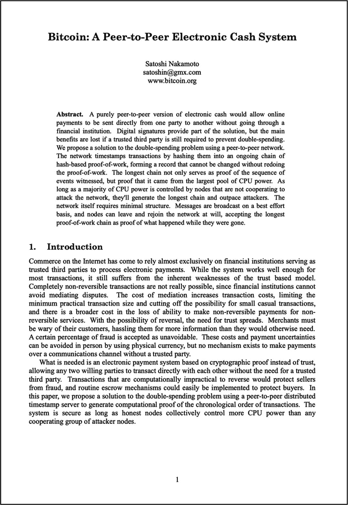
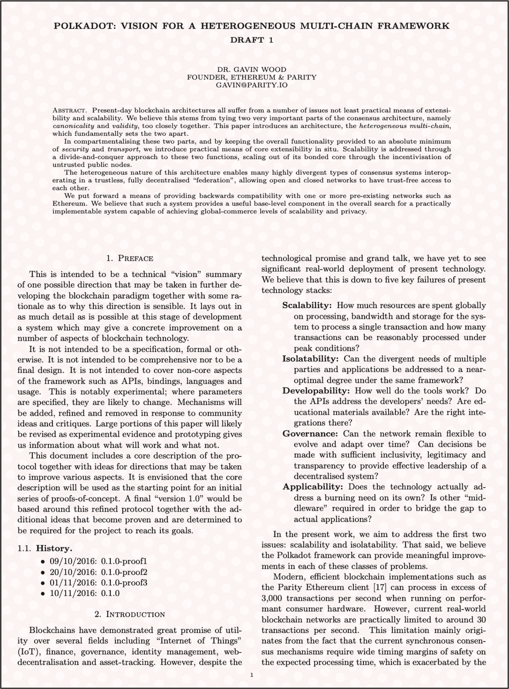
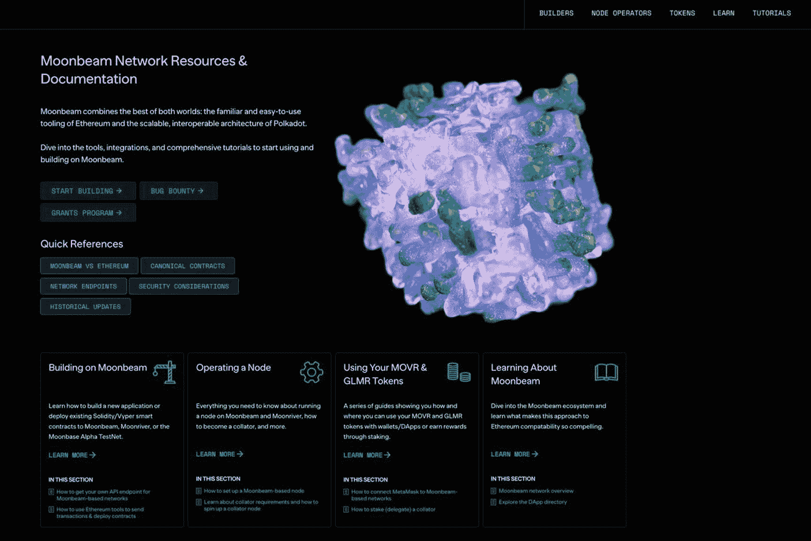
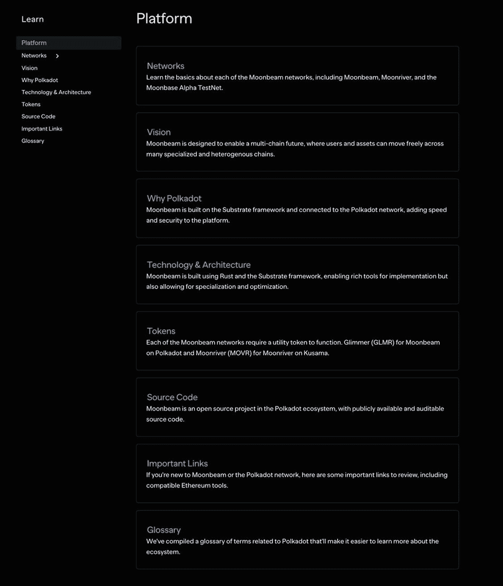
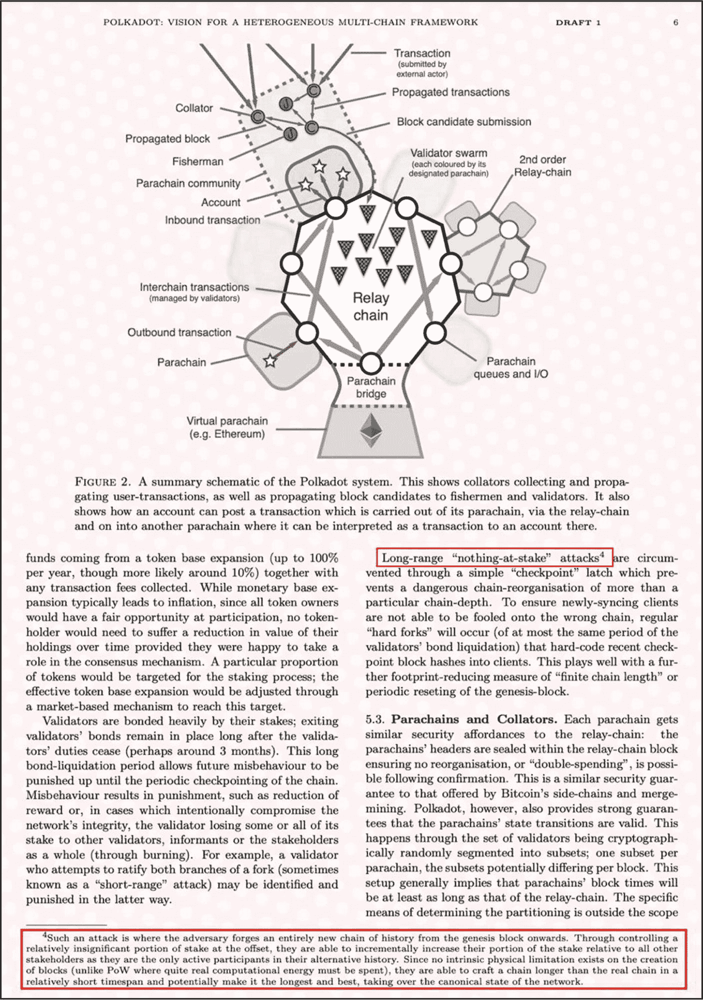
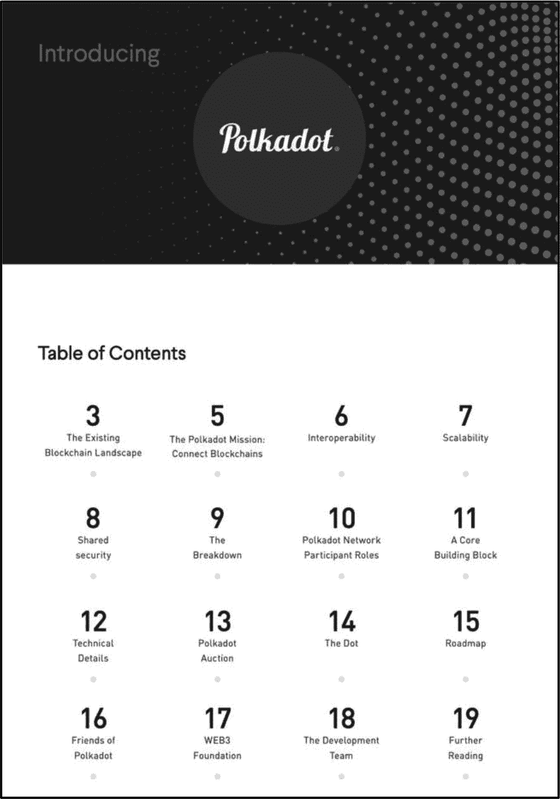

# 3. 项目文档

每个加密项目通常都有一套技术性和非技术性文档，其共同的主要目的是让利益相关者了解所提供的产品或服务、它解决的问题，以及使其成为可能的底层区块链技术和机制——可以将其视为一种信息性营销工具，从各个方面完整地描述产品。

本章讨论关键的项目文档，例如白皮书、精简白皮书和其他技术论文。投资者的总体目标是利用项目文档来帮助评估该项目是否值得投资。

许多不同类型的项目特定文档有助于描述和定义项目几乎每个基本方面。然而，白皮书是投资者在进行基本面评估时使用的最重要、最全面的文档。因此，白皮书以及精简白皮书——白皮书的简化和缩短版本——是本章详细讨论的两个主要文档。

尽管如此，熟悉其他技术性较强且不那么常见的项目文档（如 `Yellowpaper`、`Mauvepaper`、`Beigepaper` 和 `Flashpaper`）也是很有帮助的——见表 3-1。尽管像“黄皮书”这样的标题暗示了特定的颜色，但这些文档并不一定遵循那些配色方案，在大多数情况下，它们是标准的黑白封面。在大多数情况下，加密项目坚持使用标准的白皮书和精简白皮书，很少偏离其他技术论文。

**表 3-1** 区块链技术论文类型

| 区块链技术论文 | | |
| --- | --- | --- |
| 文档类型 | 目的/描述 | 示例 | 链接 |
| --- | --- | --- | --- |
| `Whitepaper` | 一份概述区块链项目愿景、技术和目标的综合性文档，作为其结构、目标和潜在用例的蓝图。此外，在融资轮次中，它也是向利益相关者推销的一部分。 | 以太坊白皮书 | [`https://ethereum.org/669c9e2e2027310b6b3cdce6e1c52962/Ethereum_White_Paper_-_Buterin_2014.pdf`](https://ethereum.org/669c9e2e2027310b6b3cdce6e1c52962/Ethereum_White_Paper_-_Buterin_2014.pdf) |
| `Litepaper` | 提供白皮书简化后的高级别摘要，更易于阅读和理解——因此，“精简”文档通常被称为“轻量白皮书”。 | 波卡精简白皮书：波卡简介 | [`https://polkadot.network/Polkadot-lightpaper.pdf`](https://polkadot.network/Polkadot-lightpaper.pdf) |
| `Yellowpaper` | 提供公司产品或服务的详细技术信息。 | 以太坊黄皮书 | [`https://gavwood.com/paper.pdf`](https://gavwood.com/paper.pdf) |
| `Mauvepaper` | 提供有关区块链项目架构的深入信息。紫皮书不如白皮书常见，但提供比白皮书更详细的见解。通常面向希望更深入理解项目技术和经济方面的高级用户或利益相关者。 | 星云链紫皮书：开发者激励协议 | [`https://www.nebulas.io/docs/NebulasMauvepaper.pdf`](https://www.nebulas.io/docs/NebulasMauvepaper.pdf) |
| `Beigepaper` | 米皮书是黄皮书的简化版本。 | 以太坊技术规范 | [`https://cryptopapers.info/assets/pdf/eth_beige.pdf`](https://cryptopapers.info/assets/pdf/eth_beige.pdf) |
| `Flashpaper` | 一份简洁的文档，快速呈现区块链项目的核心基础。它为那些希望快速了解摘要而不需要大量技术细节的读者提供高级别概述。 | Aave 经济模型 | [`https://docs.aave.com/aavenomics/flashpaper`](https://docs.aave.com/aavenomics/flashpaper) |

## 其他技术文档

项目也可能会酌情提供额外的技术文档。这些文档大部分是技术教程，指导开发人员如何运行节点、在网络之上创建去中心化应用程序（dApp）、进行 dApp 集成、设置 API、进行质押等等。大多数项目都会提供此类技术文档；然而，不幸的是，文档质量因项目而异。这些文档必须达到一定标准，使得开发人员能够在很少需要项目团队帮助的情况下轻松使用和遵循，因为有时后者的帮助效率极低，并且常常会阻碍项目的发展。问题在于，大多数投资者没有开发经验，因此很难评估此类文档。如果您发现自己属于这一类，请查看项目的开发者论坛——通常可从项目网站访问——了解总体情绪，以及是否存在许多关于文档质量的投诉。

## 白皮书

**评估目标**：评估项目白皮书，确保其合法性和质量，同时评估所提供产品或服务的潜在价值。

“白皮书”一词源于英国政府，最早的例子之一是[《1922 年丘吉尔白皮书》](https://en.wikipedia.org/wiki/White_paper)。这类文件是英国政府部门发布的一种立场文件或行业报告。“白皮书”一词本身源于其封面的颜色——当然是白色的。

第一份加密货币白皮书是比特币白皮书（图 3-1），由创始人[中本聪](https://en.wikipedia.org/wiki/Satoshi_Nakamoto)于 2008 年撰写。自那以后，成千上万份白皮书由区块链公司、独立开发团队、去中心化自治组织和个体开发者撰写，每份都声称其产品、服务或技术代表着未来。然而，作为投资者，至关重要的是要理解，无论一个投资机会看起来多么诱人，并非每个项目都能成功；事实上，相比于现存项目的数量，成功的项目寥寥无几。因此，剔除“噪音”和基本面薄弱的项目，对于识别高质量、有利可图的项目至关重要。

**图 3-1** 比特币白皮书第一页（承蒙 [`https://bitcoin.org/bitcoin.pdf`](https://bitcoin.org/bitcoin.pdf) 提供）

那么，白皮书到底是什么？白皮书是由项目团队生成的一份关键文档，为利益相关者提供与项目相关的技术性和非技术性信息。它界定了问题，更重要的是，提出了该问题的解决方案。一份白皮书包含最终定义整个项目及其所提供内容的关键方面，至少包括：核心目的、功能、用例、价值主张、设计与架构、代币经济学以及路线图。根据团队和项目的不同，有些白皮书比其他白皮书更详细、内容更丰富。

白皮书是一种战略性方式，用于呈现有价值、深入的信息，以满足目标受众的需求——解释项目的目的、技术和价值主张。此外，白皮书也是推广项目及其所提供价值的手段。例如，加密项目通常需要资金来将愿景和核心产品变为现实。白皮书在融资轮次中发挥作用，由项目团队向私募股权公司、机构、天使投资者和散户投资者——通过公开发行——展示，以帮助教育和寻求投资。白皮书是项目文档的主要参考点。通常可以通过项目的官方网站下载 `.pdf` 格式的文件找到它——这是迄今为止寻找白皮书最安全的地方。

> **事实**  
> 以太坊，一个智能合约平台，是白皮书的另一个绝佳案例——[`https://ethereum.org/en/whitepaper/`](https://ethereum.org/en/whitepaper/)

## 白皮书内容清单

一份高质量的白皮书将包含有价值的信息，详细说明产品或服务的目的、它正在解决什么问题、价值主张、技术、架构、代币设计、激励机制、团队、代币经济学、资金、归属时间表、路线图以及相关的法律考量。需要注意的是，项目路线图通常作为单独的文件发布，或者发布时间晚于白皮书。项目路线图将在第 11 章“项目路线图”中进行探讨。

以下是被标准要求应包含在每份白皮书中的内容清单。

1.  **产品/服务描述**
    1.  正在解决的问题
    2.  解决方案
    3.  如何运作
2.  **价值主张**
3.  **技术**
    1.  系统架构
    2.  区块链类型
    3.  共识机制/运作方式
    4.  浏览器详细信息
4.  **代币**
    1.  代币目的
    2.  代币类型/标准
5.  **代币经济学**
    1.  代币供应量
    2.  通胀/通缩/固定供应
    3.  代币分配详情
    4.  归属时间表详情
6.  **融资与合作伙伴**
    1.  种子轮、私募轮、首次代币发行和首次去中心化交易所发行轮详情
    2.  现有投资者名单
    3.  现有合作伙伴名单
7.  **奖励/激励措施**
8.  **路线图/愿景**
    1.  已完成的里程碑
    2.  未来里程碑清单
    3.  未来里程碑的时间表
9.  **法律法规/文件**
10. **参考资料/来源/脚注**
11. **免责声明**

## 白皮书的益处

白皮书是丰富的洞察来源，持续阅读它们可以在以下方面帮助投资者：

- **技术评估** – 白皮书提供了对核心项目基本面的洞察，帮助读者理解项目的关键方面。
- **技术知识** – 白皮书充满了技术见解——通常也包括经济或治理细节——可以显著扩展你的区块链知识。
- **投资决策** – 白皮书提供数据来帮助你评估项目，从而做出更明智的投资决策。
- **技术信心** – 你读的白皮书越多，就越容易理解。
- **识别诈骗项目** – 白皮书帮助你快速识别诈骗项目。
- **风险评估** – 白皮书描绘了项目所提供内容的现实图景，进而让投资者看到项目可能面临的关联风险、局限性和挑战。
- **新机遇** – 从白皮书中获得的新知识和理解，可以为你在区块链领域打开新的大门和机会。
- **比较分析** – 通过阅读多份白皮书，投资者可以根据项目目标、技术和策略进行比较。这种比较有助于识别关键差异点和潜在机会。

> **警告**  
> 白皮书是数字资产投资者唯一最关键的文档。至少，在阅读项目白皮书并了解你正在投资什么之前，不应进行任何投资。

### 白皮书风格

白皮书风格多样。有些白皮书只有几页，视觉化程度高，包含大量图片，阅读时间在半小时到一两小时之间。强烈建议不要投资制作此类白皮书的项目。它们很可能是骗局，要么用例极差，要么严重缺乏资金——无论如何，都不值得承担这种风险。

而在另一端，复杂的项目或价值巨大的项目通常会生成非常详细、冗长的白皮书，通篇充斥着大量技术术语。这些白皮书的篇幅从几页到上百页不等。这类白皮书通常包含许多新投资者可能不理解的技术内容，初看时可能显得有些令人生畏。然而，这种质量的白皮书提供了对基本面评估过程以及任何数字资产投资决策都至关重要的关键信息。投资者在分析白皮书时必须高度警惕。项目团队常常会在白皮书中添加大量“水分”来充数，唯一目的就是欺骗投资者，让他们误以为产品或服务比实际更厉害。这些“水分”通常包含比特币的历史、当前的区块链相关新闻、关于区块链技术的通用信息，或类似的不必要内容——这是一个危险信号。白皮书应当清晰、无废话，并严格聚焦于项目提供的产品或服务。没有任何例外。

`Polkadot Network` 是一个强大、先进的区块链网络。图 3-2 展示了`Polkadot Network`白皮书的第一页。

图 3-2

`Polkadot Networks`白皮书的第一页（图片来源：`file:///Users/paulgarvey/Dropbox/Mac/Downloads/Polkadot-whitepaper.pdf`）

最近，加密货币项目倾向于采用更专业、动态和视觉化的方式，而不是传统的白皮书格式。这样做的目的是为了高效地展示和更新基本面数据及通用项目信息。图 3-3 展示了`Moonbeam Networks`[技术文档](https://docs.moonbeam.network/)登陆页面的截图，其中展示了可供开发者、投资者和网络参与者使用的基本基本面数据，包括构建应用、节点设置、原生代币以及其他相关资源。

图 3-3

`Moonbeam Network`资源与文档（图片来源：[`​docs.​moonbeam.​network/​`](https://docs.moonbeam.network/)）

图 3-4 展示了 Moonbeam 的学习页面，任何人都可以在此研究项目的几乎任何方面，例如其网络、姐妹网络“Moonriver Network”、测试网、团队愿景、技术基础设施（包括所使用的编程语言）、原生代币、开源许可细节等等。

图 3-4

`Moonbeam Network`平台——基本面（图片来源：[`​docs.​moonbeam.​network/​learn/​platform`](https://docs.moonbeam.network/learn/platform)）

像`Moonbeam`这样的区块链网络在不断改进，添加功能和更新以跟上快速变化的环境，确保用户拥有流畅高效的体验。以传统的白皮书格式来实现持续更新和新功能开发是可行的，但对项目团队和最终用户来说效率都非常低——每次新的修订都可能给快速迭代的项目增加一层混乱，而速度较慢的网络可能可以接受定期更新。因此，像`Moonbeam`这样的项目构建一个能提供最佳用户体验、并持续更新信息的系统是合情合理的。

### 白皮书版本

根据项目的不同，一些传统白皮书可能会因项目持续更新而经历多次出版修订。随着项目的推进和技术的进步，白皮书的更新是必要的。然而，与`Moonbeam Network`这类在线的“动态”白皮书界面不同，传统白皮书需要更新实际的文档。当更新发生时，会发布新的白皮书出版日期，或者通过`Git`提交历史和发布标签来追踪变更。因此，在开始评估流程之前，务必确认你拥有的是正确且最新的白皮书版本。

当白皮书更新时，通常包含新功能、技术改进、治理模型和一般性增强等变化。但是，投资者应始终核实项目团队是否正在对核心基本面进行重大修改。这可能涉及到将核心产品或服务及其用例引向一个完全不同的方向，从而严重偏离最初的设计。如此重大的变更需要投资者进行彻底的研究，以确保团队对转向原因保持透明，并提供清晰、基于证据的理由，而不仅仅是追逐潮流。请注意，如果团队想要适应和调整其产品以顺应时代变化，这未必是坏事。然而，这些变化应伴有项目团队坚实合理的理由，清晰解释其原因。

### 白皮书脚注

脚注能够提升白皮书的可信度，作者可通过脚注引用来源、澄清术语、佐证观点，表明论点有充分的研究支撑。脚注的用途涵盖多个方面，包括定义术语、为数据/日期/统计数据提供依据、解释某个主题，或阐述有争议的观点。脚注位于页面底部的页脚区域，故得名“脚注”。图 3-6 展示了波卡网络白皮书中的一个脚注示例，该脚注解释了正文中以上标数字“4”标注的“‘长程’权益攻击”，如图所示。

图 3-6

波卡网络白皮书第 6 页的脚注（承蒙[`https://polkadot.network/whitepaper/`](https://polkadot.network/whitepaper/)提供）

由于脚注的字体通常比正文更小且更不引人注目，作者有时会在此处插入一些对项目团队有利、但对投资者不利的特定陈述。对于有数字资产投资经验的人来说，有些项目不够透明且不值得信任，这并不令人意外。因此，他们更可能将关键信息隐藏在脚注中，以规避法律风险。曾有一个案例，白皮书作者在脚注中写入条款，表明项目团队对项目资金拥有不受限制的控制权。投资者务必花时间阅读脚注，这能够节省大量时间和金钱。

### 阅读白皮书的最佳方式

对于那些已经*接触过*一份或多份白皮书的人来说，你可能同意，最初它们看起来令人望而生畏、内容密集、阅读复杂且难以理解。但请不要因此气馁。如同其他任何挑战一样，这只是一个暂时的障碍，时间和投入将助你克服。阅读白皮书必须从头至尾。你读的白皮书越多，那些“技术行话”对你来说就越容易理解。最终，你将获得快速识别关键信息和警示标志的能力，这些信息有助于区分成功的投资和失败的投资。

### 成为白皮书专家的小步骤

1. **每日坚持** – 承诺每天阅读几页白皮书——哪怕只有十五分钟。

2. **循序渐进** – 虽然这看似显而易见，但在未理解前一行或前一段内容之前，切勿跳到下一行或下一段。

3. **主动研究** – 在继续之前，在谷歌或 YouTube 上查找任何你不理解的内容。随着时间的推移，你的阅读速度会提升，一切都会变得清晰。

4. **标注要点** – 突出显示或记录关键要点或需要进一步调查的条目。

5. **持续学习** – 阅读关于区块链技术的书籍。伊姆兰·巴希尔的《精通区块链》是一本内容详实的著作，深入探讨了分布式账本、共识协议、智能合约、去中心化应用、数字资产等众多主题。

对于从未读过白皮书的人，建议阅读以下内容：

1. **比特币白皮书** – [`https://bitcoin.org/bitcoin.pdf`](https://bitcoin.org/bitcoin.pdf)

2. **以太坊白皮书** – [`https://ethereum.org/en/whitepaper/`](https://ethereum.org/en/whitepaper/)

3. **波卡白皮书** – [`https://assets.polkadot.network/Polkadot-whitepaper.pdf`](https://assets.polkadot.network/Polkadot-whitepaper.pdf)

建议从研究比特币、以太坊和波卡的白皮书开始，因为理解这些基础性文档，会使理解其他白皮书变得容易得多。这是因为这些白皮书共同提供了基础细节，并为理解其他许多区块链如何在分层架构、共识机制和验证流程方面运作奠定了基础。

### 行动步骤

请按照以下步骤评估项目白皮书，确保其合法性和质量，同时评估所提供产品或服务的潜在价值。

1. **定位白皮书**

   通过项目官网的官方链接找到白皮书。

2. **初步印象**

   阅读白皮书时，根据以下标准，你的第一印象是什么？
   1.  首先，项目是否提供了白皮书？（若未提供，则是一个警示信号。）
   2.  白皮书是否非常简短且充斥着图片，关于产品或服务的文字描述很少？（若是如此，请放弃评估。）
   3.  白皮书是否充满了作为填充内容的“废话”？（冗长、晦涩的解释和大量不必要的“空话”是重大警示信号。）

3. **产品或服务提供**

   根据以下标准，产品或服务的提供听起来如何：
   1.  白皮书是否在文档开头就立即阐述了产品、服务和价值主张的目的？如果是，目的是什么？
   2.  这个产品或服务听起来令人兴奋还是乏味？
   3.  你认为很多人会从所提供的产品或服务中受益吗？
   4.  你对这个项目的总体感觉如何？
   5.  它是否与众不同？
   6.  它有什么特别之处吗？
   7.  它听起来是否完全像你了解的另一个项目？如果是，这个项目有什么优势或竞争点？（如果有的话）
   8.  你认为它身上有什么因素会使其成功吗？

4. **白皮书质量检查**

   根据以下质量检查要点分析白皮书。
   1.  白皮书的布局是否便于读者阅读？
   2.  它的结构和格式是否专业？
   3.  白皮书的参考文献是否来自合法来源，如书籍、期刊文章、谷歌学术、知名作者等？（不可靠的作者和随机网站是警示信号。）
   4.  在白皮书的脚注中，是否存在可能短期或长期影响利益相关者的有害措辞？
   5.  是否有清晰、准确的标题和副标题？
   6.  是否存在矛盾或差异？
   7.  语法、标点和拼写使用是否正确？
   8.  使用的图片是否高质量？
   9.  页码是否标记得正确？

5. **做笔记并以你自己的风格记录你的发现**

6. **将发现与基础评估流程的其他部分结合起来**

#### 结果评估

白皮书的状况是衡量团队能力、对细节的关注度、产品潜力以及整体项目质量的绝佳指标。假设白皮书缺乏信息或质量低下，那么建议采取极其谨慎的态度，并认真重新考虑是否要继续进行其余的基础评估流程。如果项目没有白皮书，理想情况下你应放弃评估；然而，如果存在其他可验证的材料——如经过审计的智能合约代码、详细的 GitHub 架构文档或第三方安全报告——你可以继续，但必须更加警惕。

### 精简白皮书

**评估目标：评估项目的精简白皮书，确保其合法性和质量，同时评估所提供产品或服务的潜在价值。**

`精简白皮书` 仅仅是 `白皮书` 的简洁、轻松、简化版。它通常技术性较低，更易于理解，并且在大多数情况下，比 `白皮书` 短得多。`精简白皮书` 的目的是在短时间内向利益相关者提供一个关于项目基本价值主张的更易于消化的概述。

对 `精简白皮书` 的评估与 `白皮书` 非常相似，但在整体基础评分中所占权重较低。原因是 `精简白皮书` 本质上是模糊的，不应仅凭 `精简白皮书` 做出任何投资决策。尽管如此，如果项目提供了 `精简白皮书`，则应将其与 `白皮书` 进行对比，以进行技术一致性和质量检查。

需要注意的是，在项目生命周期的早期阶段，`精简白皮书` 可能是唯一可用的文件，因为 `白皮书` 可能仍在开发中。然而，这并不罕见——尤其是对于那些仍在完善其架构的项目——并且应向团队澄清这一点。强烈建议投资者不要根据 `精简白皮书` 进行投资——应由 `白皮书` 来决定。如果项目已启动，但未提供 `白皮书`，则建议不要投资。图 3-7 显示了 Polkadot 网络 `精简白皮书` 的*目录*截图。

图 3-7

Polkadot 网络精简白皮书（由 [`https://github.com/w3f/polkadot-light-paper/blob/master/Polkadot-lightpaper.pdf`](https://github.com/w3f/polkadot-light-paper/blob/master/Polkadot-lightpaper.pdf) 提供）

大多数项目都有 `白皮书` 和 `精简白皮书`。最佳实践是阅读这两个文件，并确认它们是否相互一致。同时，检查发布日期并确保你拥有最新版本也是很好的做法。寻找任何可能引发警示的矛盾之处。请记住，投资者应寻找理由来否定一个潜在的投资项目，而非寻找理由为其辩护。同样重要的是，要知道有些项目甚至可能没有 `精简白皮书`——这并非一个警示信号或需要担心的事情。与 `白皮书` 类似，路线图并不总是包含在内，并且很可能以单独的文件形式呈现。

尽管信息密度不如 `白皮书`，但 `精简白皮书` 通常会共享相同的标题和副标题，但这可能因项目而异。以下是 `精简白皮书` 的通用目录列表。

1.  **产品/服务描述**
    1.  *正在解决的问题*
    2.  *解决方案*
    3.  *运作方式*
2.  **价值主张**
3.  **技术**
    1.  *系统架构*
    2.  *区块链类型*
    3.  *共识机制/运作方式*
    4.  *浏览器详情*
4.  **代币**
    1.  *代币用途*
    2.  *代币类型/标准*
5.  **代币经济学**
    1.  *代币供应量*
    2.  *通胀/通缩/固定供应*
    3.  *代币分配详情*
    4.  *解锁时间表详情*
6.  **融资与合作伙伴关系**
    1.  *种子轮、私募、ICO、IDO 轮次详情*
    2.  *当前投资者名单*
    3.  *当前合作伙伴名单*
7.  **奖励/激励措施**
8.  **路线图/愿景**
    1.  *已完成里程碑*
    2.  *未来里程碑列表*
    3.  *未来里程碑的时间线*
9.  **法律立法/文件**
10. **参考文献/来源/脚注**
11. **免责声明**

### 行动步骤

请遵循以下步骤来评估项目 `精简白皮书`，确保其合法性和质量，同时评估所提供产品或服务的潜在价值。

对 `精简白皮书` 的评估与 `白皮书` 非常相似，但在整体基础评分中所占权重较低。原因是 `精简白皮书` 本质上是模糊的，不应仅凭 `精简白皮书` 做出任何投资决策。尽管如此，如果项目提供了 `精简白皮书`，则必须将其与 `白皮书` 进行比较，以进行技术一致性和质量检查。

*（注——如果 `白皮书` 是在 `精简白皮书` 之前评估的，则下面的某些评估检查可能已经执行过了。）*

1.  **找到精简白皮书**
    通过项目网站上的官方链接找到 `白皮书`。

2.  **初步印象**
    在阅读 `精简白皮书` 时，根据以下标准，你的第一印象是什么？
    1.  首先，项目是否提供了 `精简白皮书`？
    2.  该 `精简白皮书` 是否非常简短且充满图片，关于产品或服务的文字描述很少？（如果是，则放弃评估。）
    3.  该 `精简白皮书` 是否充满了“废话”作为填充内容？（冗长晦涩的解释和大量不必要的空话是主要的警示信号。）

3.  **产品或服务提供**
    根据以下标准，所描述的产品或服务听起来如何？
    1.  该 `精简白皮书` 是否在文档开头就立刻阐述了产品、服务和价值主张的目的？如果是，那是什么？
    2.  该产品或服务听起来令人兴奋还是乏味？
    3.  你认为很多人会受益于所提供的产品或服务吗？
    4.  你对这个项目的整体感觉如何？
    5.  它是否引人注目？
    6.  它有什么特别之处吗？
    7.  它听起来是否和你已知的另一个项目一模一样？如果是，这个项目有什么优势或胜人之处？（如果有的话）
    8.  你认为它身上有什么特质会使其成功吗？

4.  **精简白皮书质量检查**
    根据以下质量检查要点分析 `精简白皮书`。
    1.  该 `精简白皮书` 的布局是否便于读者理解？
    2.  它的结构和格式是否专业？
    3.  `精简白皮书` 中的参考文献是否来自合法的来源，例如书籍、期刊文章、Google Scholar、知名作者等？（不可靠的作者和随机网站是警示信号。）
    4.  在 `精简白皮书` 的脚注中，是否存在任何可能短期内或长期内对利益相关者造成损害的有害措辞？
    5.  是否有清晰、精确的标题和副标题？
    6.  是否存在矛盾或差异？
    7.  语法、标点和拼写使用是否正确？
    8.  使用的图片质量是否高？
    9.  页码编号是否正确？

5.  **做笔记并以你自己的风格记录你的发现**

6.  **将发现结果与基础评估流程的其他部分相结合**

#### 结果评估

虽然精简版白皮书（litepaper）的重要性不及正式白皮书（whitepaper），但仍建议检查其质量，确保全文信息清晰、准确、易于理解且质量上乘。如果项目团队没有精简版白皮书，也并不一定有害，因为许多优秀项目都没有提供它。

