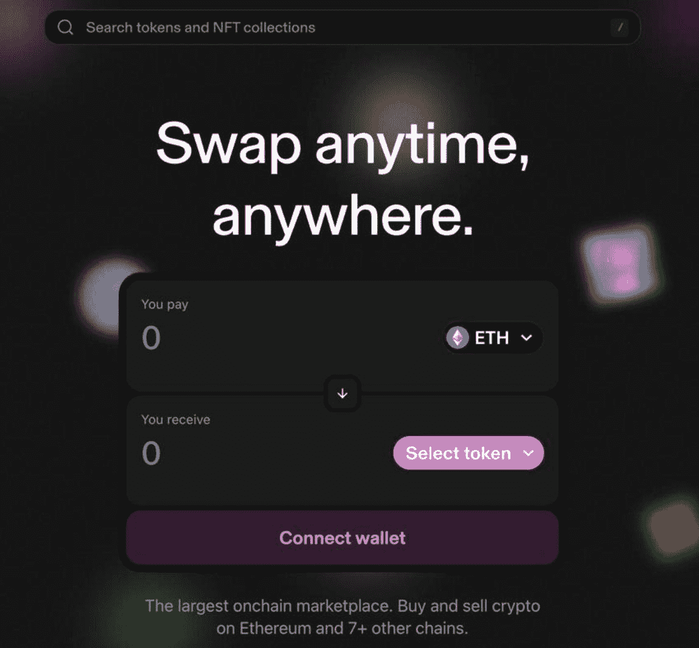

# 4. 核心产品

在区块链领域，核心产品指的是项目面向最终用户的主要产品或服务。该产品通过应用区块链技术开发，利用去中心化、安全性、透明度、不可篡改性和可追溯性等关键特性来提升其价值。

**事实：** 核心产品是项目区别于其他项目的关键，也是定义其价值主张，并吸引最终用户和投资者的关键要素。

与传统中心化公司一样，如果一个加密项目未能提供好的产品或服务，其长期成功的可能性几乎为零——就像与该项目相关的任何投资一样。因此，对核心产品、其用例（它能做什么）以及其价值主张（它提供了什么价值）进行彻底评估至关重要。

**本章讨论的基本概念：**
*   产品用例与价值主张
*   最小可行产品（MVP）
*   产品测试
*   主网上线
*   创立年份

## 产品用例与价值主张

**评估目标：** 确定项目是否拥有具备真实市场需求的有力产品用例和价值主张。

产品或服务是任何加密项目最关键的部分。可以将其视为汽车引擎；没有引擎，汽车无法移动；因此，对于任何需要从 A 点到 B 点的人来说，它都毫无价值。同样，一个缺乏有价值、实用产品的加密项目被认为是无用的。历史证明，尽管罕见，但也有一些例外情况。例如，表情包代币`DOGE`取得了非凡的涨幅，其价格完全由社区和像埃隆·马斯克这样有影响力的名人驱动——尽管该代币的用例主要局限于低额打赏和小额支付，相对于其市场价值而言，其内在实用性有限。

在撰写本书时，已有超过 32,600 个加密项目，拥有数百种不同类型的产品和服务。一些流行的产品类别包括去中心化交易所（DEX）、去中心化金融（DeFi）、物流/供应链、数字货币（例如比特币）、非同质化代币（NFT）、身份管理、去中心化游戏，以及用于构建去中心化应用（dApp）的去中心化区块链基础设施。

每个产品或服务都有特定的用例，以及从该用例中衍生的最终用户价值。“产品用例”和“价值主张”这两个术语经常被不准确地互换使用。尽管有相似之处，但这些术语具有投资者应明确区分的不同含义。为说明这一点，下面以去中心化交易所（DEX）应用 Uniswap 为例，对每个术语进行解释。

### 案例分析——Uniswap（产品/服务、用例和价值主张）

**产品（或服务）定义**
产品或服务是指使用区块链技术开发的任何应用、平台或技术。这些产品或服务旨在提供特定的功能或解决方案，通常利用区块链技术的优势，包括去中心化、透明度、安全性、不可篡改性和可追溯性。

**服务提供（Uniswap）**
Uniswap 是构建在以太坊区块链上的去中心化交易所（DEX）。Uniswap 采用自动做市（AMM）模型，允许用户无需第三方中介的介入或干预即可交换 ERC-20 代币。它还能满足那些需要快速、低成本、高效地推出其代币并具备充足流动性的项目需求。


*图 4-1 Uniswap 去中心化交易所界面（图片致谢：`https://app.uniswap.org/`）*

**用例定义**
用例是指产品（或服务）可以被使用的具体情境以及使用方式。换句话说，即为了解决最初的问题，执行了哪些特定的功能和任务？

**用例（Uniswap）**
Uniswap 有多个用例，包括：
*   **数字资产交易** – 在 Uniswap DEX 上，数字资产持有者可以以去中心化的方式相互交换数字资产（币、代币、NFT），无需任何第三方中介的干预。
*   **流动性挖矿** – 在 Uniswap 界面中，用户可以通过将`ETH/USDT`等代币对（或币种）存入与其他流动性提供者（LP）共享的流动性池，来为资产交易者提供流动性。作为提供流动性的回报，这些流动性提供者（LP）将赚取该池产生的交易费。
*   **数字资产发行** – 项目团队和个人可以在 Uniswap 的 DEX 上发行 ERC-20 代币，并为所需的交易对提供即时流动性。这对项目很有吸引力，因为其上市流程简化、能获得即时流动性和交易，且上市成本低。

**价值主张定义**
产品的价值主张定义了其为最终用户提供的独特价值。它关注的是吸引诱最终用户使用该产品或服务的特定因素。价值主张因项目和最终用户需求而异。此外，产品提供的价值水平与其吸引的投资水平密切相关——其交付的价值越大，可能获得的投资就越大。

**价值主张（Uniswap）**
Uniswap 通过以下方式提供价值：
*   **无限制的去中心化交易** – Uniswap 的核心价值在于其自动做市（AMM）模型，这允许全球任何地方的人交易数字资产，而无需受通常束缚中心化交易所的基于协议的国家/地区限制——尽管官方 Uniswap 前端可能会对某些司法管辖区的用户进行地理围栏限制。
*   **代币发行** – 与无限制交易类似，项目方可以在 DEX 上列出（即为其添加流动性）其 ERC-20 代币，而无需中心化第三方的干预。
*   **收入分享提案** – 通过 Uniswap 的治理“收入分享提案”，所有质押并委托其`UNI`代币的人将获得协议从交易费中赚取的部分收入作为奖励。这一服务为所有`UNI`代币持有者提供了额外的价值和直接的经济激励。

总之，产品（或服务）是指使用区块链技术开发的应用、平台或技术；用例是产品的使用方式；而价值主张则是为其最终用户提供的独特价值。

### 产品用例、价值主张及相关市场需求

产品的用例是最关键的方面之一，其运行方式直接影响项目的长期成功与存续。然而，强大的用例必须源于真实的市场需求，确保项目团队提供的产品合法且与市场相关。产品必须存在需求；否则，它将无法获得发展动力，因此投资也无法得到合理解释。当产品提供了一种符合当前市场需求的、强大且设计精良的用例时，它将成为关键的增长驱动力。

虽然一些加密项目确实致力于解决现实世界的问题，或使现有流程更高效，为企业节省时间和金钱，但其他项目并非如此。事实上，大多数加密项目都以失败告终，并成为遥远的记忆。推出一个产品质量低劣，甚至更糟，承诺根本不存在产品的欺诈性加密项目相对容易。这些用例不佳或诈骗项目背后的个人，其目标是通过华丽的营销、误导性的声明和虚假承诺来引诱投资者，从而获取他们的资金。一旦投资完成，热潮消退，项目团队就会带着投资者的资金销声匿迹。最终，投资者手中的数字资产变得一文不值，或者每个代币或硬币的价值仅剩初始价格的一小部分，价格几乎不可能回升。

### 评估产品用例、价值主张及相关市场需求

产品及其用例是加密项目的核心；没有它们，项目就没有价值，也没有投资理由。因此，投资者有责任进行充分的研究和核查，以评估产品及其用例，确保其合法性、市场需求以及对潜在用户或投资者的吸引力。

表 4-1 展示了波卡网络和一个名为“MysticMania”的虚构（虚拟）项目，并根据各自的产品用例对两者进行了评估。该评估旨在确定其产品用例是否强大、合法、能提供实际价值并具有市场需求。建议投资者使用此评估流程，或为相同目的和要求生成类似的系统。分析所需的大部分基本信息可以在项目白皮书、项目官网、相关官方博客文章、实时加密货币数据以及 `CoinMarketCap.com` 上找到。`CoinMarketCap.com` 是一个受欢迎的实时数字资产市场数据平台，许多投资者依赖它获取准确、可靠的信息，例如数字资产价格追踪和交易所数据。`CoinMarketCap` 被广泛用作研究工具，帮助识别新的潜在投资机会。如需最新教程，请访问 `CoinMarketCap` 的官方 `YouTube` 页面：[`https://www.youtube.com/watch?v=l65M98Vaa5I`](https://www.youtube.com/watch%253Fv%253Dl65M98Vaa5I)。

**表 4-1**

**Polkadot 与 MysticMania（虚拟/虚构项目）的产品用例、价值主张及市场需求分析**

| 产品用例、价值主张与市场需求评估 |
| --- |
| 评估指标 | Polkadot 网络 | MysticMania（模拟项目） |
| --- | --- | --- |
| ***产品或服务*** | 一个开源的 Web3 去中心化、多链、可扩展基础设施，支持创建、运行不同的区块链并实现它们之间的相互通信。 | 一个去中心化的加密钱包应用，用户通过 dApp 保护其数字资产，并因此获得原生代币激励。 |
| ***用例*** | 区块链创建与运行：使用户能够利用 Polkadot 的平行链框架来构建、启动并运行定制的、稳健的、去中心化的区块链，以满足客户的需求和要求。 | 仅提供奖励不被视为一个用例。 |
| **用例是否提供实际价值？如何提供？** | 是。**互操作性** —— 在其平行链网络、姐妹链 Kusama 及其他区块链生态系统内具有高度的互操作性，显著提升了终端用户的价值。**可扩展性** —— Polkadot 具有高度可扩展性。这是通过经济和交易的可扩展性实现的，具体方法是使用一组共享的验证器来保护多条区块链，并在这些并行区块链之间分配交易，从而高效处理高交易量并保持费用稳定。此外，一项名为弹性扩展的即将推出的扩容升级仍在开发中，它将允许平行链在每个中继链区块内生成并验证多个区块，一旦部署，便能实现更高的吞吐量和更快的交易处理速度。高度可扩展的区块链能够通过更快、更便宜的交易提升整体用户效率，为整个生态系统贡献价值。**治理** —— Polkadot 采用精密的链上治理方法，网络的所有利益相关者直接在区块链上做出所有决策。`DOT` 代币是 Polkadot 治理结构的核心，使 `DOT` 持有者能够直接与社区提出的提案进行交互。Polkadot 链上治理的三个机构分别是 `DOT` 持有者、理事会和技术委员会，它们相互协作，确保网络的秩序、高效决策与发展。 | 否。仅提供奖励不产生任何价值。很多项目都标配提供奖励。 |
| **解决了什么问题？** | Polkadot 网络解决了困扰去中心化区块链的诸多问题，包括缺乏互操作性、可扩展性问题、高能耗、安全问题以及糟糕的链上治理结构。 | MysticMania 没有解决任何问题。 |
| **该问题能否使用传统中心化方法而非区块链技术解决？** | 不能。Polkadot 用户追求的是中心化系统无法提供的去中心化优势。这些优势包括无需信任的区块链运行、高安全性（无单点故障）、透明性、开源、匿名性、高可用性，以及通过去中心化治理减少腐败和官僚负担。 | 可以。传统的银行和第三方金融应用提供具有相同目的的生息账户。 |
| **该用例是否足够强大以吸引用户或客户？** | 是。市场对强大的区块链基础设施有很高的需求，用户可以在其上构建自定义区块链。自 2020 年上线以来，Polkadot 网络的受欢迎程度逐渐增长，许多客户为了赢得 Polkadot 的一个平行链插槽而展开竞价战。 | 否。MysticMania 没有有效的用例。其他项目在提供奖励作为标准实践的同时，也提供了合法的用例。 |
| **具有类似产品用例的其他项目在 CoinMarketCap.com 上是否有高市值？** | 是。这是一个流行且需求旺盛的产品用例。在 CoinMarketCaps.com 按市值排名的前 100 个项目中，有许多其他基于基础设施的项目，其中包括 [以太坊](https://ethereum.org/en/)、[Solana](https://solana.com/)、[Injective Protocol](https://injective.com/)、[Near Protocol](https://near.org/)、[MINA Protocol](https://minaprotocol.com/) 和 [BNB Chain](https://www.bnbchain.org/en)。 | 否。无法比较，因为大多数项目都标配提供奖励。 |
| **基于区块链或 dApp 的解决方案对此问题是否有意义？** | 是。没有区块链技术，就不可能实现一个具有明确用例并能提供相同价值的去中心化基础设施。 | 否。提议的用例可以通过传统银行系统实现。 |
| **产品用例是否增加了区块链生态系统的价值？** | 是。Polkadot 平行链与其他生态系统（包括通过 [Moonbeam 网络——以太坊虚拟机（EVM）](https://docs.moonbeam.network/learn/features/eth-compatibility/) 连接的以太坊）之间的高水平互操作性 / 生态系统间流动性增加和资产转移 / 完全的链上治理。 | 否。未对生态系统贡献任何价值。 |
| **该用例是否足够坚实，能让公司取得长期成功？** | 是。可以在 Polkadot 上构建许多项目。Polkadot 仍然是最先进的基础设施之一，未来前景光明。 | 否。提议的用例不提供任何价值；因此，项目成功的可能性非常低。 |
| ***结论*** | *复杂、去中心化的基础设施，具有有效的用例，为用户和整个区块链生态系统增添了巨大价值。* *高市场需求* —— *解决了真正的问题。* *Polkadot 网络是一个独特的去中心化基础设施，值得进行持续的基本面评估以确定其投资潜力。* | *一个通过 dApp 钱包以奖励形式激励用户持有数字资产的项目。不提供价值——接收奖励不是一个用例（需要提供某种功能或服务来提供某种形式的价值）。* *无市场需求 —— 没有解决任何问题。* *MysticMania 并不独特，也不值得投资。* |

### 行动步骤

遵循以下行动步骤来确定项目是否具有强大的产品用例、价值主张和真正的市场需求。

1.  **研究产品用例和价值主张**
    阅读项目的白皮书、博客文章、公共代码仓库（例如，`GitHub` 提交历史）以及项目网站上的任何其他相关技术信息，以充分了解产品用例和价值主张。这一点至关重要，因为它为后续基本面评估过程奠定了基础。如果需要澄清或更多信息，请联系项目团队。

2.  **评估产品用例和价值主张**
    以表 4-1 为模板，评估项目的产品用例和价值主张。

3.  **做笔记并以你自己的风格记录你的发现**

4.  **将发现与基本面评估过程的其他部分结合起来**

### 评估结果

避免投资于任何未能提供能产生实际价值且具有真实市场需求的强大产品用例的项目。虽然最初的炒作可能会或可能不会产生短期利润，但该项目最终注定会失败。

```