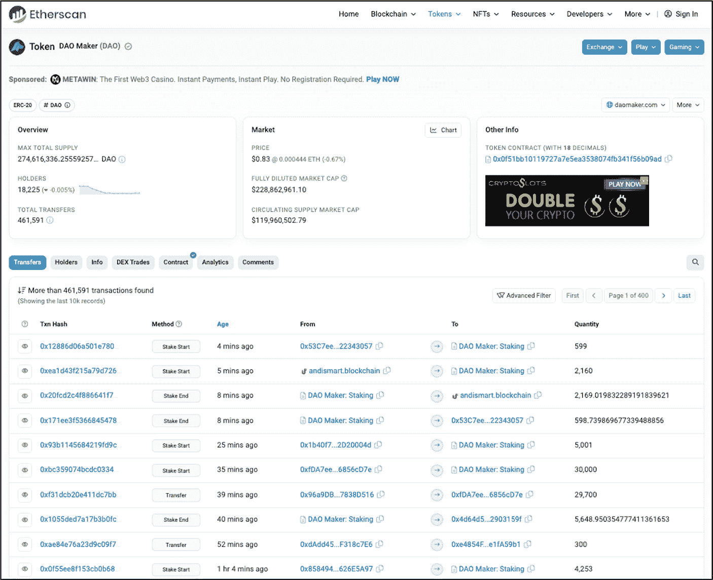

# 区块链浏览器

区块链浏览器——或称`区块浏览器`——是一种基于网页的工具，用于实时查看和追踪区块链上的交易数据，包括地址、代币、智能合约、源代码、钱包地址、价格及其他活动。大多数人主要使用区块链浏览器来检查特定交易的状态，例如待处理、未确认或已确认。开发者出于多种原因使用区块浏览器（尤其是测试网区块浏览器），包括验证交易和区块数据，例如元数据、燃料费、燃料限制、区块确认数、交易时间以及其他杂项数据。

每个独特的区块链基础设施通常提供一个主网区块浏览器，外加该链所运行的每个测试网的独立浏览器。所使用的浏览器类型取决于区块链项目开发的当前阶段。例如，当区块链仍在开发中时，所有交易都在测试网上进行，并在测试网区块浏览器上验证。另一方面，当开发和测试阶段完成后，所有线上交易都在主网上进行，并使用主网区块浏览器进行验证。在主网上线后，开发者可能会继续利用测试网来测试新功能和升级。这些内容先在测试网浏览器上验证，然后才部署到主网。图 4-2 展示了名为 [EtherScan](https://etherscan.io/) 的以太坊主网区块浏览器，其中显示了来自名为 MakerDAO 的 DeFi 项目的市场、财务和近期交易数据。

**事实**
在许多情况下，测试网、主网及相应的区块浏览器常常同时被使用。在这种情况下，主要产品可能已在主网上线并运行，与此同时，团队可能正在测试网上进行升级和新功能的开发与测试，随后再将代码推送到主网。

**图 4-2** 以太坊主网区块浏览器上显示的“MakerDAO”项目（图片由 [`https://etherscan.io/token/0x0f51bb10119727a7e5ea3538074fb341f56b09ad`](https://etherscan.io/token/0x0f51bb10119727a7e5ea3538074fb341f56b09ad) 提供）

区块浏览器上的每笔交易都通过一个`交易哈希`来标识，常缩写为“Txn Hash”。每次在区块链上发起交易时，都会自动计算出一个新的哈希值。每个交易哈希都包含与该特定交易相关的信息，包括交易状态（是否失败或成功）、发起方和接收方地址、所发送资产的类型、时间戳、交易费用以及燃料价格。

**图 4-3** 以太坊主网区块浏览器 Etherscan 上显示的“MakerDAO”交易数据（交易哈希以 59fg 结尾）（图片由 [`https://etherscan.io/tx/0xfe4a8c266943985dfc1002fa9cd536c1da6fe700e618c520751254382b0459f5`](https://etherscan.io/tx/0xfe4a8c266943985dfc1002fa9cd536c1da6fe700e618c520751254382b0459f5) 提供）