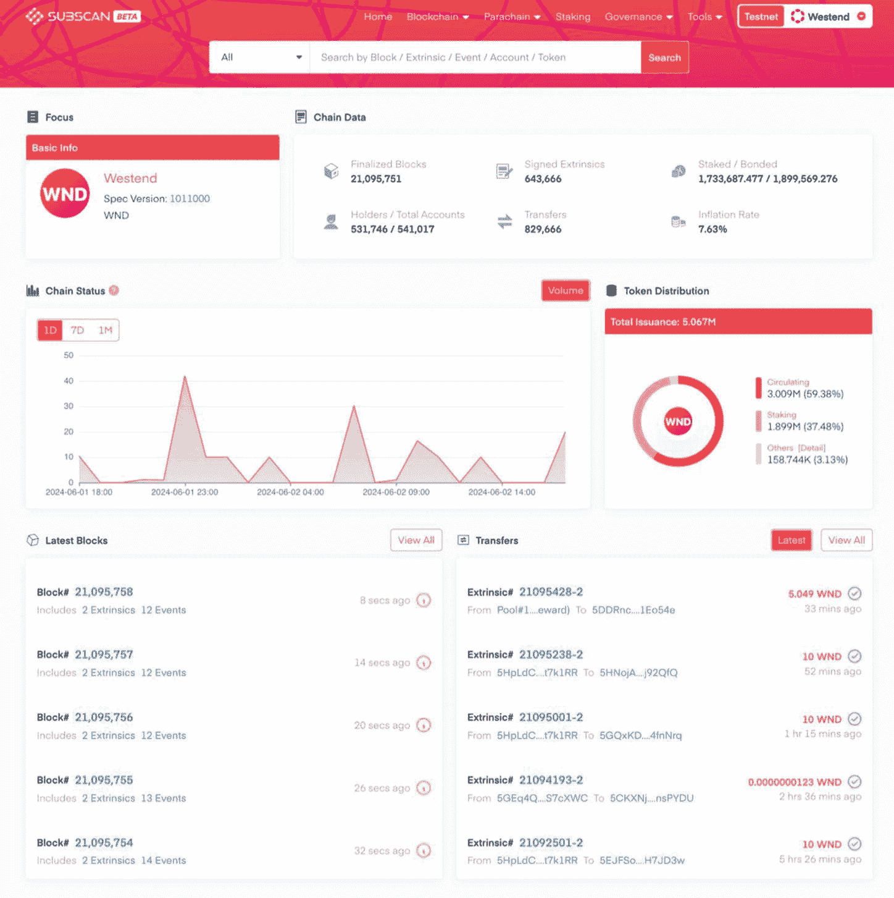
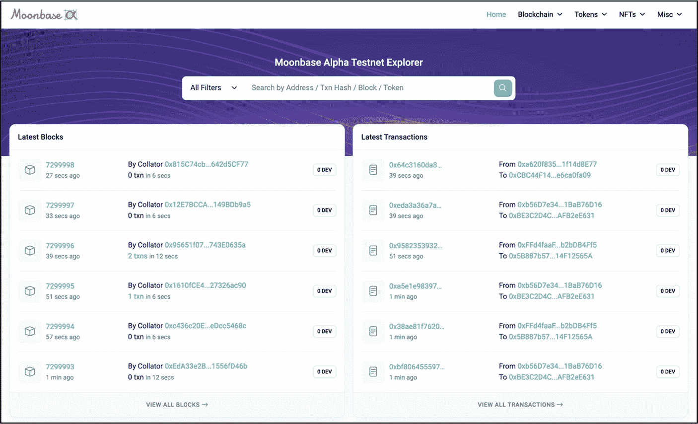
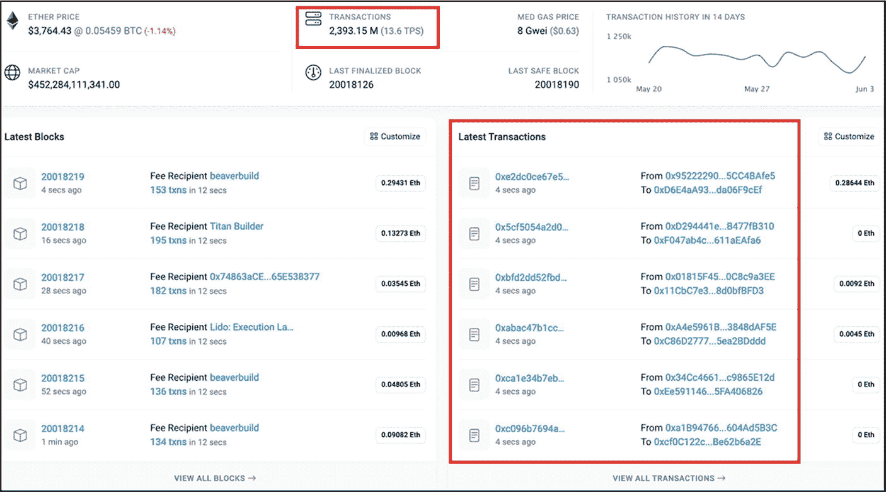
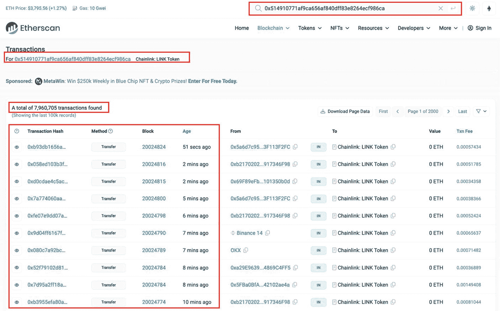
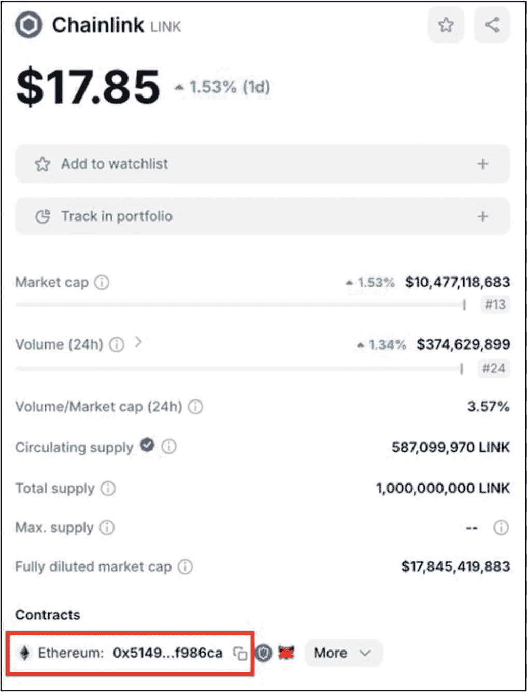
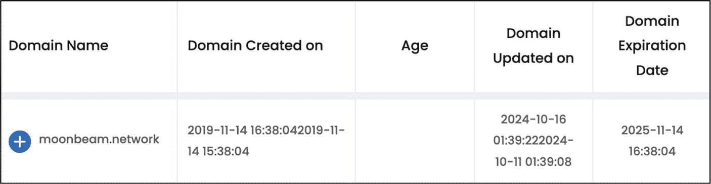
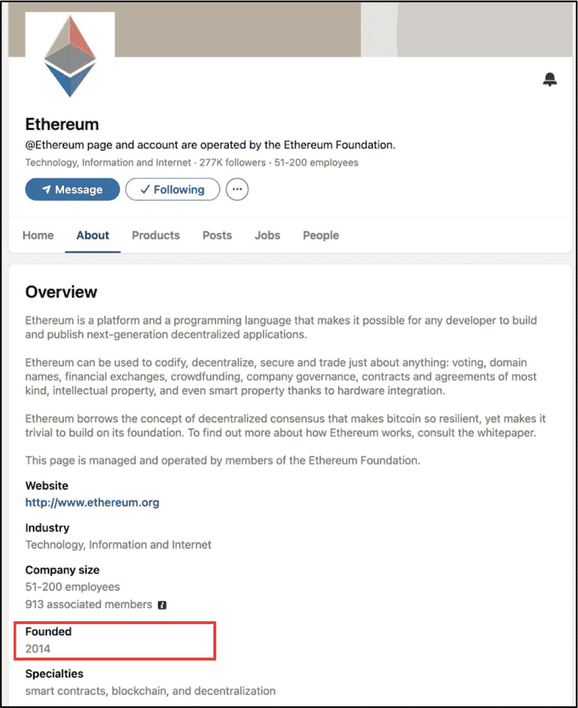
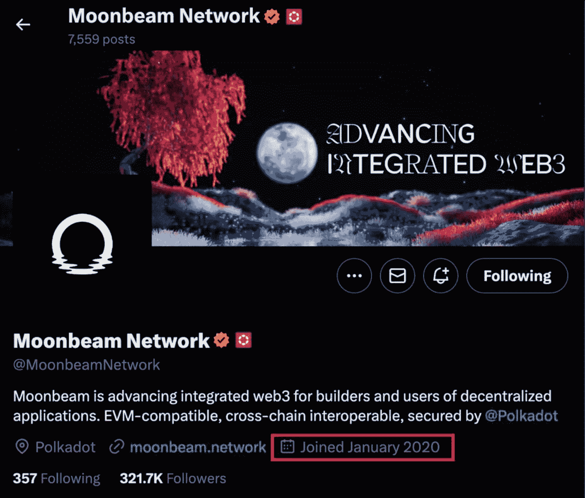

# 测试网区块浏览器

如前所述，每个测试网都有其独立且对应的区块浏览器，用于查看和分析测试网上的交易、区块、地址及其他活动。图 4-4 展示了**波卡的 Westend 测试网区块浏览器**。

图 4-4 – SubScan 提供的波卡 Westend 测试网区块浏览器（图片来源：[`https://westend.subscan.io/`](https://westend.subscan.io/)）

左侧显示的是最新的“区块”——交易的数据包，而右侧则可以看到最新的单笔交易转账。请留意最新区块和交易的执行时间，分别为 8 秒前和 33 分钟前。这些数据对投资者极为有益，原因如下：

- **新产品测试阶段活动** – 对于处于早期阶段的项目，分析测试网交易将提供关键数据，判断团队是否已开始测试、已停止测试，或仍处于测试阶段。如果看到近期的交易以几秒到几分钟的间隔稳定流动，这是值得赞赏的，因为这证明团队仍在后台持续工作，并未放弃该项目。

- **成熟产品的持续改进** – 对于已成熟的项目（如波卡网络），希望在区块浏览器上看到测试网上以近期交易形式呈现的持续活动。这表明，尽管完整可用的产品已经存在，但波卡（以此为例）仍在后台针对可能的新功能、升级、修复潜在漏洞或缺陷等方面勤奋工作。

**事实** – 测试网区块浏览器提供与主网区块浏览器相同的信息和功能，但它是专门为测试网区块链设计的，而非主网区块链。

项目团队在测试阶段使用的测试网将取决于 dApp 所构建的区块链基础设施（例如，[以太坊](https://ethereum.org/en/)、[波卡](https://polkadot.network/)、[索拉纳](https://solana.com/)、[MINA](https://minaprotocol.com/)）。然而，如果产品本身就是一个全新的区块链，团队将创建并使用自己的新测试网和测试网区块浏览器。例如，Moonbeam 网络——一个基于波卡（Layer 0 区块链）构建的 Layer 1 区块链——创建了自己的测试网，名为 Moonbase Alpha——见图 4-5。

图 4-5 – Moonbeam Networks 测试网（名为 Moonbase Alpha）的“Moonbase Alpha”区块浏览器（图片来源：[`https://moonbase.moonscan.io/`](https://moonbase.moonscan.io/)）

**专家提示** – 无论项目是已成熟还是仍在开发中，始终检查其测试网区块浏览器上的交易。拥有持续稳定交易流的项目非常值得赞赏，因为这表明项目团队仍在后台勤奋工作。

### 行动步骤

对于拥有大量追随者和可观市值的高度成熟的项目，无需检查其主要产品测试阶段的状态。然而，对于早期项目，强烈建议投资者验证其核心产品是否已经或正在由团队和社区进行测试。

请按照以下步骤验证其核心产品是否已经或正在由团队和社区进行测试。

1. **确定 MVP、测试版或最终可用的产品是否可用**
   访问项目网站，确认 MVP、测试版或最终产品是否可用。这通常是一个 dApp，以便最终用户与产品或服务交互。dApp 的链接通常标有“*启动应用*”（或类似字样）的按钮，并可在项目网站首页找到。

2. **项目路线图——产品测试时间表**
   检查项目路线图中为产品测试阶段分配的日期。
   - 团队是否已经完成了核心产品的测试阶段？
   - 测试计划何时开始？
   - 如果测试未按照先前的时间表完成，要求团队为项目延迟提供合理的解释。

3. **分析测试网交易**
   确定团队已使用或将用于测试其产品或服务的测试网名称及对应的测试网区块浏览器。
   - **新产品测试阶段活动** – 检查测试网“浏览器”交易，以验证产品测试阶段是否已开始或已完成。如果在测试网区块浏览器上看到近期的交易以几秒到几分钟的间隔稳定流动，这是值得赞赏的。
   - **成熟产品的持续改进** – 通过识别测试网区块浏览器上近期且持续的交易流，验证团队是否正在后台针对新升级、新功能和潜在的 Bug 修复进行勤奋工作。

4. **做笔记并以你自己的风格记录发现**

5. **将发现的结果与基础评估流程的其他部分相结合**

#### 结果评估

如果产品已正式发布，或者至少已通过测试阶段并获得社区的积极反馈，这是一个积极信号。但是，如果项目团队尚未开始或完成初始测试阶段，请谨慎行事。当团队反复错过测试里程碑、没有显示测试网活动，**并且**没有提供清晰的沟通或修订后的时间表时，应将其视为潜在的危险信号。新初创公司处于开发阶段一段时间是很常见的，如果项目尚未完成其产品测试阶段，这并不一定是危险信号。然而，需要更多的研究来更好地理解项目的进展和潜力。

在测试阶段，社区在产品或服务中遇到多个故障和错误是很常见的，大多数情况下这些产品是 dApp 或某种形式的客户界面。此阶段的主要目的是识别并解决这些问题。只要开发团队承认并处理社区的反馈和担忧，就不必过分担忧。

## 在主网上线

**评估目标：判断项目代码（产品）是否已在主网上线。**

主网是主要的区块链网络，真实交易在此发生，并使用具有实际经济价值的代币，而测试网代币（虚拟代币）仅用于测试目的。“在主网上线”一词在区块链领域中常用来描述区块链协议已完全开发、测试并部署到主网供公众使用的阶段。当项目团队确信协议运行正常后，他们会使用经过最终审计的代码库将代码部署到主网。所有交易随后将在实时网络上广播、验证并记录在分布式账本技术（区块链）上。在此阶段，用户可以使用具有真实货币价值的代币参与各种任务，例如通过挖矿验证交易、执行智能合约以及与去中心化应用程序（dApp）进行交互。

当项目在主网（也称为实时网络）上线时，即表示它已在主网（实时网络）上运行。测试阶段至此结束，所有已发现的错误和故障应已得到解决。对于项目团队而言，其产品在主网上线是一个重要的项目里程碑。这表明团队已对该产品进行研究、开发、测试并将其部署到实际应用中。此外，这也向社区表明，团队因其兑现承诺而变得更加值得信赖。

投资者需要确认项目代码是否在主网上线。这一点至关重要，因为那些核心产品经过测试并正式部署的项目，往往投资风险略低。此外，它还能让投资者检查并试用最终产品，从而更深入地了解其整体功能和价值主张。

### 如何判断项目代码（产品）是否在主网上线

判断项目代码是否在主网上线的最快方法是，首先确认团队拥有一个可运行的产品，然后使用主网区块浏览器，验证是否能看到持续且近期的交易流。同时，大多数区块浏览器会显示区块链上发起的交易总数，该数字通常达到数百万级别。图 4-6 显示了以太坊区块链在以太坊主网区块浏览器 Etherscan 上的近期交易记录和交易总数。

图 4-6

以太坊主网区块浏览器 Etherscan，每隔几秒显示以太坊网络上的近期交易以及链上交易总数——已执行 2，393.15 百万笔交易（数据来源于 `https://etherscan.io/`）

对于构建在区块链网络之上的 dApp 和基于代币的项目，只需在任何加密资产价格追踪网站（如 `CoinMarketCap.com` 或 `CoinGecko.com`）上找到代币的智能合约地址，然后将其输入到该项目所构建网络的主网区块浏览器中，即可找到交易总数和近期交易。

例如，图 4-7 显示了来自 `CoinMarketCap` 的截图，突出显示了 Chainlink（一个基于预言机的通信和信息传输项目）的智能合约地址。Chainlink 的智能合约地址可以从 `CoinMarketCap` 复制并粘贴到 `Etherscan`（图 4-8）中，后者将显示 Chainlink 的近期交易和总交易数。

图 4-8

`Etherscan`，以太坊主网区块浏览器，显示 Chainlink 的近期交易记录，时间戳从几秒到几分钟前不等，以及已执行的链上交易总数——总计 790 万笔（数据来源于 `https://etherscan.io/txs?a=0x514910771af9ca656af840dff83e8264ecf986ca`）

图 4-7

来自 `CoinMarketCap.com` 的截图，显示 Chainlink 的数据和合约地址（数据来源于 `https://coinmarketcap.com/currencies/chainlink/`）

如前所述，投资于其产品已完全部署在主网上的项目，其风险通常低于仍在测试阶段的项目。然而，项目尚未上线也可能存在合理且令人担忧的原因：

**合理原因：**

1.  团队正在遵循路线图和主网上线日期。

2.  团队在测试阶段遇到的问题比预期更多。

3.  项目范围内增加了额外功能或创新。

**令人担忧的原因：**

1.  项目团队已放弃该项目。

2.  管理或领导层不善。

3.  人员不足。

4.  缺乏资金。

### 行动步骤

请按照以下步骤判断项目代码（产品）是否已在主网上线。

1.  **确定项目是否已在主网上线**
    如本节所述，通过以下方式验证项目是否已上线：
    1.  首先，验证项目是否拥有可运行的产品。
    2.  通过 CoinMarketCap 等知名的加密资产价格追踪网站，获取项目的合约地址。
    3.  利用合约地址，在主网区块浏览器上分析交易活动水平。
        1.  交易数量是否至少达到一百万或以上？作为粗略参考，链上交易量低于约一百万笔的项目通常仍处于早期增长阶段；请仅将此数字与其他采用指标（活跃地址、总锁仓价值（TVL）和开发者提交量）结合使用。交易量越高，项目越具吸引力。
    4.  如有需要，通过官方支持渠道联系项目团队以获取进一步确认或支持。

2.  **路线图中“主网上线”日期分析**
    通过官方网站查找项目路线图，并确定项目计划在主网上线的日期。根据以下标准进行分析。
    （请注意，项目路线图将在第 11 章“项目路线图”中详细讨论。）
    1.  “主网上线”的日期是否已过？如果已过，项目是否已在主网上线？
    2.  如果主网日期已过而项目尚未上线，则应考虑以下几点：
        1.  团队是否就项目路线图进度滞后提供了任何合理的理由？项目延迟可能由多种原因造成，包括新增功能和创新、持续开发、资金短缺、人员不足、管理不善、存在大量错误和漏洞、欺诈、项目放弃等。
        2.  社区情绪状况如何？

3.  **记录笔记并以你自己的风格整理你的发现**

4.  **将发现与基本面评估过程的其他部分相结合**

#### 结果评估

如果项目已在主网上线，这是非常值得赞赏的。然而，与每一个新创业公司一样，完成所有测试和实施更新可能需要一些时间。因此，只要团队继续将“主网上线”这一里程碑作为其项目路线图的优先事项，即使项目尚未在主网上线也是可以接受的。请记住，主网启动令人鼓舞，但它本身并不能保证项目的成熟度或可信度。

## 创始年份

**评估目标：** 确定项目的创始年份，以评估其可信度，确保其技术保持最新，并验证团队声明的真实性。

区块链项目的创始年份对投资者来说是一个至关重要的信息，原因有几个。成立仅几个月的项目可能承担更高的风险，因为它们几乎没有时间建立可验证的记录。另一方面，一个已存在七、八年的区块链项目可能仍在沿用陈旧的技术，从而增加了风险。在这种情况下，建议投资者进行充分的研究，以确保项目在适用情况下更新其产品和整个系统。检查项目路线图中即将到来的里程碑是一个很好的起点。

此外，项目团队有时会通过提供虚假信息（例如他们在该项目上开发和工作的年限）来试图增加可信度。因此，验证团队诚实度以及公司的创始年份至关重要。项目的创始年份可以通过多种方法验证，包括检查域名注册日期、查看公共代码仓库中的首次提交和发布标签，以及确认 LinkedIn 或 X 平台（原 Twitter）上公司页面的创建时间。

图 4-9 展示了在名为 Duplichecker.com 的域名时效检查器网站上查到的[Moonbeam 网络](https://moonbeam.network/)的域名注册详情。如图所示，Moonbeam 的域名注册于 2019 年 11 月 14 日，即在撰写本书时，大约为 5 年前。

图 4-9：Moonbeam 网络域名注册年份（数据来源：https://www.duplichecker.com/domain-age-checker.php）

图 4-10 显示了以太坊 LinkedIn 页面的截图——“关于”部分显示该公司成立于 2014 年。大多数项目都有 LinkedIn 页面来显示其创始年份。请注意——如果一个项目没有 LinkedIn 资料，这将被视为异常情况，并且可能是一个危险信号，尤其是如果没有其他来源可以评估团队成员时——这将在第 10 章“项目团队”中更详细地探讨。

图 4-10：以太坊创始年份——2014（数据来源：https://www.linkedin.com/company/ethereum/about/）

**事实：** 鉴于大量区块链项目在启动一年内就宣告失败，与那些仅有几个月工作基础的团队相比，拥有多年核心产品开发经验的团队所呈现的投资风险要低得多。

检查项目创始年份的另一个好方法是查看他们在 X 平台（原 Twitter）上建立账号的年份。在所有可用的社交平台中，X 是加密货币领域最受欢迎的平台之一，几乎所有项目都有其存在，并用作与社区互动的主要来源。当在 X 上设置账号时，它会锁定项目加入该平台的日期。虽然加入日期本身无法编辑，但账号有时可能被购买和更名——这是一种不常见但真实存在的可能性——因此请将该日期视为支持性证据而非确凿证明。图 4-11 展示了 Moonbeam 网络，它于 **2020 年 1 月**加入 X。

图 4-11：Moonbeam 网络，加入日期（数据来源：https://x.com/MoonbeamNetwork）

### 行动步骤

请按照以下步骤确定项目的创立年份，以评估其可信度，确保其技术保持最新，并核实团队声明的真实性。

1.  **验证域名注册年份**

    按照以下步骤确定项目域名的注册年份。
    1.  访问项目官方网站，并复制其网址。
    2.  访问名为 Duplichecker 的网站，网址为 `https://www.duplichecker.com/domain-age-checker.php`。
    3.  将项目域名粘贴到“域名年龄查询”框中，然后选择“查询域名年龄”。这将会提供域名的注册年份。

2.  **验证 X（原 Twitter）加入年份**

    按照以下步骤确定项目在 X 上建立公司资料的年份。
    1.  访问项目官方网站。
    2.  找到 X 的社交媒体图标。
    3.  在 X 平台上，项目横幅下方会显示该项目加入该平台的年份。

3.  **验证 LinkedIn 加入年份**

    按照以下步骤确定项目在 LinkedIn 上建立公司资料的年份。
    1.  访问项目官方网站。
    2.  找到项目 LinkedIn 公司资料的超链接。
    3.  导航至“关于”部分。
    4.  创立年份将显示在“关于”部分的底部。

#### 结果评估

在大多数情况下，结果应显示域名和社交媒体资料的创建时间大致相同——除非域名是从他人处购得，这种情况可能性较低。尽管如此，这些信息应用来帮助核实团队关于其从事该产品开发时长的可信度。

例如，如果团队声称其主要产品将在两个月后发布，代币已在交易所交易，但其域名注册和社交平台加入日期仅为几周或几个月前，则需要更深入的调查——这会引起关注并可能成为危险信号。另一方面，如果项目创立于七年前，则必须对技术、产品和市场需求进行更深入的评估，以确保他们已更新了技术、产品体系及整体系统，从而保持竞争力。

