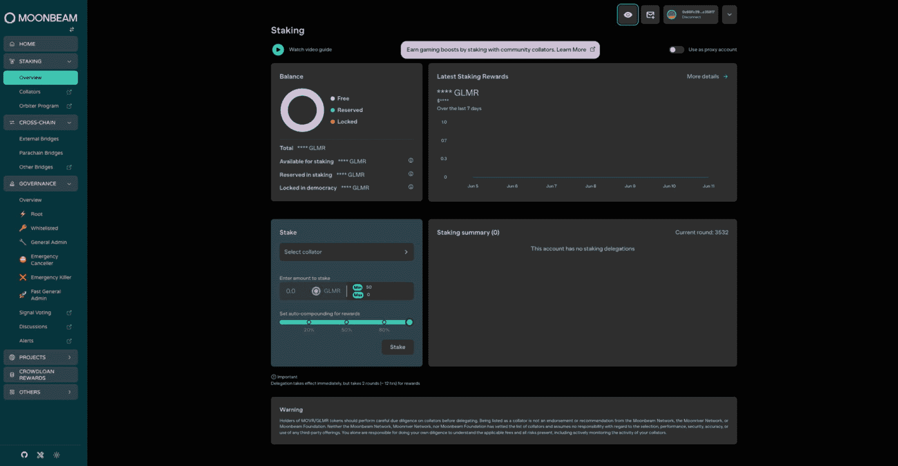
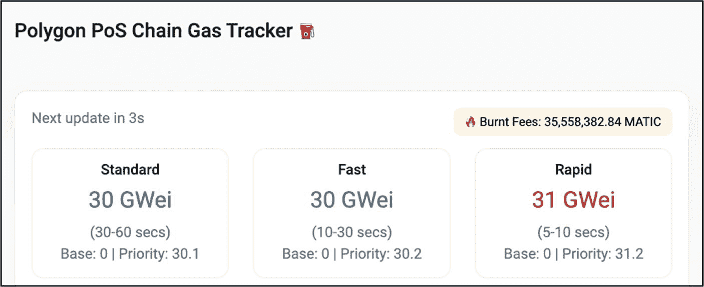
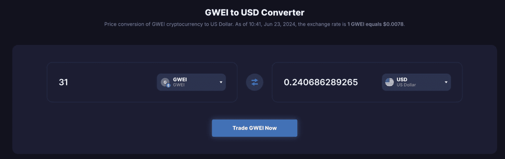
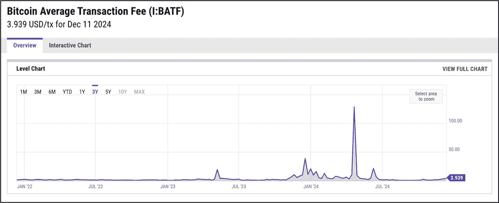
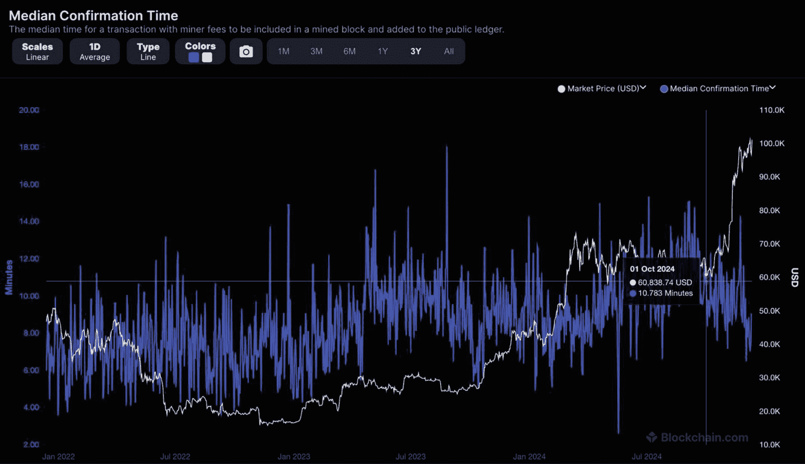
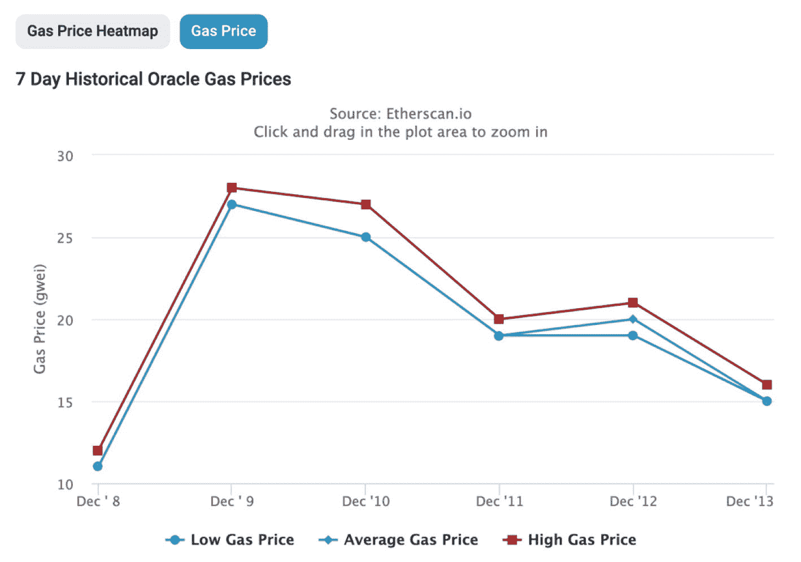
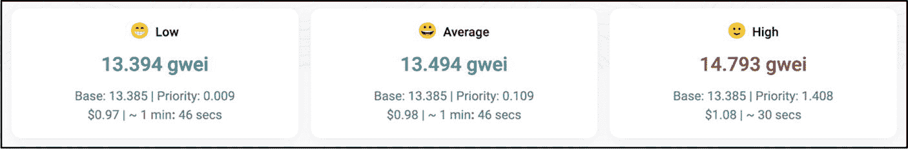

# 5. 最终用户体验

最终用户体验（`UX`）是直接影响用户采用率、项目长期成功以及在加密领域增长的关键因素。它涵盖了用户在与去中心化应用（`dApps`）、钱包、交易所、文档及其他相关方面交互时的完整旅程和满意度。包括交易速度、Gas 费用、客服效率及地理访问限制等因素也会影响最终用户体验。投入足够时间和资源来提供无缝、直观且安全的 `UX` 的项目，能够确保用户无论其技术水平如何，都能轻松导航其用户界面。这还包括为所有用户提供清晰简洁的入门指导，以消除他们在以任何形式或程度与产品交互时可能产生的困惑，从而提高用户采用率。

本节将评估最终产品在各方面交互中的最终用户体验。流畅、直观且高效的最终用户体验至关重要，因为它直接影响用户留存率。高用户留存率表明在特定时期内，有相当比例的用户持续使用某项产品或服务；而低用户留存率则表明许多用户在开始使用后不久便停止了使用。不断扩大的用户基础通常与项目的增长和感知价值相关，并可能影响代币价格，但这种关系并非必然，因此最好将其与协议收入、代币供应变化和开发者活动等基本面进行交叉验证。

最终用户体验对投资者至关重要。一款设计精良、易于使用、界面直观且提供快速高效客服的无缝产品，能够直接提升用户采用率和留存率——这些是衡量项目增长和盈利潜力的关键指标。能够吸引并维持广泛用户基础的项目对投资者极具吸引力，因为它们代表了可持续的商业模式和市场需求。积极的最终用户体验可以提高加密项目的声誉和可信度，同时降低投资者风险。此外，一个精美、专业的 `UI` 通常比一个粗糙的 `MVP` 界面更能传递合法性的正面信号，并且通常表明团队致力于为最终用户提供最高质量的用户体验；然而，仅凭 `UI` 质量并不能下定论——一些可信的早期项目仍然采用最简设计，因此保持警惕很重要。这些关键因素，加上完美的最终用户体验，还能带来更高的用户参与度，从而有助于提升价值和投资回报。

以下章节将探讨最终用户与产品、团队互动的各个方面，以及其他增强或限制最终用户体验和互动的因素。

**本章讨论的基本要素：**

*   产品应用 UI/UX
*   dApp 可用性和功能性评估
*   交易速度和成本
*   最终用户客户支持与沟通
*   数字资产交易所

## 产品应用 UI/UX

**评估目标：评估项目网站、`dApp` 或其他界面是否提供了高质量的 UI/UX。**

用户界面（`UI`）和用户体验（`UX`）是产品开发中两个至关重要的方面，涵盖了区块链领域的应用、界面、项目网站等多种产品类型。尽管这些术语经常互换使用，但它们是非常不同的概念。

`UI` 指的是网页或 `dApp` 的外观、感觉和交互性。它考虑的是按钮、图标、下拉菜单等交互元素。配色方案、字体选择和排版也被考虑在内，以帮助将所有元素融合在一起。人们常说 `UI` 在用户和产品之间建立了情感联系。另一方面，`UX` 指的是用户在与产品、服务、系统或应用交互时的整体体验。设计师负责确保产品界面的设计、交互内容和布局对用户而言是愉悦的、易于导航的、直观的，并且易于使用。设计师的另一项职责是了解最终用户将执行哪些活动，以优化相应的客户交互流程、消除摩擦点，并最大限度地减少完成这些任务所需的步骤。此外，良好的 `UX` 能够突出产品的价值，向客户阐明其能力和优势。

### 区块链的用户界面与用户体验

大多数加密项目都会提供*某种*面向用户的界面——无论是其自有的`dApp`、命令行工具，还是集成在第三方钱包中——让用户能够与产品进行交互。通常，面向用户的前端是托管在传统服务器上的网页或移动应用程序，而它则与区块链上的去中心化智能合约进行交互。每个项目都会针对其提供的特定产品或服务来创建和定制自己的`dApp`。每个`dApp`的界面也因项目类型或所提供的服务而千差万别。

图 5-1 展示了 Moonbeam Networks——一个用于构建跨链互连应用的智能合约平台——的`dApp`界面。Moonbeam 的`dApp`允许用户连接他们的去中心化钱包，并参与诸如质押、治理公投、资产管理、跨链转账以及各种其他相关活动等操作。

**表 5-1** 中心化交易所与去中心化交易所对比

| 中心化与去中心化数字资产交易所对比 |
| --- |
| | 中心化交易所 (CEX) | 去中心化交易所 (DEX) |
| --- | --- | --- |
| **用户界面** | 用户友好的界面和交易工具。 | 可用性通过更直观的设计正在改善，但总体上仍比 CEX 更复杂。 |
| **用户体验** | 全面的客户支持和用户友好的界面。 | 客户支持有限或没有；用户必须独立处理问题。 |
| **流动性** | 由于用户基数大，流动性水平高。 | 通过流动性池和聚合器等创新手段增加流动性。 |
| **交易对与法币支持** | 广泛的交易对，包括法币。 | 交易对和法币支持有限，但通过法币出入金通道和跨链协议正在改善。 |
| **多链资产访问** | 资产可在多个区块链间轻松相互交易。 | 通过桥接和可互操作的区块链在多链交易方面取得了快速进展——但请注意，许多桥接是半中心化的，并且已成为频繁被攻击的目标。 |
| **功能** | 高级交易工具和图表功能。 | 用户功能有限，但限价单和分析等高级工具的使用率正在增长。 |
| **安全性** | 增强的安全措施，但由于中心化存在单点故障风险。 | 由于去中心化，降低了被黑客攻击和入侵的风险。 |
| **监管合规性** | 通过 KYC 和 AML 流程遵守监管要求。 | 增强隐私性和抗审查能力。 |
| **资产控制** | 托管式——用户无法完全控制其数字资产。 | 非托管式——用户保留对私钥和资产的控制权。 |
| **隐私与匿名性** | 要求披露个人信息。 | 允许更匿名的交易，尽管一些 DEX 正在集成合规工具。 |
| **性能与可扩展性** | 快速交易和高整体速度（交易通过中心化服务器处理）。 | 由于区块链可扩展性问题，交易速度较慢，但 Layer 2 解决方案提高了速度。 |
| **交易费用** | 费用结构对高交易量交易者可能很有吸引力，尽管一些 Layer-2 或优化链的 DEX 现在可以匹配甚至低于 CEX 的定价。 | 在拥堵的区块链上费用较高；在优化链或 Layer 2 上费用降低。 |
| **中心化风险** | 易受黑客攻击、安全漏洞和监管行动的影响。 | 由于去中心化，对这些风险有更强的抵抗力。 |
| **透明度** | 缺乏完全的透明度，用户有时只有在成功转账或提现后才能收到交易哈希。 | 由于区块链技术，透明度更高。 |
| **示例** | Binance、Coinbase、Gemini、Kraken、KuCoin。 | Uniswap、SushiSwap、PancakeSwap、Curve、1 inch、Balancer。 |

**图 5-1** Moonbeam Networks `dApp` 界面（图片提供：[`apps.moonbeam.network/moonbeam/staking`](https://apps.moonbeam.network/moonbeam/staking)）

Moonbeam 的`dApp`界面设计简洁现代，并且提供了一个视觉上吸引人的可选深色主题。`dApp`中对比色的巧妙运用使主要功能得以凸显。其框架和整体布局极其简洁、一目了然，并且设计上易于访问——用户从左侧菜单选择选项，选择结果会显示在中央屏幕界面上。此外，`dApp`在所有屏幕尺寸和设备上都具有响应式设计，提升了无缝的用户体验。

Moonbeam 的用户体验设计通过融入直观的一键式选项和清晰的标签，并分类组织每个选项以便于导航，极大地减少了终端用户的操作摩擦。在其主要的“质押概览”仪表盘上，用户的质押详情是核心焦点，提供了质押风险、余额、状态、已获奖励以及验证人表现的综合概览。另一个吸引人的特点是诸如滑块之类的交互式元素，使用户能够控制要复投的质押奖励百分比。用户还可以在给定时间段内实时查看其质押奖励。此外，在使用`dApp`时，加载时间始终很快，提升了客户体验和满意度。

### 项目官网

用户界面与用户体验同样适用于项目官网。通常，项目官网是投资者获取项目信息的首要“去处”之一，其中包含白皮书、`dApp`、社交媒体渠道以及其他相关信息的链接。第一印象至关重要；因此，项目官网拥有出色的用户界面与用户体验设计至关重要。

### 面向投资者的用户界面与用户体验分析技巧

投资者无需成为用户界面与用户体验专家，就可以判断项目`dApp`或官网是否拥有良好的用户体验。通过日常使用各种软件、应用程序和网站，大多数人在潜意识里就能很好地判断一个网站或`dApp`是看起来粗糙、廉价、难以使用且违反直觉，还是设计流畅、易于使用、一目了然且视觉上吸引人。不幸的是，对设计糟糕、低于平均水平的用户界面与用户体验的网站或`dApp`的第一印象，会延续到项目的其他各个方面，包括产品和团队的表现。相反，良好的用户界面与用户体验会给新客户和终端用户留下积极而持久的印象，从而增加用户基础并提升投资者的兴趣。因此，项目拥有一个外观现代且用户界面与用户体验良好的`dApp`和官网至关重要。

**警告**

> 如果一家公司不愿意花钱打造一个展示其产品的专业网站，这不禁让人怀疑他们在其他方面是否也在偷工减料。此外，如果你个人在使用项目官网、`dApp`或钱包时感到困难，应将其视为潜在的危险信号，并通过查看不同经验水平用户的反馈来验证该问题。

### 行动步骤

按照以下步骤评估项目网站、dApp 或其他界面是否提供高质量的 UI/UX。

1.  **评估 dApp 的 UI/UX 设计**

    评估 MVP、测试版或最终成品的功能界面。
    1.  访问项目官方网站，找到产品界面（通常是一个 dApp）。这可能是一个 MVP、测试版或最终产品。
    2.  使用在 Moonbeam 网络示例中应用的相同方法来分析产品的 UI/UX。
       1.  界面是否直观且易于导航？
       2.  设计中的颜色和字体流是否在视觉上保持一致且具有专业感？
       3.  是否有丰富的功能来增强可用性，例如滑块、下拉菜单或按钮？
       4.  当出现错误时，系统是否会提供清晰有用的反馈？是否有明确的错误提示或通知？
       5.  产品在桌面端和移动设备上是否都能良好运行？
       6.  加载速度是否足够快？

2.  **评估项目网站的 UI/UX**

    使用相同的 UI/UX 方法，分析项目官方网站的 UI/UX 质量。

3.  **记录笔记，并用自己的风格记录分析结果**

4.  **将分析结果与基本面评估流程的其他部分相结合**

#### 结果评估

如果项目网站、dApp 或任何其他界面的 UI/UX 很差，这不是一个好兆头。较差的 UI/UX 可能是由于资金不足、团队经验不足、管理不善或质量控制不佳造成的。无论原因如何，都将 UI/UX 不佳的项目视为一个早期预警信号，表明在考虑任何投资之前需要进行额外研究和谨慎监控。

## dApp 可用性与功能性评估

**评估目标：** 评估 dApp 的可用性和功能性，以确定其是否可靠且用户友好。

去中心化应用（dApp）的可用性和功能性对于任何项目的成功和普及都至关重要。假设一个 dApp 设计糟糕、漏洞百出且不可靠。那么，如果使用具有货币价值的数字资产进行交互，它就有可能赶走用户并导致财务损失——严重损害公司声誉。因此，在投资前测试 dApp 的功能性，看它是否能按承诺工作，始终是个好主意——尤其当这是一个有前景但迄今用户实际测试有限的新创项目时。

在试用 dApp 的可用性和功能性时，如果项目仍处于产品测试阶段，务必使用测试网代币；否则，请使用具有货币价值但金额尽可能小的代币进行测试，以帮助将损失降到最低。这使投资者能够检查应用的表现如何、响应速度如何以及使用起来有多容易。流畅且用户友好的体验是一个好迹象，表明项目扎实且有真正价值，而故障或可用性问题则可能是潜在风险的危险信号。请记住，如果你在使用 dApp 时遇到困难——并且不同经验水平的用户也报告了类似问题——请将其视为危险信号（除非该 dApp 明显处于 MVP 或测试版阶段）。

### 行动步骤

按照以下步骤评估 dApp 的可用性和功能性，以确定其是否可靠且用户友好。

1.  **测试 dApp 的可用性和功能性**

    探索 dApp 的功能特性，试运行实际产品，并根据以下标准进行评估。
    1.  是否遇到任何故障或意外错误？
    2.  产品是否按预期工作？
    3.  应用的响应速度和运行速度如何？是否有明显的延迟？
    4.  是否有任何令人烦恼或导致不愉快体验的地方？

2.  **记录笔记，并用自己的风格记录分析结果**

3.  **将分析结果与基本面评估流程的其他部分相结合**

#### 结果评估

如果 dApp 易于使用且运行流畅，这无疑是一个好迹象，表明项目走在正确的轨道上。但是，如果遇到故障、错误、延迟或缺陷，应将其视为危险信号，在项目团队解释并解决这些问题或疑虑之前不要进行投资。不过，如果结果不能令你满意，务必极度谨慎，不要投资。

## 交易速度与成本

**评估目标：** 确定一个项目是否提供能满足其实际用例需求的快速交易和较低 Gas 费用。

当汽车从 A 点移动到 B 点时，两个主要指标是行程耗时和燃料成本。同样，区块链上的交易也通过两个关键指标来评估：交易速度可以指（1）首次被包含进区块的时间，或（2）在 N 次确认后达到最终性的时间——以太坊大约 12 个区块，比特币大约 6 个区块——以及 Gas 费用，即在网络上执行交易所需的费用。交易速度和成本对用户体验至关重要。公司和网络参与者会避免使用费用高昂且交易缓慢的区块链，尤其是在他们可以选择其他交易处理速度快且 Gas 费用低的区块链的情况下。

本节将讨论交易速度和成本，以及这类因素为何如此关键的原因，因为它们直接影响最终用户、企业和投资者的体验。

### 交易速度

交易速度在区块链设计和终端用户体验中至关重要，原因如下。

-   **dApp 的实时交易速度** – 许多 dApp 需要近乎即时的交易，例如去中心化金融（DeFi）、交易、游戏和物联网。缓慢的交易速度会限制在区块链上构建的应用类型。此外，交易时间慢和 Gas 费用波动常导致去中心化交易所（DEX）上的交易失败。
-   **业务运营** – 大多数使用区块链的企业在日常运营中需要快速交易处理。例如，供应链管理和工资支付系统依赖及时的金融交易来支持核心运营和客户需求。
-   **用户体验** – 缓慢的交易速度可能导致不良的用户体验和挫败感，从而可能阻止他们再次使用该网络。
-   **竞争力** – 提供快速交易速度的区块链比速度慢的区块链更具吸引力，从而能吸引更多用户和开发者加入平台。
-   **用户留存** – 如果没有快速的交易速度，网络的用户留存率很可能会下降。

需要注意的是，区块链网络所需的交易速度取决于其特定的用例。例如，采用工作量证明（PoW）共识机制的比特币，主要被设计为结合在线数字货币支付的价值存储手段。由于比特币的主要目的是提供安全且去中心化的价值存储，超快的交易速度并非关键。然而，其他用例如 DeFi、去中心化交易所、游戏和类似应用则依赖快速、近乎即时的交易，以维持高效流畅的最终用户体验。这些应用通常利用更快的共识机制，如权益证明（PoS），来满足用户对性能的需求——更多关于共识机制的内容，请参见第 6 章“区块链架构”中的“共识机制”部分。

好的，作为高级文档工程师和翻译员，我将遵循您提供的注意事项和示例，将给定的英文文本翻译成中文。

### 交易“Gas”费用

在区块链领域，“gas”是指支付给矿工或验证者的交易费用，用于补偿其在网络上处理和验证交易所需的计算能力。*Gas*费用使用进行该交易所在区块链的原生代币支付。例如，使用以太坊区块链时，费用以 `gwei`（gigawei）支付，它是 ETH 的极小单位——一 `gwei` 等于十亿分之一 ETH。

与交易速度类似，所使用的共识机制是影响 Gas 成本的主要变量。基于 PoW 的区块链——因其所需的大量计算能力——其交易费用高于基于 PoS 的区块链或类似技术，后者以低成本高效的方式验证交易。此外，Gas 的费用会根据网络流量和拥堵情况而有所不同。网络流量的波动可能受到多种因素的影响，例如一天中的时段、重大事件、项目相关新闻、利率更新或知名人士的活动。

交易费用产生的收入在网络中承担着许多重要功能。它激励矿工通过验证和处理交易来保障网络安全。同时，它也使攻击者向系统发送垃圾信息以淹没系统的成本高昂，从而阻止网络滥用。此外，对于比特币而言，由于每次减半后区块奖励下降，交易费用日益成为补贴矿工收入的重要来源；其他具有持久或可变通胀率的网络，其长期安全性可能较少依赖交易费用。

### 低 Gas 成本的重要性

-   **可访问性** – 低 Gas 成本使区块链对用户更具可访问性。
-   **交易** – 低 Gas 成本能够吸引各类去中心化交易所（DEX）的交易者。
-   **可负担性** – 低 Gas 成本使用户参与区块链的负担更轻，这有助于提高用户采用率。
-   **鼓励开发** – 低 Gas 成本鼓励开发者在区块链上构建更复杂、更具创新性的应用程序，因为他们无需过分担心交易和智能合约执行的成本。
-   **用户增长** – 低交易成本鼓励更多（及更小额的）交易，这反过来又会吸引更多用户，放大网络效应并促进生态系统增长。

> **事实**  
> 共识机制是区块链网络采用的协议，用于就交易的有效性达成一致并防止双重支付，确保所有节点维护一份一致的账本副本。

### 如何查看交易速度和 Gas 费用

通常可以通过在线搜索代币或通证的“Gas 追踪器”（Gas Tracker）网站来查找交易速度和 Gas 费用。例如，[Polygon](https://polygon.technology/)（MATIC）的交易速度和 Gas 费用如图 5-2 所示。通常，在链上发起交易时，用户可以选择支付更高的费用以获得更快的交易处理速度。在 Polygon 上，Gas 追踪器的层级（例如 `30 gwei` “快速”和 `31 gwei` “急速”）表明，在网络拥堵时，小幅增加费用*可以*加快确认速度，但当流量较低时，这种影响微乎其微。

**图 5-2**  
Polygon 的实时交易速度和 Gas 价格（感谢 [`​polygonscan.​com/​gastracker/​`](https://polygonscan.com/gastracker/) 提供）

为方便起见，有许多在线 `gwei`/美元计算器可以显示/转换 `gwei` 与美元。图 5-3 展示了来自 Coinbrain.com 的在线 `gwei`/美元计算器，计算出 `31 gwei` 价值 0.24 美元。

**图 5-3**  
`gwei` 到美元转换器，显示 `31 gwei` 的计算成本为 0.24 美元（感谢 [`​coinbrain.​com/​converter/​eth-0x29e683aeafd03b​b6c02055c3ca8b6e​db4bb9bae5/​usd`](https://coinbrain.com/converter/eth-0x29e683aeafd03bb6c02055c3ca8b6edb4bb9bae5/usd) 提供）

作为与基于 PoS 协议的对比，图 5-4 来自 YCharts.com，显示了比特币在过去三年中的平均交易成本为 3.93 美元。此外，图 5-5 来自 Blockchain.com，显示了比特币在过去三年中的中位确认时间为 10 分钟。很明显，与 PoS 协议（如 Polygon 的情况）相比，基于 PoW 的区块链（如比特币）的交易时间要慢得多，交易成本也更高。

> **事实**  
> 第二层协议，如比特币（BTC）的[闪电网络](https://lightning.network/)，利用微支付通道来增强区块链的可扩展性。它们通过在链下处理交易来实现更快、更经济的交易，同时保持安全性。

**图 5-4**  
比特币过去三年的平均交易成本为 3.93 美元（感谢 [`​ycharts.​com/​indicators/​bitcoin_​average_​transaction_​fee`](https://ycharts.com/indicators/bitcoin_average_transaction_fee) 提供）

**图 5-5**  
比特币过去三年的中位确认时间为 10 分钟（感谢 [`​www.​blockchain.​com/​explorer/​charts/​median-confirmation-time`](https://www.blockchain.com/explorer/charts/median-confirmation-time) 提供）

### 交易速度与 Gas 费用的投资者分析

遗憾的是，对于最佳交易速度和 Gas 费用，并没有一个简单的答案。接近即时的交易并附带免费 Gas 是终端用户体验的理想结果。然而，作为投资者，这种心态并不实际，因为它会排除许多潜在有价值的投资机会——更不用说矿工和验证者需要为他们在网络上完成的工作获得报酬，而不能仅仅依赖新铸造的代币作为支付。游戏、交易、`DeFi` 平台和去中心化交易所（`DEXs`）等用例，受益于超快的交易速度和极低的 Gas 费用。没有任何参与者愿意为了游戏内购买或完成一笔去中心化交易所交易而等待十分钟。然而，在这些高频、实时的用例之外，超快的速度固然令人赞赏，但并非总是至关重要。

虽然很容易过分关注交易速度和 Gas 费用，但大多数现代区块链——尤其是那些辅以 Layer 2（`L2`）协议的区块链——可以在几秒钟内处理交易，最坏情况也不过一两分钟。因此，大多数利用具有实际用例的区块链或 `dApp` 的人，不需要等待十分钟才能完成一笔交易，除非他们特意使用传统的 `PoW` 网络。大多数其他区块链，包括采用权益证明（`PoS`）、委托权益证明（`DPoS`）或更新共识模型的第二层协议，通常可以在 5 到 60 秒内完成交易，这对大多数应用来说已经足够好了。

关于 Gas 费用，对于以太坊这样的网络，费用会根据网络流量和拥堵程度而波动，有时`美元`费用从几美分到几美元不等。作为投资者，主要关注的不仅仅是特定时刻的费用成本——更重要的是预测它们是否适用于所讨论的用例。例如，如果你想投资一个游戏项目，建议评估其费用是否足够低、稳定且快速，以提供更流畅、更高效的游戏体验。另一方面，如果评估的是一个借贷平台，60 秒的延迟或小额费用可能根本无关紧要。尽管如此，这并非是说即时交易比等待 60 秒更值得赞赏；只是根据不同的用例，它们可能没那么关键。

### 行动步骤

按照以下步骤确定一个项目是否提供与其实际用例需求相匹配的快速交易和低 Gas 费用。

图 5-7

7 天历史预言机 Gas 价格（数据来源：[`https://etherscan.io/gastracker#chart_gasprice`](https://etherscan.io/gastracker%2523chart_gasprice)）

图 5-6

以太坊的 Gas 价格及相关交易速度（数据来源：[`https://etherscan.io/gastracker`](https://etherscan.io/gastracker)）

1. **确定交易速度和 Gas 费用**
   1. 通过快速在线搜索，查找网络的 Gas 价格和交易速度。以以太坊为例，可以搜索“Ethereum’s gas price and transaction speed native tracker”等关键词——参见图 5-6。
   2. 如有“热力图”，建议通过其获取平均 Gas 价格——参见图 5-7。
   3. 高级选项——如果你运行自己的节点（或使用公共的 `RPC` 网关），你可以直接通过网络的原生 API 调用获取当前 Gas 价格——例如，对于以太坊，`eth_gasPrice` 会以 wei 为单位返回值。

2. **根据用例评估交易速度和 Gas 费用**

   确定交易速度和 Gas 费用是否如本章讨论和提供的示例所述，与用例相符。此外，根据以下标准进行评估。
   1. 项目的速度和费用是否符合其目的？
   2. 网络的交易时间是否足够快？如果超过 1 分钟，请再次确认这对 `dApp` 用户是否合理。
   3. 警惕那些过度宣传“零费用”的项目。

3. **竞争对手分析**

   检查该项目的交易速度和 Gas 费用与竞争对手相比如何，看其是否在其用途上提供了更好的价值。

4. **记录笔记并以你自己的风格记录你的发现**

5. **将发现与基本面评估过程的其他部分结合起来**

#### 结果评估

如果结果显示交易费用和 Gas 费用不适合用例需求和可操作性，则建议不要投资。

## 终端用户支持与沟通

***评估目标：确定项目团队是否具备足够的客户和沟通支持策略。***

客户支持和沟通在区块链行业中对项目团队和终端用户都起着至关重要的作用。区块链世界中不断引入新的复杂技术；因此，拥有可靠的支持和透明度是建立信任的关键。终端用户依赖项目团队的帮助来解决问题、提供指导，并回答关于产品或服务的技术性和非普遍性问题。团队还负责让终端用户了解最新信息，例如平台升级、路线图变更、新的合作伙伴关系以及其他关于产品或服务的重要新闻。

### 为什么客户支持和沟通很重要？

项目团队的客户支持和沟通之所以重要，原因如下：

- **透明度** – 持续更新平台开发、安全问题和政策变更，以维护用户信任。
- **参与度** – 当项目团队积极参与社区讨论和访谈，并回应用户咨询时，这有助于产生并维护一个强大且不断壮大的社区。
- **教育** – 向社区提供资源，例如产品教程、文章以及关于安全实践和区块链技术的网络研讨会，以帮助教育用户。
- **反馈** – 沟通对于收集和响应用户反馈至关重要，从而改进产品或服务，解决社区的关切。
- **社交媒体** – 在 `X`、`YouTube`、`Telegram` 和 `Discord` 等社交平台上保持活跃，既能使用户了解最新信息，又能促进积极的社区情绪。

