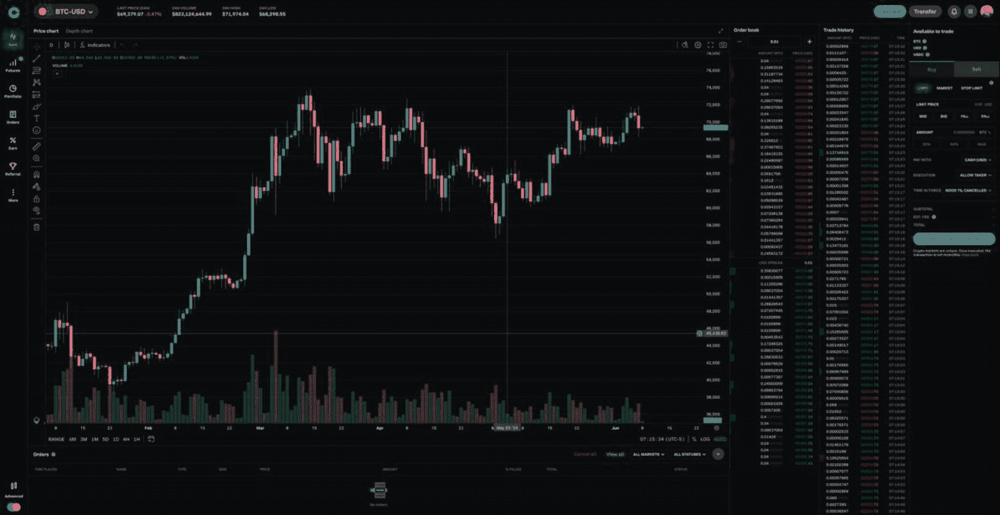
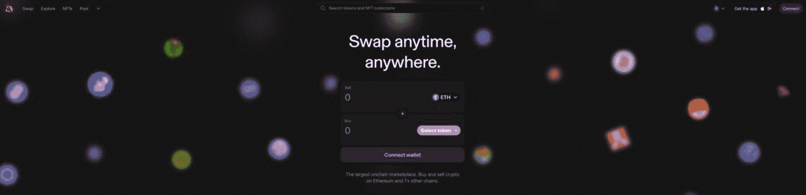
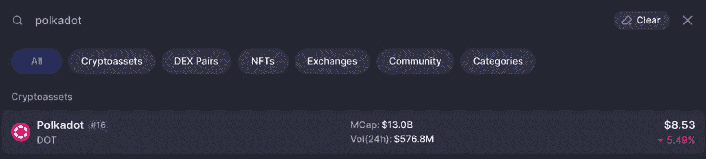
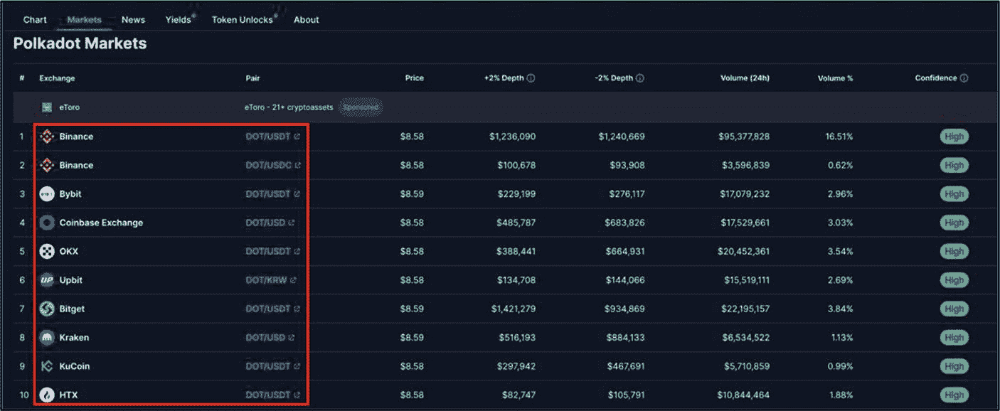
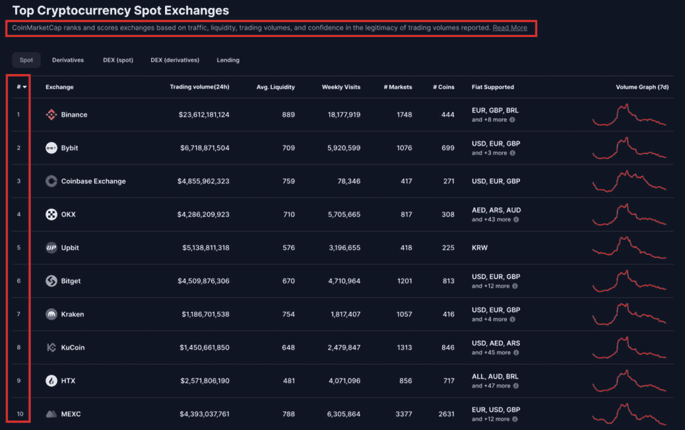

# 评估项目的最终用户支持与沟通策略

根据以下指标标准评估项目的最终用户支持水平和沟通策略。

1. **多渠道支持** – 人们偏好的平台各不相同，因此项目团队应出现在主流社交媒体渠道上。至少，他们应在 `X`、`YouTube` 和 `Discord` 上保持存在。
   - **任务** – 审查项目的社交或支持渠道，并记录典型的响应时间（包括高峰和非高峰时段）。

2. **支持覆盖范围** – 由于加密货币市场全天候运行，项目应争取覆盖多个时区的支持（例如，分时段安排版主或轮班制）。对于非常小或早期阶段的团队来说，实现真正的全天候覆盖可能不现实，但长时间的白天响应空白仍可能是一个危险信号。
   - **任务** – 访问项目的社交媒体渠道及任何其他提供的支持渠道，分析团队对社区和最终用户做出响应的时间。

3. **回复质量** – 项目团队支持回复的质量至关重要，应始终提供有用、清晰且专业的回复。
   - **任务** – 分析团队在项目各社交媒体渠道上对用户查询的回复。这些回复对用户是否有帮助？

4. **响应时间** – 项目团队应及时回答用户的疑问和问题。这有助于提高用户留存率和满意度。
   - **任务** – 通过各支持渠道，衡量项目团队**或活跃的社区版主**对用户问题的平均响应时间。响应越快，意味着帮助越及时有效。对于社区运营的项目，几小时内的响应被认为是良好的，而在一小时内回复则非常出色。

5. **用户教程** – 确保平台和 dApp 的教程始终对用户可用至关重要。这包括安装流程、入门指南、操作规范、需要谨慎的关键方面、潜在错误、故障、小毛病以及任何其他能提高用户留存率和满意度的内容。
   - **任务** – 访问项目网站，确认是否提供了 dApp 和平台教程。

6. **项目、平台和 dApp 更新** – 项目团队必须及时传达各种项目、平台和 dApp 的更新。这也包括可能对用户造成危害的安全相关更新。
   - **任务** – 访问项目的社交媒体渠道及任何其他提供的支持渠道，核实项目团队是否定期发布更新。社区是否因缺乏沟通和更新而出现任何负面反应？

### 行动步骤

按照以下步骤判断项目团队是否拥有足够的客户支持和沟通策略。

1. **有效的客户支持和沟通策略评估**
   执行“评估项目的最终用户支持与沟通策略”部分中概述的任务。

2. **记录笔记并以你自己的风格记录调查结果**

3. **将调查结果与基本面评估流程的其他部分相结合**

#### 结果评估

如果项目团队在本章讨论的六个关键最终用户支持和沟通指标中的某一个上表现不佳，这并不构成决定性失败。但是，如果在多个方面持续表现出弱势模式，请极度谨慎——注意潜在的危险信号。

## 数字资产交易所

**评估目标：** 确定投资资产是否上线一级交易所，以确认其对投资者的可信度、合法性、流动性和可访问性。

数字资产交易所是用户交易数字资产（例如加密货币、代币以及非同质化代币（NFT）等其他资产）的平台。这些交易所充当一个市场，连接希望买卖数字资产的用户，通常使用传统的法定货币或其他数字资产作为交换媒介。

随着数字资产市场的持续增长，数字资产交易所的作用变得越来越重要。这些平台为不断扩大的数字资产生态系统提供了必要的基础设施，使全球投资者能够接触到广泛的数字资产。因此，理解数字资产交易所的运作机制以及资产在主要平台上列出的重要性，对于寻求降低投资风险的投资者来说至关重要。数字资产交易所的主要关键角色和功能如下。

- 提供一个安全且用户友好的数字资产交易平台。
- 通过供需动态建立市场价格。
- 通过匹配买卖双方提供流动性。
- 通过钱包便利数字资产的存储。
- 提供质押、杠杆/保证金交易及其他被动收入策略等功能。
- 实施监管合规措施。
- 进行上市审核——尽管标准因中心化交易所而异，有些中心化交易所主要为了收取前期费用而上线项目，因此尽职调查的深度可能不同。
- 提供交易工具、数据和分析的访问权限。

### 数字资产交易所的类型

数字资产交易所主要有两种类型：**中心化**和**去中心化**。尽管两种交易所类型服务于相同的目的，但它们的运作方式和功能不同。投资者需要了解每种类型的核心差异，以帮助识别项目的受欢迎程度、风险和潜在的未来增长。

### 中心化交易所（CEX）

**示例：** [Coinbase](https://www.coinbase.com/)、[Bybit](https://www.bybit.com/en-US/)、[Kraken](https://www.kraken.com/)、[KuCoin](https://www.kucoin.com/)

**中心化交易所总数：** 253（截至撰写本书时）

中心化交易所是一种数字资产交易平台，用户可以通过 [Coinbase](https://www.coinbase.com/) 等中心化公司买卖和交易数字资产。这些交易所充当中介，促进买方和卖方之间的交易，同时保持对用户资金和交易的控制。

中心化交易所通常提供视觉吸引人、用户友好的界面、广泛的交易对和高流动性，深受投资者欢迎。然而，它们也要求用户将资产和个人信息托付给交易所，这可能会使用户面临安全风险和隐私问题。虽然一些中心化交易所有财务支持和保险保障，但其他则没有。因此，你必须在使用前检查你想要使用的中心化交易所是否已投保，这样在发生攻击时你才能受到保护，被盗的资产将得到赔偿。

**图 5-8**

Coinbase 中心化交易所（图片来源：[`https://www.coinbase.com/advanced-trade/spot/BTC-USD`](https://www.coinbase.com/advanced-trade/spot/BTC-USD)）

### 去中心化交易所（DEX）

**示例：** [Uniswap](https://uniswap.org/)、[dYdX](https://dydx.exchange/)、[PancakeSwap](https://pancakeswap.finance/)

**DEX 总数：** 492 个（截至撰写本书时）

去中心化交易所（DEX）本质上是一种去中心化应用（dApp），它使用户能够在不依赖中央机构或中介的情况下，点对点地交易数字资产。DEX 利用区块链技术和智能合约来促进买卖双方之间的点对点交易，使用户能够连接自己的钱包，并始终掌控自己的资产和私钥。DEX 的另一个核心优势是它没有地域限制；因此，投资者可以自由地投资 DEX 上的任何资产，不受任何限制，也无需经过用户身份验证流程。

图 5-9

Uniswap 去中心化交易所（DEX）（图片由 [`https://app.uniswap.org/`](https://app.uniswap.org/) 提供）

### 中心化交易所与去中心化交易所对比

如前所述，CEX 和 DEX 代表了交易数字资产的两种截然不同的方式。每种交易所都提供一套独特的功能和权衡，以满足不同投资者的需求。通过分析这些差异，投资者可以在根据自身特定要求和投资目标选择最合适的交易平台时做出明智的决策。

### 顶级 CEX 上市的优势

尽管 DEX 有许多优势，但在顶级的中心化交易所上市资产确实具有独特的优势。一个显著的好处是流动性更高，因为顶级中心化交易所通常会汇集更大的交易量——尽管流动性仍因交易所和具体交易对而异。这有助于实现更快的交易和更低的滑点，从而为投资者带来更流畅的最终用户体验和交易体验。

另一个显著优势是资产能获得更高的知名度和可信度。投资者通常认为顶级中心化交易所更加合法和值得信赖——交易所规模越大、声誉越好，其可信度和知名度就越高。主流一级交易所在批准项目上市之前，会对其进行严格的审查流程。这个审查过程通常包括评估项目白皮书、产品或服务、项目团队、基础设施、现有交易量（如果已上市）、监管合规性以及整体市场潜力等基本面因素。这种评估流程使 CEX 能够过滤掉潜在的骗局或低质量项目，保护投资者免受可能的损失。同时，这一过程也为代币吸引了更多用户和投资者，有助于其增长和普及。

在顶级 CEX 上的交易通常比在主链 DEX 上更快、更便宜；然而，值得注意的是，近年来 Layer-2 和其他优化的 DEX 在某些交易对上的表现已开始媲美甚至超越 CEX。在中心化交易所上，交易是链下撮合的，之后交易所会批量处理提现以进行链上结算——这避免了每笔交易的 Gas 费用，同时仍然依赖区块链进行最终结算。此外，许多顶级交易所提供分层费率结构，这意味着交易量越大，费用越低。例如，币安或 Kraken 等平台会为大额交易者或使用平台原生代币（例如币安上的 `BNB`）的用户提供折扣。

综合所有这些因素，资产能够同时在 DEX 和声誉良好、值得信赖的顶级 CEX 上上市，是一大优势。双线上线提升了最终用户体验，因为 CEX 提供了快速交易速度、低费用、易用性和项目可信度；同时，DEX 则提供了透明度、全球可访问性、去中心化安全性和自我托管。

**专业提示**

在确认正确的代币名称、代码，以及最重要的是其在 `CoinMarketCap` 上的合约地址之前，切勿投资任何项目。这一点尤其适用于在去中心化交易所上购买的代币，因为有成千上万种合法代币的欺诈性仿冒品被出售给缺乏经验的投资者。

### 顶级中心化交易所（CEX）资产验证

鉴于在顶级中心化交易所上市具有诸多优势，建议投资者验证其数字资产是否已在信誉良好的顶级交易所获批并上市。通过以下几个简单步骤即可完成。

1.  **检查资产的 CEX 上市情况**
    1.  使用 CoinMarketCap（`https://coinmarketcap.com/`）主页顶部的搜索栏，通过项目名称或股票代码搜索项目代币。参见 [Polkadot Network](https://polkadot.network/) 在图 5-10 中的示例。

2.  通过仔细核对项目名称、股票代码，并访问网站链接和社交媒体，来验证代币的详细信息是否正确。同时，务必记下合约地址——这对于避免与名称相似的项目或潜在的骗局混淆至关重要。

3.  导航至“市场（Market）”标签页，查看代币上市的交易所列表以及每个交易所可用的相应交易对。参见 Polkadot Network 在图 5-12 中的示例。

2.  **识别排名靠前的一级数字资产交易所**
    1.  从 CoinMarketCap 首页，在顶部菜单栏中选择“*交易所（Exchanges）*”，以查看在流量、流动性、交易量以及报告交易量真实性信心方面排名最高的交易所。例如，在 CoinMarketCap 的现货交易所排行榜上，币安（Binance）目前按报告交易量排名第一，Bybit 和 Coinbase 紧随其后。

2.  投资者还可以查看顶级衍生品、去中心化和借贷平台的排名。

图 5-10
CoinMarketCap 网页顶部的资产搜索栏（图片由 `https://coinmarketcap.com/` 提供）

图 5-11
Polkadot Network “DOT” 币及项目详情（图片由 `https://coinmarketcap.com/currencies/polkadot-new/` 提供）

图 5-12
Polkadot Network，可用的数字资产交易平台（图片由 `https://coinmarketcap.com/currencies/polkadot-new/` 提供）

图 5-13
来自 CoinMarketCap 的排名靠前的中心化数字资产交易所（图片由 `https://coinmarketcap.com/rankings/exchanges/` 提供）

1.  **将资产市场与顶级交易所进行比较**
    1.  验证例如 Polkadot Network “DOT” 币所在的交易所是否属于 CoinMarketCap 上排名靠前的 CEX。如果它们出现在顶级交易所中，则表明其具有高度的可信度和合法性。例如，Polkadot 的 “DOT” 在排名前十的交易所中上市了九家，这表明其信誉度很高。

### 行动步骤

按照以下步骤确定投资资产是否在一级交易所上市，以确认其对于投资者的可信度、合法性、流动性和可及性。

1.  **验证资产是否在顶级交易所上市**

    按照“*顶级 CEX 资产验证*”部分概述的步骤，验证该资产是否在顶级中心化交易所上市。

2.  **记录笔记，并以自己的方式记录调查结果**

3.  **将调查结果与基本面评估过程的其他部分相结合**

#### 结果评估

当数字资产在主要的一级数字交易所上市时，会显著提升项目的可见性、可信度和流动性，吸引更多投资者，并有助于资产在生态系统内的增长和采用。

如果投资者对某个未在任何知名交易所上市的特定数字资产感兴趣，那么务必谨慎行事，避免投资，除非在完成全面的基本面评估后获得了明确许可。这一点尤其适用于处于初期阶段的新创项目，这些项目可能未能通过或仍在经历一级交易所执行的严格审查流程。因此，务必意识到这些项目承担着额外的风险和流动性不足的可能性。

交易所的选择，无论是中心化、去中心化、低层级还是高层级交易所，都取决于投资者能够接受的风险水平。在做出任何投资决策之前，彻底了解相关风险至关重要。

