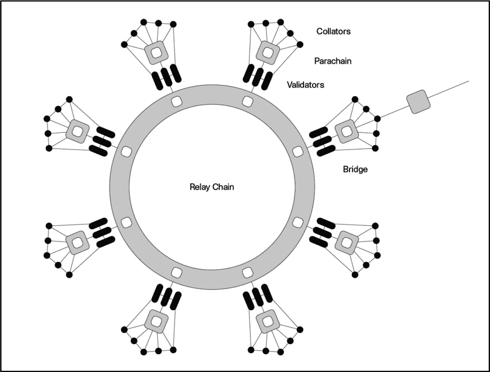
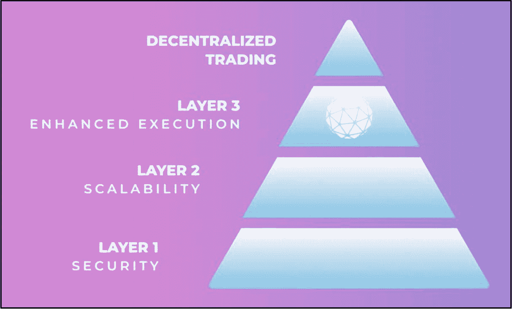

# 区块链架构层

**评估目标：评估第 0 层、第 1 层、第 2 层或第 3 层区块链项目的价值与潜力，以及构建在这些区块链之上的任何 `dApp`。**

区块链层仅仅是系统中相互堆叠的不同层级，它们协同工作，共同实现使底层区块链更高效运行的总体目标。通常需要多个区块链层和协议层，因为区块链本身并不完美，且难以随着需求的增长进行扩展，从而导致网络拥堵、可用性差、交易处理速度慢以及 Gas 费用高昂，给最终用户带来糟糕的体验。

每一层都对下层进行补充，通过增加新功能或进行改进，从而创建一个更高效的系统。这些层级分别表示为：第 0 层（`L0`）、第 1 层（`L1`）、第 2 层（`L2`）和第 3 层（`L3`）。这些层级共同改善了最终用户的整体体验，并旨在满足那些希望通过区块链技术优化其业务传统企业的需求。区块链公司致力于设计一个强大且能够自由扩展无任何限制的区块链系统。不幸的是，在撰写本书时，大多数区块链在没有分层协议帮助的情况下无法实现这一目标。

值得注意的是，并非每个区块链都是多层的。有许多区块链并不依赖 `L2` 或 `L3` 来提供支持。在某些情况下，网络流量很小，使得额外的扩展层变得没有必要。一个新兴的或不太受欢迎的区块链可能也缺乏足够的用户基础来证明此类开发的合理性。此外，一些区块链在设计之初就具备了先进的原生可扩展性和互操作性功能，从而消除了对外部层的需求。例如，`Polkadot` 利用其`中继链`和`平行链`来实现可扩展性和高吞吐量，完全绕开了对 `L2` 或 `L3` 解决方案的需求。

通过理解区块链层，投资者可以做出明智的投资决策。本节第一部分将讨论四个架构层——`L0` 到 `L3` ——之间的区别，随后介绍一个评估流程，将这些层级作为独立的生态系统进行投资分析。

## 区块链层概览

介绍区块链层最简单的方法是将它们比作建筑的不同部分——请参考以下类比。

**第 0 层区块链 –** ***地基***

`L0` 提供了基础性的基础设施，其他一切均构建于此之上。它还有助于连接多个区块链，使它们能够相互通信，并在彼此之间传输资产和信息。

**第 1 层区块链 –** ***建筑主体***

`L1` 是主要的区块链协议，它可以独立运行，也可以构建在 `L0` 之上。这一层负责交易的执行、验证以及链上活动和操作。

**第 2 层协议 –** ***公用设施（空调、水电等）***

`L2` 是一个优化层，其主要任务是提高 `L1` 的效率，帮助解放 `L1` 基础层，使其能够扩展并降低交易成本。

**第 3 层协议 –** ***高级功能（智能系统）***

`L3` ——构建于 `L2` 之上——为`dApps`和区块链基础设施提供额外的功能、性能和互操作性。

表 6-1

区块链分层架构结构

| **第 3 层 (L3) 协议**（例如 Orbs Network） |
| **第 2 层 (L2) 协议**（例如 Immutable X, Lightning Network） |
| **第 1 层 (L1) 区块链**（例如 Ethereum, Binance Chain, Moonbeam, Cardano, bitcoin） |
| **第 0 层 (L0) 区块链**（例如 Polkadot, Cosmos） |

## 第 0 层区块链

**示例：** [Polkadot Network](https://polkadot.network/), [LayerZero](https://layerzero.network/), [Cosmos Network](https://cosmos.network/)

第 0 层（`L0`）区块链可以运行自己的原生链，同时作为一个基础层，让更高级别的系统——例如第 1 层网络、第 2 层解决方案、侧链和 `dApps` ——在此基础上构建并独立运行。它们提供底层安全性，并实现无摩擦的跨链互操作性，促进构建于其上的所有区块链和平台之间的通信以及数据和资产的无缝交换。`L0` 力求提供一次性解决方案，以解决业内已知的问题，例如区块链之间的可扩展性和互操作性，从而旨在为用户提供跨多个网络的无缝体验。此外，`L0` 允许开发者构建创新的、定制化的、可扩展的区块链和 `dApps`，并具备增强的交易速度、链上治理、互操作性、质押和隐私等功能。

`Polkadot Network` 是 `L0` 区块链的一个绝佳范例，它提供了“平行链”基础设施（图 6-1），拥有一个真正的多“平行”链应用环境，其中增强的可扩展性和跨链互操作性为跨多生态系统网络及更广阔的范围提供了无摩擦的通信和无缝的数据传输。

图 6-1

Polkadot 网络平行链架构（图片引用自 [`https://guide.kusama.network/docs/polkadot-v1/`](https://guide.kusama.network/docs/polkadot-v1/)）

### Polkadot 区块链基础设施的核心组件

图 6-1 展示了 Polkadot 的整体架构及对应组件。Polkadot 的`中继链`——以环形表示——充当系统的主链，其周围环绕着多个与之相连的平行链。每个平行链通过中继链相互通信。Polkadot 架构中每个核心组件的功能（根据 Polkadot 网络的描述）如下：

- **中继链** – Polkadot 的核心，负责网络的共享安全、共识和跨链互操作性。
- **验证人** – 通过质押`DOT`、验证来自收集人的证明以及与其他验证人共同参与共识来保障中继链的安全。
- **平行链** – 主权区块链，可以拥有自己的代币，并针对特定用例优化其功能。
- **收集人** – 通过收集用户的碎片交易并为验证人生成证明来维护碎片。
- **桥梁** – 允许平行链和平行线程连接外部网络（如以太坊和比特币）并进行通信。
- **平行线程** – 与平行链类似，但采用按需付费模式；平行线程无需锁定`DOT`以长期租用插槽，而是在每次提交区块时支付少量费用，因此活动频率不高的项目可以避免持续连接带来的较高成本。

### 第一层区块链

**示例：** [以太坊](https://ethereum.org/en/)、[BNB 链](https://www.bnbchain.org/en)、[月神网络](https://moonbeam.network/)

第一层（L1）区块链，也称为*基础层*，提供了一个基于区块链的基础设施，开发者可以在此基础上构建各类服务、产品和软件应用。L1 通常是独立的区块链基础设施，提供并使用自身的共识机制来保障网络安全。它们依靠跨链桥和其他跨链互操作方法与其它区块链和生态系统进行通信。L1 区块链的一个典型例子是以太坊，它承载了数千个提供广泛产品和服务的去中心化应用 (dApps)。这些 dApps 的著名示例包括 [Uniswap](https://uniswap.org/)、[Aave](https://aave.com/) 和 [OpenSea](https://opensea.io/)。

尽管 L1 通常是独立的基础设施，但有时它们会得到底层零层网络的支持，并在某些方面由其保障安全和支持。如前所述，任何构建在 L0 之上的 L1 都会继承令人称赞的优势，例如跨链互操作性、增强的安全性，以及构建易于使用的定制化 L1 区块链的潜力。

[月神网络](https://moonbeam.network/) 是一个构建在波卡网络（Polkadot Networks）L0 去中心化、安全且可扩展的平行链基础设施之上的 L1 区块链的绝佳例子。许多 dApps，包括 [SushiSwap](https://www.sushi.com/swap)、[Band Protocol](https://www.bandprotocol.com/) 和 [Curve](https://curve.fi/%2523/ethereum/swap)，都构建在月神网络上。然而，这些 dApps 受益于月神和波卡区块链基础设施的安全性，从而实现更强的跨链“多生态系统”互操作性、可扩展性、去中心化治理功能，以及低成本和快速交易处理。

### 第二层协议

**示例：** [Immutable](https://www.immutable.com/)、[闪电网络](https://lightning.network/)、[Polygon zkEVM](https://polygon.technology/polygon-zkevm)

第二层（L2）是建立在底层 L1 区块链之上的另一个区块链或链下协议解决方案的总称。L2 旨在解决父级 L1 区块链的问题，例如网络拥塞、可扩展性差、交易速度慢、交易费用高以及整体用户体验不佳。这是通过扩展底层 L1 区块链来实现的，即提高吞吐量（在任意给定时间内能从一处处理到另一处的工作量）和交易处理速度。

L2 协议的工作原理是，在将大量交易批量处理并在父区块链上返回和处理之前，先在链下进行验证。这减少并降低了 L1 区块链在典型共识和交易处理过程中必须执行的工作。需要注意的是，L2 协议解决方案的安全性来源于其父级 L1 区块链。

[Immutable X](https://www.immutable.com/) 是以太坊上的第二层协议，它通过使用 StarkWare 基于 ZK-STARK 的 *validium* 系统，在不牺牲安全性或去中心化的前提下提升了吞吐量：交易批次被压缩成 *“有效性证明”* 形式并提交到以太坊进行最终验证，而数据本身则保存在链下。然后，该证明被发送到第一层父区块链（以太坊）进行处理。这项技术是 [StarkWare](https://starkware.co/) 开发的 NFT 专用交易所、证明逻辑和卷叠技术的结合。Immutable 尖端的第二层 NFT 交易协议每秒可处理超过 9,000 次 NFT 转账、交易和铸币。

第二层协议的另一个例子是比特币[闪电网络](https://lightning.network/)。闪电网络在比特币区块链之上创建了第二层，它使用用户生成的微支付通道来帮助实现更快、更便宜的交易，而无需更改区块大小。

### 第三层协议

**示例：** [*Orbs 网络*](https://www.orbs.com/)

第三层（L3）协议——一个新兴的、定义相对松散、构建于 L2 解决方案之上的类别——旨在为 dApps 和底层区块链基础设施增加额外的功能、互操作性和性能。它们还为每个 dApp 提供具有高度可定制选项和安全特性的应用特定功能。与 L2 协议一样，L3 协议继承并利用了底层 L1 区块链（例如以太坊区块链）的安全性。

L3 的一个例子是 Orbs 网络，这是一个为广泛的链上 DeFi 应用（不仅仅是高级交易）而设计的区块链基础设施。Orbs 通过提供用于聚合流动性、算法和限价订单、去中心化衍生品以及其他金融模块的工具来增强 DeFi 功能。

图 6-2

Orbs——用于去中心化交易的第三层

