# 区块链分层“生态系统”评估

在投资零层（L0）、一层（L1）、二层（L2）和三层（L3）区块链时，将其作为生态系统而非单个项目来评估会更有益处。区块链生态系统是一个围绕特定区块链协议构建的、由基于链的应用程序、参与者和技术组成的互联网络。不要采用单一的类似 GDP 的指标，而应将区块链生态系统视为一个经济体，考察多项指标——网络活动、开发者参与度、总锁仓价值（`TVL`）和链上收入——来衡量其价值创造与创新能力。每个生态系统都应像评估一个“国家”那样进行评估，以便在特定的区块链评估标准下判断网络的整体健康状况和价值。

尽管技术（如互操作性、可扩展性和去中心化程度）非常重要，但区块链生态系统的潜在价值源于开发者增长与留存、基础设施技术实力、链上竞争以及协同软件集群等标准，并且也应依据这些标准进行评估。以下各节将详细介绍如何评估区块链网络生态系统，并为每个评估标准提供示例。

## 价值创造效率

### 开发者增长与留存

开发者的增长与留存对于生态系统的创新、效率和实力至关重要。图 6-3 展示了来自[`DeveloperReport.com`](https://DeveloperReport.com/)的一张图片，详细列出了顶级生态系统的月活跃开发者数量。该数据进一步细分为全职开发者人数和开发者总人数，并以百分比形式显示一年到两年内开发者数量是增加还是减少。投资者可以进一步操作该表格，查看每个生态系统中开发者数量的最高增长和最高减少情况。

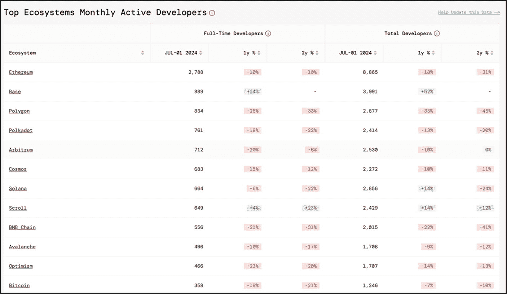

**图 6-3** – 顶级生态系统的月活跃开发者（数据来源：[`https://www.developerreport.com/`](https://www.developerreport.com/)）

**专业提示：** 查看由 [Electric Capital](https://www.electriccapital.com/) 生成的“[开发者报告](https://www.developerreport.com/developer-report?%253Fs%253Ddeveloper-report)”，可以深入了解顶级生态系统的开发者指标详情。

### 基础设施技术实力

基础设施的可访问性以及功能和`dApps`的易用性（例如去中心化钱包以及用于购买、出售和交易数字资产的各种浏览器扩展）对于支持生态系统的发展至关重要。访问[`AlphaGrowth.io`](https://AlphaGrowth.io/)可以轻松获取特定生态系统中某一细分领域的软件应用数量。

从下拉菜单中选择所需的生态系统和`dApp`类型，即可显示所选生态系统中该特定细分领域的`dApps`数量。例如，图 6-4 显示了以太坊区块链上去中心化钱包应用的详细信息和数量——在编写本书时总共有 62 个。

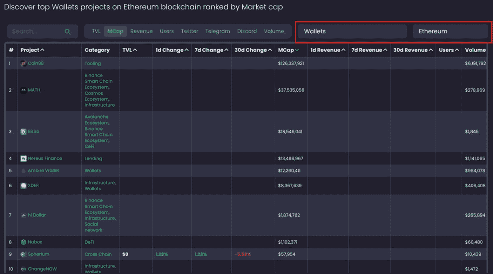

**图 6-4** – 按市值排名的以太坊区块链顶级钱包（数据来源：[`https://alphagrowth.io/projects/top-wallets-projects-on-ethereum-by-market-cap-value`](https://alphagrowth.io/projects/top-wallets-projects-on-ethereum-by-market-cap-value)）

**专业提示：** 由于以太坊是最古老、最成熟的智能合约平台，拥有最悠久的历史和最广泛的`dApp`生态系统，建议将所有发现与以太坊在相同的分析参数下进行比较。这将很好地表明与以太坊相比，该基础设施的技术实力水平如何。

除了去中心化钱包和各种类型的浏览器扩展之外，一个生态系统还必须拥有足够的开发者软件和基于学习的编码应用程序，并为加入生态系统的新创作者提供配套文档——通过快速简便的检查即可确定这一点。例如，通过简单的浏览器搜索以太坊开发者工具，可以定位到`Ethereum.org`上的以太坊学习工具（[`https://ethereum.org/en/developers/learning-tools/`](https://ethereum.org/en/developers/learning-tools/)）。以太坊的学习门户包含数十个应用程序，新手可以在其中学习编写代码并在测试环境中进行部署——参见图 6-5。此外，以太坊还有大量可供使用的配套文档，涵盖了从初学者到高级的广泛专业知识，包括介绍、基础、智能合约和各类教程等类别。

除了通过`Ethereum.org`提供的开发者软件和文档之外，还有许多网站提供学习工具、环境和配套文档，帮助新手学习以太坊的原生语言 [Solidity](https://soliditylang.org/)。将以太坊作为基准，因为它存在时间最长，并且提供了丰富的开发者工具和指南。

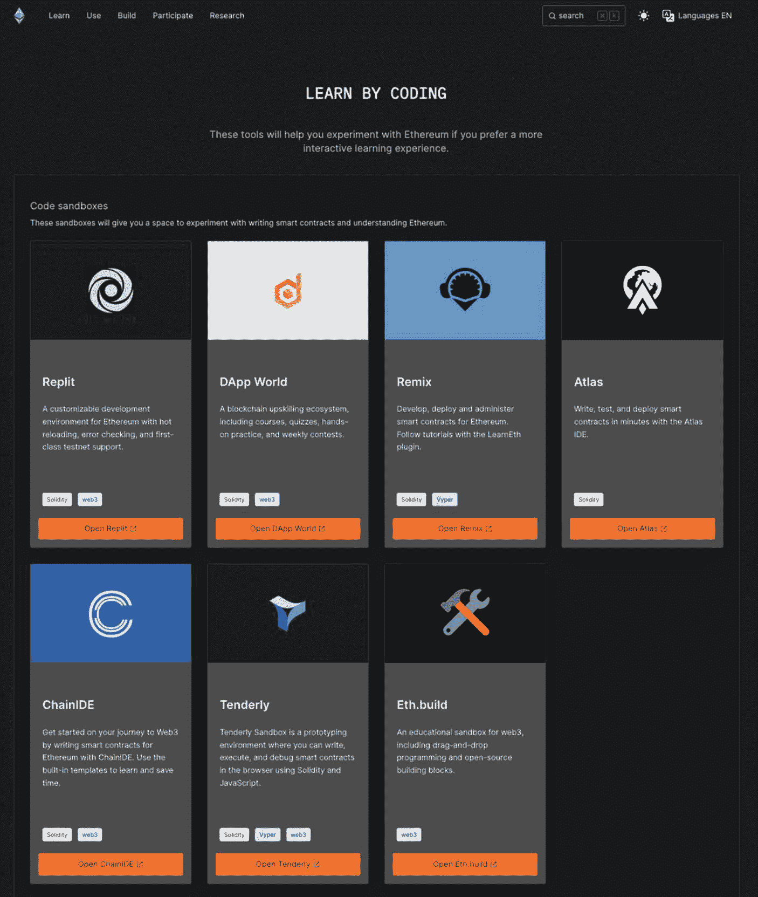

**图 6-5** – 以太坊的学习门户，包含数十个应用程序，新手可在其中学习编写代码并在测试环境中部署（截图来源：[`https://ethereum.org/en/developers/learning-tools/`](https://ethereum.org/en/developers/learning-tools/)）

## 链上竞争与协同

### 链上竞争

为了支持并培育一个不断发展的生态系统，同一生态系统内相同细分领域的`dApps`之间必须存在充分的竞争。如果提供相同产品或服务的软件应用缺乏直接竞争，就会产生不良的垄断，阻碍创新，导致开发停滞、用户成本高昂，以及生态系统低效且不健康。

投资者检查链上竞争的最有效方式是访问[`AlphaGrowth.io`](https://AlphaGrowth.io/)，筛选所需的生态系统，再进一步筛选特定产品或服务。例如，图 6-6 展示了来自[`AlphaGrowth.io`](https://AlphaGrowth.io/)（[`https://alphagrowth.io/projects/top-dex-projects-on-binance-smart-chain-by-tvl`](https://alphagrowth.io/projects/top-dex-projects-on-binance-smart-chain-by-tvl)）的一张图片，其中所有去中心化交易所（DEX），总共 369 个，都构建在[币安智能链](https://www.bnbchain.org/en/bnb-smart-chain)上。BSC 上如此之高的 DEX 数量表明活动频繁；然而，需要注意的是，这些项目中有许多是交易量低的简单分叉，因此除了关注宏观数据外，还需验证其质量和实际使用情况。

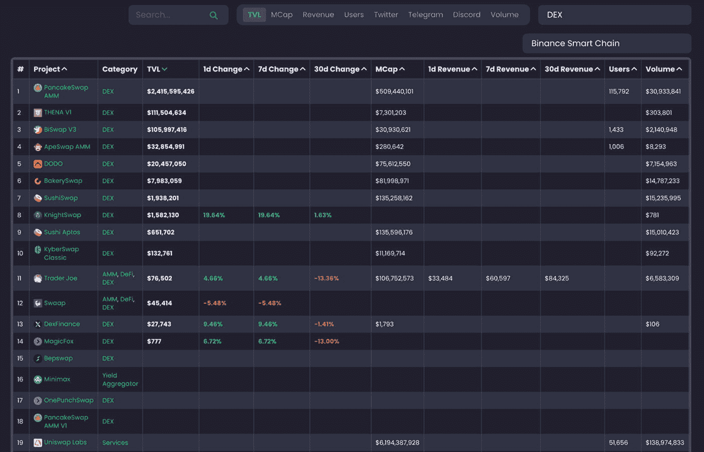

**图 6-6**
币安智能链上可用的 DEX（撰写本书时共计 369 个）（数据来源：[`https://alphagrowth.io/projects/top-dex-projects-on-binance-smart-chain-by-tvl`](https://alphagrowth.io/projects/top-dex-projects-on-binance-smart-chain-by-tvl)）

## 2. 链上协同效应

每个加密货币项目都有特定的产品或服务为用户和客户创造价值——这被称为价值主张。与传统中心化公司类似，基于区块链的项目通常会整合和互补彼此的产品与服务，以提升客户价值。这些项目通常表现出协同效应，并且通常处于相同或相似的领域。此外，当它们协同工作时，能够创造出比独立运营更大的价值输出。

为了使生态系统蓬勃发展并充分发挥其潜力，它必须整合来自不同领域的多样化加密货币项目，以支持彼此的成长。有多种潜在的加密货币项目组合类型能够彼此产生协同效应，包括 DeFi dApp 与游戏、NFT 与 DeFi、稳定币与 DeFi、DeFi 与现实世界资产代币化应用、各种 L1、L2 和 L3 组合，以及 DEX 和分层区块链，例如[Sushi 和 ZetaChain](https://www.sushi.com/blog/sushi-partners-with-zetachain)的案例。通过 Sushi 与 ZetaChain 的集成，用户可以在多达 30 个区块链网络上交换原生 BTC，不过该功能依赖于跨链消息传递，并且正在分阶段推出。投资者有责任确认他们所投资的生态系统——无论是 L0、L1、L2 还是 L3——是否具备多样化的项目类型，并且每个类别中都有大量项目，以推动长期增长和协同效应。这一原则同样适用于投资生态系统内的一个基于 dApp 的项目。一个拥有多样化 dApp 并协同运作的大型、繁荣的生态系统，为项目充分发挥潜力提供了丰沃的环境。没有繁荣的生态系统，任何 dApp 的潜在增长都可能受到显著阻碍。投资者验证此信息的最有效方式是访问[`AlphaGrowth.io`](https://AlphaGrowth.io/)，在那里他们可以根据投资的是 dApp 还是分层区块链项目来筛选结果——文中提供了两种类型的示例以供参考。

### 第层“生态系统”区块链项目投资

要检查一个 L0、L1、L2 或 L3 生态系统是否拥有多样化的项目类型，并且每种类型中都有大量项目，请访问[`AlphaGrowth.io`](https://AlphaGrowth.io/)并筛选您想要投资的项目。审查该生态系统中指定的项目类别，包括每个类别中的项目数量。例如，图 6-7 展示了构建在[Cosmos 网络](https://cosmos.network/)（一个第零层区块链）上的一些项目，第二列显示了 Cosmos 生态系统中每个项目的类别。如果需要，也可以按类别进行筛选。始终将结果与流行的、一流的生态系统进行比较。

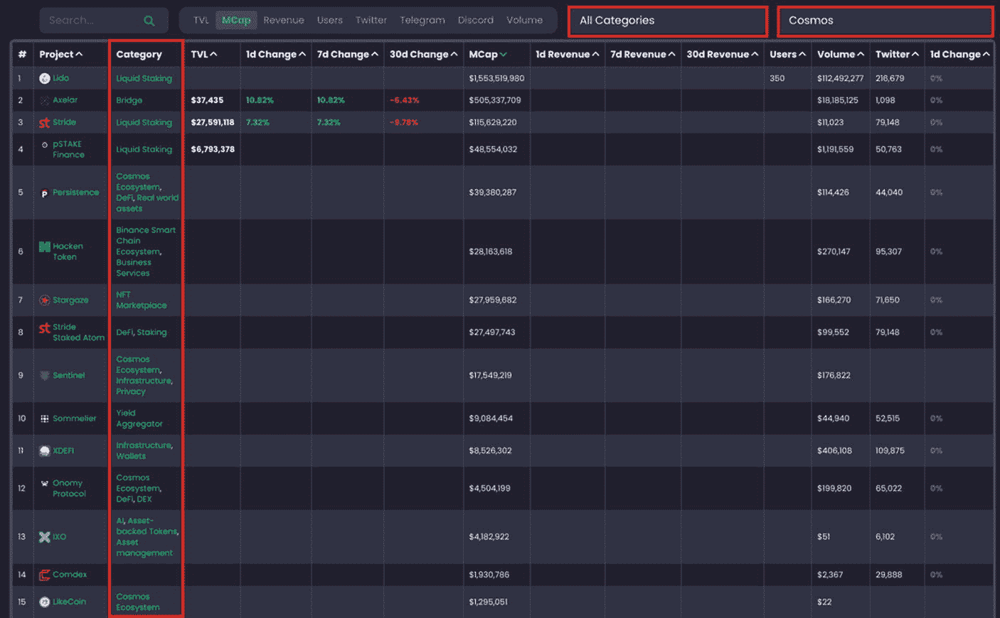

**图 6-7**
构建在 Cosmos 网络上的项目及其对应的项目类别（数据来源：[`https://alphagrowth.io/projects/top-all-projects-on-cosmos-by-market-cap-value`](https://alphagrowth.io/projects/top-all-projects-on-cosmos-by-market-cap-value)）

### 去中心化应用（dApp）投资

在投资一个 dApp 时，投资者必须首先确定该 dApp 所属的生态系统（区块链网络）。一个拥有多样化 dApp 并相互协同运作的大型、繁荣的生态系统，为项目（dApp）充分发挥潜力提供了丰沃的环境。相反，一个多元化程度差、网络内项目数量少的生态系统，将阻碍其内任何项目的成长。图 6-8 来自[`AlphaGrowth.com`](https://AlphaGrowth.com/)，展示了一个名为[Aave](https://aave.com/)的 DeFi 项目，红色框高亮显示了 Aave 可用的所有区块链。

一旦确定了 dApp 所在的生态系统名称，就可以按照“*第层‘生态系统’区块链项目投资*”中概述的步骤来评估该生态系统。如果 dApp 处于一个繁荣的生态系统中，那么它成功的机会要高于同一个 dApp 处于多元化程度差、项目数量少的生态系统中。

**图 6-8**
Aave（DeFi 项目）显示其所在的所有可用链（生态系统）（数据来源：[`https://alphagrowth.io/aave`](https://alphagrowth.io/aave)）

### 行动步骤

请遵循以下步骤评估第 0 层、第 1 层、第 2 层或第 3 层区块链项目以及构建在这些区块链之上的任何 dApp 的价值和潜力。

1.  **识别待评估的 L0、L1、L2 或 L3 生态系统**

2.  **按照“**区块链第层‘生态系统’评估**”部分所述的方式评估该生态系统**

3.  **记笔记并以您自己的风格记录发现**

4.  **将发现结果与基本面评估过程的其他部分相结合**

#### 结果评估

如果评估结果表明生态系统状况不佳，建议记录你的发现，并稍后再次进行分析，以判断是否有进展的迹象。项目可能处于初创阶段，需要时间才能获得发展动力。无论如何，投资一个只有不到一百个项目的微型生态系统风险很高，除非它在基本面全面分析的每个其他方面都表现出色。

## 区块链三元悖论

由以太坊创始人[维塔利克·布特林](https://en.wikipedia.org/wiki/Vitalik_Buterin)提出的*区块链* *三元悖论*指出，定义区块链的三个关键要素——*去中心化*、*安全性*和*可扩展性*——无法完美共存。开发者们不断优化协议以平衡去中心化、安全性和可扩展性，但目前总需要做出一些权衡；随着区块链用户群的扩大，这三个要素中必然会有一个受到影响。在大多数情况下，如果一个区块链高度安全且可扩展性强，则去中心化会受到影响；或者如果一个区块链是去中心化且安全的，则可扩展性会受到影响。这是区块链技术最难以克服的挑战之一，并直接影响最终用户。关键挑战在于同时实现可扩展性、安全性和去中心化。

以太坊区块链就是一个例子。虽然以太坊高度安全且近乎完全去中心化，但它面临着严重的可扩展性问题。解决区块链三元悖论的战斗仍在继续。诸如卷叠、分片和模块化设计等持续的研究不断在削弱这个三元悖论，尽管完全解决它仍是未知数。[波卡网络](https://polkadot.network/)的中继链和平行链设计提高了可扩展性和互操作性，但这本身也伴随着去中心化方面的权衡——因此，三元悖论只是得到缓解，并未完全解决。

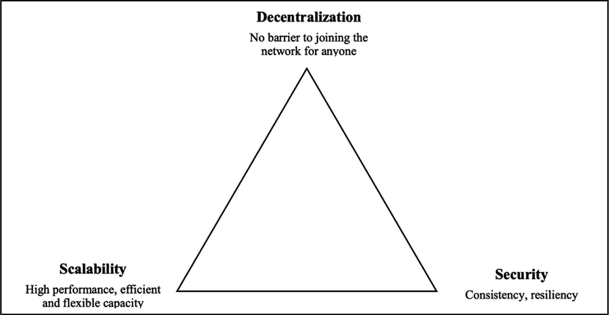

图 6-9

区块链三元悖论

在投资基于区块链的项目之前，了解其在可扩展性、安全性和去中心化方面的局限性与挑战至关重要。这些方面会显著影响项目的盈利能力、可用性和整体性能。以下各节将讨论区块链三元悖论的三个特征——去中心化、可扩展性和安全性——并强调在投资前需要考察的潜在风险和关键点。

### 去中心化

**评估目标：确定项目是否存在可能损害其性能、安全性以及长期成功或可持续性的中心化特征。**

本节涵盖中心化系统、去中心化系统和分布式账本技术。投资者需要了解这项技术的基础知识，因为它是区块链技术的支柱。将讨论实施特定中心化流程的项目所面临的长期风险。至关重要的是，这些中心化流程，如在线存储、治理结构和矿池，不能危及所提供产品或服务的长期安全性和性能。还将讨论影响去中心化的其他中心化因素，为投资者提供有价值的见解，以评估投资前的潜在痛点。

当一家新公司决定选择去中心化还是中心化网络时，没有绝对的正确或错误答案。这完全取决于业务类型、规格和运营要求。加密项目主要是去中心化的；然而，去中心化的程度因项目而异。许多项目在治理方面具有很强的中心化特征，这决定了区块链的整个运营和方向。这意味着一个中心化机构决定诸如质押、归属、代币分配、费用、挖矿奖励以及通胀和通缩率等要素。

去中心化最大的好处之一是它创造了透明度，并将投票权等真正的权力交还给社区。然而，当项目的部分环节是中心化的，这就违背了初衷。如果你正在投资去中心化的数字资产，务必仔细审视它们的去中心化程度。检查是否任何中心化方面可能影响项目的安全性、性能或长期成功。

表 6-2 详细说明了中心化、去中心化和分布式系统的结构。为简单起见，首先探讨中心化系统，然后是去中心化和分布式系统，包括去中心化分布式账本技术。

表 6-2

中心化、去中心化和分布式通信系统

| 中心化、去中心化和分布式通信系统 |
| --- |
| 中心化 | 去中心化 | 分布式 |
| --- | --- | --- |
| 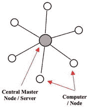 | 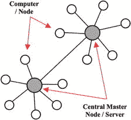 | 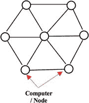 |
| **优点** | **优点** | **优点** |
| • 简单、快速部署• 维护成本低廉• 一致性• 专用资源• 快速更新• 出色的用户界面/用户体验 | • 更高的灵活性/可扩展性• 更快的性能• 增强的隐私性• 高可用性• 自治/自我治理• 促进个人自由• 减少权力不对称 | • 极高的容错性• 速度和可扩展性• 增强的透明度• 更高的可靠性与可用性• 改进的性能 |
| **缺点** | **缺点** | **缺点** |
| • 宕机风险增加• 高度依赖网络连接• 安全风险较高• 可扩展性有限• 数据备份可能性较小 | • 维护成本高• 协调问题• 主服务器全部崩溃时宕机风险增加• 安全风险较高• 可扩展性有限 | • 维护成本高• 协调问题• 有时难以达成共识 |

#### 中心化系统

中心化网络是当今最常用的系统类型。这是一种网络配置，参与者需要通过单一的中央权威机构才能相互通信。中央权威机构负责处理、存储和操作用户数据；访问通常需要基于权限，并仅限于获得批准的参与方，而非对网络上的所有人开放。如表 6-2 所示，这个中央权威机构被称为“`中央主节点`”或“服务器”。连接到主节点的是若干标准节点（计算机），通常被称为“`客户端节点`”。客户端节点连接到主服务器，可以提交数据请求，而非直接执行这些请求。

在中心化网络中，只有已知且经过识别的参与方才能在此网络上进行交易。因此，来自客户端节点的所有交易或请求都可以被审计。一次简单的审计就能识别出网络中任何行为恶意的坏角色。在治理方面，整个网络由所有者或中央权威机构治理和控制。网络参与者对于网络的结构性变更或发展方向几乎没有权利或影响力。所有用户权限都由中央治理机构控制，并且通常受到限制。

重要的是要注意，在中心化系统中，所有网络参与者（客户端）无法在没有中心服务器（也称为“`主节点`”）的帮助下直接相互通信。如果中心节点发生故障，那么系统就会崩溃，并可能导致严重问题，例如安全漏洞和系统停机——这被称为“单点故障”。这种单点故障对黑客很有吸引力，一旦被攻破，数据很容易被网络中的恶意行为者利用。

中心化系统的一个例子是 `Dropbox`，其中每个用户都通过一个中央主节点进行通信和连接。假设鲍勃想通过 Dropbox 与爱丽丝分享一份文档。他首先会通过共享一个 Dropbox 链接（或等效方法）邀请爱丽丝查看该文档。当爱丽丝点击链接时，她会连接到 Dropbox 的主服务器（主节点），鲍勃已将文档存储并保存在那里。中心化系统是组织中最常见的一种系统类型，其中客户端向公司服务器发送请求并接收响应。其他类型的中心化系统包括传统银行、中心化数据库、AWS、YouTube、Reddit、IBM 和 Wikipedia。

#### 去中心化系统

根据《韦氏词典》，“`去中心化`”可以定义为这样一个过程：组织的活动，特别是那些涉及规划和决策的活动，从中央权威地点或团体分散或委派出去。去中心化系统的一个重要因素是，在治理公投中，每个网络节点都拥有投票权。此外，不存在单一的实体或“`主节点`”来接收和响应请求。如表 6-2 所示，在去中心化网络中至少有两个主节点。这些主节点可以相互通信，从而使网络上的所有节点（也称为对等点）能够彼此通信。大多数去中心化网络采用点对点（P2P）架构——节点之间直接对话，无需单一主节点——但一些项目采用联合或混合模型，这些模型仍然将控制权从单一中央实体分散出去。

以传统的云存储系统为例。在中心化系统中，当个人将数据上传并保存到“云端”时，数据会被发送并保存在一个称为数据中心的服务器场中。数据中心包含数千台存储我们信息的服务器和硬盘驱动器。不幸的是，这种系统存在许多缺陷。拥有这些云存储系统的组织完全控制着客户数据（或资产），有时这些数据会被利用来牟利。此外，数据中心是一个单点故障，这意味着如果该数据中心发生任何事情，例如破坏性火灾、病毒、网络攻击，或者互联网因某种原因停止工作，那么客户数据将处于严重危险之中。

去中心化解决了中心化系统中常见的问题。去中心化一个强大的核心要素是信息分布在众多节点上——通常是通过区块链系统中的分布式账本，尽管其他去中心化设计可能使用联合存储或八卦协议。这意味着去中心化系统不像中心化系统那样依赖于单一主节点或单点故障。因此，去中心化是一种网络冗余，确保没有更少的实体能够控制网络。这是去中心化的关键因素和优势之一。如果一个坏角色试图破坏一个节点，该尝试会被网络的其他部分拒绝，除非攻击者控制了其共识资源的多数——例如，在“`工作量证明`”链中超过总哈希算力的 51%，或在“`权益证明`”网络中持有超级多数的质押代币——这些条件在经济和技术上都难以实现。

通过链上治理，去中心化允许网络参与者——网络节点和代币持有者——在链上公投中投票，这有助于引导和控制区块链的运作。去中心化是公共开源区块链网络的一个基本属性，在这些网络中，参与者无需授权即可读取、写入数据并为共识做出贡献。

去中心化的区块链还提供了验证交易和智能合约的能力，而无需信任权威机构（例如银行）。它创造了抗审查性，因为没有中央权威机构可以治理和决定你的数字财产的命运。这也是近来人们将大量关注点从中心化系统转向去中心化系统的主要原因之一。例如，通过去中心化金融，人们拥有治理和控制自己资产的权利和许可，而无需任何中心化实体的干预——这被称为“`自主权`”，即自我治理个人资产的权利。此外，与中心化系统不同，去中心化提供了透明、高效、节约成本、建立可信生态系统，以及在某些情况下的隐私和匿名性等优势和特性。

#### 中心化与去中心化系统

关于中心化与去中心化系统的争论一直存在。在决定采用中心化还是去中心化网络进行业务运营时，用户需求对企业起着重要作用，有些企业甚至选择混合模式。在某些情况下，使用去中心化网络可能不合时宜，或者无法满足中心管理机构所要求的规格。然而，尽管目前存在可扩展性和能耗问题，但去中心化系统每天都在进步，并且相对于传统的中心化系统具有显著优势。表 6-3 重点列出了中心化与去中心化网络的优缺点。

**表 6-3** 中心化与去中心化系统对比

| 传统中心化系统与公共去中心化区块链对比 |
| --- |
| 特性 | 中心化系统 | 去中心化系统 |
| --- | --- | --- |
| 所有权 | 服务提供商 | 所有用户 |
| 架构 | 客户端/服务器 | 去中心化分布式技术 |
| 安全性 | 设计良好时可高度安全，但依赖单一管理域 | 减少单点故障，但引入新的攻击面和协调风险 |
| 高可用性 | 是（通过冗余、负载均衡和故障转移机制） | 是 |
| 容错性 | 是（通过冗余服务器、备份和自动故障转移实现） | 是 |
| 抗合谋性 | 基础，因其受控于一个群体甚至单个个体 | 高度抵抗，共识算法可确保防御对手 |
| 应用架构 | 单一应用 | 应用复制到网络中的所有节点 |
| 信任 | 消费者必须信任服务提供商 | 无需相互信任 |
| 消费者成本 | 通常较高（服务商费用或订阅费） | 通常较低，但可能因网络费用（如 Gas 费）而飙升；成本因用例而异 |
| 匿名性 | 通常有限（通常需要身份证明或 KYC；少数服务提供部分伪匿名） | 取决于协议；大多数是伪匿名而非完全匿名 |
| 隐私性 | 否 | 是（但在大多数情况下，不包括交易数据） |
| 透明性 | 否 | 是 |
| 治理/投票权 | 否 | 是 |
| 延迟 | 低延迟，直接通信最小化延迟 | 由于分布式共识，延迟较高 |
| 能耗 | 低能耗 | 较高，尤其是在工作量证明（PoW）系统中 |

#### 分布式账本技术

分布式账本技术（DLT）是一种技术基础设施，允许在由互连节点（计算机）组成的网络数据库中同时进行访问、验证、记录和更新。可以将其视为一种去中心化的记录保存系统，其中多个分散的参与方（节点）共同协作，执行特定任务并维护一个共享数据库，即账本。当提出数据变更时，网络首先达成共识；一旦达成一致，新信息将被提交并在所有节点之间复制，确保账本的每个副本保持一致。

在分布式账本网络中，数据在对等节点之间共享，以完成特定任务，例如保护数据、达成共识、增强处理能力或带宽，或者建立一个无中心管理机构的全球结构。DLT 的概念已在多个行业中使用数十年，例如医疗保健领域用于存储医疗记录，供应链管理领域用于跟踪货物并为客户提供透明度，以及金融系统中的跨境支付、贸易融资以及简化清算和结算等流程。

在分布式系统中，网络节点和计算资源通常在地理上是分散的。这使得网络中的每个节点都能平等地处理和访问数据。在决策过程中，节点根据系统规则参与共识——例如，一些网络赋予每个节点一票，而其他网络则根据权益、声誉或指定角色来分配投票权重。DLT 的主要优势之一是其高度容错性，这意味着即使一个或多个组件发生故障，系统仍能无中断地继续运行。这使得 DLT 非常安全可靠。

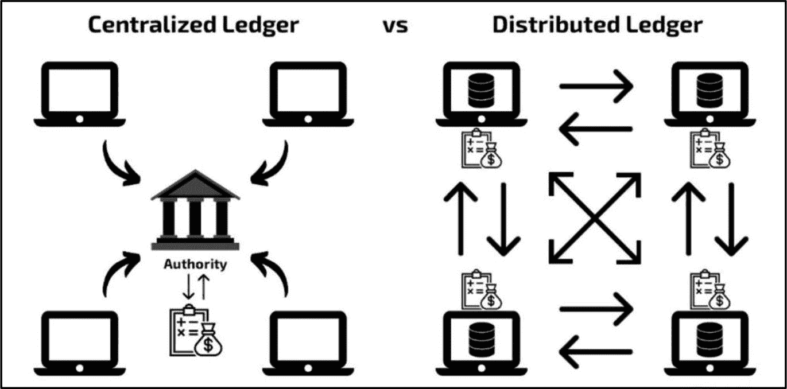

**图 6-10** 中心化账本与分布式账本对比（图片来源：[`imiblockchain.com/blockchain-vs-distributed-ledger-technology/`](https://imiblockchain.com/blockchain-vs-distributed-ledger-technology/)）

需要重点指出的是，与中心化系统不同，分布式账本是去中心化的，这意味着它没有单一故障点（主节点）——请参阅图 6-10。这大大降低了系统故障和攻击的风险，因为数据分布并在网络节点之间共享，而非由中心管理机构存储和控制。

### 区块链与分布式账本技术（DLT）

区块链技术与分布式账本技术（DLT）相互关联但又有所不同。DLT 是一个总称，指代任何依赖共享数据库，在共享网络（根据用例，可以是公开/开放网络，也可以是许可/私有网络）中处理、记录和验证交易的系统。DLT 有多种形式，而区块链采用的是一种特定类型的 DLT 实现方式，其中数据以“区块”为单位线性组织。每个区块都带有一个时间戳，以及指向前一个区块的链接，从而形成一条由区块组成的链条——这便是“区块链”名称的由来。

> **事实**  
> 另一种类型的 DLT 是[有向无环图](https://www.sciencedirect.com/science/article/pii/S0895435621002407)（DAG），这是一种使用拓扑排序的去中心化数据结构，其中每个节点都指向单一方向，且不存在循环，能够在区块链系统中实现更快的交易速度和可扩展性——例如，[Fantom](https://fantom.foundation/)区块链就采用了 DAG 技术。

虽然所有区块链都是一种分布式账本，但并非所有分布式账本都是区块链。区块链在几个关键方面与 DLT 存在显著区别。

**表 6-4：区块链与 DLT 的主要区别**

| 特性 | 区块链 | 分布式账本技术（DLT） |
| --- | --- | --- |
| **定义** | 一种 DLT 类型，数据以线性链接的区块形式存储，并使用加密哈希保证安全。 | 一种去中心化的记录保存系统，由多个节点协同工作，执行特定任务并维护一个共享数据库。 |
| **结构** | 组织成线性链接的区块链条，每个区块包含交易数据。 | 可以组织成多种结构，例如基于区块的链、DAG（有向无环图）或其他配置。 |
| **不可篡改性** | 高度不可篡改；数据一旦写入区块，几乎无法更改。 | 因系统而异：某些 DLT 可能允许在特定条件下进行更改或修改。 |
| **透明度** | 通常是公开且透明的。 | 可以是公开、私有或需许可的，具有不同程度的透明度。 |
| **效率** | 常因可扩展性问题而效率较低。 | 可能效率更高，尤其是在许可或私有环境中。 |
| **用例** | 常用于加密货币、智能合约和公共账本。 | 应用广泛，包括供应链管理、医疗保健、金融等领域。 |
| **可扩展性** | 通常存在可扩展性问题，尤其在使用基于工作量证明（PoW）的共识机制时。 | 一般来说更具可扩展性，因为不同的 DLT 可以针对性能和效率进行优化。 |
| **安全性** | 由于密码学技术和去中心化特性，安全性很高。 | 安全性各异；虽然去中心化提供了稳健性，但某些 DLT 可能更注重速度而非安全性。 |
| **灵活性** | 灵活性较低；它遵循严格的区块链条结构，可能限制其适应性。 | 灵活性更高，可以采用不同的结构和协议来满足特定的客户需求。 |

最常用的采用 DLT 的区块链是比特币。比特币利用了*去中心化的公共分布式账本技术*，比特币网络中的节点通过共享账本达成共识、记录、共享、追踪和同步交易。为了使比特币节点在其分布式账本上达成共识，各节点之间需要达成一致，并根据协议设计，定义应包含在共享数据库中的交易数据。在比特币中，每笔交易被打包进一个区块，区块头包含一个加密哈希，用以链接到前一个区块——从而形成一个不可篡改的记录链条。

### 真正的去中心化

区块链技术可以存在于不同程度去中心化的环境中。通常，加密项目被归类为去中心化。然而，在现实中，每个项目都存在各种中心化因素。项目方常常集成中心化流程以协助运营或满足其他定制需求，而这些需求在以去中心化方式实现时并不可行或难以完成。因此，尽管加密项目底层的节点结构是去中心化的，但大多数项目并非完全去中心化。

尽管付出了真诚的努力，但要实现真正的去中心化仍极其困难。以[Coinbase](https://www.coinbase.com/)为例，其稳定币 USDC 本质上是中心化金融（CeFi），因为它与美元一比一挂钩，并由 Circle（一家受美国监管的单一企业发行商）发行和管理。此外，Coinbase 由一家名为[Coinbase Global, Inc](https://www.sec.gov/Archives/edgar/data/1679788/000162828021003168/coinbaseglobalincs-1.htm)的中心化实体拥有和支持。许多加密货币项目都有中心化的开发团队来编写和维护代码，而不是公开允许任何人参与项目代码和方向的贡献。治理结构也常常是中心化的，诸如升级或协议变更等关键决策由项目内的一小部分人做出，而非通过透明的投票流程让更广泛的社区参与。

日益增加的*中心化层级*会影响去中心化区块链的安全性。它威胁到去中心化区块链的无需许可的特性，并为主流采用设置障碍。区块链技术的核心基础价值在于其“无需信任”，这意味着你无需信任第三方：银行、个人或任何可能在你与数字资产交易或持有之间起中间作用的中介。当引入各种中心化层级时，这种“无需信任”的因素就会被削弱，导致区块链用户在使用产品或服务时必须“信任”个人或中心化权威机构（例如，中心化软件、服务器和运营团队）。这会产生单点故障和针对性的恶意行为，从而抵消区块链技术所具有的全部价值和有益特性。在一个“去中心化”的加密项目中引入的每一个中心化层级，都会增加遭受攻击、被利用和发生故障的可能性。

> **事实**  
> 去中心化程度极高的加密项目几乎不可能被监管，因为没有可以强制或制裁的特定个人或机构。这意味着中央机构无法将其关闭，例如比特币。

### 影响去中心化的中心化因素

投资者在调查某个加密项目的中心化程度是否已经或将损害其性能和长期成功方面，扮演着重要角色。可以注意到，大多数项目都带有一定程度的中心化特征，但依然运营良好。然而，那些依赖许多中心化流程的项目会使投资者面临单点技术故障、内部人员对资金的控制以及突发监管干预的可能性，因此你的投资受损的可能性要高得多。

### 影响真正去中心化的因素

1.  **代币分配/共识权力**

    如果少数个人或机构持有代币供应量的绝大部分，项目将面临安全风险。如果大部分代币供应集中在少数代币持有者手中，他们就有能力通过治理投票轻易操纵重大决策。这对于采用权益证明（PoS）共识机制的项目来说是一个重大威胁。项目的原生代币必须在持有者之间均匀分布，以均衡分配共识权力。请注意，某些 PoS 链——例如卡尔达诺（Cardano）的 `Ouroboros` 协议——内置了诸如随机领导者选举和权益委托等保障措施，以限制大利益相关者的影响力。

2.  **挖矿算力分布**

    挖矿节点分布指的是挖矿算力（哈希率）和交易验证在区块链网络不同参与者之间的分布情况。节点在验证交易和维护网络安全方面扮演着关键角色。一个分布良好、全球化的挖矿算力和节点网络能提升去中心化程度，显著降低单一实体控制网络的可能性，从而减少**51% 攻击**的几率——更多细节见“51% 攻击”部分。

3.  **治理结构**

    治理是在组织、系统或网络内制定并实施决策的过程。主要有三种类型的治理结构：中心化、去中心化以及混合模式（兼具中心化和去中心化特征）。区块链治理将在“治理”部分进行探讨。

    1.  **中心化治理模式** – 在中心化治理结构中，决策权集中在项目团队或一小部分利益相关者手中。这个小群体做出所有决策、制定政策并执行规则。通常，任何变更都必须通过人工方式在链上实施，这需要开发者投入大量人力。

    2.  **去中心化治理模式** – 去中心化的“链上”治理模式将决策权分散到更广泛的参与群体中，将投票权交还给网络中的节点和利益相关者。这些决策通常在链上自动执行（取决于区块链的特性和功能）。该模式提倡一个公平、透明、民主的投票系统，任何单一实体都无法控制。比特币就是去中心化治理模式的一个例子。

    3.  **混合治理模式** – 大多数混合型“链下”治理模式由中心化和去中心化元素组成，社区和利益相关者可以进行投票。投票由项目团队收集、统计，并公开发布结果。尽管这种模式将权力交还给社区和利益相关者，但它严重缺乏透明度，因为投票无法在链上被公开追踪，除了信任项目团队的诚实之外别无选择。

4.  **基础设施、存储与运营**

    区块链基础设施流程是帮助构建、支持和维护去中心化生态系统发展的基础要素，使其对最终用户可用。这些流程包括原生和第三方钱包、去中心化存储以及去中心化交易所（DEX），允许用户无需中介即可买卖数字资产。这消除了对中心化应用和服务的依赖。尽管具有挑战性，但一个真正去中心化的基础设施不应依赖中心化服务和应用，因为这会增加中心化风险，尤其是在这些风险叠加时。

    许多加密项目采用的一个更关键的中心化方面是中心化云存储。使用传统的中心化云存储系统存在风险，因为对中心化服务器（单一故障点）的依赖使其成为网络攻击的主要目标。一次黑客攻击可能导致网络分布问题、隐私泄露、数据丢失、社区信任丧失以及对个人投资造成破坏性影响。

    1.  **存储** – 类似区块链交易历史的数据应使用去中心化解决方案进行存储，以确保真正的去中心化。例如，应使用 [Akash Network](https://akash.network/) 和 [IPFS](https://ipfs.io/)（星际文件系统）等去中心化服务，而不是 [亚马逊云服务](https://aws.amazon.com/)（AWS）等中心化服务。

    2.  **网站前端** – 网站的前端通常托管在中心化服务器上。开发者可以利用 Akash Network 和 IPFS 等去中心化服务来托管其网站前端数据。

    3.  **中心化交易所** – 中心化交易所面临被关闭或黑客攻击的风险。然而，避免使用 CEX（中心化交易所）是一个棘手的障碍，因为它们对资产的可见性和可访问性有重大影响。不过，对于加密资产的长期存储，强烈建议投资者将其资产存放在冷存储设备上，例如 [Trezor](https://trezor.io/) 或 [Ledger](https://www.ledger.com/)。

5.  **开发者与支持者**

    由少数个人、开发者和机构集中负责开发与运营，可能会损害项目的性能、安全性和长期存续能力。这一点之所以重要，原因如下。

    1.  ***存续能力*** – 如果核心团队（包括各团队成员、开发者、支持者）发生任何不测，项目将消亡、破产或以多种其他方式受到严重影响。参与加密货币项目的无关联的个人、开发者和机构越多，其去中心化程度就越高，从而减少不必要的风险。

    2.  ***安全性*** – 当项目由少数个人、开发者和机构运营时，更容易遭到黑客攻击或被内外部恶意行为者攻破。

### 分层基础设施对去中心化的影响

区块链项目或 dApp 的去中心化程度，通常直接受到其所依赖的分层基础设施去中心化程度的影响。以 [Centrifuge](https://centrifuge.io/) 为例，它建立在 [波卡网络](https://polkadot.network/) 之上。波卡正引领着最去中心化的零层协议的发展，因此 Centrifuge 天然受益于这些去中心化特性。尽管 Centrifuge 仍然有能力控制和定制其自身的去中心化方面，但分析其底层的基础设施层是理解其去中心化潜力的一个坚实起点。

### 行动步骤

在投资加密项目时，建议评估该项目的去中心化程度。完成此项任务有助于投资者识别出那些可能增加攻击风险，或损害项目长期生命力、成功性以及你投资回报的中心化环节。请记住，一个项目完全去中心化是极具挑战性的；然而，它越接近完全去中心化，就越能免受任何中心化攻击、操纵或故障的影响。

请遵循以下步骤来判断一个项目是否表现出可能损害其性能、安全性、长期成功或可持续性的中心化特征。更多详情请参阅“影响去中心化的中心化因素”部分。

以下评估步骤的大部分（若非全部）答案通常可在白皮书、项目官网及官方博客文章中找到。如果存在任何未知信息，请通过公司的官方联系渠道和经过验证的社交媒体渠道联系项目团队和社区。

1.  **代币分配/共识权力**
    1.  确定代币供应是否在资产持有者之间均匀分布。如果大部分供应集中在少数个人、机构和/或团队成员手中，这是一个危险信号。
        1.  查阅白皮书以获取代币供应分配信息。在这里，你将找到团队、投资者和社区的分配比例（关于代币供应的更多内容见“代币经济学与设计”章节）。
    2.  使用适用的区块浏览器（例如 [`Etherscan`](https://etherscan.io/) 或 [`BscScan`](https://bscscan.com/)）来验证持有大量代币供应的钱包。

此外，在 [`Google.com`](https://Google.com/) 上快速搜索也可以。例如，只需在 Google 中输入“Moonbeam largest wallets”，即可搜索 Moonbeam 网络的前几大钱包持有者。第一个链接会将你带到显示 Moonbeam 顶级持有者的页面。处理前请始终验证 URL。

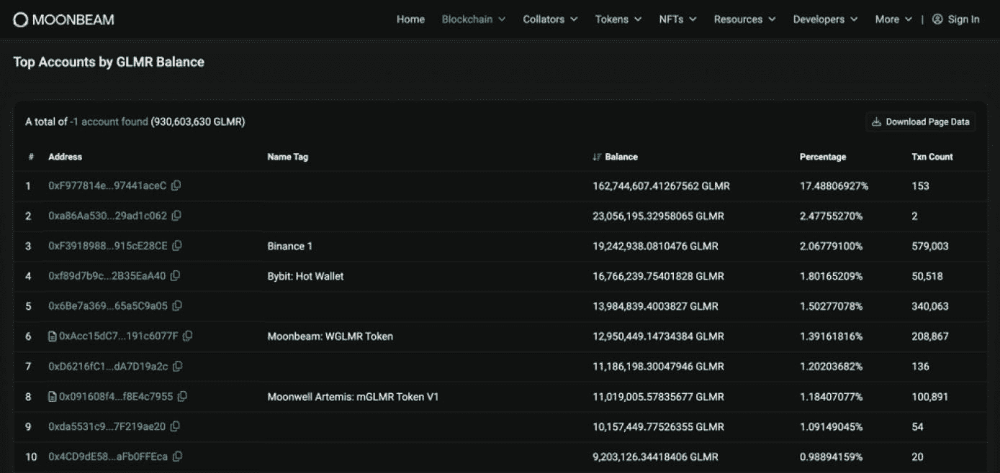

图 6-11

按 GLMR 余额排名的顶级账户（数据来源于 [`https://moonscan.io/accounts`](https://moonscan.io/accounts)）

2.  **挖矿算力分布**

如果没有公开的挖矿分布图，请直接联系项目团队获取数据。请注意，这些信息有时难以找到，这取决于网络，尤其是当它不是一个热门网络时。更详细的评估请参阅“51% 攻击”部分。

3.  **基础设施、存储与运营**
    1.  审查项目官网、白皮书、官方博客文章和 dApp，以识别其基础设施、存储或运营中是否存在任何中心化组件（如果有的话）。
    2.  如果项目团队使用中心化存储，而非诸如 [Akash Network](https://akash.network/) 和 [IPFS](https://ipfs.io/)（星际文件系统）等去中心化存储应用，则需极度谨慎。

4.  **治理结构**
    1.  审查项目白皮书和其他技术文档，以确定团队是否实施了中心化、去中心化或混合治理模式。区块链治理将在“治理”部分进行更详细的探讨和评估。

5.  **开发者与支持者**
    1.  是否有许多无关联的个人、开发者和机构参与该项目？你可以通过多种方式进行检查：
        1.  查看公司网站，获取所有支持者和投资者的名单。
        2.  前往 [`GitHub`](https://github.com/)，检查开发者数量以及项目是否开源。更多信息见第 10 章“项目团队”。
        3.  在 [`LinkedIn`](https://www.linkedin.com/) 上查看公司页面，以了解所有内部参与该项目的人员。

6.  **做好笔记，用自己的风格记录发现**

7.  **将发现结果与基本面评估流程的其他部分相结合**

#### 结果评估

项目团队在主要产品或服务中使用的中心化流程越少，通常实现的去中心化程度就越高。使用中心化流程并不一定是危险信号，但主要或完全使用去中心化软件流程的项目往往具有更高的安全性和对投资者的吸引力。

## 可扩展性

**评估目标：** 判断区块链项目是否具备强大的可扩展性，这将直接影响在其上构建的任何去中心化应用（dApps）的可扩展性。

近年来，区块链经历了极高的人气和增长。然而，这是有代价的，一个关键的设计问题已经显现：它们在负载增加时无法扩展。在撰写本文时，可扩展性被认为是区块链基础设施的瓶颈。任何曾在链上发送过数字资产的人，都可能经历过由于网络拥塞而导致的极其缓慢的交易处理速度、高昂的燃料费和糟糕的用户体验——这是区块链可扩展性受限的典型症状。但区块链可扩展性究竟意味着什么？

区块链可扩展性指的是区块链在负载增加的情况下进行扩展并维持用户效率的能力。更进一步说，区块链可扩展性定义了一种能力：在支持高交易吞吐量的同时，能够持续增长以容纳越来越多的区块链参与者。需要注意的是，区块链可扩展性主要通过其*吞吐率*和*延迟*来衡量。

**吞吐量**

对于区块链技术而言，*吞吐量*是指在任何给定时间内可以处理的交易数量的平均度量。吞吐量以**每秒交易数**（TPS）衡量，也可以每分钟交易数（TPM）来衡量。它反映了区块链在特定时间框架内处理特定数量交易的能力。

每个区块的交易数量和区块之间的时间间隔会影响区块链的吞吐量。例如，大约每十分钟（600 秒）生成一个新的比特币区块，在此期间平均处理约 4000 笔交易。TPS 的计算方法是用交易数量除以秒数。因此，比特币的 TPS 约为 6.67（4000/600）。许多因素会影响区块链的 TPS 速率，例如延迟、区块大小与时间、共识机制以及可扩展性解决方案。所有这些要素都将在本节中解释。

如前所述，TPS 表明了区块链在任何给定时间可以处理多少笔交易。当一个区块链变得流行时，用户数量会呈指数级增长。对于大多数区块链而言，当这种情况发生时，额定 TPS 将变得不足，因为等待处理的交易数量超过了区块链的最大 TPS。此时，网络变得拥塞，导致用户效率低下。其原因不仅仅是 TPS 低，另一个因素是*延迟*，它是可扩展性的一个关键要素。

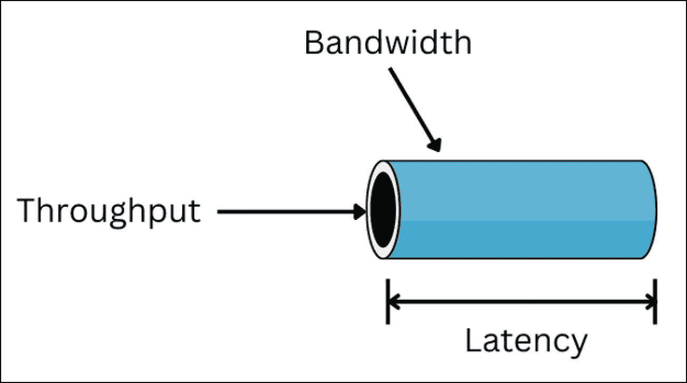

图 6-12

吞吐量、带宽和延迟的表示（图片致谢：[`https://shardeum.org/blog/latency-throughput-blockchain/`](https://shardeum.org/blog/latency-throughput-blockchain/)）

**延迟**

延迟——通常称为区块纳入时间——是从交易广播到首个区块确认之间的时间，而最终确定性则标志着该区块变得不可逆转。这两者可能不同；在以太坊上，纳入时间平均约为 12 秒，而完全最终确定性则需要约 13 分钟（两个纪元）。与 TPS（本质上是任何给定时间可以处理的交易数量）不同，最终确定性包含了从交易请求开始的完整过程，包括将交易打包进区块、广播到网络节点、区块验证，以及将区块添加到区块链中。

虽然高吞吐率对于系统高效处理大量交易至关重要，但最终目标是实现低延迟，以确保快速的交易处理和无缝的用户体验。尽管难以实现，但在吞吐量和延迟之间取得平衡对于区块链可扩展性至关重要。许多因素会影响延迟和吞吐量，包括共识机制、带宽、网络拥塞以及自身施加的扩展限制，例如为了增强安全性而设置最大区块大小。

**事实**

比特币的首个确认大约在 10 分钟内到达，但经济上的最终确定性通常是在六个确认（约 60 分钟）之后计算。Moonbeam 在大约 1 分钟内达到概率最终确定性，而 Fantom 的 Lachesis 协议在 1-2 秒内完成区块的最终确定。

在比特币区块链上发送资产时，可扩展性问题尤为突出。由于比特币无法扩展——至少在没有侧链或二层网络（如闪电网络）帮助的情况下无法扩展——当大量用户执行交易时，它经常会变得拥塞。这对性能产生了巨大影响，表现为交易处理时间长、交易费用增加，从而影响了用户体验。

**带宽**

在区块链的语境中，*带宽*指的是网络在特定时间内可以传输或处理的数据量（比特/秒）。带宽至关重要，因为它限制了用户或网络节点在给定时间范围内可以执行的操作数量。例如，可以把带宽想象成一条拥有最大且有限车道数的高速公路。在区块链中，这种限制对于维持稳定的网络运行、防止过载以及确保交易安全至关重要。

#### 区块链可扩展性术语

表 6-5 列出了与区块链可扩展性相关的主要因素和常用术语。请注意，尽管所有这些因素都至关重要，且直接影响区块链的扩展能力，但其中某些项目，如智能合约复杂性、能源消耗、成本、区块大小和网络负载，对于大多数数字资产投资者而言被认为过于繁琐。因此，它们未被纳入本书的整体基础评估策略。然而，了解这些因素及其阻碍区块链可扩展性、性能和用户效率的能力是有益的。

**表 6-5**

区块链可扩展性术语（致谢来源：[区块链及相关问题：当前研究主题综述：管理分析杂志：第 5 卷，第 4 期 – 获取访问权限 (tandfonline.com)](https://www.tandfonline.com/doi/full/10.1080/23270012.2018.1516523%253Fscroll%253Dtop%2526needAccess%253Dtrue)）

| 编号 | 因素 | 描述 |
| --- | --- | --- |
| 1 | 交易吞吐量 | 指协议在一秒内可处理的交易总数，以每秒交易数（TPS）衡量。高交易吞吐量备受推崇，前提是不影响去中心化或安全性。 |
| 2 | 延迟 | 指从交易广播到其首次被包含在区块中（区块包含延迟）的时间。以秒或毫秒衡量。最终性——区块变得不可逆的时间点——是一个独立的衡量指标。 |
| 3 | 存储 | 指区块链可能消耗的总空间/容量。 |
| 4 | 区块大小 | 理想情况下，区块大小需达到平衡——较大的区块可提升容量，但会减慢传播速度，增加孤块风险。 |
| 5 | 智能合约 | 智能合约的复杂性可能导致处理时间的延迟。 |
| 6 | 计算能耗 | 指算法（或使用系统）在区块挖矿过程中是否消耗大量能源。根据共识机制的类型，某些区块链在挖矿和交易验证过程中会消耗更多能源和时间。 |
| 7 | 网络负载 | 指网络正在承载的交易数量。网络拥塞是区块链负载增加的结果。 |
| 8 | 成本问题 | 指在区块链中验证交易相关的总成本。 |
| 9 | 节点数量 | 指区块链网络中可用的节点总数。高网络节点数会增加去中心化程度，但根据所使用的共识机制，对达成共识时间的影响因协议而异——某些设计（例如，雪崩协议或 Algorand）即使有数千个验证器也能维持低延迟的最终性。 |
| 10 | 共识模型 | 共识机制代表批准/验证区块链交易的过程。 |

### 共识机制

共识机制可被视为区块链架构的核心，可扩展性在此蓬勃发展。它们是区块链技术的重要组成部分，并在保障区块链网络的安全性、去中心化和可扩展性方面发挥着关键作用。正如《*区块链可扩展性挑战的系统文献综述*》中所述，Khan D 指出，有二十篇期刊论文将共识机制列为关于公共区块链可扩展性的第二个最常讨论的因素。这些巧妙设计的共识机制还与区块链的吞吐量相关，而吞吐量又与区块链的整体性能相关联。

#### 什么是共识机制？

共识机制是一种系统协议，规定了交易如何处理、验证以及添加到区块链中。当网络参与者在区块链上发起交易时，该交易会被广播到网络节点，并与其他交易一起放置在虚拟*区块*内。利用预先定义的共识机制，这些交易区块由网络节点验证，并逐块添加到区块链中。共识机制还负责整个网络中区块链的安全性和完整性。它们有多种不同类型和形式，每一种都会影响区块链的吞吐量、整体性能和安全性。

两种最常见的共识机制类型是工作量证明（PoW）和权益证明（PoS）。这两种共识机制都在无需任何可信权威机构的去中心化点对点网络上运行。其他常用的共识机制包括委托权益证明（DPoS）和权威证明（PoA）。一些网络则采用基于有向无环图（DAG）的数据结构，并结合独立的共识算法（例如，雪崩协议）。

