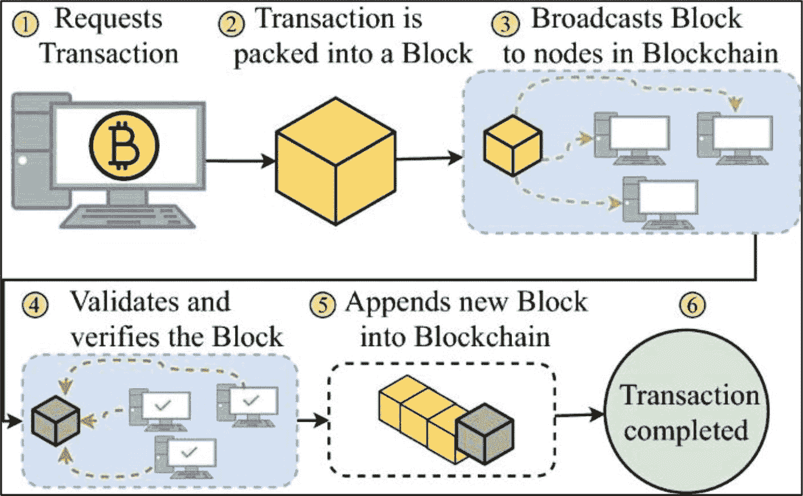

# 工作量证明（PoW）

`工作量证明（PoW）`是一种在区块链网络中使用的共识算法，用于确认交易并向区块链添加新区块。*挖矿*特指矿工们互相竞争，基于特定交易集解决数学问题（谜题）的活动，而`PoW`则是概述网络上验证交易规则与流程的通用框架。其底层逻辑支撑着像`比特币`这样的去中心化系统的运行。

**事实**

根据 `Digiconomist` 的比特币能源消耗指数（2025 年 4 月快照），该网络每笔链上交易消耗约 600 千瓦时——大致相当于普通美国家庭 20 天的用电量。每笔交易的实际消耗会随`哈希率`、区块占用率和矿机效率而波动。

当网络参与者发起一笔交易时，该交易会被放入一个*内存池*（也称为*mempool*），与其他未确认交易放在一起。`内存池`存储在每个节点上，可以描述为一个虚拟等候室，未确认和待处理的交易会在此停留，直到*矿工*对其进行处理并添加到下一个区块。`内存池`的数据会被发送到比特币网络的所有节点。节点从`内存池`中选择未确认交易，并将其放入一个未确认的区块中。

**事实**

在比特币早期，挖矿使用普通 CPU，后来是 GPU；如今，盈利性挖矿需要使用专用集成电路（`ASIC`）矿机。然而，运行一个完整的比特币节点仍然只需要具备足够存储和带宽的现成硬件。

通过`工作量证明（PoW）`共识机制所概述的交易验证流程，每个拥有未确认区块的节点互相竞赛，争取第一个解开数学谜题，从而“确认”并验证它们正在处理的区块是否有效。这种验证和交易记录保存的过程被称为挖矿——即“工作量证明”中的“工作”。这个使用交易数据的数学谜题极其复杂，取决于区块目标以及编码在未确认区块中的区块`随机数（nonce）`。首先解开谜题的节点提供了“工作量证明”，并赢得组装下一个区块的权利，通常会从`内存池`中选择手续费最高的交易，然后将其提交到链上。此外，首先解开谜题的矿工还会赢得奖励。就比特币而言，矿工们会获得新挖出的 BTC 作为激励——因此被称为“挖矿”——同时也会以 BTC 的形式收取交易手续费，作为处理网络交易的报酬。这种以挖矿奖励形式的激励措施，是防止节点作恶的一种手段。

**事实**

随着比特币接近其 2100 万枚的硬顶（区块补贴约在 2140 年结束），矿工将主要依赖交易手续费；到 2040 年，补贴已降至每区块低于 0.2 BTC。

一旦区块被确认，它就会被广播给所有网络参与者，由网络上的其他节点进行二次确认和进一步验证。这为区块增加了稳定性和安全性，使其更难被篡改。已确认的区块会链接（引用）到前一个“父”区块的*哈希值*，形成一条*区块链*，因此得名*区块链*。这个*哈希值*由一种名为“安全哈希算法”（*SHA-256*）的数学加密哈希算法生成，并存储在每个区块的头部。将每个区块链接到其父区块的哈希序列，形成了一条可追溯到第一个区块（即*创世区块*）的链条——区块链。

**图 6-13** 典型的加密货币交易（致谢：[`https://link.springer.com/content/pdf/10.1007/s10586-021-03301-8.pdf`](https://link.springer.com/content/pdf/10.1007/s10586-021-03301-8.pdf)）

**事实**

挖矿和工作量证明（`PoW`）是相关的概念——挖矿是使用算力解决复杂数学问题并验证区块链上新交易的过程，而工作量证明（`PoW`）是要求矿工执行此工作并相互竞争以创建新区块和赚取奖励的共识机制。

如果恶意行为者试图通过更改区块的已确认数据（例如一个月前的数据）来破坏网络，那么直到那个时间点的所有区块哈希都必须一致并随之改变。由于所需算力巨大，这种情况极不可能发生。此外，比特币区块链被认为是一条*不可篡改*的、由反向链接的区块组成的链条，用于存储交易数据。区块越深，其不可篡改性就越强。如果这种极不可能的事件真的发生，攻击者需要控制比特币网络超过 51%的挖矿哈希率——这被称为`51%攻击`。尽管可能，但人们怀疑这种情况是否会发生。这就是区块链如此安全的原因，也是它被视为*不可篡改*的原因。

比特币网络上的一个典型区块包含特定信息；见下表。

**表 6-6** 典型比特币区块数据

| 字段 | 大小 | 描述 |
| --- | --- | --- |
| 4 字节 | 4 字节 | 区块的大小，以字节为单位 |
| 区块头部 | 80 字节 | 来自区块头的若干字段 |
| 交易计数器 | 可变（1-9 字节） | 区块中的交易总数（包括*币基交易*） |
| 交易列表 | 可变 | 区块中的交易 |

## 网络流量增加的因素

基于工作量证明（`PoW`）的网络，如比特币，以拥塞而闻名。网络拥塞是由大量交易引起的，其原因多种多样，例如区块链的普及、经济新闻、市场暴跌，甚至是知名人士（例如 [埃隆·马斯克](https://en.wikipedia.org/wiki/Elon_Musk)）在社交媒体上发布关于某个项目的帖子。这可能导致网络参与者等待很长时间才能处理他们的交易。为了加快处理速度，用户通常会向网络矿工支付更高的交易手续费，以优先处理他们的交易。

##### 权益证明（PoS）

权益证明（PoS）是一种共识机制，用于验证传入交易并将其作为新区块添加到区块链上。PoS 和 PoW 都由网络参与者而非中心化机构运营，并且两者的目的和最终目标相同；然而，交易验证过程却大相径庭。

在 PoS 系统中，矿工被称为*验证者*。验证者承诺在区块链上的智能合约中“*质押*”其代币或硬币。验证者是通过综合考虑质押数量（有时也包括质押时长），同时加入随机性或轮换委员会的方案来选出的——例如，以太坊的信标链通过 `RANDAO` 抽签来决定区块提议者；提议一个区块通常被称为铸造（或锻造）。验证者质押的币越多，被选中的机会就越大，这要求他们通过验证者流程锁定这些币。利用此方法的项目示例是[以太坊](https://ethereum.org/en/)区块链。以 PoS 区块链原生新铸造代币形式的奖励，会发放给在验证过程中完成工作的验证者。验证者验证交易的时间越长，质押的代币数量越多，其权力也就会越大。

PoS 通过惩罚那些不当验证有害或欺诈数据的恶意验证者来维护安全性和良好行为。如果发现验证者行为不端，其部分甚至全部质押金可能会被没收。在能源方面，PoS 比 PoW 更节能、更具可扩展性；然而，它可能更容易受到中心化以及富余节点攻击的影响。表 6-7 简要总结并比较了 PoW 和 PoS 共识机制。

**表 6-7** PoW 与 PoS 对比

| PoW 与 PoS 对比 | |
| --- | --- |
| 工作量证明 (PoW) | 权益证明 (PoS) |
| --- | --- |
| 区块创建者被称为矿工。 | 区块创建者被称为验证者。 |
| 交易处理和验证速度慢。 | 交易处理和验证速度快。 |
| 成本高。挖矿过程需要昂贵的设备（`ASIC`）和能源。 | 成本低。主要要求是质押（代币或硬币）；验证可在消费级硬件上运行。 |
| 不节能——矿工互相竞争。 | 节能——随机选择验证者。 |
| 难以扩展。 | 更易于扩展。 |
| 由于前期投入高，安全性强。 | 网络控制权可以被购买。 |
| 矿工获得区块奖励。 | 验证者获得交易费作为奖励。 |
| 存在 51% 攻击的可能性。 | 能抵抗 51% 攻击——社区可以移除合谋的验证者群体。 |

##### 其他类型的共识机制

除了 PoW 和 PoS 之外，区块链技术中还使用了几种其他共识方法，包括以下几种：

- **提名权益证明（`NPoS`）** – 这是权益证明（`PoS`）的一种变体，代币持有者提名验证者来保护网络安全。这些验证者通过创建新区块获得奖励。他们的奖励基于其质押数量和声誉。

- **权威证明（`PoA`）** – 这是一种共识机制，通常用于私有链和许可链，其中只允许有限数量的授权验证者验证交易。

- **有向无环图（`DAG`）** – 一种交易排序数据结构，而非共识机制。像 `IOTA`、`Hedera` 和 `Avalanche` 这样的网络将交易存储在 `DAG` 中，并在其之上运行一个单独的共识层。与单条线性链相比，这种并行图结构允许多个验证者同时添加交易，从而提高了吞吐量并降低了延迟。

- **实用拜占庭容错（`PBFT`）** – 这是一种提供高容错性的共识算法，确保区块链即使在某些节点发生故障或实施恶意行为时也能正常运行。它通常用于仅允许受信任节点访问的许可链和私有链中。

- **委托权益证明（`DPoS`）** – 这是一种共识机制，代币持有者投票选举出一小组代表，由这些代表代表他们验证交易并创建新区块。著名的 `DPoS` 网络包括 `EOS`、`Tron` 和 `Bitshares`。

##### 最具可扩展性的共识机制

要确定最高效且最具可扩展性的共识机制颇具挑战性，因为这涉及诸多因素，例如区块链的类型（公有链、私有链、许可链、非许可链、中心化或去中心化）。此外，区块链的特定用途可能需要特定类型的共识机制来满足其产品或服务需求。然而，基于 PoW 的区块链（例如比特币）——由于其所需的工作量、算力和工作量——被认为非常安全，但效率最低。

本文讨论的许多共识机制，如 `PoS`、`NPoS` 和 `DPoS`，被认为比基于 PoW 的区块链更快速、更具可扩展性。比特币自成一派，因此很难将 PoW 与基于 PoS（或类似机制）的项目进行比较。像 DeFi、DEX、游戏、物联网等需要极快速度和低交易成本的项目，通常会避免使用基于 PoW 的共识机制；相反，它们会采用 `PoS` 或其类似变体。例如，在以太坊从 PoW 过渡到 `PoS` 之前，Uniswap 上的交易——尤其是在用户量高峰期——费用极高，有些交易花费数百美元，且处理时间漫长。随着以太坊采用 `PoS` 共识机制，交易处理时间和成本已显著降低。

#### 可扩展性改进解决方案

为了克服可扩展性问题，区块链必须具备随着需求增加而提高其计算*吞吐量*并降低其*延迟*的能力。然而，实现这一目标通常需要付出代价。根据“区块链不可能三角”，随着区块链可扩展性的提高，去中心化和安全性会受到影响。确实，通过牺牲去中心化和安全性，可以实现更高的吞吐量和更低的延迟。例如，减少参与共识的全节点数量可以提高吞吐量，因为需要交换消息的验证者减少了。然而，削减全节点集合会降低去中心化程度和整体安全性；由于更少的验证者控制着更大的权力份额，发生 [51% 攻击](https://d.docs.live.net/9aa056cd36528f9f/Documents/Blockchain%20Book/51%2525%20Attack)的可能性就会增加。（轻客户端或 `SPV` 客户端不参与此计算，因为它们不在共识中投票。）

幸运的是，持续不断的扩容解决方案正在开发中，其主要目标是帮助扩展主链（父链），例如以太坊，同时努力维持去中心化和安全性。为便于理解，扩容解决方案主要分为两组：*第一层扩容解决方案*和*第二层扩容解决方案*。

