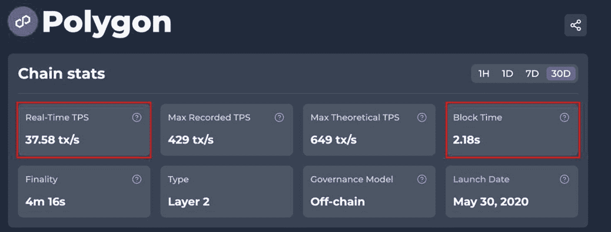
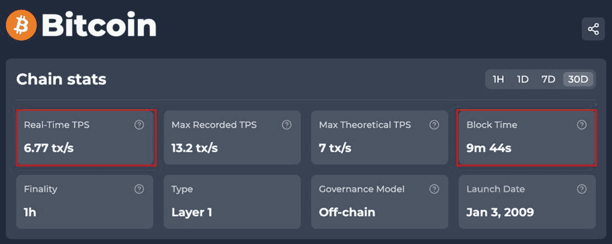

# 第一层与第二层扩容方案

区块链扩容方案主要分为两大类：第一层和第二层扩容方案。第一层扩容方案通过改变区块链系统的参数来提升性能，这些参数主要关注区块链的共识机制、网络层和数据结构（例如分片技术，它将状态和交易处理分散到相互协调的分片链中，这些分片链仍与主链共享安全性，涉及区块大小、区块生成时间及区块压缩）。

相比之下，第二层扩容方案（通常称为链下方案）是在现有的第一层基础上构建（分层）的。这些方案提出的扩容机制在主第一层区块链之外运行，但由于多种原因（包括资产与交易数据的转移，以及确保区块链的安全性与完整性）会与其通信和交互。第二层扩容方案包括侧链、Rollup、状态通道、支付通道和 Plasma 链。

## 横向与纵向扩容方案

第一层和第二层扩容方案进一步被组织和分类为两组：横向扩容与纵向扩容。

横向扩容，也称为向外扩展，涉及向网络中添加更多节点，从而增加底层第一层区块链的吞吐量和容量。这是最流行的扩容方案类型，因为它能够在不大幅改变现有第一层区块链架构的情况下应对增长的需求。此外，与纵向扩容方法相比，横向扩容提供了更大的灵活性和更简便的升级途径，确保网络能够满足当前和未来的需求。横向扩容的一些缺点包括增加了复杂性；Rollup 在链下执行交易，但将数据和加密证明提交回第一层。虽然它们继承了基础链的安全性，但乐观 Rollup 设置了一个争议窗口期，可能会延迟最终的提款。横向扩容方案较为复杂，导致成本更高，并可能在分布式系统中引发数据不一致的问题。此外，横向扩容可能会引入额外的延迟，因为请求需要被路由到合适的节点。

另一方面，纵向扩容方案是一种更传统的方法，专注于增强现有资源（如节点）的容量和性能。这通过升级硬件或向单个节点添加更多资源来实现。这使得单个区块链能拥有更强的处理能力和更大的内存，从而提高吞吐量、降低延迟。纵向扩容的一个缺点是，系统内的每个节点在可纵向扩展的程度上有其局限性。一旦达到这个极限，而系统仍需额外的可扩展性时，第二层扩容方案就变得可行了。值得注意的是，近年来，许多团队已不再致力于推动第一层进行纵向扩容，转而部署第二层横向解决方案，后者可以在不强制每个节点升级硬件的情况下增长容量。

简单来说，纵向和横向扩容可以用一家繁忙的餐厅来类比。为了应对顾客增长，可以采用纵向扩容，即在现有的桌子上增加更多椅子。例如，餐厅每张桌子都增加两把椅子，使每桌的就餐人数从四人增加到六人——这就是纵向扩容，即改变现有硬件（或软件）以适应和处理额外的需求。或者，当纵向扩容不再足够、无法应对餐厅外排队等位的长队时，就会实施横向扩容策略。在这种情况下，横向扩容方案意味着要在餐厅内添加额外的桌子，以便所有人能同时坐下就餐，无需长时间等待。横向扩容还包括开设更多分店和扩大业务规模。相同的概念也适用于区块链的扩容，而由于网络上用户数量庞大，横向扩容是目前最流行的方式。

表 6-8 列出了流行的第一层和第二层、横向和纵向扩容的区块链方案。

**表 6-8**  
第一层与第二层区块链扩容

| 第一层与第二层区块链扩容解决方案 |
| --- |
| 层解决方案 | 扩容类别 | 方案类型 | 功能/操作 | 优势 | 劣势 |
| --- | --- | --- | --- | --- | --- |
| **第一层解决方案** | 垂直 | 区块大小与时间 | 更新区块链代码以增加区块大小。示例：[比特币现金](https://bitcoincash.org/) | − 提高吞吐量。 − 降低交易成本。 | − 区块传播速度变慢，孤块风险增加。 − 导致中心化问题。 |
| 垂直 | 共识机制 | 更新共识机制——例如，`PoW` → `PoS`——可以提升吞吐量，但这是一种重大的架构变革，可能需要数年时间（参见以太坊合并）。示例：[以太坊](https://ethereum.org/en/) | − 节能。 − 可扩展性。 − 对专用硬件要求较低。 | − 中心化风险。 − 安全性可能降低。 |
| 水平 | 分片 | 通过将区块链网络划分为更小的部分（分片）来工作。每个分片处理自己的交易，并通过信标（根）链协调跨分片的共识。示例：[Zilliqa](https://www.zilliqa.com/our-platform) | − 由于分片并行处理，提高了吞吐量。 − 交易速度提升。 − 高可扩展性。 − 减少节点存储，因为每个节点只需存储和处理单个分片的数据。 | − 如果单个分片被攻破，存在安全风险。 − 跨分片交易引入了复杂性和交易延迟。 |
| 水平 | 有向无环图（DAG） | 一种非线性数据结构，其中多个区块可以同时添加到区块链中。示例：[IOTA](https://www.iota.org/)、[Fantom](https://phantom.app/) | − 高吞吐量。 − 无需矿工。 − 低交易费用。 − 交易速度快。 | − 安全问题：易受攻击，例如双花攻击。 − 发展不成熟：处于早期阶段，存在尚未探索的局限性。 |
| 垂直 | 隔离见证（SegWit） | 通过将交易分成两部分来增加区块容量，允许每个区块容纳更多交易。将签名与主要交易数据分离，使交易 ID 不可更改，解决了交易可变性问题。示例：[比特币](https://bitcoin.org/en/)、[莱特币](https://litecoin.org/) | − 增加区块大小，从而提高吞吐量。 − 由于区块大小增加，网络容量也随之增加。 − 解决了为现有交易创建新交易标识符（`id`）的交易可变性问题。 | − 可能导致硬分叉。 − 中心化问题。 − 兼容性和采用率问题——向后兼容；旧地址仍然有效，新的 `bech32` 地址使交易更便宜。 − 除非所有节点都支持升级，否则采用率有限。 |
| 垂直 | 区块压缩 | 发送紧凑区块（`BIP-152`），跳过对等节点已持有的交易，从而削减中继带宽。示例：[紧凑区块中继 (BIP-152)](https://bitcoincore.org/en/2016/06/07/compact-blocks-faq/)、[Erlay (BIP-330)](https://github.com/bitcoin/bips/blob/master/bip-0330.mediawiki) | − 降低带宽使用。 − 提高吞吐量。 − 减少区块链数据的大小。 | − 高计算开销。 − 高度复杂性。 |
| **第二层解决方案（链下解决方案）** | 水平 | 零知识 (ZK) Rollup | 通过将大量交易批量处理，生成这些交易的“`有效性证明`”（称为 `ZK-STARK`）来运作。然后，该证明被发送到第一层父区块链（例如以太坊）进行处理。示例：[Immutable](https://www.immutable.com/) | − 减轻父链的工作负载。 − 高潜在吞吐量和低延迟。 − 降低交易费用。 − 非常快的提现周期。 − 每批次的证明发布成本高，但每笔交易的摊销链上成本低。 | − 高度复杂性。 − 生成 ZK 证明的链下计算成本高。 |
| 水平 | 乐观 Rollup | 通过在链下（L2）执行交易，仅在链上（L1）发布交易数据和新的状态根来运作。这些 Rollup 假设交易在没有争议的情况下是有效的，因此得名“乐观”。示例：[Arbitrum](https://arbitrum.io/)、[Optimism](https://www.optimism.io/) | − 减少第一层的处理负载，从而提高可扩展性。 − 低交易费用。 − 低复杂性。 − 低链下计算成本。 | − 漫长且复杂的争议解决过程。 − 资产提现等待时间长。 − 前置交易链上成本高。 |
| 水平 | 侧链 | 通过在平行于主链运行的锚定侧链上转移、处理和验证交易来运作。交易处理完成后，侧链自身的验证器最终确定区块，并定期向主链发布检查点以进行桥接和争议解决。示例：[Polygon PoS](https://docs.polygon.technology/pos/%2523:%257E:text=Polygon%20PoS%20is%20an%20EVM,high%20throughput%20and%20low%20costs.%2526text%253DGet%20started%20with%20building%20on%20Polygon%20PoS) | − 减轻主链的负载。 − 由于吞吐量提高，交易处理更快、更便宜。 − 实现不同区块链之间的互操作性。 − 允许在不危及主链安全的情况下试验新功能。 | − 安全问题：可能不具有与主链相同级别的安全性。 − 侧链增加了区块链网络的复杂性。 |
| 水平 | Plasma | 由[维塔利克·布特林](https://en.wikipedia.org/wiki/Vitalik_Buterin)和[约瑟夫·潘](https://golden.com/wiki/Joseph_Poon-6XDWEM)开发，Plasma 链是一种可扩展的解决方案框架，其中有多条称为“子链”的链，它们连接并指向父链。子链可以进一步衍生出更多子链，在区块链内部创建区块链。子链通过父链上的智能合约锚定，用户可以通过根合约在 Plasma 链和以太坊主链之间实现资产转移。这些子链（在链下）验证交易，但随后在父链（例如以太坊）上结算。此外，子链从父“根”链获得部分安全性，使其更加安全。示例：[Loom Network](https://loomx.io/) | − 提供高吞吐量和低每笔交易成本。 − 高度可定制，以适应特定用例。 − 通过将计算和存储移至链下，减轻以太坊主网的负载。 − 比侧链更安全，因为其安全性源于父“根”链。 | − 不支持通用计算，例如，无法运行智能合约。 − 需要关注以确保资金安全。 − 依赖一个或多个运营商来存储数据并根据请求提供数据。 − 提现延迟。 − 如果太多用户同时尝试退出，可能会导致主网拥堵。 |
| 水平 | 状态通道 | 通过在链下处理多笔交易来运作。在最终在区块链上结算之前，它为无限次交互提供了一个安全、经济高效且私密的环境。“状态”概念表示区块链在特定时刻的状态，而“通道”则是通信发生的地方。用户主要在链下相互通信，仅与底层区块链交互以打开通道、关闭通道或解决参与者之间的潜在争议。Plasma 技术被用于包括[以太坊](https://polygon.technology/)和[Polygon](https://polygon.technology/)在内的项目中。 | − 通过减轻主链负载实现高交易吞吐量。 − 近乎即时的交易。 − 私有交易。 − 低交易费用。 − 非常适合小额支付和定期支付。 | − 高前期成本。 − 高度复杂性。 − 争议处理可能很麻烦，通常需要与主链交互。 − 要求参与者在通道关闭期间在线，以防止恶意行为。 − 透明度较低可能导致更长的争议周期。 − 需要预充值。 |
| 水平 | 支付通道 | 通过允许两个参与者在链下进行大量交易来运作，从而减轻主区块链的负载。该过程涉及两笔链上交易：一笔是创建并注资一个智能合约（打开通道），另一笔是收回资金（关闭通道）。示例：[闪电网络](https://lightning.network/) | − 极低的交易费用。 − 近乎即时的交易。 − 非常低的延迟。 − 私有交易。 | − 仅限支付通道。 − 要求两方同时在线。 − 功能有限，仅处理通道的原生资产（例如闪电网络上的 BTC）。 − 需要预充值。 − 争议处理可能很麻烦，通常需要与主链交互。 |

#### 专家提示

请警惕那些声称开发出解决可扩展性问题的先进技术的新型区块链项目。通常，这些测试是在 `testnet` 环境中进行的，而非 `mainnet` 上的真实条件。务必进行彻底的研究以验证其说辞。

#### 如何衡量区块链可扩展性性能

影响区块链可扩展性的因素有很多，例如吞吐量、带宽、延迟（最终确认性）、共识机制、每秒交易数（`TPS`）、节点数量、能耗和区块大小。综合所有因素进行分析，可以清晰了解区块链的真实可扩展性。然而，就本次基础评估的目的和要求而言，这被认为过于繁琐且无必要。相反，对于本次基础评估，投资者应关注诸如所识别的共识机制类型、以每秒交易数（`TPS`）衡量的吞吐率以及区块时间（矿工验证一批交易并将其添加到区块链所需的平均时间）等指标。

图 6-15

Polygon 30 天平均可扩展性性能指标（数据来源：[`https://chainspect.app/chain/polygon`](https://chainspect.app/chain/polygon)）

图 6-14

比特币 30 天平均可扩展性性能指标（数据来源：[`https://chainspect.app/chain/bitcoin`](https://chainspect.app/chain/bitcoin)）

1.  **共识机制**

确定所使用的共识机制类型，例如 `PoW`、`PoS`、`DPoS`、`PoA` 等（如果项目采用 `DAG` 数据结构，请识别在其之上分层的独立共识算法）。对于 `dApps`，这将是底层区块链所采用的共识机制。

    1. 将所使用的共识机制与表现优异、提供相同产品或服务的竞争对手所使用的机制进行比较。
    2. 如果使用了不同的共识机制，请调查其原因。归根结底，只要合适的团队有充分的理由和证据，并且该机制已在其他项目上取得成功，那么使用不同的共识机制是可以接受的。

例如，对于一个去中心化交易所或游戏 `dApp`，若其需要高吞吐量和低延迟来处理大量交易，采用 `PoW` 共识机制是没有意义的。

3. 如果共识机制基于未经验证的新技术，则强烈建议进行彻底研究，或考虑推迟投资，直到该技术在真实环境中得到成功验证。

2.  **吞吐量和区块时间**

确定区块链的吞吐率（以每秒交易数 `TPS` 为单位）以及相应的区块时间。大多数区块链的此类信息可在 `Chainspect.​com/​dashboard` 上找到。

    1. 如果是 `dApp`，请检查项目所基于的区块链。此信息应能在白皮书、公司和社交渠道上清晰可见。
    2. 理想情况下，高 `TPS` 和低区块时间是值得称赞的。作为参考，比特币在 30 天平均周期内的 `TPS` 为 `6.77tx/s`，区块时间为 `9m 44s`——参见图 6-14 作为参考。尽管比特币是世界上最受欢迎和最强大的去中心化数字资产，但如果没有 Layer 2 扩容解决方案的帮助，其 `TPS` 和区块时间仍然被认为是较差的，不适合大多数需要高交易量的项目。
    3. 另一方面，Polygon 的 `TPS`（`37.85 tx/s`）和区块时间 `2.18s` 如图 6-15 所示，对于当今推出的大多数项目来说，被认为是高度出色的。
    4. 在研究 `TPS` 和区块时间时，建议始终将其与市值高、广为人知的流行竞争对手进行比较。

> **事实**  
> 具有高 `TPS` 率和低区块时间的区块链，在面对高交易量情况时表现良好。此外，与低 `TPS` 和高区块时间的项目相比，这些区块链拥堵较少，Gas 费用也更低。

### 行动步骤

请遵循以下步骤判断一个区块链项目是否具备强大的可扩展性特质，这将直接影响构建在其上的任何 `dApps` 的可扩展性。

1.  **评估区块链可扩展性**

    使用“*如何衡量区块链可扩展性性能*”部分中概述的步骤，分析链的共识机制、吞吐量和区块时间，以确定其可扩展性潜力和效率。

2.  **记录并用自己的方式整理研究结果**

3.  **将研究结果与基础评估流程的其他部分相结合**

#### 结果评估

如果区块链的 `TPS` 和区块时间性能与表现优异的竞争对手相比表现较差，则建议在其余基础评估完成之前谨慎行事。根据 `TPS` 和区块时间性能的糟糕程度，投资者应强烈考虑不投资该项目。

### 安全性

***评估目标：识别区块链项目的安全威胁，并采取措施保护网络和您的数字资产。***

区块链技术以其强大的安全特性而闻名，这些特性有助于保护数据免受各种攻击。这种安全性是通过非对称加密、共识机制和去中心化的协同作用实现的，为网络参与者提供安全可靠的保护。然而，与大多数系统一样，存在一些缺陷会危及区块链的安全性，进而危及投资者的数字资产投资。这些威胁因素包括 51% 攻击、双重支付、争议性硬分叉或链重组攻击、供应商攻击、终端攻击、拒绝服务（`DoS`）攻击和 *女巫* 攻击。此外，项目团队的人力因素，例如糟糕的实践实施和整体能力不足，也可能危及区块链项目的完整性。

#### 投资者重要的安全检查

如前所述，区块链或 `dApps` 有多种方式受到攻击，并窃取链上数字资产形式的资金。本节概述了这些不同类型的攻击，因为这有助于投资者了解并理解它们。然而，对于投资者甚至项目团队而言，预测项目是否会遭受攻击是极具挑战性的。大多数情况下，只有在攻击发生后，系统中先前未注意到的缺陷或漏洞才会暴露出来。因此，本节主要阐述投资者能够掌控的步骤和行动，以及如何实施它们来帮助保护其数字资产免受攻击。

### 51% 攻击

在基于工作量证明（`PoW`）的区块链中，51% 攻击是指某个实体或团体控制了网络超过 50% 的挖矿算力（也称为哈希率）的情况。这不应与一群人拥有特定资产超过 51% 的供应量相混淆。许多项目都曾遭受过 51% 攻击，包括 [Bitcoin Gold](https://bitcoingold.org/)（2018 年及 2020 年再次发生）、2019 年的 [Ethereum Classic](https://ethereumclassic.org/) 以及 2018 年的 [Verge](https://vergecurrency.com/)。

当 51% 攻击发生时，攻击者控制了足够的哈希算力，能够比诚实矿工更快地找到有效的随机数（nonces）——从而更快地创建新区块，这使他们能够扩展一条私有链并推翻诚实的区块。这使得攻击者可以决定哪些区块是可接受的，从而阻止新交易获得确认，并停止网络参与者之间的交易。

通过控制大部分区块的挖矿，攻击者可以重组链——在先前已确认的区块下方创建分叉——来实现对自己交易的*双花*。然而，攻击者只能双花他们持有有效签名的交易，并且只有当攻击成功地使一笔支付失效，但仍能收到不可逆的商品或资产时，该攻击才有利可图。（关于 51% 链重组和双花的分步解释，请参见 A. Antonopoulos 所著 *Mastering Bitcoin*，第 2 版，第 10 章 “挖矿与共识”，第 270–273 页。）

然而，在 51% 攻击开始之前已经被锁定并确认的交易极难被篡改。此外，交易在链上被确认的时间越长，其不可篡改性就越强，这使得操纵这些永久性交易几乎不可能。

**事实**

攻击者无法撤销网络上他人的交易，也无法阻止用户向网络广播他们的交易。此外，51% 攻击无法创建新资产、窃取不相关方的资产，或改变区块奖励的功能。

##### 51% 攻击的可能性

尽管 51% 攻击是可能的，但这是一项极具挑战性、复杂且成本高昂的任务，其成功可能性会随着网络通过增加更多挖矿节点而扩张而降低。首先，攻击者需要控制网络超过 50% 的算力，并创建一条替代区块链——原始区块链的一个分叉——该分叉最终需要在某个特定时间点被接受，并且其哈希率需要超过原始链。

即使想要有机会实现这一点，以比特币网络为例，也需要数千台*专用集成电路*（`ASIC`）矿机，每台 `ASIC` 矿机的成本大约为 10,000 美元。在较小的网络上发动 51% 攻击所需的 `ASIC` 矿机数量较少；然而，所需设备的成本可能超过攻击带来的收益。此外，除了成本之外，攻击者还必须控制网络 51% 的哈希算力，并在精确的时间点引入被篡改的区块链。攻击者必须跟上区块的创建速度，或者在“诚实”区块链网络创建有效新区块之前插入他们的替代链。如果做不到这一点，51% 攻击就会失败。

##### 针对权益证明网络的 51% 攻击

要使 51% 攻击在基于权益证明（`PoS`）的网络中发生，攻击者必须拥有 51% 的质押原生资产（例如，质押的 `ETH`）。尽管这是可能的，但对于市值较大的项目来说，这种情况发生的可能性不大。此外，“*罚没*”是一种惩罚机制，它会检测并惩罚那些行为恶意或违背网络利益的验证者，通过自动“罚没”或没收攻击者的质押资产，导致其蒙受巨大经济损失。

### 共识机制

选择共识机制是一项复杂的任务，因为它们具有不同的特性、优点和缺点，适用于不同的用例。在安全性方面，每种共识机制都提供了保护网络免受攻击的独特方法，但它们也存在特定的漏洞。表 6-9 展示了最常见的共识机制及其在安全性方面的相关优缺点。投资者对这些机制有基本的了解，有助于在投资前更好地理解安全风险。

**表 6-9** 共识机制的安全特性与缺陷

| 共识机制 | 优点 | 缺点 |
| --- | --- | --- |
| `工作量证明`（`PoW`） | 安全性高。 | − 尽管可能性不大，但仍存在 51% 攻击的潜在风险。− 较小的网络面临算力中心化的风险。 |
| `权益证明`（`PoS`） | 如果质押资产分布良好，能够抵抗 51% 攻击。 | − 如果质押的代币很少或为零，网络可能存在“无利害关系”攻击的风险。− 如果少数人质押了大量资产，可能容易受到中心化风险的影响。 |
| `委托权益证明`（`DPoS`） | 即使只有一小群受信任的代表，也能维持安全性。 | − 由于少数代表控制网络，存在中心化风险。− 存在代表共谋进行恶意攻击的风险。 |
| `提名权益证明`（`NPoS`） | − 允许提名人选择他们信任的验证者，增强了去中心化和安全性。− 提名人可以更换验证者，降低了共谋风险。 | − 网络安全取决于质押分布以及提名人和验证者的行为。− 如果少数验证者意外或恶意地获得不成比例的提名，存在中心化风险。− 如果质押的代币很少或为零，网络可能存在“无利害关系”攻击的风险。 |
| `实用拜占庭容错`（`PBFT`） | 高容错性，即使某些节点行为恶意也能确保安全。 | − 如果节点数量较少，容易受到女巫攻击。− 不适用于大型公共网络，在更大规模的环境中可能降低安全性。 |
| `有向无环图`（`DAG`） | 在特定条件下能保持高交易吞吐量的同时维持安全性。 | − 容易受到中间人（`MITM`）攻击。− 由于缺乏线性区块链结构，维护安全性具有复杂性。 |
| `权威证明`（`PoA`） | 通过有限数量的可信验证者提供高安全性。 | − 由于验证者是预先批准的，存在中心化风险，使系统更容易受到攻击。 |

#### 双花

51% 攻击可能引发一个被称为*双花*的问题。在传统银行业背景下，当对账缺陷允许同一笔资金被花费两次时就会发生这种情况：例如，假设鲍勃的银行账户里有 1,000 美元，他向爱丽丝发送了 400 美元。如果银行网络运行正常，鲍勃的余额将降至 600 美元，爱丽丝的余额将升至 400 美元；如果账本未能更新，鲍勃的余额将保持在 1,000 美元，而爱丽丝仍然收到 400 美元，这允许鲍勃再次花费那 400 美元——即双花。

区块链技术结合分布式账本技术（`DLT`）以及比特币的工作量证明（`PoW`）共识机制的引入，解决了双花问题。其工作原理是通过一个点对点的节点网络，每个节点都会验证广播到网络上的交易。网络节点共同协作，就交易是有效还是无效达成一致。如果一笔交易被认定为无效，它就不会被处理，从而消除了双花问题。

**事实**

请注意，数字资产并不存储在钱包或任何去中心化数字资产存储应用中。数字资产存储在链上。数字钱包仅提供一个接口，当资产持有者输入其相应的安全密钥和密码，从而验证他们是资产的所有者时，用于访问这些资金。

#### 分叉

与传统的中心化商业和应用类似，区块链也需要更新来提升性能并修复出现的问题。在加密领域，这些更新有时会导致所谓的“分叉”。在开源加密项目中，当矿工和网络参与者无法就`协议`的新提议变更和升级达成一致共识时，就会发生*分叉*。`协议`是一套组合的特定规则，网络中所有节点都遵循这些规则。一个`协议`有许多不同的目的和功能，包括：

-   通过消除对中央权威的需求、将控制权分布到整个网络以及定义区块大小和矿工奖励等关键参数，来维护去中心化
-   确保网络中安全、高效且可靠的数据传输
-   维护和控制安全性
-   共识机制的运作
-   网络功能
-   互操作性

不幸的是，由于区块链设计的局限性以及矿工和网络参与者之间的分歧，这些`协议`升级有时不可避免地会将区块链分割成两个独立的区块链，各自遵循其独立的协议和社区。交易历史是共享的，并从一条区块链延续到另一条，但每条区块链走向不同的方向。分叉的过程取决于区块链的架构和用例，分叉通常分为两种类型：**软分叉**和**硬分叉**。

##### 软分叉与硬分叉

如前所述，当矿工和网络参与者无法就`协议`的新提议变更和升级达成一致共识时，就会发生“分叉”。分叉有两种类型：软分叉和硬分叉——请参阅表 6-10 了解这些分叉类型的对比。

**表 6-10** 硬分叉与软分叉对比

| 区块链软分叉与硬分叉 | | |
| --- | --- | --- |
| | 软分叉 | 硬分叉 |
| --- | --- | --- |
| 定义 | 软分叉是对协议软件的向后兼容升级。 | 硬分叉是对协议软件的不向后兼容更改，通常会导致区块链永久性分裂。 |
| 分叉（分裂） | 区块链无需永久性分裂。 | 区块链需要永久性分裂。 |
| 兼容性 | 旧节点与新节点仍然兼容，这意味着运行旧协议版本的节点仍然可以验证新交易。 | 新节点不承认旧节点有效。旧节点将继续维护原始链，而新节点将运行和维护另一条“分叉”的区块链。 |
| 分叉感知 | 当软分叉发生时，旧节点会被告知共识规则已更改。 | 当硬分叉发生时，网络上的所有节点都被要求进行更改并升级到新协议。未升级的节点将继续运行并留在现有链上。 |
| 协议变更 | 新协议与旧协议兼容。旧节点会识别新区块为有效。 | 新协议与旧协议不兼容。旧节点不识别新区块为有效。 |
| 分叉影响 | 软分叉通常引起的破坏较小，但仍可能引入主要功能或关键修复。 | 硬分叉破坏性更大，通常用于重大变更。 |
| 矿工责任 | 矿工可以无需升级进行挖矿，但如果他们不遵循更严格的软分叉规则，其区块可能会被拒绝——因此实际上他们会升级以避免徒劳工作。 | 矿工必须更新其协议才能继续参与挖矿过程。 |
| 代币持有者 | 代币持有者不受影响。 | 旧链上的代币持有者通常也会在新链上获得代币，因为它们共享相同的交易历史。 |
| 示例 | 隔离见证（SegWit）比特币协议更新 | [比特币现金](https://www.investopedia.com/news/all-about-bitcoin-cash-hard-fork/) |

区块链项目的分叉极难预测，并且在大多数情况下，在项目生命周期的早期阶段是完全不可预测的。分叉的决定往往在链成熟且社区成员认为需要新的需求、升级和更新时形成。

> **事实**  
> 通过先进技术，像波卡网络这样的基础设施项目不需要分叉即可升级和更新其区块链。

##### 硬分叉的危险

分叉的主要问题在于它带来了严重的安全威胁；这些包括：

-   当一个区块链项目经历硬分叉并分裂成两个独立的区块链和加密货币（每条链对应一种加密货币）时，最初会导致矿工和节点数量减少。这反过来会降低每条区块链的计算能力。如果任何恶意行为者联盟联合起来并控制超过 50%的网络，就可能发生 51%攻击，从而使该项目极易受到双重支付和欺诈活动的影响。
-   当区块链分叉时，会产生加密代币的 1:1 副本并复制到新的“分叉”链上。为了领取他们的新代币，持有者必须通过使用其私钥签名来证明其资产所有权。这为诈骗者提供了机会，他们冒充权威人士或团队成员，要求你点击欺诈链接并声称“在此处领取您的代币”。他们的意图是获取你的私钥以窃取你的资金。
-   对于软分叉和硬分叉，分叉前后时期和每个币的价格通常波动很大；因此，建议除非你有经验并制定了策略和计划，否则不要买卖你的资产。

#### 女巫攻击

在无需许可的区块链中，最具挑战性的攻击是女巫攻击，恶意行为者（节点）创建多个虚假身份以获得对网络不成比例的巨大影响力。女巫攻击的目标是让这些恶意节点欺骗区块链网络，使其相信它们的身份是真实合法的。如果它们成功做到并且在网络上拥有足够多的恶意节点，它们就可以利用这种影响力来对抗诚实节点以获取自身利益。

> **事实**  
> “Sybil”一词来源于弗洛拉·施莱伯 1973 年的一部小说，小说中有一个名为 Sybil 的角色，她患有与身份相关的疾病，经常以多重身份活动。

##### 女巫攻击的危险

攻击者可以通过链上治理，在投票公投中使用多个虚假身份投票压制合法节点，从而恶意行事。此外，攻击者有可能拦截和分析 IP 地址等敏感用户数据，从而危及用户的隐私和安全。女巫攻击还可能损害区块链的完整性，导致潜在的资产损失、隐私泄露和交易数据损坏。它们还可能引发其他问题，例如拒绝接收或传输区块，以及屏蔽其他网络用户。区块链中的女巫攻击也可能导致*拒绝服务*（DoS）攻击。

> **事实**  
> 2020 年，注重隐私的门罗币区块链遭受了一次持续十天的女巫攻击。尽管由于门罗币社区和勤奋的开发者团队的努力，攻击未能成功，但攻击者的目标是去匿名化平台交易。

