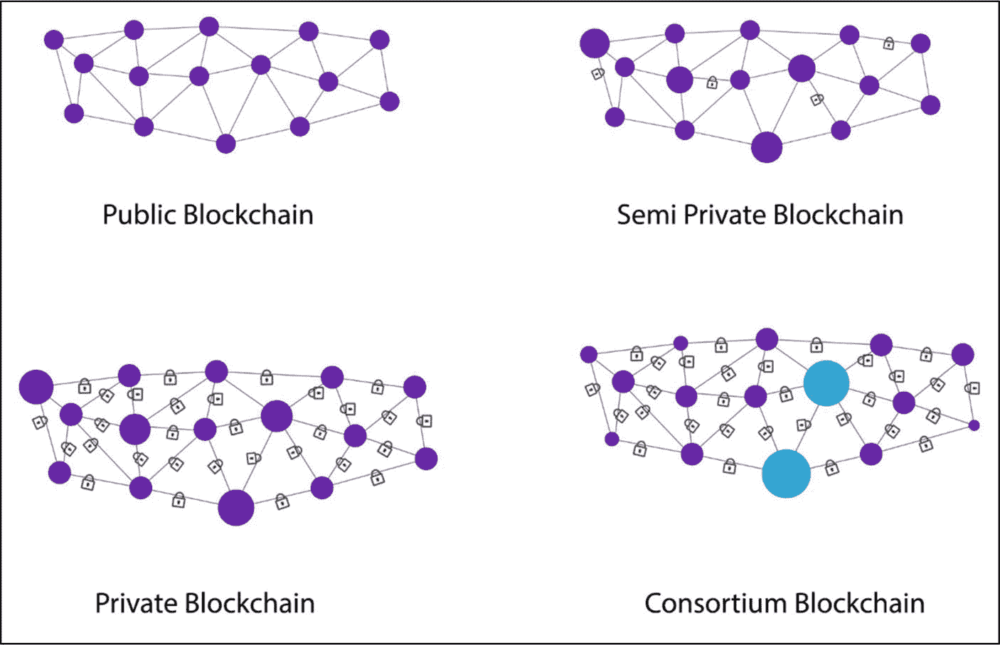
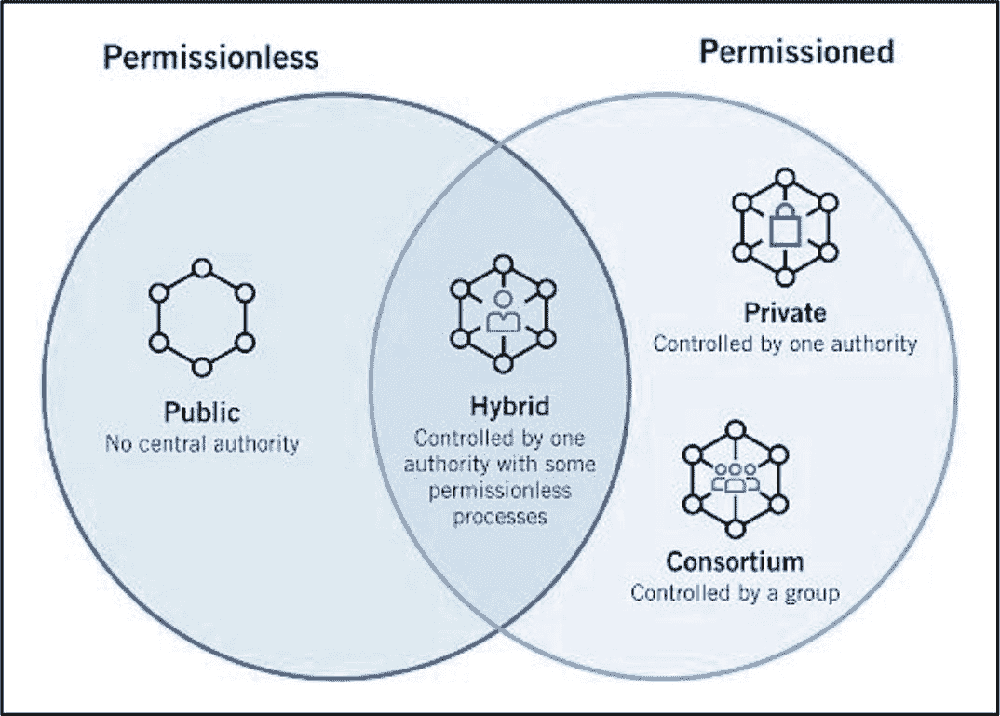

# 区块链投资者端点安全

区块链投资者端点安全是指旨在保护加密投资者在与区块链交互时的安全，并保护其数字资产免遭攻击者侵害的保护措施。攻击者通过拦截区块链本身来影响投资者，从而入侵并窃取该链的原生资产。攻击者也会利用投资者不良的安全措施和欺诈链接直接攻击投资者。

本节重点讨论如何保护投资者免受攻击者的侵害。文章讨论了访问区块链的设备、数字资产钱包、线上线下安全以及其他各类安全预防和保护措施。表 6-11 概述了这些针对区块链投资者的关键保护措施。

### 表 6-11：区块链投资者端点安全保护措施

| 区块链投资者端点安全防护措施 | |
| :--- | :--- |
| **项目描述** | **投资者操作** |
| 纸质登录信息笔记本 | 将数字资产钱包及加密货币交易所的登录名和密码记录在笔记本中，而非使用在线密码管理器，可增加一层安全保障。始终制作纸质备份，以防原始备份意外丢失或损毁。 |
| 双因素认证（2FA） | 在手机、平板电脑或计算机上下载、安装并启用[谷歌身份验证器应用](https://play.google.com/store/apps/details%253Fid%253Dcom.google.android.apps.authenticator2%2526hl%253Den_GB%2526gl%253DUS)（或其他高评分的类似验证软件）。访问加密货币交易所或数字资产钱包时，使用双因素认证至关重要。 |
| 密码 | 确保创建的密码冗长且安全，混合使用大量随机字母、数字和特殊字符。始终将密码保存在纸质笔记本中，并保留安全的离线备份。 |
| 安全更新 | 确保所有设备均安装并更新了网络安全软件，以防止黑客攻击。设置每月一次闹钟提醒，扫描计算机是否存在潜在恶意软件。此外，建议考虑使用键盘加密软件。 |
| 登录信息 | 建议为每个新开设的加密货币交易所账户创建独立的专属电子邮箱地址。这样，即使某个账户被攻破，攻击者也难以访问所有资产账户。 |
| 网址 | 不幸的是，许多骗局和“仿冒”欺诈网站会使用与知名交易所完全相同的前端界面和相似的网址。这些攻击者的唯一目的就是诱骗人们输入登录信息，从而窃取其数字资产。请始终仔细核对网址，确保访问的是正确的网站。此外，将正确的网址添加为书签可作为额外的安全预防措施。 |
| 私钥管理 | 安全存储私钥至关重要。存储私钥的方法有很多，包括纸钱包、硬件钱包、钢制种子胶囊、钢制种子钱包等。对于大多数投资者而言，存储方式的选择取决于您与加密货币资产的交互频率。但强烈建议将私钥及相关密码记录在记事本中并保留纸质副本。 |
| 第三方钱包应用 | 不建议使用第三方钱包应用提供商来存储数字资产，除非该钱包应用背后的团队拥有无可挑剔且可信赖的声誉。 |
| 手机安全 | 确保您的手机始终受信誉良好的网络安全软件保护，并设置密码保护。此外，如果设备丢失或被盗，应确保可以远程擦除手机数据。务必对您的手机号码保密。 |
| 托管服务 | 托管服务涉及第三方（通常是交易所）持有用户的私钥。在此模式下，资产所有者需要信任托管服务提供商以保障其资产安全。如果认为必须使用托管服务，建议仅使用信誉良好且已投保以防攻击的托管服务。这些服务包括[Coinbase](https://www.coinbase.com/) 和 [Gemini](https://www.gemini.com/eu) 交易所。 |
| 非托管软件钱包 | 非托管服务让用户对自己的私钥拥有完全的控制权和责任。这提供了更高的安全性和隐私性，但全部责任和技术问题都落在了资产所有者身上。仅在绝对必要时才使用非托管软件钱包。虽然您完全掌控私钥，但如果设备被黑客攻击，您的资产仍面临风险。流行的非托管软件钱包包括 [Atomic Wallet](https://atomicwallet.io/)、[MetaMask](https://metamask.io/) 和 [Exodus](https://www.exodus.com/) 钱包提供商。 |
| 冷存储（硬件）钱包 | 冷存储钱包是一种物理离线数字资产存储钱包，不连接互联网。它提供非常高的安全性。务必确保从制造商正版链接或网站更新冷钱包的最新软件。此外，不要在连接到互联网的手机或计算机上存储任何冷存储访问代码。硬件钱包的例子有 [Trezor](https://trezor.io/) 和 [Ledger](https://www.ledger.com/)。 |
| 虚拟专用网络（VPN） | 使用 VPN 可以重定向您的网络流量以伪装您的 IP 地址，使得攻击者极难追踪您的确切位置。此外，VPN 会加密您通过互联网发送的信息，防止任何人拦截您的信息。这适用于所有网络交互，包括登录和登出加密货币交易所。VPN 的例子包括 [NordVPN](https://nordvpn.com/)、[ProtonVPN](https://protonvpn.com/) 和 [Surfshark](https://surfshark.com/)。 |
| 钓鱼链接 | 钓鱼链接是攻击者发送给投资者的欺诈性链接，目的是窃取投资者信息（包括登录名和密码），以窃取您的数字资产。这些链接通常通过电子邮件或社交媒体发送。应始终假定接收到的链接是欺诈性的。在未通过核对发件人邮箱地址确认链接来自可信来源之前，切勿点击。将鼠标悬停在链接上，查看并判断 URL 是否真实。如果您没有向某个服务商提出过特定请求，请立即忽略该电子邮件/链接。 |
| 数字资产交易 | 在发起交易前，建议再次核对并确保输入的接收地址正确无误。如果交易使用了错误的接收地址，已发送的资金将永久丢失。作为安全预防措施，特别是对于加密货币新手，建议先发送少量金额以确认交易成功。 |
| 遗产/身故处理 | 作为预防措施，建议您在生前写下关于如何访问您数字资产资金的说明文档，以防不测。该说明应包括所有密码、恢复种子、代码、短语、钱包名称、交易所名称、相关网址等。 |

## 行动步骤

投资者极难预判某一加密货币项目是否会遭受攻击或安全漏洞。攻击者通常会暴露加密货币项目中的缺陷和薄弱环节。但建议遵循以下预防和保护措施，以消除或显著降低重大财务损失的可能性，并确保更安全的投资体验。

*请注意，以下安全检查与预防措施排除了所有涉及项目"代码"或编程语言的安全威胁。由"代码"问题引发的威胁将在第12章"项目代码库"中讨论。*

1.  **51% 攻击**

    从统计学角度看，加密货币项目遭受 51% 攻击的可能性不大。但以下提供两种保护投资者资产的措施。
    1.  **低市值** – 低市值币种（例如，市值低于`$10m MC`的币种）面临 51% 攻击的风险最高；因此，投资此类币种时建议极度谨慎。通过限制对低市值、未成熟的加密资产的风险敞口来降低风险。

    2.  **PoW 共识机制** – 与其他类型的共识机制相比，基于 PoW 的项目更容易受到 51% 攻击。例如，采用`DPoS`共识机制（或类似变体）可降低 51% 攻击的风险，因为代表或民选委员可以移除那些被怀疑策划 51% 攻击的恶意或共谋验证节点。投资前，务必研究并评估项目共识机制的利弊。

2.  **分叉**

    如果出现"分叉"情况，请通过以下预防措施保护自己：
    1.  仔细阅读并熟悉所有关于即将到来的分叉的文档。确保项目团队提供了关于分叉的信息，并且这些信息来自合法来源，例如公司官网上的项目官方博客。

    2.  不要偏离团队概述的、用于在分叉时保护投资者资产安全的分步程序。

    3.  不要成为包含诈骗链接的欺诈性电子邮件的受害者。检查`URL`以确保其来自公司网站。如有疑问，请通过官方沟通渠道联系项目团队。

3.  **区块链投资者终端安全**

    建议投资者遵循表 6-11 中列出的预防和保护措施，以促进与区块链的安全交互，并保护数字资产免受攻击者侵害。

4.  **做笔记并以自己的风格记录研究结果**

5.  **将研究结果与基本面评估流程的其他部分结合起来**

### 结果评估

正如所讨论的，预测加密货币项目是否会遭受未来攻击非常困难。然而，一旦投资者遵循了所概述的预防和保护措施，资产损失的可能性将显著降低。

## 公有链、私有链、联盟链和混合链

**评估目标：确定项目是否运行在公有链上，以确保其提供透明度、不可篡改性和无需信任的特性，从而有助于相比其他区块链类型降低风险。**

区块链类型主要分为四大类：*公有链、私有链、联盟链和混合链*。每种区块链类型都有其特定用途以及相关的优缺点。没有绝对正确或错误的区块链类型，这完全取决于区块链的需求、功能和用例。然而，公有链因其高度去中心化、安全性、透明度、不可篡改性以及节点或私人实体之间无需信任的特点，在投资者中更受欢迎。表 6-12 概述并比较了*公有链、私有链、联盟链和混合链*的核心区别。

### 表 6-12：公有链、私有链、联盟链和混合链的属性

| 区块链分类 | | | | |
| :--- | :--- | :--- | :--- | :--- |
| **属性** | **公有链** | **私有链** | **混合链** | **联盟链** |
| **共识的确定** | 所有矿工 | 单一组织 | 多种共识模型（由组织驱动） | 选定的、预先批准的节点 |
| **读取权限** | 公开 | 公开或私有 | 公开或私有 | 公开或私有 |
| **不可篡改性** | 接近完全不可篡改 | 可被篡改 | 部分不可篡改（取决于公有/私有规则）——可被篡改 | 部分不可篡改（基于治理）——可被篡改 |
| **效率** | 低（取决于扩展解决方案） | 高 | 高 | 高 |
| **去中心化** | 是 | 否 | 部分中心化 | 部分中心化 |
| **共识过程** | 无需许可 | 需许可 | 需许可 | 需许可 |
| **优势/好处** | 不可篡改、透明、无需信任、伪匿名、去中心化 | 隐私性、可扩展性、速度、访问控制、性能、治理控制 | 灵活性和可定制性、高安全性和可扩展性、增强的隐私性、增强的合规性 | 去中心化、访问控制、协作友好、可配置（通常可忽略）的交易成本 |
| **劣势/问题** | 可扩展性差（通过 Layer 2 正在改善）、低`TPS`、高能耗（采用`PoW`时）、不适合存储敏感数据（无权限功能可用） | 涉及信任、部分去中心化、缺乏透明度、受控治理、互操作性问题 | 透明度、成本、治理复杂性、互操作性问题 | 缺乏透明度、复杂性、部分去中心化、可维护性、基础设施成本、互操作性问题 |
| **用例** | Web3 dApp 交互、加密货币/代币投资、文档验证 | 供应链——零售、医疗、金融服务、私人资产所有权 | 零售、供应链、银行、房地产 | 食品追踪、银行、支付、研究 |
| **示例** | [比特币](https://bitcoin.org/en/)、[以太坊](https://ethereum.org/en/) | [Hyperledger](https://www.hyperledger.org/)、[Quorum (kaleido.io)](https://www.kaleido.io/blockchain-platform/quorum) | [XDC Network](https://xdc.org/) | [R3](https://r3.com/) |

### 公有链

*公有链*是一种开放、无需许可、透明且去中心化的区块链账本。它允许所有网络参与者检查和验证区块链上的交易，并参与共识过程。公有链网络中的每个参与者都可以贡献于控制机制，无需可信第三方即可就数据的单一状态达成一致。与私有链不同，公有链尽可能接近不可篡改，这意味着篡改区块链极其困难。每个用户都可以访问历史和当前记录，并且如果他们满足协议要求，可以运行挖矿（或验证）节点。公有链比私有链和联盟链具有更高的去中心化水平。公有链的示例有[比特币](https://bitcoin.org/en/)和[以太坊](https://ethereum.org/en/)。

#### 公共区块链的优势

- **去中心化** – 公共区块链是去中心化的，这意味着它们在没有中心化权威机构的情况下运行，为网络提供了更高的透明度和韧性。
- **透明度** – 公共区块链上的交易对所有参与者都是透明和开放的，这增加了信任并降低了欺诈风险。
- **不可篡改性** – 公共区块链上的交易是不可篡改的，这意味着它们无法被更改或删除，因此具有很高的安全性。
- **激励机制** – 公共区块链使用加密货币等激励措施来鼓励参与者以非恶意的方式验证交易并维护网络。
- **可访问性** – 公共区块链对任何人开放，无论其地理位置或财务状况如何，都能平等地访问网络。

#### 公共区块链的劣势

- **可扩展性** – 公共区块链可能会出现拥堵，因为其容量无法随用户数量线性增长；不过，第二层解决方案（如 Rollups、通道）正在逐步缓解这一限制。
- **隐私性** – 公共区块链是透明的，这意味着交易对所有参与者可见，这对于处理敏感信息的组织来说可能是一个劣势。
- **监管挑战** – 一些公共区块链缺乏中心化权威机构和匿名特性，可能会带来监管方面的挑战。

总体而言，公共区块链在透明度、安全性和可访问性方面提供了显著优势，但也存在可扩展性、隐私性和监管挑战等局限性。在确定公共区块链是否适合特定用例时，应综合考虑这些因素。

**图 6-16**：公共、私有、混合和联盟区块链架构结构（图片致谢：[`https://komodoplatform.com/en/academy/blockchain-technology-types/`](https://komodoplatform.com/en/academy/blockchain-technology-types/)）

## 私有区块链

**私有区块链**是一种中心化的分布式账本，作为一个“满足组织隐私需求的封闭数据库”运行。在私有区块链中，节点对公众受限，只有获得组织权限许可的人才能运行完整节点、进行交易或验证/认证区块链的更改。参与者的身份和凭证必须经过身份验证、核实和授权，才能获得挖矿权限。此外，由于组织内部的各类严格政策，即使节点的所有凭证都符合要求，被拒绝访问的情况也并不罕见。一旦节点获得访问权限，所有者有权撤销访问权限，或覆盖、编辑、删除任何已执行并添加到账本中的交易数据。私有区块链通常比其他类型的区块链规模更小，由希望以高安全性和高速度执行智能合约的组织运营。

私有区块链是一种**需许可的**分布式账本，作为一个满足组织隐私需求的封闭数据库运行。在私有区块链中，节点对公众受限，只有获得组织许可的人才能运行完整节点、进行交易或验证/认证账本更改。参与者的身份和凭证必须经过身份验证、核实和授权，才能获得验证者权限；许多私有链完全摒弃了工作量证明挖矿，转而使用诸如`PBFT`或`Raft`等需许可的共识算法。此外，即使凭证齐全，严格的内部政策仍可能拒绝节点的访问。一旦节点获得访问权限，所有者可以撤销权限，或覆盖、编辑、删除已写入账本的交易数据。私有区块链通常比其他类型的区块链规模更小，由需要高速、高安全性智能合约执行的组织运营。私有区块链的一个例子是`Corda`。另一个例子是[Hyperledger Fabric](https://www.lfdecentralizedtrust.org/projects/fabric)。

> **事实**  
> 尽管私有、混合和联盟区块链可能有益于那些希望在保持私有性的同时利用区块链技术优势的组织，但它们不被认为是不可篡改的，这意味着区块链的交易历史可以被篡改和撤销。此外，它们引入了影响透明度的“信任”因素，这与区块链技术的核心优势相矛盾。

#### 私有区块链的优势

- **隐私性** – 根据公司需求，私有区块链比公共区块链更具隐私性，因为它们只允许授权参与者访问和查看数据。
- **可扩展性** – 私有区块链每秒可处理的交易数（`TPS`）通常高于公共区块链，因此更快、更高效。
- **治理控制** – 私有区块链使组织能够对网络的治理拥有更多控制权，允许它们制定自己的规则和标准，并在无外部干扰的情况下做出决策。

#### 私有区块链的劣势

- **中心化** – 私有区块链比公共区块链更中心化，因为它们由单个组织或组织联盟拥有和运营。
- **安全性** – 私有区块链网络是中心化的，这增加了遭受攻击的风险。私有区块链的节点或成员较少，使其更容易受到安全威胁。
- **透明度有限** – 私有区块链的透明度有限，因为它们只允许授权参与者访问和查看数据，这可能会限制信任并增加欺诈风险。
- **信任** – 由于私有区块链节点是中心化的，因此在系统中建立信任比较困难。
- **互操作性** – 私有区块链可能难以与其他系统和区块链集成，这使得实现互操作性变得困难。
- **依赖性** – 私有区块链依赖于拥有和运营它们的组织或联盟所提供的基础设施和资源。

### 混合区块链

混合区块链（又称半私有区块链）融合了公有链和私有链的特点，通常兼具公有与私有属性，允许多个用户获得特定权限和能力。其核心理念在于取各类型区块链之长，同时尽可能规避其局限。例如，公有链以其透明性和不可篡改著称，但可能不适合处理敏感数据或保障隐私；而私有链虽能更好地控制数据隐私与访问权限，却缺乏公有链的透明性和安全性。

**事实：** 在混合区块链中，交易和记录通常不会公开；但如有需要，可以通过智能合约授予访问权限进行验证。

在混合区块链中，公有链记录需要透明且公开可见的交易，而私有链则存储必须保密的敏感信息。这两条链通过通信层连接，实现两者间安全无缝的信息交换。混合区块链越来越受欢迎，因为它平衡了公有链和私有链的优势，适用于广泛的用例，包括零售和高度监管的市场（如银行业）。[XDC Network](https://xdc.org/) 就是一个混合链：其公共账本锚定交易以实现透明度，而私有子网络则处理敏感数据——展示了单平台如何同时提供公有和许可功能。

**图 6-17** 混合区块链（致谢：[`www.simplilearn.com`](http://www.simplilearn.com)）

#### 混合区块链的优势

- **灵活性** – 混合区块链可针对需要同时具备私有链和公有链功能及优势的特定用例进行定制。
- **可扩展性** – 混合区块链部分中心化，允许根据需求扩展，从而支持高交易量和敏感数据存储。
- **隐私性** – 混合区块链通过使用私有链处理特定信息，可为敏感数据提供增强的隐私保护。
- **合规性** – 混合区块链可设计为符合特定法规或行业标准。

#### 混合区块链的劣势

- **透明度** – 混合区块链限制了对网络上特定信息的访问。
- **复杂性** – 混合区块链的设计、开发和维护比单一区块链解决方案更复杂。
- **成本** – 由于需要额外的开发和维护，混合区块链解决方案可能成本更高。
- **治理** – 混合区块链的治理结构可能更复杂，需要公有链和私有链之间进行谨慎协调。
- **互操作性** – 与不同区块链的交互和通信可能具有挑战性，从而限制了混合区块链解决方案的有效性。

### 联盟区块链

联盟区块链（也称联合区块链）介于公有和私有模型之间：它是需许可的，但由多个独立组织共同治理。然而，它与典型的混合链和私有链不同，因为它不归单一实体或个人所有。相反，它涉及多个组织成员在去中心化网络上协同工作。其在功能上的区别还在于，交易数据由多个成员组织提交，并仅由其预先批准的节点验证，而非开放给公众。它从区块链的公有或私有分支中选取节点来处理验证和共识过程。联盟区块链中的数据可以是公开或私有的，并被视为部分去中心化。联盟区块链的例子包括 [Hyperledger](https://www.hyperledger.org/)、[Hashed Health](https://hashedhealth.com/) 和 [R3](https://www.r3.com/)。

**事实：** 联盟区块链被归类为需许可区块链，因为只有选定的节点才被授权拥有读写权限。访问群体可以得到控制和限制，从而消除了单一实体在私有链上控制网络所带来的风险。

#### 联盟区块链的优势

- **去中心化** – 联盟区块链是去中心化的，这意味着它们无需中央权威即可运行，为网络提供了更高的透明度和韧性。
- **访问控制** – 联盟区块链仅允许授权参与者访问和查看数据，提供了更好的隐私和安全性。
- **治理** – 联盟区块链对网络治理提供了更多控制，因为各组织可以制定自己的规则和标准。
- **协作** – 联盟区块链鼓励组织间的协作，促进数据共享和资源共享。
- **交易** – 交易速度快，且几乎无需交易费用。

#### 联盟区块链的劣势

- **透明度** – 透明度低于公有链。
- **复杂性** – 联盟区块链的设计、开发和维护比单一区块链解决方案更复杂。
- **依赖性** – 联盟区块链依赖于拥有和运营它们的组织所提供的基础设施和资源。
- **基础设施成本** – 由于需要额外的开发和维护，实施联盟区块链解决方案可能成本高昂。
- **可维护性** – 升级区块链是一项漫长且繁琐的任务，需要每个成员的许可。
- **共识** – 成员组织之间发生频繁争议的可能性较大。

#### 这对投资者意味着什么？

公有链通常为散户投资者带来的运营风险最低。公有开源性质促进了高度透明，这是区块链相对于传统中心化公司的核心优势之一。大多数已启动的基于区块链的项目都是公有且开源的，只有极少数属于私有、混合或联盟区块链。尽管如此，企业越来越多地部署私有或联盟网络，以在可信方之间实现更深层次的、特定领域的协作。

由于私有和混合区块链具有非透明或半透明的性质，它们往往给投资者带来高风险。此外，大多数投资者对这些类型的区块链不感兴趣，因为其中涉及信任问题，加之区块数据只能通过授权的治理流程修改，且任何编辑都会被记录以备审计。虽然联盟区块链提供了快速的交易速度，但它们也是半私有的，引入了“信任”因素，并且公共透明度有限——尽管授权成员通常可以完全访问账本。

### 行动步骤

按照以下步骤判断项目是否运行在公有区块链上，以确保其具备透明度、不可篡改性和去信任化特性，从而相比其他区块链类型降低风险。

1.  **验证区块链类型**  
    借助白皮书，确认该项目使用的是公有链、私有链、联盟链还是混合链。  
    1. 如果采用公有链类型，则进入整体评估的下一部分。  
    2. 如果使用的是私有链、联盟链或混合链，建议进一步研究其采用原因，并优先考虑放弃投资。

2.  **记笔记并以你自己的方式记录发现**

3.  **将发现与基本面评估流程的其他部分相结合**

#### 结果评估

强烈建议在投资时倾向于选择公有链，因为私有链、联盟链或混合链对投资者而言风险过高。

### 无许可与有许可区块链

**评估目标：判断区块链是否为无许可类型，以确保其提供完全的透明度、去中心化治理和开放的参与性。**

区块链可进一步分为`有许可`和`无许可`两种。无许可或有许可指的是区块链在用户访问、透明度、验证和去中心化方面的治理方式。两种类型各有利弊；然而，出于多种原因，无许可区块链往往对投资者更具吸引力。

无许可区块链与有许可区块链最显著的区别在于，与有许可区块链不同，无许可区块链没有限制，允许开放参与，任何人都可以运行节点并尝试验证区块；投票权由算力（`PoW`）或质押代币（`PoS`）决定，而非事先批准。有许可区块链通过将共识协议的访问权限限制在少数几个被选中的治理节点来管理共识，这通常会导致中心化程度提高和恶意行为增加。因为有许可区块链要求网络节点信任治理节点以达成共识，它们背离了定义区块链技术的核心“去信任化”原则。

**事实**  
有许可区块链不一定是私有的——访问权限可以限制给经过审查的参与者，而交易数据、状态证明甚至只读 `API` 仍可公开可见，从而将选择性成员资格与公开透明度相结合。

需要注意的是，根据定义，有许可区块链本质上并不必须是私有的。有许可区块链也可以是公有链，但访问受到管制。假设比特币，一条公有无许可区块链，决定转变为公有有许可区块链。这可以通过在比特币区块链顶层引入一个访问控制层来实现，该层验证用户身份，然后允许其访问区块链——尽管比特币绝无可能发生这种情况。表 6-13 概述并比较了无许可区块链和有许可区块链。

**表 6-13** 无许可与有许可类型区块链对比

| 无许可与有许可区块链对比 |
| --- |
|   | 无许可 | 有许可 |
| --- | --- | --- |
| 描述 | 无许可区块链是一种开放的公有区块链，意味着任何人都可以运行节点并参与共识验证。 | 有许可区块链是一个封闭网络。网络参与者必须获得许可才能参与共识验证。 |
| 用途 | 数字资产交易、众筹、保险、去中心化金融、游戏 NFT、捐赠、分布式文件存储等。 | 通常由组织用于管理供应链、内部投票、创建合约、验证方间支付等。 |
| 共识机制 | 通常使用工作量证明（`PoW`）或权益证明（`PoS`），任何人都可以参与交易验证。 | 通常使用权威证明（`PoA`）或实用拜占庭容错（`PBFT`），只有预先批准的一组节点（验证者）才能验证交易。 |
| 特征/特性 | 完全去中心化、去信任化、透明 | 部分去中心化、需信任、部分透明 |
| 区块链开发 | 开源 | 对公众封闭/由选定的开发者闭门开发 |
| 可扩展性 | 存在可扩展性问题 | 比无许可链更具可扩展性，但中心化程度更高 |
| 能耗 | 能耗成本因所用共识机制而异。 | 更节能 |
| 交易速度 | 通常慢于有许可区块链。 | 快于无许可区块链 |
| 治理 | 去中心化治理结构（由基于共识的协议治理。） | 中心化治理结构（不由基于共识的协议治理——决策由网络成员在中心化预设层面做出。） |
| 安全性 | 由于高度去中心化，安全性高。网络内恶意行为者串通的可能性降低。 | 安全性不如无许可区块链，其安全依赖于内部成员（节点）的诚信。 |

**事实**  
大多数公有区块链是无许可的，这意味着公共节点可以无需许可自由加入网络。网络上的每个节点都拥有完全的读写权限。

#### 这对投资者意味着什么？

如表 6-13 所示，无许可区块链和有许可区块链各有其特定的优缺点。然而，投资者更青睐`无许可区块链`而非有许可区块链，原因如下。

- **透明度** – 无许可区块链是完全透明的，这意味着所有用户都可以访问网络上的交易数据。透明度对于激励用户信任区块链网络至关重要。

- **验证过程** – 无许可区块链允许公众有机会参与被称为`挖矿`的验证过程。无需任何许可权限或授权。

- **货币与实用效用** – 无许可区块链允许任何人购买原生代币，这些代币可用于网络上的各种链上功能（交易、治理活动等），也可能具有货币价值。

- **去中心化** – 无许可网络是去中心化的，从而带来更高的安全性和社区信任度。

### 行动步骤

按照以下步骤确定区块链是否为无许可类型，以确保其提供完全的透明度、去中心化治理和开放的参与性。

1.  **验证是有许可还是无许可区块链**  
    找到项目白皮书，搜索有关权限的措辞。通常，每个区块链白皮书中都会提及这一点。节点设置的技术帮助文档中也可能讨论到。如有疑问，请联系项目团队。  
    1. 如果评估的项目是 `dApp`，则确定其构建在哪个底层区块链之上，然后继续判断该底层链是无许可还是有许可类型。

2.  **记笔记并以你自己的方式记录发现**

3.  **将发现与基本面评估流程的其他部分相结合**

#### 结果评估

如果区块链是有许可的，它将带来不必要的风险，使其投资吸引力降低。大多数投资者之所以被加密货币项目吸引，是因为与无许可区块链相关的经济收益。因此，建议重点关注无许可区块链项目，它们提供更高的财务增长潜力。