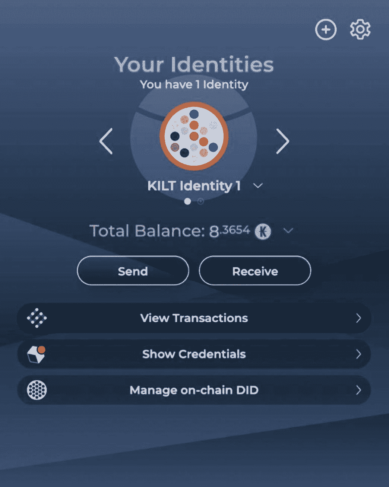
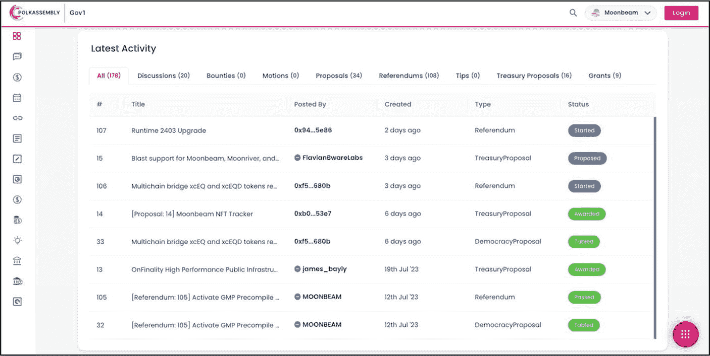
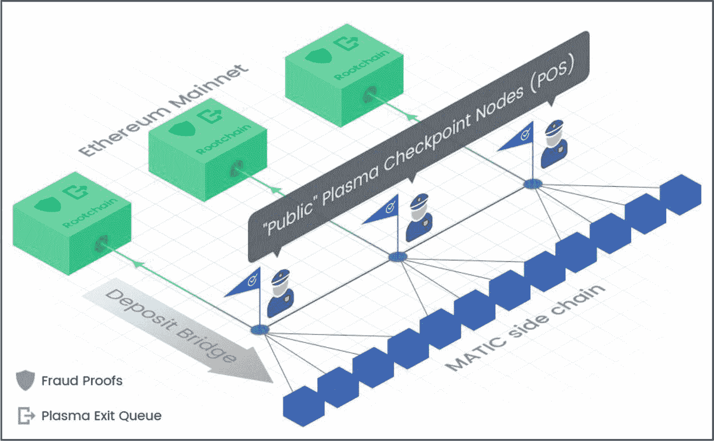
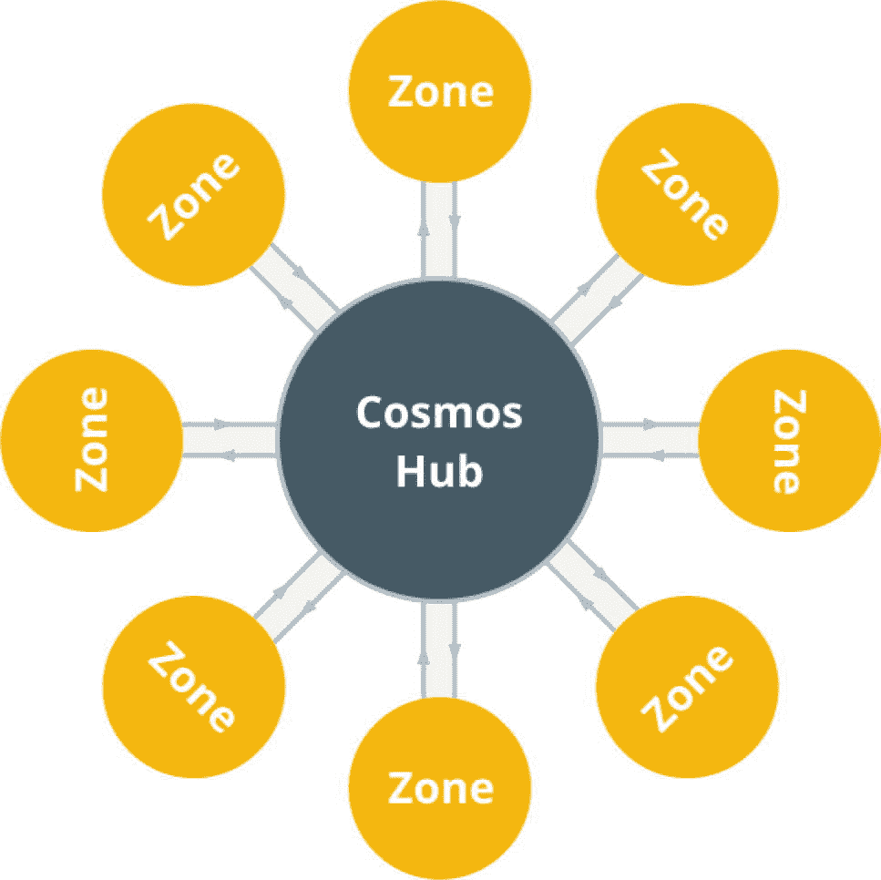

# 支持匿名与隐私保护的区块链

**评估目标：判断一个项目是否提供身份保护和隐私功能，以确保你的数据安全，并实现安全、匿名的交互。**

几十年来，保护用户隐私一直是人们关注的主要问题。除了用户数据存储在易受单点攻击的中央化孤岛中的风险外，用户数据还可能被大型企业利用并出售以牟利。企业之间收集和共享用户数据，使其成为强大的垄断者，让小型企业极难与之竞争。当用户数据被出售时，它会被打包成较小的群体，卖给其他公司用于定向营销活动——这对用户及其数据来说是一场无休止的隐私斗争。此外，在线用户经常被要求提供敏感信息，如社会安全号码、护照、驾照和出生证明来验证身份，这导致黑客能够获取这些数据，进而被操纵并用于欺诈活动。

## 区块链如何帮助保护用户数据？

区块链技术可保护用户数据免受上述威胁，从而最大限度地提升用户隐私和假名性。这是通过其独特的去中心化特性实现的，该特性支持在对等网络上进行安全、去中心化的数据存储。与传统的中心化数据服务器不同，区块链利用其去中心化结构和强大的验证机制来存储和复制用户数据，消除了单点故障的风险。

需要注意的是，并非所有加密货币项目都具备完整的用户隐私和匿名特性。大多数加密货币项目是“假名的”，这意味着用户使用一个称为`公共地址`的化名身份与区块链交互。这个`公共地址`为用户提供了隐私保护，并向公众隐藏了他们的真实身份。然而，如果人们能够将用户的身份与其`公共地址`关联起来，用户的假名性就可能被破解。例如，用户在其网站或社交媒体上发布`公共地址`作为支付方式、接收捐赠，或在中心化交易所进行交互。一旦人们将你的姓名与你的`公共地址`匹配，就可以通过在区块浏览器（例如，用于以太坊的[Etherscan](https://ether.io/)）中输入你的`公共地址`，快速确定你持有的资产。

所有假名的区块链交易都被认为是可追踪的，并且可以在区块链浏览器上被跟踪。然而，这种透明度的水平引发了关于隐私和潜在监控的担忧。因此，专注于隐私的特定区块链应运而生。这些区块链通过利用隐私保护功能来对抗可追踪性，阻止其他用户查看你的交易历史和资产。`Monero`区块链就是支持隐私功能的区块链的一个例子。虽然像`Monero`这样专注于隐私的区块链提供了出色的匿名性和隐私功能，但它们在一定程度上不受监管机构和执法部门的欢迎，因为它们被用于非法活动，例如洗钱或资助非法行动。

## 身份与数据保护

匿名性和假名性之间的区别在于，匿名性使用户能够以完全无法识别身份的方式进行操作或发言。相比之下，假名性允许用户通过一个选定的名称或标识符被识别，从而隐藏其真实身份。像[Kilt Protocol](https://www.kilt.io/)和[Mina Protocol](https://minaprotocol.com/)这样的区块链项目提供了真正的匿名性和身份隐私。这些区块链允许用户在线上匿名交互，并消除了提交护照或驾照等身份相关文件来验证身份的要求。

图 6-18 展示了 KILT Protocol 钱包的快照，该钱包允许用户在线与各种服务进行匿名交互。通过 Kilt 的独特技术，用户一旦验证了身份，就可以注册并登录许多网站和服务，而无需再次使用高度私密的个人信息来证明身份。例如，在注册中心化数字资产交易所时，用户无需提交护照、驾照和居住地址证明，而是通过提交一种加密“证明”来验证身份，该证明本质上可以验证——或驳回——用户的身份。

图 6-18

Kilt 协议——Sporran 身份钱包（Chrome 扩展）（图片由 `https://www.kilt.io/` 提供）

#### 这对投资者意味着什么？

像[Pirate Chain](https://piratechain.com/)和 KILT Protocol 这类支持隐私功能的区块链相对较新，但随着时间的推移正变得越来越受欢迎。普通人在使用线上和线下服务时，都力求为其数据和身份提供更高的安全性及保护。鉴于大多数加密货币项目并不提供隐私功能，因此它们在进行投资时并非关键因素。此外，提供身份保护的隐私区块链是一个特定的细分领域。因此，在投资一个提供身份隐私的项目时，建议只与同一细分领域内的类似项目进行比较和评估。

**专家提示**

除了投资目的之外，保护你的隐私至关重要，每个人都应享有这项权利。因此，探索像 KILT Protocol 这样的项目或许是值得的。

### 行动步骤

按照以下步骤判断一个项目是否提供身份保护和隐私功能，以确保你的数据安全，并实现安全、匿名的交互。

1.  **确定该项目是否具备隐私和身份保护功能**

    根据保护白皮书，确定该项目是否提供隐私和/或身份保护功能。

2.  **做好笔记，并以你自己的风格记录你的发现**

3.  **将发现与其他部分的基本面评估过程相结合**

#### 结果评估

隐私和身份保护是专业领域，不会影响该细分领域之外项目的核心评估。

### 治理

**评估目标：** 确定区块链是否采用链上治理，以确保流程公平、透明，并受益于去中心化和自动化决策。

鉴于区块链治理的重要性，仅此主题便可著书立说。然而，根据本书的范围，本节将讨论区块链治理的要点。治理指的是确保问责制、透明度、响应能力、稳定性、包容性、赋权和广泛参与的结构和流程。更具体地说，区块链治理包含一套规则和流程，用于帮助规范区块链的发展方向和核心功能，包括整体架构、升级和新特性。白皮书通常会详细说明项目区块链治理模型的相关信息。

区块链通常会将治理功能整合到其原生币或代币中。`Polkadot Networks` 的原生币 `DOT` 就是一个例子。作为 Polkadot 治理模型的一部分，DOT 持有者如果希望参与 Polkadot 的全民公投并投票，可以锁定他们的 DOT。

就像每个国家都需要通过法律、法规和新的变革来自我治理一样，这一原则也适用于基于区块链的公司。然而，机构投资者、私人投资者和散户投资者对于什么对区块链网络最有利，通常持有不同的利益和观点。为了解决这些问题，有效的治理对于促进所有相关方之间的妥协、平等和调解至关重要。通过区块链治理，数字资产持有者有机会对最终影响项目长期成功和寿命的重要决策进行投票。

必须实施清晰、可维护、高效的区块链治理结构，以帮助提升项目的成功和社区精神。缺乏区块链治理可能导致许多问题，包括硬分叉和软分叉、社区分裂、代码漏洞以及社区和投资者兴趣丧失，所有这些都会影响项目的长期成功和寿命。强大的去中心化治理可以通过提供无摩擦的链上投票流程，让参与者能够为协议决策做出贡献，从而帮助缓解这些问题。

在设计、运营和管理区块链时，需要在广泛的技术架构领域做出重要决策。这些通常通过治理进行投票的决策，对区块链的成功至关重要。根据 Evrim Tan 在《公共部门的区块链治理》一书中的观点，一个典型的框架将治理决策分为九种类型，具体如下：

1.  基础设施架构
2.  应用架构
3.  互操作性
4.  决策机制
5.  激励机制
6.  共识机制
7.  治理组织
8.  治理问责制
9.  治理控制

## 区块链治理模型

通过区块链治理的参与主要通过两种主要类型的治理模型实现：链上治理和链下治理。请注意，一些区块链也采用混合治理模型，其中结合了链上和链下治理的元素，以平衡去中心化和效率。它允许网络参与者对关键决策进行投票（链上），同时在需要时允许一个或多个中心化方快速高效地做出某些决策（链下）。然而，为了简化并满足基本的评估需求，本节仅关注链上和链下治理模型。

### 链下治理

顾名思义，在链下治理中，所有决策、公开讨论、提案和集体商定的更新都以中心化的方式在链下进行。链下治理通常依赖于非正式流程，例如邮件列表讨论、GitHub 拉取请求或改进提案框架（例如以太坊的 EIP）。虽然核心团队通常协调讨论并统计意见，但最终的更改仍取决于广泛的社区接受度——矿工、验证者和用户必须升级他们的软件才能使任何决策生效。

### 链上治理

通过链上治理系统，所有正式的提案和投票阶段都记录在链上，而讨论则在链下进行，并由核心团队负责实施。与链下治理结构不同，链上治理仅在线进行；然而，一个由开发者组成的小组或委员会负责管理、协调并帮助利益相关者（如有需要）达成共识。在链上结构中，利益相关者包括矿工、开发者和资产持有者。

图 6-19 展示了 Polkassembly——Polkadot 生态系统中一个用于治理和协作的开源首要平台——用户可以在其中查看并参与 `Moonbeam Network` 的链上治理流程。

**事实**

Polkadot 的原生代币 DOT 在治理、质押和绑定等链上活动中扮演着关键角色，允许利益相关者参与网络的运营和决策过程。

在链上公开投票期间，开发者通过代码更新提出称为改进提案的变更。每个利益相关者都有机会接受或拒绝该提议的变更。利益相关者使用其私钥进行验证和提交。许多网络采用代币加权投票（持有的原生币越多，投票权越大）；例如，持有 10,000 枚币的参与者比持有 2,000 枚的参与者拥有更大的权重。其他协议则采用一验证者一票、二次方或基于声誉的方案。这为那些对区块链项目的成功有真正兴趣的投资者提供了激励。此外，一些加密货币项目会奖励参与治理公投的参与者。

**图 6-19** Polkassembly 是一个开源平台，用户可以在其中查看并参与 Moonbeam Network 的链上治理流程（图片致谢 [`https://moonbeam.network/tutorial/participate-in-moonbeam-governance-with-polkassembly/`](https://moonbeam.network/tutorial/participate-in-moonbeam-governance-with-polkassembly/)）

### 链下治理与链上治理对比

表 6-14 概述了链上治理模型与链下治理模型之间的显著差异。请将其作为通用指南，而非针对具体项目的结论——每个协议都会以自己的方式调整规则，因此没有单一描述能适用于所有情况。作为背景参考，Polkadot Network、Tezos 和 Decred 采用链上设置，而比特币的 BIP 和以太坊的 EIP 则采用链下流程。

**表 6-14** 链上治理与链下区块链治理对比

好的，作为高级文档工程师和翻译员，我将严格遵循您的注意事项和示例格式，将以下英文文本翻译成中文。

| 链下治理与链上治理的对比 |
| --- |
|   | 链下治理 | 链上治理 |
| --- | --- | --- |
| 定义 | 治理规则和决策通过论坛、电话会议和改进草案在协议之外进行。 | 治理规则和决策嵌入协议代码中，并由智能合约执行。 |
| 形式化与结构 | 非正式，由规范驱动。论坛、开发者会议和改进草案指导变更，没有法律约束力的规则。 | 正式，由规则驱动。智能合约程序定义了谁可以提出提案、如何投票以及如何计算门槛。 |
| 透明度 | 相对不透明——讨论和决策在链下进行（例如，在邮件列表或电话会议上），这可能导致过程对外人来说不那么透明，甚至“隐藏”。 | 设计上透明——所有提案、投票和结果都记录在公共账本上，任何人都可以实时审计治理过程。 |
| 决策制定过程 | 决策通过社会共识和线下协议产生。如果被接受，则通过网络参与者选择运行的软件更新来实施。 | 决策通过链上投票机制做出。利益相关者（例如，代币持有者）通过区块链对提案进行投票。 |
| 信任要求 | 需要信任人。由于治理在账本之外运作，利益相关者必须依赖核心开发者、矿工或基金会领导者来遵守共识并执行决策。 | 信任协议——决策由代码和分布式共识强制执行，减少了对任何单一个体的依赖。 |
| 升级机制 | 由社区协议驱动的软件更新。社区同意的软件发布推出升级；用户选择安装它们，如果太多人拒绝更新，链可能会分叉。 | 链上提案和代码修正在系统内决定。代币持有者对提案进行投票；一旦变更通过，协议会自动应用它——在大多数情况下无需链下争论。 |
| 适应性 | 灵活——规则没有硬编码，因此社区可以在需要时修改或添加它们，尽管辩论可能会拖延。 | 僵化——规则已融入代码；一致但难以在没有新的链上投票的情况下快速更改。 |
| 激励机制 | 没有原生代币奖励：参与取决于声誉、社区善意或其他链下福利，因为治理处于协议的激励层之外。 | 嵌入的代币奖励或质押债券激励投票者，并直接将治理行动与网络的经济成果联系起来。 |
| 利益相关者参与 | 开放的讨论但非官方——任何人都可以参与，但通常由一小部分核心开发者和矿工决定，限制了更广泛的影响力。 | 设计上包容但不均衡——任何代币持有者都可以投票，但如果参与度低且大户占主导地位，则会引发去中心化方面的担忧（尽管一些协议对此有保护措施）。 |
| 共识方式 | 粗略共识——没有固定的投票计数；同意是非正式衡量的，因此在某些情况下意见分歧时，决策可能模糊不清并拖延。 | 正式投票——多数或绝对多数规则提供快速、清晰的结果，但代币权重可能将权力倾斜向大户（尽管一些协议对此有保护措施）。 |
| 复杂性 | 社会复杂性高——治理分散在聊天和论坛中，结构不清晰，难以审计。 | 技术复杂性高——构建智能合约代码繁重，但一旦上线，则完全在链上且易于审计。 |
| 自动化与执行 | 手动——开发者推送更新；节点选择加入，但手动操作常导致延迟或错误。 | 自动化——协议自动执行批准的更改（尽管一些协议仍需要有限的手动步骤）。 |

**事实**

基于 Wasm 的运行时，[Polkadot 网络](https://wiki.polkadot.network/docs/learn-runtime-upgrades)能够实现无需分叉的升级——链上治理投票换入新代码，添加功能或修复错误，而无需硬分叉带来的中断。

#### 这对投资者意味着什么？

区块链治理的话题远非独一无二，但关于区块链更适合链下还是链上治理模型，仍存在大量意见。链上和链下模型类型都有各自的论据。一个重要方面在于，类似于去中心化能够实现自治，链上治理能够以无需信任、透明的方式让所有利益相关者的声音被听到，从而允许“人民”自我治理区块链的方向。所有利益相关者都应该有机会通过一个平等透明的流程来投票并影响区块链的方向和成功，而不仅仅是高端网络投资者和投资实体。

可以说，链上治理的好处是因区块链类型以及待决策的类型和严重程度而异的。更具体地说，问题在于人类决策（链下）的好处是否超过了通过链上自动化流程进行的基于代码的规则决策（链上）的好处。尽管链上治理流程仍然依赖于所有利益相关者的想法和决策，但它不像传统的链下系统那样有大量的人际互动和讨论，这可能产生负面或正面的影响。

迈向一个更公平、更去中心化的世界，逐渐接近一个完全链上的治理模型在某种程度上是合乎逻辑的，考虑到它相对于传统链下治理流程的一系列优势。尽管仍有一些小问题，但已经取得了巨大的进步，一个去中心化、平等、高效且透明的治理流程现在就在我们面前。拥有这种链上治理功能的区块链可以被视为一种优势，极大地促进了区块链的整体进步和成功。

### 行动步骤

遵循以下步骤来确定区块链是否使用链上治理，以确保一个公平、透明的流程，并受益于去中心化和自动化决策。

1.  **确定所实施的治理结构类型**
    1.  从项目白皮书中确定该区块链是采用链上还是链下治理模型。如有需要，可联系项目团队以获得进一步澄清。
    2.  对于 dApp，其底层区块链在很大程度上影响其所采用的治理流程。研究 dApp 所构建的区块链，并审查它采用的是链上还是链下治理模型。

2.  **用你自己的风格记下笔记并记录你的发现**

3.  **将这些发现与基本面评估流程的其他部分相结合**

#### 结果评估

具有完全链上治理技术的区块链基础设施，显著优于依赖传统链下模型的区块链。长期投资于基本面强劲且拥有完全链上治理技术的项目是值得赞赏的。一个项目是完全还是部分实施这项技术并不那么重要；知道底层基础设施包含了可供其使用的链上治理功能，是一个重大的基本面优势。

然而，如果项目拥有链下或部分中心化（混合）的治理协议，投资者也不应气馁，前提是存在一个包含社区参与的、坚实的、近乎透明的投票系统。这还应与某种形式的保证相结合，即没有单一群体为人们做出最终决定。

### 跨链互操作性

***评估目标：评估网络的跨链互操作性水平。***

跨链互操作性简单来说是指区块链与其他区块链自由通信的能力，从而促进信息、资产和数据之间的无缝转移。借助正确的跨链互操作性协议解决方案，一个区块链上的任何经济活动都可以在另一个区块链上得到呈现。将经济活动从一个区块链扩展到另一个区块链，将进而释放一个庞大的区块链生态系统，实现数据和资产的无摩擦自由流动——这是整体目标。然而，这并非易事。

试想一下，如果全球银行之间无法相互通信，将会造成怎样的破坏？资金转移将停止，引发完全混乱。同样，想象一下如果 `Gmail` 无法与 `Outlook` 或 `Yahoo` 通信，整个系统将崩溃，导致通信效率灾难性低下。同样的原理也适用于区块链网络。与人类不同，大多数区块链无法自然地相互通信（对话）；然而，少数区块链——例如内置 `IBC` 的 Cosmos，以及其 `XCM` 格式允许平行链交换消息的 Polkadot——是专为原生跨链通信而构建的。尽管这个问题并非区块链独有——许多科技产品在孤立的“茧房”中成熟——但生态系统仍在规模化方面挣扎，因为大多数网络都在自己独立的“茧房”内成长。区块链的构建方式多种多样，每种方式都满足并定制了广泛的应用需求；正因如此，它们彼此之间很少有共同点。存在一系列不同的区块链，它们在可扩展性、去中心化、安全性、隐私性、可编程性和互操作性方面各有优劣，相互竞争。然而，没有一个通用的区块链协议能够满足整个区块链生态系统的需求。这种区块链部落主义导致了大量的重复劳动，许多开发者选择在多个区块链上部署智能合约，进一步分裂了社区并引入了用户界面障碍。

以比特币为例；由于其特定的协议、编程语言和架构设计，比特币无法与（例如）以太坊自由通信。更具体地说，记录并存储在比特币网络上的资产和交易无法轻易地在其他区块链上呈现。同样的原理也适用于大多数区块链：由于它们独立的系统协议、编程语言、共识机制、架构设计以及其他影响因素——例如区块链功能和需求的不断演变——区块链无法以无摩擦的方式进行通信。由于这一障碍，来自特定区块链的数据、信息以及原生和衍生资产无法有机地转移。尽管协作显而易见，但每个网络都旨在发展自己独立的生态系统以争夺“王位”。新的创新架构设计努力解决互操作性问题；然而，目前尚无放之四海而皆准的解决方案。

## 互操作性解决方案

区块链的价值受限于其与其他生态系统通信的互操作性能力与水平。区块链之间的互操作性释放了巨大的流动性和效用。为了增强这些能力，区块链网络正在拼命尝试通过各种技术来克服互操作性问题——本节将讨论这些技术。

图 6-20

Polygon（MATIC）/以太坊侧链（图片由 Polygon Matic 提供——[`https://polygon.technology/polygon-pos`](https://polygon.technology/polygon-pos)）

1. **跨链桥**

跨链桥——本质上是一种软件应用——弥合了“鸿沟”，使得加密货币、包装代币、非同质化代币（NFT）或其他数字资产能够在区块链网络之间转移。代币桥的工作原理是：在源链上通过智能合约锁定或销毁代币，并在目标链上通过另一个智能合约解锁或铸造代币。跨链桥不受限于任何网络。然而，由于大多数代币桥依赖一个通常规模较小且中心化的验证节点集或多签机制，桥合约或任一连接链中的任何缺陷都使其成为黑客攻击的主要目标。可用的代币桥类型有很多种；主要的三种如下：
   1. **销毁并铸造** – 在源链上销毁代币，然后通过在目标链上重新铸造来发行相同的代币。
   2. **锁定并铸造** – 在源链的智能合约中锁定代币，然后在目标链上铸造这些代币的包装版本（通常称为桥接资产），反之亦然。
   3. **锁定并解锁** – 在源链上锁定代币，然后从目标链的流动性池中解锁相同的代币。这类代币桥通常通过收入分成等激励计划来吸引桥两端的流动性。

**事实** `Binance Bridge` 是一个流行的跨链桥。它支持将资产从以太坊转移到 `Binance Smart Chain`（反之亦然）。此外，它允许用户将加密代币转换为与 Binance Chain 和 `BSC` 兼容的格式。

2. **包装代币**

包装代币是代表其他资产的数字资产，例如加密货币或黄金、房地产等传统资产。包装代币有助于促进不同协议区块链之间的资产转移和互操作性。需要注意的是，包装代币实际上并非在网络之间转移。相反，原始代币在源链上被锁定，同时一个托管人或桥合约在目标链上铸造等量的包装代币。例如，比特币（BTC）可以作为“包装” BTC（`WBTC`）在以太坊区块链上使用。这为比特币持有者开启了一个全新的智能合约 dApp 世界以及诸如 DeFi（去中心化金融）等功能。

3. **侧链**

侧链的目的是解决影响父级 L1 区块链的可扩展性问题。侧链通过减轻主链的计算负载来实现这一点，从而释放吞吐量，使主链能够处理更高数量的交易。此外，侧链通常会承载数千个 dApp，从而释放主链和整个生态系统的压力。

侧链可以是公开的或私有的，每条侧链都拥有自己的代币、协议、共识机制和安全性——这与从主链（父链）获取安全性的 Layer 2 解决方案不同。侧链是独立的区块链网络，通过`双向锚定`连接到父区块链（即主网）。

双向桥（通常称为双向锚定）允许用户在主网上锁定资产，同时在侧链上铸造或解锁等值资产。这样，无需传统的托管方，价值就能在两个网络之间转移。`Polygon PoS`是一个著名的侧链示例。它与以太坊区块链并行运行，提供了一个独立的网络来增加交易带宽，相比以太坊降低了费用并提高了吞吐量。图`6-20`展示了以太坊（根链/主链）和 Polygon PoS（侧链）的架构，其中使用了`Plasma 检查点节点`来辅助交易验证。以下流程概述了数字资产如何从主网（父链）转移到侧链，反之亦然。

1.  数字资产并非真正从一条链转移到另一条链；相反，一旦智能合约（交易）被执行并验证，协议就会锁定主网上的数字资产，同时在侧链上解锁相同数量的资产，反之亦然。
2.  为了实现这一点，还需要一个`链下流程`，其目的是在主网和侧链之间传输数据。
3.  智能合约执行后，会向主网（父链）发送一个信号，触发链下流程将交易信息“中继”到侧链，从而验证交易。
4.  随后，资金在侧链上释放，允许用户跨两条区块链转移数字资产。

**事实**

侧链通常拥有自己的共识协议，通过改善高交易费用、隐私和安全性等典型问题来补充主网。

**图 6-21** Cosmos 中心区块链架构（图片来源：`https://cointelegraph.com/learn/what-is-cosmos-a-beginners-guide-to-the-internet-of-blockchains`）

## 1. 区块链路由器

区块链路由器通过支持多个区块链网络之间的通信和数据交换，帮助提高它们之间的互操作性。像传统路由器一样，区块链可以具备路由功能，这些功能根据通信协议分析和传输通信请求，并动态维护区块链网络的拓扑结构。

`Router Protocol`是区块链路由器的一个例子。Router Protocol 架构允许一条链上的合约安全且去中心化地与另一条链上的合约进行交互。这是通过验证源链（Router Protocol）和目标链（例如以太坊）上的状态变更来实现的。通过这种方式，Router Chain 可以编写自定义逻辑来触发事件以响应这些外部状态变更。此外，Router Chain 上的应用程序可以利用无信任的中继器网络，直接从 Router Chain 更新外部链的状态。

## 2. 哈希锁定技术

哈希时间锁定合约（HTLC）是一种跨链互操作性标准，它支持`哈希时间锁`等跨链原子操作。HTLC 确保两个节点之间的任何转移都可以通过一个通常由智能合约（或在比特币等不可编程链上的原生脚本）调节的支付通道来完成。

**事实** 原子交换可以定义为数字资产的交叉交换，其中一种资产无需第三方或中心化中介（例如去中心化交易所）即可兑换成另一种资产。

HTLC 最早由`闪电网络`使用，其设计极为巧妙。以下是 Alice（发送方）和 Bob（接收方）之间 BTC/ETH 交易的简化 HTLC 流程：

1.  Alice 对一段秘密代码进行哈希处理，获得`哈希锁` `h[1]`，并创建一个`时间锁` `t[1]`。
2.  使用创建好的哈希锁和时间锁，Alice 创建一个智能合约`c[a]`，在其中锁定她的资金资产（例如 2 BTC），并将相应的哈希值发送给 Bob。
3.  当 Bob 收到 Alice 的哈希值（随机数）时，他可以查看并确认 Alice 已经对她的资产（2 BTC）进行了时间锁定。
4.  Bob 随后使用 Alice 的哈希锁`h[1]`和他自己的时间锁`t[2]`，创建智能合约`c[b]`，并在其中锁定他的资产（3 ETH）。至关重要的是，Bob 的`t[2]`（时间）*必须小于 Alice 的* `t[1]`，*这样 Bob 才能有足够的时间从 Alice 那里索取他的资产。*
5.  Alice 从合约`c[b]`中解锁 Bob 的资金，从而揭示出秘密代码。
6.  Bob 使用已揭示的秘密代码从合约`c[a]`中解锁 Alice 的资金。

**注意** 一旦 Bob 和 Alice 都验证了双方资产，所有权就会转移，交易数据会存储在每个区块链网络上。但是，如果 Bob 和 Alice 在时间锁定期内没有验证资产，双方资产都会退回给原始发送方——在可编程链上通过合约到期自动执行，在比特币上则通过预先签名的退款交易执行。

## 3. 公证人方案

公证人方案是一种互操作性解决方案，能够促进不同区块链上的网络参与者之间进行资产转移——换句话说，它们简化了跨链交易的任务。与侧链不同，公证人方案不是父链的扩展。相反，它们是管理整个流程的第三方，必须被信任能够诚实行事，这引入了中心化的信任假设。该第三方（公证人）可以访问两个账户（区块链 A 和 B）。它本质上充当了一个中间人，当区块链 A 上发生某个事件时进行验证，然后将此信息反馈给区块链 B。

**其工作流程如下：**

1.  **用户（1）** – 将资产从链 A 发送给公证人。
2.  公证人锁定并确认用户（1）发送的数字资产。
3.  公证人将其账户中的数字资产转移到目标链 B 上的用户（2）。

**公证人分为两种类型：**

- **单签名公证人** – 一种跨链互操作性解决方案，由公证人群体或系统选择的单个节点负责收集、验证和确认区块链之间的数据或资产转移。虽然这种设置非常高效，但它引入了中心化风险，因为整个过程依赖于单一的验证者——一个单点故障。
- **多重签名公证人** – 顾名思义，在多阶段公证系统中，从源链 A 收集的数据必须由多个公证人节点验证，这些节点需要达成超过三分之二或更多参与节点的共识。这种模型通过将验证工作分布在多个节点上，增强了安全性并降低了中心化风险。

## 4. 预言机

