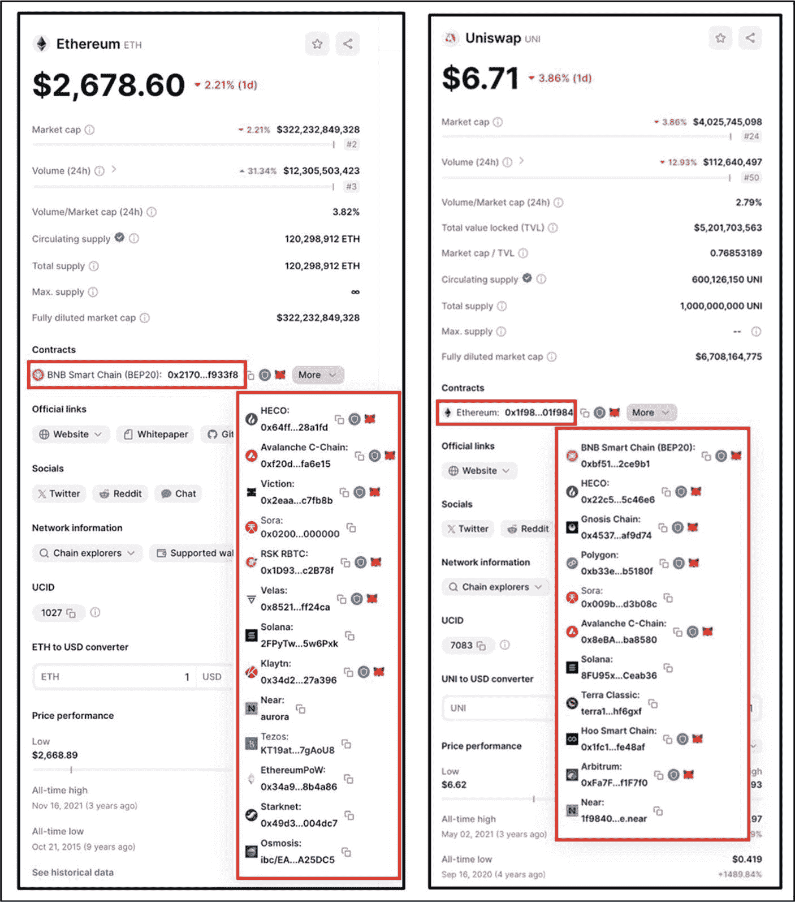

# 使用加密资产市场数据和价格追踪网站评估区块链互操作性

作为评估项目互操作性的最后一步，投资者应确定有多少原生币或代币在其他网络上被表示、锁定或铸造。原生币（例如 `ETH`）或代币（例如 `UNI`）在多个网络上的分布范围越广，就越能表明项目的互操作性良好——尤其是当这些跨链表示是由项目核心团队发行或正式认可的，而非用户临时创建时——这将提升项目及其互联生态系统的增长潜力和采用率。另一方面，一个虚构的区块链项目 Capticious Network，其原生币 `XYZ` 仅在单一网络上表示，这表明 Capticious 与其他区块链网络之间存在严重的互操作性缺失。

图 6-22 显示了来自 `CoinMarketCap.com` 的两张截图。左侧图片突出显示了以太坊以及其他网络（红色框内），以太坊的 `ETH` 币在这些网络上被锁定或表示。目前有十四个不同的网络上有 `ETH` 币存在或被表示，这表明以太坊在多个区块链生态系统间具有高水平的互操作性。此外，这十四个连接的网络中的任何一个，与以太坊这样庞大的生态系统实现互操作后，都可继承跨链优势，包括流动性、多链交易、原子交换等。相比之下，一个网络的原生币仅在一个或两个其他网络上锁定或铸造，则被认为是较差的。

图 6-22 以太坊的 `ETH` 币在其他区块链上被锁定，以及 Uniswap 的 `UNI` 代币在不同区块链网络上被锁定（图片由 [`https://coinmarketcap.com/currencies/ethereum/`](https://coinmarketcap.com/currencies/ethereum/) 和 [`https://coinmarketcap.com/currencies/uniswap/`](https://coinmarketcap.com/currencies/uniswap/) 提供）

图 6-22 右侧的图片突出显示了 [Uniswap](https://uniswap.org/)，这是一个去中心化交易所（`DEX`），允许用户在没有中心化第三方的情况下交易加密资产。Uniswap 的 `UNI` 代币存在或被表示的生态系统显示在垂直红色框内。Uniswap 所构建的底层网络以太坊则显示在水平红色框内。请注意，`UNI` 代币可在包括原生网络以太坊在内的十二个网络上使用。这表明 `UNI` 是一个流行的代币，能够无缝集成到多个网络，提升了可访问性、可用性和采用率。除了代币本身的受欢迎程度之外，许多跨链表示是由第三方桥接或社区倡议创建的，而非 Uniswap 核心团队所创建；一个代币与其他链的集成，归功于底层区块链基础设施内置的互操作特性，以及本章讨论的各种互操作解决方案。

### 行动步骤

按照以下步骤确定区块链的互操作性水平。

1.  确定互操作性水平
执行“投资者对区块链互操作性的检查”一节中讨论的活动。

2.  做笔记，并以自己的风格记录你的发现

3.  将这些发现与基础评估流程的其他部分结合起来

#### 结果评估

在投资新兴的小型区块链网络时，建议确保该网络与大型生态系统（例如，以太坊、比特币、`Avalanche`、`Polkadot`、`Cosmos`、`Solana`、`Binance`、`Tron` 等）具有足够的互操作性。同样，在投资特定的 `dApp` 时，必须确保该 `dApp` 构建在蓝筹区块链上，或者至少构建在一个与一些更大、更受欢迎的生态系统具有足够互操作性的小型生态系统中。