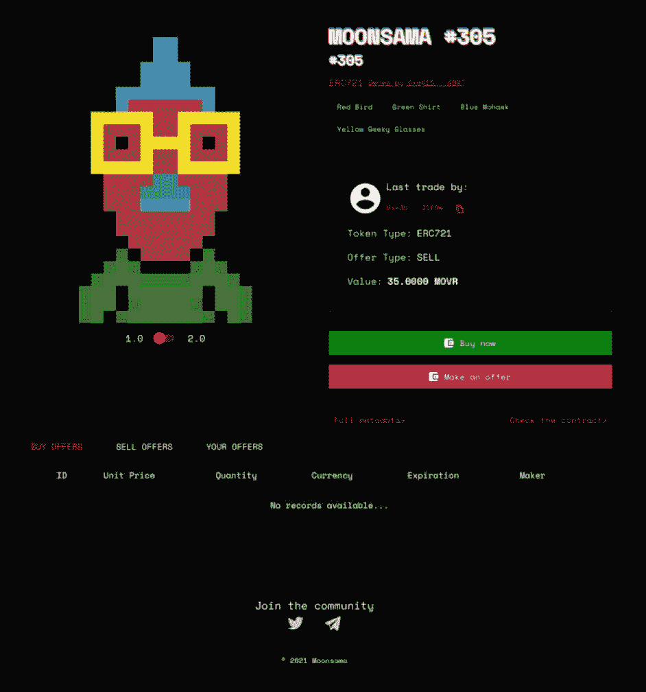

# 7. 代币设计与用例

代币设计是直接影响项目成功几率的關鍵方面。代币的设计决定了它在生态系统中的运作方式。它包含了特定的特性和规则，这些规则规定了代币在何处、何时以及如何使用，无论是用于交易、治理，还是代表项目中的所有权。

每当为一个特定的用例设计代币时，由设计师和项目团队决定该代币将如何在平台和更广泛的生态系统中被使用。它的效用将在很大程度上取决于项目 `dApp` 和用例中的设计与功能需求。

对于数字资产投资者来说，代币设计提供了宝贵的洞察力，有助于评估区块链项目的潜力。虽然一个具有高基本面品质代币的项目可能预示着长期可持续性，但一个设计不佳、几乎没有价值的代币则可能对项目产生负面影响。因此，有必要调查该代币在生态系统中是否具有合法的、无法被传统中心化公司解决的用例。

代币设计的另一个关键方面是代币增值机制。代币增值机制是内置于代币设计中的专门策略，旨在随着时间的推移增加代币的效用和需求。这些方法和策略包括质押分发、回购销毁、费用返还、治理奖励等等。代币增值机制的质量越高，该代币对投资者的吸引力就越大。

本章前半部分提供了各类数字资产的背景知识，例如加密货币、代币和山寨币。此外，还讨论了不同类型的代币，并介绍了通用的代币标准，随后剖析了代币设计的基本要素，赋予投资者评估代币设计内在价值所需的知识和技能。

**本章讨论的基本概念：**

-   加密代币、加密货币和山寨币
-   代币标准
-   代币设计
-   代币增值过程与机制

## 加密代币、加密货币和山寨币

加密代币、加密货币和山寨币都是由密码学技术保护的数字资产，它们使用基于数学的算法来确保数据安全并受到保护，确保其在数字交易过程中保持私密和真实。

尽管并非有意为之，但诸如代币、加密货币（币）和山寨币等术语在投资者中被广泛误用。简而言之，加密货币（例如 `BTC` 和 `ETH`）——也被称为币——在其自己的区块链上运行，并且是该链的原生资产。另一方面，代币（例如 `UNI` 和 `LINK`）是在现有区块链上创建的，并在去中心化应用程序（`dApps`）中发挥各种功能。最后，山寨币，或替代币（加密货币），本质上是指比特币之外的任何其他币种。本节将更详细地讨论加密代币、加密货币和山寨币。

### 加密货币

加密货币——也称为“币”——是一种原生协议币，由其所运行的区块链协议直接发行，因此通常被称为区块链的原生货币。比特币及其原生币 `BTC` 就是一个典型的例子，也是最为人所知的加密货币。`BTC` 具有真实的货币价值，可以在中心化和去中心化交易所进行交易，也可以用作在线商品和服务的支付方式。然而，加密货币币（也称为内建币）的核心目的和功能是保障区块链网络的安全。原生币用于支付费用，使垃圾攻击成本高昂，奖励区块生产的矿工/验证者，并覆盖其他链上成本，因此它们对于网络的安全和日常运行至关重要。它们也可以用作价值储存和交换媒介。

**事实**

原生币（例如 `BTC` 和 `ETH`）由其自身的基础链发行，并且是其不可或缺的一部分，而功能型代币通常是在现有链上发行；币可以被封装（例如 `WBTC`），以在其他网络上获得 DeFi 功能。

另一个币的例子是以太币（`ETH`），它是以太坊区块链的原生币。数以千计构建在以太坊网络之上的加密货币项目及其用户使用 `ETH` 支付费用并完成网络上的交易。`ETH` 用于激励良好行为、保障网络安全、支付交易成本以及奖励矿工完成的计算工作。此外，开发者使用 `ETH` 支付在以太坊区块链上部署智能合约的相关费用。

### 山寨币

山寨币，是替代币（加密货币）的简称，被投资者用来指代除比特币 `BTC` 之外的所有加密货币。这包括来自 Polkadot、Ethereum、Solana、Avalanche、BNB Smart Chain、Fantom 等众多区块链的大量币种。替代区块链旨在为用户提供更多功能和可扩展性方面的价值，尽管有些选择在某种程度上牺牲去中心化程度以换取更高的吞吐量或其他特性。以太坊区块链就是一个例子，其先进的可编程智能合约能力为用户释放了巨大价值，并为许多企业提供了解决方案，这些企业现在利用区块链技术来降低运营成本、建立信任并将权利返还给客户。

### 加密代币

加密代币——在现有区块链上发行的数字资产——是许多 Web3 应用的关键构建模块，并受到底层分布式账本的保护。它们可以代表从数字资产到特定权限的任何东西，无论是现实世界、数字空间，甚至是法律协议中的内容。代币，或称应用型代币，是在现有区块链 `Layer 0` 和 `Layer 1` 网络（如 Polkadot 网络和以太坊）之上创建的。与通常代表一种（数字）货币的原生币（例如 `BTC`）不同，代币代表各种可转移和可计数的商品，例如数字和实物资产、股份、投票权、会员资格、忠诚度积分以及其他效用。

加密代币是通过在区块链上部署智能合约代码（例如，以太坊上的 `ERC-20` 或 `ERC-721` 合约）来发行的。加密代币使用分布式账本技术在区块链上进行存储、记录和管理。然而，代币的安全性和有效性依赖于基础层的共识（用于排序交易）及其智能合约代码（例如 `ERC-20` 或 `ERC-721`）中嵌入的、用于强制执行余额、转账和供应量的验证逻辑。

加密代币可以有多种用途，提供远超简单价值转移的功能。例如，其效用横跨多个领域，能够实现现实世界和数字资产的通证化、授予和管理权限、支持去中心化交互、实现支付、作为价值储存，甚至支付启用智能合约执行和 DeFi 服务的 gas 费。

### 代币类型

由于区块链技术的颠覆性影响，公司正在不断探索和创造利用区块链及其副产品——加密代币的新方式。区块链和智能合约技术允许公司对加密代币进行编程和定制，以满足其特定的需求和条件。加密代币使得创建新型公司成为可能，这些公司在交易数据和区块链记录保存方面可以实现自动化。本节将讨论加密代币的主要类型和分类。

加密代币的主要类型如下：

1.  功能型代币
2.  证券型代币
3.  非同质化代币
4.  封装代币
5.  稳定型代币

### 功能型代币

去中心化应用（`dApps`）将加密代币（通常称为功能型代币）嵌入为本地支付手段，使网络参与者和用户能够与平台交互，包括其特定的产品、服务和功能。可以把功能型代币想象成一张可以兑现、交易或用于访问特定功能的门票或优惠券。功能型代币至少提供一个核心主要用途；然而，有些代币是多功能的——当然，这完全取决于行业和项目团队的创造力水平。功能型代币（或称平台代币）的运作与代币的设计架构以及所提供的产品或服务的功能直接相关。功能型代币可以授予用户访问特定功能的权限，使其能够对治理提案进行投票，在 `DeFi` 项目中用作抵押品，或用于支付生态系统内的交易费用。例如，[Uniswap](https://uniswap.org/) 的 `UNI` 代币主要用作治理代币，允许持有者参与 Uniswap 的治理公投，他们可以对升级和 `dApp` 的发展方向进行投票。

### 证券/股权代币

证券型代币（`STO`）可以被视为金融证券的数字 Web3 版本。它们代表了公司股份所有权的转移。类似于购买传统公司的股权（股票）——所有权反映了公司的资产和任何未偿债务——当个人购买证券型代币时，他们本质上是在购买该加密货币公司的一份股份。

证券型代币类似于股权份额：持有者获得对公司按比例的索取权——包括其资产、负债以及任何类似股息的现金流。然而，与功能型代币不同，证券型代币不会出现某些数字资产投资者所青睐的极端波动性。相反，证券型代币的价值会随着公司自身核心价值的提升而累积增值。

在美国，证券型代币受到美国政府和美国证券交易委员会（`SEC`）的监管。由于这些规定，证券型代币受到严格的审查，这对新的加密货币初创公司来说可能是一场噩梦。因此，加密货币项目往往避开证券型代币，而倾向于使用功能型代币。

美国最高法院使用 *豪威测试* 来确定根据[1933 年证券法](https://www.investopedia.com/terms/s/securitiesact1933.asp)和[1934 年证券交易法](https://www.investopedia.com/terms/s/seact1934.asp)进行的交易是否属于“投资合同”。如果一项交易被认定为“投资合同”，那么该交易就被视为一种证券。*豪威测试* 在决定一个代币是否应被视为证券（相对于功能型代币或类似代币）时，会审查加密货币代币的销售或发行行为。证券型代币的例子包括 [tZero](https://tzero.com/) 和 [Blockchain Capital](https://blockchain.capital/)。

### 非同质化代币

自 2014 年数字媒体艺术家 Kevin McCoy 创建了第一个名为 Quantum 的 `NFT`（图 7-1）以来，非同质化代币（`NFTs`）变得极为流行。但什么是 `NFT`，它的用途是什么？在讨论 `NFTs` 之前，先了解同质化代币和非同质化代币之间的区别会大有裨益。

**图 7-1** Quantum NFY（承蒙 Kevin McCoy 提供）

根据 Merriam-Webster 词典，“*fungible*（同质化）”的定义是“*指具有这样一种性质的物品（如金钱或商品），其一部分或数量可以在偿还债务或结清账目时，由另一相等部分或数量所替代。*”就加密货币而言，以比特币为例，一单位 `BTC`（1 `BTC`）可以等价交换为另一单位的 `BTC` 而没有任何增益或损失（交易费用除外），因为在任何给定时间，每一单位比特币都代表相等的价值。更具体地说，一个 `BTC` 可以被分割成相等的部分（例如，四分之一），并可以按相同比例交换而没有任何增益或损失。大多数货币——无论是链上还是链下——都被设计成可同质化的，尽管一些稳定币或封装代币如果脱钩或面临流动性限制，可能会暂时失去同质化特性。抛开地域金融经济优势不谈，一 `USD` 在纽约的价值与在美国任何其他州的价值是相同的。类似地，每一单位加密货币与同一货币的另一单位相等且可互换，即，1 `ETH` 可以交换为 1 `ETH`，或 1 `SOL` 交换为 1 `SOL`，没有任何增益或损失。

**表 7-1** 同质化代币与非同质化代币对比

| 数字资产种类 |   |
| --- | --- |
|   | 同质化代币 | 非同质化代币 |
| --- | --- | --- |
| 属性 | 相同且可互换 | 独特且不可互换 |
| 价值交换 | 可按 1:1 交换（例如，1 `ETH` 换 1 `ETH`） | 不可按 1:1 交换（例如，`NFTs` 代表独特资产） |
| 可分割性 | 可分割成更小的单位（例如，1 `ETH` 可分割为 `gwei`，或 20 美元可兑换成两张 10 美元钞票） | 不可分割（例如，一个 `NFT` 或一张驾驶执照不能分解成更小的部分） |

非同质化代币（`NFTs`）是不可同质化的，这意味着它们不可互换，因为它们不具有相等的价值。与同质化代币不同，`NFTs` 不可分割或合并，并且其本质上是唯一可识别的，这得益于其公开可验证的链上唯一 ID 和预设特性。它们是可转让的，可以选择性地包含丰富的元数据，并且——通过诸如 `ERC-1155` 或分数化 `NFT` 金库等较新的机制——甚至可以以可分割或多副本的形式存在。

如前所述，第一个 `NFT` 创建于 2014 年；然而，`NFTs` 直到 2017 年随着 [CryptoKitties](https://www.cryptokitties.co/) 在以太坊区块链上的发布才开始进入主流视野。CryptoKitties 是一个独特的猫咪 `NFTs` 收藏系列，也是最早使用以太坊 `ERC-721` 代币标准的项目之一。与每个 `NFT` 一样，每一个 CryptoKittie `NFT` 都有其独特的 ID 和特征。此外，CryptoKitties 收藏系列具有内置功能，使拥有两个或更多 CryptoKitties `NFTs` 的持有者能够“繁殖”他们的 `NFT` 猫咪，从而产生每个 CryptoKittie 特征的独特组合。这项技术最初完全由以太坊区块链驱动，后来在全球艺术家和开发者浪潮的激发和塑造下，在随后的几年里催生了成千上万个新的 `NFT` 收藏系列。

#### NFT 用例

`NFT` 背后的革命性技术专门旨在代表对数字或实物资产的所有权；然而，它已从静态艺术演变为与链下和链上资产代币化相关的众多用例。这包括数字音乐、教育证书的代币化，使用链上 `物联网` 进行供应链追踪、版权保护、游戏、忠诚度计划、`了解你的客户` 程序、音乐会门票以及非营利组织。在游戏行业，玩家可以“铸造”游戏内 `NFT` 资产，如服装、剑、帽子和盾牌，并可以选择在点对点系统中持有或交易。像 [Moonsama](https://marketplace.moonsama.com/collections)（构建于 [Moonriver 网络](https://moonbeam.network/networks/moonriver/) 之上）这样的创新项目推出了独特的 Moonsama `NFT` 合集——见图 7-2 和图 7-3。Moonsama `NFT` 持有者可以在元宇宙中使用他们的 `NFT` 来获得奖励。除了像 Moonsama 这样的项目所拥有的杰出构思、设计和独特性之外，社区的澎湃热情可以被视为另一个核心驱动力。

**图 7-3**

Moonsama `NFT`（承蒙 [`​marketplace.​moonsama.​com/​`](https://marketplace.moonsama.com/) 提供）

**图 7-2**

Moonsama `NFT` 市场（承蒙 [`​marketplace.​moonsama.​com/​collections`](https://marketplace.moonsama.com/collections) 提供）

`NFT` 还促进了现实世界资产的代币化，这是同质化代币无法实现的，因为它们无法在数字上表示独特性。构建于 *Polkadot 网络* 上的 [Centrifuge](https://centrifuge.io/) 和构建于 *Kusama 网络* 上的 *Altair* 是首批将现实世界资产引入链上的协议。这家基于 `DeFi` 的公司使*中小型企业*或个人能够将发票、版税、高价值 `NFT`、房地产甚至抵押贷款等现实世界资产代币化——而这仅仅是个开始。投资者为这些代币化资产提供流动性，作为回报，他们将获得稳定的链上奖励。这可以想象成在链上投资现实世界的公司。

### 封装代币

封装代币的提出是为了克服不同区块链之间缺乏通信的问题。它们是在一条区块链上代表另一条区块链原生代币的数字资产，促进了跨链互操作性。其创建方式是通过锁定原始资产并在不同链（如以太坊）上铸造相应的封装版本，例如封装比特币（`WBTC`）。这一过程使比特币等资产能够参与去中心化金融（`DeFi`）应用，否则它们将无法兼容。虽然封装代币带来了流动性等优势，但同时也重新引入了信任问题，因为第三方托管人必须管理被锁定的基础资产。

### 稳定代币

创建稳定代币是为了保持价值稳定，通常平均波动幅度不超过约百分之一。这些代币通常与法定货币（例如美元）挂钩，或者在某些情况下，甚至与黄金等大宗商品挂钩（例如 [Paxos Gold](https://paxos.com/paxgold/)）。根据稳定代币的不同，价格稳定性通过不同的方法来维持。例如，虽然一些稳定币由实物储备支持（抵押稳定币），但另一些则使用算法来调节供需（算法稳定币）。稳定代币对投资者很有吸引力，因为它们在等待投资机会时被认为是一种安全且稳定的价值储存手段。此外，许多稳定代币可以进行质押，让投资者在无需担心价格波动的情况下赚取质押奖励。

### 代币标准

代币标准可描述为一套规则、条件和功能，允许在不同区块链协议上开发数字资产。代币标准规定了代币的运作方式，包括促进区块链、去中心化应用（`dApps`）和智能合约之间的交互。许多代币标准服务于不同的目的，包括同质化和非同质化资产、钱包集成、链上和链下事件以及多资产。

最常见的代币标准是以太坊的 `ERC`（Ethereum Request for Comment，以太坊征求意见提案）——有关其他流行的 `ERC` 代币标准，请参见表 7-2。以太坊的 `ERC-20` 代币标准是应用最广泛且最强大的标准之一。`ERC-20` 为 `USDT` 和 `DAI` 等同质化代币建立了标准。这意味着每个代币具有相同的特征，使得每个代币在类型和价值上都相同。在成为标准之前，`ERC` 必须通过 `EIP`（以太坊改进提案）由社区进行审查、评议和接受。表 7-2 概述了 Ethereum.org 定义的常见 `ERC` 代币标准。符合 `ERC-20` 标准的代币必须实现六个主要功能：

**表 7-2** 常见的 `ERC` 加密代币标准

| 代币名称 | 代币代码 | 代币类型 | 用途 |
| --- | --- | --- | --- |
| 以太坊征求意见提案 | `ERC-20` | 同质化 | 用于同质化（可互换）代币的标准接口，例如投票代币、质押代币或虚拟货币。 |
| 以太坊征求意见提案 | `ERC-721` | 非同质化 | 用于非同质化代币的标准接口，例如艺术品或歌曲的产权证书。`ERC-721` 标准规定每个 `NFT` 拥有全局唯一 ID，可转让，并可选择包含元数据。 |
| 以太坊征求意见提案 | `ERC-777` | 同质化 | `ERC-777` 允许开发者通过外部*发送/接收钩子*添加额外功能，例如用于更好隐私保护的混币器合约，或在代币生态系统集成情况下的可选密钥恢复服务。（`ERC-777` 改进了 `ERC-20` 并与之向后兼容。） |
| 以太坊征求意见提案 | `ERC-1155` | 同质化/非同质化 | `ERC-1155` 允许更高效的交易和交易捆绑，从而节省成本。此代币标准允许创建实用代币（例如 `$BAT`）和 [VeeFriends](https://veefriends.com/) 等非同质化代币。 |
| 以太坊征求意见提案 | `ERC-4626` |  | 一种代币化金库标准，旨在优化和统一收益型金库的技术参数。 |
| 以太坊征求意见提案 | `ERC-1238` | 同质化/非同质化 | 允许在一个智能合约中管理同质化和非同质化的不可转让代币。例如，在一次交易中铸造徽章和声誉积分。 |

1. `totalSupply` – 返回流通中的代币总供应量。
2. `balanceOf` – 返回特定账户的代币余额。
3. `transfer` – 将一定数量的代币从发送方转移到特定地址。
4. `transferFrom` – 允许代表另一个账户转移代币，前提是该账户已获得授权。
5. `approve` – 授权一个支出者从发送方账户中提取指定数额的代币。
6. `allowance` – 返回一个支出者被允许从所有者账户中转移的剩余代币数量。

并非所有区块链都采用以太坊的代币标准。事实上，大多数区块链基础设施都会生成一种特定于其区块链需求的代币标准。`BEP-20` 是币安智能链的代币标准，类似于 `TZIP-7` 和 `TZIP-12` 是 Tezos 区块链的标准。区块链基础设施的增长导致产生了许多新的代币标准——其中一些标准在表 7-3 中进行了概述。

**表 7-3** 常见的加密代币标准

| 代币名称 | 代币代码 | 代币类型 | 用途 |
| --- | --- | --- | --- |
| Tezos 互操作性提案 | `TZIP-7` | 同质化 | 类似于 `ERC-20`，`TZIP-7` 实现了代币转移操作以及从其他账户支出代币的授权功能。 |
| Tezos 互操作性提案 | `TZIP-12` | 多资产/非同质化 | `TZIP-12`（`FA2`）是一个标准，旨在为合约开发者提供更强的表达能力以创建新型代币，同时为钱包集成商和外部开发者维护通用的接口标准。 |
| Tezos 互操作性提案 | `TZIP-10` | 钱包交互 | `TZIP-10` 是一个 Tezos 改进提案，规定了 `dApps` 与钱包交互的标准方式。 |
| NEO 增强提案 | `NEP-5` | 同质化 | 为代币化智能合约提供带有通用交互机制的系统。 |
| NEO 增强提案 | `NEP-11` | 非同质化 | 创建 `NFT` 合约的标准。 |
| 币安智能链演进提案 | `BEP-20` | 同质化 | `BEP-20` 是币安智能链上的一个代币标准，它扩展了 `ERC-20`。`BEP-20` 定义了代币如何被花费、谁可以花费它们以及其使用的其他规则。 |

## 代币化资产

资产代币化是区块链技术的一种扩展，它使得有形或无形对象可以被转换为可购买、出售和交易的数字资产（代币）。资产的代币化允许将该资产分割为一个或多个数字代币，从而实现投资者之间的共同所有权。投资者可以自由地数字化存储、交易和转让他们的真实或虚拟资产，无需任何中央依赖或第三方、实体或中介的干预，前提是此类转让符合相关司法管辖区的证券法、财产转让法或其他相关法规。有关可代币化的有形资产和无形资产的示例，请参考表 7-4。

**表 7-4** 可代币化的有形资产与无形资产示例

| 有形资产（实物资产） | 无形资产（虚拟资产） |
| --- | --- |
| 房地产 | 产权证 |
| 车辆 | 专利 |
| 设备 | 商标 |
| 库存 | 版权 |
| 艺术品 | 软件 |
| 贵金属（例如银、金和铂） | 许可证 |