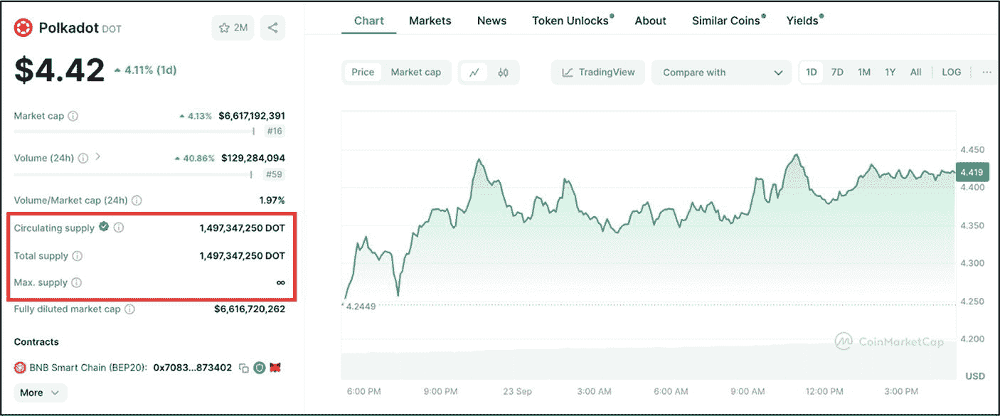
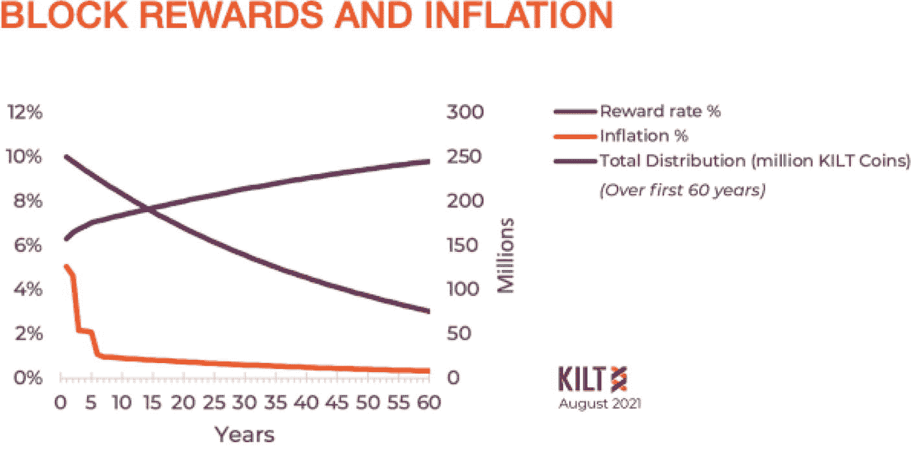
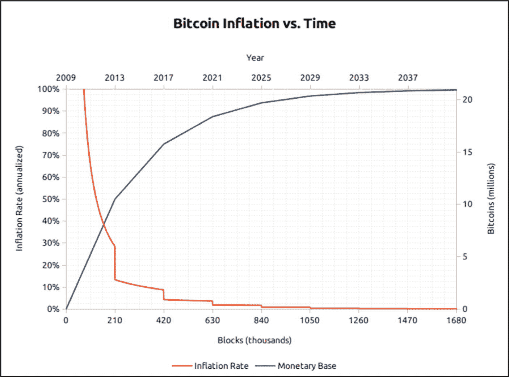
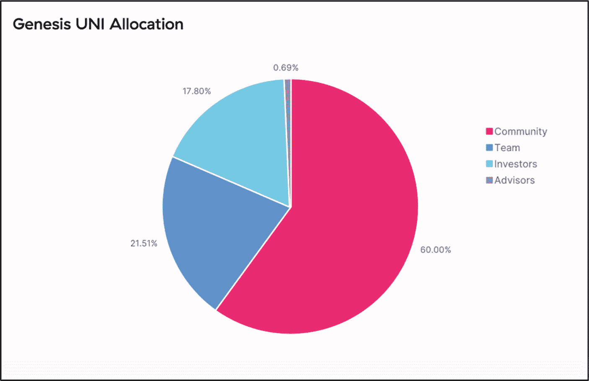
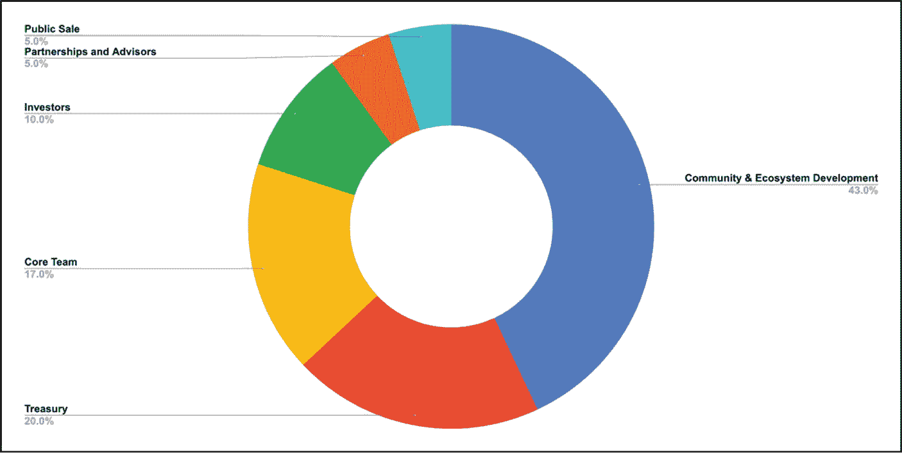
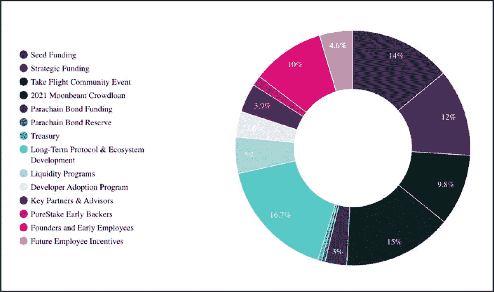
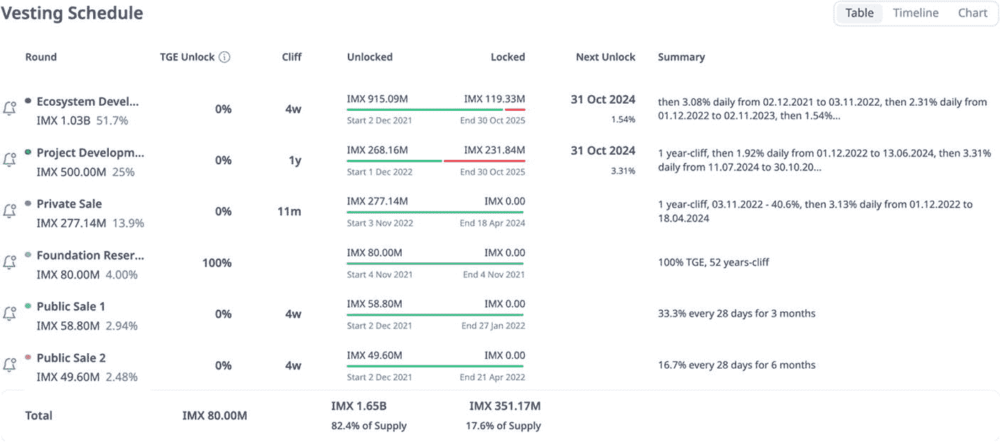
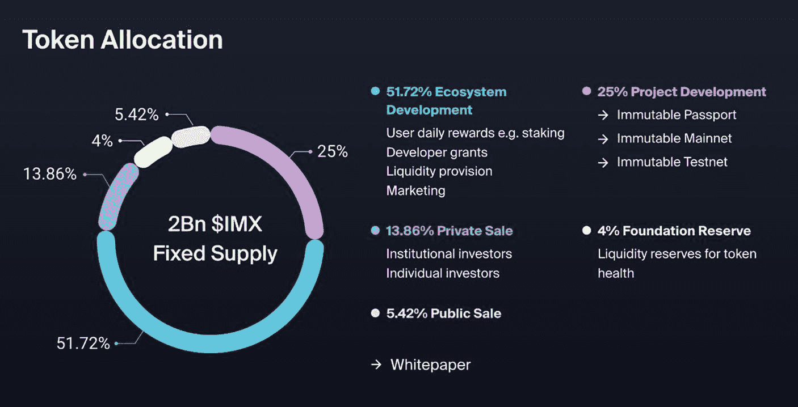

# 微观代币经济学与宏观代币经济学

传统经济学通常分为两大主要类别：*微观经济学*和*宏观经济学*。微观经济学关注个人和小型企业主层面的供需关系，而宏观经济学则研究更广泛的经济领域，包括*国内生产总值*（GDP）、进出口等因素。类似地，在区块链世界中，代币经济学也可以通过*微观代币经济学*和*宏观代币经济学*的视角来理解。

`Microtokenomics`（微观代币经济学）指的是驱动区块链经济体中参与者功能与互动的各类特征。通货膨胀率与通货紧缩率、质押奖励调整、解锁期以及代币流通速度等因素，都是微观代币经济学的关键组成部分。

`Macrotokenomics`（宏观代币经济学）则涵盖了更广泛的元素，例如治理机制、生态系统增长以及流动性提供。这些变量的相互作用，共同构成了区块链生态系统中的整体“*代币经济*”。

## 为什么良好的代币经济学对投资者很重要？

设计良好的代币经济结构，是成功项目的基础。由于供需特性直接影响并决定了代币的价值，因此具有吸引力的代币经济学深受投资者追捧。此外，理解代币经济结构还能帮助投资者预测资产未来的价值。

理解并分析加密项目的代币经济学，是基础评估过程中的重要一环。这是一个相对快速有效的过程，能提供宝贵的见解，帮助判断项目在长期内取得成功的可能性。本章将为您提供评估项目代币经济结构所需的工具和知识。

## 本章内容预览

本章将探讨影响代币供应设计及其在生态系统中行为的基本代币经济学要素及相关指标。我们将解释供应动态——包括总供应量、流通供应量和最大供应量——以及通缩模型、通胀模型和固定模型等代币供应模型。同时，还会涵盖代币分配模型，详细说明代币分配如何影响市值和流动性等市场指标。最后，本章将探讨解锁时间表及其在创建可持续代币经济中的作用。

**本章讨论的基础知识：**

*   `代币供应指标`
*   `代币供应模型`
*   `代币分配模型`
*   `解锁时间表`

## 代币供应指标

***评估目标：识别并评估总供应量、流通供应量和最大供应量的动态变化。***

总供应量指标——包括流通供应量、总供应量和最大供应量——是投资者用来衡量数字资产可用性和稀缺性的关键指标。供应量指标确定了在任何特定时间点将存在多少代币（或币）。这些区块链世界特有的指标，可以让我们深入了解当前有多少代币在流通，总共存在多少代币，以及最终将有多少代币被解锁（释放）。与法定货币（其供应量可通过自由裁量的货币政策进行扩张）不同，许多区块链项目会在初始代币合约中固定总供应量或最大供应量，尽管某些协议保留了链上或可升级的机制，允许社区稍后更改这些限制。然而，流通供应量会随时间推移，根据代币销毁、质押和解锁时间表等链上机制而波动。评估这些指标有助于投资者识别具有强劲增长潜力的代币，避免那些容易发生极端通胀的代币，并总体上为评估代币在市场上的长期价值提供优势。

项目的代币供应指标通常可以在白皮书的代币经济学部分找到。但在大多数情况下，白皮书中详述的供应指标可能已经过时。这是因为供应指标会根据预定义的代币合约参数持续更新。例如，随着时间推移，根据预定义的代币合约参数，更多的币或代币会被释放到流通中，直到所有资产都按照项目团队设定的初始代币分配计划解锁完毕。此外，对于允许在初始分配供应量之外额外铸造的代币经济学项目，一旦创世代币全部分配完毕，其流通量将继续上升。另一方面，在通缩模型中——代币被永久地从流通中移除——如果没有其他抵消机制作用，流通供应量通常会相对于先前时期随着时间的推移而下降。因此，由于代币供应指标的动态性质，建议首先查看项目白皮书；然而，对于供应指标和其他相关财务数据的实时追踪，像 [CoinMarketCap](https://coinmarketcap.com/) 或 [CoinGecko](https://www.coingecko.com/) 这样的数据源对加密货币投资者来说是必不可少的。

图 8-1 显示了 Polkadot 网络在 `CoinMarketCap.com` 上的代币供应指标，包括流通供应量、总供应量和最大供应量。

图 8-1

Polkadot 网络——流通供应量、总供应量和最大供应量（数据来源于 [`​coinmarketcap.​com/​currencies/​polkadot-new/​`](https://coinmarketcap.com/currencies/polkadot-new/)）

### 总供应量

总供应量是指在任何给定时间点已创建并存世的币或代币的总数。这包括当前流通的、以及被锁定或预留的币或代币，减去已被销毁或永久移除的币的总数。请注意，总供应量不包括由于通货膨胀（即未来增发机制）而将在未来铸造的币。

图 8-1 显示，Polkadot 网络的总供应量约为 1,497,347,250 个 `DOT`（在本书撰写之时）。此外，请注意 Polkadot 的流通供应量现在也是 1,497,347,250 个 `DOT`，与其最初分配的总供应量持平（所有大额解锁期已结束；只有持续的通货膨胀才会增加新的 `DOT`）。这意味着所有曾经被锁定的 `DOT` 现在都已释放进入流通。这对投资者来说是有价值的信息，因为它表明未来不会有大规模代币解锁进一步稀释供应（稀释通常会导致抛售压力增加，从而可能拉低每枚代币的价格）。

### 流通供应量

`流通供应量`指当前在市场上流通的代币或硬币总数，不包括被锁定、预留或尚未释放的部分。与总供应量相比，该指标能更清晰地反映资产的市场可用性。虽然较高的流通供应量通常意味着资产分布更广泛，但较低的流通供应量往往会制造稀缺性，从而推高需求和单个资产的价格。

以 `Polkadot (DOT)` 为例，其流通供应量与总供应量一致，为 `1,497,347,250 DOT`，这意味着所有代币都已完全解锁并在市场上流通。这意味着未来不会有代币解锁进一步稀释市场，从而压低单个币价——这对于评估长期价格稳定性至关重要。此外，检查代币供应是固定、通缩还是通胀的也很重要，因为这会影响未来的代币供应动态和价格走势——更多内容请参见下一节“代币供应模型”。

### 最大供应量

`最大供应量`是指将会被创造出来的硬币或代币的总数。它可以是上限固定的，即对可创造的数量设有硬性限制；也可以是无上限的，即由于通胀因素供应量无限。对于投资者而言，判断代币供应量是固定还是无限至关重要，因为上限固定的供应量通常会带来稀缺性，可能提升价值；而无上限的供应量则会随时间推移稀释价值。然而，一些项目也会采用通缩机制（例如代币销毁）来抵消通胀。例如，`Polkadot 网络`（图 8-1）没有最大供应量，因为它采用通胀模式；但同时它也融入了通缩机制，例如销毁部分交易手续费，从而平衡通胀。当一个协议同时包含铸造和销毁机制时，投资者应比较年铸造率与计划销毁率，以确定净发行量——是通胀、通缩还是大致中性。

### 行动步骤

按照以下步骤评估一个项目的流通供应量、总供应量和最大代币供应动态。

1. **白皮书 – 代币供应量核查**

   查阅白皮书，特别是代币经济学部分，以了解初始供应指标（流通供应量、总供应量和最大供应量）。如果这些供应指标未实时更新，可能不完全准确，但它们将提供一个基准，有助于与实时代币数据网站进行交叉验证，发现潜在差异。例如，一个固定的最大供应量将保持静态，在白皮书和诸如 `CoinMarketCap.com` 等网站上显示的数据应当一致。

2. **流通供应量 vs. 总供应量**

   在 `CoinMarketCap` 上，比较流通供应量与总供应量。
   1. 如果流通供应量低于总供应量，这意味着计划有更多代币解锁。这些解锁可能会增加抛售压力，并进一步压低每个代币的价格。
   2. 如果流通供应量与总供应量相同，这意味着没有更多代币解锁计划，从而降低了进一步稀释的风险。

3. **最大供应量**

   通过白皮书和 `CoinMarketCap` 核实项目是否有上限或无限的最大供应量。有上限的供应量通常意味着稀缺性，可能提升需求；而无上限的代币供应量可能随时间推移面临供应稀释，从而可能压低每个代币的价格。

4. **做笔记，并以自己的方式记录发现**

5. **将发现与基本面评估流程的其他部分结合**

#### 结果评估

代币供应指标没有绝对的对错。一个项目的总供应量和最大供应量通常取决于核心项目或服务的类型、运营及功能需求；因此，这些指标需要具体情况具体分析。然而，投资者应对流通供应量保持谨慎，特别是如果只有少量供应被释放到市场中，因为这可能随着更多代币解锁而对后续投资产生负面影响。

## 代币供应模型

***评估目标：确定项目采用通缩、通胀还是固定供应模型，并根据未来的稀释风险、需求可持续性以及个人投资策略进行评估。***

代币供应可分为三种主要模型或类别：*通胀型*、*通缩型*和*固定型*。每种模型都适用于满足 Web3 或区块链项目的特定设计和功能。每种模型类型对代币价格及总供应量、最大供应量和流通供应量的影响各不相同。此外，共识机制和代币累积机制的设计类型也决定了代币供应是通胀、通缩还是固定的。对 `StakingRewards.com`（一个追踪质押收益率和代币通胀数据的公开仪表板）上前二十个网络的审查显示，大多数主流协议的目标是低个位数的净发行率（大约每年 2–5%），以平衡验证者奖励与稀释，而个别项目可能旨在实现更高的通胀率——甚至是净通缩——具体取决于其协议设计和代币经济目标。

### 通缩型代币供应

通缩型代币供应指总供应量随时间推移而减少的代币经济模型。这种减少可以通过代币销毁等机制实现，即一部分代币被永久性地从流通中移除——有关代币通缩机制的更多细节，请参见第 7 章“代币设计与用途”。此概念旨在制造稀缺性，理论上，假设需求保持稳定或增加，随着供应减少，代币价值将被推高。通缩系统旨在维持长期价值增长，并在某些情况下抵消通胀，这使得它们对一些投资者具有吸引力。

在评估通缩系统时，建议投资者关注几个关键要素。首先，理解销毁机制，特别是销毁的频率、规模以及触发条件。这一点很重要，因为它有助于判断在特定时间段内将有多少代币留在流通中。虽然某些销毁可能随时间推移显著减少供应，但由于销毁率低，其他销毁可能影响甚微。通常来说，高销毁率在投资者中备受推崇，因为它创造了更多需求。然而，影响需求的变量众多，除了代币稀缺性之外，还包括代币的核心价值以及产品或服务。因此，对于销毁率，必须格外警惕。有些人会严重受到通缩供应和相关销毁率的影响而忽视全局——仅靠代币稀缺性无法拯救一个有缺陷的项目。为一个缺乏实际效用或用户兴趣的产品制造代币稀缺性，不太可能产生有意义的需求。人为的稀缺性无法弥补代币基础价值主张或采用潜力上的根本弱点。因此，只有当通缩供应与稳定或增长的需求相结合时，它才值得推崇。

专家提示

聪明的加密货币投资者会看穿华丽的销毁率，转而关注效用、采用潜力和精心设计的销毁时间表这三大要素，以此评估代币真正的长期可行性。

### 通缩型项目示例

`BNB Chain`（`BNB`）是一种按季度执行的算法自动销毁机制，通过自动将代币从流通中移除并发送至销毁地址，从而减少`BNB`币的供应量。

`以太坊`（`ETH`）以太坊提供了一个代币供应如何同时采用通缩与通胀机制的范例。最初，以太坊的原生货币`ETH`主要是通胀型的，这意味着定期会有更多代币进入流通。然而，在 2021 年 8 月 5 日，以太坊实施了一项名为`EIP-1559`的关键更新。此次更新引入了一种销毁机制，会销毁部分交易费用（称为"基础费用"），从而减少`ETH`的总供应量。如今，`ETH`的发行量（通胀）与`ETH`的销毁量（通缩）之间的平衡决定了以太坊是否面临通缩压力。例如，在网络使用量高的时期，会有更多`ETH`被销毁，供应量可能减少，从而产生通缩效应。另一方面，在网络活动低迷时期，销毁机制可能无法超过因`PoS`质押奖励而产生的新`ETH`发行量，此时便呈现通胀状态。

### 通胀型代币供应

通胀型供应是指随着时间的推移，通过逐步增加流通中的代币数量来创造更大代币供应量的模式。与通缩型代币供应类似，采用通胀型代币供应系统的原因取决于产品/服务的功能与设计。共识机制的类型（例如`权益证明`或`权益证明质押`）在通胀型代币供应中起着重要作用。挖矿和质押等共识机制会将新代币引入流通，从而增加代币总供应量。因此，供应量会被稀释，这有时会对每个币或代币的价格产生负面影响。因此，如果对产品或服务的需求无法超过通胀率，投资者的投资可能会受到负面影响。

#### 规避通胀风险

为了帮助降低通胀和投资贬值的风险，投资者通常会质押其数字资产——仅适用于`PoS`（`权益证明`）共识机制。通过质押（即锁定其持有的资产），投资者可以获得质押奖励。这些奖励可以交易、出售或重新质押以获取复利收益。将奖励重新质押以获取复利，本质上可以帮助投资者缓解通胀风险，因为他们能够持续维持或增加其在全网供应量中的质押份额。换句话说，这种投资者策略允许投资者的代币数量与整体代币供应量同步增长，从而保持其在供应量中的份额。然而，质押并非没有风险。根据项目要求，质押条款和条件通常包含锁定周期，在此期间投资者无法解除质押其资产，必须等待一定时间（例如一周、一个月等）之后才能操作。这种无法即时提现的限制对投资者来说是危险的。例如，如果由于团队成员负面新闻或黑客事件导致资产价值突然下跌，投资者将无法做出反应，而必须等到预定的锁定期结束。因此，在质押任何资产之前，仔细评估要质押哪些资产以及质押条款和条件非常重要。

#### 通胀型项目示例

`KILT Protocol`（`KILT`）——KILT Protocol，一个去中心化身份区块链网络，由于通过质押来帮助确保网络安全，其供应是通胀型的。图 8-2 展示了 KILT 区块奖励、通胀率以及前 60 年 KILT 币总分配量之间的关系。奖励率（紫色线）逐渐下降，而币的总分配量随时间推移而增加，这表明有更多币进入流通。但请注意，奖励率远高于初始通胀率，并且随着时间的推移，始终保持在相对于通胀率较高的水平。虽然这值得称赞，但除非投资者采用奖励复投策略，否则随着时间的推移，他们在代币总供应量中所占的百分比份额将会减少。

图 8-2

Kilt Protocol 的区块奖励与通胀（图表来源：[`kilt-protocol.org/files/Token-Economy.pdf`](https://kilt-protocol.org/files/Token-Economy.pdf)）

### 固定代币供应

顾名思义，固定供应模型是一种代币供应模式，其拥有一个固定的或总数量的代币，且总数无法被超越。对于固定供应，达到供应上限后无法再铸造新代币，这可以造成稀缺性，并且如果需求保持，可能对价格起到支撑作用。固定代币供应会营造一种稀缺感，因为只有有限数量的代币或币种存在。

在分析固定代币供应时，识别并具体分析项目的流通供应量和最大供应量指标至关重要——其中最大供应量就是"固定"的供应值。流通供应量指标提供的是流通中的币的数量，而最大供应量代表的是代币将会存在的绝对上限。通过比较这两个指标，投资者可以判断是否会有更多币通过代币解锁（通过归属期）或通胀形式被释放到流通中。如果流通供应量等于最大供应量，则不会再有币或代币被释放到流通中。然而，如果流通供应量低于最大供应量，则预计供应量将进一步稀释，投资者应根据流通供应量相对于最大供应量的高低程度来评估这种稀释的严重性。

专家提示

在评估采用固定代币供应的项目时，请考虑其用例和需求增长。仅凭稀缺性并不能保证价格上涨——现实世界的实用性和采用率同样重要。

### “固定供应”项目示例

`bitcoin (BTC)` 是一个固定供应项目的例子，其硬性（最高）上限为 2100 万枚。随着新币通过挖矿引入，比特币的供应设计会随着时间的推移从通胀型转变为通缩型（通胀率趋近于 0%），直到达到 2100 万枚的固定上限。比特币的减半机制每四年发生一次，将挖矿奖励减少 50%，从而逐步降低新币的创造速度。这使得比特币从通胀状态转变为通缩状态，最终在达到上限后进入供应静态的非通胀状态。届时，矿工将不再获得区块奖励，其唯一激励将来自比特币网络用户支付的交易手续费。

图 8-3 展示了比特币通胀率随时间下降以及其货币基础随时间增长的情况。在早期，随着新币的迅速引入，比特币的通胀率接近 100%，但每次减半事件后，这一比率显著下降，预计到 2140 年将趋近于零。与此同时，流通中的比特币总数（货币基础）起初增长迅速，但随着其接近 2100 万的最大供应量，增长速度逐渐放缓。这反映了比特币的通缩设计，确保了稀缺性，并支撑其作为价值储存手段的价值主张。

图 8-3

比特币通胀率随时间变化图（数据来源：[`www.bitcoinblockhalf.com/`](https://www.bitcoinblockhalf.com/)）

### 行动步骤

请按照以下步骤来确定项目采用的是通缩、通胀还是固定供应模型，并根据未来的稀释风险、需求可持续性以及是否符合你的投资策略进行评估。

1.  **代币供应模型**

    确定项目采用的代币供应模型，是*固定*、通胀还是通缩模型。
    1.  **固定供应** – 不会创建新代币。
    2.  **通胀供应** – 定期添加新代币。
    3.  **通缩供应** – 代币数量随时间减少（通过销毁或类似机制）。

2.  **流通供应量与最大供应量（重点关注固定供应）**

    在评估固定供应模型时，比较流通供应量与最大供应量至关重要。
    1.  当流通供应量与最大供应量相同或几乎相同时，这很有吸引力，因为它消除了供应量的未来稀释或将其降至最低。
    2.  如果很大一部分代币尚未进入流通，请根据你的投资策略判断未来的稀释程度是否可以接受。
        1.  考察投资策略变量，例如是短期还是长期投资。你计划持有多久？除非有计划中的激进代币解锁，否则包括固定供应在内的供应模型，对短期投资者的影响小于对长期投资者的影响。
        2.  如果是长期策略，请特别关注其他核心基本面因素，以帮助你判断它们是否会超过代币供应未来稀释的影响。

3.  **通胀率（通胀模型）**

    在评估通胀供应模型时：
    1.  检查通胀率及其分配方式（例如，质押奖励和挖矿奖励）。
    2.  利用基本面分析的其他方面预测，项目的需求增长是否能超过通胀率，或者代币的价值是否会随着时间的推移而被稀释。
    3.  是短期还是长期投资？短期投资者受到的影响小于长期投资者。
    4.  如果是长期投资，你是否计划进行质押（针对基于 PoS 的项目）并复投以获得复利奖励？这有助于保持你在总供应量中的相同代币比例，从而抵消代币稀释对长期投资者的影响。

4.  **销毁机制与稀缺性（通缩模型）**

    在评估通缩供应模型时：
    1.  **不要依赖通缩代币供应来创造需求**。通缩供应是对现有具备高基本面、用户增长明显的产品的补充。
    2.  调查销毁机制：
        1.  销毁的频率如何？
        2.  供应量减少了多少？
        3.  触发销毁机制的条件是什么？
        4.  代币销毁机制是否会在某个时间点结束？

5.  **记录笔记并以你自己的风格记录发现**

6.  **将发现结果与基本面评估过程的其他部分结合**

#### 结果评估

代币供应并没有一种放之四海而皆准的方法；项目团队通常会选择最适合其产品的模型。核心设计、功能以及项目的长期愿景和目标将直接影响所选的代币模型。理想情况下，采用固定供应模型或具有主导通缩机制的项目对投资者更具吸引力。知道代币供应不会无限膨胀、导致供应持续稀释并进而影响投资，这会带来一种安全感。然而，强烈建议不要只关注这些方面。虽然通缩或固定供应很有吸引力，但它们并不能保证成功。此外，许多采用通胀模型的项目也取得了成功，这证明了效用、采用率和项目整体基本面等因素至关重要。

## 代币分配模型

***评估目标：识别项目的代币分配模型，并确定其分配是否符合行业基准、确保公平性、支持长期增长和社区参与。***

代币分配模型是一种策略，详细说明了加密项目如何在利益相关者（包括项目团队、开发者、顾问、早期支持者和投资者）之间分割和分配代币供应量。可以把它想象成切蛋糕并决定谁得到什么。决定每个分配类别（包括利益相关者）获得多少代币，会直接影响投资者以及项目的长期可行性和整体成功。代币分配模型的设计，包括决定总供应量和最大供应量如何由团队在熟练专业人士的帮助下执行。在此过程中会考虑许多因素，包括核心产品的功能、代币效用、供应模型类型、治理结构、分配机制、供需关系、用户需求以及其他相关领域。此类设计细节超出了本书的范围，并且不被视为本次分析所需部分。相反，我们将讨论代币分配，包括投资者需要关注的关键要素和警示信号。主要目标是确保代币供应分配不会过度集中在团队或早期支持者手中，而是将公平的份额分配给社区。

### 代币分配群体

在代币经济设计阶段，代币供应会在不同群体之间进行分配，以帮助确保项目长期成功。通常，项目团队会决定代币供应如何划分以及每个分配类别的配额。影响这一决定的因素有很多，包括项目资金需求、开发者激励、社区增长和未来发展。表 8-1 概述了通常会获得部分代币供应份额的最常见的分配类别类型。

表 8-1 典型的代币分配群体

| 代币分配类别 |  |  |
| --- | --- | --- |
| 类别 | 定义 | 分配目的 |
| --- | --- | --- |
| 团队和创始人 | 项目的创建者、开发者和核心团队成员。 | 激励其工作、奉献精神以及对项目长期成功的贡献。 |
| 合格投资者 | 投资于早期种子轮、风险投资和私募轮的合格投资者。 | 提供项目早期构建和发展所需的充足资金。 |
| 合作伙伴和顾问 | 为各种合作交易和顾问预留的代币，以帮助加强项目。 | 与区块链公司的合作伙伴关系。意见领袖。营销顾问。技术顾问。财务顾问。 |
| 社区和生态系统激励 | 为社区贡献预留的代币，以激励参与和生态系统增长。 | 空投。生态系统奖励。农耕和流动性挖矿奖励。社区贡献者激励。市场营销。 |
| 财库储备 | 由去中心化自治组织、公司、创始机构或基金会持有的代币。 | 旨在通过以下方式维持项目的长期存续：运营和维护。维护安全。生态系统增长和发展。应急基金。研发。 |
| 公共投资者 | 面向公众、散户投资者和消费者持有的代币。 | 以下一项或多项的公开销售：首次代币发行。首次去中心化交易所发行。首次交易所发行。众售。 |

#### Uniswap 代币供应模型示例

当 Uniswap 启动时，铸造了十亿个`UNI`代币。这些代币按照图 8-4 所示的进行了分配。这是一个值得称赞的代币分配模型，大部分代币份额分配给了社区激励计划。

图 8-4 Uniswap（承蒙 [`blog.uniswap.org/uni`](https://blog.uniswap.org/uni) 提供）

从图 8-4 可以看出，60%（6 亿`UNI`）分配给了社区，团队获得了 21.51%（2.151 亿`UNI`），早期投资者获得了 17.51%（1.78 亿`UNI`），剩下 0.69%（6900 万`UNI`）给了项目顾问。请注意，大部分代币流向了社区。近 60%的`UNI`代币被分配给 Uniswap 社区，以全面推动生态系统增长和去中心化治理。这些代币主要用于通过空投奖励早期用户、支持流动性挖矿计划，以及赋能社区驱动的治理。这些代币中的很大一部分保存在治理财库中，用于资助社区项目、发放补助金，并进一步激励生态系统参与。

### 代币分配基准

在代币分配方面，投资者的主要目标是确保代币的分配方式能够推动增长，同时保护公共投资者免受项目团队或早期种子轮投资者大量抛售的风险。在图 8-5 中提出了一个建议的代币分配模型基准。虽然分配比例和相应的百分比会因项目而异，但出于多种原因，这种结构对投资者来说是值得称赞的。

图 8-5 面向投资者的代币分配模型基准

- **社区与生态系统发展** – 首先，最大份额预留给社区激励和生态系统发展。这对于项目的增长至关重要，因为它涵盖了多个领域，包括用户奖励、质押、挖矿、营销、流动性、贡献者计划和开发者补助——因此，这一分配至少应为 40%或更多。例如，Uniswap（图 8-4）将其 60%的代币分配给社区，这在推动项目增长方面发挥了关键作用。通过这样做，他们减轻了项目团队和种子轮投资者早期抛售代币的风险。由于大部分代币用于激励社区，较小群体的任何抛售对整体生态系统和每个代币价格的影响都较小。
- **财库** – 大多数项目启动时会将初始供应量的 15%到 21%左右预留为财库（例如，Uniswap 约为 21%，Optimism 约为 20%，Polkadot 约为 18%），这为项目提供了 3-5 年的运营、升级、补助和应急资金，而不会对流通量造成冲击。
- **项目团队** – 17%到 20%是团队的标准分配比例——前提是他们值得拥有！
- **投资者** – 投资者的资金对于初创项目的建立很重要。然而，除非早期支持者提供极致的价值（除了资金之外），否则分配不应超过 10%。供应量的主体最好分配给社区激励储备和财库，这将从长远来看增加显著的价值。
- **合作伙伴与顾问** – 通常分配供应量的大约 5%。根据项目的复杂性，这一比例可能会略有增加。
- **公开销售** – 传统上，公开销售——即在项目启动时将代币出售给公众——会分配总供应量的大约 3-5%。然而，近年来出现了一个明显的转变，项目逐渐远离公开销售，而是更多地关注社区激励分配。例如，来自[UnlockInsights.app](https://insights.unlocks.app/)历史上的代币发行数据以及[CryptoRank.io](https://cryptorank.io/)的最新数据显示，公开销售份额从 2018 年的大约 35%下降到 2025 年的仅约 3%-5%。这一转变对项目有利，有助于建立强大的社区，推动生态系统的有机增长。此外，它还减轻了早期投资者大规模抛售代币相关的风险。

### 行动步骤

按照以下步骤识别项目的代币分配模型，并判断其分配是否与行业基准相符、确保公平性，并支持长期增长和社区参与。

1.  **代币分配模型详情**
    从白皮书、官方文档及其他可靠来源，审查与项目代币分配模型相关的信息。

2.  **基准代币分配模型**
    将项目的代币供应分配与本部分概述的基准模型进行比较。
    -   是否存在团队或投资者代币分配过度的明显担忧？
    -   社区激励储备金是否获得了最大分配？最低 40%是可取的。
    -   国库是否获得了代币供应量的 20%（或更多）？
    -   其他可能对投资者不利的观察结果？

3.  **竞争对手分析**
    将项目的代币供应分配与同一细分领域内成功竞争对手的分配进行比较。
    -   项目的代币与成功投资者相比如何？
    -   这些竞争对手的代币分配是否存在已知问题或陷阱，而本项目已经从中学习并加以解决？
    -   与其竞争对手相比，项目的代币经济学透明度如何？更高的透明度可能是良好治理和承诺公平实践的标志。

4.  **以你自己的风格记录发现并做笔记**

5.  **将发现与基本面评估流程的其他部分相结合**

#### 评估结果

代币供应的分配是一个关键的基本要素，在整个基本面分析中占有很大权重。因此，如果团队或投资者代币分配超过了社区激励分配，则视为可疑，建议远离投资。

如果与建议的代币分配基准存在显著偏差，建议在投资前联系项目团队寻求建议。请注意，可能存在一些微妙的情况，即代币分配类别与基准不同，但经过进一步研究后可以接受。例如，以 [Moonbeam Network](https://moonbeam.network/) 为例，由于其独特地参与了波卡（Polkadot）的平行链基础设施，其代币分配专门定制并设计用于容纳一些细微的分配类别，其中包括 *起飞社区活动、2021 年 Moonbeam 众贷分配以及平行链债券储备。*

图 8-6
Moonbeam 网络，创世代币分配（致谢：[`​moonbeam.​foundation/​glimmer-token/​`](https://moonbeam.foundation/glimmer-token/)）

## 解锁时间表

**评估目标：** 评估项目的解锁时间表，以确定其对代币供应稳定性、价格波动性以及项目团队对长期成功的承诺的影响。

加密货币领域的“解锁”（Vesting）是指代币在一段设定时间内逐步释放给利益相关者。当代币逐步释放时，有助于减少突然的价格变化，而过早释放过多代币反而会增加价格波动，即使其目标是展示长期支持。对于投资者而言，分析解锁时间表是基本面分析的重要组成部分，因为它决定了项目启动后或在项目生命周期早期阶段的任何时期是否存在大量代币倾销的可能性。分析解锁时间表有助于衡量项目团队的投入和承诺程度，这体现在数年时间内缓慢且平衡的代币释放。

### 解锁时间表及相关术语

理解与解锁相关的关键术语对加密货币投资者至关重要。它有助于阐明代币分配的工作方式、代币释放的条件，以及这些机制如何使利益相关者的利益与项目的长期成功保持一致。以下是每个投资者都应熟悉的与解锁相关的主要概念详解：

表 8-2
解锁相关术语

| 术语 | 描述 |
| --- | --- |
| 解锁期 | 代币逐步释放的时间范围。 |
| 悬崖期 | *悬崖期*指的是代币开始逐步释放之前必须经过的初始时间。这些*悬崖期*的长度可能因预期分配类别而异。例如，项目团队成员或种子轮投资者可能适用 24 个月的悬崖期，而公开发售参与者可能适用一个月的悬崖期，或在某些情况下没有悬崖期。 |
| 线性解锁 | 代币在解锁期内以恒定速率释放。 |
| 分级解锁 | 代币在特定时间间隔内分批释放，而非均匀释放。 |
| 锁仓期 | 代币在智能合约中被锁定、不可转让的时间段，即使技术上已归属。 |
| 完全解锁 | 指所有代币完全由持有者拥有并可自由访问的时间点。 |
| 代币解锁 | 指根据解锁时间表，特定数量的代币被释放进入流通的时间。 |
| 解锁合约 | 一种根据解锁时间表自动处理代币释放的智能合约。 |
| 里程碑式解锁 | 代币释放由特定目标或项目里程碑触发。 |

**专业提示**

在投资之前，请访问 [Tokenomist.​ai](https://tokenomist.ai/) 查看所有即将到来的代币解锁的详细数据。建议不要在代币解锁前投资；相反，应等到代币解锁过去且每个币或代币的价格稳定后再进行。这种做法将为投资者省下金钱。

### 归属时间表评估

本节对 [Immutable X](https://www.immutable.com/) 的归属时间表进行了分析与评估。Immutable X 是一个基于区块链的协议，专为交易和创建非同质化资产（NFT）而设计。图 8-7 展示了 Immutable X 在创世时的代币供应分配情况，而图 8-8 则以实时表格形式显示了相应的归属时间表。

图 8-8

Immutable X 归属时间表（图表由 [`​cryptorank.​io/​price/​immutable-x/​vesting`](https://cryptorank.io/price/immutable-x/vesting) 提供）

图 8-7

Immutable X 代币分配（图表由 [`​imx.​community/​tokenomics`](https://imx.community/tokenomics) 提供）

归属时间表的第一列详细列出了分配类别，以及分配给每类分配的相应代币数量（与图 8-7 匹配）。标题为“TGE 摘要”的列详细说明了在代币生成事件（TGE）中解锁的占总供应量的百分比。TGE 是指代币（或币）公开发布到市场的时刻。第三列概述了为每项分配设定的*锁仓期*，指明了代币发布后需要等待的解锁时间。

### 基金会储备代币

评估归属时间表时，首先要查看在代币生成事件（TGE）时哪些分配及其多大比例会被释放。如果 TGE 尚未发生，或者您已参与公募轮，这一点尤其重要。对于 Immutable X 而言，基金会储备是在 TGE 时唯一被释放的分配，并且已完全解锁；由于这些代币被指定用于长期项目需求，而非即时流动性，因此 TGE 后大规模抛售的风险已大大降低。然而，计划在 TGE 时购买代币的投资者仍需确定下一批代币计划何时进入流通，以及释放的比例是多少。

### 公募轮代币

接下来计划释放的是*公募轮*代币（占总供应量的 5.42%）和*生态发展*分配，这两部分都计划在 TGE 后四周（四周锁仓期）释放。如摘要列所述，公募轮代币计划在三个月内每四周释放 33%。根据 `CryptoRank.io` 和 `Tokenomist.ai` 等代币归属追踪平台的说法，这种释放时间表是常见做法；然而，情况并非总是如此，有些项目甚至会一次性释放其全部公募轮分配。这并无对错之分；不过，将释放时间分散在三个月内，往往有助于缓和剧烈的价格波动。

### 生态发展代币

*生态发展*分配代币的释放结构更为复杂，时间跨度从 2021 年到 2025 年。这种释放时间表对投资者不构成威胁，因为这些代币释放缓慢，且专门用于生态发展。

### 项目发展代币

*项目发展*分配遵循类似的释放时间表，但在任何代币释放之前有一个一年的锁仓期。从“已解锁-已锁定”列可以看出，这两项分配仍在持续释放，直到 2025 年 10 月进行最终分配。在表格底部，显示剩余待分配代币为 3.517 亿枚，占总供应量的 17.6%。

专业建议

`Cryptorank.io` 是一个分析实时加密货币归属时间表及其他一系列财务数据的绝佳网站。在这里，投资者可以直观地看到下一次代币解锁的时间，从而做好相应准备。

### 私募轮代币

私募轮和种子轮代币的释放对大多数项目来说都是一个威胁。这些代币通常由机构投资者和私募股权公司以极低的单价买入。这些投资者一旦获得代币使用权，便寻求锁定利润，其结果导致市场承受巨大的抛售压力，从而压低代币单价。通常，这类投资者在出售时总是盈利的，因为他们购买代币的成本极低，相比之下，公募轮参与者以及在公开市场上购买代币的人则不然。根据项目的受欢迎程度，这些高端机构投资者获得 10 倍到 50 倍的收益是常见情况。

就 Immutable X 而言，*私募轮*代币有一个 11 个月的锁仓期，之后释放时间表从 2022 年 11 月持续到 2024 年 4 月（约 17 个月）。与其他项目相比，这种锁仓期和释放结构值得称赞。许多项目允许私募轮和种子轮代币的一部分在 TGE 时释放，这会严重影响公募轮参与者和公开市场的买家，通常会导致严重的价格波动，对大多数缺乏经验的投资者和交易者产生负面影响。然而，IMX 公募轮参与者相比之下得到了更好的保护，因为根据释放时间表，他们在私募轮代币之前就能收到全部代币。尽管如此，持有 IMX 代币的投资者通常会在私募轮代币释放前或释放时经历代币单价的轻微下跌。例如，在 2022 年 11 月 3 日这批私募轮代币（占 13.90% 的 40.60% = 总供应量的 5.64%）释放后的头几天里，代币单价从大约 0.70 美元下跌超过 40% 至 0.40 美元。虽然有经验的交易者可能会尝试利用这些剧烈波动，或者至少在这段时间内坚持持有其投资，但大多数投资者会恐慌性地抛售他们的代币，即使这意味着承受严重损失。请注意，大约七周后，IMX 代币价格开始上涨，并在短短 11 周内价值翻了三倍。然而，情况并非总是如此，因此投资者有责任了解并为这种代币解锁做好准备。

### 项目团队代币

由于 [Immutable X](https://www.immutable.com/) 团队并未获得代币分配，因此对投资者而言，唯一的潜在威胁是*私募轮*代币的释放。

专业建议

在 TGE 时——即代币进入市场及其后几天——买入通常会带来双向的剧烈价格波动；上涨空间可能巨大，但下跌也同样残酷。因此，除非您确实信心十足（且经验丰富），否则更明智的做法是等待市场企稳后再入场。

### 解锁时间表基准

解锁时间表并非一门精确的科学，会根据项目需求以及项目团队和顾问的偏好略有不同。一个诚实且专注的团队的核心目标是制定一个有助于维持项目长期成功的解锁时间表，同时减少严重的抛售压力，避免剧烈的价格波动。这意味着团队需要有足够的启动资金用于开发和运营，并确保代币能够缓慢且逐步地释放到流通中。这种解锁基准结构见表 8-3。

请注意，“释放时间表”为每项分配指定了“均匀分布”。这是一种理想情况，有助于最大限度地减少剧烈的价格波动（就加密货币领域而言）。另一种流行的选择是基于里程碑的解锁，即只有在项目达到特定的产品或生态系统目标时，才会释放新一批代币。话虽如此，项目在首次释放时释放 10%–40% 的配额，然后在此之后均匀分布是很常见的。例如，对于合格投资者，在锁仓期结束后，可能会释放 25%，然后在接下来的三年内，将剩余的 75% 按日、周或月均匀分布。如前所述，问题通常越大，抛售压力就越大。因此，完全均匀分布，或者至少在 15% 的初始释放中仅释放 10%，是值得称赞的。

对于投资者而言，如果项目尚未启动或仍有大量代币未解锁，解锁时间表就很重要。然而，对于那些所有代币或币种已完全解锁的项目，解锁时间表往往不那么关键。如果遇到与表 8-3 的重大偏差，请停下来，进一步调查，并且在调查结果令人满意且疑虑得到解决之前，不要进行投资。

**表 8-3** 值得称道的解锁时间表和锁仓参数

| 解锁时间表基准 |
| --- |
| 分配对象 | TGE 解锁比例 | 锁仓期 | 释放时间表 |
| --- | --- | --- | --- |
| 团队与创始人 | 0–5% | 1 或 2 年 | 至少 4 年（均匀分布） |
| 合格投资者（私募/种子轮） | 0% | 1 或 2 年 | 至少 3 年（均匀分布） |
| 合作伙伴与顾问 | 0% | 至少 1 年 | 至少 2 年（均匀分布） |
| 社区与生态系统发展 | 30% | 1 个月 | 至少 4 年（均匀分布） |
| 财务储备 | 20% | 2 个月 | 至少 4 年（均匀分布）（用于维持稳定，支持项目的长期增长、发展和成功） |
| 公开销售投资者 | 0% | 1 个月 | 6 个月（均匀分布） |

#### 专家提示

投资者面临的一个持续挑战是，在评估解锁和分配时间表时，会用到不同的定义和术语。如有疑问，请联系项目团队以获取澄清。请记住，没什么可隐瞒的项目通常都有明确定义的供应分配和解锁时间表。

### 行动步骤

遵循以下步骤来评估项目的解锁时间表，以确定其对代币供应稳定性、价格波动性以及项目团队对长期成功的承诺的影响。

1. **查找解锁时间表**  
   找到项目的解锁时间表。有时这很难找到，尤其是如果项目已经启动多年。首先，访问项目的官方网站和博客。还可以查看 `Cryptorank.io` 和 `Tokenomist.ai`，比较它们的数据，并通过社区渠道（Discord、Telegram 和治理论坛）交叉核对最新信息。如果团队已上传解锁时间表，`CoinGecko.com` 和 `CoinMarketCap.com` 有时会托管这些信息。

2. **评估解锁时间表**  
   使用“解锁时间表评估”部分中概述的解锁时间表分析技术来评估解锁时间表的状态。
   1. **TGE 解锁比例** – 检查在 TGE 时会释放多少代币供应量。是否存在任何令人担忧的分配在 TGE 时有高比例解锁，可能导致抛售压力和价格下跌？
   2. **锁仓期** – 审查锁仓期。是否有没有锁仓期的分配？或者锁仓期很短的分配？是否有多个锁仓期在同一时间结束，可能导致价格剧烈波动和抛售压力？
   3. **分配时间表** – 逐步的代币释放时间表比一次性大量释放更值得称赞。错开分配往往能最大限度地减少价格波动。
   4. **社区与生态系统发展分配** – 是否有部分生态系统发展代币在 TGE 时或 TGE 后不久释放？在初始代币一次性释放后，缓慢、逐步的代币释放是值得推崇的。
   5. **合格投资者分配** – 密切关注私募和种子轮代币的锁仓期和解锁时间表。早期支持者在第一时间卖出是很常见的，这会给代币价格带来下行压力。
   6. **团队与顾问分配** – 验证项目团队是否为其代币制定了合理的解锁时间表。一个较长的锁仓期表明团队对项目长期成功的承诺。

3. **解锁时间表基准**  
   将解锁时间表与“解锁时间表基准”部分中概述的解锁时间表进行比较。

4. **竞争对手分析**  
   将解锁时间表与成功竞争对手的解锁时间表进行比较。
   1. 是否有明显差异？如果有，这些差异会如何影响你的投资？

5. **记录笔记，并以你自己的风格记录发现**

6. **将发现与基本面评估流程的其他部分结合起来**

#### 评估结果

如果你发现与解锁时间表基准存在显著偏差，或发现本节中讨论的类似问题，请暂缓进行任何投资。只有在你的疑虑得到充分解决和澄清后，才继续推进。

