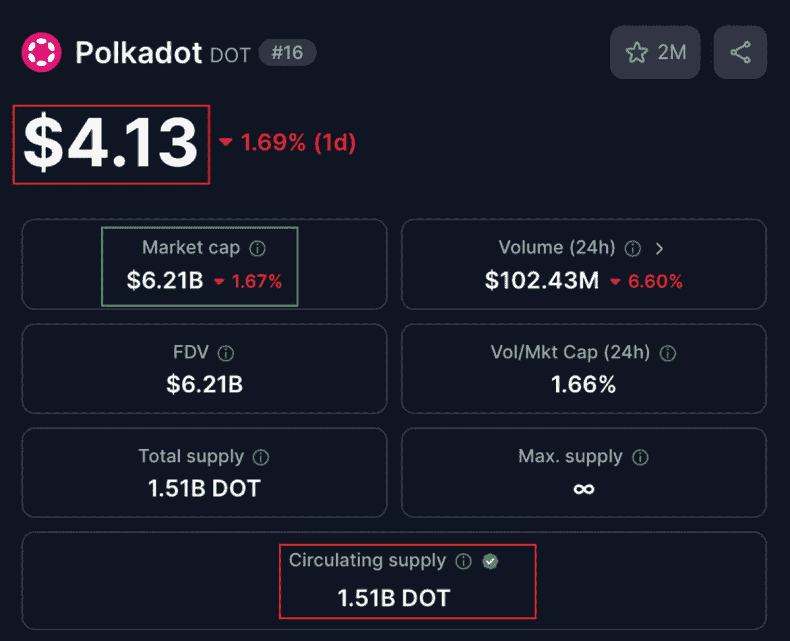
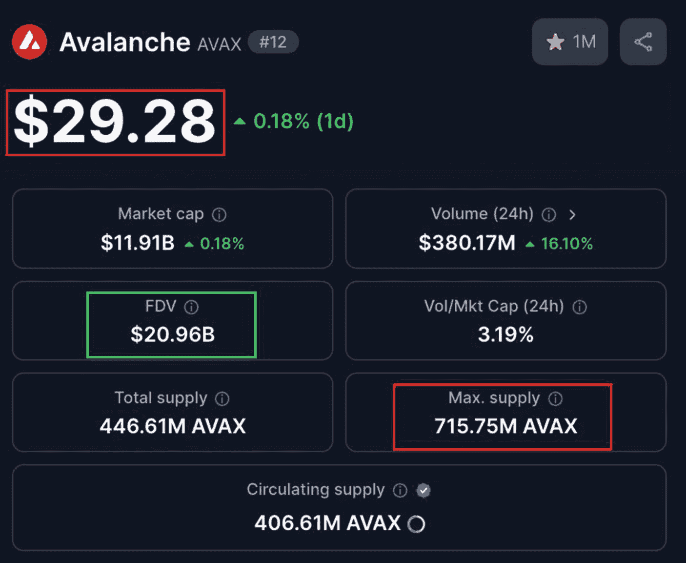

# 9. 财务指标

本章将讨论数字资产的财务指标，包括链上和链下财务指标。链上指标指直接记录在区块链上的信息，例如总交易量、活跃地址数量以及当前处于盈利状态的流通供应百分比。另一方面，链下指标通常是记录在中心化服务器上的数据——例如来自中心化交易所的价格和交易量——并上报给诸如 `CoinMarketCap.com` 等数字资产价格追踪网站。请注意，报告的交易所交易量可能会通过洗售交易或机器人活动被人为夸大，因此务必与链上数据以及来自信誉良好、受监管场所的交易量进行交叉核对。

评估数字资产的历史财务数据，能够为项目整体表现、基本面健康状况以及自诞生以来是处于衰退还是增长趋势提供宝贵的洞察。这也包括其熊市和牛市的表现、稳定性以及未来潜力。通过使用多种链上财务指标，投资者可以识别和分析市场趋势及价格行为模式。在分析价格行为时，目标是利用一项或多项指标找到汇聚点，从而帮助预测每个币的资产价格未来走势。这种方法使投资者能够战略性地规划获利了结和买入策略，以适应吸筹区、派发区以及价格在这些区域之间波动的过渡区域。

使用诸如 `市值（MC）`、`完全稀释估值（FDV）`、`总锁定价值（TVL）` 和 `总质押价值（TVS）` 等多种财务指标，投资者可以评估资产的受欢迎程度、可信度、用户互动、经济潜力以及整体表现。将这些数据与其他链上财务指标和技术分析相结合，能显著增强投资者的洞察力，从而在投资时实现更高效的风险管理，并更精确地确定入场和出场点位。

## 财务指标软件

本章将使用多种财务指标软件来分析数字资产的财务和基本面健康状况。此类软件包括 [Glassnode](https://studio.glassnode.com/home)、[Bitcoin Magazine](https://www.bitcoinmagazinepro.com/) Pro、[CoinMarketCap](https://coinmarketcap.com/) 和 [DeFi Lama](https://defillama.com/chains)。其他流行的加密资产财务指标软件还包括 [Token Terminal](https://tokenterminal.com/terminal)、[Messari](https://messari.io/)、[Dune Analytics](https://dune.com/home) 和 [Nansen](https://www.nansen.ai/)。

`Glassnode` 是本章用于深入分析链上指标数据的主要软件，且多数采用比特币作为示例说明。该软件专为数字资产投资者设计，用于分析和评估那些标准金融市场的网络分析平台（例如交易图表和价格行为数据）无法实现的关键链上指标。`Glassnode` 提供了数百种链上指标数据工具；因此，本书仅在范围内讨论最相关的指标。鼓励投资者研究并探索 `Glassnode` 以及类似网站，如 `Bitcoin Magazine Pro`、[CryptoQuant](https://cryptoquant.com/) 和 [CoinMetrics](https://coinmetrics.io/)，这些网站提供了直接从区块链获取的广泛链上数据分析资源。其中包括详细的指标仪表盘、可下载的 API、量化交易和风险管理工具，以及适合多种投资策略的自主交易辅助工具。

**事实**

量化交易中的交易所风险管理，是一种通过使用由链上分析（如 `Glassnode` 的实时交易所流量仪表盘和 `Bitcoin Magazine Pro` 的）提供的自动化模型，来追踪各个交易所的流动性和杠杆变动，并动态调整头寸规模或对冲策略以限制回撤风险的实践。

如前所述，需要注意的是，本章涵盖了多项链上指标，其中许多主要仅适用于比特币，某些情况下也适用于其他非常流行的币种和代币。原因在于，那些较新、规模较小且市值较低的币种和代币通常不被追踪，因此无法获取其数据水平。然而，由于比特币拥有最大的市值和最高的市场主导权，理解其价格波动能为投资者洞察其他山寨币和代币的潜在入场和出场点位提供宝贵依据。尽管如此，仍鼓励投资者探索不同的分析工具，因为大多数 DeFi 项目都提供了充足的财务数据供评估——[DeFi Lama](https://defillama.com/chains) 对于所有 DeFi 项目来说都是一个极佳的选择。

**本章讨论的基本指标：**

- `市值和完全稀释估值`
- `实现市值`
- `实现市值与 HODL 波浪`
- `流动性与交易量`
- `总转账量`
- `总质押价值（TVS）`
- `总锁定价值（TVL）`
- `费用与收入`
- `交易次数`
- `通胀率`
- `投资者工具`
- `供应量盈利百分比`
- `活跃地址`
- `余额大于 1 万比特币的地址数量`
- `MVRV 比率`
- `MVRV Z-Score`
- `未实现净盈亏（NUPL）`
- `哈希率`
- `网络价值与交易信号（NVTS）`
- `Stock-to-Flow 模型`

## 市值与完全稀释估值

**评估目标：评估项目的市值和完全稀释估值（FDV），以确定潜在风险，包括未来代币稀释、通胀影响，以及是否符合你的投资策略。**

识别并分析项目的财务估值是投资者首要也是最重要的评估步骤。项目的估值通过评估 `市值` 和 `完全稀释估值（FDV）` 来确定。市值基于流通中的代币，提供了项目当前价值的快照。而完全稀释估值——也称为完全稀释市值——则着眼于若所有代币都进入流通后其潜在的未来价值。`市值` 和 `完全稀释估值` 最终都是由由买卖双方构成的市场来计算的，但它们的计算方式不同。


### 市值

市值（Market Capitalization，简称 Market Cap）是指项目流通供应量的总市场价值，参见公式 9-1。需要明确的是，市值并不包含被锁定、归属、或尚未开采/铸造的代币。由于交易所有时会虚增交易量，而数据网站也可能误报流通供应量，因此在依赖市值数据前，建议从两到三个追踪平台（如`CoinMarketCap`、`CoinGecko`和`Messari`）获取数据，并对任何较大差异进行合理性检查。项目的市值是通过将流通供应量乘以每枚代币的价格计算得出的——例如，图 9-1 展示了[波卡网络](https://polkadot.com/)的财务指标（数据来自[`CoinMarketCap.com`](https://CoinMarketCap.com/)）。波卡市值的计算方式如公式 9-2 所示。

```
市值 = 流通供应量 x 每枚代币价格
```

***公式 9-1.**计算市值的公式*

```
15.1 亿 x 4.13 美元 = 62.2 亿美元（CoinMarketCap 取整为 62.1 亿美元）
```

***公式 9-2.**计算波卡网络市值的公式*



图 9-1

波卡网络在 CoinMarketCap 上的财务数据（数据来源：[`https://coinmarketcap.com/currencies/polkadot-new/`](https://coinmarketcap.com/currencies/polkadot-new/)）

### 完全稀释估值

完全稀释估值（Fully Diluted Valuation，简称 FDV）是指项目全部代币供应量（包括流通中的代币以及被锁定和归属的代币）的总市场价值。其计算方式是将最大供应量乘以代币价格，参见公式 9-3。需要明确的是，市值仅指流通中的代币（流通供应量），而 FDV 则指当前流通中的代币加上尚未释放到流通中的锁定代币（最大供应量）——例如，图 9-2 展示了[雪崩](https://www.avax.network/)区块链网络的财务指标（数据来自[`CoinMarketCap.com`](https://CoinMarketCap.com/)）。雪崩的完全稀释估值计算方式如公式 9-4 所示。

```
完全稀释估值 = 最大供应量 x 每枚代币价格
```

***公式 9-3.**计算完全稀释估值（FDV）的公式*

```
7.15 亿 x 29.28 美元 = 209.57 亿美元（CoinMarketCap 取整为 209.6 亿美元）
```

***公式 9-4.**计算波卡网络完全稀释估值（FDV）的公式*



图 9-2

雪崩财务数据（数据来源：[`https://coinmarketcap.com/currencies/avalanche/`](https://coinmarketcap.com/currencies/avalanche/)）

专业建议

比较市值与完全稀释估值，可以揭示是否存在即将释放大量代币的情况，这可能对代币价格产生影响。

如果未指定最大供应量，则意味着供应量没有固定上限，因此对代币的总量没有限制。如果提供了最大供应量，最好在计算中使用它，因为它能考虑所有将被创建出来的代币，从而得到更准确的结果。但是，如果没有给出最大供应量，则应改用*总供应量*。

### 获取市值与 FDV

投资者对于市值和完全稀释估值（FDV）哪个指标更重要存在许多争论。建议同时确定这两个指标并进行相互比较。如果 FDV 显著高于当前市值，则表明可能有许多代币计划在未来释放。如果 FDV 与市值之间的差距很小，则意味着未来稀释的风险较低。

雪崩（图 9-2）的 FDV 为`209.6 亿美元`，而市值仅为`119.1 亿美元`。这表明最大供应量中还有 43%（`1 - (11.91 / 20.96)`）将通过解锁和通胀释放到流通中。根据基本的供需原理，当一个项目向流通中释放更多代币而需求保持不变时，每枚代币的价格将会下跌。如果对该代币的需求增加，价格则会上升。因此，为谨慎起见，建议检查相应的归属时间表，以确定下一次和最后一次解锁计划的时间。请注意，投资者还需检查通胀预计何时结束。通胀可能在最后一次解锁后持续多年——在治理驱动的网络中，甚至可能被延长或调整，尤其是在没有固定供应上限的情况下。不过，这对自己投资的影响程度取决于计划持仓的时间长短——通胀持续五年或更长时间才达到硬顶（最大供应量）是一种常见情况。

请注意，市值提供了当前估值，而完全稀释估值则侧重于未来的市场价值。因此，市值对短期投资者更为相关，而 FDV 则更适用于展望一两年或更长时间的长期投资者。尽管如此，检查并分析这两个指标相对快速，短期和长期投资者都应进行此操作。


