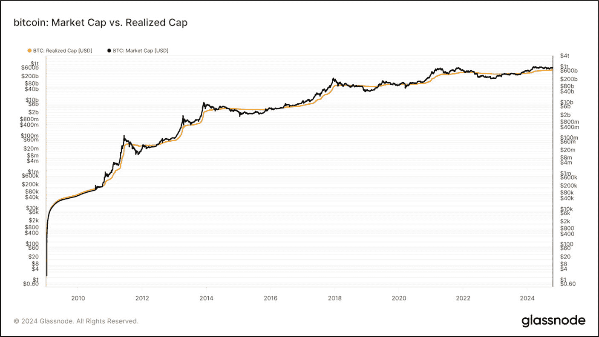
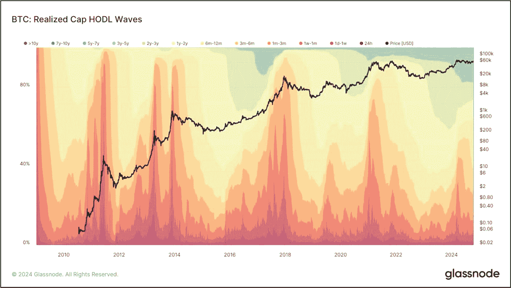
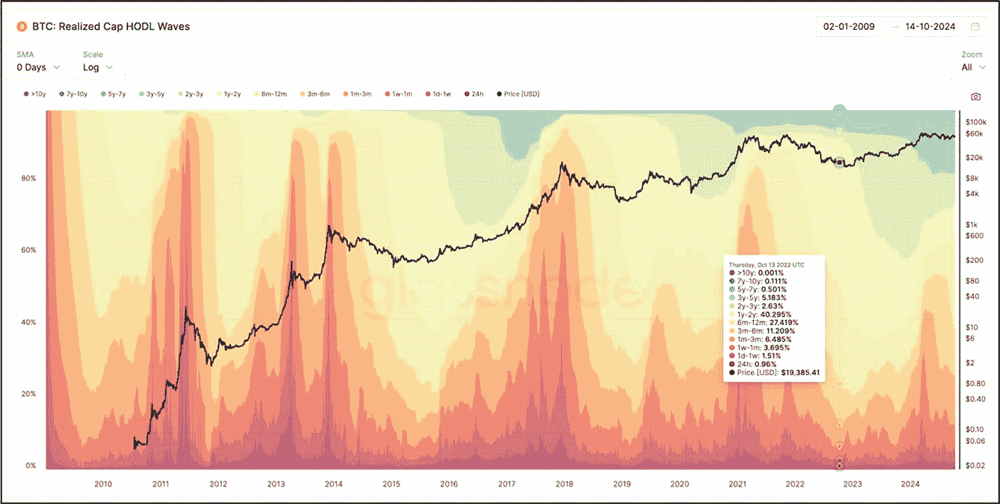
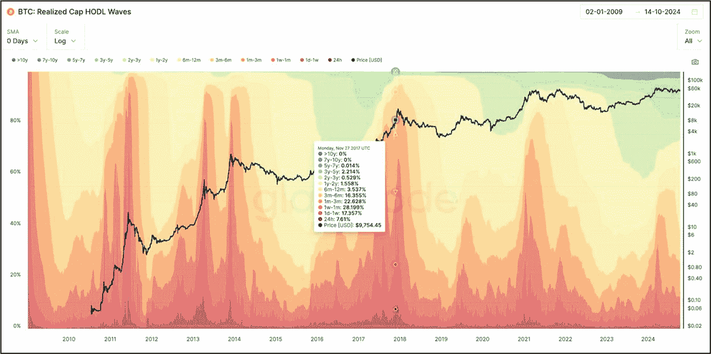
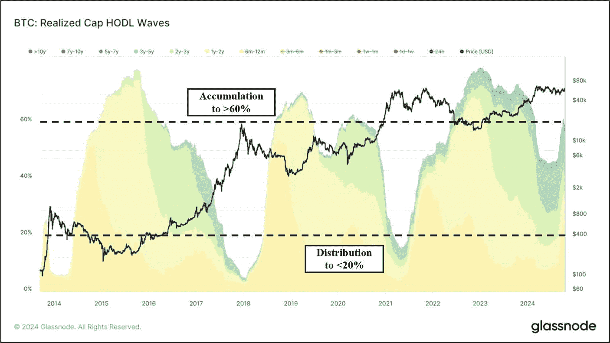
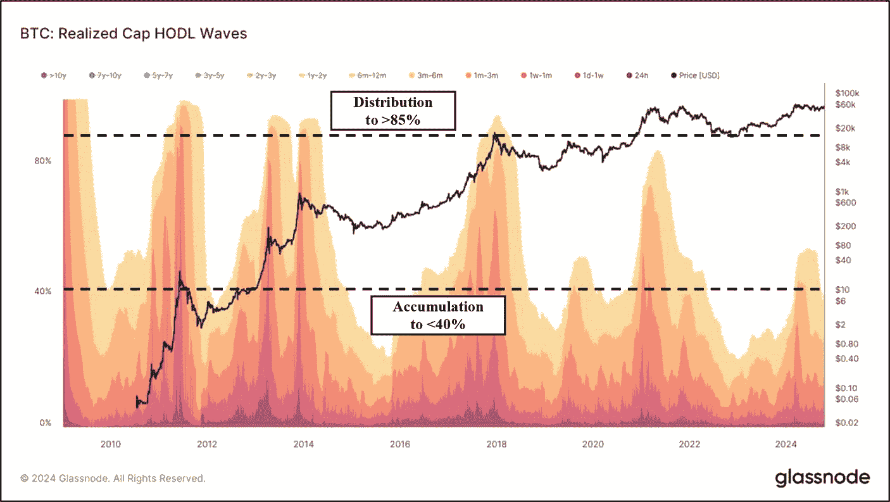
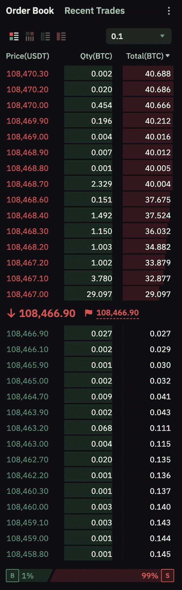
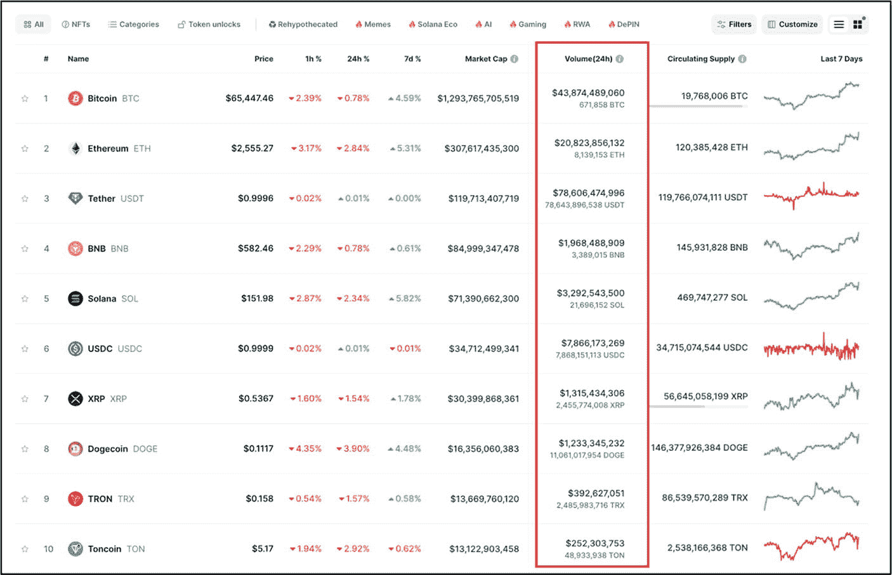
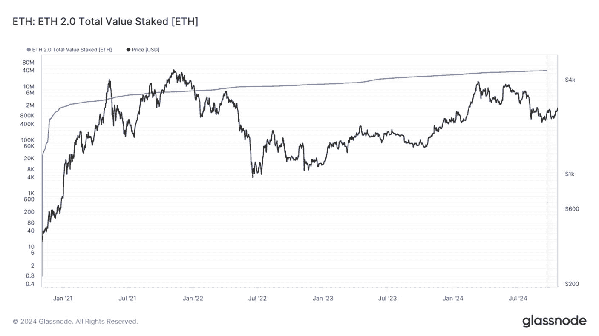

# 币价与市值

许多加密货币新手在评估投资时，会无意中关注币价而非市值。仅看价格不能反映全貌——市值通过考虑总供应量来显示项目的实际价值。投资者往往倾向于避开例如 `$50.00/个` 的代币，转而投资价格为 `$0.10/个` 的代币。乍一看，购买单价低的代币似乎很有吸引力；然而，这种思维逻辑很容易导致巨额亏损。

图 9-3 是来自 `CoinMarketCap` 的截图，显示了[莱特币](https://litecoin.org/)和[ Chainlink](https://chain.link/)的财务数据。这两个项目都根据其币价和市值进行了分析。在本研究中，假设这两个项目具有相同的基本面质量。

**图 9-3** 流通供应量与币价（数据来源于 [`https://coinmarketcap.com/`](https://coinmarketcap.com/)）

莱特币（`LTC`）价格为 `$110.49`，而 Chainlink（`LINK`）价格为 `$15.36`，两者之间存在显著差异。乍一看，`LINK` 可能看起来更具吸引力，因为花一个 `LTC` 的价格可以买到大约七个 `LINK` 代币。然而，两者的市值都接近 `70 亿美元`。

关键在于：价格是次要的；真正重要的是市值。即使 `LINK` 的交易价格为 `$15.36`，`LTC` 为 `$110.49`，将 `LINK` 推高至 `$30.72` 或 `LTC` 推高至 `$220.98`，各自所需的新增资本都大约为 `70 亿美元`——这是因为决定需要多少新资金流入的是市值，而非标价——尽管具体数额可能因订单簿深度和流动性而变化。因此，仅看代币价格是具有误导性的。另一方面，仅从财务角度看，与查看单个代币或币的价格相比，市值提供了对项目潜在增长更准确的看法。市值较小的项目（例如 `100 万美元`）的翻倍速度远快于通常增长较慢的数十亿美元项目。作为投资者，关注市值能让你更清晰地了解项目的增长空间。

### 行动步骤

请按照以下步骤评估项目的市值和完全稀释估值（`FDV`），以确定潜在风险，包括未来代币稀释、通胀影响，以及是否符合你的投资策略。

1. **查找市值和 FDV**

   通过访问 `CoinMarketCap`（或类似平台）查找项目的市值和 `FDV`。

2. **评估市值和 FDV**

   根据以下内容评估市值和 `FDV`：
   1. 将当前市值与 `FDV` 进行比较。如果 `FDV` 显著更高，则需要预期未来代币解锁可能会稀释代币价格，除非更高的需求能够抵消额外的供应。
   2. 如果市值与 `FDV` 之间存在显著差异，请审查解锁计划，以确定更多代币（或币）何时进入流通——这可能会影响长期投资。
   3. 审查通胀率、持续时间以及通胀结束的时间点。请注意，有些项目没有最大供应量，这意味着通胀是无限的。

3. **市值比较**

   查阅表 9-1，“市值比较”，以确定哪种市值规模适合你的投资策略和生活方式。

4. **做好笔记，用自己的风格记录你的发现**

5. **将发现结果与基本面评估过程的其他部分相结合**

#### 结果评估

对于长期投资者而言，如果市值与完全稀释估值（FDV）存在显著差异，那么在投资前必须考虑未来的代币稀释和潜在抛售压力。由于 FDV 与短期的相关性较低，分析市值被认为就足够了。

适合你投资风格的市值规模将取决于多个变量，如表 9-1 所述。请务必将市值规模与你的投资目标（风险承受能力和时间跨度）进行交叉参照，以确保项目符合你的策略。这对于刚进入加密货币领域的人来说尤其适用。许多缺乏经验的新投资者追求快速获利，往往倾向于低市值的“新上线”代币——这些代币可能会因炒作而迅速飙升，但如果基本面疲软，其涨势往往也会同样迅速地消退。许多缺乏经验的新投资者心中只想着高额利润，因此往往倾向于低市值项目。在大多数情况下，如果缺乏经验，这最终会导致重大损失，而非利润。因此，建议先从风险较低的大市值项目开始，然后逐步在你的投资组合中增加一些低市值项目。

## 已实现市值

**评估目标：判断普通投资者是否持有未实现盈利或亏损，从而预示潜在的上涨趋势、下跌趋势或积累阶段。**

*已实现市值*（realized capitalization，或称 realized cap）是市值的一种变体，它根据每个 UTXO（未花费交易输出）最后移动时的价格（而非当前价值）对其进行估值。因此，它代表了网络中所有币的*已实现*价值，而非其*市场*价值。已实现市值最初是为比特币等 UTXO 网络设计的，但现在链上数据供应商已将同样的逻辑应用于以太坊等基于账户的链，通过为每个账户标记其最后一次转出时的价格来操作；Glassnode 等链上分析平台现在也发布了以太坊的已实现市值序列，与比特币的并排显示。

**已实现市值 = 价值 × 价格[创建时] [美元]（针对所有 UTXO）**

**方程 9-5。** 计算已实现市值的公式

已实现市值并非单纯查看今天的市值，而是根据每枚币最后一次交易时的价格来计算其价值（图 9-4）。这能更准确地反映用户实际花费在币上的价值，而非其当前的理论价值。已实现市值通过减少丢失和长期沉睡币的影响，并根据它们在特定链经济中的实际活跃程度进行加权，从而提高了准确性。当价格显著较低时最后移动的币被花费，并以较高的交易价格重新定价时，已实现市值会增加。反之，当价格较高时最后移动的币，在较低的交易价格下被再次花费，将其成本基础向下重置时，已实现市值才会下降。

这个链上指标的主要优势在于，根据币的经济活跃权重来赋值，可以减轻那些已经丢失或长时间未移动的币所带来的影响。因此，通过以每枚币最后一次交易的价格对其进行估值，已实现市值可作为该资产“存储”或“储蓄”价值的近似衡量标准。

![标题为“BTC: 已实现市值 [USD]”的折线图，显示了 2010 年至 2024 年比特币的已实现市值和价格。黑色线代表以美元计的价格，橙色区域表示已实现市值。该图显示两个指标均显著增长，在 2018 年和 2021 年左右出现明显峰值。已实现市值显示在左侧纵轴，范围从 0 美元到 6000 亿美元，价格显示在右侧纵轴，范围从 0 美元到 10 万美元。图表数据来源：Glassnode。](images/648696_1_En_9_Chapter/648696_1_En_9_Fig4_HTML.jpg)

图 9-4

比特币已实现市值（数据来源：[`https://studio.glassnode.com/metrics?a=BTC&category=&m=market.MarketcapRealizedUsd`](https://studio.glassnode.com/metrics?a=BTC&category=&m=market.MarketcapRealizedUsd)）

值得注意的是，已实现市值严格基于链上交易构建；在中心化交易所内部账本中交易的币，在其离开交易所之前，会保持其原始存入时的成本基础，因此纯 CEX 内的重新定价不会被反映出来。此外，已实现市值并不能替代市值。相反，最好将其与市值结合使用。在此框架下，投资者可以评估汇总投资者持有的未实现盈利或亏损的百分比：

-   当市值交易价格**高于**已实现市值时，普通投资者持有**未实现盈利**。
-   当市值交易价格**低于**已实现市值时，普通投资者持有**未实现亏损**。

图 9-5 显示了比特币的市值与已实现市值的对比。当市值（黑色线）下跌并穿过已实现市值（橙色线）时，表明可能正在形成潜在下跌趋势。相反，当市值向上穿过已实现市值时，则表明可能正在形成潜在上涨趋势。当市值趋势低于已实现市值时，许多投资者会利用这个买入机会来积累币，并在市值趋势高于已实现市值时，在（如果愿意）各个价位获利了结。投资者必须保持警惕和谨慎，因为下跌趋势或上涨趋势随时可能出现逆转。

事实

虽然并非所有数字资产都能获取完整的“市值 vs. 已实现市值”图表数据，但分析比特币的市值与已实现市值之间的关系通常可以作为衡量整体市场情绪的宽泛指标；在可能的情况下，请始终与特定资产的指标进行相互验证。

图 9-5

比特币：市值与已实现市值对比（数据来源：[`https://studio.glassnode.com/workbench/a402076a-d220-4a8c-6f01-163b529f67ab`](https://studio.glassnode.com/workbench/a402076a-d220-4a8c-6f01-163b529f67ab)）

### 行动步骤

请按照以下步骤判断普通投资者是否持有未实现盈利或亏损，从而预示潜在的上涨趋势、下跌趋势或积累阶段。

1.  **已实现市值与市值对比**

    访问 `Glassnode.com` 或等效的链上指标平台，查看并比较已实现市值与市值。

2.  **未实现盈利与亏损**

    使用图表数据判断普通卖出者是否持有未实现盈利或亏损。
    1.  当市值交易价格**高于**已实现市值时，普通投资者持有**未实现盈利**。
    2.  当市值交易价格**低于**已实现市值时，普通投资者持有**未实现亏损**。

3.  **价格行为的预测走势**

    在识别出投资者是持有未实现盈利还是亏损后，使用图表数据评估市场是否正在进入积累阶段、潜在的上涨趋势或潜在的下跌趋势。

4.  **做笔记并以你自己的风格记录你的发现**

5.  **将发现与基本面评估流程的其他部分结合起来**

#### 结果评估

如果市值高于已实现市值（表明存在未实现利润），可考虑获利了结，因为市场可能已过度扩张。反之，如果市值低于已实现市值（表明存在未实现亏损），可考虑逢低吸纳，为潜在的价格上行做准备。

## 已实现市值 HODL 波浪

**评估目标：** 评估 `Realized Cap HODL Waves` 指标，以帮助识别吸筹和派发趋势、市场情绪转变、长期持有行为，以及基于币龄动态的潜在买入或卖出压力信号。

`Realized Cap HODL Waves` 是一种链上指标，主要用于分析新旧数字资产之间的财富转移与平衡。它从宏观角度展示了供应量（以美元计）的币龄与经济权重的分布，其中币的美元价值基于其最后移动时的价格。这提供了一个宏观指标，用以衡量币的成熟、花费以及各类市场参与者持有的“价值储存”之间的平衡。

`Realized Cap HODL Waves` 是 `HODL Waves` 的一个变体，它按活跃供应区间，以其相对于 `Realized Cap` 的已实现美元价值（经济权重）比例进行加权。该指标提供了独特的见解，例如：

-   在长期持有（“较老”）的币和新近获得（“较新”）的币之间的财富（美元）转移。一些分析师将此区间的重大转变解读为资金从“聪明钱”或机构持有者流向散户交易者（反之亦然），但该指标本身并不标记投资者类型。
-   通过将币龄与经济权重结合成一个单一指标，实现真实的随时间变化的市场估值。
-   通过弱化老旧或丢失币的重要性，提供一个专注于活跃且具有经济意义的供应量的真实视角。
-   币的成熟过程——新的（年轻的）币成熟为老币，反之亦然。
-   长期和短期持有者的情绪。
-   老币和新币的强吸筹与强派发区域。

### 如何解读已实现市值 HODL 波浪图表

图 9-6 展示了比特币 `Realized Cap HODL Waves` 图表。x 轴代表时间，左侧 y 轴代表每个币龄区间所持的供应量百分比（以美元加权），右侧 y 轴代表每枚币的价格。图表顶部的标签是彩色编码的时间段，表示币从其最后一次被花费/吸筹时算起的“年龄”——范围从 24 小时到 10 年以上。

**图 9-6** 比特币：已实现市值 HODL 波浪，24 小时至 10 年以上持有者（数据来源：[`https://studio.glassnode.com/metrics?a=BTC&category=&m=supply.RcapHodlWaves`](https://studio.glassnode.com/metrics?a=BTC&category=&m=supply.RcapHodlWaves)）

该图表显示了 `Realized Cap HODL Wave` 区间内的币龄分布位置。波浪的厚度代表了不活跃币成熟，或老币被花费后其币龄重置为最年轻类别并重估至当前价格时的变化。它也显示了当 `Realized Cap HODL Wave` 区间的厚度随不活跃币成熟，或老币被花费、币龄重置为最年轻类别并重估至当前价格而变化时，这种币龄分布变化（交叉）发生的位置。

### 已实现市值 HODL 区间波浪指标信号

一般来说，币的集合按币龄区间被宽泛地分类如下：

**表 9-2** HODL 区间波浪的币色集合

| 币类别 | 颜色 | 币龄 | 描述 |
| --- | --- | --- | --- |
| 年轻币 | 暖色 | 6 个月或更短 | 这些币构成了日常交易量的大部分。由投机性的短期投资者/交易者持有，它们最有可能因市场波动而被再次花费。这些色带往往与老币呈反向波动，在牛市中随着老币被花费而膨胀，并在熊市和吸筹期间随着年轻币变得不活跃并成熟而收缩。 |
| 老币 | 冷色 | 1–5 年 | 通常由长期“聪明钱”投资者拥有，他们在熊市期间积累廉价币。这些币存放在冷钱包中，直到在牛市中强势时被花费。较老的色带倾向于在市场周期中波动厚度，在累积期后膨胀，在币被花费时变薄。此外，这些色带可以识别看跌和看涨的市场周期，它们分别膨胀和收缩。 |
| 丢失或远古 | 深冷色 | 5 年以上 | 这些币很少被花费，并且许多情况下被认为要么丢失，要么从自由流通供应中扣除。当长期休眠的币最终被花费并迁移到更年轻的币龄区间时，这些色带会逐渐变薄；它们的成本基础通常锁定在低得多的价格，因此在价格较高期间花费会减少老币区间的已实现价值份额。尽管持有量巨大，但由于其不活跃，这些币很少影响积极的市场动态。 |

在 `Realized Cap HODL Wave` 图表上的任何一点，每个币龄区间都展示了其在总已实现市值（美元）中所占的份额；因此，这些区间的总和为当前链上可见的已实现价值的 100%。这使得投资者能够看到从老币到新年轻币或反之亦然的当前分布趋势。根据趋势方向，处于下跌趋势中的投资者可以清晰地看到，当老币被分配到更年轻的币龄类别时，币的百分比是在进一步成熟（老币龄区间百分比增加）还是处于上升趋势（新年轻币百分比增加）。

图 9-7 显示，在看涨市场中，随着较老投资者清算并将财富转移给更新、通常经验不足的持有者，较高比例的年轻币占据主导地位（价格见顶时出现巨大的红色尖峰）。相反地，在看跌市场中，随着投机者离场、长期投资者积累更多，老币变得更加普遍——参见图 9-8。

**图 9-8** 比特币：已实现市值 HODL 波浪，显示在看跌市场中老币持有 BTC 的多数份额（数据来源：[`https://studio.glassnode.com/metrics?a=BTC&category=&m=supply.RcapHodlWaves`](https://studio.glassnode.com/metrics?a=BTC&category=&m=supply.RcapHodlWaves)）

**图 9-7**

比特币：已实现市值 HODL 波浪，显示在牛市中年轻币持有 BTC 的大部分份额（图片致谢： [`https://studio.glassnode.com/metrics?a=BTC&category=&m=supply.RcapHodlWaves`](https://studio.glassnode.com/metrics?a=BTC&category=&m=supply.RcapHodlWaves)）

### 币龄增长

为了更简洁地呈现和更直观地解读已实现市值 HODL 波浪，其年龄类别可以单独开启或关闭。过滤掉较旧的年龄范围，可以更清楚地看到熊市中币龄的增长过程，因为未移动的币会格外突出。如前所述，这些不断成熟、未被花费的币通常被“聪明钱”以及信念更强的买家所积累。在此期间，较老币的经济权重增加，从而提高了网络的已实现价格——即所有 UTXO 的链上总成本基础，无论所有权是否实际变更。移动过的币会重置其年龄，并出现在较年轻的波段中。

比特币已实现市值 HODL 波浪（图 9-9）展示了从六个月到十年以上的币龄范围。它过滤掉了那些频繁买卖的年轻币（24 小时到六个月），转而聚焦于由更大的长期持有者持有的币。在 2014 年初和 2015 年，许多币出现在 6-12 个月的币龄范围内（以暖黄色显示）。然而，随着这些币的币龄超过一年，它们转移到较冷的黄色范围，代表 1-2 年类别。随着时间的推移，这些币逐渐成熟，在它们被花费之前，依次变为浅绿色（3-5 年）和深绿色（5-7 年），之后它们会瞬间重置到 24 小时到 6 个月的币龄区间。

**事实**

需要注意的是，当旧币（例如，5 年币龄）被花费时，它们会立即被转移并归类为新生的年轻币（24 小时币龄范围）。然而，当年轻币（24 小时币龄范围）被积累时，它们需要很多年才能成熟为更老的币龄范围。

值得注意的是，坚定的持有者在熊市中积累了大部分（< 60%）的已实现市值。相比之下，在牛市中，这些持有者会分配其资产，使其持有量降至最低（< 20%）——年轻币的情况则相反（参见 Glassnode，已实现市值 HODL 波浪：[`https://docs.glassnode.com/guides-and-tutorials/metric-guides/age-distribution/realized-cap-hodl-waves`](https://docs.glassnode.com/guides-and-tutorials/metric-guides/age-distribution/realized-cap-hodl-waves)）。

**图 9-9**

比特币：已实现市值 HODL 波浪，BTC 的转移（图片致谢：[`​studio.​glassnode.​com/​metrics?​a=​BTC&​category=​&​m=​supply.​RcapHodlWaves`](https://studio.glassnode.com/metrics?a=BTC&category=&m=supply.RcapHodlWaves)）

### 年轻币

图 9-10 展示了比特币已实现市值 HODL 波浪，其中数据经过过滤，显示币龄范围在 24 小时到六个月之间。与较老的币（六个月到十年）不同，年轻币通常在上涨趋势中积累，在下跌趋势（滑入熊市）中分配，从而将 BTC 从弱势手转移到强势手。当更长线、信念更强的投资者积累时，短期持有者往往会分配，反之亦然；然而，这种模式并非普遍适用——两个群体在短期内可能朝同一方向行动。

大多数年轻币没有机会成熟。随着价格走势和市值的增加，持有币达六个月到五年以上的长期投资者会花费他们的币。这导致旧币被转换成已实现价格（即该币最后一次移动的价格）更高的年轻币。在此期间，年轻币逐渐占据供应的主要份额，而旧币则越来越多地被花费和重新分配。这造成了一种动态，即短期持有者主导市场，尤其是在价格高波动时期。由于这些年轻币换手更频繁，它们加剧了市场的敏感性，因为零售投资者往往对价格波动反应更情绪化。这种币从长期持有者向新参与者（反之亦然）的重新分配可以预示潜在的市场拐点，因为经验丰富的投资者通常会获利了结。与此同时，缺乏经验的交易者在价格峰值时买入。

**图 9-10**

比特币：已实现市值 HODL 波浪，24 小时到 6 个月持有者（图片致谢：[`​studio.​glassnode.​com/​metrics?​a=​BTC&​category=​&​m=​supply.​RcapHodlWaves`](https://studio.glassnode.com/metrics?a=BTC&category=&m=supply.RcapHodlWaves)）

由于最近被花费的币现在被视为“年轻”币，它们比那些多年未移动的旧币承载着更大的经济权重。这增加了市场流动性，因为这些年轻币被更频繁地买卖。图 9-10 突显了短期币在波动时期如何占据主导地位，预示着散户参与时期和潜在的价格波动。积累底部出现在年轻币（<6 个月）价值低于已实现市值 40% 时，而分配顶部则出现在年轻币（<6 个月）价值达到已实现市值 80% 以上时。

### 操作步骤

虽然已实现市值 HODL 波浪（Realized Cap HODL Waves）主要适用于比特币（BTC）和以太坊（ETH）等主流币种，但对于新发行或市值较低的币种，其覆盖范围和历史深度都远远不足，因此在积累足够的链上历史数据之前，请谨慎应用此框架。

请按照以下步骤评估已实现市值 HODL 波浪指标，以帮助识别基于币龄动态的积累与派发趋势、市场情绪转变、长期持有行为以及潜在的买入或卖出压力信号。

1.  **识别积累与派发趋势**
    -   访问 `Glassnode.com` 或相应的链上指标平台，查看已实现市值 HODL 波浪图。
    -   分析年轻币（< 6 个月）占已实现总市值的百分比。

2.  **年轻币活动激增**
    -   分析图表，寻找年轻币占比激增（超过 70%至 80%以上）的情况。这通常表明散户投资者可能在市场顶部买入。这可能是等待市场降温后再行投资的信号。

3.  **通过币龄评估市场情绪**
    -   分析老币（1-5 年）的占比是否有所增加。

4.  **记笔记并以你自己的风格记录你的发现**

5.  **将发现与基础评估流程的其他部分结合分析**

#### 结果评估

如果年轻币（< 6 个月）占已实现市值的比例超过 80%，这通常表明散户在市场顶部买入，暗示长期持有者正在卖出。此时是考虑获利了结并等待明显下跌趋势的好时机。相反，如果年轻币占比跌破 40%且老币（1-5 年）占比增加，则表明长期积累，预示着潜在的买入机会。短期币种主导地位常会导致波动，因此除非长期持有者在稳步积累，否则建议等待市场企稳。

## 流动性与交易量

**评估目标：评估资产的流动性与交易量，以帮助识别其市场活跃度、交易效率、潜在的滑点风险以及投资适宜性。**

在投资加密货币时，流动性和交易量是决定策略成败的两个关键因素。流动性影响着你在不影响价格的情况下买入或卖出资产的难易程度，而交易量则揭示了该资产的活动水平和市场兴趣。这两个要素至关重要，因为它们关系到投资者进出仓位的效率、交易执行的价格以及整体风险。

### 流动性

加密货币的流动性，简单来说，就是数字资产在不显著影响其价格的情况下兑换成另一种资产或现金的难易程度。高流动性意味着可以以接近当前市场价值的价格，执行更快、更顺畅的交易。`bitcoin` 是流动性极高的数字资产的绝佳例子，由于其庞大的数量，投资者可以买卖而不会对其价格产生重大影响——这是高流动性市场的主要优势之一。在像 `bitcoin` 这样的市场中，有许多活跃交易的买家和卖家，这缩小了价差（spread）——即买家愿意支付的最高价与卖家愿意接受的最低价之间的差额。这种紧密的价差有助于买卖双方以最接近当前市场价格的价格成交，并且执行速度更快。

另一方面，在流动性较差或波动较大的市场中，交易者可能会遇到*滑点*。滑点是指交易者收到的成交价格与最初预期的价格不同。这通常是多种变量的结果，包括市场波动，导致价格在执行前发生变化，或者在该价位上没有足够的需求来满足大额订单，从而导致价格升高（这在市价单中最为常见，但即使是在深度订单簿中，非常大的订单也可能导致滑点）。在加密货币市场，特别是在流动性不足的市场中，价格可能会迅速发生剧烈波动。滑点可能是正向的，也可能是负向的。然而，它通常是负面的，导致交易者以比预期更差的价格成交。

**专家提示**

对于小额投资，滑点问题不大，但对于大额投资，务必考虑流动性。高流动性资产可以吸收大宗交易而影响甚微，而低流动性资产则可能导致价格变动，产生不利的成交结果。

在去中心化金融（DeFi）中，“流动性池”是去中心化交易所（DEX）运作的核心。用户将其资产存入智能合约或“池子”中，供其他人直接交易。某种资产的池子越大，该市场的流动性就越高。在自动做市商（AMM）流动性池中，流动性由池子的总锁仓价值（TVL，即所有存入资产的美元价值）来代表。交易量只在交易执行时发生，而流动性则反映了可供交易的供应量。

### 订单簿

可视化流动性的一种方式是通过开放式订单簿——请参见图 9-11 中 `bitcoin` 的订单簿。订单簿是特定资产按价格水平列出的实时买卖订单列表。它显示了投资者在每个价格点愿意交易的代币数量，提供了市场需求和供给的快照。买单（称为“出价 bids”）和卖单（称为“要价 asks”）会随着交易者下达或取消订单而持续更新。

图 9-11

`bitcoin` 订单簿（数据来源：[`www.bybit.com/trade/usdt/BTCUSDT`](https://www.bybit.com/trade/usdt/BTCUSDT)）

## 交易量

在加密货币领域，交易量指的是在特定时间段内交易的总币（或代币）数量。交易量通常以法定货币（例如美元）计价显示，以便于比较市场规模和流动性，但也有一些平台同时以该资产的基础单位显示。它很好地代表了市场活跃度和兴趣——高交易量表明高兴趣和高参与度，而低交易量则表明活动较少。

**专家提示**

访问 `CoinMarketCap.com`，选择一个资产以查看其主要交易市场，并按最高交易量进行筛选，即可找到该资产交易量最高的交易所。

### 流动性 vs 交易量

尽管流动性与交易量通常相互关联，但两者含义不同。交易量可视为流动性的粗略指标，因为成交额增长往往会吸引做市商和套利者，进而加深订单簿深度。通常，高交易量往往意味着高流动性；但二者并非互为因果。例如，高交易量可能提升流动性，因为更多参与者进行交易——高流动性会吸引更多交易量，而交易量激增时常会吸引寻求赚取价差或套利的做市商注入新资金。反之，低流动性可能导致交易量萎缩，因为人们对流动性差的资产兴趣降低，导致流动性从市场抽离。

然而，高交易量并不总是意味着高流动性。流动性差的市场也可能出现高交易量时期，导致价格剧烈波动；而高流动性市场在平静期可能交易量低迷。流动性与交易量都很重要。但对于需要大额建仓和平仓且不希望显著影响资产价格的长线投资者而言，流动性更受青睐。如前所述，这种高流动性需求通常伴随着高交易量。对于短线投资者（持仓时间从数小时到数周不等），高交易量（例如日成交额超过 1 亿美元或流通供应量的 5%以上）至关重要，因为它能让投资者在不影响价格的情况下完成数百至数千美元的交易，并标志着市场存在强劲且广泛的参与度。

### 评估市场流动性

验证一项资产是否具备满足投资者需求的充足流动性，有三个关键检查项：交易量、买卖价差和订单簿深度。

## 交易量

在区块链领域，交易量是衡量加密资产流动性的最可靠指标，因为它反映了资产交易数量（以法定货币显示）和市场参与度。尽管并非完美，但加密资产持续的高交易量通常代表更高的流动性。每个可交易的加密资产都可以在 `CoinMarketCap.com` 上查看其交易量——见图 9-12。

**图 9-12** 按市值排名前十的数字资产的 24 小时交易量（数据来源：[`coinmarketcap.com/`](https://coinmarketcap.com/)）

**专业提示** 始终使用限价单而非市价单来锁定期望价格并避免滑点。这能确保更优的定价，并帮助你在市场波动期间节省交易费用。

遗憾的是，投资时并没有统一的交易量基准。这很大程度上取决于投资者的交易规模。例如，在一个日均交易量为 5000 万美元的币种中买入 1000 美元几乎不会引起注意；但在一个日交易量仅为 200 万美元的币种中下达 5 万美元的订单，除非拆分成小笔交易，否则可能导致价格波动几个百分点。这需要极高的流动性和交易量来避免价格波动和滑点——除非将交易规模分散到多笔交易中。不过，对于大多数投资者而言，像 `CoinMarketCap.com` 上前五十名资产那样具有充足流动性的资产，大额交易通常不成问题。此外，在 CMC 上点击每个资产，投资者可以识别出每个资产流动性最高的交易所。

#### 买卖价差

除了交易量，还建议检查买卖价差。较小的价差表明高流动性，而较大的价差则暗示流动性差。例如，比特币的订单簿（图 9-11）显示最佳买价和卖价之间的价差仅为 0.10 美元。对于价格超过 10 万美元（此处约为 108,467 美元）的 BTC 而言，这仅约占价格的 0.00009%，小到几乎不影响交易，但正是它标志着深度流动性。相比之下，交易清淡的币种买卖价差可能达到 0.5%–5%，为相同规模的订单增加数百甚至数千美元的交易摩擦成本。

#### 订单簿深度

分析资产的订单簿可以洞察不同价格水平上买卖订单的可用性。包含众多限价单的深度订单簿意味着更高的流动性，而浅薄的订单簿通常意味着流动性差，可能导致滑点。

### 行动步骤

遵循以下步骤评估资产的流动性和交易量，以帮助识别其市场活跃度、交易效率、潜在的滑点风险以及投资适宜性。

1. **评估交易量**  
   使用至少两个独立来源（例如 `CoinMarketCap` 和 `CoinGecko`）验证资产的日交易量，以确认数据并确保市场足够活跃。

2. **检查买卖价差**  
   确认资产订单簿中的买卖价差较小，以帮助确认流动性充足。

3. **分析订单簿深度**  
   通过审查不同价格点上的买卖订单数量来评估订单簿的深度。

4. **评估资产流动性池（DeFi）**  
   在去中心化交易所（DEX）交易时，审查与资产相关的流动性池。较大的池子意味着更高的流动性，交易时价格影响风险更低。

5. **使用限价单**  
   为了更好地控制交易执行，使用限价单而非市价单。

6. **记录笔记，并以自己的风格整理发现**

7. **将发现结果与基本面评估流程的其他部分结合**

#### 结果评估

如果行动步骤的结果显示资产具有高交易量、窄买卖价差和深度订单簿，则表明流动性良好——适合大额交易。反之，如果资产显示出低交易量、宽价差或浅订单簿，则建议不要投资。资产流动性差和日交易量低可能还有其他潜在原因，例如属于新启动项目且存在流动性注入问题；项目可能基本面极差，或者是骗局。无论如何，鉴于所涉及的高风险，建议远离此类投资。

## 总转移量

**评估目标：** 分析总转移量，以评估网络活跃度、识别增长趋势，并定位吸筹或派发阶段。

网络的*总转移量*表示在特定时间段内链上转移的币种总量（或美元价值）。这有助于投资者了解网络活跃度水平，但更重要的是，可以判断转移量是随时间增加还是减少，从而揭示项目是变得更受欢迎还是趋于冷门。

请注意，链上总转移量与“流动性与交易量”一节中讨论的交易量有所不同。总转移量追踪在设定时间段内链上转移的币种数量，而交易量则关注链下活动，捕捉交易所发生的交易，并通过 API 报告给 CoinMarketCap 和 CoinGecko 等市场数据平台。这两个指标对投资者都至关重要。交易量与流动性需求密切相关。总转移量则能清晰洞察网络的增长采用情况，并为牛市或熊市提供信号，使投资者能够做出更明智的投资决策。

链上总转移量指标为评估市场趋势提供了关键信号，详见表 9-3。根据总转移量与价格走势的相互作用方式，会提供不同的信号。这些信号帮助投资者识别网络受关注的程度、市场是处于吸筹和派发阶段，还是需要采取谨慎态度。图 9-13 展示了 2010 年至 2024 年比特币的总转移量（30 日移动平均线），通过此分析结构进行评估，更清晰地描绘了其历史及潜在的市场动向。

**表 9-3** 总转移量与价格走势信号

| 转移量 | 价格走势 | 市场活动 | 信号 | 投资者机会 |
| --- | --- | --- | --- | --- |
| 上升 | 上升 | 强劲，暗示吸筹 | 看涨 | 买入机会 |
| 上升 | 下跌 | 潜在派发或恐慌性抛售 | 看跌 | 考虑减仓以降低风险敞口 |
| 下跌 | 上升 | 投机性价格上涨 | 谨慎 | 关注潜在的市场回调 |
| 下跌 | 下跌 | 市场降温或盘整 | 长期谨慎/看涨 | 吸筹机会 |
| 持平 | 上升 | 链下投机 | 谨慎 | 关注趋势反转 |
| 持平 | 下跌 | 网络活跃度不足 | 看跌 | 策略性吸筹的机会 |

**注意：** 下表中的模式假设网络已成熟且具备足够的链上历史；对于转移量稀薄、新近发行的代币，信号可信度可能较低。

![图表标题为“BTC: 总转移量 [BTC] (30 日移动平均线)”，展示了 2010 年至 2024 年比特币转移量与价格之间的关系。橙色线代表转移量，黑色线代表美元价格。关键标注突出显示了市场信号：“牛市” 对应转移量和价格均上涨，“看跌信号” 对应转移量增加但价格下跌，“提示谨慎” 对应转移量下跌但价格上涨。图表包含以 BTC 计量的转移量和以美元计量的价格轴，并附有指示潜在市场趋势的注释。](images/648696_1_En_9_Chapter/648696_1_En_9_Fig13_HTML.jpg)

**图 9-13** 比特币：总转移量（数据来源：[`https://studio.glassnode.com/metrics?a=BTC&category=Transactions&m=transactions.TransfersVolumeSum&mScl=log&pScl=log`](https://studio.glassnode.com/metrics?a=BTC&category=Transactions&m=transactions.TransfersVolumeSum&mScl=log&pScl=log)）

### 操作步骤

按照以下步骤分析总转移量，以评估网络活跃度、识别增长趋势，并定位吸筹或派发阶段。

1. **评估总转移量**

   根据表 9-3 中的“*总转移量与价格走势信号*”评估总转移量。

2. **记录笔记，并以自己的风格记录发现**

3. **将这些发现与基本面评估流程的其他部分相结合**

#### 结果评估

根据表 9-3 中“投资者机会”一列的内容，评估评估结果。

---

## 总质押价值 (TVS)

**评估目标：** 评估某一数字资产的总质押价值（TVS）是随时间上升还是下降，从而洞察市场信心、用户参与度和受欢迎程度。

特定资产的*总质押价值（TVS）* 代表主动绑定至该网络原生质押合约（例如，信标链中的 ETH）的代币的累计美元价值，不包括仅“锁定”在流动性池或 DeFi 池中的币种。较高的 TVS 值通常意味着该网络被数字资产投资者视为安全可信。相反，区块链 TVS 较低则表明其可能存在潜在问题、投资者持怀疑态度且不受欢迎。TVS 通常以美元表示；但某些平台也可能以 BTC 或 ETH 表示。

图 9-14 显示了来自 Glassnode.com 的以太坊 TVS（蓝色线）。它代表了从 2021 年到 2024 年间存入[ETH 2.0](https://etherscan.io/address/0x00000000219ab540356cbb839cbe05303d7705fa)合约的 ETH 数量。在此期间，无论 ETH 的单价（黑色线）如何波动，ETH 的 TVS 都呈稳定增长态势。这暗示了投资者对其的强力支持和广泛欢迎，同时也体现了高度安全的区块链所提供的安全性。

**专业提示：** 对于采用权益证明（PoS）共识机制的项目，建议投资者调查其 TVS 是呈增加还是减少趋势。

**图 9-14** 以太坊，ETH 2.0 总质押价值（数据来源：[`https://studio.glassnode.com/metrics?a=ETH&category=&m=eth2.StakingTotalVolumeSum`](https://studio.glassnode.com/metrics?a=ETH&category=&m=eth2.StakingTotalVolumeSum)）

### 操作步骤

按照以下步骤评估某一数字资产的质押总价值（TVS）是随时间上升还是下降，从而洞察市场信心、用户参与度和受欢迎程度。

虽然[Glassnode.com](https://Glassnode.com)主要为主流币种提供高级数据，但[DeFi Lama](https://defillama.com/)和[TokenTerminal](https://tokenterminal.com/terminal)等平台则涵盖更广泛的数字资产。

1. **评估总质押价值**

   访问 Glassnode.com（或 DeFi Lama、TokenTerminal），判断某一数字资产的质押总价值是随时间增加还是减少。
   1. TVS 是随时间增加还是减少？

2. **记录笔记，并以自己的风格记录发现**

3. **将这些发现与基本面评估流程的其他部分相结合**

#### 结果评估

如果 TVS 随时间逐渐增加，则情况良好。如果减少，这可能意味着对该资产的兴趣减弱。请注意，如果 TVS 在减少，这可能是价格下跌的早期信号（如果尚未发生的话）。必要时需进行更深入的研究。

