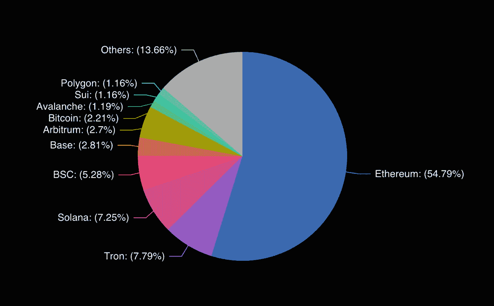
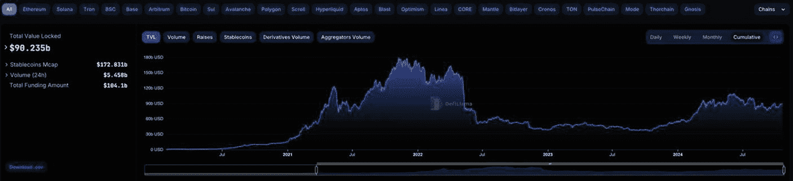
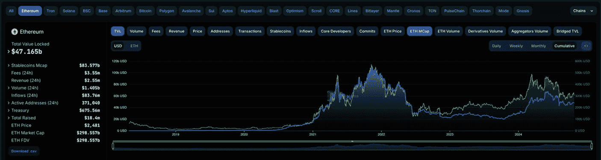
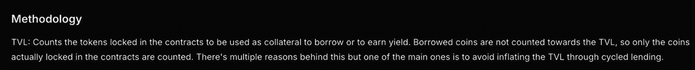
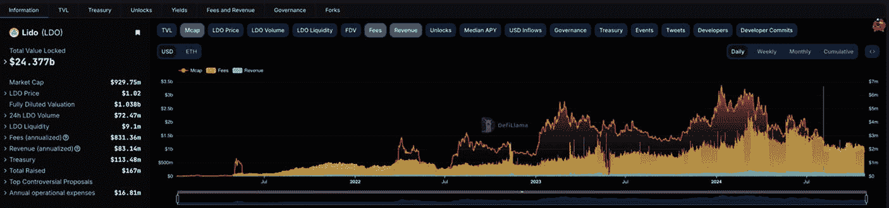
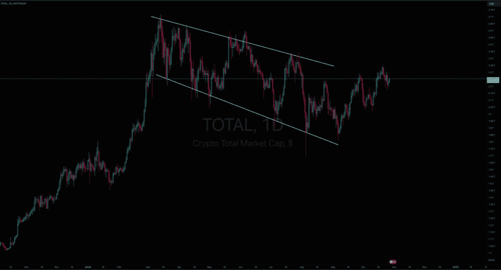
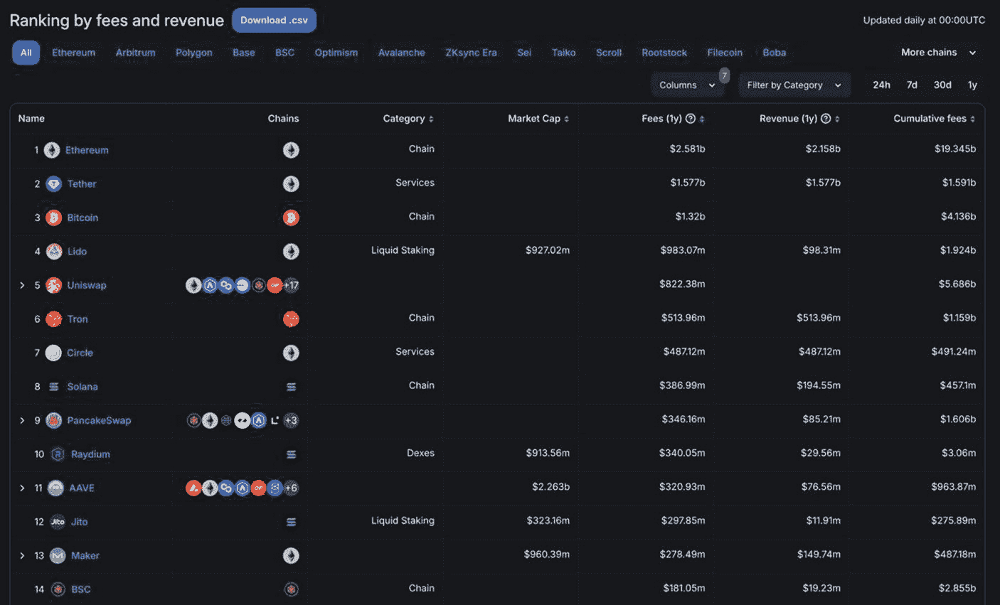
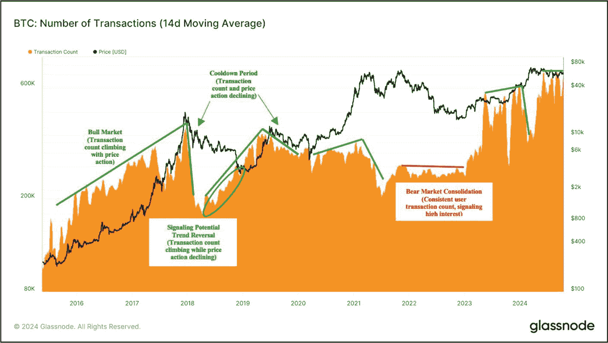
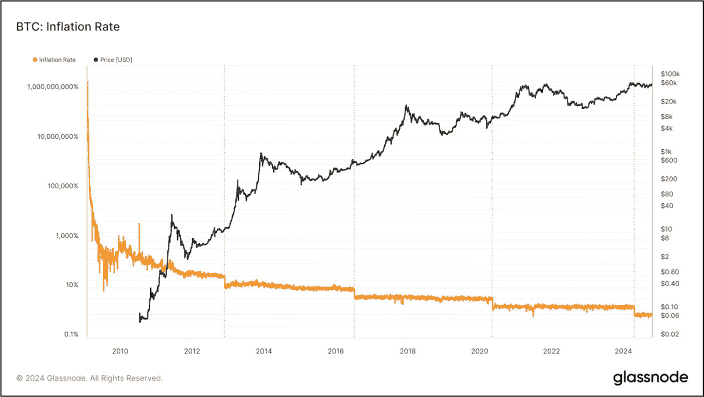
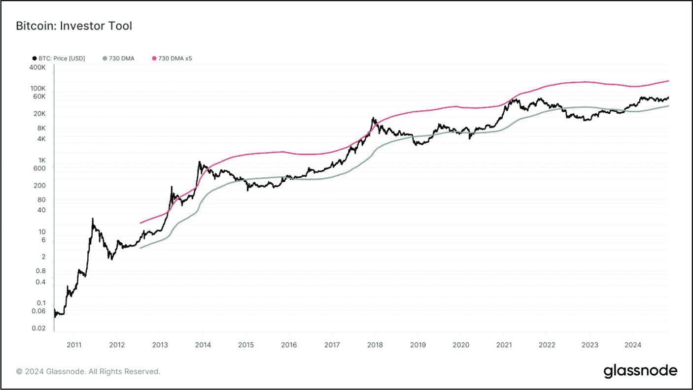

# 总锁仓价值 (TVL)

**评估目标：评估 DeFi 协议的 TVL，分析其随时间的变化趋势，并判断其是被高估还是低估。**

总锁仓价值（TVL）是指存入并锁定在 DeFi 协议或智能合约中的数字资产总价值。TVL 与总质押价值（TVS）不同，它不仅包含质押资产，还包含锁定在借贷、流动性池、挖矿策略及其他 DeFi 应用中的所有资产。许多 DeFi 协议都支持这些金融服务，其中一些较为流行的包括 [Lido](https://lido.fi/)、[AAVE](https://aave.com/) 和 [Uniswap](https://app.uniswap.org/)。

TVL 通常用于衡量 DeFi 协议的整体健康状况，TVL 的增长意味着流动性、可用性和受欢迎程度的提升，这直接影响协议的整体健康状况和成功与否。追踪 DeFi 中的 TVL 通常通过数据聚合器完成，例如 [DeFi Lama](https://defillama.com/)，同时也可以在 [CoinMarketCap](https://coinmarketcap.com/) 和 [CoinGecko](https://www.coingecko.com/) 等平台上获取。TVL 通常以美元计价；然而，一些平台也可能以 BTC 或 ETH 计价。

图 9-15 来自 DeFi Lama，显示了所有 DeFi 协议的总 TVL，为 902.35 亿美元（撰写本书时）。这很好地概述了市场状况，即 DeFi 参与者是在锁定资产还是从 DeFi 协议中撤回资产。从 2021 年到 2022 年中期，总 TVL 增加到 1800 亿美元，随后急剧下跌，进入 2022 年 7 月至 2024 年 1 月的盘整期。2024 年初出现反弹，TVL 达到 1080 亿美元，随后进入冷却期，并从 2024 年 6 月开始略有下降。图 9-16 显示了按公链划分的 TVL 明细，其中以太坊在 DeFi 市场中占据主导地位，其锁定在 1192 个 DeFi 协议中的资产占比为 54.79%（485.1 亿美元）。

**图 9-16** 所有 DeFi 公链的 TVL 细分（数据来源：[`https://defillama.com/chains`](https://defillama.com/chains)）

**图 9-15** 所有公链的总锁仓价值（TVL）（数据来源：[`https://defillama.com/`](https://defillama.com/)）

## 如何评估 TVL 比率

总锁仓价值（TVL）比率是一个主要用于评估 DeFi 资产是被高估还是低估的指标。其计算方法是将市值除以 TVL。根据经验法则，评估标准如下：

*   **TVL 比率高于 1** – 该资产可能被高估
*   **TVL 比率低于 1** – 该资产可能被低估

图 9-17 显示了 [Compound Finance](https://compound.finance/) 的财务详情，包括市值、TVL 和 TVL 比率。Compound Finance 的 TVL 比率为 0.39。公式 9-6 和公式 9-7 展示了 Compound 的 TVL 比率计算公式和计算过程。

**图 9-17** Compound Finance 的财务数据和 TVL（数据来源：[`https://coinmarketcap.com/currencies/compound/`](https://coinmarketcap.com/currencies/compound/)）

$$ \mathbf{TVL}\ \textit{\textbf{Ratio}} = \frac{\textit{\textbf{Market}}\ \mathbf{Cap}}{\textit{\textbf{Total  Value  Locked}}\ \left( \mathbf{TVL} \right)} $$

**公式 9-6.** TVL 比率计算公式

$$ 0.39 = \frac{\mathbf{\$}437,651,139}{\mathbf{\$}1,118,649,329} $$

**公式 9-7.** Compound Finance 的 TVL 计算

> **专业提示**  
> 专注于 DeFi 的平台，如 [DeFi Lama](https://defillama.com/) 和 [TokenTerminal](https://tokenterminal.com/terminal)，提供深入的财务洞察和一系列指标，使投资者能够分析流动性、交易量和项目表现，从而更容易评估潜在的投资机会。

## TVL 历史表现

分析 TVL 随时间的变化趋势，为了解协议在熊市和牛市中的流行程度和表现提供了宝贵的见解。图 9-18 展示了来自 `DeFiLama.com` 的以太坊数据片段。图表显示了从 2018 年 4 月到 2024 年 10 月以太坊的 TVL（蓝色）和市值（绿色）。注意，以太坊的 TVL 和市值是同步变化的；当市值增加时，TVL 也随之增加，下跌时也是如此。这表明以太坊的 TVL 与市场情绪和需求密切相关，投资者在其价格和市值上涨时，会将资产锁定在基于以太坊的 DeFi 协议中，而在下跌时则会撤回资产。当市值攀升但 TVL 开始下降时，可能预示着趋势反转的早期预警信号。相反，如果 TVL 上升，而市值保持稳定或开始增长，这可能预示着潜在的买入机会。然而，并非所有公链或 DeFi 协议都遵循相同的 TVL 和市值模式，因此理想的入场和出场点在不同项目之间可能存在差异。

**图 9-18** 以太坊的 TVL 和市值同步变化（数据来源：[`https://defillama.com/chain/Ethereum?chainTokenMcap=true`](https://defillama.com/chain/Ethereum?chainTokenMcap=true)）

### TVL 报告方式的差异

不同的 DeFi 协议计算总锁定价值（`TVL`）的方式各不相同，理解这一点对于比较项目至关重要。例如，`AAVE`（图 9-19，“方法论”部分）仅统计其合约中作为抵押品或用于赚取收益而锁定的代币——借出的代币不计入其 `TVL`。`AAVE` 的借出资产是单独计算的。然而，其他协议可能会将借出的代币、质押的币种或生息资产纳入其 `TVL` 计算。投资者必须了解 DeFi 协议如何计算 `TVL`，因为这在执行竞争对手分析时非常重要。需要注意的是，借出的资产并未被“锁定”在任何智能合约中，因此不应计入协议的 `TVL` 计算。

图 9-19

`AAVE V3` DeFi 协议的 TVL 报告方法论（图片致谢 [`https://defillama.com/protocol/aave-v3?events=false`](https://defillama.com/protocol/aave-v3?events=false)）

### 行动步骤

请遵循以下步骤来评估一个 DeFi 协议的总锁定价值（`TVL`），评估其随时间推移的表现，并根据其 `TVL` 比率、表现趋势和竞争对手分析，判断其是否被高估或低估。

1.  **总锁定价值（`TVL`）比率**

    访问 [`CoinMarketCap`](https://coinmarketcap.com/)、[`DeFiLama`](https://defillama.com/) 或 [`TokenTerminal`](https://tokenterminal.com/terminal) 查看一个 DeFi 资产的 `TVL`。
    1.  计算 `TVL` 比率（`市值 / TVL`）

    2.  `TVL` 比率是高于一还是低于一？（低于一表明该 DeFi 协议被低估，高于一则表明被高估。）

2.  **`TVL` 表现**

    分析 `TVL` 的表现。
    1.  该协议的 `TVL` 与所有链的总 `TVL` 相比如何？
        1.  它是持续表现优异、保持稳定，还是处于下降趋势？

    2.  它是否与市值变化相关？

    3.  `TVL` 和市值之间是否存在有助于识别潜在入场和/或出场点的重复模式？

3.  **`TVL` 报告方式**

    确定该 DeFi 协议是如何计算其 `TVL` 的。
    1.  借出的资产是否被包含在 `TVL` 中？
        1.  借出的资产不应包含在 `TVL` 指标中。

        2.  在进行竞争对手分析时，务必确保不同项目以类似方式计算 `TVL`。当使用多个 DeFi 聚合器进行项目比较时，应格外警惕，因为 `TVL` 的计算方法可能存在显著差异。

4.  **竞争对手分析**

    对 `TVL`、`TVL` 比率以及过往表现进行竞争对手分析。

5.  **做笔记，并以你自己的风格记录发现**

6.  **将发现与基本面评估过程的其他部分结合起来**

#### 结果评估

如果 `TVL` 在上升，这通常是一个好兆头，表明更多投资者感兴趣、流动性正在增加、项目正在获得发展动力——这些都是积极的增长信号。一个稳定的 `TVL`，即使没有增长，也显示出稳定性和可靠性。但如果你看到 `TVL` 在下降，那么值得去探究其背后的原因。

较低的 `TVL` 比率（大约为一或更低）可能暗示资产相对于其锁定价值被低估，这可能预示着一个好的投资机会。另一方面，较高的 `TVL` 比率可能意味着资产被高估，因此需谨慎对待。如果该比率持续大幅波动，在采取任何行动之前，应密切关注并评估该投资的稳定性或可持续性。

## 费用与收入

***评估目标：评估 DeFi 协议的费用、收入分配和收益，以确定其财务健康状况、用户需求和增长潜力。***

在 DeFi 领域，协议费用和收入是衡量项目财务健康、经济活动水平和未来潜力的关键绩效指标 (KPI)。理解协议的费用和收入模式对投资者至关重要。它能让人深入了解产生的总费用、分配给流动性提供者的部分，以及作为协议收入留存的部分。

### 费用

与传统金融服务一样，与 DeFi 服务交互时需要收取费用，例如网络费用，以及基于用户使用特定协议功能（包括交易、借贷、质押和提供流动性）的收费。虽然费用相对较小，但随着时间的推移，它们会显著累积。例如，建立在 `Ethereum` 上的去中心化交易所（`DEX`）`Uniswap`，仅对代币兑换收取 0.3% 的费用。这些费用会按比例分配给存入流动性池以促进交易的流动性提供者。

**注意**

不同的 DeFi 数据聚合器有时会采用不同的方法来计算所产生的协议费用。因此，检查费用计算方法至关重要，尤其是在使用不同聚合器比较数据时。

### 收入

收入是协议在向用户（如流动性提供者、贷款人或质押参与者）分配后留存的那部分费用。这部分留存收入对协议的长期可持续性至关重要，因为它为持续的开发和日常运营提供了资金。协议的收入直接取决于其产生的费用。没有足够的用户参与，费用的产生就会受到影响，从而限制收入增长。因此，当一个协议有持续产生可观费用的历史时，这很好地表明用户参与度高，反过来——

**事实**

费用反映了对协议服务的需求，而收入则体现了它如何将这种需求转化为持久价值。

### 评估费用与收入

本节根据三个关键标准分析某项资产产生的费用和收入：费用与收入的市场趋势、收入分配模型以及竞争对手比较。

#### 费用与收入市场趋势

图 9-20 展示了构建在以太坊上的顶级流动性质押 DeFi 协议 [Lido](https://lido.fi/) 的费用与收入情况。Lido 的年化费用估计为 8.3517 亿美元，收入为 8352 万美元。Lido 通过收取质押奖励的 10% 作为费用来实现盈利——8352 万美元/8.3517 亿美元等于 10%。这笔费用在节点运营商（5%）和 Lido DAO（5%）之间分配。剩余的 90% 则分配给使用该 DeFi 平台进行质押服务的用户。

图 9-20

Lido DeFi 协议预估年化费用与收入（数据来源：[`https://defillama.com/protocol/lido?tvl=false&mcap=false&fees=true&revenue=true&events=false&groupBy=daily`](https://defillama.com/protocol/lido?tvl=false&mcap=false&fees=true&revenue=true&events=false&groupBy=daily)）

Lido 从 2021 年中期到 2024 年 3 月期间，费用收入呈现稳定增长（积极信号），随后从 2024 年 3 月开始进入冷却期。这与 Lido 的市值（红色线条）以及整体加密货币市值（图 9-21）从 2024 年 3 月到 2024 年 9 月同时进入日线下降趋势相关。这种一致性表明 Lido 的费用和收入模式对更广泛的市场状况反应灵敏。与许多其他协议一样，这种相关性是典型表现。然而，对于那些在加密货币市场上涨时费用和收入保持不变或下降的 DeFi 协议，应保持谨慎。相反，当市场处于下跌趋势时，那些费用和收入保持稳定或呈上升趋势的协议则值得研究。同时，建议将此数据与协议的总锁定价值（TVL）以及整个 DeFi 市场的总锁定价值进行比较，因为这可能提供有助于基本面评估（包括入场和出场点）的额外信息。

图 9-21

加密货币总市值从 2024 年 3 月到 2024 年 9 月进入日线下降趋势（数据来源：[`https://www.tradingview.com/x/vgCedYet/`](https://www.tradingview.com/x/vgCedYet/)）

#### 费用与收入分配模型

表 9-4 展示了按总锁定价值（TVL）排名的五大借贷平台（[Aave](https://aave.com/)、[Just Lend](https://justlend.org/)、[Compound Finance](https://compound.finance/)、[Venus Protocol](https://venus.io/) 和 [Kamino Finance](https://app.kamino.finance/)）。该表列出了收取的总费用、分配给协议参与者的费用以及作为收入保留的费用。分配给协议参与者的费用与作为收入保留的费用之和，等于协议收取的总费用。费用分配比例占总额的 64% 至 90%，而作为收入保留的比例则在 10% 至 36% 之间。（底层数据参见 [TokenTerminal](https://tokenterminal.com/) 或 [DeFi Lama](https://defillama.com/) 的协议仪表板）。请注意，这些借贷平台的两个比例范围跨度都很大，但它们仍然是按 TVL 排名最受欢迎的协议。有些平台将更多费用分配给收入，而另一些则分配给协议用户。

费用有多少比例分配给协议参与者、多少比例作为收入，完全由协议方决定。在评估时，投资者并没有一个硬性的费用分配与收入模型基准。相反，更重要的是，关注费用、收入和 TVL 的历史数据，能更深入地了解协议的财务状况和稳健性。一个具有稳定费用收入和创收历史的 DeFi 协议被视为积极指标，尤其当它拥有经受住熊市考验的历史时。

从表 9-4 中可以看出，拥有最高 TVL 的 Aave，将最低比例的费用分配给贷方，并从收取的总费用中保留了最高的收入。与那些通过最大化费用分配来快速吸引用户的协议不同，Aave 专注于可持续的长期增长。通过保留更高的收入比例，Aave 能够在不过度依赖外部资金的情况下维持创新。正因为这种模式，于 2017 年推出的 Aave 已经成为一个享有盛誉的 DeFi 借贷平台，拥有用户信任的、可观的费用和收入历史。然而，这并不意味着其他借贷、流动性质押、`DEXs` 或类似的 DeFi 平台，由于保留的收入比例低得多，就更不可靠或不值得信赖——每个协议都应基于具体情况进行评估，并与费用收入和历史记录良好的其他顶级项目进行比较。

表 9-4

借贷 DeFi 协议费用分配（数据来源：[`https://defillama.com/`](https://defillama.com/)）

| 借贷 DeFi 协议费用分配 |
| --- |
| 协议 | TVL | 总费用 | 分配给 DeFi 参与者的费用 | 作为收入保留的费用 |
| --- | --- | --- | --- | --- |
| Aave | 137.12 亿美元 | 3.9898 亿美元 | 2.5467 亿美元 | 64% | 1.4431 亿美元 | 36% |
| Just Lend | 43.73 亿美元 | 297 万美元 | 268.5 万美元 | 90% | 284,748 美元 | 10% |
| Compound Finance | 21.05 亿美元 | 1000 万美元 | 826 万美元 | 83% | 174 万美元 | 17% |
| Venus Protocol | 17.23 亿美元 | 5538 万美元 | 4658 万美元 | 84% | 880 万美元 | 16% |
| Kamino Finance | 16.06 亿美元 | 6145 万美元 | 4912 万美元 | 80% | 1233 万美元 | 20% |

标准的费用分配和收入模型存在例外情况。以 Uniswap 的去中心化交易所（DEX）为例，100% 的交易费用都分配给了流动性提供者，因此该协议目前不为 DAO 或国库保留任何收入。这是因为 Uniswap 平台是开源的，没有直接运营成本；它没有在以太坊上运行的中心化团队，而是由智能合约管理。通过治理，UNI 代币持有者和社区成员——在 Uniswap Labs 的协助下——对提议的协议决策、升级和参数变更进行投票。并非所有项目都是如此；通常它们会有一个需要支付薪资的团队，并承担包括开发、市场营销、安全审计、社区建设等在内的各种运营成本。

### 竞争对手分析

为了更全面地了解协议的总费用和收入情况，建议访问 [DeFi Lama](https://defillama.com/fees)（`https://defillama.com/fees`），选择“高级”模式，并按年收入进行筛选。表格数据可以轻松按 24 小时、7 天和 30 天进行筛选。图 9-22 列出了过去一年按累计费用排名的表现最佳的 DeFi 区块链和协议。累计费用和收入持续走高的协议通常表明用户需求强劲，这可能值得进行更深入的研究，并视为长期投资机会。

此外，将市值与累计费用进行比较，可以洞察协议是被高估还是低估。例如，一个市值高但费用收入低的协议可能暗示着缺乏坚实基本面的炒作。另一方面，市值较低但费用收入高的协议则可能揭示一个被低估的机会。

**图 9-22** — 按过去一年累计费用排名的 DeFi 区块链和协议（数据来源：`https://defillama.com/fees`）。

### 行动步骤

请按照以下步骤评估 DeFi 协议的费用、收入分配和收益，以判断其财务状况、用户需求和增长潜力。

1.  **费用和收入数据**  
    访问 [DeFiLama](https://defillama.com/) 或类似的 DeFi 数据聚合器，查看项目的费用和收入。

2.  **分析费用结构和收入分配**  
    针对以下几点分析费用分配和收入分配情况：
    1.  协议如何产生费用和收入？
    2.  DeFi 聚合器（例如 DeFi Lama）计算协议费用的方式是否准确？
    3.  收取的总费用中，有多少比例分配给了协议用户，有多少保留为收入？

3.  **审视历史费用和收入趋势**  
    在 DeFi Lama 上，筛选显示市值、费用和收入的协议图表数据，并针对以下几点进行评估：
    1.  审查协议的费用和收入随时间变化的趋势。
    2.  费用收入是否与市值同步？如果不同步，费用收入相对于市值是增加、减少还是保持不变？
    3.  协议的市值是否与加密货币总市值同步？

4.  **竞争对手分析**  
    使用 DeFiLama 的高级筛选工具，检查同一 DeFi 领域（例如，借贷、质押和去中心化交易所）内主要竞争对手的费用和收入模式，并将这些数据作为评估其他协议业绩的基准。

5.  **做好笔记，并以自己的方式记录发现**

6.  **将发现与其他基本面评估流程部分相结合**

#### 结果评估

如果协议显示出高且稳定的费用和收入，这表明需求强劲、值得信赖，并且可能是一项稳健的长期投资。将高比例费用分配给用户，而自身保留较低收入，这可能表明协议侧重于增长而非可持续性，对短期参与者具有吸引力。然而，长期投资者应保持谨慎，并确保在完成全面的基本面评估后，其结果依然是积极的。

在市场低迷期间收入下降表明存在市场依赖性，而在此类时期收入保持稳定或增长则表明用户参与度强。在费用和收入指标上超越竞争对手可能表明具有竞争优势。然而，这需要足够长的市场历史数据来支撑才更可靠。

## 交易笔数

**评估目标：分析交易笔数，以帮助判断市场是进入牛市、熊市还是盘整阶段。**

`交易笔数`指标表示特定时间段内某项数字资产成功交易的总次数。此指标有助于衡量特定网络或数字资产在一段时间内的活跃程度。分析交易笔数可以为投资者提供以下见解：

*   **网络增长和活跃度** – 高且不断增长的交易笔数通常与市场活跃度增加相关，这标志着一个健康、被广泛使用、且采用率可能正在增长的网络；但请注意，部分交易量可能来自低费用链上的 MEV/套利机器人或低价值撸毛转账。

*   **趋势** – 分析交易笔数可以帮助投资者识别趋势。例如，当交易笔数突然飙升时，通常随后会出现单币价格下跌。相反，当交易笔数大幅下降时，通常意味着进入吸筹阶段。这也可能是网络问题、用户兴趣下降甚至网络攻击的早期预警信号。

*   **兴趣和采用率** – 链上交易笔数指标可以与活跃地址指标结合使用，以准确判断兴趣和采用率是否随时间增加。一个不断增长的网络（或数字资产）通常是未来增长和成功的积极信号。

图 9-23 展示了比特币的交易笔数（使用 14 日简单移动平均线），以便更平滑、更清晰地了解网络活动。从 2016 年到 2018 年初，图表显示交易笔数（橙色区域）和价格走势（黑色线）均稳步增长——这是牛市的典型迹象。当 2018 年初单币价格开始快速下跌时，交易笔数也随之大幅下降，暗示着潜在的熊市。然而，尽管从 2018 年到 2019 年初价格走势持续下跌，交易笔数却逐渐增加。这明确表明市场对比特币兴趣浓厚，并可能是另一轮上涨的迹象。这一点在 2019 年 2 月至 6 月间比特币从大约 3,500 美元涨至 13,000 美元时得到了证实。另一个可能预示牛市即将到来的迹象是，当价格走势下跌但交易笔数保持稳定。这在 2022 年到 2023 年初期间可见一斑，随后价格走势在 2023 年底从大约 20,000 美元涨至 44,000 美元以上。

**事实：** 链上交易笔数指标仅统计成功的交易。

**图 9-23** — 比特币：交易笔数（数据来源：`https://studio.glassnode.com/metrics?a=BTC&category=Transactions&chartStyle=column&ema=0&m=transactions.Count&mAvg=6&mMedian=0&resolution=1month`）。

### 操作步骤

请遵循以下步骤分析交易数量，以帮助判断市场是否进入牛市、熊市或盘整阶段。

1.  **评估链上交易量指标**

    访问 [Glassnode.​com](https://Glassnode.com)（或同类网站）查看`交易量`链上指标。
    1.  分析交易量指标，以便更好地理解资产的增长、关注度，以及潜在的吸筹或派发机会。

2.  **做笔记，并用你自己的风格记录发现**

3.  **将发现与基本面评估流程的其他部分相结合**

#### 结果评估

如果出现吸筹或派发机会，最好与本章讨论的其他链上指标相互印证。切勿仅依赖一两个指标；多个指标共同指向同一方向时，准确性更高。

### 通胀率

**评估目标：追踪比特币的通胀情况，洞察供应稀释和价格上涨的早期信号。**

*通胀率*指标追踪数字资产供应量的增长速度。请注意，本节讨论的链上指标特指比特币的通胀率，由于比特币的主导地位，其通胀率往往会波及整个市场——关于代币供应膨胀的更多细节，请参阅第 8 章“代币经济学”中的“通胀型代币供应”一节。

`Glassnode`将资产的通胀率定义为供应量净变化（发行量减去销毁量）除以当前供应量。许多权益证明（`PoS`）区块链由于共识机制的运作方式，往往会导致代币供应膨胀。这些通胀模型可以是供应量无限增加，也可以是设定供应上限，一旦达到该上限就不再创建新代币。

比特币的供应量固定但属于通胀型，每当网络挖出 21 万个区块（约每 4 年），挖矿奖励就会减半。图 9-24 追踪了比特币的链上通胀率指标（橙色线）和每枚币的价格（黑色线）。2012 年，比特币的通胀率约为 44%，而到了 2024 年，该比率已降至约 1.8%。请注意，在 2012、2016 和 2020 年比特币通胀率下降的年份，每枚`BTC`的价格均出现了上涨——在撰写本文时，尚无法确认 2024 年是否也会如此。比特币的挖矿奖励将持续到大约 2140 年，届时将达到预设的 2100 万枚代币上限。到那时，矿工将仅通过处理交易的费用获得奖励。

通胀率对长期投资者尤为重要，因为持续的代币通胀率会导致显著的稀释效应，降低流通中每枚代币的价值。理想情况下，通胀率应随着时间的推移而下降并逐渐趋缓，而不是保持不变——更糟的是，持续上升。

**图 9-24**

比特币：链上通胀率指标（感谢[`https://studio.glassnode.com/metrics?a=BTC&category=&m=supply.InflationRate`](https://studio.glassnode.com/metrics?a=BTC&category=&m=supply.InflationRate)提供数据）

### 操作步骤

按照以下步骤追踪比特币的通胀情况，洞察供应稀释和价格上涨的早期信号。

1.  **追踪通胀率**

    访问 [Glassnode.​com](https://Glassnode.com) 追踪比特币的通胀详情。
    1.  记录通胀率：它是随时间下降还是保持不变？
    2.  当通胀率（如果）下降时，是否有价格走势的趋势？这是否暗示着潜在的吸筹或派发（获利了结）机会？

2.  **做笔记，并用你自己的风格记录发现**

3.  **将发现与基本面评估流程的其他部分相结合**

#### 结果评估

当比特币的通胀率下降且每枚`BTC`的价格上涨时，这通常预示着潜在的吸筹机会。然而，如果价格没有反应，则可能涉及其他市场因素，需要保持谨慎。由于比特币在市场中占据主导地位，其通胀图表的结果不仅有助于识别比特币本身的机会，也有助于分析其他数字资产。此指标更适合长期投资者使用。

### 投资者工具

**评估目标：利用投资者工具识别潜在的市场顶部、底部，以及潜在的吸筹和派发区域。**

投资者工具由[Philip Swift](https://twitter.com/PositiveCrypto)创建，专为长期投资者设计，用于指示价格可能接近周期性顶部或底部的时期。该工具使用两条简单移动平均线（2 年`MA`（绿色）和 2 年`MA`的 5 倍乘数（红色））以及每枚币的价格作为基础，来判断估值过低和过高的状态，具体如下：

- **价格交易在 2 年 MA（移动平均线）下方**通常与熊市周期的低点相吻合。
- **价格交易在 2 年 MA 的 5 倍乘数（红线）上方**通常与牛市周期的顶部以及投资者降低风险的区域一致。

    

    **图 9-25**

    Glassnode 的投资者工具（感谢[`https://studio.glassnode.com/workbench/e9e05fce-ce4b-4138-5736-5d2bfadfdf94`](https://studio.glassnode.com/workbench/e9e05fce-ce4b-4138-5736-5d2bfadfdf94)提供数据）

### 操作步骤

遵循以下步骤来帮助识别市场顶部、底部，以及潜在的吸筹和派发区域。

1.  **识别最佳入场点**

    访问 [Glassnode.​com](https://Glassnode.com)（或同类网站）查看并使用 Philip Swift 的*投资者工具*。
    1.  判断价格行动的位置：是低于 2 年`MA`（绿线）、高于 2 年`MA`的 5 倍乘数（红线），还是位于两者之间。

2.  **做笔记，并用你自己的风格记录发现**

3.  **将发现与基本面评估流程的其他部分相结合**

#### 结果评估

如果价格跌至 2 年`MA`下方，则可能被低估——可以考虑增加仓位。如果价格接近或穿越 2 年`MA`的 5 倍乘数，则表明估值过高，可能是获利了结或降低风险的好时机。注意将这些水平线作为指导标志，帮助决定何时买入、持有或降低风险，并且应与其他链上市场分析工具结合使用。

