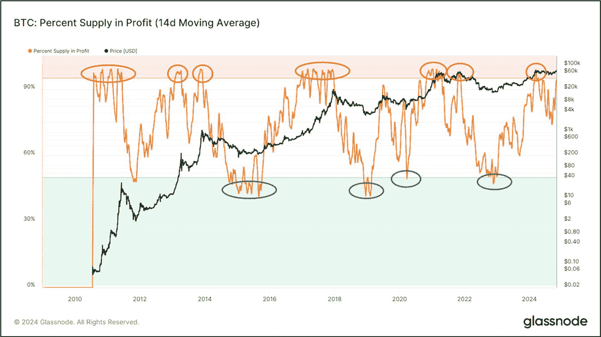
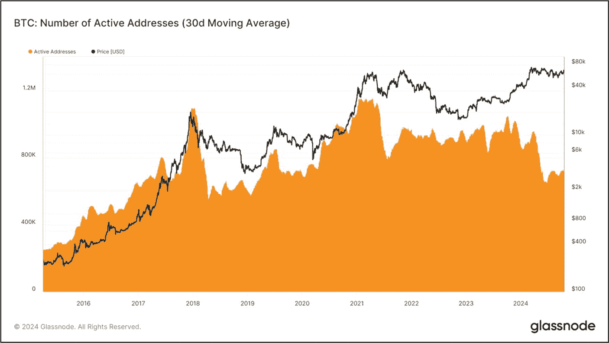

# 获利中的供应量百分比

**评估目标：**分析“获利中的供应量百分比”指标，以评估持有者当前的盈利状况，并识别潜在的吸筹区或派发区。

当某个币种的当前价格高于其（或账户链上的钱包余额）上一次移动时的价格时，该币种被视为“处于盈利状态”；反之，若当前价格更低，则被视为“处于亏损状态”。了解有多少投资者持有的资产是盈利的、多少是亏损的，这一点非常宝贵。根据一般经验法则，处于盈利状态的持有者比例较高，可能预示着潜在的下行趋势反转；而处于亏损状态的持有者比例较高，则可能预示着潜在的上行趋势反转。

*获利中的供应量百分比* 这一链上指标衡量的是总流通供应量中处于盈利状态的百分比——该指标在图 9-26 中以比特币为例展示。X 轴代表时间，而 Y 轴同时代表供应量盈利的百分比和每 BTC 的价格。通常，当供应量盈利的百分比（橙色线）进入绿色区域（盈利人数占比低）时，这预示着潜在的吸筹区和即将到来的上行趋势反转。相反，当它进入红色区域（盈利人数占比高）时，则预示着潜在的派发区和即将到来的下行趋势反转。

虽然预测市场底部很诱人，但这非常困难，依赖这种策略可能会对你不利。相反，有时在吸筹区采用定投策略更有益，这样可以随时间分散风险，并有可能获得更低的平均入场价格。当`获利中的供应量百分比`进入红色区域时也是如此。在红色区域分批获利了结，比试图在最高点卖出更安全，并且通常利润更高。

图 9-26

显示流通供应量中处于盈利状态的百分比的链上指标（数据来源：[`https://studio.glassnode.com/metrics?a=BTC&m=supply.ProfitRelative&utm_source=gn_insights&utm_medium=insights_woc&utm_campaign=woc_25_2024`](https://studio.glassnode.com/metrics?a=BTC&m=supply.ProfitRelative&utm_source=gn_insights&utm_medium=insights_woc&utm_campaign=woc_25_2024)）

### 行动步骤

请按照以下步骤分析`获利中的供应量百分比`指标，以评估持有者当前的盈利状况，并识别潜在的吸筹区或派发区。

1.  **分析`获利中的供应量百分比`指标**

    访问 [`Glassnode.com`](https://Glassnode.com)（或同类网站）查看并使用*获利中的供应量百分比*这一链上指标。
    1.  检查`获利中的供应量百分比`，看看该资产是处于绿色区域（盈利占比低）、红色区域（盈利占比高），还是介于两者之间。

2.  **记录笔记并以你自己的风格记录发现**

3.  **将发现结果与基本面评估流程的其他部分相结合**

#### 结果评估

如果`获利中的供应量百分比`处于绿色区域（盈利的持有者很少），可以考虑在不同时间点逐步建仓，以帮助随时间分散风险，并有可能获得更低的平均入场价格。当`获利中的供应量百分比`进入红色区域（盈利的持有者很多）时，同样适用，因此请考虑在不同时间点逐步卖出你的持仓并锁定利润。

## 活跃地址数

**评估目标：** 评估`活跃地址数`指标，以判断市场是否进入牛市阶段、熊市阶段或盘整期，并识别潜在的趋势反转或长期机会。

*活跃地址数*这一链上指标可描述为数字资产网络中活跃的唯一地址数量，这些地址可以是发送方或接收方。只有成功交易中涉及的活跃地址才会被计入此链上指标。活跃地址的增加表明网络用户增加，这对网络和投资者来说都是非常积极的信号。相反，活跃地址的减少或突然下降则预示着熊市的开始。图 9-27 展示了*比特币：活跃地址数量（使用 30 日移动平均线）*。它将 X 轴上的比特币活跃地址数与 Y 轴上的每 BTC 价格进行比较。从 2015 年到 2018 年，活跃地址数稳步增长，这与比特币价格上涨相关。然而，在 2018 年初，活跃地址数的急剧下降恰逢比特币价格的快速下跌和长达一年熊市的开始。2021 年年中类似的下降与 5 月至 7 月的回调相对应，尽管价格后来在 2021 年 11 月创下历史新高——这表明活跃地址信号可以标记阶段性趋势变化，但并非决定性的周期定时器。

通过观察每个牛市开始时的活跃地址数量，可以看出强劲的网络增长。例如，如果新牛市开始时的活跃地址数量多于上一个牛市，这表明随着时间的推移，人们对这项资产的兴趣在增长。相反，如果活跃地址数量减少，则可能表明兴趣下降。图 9-27 表明，自比特币创世区块以来，网络上的活跃地址数量总体呈逐步增长趋势，这对投资者来说非常积极。然而，从 2024 年初开始，比特币的活跃地址数量有所下降，而每币价格却从大约 40,000 美元上涨到了 65,000 美元。这很好地说明了仅使用单一指标是不够的，而应该使用多个链上指标（如本章所述），才能更准确地了解资产和市场的整体情况。

图 9-27

比特币：活跃地址数量（数据来源：[`https://studio.glassnode.com/metrics?a=BTC&category=&chartStyle=line&m=addresses.ActiveCount`](https://studio.glassnode.com/metrics?a=BTC&category=&chartStyle=line&m=addresses.ActiveCount)）

### 行动步骤

虽然`活跃地址`链上指标主要适用于`BTC`和`ETH`等主流币种，但这些顶级资产主导着市场，使得该分析成为识别其他数字资产机会时的实用粗略指南。

请遵循以下步骤评估`活跃地址`指标，以判断市场是进入牛市、熊市还是盘整期，并识别潜在的趋势反转或长期机会。

1.  **追踪活跃地址趋势**

    访问 `Glassnode.com`（或同类平台）查看`BTC`的链上指标`活跃地址`。
    1.  活跃地址数量是否与每枚币的价格相关？
    2.  观察活跃地址在牛市和熊市中如何变化，以发现潜在的趋势反转。
    3.  在每个牛市周期的开始，活跃地址是增多还是减少？

2.  **记录笔记，并以你自己的风格记录发现**

3.  **将这些发现与基本面评估流程的其他部分相结合**

#### 结果评估

活跃地址的增加标志着网络增长，而减少则表明兴趣减弱和潜在的价格下跌。如果活跃地址增加但交易量持平，则表明参与度较低。然而，如果两者都上升，则确认了强劲的网络活动。在牛市中，地址增加与价格上涨一致；在熊市中，稳定的地址表明用户基础具有韧性，暗示可能存在长期机会。

