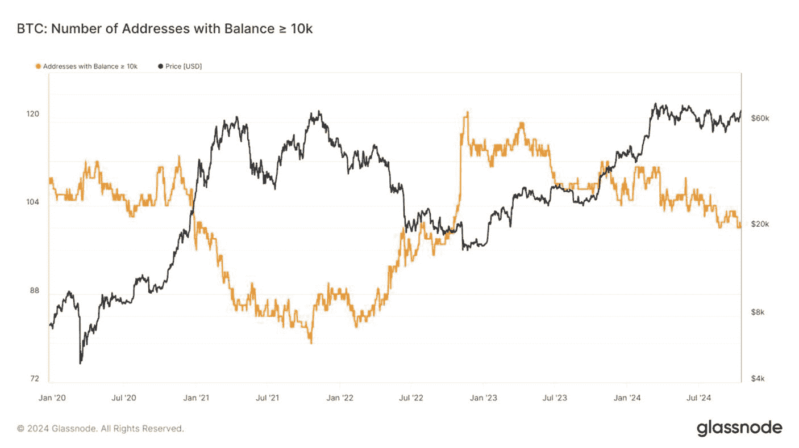

# 余额超过 1 万枚比特币的地址数量

**评估目标：** 评估持有超过 `1 万枚 BTC` 的`BTC`地址数量，以帮助衡量囤积和派发的区域。

`Glassnode` 提供了一个指标，该指标显示了持有特定数量`BTC`币的地址数量，并绘制了与每枚币的`USD`价格对应的图表。该指标适用于持有低至 `0.01 BTC` 的比特币地址；然而，查看持有 `1 万`（或更多）`BTC`余额的地址，能更好地显示从`BTC`到`USD`的转换，反之亦然。

图 9-28 展示了余额为 1 万枚或更多`BTC`的比特币地址数量。随着`BTC`价格（黑线）上涨，这些大余额地址（橙色线）的数量减少，表明鲸鱼在价格上涨期间向散户投资者抛售其持仓。相反，在价格下跌期间，散户投资者倾向于卖出，而长期持有者则囤积更多，导致持有 `10,000+ BTC` 的地址数量增加。

**图 9-28**  
比特币：余额 ≥ 1 万的地址数量（数据来源：`https://studio.glassnode.com/metrics?a=BTC&category=Addresses&m=addresses.Min10KCount&s=1518786086&u=1702857600&zoom=`）

这个 `Glassnode` 指标为投资者提供了关于大型 `BTC` 持有者（鲸鱼）行为的宝贵洞察，能够检测到囤积或派发的模式。

-   **卖出机会** - 当持有 `10,000`（或更多）`BTC` 的地址数量随着价格上涨而减少时，表明鲸鱼正在向散户投资者出售，这可能是市场见顶的信号。
-   **买入机会** - 当持有 `10,000`（或更多）`BTC`的地址数量随着价格下跌而增加时，表明鲸鱼正在从散户投资者手中囤积，这可能是市场见底的信号。

**专业提示**  
为了最佳地洞察供应变化，请将此链上指标与`已实现市值 HODL 波浪`链上指标结合使用。

### 行动步骤

请遵循以下步骤确定持有超过 `1 万枚 BTC` 的`BTC`地址数量，以衡量囤积和派发的区域。

1.  **持有超过 1 万枚 BTC 的 BTC 地址数量**

    访问 `Glassnode.com`（或同类平台）查看链上指标`余额 ≥ 1 万 BTC 的地址`。
    1.  如本节所述，分析指标以寻找潜在的买入或卖出机会。
        1.  **如果地址数量随着 BTC 价格上涨而减少**：
            1.  表明鲸鱼向较小的散户投资者派发。
            2.  潜在的市场见顶信号；进一步投资需谨慎。
        2.  **如果地址数量随着 BTC 价格下跌而增加**：
            1.  表明鲸鱼从散户投资者手中囤积。
            2.  潜在的市场见底信号，可能代表战略性的买入机会。

2.  **记录笔记，并以你自己的风格记录发现**

3.  **将这些发现与基本面评估流程的其他部分相结合**

#### 结果评估

对于长期投资者而言，不在机构投资者抛售时投资至关重要，反之亦然。该指标对于不打算长期持有的短期投资者不太适用。然而，与鲸鱼保持同一方向进行投资仍然是有益的。

好的，作为高级文档工程师和翻译员，我将严格遵循您的注意事项和示例格式，对提供的英文文本进行翻译。

