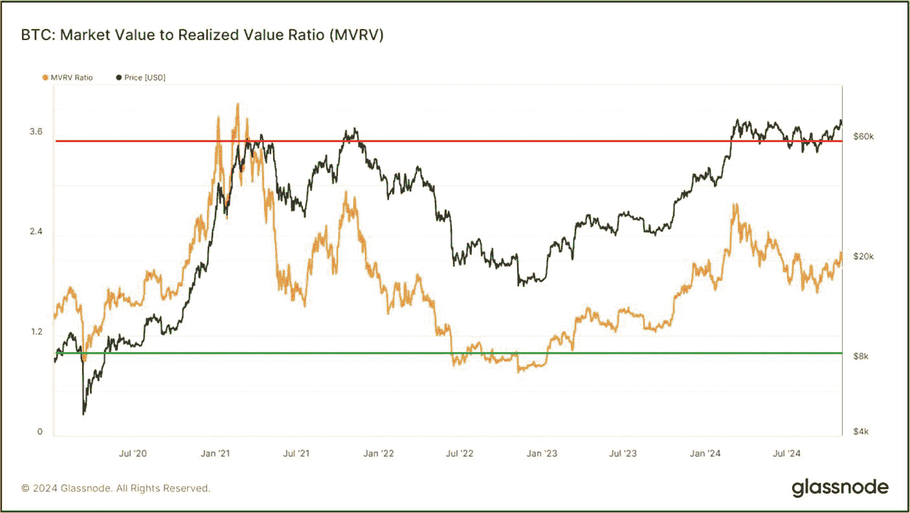
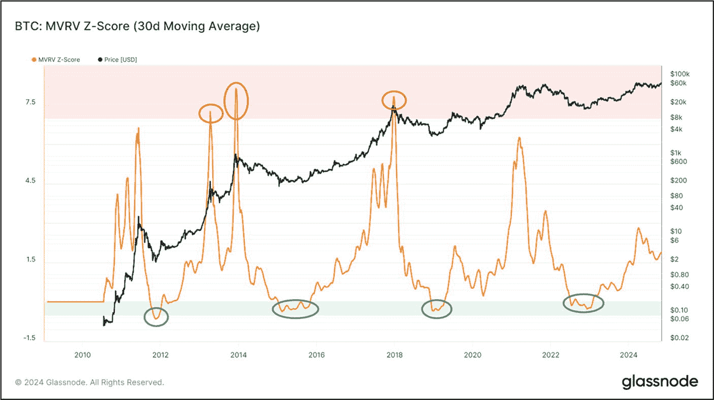
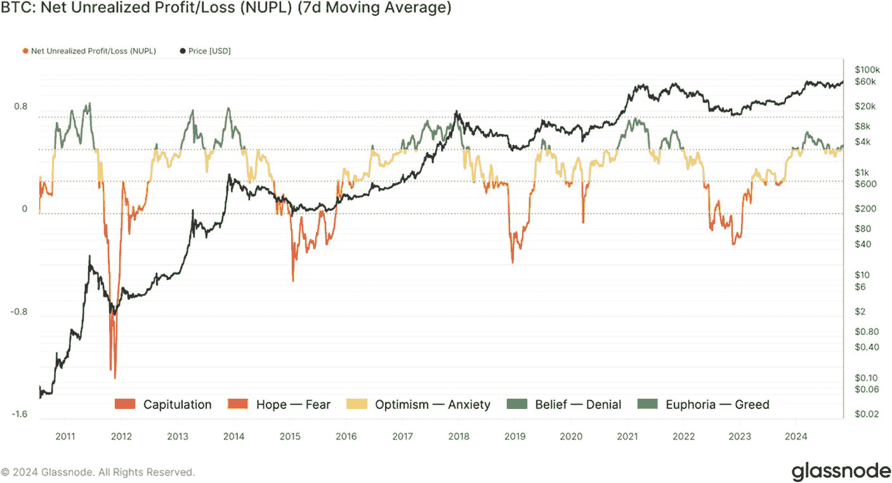

# MVRV 比率

**评估目标:** 使用`MVRV`比率，判断每枚代币的价格是高于还是低于其“公允价值”，从而识别潜在的买入和卖出区域。

*市场价值与已实现价值*（`MVRV`）比率是市值与已实现市值的比率，有助于衡量市场情绪和潜在的转折点。投资者经常使用`MVRV`比率（`公式 9-8`）来了解每枚代币何时高于或低于“公允价值”，并评估市场盈利能力。市场价值与已实现价值的显著偏离可能预示着市场顶部和底部，反映了投资者极端未实现利润（顶部）或亏损（底部）的时期。

```
MVRV = 市值 / 已实现市值
```

**`公式 9-8`.** `MVRV`比率的计算公式

`图 9-29` 展示了比特币的`MVRV`比率。横轴代表时间，纵轴代表`MVRV`比率和每枚`BTC`的价格。当`MVRV`（橙色线）低于 1（绿色线）时，大多数持有者处于亏损或盈亏平衡状态——这通常被视为一个买入信号。`MVRV`等于 1 意味着每枚代币的价格等于其已实现价格或盈亏平衡点，表明市场处于平衡状态。当`MVRV`升至 3.5 以上时（Glassnode 将 3.5 设为红色阈值，因为每个比特币周期顶部——2011 年、2013 年、2017 年和 2021 年 2 月的局部高点——都峰值于 3.5 和 4 之间；这是一个经验观察到的“危险区域”，并非基于公式的值），表明可能出现市场顶部，导致大量获利了结——这种情况在 2021 年初的比特币身上有所体现。上升趋势中的高`MVRV`值预示着不断增长的未实现利润，增加了抛售的可能性。相反，下降趋势中的低`MVRV`值表明相对于成本基础的市场价值下降，这可能意味着价值低估或需求疲软，具体取决于其他市场因素。有关`MVRV`比率解读的进一步细分，请参见`表 9-5`。



**`图 9-29`** 比特币：市场价值与已实现价值比率 (`MVRV`) (数据来源：[`studio.glassnode.com/metrics?a=BTC&category=&m=market.Mvrv`](https://studio.glassnode.com/metrics?a=BTC&category=&m=market.Mvrv))

> **事实**
> `MVRV`比率对于长期投资者尤其有价值，因为它突显了宏观的市场周期。然而，短期价格波动并不总是与`MVRV`信号相匹配。为了更准确地把握买卖时机，建议将`MVRV`与其他指标（如投资者工具、`NUPL`、交易量和已实现市值`HODL`波浪）结合使用。

**`表 9-5`** `MVRV`比率解读

| 比率值/描述 | 比率解读 |
| --- | --- |
| `MVRV`值 < 1.0 | 大多数持有者处于亏损（或盈亏平衡）状态。表示市场投降和后期熊市积累。通常被视为买入信号。 |
| `MVRV` = 1 | 每枚代币的价格等于已实现价格或盈亏平衡点。 |
| `MVRV` > 3.5 | 可能的市场顶部。大量派发和获利了结的可能性增加。 |
| 高值与上升趋势 | 代币供应的市场价值相对于已实现价值（成本基础）在增加。表明存在大量未实现利润，因此增加了锁定利润而进行代币派发的可能性。 |
| 低值与下降趋势 | 代币供应的市场价值相对于已实现价值（成本基础）在减少。表明投资者存在未实现亏损，可能预示着价值低估和需求动态不佳。 |

### 行动步骤

按照以下步骤判断每枚代币的价格是高于还是低于其“公允价值”，从而识别潜在的买入和卖出区域。

1.  **使用 `MVRV` 比率识别买入和卖出区域**
    访问`Glassnode.com`（或同等网站）查看并使用*MVRV 比率*链上指标。
    1.  通过分析图表数据确定资产的`MVRV`比率。

2.  **做笔记并以你自己的方式记录你的发现**

3.  **将发现与其他基本面评估流程部分相结合**

#### 结果评估

如果`MVRV`低于 1，考虑定期定投；如果介于 1 和 3.5 之间，考虑规划下一次的入场或离场；如果`MVRV`大于 3.5，考虑在固定时间间隔内获利了结。

## MVRV Z-Score

**评估目标:** 使用`MVRV Z-Score`评估资产是被高估还是低估，并精准定位市场顶部和底部。

根据`Glassnode.com`的定义，*市场价值与已实现价值 (`MVRV`) Z-Score*评估数字资产相对于其“公允价值”是被高估还是低估。它被定义为市值与已实现市值的差值与市值标准差之间的比率。一些投资者更喜欢`MVRV Z-Score`而非传统的 Z-Score（一种统计指标，表示特定价格点与平均价格的距离，以标准差表示），因为它将市场价值与已实现价值进行了比较。`MVRV Z-Score`的计算方法是取资产市场价值与其已实现市值之间的差值，然后除以市值的标准差，以突出与“公允价值”的偏差。

```
MVRV Z Score = (市值 - 已实现市值) / 标准差(市值)
```

**`公式 9-9`.** `MVRV Z-Score`的计算公式

`MVRV-Z Score`被分解为不同的颜色区域。红色区域表示市场价值（市值）显著高于已实现价值（市值）。该区域通常与大量派发和获利了结相关。绿色区域表示市场价值远低于已实现价值，预示着潜在的市场底部和买入机会。

`图 9-30`展示了带有 30 天移动平均线的比特币`MVRV-Z Score`数据。当`MVRV Z-Score`在 2013 年和 2017 年进入红色区域（市场顶部）时，随后都出现了价格下跌和趋势反转。相反，当它在 2011 年、2015 年、2019 年和 2022 年进入绿色区域（市场底部）时，则标志着积累期的开始，随后是上升趋势。



**`图 9-30`** 比特币：`MVRV Z-Score` (数据来源：[`studio.glassnode.com/metrics?a=BTC&category=&m=market.MvrvZScore&zoom=all`](https://studio.glassnode.com/metrics?a=BTC&category=&m=market.MvrvZScore&zoom=all))

### 行动步骤

按照以下步骤评估某项资产是被高估还是低估，并精准定位市场顶部和底部。

1.  **使用 MVRV Z-Score 识别买入和卖出区域**

    访问`Glassnode.com`（或同类网站），查看并使用*MVRV Z-Score*链上指标。
    -   通过分析图表数据，确定资产的`MVRV Z-Score`。

2.  **记录笔记，并以自己的风格整理发现**

3.  **将发现结果与基本面评估流程的其他部分相结合**

#### 结果评估

当`MVRV Z-Score`进入红色区域时，说明资产被高估；因此，应考虑定期分批获利了结。当它处于绿色区域时，通常意味着资产被低估；因此，应考虑定期分批建仓。在这两个区域之间时需谨慎行事，参考其他指标以寻找更清晰的趋势，并规划下一次的进场和离场时机。

## 未实现净损益 (NUPL)

**评估目标：** 使用`NUPL`来评估投资者情绪、市场氛围以及潜在的市场顶部和底部，从而发现买卖机会。

`未实现净损益 (NUPL)`表示数字资产的相对未实现利润与相对未实现亏损之间的差额。这是一个通过将市值（当前总价值）减去已实现市值（成本基础），再除以市值计算得出的比率。

```
NUPL = (市值 - 已实现市值) / 市值
```

**`公式 9-10`.** 计算`NUPL`的公式。

`NUPL`主要用于比特币，它反映了投资者的情绪状态（是盈利还是亏损），以及市场周期不同阶段的整体氛围。它还有助于识别市场顶部和底部，从而使投资者能够相应地规划进场和离场。

`NUPL`包含五个水平的“彩色”区域，可从市场心理的角度进行解读。这些区域从*投降*区（红色）延伸至*狂喜*和贪婪区（蓝色）。当某项特定资产的`NUPL`处于蓝色区域时，表明大多数投资者处于狂喜状态，且基本处于盈利。价格走势通常在`NUPL`处于此区域时达到顶峰。相反，当`NUPL`处于红色区域时，意味着投资者已向恶性下跌的市场屈服。在此期间，价格走势几乎触底，标志着熊市可能已见底，仅剩少数卖家。换句话说，`NUPL`以简化的彩色编码模式帮助投资者直观地了解市场周期。

`图 9-31`展示了比特币的`NUPL`图表（附带 7 日移动平均线）。x 轴代表时间与`NUPL`，y 轴代表每枚 BTC 的价格。请注意，当`NUPL`为绿色，特别是蓝色时，比特币的价格走势达到顶峰，随后通常会迅速下跌并出现趋势反转。另一方面，当比特币价格走势触底时，`NUPL`会跌入橙色和红色区域，这通常预示着市场底部即将到来，之后不久价格会急剧上涨。有关`NUPL`区域的更详细分解和说明，请参见`表 9-6`。

**`表 9-6`** 未实现净损益 (NUPL) 区域

| NUPL 区域 | 颜色 | 描述 |
| --- | --- | --- |
| 投降 (`NUPL` < 0) | 红色 | 代表市场底部，此时大多数投资者持有亏损。 |
| 希望/恐惧 (0 < `NUPL` < 0.25) | 橙色 | 过渡阶段，市场正从亏损中复苏，投资者持谨慎乐观态度。 |
| 乐观/焦虑 (0.25 < `NUPL` < 0.5) | 黄色 | 投资者信心增强，市场焦虑逐渐消退。 |
| 信念/否认 (0.5 < `NUPL` < 0.75) | 绿色 | 处于牛市阶段，预计上升趋势将持续，部分人否认潜在的市场风险。 |
| 狂喜/贪婪 (`NUPL` > 0.75) | 蓝色 | 大量投资者处于盈利状态并极度狂喜。通常，资产在此区域被高估，趋势反转即将来临。 |



**`图 9-31`** 比特币：未实现净损益 (NUPL) （数据来源： [`https://studio.glassnode.com/metrics?a=BTC&category=&m=indicators.NetUnrealizedProfitLoss&s=1452251288&u=1702857600&zoom=`](https://studio.glassnode.com/metrics?a=BTC&category=&m=indicators.NetUnrealizedProfitLoss&s=1452251288&u=1702857600&zoom=))

### 行动步骤

按照以下步骤评估投资者情绪、市场氛围以及潜在的市场顶部和底部，以发现买卖机会。

1.  **识别市场情绪**

    访问`Glassnode.com`（或同类网站），查看并使用`NUPL`链上指标。
    -   通过监控比特币（或其他资产）所处的颜色区域，判断整体市场情绪和投资者情绪。
    -   如`表 9-6`所述，评估`NUPL`区域。

2.  **追踪市场周期**
    -   观察`NUPL`在不同区域间的运动，以识别市场周期的转变。

3.  **记录笔记，并以自己的风格整理发现**

4.  **将发现结果与基本面评估流程的其他部分相结合**

#### 结果评估

如果`NUPL`处于蓝色或绿色区域，应考虑在不同水平分批锁定利润，因为市场见顶和趋势反转很可能发生。在橙色和红色区域考虑分批建仓，因为这些水平通常预示着市场底部。