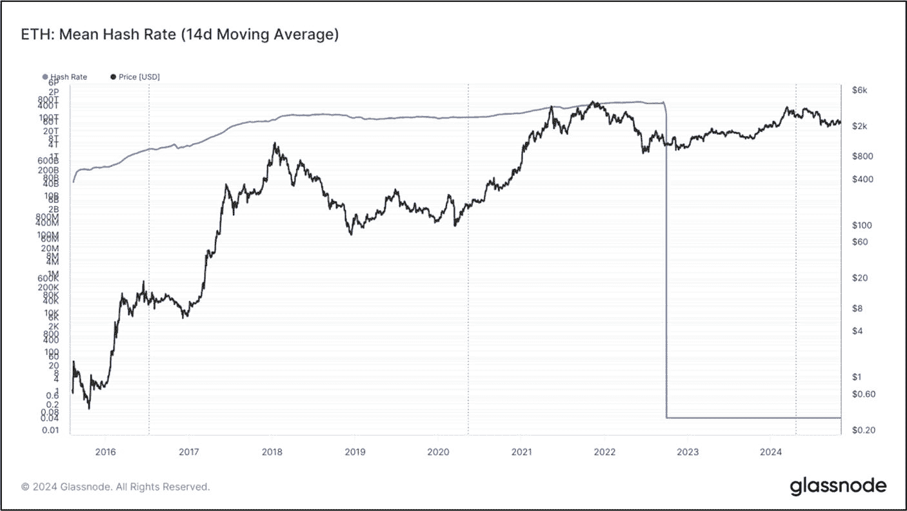
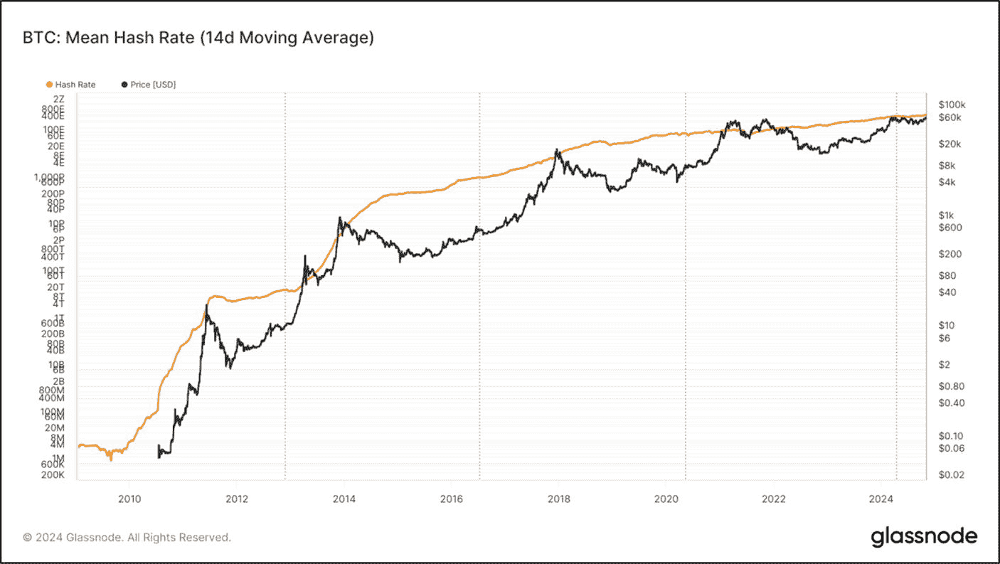

# 哈希率

**评估目标：评估工作量证明网络的哈希率，以判断网络安全趋势、矿工参与度及其与市场状况和资产表现的相关性。**

哈希率是衡量在工作量证明（`PoW`）区块链挖矿过程中，用于验证交易并保障网络安全所需的每秒计算能力的指标。通常，当网络哈希率随时间增长时，被视为积极信号。高哈希率意味着篡改或操纵区块链网络需要极高的计算能力，使得任何单一实体更难发动 `51%` 攻击。反之，低哈希率可能表明矿工参与度下降，这会削弱网络安全，因为恶意实体更容易控制网络超过 `50%` 的计算能力——这种情况被称为 `51%` 攻击。哈希率突然、急剧下降可能是危险信号，预示着矿机关停、区域性断电或利润驱动的退出潮，会暂时侵蚀安全边际。

对于长期投资者而言，哈希率持续下降的网络是一个重大危险信号。较低的哈希率可能表明矿工参与度降低，这会直接影响网络安全，使恶意实体更容易控制网络超过 `50%` 的计算能力——即所谓的 `51%` 攻击。一旦发生这种情况，攻击者可以通过双花来扰乱和操纵区块链，破坏网络的完整性。此外，低哈希率或哈希率下降通常与矿工盈利能力下降或由于交易费或区块奖励减少而缺乏保障网络安全的激励有关。这通常是用户交互不足的结果，其根源可能在于基础质量较差或市场状况不佳。

哈希率通常以每秒生成的哈希值数量来衡量。以下是常见的哈希率单位、其含义以及与之匹配的网络或设备示例。

**表 9-7** 哈希率速度

| 哈希率单位 | 每秒哈希次数 | 哈希率描述 |
| --- | --- | --- |
| `Kilohash` | 每秒 `1,000` 次哈希 | 极慢，可能代表单个基于 GPU 的矿机 |
| `Megahash` | 每秒 `100 万` 次哈希 | 非常慢，可能代表单个基于 GPU 的矿机 |
| `Gigahash` | 每秒 `10 亿` 次哈希 | 小型矿池或可能代表一组 GPU 集群 |
| `Terahash` | 每秒 `1 万亿` 次哈希 | 单个 `ASIC` 矿机或大型矿池 |
| `Petahash` | 每秒 `1 千万亿` 次哈希 | 大型矿池 |
| `Exahash` | 每秒 `100 京` 次哈希 | 超大矿池或可能代表整个网络 |
| `Zetahash` | 每秒 `10 垓` 次哈希 | 比特币网络于 2024 年首次达到；代表超大规模、全球级的 `PoW` 算力 |

图 `[9-32]` 展示了比特币的哈希率。x 轴表示时间，y 轴表示比特币的哈希率和每枚币的价格。如图所示，比特币的哈希率从 2010 年到大约 2015 年呈急剧上升趋势，并从 2015 年到 2024 年稳步增长。随着比特币哈希率的增加，其挖矿难度也随之提高。虽然这对矿工盈利能力产生负面影响，但它对整体网络安全做出了积极贡献，并表明了其持续受欢迎的程度。

**图 9-33** 以太坊转向 `PoS` 前的平均哈希率（图表来源：[`https://studio.glassnode.com/metrics?a=ETH&category=&ema=0&m=mining.HashRateMean&mAvg=14&mMedian=0&mScl=log`](https://studio.glassnode.com/metrics?a=ETH&category=&ema=0&m=mining.HashRateMean&mAvg=14&mMedian=0&mScl=log)）

**图 9-32** 比特币哈希率（图表来源：[`https://studio.glassnode.com/metrics?a=BTC&category=&m=mining.HashRateMean&mScl=log`](https://studio.glassnode.com/metrics?a=BTC&category=&m=mining.HashRateMean&mScl=log)）

### 行动步骤

请按照以下步骤评估 `PoW` 网络的哈希率，以判断网络安全趋势、矿工参与度及其与市场状况和资产表现的相关性。

1. **检查网络哈希率**

   访问 `Glassnode.com`（或同类网站）查看并使用 `哈希率` 链上指标。
   1. 追踪网络哈希率随时间的变化，判断其是呈上升、稳定还是下降趋势。

2. **分析哈希率与市场状况的关系**

   将哈希率变化与资产价格变动及整体市场状况进行比较。

3. **做笔记并用你自己的风格记录发现**

4. **将发现与基本面评估流程的其他部分相结合**

#### 结果评估

哈希率上升标志着网络安全性强、矿工参与度高且受欢迎。相反，哈希率下降——尤其是伴随着价格停滞或下跌时——则暗示网络安全正在减弱，矿工可能退出，这可能表明是时候重新评估或减少风险敞口了。

