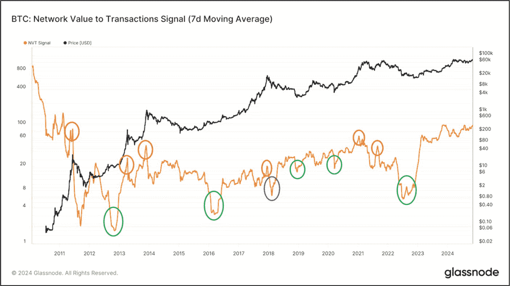
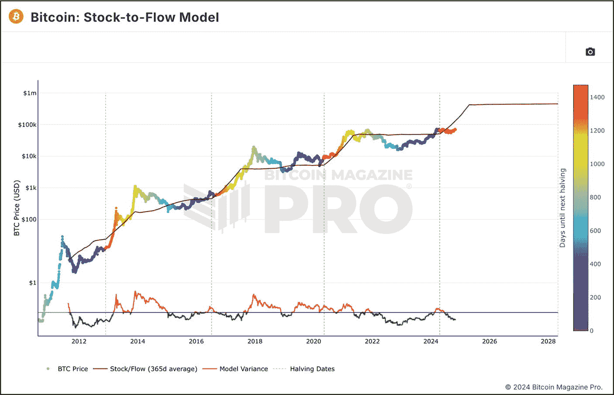

# 网络价值与交易量信号 (NVTS)

**评估目标：评估 NVT 信号 (NVTS) 指标，以判断资产是否被低估或高估，从而识别潜在的买入或卖出机会以及可能的趋势反转。**

`NVT 信号 (NVTS)` 是传统 NVT 比率的升级版本，它提供了一种对投资者更友好的网络估值视角，相较于交易活动而言。传统 NVT 使用每日交易量，而 NVTS 则使用 90 日移动平均线——即将市值除以 7 天平均值——以平滑短期波动，使其更可靠地用于发现趋势。

当 NVTS 较高时，表明网络的估值（市值）相对于交易量较高，暗示可能存在高估，因为网络的实际效用（以交易量衡量）不足以支撑其价格。投资者可能会将此解读为市场可能回调的预警信号。相反，当 NVTS 较低时，表明交易量相对于网络估值较为强劲，暗示可能存在低估，并且如果其他基本面因素也积极向好，则预示着潜在的买入机会。

图 9-34 展示了比特币的 NVTS。x 轴代表时间（与 NVTS 相关联），y 轴代表每枚 BTC 的价格。请注意，当 NVT 信号骤降时（绿色圆圈），价格走势往往会反转向上。然而，必须谨慎行事，因为这并不总是意味着长期价格反转，例如 2018 年的情况（紫色圆圈）。另一方面，当 NVT 信号达到峰值时（红色圆圈），随后通常会出现价格急剧下跌和趋势反转。

图 9-34
比特币的网络价值与交易量信号（7 日移动平均线）（数据来源自 [`studio.glassnode.com/metrics?a=BTC&ema=0&m=indicators.Nvts&mAvg=7&mMedian=0&mScl=log&s=1264806612&u=1730505600&zoom=`](https://studio.glassnode.com/metrics?a=BTC&ema=0&m=indicators.Nvts&mAvg=7&mMedian=0&mScl=log&s=1264806612&u=1730505600&zoom=)）

### 操作步骤

请按照以下步骤评估 NVT 信号 (NVTS) 指标，以判断资产是否被低估或高估，识别潜在的买入或卖出机会以及可能的趋势反转。

1. **识别高估与低估**

   访问 Glassnode.com（或类似网站）查看并使用 `NVT 信号` 链上指标。
   1. 检查您所评估资产的 NVTS 读数。

2. **分析趋势反转**

   当 NVTS 要么骤降要么达到峰值时，识别趋势反转的可能性。

3. **记录笔记并以您自己的风格记录发现**

4. **将发现结果与基本面评估流程的其他部分相结合**

#### 结果评估

如果 NVTS 处于高位峰值，则资产可能被高估——考虑通过减少头寸来降低和管理风险。相反，如果 NVTS 较低，则可能表明低估，这可能会带来潜在的积累机会。请务必结合近期趋势反转进行验证，并寻找与其他链上指标指示器的协同效应。

## 库存流量模型

**评估目标：评估库存流量模型，以帮助预测比特币的长期价格走势。**

库存流量 (S2F) 模型最初是一种用于评估黄金和白银等稀缺资源价值的金融概念，通过计算资产的现有供应量与其年产量之比来实现。一位化名为 [Plan B](https://x.com/100trillionUSD) 的人士采用了这个 S2F 模型，并对其进行了修改，将其应用于比特币。在该模型中，比特币的稀缺性通过将其“库存”（所有已被挖掘并正在流通的比特币）除以其“流量”（每年新挖出并进入生态系统的比特币数量）来评估。

长期投资者使用此模型来帮助预测供应量上限为 2100 万枚的比特币的长期价格走势。由于比特币的发行是算法控制的，S2F 模型可以帮助估算 BTC 相对于黄金等其他资产的潜在未来价值。通过 `减半`——BTC 挖矿奖励每四年减少 50% 的过程——比特币将变得更加稀缺和难以获得，使 S2F 比率翻倍，并可能提升其价值。

图 9-35 展示了由 [Bitcoin Magazine Pro](https://www.bitcoinmagazinepro.com/) 显示的比特币 S2F 模型。x 轴代表时间（与 S2F 比率相关联），y 轴代表每枚 BTC 的价格。为了减少市场波动的影响，S2F 比率线采用了 365 天平均值。价格线叠加在 S2F 比率线上方，彩色点标记了距离下一次比特币减半（在撰写本书时为 2028 年）的天数。理论是，投资者可以通过观察预测的 S2F 线来预测价格可能走向何处。自 2012 年以来，比特币的价格总体上一直跟随 S2F 比率，围绕其波动，但总体与其上升轨迹保持一致。请注意价格如何每四年上涨一次，如标记比特币减半事件的垂直虚线所示。这是由于比特币挖矿奖励减半 50%，使其变得更加稀缺。

在 S2F 图表的底部是一个背离工具，或称为 `比特币库存流量偏差`，它显示了价格与库存流量之间的差异。它使投资者能够快速了解价格如何在市场周期中与库存流量相互作用。当价格移动到 S2F 线上方时，偏差线从绿色变为红色。相反，当价格移动到 S2F 线下方时，偏差工具从红色变为绿色。偏差线向任一方向偏离 S2F 水平的程度越大，潜在价格修正的可能性就越高，正如 S2F 偏差概念所指示的那样。

图 9-35
比特币库存流量模型（数据来源自 [`www.bitcoinmagazinepro.com/charts/stock-to-flow-model/`](https://www.bitcoinmagazinepro.com/charts/stock-to-flow-model/)）

### 行动步骤

请按照以下步骤评估`stock-to-flow`模型，以帮助预测比特币的长期价格走势。

1.  **使用库存流量模型追踪比特币价格**

    访问 [Bitcoin Magazine](https://www.bitcoinmagazinepro.com/) Pro、`Glassnode.com`（或同类网站）查看并使用`S2F`链上指标。
    1.  检查比特币当前价格相对于`S2F`比率线的位置。
    2.  使用背离工具检查比特币相对于`S2F`模型是否被高估或低估。
    3.  检查距离下一次减半事件还有多少天。
    4.  定期监测比特币价格与`S2F`线的关系。

2.  **使用背离工具判断市场情绪**

    利用`S2F`图表底部的背离工具来评估潜在的买入或卖出信号。

3.  **用自己的方式做笔记并记录发现**

4.  **将发现结果与基本面评估流程的其他部分相结合**

#### 结果评估

根据`S2F`模型，如果价格上涨超过`S2F`线，则可能被高估，这意味着潜在的获利了结机会。另一方面，如果价格跌破`S2F`比率线，则可能表明被低估，是一个有吸引力的投资入场点。在使用`S2F`模型指标时，请始终使用背离工具。

需要注意的是，尽管一些人对`S2F`模型持怀疑态度，且存在预期价格波动之外的情况，但根据历史趋势，该模型仍然证明了其有效性。尽管如此，建议仅将此工具作为评估长期投资机会的粗略指南。`S2F`模型还应与一系列其他链上及链下指标结合使用，以提高准确性。

