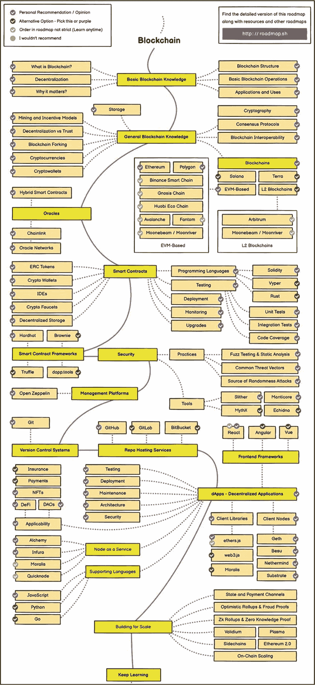

# 11. 项目路线图

路线图是战略规划的直观呈现。它勾勒并定义了计划、目标和核心可交付成果，例如为达成预定成果所需执行的关键里程碑。可将路线图视为一种高效且易于理解的沟通工具，它将战略与所有重要里程碑的时间线结合起来，并与相应日程保持一致。此外，它还能为开发团队、利益相关者和潜在投资者提供指导，让他们清晰了解项目的发展方向和进度。

路线图展现了项目团队的愿景，是推动对话、向潜在合作伙伴、早期投资者和公众投资者传达愿景的工具。与项目时间表相似，它也非常适合对关键可交付成果进行优先级排序、分配资源、识别瓶颈以及追踪重要截止日期。路线图并非一成不变的文档，本质上是动态的。此外，它应具有足够的灵活性，以适应不断变化的市场条件、功能升级、里程碑完成更新、用户需求和技术创新。项目路线图通常可通过公司官网、白皮书、社交媒体和博客等官方项目渠道获取。

对于加密货币投资者而言，评估项目路线图至关重要，因为它表明了团队是否拥有清晰的愿景、周密的计划、现实的目标以及兑现承诺的能力。路线图不仅仅是时间表，其主要目的是让项目团队对其承诺负责。它能让投资者分析项目的愿景、目的和目标，并识别潜在的危险信号，例如未能按时完成的里程碑或含糊的承诺。

区块链领域存在多种不同类型的路线图，将在本章稍后部分讨论。图 11-1 是一个区块链开发者路线图的示例。该路线图由 [*https://roadmap.sh/blockchain*](https://roadmap.sh/blockchain) 创建，作为开发者的指南，帮助识别和导航区块链领域的各个开发区域。

**本章讨论的基础知识：**

图 11-1

成为区块链开发者的路线图（致谢：[`https://roadmap.sh/blockchain`](https://roadmap.sh/blockchain)）

- 路线图的益处
- 区块链路线图的核心要素
- 路线图类型
- 评估加密路线图

## 路线图的益处

清晰且结构良好的路线图具有诸多益处。以下是路线图提供的主要优势。

- **清晰度与方向** – 路线图概述了项目的愿景、目标和计划中的里程碑，有助于项目团队保持专注并与项目目标保持一致。

- **利益相关者协同** – 路线图确保所有利益相关者，包括项目团队、核心与开源开发者、投资者以及社区成员，能够达成共识。

- **进度追踪** – 路线图有效地使项目团队和利益相关者能够监控里程碑、追踪进度并保持责任感。

- **透明度与信任** – 分享一份详细且结构良好的路线图向公众表明，项目团队是严肃认真的，拥有明确的前进道路，并致力于成功实现其目标。

- **投资者信心** – 投资者更倾向于投资那些拥有详细路线图、清晰勾勒出项目愿景、目标和里程碑的项目。这增加了项目的可信度，使其对长期和短期投资者都更具吸引力。

- **社区参与** – 一份坚实的路线图能极大地点燃社区热情，鼓励他们参与并投身于即将举行的计划活动。

## 区块链路线图的核心要素

在本节中，我们将分解加密路线图的关键要素，例如项目的目标、愿景和主要里程碑。

### 目标与目的

加密项目路线图中列出的目标和目的有助于传达团队为推进项目整体愿景而需要完成的可操作步骤。根据项目类型及其核心价值主张，这些目标和目的可以涵盖广泛的领域，包括去中心化金融 (DeFi)、基础设施、非同质化资产 (NFT)、游戏、物联网 (IoT) 等。无论涉及哪个领域，目标和目的都凸显了项目在技术开发、功能实现、基础设施升级、代币分配和社区参与等多个方面的范围。它们还通过提供项目发展方向的概览，帮助协调利益相关者。此外，目标和目的也是衡量团队进度的绝佳方式，因为每项任务、目标、里程碑和目的都是投资者可以验证的。

