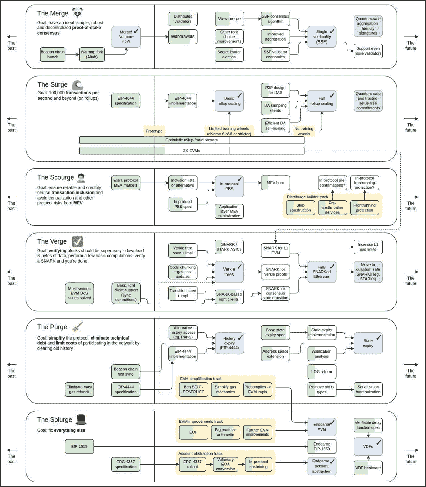
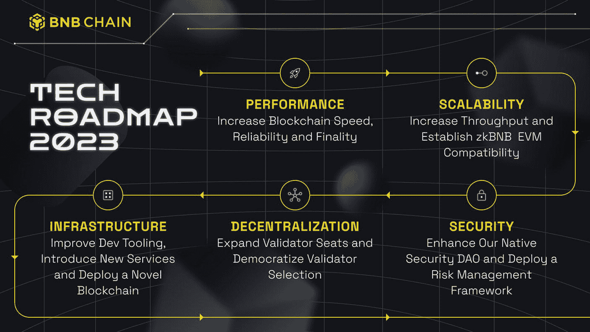
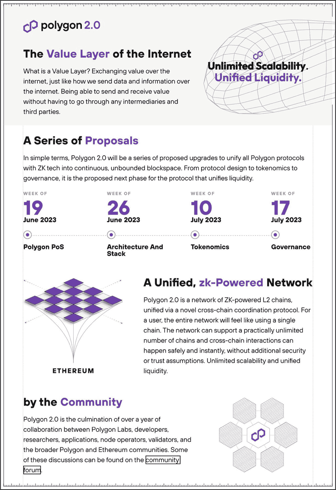
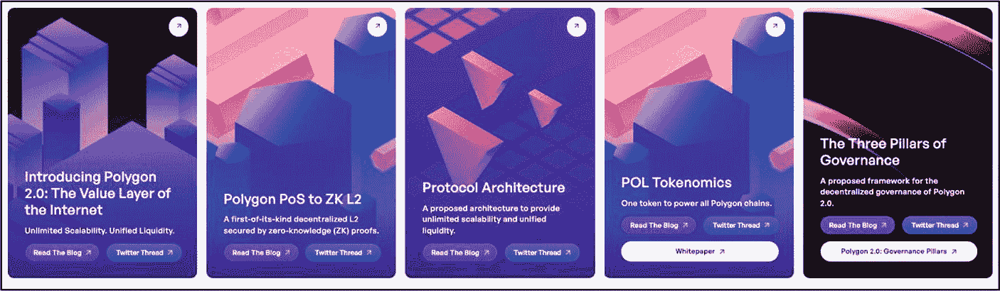
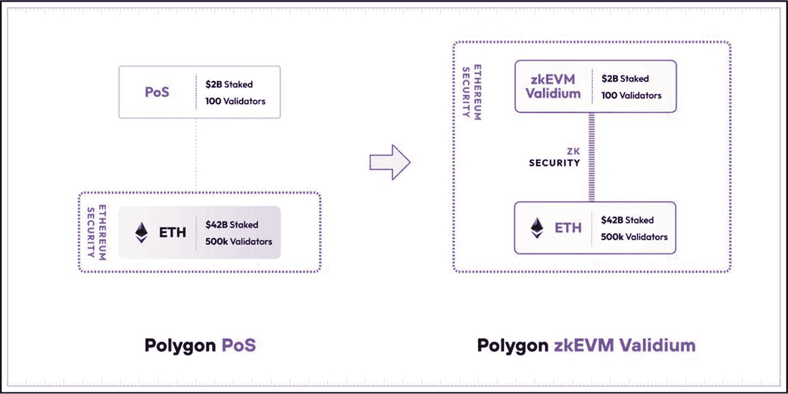
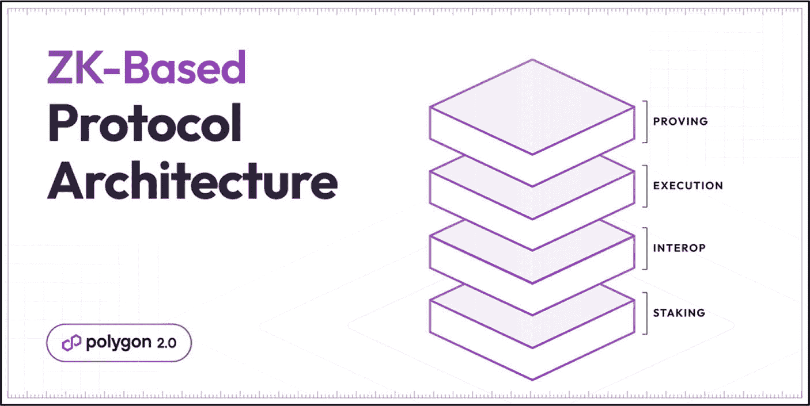
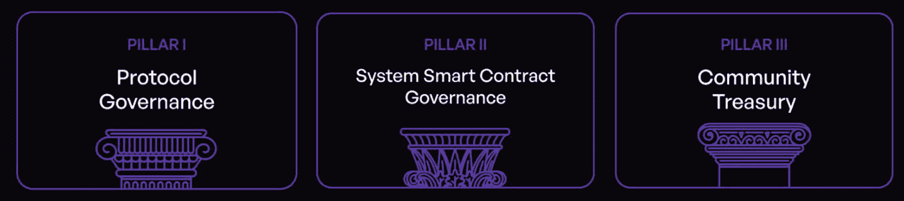

# 交付物的可行性

承诺与交付里程碑是两件截然不同的事情。制定并公布吸引各方利益相关者关注的诱人里程碑相对容易，但在规定期限内成功完成这些里程碑则是一项艰巨得多的任务。

在评估特定项目里程碑的可行性时，必须考虑多个因素。投资者在评估这些因素后，应能更好地理解项目既定里程碑的可行性水平。此外，定期重新审视这些评估也很重要，因为随着条件变化，可能出现影响项目里程碑可行性及相关截止日期的新信息或技术。在加密领域评估里程碑可行性时，需关注以下五个关键领域：

1.  **技术复杂度**
    1.  里程碑是否要求尚未见过的先进技术或密码学技术？如果是，该团队在完成这些里程碑方面有何优势？
    2.  成功执行拟议里程碑所需的平台技术工具是否可得？
2.  **基础设施要求**
    1.  团队是否有充足的测试环境，例如`testnets`或服务器配置，以帮助促进持续开发和里程碑达成？
    2.  团队是否熟悉并具备这些基础设施和测试环境的经验？
3.  **资源可用性**
    1.  团队是否能接触到具备特定技能的必要开发者或专家来执行已知的里程碑？
    2.  是否有足够的资金支持开发工作以启动并完成每个里程碑？
4.  **时间线**
    1.  基于已知的限制、挑战和迄今为止的表现，设定的里程碑、日期和时间线是否看起来现实？
    2.  团队是否为意外延误或挑战制定了后备计划？
5.  **表现**
    1.  基于过往里程碑的执行表现，未来的里程碑是否看起来可实现？
    2.  是否有可见的证据证明先前已完成的里程碑？
    3.  是否有跨越数年成功完成里程碑的可靠记录？
    4.  团队过去是否有未能达成里程碑的情况？留意时间表中明显的缺口或延迟。
    5.  如果过去的里程碑未能完成或未按时完成，原因是内部因素还是外部因素？

## 路线图类型

许多不同类型的路线图旨在满足并解决区块链领域内的特定需求。例如，投资者路线图提供项目愿景、关键里程碑和时间线的高层概述，以吸引并团结投资者。相比之下，开发者路线图更适合作为指导，旨在教育和引导开发者掌握精通加密相关开发所需的各种技能水平、工具、框架和实践。团队内部的路线图可能包括法规合规、用户采用策略和品牌建设。对于投资者而言，最常关注且最相关的路线图类型是`投资者路线图`和产品`开发路线图`。

### 投资者路线图

投资者路线图是最广泛使用的格式之一——尤其是在代币销售和融资轮次中。该路线图明确面向投资者，提供项目愿景、关键里程碑、目标与宗旨、功能发布以及时间线的高层概述。其目的是通过展示项目专门设计的战略计划来打动并影响投资者。

#### Sandbox 路线图

Sandbox 是一个基于区块链技术构建的去中心化虚拟游戏世界。它允许玩家购买、出售和创建数字资产，并由在以太坊区块链上以非同质化代币（NFT）形式呈现的土地组成。该游戏最初由 Pixowl 于 2011 年作为 2D 手机游戏推出，后于 2019 年在 Animoca Brands 旗下重新发布，并开始利用和实施区块链技术，将游戏体验提升到一个新高度。

图 11-2 展示了 Sandbox 投资者路线图。该路线图为投资者提供了主要交付物及相应时间线的概览，例如 `LAND` 销售、游戏平台和多玩家功能。它还列出了其他关键要素，如新合作伙伴公告、DAO 参与以及各种未来事件。

图 11-2

Sandbox（致谢：[`https://icodrops.com/the-sandbox/`](https://icodrops.com/the-sandbox/)）

#### 考量因素

投资者使用投资者路线图——例如 Sandbox——通过分析迄今为止按照路线图已取得的成就，来帮助评估项目的进展。如果团队已经如约完成了重要的里程碑，那么未来的目标、里程碑和创新功能集也很有可能如约执行。这进一步提升了项目及其团队成员的专业性、透明度、信任度和声誉。

投资者需要评估团队计划的主要交付物及其各自的时间线，以确保这些事件与其投资策略相符。例如，长期投资策略可能涉及购买严重低估的资产、持有该资产，并在两三年后主要里程碑执行时卖出获利。然而，这对于可能持资产不超过六个月、且优先考虑能在其更短时间内达成里程碑的路线图的短期持有者来说，可能是不可接受的。这是因为短期策略侧重于利用近期发展（如产品发布或合作伙伴关系）来获取快速回报，这些发展可能触发价格飙升。这些投资者旨在市场预期达到顶峰时或里程碑刚完成后立即退出，以实现收益最大化。

### 产品开发路线图

产品开发路线图侧重于产品或服务的技术开发，包括概述功能集、架构和基础设施相关开发的核心交付物。虽然投资者路线图也包含产品的阶段、里程碑和交付物，但产品开发路线图主要聚焦并详述架构开发、升级和增强的核心交付物，以实现特定结果，例如真正的去中心化、链上治理或完成一项重大的创新功能。

产品开发路线图不仅用于激励利益相关者；它常在团队内部用于设定目标和协调任务。然而，由于复杂度、开源性质以及可能影响项目的动态内外部因素，这些路线图中的并非所有交付物都有指定的时间线。

#### 以太坊产品发展路线图

图 11-3 展示了以太坊的产品发展路线图。这份详尽的技术路线图明确了具体的改进与升级内容，将区块链从工作量证明（PoW）向权益证明（PoS）共识算法的完整过渡过程分解为六个关键阶段。

图 11-3

包含详细信息的以太坊路线图（感谢 [`https://x.com/VitalikButerin/status/1588669782471368704`](https://x.com/VitalikButerin/status/1588669782471368704)）

表 11-1 以“非开发者”易于理解的方式总结了以太坊的路线图，包含了每个对应阶段的目标。

表 11-1

以太坊从 PoW 到 PoS 的路线图（感谢 [`https://ethereum.org/en/roadmap/#what-changes-are-coming`](https://ethereum.org/en/roadmap/%2523what-changes-are-coming)）

| 以太坊产品发展路线图 |
| --- |
| 阶段编号 | 阶段名称 | 任务 | 目标 | 状态 |
| --- | --- | --- | --- | --- |
| 1 | 合并 | 与从工作量证明（PoW）切换到权益证明（PoS）相关的升级。 | 通过将主网与共识层的信标链结合，确保 PoS 共识安全。 | 已完成 |
| 2 | 激增 | 通过 Rollup 和数据分片实现可扩展性相关的升级。 | 以 Rollup 为中心，实现 100,000+ TPS 的扩展。 | 进行中 |
| 3 | 灾祸 | 与抗审查、去中心化以及最大可提取价值（MEV）带来的协议风险相关的升级。 | 避免来自 MEV 的中心化及其他协议风险。 | 进行中 |
| 4 | 边缘 | 与更快速验证区块相关的升级。 | 实现更简单、更高效的区块验证。 | 进行中 |
| 5 | 清洗 | 与降低运行节点的计算和存储成本（例如，旧历史数据的状态过期）以及简化协议相关的升级。 | 简化协议并降低运行网络节点的成本。 | 进行中 |
| 6 | 挥霍 | 其他不适合归入前几类别的升级。 | 解决各种未完成的事项。 | 进行中 |

**专家提示**

当遇到复杂的路线图时，建议将其分解为对您有意义的简单条款。如需澄清或解释，请向社区团队成员寻求帮助。

以太坊是一个复杂且不断演进的系统，拥有许多利益相关者，例如开发人员、研究人员、用户和验证者。因此，为路线图上的每个功能或升级提供准确的时间表具有挑战性。此外，开发、测试、审计、协调、共识和反馈等环节主要以开源方式管理，许多参与者在有空时贡献他们的时间。在撰写本文时，尽管仍有一些长期里程碑有待实现，但以太坊在过去十年中已经完成了许多重大升级，并持续推出新的改进——不过，对于像以太坊这样的项目，持续改进将永不止步。有关以太坊路线图的实时更新，请查看 [`https://ethroadmap.com/`](https://ethroadmap.com/)。

此外，与许多其他开源项目一样，以太坊的路线图并非一成不变的计划。它是灵活的，并且可能会根据网络及其用户面临的新挑战、新机遇和新需求而发生变化。这种结构旨在支持持续创新，同时特别强调加强网络的安全性。

#### 需要考虑的因素

许多因素共同决定了一个区块链项目的价值，包括价值主张、代币设计、代币经济学、编程语言、架构、项目团队和社区精神。然而，如果项目的核心技术交付成果未能准确、透明地执行并与既定目标保持一致，那么这些基础因素的重要性就会大大降低。未能实现这些关键技术组件可能会对产品的核心功能和实用性产生负面影响，从而损害团队的声誉以及项目的长期成功和可持续性。因此，投资者必须留出足够的时间，以正确理解并评估项目迄今为止的进展以及路线图中概述的未来技术交付成果。

虽然并非必要，但一些投资者会将他们的兴趣和技术知识与他们选择的投资类别相匹配，以帮助降低风险。例如，[以太坊](https://ethereum.org/en/)、[Polkadot](https://polkadot.com/)、[Moonbeam](https://moonbeam.network/) 等基础设施项目可能会吸引一些投资者的注意。相比之下，其他人可能更了解 [The Sandbox](https://www.sandbox.game/en/) 或 [Axie Infinity](https://axieinfinity.com/) 等游戏项目。然而，这通常会将投资者限制在加密货币世界中的一种投资类别，这可能不适合许多投资者，并可能错失其他潜在的投资机会。培养评估该领域广泛项目所需的技能和知识是更值得推崇的。

产品路线图也是用于竞争对手分析的绝佳比较工具。将路线图与一个强大的、成功的竞争对手的路线图进行比较和对比，有助于发现可能促成项目成功或导致其失败的优缺点。其中可能包括：
*   他们有哪些独特的卖点，例如能够吸引更广泛受众的功能或优势？
*   他们的技术有何不同，是否提供了任何优势或弱点？
*   他们的时间表是否现实，或者看起来过于激进？
*   他们的长期愿景在可持续性和市场趋势方面如何比较？
*   他们是否符合当前的监管要求？
*   他们的路线图或执行中是否存在明显的专业性缺失？
*   路线图是否定期更新以反映进展和变化？
*   路线图是否为投资者提供了足够的细节，以真正了解项目方向？

## 评估加密路线图

使用特定的路线图评估标准来评估现实中的加密项目路线图。面对市场上各种不同类型的路线图，评估加密路线图可能看起来有些棘手。然而，在大多数情况下，可以使用相同的核心评估标准进行通用评估。无论评估何种类型的路线图，清晰的目标、远大的愿景、现实的里程碑和透明度等关键要素都至关重要。通过关注这些关键领域，投资者可以很好地判断一个项目是否在正确的轨道上，或者未能兑现其承诺。

首先，从正在评估的项目中找到项目路线图。如前所述，通常可以找到项目路线图的可靠来源是官方项目渠道，例如公司网站、白皮书、社交媒体和博客。需要注意的是，许多项目每年都会更新其路线图；请务必确保您拥有最新、最前沿的版本。

### 目标与目的

评估目的：判断项目路线图中的目标和里程碑是否清晰、切合实际、可衡量，并与项目愿景保持一致。

在本节中，将借助 SMART 评估参数对 `BNB Chain` 的目标与目的进行评估。此过程有助于投资者判断路线图中的目标和里程碑是否定义清晰、是否切实可行、是否可衡量，以及是否与项目愿景保持一致，从而确保团队能够成功执行。

如图 11-4 所示，`BNB Chain` 是一个产品开发路线图的示例。这些目标包括优化 `BNB` 区块链的性能、可扩展性、基础设施、去中心化程度和安全性。虽然其图形细节不如以太坊的产品开发路线图丰富，但它像许多其他项目一样，聚焦于高层次交付成果。通常，这些可视化路线图会辅以对每个里程碑的深入讨论。对于 `BNB Chain`，可以在官方 `BNB Chain` 博客上找到每个交付成果的详细解释：[`https://www.bnbchain.org/en/blog/bnb-chain-tech-roadmap-2023`](https://www.bnbchain.org/en/blog/bnb-chain-tech-roadmap-2023)。

实现每个目标所需达成的具体目的都写在每个项目目标的下方。例如，为了实现第一个目标——优化性能，其具体目的是提高区块链的速度、可靠性和最终性。同样，请阅读 `BNB` 博客以获取对该目标和目的的更详细描述。

#### 专业提示

切勿仅仅依赖路线图中概述的高层次概览。务必深入研读团队围绕每个核心交付成果所提供的相关文档。这样可以获得更清晰、更透明的理解，并且可能会揭示可视化路线图中未包含的信息。

如前所述，SMART 目标对于团队在设计过程中和投资者在整体基本面评估中都至关重要。当根据 SMART 目标进行评估时，`BNB Chains` 获得了积极的结果——结果摘要如表 11-2 所示。

**表 11-2** `BNB chain` 的 SMART 目标分析（结果取自官方路线图及路线图细节，详见 [`https://www.bnbchain.org/en/blog/bnb-chain-tech-roadmap-2023/`](https://www.bnbchain.org/en/blog/bnb-chain-tech-roadmap-2023/)）

| `BNB Chain` — SMART 目标评估 |
| --- |
| 参数 | 发现结果 |
| --- | --- |
| 明确性 | 路线图及 `BNB Chain` 博客中详述的每个目标都清晰易懂。例如，`BNB Chain` 计划通过与以太坊社区合作，为 `BSC` 开发性能最佳的 EVM 兼容客户端以提升可扩展性。此外，为了进一步增强可扩展性，它计划利用新兴技术，如 `ZKP` 和乐观汇总结，以及模块化扩展，如 `opBNB`（执行层）和 `BNB Greenfield`（数据可用性层），这两者都利用开源 `OP-Stack Bedrock` 框架，为 `dApps` 提供更便宜、可扩展且安全的解决方案。 |
| 可衡量性 | 是的，目标是可衡量的。衡量单位因目标而异。例如，每秒交易数（`TPS`）是用于衡量性能的指标之一，而渐进式去中心化则可以通过多个与验证者相关的指标来追踪——例如，活跃验证者数量、其地理分布、治理参与率以及共识层正常运行时间。此外，其他目标则按完成、未完成或进行中来衡量。这些目标包括优化 `BNB Chain` 基础设施，例如用于增强钱包服务、消息传递与通信、区块链数据与索引查询、Web3 身份服务以及各种混合应用（包括供应链项目、治理投票、审计、发票流转、忠诚度计划和医疗记录）的多种工具和功能。 |
| 可行性 | 基于 `BNB Chain` 之前设定、执行并完成的目标和目的，其 2023 年的工作目标，如增强可扩展性、基础设施、去中心化和安全性，被认为是在团队能力范围内可以实现的。例如，请参阅下面 `BNB Chain` 的 [2022 年已完成目标](https://www.bnbchain.org/en/blog/bnb-chain-tech-roadmap-2023/) 作为参考。`BNB Chain` 已经证明了自己是一个优质的区块链基础设施（尽管有时因过于中心化而受到批评）。尽管如此，所述的目标对该公司来说似乎并非遥不可及。  |
| 相关性 | 目标是相关的。`BNB Chain` 的愿景是构建支撑世界并行虚拟生态系统的基础设施。为了实现这一目标，关键要素正是 `BNB Chain` 2023 年路线图中概述的具体目标（*增强可扩展性、基础设施、去中心化和安全性*）。因此，实现这些目标的具体目的具有相关性，并符合公司的宗旨和愿景。 |
| 时限性 | 基本目标是有时限的，但基于年度时间框架，而不是季度或月度。鉴于这是一个包含多个交付成果的路线图，更细粒度的、基于具体功能的发布日期会在后续公布。 |

**图 11-4** `BNB Chain` 2023 年技术路线图（致谢：[`www.bnbchain.org/en/blog/bnb-chain-tech-roadmap-2023/`](https://www.bnbchain.org/en/blog/bnb-chain-tech-roadmap-2023/)）

### 行动步骤

请按照以下步骤评估项目路线图中的目标和里程碑是否清晰、切合实际、可衡量，并与项目愿景保持一致。

1.  **目标与目的**
    使用路线图，阅读并理解项目的目标与目的。

2.  **SMART 目标评估**
    使用 SMART 分析工具，评估项目的目标与目的。

3.  **做笔记并以你自己的方式记录发现**

4.  **将发现与其他基本面评估流程部分相结合**

#### 结果评估

假设通过 SMART 评估发现，存在目标模糊、不可衡量或不相关、期望不切实际、时间线定义不佳或难以实现的情况，则建议在进行更深入研究之前不要继续推进。根据评估中未达到标准要求的具体方面，通过可靠来源搜索更多信息，并在必要时联系团队。关键是要确保目标值得投入。投资一个轨迹不佳的项目风险极高，应不惜一切代价避免。

### 愿景与目的

**评估目标：** 评估项目是否具备清晰的愿景和目的，能够解决现实世界的问题，与其核心目标保持一致，并对区块链生态系统的整体发展具有高价值。

评估的这一部分有助于投资者判断项目是否拥有清晰的愿景和目的，能够解决现实世界的问题，与其核心目标保持一致，并对区块链生态系统的整体发展具有高价值。

本节以 Polygon 网络为例，说明如何评估项目的愿景和目的。Polygon 被其自身定义为“为现有平台提供扩容解决方案的侧链/子链，旨在为去中心化应用/用户功能提供可扩展性和卓越的用户体验。”Polygon（原 Matic Network）致力于在不牺牲去中心化的前提下，解决可扩展性和可用性问题，并充分利用现有的开发者社区和生态系统。

#### Polygon 的愿景

Polygon 技术的愿景可在项目[白皮书](https://polygon.technology/papers/pol-whitepaper)中找到。其中具体概述了项目的愿景如下：

> “Polygon 作为互联网价值层的愿景，是引领一个价值可以像我们今天创造和交换信息一样，自由地在全球范围内创造和交换的世界。一个能够实现更公平、更具包容性、更高效的人类组织和治理新形式的世界。我们坚信，实现这一愿景将极大地推动我们社会的进步。”

审视 Polygon 的愿景后，可以明显看出团队正充满热情地追求某些目标，例如：

1.  “价值可以自由地在全球范围内创造和交换”——这里的**自由**和**全球**是关键，意味着数字资产的发送不受任何限制和中介干预。
2.  “一个能够实现更公平、更具包容性、更高效的人类组织和治理新形式的世界”——这里的**更公平**、**更具包容性**和**更高效**是关键——Polygon 致力于在网络上实现更廉价、更快速的交易。
3.  “我们坚信，实现这一愿景将极大地推动我们社会的进步。”——Polygon 希望为整个区块链生态系统增加价值，从而助力社会的进一步进步。

#### Polygon 路线图与愿景的一致性

图 11-5 展示了 Polygon 的技术路线图。该路线图突出了 Polygon 在 2023 年实现的四个重要里程碑。这些里程碑如下：

**图 11-5**

Polygon 技术组织的 2.0 路线图（图片由 [`https://polygon.technology/roadmap`](https://polygon.technology/roadmap) 提供）

1.  **Polygon PoS 升级至 ZK L2**
2.  **协议架构**
3.  **POL 代币经济学**
4.  **治理的三大支柱**

好的，作为一名高级文档工程师和翻译员，我将遵循您提供的注意事项和示例，将给定的英文文本翻译成中文。

#### 互联网的价值层

正如 Polygon 所描述的，价值层就是互联网，它本质上是一种无需通过中介和第三方即可发送和接收价值的能力。为了增强这一价值层，Polygon 计划通过实施路线图中概述的核心交付成果（`Polygon PoS 向 ZK L2 的演进`、`协议架构`、`POL 代币经济学`以及`治理三大支柱`）来改进其技术的多个方面。在下面的分析中，我们将讨论这些里程碑，并将其与 Polygon 的愿景进行比较，以判断该项目是否仍与其最初的愿景保持一致。

**图 11-6**

Polygon 技术路线图——关键交付成果（图片来自 [`https://polygon.technology/roadmap`](https://polygon.technology/roadmap)）

1.  `Polygon PoS 向 zkEVM Validium 的演进` – 正如 Polygon 所描述的，这是一个“将 Polygon PoS 升级为 zkEVM validium 的提案，这是一种 Validium 类型的二层网络，它使用零知识（ZK）证明，同时将交易数据保持在链下，引入了与 Rollup 不同的信任假设”。

**图 11-7**

Polygon PoS 向 zkEVM validium 的演进（图片来自 [`https://polygon.technology/blog/polygon-2-0-polygon-pos-zk-layer-2`](https://polygon.technology/blog/polygon-2-0-polygon-pos-zk-layer-2)）

**愿景一致性** – 这一里程碑交付成果与 Polygon 的愿景一致，它使 `Polygon PoS` 变得更加安全，同时具备低费用和高可扩展性，从而有助于提升整体的用户体验效率。

2.  **协议架构** – Polygon 提出了一个由 `质押层`、`互操作层`、`执行层`和`证明层`组成的四层架构设计。`Polygon 2.0` 提出的架构旨在提供无限的可扩展性和统一的流动性。此外，它还实现了 Polygon 作为互联网价值层的愿景，该愿景使全球经济准入民主化，允许在一个更加去中心化的系统中，无需看门人、寻租者或任何形式的中介即可交换价值（信息或资产）。

**图 11-8**

`Polygon 2.0` 协议架构（图片来自 [`https://polygon.technology/blog/polygon-2-0-protocol-vision-and-architecture`](https://polygon.technology/blog/polygon-2-0-protocol-vision-and-architecture)）

**愿景一致性** – 这一里程碑交付成果与 Polygon 的愿景一致，它在维护自主权的同时，允许资产自由地全球交换。此外，它通过增加区块链之间的互操作性，使个人能够灵活地将技术用于更多的用例和集成，从而有助于社会的进一步发展。

3.  **POL 代币经济学** – 最初使用 `MATIC` 代币的 Polygon，已推出了一项技术升级，用 `POL` 替代 `MATIC`。`POL` 是下一代协议代币，旨在成为原生资产的主要工具——即超高效代币。更多细节请参见 [`https://docs.polygon.technology/pos/get-started/matic-to-pol/`](https://docs.polygon.technology/pos/get-started/matic-to-pol/)。与高效代币类似，它允许其持有者成为验证者并获得奖励，但有两个颠覆性的改进：
    *   验证者可以验证任意数量的链——“多链验证”。
    *   每条链都可以向验证者提供多种角色（以及相应的奖励）。

**愿景一致性** – 这一 Polygon 升级和里程碑交付成果与 Polygon 的愿景一致，它改变和改进了底层核心技术方面，带来了显著的可扩展性收益、生态系统安全性、生态系统支持和社区所有权。

4.  **`Polygon 2.0` 治理** – 提出一个面向未来的框架，用于对所有 Polygon 协议和生态系统进行去中心化的所有权和决策。这将赋予社区对 Polygon 网络的完全控制权以及对所有提案的最终决定权。

该系统涉及三大治理支柱：`协议治理`、`系统智能合约治理`和`社区财库`。通过去中心化治理，代币持有者可以对这三大治理支柱进行投票。

**图 11-9**

Polygon 的三大治理支柱（图片来自 [`https://polygon.technology/blog/polygon-2-0-governance`](https://polygon.technology/blog/polygon-2-0-governance)）

**愿景一致性** – 这一里程碑交付成果与 Polygon 的愿景一致，它提供了真正的治理功能，允许网络参与者自行管理其资产，并做出统一决策以引导 Polygon 实现长期成功和持久发展。这有助于构建一个更加公平的世界，将权力交还给人民。

### 行动步骤

请按照以下步骤评估一个项目是否有清晰的愿景和目的，能否解决现实世界的问题，是否符合其核心目标，并被认为对区块链生态系统的整体增长具有高价值。

1.  **评估项目愿景与目的**

    使用本节中对 `Polygon` 执行的评估流程。
    1.  该项目是否有清晰的愿景？
    2.  其愿景是否与其核心目标一致？
    3.  该项目的愿景是否对区块链领域的整体增长有所贡献，并被视为高价值？
    4.  该愿景与同一领域的其他区块链技术有何关联？
    5.  该愿景是否奖励代币持有者？如果是，如何实现？
    6.  是否还有其他观察结果？

2.  **记录笔记并用你自己的方式记录你的发现**

3.  **将这些发现与基本面评估流程的其他部分结合起来**

#### 结果评估

如果项目愿景与其目标不一致，就需要密切关注了，因为这表明团队内部甚至都未达成一致。清晰的愿景通常表明团队清楚自己在做什么，但如果事情看起来偏离了轨道，则可能指向糟糕的规划或优先级的变更。当然，区块链项目有时需要转向——这在快速发展的领域中是正常的——并且这些变化如果能增加价值或帮助项目成长，甚至可能是一件好事。然而，重大变化需要团队给出解释。如果他们对此不坦诚，这可能是一个危险信号，并且我们有理由怀疑团队的透明度。信任至关重要，没有信任，项目可能会失去社区的支持。

### 里程碑可行性

**评估目标：评估项目里程碑是否可行且现实。**

这部分评估通过对照关键指标，例如当前里程碑状态、技术复杂性、基础设施需求、资源可用性、时间线和整体绩效，帮助投资者判断项目里程碑是否可行且现实。本节以 `Filecoin` 为例，展示里程碑评估如何揭示项目是否能够按计划为区块链生态系统交付价值。`Filecoin` 是一个流行的开源公共区块链和去中心化文件存储协议，旨在成为一种基于区块链的协作数字存储和数据检索方法。`Filecoin` 由 `Protocol Labs` 开发，作为星际文件系统 (`IPFS`) 的激励层，允许用户出租未使用的硬盘空间。

为什么选择 `Filecoin`？在本书我们审视过的数十个区块链路线图中，`Filecoin` 的路线图因其清晰度、里程碑分解以及公开可用的进度记录而脱颖而出。许多项目只发布高层次要点（“第三季度 – 主网上线”，“第四季度 – 建立合作伙伴关系”），这些内容对于详细、逐步的项目里程碑可行性评估来说，提供的信息非常有限。相比之下，`Filecoin` 将其目标分组为标签清晰、注明日期的里程碑，解释每个里程碑背后的技术意图，并维护着一条活跃的开发更新轨迹，包括 `GitHub` 仓库、`Slack` 频道和社区会议。这种详细程度使其成为读者学习如何评估里程碑是否现实、资金充足且在技术上可行的理想教学范例。

即使像 `Filecoin` 这样记录完善的项目，某些与里程碑相关的细节仍然难以追踪：团队日程会变动，障碍会在私人开发者聊天中得到解决，并且由于法律或竞争原因，一些项目会保密——这在加密货币领域相当普遍。当你深入研究任何路线图时，一个现实的期望是会遇到一些确凿的事实、社区的讨论和一些空白点；几乎没有项目会把所有事情都摊开来说，所以意识到这一点很重要。你可能并不总能确认早期的里程碑是否已经达成，所需的所有工具和预算是否为下一步做好准备，或者设定的日期根据现有信息是否听起来合理。`Filecoin` 的路线图很好地展示了如何处理这些信息缺口，并提醒我们信息缺失是游戏的一部分，在做出任何判断之前需要仔细权衡。非常感谢 `Filecoin` 团队将如此详细的路线图公开。

图 11-10 展示了 Filecoin 虚拟机 (`FVM`) 的路线图。`Filecoin 虚拟机` (`FVM`) 是 `Filecoin` 网络上智能合约的执行环境。它允许任何人交互存储在 `Filecoin` 存储网络上的元数据和交易，为 `Filecoin` 带来用户可编程性，并释放开放数据经济。正如 `Filecoin` 所概述的，`FVM` 的目标是为 `Filecoin` 项目增加通用的可编程性。

**专家提示**

如果项目的路线图没有包含明确的时间表，请检查前几年的目标是否已完成。许多项目会每年更新其路线图，但通常避免设定具体的任务截止日期。回顾过去几年的进展，可以让你深入了解团队实现其目标的有效性。例如，可以看看 `BNB Chain` 的路线图：

[`https://www.bnbchain.org/en/blog/bnb-chain-tech-roadmap-2023c`](https://www.bnbchain.org/en/blog/bnb-chain-tech-roadmap-2023c)

[`https://www.bnbchain.org/en/blog/bnb-chain-2024-tech-roadmap`](https://www.bnbchain.org/en/blog/bnb-chain-2024-tech-roadmap)

`Filecoin` 的虚拟机 (`FVM`) 项目里程碑在表 11-3 中列出。此评估流程或评估工具旨在帮助投资者识别潜在风险并衡量项目的里程碑可行性。此评估讨论了关键技术复杂性、资源可用性、基础设施需求、绩效和时间线等关键指标。在此分析过程中，我们从多个来源（如白皮书和官方项目渠道，如项目网站、`GitHub`、`Slack` 和其他在线资源）查找了每个评估指标的信息。**免责声明：** 以下关于此项目的信息仅供说明之用，并在撰写本书时进行了更新。此外，务必注意，自本书撰写以来，`Filecoin` 的里程碑状态极有可能已经更新。

**表 11-3**

`Filecoin` 路线图里程碑评估

| `Filecoin` `FVM` — 里程碑评估 |
| --- |
| 评估参数 | 评估内容 | 评估结果 |
| --- | --- | --- |
| **剩余里程碑状态** | 根据路线图确定待完成的剩余里程碑数量。 | 按路线图规定的剩余里程碑：**里程碑 2（C 部分）：运行时基础**——正在进行中，开发团队表示已接近完成。 **里程碑 2（D 部分）：可定制的 `FVM`**——正在进行中，开发团队表示已接近完成。 **里程碑 3：能够将 `Wasm Actor` 部署到主网**——正在进行中。 **里程碑 3+：进一步增量协议重构以增强可编程性**——正在进行中。 |
| **技术复杂度** | 这些里程碑是否看起来需要目前业界未见过的先进技术或密码学技术？如果是，该团队有何优势来完成这些里程碑？ | 通过检查这些里程碑及相关任务，未发现技术挑战。然而，通过 `Slack` 与开发团队进一步研究并交流后发现，里程碑 3 遇到了一些技术问题，需要额外的研究和调查。里程碑 2 或 3+ 没有公开记录的技术挑战。团队很可能遇到了常见的障碍——大多数项目都会遇到——但任何细节似乎都留在了私密开发者频道内，因为在可获取的公开资料中未披露任何问题。 |
| 完成拟议里程碑所需的平台技术工具是否可用？ | 是的。`Filecoin` 构建在星际文件系统 (`IPFS`)之上——这是一个先进的分布式文件存储协议，允许全球各地的计算机作为一个巨大的点对点网络的一部分来存储和提供文件。它自 2015 年开始运行，被认为是文件存储和共享领域的领先协议之一。 |
| **基础设施需求** | 团队是否拥有足够的测试环境，例如测试网或服务器设置，以支持持续开发和里程碑完成？ | 是的。`Filecoin` 拥有多个测试网环境，包括：[`Calibration`](https://docs.filecoin.io/networks/calibration/details/) 测试网是最接近 `Filecoin` 主网的模拟环境，潜在存储提供者可在其中体验更真实的密封性能和硬件要求。[`Spacenet`](https://docs.filecoin.io/networks/spacenet/details/) 是一个经过修改以支持星际共识（`IPC`）的 `Filecoin` 测试网。它为开发者提供了一个测试环境，用于部署其 `FVM` 用例，并利用 `IPC` 子网创新新的 `Web3` 应用。 |
| **资源可用性** | 团队是否能够接触到具备执行已知里程碑所需特定技能的开发人员或专家？ | `Filecoin` 在 `GitHub` 上显示有 15 名直接开发者和 26 名协作者。通过与开发团队交流，我注意到他们缺乏开发者资源，并且正在进行网络团队重组，以帮助更有效地分配资源。请注意，当时不利的市场环境也可能影响资源。 |
| 是否有足够的资金支持每个里程碑从启动到完成的开发工作？ | 是的。通过 `Filecoin` 的[`开发者资助系统`](https://grants.filecoin.io/)，`Filecoin` 为那些为 `Filecoin` 生态系统带来显著价值的持续及现有贡献提供资助和奖励。 |
| **时间线** | 根据目前已知的约束和挑战，设定的里程碑、日期和时间框架是否看起来现实？ | 尽管深入研究过 `Filecoin` 的博客文章、文档、`Discord`、`Slack`、`GitHub` 及其他公开渠道，但公开可用的硬性细节不足以判断即将到来的里程碑日期是否真的可以实现。这并不意味着团队无法交付——只是关键的时间安排和资源配置数据仍然保密（通常是出于法律、竞争或“工作进展中”的原因）。这种信息缺口在加密项目中很常见，因此，现实的路线图分析必须同样强调哪些信息未公开以及哪些已公开。 |
| **执行表现** | 基于过去的里程碑执行表现，未来的里程碑是否看起来可以实现？ | 根据专门的 `Filecoin` 团队之前成功完成的里程碑，可以合理地说，他们能够通过新的开发者资源结构来执行剩余的里程碑。 |
| 是否有可见的、经证明的成功完成里程碑的多年记录？ | 该路线图仅详述了自 2022 年（撰写本文时的一年前）以来成功完成的里程碑。过去带有里程碑的路线图似乎已无法访问。 |
| 团队过去是否有未能实现的里程碑？注意时间表中是否存在明显的缺口或延迟。 | 官方未发布任何未完成里程碑的列表，但社区讨论暗示了一些团队尚未正式记录的进度延误。 |
| 如果过去的里程碑未完成或未按时完成，这是由于内部因素还是外部因素？ | 部分里程碑已超过其路线图计划的日期。然而，工作并未停止。据推测，不利的市场环境——在撰写本书时——以及整个加密市场缺乏开发者参与可能是促成因素。 |
| **最终/其他备注** | `Filecoin` 有成功执行并完成既定里程碑的历史。尽管在此次评估期间他们开发者资源不足，但开发者和贡献者对该项目显然充满热情，并完全致力于实现计划的里程碑。他们如此开放和透明，这建立了信任，并增强了项目的可信度。此外，在评估时不能忽视这个隐藏的细节。 |

图 11-10
`Filecoin` 路线图里程碑 2022–2024（致谢：[`https://fvm.filecoin.io/`](https://fvm.filecoin.io/)）

**实用提示**
关注项目路线图中的关键里程碑日期。代币的价值很可能会在里程碑交付前的炒作期之前飙升。在这些关键日期前一到两周设置提醒，以适应“谣言买入，新闻卖出”类型的场景。

### 行动步骤
按照以下步骤评估项目里程碑是否可行且现实。

1.  **评估里程碑可行性**
    1.  审查项目路线图，确保你理解各个里程碑及其预期交付成果。
    2.  使用本章列出的标准和指标评估项目里程碑。

2.  **做笔记并以你自己的风格记录你的发现**

3.  **将你的发现与基础评估过程的其他部分结合起来**

#### 结果评估

如果根据评估参数分析后，项目里程碑显得不可行或不切实际，建议与团队协商以寻求解答。投资者应意识到项目经常错过里程碑截止日期。鉴于区块链技术的复杂性，结合内外部因素，项目因错过一两个里程碑截止日期不应被忽视。然而，如果团队有多次错过里程碑和时间表，且更重要的是，有多个被放弃的里程碑的明确记录，这将被视为一个危险信号。

### 透明度与问责制

**评估目标：** 评估项目团队是否就路线图里程碑提供清晰、及时的更新，并公开沟通进展。

项目团队应定期更新并向投资者及更广泛的社区传达强有力的加密路线图。这能使团队承担责任，并有助于维护项目的信任、透明度和信心。此外，定期更新的路线图表明团队没有隐瞒任何东西，坦诚地说明其按时完成的任务、哪些方面落后以及遇到的任何问题。

然而，实时更新的路线图很少见，许多项目团队每年或更长时间才重新审视并手动更新一次路线图。造成这种情况的常见原因可能是团队落后于截止日期、没有可提供更新、缺乏资金和其他资源、遭遇不必要的强烈反对、管理不善或仅仅是疏忽。

由于路线图更新频率因项目而异，且通常很少，这使得投资者有更多责任通过项目的官方渠道（例如 `Discord`、`GitHub`、`Slack`、`X` 和 `Telegram`）进行研究，与包括开发人员在内的团队成员沟通，以了解当前的里程碑状态。如果里程碑日期未达到，请向团队询问这些关键日期未能达到的合理解释以及为弥补失去的时间而计划采取的行动。团队必须提供诚实的答案和反馈，解释为何落后于计划、为何路线图未更新，以及根据具体情况的其他任何方面。在可能的情况下，要求团队通过公开链接或代码更新来支持他们的答案——同时要认识到，出于安全、法律或战略原因，某些进展可能保密。这是一项重要但有时繁琐的任务；所需时间因每个项目提供的支持级别而异。

### 行动步骤

按照以下步骤评估项目团队是否就路线图里程碑提供清晰、及时的更新，并公开沟通进展。

1.  **评估路线图状态**
    1.  审查项目路线图，并确定里程碑、目标和目的是否明确指定，并已更新至当前状态。
    2.  如果路线图尚未更新，请按照本节所述联系项目团队寻求澄清。
        1.  确定里程碑的当前状态。
        2.  确定延误的原因，例如技术问题、资源缺乏等。
        3.  延误的原因看起来合理且正当，还是仅仅是借口？
        4.  你是否感觉到团队在隐瞒信息？
        5.  团队是否有应急计划来帮助弥补时间并完成剩余的里程碑？

2.  **评估路线图透明度与问责制**
    1.  路线图是否与当前项目状态和里程碑保持同步更新？
    2.  团队在里程碑状态和路线图其他要素方面是否公开坦诚？
    3.  团队是否同意更新路线图，以便所有利益相关者了解当前状态？

3.  **记录笔记并以你自己的风格记录你的发现**

4.  **将发现与基本面评估过程的其他部分结合起来**

#### 结果评估

不幸的是，项目路线图定义明确但缺乏对单个里程碑进展的更新是很常见的，导致不清楚哪些里程碑、目标和目的已完成或仍在进行中。因此，如果遇到提供实时更新的路线图，应将其视为透明度和问责制的明确标志——这绝对是一个加分项。

如果你就路线图更新联系项目团队，并且团队对里程碑、进展和截止日期、技术挑战、资源缺乏、目标、目的以及整体项目表现持开放、诚实和乐于提供信息的态度，这应被视为一个积极信号。相反，如果你真心尝试通过多种渠道联系团队，却只得到含糊、敷衍或根本没有回应，请将此视为一个危险信号。这表明团队毫无透明度，也不承担责任，这反过来将对项目的长期可行性和成功产生负面影响。

### 比较竞争对手的路线图

**评估目标：** 比较路线图，确定项目的目标、里程碑和功能是否切合实际、执行良好且独特，同时评估其交付和创新能力。

作为路线图评估的一部分，建议将路线图与直接竞争对手的路线图进行比较。这有助于比较目标、目的、愿景、里程碑、透明度、问责制以及技术挑战，有时有助于揭示在完整基本面分析过程中可能未被捕捉到的各种基本面因素。要警惕某些功能的缺失或新增、架构修改或实施，以及生态系统集成，这些都可能对项目产生负面或正面影响。鉴于项目具有不同的成熟度级别，投资者在比较路线图时必须检查已实现的功能。

比较路线图时，要从可行性角度进行分析，不仅要看里程碑截止日期，还要看功能集——有时路线图可能不切实际，没有证据或明确的执行计划。要警惕对其他路线图的复制，不仅在设计方面，还包括里程碑、功能、目标、目的等。当你将一个项目的路线图与其竞争对手并列比较时，专注于基础——目标、功能以及截止日期是否真正得到满足。如果大多数可比链已经在推出相同的桥接或标准，而某个项目却一直落后，这是一个警告信号。进行进一步调查以了解原因，这样你就能掌握所有关键信息，做出明智的决策。

### 行动步骤

按照以下步骤比较路线图，确定项目的目标、里程碑和功能是否切合实际、执行良好且独特，同时评估其交付和创新能力。

1.  **定位竞争对手的路线图**
    确定项目的竞争对手并找到相应的路线图。

2.  **比较路线图**
    按照本节所述，比较和对照项目路线图与竞争对手的路线图。

3.  **记录笔记并以你自己的风格记录你的发现**

4.  **将发现与基本面评估过程的其他部分结合起来**

#### 结果评估

如果项目的路线图因其切合实际的目标和独特的功能而脱颖而出，则视为积极信号，值得进一步关注。然而，如果它模仿竞争对手或在可行性方面有所欠缺，则可能表明原创性有限——或者在最坏的情况下，存在可疑之处——因此请格外谨慎行事，并根据需要进行进一步调查。