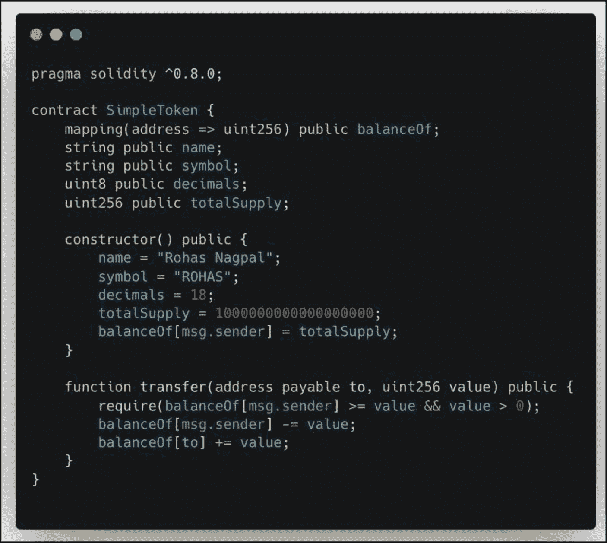
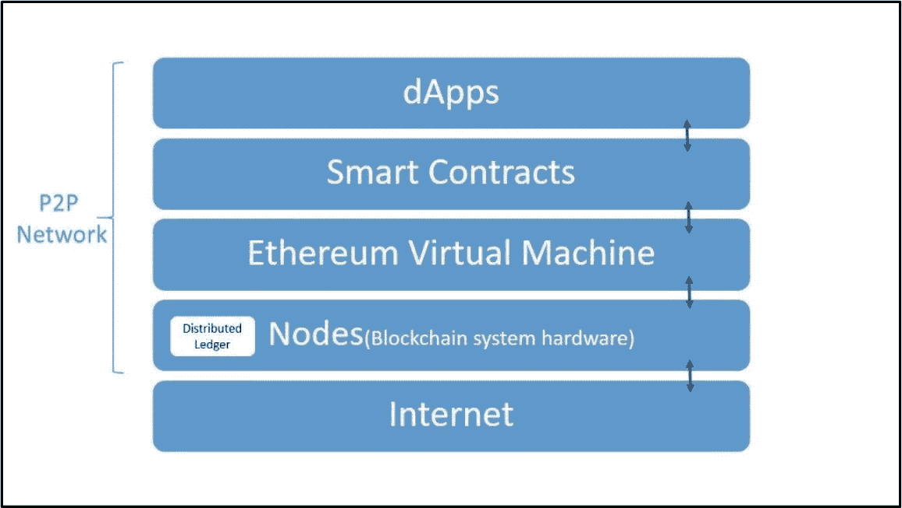

# 12. 项目代码库

本章将从构建核心产品所使用的各种编程语言以及执行开发过程的开发团队的相应表现两个方面，讨论和评估项目代码库。项目*代码库*是软件项目的完整源代码文件集合，包括构建、执行和维护应用程序所需的一切。在区块链领域，项目的代码库通常托管在像 GitHub 这样的平台上，这是一个关键要素，有助于开发团队和公众协作，从而最大化项目的质量和整体潜力。

分析项目代码库是投资者应该认真对待的关键基础要素。它能深入了解团队在核心产品开发方面的表现。通过分析代码安全性、提交频率、使用的编程语言、源代码类型、审计以及其他因素，来评估项目团队在与项目代码相关的活动、效率和表现。到本章结束时，投资者将掌握快速评估项目代码库质量的知识和技能，这反映了团队的表现和承诺。

**本章讨论的基础知识：**

- 编程语言介绍
- 智能合约
- GitHub
- 开源与闭源软件
- 编程语言
- Git 提交
- Git 贡献者
- Git Issues
- 代码安全审计
- Bug 赏金
- 源代码

## 编程语言介绍

编程语言是程序员用来向计算机或机器传达指令以执行任务的正式语言。每种编程语言都有其自身的语法、句法和规则，常见的例子包括 Java、Solidity、Python、C++、JavaScript、Ruby、PHP 和 Swift。程序员（开发者）利用编程语言来构建软件应用程序、网站、移动应用和其他数字产品。编程语言的选择通常取决于软件和产品需求、程序员的专业知识和可用资源。

事实

使用代码构建的软件程序只是一组指令，告诉计算机如何以及何时执行特定任务。

在区块链领域，不同的编程语言用于开发去中心化应用程序（dApps）的前端和后端以及底层区块链基础设施。进一步细分，这些语言构建了与区块链相关的基本要素，包括分布式账本、共识机制、智能合约和网络节点。此外，编程语言定义了这些组件的规则、行为、交互和操作。例如，以太坊是最流行的区块链平台之一，它使用 Solidity（图 12-1），一种高级编程语言，来编写智能合约。

图 12-1

一个简单代币的 Solidity 代码（致谢：[`blockchainblog.substack.com/p/how-to-write-compile-and-deploy-a`](https://blockchainblog.substack.com/p/how-to-write-compile-and-deploy-a)）

除了扎实掌握各种编程语言及其应用的知识外，深入了解区块链技术对于为项目选择最合适的语言至关重要。在一个典型的加密项目中，开发者会使用多种编程语言，每种语言都是根据其应用场景、优势和劣势来选择的。

图 12-2 展示了 Uniswap，一个主要使用 Solidity 编程语言构建的去中心化交易所（DEX）应用程序。

图 12-2

Uniswap 去中心化交易所（DEX）应用程序（致谢：[`app.uniswap.org/#/swap`](https://app.uniswap.org/%2523/swap)）

## 智能合约

智能合约，或称自动执行合约，是存储在区块链上的数字合约，旨在当两方或多方之间预先确定的协议的条款和条件得到满足时自动执行。它们非常可靠，运行在区块链网络上，并以其无需银行、律师和其他第三方等中介机构即可自行执行合约的能力而著称。智能合约标准定义了智能合约如何运行、交互以及利用底层区块链的规则。智能合约应用的一个例子是自动化买方和卖方之间的支付流程，当买方收到商品或服务时，资金会自动释放给卖方。如前所述，智能合约是用各种编程语言编写的。Solidity 是 EVM 兼容链（例如，以太坊、BNB 智能链、Polygon、Avalanche、Fantom、Arbitrum 和 Optimism）上的主要智能合约语言。其他网络可能使用不同的语言，但 Solidity 在这些生态系统中仍然得到广泛支持。

事实

智能合约是一种计算机协议，可以在区块链上以数字方式促进、验证和执行两方或多方之间的合约。

### 智能合约的优势

智能合约通常部署在区块链上并由其保护，具有独特的特性和优势。具体如下：

- **自动执行** – 智能合约相对于传统合约的显著优势在于其自动执行性。智能合约预先用协议条款进行了编程（编码）。一旦这些预设条件被触发，就会发生一个事件，例如数字资产的转移。

- **防篡改/不可变性** – 包括所有协议条款在内的整个智能合约都在区块链上编码并执行，公共无许可区块链的不可变特性确保一旦智能合约的代码被记录和验证，它就变得防篡改。

- **无需可信权威机构** – 与传统合约不同，智能合约不需要法律团队或中央机构作为相关方之间的中间人。

- **匿名性和去信任化** – 智能合约参与者可以保持完全匿名，并且无需相互信任即可进行交易。

- **透明性** – 所有智能合约交易都记录在公共区块链上，可见且可追溯，无需任何可信方。

事实

比特币交易是简单的智能合约：每个输出都在脚本条件下锁定代币（例如，有效签名、时间锁或多重签名）。这些有限的、非图灵完备的合约，为从以太坊开始出现的更具表现力、完全可编程的智能合约平台铺平了道路。

### 以太坊虚拟机（EVM）

以太坊是首个先进的智能合约开发平台。自 2015 年 7 月上线以来，它一直是开发者和投资者中最受欢迎的平台。它允许用户完全自定义智能合约，从而创建各种去中心化应用（`dApps`），其中包括去中心化交易所、众筹平台、游戏、非同质化代币（`NFTs`）、博彩以及去中心化金融（`DeFi`）应用。

图 12-3

以太坊虚拟机（`EVM`）（图片致谢 [`github.com/LearnWeb3DAO/Sophomore-Track/blob/main/Ethereum-Virtual-Machine.md`](https://github.com/LearnWeb3DAO/Sophomore-Track/blob/main/Ethereum-Virtual-Machine.md)）

以太坊通过其图灵完备的虚拟机——称为*以太坊虚拟机*（`EVM`）——实现了这一可能。`EVM`是一个虚拟且去中心化的运行时环境，智能合约在其中执行。可以将`EVM`视为以太坊的计算引擎，它负责执行智能合约并部署`dApps`。用`Solidity`编写的智能合约会被转换（或编译）成`EVM`能够理解的字节码。一份`EVM`的副本运行在网络中的每个完整节点上。

## GitHub

**评估目标：探索并熟悉 GitHub 代码仓库与协作平台。**

[GitHub](https://github.com/) 是一项基于云的软件服务，帮助程序员和项目团队托管、协作、存储、管理及控制他们的代码仓库。它允许全球各地的开发者同时在单个或多个项目上进行协作，贡献代码、想法和反馈，以帮助开发和改进项目。可以将 GitHub 想象成面向开发者的互动式 Google Sheets。

在 GitHub 上，开发团队可以授予成员、协作者以及公众不同的访问级别，以编辑和贡献代码。根据访问级别，每个用户被授予访问不同数量和敏感程度的信息及数据的权限。大多数加密项目都是开源的，这通常允许完整查看项目代码以及区块链或`dApp`的整体代码开发进度。此外，开源还允许公众拥有一系列权限，例如查看项目代码、发起拉取请求、提交代码问题以及查看最新的代码提交——这对投资者来说非常重要！

图 12-4

面向开发者的 GitHub 桌面界面（致谢 [`github.com/apps/desktop`](https://github.com/apps/desktop)）

GitHub 另一个强大的功能是它支持*开源*和*闭源*项目。开发者可以为开源或闭源项目创建公共和私有的代码仓库。这使得开发团队可以让公众查看、互动并参与项目代码，或者在涉及私有、敏感或专利材料（例如传统金融银行实体）时将其设为私有。

### 为什么 GitHub 对投资者很重要？

像 GitHub 这样的软件服务为投资者提供了对核心产品开发的深入了解，包括项目活动、绩效和超越能力。这之所以重要，是因为投资者可以真正感受到团队对项目的投入程度。例如，一个代码提交（上传）频繁且遇到的问题数量少的代码仓库，表明团队工作勤奋，并正在为实现目标和按时完成任务做出切实的努力。

GitHub 的另一个核心优势在于其透明度和责任性。软件的开放性使公众、社区和潜在投资者能够仔细审查项目的代码库，发现任何漏洞或安全问题。快速解决未解决的错误和漏洞是另一个明确而积极的信号。GitHub 还具备允许社区参与代码审查的功能，社区成员可以提交他们的发现，包括改进建议和错误修复。相反，维护关闭或不活跃仓库的项目会亮起警示红旗，因为这些项目可能透明度较低，更糟糕的是，可能已经被遗弃或存在欺诈行为。

### 操作步骤

本书的后续章节需要您对 GitHub 有基本的了解，特别是要能够浏览项目界面，以分析团队在项目代码方面的各种表现和活动。

1.  **熟悉 GitHub 并掌握导航**

    熟悉 [GitHub.com](https://GitHub.com) 的界面和导航菜单。[YouTube.com](https://YouTube.com) 上有多个视频可以帮助您了解该应用。例如，请参考以下链接中的示例：[`https://www.youtube.com/watch?v=w3jLJU7DT5E`](https://www.youtube.com/watch%253Fv%253Dw3jLJU7DT5E)

2.  **记笔记并以自己的风格记录发现**

3.  **将发现与基础评估流程的其他部分相结合**

#### 结果评估

无需对结果进行评估。

