# 开源与闭源软件

**评估目标：** 判断加密项目是开源还是闭源，以评估其透明度、问责制水平，以及在代码库访问受限情况下所伴随的风险。

*源代码* 仅仅是人类可读指令（代码）的列表，是用于控制软件应用程序运行的构建模块。区块链领域的每个软件都是由一系列不同的编程语言编写的代码构建而成。这些软件分为两类：*开源软件* 和 *闭源软件*。表 12-1 对比了开源软件与闭源软件的核心差异。

**表 12-1** 开源软件与闭源软件对比

| 方面 | 开源代码 | 闭源代码 |
| --- | --- | --- |
| 定义 | 开源代码是指源代码对公众开放的软件。任何人都可以查看、修改和分发该代码。 | 闭源代码是指源代码保密的软件。只有获得授权的人才能查看、修改和分发该代码。 |
| 安全性 | 由于代码受到社区、普通大众以及付费第三方代码审计公司的审查，安全性较高。 | 完全依赖于内部代码审查和付费第三方代码审计公司的审查。 |
| 社区参与度 | 社区参与度高 | 不对社区开放 |
| 开发者目标与动机 | 由创新、学习、自我实现以及为更广泛社区做贡献所驱动。 | 通常由利润和企业目标所驱动。 |
| 代码改进与高效调试 | 通过社区反馈和协作实现持续改进。 | 改进是内部的，由于审查者较少，速度可能较慢。 |
| 代码可靠性 | 非常可靠，经过社区的广泛测试。 | 可靠性取决于内部测试和资源。 |
| 信任度 | 由于透明度高，社区信任度高。 | 信任度取决于公司的声誉。 |
| 创新速度 | 由于社区和开发者基础多样化，创新速度快。 | 创新直接取决于公司的资源。 |
| 控制权 | 控制权较低，因为社区可以修改代码，常常导致分叉。 | 对项目代码拥有完全控制权。 |
| 合法使用与合规 | 只要遵守开源许可协议（可能要求注明出处和共享修改），个人可以自由复制、修改和使用代码。 | 代码的使用受公司许可条款的限制，通常禁止未经许可的复制或修改。 |

**事实：** “源代码”一词是生成软件所有其他形式的原始来源。

## 开源许可协议

许可协议是软件组件的作者与用户之间的合同，声明了该软件在特定条件下可以在商业应用程序中何处使用、修改或分发。开源许可协议授予其他用户使用代码或将其用于新应用程序、或将其纳入不同项目的权限和权利。如果没有开源许可协议，软件程序就无法使用——即使代码库发布在 `GitHub` 上——因为在大多数司法管辖区，没有明确许可协议的代码自动被视为“保留所有权利”，因此他人没有复制、修改或重新分发的合法权利。开源许可协议有八十多种不同类型，每种都有不同的权限和限制。开源许可协议主要分为两大类：*著佐权（Copyleft）* 和 *宽松（Permissive）* 许可协议。

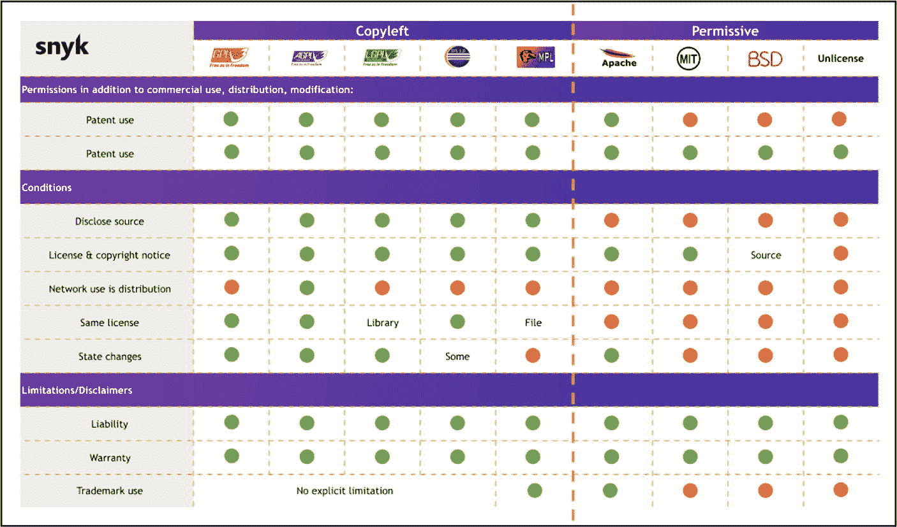

**图 12-5** 开源许可协议——著佐权与宽松（图片致谢：[`snyk.io/learn/open-source-licenses/`](https://snyk.io/learn/open-source-licenses/)）

### 著佐权（Copyleft）许可协议

著佐权许可协议是一种开源许可协议，授予任何人重用、修改和分发知识产权（软件）的权利，前提是所做的任何更改都必须在同一许可协议下共享，并且之后使用该软件的任何人也都享有同样的自由。常见的著佐权许可协议示例如下：

- **GNU 通用公共许可证（`GPL`）** – 要求任何使用了 `GPL` 代码的软件必须将其全部源代码在相同的 `GPL` 许可协议下公开。
- **GNU 宽通用公共许可证（`LGPL`）** – 允许在较大项目中使用小组件，而无需要求整个项目在相同的许可协议下分发。
- **Affero 通用公共许可证（`AGPL`）** – 扩展了 `GPL`，确保通过网络提供的软件也必须以 `GPL` 许可协议发布其源代码。
- **Eclipse 公共许可证（`EPL`）** – 允许将 `EPL` 许可的代码与非 `EPL` 代码结合使用，只要对 `EPL` 代码的修改以 `EPL` 许可协议发布即可。
- **Mozilla 公共许可证（`MPL`）** – 允许在专有软件中使用 `MPL` 许可的代码，前提是这些代码保留在单独的文件中，并包含专利授权和版权声明。

根据法律以及使用开源软件的条款和条件，必须向用户提供并展示许可协议（著佐权或宽松），通常通过包含在分发的软件或文档中来实现。图 12-6 展示了 Moonbeam Networks 在其官方 `GitHub.com` 代码库上可见的开源 GNU 通用公共许可证 v3.0 图像。

**图 12-6** Moonbeam 网络在 GitHub 上官方项目代码库中可见的开源 GNU 通用公共许可证（图片致谢：[`github.com/moonbeam-foundation/moonbeam/blob/master/LICENSE`](https://github.com/moonbeam-foundation/moonbeam/blob/master/LICENSE)）

#### 宽松许可证

宽松许可证是一种开源许可证，允许任何人使用、修改和分发软件，只需满足最低限度的条件——通常只需保留原始版权声明和许可证文本（对于 `Apache 2.0` 协议，还需要保留归因 `NOTICE` 文件）。这意味着该软件及其衍生作品可以整合到专有或闭源产品中，而无需公开源代码或分享修改内容。一些常见的宽松许可证包括：

- **Apache 许可证** – 允许在不同的许可证下进行修改和创作衍生作品，但需包含许可证通知和专利授权。
- **MIT 许可证** – 允许不受限制地使用代码，只要保留原始版权和许可证声明即可，作者不承担任何责任。
- **BSD 许可证** – 与 MIT 类似，允许代码在不同许可证下使用，且无需分发源代码。不过，其限制条件因 `BSD License` 的具体版本而异。
- **Unlicense 许可证** – 将代码置于公共领域，不附加任何条件，允许在任何条款下完全自由地使用和分发。

#### 这对投资者意味着什么？

虽然闭源在隐私方面有一些优点，但这些优势仅对优先控制代码库、追求专有优势以及能够保护敏感信息免受公众审视的组织有利。闭源代码对加密货币领域的投资者几乎没有任何好处。从加密货币投资者的角度来看，透明度至关重要。开源项目提供的透明度使投资者能够评估团队在代码库方面的表现。当投资某个项目时，投资者承担着巨大的财务风险，却对代码库或团队的管理记录一无所知。此外，如表 12-1 所示，开源代码通过开发者社区的审查，能促进社区对核心产品、创新、协作和安全性产生更高程度的信任。基于这些原因，建议数字资产投资者专注于投资本质上是开源的加密货币项目。

### 行动步骤

请按照以下步骤判断一个加密货币项目是开源还是闭源，并评估其透明度、问责制以及在代码库访问受限情况下的相关风险。

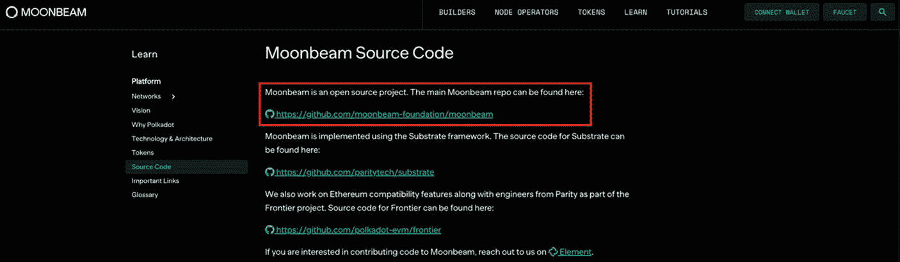

**图 12-7**  
项目白皮书中概述的 Moonbeam 开源代码（图片来源：[`docs.moonbeam.network/learn/platform/code/`](https://docs.moonbeam.network/learn/platform/code/)）

1.  **项目代码仓库**  
    找到项目代码仓库的官方链接。
    1.  访问项目官方网站，搜索指向 `GitHub` 上代码库的链接。
    2.  在少数情况下，有些项目可能使用 `GitLab` 或 `Bitbucket` 代替 `GitHub`。

2.  **寻找开源许可证**  
    在找到项目位于 `GitHub`（或其他平台）的代码库后，检查该项目是否拥有开源许可证。许可证通常位于项目代码仓库中，例如 Moonbeam 网络的情况，如图 12-6 所示。
    1.  开源许可证文件通常命名为 `LICENSE`。如果文件不明显，请务必使用关键词进行快速搜索。
    2.  找到许可证后，点击该文件会打开另一个页面，其中会显示许可证类型。
    3.  访问 [`https://choosealicense.com/appendix/`](https://choosealicense.com/appendix/)，检查该许可证是否被列出，以验证并确认它确实是开源许可证。注意——加密货币领域使用的大多数开源许可证通常是第 2.4.1 节“开源许可证”中提到的那些。  
    如果找不到许可证，该项目很可能是闭源的。如果出现这种情况，请联系项目团队，要求其提供引用 URL 作为支持证据来澄清。如果一个仓库声称是开源的，但不存在许可证文件，则从法律上讲，代码的所有权利均保留——请将此视为一个严重的危险信号，并要求团队提供合适的开源许可证。

3.  **项目白皮书**  
    项目白皮书是技术信息的绝佳来源，通常会定义项目是开源还是闭源。继续以 Moonbeam 网络为例，如图 12-7 所示，其中明确指出该项目是开源的，并提供了指向其在 `GitHub` 上代码库的链接，而开源许可证文件即位于该代码库中——如步骤 2 所述。

4.  **记录笔记，并用你自己的方式记录发现**

5.  **将发现与其他基本面评估流程的章节结合**

#### 评估结果

开放源代码的区块链和 Web3 去中心化应用程序备受推崇。闭源项目由于缺乏透明度和项目团队的问责制，被认为是高风险投资——除非遇到非常特殊的情况，否则应避免投资。

## 编程语言

**评估目标：确认项目是否使用了多种知名的编程语言，这些语言需具备特定优势，以满足产品或服务的特定需求。**

本节介绍区块链行业中用于构建区块链、去中心化应用程序及相关软件的热门编程语言。虽然数字资产投资者不需要具备“开发者”级别的知识，但确认使用的是否是知名的流行编程语言至关重要，因为这将有助于减轻未来与核心产品或服务相关的不可预见风险。此外，开发者团队使用多种编程语言也很重要，这些语言需具备能够满足正在开发的特定软件或应用程序需求的优势。例如，虽然 `Solidity` 主要用于编写智能合约，但其特性和优势无法与用于数据分析和机器学习任务的 `Python` 等语言相提并论。每种编程语言都有其独特的优势和劣势，具体取决于需求——无论是针对视觉效果、速度、安全性还是易用性。

表 12-2 展示了区块链开发中最流行的编程语言。

**表 12-2**  
区块链开发中常用的编程语言

| 主流区块链编程语言 |
| --- |
| 语言 | 采用状态 | 类型 | 描述 | 典型区块链用例 |
| --- | --- | --- | --- | --- |
| `Solidity` | 主流 | 智能合约（EVM = 以太坊虚拟机） | 专为区块内程序设计的语言（语法有点类似 JavaScript）。 | 创建代币和链上资产；运行投票或金库规则；自动化 DeFi 操作 |
| `C++` | 主流 | 通用（系统级） | 一种非常快速的编译型语言，允许程序员直接管理计算机内存。 | 构建完整的区块链节点；编写共识算法；编写加密库 |
| `Python` | 主流 | 通用（脚本型） | 易读的脚本语言，拥有庞大的库支持，非常适合快速开发任务。 | 自动化链上交互；分析区块链数据；原型设计智能合约逻辑 |
| `Java` | 主流 | 通用（JVM = Java 虚拟机） | 面向对象语言，在 Windows、macOS 和 Linux 上运行一致。 | 与链通信的企业中间件；基于 JVM 的节点软件；合约集成工具 |
| `Rust` | 主流 | 通用（系统级） | 现代系统级语言：拥有 C 级别的速度以及内置的内存安全性。 | 高性能运行时；Web Assembly (WASM) 智能合约；安全的加密代码 |
| `JavaScript` | 主流 | 通用（脚本型） | 网络语言；运行于每个浏览器以及通过 Node.js 运行在服务器上。 | 构建去中心化应用 (dApp) 前端；创建客户端库；编写轻量级后端服务 |
| `Go (Golang)` | 主流 | 通用（系统级） | 谷歌开发的编译型语言，语法简洁，并发处理简单。 | 独立的节点软件；私有账本的链码；可扩展的后端工具 |
| `C#` | 主流（细分领域） | 通用（.NET） | 微软的 .NET 语言——强类型和自动垃圾回收。 | 基于 .NET 的跨平台节点；合约的企业级 API；桌面钱包或工具 |
| `Erlang` | 主流（细分领域） | 通用（函数式） | 为处理海量并发任务而构建的函数式语言，以其“永不崩溃”的特性著称。 | 始终在线的节点后端；点对点实时消息传递；容错模块 |
| `TypeScript` | 主流 | 通用（脚本型） | JavaScript 加上静态类型——可在代码运行前捕获许多错误。 | 类型安全的 DApp 用户界面；合约测试套件；开发者工具 |
| `Ruby` | 主流（区块链中占次要地位） | 通用（脚本型） | 可读性极强的脚本语言，拥有丰富的“gem”包系统。 | 快速区块链原型设计；小型 Web 服务；命令行工具 |
| `SQL` | 主流 | 领域特定（查询） | 用于查询关系型数据库的声明式语言。 | 查询链下区块链数据；构建分析仪表板；ETL（提取-转换-加载）流水线 |
| `Vyper` | 实验性 | 智能合约（EVM） | 类 Python 的合约语言，去除复杂特性以利于审计。 | 安全性关键的合约；减少隐藏错误；简化正式审查流程 |
| `Rholang` | 实验性 | 智能合约（并发） | 基于进程演算的语言；擅长并行、消息传递逻辑。 | 同时运行多项任务的合约；安全的链上协调；对复杂工作流建模 |
| `OCaml` | 实验性 | 通用（函数式） | 快速的函数式语言，拥有强大的静态类型系统。 | 证明协议正确性；研究级节点代码；形式化验证的合约 |
| `Scilla` | 实验性 | 智能合约（安全导向） | 强制采用清晰的状态机结构以避免常见陷阱的合约语言。 | 更安全的合约开发；状态变更的形式化分析；防止重入漏洞 |
| `Simplicity` | 实验性 | 智能合约（正式 DSL = 领域特定语言） | 极简的、非图灵完备的语言，其程序可被证明是正确的。 | 成本可预测的合约；行为数学证明；高级支付条件 |
| `Michelson` | 实验性（行业内） | 智能合约（基于栈） | 具有严格类型的栈式机器语言，支持形式化证明。 | 资源可预测的链上逻辑；经数学验证的合约；可升级的治理代码 |
| `Haskell` | 实验性（使用增长中） | 通用（函数式） | 纯函数式语言，拥有强大的类型系统和惰性求值特性。 | 高保证区块链协议；创建合约领域特定语言；验证复杂算法 |

### 投资者对编程语言的分析

建议投资者执行以下编程语言检查，以确认项目是否正在利用多种、知名且流行的、具有特定优势的语言来构建其核心产品或服务。

#### 评估非寻常编码语言

表 12-2 列出了区块链开发中最流行的编程语言。然而，投资者偶尔可能会遇到使用该表中未提及语言的项目。这背后有多种潜在原因，例如该语言可能处于起步阶段、质量不高、在区块链开发中很少使用，或者用于某个在区块链世界中罕见或新颖的细微差别用例或特性。该项目的风险水平和严重程度取决于几个因素。例如，如果该语言仅用于代码库的 1%，通常不会引起警觉。但是，如果遇到的特定语言占项目代码的很大比例，则需要更多研究来确定该语言是否对项目构成威胁。这项研究将涉及检查该语言是否已在其他加密项目中使用，以及这些项目是否成功且没有攻击或崩溃的历史。

图 12-8 是 [Moonbeam Networks](https://moonbeam.network/) 代码库的截图，显示了图像右下角所使用的编程语言。编程语言，包括 `TypeScript`、`Rust` 和 `Solidity`——所有这些都专门用于高性能和高安全性的区块链开发、dApp 和智能合约——合计占代码的 99.6%，只有 0.3% 是用 [Shell](https://www.geeksforgeeks.org/introduction-linux-shell-shell-scripting/%2523what-is-shell) 编程语言编写的。`Shell` 语言仅仅用于自动化任务、与操作系统交互，以及处理构建、配置和部署工作流。剩余的 0.1% 显示为 `Dockerfile`，这是开发人员用来创建 `Docker 镜像` 的工具，`Docker 镜像` 是软件的打包版本，确保它在计算机系统、服务器或云平台等不同环境中一致地运行。虽然 `Dockerfile` 主要是一种开发工具，但它的存在可能标志着可复现的构建流程和团队的成熟度——这些因素可能对技术导向的投资者有影响。

图 12-8

Moonbeam Network 编程语言（图片来源：[`github.com/moonbeam-foundation/moonbeam`](https://github.com/moonbeam-foundation/moonbeam)）

### 编程语言多样性

如前所述，开发团队在创建区块链项目或 dApp 时会使用多种编程语言，每种语言都因其与软件或应用相关的特定优势而被选中。作为投资者，验证代码库包含多种语言非常重要，同时也要确保产品正在使用合适的工具进行开发。这也有助于识别潜在的骗局，例如开发者可能仅用一两种语言向项目中注入大量代码，以制造合法产品的假象。

如图 12-8 所示，Moonbeam Network 总共使用了四种编程语言。相比之下，每个网络主要客户端仓库的 GitHub 语言统计数据显示，以太坊、Cosmos 和比特币分别约有五种、五种和六种主流语言。这表明每个项目通常使用四到六种主流编程语言，被视为典型范围。请注意，较小的项目（主要是 dApp）平均可能只使用两到三种编程语言。然而，如果项目仅使用一种编程语言，则需极度谨慎。建议联系项目团队和社区以澄清疑问，更重要的是，与同一领域的成功竞争对手进行比较。

> **警告**
> 
> 该基础指标仅适用于开源项目。如果项目是闭源的，则无法进行分析，除非开发团队授予你 GitHub 访问权限。

### 行动步骤

按照以下步骤确定项目的代码库是否包含可信且多样的编程语言，以满足核心产品或服务的特定需求和功能要求。

1.  **确定所使用的编程语言**
    1.  找到项目 GitHub 或相应代码库软件的链接（通常位于项目网站的页脚）。
    2.  在 GitHub 的“Languages”部分查看项目的编程语言。

2.  **编程语言与用例的契合度**
    1.  审查项目所使用的语言，确认它们是否与项目或服务的应用特性相匹配。例如，对于区块链基础设施 Moonbeam Network，用于区块链开发的编程语言 Rust 和 TypeScript 被广泛使用，占据了项目代码库的 96.2%。这些语言非常适合 Moonbeam 的区块链服务。

3.  **评估非常见编程语言**
    1.  如果你遇到一种编程语言在项目中占很大比例，且未在表 12-2 中讨论，请对其进行研究，并考虑根据以下标准进行评估。
        1.  为什么使用这种语言而不是传统的既定编程语言？
        2.  这种编程语言发布多久了？
        3.  这种编程语言是否已在其他加密货币或 Web3 项目中使用？如果是，这些项目在性能、可扩展性和速度方面是否成功？是否曾因漏洞或缺陷导致成功攻击？
        4.  如果该语言尚未在区块链领域使用，请确定它是否用于构建中心化系统。如果是，开发者社区的总体反馈如何？

4.  **编程语言数量**
    1.  审查项目团队使用的编程语言数量。虽然区块链网络可能使用四到六种语言，但 dApp 可能只使用两到三种编程语言。
    2.  如果项目仅使用一种编程语言，请谨慎行事。联系团队和社区以澄清疑问，并与同一领域的成功竞争对手进行比较。

5.  **以你自己的风格记录并记录你的发现**

6.  **将这些发现与基础评估流程的其他部分相结合**

#### 评估结果

假设项目所使用的编程语言是基于应用需求选择的，并且在区块链领域享有良好声誉且经过验证，那么这被认为是一个积极信号。如果不是，建议在通过充分研究消除任何疑虑或担忧之前不要投资。

## GitHub 贡献者

**评估目标：** 确定开源贡献者的数量，确保开发团队保持活跃，并确认背景中正在取得持续进展。

在 GitHub 上，贡献者是指通过提交代码、文档或其他技术资源为一个或多个仓库做出开源项目贡献的人。在 GitHub 上，贡献者是其提交（通常通过拉取请求）已合并到仓库中的任何人，无论他们当前是否拥有协作者（读写）权限。根据开源项目的规模和流行程度，贡献者人数可能从几个到几百个不等，他们持续为核心产品增加价值。贡献的类型因人而异，但通常与代码开发、底层基础设施、治理、用户体验、新创新、安全审计、测试与质量、文档以及研究相关。此外，全球贡献者的增加会提高项目的知名度和可信度，从而带来更强大的社区、降低开发成本以及主流采用。

开源贡献对于区块链项目的开发、长期成功和可持续性至关重要。贡献来自全球拥有不同视角、优势和技能集的开发者。这种全球协作有助于加速产品或服务的增长和质量。此外，由于贡献者众多，项目会经历严格的审查、过滤以及已发现的错误和代码漏洞的修复。

图 12-9 展示了 Moonbeam Networks 的官方 GitHub；贡献者数量——右下角的 58——仅包括其提交已合并到仓库默认分支（`main`）的开发者，因此 Moonbeam 的其他仓库可能列出更多贡献者。

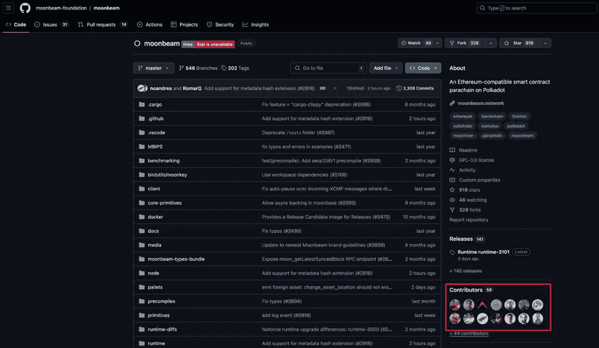

图 12-9

Moonbeam Network——贡献者（图片源自 `https://github.com/moonbeam-foundation/moonbeam`）

### 行动步骤

请按照以下步骤来确定开源贡献者的数量，确保开发团队保持活跃，并确认项目在后端持续取得进展。

1. **项目代码仓库**
   找到项目代码仓库的官方链接。
   1. 访问项目官方网站，并在`GitHub`上搜索代码库的链接。
      1. 有些项目可能使用 [GitLab](https://about.gitlab.com/) 或 [Bitbucket](https://bitbucket.org/product/) 而非`GitHub`。

2. ***贡献者*** 数量
   1. 在主代码仓库页面，导航至右下角查看贡献者数量。
   2. 记录下项目贡献者的人数。

3. **以你自己的风格做笔记并记录调查结果**
4. **将调查结果与基础评估流程的其他部分相结合**

#### 评估结果

看到大量活跃的开源贡献者为一个项目增添价值，这是值得赞赏的。然而，贡献者数量会因项目而异，这取决于项目启动时的规模（小型、中型或大型）、知名度、使用场景以及许多其他变量。为了获得更好的比较标准，建议将贡献者数量与成功的竞争对手进行对比，以确认在指定时间段内提交次数保持稳定或有所增加。

### Git 提交记录

***评估目标：*** *通过分析`GitHub`上贡献者的代码提交次数，确定开发者的活跃度、生产力以及对该项目的长期兴趣。*

本部分旨在验证项目团队是否正在持续推进核心产品或服务的构建、更新和增强。许多项目团队声称通过社交媒体或其他渠道在幕后取得了进展，但这可能是一种虚假印象。虽然并非每个团队都是骗局，但一些项目缺乏透明度，并因多种不同原因（如项目被放弃、缺乏资金，甚至从一开始就是骗局）而处于半停滞或完全停滞状态。投资者有责任验证团队的声明是否准确，或者是否存在导致进展停滞的潜在问题。

验证项目在核心产品或服务方面进展情况的一个有效方法，是分析`GitHub`上每月的*提交*次数。“提交”是`Git`中的一个基本概念，代表项目在特定时间点的`快照`。这意味着每次提交都记录了当时每个文件的精确状态——`Git`会在底层重用未更改的文件 blob 以避免重复。例如，当开发者修改、重命名、删除或向项目源代码添加内容时，开发者可以提交一个提交——其中包含简要说明更改信息的消息——这会更新所有项目文件，从而提供整个项目的新`快照`。此操作会被记录为项目`GitHub`仓库中的一次提交。任何更改都可以与之前的（父级）提交进行比较。

通过分析这些提交，投资者可以判断一个项目是否仍在积极开发中，即使其进展从外部角度无法立即看出。此外，处于早期阶段的项目往往比五年前启动的项目更活跃，提交次数也更高。无论如何，对于一个项目，要确保长期成功和持久发展，持续进行包含新功能和创新的“提交”被认为是至关重要的。

#### 可取的月度提交贡献量

每月提交多少次是合适的，并没有绝对的标准。这取决于项目生命周期阶段和知名度等变量。一个流行的开源无许可区块链项目，其月度提交次数会显著高于另一个知名度较低但基础同样扎实的项目。作为参考指标，从 2023 年 9 月到 2024 年 9 月，`bitcoin`主仓库主分支的平均月度提交次数约为 257 次，`Chainlink`约为 224 次，`Moonbeam Network`约为 24 次——参见图 12-10。从投资者的角度来看，如果月度提交次数超过约 15 次，则表明团队和社区仍在后台持续推进。

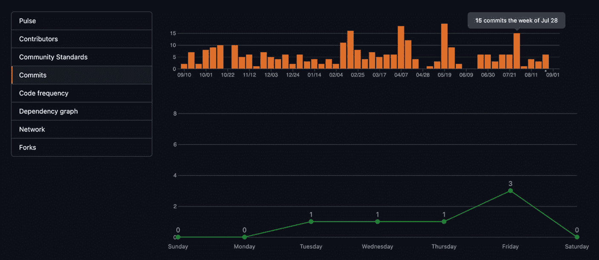

图 12-10

`Moonbeam Network` 代码提交（数据来源：[`github.com/moonbeam-foundation/moonbeam/graphs/commit-activity`](https://github.com/moonbeam-foundation/moonbeam/graphs/commit-activity)）

同时建议投资者通过检查主仓库的平均提交次数是增加、减少还是持平，来评估开发者对该项目的兴趣程度——需要记住的是，提交数量会随着项目的路线图和计划里程碑而波动。可以通过进入项目的代码仓库，导航至“贡献者”来实现这一点——如图 12-9 所示——这会将你引导至“贡献者”页面，以`Moonbeam Network`为例，如图 12-11 所示。页面顶部显示了`Moonbeam`的日期范围（从 2020 年 2 月到 2024 年 12 月），代表了从项目启动到当前日期的提交次数。`Moonbeam`的图表显示，这些年来提交次数保持稳定，这是项目持续获得关注的积极信号。

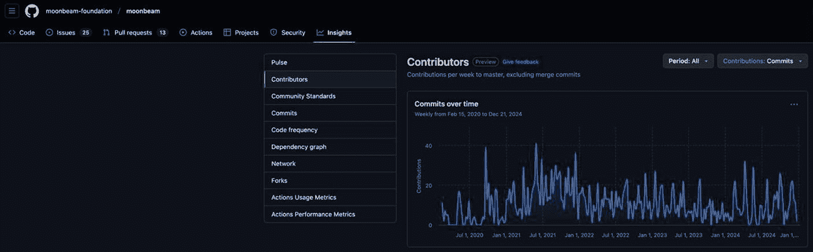

图 12-11

`Moonbeam Network` 的贡献者（数据来源：[`github.com/PureStake/moonbeam/graphs/contributors`](https://github.com/PureStake/moonbeam/graphs/contributors)）

### 行动步骤

按照以下步骤，通过分析 GitHub 上贡献者的代码提交次数，来确定开发者活跃度、生产力以及对该项目的长期兴趣程度。

1.  **项目代码仓库**
    找到项目代码仓库的官方链接。
    - 访问项目官方网站，查找 GitHub 上代码库的链接。
    - 有些项目可能使用 [GitLab](https://about.gitlab.com/) 或 [Bitbucket](https://bitbucket.org/product/) 而非 GitHub。

2.  **分析 GitHub 中的“提交”**
    - 定位提交记录 – 在 GitHub 项目的首页，导航到“Insights” ➤ “Commits”（参考图 12-10）。
    - 统计提交次数 – 图表顶部的橙色条代表当年每周的提交次数（图 12-10）。
        - 点击每一周（橙色条）可查看该周内每天的提交次数。
        - 要计算月均提交次数，可统计全年每周的提交次数总和，然后除以十二。

3.  **评估贡献者“提交”图表**
    检查自项目启动以来，平均提交次数是增加、减少还是保持不变。
    - 在 GitHub 项目的首页，导航到右下角查看贡献者人数。
    - 点击“Contributors”进入贡献者页面。
    - 查看时间段，以了解开源开发者社区为该项目贡献了多长时间。
    - 审查贡献者/提交图表，判断自项目启动以来，贡献者的提交次数是增加、保持不变还是逐渐减少。请注意，“Y”轴代表提交次数，“X”轴代表时间。

4.  **用自己的风格做笔记并记录发现**

5.  **将发现与基础评估流程的其他部分相结合**

#### 评估结果

看到过去一个月平均有十五次提交是令人欣慰的。较少的提交次数，尤其是少于十次，可能会引发对幕后工作的质疑。当提交次数少于五次时，这应该被视为一个危险信号。

从长远来看，几年内的提交次数最好呈增加趋势，或至少保持稳定，因为这表明开发者社区对这个项目充满热情。如果这个指标逐渐减少，也并非一个绝对的硬性障碍。然而，这肯定是有原因的——在获得更清晰的图景之前，请保持谨慎。

## Git Issues

**评估目标：通过评估项目在 GitHub 上已开启和已关闭的 Issues，来判断开发进度、团队响应速度和项目的整体健康状况。**

在 GitHub 上，每个项目都有一个名为“Issues”的仓库，所有关于 bug、功能请求、任务、改进、设计创新、文档和问题的已开启和已关闭的 Issues 都会被记录在这里。大多数这些 Issues 都以某种方式或形式与项目代码相关。任何有权访问此仓库的人，即贡献者、项目维护者，甚至是遇到 bug 或有功能请求的用户，都可以创建 Issues 来报告问题、提出改进建议或提出问题。

开源项目通常允许任何拥有 GitHub 账户的人创建并提交新的 Issue。Issue 生成后，会根据所需的技能集和重要性级别进行审查、分类、管理并分配给贡献者。图 12-12 显示了 Moonbeam Network 的 Git Issue 仓库截图。在撰写本书时，Moonbeam 共有 435 个由开源社区和项目团队提交的 Issues——其中 410 个已关闭（有些标记为已解决，有些作为重复问题或“不予修复”而关闭），只有 25 个仍处于开放状态。这被认为是极好的情况，因为只有 5.75%（25/435）的 Issues 处于开放状态，而 94.25%（410/435）已被解决。

此外，通过查看已关闭的 Issues（图 12-13），投资者可以通过查看最近一次 Issues 被解决的日期来判断团队和社区是否最近取得了进展。以 Moonbeam Network 为例，在撰写本书时，多个 Issues 在过去两周内得到了解决。

如果一个项目有很高比例的问题处于开放且未解决的状态，这可能预示着代码质量差、资源有限或社区支持薄弱——但高使用率的项目也会积累大量 Issues，仅仅是因为有更多用户提交了它们，因此在判断整体健康状况之前，必须考虑上下文和活跃程度。

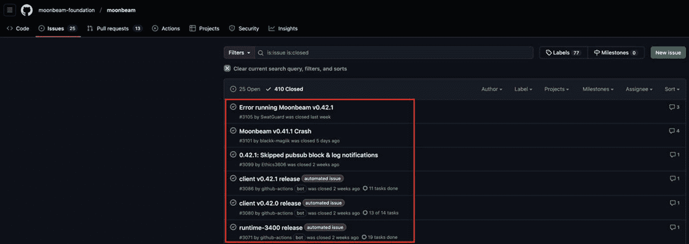

图 12-13 – Moonbeam Network——已关闭的问题（图片来源：[`github.com/moonbeam-foundation/moonbeam/issues?q=is%3Aissue+is%3Aclosed`](https://github.com/moonbeam-foundation/moonbeam/issues%253Fq%253Dis%253Aissue%252Bis%253Aclosed)）

图 12-12 – Moonbeam Network——未处理的开放问题（图片来源：[`github.com/moonbeam-foundation/moonbeam/issues`](https://github.com/moonbeam-foundation/moonbeam/issues)）

评估一个项目在 GitHub 上的已开启和已关闭 Issues 是一项有价值的必要工作，因为它可以揭示与开发、响应速度、用户体验以及所涉及的潜在风险相关的性能指标。这些性能指标如下：

- **开发进度** – 检查开放与关闭问题的比例以及最近解决问题的时间，能让投资者对开发团队的进展有一个不错的了解。
- **团队响应速度** – 打开并查看几个 Issues，阅读团队与贡献者之间的对话，包括回复的日期，能很好地反映团队的响应速度。
- **风险与回报** – 通过分析几个 Issues 中的问题和反馈，投资者可以更好地判断风险是否大于预期回报，或者反之。
- **用户体验** – 通过评估几个开放和关闭的 Issues，从潜在的投诉、问题、负面反馈和整体不满情绪角度，投资者可以了解用户和社区的使用体验如何。

### 操作步骤

请按照以下步骤评估 GitHub 上项目的开放与关闭议题 (Issues)，以判断其开发进度、团队响应速度及整体项目健康状况。

1.  **项目代码仓库**
    找到项目代码仓库的官方链接。
    1.  访问项目官方网站，寻找指向 GitHub 代码库的链接。
        1.  某些项目可能使用 [GitLab](https://about.gitlab.com/) 或 [Bitbucket](https://bitbucket.org/product/) 替代 GitHub。

2.  **议题 (Issues) 仓库**
    1.  在页面顶部搜索并打开“议题 (Issues)”仓库。
        1.  若未显示“议题 (Issues)”选项卡，表示仓库所有者已禁用议题功能。若选项卡可见但未列出任何议题，这可能意味着尚未创建任何议题，或所有者已限制仅对特定群组可见（这种情况较为罕见）。

3.  **评估开放与关闭的议题**
    依据本节所述标准，对开放和关闭的议题进行评估。
    1.  开发进度
    2.  团队响应速度
    3.  风险与回报
    4.  用户体验

4.  **记录笔记，并以你自己的风格记录发现**

5.  **将发现结果与基础评估流程的其他部分相结合**

#### 评估结果

相比于关闭的议题，开放议题占比较低是令人赞赏的——在成熟项目中，理想情况下应将开放议题比例控制在约 20% 以下（新项目在早期积压任务清除前，比例可能会更高）。然而，如果团队持续未能解决议题，这应被视为一个早期预警信号。这种情况通常会导致未解决的开放议题积压日益严重，从而对用户体验产生负面影响。相反，如果团队能够响应贡献者、开放与关闭议题的比例较低，并且近期内关闭了各类议题，这便是一个积极信号。

### 代码安全审计

**评估目标：** 确定项目是否已进行代码安全审计，以确保其代码库安全、漏洞已修复，并能提供充分的防护以抵御攻击。

在区块链领域，代码安全审计是对项目代码库的全面分析，旨在识别潜在的缺陷、漏洞、弱点或可能的攻击路径。此项安全检查涵盖项目的代码库，包括智能合约、协议、共识机制、去中心化应用 (dApps)、第三方服务等。审计的最终目标是确保项目的代码库安全、健壮、高效，并且不包含任何可能企图利用系统漏洞的恶意缺陷。

> **注意**
> 至关重要的是，每个项目的整个代码库——包括智能合约、协议逻辑及配套库——都必须由专业认可的审计公司进行审计。

### 为什么要进行代码安全审计？

虽然去中心化和强大的共识机制有助于防御攻击，但没有任何区块链或 dApp 能提供百分之百免于被攻击的保护。许多项目遭受攻击的频率可能超乎想象。例如，近年来已发生数十起攻击事件，涉及项目包括 [Ronin Network](https://roninchain.com/)（被盗 6.25 亿美元）、[Poly Network](https://www.poly.network/%2523/)（6.11 亿美元）、[Penpie](https://www.pendle.magpiexyz.io/stake)（2700 万美元）、[Binance BNB Bridge](https://www.bnbchain.org/en/bnb-chain-bridge)（5.69 亿美元）、[Bitmart](https://www.bitmart.com/en-US)（1.96 亿美元）、[Multichain](https://www.multichain.com/)（1.25 亿美元）和 [Coincheck](https://coincheck.com/)（5.32 亿美元）。因此，无论规模大小，每个项目都必须进行严格的代码安全审计。若未能执行此操作，往往会给项目团队和投资者带来灾难性的财务损失。

> **专家提示**
> 若要了解某个项目是否曾出现过安全问题，可以查阅以下资源：
>
> **Rekt**[`https://rekt.news/`](https://rekt.news/)
>
> **Cointelegraph**[`https://cointelegraph.com/tags/security`](https://cointelegraph.com/tags/security)
>
> **Cryptoslate**[`https://cryptoslate.com/hacks/Substack`](https://cryptoslate.com/hacks/Substack)
>
> **Substack**[`https://substack.com/@blockthreat`](https://substack.com/%2540blockthreat)
>
> **Web3 Is Going Great**[`https://web3isgoinggreat.com`](https://web3isgoinggreat.com)

另一方面，进行代码审计具有诸多益处，包括：降低被利用的风险、优化代码库以提升运行速度和效率、降低维护产品的成本与工作量、提升用户满意度、保护敏感数据以及促进代码一致性。因此，那些聘请专业代码安全公司审查其代码库并采纳其建议的项目，成功遭受攻击的风险要低得多。这种增加的安全层对投资者而言是一项显著优势，因为它减少了可能导致项目声誉和价值受损的安全漏洞可能性。

### 代码安全审计执行

加密项目的代码审计通常由专门从事代码安全的第三方公司执行。目前有数十家区块链代码审计公司，它们大多提供相同的核心服务，但在专业水平和声誉方面各有不同。一些较为知名的区块链代码审计公司包括（但不限于）[Hacken](https://hacken.io/)、[Certik](https://www.certik.com/)、[Quanstamp](https://quantstamp.com/) 和 [Trail of Bits](https://www.trailofbits.com/)。

标准的代码安全审计通常包含以下步骤：

1.  **界定范围** – 确定审计的目标及代码库中需要审计的部分。这可能包括审计各种智能合约、协议、区块链基础设施，或根据客户需求对以上全部或特定部分进行组合审计。
2.  **规划** – 与项目团队共同规划从开始到结束的审计各阶段。
3.  **信息收集** – 收集有关区块链或 dApp、其相应代码库及相关文档的信息，以便全面理解系统。
4.  **代码分析** – 首先运行自动化扫描工具（社区版或商业版）以标记常见问题，然后通过各种工具和技术（包括静态分析、动态分析及手动代码审查）扫描代码库，查找缺陷、漏洞和弱点。
5.  **风险评估** – 根据严重程度和可能性，对已识别的缺陷、漏洞和弱点进行优先级排序。
6.  **报告** – 审计完成后，向项目团队提交一份详细的审计报告。该报告包含所有已识别的缺陷和漏洞、其潜在影响以及消除这些问题的建议。
7.  **修复** – 开发人员与审计人员合作，修复已发现的缺陷、漏洞和弱点。
8.  **重新测试** – 在所有已识别的问题得到纠正后，对代码库进行重新测试（在适用情况下），以确保系统无缺陷。
9.  **审计后支持** – 通常，审计公司会提供持续的指导和支持，以帮助维持高水平的安全性。这可能包括审计后监控，以跟踪已实施修复措施的有效性，并识别任何新的潜在威胁。

### 投资者代码安全审计检查

遗憾的是，一些项目团队在代码安全方面比较松懈，直到遭受攻击、项目声誉受损时，才会认真对待。因此，投资者有责任确保已经进行了代码安全审计，并且至少关键的错误、漏洞和弱点已经得到解决。如果项目团队不处理审计公司发现的问题，这将是一个重大的危险信号，表明项目暴露在风险中，容易受到攻击。

**专业提示**

投资者可以访问 `CoinMarketCap.com`，选择筛选条件 ➤ 添加筛选条件 ➤ 已审计，查看声称已完成代码审计的项目列表以及相应的审计公司；由于此标签为自行申报，务必通过项目已发布的报告或团队来确认审计情况。

**图 12-14** – CoinMarketCap.com 上的 Polygon 网络，显示了由 CertiK 审计公司执行的代码安全审计（图片由 [`coinmarketcap.com/currencies/polygon/`](https://coinmarketcap.com/currencies/polygon/) 提供）

`CertiK` 是一家领先的代码安全公司，提供一套全面的工具来监控并帮助保护区块链领域，包括投资者。图 12-15 和图 12-16 展示了 [Polygon (MATIC)](https://polygon.technology/) 的代码安全审计报告摘要。根据由 `CertiK` 执行的 Polygon 代码审计，其得分为 95.44 分（满分 100 分），在源代码安全方面被评为优秀。`CertiK` 为 Polygon 进行了两次不同的代码审计。图 12-15 展示了 Polygon“MATIC 质押合约”的代码审计摘要，而图 12-16 则展示了驱动 MATIC 的 PoS（权益证明）桥接的 MATIC 智能合约的代码审计。尽管 MATIC 的 PoS 桥接这一具体工作范围在代码审计摘要中不可见，但它包含在完整的代码安全审计报告中，可以通过代码摘要中的“查看 PDF”按钮访问。该报告适用于 `CertiK` 为 Polygon 执行的两次审计。报告内容非常详细，值得一读，以了解所执行的工作范围及相关发现。

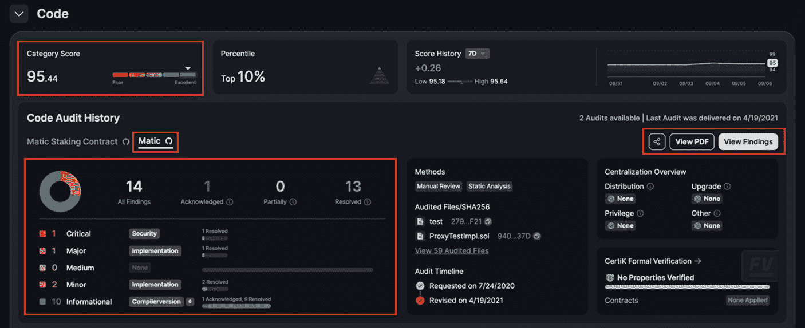

**图 12-16** – 通过 Certik 对“MATIC”进行的 Polygon 网络安全代码审计（图片由 [`skynet.certik.com/projects/polygon`](https://skynet.certik.com/projects/polygon) 提供）

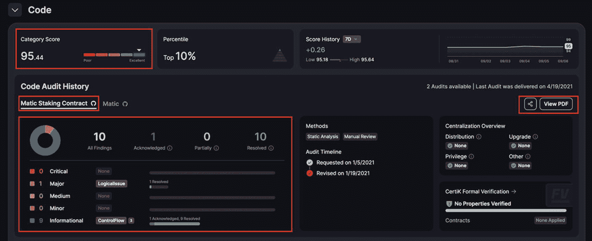

**图 12-15** – 通过 Certik 对“MATIC Staking Contract”进行的 Polygon 网络安全代码审计（图片由 [`skynet.certik.com/projects/polygon`](https://skynet.certik.com/projects/polygon) 提供）

`CertiK` 按严重程度对发现的问题进行分类——从信息性、次要、中等、重大到严重——尽管其他审计公司可能使用略有不同的标签来表示同等的风险级别。虽然 `CertiK` 提供的分数反映了源代码的整体状况，但投资者需要核实代码审计期间是否发现了任何被归类为严重或重大的问题，并且这些问题要么已解决，要么至少风险已得到缓解。在审计 Polygon 的 PoS 桥接“MATIC”智能合约时，`CertiK` 发现了十四个代码问题：一个严重、一个重大、两个次要和十个信息性——见图 12-16 和图 12-17。尽管任何项目都必须处理中等、次要和信息性类别的问题，但项目团队必须立即处理严重和重大的问题。每个问题的相应状态在 Polygon 的完整和摘要代码报告中都是可见的。例如，Polygon 报告的十四个代码问题中有十三个已得到解决，包括严重和重大的问题。这是一个很好的迹象，表明代码库是安全的，并且项目团队正在勤奋地工作，以保持项目代码库没有错误、漏洞和弱点。如果发现任何被归类为严重或重大的问题状态在几天内仍为“已确认”，则将其视为危险信号。

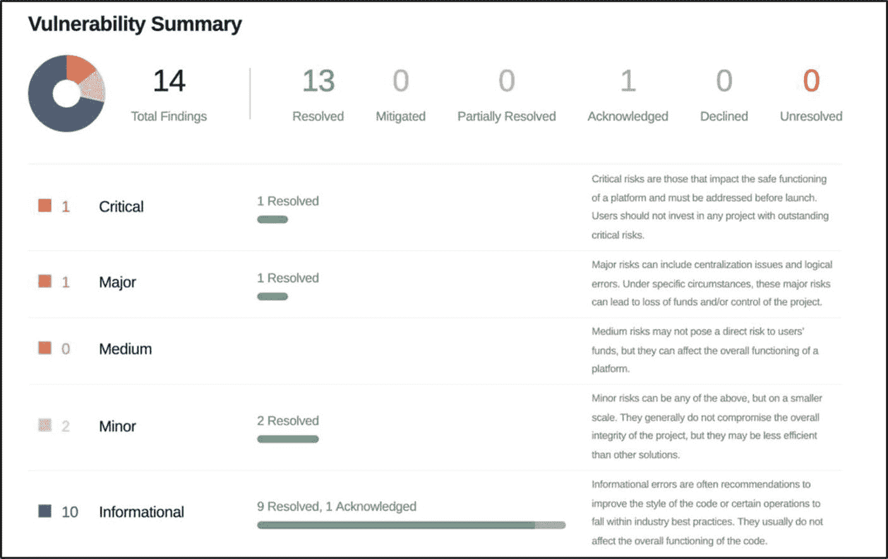

**图 12-17** – 来自 CertiK 的 Polygon“MATIC”代码审计报告，显示了代码审计的发现（图片由 [`skynet.certik.com/projects/polygon`](https://skynet.certik.com/projects/polygon) 提供）

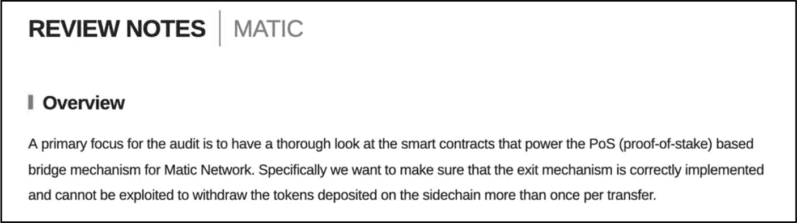

**图 12-18** – 来自 CertiK 的 Polygon“MATIC”代码审计报告，显示了审计的具体范围；驱动 MATIC 网络 PoS 桥接的智能合约（图片由 [`skynet.certik.com/projects/polygon`](https://skynet.certik.com/projects/polygon) 提供）

如前所述，还有许多其他代码安全审计公司为区块链领域提供服务。虽然本节以 `CertiK` 为例，但大多数代码安全审计公司都会制作格式类似的审计报告。例如，参见由 [Hacken](https://hacken.io/) 执行的币安储备证明（PoR）验证系统的代码安全审计（[`https://audits.hacken.io/binance/por-binance-por-code-audit-feb2023/`](https://audits.hacken.io/binance/por-binance-por-code-audit-feb2023/)）。

### 持续改进的代码监控

一旦完成初步的代码安全审计并解决所有已发现的问题后，许多公司会提供持续性的代码监控服务，通常按月或按年进行。尽管这些服务被认为不如主要的代码安全审计那么关键，但持续改进监控有助于确保，在未来，任何新的漏洞、更新或对代码库的修改都能被及早发现，从而最大限度地降低安全漏洞风险，并长期维护软件的完整性。这种主动的方法使项目能够领先于潜在的威胁。

图 12-19 显示了通过 CertiK 进行的 Aave DeFi 项目审计报告的截图。这表明 [Aave](https://aave.com/) 在其网站、GitHub 上的代码库以及社交媒体上拥有由 CertiK 驱动的主动监控。拥有主动代码安全监控的项目被黑客攻击的几率略低。大多数代码安全审计公司都提供后续支持，例如主动监控。因此，建议投资者检查该项目是否作为基本面评估的一部分，向任何代码安全审计公司使用了此项服务。

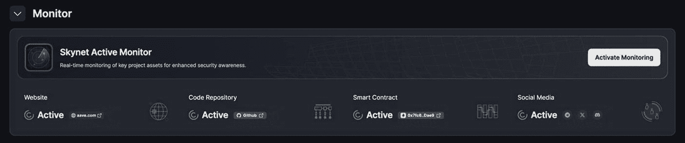

图 12-19

CertiK 上对 Aave DeFi 项目进行的安全主动监控（感谢 [`skynet.certik.com/projects/aave?utm_source=CMC&utm_campaign=AuditByCertiKLink`](https://skynet.certik.com/projects/aave%253Futm_source%253DCMC%2526utm_campaign%253DAuditByCertiKLink)）

### 行动步骤

请遵循以下步骤来确定项目是否已进行代码安全审计，以确保其代码库安全，漏洞已得到解决，从而提供足够的攻击防护。

1.  **代码安全审计**

    判断项目的代码库是否已成功通过代码安全审计。有几种方法可以实现这一点。
    1.  通过官方渠道联系项目团队，并索取审计报告的链接。必须通过消息或电子邮件提供审计报告的 URL 作为确认，但这还不够。
    2.  访问 CoinMarketCap.com 主页，选择 *筛选* ➤ *添加筛选条件*，然后切换 *已审计*。这将显示已向 CoinMarketCap 报告其代码库审计情况的项目列表。
    3.  通过你首选的浏览器进行简单搜索，可以帮助确定某个特定项目是否执行了代码安全审计，包括代码审计报告的链接——请确保 URL 的合法性。

2.  **代码审计公司的可信度**

    进行调研，核实执行代码审计的是否为一家专业、经认证、有资质且信誉良好的公司。同时，也要审查他们审计过的其他项目。

3.  **已发现代码问题的解决**

    被评为严重和主要的代码问题必须已解决，或至少已得到缓解。
    1.  检查项目的代码审计报告，确定是否有任何被评为*严重*和*主要*的代码错误具有*已解决*或*已缓解*的状态。
        1.  务必检查审计报告是否定期更新。大多数情况下会更新；如果没有，请与项目团队联系以获取澄清。

4.  **审计后支持审计**

    在初次审计之后，对项目代码进行定期安全监控可降低被黑客攻击的风险。
    1.  与项目团队核实，确认他们是否正在利用审计后的安全监控服务。

5.  **做好笔记并用你自己的方式记录你的发现**

6.  **将这些发现与基本面评估流程的其他部分结合起来**

#### 评估结果

投资者应优先选择那些已进行全面代码审计，且所有*严重*和*主要*级别的代码错误均已解决的项目。不建议投资那些未经过专业代码安全审计公司进行代码审计的项目。这样的项目不仅代码库面临更高的潜在攻击风险，也反映出项目团队的不足。

## 漏洞赏金

***评估目标：确定一个项目是否已发布、完成或计划了漏洞赏金计划，以评估其对代码安全的承诺。***

作为帮助保护项目代码库安全的额外措施，加密项目会运行漏洞赏金计划——这是谷歌、微软和 Meta 等大型科技公司长期使用的方法——激励整个区块链行业的开发者和社区成员帮助识别项目代码中的错误、漏洞或弱点。关于如何发现漏洞、问题的严重性以及如何修复的建议等详细信息，都会在发送给项目团队的报告中详细说明。与专业的安全审计类似，漏洞赏金通常关注项目最有价值的组件——智能合约、桥梁、钱包或其他关键模块——尽管一些资金充足的项目会将赏金范围扩大到覆盖其整个代码库。漏洞赏金被认为是一种协作式的社区方法，有助于维护和提升区块链或 dApp 的整体代码安全性。

事实

漏洞赏金通常由“白帽黑客”执行，他们利用专业知识和技能来识别和修复项目代码库中的错误、漏洞和弱点。相反，“黑帽黑客”则利用这些漏洞谋取私利或进行恶意活动。

图 12-20

HackenProof 于 12 月启动的漏洞赏金计划，包括针对 Mina Protocol 2024 的计划（感谢 [`hackenproof.com/programs`](https://hackenproof.com/programs)）

除了代码安全之外，漏洞赏金对于项目团队与其社区之间的信任和透明度也至关重要。它还能鼓励积极的社区参与，从而有助于提高知名度和可信度。建议投资者确定正在评估的项目是否已计划、正在进行或已完成漏洞赏金计划。有几个网站允许投资者查看加密领域内过去、现在和未来计划的漏洞赏金。具体如下：

*   **HackenProof** — [`https://hackenproof.com/programs`](https://hackenproof.com/programs)
*   **CertiK** — [`https://skynet.certik.com/leaderboards/bug-bounty`](https://skynet.certik.com/leaderboards/bug-bounty)
*   **Immunefi** — [`https://immunefi.com/bug-bounty/`](https://immunefi.com/bug-bounty/)
*   **漏洞赏金雷达 (Bug Bounty Radar)** — [`https://bbradar.io/`](https://bbradar.io/)
*   **Bugcrowd** — [`https://www.bugcrowd.com/bug-bounty-list/`](https://www.bugcrowd.com/bug-bounty-list/)

### 行动步骤

按照以下步骤，确定一个项目是否已发布、完成或计划实施漏洞赏金计划，以评估其对代码安全的承诺。

1.  **项目漏洞赏金**
    检查项目团队是否已完成、正在进行或已计划漏洞赏金计划。
    1.  联系项目团队，获取其漏洞赏金相关信息（如有）。确保他们提供链接，以便你验证所获全部信息。
    2.  研究主流的漏洞赏金网站和平台——特别是本节中提到的那些——以审查特定项目的漏洞赏金数据（如有）。

2.  **漏洞赏金结果**
    如果漏洞赏金结果可用：
    1.  判断项目团队是否已确认并解决已识别的关键和重大代码问题。
        1.  出于安全考虑，一些项目倾向于对发现的任何漏洞保密，以维护安全并防止已披露漏洞被潜在利用。

3.  **用自己的风格记录结果并做好笔记**

4.  **将该结果与基础评估流程的其他部分相结合**

#### 评估结果

如果区块链或去中心化应用（dApp）已执行过漏洞赏金计划，这是一个积极信号。尽管不太有利，但只要尚未发布漏洞赏金计划，并且已有专业的代码审计公司进行过代码安全审计，这并不一定是一个危险信号。

