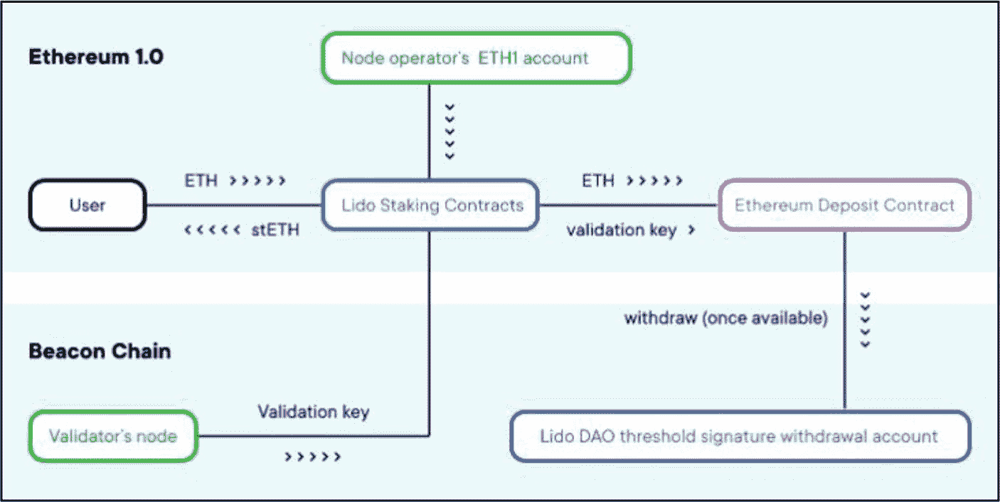
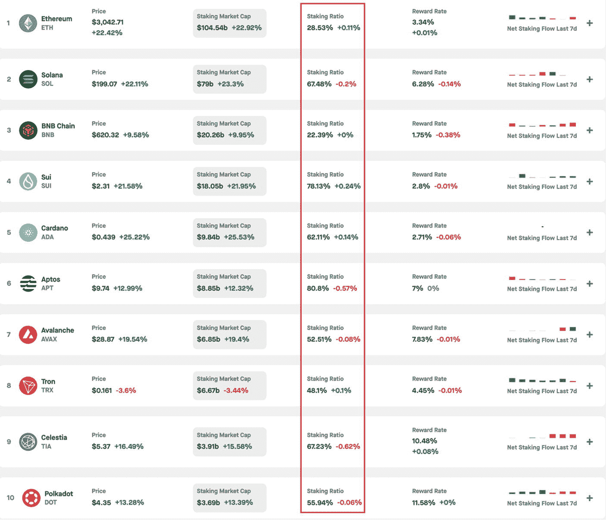
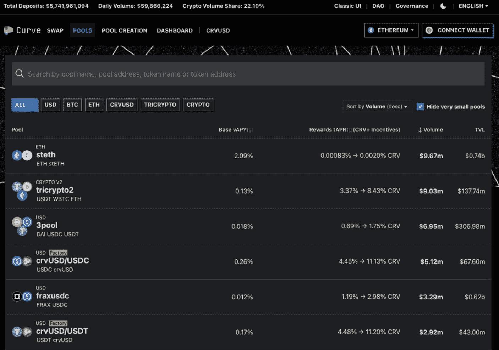

# 13. 激励与奖励

基于加密资产的激励和奖励至关重要，原因有很多，包括推动用户参与、保障网络安全、提供流动性、促进网络增长、建设社区、引导行为参与、鼓励治理参与、维持经济稳定，以及营造更具吸引力的生态系统。这些要素是许多区块链网络和去中心化应用的功能、增长及可持续性的核心组成部分。

对于投资者而言，理解这些激励结构是评估项目可持续性和增长潜力的关键。本章也有助于那些有兴趣参与去中心化金融（DeFi）奖励协议的投资者，因为它讨论了每种DeFi收益产生协议的利弊以及它们可能适合的投资者类型。高收益奖励可能看似诱人，但通常伴随着潜在风险，例如不可持续的奖励、代币通胀、中心化或欺诈。

激励机制通过支付奖励来吸引参与者——在DeFi中通常被称为“收益”，但与工作量证明的“挖矿”不同——以鼓励其参与各种收益生成活动以及对网络的其他贡献。支付率取决于不同因素的程度，例如激励机制的类型、数字资产的稳定性、供需指标以及相关风险。收益生成过程是许多区块链网络和专注于DeFi的去中心化应用（`dApp`）的关键组成部分，是吸引投资者和网络参与者的主要动力。它们提供了在传统交易或投资之外赚钱的机会。与传统市场不同，区块链技术创造了多种专门设计的收益生成过程，使数字资产能够以最小的努力产生稳定的被动收入流。

收益生成过程属于区块链安全和DeFi的范畴。这些激励过程的结合有助于创建一个更安全、更高效且流动性更丰富的区块链生态系统，在该生态系统中，参与者在经济利益驱动下会以最有利于网络的方式行事。有多种收益生成过程可用，例如质押、流动性挖矿以及各种DeFi收益耕种过程。

与DeFi收益耕种相关的术语，包括各种过程的命名约定，由于缺乏明确界定，仍然容易被误用。例如，有些人将收益耕种和流动性挖矿定义为不同的过程。然而，有些人认为，由于“收益”也通过流动性挖矿产生，因此它属于“收益耕种”的范畴。质押和挖矿也会产生“收益”；但有些人并不将这些过程称为典型的“收益生成”过程。随着时间的推移，这些分类之间的区别将变得更加清晰和明确。然而，只要理解了每个过程的概念，对这些实践的分类或贴标签在某种程度上是无关紧要的。此外，在本书中，为了清晰起见，激励机制被分为两大类：主要激励机制和次要激励机制。

强烈建议花足够的时间来评估主要和次要激励机制。尽管利润丰厚，但与金融市场相比，大多数收益生成过程伴随着高风险。因此，投资者，特别是那些寻求长期收益的投资者，必须彻底理解这些过程。这种理解将有助于选择符合投资者风险承受能力、时间投入和技术技能要求的合适收益生成过程。此外，分析这些收益生成机制也能揭示重要信息，帮助投资者了解网络的安全水平、流动性资源、波动程度，以及社区对网络或去中心化应用（`dApp`）的信任和信心。

**本章讨论的基本概念：**

- 主要激励机制
    - 质押
    - 挖矿奖励
    - 收益耕种
    - 收益聚合器
    - 治理奖励
    - 边玩边赚奖励
- 次要激励机制
    - 空投
    - 平台激励
    - 测试版奖励
    - 推荐计划
    - 忠诚度奖励

专业提示
激励机制不仅仅是关于利润；它们通常预示着项目的成熟度及其与用户利益的契合度。寻找具有可持续奖励结构的项目，因为过于慷慨的激励可能意味着不可持续的代币经济模型。

## 主要激励机制

主要激励奖励系统是收益生成过程，其中奖励通常以去中心化的方式在链上生成并自动分配，尽管某些质押或收益耕种方案通过托管或半中心化服务进行支付。这是通过挖矿、质押或智能合约控制的系统（包括DeFi收益生成机制和去中心化游戏中的边玩边赚激励）来实现的。在大多数情况下，由于去中心化和开源权限的好处，这些奖励机制不需要中心化权威机构。然而，在大多数情况下，需要支付交易费用。主要奖励激励机制包括：

- `质押`
- `挖矿`
- `流动性挖矿`
- `收益耕种`
- `收益聚合器`
- `治理参与`
- `边玩边赚`

### 质押

`质押`指的是个人将其资产（币）在链上锁定，以帮助支持区块链网络的安全性，从而获得奖励的过程。质押参与者获得新奖励的比率被称为奖励率，它以给定一年内赚取多少奖励的百分比来衡量。

`质押`在权益证明（`PoS`）区块链以及支持验证、安全性和维护操作的`PoS`区块链变体中得以实现。来自基于`PoS`的区块链的数字资产（原生币或代币）被“质押”，作为防止验证者作恶的保险。质押激励用户锁定（质押）他们的币，并根据每个投资者质押的金额提供“质押”奖励。质押的币越多，潜在奖励就越高。基于`PoS`的区块链示例包括`Ethereum`(`ETH`)、`Solana`(`SOL`)和`Cosmos`(`ATOM`)。质押奖励率以`APY`（年化收益率）百分比值表示。`APY`值因协议而异；然而，成熟项目的典型奖励率在2%到6%之间。

存在许多不同的质押流程，其质押资产的步骤略有不同。然而，质押数字资产最常见的、最基本步骤如下：

1. **选择 `PoS` 数字资产** – 根据相关风险、资产稳定性、年度奖励百分比等变量，选择合适的`PoS`数字资产进行质押。
2. **选择质押服务** – 运行您自己的验证者（自托管），或为您的`PoS`资产使用信誉良好的第三方质押服务。
3. **质押资产** – 质押您的资产。这可以直接通过钱包进行，也可以通过第三方质押服务进行。
4. **监控奖励和资产价值** – 跟踪已分配的奖励和资产的市场价值。
5. **重新质押或领取奖励** – 根据协议指南，选择是将质押奖励再投资还是提取。
6. **取消质押资产** – 取消质押并提取您的资产（如果需要）。请注意，在资产可提取之前，可能存在一个解锁期。

以下各节将讨论各种质押变体和流程。每种质押流程的优缺点为投资者提供了更透彻的理解，有助于他们选择符合自身风险承受能力和时间投入的质押流程。此外，还将讨论评估长期成功的关键因素，如调整后的质押奖励、基于交易费用的收益、质押率以及流通量与最大供应量的关系。

#### 验证者质押

**示例：** [Polkadot Network](https://polkadot.network/)、[Ethereum](https://ethereum.org/en/) 和 [Avalanche Network](https://www.avax.network/)

如第6章“区块链架构”中“权益证明（`PoS`）”一节所述，验证者，也称为区块创建者，通过在区块链上验证交易来帮助维护安全性和系统效率。验证者质押大量数字资产（例如`Ethereum`需要`32 ETH`）作为抵押品，如果验证者行为不诚实或疏忽，其部分资产可能会被罚没——只有在严重或屡次违规时才会罚没全部质押量。验证者负责检查（签署）网络中传播的新区块（包含交易）是否有效，并偶尔创建和传播新区块本身。

**优势**

- **最大奖励** – 直接从协议中获得最大奖励，无需支付中介费用。
- **完全控制** – 运行全节点提供。
    - **私钥安全** – 通过使用自己的私钥，验证者可以直接保护其质押资产，这增加了一层额外的安全性，因为他们无需将资产托付给第三方。
    - **直接交易验证** – 能够不依赖第三方直接验证交易。
- **投票权** – 在大多数`PoS`区块链中，验证者有权参与治理流程，允许他们就网络的各种方面和方向进行投票。
- **网络安全** – 验证者有助于加强网络安全。
- **透明度和信任** – 运行节点使验证者能够管理并监控自己的资金，无需中介机构。

**劣势**

- **技术知识** – 设置节点需要高水平的专业技术知识。
- **运营成本** – 运行节点需要以下条件：
    - 高速互联网。
    - 高性能、高效的操作系统。
    - **硬件** – 维护运行`Ethereum`执行客户端和共识客户端的硬件，并保持与互联网连接。
    - 足够数量的计算机 `SSD` 磁盘存储。例如，要运行一个`Ethereum`节点，建议至少拥有`2TB`的`SSD`存储，并额外准备`0.5TB`到`1TB`作为预防措施。
    - 电力成本增加，因为节点必须持续活动（在线），不能中断或停机。
- **积极参与** – 需要持续监控以确保节点始终在线并按预期运行。
- **最低质押量** – 运行验证者节点有最低质押量要求，这可能会阻碍许多资金较少的个人参与。最低要求因网络而异。
- **罚没风险** – 恶意行为可能导致更大数量的质押资产被“罚没”。

#### 流动性质押

**示例：** [Lido](https://lido.fi/) 和 [Stader](https://www.staderlabs.com/)

在传统的质押（硬质押）过程中，用户的资产会被锁定一段时间，无法轻易访问或交易。这降低了投资者的流动性，导致在锁定期结束或用户发起提前赎回之前，无法进行交易或将其用作抵押品。以太坊2.0就是一个典型例子，用户需要在网络上质押32个以太币（`ETH`）。当质押参与者的32个`ETH`被锁定后，只要没有恶意行为，他们就会持续获得奖励。然而，在资金被质押期间，他们无法使用这些资金。问题在于，并非每个投资者都有32个`ETH`；因此，他们不符合参与以太坊质押流程的资格。流动性质押平台通过提供部分质押的机会，帮助缓解了这个问题。

流动性质押（软质押）协议通过向质押方提供一种合成的流动性质押衍生品（`LSD`）来换取其质押资产，从而应对传统质押相关的问题。这种`LSD`，也称为流动性质押代币（`LST`），由协议在用户质押时通过程序生成。`LST`代表了质押资产的价值，是一种借据，为用户提供进一步的投资机会、更高的流动性和资本效率。这些`LST`在设计上是流动的，使用户能够交易它们，或将它们用于DeFi应用中，作为赚取额外被动收入策略的一部分。

[Lido](https://lido.fi/)是一个知名的去中心化流动性质押提供商示例。Lido允许用户质押以太坊，作为回报，用户会获得一种`LST`，即`stETH`（质押的`ETH`）。这些`stETH`合成代币以1:1的目标比例（包括任何质押奖励或惩罚）反映用户在以太坊信标链上质押的`ETH`余额价值，尽管在市场剧烈需求或流动性有限期间，其市场价格可能偏离1 `ETH`。用户可自由使用`stETH`衍生代币作为额外DeFi策略的一部分，进行交易，或仅仅持有以备不时之需。Lido用户可以通过兑换（销毁）`stETH`代币来取回其质押资产。

Lido的协议由一个汇集用户质押并委托给独立验证者的质押池、`stETH`代币以及一个用于治理的DAO组成。质押池使用预言机合约来监控DAO的验证者余额。DAO对治理至关重要，它提供了一个去中心化的安全层，降低了在维持`ETH`与`stETH`锚定过程中出现单点故障的风险。它还负责监督协议更新并选择保险提供商，其资金库由通过Lido智能合约获得的质押奖励提供资金。


图 13-1

Lido 质押平台提供商上的以太坊质押框架（感谢 [`blog.lido.fi/how-lido-works/`](https://blog.lido.fi/how-lido-works/)）

在流动性质押平台上，用户会根据原始质押代币持续赚取质押奖励。这些奖励可能会“融入”到衍生代币的价值中，也可能单独分配。

**优势**

- **流动性** – 与传统的质押不同，流动性质押以衍生数字资产的形式为质押参与者提供流动性。
- **提高资本效率** – `LSD`通过在不同的DeFi协议中利用合成资产来赚取额外收益，为用户提供了更多获得额外奖励的机会。
- **降低准入门槛** – 通过流动性质押提供商，资产较少的参与者可以进入各种质押池，根据其质押比例按比例分配奖励，从而赚取收益。
- **防止价格暴跌** – 允许质押衍生品的持有人在价格严重暴跌时立即出售其资产，而不是在资产价值持续下跌的同时受制于解锁期。

**劣势**

- **安全风险** – 参与者面临与流动性质押相关的多个移动部件（例如各种质押和流动性池、智能合约、衍生资产和验证者）更高的风险。代码中的任何错误或漏洞都可能导致参与者损失部分或全部资产。
- **复杂性** – 流动性质押过程比传统质押更难理解；因此，在质押前需要额外的谨慎和理解。
- **罚没风险** – 流动性质押过程也受到罚没机制的影响。任何验证者的不当行为或恶意活动都可能导致惩罚，其中部分或全部质押资产将被扣除。

##### 委托质押即服务（SaaS）

**示例：** [BloxStaking](https://www.bloxstaking.com/) 和 [Ethpool](https://ethpool.org/)

委托质押即服务（`SaaS`）是由各类区块链公司提供的一种软件服务，它使用户无需拥有或维护运行验证节点所需的硬件和软件，即可参与到质押流程中。该流程通常包括：引导用户完成初始设置（如密钥生成和存款）；或由用户本地保管密钥，而运营商通过非托管的远程签名设置进行连接。这样，服务方就能代表你运行验证器，通常按月收费——Blox Staking就是这类设置的典型例子。

正如`Ethereum.org`所述，在使用SaaS公司之前，考虑以下几个属性至关重要：

1. **开源** – 确保代码是开源的，并向公众开放，可供分叉和使用。
2. **已审计** – 核心代码经过了正式的审计，其结果已公开发布并可供公众查阅。
3. **漏洞赏金** – 已在任何核心代码上执行了公开的漏洞赏金计划，以奖励用户安全地报告和/或修复漏洞。
4. **经过实战检验** – 该服务已面向公众提供并使用至少六个月，最好超过一年。
5. **无需许可** – 用户无需特殊许可、账户注册或了解你的客户（`KYC`）验证即可参与该服务。
6. **执行客户端多样性** – 该服务不应让其运行的全部验证器中有超过50%使用某个占多数的执行客户端。
7. **共识客户端多样性** – 该服务不应让其运行的全部验证器中有超过50%使用某个占多数的共识客户端。
8. **自我托管** – 用户保持对所有验证器凭证（包括签名密钥和提款密钥）的保管权。

**优势**

- **维护** – SaaS平台通过确保软件和更新等服务器需求，来维持最佳的质押条件。
- **易于使用** – 简化的质押流程，无需深厚的专业知识。
- **降低启动成本** – 无需购买硬件，包括高性能操作系统及充足的存储空间。
- **可靠性** – 持续可靠的服务，无停机时间。

**劣势**

- **控制权受限** – 与某些SaaS公司合作时，你可能无法完全控制验证节点。
- **可审计性限制** – 一些SaaS平台使用专有的、闭源代码，限制了透明度，对于需要完全可审计系统以满足合规或安全要求的用户来说并不合适。
- **托管风险** – 如果服务提供商被黑客攻击，存在质押资产损失的风险。因此，非托管服务提供商更受青睐。
- **罚没风险** – 恶意行为可能导致更大数量的质押资产被“罚没”。

##### 中心化质押平台

**示例：** [Bybit](https://www.bybit.com/)、[Coinbase](https://www.coinbase.com/)、[Binance](https://www.binance.com/) 和 [Kraken](https://www.kraken.com/)

由中心化实体运营的中心化质押平台，使用户能够质押基于`PoS`的数字资产以获取奖励。用户可以直接在平台上存入其资产或直接购买，这些资产随后会被质押并锁定一段预定的时间。

**优势**

- **用户友好** – 简单直接
- **易用性** – 无需技术知识
- **降低风险** – 降低了被罚没的风险，从而保护用户的质押资产

**劣势**

- **中心化** – 由于中心化，存在黑客攻击的风险
- **控制权有限** – 对其质押资产的控制较少
- **治理权** – 可能无法参与网络上的治理投票
- **费用** – 由于中心化平台收取费用，导致收益减少

##### 通过去中心化钱包质押

**示例：** [Lido](https://lido.fi/)、[Trust Wallet](https://trustwallet.com/)、[Trezor](https://trezor.io/)、[Exodus](https://www.exodus.com/) 和 [MetaMask](https://metamask.io/)

基于去中心化质押的钱包和服务提供商，使用户能够质押其`PoS`数字资产以赚取奖励。质押功能要么直接在钱包内原生提供，要么通过将钱包连接到去中心化质押协议来实现，因此没有中心化的管理机构介入，用户对自己的资产和密钥拥有完全控制权。

**优势**

- **自我托管** – 用户完全控制其数字资产和私钥。
- **安全性** – 由于直接参与质押，无需中间方，因此受到攻击的风险更低。
- **透明度** – 所有质押操作都对社区开放以供审计。
- **更低费用** – 由于没有中心化中间方，费用可能更低。

**劣势**

- **复杂性** – 对于不了解区块链基础知识的人而言，可能存在技术挑战。
- **无客户支持** – 大多数去中心化质押服务提供商缺乏足够的客户支持。
- **责任自负** – 用户对其质押资产的安全性和保障负有全部责任，需要时刻保持警惕。

# 投资者质押考量

当参与权益证明（PoS）区块链上的质押时，投资者可以从两个主要来源获取奖励：`新铸造的代币`或`交易手续费`，或两者结合。每种方法对代币供应、通胀及潜在价值稳定性都有不同的影响。本节将分解这些奖励类型以及其他关键的质押因素，如实际奖励率和最优质押比率，以帮助投资者做出明智的决定。

## 质押奖励：铸造奖励 vs 交易手续费奖励

当网络参与者（例如，验证者）参与 PoS（或 PoS 变体，如 DPoS 和 LPoS）共识机制时，他们提供了验证交易和保护网络的服务。作为回报，他们会因自己的努力而获得"质押"奖励。这些奖励，也被称为`收益`，可以源自两个主要来源：交易手续费和新铸造的代币。

### 来自铸造代币的奖励

在这种质押奖励模型中，质押奖励是通过在区块链上新铸造的原生代币来产生的。这些新铸造的代币会分配给验证者，以奖励他们完成的工作。这种通胀型的奖励机制是 PoS 区块链采用的主要方法。

**优势**

-   **鼓励参与** – 持续的奖励流激励更多网络参与者质押其资产，从而进一步保障网络安全。
-   **稳定的奖励供应** – 为验证者和`质押者`提供稳定、持续且可预测的奖励，波动性小。

**劣势**

-   **代币供应稀释** – 这种方法最大的缺点是，由于创建新代币并将其引入流通供应，导致供应持续被稀释。如果通胀率超过网络扩展或采用的步伐，这可能会进一步使代币价格贬值，这对长期投资者可能不利。
-   **劝阻投资者** – 铸造新代币导致供应严重膨胀，可能会劝阻新投资者进行投资，从而进一步贬低项目的价值和声誉。

### 交易手续费带来的奖励

质押奖励也可以来自交易手续费，这意味着以区块链原生代币（例如 `BNB`）支付的交易费用，被用于奖励验证者和质押参与者，以表彰他们在验证交易和维护区块链安全方面所做的努力。验证者通过交易手续费获得奖励的比率，通常取决于质押的代币数量、网络协议以及处理的交易数量。

这种方法的核心优势在于，用于支付交易手续费的数字资产已经存在于总供应量中。因此，这个过程只是将代币从"发送者"手中重新分配给验证者和质押参与者。无需创建新代币。因此，这个过程没有通货膨胀，也不会进一步稀释供应量。

**优点**

-   **通胀控制** – 这种方法可以在不增加供应量的情况下支付验证者和质押参与者。
-   **吸引投资者** – 投资者倾向于关注那些不会受代币供应膨胀影响的项目。

**缺点**

-   **奖励不可预测** – 奖励会因交易量和网络使用情况而波动。这可能导致有时奖励很高，有时验证者和质押参与者获得的奖励却很少。
-   **采用障碍** – 需要控制交易手续费，使其不会阻碍区块链的发展。高昂的交易手续费可能会阻碍网络用户使用，而低廉的交易成本则为验证者和网络用户创造了激励性很强的机会。

尽管质押可能利润丰厚，但也并非没有风险。`Slashing`（罚没）是一种权益证明（PoS）机制，验证者因未能满足特定要求、行为恶意、未能达到某些条件或做出损害网络的行为而受到惩罚。此外，密切关注每枚代币的价格至关重要，这不仅是为了确保质押仍然值得，还因为它会影响总收益。

## 实际收益率

在质押数字资产时，了解资产的通胀率及其对净质押奖励的影响至关重要。正如第 8 章"代币经济学"中"通胀型代币供应"一节所讨论的，对于通胀型代币供应，更多的代币会被持续不断地添加到流通中，导致总供应量随着时间的推移而增加。这会稀释每个代币持有者所占总供应量的份额，这意味着你的所有权比例会下降，除非你获得了等量的新铸造代币作为补偿。因此，在进行质押时，投资者需要关注的是`实际收益率`，而非仅仅获得更多正在不断稀释代币供应量的新铸造代币。

**专家提示**

长期投资者应始终质押其资产，以防止其总供应份额因通胀而缩水。复利（或重新质押）奖励可以进一步抵消稀释效应，有助于在赚取额外奖励的同时维持价值。

与标准的"名义"收益率不同，`实际收益率`（以前称为"调整后质押奖励"）代表了实际的"净"质押收益，显示了投资者在考虑通胀或通缩因素后获得的真实奖励——以百分比表示。这有助于判断他们是在获得真实价值，还是仅仅持有了更多但已被稀释的代币。正的实际收益率表明分配的质押奖励超过了通胀率，投资者赚取了真正的净质押奖励。相反，负的实际收益率意味着，在考虑通胀因素后，质押奖励的价值不足，投资者可能在代币数量上增加了，但整体购买力却下降了。因此，强烈建议在投资某项资产之前考虑实际收益率，特别是如果你的目的是通过质押获得被动收入。但是，如果你是因为非常看好某项资产的基本面而投资，并且其实际收益率为负，那么质押可能仍然是值得的——这是一种复杂的情况。如果不进行质押，随着通胀稀释代币供应，你的持仓很可能会损失购买力。在这种情况下，选择质押至少实现盈亏平衡或减少损失，是比任由通胀逐渐侵蚀你投资价值更可取的选择。

实际收益率的计算公式如公式 13-1 所示。名义质押率是考虑通胀前的质押奖励，而通胀率是代币供应量每年增加的比率。

```
实际收益率 = ( (1 + 名义收益率) / (1 + 通胀率) ) - 1
```

**公式 13-1.** 计算实际收益率的公式

图 13-2 显示了来自 StakingRewards.com（一个加密货币质押和实时奖励分析平台）的 [以太坊](https://ethereum.org/en/) 和 [Solana](https://solana.com/) 的质押奖励数据。以太坊的收益率为 3.39%，通胀率为 0.38%，实际收益率为 3%。这表明以太坊的通胀率几乎为零；因此，这 3% 的实际收益率来自交易手续费，而非通货膨胀，这对投资者来说非常有利。自以太坊转为权益证明模型并实施 EIP-1559 后，一部分交易手续费被销毁，另一部分则用于支持网络，包括质押奖励。

另一方面，Solana 的奖励率为 6.31%，通胀率为 5.32%，实际奖励率为 0.93%。这表明，在质押 SOL 时，尽管有较高的通胀率（6.31%），但高通胀率（5.32%）正在中和它，投资者实际上每年仅能获得 0.93% 的奖励率。与以太坊不同，Solana 的奖励来自新铸造的货币，而非交易费。因此，其供应量正在持续稀释。然而，如果不进行质押，投资者的持仓比例将随着时间的推移而持续下降。Solana 的最终通胀供应量预计将在 2031 年达到 1.5%。


**图 13-2**

来自 StakingRewards.com 的以太坊和 Solana 质押数据，展示了奖励率、通胀率和实际奖励率（数据来源：[`https://www.stakingrewards.com/assets/proof-of-stake?sort=staking_marketcap&timeframe=7d&order=desc&byChange=false&columns=reward_rate,price,staking_marketcap,staking_ratio,inflation_rate,real_reward_rate`](https://www.stakingrewards.com/assets/proof-of-stake?sort=staking_marketcap&timeframe=7d&order=desc&byChange=false&columns=reward_rate,price,staking_marketcap,staking_ratio,inflation_rate,real_reward_rate)）

**以下四个条件可以定义一个理想的质押机会：**

1.  当"实际奖励率"值高于"奖励率"值时。
2.  当质押奖励来源于交易费而非铸造新币时。
3.  当流通供应量接近最大供应量时，表明剩余通胀很少。
4.  当存在销毁机制时，整体代币供应量会减少。

## 质押比率

需要考虑的一个关键因素是质押比率，它以百分比表示。质押比率可以定义为经济体中质押的代币总量与总代币供应量之比。较高的质押比率通常表明社区对该项目的信任度更高，因为更多的用户愿意将其代币锁定一段时间。

在网络层面，整体质押比率与每个质押代币获得的奖励之间通常存在反比关系——当更多代币被质押时，相同的奖励池需要在更多参与者之间分配。随着质押代币数量的增加，由于奖励在更大的池子中分配，个人质押奖励往往会减少。另一方面，当未质押代币数量减少时（意味着质押的代币数量减少），个人质押奖励会增加，因为它们由更少的参与者分配。然而，无论年化收益率（APY）如何，个人质押的代币越多，他们获得的奖励就越多。这自然会吸引并导致更多的整体质押活动，从而在总体和个人层面创造更高的质押比率。

$$ \text{质押比率} = \left( \frac{\text{总质押代币量}}{\text{总代币供应量}} \right) \times 100 $$

**公式 13-2.** 计算质押比率的公式

例如，*项目 X 有 2.5 亿枚质押代币，总供应量为 10 亿枚代币。*
$$ \left( \frac{250,000,000}{1,000,000,000} \right) \times 100 = 25\% $$

**公式 13-3.** 虚构项目 X 的质押比率计算示例

## 最优质押比率

一个最优的质押比率可以平衡安全性、流动性、盈利能力、波动性和项目信任度。较高的质押比率意味着网络安全性更高，对项目的信心更强，但可能导致波动性增加和质押年化收益率（APY）较低。另一方面，质押代币数量少（即质押比率低）的项目往往波动性低，质押年化收益率（APY）高，但可能会损害网络安全性并引发投资者对项目情绪的质疑。表 13-1 进一步简化了低质押比率和高质押比率的优缺点。

**表 13-1** 低和高质押比率的后果

| 质押比率——低与高的后果 |
| --- |
| | 低质押比率（例如 0–5%） | 高质押比率（例如 95–100%） |
| --- | --- | --- |
| 网络安全性 | 差 | 优秀 |
| 流动性 | 优秀 | 差 |
| 奖励（APY） | 优秀 | 差 |
| 信心/信任 | 差 | 优秀 |

质押比率过高或过低都可能对项目的成功产生显著的负面影响。因此，根据经验法则，30% 到 70% 之间的质押比率有助于平衡安全性、流动性、盈利能力、波动性和项目信任度等关键要素。这对于质押市值较低的项目尤其重要，有助于维持网络安全。大型网络只需 20–30% 的代币被质押就能保持安全，因为锁定的价值巨大——例如，以太坊以 29% 的质押率锁定了约 870 亿美元，`BNB Chain` 仅以 21% 的质押率就确保了约 190 亿美元的安全——同时保留了流动性并保持了较低的通胀。从投资者的角度来看，一个理想的质押机会是能够提供高年化收益率（APY），而又没有通常与高质押比率相关的缺点的机会。

图 13-3 显示了截至 2024 年 11 月 9 日，根据 stakingrewards.com 的数据，按质押市值排名的前十大质押资产。每个项目的质押比率用红色标出。表 13-2 列出了这些质押比率及其各自的实际奖励率，并显示了每项的平均值。

**表 13-2** 最优质押比率

| 最优质押比率 |
| --- |
| 序号 | 数字资产 | 实际奖励率 (%) | 质押比率 (%) |
| --- | --- | --- | --- |
| 1 | 以太坊 | 2.94% | 28.53% |
| 2 | Solana | 0.93% | 67.48% |
| 3 | BNB Chain | 6.34% | 22.39% |
| 4 | Sui | -4.54% | 78.13% |
| 5 | Cardano | 0.59% | 62.11% |
| 6 | Aptos | -5% | 80.80% |
| 7 | Avalanche | 3.13% | 52.51% |
| 8 | Tron | 7.36% | 48.10% |
| 9 | Celestia | -7.16% | 67.23% |
| 10 | Polkadot | 2.79% | 55.94% |
| **平均值** | – | **0.74%** | **56.32%** |



**图 13-3**

按市值排名的前十大投票资产（2023 年 7 月 29 日）（数据来源：[`https://www.stakingrewards.com/assets/proof-of-stake`](https://www.stakingrewards.com/assets/proof-of-stake)）

## 质押项目概览

暂且不论所有项目的基本面，`Tron` 和 `BNB Chain` 是突出的顶级质押项目，其实际奖励率分别为 7.36% 和 6.34%，紧随其后的是`以太坊`和`波卡`。`Tron` 48.10% 的质押比例代表了已质押代币的良好平衡，既支持了网络安全，又维持了充足的流动性。`BNB Chain` 的质押比例较低，为 22.39%，这促成了其高且具有吸引力的奖励率。即使其质押比例较低，但其 202.6 亿美元的庞大质押市值使其成为一个高度安全的网络，降低了遭受攻击的风险。为了维护网络安全，对于质押市值较小的项目，达到一个适中的质押比例至关重要。

`Solana` 和 `Cardano` 的质押比例很高，但实际奖励率却很低。相比之下，`Aptos` 和 `Celestia` 的质押比例处于中高水平，但由于高达 12.24% 和 18.94% 的巨大通胀率，其实际奖励率为负值。那些具有稳定奖励率、高质押市值且质押比例适中偏低（低至中等）的资产，为投资者提供了盈利能力、安全性和流动性的最佳组合。

## 挖矿奖励

正如第 6 章"区块链架构"中"工作量证明 (PoW)"一节所讨论的，`挖矿`是通过生成满足特定条件的密码学解决方案来创建一个有效区块（称为区块创建），从而验证和记录区块链交易的过程。当`矿工`解决这个复杂的数学难题时，他们会铸造（创建）新的比特币，并收取该区块中包含的交易费用。请注意，只有最先解决数学难题的矿工才能获得奖励——这被称为工作量证明 (PoW) 共识机制。`bitcoin` 是 PoW 区块链的一个典型例子，矿工因其计算工作而获得激励。

**优势**

- **奖励** – 根据数字资产的不同，挖矿可能非常有利可图，矿工不仅可以获得挖矿奖励，还可以获得交易费用，例如 `bitcoin`。
- **资产增值** – 如果所挖加密货币的价值随时间增值，矿工获得的奖励在未来可能会价值更高。
- **网络贡献** – 矿工有助于维护区块链网络的安全，提升项目声誉和投资者信心，这可能间接支持代币的长期价值。
- **去中心化** – 独立矿工增加了网络的整体去中心化程度。

**劣势**

- **能源消耗** – 由于使用高功率的 ASIC（`专用集成电路`）矿机，电费可能非常高昂，甚至可能超过挖矿奖励带来的利润。
- **启动成本** – 初始启动成本可能很高，这主要是由于搭建 ASIC 矿机所需的花费。通常，ASIC 矿机效率越高，价格也越高。
- **维护** – 对于不熟悉 PoW 挖矿的人来说，矿机的搭建和维护在技术上可能具有挑战性。
- **技术进步** – 由于技术的快速进步，矿机很快就会被更强大的技术所取代，这削弱了旧矿机的盈利能力，除非投入更多资金升级到最新技术。
- **运营要求** – 挖矿设备通常噪音很大，并且散发大量热量。因此，根据居住环境的不同，可能需要一个隐蔽且受控的环境。
- **竞争** – 大型的中心化矿场使得独立矿工或小型矿池难以竞争利润。
- **技术知识** – 由于搭建、维护和升级挖矿硬件及软件的技术性很强，对于没有相关经验的人来说非常复杂。

### 流动性挖矿

*示例：*[Uniswap](https://uniswap.org/)、[PancakeSwap](https://pancakeswap.finance/)、[Balancer](https://balancer.fi/) 和 [Curve](https://curve.fi/%2523/ethereum/swap)

流动性挖矿是一个 DeFi 流程，用户通过向去中心化金融 (DeFi) 协议提供流动性来赚取被动收入。诸如 [Uniswap](https://uniswap.org/) 和 [Curve](https://curve.fi/%2523/ethereum/pools) 等去中心化交易所 (DEX) 是自动做市商 (AMM)，它们在无需第三方交易平台参与的情况下促进数字资产的兑换。要进行代币兑换，必须有充足的流动性。

流动性高的数字资产拥有众多的买家和卖家，能够以最低成本实现快速成交的交易。相比之下，低流动性资产通常会导致交易速度变慢、潜在的滑点以及更高的费用。为了解决这个问题，自动做市商激励用户（称为流动性提供者，简称 `LP`）将其数字资产存入流动性池。流动性提供者因其帮助维持流动性而获得奖励，这通过促进更快、更便宜的兑换惠及所有 DEX 用户。

例如，一个流动性提供者为支持 `ETH` 和 `USDT`（反之亦然）之间的兑换提供流动性，会将等值的 `ETH` 和 `USDT` 存入一个 `ETH/USDT` 流动性池中。作为回报，流动性提供者会获得奖励，通常是该池中交易产生的手续费的一定份额。一些项目还会提供额外的代币奖励以鼓励更多的流动性，特别是针对新代币或不太知名的代币，这些代币在早期阶段流动性可能较差。



图 13-4

Curve DAO 流动性池（图片由 [`​curve.​fi/​#/​ethereum/​pools`](https://curve.fi/%2523/ethereum/pools) 提供）

流动性提供者会收到自动铸造的流动性池代币（`LP` 代币），这些代币追踪他们在池中的份额，并赋予他们获得相应比例交易费用以及自动做市商提供的任何额外激励的权利。一些 `LP` 代币的例子可以在 `Balancer` 和 `SushiSwap` 等平台上看到。在 `Balancer` 上，这些代币被称为 `Balancer 池代币` (BPT)，而在 `SushiSwap` 上，它们被称为 `SushiSwap 流动性提供者` (SLP) 代币。这些 `LP` 代币是大多数 DEX 提供商不可或缺的部分，代表了参与者在该流动性池中权益的证明（收据）以及所赚取的利息。`LP` 代币作为锁定在池子智能合约中资产的收据，允许提供者在协议允许时随时提取其原始本金（和费用）。如果需要，`LP` 代币使流动性提供者能够获取加密贷款、转移已质押流动性的所有权，并在流动性挖矿中赚取复利。大多数流动性挖矿平台通常允许参与者随时提取其 `LP` 代币，并兑现所赚取的费用和奖励。

对于新项目而言，流动性奖励通常始于流动性提供者获得高额奖励（收益率）。然而，随着越来越多的流动性提供者向池中添加流动性，奖励会在所有 `LP` 参与者之间进行分配，从而稀释了激励。此外，其他因素，如协议类型、特定的流动性池和市场状况，都会影响流动性挖矿的奖励。