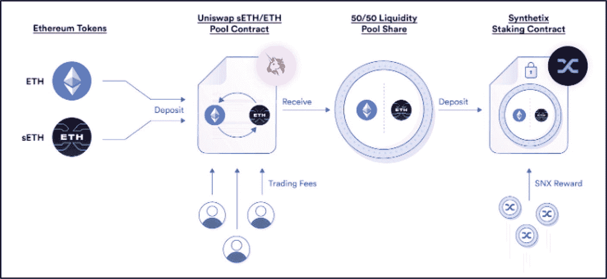

# 流动性挖矿风险

流动性挖矿虽然利润丰厚，但并非没有风险。当流动性池中两种代币的价格比率偏离存入时的比率时，就会发生无常损失（IL）——无论它们的法币价格是上涨还是下跌——最终 LP 头寸的价值会低于单纯持有这些代币。这两种价值之间的差额决定了损失的规模：差额越大，损失越大。

**专业提示**

对于提供极高 LP 收益率的项目要格外谨慎。这些通常与涉及小型、早期初创项目的代币对相关，这些项目市值极小，具有高风险和极高的波动性。

由于无常损失源于交易对内的波动性，因此包含至少一种稳定资产（`USDC`、`USDT`或`DAI`）的流动性池不易受到影响。类似地，对于由两种稳定币组成的流动性对，无常损失风险会进一步降低；然而，激励水平也会相应降低。在某些情况下，随着时间的推移，池内向流动性提供者提供的奖励有可能抵消无常损失，同时仍能提供利润。

**图 13-5**
Uniswap 去中心化交易所的流动性挖矿流程（来源：[`academy.shrimpy.io/lesson/what-is-liquidity-mining`](https://academy.shrimpy.io/lesson/what-is-liquidity-mining)）

### 优势

- **高收益潜力** – 投资者可以赚取高额的年化收益率（APY）。
- **低准入门槛** – 无需昂贵的硬件或软件。
- **支持项目** – 通过提供流动性，用户支持和促进了项目的成功。
- **接触新项目** – 流动性提供者可以从新兴的、有前景的项目中获得代币，这些代币的价值可能会随着时间的推移而增长。

### 劣势

- **无常损失风险** – 由于流动性池内代币价值的变化，可能导致重大损失。
- **拉地毯骗局** – 早期项目经常用高回报吸引流动性提供者。然而，有时欺诈团队会突然撤走所有流动性，让投资者持有毫无价值的代币。这种骗局通常被称为“拉地毯骗局”。
- **代码漏洞** – 流动性中存在的任何漏洞或代码缺陷都会给黑客可乘之机，可能导致流动性提供者遭受永久性损失。

